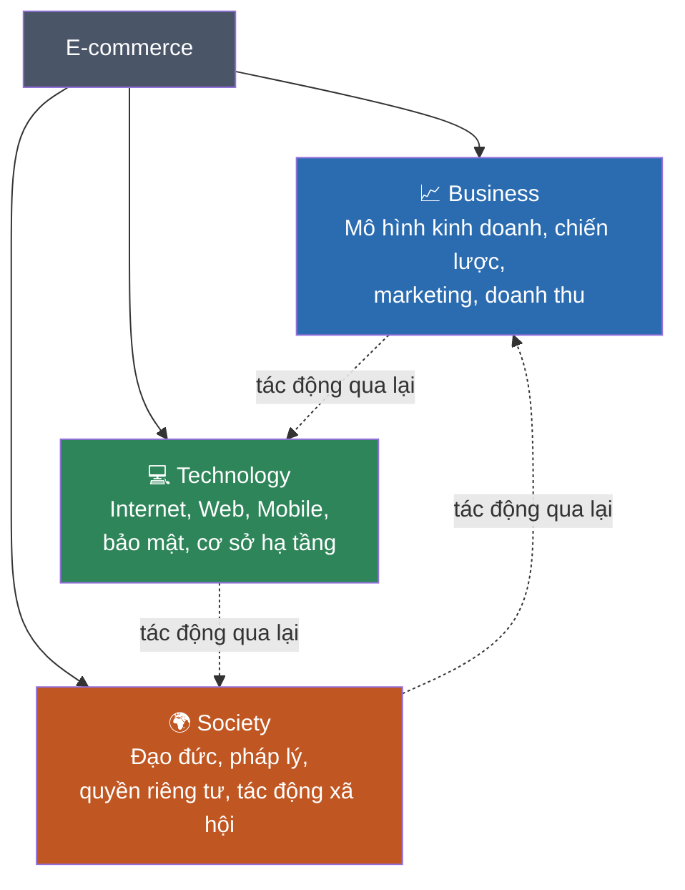
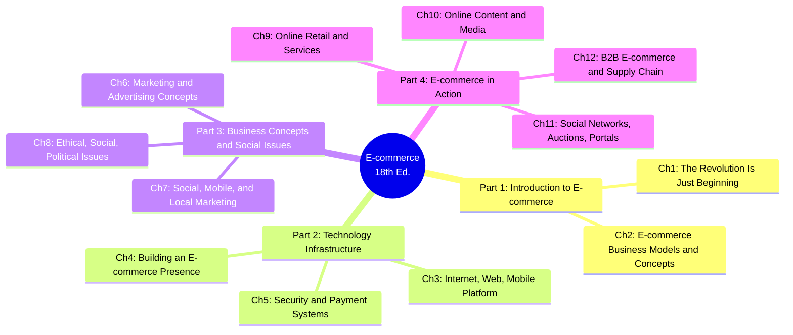
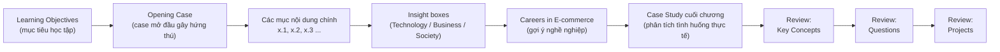

## 1. Thông tin chung về giáo trình

| Mục | Thông tin |
|---|---|
| Tên sách | *E-commerce: business. technology. society.* |
| Tác giả | Kenneth C. Laudon (New York University) & Carol Guercio Traver (Azimuth Interactive, Inc.) |
| Nhà xuất bản | Pearson Education, Inc. |
| Bản in | Seventeenth Edition (theo trang bìa/copyright) — bản PDF đang dùng được đặt tên "18th", Copyright © 2024, 2022, 2020 |
| ISBN | 978-0-13-792220-8 |
| Số trang | 834 trang (kể cả mục lục, index) |
| Cấu trúc | 4 Part lớn → 12 chương → mỗi chương có Review (Key Concepts / Questions / Projects / References) |

> Lưu ý nhỏ: trang bìa trong nội dung PDF ghi "Seventeenth Edition" nhưng tên file người dùng lưu là "18th" — có thể do khác biệt giữa bản in Mỹ và bản Global Edition. Nội dung kiến thức giữa các bản rất giống nhau nên không ảnh hưởng đến việc học.

Đây là giáo trình kinh điển và phổ biến nhất về **Thương mại điện tử (E-commerce)** ở bậc đại học/sau đại học khối ngành Kinh doanh — Công nghệ thông tin trên thế giới, được cập nhật hằng năm với các case study thời sự (TikTok, ChatGPT-era marketing, Web3, Metaverse, blockchain...).

## 2. Triết lý xuyên suốt: "Business. Technology. Society."

Điểm đặc biệt nhất của giáo trình này — cũng là tên phụ đề của sách — là cách tiếp cận e-commerce qua **3 lăng kính (three lenses)** luôn song hành ở mọi chương:

- **Business (Kinh doanh):** mô hình doanh thu, chiến lược, marketing, tài chính — e-commerce phải trả lời được câu hỏi "làm sao kiếm tiền?"
- **Technology (Công nghệ):** hạ tầng Internet/Web/Mobile, bảo mật, cơ sở dữ liệu, AI — công nghệ là nền tảng khiến các mô hình kinh doanh mới trở nên khả thi.
- **Society (Xã hội):** quyền riêng tư, đạo đức, pháp lý, tác động văn hóa — e-commerce không tồn tại trong chân không, nó định hình lại cách xã hội vận hành.

Mỗi chương trong sách (trừ vài chương thuần kỹ thuật hoặc thuần xã hội) đều cố gắng cân bằng cả 3 góc nhìn này — đây cũng là lý do phần tóm tắt trong bộ ghi chú của chúng ta luôn cố gắng gắn kiến thức kỹ thuật với ý nghĩa kinh doanh và hệ quả xã hội của nó.

## 3. Cấu trúc giáo trình: 4 Part — 12 Chương

| Part | Chủ đề | Chương | Ý tưởng chính |
|---|---|---|---|
| **1** | Nhập môn E-commerce | 1–2 | E-commerce là gì, lịch sử, các mô hình kinh doanh (B2C, B2B, C2C...) |
| **2** | Hạ tầng công nghệ | 3–5 | Internet/Web/Mobile hoạt động thế nào, xây website/app, bảo mật & thanh toán |
| **3** | Kinh doanh & vấn đề xã hội | 6–8 | Marketing/quảng cáo online, social-mobile-local marketing, đạo đức-pháp lý-chính trị |
| **4** | E-commerce trong thực tế | 9–12 | Bán lẻ online, nội dung/media số, social network-đấu giá-portal, B2B & chuỗi cung ứng |

**Mạch logic:** Part 1 trả lời "e-commerce là gì" → Part 2 trả lời "nó chạy trên nền tảng công nghệ nào" → Part 3 trả lời "làm sao kinh doanh với nó và nó gây ra vấn đề xã hội gì" → Part 4 áp dụng tất cả vào từng ngành cụ thể (bán lẻ, nội dung số, mạng xã hội, B2B).

## 4. Cấu trúc chuẩn của mỗi chương

Tất cả 12 chương trong sách đều theo đúng một khuôn mẫu — hiểu khuôn mẫu này giúp bạn đọc sách (và đọc bộ ghi chú của chúng ta) nhanh hơn nhiều:

- **Learning Objectives:** liệt kê 4-6 mục tiêu, tương ứng 1-1 với các mục x.1–x.6 trong chương.
- **Opening Case:** một câu chuyện thực tế (TikTok, Walmart, SolarWinds, Netflix...) minh họa chủ đề chương, thường được nhắc lại nhiều lần trong bài.
- **Insight on Technology / Business / Society:** 3 hộp mở rộng ứng với đúng 3 lăng kính đã nói ở mục 2.
- **Careers in E-commerce:** mô tả 1 vị trí công việc thật, kèm câu hỏi phỏng vấn mẫu — hữu ích nếu bạn định làm trong ngành.
- **Case Study:** phân tích sâu 1 công ty/tình huống, thường có câu hỏi thảo luận riêng.
- **Review (Key Concepts / Questions / Projects / References):** phần ôn tập — đây chính là phần chúng ta đã trả lời/giải quyết đầy đủ trong từng file `chapter-XX-*.md`.

## 5. Cách dùng bộ ghi chú này để học hiệu quả

1. Đọc **Chương 0** này trước để có bản đồ tổng thể — biết mình đang ở Part nào, chương nào liên quan đến chương nào.
2. Theo dõi tiến độ qua [00-checklist.md](00-checklist.md).
3. Với mỗi chương: đọc phần **"Tóm tắt & giải thích kiến thức"** trước (có sơ đồ Mermaid hỗ trợ hình dung), sau đó ôn lại bằng **Key Concepts**.
4. Tự làm thử phần **Questions** trước khi xem đáp án đã có sẵn — dùng để tự kiểm tra mức hiểu.
5. Phần **Projects** nên thực hành thật (không chỉ đọc) nếu mục tiêu là ứng dụng thực tế — bộ ghi chú đã hướng dẫn từng bước cụ thể.
6. Gợi ý lộ trình học theo đúng thứ tự Part 1 → 2 → 3 → 4 vì kiến thức có tính kế thừa (vd: hiểu hạ tầng công nghệ ở Part 2 sẽ giúp hiểu bảo mật thanh toán khi học Online Retail ở Part 4).

## 6. Bảng tra nhanh: chương nào nói về gì

| Bạn muốn biết về... | Xem chương |
|---|---|
| Mô hình kinh doanh, cách startup gọi vốn | 2 |
| Internet/Web hoạt động ra sao, mạng di động | 3 |
| Xây website/app cho doanh nghiệp | 4 |
| Bảo mật, mã hóa, thanh toán online | 5 |
| Quảng cáo online, định giá động, email marketing | 6 |
| Marketing qua mạng xã hội, mobile, định vị (local) | 7 |
| Quyền riêng tư, sở hữu trí tuệ, quy định pháp luật | 8 |
| Bán lẻ online, dịch vụ tài chính/du lịch online | 9 |
| Streaming, báo chí số, game, sáng tạo nội dung | 10 |
| Mạng xã hội, đấu giá online, portal | 11 |
| Thương mại B2B, chuỗi cung ứng, blockchain trong logistics | 12 |
