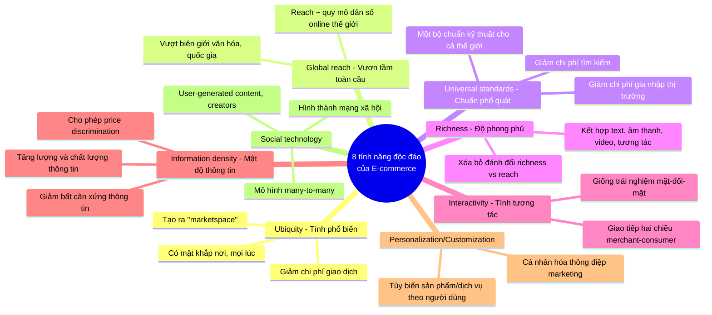
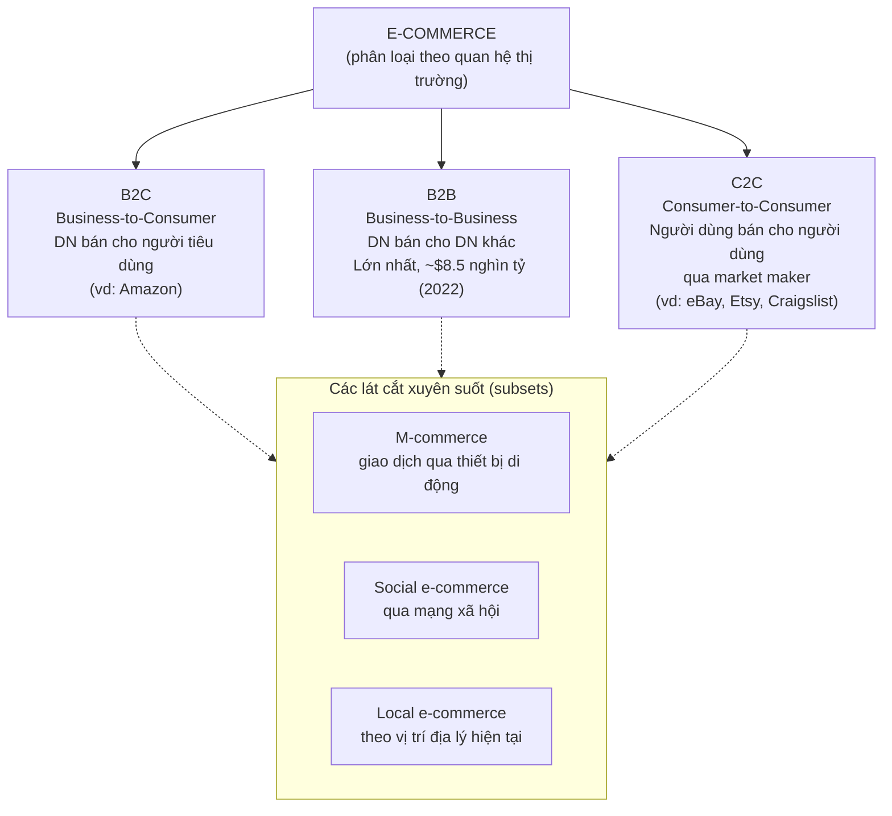
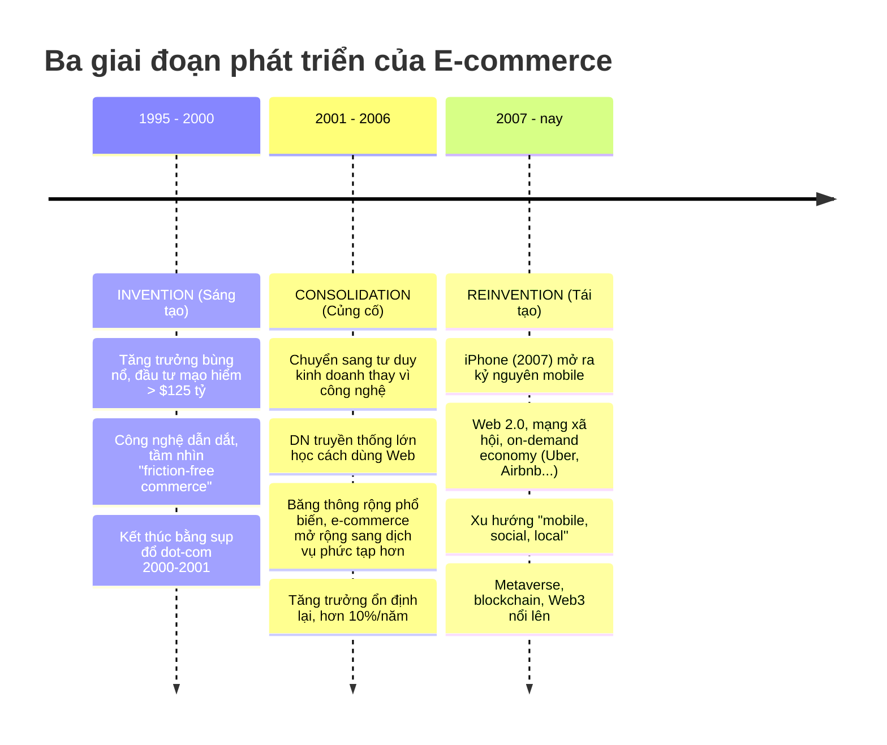

# Chương 1: The Revolution is Just Beginning (Cuộc cách mạng chỉ mới bắt đầu)

> Nguồn: *E-Commerce: Business, Technology and Society*, Laudon & Traver, 18th edition (2024), trang sách vật lý PDF 36–85.

## 1. Tóm tắt & giải thích kiến thức

### Case mở đầu: TikTok và nền kinh tế Creator (Creator Economy)

Chương mở đầu bằng ví dụ TikTok để minh họa cho làn sóng e-commerce mới nhất. Giữa những năm 2000, sự xuất hiện của **Web 2.0** (các ứng dụng/công nghệ cho phép tạo nội dung do người dùng tạo ra — user-generated content) cùng với smartphone đã tạo tiền đề cho mạng xã hội và những người gọi là **"creators"** (người sáng tạo nội dung). **Influencers** là một tập hợp con của creators — dùng mạng xã hội để gây ảnh hưởng đến quyết định mua hàng của người theo dõi, thường để đổi lấy tiền/quyền lợi. Ước tính có khoảng 200 triệu creators trên toàn cầu, hình thành hẳn một hệ sinh thái gọi là **creator economy** (nền kinh tế người sáng tạo).

Creators kiếm tiền qua nhiều cách: quảng cáo/tài trợ thương hiệu, bán nội dung số (kể cả NFT), tiền "tip" từ fan, quỹ hỗ trợ của nền tảng (TikTok Creator Fund, TikTok Pulse chia 50% doanh thu quảng cáo cho top 4% video). Tuy nhiên đa số creators kiếm rất ít tiền (gần một nửa creators toàn thời gian kiếm dưới $1,000/năm), công việc áp lực cao, và đối mặt bắt nạt/quấy rối trên mạng.

### 1.1 Tại sao nên học e-commerce (The First Five Minutes)

Ý tưởng chính: e-commerce mới chỉ trải qua **"năm phút đầu tiên"** của một cuộc cách mạng lớn hơn nhiều. Từ 1995 đến nay, công nghệ vẫn tiếp tục tiến hóa với tốc độ hàm mũ, tạo ra cơ hội cho doanh nhân xây mô hình kinh doanh mới, đồng thời phá vỡ (disrupt) và có thể phá hủy các mô hình/doanh nghiệp truyền thống. Sách dự đoán phần lớn hoạt động thương mại sẽ trở thành e-commerce vào khoảng năm 2050. Học e-commerce giúp hiểu được cơ hội và rủi ro của giai đoạn thay đổi cực nhanh này, đặc biệt sau đại dịch Covid-19.

### 1.2 Giới thiệu về E-commerce

**Định nghĩa e-commerce:** là các giao dịch thương mại được số hóa (digitally enabled commercial transactions) giữa và trong nội bộ các tổ chức, cá nhân — thực hiện qua Internet, Web, và ứng dụng/trình duyệt di động. Hai yếu tố cốt lõi:
- **Giao dịch được số hóa (digitally enabled transactions):** qua công nghệ số (Internet/Web/mobile).
- **Giao dịch thương mại (commercial transactions):** phải có **trao đổi giá trị (exchange of value)** — không có trao đổi giá trị thì không phải là commerce.

**E-commerce vs E-business:**
- **E-business:** việc số hóa các giao dịch/quy trình **nội bộ** trong một doanh nghiệp, dùng hệ thống thông tin do chính doanh nghiệp kiểm soát — không tạo doanh thu trực tiếp từ bên ngoài.
- **E-commerce:** giao dịch **vượt ranh giới tổ chức** (cross-organizational) và có trao đổi giá trị.
- Hai khái niệm này giao nhau ở đúng ranh giới của doanh nghiệp — nơi hệ thống nội bộ (e-business) kết nối với nhà cung cấp/khách hàng bên ngoài thì trở thành e-commerce.

**Ba nền tảng công nghệ cốt lõi (technological building blocks):**
1. **Internet:** mạng lưới toàn cầu của các mạng máy tính, dựa trên chuẩn chung; ra đời cuối thập niên 1960.
2. **World Wide Web (Web):** một hệ thống thông tin chạy trên nền Internet, cung cấp truy cập tới hàng nghìn tỷ trang HTML; ra đời đầu thập niên 1990 — là "killer app" đầu tiên biến Internet thành thương mại. Có "surface Web" (được Google index) và "deep Web" (lớn hơn 500-1000 lần, gồm cơ sở dữ liệu, nội dung có phí, nội dung mã hóa).
3. **Mobile platform (nền tảng di động):** khả năng truy cập Internet qua smartphone, tablet... Từ iPhone (2007), thiết bị di động dần thay thế desktop/browser làm phương thức truy cập Internet phổ biến nhất (93% người dùng Internet Mỹ dùng thiết bị di động ít nhất một phần thời gian, năm 2022).

**Xu hướng lớn hiện nay (Bảng 1.1):** chia theo 3 góc nhìn — Kinh doanh (tăng trưởng mạnh mọi loại hình e-commerce, mobile app ecosystem, social/local commerce, B2B khổng lồ, creator economy), Công nghệ (mobile platform, cloud computing, IoT, big data/business analytics, AI, blockchain, metaverse), Xã hội (UGC bùng nổ, lo ngại quyền riêng tư, độc quyền Big Tech — Amazon/Google/Meta, tranh chấp bản quyền, giám sát của chính phủ, an ninh mạng suy giảm).

### 1.3 Tám tính năng độc đáo của công nghệ E-commerce

Trước e-commerce, marketing là mass-marketing một chiều, người tiêu dùng bị giới hạn bởi ranh giới địa lý/xã hội, và tồn tại **information asymmetry** (bất cân xứng thông tin — sự chênh lệch thông tin thị trường liên quan giữa các bên trong giao dịch) có lợi cho người bán. Công nghệ e-commerce thay đổi hoàn toàn cục diện này qua 8 đặc điểm sau:

Giải thích chi tiết từng tính năng:

- **Ubiquity (tính phổ biến):** e-commerce có mặt khắp nơi, mọi lúc — không còn giới hạn bởi **marketplace** (nơi vật lý để giao dịch) mà tạo ra **marketspace** (thị trường mở rộng, thoát khỏi ranh giới thời gian/địa lý). Giảm **transaction costs** (chi phí giao dịch) và "cognitive energy" (nỗ lực tinh thần) cần bỏ ra để mua sắm.
- **Global reach (vươn tầm toàn cầu):** giao dịch vượt biên giới văn hóa/khu vực/quốc gia dễ dàng và rẻ hơn thương mại truyền thống rất nhiều. **Reach** = tổng số người dùng/khách hàng mà một doanh nghiệp e-commerce có thể tiếp cận — về lý thuyết gần bằng quy mô dân số dùng Internet toàn cầu (hơn 4.5 tỷ năm 2022).
- **Universal standards (chuẩn phổ quát):** chuẩn kỹ thuật của Internet được chia sẻ bởi mọi quốc gia (khác với TV/radio/di động vốn có chuẩn khác nhau từng nước). Giúp giảm chi phí gia nhập thị trường (market entry costs) cho người bán, giảm chi phí tìm kiếm (search costs) cho người mua, và tạo ra network externalities (ngoại ứng mạng lưới).
- **Richness (độ phong phú thông tin):** độ phức tạp và nội dung của thông điệp. Trước Web luôn có sự đánh đổi giữa richness và reach (càng nhiều người nghe/xem thì thông điệp càng đơn giản). E-commerce phá vỡ đánh đổi này — có thể gửi thông điệp giàu nội dung (chat, video) tới lượng lớn khách hàng.
- **Interactivity (tính tương tác):** cho phép giao tiếp hai chiều giữa người bán và người mua, và giữa người mua với nhau — giống trải nghiệm mặt-đối-mặt (trừ điện thoại, chưa công nghệ thương mại thế kỷ 20 nào làm được).
- **Information density (mật độ thông tin):** tăng cả lượng và chất thông tin sẵn có cho mọi bên tham gia thị trường, đồng thời giảm chi phí thu thập/lưu trữ/xử lý thông tin. Hệ quả kinh doanh: giảm information asymmetry, tăng **price transparency** (minh bạch giá) và **cost transparency** (minh bạch chi phí), nhưng đồng thời cho phép người bán **price discrimination** (phân biệt giá — bán cùng sản phẩm với giá khác nhau cho từng nhóm khách hàng).
- **Personalization và Customization:** *personalization* là nhắm thông điệp marketing tới từng cá nhân cụ thể (theo tên, sở thích, lịch sử mua hàng); *customization* là thay đổi sản phẩm/dịch vụ được giao dựa trên sở thích/hành vi trước đó của người dùng.
- **Social technology (công nghệ xã hội):** khác các phương tiện truyền thông đại chúng trước đây (mô hình one-to-many như báo/đài/TV), e-commerce tạo ra mô hình **many-to-many** — người dùng tự tạo và phân phối nội dung (UGC — user-generated content), hình thành mạng xã hội và creator economy.

### 1.4 Các loại hình E-commerce

Phân loại chủ yếu dựa trên **bản chất mối quan hệ thị trường — ai bán cho ai**. Mobile, social, local e-commerce được xem là các tập con cắt ngang các loại hình chính này.

- **B2C (Business-to-Consumer):** doanh nghiệp trực tuyến bán cho người tiêu dùng cá nhân — loại hình phổ biến nhất mà người dùng gặp. Gồm 7 mô hình kinh doanh chi tiết ở Chương 2 (online retailers, service providers, transaction brokers, content providers, community providers/social networks, market creators, portals). Doanh thu B2C Mỹ 2022 ước tính $1.3 nghìn tỷ, dự kiến tăng >10%/năm, nhưng bán lẻ e-commerce mới chiếm ~15% tổng thị trường bán lẻ $7 nghìn tỷ — còn nhiều dư địa tăng trưởng.
- **B2B (Business-to-Business):** doanh nghiệp bán cho doanh nghiệp khác — **loại hình lớn nhất**, ước tính $8.5 nghìn tỷ tại Mỹ năm 2022 (gấp ~7 lần B2C). Hai mô hình chính: B2B e-commerce marketplaces (e-distributors, e-procurement, exchanges, industry consortia) và private B2B networks.
- **C2C (Consumer-to-Consumer):** người tiêu dùng bán cho người tiêu dùng khác nhờ một **online market maker/platform provider** (cung cấp catalog, công cụ tìm kiếm, xử lý thanh toán). Ví dụ: eBay, Craigslist, Etsy (tiên phong); Amazon third-party sellers, Facebook Marketplace, Poshmark... Ước tính >$200 tỷ tại Mỹ (2022).
- **M-commerce (Mobile e-commerce):** dùng thiết bị di động để thực hiện giao dịch trực tuyến qua mạng di động/không dây. Ước tính $500 tỷ (2022), tăng >12%/năm.
- **Social e-commerce:** e-commerce được kích hoạt bởi mạng xã hội và quan hệ xã hội trực tuyến (social sign-on, network notification, nút Buy/Shopping tab trên Facebook, Instagram, TikTok...). Ước tính $55 tỷ (2022).
- **Local e-commerce:** tập trung vào việc tiếp cận người dùng dựa trên vị trí địa lý hiện tại — được thúc đẩy bởi bùng nổ dịch vụ theo yêu cầu (on-demand) như Uber, Instacart, DoorDash. Ước tính >$150 tỷ (2022).

### 1.5 E-commerce: Lịch sử tóm lược

E-commerce (theo định nghĩa hiện đại gắn liền Internet) được tính bắt đầu từ **1995**, sau khi banner quảng cáo đầu tiên xuất hiện trên Hotwired.com (cuối 1994) và Netscape/Infoseek bắt đầu bán không gian quảng cáo banner (đầu 1995). Trước đó có các tiền thân: hệ thống đặt hàng qua modem của Baxter Healthcare (B2B, cuối 1970s), chuẩn EDI (Electronic Data Interchange, 1980s), và Minitel (Pháp, hệ thống videotext B2C lớn đầu tiên, 1981–2006).

**Giai đoạn 1 — Invention (1995–2000):** tăng trưởng và sáng tạo bùng nổ, bán các sản phẩm bán lẻ đơn giản (băng thông chưa đủ cho sản phẩm phức tạp). Được cấp vốn bởi >$125 tỷ đầu tư mạo hiểm. Tầm nhìn thời kỳ này (của các nhà kinh tế học) là **friction-free commerce** — thị trường cạnh tranh gần hoàn hảo, thông tin phân bổ đều, chi phí giao dịch/tìm kiếm giảm mạnh, **disintermediation** (loại bỏ trung gian — nhà sản xuất bán trực tiếp cho người tiêu dùng, các trung gian phân phối/bán buôn truyền thống biến mất) sẽ xảy ra. Doanh nhân thì kỳ vọng **first mover advantage** (lợi thế người đi đầu) và **network effect** (hiệu ứng mạng — giá trị tăng khi càng nhiều người dùng cùng công nghệ, được lượng hóa bởi Metcalfe's Law). Giai đoạn kết thúc bằng "dot-com crash" 2000–2001.

**Giai đoạn 2 — Consolidation (2001–2006):** thời kỳ nhìn lại và đánh giá lại; trọng tâm chuyển từ công nghệ sang kinh doanh thực chất (lợi nhuận thay vì chỉ tăng lượng truy cập); doanh nghiệp truyền thống lớn tham gia mạnh; tài trợ vốn mạo hiểm co lại, tài chính ngân hàng truyền thống (dựa trên lợi nhuận) quay lại. E-commerce mở rộng sang dịch vụ phức tạp hơn (du lịch, tài chính) nhờ băng thông rộng phổ biến.

**Giai đoạn 3 — Reinvention (2007–nay):** khởi đầu bằng iPhone (2007), cùng Web 2.0, sự phổ biến thiết bị di động, mở rộng sang local commerce và nền kinh tế dịch vụ theo yêu cầu (on-demand, nhờ app + cloud computing). Đặc trưng "mobile, social, local". Gần đây thêm metaverse và Web3/blockchain.

**Đánh giá thành công/thất bại/bất ngờ:** Về công nghệ, e-commerce là thành công vang dội (hạ tầng số vững chắc, tăng trưởng bền vững). Về kinh doanh là kết quả hỗn hợp: đa số công ty dot-com thời kỳ đầu đã biến mất, doanh số ngày càng tập trung vào số ít "ông lớn" (top 10 nhà bán lẻ chiếm ~63% thị phần 2022) trái với kỳ vọng cạnh tranh hoàn hảo của kinh tế học; **friction-free commerce** không thành hiện thực hoàn toàn (vẫn có price dispersion, brand vẫn quan trọng); **disintermediation** không loại bỏ hết trung gian mà tạo ra **trung gian mới** (Amazon, Expedia, Travelocity...); **first-mover advantage** chỉ thành công với số ít công ty (Google, Facebook, Amazon, eBay) — nhiều first mover đã thất bại (eToys, Webvan, FogDog, Eve.com). Bất ngờ không ai lường trước: tác động của nền tảng di động, tăng trưởng nhanh của mạng xã hội, và sự nổi lên của e-commerce "theo yêu cầu" (on-demand).

### 1.6 Hiểu về E-commerce: Ba chủ đề tổ chức

Sách tổ chức toàn bộ nội dung theo 3 chủ đề lớn, liên quan mật thiết với nhau, theo tiến trình lịch sử: công nghệ phát triển trước → khai thác thương mại → phát sinh vấn đề xã hội cần giải quyết.

- **Technology (Công nghệ — hạ tầng):** hiểu biết nền tảng về Internet, Web, mobile platform và các công nghệ bổ trợ (cloud computing, packet-switching, TCP/IP, HTML5, CSS, cơ sở dữ liệu quan hệ/phi quan hệ...).
- **Business (Kinh doanh — khái niệm cơ bản):** công nghệ chỉ là hạ tầng; chính các ứng dụng kinh doanh (tiềm năng lợi nhuận vượt trội) mới tạo ra sự hấp dẫn của e-commerce. Cần hiểu digital markets, digital goods, business models, value chain, industry structure, digital disruption, hành vi tiêu dùng số.
- **Society (Xã hội — thuần hóa "gã khổng lồ"):** với hơn 4.5 tỷ người dùng Internet toàn cầu, e-commerce có tác động xã hội sâu rộng. Ba vấn đề xã hội chính: **quyền riêng tư cá nhân (individual privacy)**, **sở hữu trí tuệ (intellectual property)**, và **chính sách công (public policy)** (bình đẳng truy cập, quản lý nội dung, thuế...).

### 1.7 Nghề nghiệp trong E-commerce

Sách minh họa bằng một tin tuyển dụng mẫu vị trí **Category Specialist trong chương trình E-commerce Retail** tại một nhà bán lẻ lớn đang mở rộng omnichannel. Công việc: quản lý hiệu suất danh mục sản phẩm trên website/app, cải thiện trải nghiệm tìm kiếm/duyệt sản phẩm, tối ưu giá, phân tích xu hướng, phối hợp liên phòng ban (marketing, CRM, supply chain). Yêu cầu: bằng cử nhân, tư duy khởi nghiệp, kỹ năng phân tích/giao tiếp/đàm phán. Sách kèm gợi ý chuẩn bị phỏng vấn (nghiên cứu công ty, ôn lại mục 1.2–1.4) và 7 câu hỏi phỏng vấn mẫu cùng gợi ý trả lời (thách thức omnichannel, mở rộng mobile/social, cạnh tranh với Amazon, dùng mạng xã hội để branding, vấn đề quyền riêng tư dữ liệu khách hàng, tiềm năng tăng trưởng kênh online, kinh nghiệm cá nhân làm website/app).

### 1.8 Case Study: Uber — "Mọi thứ theo yêu cầu" (Everything on Demand)

Uber đại diện cho mô hình **on-demand service** — khác mô hình bán lẻ truyền thống: Uber không bán hàng hóa mà xây dựng nền tảng app/cloud kết nối người cần dịch vụ taxi với người có nguồn lực (xe, thời gian). Lưu ý: cách gọi "sharing economy" là **sai lệch** vì tài xế thực chất đang **bán** dịch vụ lái xe, và bản thân Uber thu **20% hoa hồng** mỗi giao dịch — Uber cũng không phải "peer-to-peer" thuần túy vì luôn có trung gian (Uber) ăn phần trăm.

**Giá trị mang lại:** cho khách hàng — giá ước tính trước, theo dõi tài xế theo thời gian thực, đa dạng phương thức thanh toán, hệ thống đánh giá 5 sao hai chiều; cho tài xế — tự do chọn giờ làm việc. Uber hiện hoạt động ở ~10,000 thành phố, 72 quốc gia, ~4 triệu tài xế, ~115 triệu người dùng/tháng.

**Mô hình kinh doanh hiệu quả hơn taxi truyền thống** vì Uber đẩy toàn bộ chi phí vận hành (xe, xăng, bảo hiểm, bảo trì) sang tài xế, phân loại tài xế là **nhà thầu độc lập (independent contractors/"gig workers")** chứ không phải nhân viên — tránh phải trả bảo hiểm xã hội, lương tối thiểu, bảo hiểm y tế...

**Vấn đề đạo đức & xã hội:** tranh chấp pháp lý về phân loại tài xế là nhà thầu độc lập; bị cấm/hạn chế ở nhiều thành phố châu Âu (bị Tòa án Công lý EU phán quyết phải tuân thủ luật vận tải như dịch vụ taxi thông thường); lo ngại về "uberization" of work (việc làm bán thời gian, lương thấp, không phúc lợi thay thế việc làm toàn thời gian ổn định); bê bối quản trị (chương trình Greyball né tránh cơ quan quản lý, quấy rối nơi làm việc, xâm phạm quyền riêng tư định vị khách hàng, rò rỉ dữ liệu). Uber đã IPO năm 2019 (định giá ~$82 tỷ, thấp hơn kỳ vọng $120 tỷ ban đầu), liên tục thua lỗ, và đã mở rộng sang Uber Eats (giao đồ ăn) và Uber Freight (logistics) để trở thành "Amazon của ngành vận tải".

---

## 2. Key Concepts

### Theo từng Learning Objective (đúng cấu trúc mục "1.9 Review – Key Concepts" trong sách)

**1. Hiểu tại sao cần học e-commerce**
- 5-10 năm tới mang lại cơ hội (và rủi ro) lớn cho doanh nghiệp mới lẫn truyền thống trong việc khai thác công nghệ số để tạo lợi thế thị trường.

**2. Định nghĩa e-commerce, phân biệt với e-business, nhận diện nền tảng công nghệ, và các chủ đề hiện tại**
- E-commerce là giao dịch thương mại được số hóa giữa/trong các tổ chức và cá nhân.
- E-business là việc số hóa giao dịch/quy trình **nội bộ** doanh nghiệp, không bao gồm giao dịch thương mại vượt ranh giới tổ chức có trao đổi giá trị.
- Ba trụ cột công nghệ: Internet, Web, mobile platform.
- Xu hướng kinh doanh: mọi loại hình e-commerce đều tăng trưởng mạnh. Xu hướng công nghệ: mobile platform bùng nổ mạnh mẽ. Xu hướng xã hội: quyền riêng tư, giám sát chính phủ, bảo vệ sở hữu trí tuệ, an ninh mạng.

**3. Nhận diện & mô tả các tính năng độc đáo của công nghệ e-commerce**
- 8 tính năng: ubiquity, global reach, universal standards, richness, interactivity, information density, personalization/customization, social technology (chi tiết ở Mục 1 trên).

**4. Mô tả các loại hình e-commerce chính**
- 6 loại: B2C, B2B, C2C, M-commerce, Social e-commerce, Local e-commerce.

**5. Hiểu sự tiến hóa của e-commerce từ những năm đầu đến nay**
- 3 giai đoạn: Invention (thành công công nghệ, thành công kinh doanh hỗn hợp) → Consolidation (2001–2006) → Reinvention (từ 2007, nhờ mobile platform, mạng xã hội, Web 2.0).

**6. Mô tả các chủ đề lớn nền tảng cho việc nghiên cứu e-commerce**
- Technology (hạ tầng công nghệ), Business (khái niệm kinh doanh), Society (áp lực lên xã hội đương đại — chủ yếu là sở hữu trí tuệ, quyền riêng tư, chính sách công).

### Bảng thuật ngữ chính (key terms định nghĩa trong chương)

| Thuật ngữ | Giải thích ngắn gọn |
|---|---|
| **e-commerce** | Giao dịch thương mại được số hóa (digitally enabled) giữa/trong các tổ chức và cá nhân, qua Internet/Web/mobile. |
| **e-business** | Việc số hóa giao dịch/quy trình nội bộ doanh nghiệp, dùng hệ thống do chính doanh nghiệp kiểm soát. |
| **Internet** | Mạng lưới toàn cầu của các mạng máy tính, xây trên chuẩn chung. |
| **World Wide Web (Web)** | Hệ thống thông tin chạy trên nền Internet, cho phép truy cập hàng nghìn tỷ trang web. |
| **mobile platform** | Khả năng truy cập Internet từ các thiết bị di động (smartphone, tablet, laptop siêu nhẹ...). |
| **information asymmetry** | Sự chênh lệch thông tin thị trường liên quan giữa các bên trong một giao dịch. |
| **marketplace** | Không gian vật lý mà bạn phải đến để giao dịch. |
| **ubiquity** | Có mặt khắp nơi, mọi lúc — đặc tính của e-commerce. |
| **marketspace** | Thị trường mở rộng vượt ranh giới truyền thống, thoát khỏi giới hạn thời gian/địa lý. |
| **reach** | Tổng số người dùng/khách hàng mà một doanh nghiệp e-commerce có thể tiếp cận được. |
| **universal standards** | Chuẩn kỹ thuật được chia sẻ bởi tất cả các quốc gia trên thế giới. |
| **richness** | Độ phức tạp và nội dung của một thông điệp. |
| **interactivity** | Công nghệ cho phép giao tiếp hai chiều giữa người bán và người mua, và giữa người mua với nhau. |
| **information density** | Tổng lượng và chất lượng thông tin sẵn có cho mọi bên tham gia thị trường. |
| **personalization** | Nhắm thông điệp marketing tới từng cá nhân cụ thể, dựa trên tên/sở thích/lịch sử mua hàng. |
| **customization** | Thay đổi sản phẩm/dịch vụ được giao dựa trên sở thích hoặc hành vi trước đó của người dùng. |
| **business-to-consumer (B2C) e-commerce** | Doanh nghiệp trực tuyến bán cho người tiêu dùng cá nhân. |
| **business-to-business (B2B) e-commerce** | Doanh nghiệp trực tuyến bán cho doanh nghiệp khác. |
| **consumer-to-consumer (C2C) e-commerce** | Người tiêu dùng bán cho người tiêu dùng khác, có sự hỗ trợ của một online market maker. |
| **mobile e-commerce (m-commerce)** | Dùng thiết bị di động để thực hiện giao dịch trực tuyến. |
| **social e-commerce** | E-commerce được kích hoạt bởi mạng xã hội và các mối quan hệ xã hội trực tuyến. |
| **local e-commerce** | E-commerce tập trung vào việc tiếp cận người tiêu dùng dựa trên vị trí địa lý hiện tại của họ. |
| **disintermediation** | Sự loại bỏ các trung gian thị trường truyền thống, thay bằng quan hệ trực tiếp mới giữa nhà sản xuất và người tiêu dùng. |
| **friction-free commerce** | Tầm nhìn về thương mại nơi thông tin phân bổ đều, chi phí giao dịch thấp, giá điều chỉnh linh hoạt theo nhu cầu thực, trung gian suy giảm, và lợi thế cạnh tranh không công bằng bị loại bỏ. |
| **first mover** | Doanh nghiệp đầu tiên gia nhập một lĩnh vực cụ thể và nhanh chóng chiếm thị phần. |
| **network effect** | Xảy ra khi mọi người dùng đều nhận được giá trị từ việc tất cả cùng sử dụng chung một công cụ/sản phẩm. |
| **Web 2.0** | Tập hợp các ứng dụng và công nghệ cho phép tạo ra nội dung do người dùng tạo (user-generated content). |

---

## 3. Questions

**1. What is e-commerce? How does it differ from e-business? Where does it intersect with e-business?**
E-commerce là các giao dịch thương mại được số hóa giữa và trong nội bộ các tổ chức và cá nhân — thực hiện qua Internet, Web, và ứng dụng/trình duyệt di động, và bắt buộc phải có trao đổi giá trị (exchange of value). E-business là việc số hóa các giao dịch/quy trình **nội bộ** trong một doanh nghiệp, sử dụng hệ thống thông tin do chính doanh nghiệp kiểm soát; e-business không bao gồm các giao dịch thương mại vượt ranh giới tổ chức. Hai khái niệm giao nhau đúng tại ranh giới của doanh nghiệp — nơi hệ thống nội bộ (e-business) kết nối với nhà cung cấp hoặc khách hàng bên ngoài; ứng dụng e-business trở thành e-commerce chính xác vào thời điểm có trao đổi giá trị xảy ra (xem Hình 1.1).

**2. What is information asymmetry?**
Là bất kỳ sự chênh lệch nào về thông tin thị trường liên quan giữa các bên trong một giao dịch (ví dụ: người bán biết về giá vốn/chất lượng sản phẩm nhiều hơn người mua).

**3. What are some of the unique features of e-commerce technology?**
Tám tính năng: ubiquity (tính phổ biến), global reach (vươn tầm toàn cầu), universal standards (chuẩn phổ quát), richness (độ phong phú), interactivity (tính tương tác), information density (mật độ thông tin), personalization/customization (cá nhân hóa/tùy biến), social technology (công nghệ xã hội).

**4. What is a marketspace?**
Là một thị trường được mở rộng vượt ra khỏi ranh giới truyền thống, thoát khỏi giới hạn về thời gian và địa lý — hệ quả trực tiếp của tính "ubiquity" của e-commerce.

**5. What are three benefits of universal standards?**
(1) Giảm chi phí gia nhập thị trường (market entry costs) cho người bán; (2) giảm chi phí tìm kiếm (search costs) cho người mua; (3) giúp việc khám phá giá (price discovery) trở nên đơn giản, nhanh và chính xác hơn nhờ tạo ra một marketspace thống nhất toàn cầu (đồng thời còn tạo ra network externalities — ngoại ứng mạng lưới).

**6. Compare online and traditional transactions in terms of richness.**
Thị trường truyền thống (bán hàng trực tiếp, cửa hàng bán lẻ) có độ "richness" rất cao vì cung cấp dịch vụ trực tiếp, sử dụng tín hiệu thị giác/thính giác, nhưng đổi lại "reach" (độ vươn tới) bị giới hạn — trước khi có Web luôn tồn tại sự đánh đổi giữa richness và reach (thông điệp càng tiếp cận nhiều người thì càng kém phong phú). Công nghệ e-commerce (chat trực tuyến, video, tương tác cá nhân hóa) cho phép đạt được độ richness cao gần bằng giao tiếp trực tiếp, đồng thời vẫn tiếp cận được lượng khán giả rất lớn — xóa bỏ phần lớn sự đánh đổi truyền thống này.

**7. Name three of the business consequences that can result from growth in information density.**
(1) Giảm bất cân xứng thông tin (information asymmetry) giữa người tiêu dùng và người bán, giá cả/chi phí trở nên minh bạch hơn (price/cost transparency); (2) người bán có thể phân khúc thị trường và thực hiện price discrimination — bán cùng một sản phẩm cho các nhóm khách hàng khác nhau với giá khác nhau; (3) người bán có khả năng phân biệt hóa sản phẩm tốt hơn về chi phí, thương hiệu và chất lượng.

**8. What is Web 2.0? Give examples of Web 2.0 websites or apps, and explain why you included them in your list.**
Web 2.0 là tập hợp các ứng dụng và công nghệ cho phép tạo ra nội dung do người dùng tạo ra (user-generated content). Ví dụ từ chính chương sách: TikTok, Facebook, Instagram, YouTube, Twitter, Pinterest, Snapchat — tất cả đều đưa vào danh sách này vì đặc điểm chung là cho phép người dùng thường (không chỉ chuyên gia/nhà sản xuất nội dung chuyên nghiệp) tự tạo, chia sẻ và phân phối nội dung (video, ảnh, bài viết) trên quy mô lớn, khác với mô hình phát sóng một chiều (broadcast) của báo/đài/TV truyền thống.

**9. Give examples, besides those listed in the chapter materials, of B2C, B2B, C2C, and social, mobile, and local e-commerce.**
Đây là câu hỏi mở yêu cầu tự liên hệ ví dụ ngoài sách (không có đáp án cố định trong sách); một số ví dụ hợp lý: B2C — Nike.com bán trực tiếp cho người tiêu dùng; B2B — Alibaba.com kết nối nhà sản xuất với doanh nghiệp mua sỉ; C2C — Facebook Marketplace, Chợ Tốt; Social e-commerce — mua hàng qua livestream TikTok Shop; M-commerce — đặt đồ ăn qua app di động (Grab, ShopeeFood); Local e-commerce — đặt xe/giao hàng theo vị trí hiện tại (Grab, Gojek).

**10. How are e-commerce technologies similar to or different from other technologies that have changed commerce in the past?**
Giống: cũng giống như radio, TV, điện thoại trước đây, e-commerce là một công nghệ mới làm thay đổi cách tiếp cận và giao tiếp với thị trường. Khác: không công nghệ thương mại nào trước đây hội tụ đủ cả 8 đặc tính cùng lúc — radio/TV có reach rộng nhưng chỉ one-to-many (không tương tác); điện thoại có tính tương tác nhưng chỉ one-to-one (không phải phương tiện truyền thông đại chúng); chỉ e-commerce mới tạo ra mô hình many-to-many, đồng thời có ubiquity, universal standards toàn cầu, và mật độ thông tin/khả năng cá nhân hóa chưa từng có.

**11. Describe the three different stages in the evolution of e-commerce.**
(1) **Invention (1995–2000):** giai đoạn sáng tạo/tầm nhìn/thử nghiệm bùng nổ, được cấp vốn mạnh bởi venture capital, tập trung bán lẻ sản phẩm đơn giản, kết thúc bằng sụp đổ dot-com 2000–2001. (2) **Consolidation (2001–2006):** giai đoạn củng cố, chuyển từ tư duy công nghệ sang tư duy kinh doanh thực chất, doanh nghiệp truyền thống lớn tham gia mạnh, mở rộng sang dịch vụ phức tạp hơn (du lịch, tài chính) nhờ băng thông rộng. (3) **Reinvention (2007–hiện tại):** khởi động bởi iPhone, đặc trưng bởi mobile, social, local e-commerce, Web 2.0, và các dịch vụ theo yêu cầu (on-demand).

**12. Define disintermediation, and explain the benefits to Internet users of such a phenomenon. How does disintermediation impact friction-free commerce?**
Disintermediation là sự loại bỏ các trung gian thị trường (middlemen) — vốn là những bên trung gian truyền thống giữa nhà sản xuất và người tiêu dùng — thay bằng một mối quan hệ trực tiếp mới giữa nhà sản xuất và người tiêu dùng. Lợi ích cho người dùng Internet: giá thấp hơn (không phải trả thêm phí trung gian), tiếp cận trực tiếp nhà sản xuất/nội dung gốc. Về mặt lý thuyết, disintermediation là một phần cấu thành của tầm nhìn "friction-free commerce" (giảm chi phí giao dịch, loại bỏ các bên trung gian "không thêm nhiều giá trị nhưng vẫn thu phí"). Tuy nhiên trong thực tế, disintermediation đã không xảy ra hoàn toàn như kỳ vọng — thay vào đó, e-commerce lại tạo ra các trung gian mới (Amazon, eBay, Expedia, Travelocity...), khiến tầm nhìn friction-free commerce không được hiện thực hóa trọn vẹn.

**13. What are some of the major advantages and disadvantages of being a first mover?**
Lợi thế: xây dựng nhanh một lượng khách hàng lớn, tạo dựng nhận diện thương hiệu sớm, tạo ra kênh phân phối hoàn toàn mới, dựng "chi phí chuyển đổi" (switching costs) cho khách hàng qua giao diện/tính năng độc quyền, có thể tạo ra network effect và gần như độc quyền thị trường. Bất lợi: về mặt lịch sử, first mover thường lại là người thua cuộc dài hạn — nhiều first mover trong e-commerce đã thất bại (eToys, FogDog, Webvan, Eve.com) vì bị các "fast follower" có nguồn lực tài chính/marketing/pháp lý/sản xuất tốt hơn vượt mặt; chi phí thu hút và giữ chân khách hàng ban đầu (customer acquisition) có thể rất cao.

**14. What is a network effect, and why is it valuable?**
Network effect xảy ra khi tất cả người dùng đều nhận được giá trị từ việc mọi người khác cũng sử dụng chung một công cụ/sản phẩm (ví dụ: hệ điều hành phổ biến, chuẩn tin nhắn tức thời). Nó có giá trị vì giá trị của mạng lưới tăng theo (được lượng hóa bởi Metcalfe's Law — giá trị mạng lưới tăng theo bình phương số người tham gia), tạo ra hiệu ứng khóa chặt người dùng (lock-in) và có thể giúp doanh nghiệp đạt vị thế gần độc quyền.

**15. Discuss the ways in which the early years of e-commerce can be considered both a success and a failure.**
**Thành công:** về công nghệ, hạ tầng số phát triển trong những năm đầu đủ vững chắc để duy trì tăng trưởng vượt bậc trong nhiều thập kỷ sau — số giao dịch e-commerce tăng từ vài nghìn lên hàng tỷ mỗi năm, hạ tầng Internet "scale" rất tốt. **Thất bại/hỗn hợp về kinh doanh:** chỉ một tỷ lệ rất nhỏ các công ty dot-com thời kỳ đầu còn tồn tại độc lập (đa số đã phá sản); tầm nhìn "friction-free commerce" của các nhà kinh tế học không thành hiện thực hoàn toàn (giá vẫn phân tán — price dispersion, thương hiệu vẫn rất quan trọng); mô hình "cạnh tranh hoàn hảo" không xảy ra (bất cân xứng thông tin vẫn liên tục được tạo ra); dự đoán về disintermediation không đúng (trung gian mới xuất hiện); lợi thế first-mover chỉ thành công với một nhóm rất nhỏ công ty (Google, Facebook, Amazon, eBay), còn lại phần lớn thất bại.

**16. What are five of the major differences between the early years of e-commerce and today's e-commerce?**
Theo Bảng 1.4, năm khác biệt tiêu biểu: (1) Giai đoạn đầu do công nghệ dẫn dắt (technology driven), ngày nay công nghệ di động thúc đẩy e-commerce xã hội/địa phương/di động (mobile technology enables social, local, mobile e-commerce). (2) Giai đoạn đầu chú trọng tăng trưởng doanh thu, ngày nay chú trọng lượng khán giả và kết nối mạng xã hội. (3) Giai đoạn đầu là tài trợ vốn mạo hiểm thuần túy, ngày nay vốn mạo hiểm quay trở lại kèm hoạt động mua lại (buy-out) các startup bởi công ty lớn. (4) Giai đoạn đầu gần như không bị quản lý (ungoverned), ngày nay có sự giám sát mở rộng của chính phủ. (5) Giai đoạn đầu tin vào thị trường hoàn hảo (perfect markets), ngày nay vẫn tồn tại các khiếm khuyết thị trường và cạnh tranh kiểu hàng hóa (commodity competition) ở một số phân khúc.

**17. What are some of the privacy issues that Facebook has created?**
Facebook (nay là Meta) từng bị chỉ trích qua nhiều vụ việc: năm 2010, Mark Zuckerberg tuyên bố "thời đại của quyền riêng tư đã kết thúc"; chính sách bảo mật của Facebook bị đánh giá là khó hiểu hơn cả thông báo của chính phủ hay hợp đồng thẻ tín dụng ngân hàng; mô hình kinh doanh của Facebook dựa trên việc thu thập và bán dữ liệu cá nhân người dùng cho nhà quảng cáo và bên thứ ba. Vụ bê bối **Cambridge Analytica** (2018) — một ứng dụng trắc nghiệm tính cách đã thu thập dữ liệu của hơn 87 triệu người dùng Facebook (bao gồm cả bạn bè của người dùng) mà không được sự đồng ý rõ ràng, dữ liệu này sau đó bị Cambridge Analytica dùng để nhắm mục tiêu quảng cáo chính trị. Facebook còn bị phát hiện có thỏa thuận chia sẻ dữ liệu với hơn 60 nhà sản xuất thiết bị/điện thoại (kể cả khi người dùng đã tắt chia sẻ); các ứng dụng bên thứ ba (như app đo nhịp tim, app bất động sản) âm thầm chia sẻ dữ liệu hành vi người dùng cho Facebook mà không công khai; Facebook phải đình chỉ khoảng 10,000 ứng dụng vì lạm dụng dữ liệu người dùng. Năm 2020, Facebook bị Ủy ban Thương mại Liên bang Mỹ (FTC) phạt **$5 tỷ USD** vì vi phạm lệnh yêu cầu phải xin sự đồng ý của người dùng trước khi ghi đè các cài đặt quyền riêng tư.

**18. Discuss the impacts of the Covid-19 pandemic on retail e-commerce and m-commerce.**
Đại dịch Covid-19 đã thúc đẩy mạnh cả hai lĩnh vực: bán lẻ e-commerce tăng trưởng hơn 35% trong năm 2020 (một phần lớn do đại dịch), và năm 2022 lần đầu tiên vượt mốc $1 nghìn tỷ; m-commerce cũng tăng trưởng ngoạn mục hơn 44% trong năm 2020. Đại dịch tạo ra sự chuyển dịch được kỳ vọng là **lâu dài** sang e-commerce — theo Forrester Research, gần 62% doanh số bán lẻ tại Mỹ hiện chịu ảnh hưởng số hóa (digitally influenced), tăng so với 49% trước đại dịch. Riêng doanh số du lịch qua di động (mobile digital travel sales) lại **sụt giảm mạnh** trong năm 2020 do hạn chế đi lại, nhưng đã phục hồi trở lại từ 2021.

**19. What platform do the majority of Internet users in the United States use to access the Internet?**
**Nền tảng di động (mobile platform)** — khoảng 93% người dùng Internet tại Mỹ dùng thiết bị di động ít nhất một phần thời gian (2022); và nhiều người dùng Mỹ hiện truy cập Internet qua ứng dụng di động trên thiết bị di động nhiều hơn là qua máy tính để bàn/laptop và trình duyệt web.

**20. What is the metaverse?**
Metaverse là việc tái hình dung trải nghiệm Internet, đưa trải nghiệm vượt ra khỏi màn hình 2D để hướng tới trải nghiệm nhập vai (immersive), 3 chiều (3D), sử dụng các công nghệ thực tế tăng cường (augmented reality) và thực tế ảo (virtual reality) — xu hướng được đẩy mạnh sau khi Facebook đổi tên thành Meta.

---

## 4. Projects

**1. Choose an e-commerce company, and assess it in terms of the eight unique features of e-commerce technology described in Table 1.2. Which of the features does the company implement well, and which features does it implement poorly, in your opinion? Prepare a short memo to the president of the company you have chosen, detailing your findings and any suggestions for improvement you may have.**

*Hướng dẫn thực hiện:*
- Bước 1: Chọn một công ty e-commerce cụ thể mà bạn quen thuộc hoặc dễ khảo sát (ví dụ: Shopee, Tiki, Lazada, Amazon...).
- Bước 2: Truy cập website/app của công ty, tự trải nghiệm mua sắm thực tế (duyệt sản phẩm, thêm giỏ hàng, xem đánh giá, thử chat với hỗ trợ...).
- Bước 3: Lần lượt đối chiếu trải nghiệm với 8 tính năng trong Bảng 1.2 (ubiquity, global reach, universal standards, richness, interactivity, information density, personalization/customization, social technology) — ghi chú công ty làm tốt/chưa tốt ở đâu, có ví dụ cụ thể (screenshot, tính năng cụ thể).
- Bước 4: Viết thành một **memo ngắn gọn** gửi "chủ tịch công ty", cấu trúc: (a) mục tiêu memo, (b) đánh giá từng tính năng kèm ví dụ, (c) đề xuất cải thiện cụ thể cho các điểm yếu.
- Lưu ý: cần nhận xét khách quan dựa trên trải nghiệm thực tế, tránh chung chung; đề xuất cải thiện nên khả thi (ví dụ về UX, cá nhân hóa, tính năng xã hội).

**2. Search online for an example of each of the major types of e-commerce described in Section 1.4 and listed in Table 1.3. Create a presentation or written report describing each company (take a screenshot of each home page, if possible), and explain why it fits into the category of e-commerce to which you have assigned it.**

*Hướng dẫn thực hiện:*
- Bước 1: Liệt kê 6 loại hình theo Bảng 1.3: B2C, B2B, C2C, M-commerce, Social e-commerce, Local e-commerce.
- Bước 2: Với mỗi loại, tìm 1 công ty/nền tảng ví dụ thực tế (có thể dùng công cụ tìm kiếm web để xác nhận mô hình kinh doanh của công ty đó).
- Bước 3: Chụp screenshot trang chủ mỗi công ty (nếu có thể).
- Bước 4: Với mỗi công ty, viết đoạn mô tả ngắn: công ty làm gì, mô hình doanh thu, và **giải thích rõ vì sao** nó thuộc đúng loại hình e-commerce đã chọn (dựa vào "ai bán cho ai" — bản chất mối quan hệ thị trường).
- Trình bày dưới dạng slide thuyết trình hoặc báo cáo viết, mỗi công ty một trang/slide riêng.

**3. Given the development and history of e-commerce in the years 1995–2022, what do you predict we will see during the next five to seven years of e-commerce? Describe some of the technological, business, and societal shifts that may occur as the Internet continues to grow and expand. Prepare a brief presentation or written report to explain your vision of what e-commerce will look like in 2030.**

*Hướng dẫn thực hiện:*
- Bước 1: Ôn lại Mục 1.5 (ba giai đoạn lịch sử) và Mục 1.6 (ba chủ đề: công nghệ, kinh doanh, xã hội) để lấy khung phân tích.
- Bước 2: Dự đoán riêng cho từng chủ đề đến năm 2030: (a) Công nghệ — ví dụ AI, metaverse/AR-VR, blockchain/Web3 sẽ phát triển ra sao; (b) Kinh doanh — mô hình kinh doanh mới, thay đổi hành vi tiêu dùng, cạnh tranh giữa các Big Tech; (c) Xã hội — quyền riêng tư, quy định pháp lý, tác động việc làm.
- Bước 3: Có thể tham khảo thêm nguồn tin tức/báo cáo công nghệ mới nhất để hỗ trợ lập luận (không bắt buộc, nhưng nên trích dẫn nguồn nếu dùng).
- Bước 4: Trình bày dưới dạng báo cáo ngắn hoặc slide, có cấu trúc rõ 3 phần công nghệ/kinh doanh/xã hội, kết luận bằng viễn cảnh tổng quan năm 2030.
- Lưu ý: đây là câu hỏi dự đoán mở, cần lập luận có cơ sở dựa trên xu hướng đã học trong chương, không cần "đúng tuyệt đối".

**4. Prepare a brief report or presentation on how businesses are using Instagram or another social network of your choosing as a social e-commerce platform.**

*Hướng dẫn thực hiện:*
- Bước 1: Chọn một mạng xã hội cụ thể (Instagram, TikTok, Facebook...).
- Bước 2: Nghiên cứu các tính năng social commerce của nền tảng đó (Shopping tab, nút Buy, TikTok Shop, livestream bán hàng, marketplace groups...).
- Bước 3: Tìm ví dụ thực tế 1-2 doanh nghiệp đang sử dụng các tính năng này để bán hàng.
- Bước 4: Viết báo cáo/slide mô tả: nền tảng hoạt động ra sao, doanh nghiệp ví dụ đã tận dụng thế nào, và liên hệ lại với khái niệm "social e-commerce" đã học ở Mục 1.4 (được thúc đẩy bởi social sign-on, network notification, social search, social commerce tools).

**5. Follow up on events at Uber since July 2022 (when the end-of-chapter case study was prepared). Prepare a short report on your findings.**

*Hướng dẫn thực hiện:*
- Bước 1: Đọc kỹ case study Uber ở Mục 1.8 để nắm bối cảnh tính đến tháng 7/2022 (kết quả kinh doanh, tranh chấp phân loại tài xế, mở rộng Uber Eats/Uber Freight, các bê bối quản trị).
- Bước 2: Tìm kiếm thông tin cập nhật (tin tức, báo cáo tài chính công khai của Uber) về các diễn biến sau thời điểm đó — ví dụ: tình hình lợi nhuận, các vụ kiện về phân loại lao động, mở rộng thị trường, thay đổi lãnh đạo, quy định pháp lý mới ở các quốc gia.
- Bước 3: Tổng hợp thành báo cáo ngắn, nêu rõ nguồn tin, và so sánh với các vấn đề đã nêu trong case study gốc (đã cải thiện hay vẫn tồn tại).
- Lưu ý: cần dùng nguồn thông tin cập nhật, đáng tin cậy (báo tài chính, SEC filings, báo uy tín), tránh suy đoán không có căn cứ.
