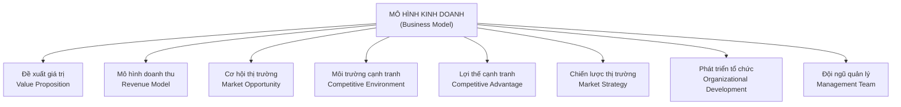
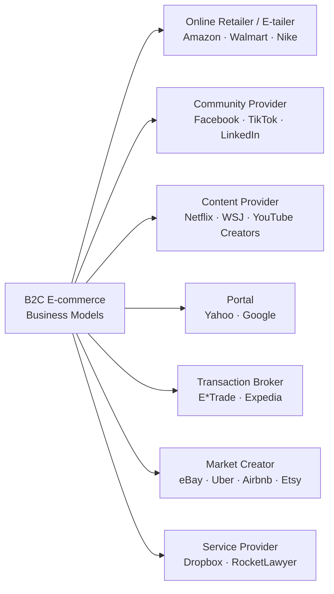
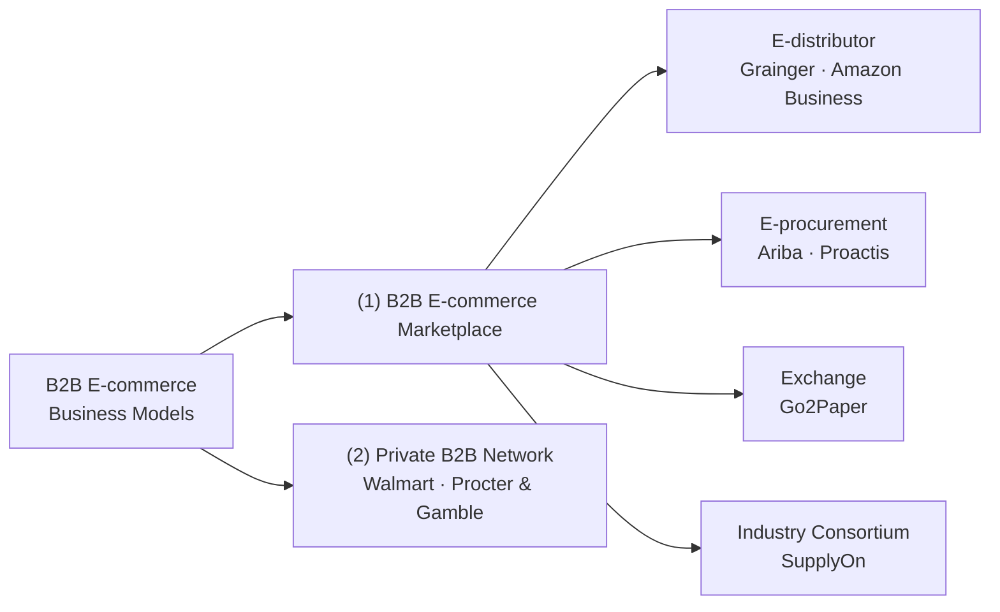
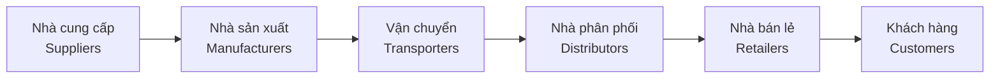

# Chương 2: E-commerce Business Models and Concepts
> Nguồn: *E-Commerce: Business, Technology and Society* (Laudon & Traver, 18th edition, 2024) — trang PDF 86–138.

## 1. Tóm tắt & giải thích kiến thức

### Case mở đầu: Connected Cars — nền tảng e-commerce tiếp theo?

Sách mở đầu chương bằng case về **xe hơi kết nối (connected cars)**: sau desktop và mobile, xe hơi thông minh (smart, connected cars) đang trở thành nền tảng e-commerce mới — cho phép thanh toán trong xe (in-vehicle payment), quảng cáo theo ngữ cảnh, dịch vụ theo yêu cầu (mobility, infotainment, bảo trì dự đoán, an toàn/bảo mật). Các hãng công nghệ lớn (Apple, Google, Microsoft, Amazon) và hãng xe (VW, Toyota, GM) đang tranh giành quyền kiểm soát hệ điều hành và dữ liệu xe. Bài học: **công nghệ mới luôn mở ra nền tảng e-commerce mới**, nhưng công nghệ chỉ là một phần — doanh nghiệp vẫn cần tạo giá trị thật, vận hành hiệu quả, và có mô hình kinh doanh có thể **scale** (mở rộng quy mô mà vẫn hiệu quả).

### 2.1 E-commerce Business Models

**Định nghĩa cốt lõi:**
- **Business model** (mô hình kinh doanh): tập hợp các hoạt động đã hoạch định (business processes) nhằm tạo ra lợi nhuận trên thị trường.
- **Business plan** (kế hoạch kinh doanh): tài liệu mô tả mô hình kinh doanh của một doanh nghiệp, luôn tính đến môi trường cạnh tranh.
- **E-commerce business model**: mô hình kinh doanh khai thác các đặc tính riêng của Internet, Web và nền tảng di động.

> Business model không hẳn giống business strategy, nhưng cả hai đều gắn chặt với môi trường cạnh tranh (competitive environment).

**8 yếu tố cốt lõi của một mô hình kinh doanh** (Figure 2.1) — thiếu yếu tố nào cũng khiến mô hình dễ thất bại:

1. **Value proposition** — vì sao khách hàng chọn mua của bạn chứ không phải đối thủ. Ví dụ Amazon: lựa chọn (selection) không giới hạn + sự tiện lợi (convenience) — mua sách 24/7, biết ngay còn hàng hay không, Kindle giao ngay lập tức.

2. **Revenue model** — cách doanh nghiệp kiếm tiền, tạo lợi nhuận và mang lại lợi tức đầu tư (ROI) vượt trội. 5 mô hình doanh thu chính:
   - **Advertising**: cung cấp nội dung/dịch vụ miễn phí, thu tiền từ nhà quảng cáo (Yahoo, Facebook).
   - **Subscription**: thu phí định kỳ để truy cập nội dung/dịch vụ (Netflix, Consumer Reports). Thường kết hợp **freemium strategy** — cho dùng miễn phí ở mức cơ bản, thu phí ở mức cao cấp (eHarmony, Spotify).
   - **Transaction fee**: thu phí mỗi khi thực hiện/hỗ trợ một giao dịch (eBay, E*Trade).
   - **Sales**: bán trực tiếp hàng hóa/nội dung/dịch vụ (Amazon, Birchbox theo subscription).
   - **Affiliate**: giới thiệu khách hàng cho bên thứ ba và nhận hoa hồng (MyPoints, TripAdvisor, Yelp, influencer mạng xã hội).

3. **Market opportunity** — quy mô doanh thu tiềm năng trong **marketspace** (không gian thị trường) dự định phục vụ, thường chia nhỏ thành các market niches. **Market opportunity thực tế** = tiềm năng doanh thu trong (các) niche mà doanh nghiệp thực sự có khả năng cạnh tranh — nhỏ hơn nhiều so với toàn bộ marketspace (ví dụ: thị trường đào tạo phần mềm online $70 tỷ, nhưng cơ hội thực tế của một startup nhỏ chỉ là phân khúc small-business online training ~$6 tỷ).

4. **Competitive environment** — các đối thủ (trực tiếp và gián tiếp), sản phẩm thay thế, và người mới gia nhập. **Direct competitors** bán sản phẩm gần như giống hệt trong cùng phân khúc (Priceline vs Expedia). **Indirect competitors** cạnh tranh gián tiếp vì sản phẩm có thể thay thế nhau (CNN vs ESPN — cạnh tranh thời gian người dùng online).

5. **Competitive advantage** — đạt được khi doanh nghiệp tạo ra sản phẩm vượt trội và/hoặc đưa ra thị trường với giá thấp hơn đối thủ, nhờ **asymmetry** (bất đối xứng nguồn lực/thông tin/quyền lực). Các dạng đặc biệt: **first-mover advantage** (lợi thế người đi đầu — Amazon, Uber, nhưng không phải lúc nào cũng bền: Google là follower thắng Excite/AltaVista/Lycos nhờ có **complementary resources** tốt hơn); **unfair competitive advantage** (lợi thế "không công bằng" như brand name — không thể mua được).

6. **Market strategy** — kế hoạch chi tiết để thâm nhập thị trường và thu hút khách hàng.

7. **Organizational development** — kế hoạch tổ chức công việc (phòng ban, tuyển dụng) để thực thi business plan hiệu quả khi doanh nghiệp tăng trưởng.

8. **Management team** — đội ngũ chịu trách nhiệm vận hành mô hình; một đội ngũ mạnh có thể "cứu" và định hình lại một mô hình kinh doanh yếu.

**Huy động vốn (Raising Capital):** startup thường bắt đầu bằng **seed capital** (vốn tự thân/gia đình/bạn bè), sau đó tìm đến:
- **Incubators/accelerators** (Y Combinator, TechStars...) — cấp vốn nhỏ + hỗ trợ dịch vụ.
- **Angel investors** — cá nhân giàu có, đầu tư nhỏ (thường ≤ $1 triệu), thường là nhà đầu tư ngoài đầu tiên (Series A).
- **Venture capital investors** — đầu tư vốn quản lý hộ bên khác, tham gia khi startup đã có traction/doanh thu, muốn cổ phần lớn hơn + kiểm soát + exit strategy rõ ràng (IPO/M&A trong 3–7 năm).
- **Crowdfunding** — huy động vốn qua Internet từ đám đông: donor-based (GoFundMe), rewards-based (Kickstarter, phí hoa hồng ~5%), và **equity crowdfunding** (theo đạo luật JOBS Act 2012, cho phép huy động tới $5 triệu/12 tháng, giúp đa dạng hóa nhà sáng lập theo giới tính và địa lý).

Muốn thuyết phục nhà đầu tư, cần một **elevator pitch** (bài thuyết trình ngắn 2-3 phút) gồm: giới thiệu, bối cảnh vấn đề, quy mô thị trường, mô hình doanh thu/số liệu tăng trưởng, số vốn cần gọi, và exit strategy.

**Vì sao khó phân loại mô hình e-commerce:** số lượng mô hình gần như vô hạn; không có cách phân loại "đúng duy nhất"; các mô hình tương tự nhau xuất hiện ở nhiều lĩnh vực khác nhau (e-tailer ở B2C ~ e-distributor ở B2B); nhiều công ty dùng đồng thời nhiều mô hình (Amazon vừa là e-tailer, content provider, market creator, hạ tầng e-commerce); nền tảng công nghệ (mobile, m-commerce) hay bị nhầm là một business model — thực ra nó chỉ là **platform**. Ngoài ra còn có nhóm **e-commerce enablers** — công ty cung cấp hạ tầng (hosting, thanh toán, CDN, CRM...) cho toàn ngành.

### 2.2 Major Business-to-Consumer (B2C) Business Models

- **Online retailer (e-tailer)** — bán hàng qua website/app. Biến thể: *virtual merchant* (thuần online — Amazon, Wayfair), *omnichannel merchant* (có cả cửa hàng vật lý — Walmart, Target), *manufacturer-direct/D2C-DTC* (hãng sản xuất bán thẳng — Dell, Nike, Everlane). Rào cản gia nhập (**barriers to entry**) thấp → cạnh tranh khốc liệt; chìa khóa thành công là chọn **niche strategy**, kiểm soát chi phí và tồn kho.
- **Community provider** — tạo môi trường online để mọi người kết nối, chia sẻ, và giao dịch (Facebook, Instagram, TikTok, LinkedIn). Doanh thu hỗn hợp: quảng cáo, subscription, transaction fee, affiliate. Được hưởng lợi lớn từ truyền miệng/viral marketing offline.
- **Content provider** — phân phối nội dung số (tin tức, nhạc, video). Doanh thu: quảng cáo, subscription, bán nội dung số. Chìa khóa thành công là **sở hữu nội dung**. Xu hướng mới: **creators** (người sáng tạo nội dung cá nhân trên YouTube, TikTok, Patreon...) và hệ sinh thái **creator economy** (ước tính ~$20 tỷ, tăng nhanh).
- **Portal** — tích hợp công cụ tìm kiếm + gói nội dung/dịch vụ (email, tin tức, giải trí) tại một điểm. **Horizontal portal** (Yahoo, AOL, MSN) phục vụ mọi người dùng Internet; **vertical portal/vortal** tập trung một chủ đề/phân khúc (Sailnet — cộng đồng đi thuyền buồm). Google được xem là một dạng portal tập trung vào search.
- **Transaction broker** — xử lý trực tuyến các giao dịch trước đây làm qua điện thoại/gặp mặt (chứng khoán, du lịch): E*Trade, Expedia. Giá trị: tiết kiệm tiền + thời gian.
- **Market creator** — xây dựng "chợ" số nơi người mua/bán gặp nhau, định giá và giao dịch (eBay, Etsy, Uber, Airbnb). Khác **transaction broker** ở chỗ market creator không thay mặt thực hiện giao dịch — người mua/bán là "agent" của chính họ. Case Etsy minh họa hành trình từ MVP (minimum viable product) năm 2005 đến sàn thương mại toàn cầu ứng dụng AI/ML cá nhân hóa tìm kiếm.
- **Service provider** — bán dịch vụ thay vì sản phẩm (Dropbox — lưu trữ, RocketLawyer — pháp lý, Wave — kế toán). Thường dùng **freemium**.

### 2.3 Major Business-to-Business (B2B) Business Models

B2B e-commerce năm 2022 ước đạt **$8.5 nghìn tỷ** — gần **gấp 7 lần** B2C, dù B2C được chú ý nhiều hơn trên truyền thông.

- **E-distributor** — sở hữu bởi một công ty, cung cấp catalog online sản phẩm từ **nhiều nhà sản xuất khác nhau** cho các doanh nghiệp mua lẻ (Grainger — sản phẩm MRO: maintenance, repair, operations). Càng nhiều sản phẩm càng hấp dẫn (critical mass, one-stop shopping).
- **E-procurement company** — giúp doanh nghiệp tự động hóa quy trình mua sắm (Ariba). Cung cấp phần mềm "value chain management" cho cả bên mua và bên bán; hoạt động theo mô hình **SaaS/PaaS**, hưởng lợi từ **scale economies** (hiệu quả kinh tế theo quy mô — chi phí biên sản xuất thêm 1 bản phần mềm gần như bằng 0).
- **Exchange** — chợ số độc lập kết nối hàng trăm–hàng nghìn nhà cung cấp và người mua trong thời gian thực, thường phục vụ một ngành dọc (vertical), giao dịch **direct inputs**. Thu phí hoa hồng theo giá trị giao dịch. Giúp giảm **transaction costs** và tăng **market liquidity** (tính thanh khoản thị trường).
- **Industry consortia** — chợ dọc do chính các doanh nghiệp trong ngành sở hữu, phục vụ ngành đó (SupplyOn — do Bosch, Continental, Schaeffler lập ra cho ngành ô tô).
- **Private B2B network** — mạng số do MỘT doanh nghiệp lớn sở hữu, chỉ mời các nhà cung cấp lâu năm, tin cậy tham gia (Walmart). Thường phát triển từ hệ thống ERP nội bộ.

### 2.4 How E-commerce Changes Business: Strategy, Structure, and Process

**Industry structure** (cấu trúc ngành) — bản chất các bên tham gia ngành và quyền lực thương lượng tương đối, xác định bởi **5 lực lượng của Porter**: cạnh tranh nội bộ ngành, đe dọa từ sản phẩm thay thế, rào cản gia nhập, quyền lực thương lượng của nhà cung cấp, quyền lực thương lượng của người mua. E-commerce làm: tăng cạnh tranh giá (do thông tin giá minh bạch toàn cầu); giảm rào cản gia nhập (nhưng first-mover lại tạo rào cản mới); dịch chuyển quyền lực sang người mua; đôi khi sinh ra **sản phẩm thay thế** hoàn toàn mới (streaming thay DVD, đặt vé online thay đại lý du lịch).

**Industry value chain** — chuỗi hoạt động biến nguyên liệu thô thành sản phẩm/dịch vụ cuối cùng, qua 6 tác nhân:

E-commerce giảm chi phí thông tin ở mọi mắt xích: nhà sản xuất giảm chi phí đầu vào qua B2B exchange, có thể bán thẳng cho khách hàng (bỏ qua nhà phân phối/bán lẻ); nhà phân phối tối ưu tồn kho; nhà bán lẻ tối ưu CRM; khách hàng tìm được giá/chất lượng/tốc độ giao hàng tốt nhất.

**Firm value chain** — chuỗi hoạt động nội bộ một doanh nghiệp: 5 hoạt động chính (inbound logistics, operations, outbound logistics, sales & marketing, after-sales service) + hoạt động hỗ trợ (administration, HR, IT, procurement, finance).

**Value web** — hệ sinh thái kinh doanh kết nối mạng lưới (network) sử dụng công nghệ e-commerce để phối hợp value chain của nhiều đối tác (ví dụ: giá trị Amazon mang lại cho khách hàng phần lớn đến từ mạng lưới đối tác — UPS, USPS và hàng trăm liên minh khác).

**Business strategy** — kế hoạch đạt lợi tức đầu tư dài hạn vượt trội, dựa trên **profit** = giá bán − chi phí sản xuất/phân phối. 5 chiến lược kinh doanh chung:
| Chiến lược | Mô tả | Ví dụ |
|---|---|---|
| **Differentiation** | Làm sản phẩm/dịch vụ khác biệt, tránh **commoditization** (khi giá là yếu tố cạnh tranh duy nhất → lợi nhuận về 0) | Warby Parker |
| **Cost competition** | Cạnh tranh bằng chi phí thấp hơn | Walmart |
| **Scope** | Cạnh tranh toàn cầu thay vì chỉ nội địa/khu vực | Apple iDevices |
| **Focus/market niche** | Tập trung vào một phân khúc hẹp | Bonobos |
| **Customer intimacy** | Xây dựng quan hệ chặt với khách hàng, tăng switching costs | Amazon, Netflix |

**E-commerce Technology and Business Model Disruption:**
- **Sustaining technologies** — công nghệ giúp doanh nghiệp hiện hữu cải tiến dần sản phẩm, duy trì mô hình hiện tại.
- **Disruptive technologies / digital disruption** — công nghệ (thường bình thường, không đặc biệt) được doanh nghiệp mới (**disruptors**) áp dụng theo một mô hình kinh doanh/chiến lược khác biệt, ban đầu phục vụ thị trường ngách bị "ông lớn" bỏ qua, sau đó cải tiến nhanh và dần chiếm lĩnh thị trường chính (PC disrupt mainframe; smartphone disrupt PC; Uber/Airbnb disrupt taxi/khách sạn).
- Vì sao công ty lớn không tự "phá vỡ" chính mình: có vốn/kỹ năng nhưng đội ngũ quản lý bị khóa trong tư duy cũ ("trained in an unfit fitness"), cổ đông kỳ vọng lợi nhuận ổn định chứ không phải "tự hủy" sản phẩm chủ lực, khách hàng hiện tại mong cải tiến liên tục chứ không phải thay đổi triệt để.

### 2.5 Careers in E-commerce

Sách minh họa qua một tin tuyển dụng vị trí **Assistant Manager of E-Business** tại công ty sản xuất dụng cụ (tools) vừa bán B2C vừa B2B. Ứng viên cần hiểu rõ: value proposition, revenue models, market opportunity/strategy (Section 2.1), khác biệt B2C/B2B (2.2, 2.3), và các khái niệm/chiến lược kinh doanh (2.4) để trả lời phỏng vấn — ví dụ: đề xuất giá trị nên dựa trên sự tiện lợi/trải nghiệm (như Amazon), hợp tác với đối tác chiến lược (UPS/FedEx, PayPal, Salesforce), mở rộng kênh B2B qua e-distributor/exchange/private network, và cân nhắc chiến lược differentiation hay cost competition trước hàng nhập khẩu giá rẻ.

### 2.6 Case Study: Twitter's Uncertain Future

Case nghiên cứu mô hình doanh thu của Twitter (chủ yếu quảng cáo — Promoted Ads/Follower Ads/Twitter Takeover, ~90% doanh thu 2021; cộng thêm data licensing ~11%), hành trình từ IPO 2013, giai đoạn tăng trưởng chật vật, các nỗ lực xoay trục sản phẩm (Twitter Blue, Spaces, Communities), và biến động khi Elon Musk mua lại Twitter với giá $44 tỷ năm 2022 — minh họa việc một mô hình kinh doanh (dựa gần như hoàn toàn vào quảng cáo) có thể bị đe dọa bởi bất ổn quản trị/sở hữu.

---

## 2. Key Concepts

*(Thuật ngữ chính được định nghĩa trong lề sách xuyên suốt chương, gom theo nhóm chủ đề)*

**Mô hình kinh doanh nền tảng**
- **Business model** — tập hợp hoạt động đã hoạch định nhằm tạo lợi nhuận trên thị trường.
- **Business plan** — tài liệu mô tả mô hình kinh doanh của một doanh nghiệp.
- **E-commerce business model** — mô hình kinh doanh khai thác đặc tính riêng của Internet/Web/mobile.
- **Value proposition** — cách sản phẩm/dịch vụ của công ty đáp ứng nhu cầu khách hàng.
- **Revenue model** — cách doanh nghiệp kiếm doanh thu, lợi nhuận và ROI.
- **Advertising revenue model** — thu phí từ nhà quảng cáo để đổi lấy không gian hiển thị.
- **Subscription revenue model** — thu phí định kỳ để truy cập nội dung/dịch vụ.
- **Freemium strategy** — cho dùng miễn phí mức cơ bản, thu phí mức cao cấp.
- **Transaction fee revenue model** — thu phí mỗi khi thực hiện/hỗ trợ giao dịch.
- **Sales revenue model** — doanh thu từ bán hàng hóa/nội dung/dịch vụ.
- **Affiliate revenue model** — nhận phí giới thiệu/hoa hồng khi dẫn khách hàng sang bên thứ ba.
- **Market opportunity** — không gian thị trường dự định và tiềm năng tài chính trong đó.
- **Marketspace** — khu vực có giá trị thương mại thực tế/tiềm năng mà doanh nghiệp hoạt động.
- **Competitive environment** — các doanh nghiệp khác cùng bán sản phẩm tương tự, sản phẩm thay thế, người mới gia nhập, quyền lực khách hàng/nhà cung cấp.
- **Competitive advantage** — đạt được khi tạo sản phẩm vượt trội và/hoặc giá thấp hơn đối thủ.
- **Asymmetry** — khi một bên tham gia thị trường có nhiều nguồn lực hơn bên khác.
- **First-mover advantage** — lợi thế cạnh tranh nhờ vào thị trường đầu tiên với sản phẩm khả dụng.
- **Complementary resources** — nguồn lực không trực tiếp tạo ra sản phẩm nhưng cần thiết để thành công (marketing, quản lý, tài chính, danh tiếng).
- **Unfair competitive advantage** — lợi thế dựa trên yếu tố mà đối thủ không thể mua được (ví dụ brand).
- **Perfect market** — thị trường không có lợi thế/bất đối xứng vì mọi doanh nghiệp tiếp cận bình đẳng các yếu tố sản xuất.
- **Leverage** — dùng lợi thế cạnh tranh sẵn có để đạt thêm lợi thế ở thị trường lân cận.
- **Market strategy** — kế hoạch chi tiết để thâm nhập thị trường và thu hút khách hàng.
- **Organizational development** — kế hoạch tổ chức công việc cần thiết để thực thi.
- **Management team** — nhân sự chịu trách nhiệm vận hành mô hình kinh doanh.

**Huy động vốn**
- **Seed capital** — vốn ban đầu từ tiết kiệm cá nhân, thẻ tín dụng, vay thế chấp nhà, gia đình/bạn bè.
- **Elevator pitch** — bài thuyết trình ngắn 2-3 phút thuyết phục nhà đầu tư.
- **Incubators** — cung cấp vốn nhỏ + dịch vụ hỗ trợ cho startup.
- **Angel investors** — cá nhân giàu có đầu tư vốn cá nhân đổi lấy cổ phần, thường là nhà đầu tư ngoài đầu tiên.
- **Venture capital investors** — đầu tư vốn quản lý hộ nhà đầu tư khác, thường ở giai đoạn sau.
- **Crowdfunding** — dùng Internet để huy động vốn từ đám đông cho một dự án.

**Rào cản & mô hình B2C/B2B**
- **Barriers to entry** — tổng chi phí để gia nhập một thị trường mới.
- **Online retailer (e-tailer)** — doanh nghiệp cho phép khách mua sắm qua website/app.
- **Community provider** — tạo môi trường online để kết nối, giao tiếp, giao dịch.
- **Content provider** — phân phối nội dung số.
- **Portal** — cung cấp công cụ tìm kiếm + gói nội dung/dịch vụ tích hợp.
- **Transaction broker** — xử lý trực tuyến các giao dịch trước đây làm trực tiếp/qua điện thoại/thư.
- **Market creator** — xây dựng môi trường số để người mua/bán gặp nhau, định giá, giao dịch.
- **Service provider** — bán dịch vụ trực tuyến.
- **E-distributor** — cung cấp catalog online sản phẩm của nhiều nhà sản xuất cho doanh nghiệp.
- **E-procurement company** — giúp doanh nghiệp tự động hóa quy trình mua sắm.
- **Scale economies** — hiệu quả kinh tế nhờ tăng quy mô doanh nghiệp.
- **Exchange** — chợ số độc lập kết nối hàng trăm–nghìn nhà cung cấp/người mua.
- **Industry consortia** — chợ dọc do chính ngành sở hữu.
- **Private B2B network** — mạng số điều phối luồng giao tiếp/chuỗi cung ứng giữa các doanh nghiệp đối tác, do một doanh nghiệp lớn sở hữu.

**Cấu trúc ngành, chiến lược & disruption**
- **Industry structure** — bản chất các bên tham gia ngành và quyền lực thương lượng tương đối.
- **Industry structural analysis** — phân tích bản chất cạnh tranh, sản phẩm thay thế, rào cản gia nhập, sức mạnh người mua/nhà cung cấp.
- **Value chain** — tập hợp hoạt động biến nguyên liệu thô thành sản phẩm/dịch vụ cuối.
- **Firm value chain** — tập hợp hoạt động một doanh nghiệp thực hiện để tạo sản phẩm từ nguyên liệu.
- **Value web** — hệ sinh thái kinh doanh mạng lưới phối hợp value chain của các đối tác.
- **Business strategy** — kế hoạch đạt lợi tức đầu tư dài hạn vượt trội.
- **Profit** — chênh lệch giữa giá bán và chi phí sản xuất/phân phối.
- **Differentiation** — làm sản phẩm/dịch vụ khác biệt so với đối thủ.
- **Commoditization** — tình trạng không có khác biệt giữa các sản phẩm, chỉ cạnh tranh bằng giá.
- **Strategy of cost competition** — cung cấp sản phẩm/dịch vụ với chi phí thấp hơn đối thủ.
- **Scope strategy** — cạnh tranh trên phạm vi toàn cầu thay vì chỉ nội địa/khu vực.
- **Focus/market niche strategy** — cạnh tranh trong một phân khúc hẹp.
- **Customer intimacy** — xây dựng quan hệ chặt với khách hàng để tăng chi phí chuyển đổi (switching costs).
- **Disruptive technologies** — công nghệ làm nền tảng cho sự phá vỡ mô hình kinh doanh.
- **Digital disruption** — phá vỡ mô hình kinh doanh do thay đổi công nghệ thông tin.
- **Sustaining technologies** — công nghệ giúp cải tiến dần sản phẩm/dịch vụ hiện có.
- **Disruptors** — doanh nghiệp/doanh nhân dẫn dắt sự phá vỡ mô hình kinh doanh.

---

## 3. Questions

**1. What is a business model? How does it differ from a business plan?**
Business model là tập hợp các hoạt động đã hoạch định (business processes) nhằm tạo ra lợi nhuận trên thị trường. Business plan là tài liệu mô tả mô hình kinh doanh đó và luôn tính đến môi trường cạnh tranh — nói cách khác, business model là "lõi" ý tưởng, còn business plan là văn bản hóa chi tiết mô hình đó để trình bày/thực thi. Business model không nhất thiết trùng với business strategy, dù trong nhiều trường hợp chúng rất gần nhau vì cả hai đều xét đến cạnh tranh.

**2. What are the eight key components of an effective business model?**
Value proposition, revenue model, market opportunity, competitive environment, competitive advantage, market strategy, organizational development, và management team.

**3. What are Amazon's primary customer value propositions?**
Lựa chọn không giới hạn (unparalleled selection) và sự tiện lợi (convenience) — khách có thể mua bất kỳ cuốn sách nào tại nhà 24/7, biết ngay tình trạng tồn kho, và với Kindle thì nhận sách điện tử ngay lập tức không cần chờ giao hàng.

**4. Describe the five primary revenue models used by e-commerce businesses.**
- Advertising: thu phí từ nhà quảng cáo để đổi lấy chỗ hiển thị quảng cáo.
- Subscription: thu phí định kỳ (thường kết hợp freemium) để truy cập nội dung/dịch vụ.
- Transaction fee: thu phí mỗi lần thực hiện/hỗ trợ giao dịch (hoa hồng).
- Sales: bán trực tiếp hàng hóa, nội dung, dịch vụ.
- Affiliate: nhận phí giới thiệu/hoa hồng khi dẫn khách sang đối tác khác.

**5. Why is targeting a market niche generally smarter for a community provider than targeting a large market segment?**
Vì chiều sâu và bề rộng kiến thức chuyên biệt, cùng với người điều phối (moderators) giữ thảo luận đúng trọng tâm, chính là rào cản gia nhập quan trọng đối với cộng đồng online. Một cộng đồng tập trung vào một chủ đề ngách (như The Motley Fool về tài chính) dễ giữ chân và thu hút thành viên gắn bó hơn. Ngược lại, cố gắng phục vụ mọi người dùng Internet sẽ nhanh chóng làm cạn kiệt nguồn lực của doanh nghiệp mà khó tạo được sự khác biệt hay lòng trung thành.

**6. Would you say that Amazon and eBay are direct or indirect competitors? (You may have to visit their websites or apps to answer this question.)**
Về cơ bản là **đối thủ gián tiếp (indirect competitors)**: mô hình kinh doanh cốt lõi khác nhau — Amazon chủ yếu là e-tailer/virtual merchant hoạt động theo sales revenue model (tự bán hàng tồn kho của mình hoặc qua bên thứ ba với vai trò nhà bán lẻ), còn eBay là market creator hoạt động theo transaction fee model (chỉ đóng vai trò trung gian, không sở hữu hàng hóa, người mua/bán tự thỏa thuận giá). Tuy nhiên trên thực tế hai nền tảng có phần chồng lấn: Amazon Marketplace (bên thứ ba bán qua Amazon) khiến Amazon cũng cạnh tranh trực tiếp với eBay ở mảng bán hàng qua sàn của người bán thứ ba, cùng tranh giành cùng một nhóm người bán/người mua trực tuyến.

**7. What are some of the specific ways that a business can obtain a competitive advantage?**
Có được điều khoản ưu đãi từ nhà cung cấp/đơn vị vận chuyển/nguồn lao động; sở hữu đội ngũ nhân viên giàu kinh nghiệm, hiểu biết và trung thành hơn đối thủ; sở hữu bằng sáng chế mà đối thủ không thể sao chép; có mạng lưới huy động vốn đầu tư thuận lợi; sở hữu thương hiệu/hình ảnh mà đối thủ không thể sao chép; đạt được lợi thế người đi đầu (first-mover advantage) và giữ được nó nhờ xây dựng lượng người dùng trung thành hoặc giao diện độc đáo khó bắt chước.

**8. Besides advertising and product sampling, what are some market strategies a business might pursue?**
Xây dựng liên minh/đối tác chiến lược (ví dụ với đơn vị logistics, cổng thanh toán, nhà cung cấp CRM); tiếp thị lan truyền (viral marketing) và truyền miệng qua mạng xã hội; chương trình affiliate/referral; tối ưu hóa công cụ tìm kiếm (SEO) và tiếp thị qua email; xây dựng nội dung/thương hiệu qua đội ngũ influencer/creator; tận dụng lợi thế người đi đầu để chiếm lĩnh thị trường trước; và cá nhân hóa/tùy biến trải nghiệm để giữ chân khách hàng (customer intimacy).

**9. How do venture capitalists differ from angel investors?**
Angel investors thường là cá nhân (hoặc nhóm) giàu có, đầu tư tiền cá nhân đổi lấy cổ phần, mức đầu tư nhỏ hơn (thường ≤ $1 triệu), tham gia sớm với điều khoản tương đối thuận lợi, và thường là nhà đầu tư ngoài đầu tiên (Series A). Venture capital investors đầu tư vốn họ quản lý hộ các nhà đầu tư khác (quỹ hưu trí, bảo hiểm, ngân hàng đầu tư...), thường chỉ quan tâm khi startup đã thu hút được lượng lớn người dùng/doanh thu (dù chưa có lãi), muốn cổ phần lớn hơn và quyền kiểm soát hoạt động nhiều hơn, đồng thời yêu cầu một "exit strategy" rõ ràng (IPO hoặc bị mua lại trong khoảng 3–7 năm).

**10. Why is it difficult to categorize e-commerce business models?**
Vì số lượng mô hình kinh doanh e-commerce gần như vô hạn và liên tục có mô hình mới ra đời; không tồn tại một cách phân loại "đúng duy nhất"; các mô hình về bản chất tương tự nhau có thể xuất hiện ở nhiều lĩnh vực khác nhau (ví dụ e-tailer ở B2C và e-distributor ở B2B rất giống nhau nhưng phân biệt bởi đối tượng khách hàng); nhiều công ty sử dụng đồng thời nhiều mô hình kinh doanh khác nhau (Amazon vừa là e-tailer, content provider, market creator, và nhà cung cấp hạ tầng e-commerce); và nền tảng công nghệ (như mobile/m-commerce) đôi khi bị nhầm lẫn là một mô hình kinh doanh riêng biệt, trong khi thực chất nó chỉ là một platform để triển khai các mô hình đã có.

**11. Besides the examples given in the chapter, what are some other examples of vertical and horizontal portals in existence today?**
Chương chỉ nêu Yahoo, AOL, MSN (horizontal) và Sailnet (vertical/vortal) làm ví dụ, đồng thời xem Google là một dạng portal tập trung vào search. Đây là câu hỏi mở đòi hỏi tự tìm hiểu thêm ngoài sách; một số ví dụ phổ biến, được biết đến rộng rãi có thể tham khảo: horizontal portal — Bing, MSN hiện tại; vertical portal (vortal) theo chủ đề — các trang chuyên biệt về sức khỏe, thể thao, bất động sản, ô tô (mỗi ngành thường có một vortal riêng phục vụ cộng đồng chuyên môn của mình). Nên tự nghiên cứu thêm để có ví dụ cập nhật vì sách không liệt kê danh sách đầy đủ.

**12. What are the major differences between an online retailer such as Wayfair and an omnichannel retailer such as Walmart? What are the advantages and disadvantages of each business model?**
Wayfair là **virtual merchant** — chỉ bán qua website/app, không có cửa hàng vật lý. Walmart là **omnichannel merchant** — bán qua kênh online song song với hệ thống cửa hàng vật lý sẵn có.
- Ưu điểm virtual merchant: chi phí cố định thấp hơn (không cần thuê mặt bằng, nhân viên cửa hàng), dễ mở rộng nhanh, linh hoạt về danh mục sản phẩm.
- Nhược điểm virtual merchant: phải xây dựng lòng tin từ đầu (không có "điểm chạm" vật lý), phụ thuộc hoàn toàn vào vận chuyển/giao hàng, khó xử lý đổi trả tại chỗ.
- Ưu điểm omnichannel: tận dụng được lòng tin thương hiệu và hạ tầng vật lý sẵn có, cho phép mua online - nhận tại cửa hàng (BOPIS), đổi trả dễ dàng tại cửa hàng, tiếp cận khách hàng ở cả hai kênh.
- Nhược điểm omnichannel: chi phí vận hành cao hơn (duy trì cả hệ thống cửa hàng lẫn nền tảng online), có thể gặp xung đột kênh (channel conflict) và thách thức tích hợp trải nghiệm liền mạch giữa online/offline.

**13. What type of business and revenue model do creators typically use?**
Creators thuộc nhóm **content provider** (phân phối nội dung số dạng video, podcast...). Mô hình doanh thu thường là kết hợp: quảng cáo, phí subscription (ví dụ trên Patreon), phí giới thiệu/affiliate, và bán hàng hóa/nội dung số (merchandise, khóa học), cộng thêm các công cụ kiếm tiền mới như tip/donate hay vé sự kiện trực tuyến (ticketed events).

**14. What is the difference between a disruptive technology and a sustaining technology?**
Sustaining technology là công nghệ giúp các doanh nghiệp hiện hữu cải tiến dần sản phẩm/dịch vụ, duy trì mô hình kinh doanh, cấu trúc ngành và chiến lược hiện tại để phục vụ khách hàng tốt hơn. Disruptive technology là nền tảng cho một doanh nghiệp mới (disruptor) áp dụng một mô hình kinh doanh/chiến lược hoàn toàn khác — ban đầu sản phẩm thường rẻ hơn, kém năng lực hơn, phục vụ một thị trường ngách mà các doanh nghiệp lớn bỏ qua hoặc không biết đến, sau đó cải tiến nhanh và dần chiếm lĩnh, thậm chí đánh bật thị trường chính (ví dụ PC disrupt mainframe, smartphone disrupt PC). Khi công nghệ gây disruption là công nghệ số/thông tin, gọi là **digital disruption**.

**15. How does an e-procurement company differ from an exchange?**
E-procurement company (như Ariba) là dịch vụ do một doanh nghiệp cung cấp để giúp **một firm mua** tự động hóa quy trình mua sắm — tạo mini chợ số riêng cho firm đó (custom-integrated catalog), thu phí cho dịch vụ tạo thị trường/quản lý chuỗi cung ứng/hoàn tất đơn hàng, hoạt động kiểu SaaS/PaaS. Exchange là một chợ số **độc lập**, không thuộc về bên mua hay bên bán cụ thể nào, kết nối hàng trăm–hàng nghìn người mua/bán trong một ngành dọc, giao dịch chủ yếu là direct inputs (nguyên liệu trực tiếp cho sản xuất) theo thời gian thực, và thu phí/hoa hồng dựa trên quy mô giao dịch.

**16. How have the unique features of e-commerce technology changed industry structure in the travel business?**
Nhờ tính toàn cầu (global reach), tiêu chuẩn phổ quát (universal standards) và mật độ thông tin (information density), e-commerce cho phép người tiêu dùng tiếp cận trực tiếp thông tin giá vé/đặt phòng trên toàn cầu, sinh ra các **transaction broker** mới (Travelocity, Expedia) cạnh tranh trực tiếp và dần thay thế vai trò trung gian của các đại lý du lịch truyền thống (giảm rào cản gia nhập — không cần văn phòng vật lý/đội ngũ bán hàng). Điều này dịch chuyển quyền lực thương lượng sang người mua và tăng cạnh tranh giá. Đáp lại, các hãng hàng không lớn đã liên kết lập ra Orbitz — một sàn online của riêng ngành — để giành lại quyền kiểm soát kênh phân phối.

**17. Who are the major players in an industry value chain, and how are they impacted by e-commerce technology?**
Sáu tác nhân chính: nhà cung cấp (suppliers), nhà sản xuất (manufacturers), đơn vị vận chuyển (transporters), nhà phân phối (distributors), nhà bán lẻ (retailers), và khách hàng (customers). E-commerce giảm chi phí thông tin cho mỗi mắt xích: nhà sản xuất giảm chi phí đầu vào qua B2B exchange với nhà cung cấp và có thể phát triển kênh bán trực tiếp cho khách hàng (bỏ qua nhà phân phối/bán lẻ); nhà phân phối xây dựng hệ thống quản lý tồn kho hiệu quả hơn; nhà bán lẻ xây dựng hệ thống CRM để phục vụ khách tốt hơn; khách hàng tìm kiếm chất lượng/tốc độ giao hàng/giá tốt nhất, từ đó giảm chi phí giao dịch của chính họ. Kết quả chung là hiệu quả vận hành toàn ngành tăng lên, giá giảm, và ngành cạnh tranh tốt hơn với các ngành thay thế.

**18. What are five generic business strategies for achieving a profitable business?**
Differentiation (khác biệt hóa sản phẩm/dịch vụ), cost competition (cạnh tranh bằng chi phí thấp), scope (cạnh tranh phạm vi toàn cầu), focus/market niche (tập trung phân khúc hẹp), và customer intimacy (xây dựng quan hệ chặt với khách hàng để tăng chi phí chuyển đổi).

**19. What is the difference between a market opportunity and a marketspace?**
Marketspace là toàn bộ không gian thị trường có giá trị thương mại thực tế hoặc tiềm năng mà doanh nghiệp dự định hoạt động (ví dụ: toàn bộ thị trường đào tạo phần mềm trị giá $70 tỷ, gồm nhiều phân khúc/niche). Market opportunity là tiềm năng doanh thu thực tế mà một doanh nghiệp cụ thể có khả năng khai thác trong (các) phân khúc/niche mà nó thực sự cạnh tranh được bên trong marketspace đó (ví dụ: phân khúc small-business online training trị giá ~$6 tỷ, phần mà một startup nhỏ có cơ hội thực tế giành được, thay vì cả $70 tỷ).

**20. What is crowdfunding, and how does it help e-commerce companies raise capital?**
Crowdfunding là việc sử dụng Internet để cho phép nhiều cá nhân cùng đóng góp tiền hỗ trợ một dự án. Có ba dạng chính: donor-based (đóng góp không kỳ vọng hoàn lại, như GoFundMe), rewards-based (nhận phần thưởng tương ứng mức đóng góp, như Kickstarter/Indiegogo, nền tảng thu phí hoa hồng ~5%), và equity crowdfunding (theo đạo luật JOBS Act 2012 và các quy định SEC sau đó, cho phép công ty huy động tới $5 triệu/12 tháng bằng cách bán cổ phần cho nhà đầu tư qua Internet). Crowdfunding giúp startup — đặc biệt e-commerce — tiếp cận vốn hạt giống/tăng trưởng khi kênh vốn truyền thống (VC) thu hẹp lại (như trong đại dịch Covid-19), đồng thời mở rộng sự đa dạng của người sáng lập (giới tính, địa lý) và cho phép công ty "test" mức độ quan tâm của thị trường trước khi gọi vốn chính thức.

---

## 4. Projects

**1. Select an e-commerce company. Visit its website or mobile app, and describe its business model based on the information you find there. Identify its customer value proposition, its revenue model, the marketspace it operates in, whom its main competitors are, any comparative advantages you believe the company possesses, and what its market strategy appears to be. Also try to locate information about the company's management team and organizational structure. (Check for a page labeled "the Company," "About Us," or something similar.)**

Hướng dẫn thực hiện:
1. Chọn một công ty e-commerce cụ thể (ví dụ một e-tailer, content provider, market creator...).
2. Truy cập website/app, đọc kỹ trang "About Us"/"Company"/"Investor Relations" để lấy thông tin chính thức.
3. Áp dụng khung 8 yếu tố mô hình kinh doanh (Table 2.3, Section 2.1) làm dàn ý viết báo cáo:
   - Value proposition: vì sao khách hàng chọn công ty này?
   - Revenue model: quan sát cách công ty thu tiền (bán hàng, quảng cáo, subscription, transaction fee, affiliate — có thể là kết hợp).
   - Marketspace: công ty tự định vị mình phục vụ không gian thị trường nào?
   - Đối thủ chính: liệt kê 2-3 đối thủ trực tiếp/gián tiếp.
   - Lợi thế cạnh tranh: brand, công nghệ độc quyền, first-mover, chi phí...
   - Market strategy: quan sát cách công ty quảng bá (SEO, mạng xã hội, quảng cáo, affiliate...).
   - Đội ngũ quản lý/cơ cấu tổ chức: tìm trong trang Leadership/Team hoặc báo cáo thường niên (10-K nếu là công ty niêm yết trên SEC.gov).
4. Trình bày kết quả dưới dạng báo cáo ngắn hoặc slide, mỗi mục 1 đoạn/1 slide, có trích dẫn nguồn (link trang đã tham khảo).

**2. Examine the experience of shopping online versus shopping in a traditional environment. Imagine that you have decided to purchase an air fryer (or any other item of your choosing). First, shop for the product in a traditional manner. Describe how you would do so (for example, how you would gather the necessary information that you would need to choose a particular item, what stores you would visit, how long it would take, prices, etc.). Next, shop for the item on the Web or via a mobile app. Compare and contrast your experiences. What were the advantages and disadvantages of each? Which did you prefer and why?**

Hướng dẫn thực hiện:
1. Chọn một sản phẩm cụ thể (nồi chiên không dầu hoặc sản phẩm khác tùy chọn).
2. Mô tả quy trình mua theo cách truyền thống: sẽ đến cửa hàng nào, cần thu thập thông tin gì trước khi đi (hỏi bạn bè, xem quảng cáo), thời gian di chuyển + so sánh giá tại cửa hàng, có thử/xem trực tiếp sản phẩm không.
3. Thực hiện lại quy trình mua qua website/app (có thể thực sự thao tác đến bước giỏ hàng, không cần thanh toán thật): ghi lại thời gian tìm kiếm, cách so sánh giá/đánh giá, tốc độ ra quyết định.
4. Lập bảng so sánh 2 trải nghiệm theo các tiêu chí: thời gian, chi phí đi lại, số lượng lựa chọn, khả năng xem/thử trước, độ tin cậy thông tin (reviews), sự tiện lợi khi đổi trả.
5. Kết luận cá nhân: bạn thích cách nào hơn và vì sao — liên hệ lại với khái niệm value proposition của e-tailer (Section 2.2) khi lý giải.

**3. During the early days of e-commerce, first-mover advantage was touted as one way to success. On the other hand, some suggest that being a market follower can yield rewards as well. Which approach has proven to be more successful—first mover or follower? Choose two e-commerce companies that prove your point, and prepare a brief presentation to explain your analysis and position.**

Hướng dẫn thực hiện:
1. Ôn lại khái niệm **first-mover advantage** và **complementary resources** (Section 2.1) — sách đã gợi ý ví dụ Google là "follower" vượt qua các first-mover như Excite, AltaVista, Lycos trong thị trường search.
2. Chọn một cặp công ty minh họa rõ luận điểm của bạn — có thể dùng chính ví dụ trong sách (ví dụ nhóm search engine) hoặc tìm một cặp khác mà bạn biết rõ (một first-mover và một follower trong cùng ngành).
3. Phân tích: first-mover có ưu thế gì lúc đầu (nhận diện thương hiệu, giữ chỗ thị trường) nhưng vì sao có thể mất lợi thế (thiếu complementary resources như vốn, kinh nghiệm quản lý, uy tín); follower học được gì từ thất bại của người đi trước.
4. Chuẩn bị bài thuyết trình ngắn (slide 5-8 trang): mở đầu nêu luận điểm, giữa trình bày 2 case, kết luận đưa ra quan điểm rõ ràng (first-mover hay follower thành công hơn, hay "tùy tình huống").

**4. Select an e-commerce company that has participated in an incubator program such as Y Combinator, TechStars, Dreamit Ventures, Capital Factory, or another of your choosing, and write a short report on its business model and the amount and sources of capital it has raised thus far. Include your views on the company's prospects for success. Then create an elevator pitch for the company.**

Hướng dẫn thực hiện:
1. Chọn một công ty đã từng qua một chương trình incubator/accelerator (Y Combinator, TechStars, Dreamit Ventures, Capital Factory hoặc chương trình khác).
2. Thu thập thông tin: trang web công ty, tin tức, hồ sơ trên Crunchbase/trang incubator để biết các vòng gọi vốn (seed, Series A/B...), tổng số vốn đã huy động, và nguồn vốn (angel, VC nào).
3. Viết báo cáo ngắn gồm: mô tả mô hình kinh doanh theo 8 yếu tố (Section 2.1), lịch sử gọi vốn, và nhận định cá nhân về triển vọng thành công (dựa trên competitive advantage, market opportunity của công ty).
4. Soạn một **elevator pitch** cho công ty theo đúng cấu trúc Table 2.4: Introduction (tên/vai trò + câu so sánh kiểu "chúng tôi là Uber/Amazon của ngành Z"), Background (vấn đề công ty giải quyết), Industry size/market opportunity (quy mô thị trường), Revenue model/growth metrics (mô hình doanh thu + số liệu tăng trưởng), Funding (số vốn cần/đã gọi), Exit strategy (kế hoạch mang lại lợi tức cho nhà đầu tư). Giữ độ dài tương đương 2-3 phút nói.

**5. Select a B2C e-commerce retail industry segment such as pet products, sporting goods, or toys, and analyze its value chain and industry value chain. Prepare a short presentation that identifies the major industry participants in that business and illustrates the move from raw materials to finished product.**

Hướng dẫn thực hiện:
1. Chọn một phân khúc bán lẻ B2C cụ thể (ví dụ: sản phẩm thú cưng, dụng cụ thể thao, đồ chơi).
2. Dùng khung **industry value chain** (Figure 2.4, Section 2.4) làm sườn bài: xác định ai là suppliers (nguyên liệu thô), manufacturers (nhà sản xuất), transporters (vận chuyển), distributors (nhà phân phối), retailers (nhà bán lẻ — cả online và offline), và customers trong phân khúc bạn chọn.
3. Đồng thời áp dụng khung **firm value chain** (Figure 2.5) cho một công ty tiêu biểu trong phân khúc: mô tả 5 hoạt động chính (inbound logistics, operations, outbound logistics, sales & marketing, after-sales service).
4. Minh họa cụ thể hành trình từ nguyên liệu thô đến sản phẩm hoàn chỉnh tới tay khách hàng (ví dụ với đồ chơi: nguyên liệu nhựa/gỗ → nhà máy sản xuất → vận chuyển quốc tế → kho phân phối → cửa hàng/ website bán lẻ → khách hàng).
5. Trình bày dưới dạng slide có sơ đồ trực quan (có thể vẽ dạng sơ đồ chuỗi giống Figure 2.4/2.5 trong sách), nêu rõ e-commerce đã thay đổi/rút gọn chuỗi này ở khâu nào (ví dụ nhà sản xuất bán thẳng D2C, bỏ qua nhà phân phối).
