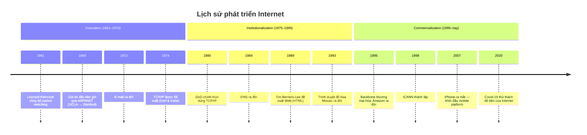
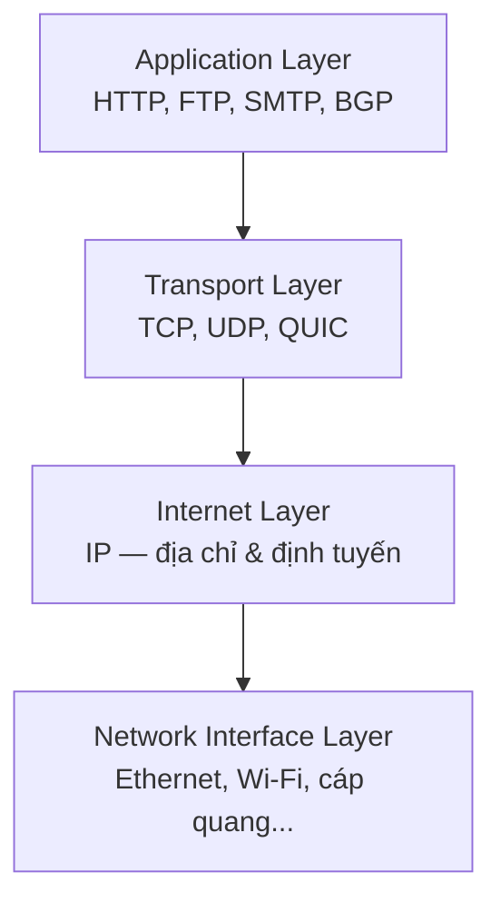
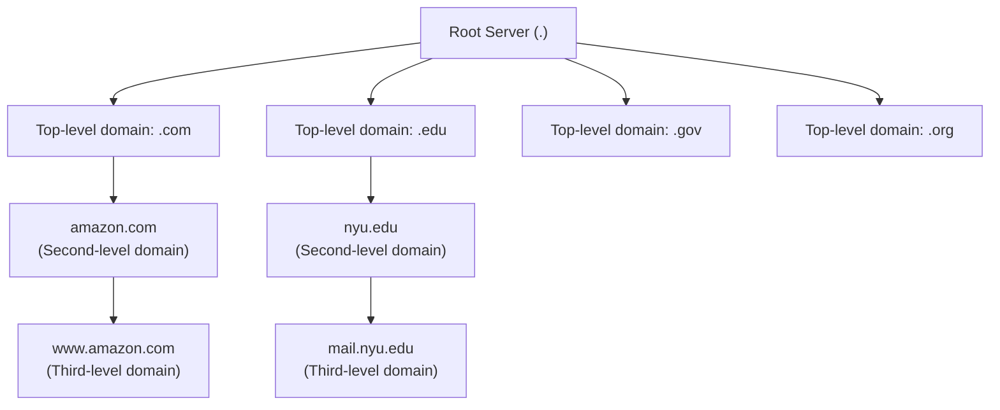
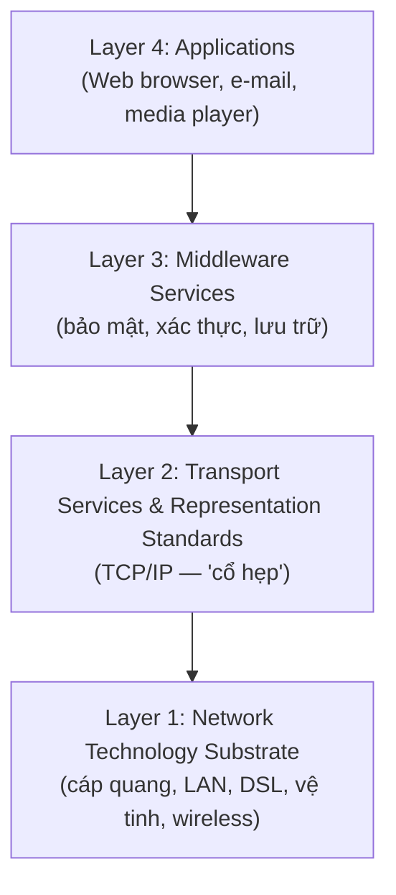
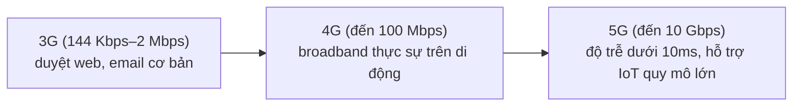
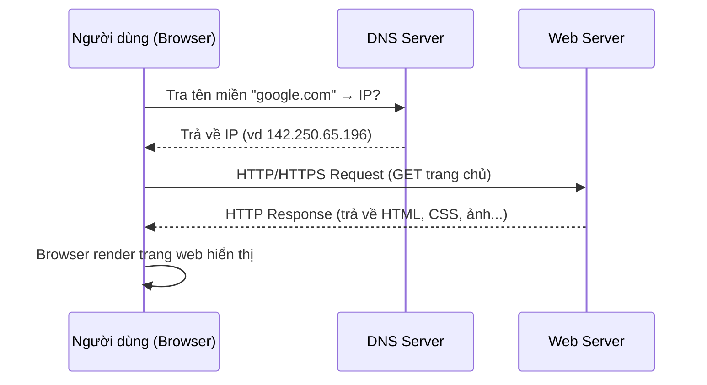

# Chương 3 — E-commerce Infrastructure: The Internet, the Web, and the Mobile Platform

> Nguồn: *E-Commerce: Business, Technology and Society*, Laudon & Traver, 18th edition (2024), Chương 3, trang sách 106–175 (trang PDF vật lý 140–209).

## 1. Tóm tắt & giải thích kiến thức

### Mở đầu — Opening Case: Internet sống sót qua Covid-19

Đại dịch Covid-19 là bài kiểm tra thực tế cho hạ tầng Internet: lưu lượng video, họp trực tuyến tăng vọt nhưng Internet không "sập". Lý do:

- **Tính phân tán (distributed nature):** Internet không phải một mạng duy nhất mà là tập hợp hàng nghìn mạng con kết nối nhau → không có điểm chết duy nhất (single point of failure).
- Đầu tư hạ tầng liên tục từ các ISP (cáp quang, trạm cellular).
- **Congestion control** tự động giảm tốc độ khi mạng nghẽn.
- **Hyperscale cloud computing** (AWS, Azure, Google Cloud) định tuyến tải thông minh.
- **CDN** (Akamai, Cloudflare, CloudFront) giảm tải backbone bằng cách cache nội dung gần người dùng.
- Điểm yếu: hiệu năng **upload** kém hơn download nhiều; các nước thu nhập thấp thiếu hạ tầng dự phòng (redundancy) nên dễ bị đứt mạng hơn.

---

### 3.1 The Internet: Technology Background (Nền tảng công nghệ Internet)

**Internet** là mạng lưới liên kết hàng nghìn mạng con và hàng triệu máy tính (host), không ai sở hữu, không cơ quan nào kiểm soát toàn bộ, phục vụ hơn 4,5 tỷ người dùng. **Web** chỉ là một trong các dịch vụ phổ biến nhất chạy trên Internet.

**Ba giai đoạn phát triển Internet (Figure 3.1 / Table 3.2):**

**Ba khái niệm công nghệ nền tảng (theo định nghĩa chính thức của Federal Networking Council 1995):**

1. **Packet switching:** cắt thông điệp số (bits) thành các **packet** rời rạc, mỗi packet có header (địa chỉ nguồn/đích, thứ tự, kiểm lỗi), gửi theo nhiều đường khác nhau qua **router** (dùng **routing algorithm** để chọn đường tốt nhất), rồi ráp lại ở đích. So với circuit switching (mạch chuyên dụng, lãng phí băng thông), packet switching tận dụng gần như toàn bộ dung lượng đường truyền và tăng năng lực gấp 100 lần.
2. **TCP/IP (Transmission Control Protocol/Internet Protocol):** bộ giao thức lõi. **TCP** thiết lập kết nối, đảm bảo gói tin đến đúng thứ tự, không thiếu. **IP** cung cấp hệ thống địa chỉ và chịu trách nhiệm gửi gói tin. **UDP** là lựa chọn thay thế TCP khi không cần kiểm lỗi (nhanh hơn). **QUIC** (dùng UDP, mã hóa sẵn) đang thay thế dần TCP (Facebook dùng QUIC cho >75% traffic).
3. **Client/server computing:** mô hình máy khách (client) kết nối với một/nhiều máy chủ (server) qua mạng. Thay thế mô hình mainframe tập trung những năm 1960–70; dễ mở rộng, ít lỗi hệ thống hơn (một server hỏng không sập toàn hệ thống).

**Kiến trúc 4 lớp của TCP/IP (Figure 3.4):**

**Địa chỉ IP, DNS, URL:**
- **IPv4:** số 32-bit dạng "dotted quad" (vd 64.49.254.91) → khoảng 4 tỷ địa chỉ, đã gần cạn.
- **IPv6:** số 128-bit → khoảng 3,4×10³⁸ địa chỉ, giải quyết tình trạng cạn kiệt IPv4.
- **Domain Name System (DNS):** dịch địa chỉ IP số sang tên dễ nhớ (vd google.com).
- **URL (Uniform Resource Locator):** địa chỉ đầy đủ browser dùng để tìm nội dung, gồm protocol (https) + domain name + đường dẫn thư mục + tên file.

**Sơ đồ phân cấp DNS (Figure 3.6):**

**Nền tảng di động (Mobile platform):** smartphone/tablet (iOS, Android) đã vượt qua desktop/laptop để trở thành phương tiện truy cập Internet chính, thay đổi cách/nơi/thời điểm người dùng mua sắm.

**Cloud computing:** mô hình cung cấp xử lý, lưu trữ, phần mềm như một "pool" tài nguyên ảo hóa dùng chung qua Internet. Theo NIST, có 5 đặc điểm: on-demand self-service, ubiquitous network access, resource pooling, rapid elasticity, measured service. Ba loại dịch vụ:
- **IaaS (Infrastructure as a Service):** thuê hạ tầng xử lý/lưu trữ/mạng (vd AWS EC2, S3).
- **SaaS (Software as a Service):** dùng phần mềm host sẵn trên cloud (vd Google Workspace, Salesforce).
- **PaaS (Platform as a Service):** dùng nền tảng + công cụ lập trình để tự phát triển ứng dụng (vd IBM Cloud, Salesforce Lightning).

Ba mô hình triển khai: **public cloud** (nhiều khách hàng dùng chung, trả theo mức sử dụng), **private cloud** (dành riêng một tổ chức, bảo mật cao hơn), **hybrid cloud** (kết hợp cả hai — private cho hệ thống lõi, public cho phần ít quan trọng/đỉnh tải). **Edge computing** (vd Akamai) đưa xử lý/lưu trữ ra gần người dùng hơn để giảm độ trễ (latency).

**Các giao thức Internet khác:** HTTP/HTTPS (truyền web page; HTTP/2, HTTP/3 dùng QUIC cải thiện hiệu năng), SMTP (gửi mail), POP3/IMAP (nhận mail), FTP/FTPS/SFTP (truyền file), SSL/TLS (bảo mật giao tiếp — TLS là bản nâng cấp của SSL).

---

### 3.2 Internet Infrastructure and Access (Hạ tầng và truy cập Internet)

**Mô hình đồng hồ cát (Hourglass model, Figure 3.9)** — kiến trúc Internet có 4 lớp khái niệm, phần "cổ hẹp" ở giữa là TCP/IP giúp lớp trên (ứng dụng) không phụ thuộc thay đổi ở lớp dưới (hạ tầng vật lý):

**Kiến trúc mạng vật lý nhiều tầng (Figure 3.10):**
- **Backbone:** mạng cáp quang băng thông cao do các **Tier 1 ISP** (AT&T, Verizon, Lumen...) sở hữu; các Tier 1 "peering" (trao đổi traffic miễn phí) với nhau.
- **Internet Exchange Points (IXP)** (trước gọi là NAP/MAE): điểm trung chuyển nơi Tier 1 kết nối với nhau và với Tier 2 ISP khu vực.
- **Tier 3 ISP:** nhà cung cấp bán lẻ "chặng cuối" (last mile) tới hộ gia đình/doanh nghiệp (Comcast, Charter Spectrum, AT&T...).

**Các loại kết nối Internet (Table 3.7):** narrowband (dial-up 56,6 Kbps) đã lỗi thời; broadband gồm DSL (1–35 Mbps), FiOS (25–940 Mbps), Cable (15–600 Mbps), vệ tinh GEO (5–100 Mbps) và LEO (50–150 Mbps, vd Starlink), T1/T3 (đường thuê bao riêng cho doanh nghiệp/chính phủ).

**Internet Space Race (Insight on Technology):** vệ tinh **LEO (Low Earth Orbit)** bay thấp hơn GEO nhiều (300–1.200 dặm so với quỹ đạo địa tĩnh), độ trễ thấp hơn, tốc độ cao hơn, phủ được cả vùng vĩ độ cao — SpaceX Starlink dẫn đầu, Amazon Project Kuiper theo sau; còn nhiều tranh cãi về an toàn không gian, ô nhiễm ánh sáng, và quản trị pháp lý xuyên biên giới.

**Truy cập Internet di động — hai loại công nghệ không dây:**

1. **Telephone-based (dựa trên mạng điện thoại di động):** 3G → 4G → 5G.

2. **WLAN-based (Wireless Local Area Network):** Wi-Fi (các chuẩn 802.11 a/b/g/n/ac/ax — Wi-Fi 4/5/6), WiMax (tầm xa hơn, tới 30 dặm), Bluetooth (kết nối cá nhân tầm ngắn, dưới 30m).

**Wi-Fi hoạt động thế nào (Figure 3.12):** thiết bị (laptop, smartphone) kết nối không dây tới **wireless access point (hotspot)**, access point này nối vào Internet qua đường truyền băng thông rộng có dây (cable/DSL/T1).

**Internet of Things (IoT):** hàng chục tỷ thiết bị (TV, nhà thông minh, xe hơi, đồng hồ) được gắn cảm biến, kết nối Internet (qua Wi-Fi, Bluetooth, cellular, ZigBee/Z-Wave) để thu thập & phân tích dữ liệu. Vấn đề lớn: khả năng tương thích (interoperability — chuẩn Matter đang cố giải quyết), bảo mật và quyền riêng tư.

**Ai quản trị Internet?** Không một tổ chức nào "kiểm soát" Internet, nhưng nhiều tổ chức có ảnh hưởng: **ICANN** (quản lý địa chỉ IP, tên miền — gần với vai trò "quản lý" nhất), **IETF/IRTF/IESG/IAB** (kỹ thuật, chuẩn hóa), **ISOC**, **IGF**, **W3C** (chuẩn HTML/Web). Internet vẫn phải tuân theo luật quốc gia — case study cho thấy Trung Quốc ("Great Firewall"), Iran (National Information Network), Nga đều áp dụng kiểm duyệt/giám sát sâu (deep packet inspection), tạo nguy cơ Internet bị chia mảnh thành các "splinternet".

---

### 3.3 The Web

**Lịch sử:** Web do **Tim Berners-Lee** (CERN) phát minh 1989–1991, gồm 4 thành phần cốt lõi: HTML, HTTP, web server, web browser. Đến 1993, **Mosaic** (trình duyệt đồ họa đầu tiên, NCSA) biến Web từ text thuần sang giao diện đồ họa, tạo ra **universal computing** — cùng một trang web hiển thị giống nhau trên mọi hệ điều hành. 1994: Netscape Navigator (trình duyệt thương mại đầu tiên); 1995: Microsoft Internet Explorer (miễn phí) dần đánh bại Netscape — bài học kinh doanh: "người đổi mới không nhất thiết là người chiến thắng dài hạn".

**Cách Web hoạt động (client-server + HTTP):**

**Hypertext & URL:** Hypertext là cách định dạng trang có liên kết (hyperlink) nối văn bản/âm thanh/video với nhau. URL gồm: protocol (https) + domain name + directory path + tên file. Tên miền cấp cao (**gTLD**: .com, .net, .edu, .gov...) và tên miền theo quốc gia (**ccTLD**: .uk, .vn...). Từ 2011 ICANN mở rộng gTLD gần như không giới hạn (.nyc, .lawyer, .bmw...).

**Ngôn ngữ đánh dấu (Markup languages):**
- **HTML (HyperText Markup Language):** dùng "tag" cố định để định dạng cấu trúc trang (heading, bảng, vị trí ảnh...). Kết hợp với **CSS (Cascading Style Sheets)** để định kiểu hiển thị (HTML = cấu trúc, CSS = trình bày). **HTML5** là bản mới nhất, tích hợp sẵn video/animation/tương tác (thay thế Flash), hỗ trợ responsive/adaptive web design cho di động, truy cập được GPS, cảm ứng vuốt.
- **XML (eXtensible Markup Language):** mô tả *dữ liệu* thay vì *hiển thị*; tag do người dùng tự định nghĩa (khác HTML có tag cố định) — dùng để lưu trữ/trao đổi dữ liệu có cấu trúc (hóa đơn, danh bạ công ty...).
- **RSS (Really Simple Syndication):** định dạng XML để tự động đẩy nội dung mới (bài viết, podcast) tới người dùng đã đăng ký ("feed").

**Web server & web client:** Web server software (Apache, Nginx) nhận HTTP request và trả về trang HTML. Web client là bất kỳ thiết bị nào có thể gửi HTTP request và hiển thị HTML (không chỉ máy tính — cả tủ lạnh, ô tô...). **Web browser** phổ biến nhất: Chrome (~60% desktop), Safari (~18%), Edge (~12%), Firefox (~7%); trên di động Safari dẫn đầu (~55%) nhờ iPhone/iPad.

---

### 3.4 The Internet and Web: Features and Services

**Công cụ giao tiếp (Communication tools):** e-mail (dịch vụ lâu đời nhất, ~4,2 tỷ người dùng), **instant messaging/IM** (tin nhắn thời gian thực khác e-mail), **mobile messaging apps** (WhatsApp, Messenger, Snapchat...), **online message board/forum** (không real-time), **Internet telephony/VoIP** (gọi thoại qua Internet, thay thế dần điện thoại truyền thống), **videoconferencing/telepresence** (Zoom, Teams, Webex — bùng nổ nhờ Covid-19, case study "Zoom Continues to Zoom" minh họa cả tăng trưởng lẫn thách thức bảo mật/riêng tư).

**Search engines:** xác định trang web khớp từ khóa (query) và trả kết quả. Google chiếm ưu thế (~62% desktop, ~94% mobile). Cách Google hoạt động (Figure 3.16): Googlebot crawl liên tục Web → lập chỉ mục (index shards) → khi có truy vấn, thuật toán (200+ biến số gồm PageRank, mức độ liên quan, ngữ cảnh người dùng) chấm điểm và trả kết quả (organic + sponsored links).

**Downloadable & streaming media:** download = tải file về lưu trên máy; streaming = phát trong lúc truyền (không cần lưu toàn bộ trước) — chiếm hơn 50% traffic Internet (YouTube, Netflix, TikTok...). Podcast là file audio số phát hành định kỳ.

**Web 2.0 applications:** 
- **Online social networks:** Facebook, Instagram, LinkedIn, TikTok... nền tảng cho quảng cáo & social e-commerce; người tạo nội dung gọi là "creators/influencers" (creator economy).
- **Blog (weblog):** trang cá nhân dạng nhật ký theo thời gian, không cần biết HTML (WordPress, Tumblr...).
- **Wiki:** trang web cho phép nhiều người cùng chỉnh sửa nội dung (Wikipedia là ví dụ điển hình, có cơ chế "Recent Changes" để kiểm soát vandalism).

**Web3:** khái niệm Internet mới dựa trên **blockchain**, phi tập trung hơn, do người dùng/creator kiểm soát thay vì Big Tech — hiện chưa thực sự tồn tại, còn nhiều tranh cãi về khả năng mở rộng (scale).

**VR/AR/MR/Metaverse:**
- **Virtual Reality (VR):** đắm chìm hoàn toàn vào thế giới ảo qua kính HMD (Meta Quest, HTC Vive...).
- **Augmented Reality (AR):** phủ vật thể ảo lên thế giới thật qua smartphone/tablet (Pokémon Go, Snapchat Lenses).
- **Mixed Reality (MR):** AR nâng cao — vật ảo tương tác được với môi trường thật (Microsoft HoloLens).
- **Metaverse:** không gian ảo 3D nhập vai để kết nối/giao dịch — Facebook đổi tên thành Meta (2021) để theo đuổi tầm nhìn này.

**Intelligent digital assistants:** Siri (Apple, 2011), Google Now/Assistant, Amazon Alexa (Echo, 2015 — dẫn đầu thị phần loa thông minh ~66%), Apple HomePod — dùng AI + nhận diện giọng nói để thực hiện tác vụ.

---

### 3.5 Mobile Apps

iPhone (2007) ban đầu không có "app" — Apple mở **App Store** (7/2008) cho phép nhà phát triển ngoài xây dựng ứng dụng; Google phát triển **Android** mã nguồn mở song song, ra mắt **Google Play**. Từ đó hình thành hệ sinh thái app khổng lồ (2021: 230 tỷ lượt tải, $170 tỷ chi tiêu trong app).

**Nền tảng phát triển app:**
- **iOS:** viết bằng **Swift** hoặc **Objective-C** (dùng iOS SDK).
- **Android:** viết bằng **Java** (một phần C/C++).
- Ngoài ra có nhiều bộ công cụ (toolkit) cross-platform giá rẻ/mã nguồn mở giúp viết app chạy nhiều nền tảng mà không cần ngôn ngữ riêng biệt.

**Phân biệt quan trọng:** **native app** (cài trực tiếp, chạy dựa vào OS thiết bị) khác **mobile website**/**web app** (chạy trong trình duyệt, không cài đặt trực tiếp vào máy).

**Chợ ứng dụng (App marketplaces):** Google Play (Android), Apple App Store (iOS), và bên thứ ba như Amazon Appstore.

**Tác động tới e-commerce:** smartphone/tablet biến thành công cụ mua sắm luôn-sẵn-sàng và nền tảng marketing/quảng cáo mới — m-commerce (mua bán qua thiết bị di động) dự kiến vượt $500 tỷ tại Mỹ năm 2022.

---

### 3.7 Case Study: Akamai — Sharpening Internet Content Delivery with Edge Computing (tóm tắt)

Akamai (thành lập bởi Tom Leighton & Daniel Lewin, MIT, 1998) là công ty tiên phong **edge computing**: đặt bản sao nội dung (ảnh, video) trên hàng trăm nghìn server đặt gần người dùng khắp thế giới (Akamai Intelligent Edge Platform: ~360.000 server, 135 quốc gia) để giảm độ trễ (latency) do TCP yêu cầu xác nhận từng gói tin 1.500-byte. Akamai phục vụ nhiều khách hàng lớn (50% Fortune 500), mở rộng sang cloud/IaaS (mua Linode) và bảo mật mạng (mua Guardicore, dịch vụ WAAP) để cạnh tranh với CloudFront, Cloudflare, Fastly khi nhiều "Big Tech" tự xây CDN riêng.

---

## 2. Key Concepts

*(Theo đúng cấu trúc mục "KEY CONCEPTS" ở phần 3.8 Review — tóm tắt theo từng Learning Objective của chương, kèm giải thích các thuật ngữ trong lề sách.)*

### ■ Discuss the origins of, and the key technology concepts behind, the Internet
- **Internet** đã phát triển từ vài máy mainframe trong khuôn viên đại học Mỹ thành mạng lưới liên kết hàng nghìn mạng, hàng triệu máy tính, phục vụ hơn 4,5 tỷ người dùng toàn cầu.
- Lịch sử Internet chia 3 giai đoạn: **Innovation Phase** (1961–1974), **Institutionalization Phase** (1975–1995), **Commercialization Phase** (1995–nay).
- **Packet switching** (chia nhỏ dữ liệu thành gói/packet), **bộ giao thức TCP/IP**, và **client/server computing** là ba khái niệm công nghệ nền tảng của Internet.
- **Mobile platform** đã trở thành phương tiện chính để truy cập Internet.
- **Cloud computing** là mô hình mà cá nhân/doanh nghiệp thuê năng lực xử lý và phần mềm qua Internet thay vì mua và cài đặt trên máy riêng.
- Các giao thức Internet như **HTTP, SMTP, POP3, IMAP, FTP, SSL, TLS** cho phép các dịch vụ khác nhau (truyền trang web, e-mail, truyền file, bảo mật).

### ■ Explain the current structure of the Internet
- Hạ tầng Internet gồm: **backbone** (mạng cáp quang băng thông cao do các **Tier 1 ISP** sở hữu), **Internet Exchange Points (IXP)** (điểm kết nối backbone với mạng khu vực/địa phương), **Tier 3 ISP** (cung cấp truy cập cho hộ gia đình/văn phòng), và **nền tảng di động** (cellular + Wi-Fi).
- **Internet of Things (IoT)** dựa trên các công nghệ sẵn có (RFID, cảm biến giá rẻ, lưu trữ dữ liệu rẻ, phần mềm phân tích big data, IPv6) để phát triển các "vật" thông minh kết nối.
- Các tổ chức quản trị như **ICANN, IETF, IRTF, IESG, IAB, ISOC, IGF, W3C** có ảnh hưởng và giám sát hoạt động Internet nhưng không kiểm soát hoàn toàn.

### ■ Understand how the Web works
- Web được phát triển 1989–1991 bởi **Tim Berners-Lee**, người viết chương trình cho phép các trang định dạng lưu trên Internet được liên kết bằng từ khóa (hyperlink). Năm 1993, **Marc Andreessen** tạo ra trình duyệt đồ họa đầu tiên (Mosaic), giúp xem tài liệu Web dưới dạng đồ họa và tạo ra khả năng **universal computing**.
- Các khái niệm cốt lõi cần nắm để hiểu Web hoạt động: **hypertext, HTTP, URL, HTML, CSS, XML, web server software, web client, web browser**.

### ■ Describe how Internet and web features and services support e-commerce
- Internet và Web cùng nhau tạo nên e-commerce bằng cách cho phép người dùng truy cập thông tin sản phẩm/dịch vụ và hoàn tất giao dịch mua trực tuyến.
- Một số tính năng hỗ trợ e-commerce: **công cụ giao tiếp** (e-mail, messaging, message board, Internet telephony, videoconferencing, video chatting, telepresence); **search engine**; **downloadable & streaming media**.
- Ứng dụng/dịch vụ **Web 2.0** gồm **social network, blog, wiki**.
- **Web3** chưa thực sự tồn tại nhưng được hình dung là dịch vụ Internet mới dựa trên **blockchain**, phi tập trung hơn Web hiện tại, do người sáng tạo/người dùng kiểm soát thay vì Big Tech.
- **Virtual reality, augmented reality, metaverse, và intelligent digital assistants** đã bắt đầu vào thị trường tiêu dùng và thu hút nhiều sự chú ý.

### ■ Understand the impact of mobile applications
- Hiện tượng mobile app đã tạo ra một hệ sinh thái số mới với tác động quan trọng tới e-commerce. Hầu hết các thương hiệu lớn hiện có mobile app, ngày càng được dùng cho **m-commerce**.
- Có nhiều nền tảng phát triển mobile app khác nhau, gồm **Swift và Objective-C** cho thiết bị iOS và **Java** (cùng C/C++ cho một số phần) cho thiết bị Android.
- App cho iPhone được phân phối qua **Apple App Store**, app cho Android qua **Google Play**; ngoài ra còn có bên thứ ba như **Amazon Appstore**.

---

## 3. Questions

1. **What are the three basic building blocks of the Internet?**
   Ba khối xây dựng cơ bản là: (1) **packet switching** — cắt thông điệp thành các gói tin để truyền hiệu quả; (2) **bộ giao thức TCP/IP** — quy tắc định dạng, đóng gói và định tuyến dữ liệu; (3) **client/server computing** — mô hình máy khách kết nối với máy chủ qua mạng.

2. **What is an IPv6 address? Why are IPv6 addresses necessary?**
   IPv6 là địa chỉ Internet dạng số 128-bit, hỗ trợ tới khoảng 3,4×10³⁸ địa chỉ. IPv6 cần thiết vì địa chỉ IPv4 (32-bit, chỉ khoảng 4 tỷ địa chỉ) đã gần cạn kiệt do số lượng thiết bị kết nối Internet (máy tính, di động, IoT...) tăng bùng nổ, các tổ chức được cấp hàng triệu địa chỉ IPv4, khiến các cơ quan đăng ký khu vực gần như hết địa chỉ để cấp.

3. **Explain how packet switching works.**
   Thông điệp số (dạng bit) được cắt thành các gói (packet) có kích thước cố định. Mỗi packet được gắn thêm thông tin tiêu đề (header) chỉ rõ địa chỉ nguồn, địa chỉ đích, thứ tự gói và thông tin kiểm lỗi. Thay vì đi thẳng tới đích, các packet di chuyển qua nhiều **router** — máy tính chuyên dụng dùng **routing algorithm** để chọn đường đi tốt nhất tại từng thời điểm (tùy tình trạng tuyến đường). Ở đích, các packet được ráp lại thành thông điệp hoàn chỉnh. Cách này không cần một mạch chuyên dụng cố định, tận dụng tối đa dung lượng đường truyền sẵn có và có thể định tuyến lại nếu một tuyến bị lỗi/bận.

4. **How is the TCP/IP protocol related to information transfer on the Internet?**
   TCP/IP là bộ giao thức lõi chi phối toàn bộ việc truyền thông tin trên Internet. **IP** cung cấp hệ thống địa chỉ và đảm nhận việc gửi packet tới đích. **TCP** thiết lập kết nối giữa máy gửi và máy nhận, đảm bảo các packet được nhận đúng thứ tự và không bị thiếu (ráp/reassembly). Bộ giao thức được tổ chức thành 4 lớp (Network Interface, Internet, Transport, Application), cho phép các ứng dụng khác nhau (web, e-mail, file transfer...) cùng chạy trên nền tảng địa chỉ và vận chuyển chung này.

5. **What technological innovation made client/server computing possible?**
   Sự phát triển của **máy tính cá nhân (personal computers)** và **mạng cục bộ (local area networks — LAN, dựa trên Ethernet)** đã cho phép thay thế mô hình mainframe tập trung (nơi mọi xử lý dồn vào một máy tính lớn, người dùng chỉ dùng terminal) bằng mô hình phân tán nơi nhiều máy client kết nối với server qua mạng.

6. **What is cloud computing, and how has it impacted the Internet?**
   Cloud computing là mô hình trong đó năng lực xử lý, lưu trữ, phần mềm và các dịch vụ khác được cung cấp như một pool tài nguyên ảo hóa dùng chung qua Internet, truy cập theo nhu cầu. Nó tác động lớn tới Internet: giảm mạnh chi phí xây dựng/vận hành website và hệ thống e-commerce (mô hình "pay-as-you-go"), cho phép doanh nghiệp nhỏ cạnh tranh mà không cần đầu tư hạ tầng riêng, và các mạng cloud quy mô lớn (hyperscale — AWS, Azure, Google Cloud) đã giúp Internet đủ linh hoạt để chống chịu các đợt tăng vọt lưu lượng như trong đại dịch Covid-19.

7. **Why are smartphones a disruptive technology?**
   Smartphone đã thay thế desktop/laptop trở thành phương tiện truy cập Internet chính, tạo ra toàn bộ hệ sinh thái mới (app, app store, mobile advertising) mà trước đây không tồn tại. Chúng thay đổi căn bản cách, nơi và thời điểm người tiêu dùng mua sắm (m-commerce), đồng thời "nuốt chửng" chức năng của nhiều thiết bị chuyên dụng khác (máy ảnh, máy nghe nhạc, GPS, đồng hồ) — đúng bản chất của công nghệ đột phá (disruptive technology): tạo ra thị trường/mô hình kinh doanh mới và làm lung lay vị thế của các công nghệ/doanh nghiệp cũ.

8. **What role does a Tier 1 ISP play in Internet infrastructure?**
   Tier 1 ISP (còn gọi là transit ISP) sở hữu và vận hành các mạng cáp quang đường dài (long-haul) tạo nên **backbone** của Internet. Họ có thỏa thuận "peering" với các Tier 1 ISP khác để trao đổi lưu lượng miễn phí qua hạ tầng của nhau, và chỉ giao dịch với các Tier 1/Tier 2 ISP khác — không phục vụ trực tiếp người dùng cuối.

9. **What function do IXPs serve?**
   Internet Exchange Points (trước gọi là NAP hoặc MAE) là các điểm trung chuyển (hub) nơi các Tier 1 ISP kết nối vật lý với nhau và/hoặc với các Tier 2 ISP khu vực, cho phép lưu lượng Internet được trao đổi giữa các mạng backbone khác nhau.

10. **What is 5G?**
    5G là chuẩn mạng di động thế hệ thứ 5, cung cấp băng thông di động cực cao (tới 10 Gbps trở lên), hỗ trợ tới 100.000 kết nối máy-với-máy (M2M) trên mỗi km², và độ trễ cực thấp (dưới 10 mili-giây). 5G dùng dải sóng milimet mới (30–300 GHz) và cần hạ tầng dày đặc gồm hàng chục nghìn trạm cell nhỏ (small-cell) cùng đầu tư thêm mạng cáp quang.

11. **What are the differences among a public, a private, and a hybrid cloud?**
    - **Public cloud:** do nhà cung cấp bên thứ ba (CSP như AWS, Microsoft, Google) sở hữu và quản lý, phục vụ nhiều khách hàng cùng lúc, khách chỉ trả tiền theo mức sử dụng — phù hợp doanh nghiệp không có yêu cầu bảo mật/riêng tư khắt khe.
    - **Private cloud:** vận hành riêng cho một tổ chức duy nhất, có thể host nội bộ hoặc bởi bên thứ ba — phù hợp tổ chức cần kiểm soát dữ liệu, tuân thủ quy định nghiêm ngặt (tài chính, y tế).
    - **Hybrid cloud:** kết hợp cả public và private — dùng private cho hoạt động lõi/quan trọng nhất, public cho hệ thống ít quan trọng hơn hoặc khi cần thêm năng lực xử lý vào giờ cao điểm.

12. **How does UDP differ from TCP?**
    UDP (User Datagram Protocol) là một giao thức thay thế TCP, bỏ qua các bước kiểm lỗi và sửa lỗi (error-checking/correction) cũng như thiết lập kết nối mà TCP thực hiện. Vì vậy UDP nhanh hơn nhưng không đảm bảo độ tin cậy/thứ tự gói tin như TCP — phù hợp cho các ứng dụng ưu tiên tốc độ hơn độ chính xác tuyệt đối (ví dụ truyền phát trực tuyến), trong khi TCP đảm bảo dữ liệu đến đầy đủ, đúng thứ tự nhờ cơ chế xác nhận (acknowledgment).

13. **What are some of the challenges of policing the Internet? Who has the final say when it comes to content on the Internet?**
    Thách thức lớn nhất là Internet có bản chất phân tán, không do một tổ chức/quốc gia nào sở hữu, nhưng lại chạy trên hạ tầng viễn thông vật lý thuộc chủ quyền của từng quốc gia — nên mỗi quốc gia có thể áp đặt luật, kiểm duyệt và giám sát khác nhau (như "Great Firewall" của Trung Quốc, National Information Network của Iran, luật lưu trữ dữ liệu và deep packet inspection của Nga), dẫn tới nguy cơ Internet bị chia mảnh thành các "splinternet". Về việc "ai có tiếng nói cuối cùng" — không có một cơ quan toàn cầu duy nhất; các tổ chức như ICANN, IETF, W3C chỉ có vai trò ảnh hưởng/khuyến nghị kỹ thuật, còn quyền kiểm soát nội dung thực tế nằm ở luật pháp của từng quốc gia — vì vậy quyền quyết định bị phân mảnh giữa nhiều chính phủ và tổ chức khác nhau, không tập trung vào một nơi.

14. **Compare and contrast the capabilities of Wi-Fi and cellular wireless networks.**
    Wi-Fi (mạng WLAN) cung cấp băng thông rất cao trong phạm vi ngắn (vài chục mét, qua các access point/hotspot), chi phí triển khai rẻ, dùng phổ tần không cần cấp phép — chuẩn mới nhất (Wi-Fi 6/802.11ax) đạt lý thuyết tới 10 Gbps. Mạng cellular (3G/4G/5G) có vùng phủ rộng hơn nhiều nhờ hệ thống trạm phát sóng và roaming toàn cầu, dùng phổ tần được cấp phép, đòi hỏi đầu tư hạ tầng và hệ thống tính cước quy mô lớn; trước đây băng thông thấp hơn Wi-Fi nhưng 5G đã thu hẹp khoảng cách này với tốc độ cao và độ trễ cực thấp, đồng thời hỗ trợ số lượng kết nối thiết bị (IoT) lớn hơn nhiều so với Wi-Fi.

15. **What are the basic capabilities of a web server?**
    Theo Table 3.11, web server cung cấp: xử lý HTTP request; dịch vụ bảo mật (TLS — xác thực người dùng, xử lý chứng chỉ/khóa cho thanh toán); truyền file (FTP, FTPS, SFTP); công cụ tìm kiếm (index nội dung site, tìm theo từ khóa); thu thập dữ liệu (log file lượt truy cập, thời lượng, nguồn giới thiệu); e-mail (gửi/nhận/lưu trữ); và các công cụ quản trị site (thống kê lượt truy cập, kiểm tra liên kết hỏng).

16. **What role does CSS play in the creation of web pages?**
    CSS (Cascading Style Sheets) quy định cách trình duyệt **hiển thị** các phần tử HTML trên màn hình (màu sắc, font, bố cục, khoảng cách...). Trong khi HTML định nghĩa **cấu trúc** của trang (heading, bảng, đoạn văn), CSS đảm nhiệm phần **trình bày/phong cách** — cho phép tách biệt nội dung và giao diện, dễ bảo trì và tùy biến hiển thị trên nhiều thiết bị.

17. **Why was the development of the browser so significant to the growth of the Web?**
    Trước Mosaic (1993), Web chỉ hiển thị văn bản đen trắng qua giao diện dòng lệnh, khó tiếp cận với người dùng phổ thông. Trình duyệt đồ họa (GUI) đầu tiên đã cho phép xem trang Web với màu sắc, hình ảnh, hoạt ảnh — đồng thời tạo ra khả năng **universal computing**: cùng một trang web hiển thị giống nhau trên Windows, Macintosh hay Unix. Điều này biến Web từ công cụ học thuật thành phương tiện đại chúng, mở đường cho làn sóng thương mại hóa (Netscape, rồi Internet Explorer) và sự ra đời của e-commerce.

18. **What advances and features does HTML5 offer?**
    HTML5 là chuẩn HTML mới nhất, đã trở thành chuẩn phát triển web trên thực tế (de facto), thay thế các plug-in như Adobe Flash. HTML5 hỗ trợ video, hoạt ảnh và tương tác trực tiếp (kết hợp CSS3, JavaScript, và HTML5 Canvas để vẽ đồ họa bằng JavaScript). Nó cũng là công cụ quan trọng cho responsive web design và adaptive web delivery, được dùng rộng rãi trong phát triển website/app di động; các app HTML5 tải nội dung từ server thay vì lưu trên phần cứng thiết bị (device-independence), và có thể truy cập các tính năng thiết bị như GPS, thao tác vuốt (swipe).

19. **Name and describe five services currently available through the Web.**
    Ví dụ 5 dịch vụ: (1) **E-mail** — gửi/nhận thông điệp văn bản, hình ảnh, tệp đính kèm; (2) **Search engine** (Google, Bing) — tìm trang web khớp từ khóa; (3) **Streaming media** (Netflix, YouTube, Spotify) — phát video/nhạc trực tuyến không cần tải toàn bộ trước; (4) **Online social network** (Facebook, Instagram, TikTok...) — kết nối và chia sẻ nội dung giữa người dùng; (5) **Internet telephony/videoconferencing (VoIP)** (Zoom, Skype) — gọi thoại/video qua Internet thay cho điện thoại truyền thống.

20. **What has been the impact of the development of mobile apps?**
    Sự phát triển của mobile app đã tạo ra một hệ sinh thái số hoàn toàn mới: hàng chục nghìn nhà phát triển, hàng tỷ lượt tải app mỗi năm, và hàng trăm tỷ USD chi tiêu trong app. Nó biến smartphone/tablet thành công cụ mua sắm luôn-sẵn-sàng, kênh marketing/quảng cáo mới, và đã vượt qua cả TV để trở thành phương tiện giải trí phổ biến nhất. Gần như mọi thương hiệu lớn hiện đều có mặt trên app store, thúc đẩy mạnh mẽ sự tăng trưởng của m-commerce.

---

## 4. Projects

1. **"Review the Insight on Technology case on low earth orbit satellites. What developments have occurred since this case was written in June 2022?"**
   *Cách làm:*
   - Đọc lại case "The Internet Space Race" trong sách (trang 133–134) để nắm các mốc dữ liệu gốc (tại thời điểm 6/2022): Starlink có ~2.200 vệ tinh, hơn 400.000 khách hàng ở 36 nước, giá ~$110/tháng + $599 phí thiết bị; Amazon Project Kuiper chưa phóng vệ tinh nào, mới được FCC duyệt hơn 3.200 vệ tinh.
   - Tìm tin tức/báo cáo mới nhất về: số lượng vệ tinh Starlink hiện tại, số khách hàng, vùng phủ sóng mới, thay đổi giá; tiến độ phóng vệ tinh và ra mắt dịch vụ của Project Kuiper; các đối thủ khác (OneWeb, Telesat...).
   - Nguồn nên dùng: trang chính thức của SpaceX/Starlink, Amazon (Project Kuiper), báo cáo của FCC (fcc.gov), các trang tin công nghệ uy tín (CNBC, Ars Technica, SpaceNews).
   - Trình bày: viết báo cáo ngắn (~1 trang) nêu rõ những gì đã thay đổi so với số liệu trong sách, và đánh giá liệu các lo ngại nêu trong case (giá cao, an toàn không gian, quản trị pháp lý) đã được giải quyết đến đâu.

2. **"Call or visit the websites of a cable provider, a DSL provider, and a satellite provider to obtain information on their Internet services. Prepare a brief report summarizing the features, benefits, and costs of each. Which is the fastest? What, if any, are the downsides (such as the necessity of additional equipment purchases) of selecting any of the three for Internet service?"**
   *Cách làm:*
   - Chọn cụ thể 3 nhà cung cấp thuộc 3 loại: ví dụ Comcast/Charter Spectrum (cable), AT&T/Verizon (DSL hoặc fiber như FiOS), Starlink/HughesNet/Viasat (vệ tinh).
   - Truy cập website hoặc gọi hotline từng nhà cung cấp, ghi nhận: tốc độ download/upload theo từng gói cước, giá hàng tháng, phí lắp đặt/thiết bị (modem, chảo vệ tinh...), điều khoản hợp đồng, giới hạn dung lượng (data cap) nếu có.
   - Lập bảng so sánh 3 cột (Cable / DSL / Satellite) theo các tiêu chí: tốc độ, giá, chi phí thiết bị ban đầu, nhược điểm (vd cable dùng băng thông chia sẻ trong khu vực nên giờ cao điểm chậm hơn; DSL giới hạn khoảng cách tới trạm chuyển mạch; vệ tinh có độ trễ cao hơn và phí lắp đặt chảo thu ban đầu).
   - Kết luận: nêu rõ dịch vụ nào nhanh nhất trong 3 lựa chọn đã khảo sát và đưa ra khuyến nghị tùy theo tình huống sử dụng (hộ gia đình đô thị vs. vùng nông thôn).

3. **"Select two countries (excluding the United States), and prepare a short report describing each one's basic Internet infrastructure. Is the infrastructure public or commercial? How and where does the infrastructure connect to backbones within the United States?"**
   *Cách làm:*
   - Chọn 2 quốc gia có đặc điểm khác nhau để so sánh thú vị hơn (vd một nước phát triển ở châu Âu và một nước đang phát triển ở châu Á/châu Phi — ví dụ Việt Nam và Đức, hoặc Nigeria và Nhật Bản).
   - Tìm hiểu: cơ quan/doanh nghiệp nào sở hữu hạ tầng backbone trong nước (nhà nước độc quyền hay các ISP tư nhân cạnh tranh); các tuyến cáp quang biển (submarine cable) kết nối quốc gia đó ra quốc tế và tới Mỹ.
   - Nguồn tham khảo hữu ích: bản đồ cáp quang biển của TeleGeography (submarinecablemap.com), báo cáo của ITU (International Telecommunication Union), Internet Society, cơ quan quản lý viễn thông của từng nước.
   - Trình bày: báo cáo ngắn cho mỗi nước, nêu rõ hạ tầng là công (nhà nước) hay tư (thương mại)/hỗn hợp, và mô tả đường đi cụ thể (qua tuyến cáp/IXP nào) để kết nối tới backbone của Mỹ.

4. **"Investigate the Internet of Things. Select one example, and describe what it is and how it works."**
   *Cách làm:*
   - Chọn một ví dụ IoT cụ thể, dễ mô tả kỹ thuật — ví dụ: bộ điều nhiệt thông minh (Google Nest), vòng đeo tay theo dõi sức khỏe (Fitbit/Apple Watch), hệ thống đèn giao thông thông minh, hoặc cảm biến nông nghiệp thông minh.
   - Mô tả: (a) loại cảm biến/dữ liệu thu thập được; (b) công nghệ kết nối không dây dùng để gửi dữ liệu (Wi-Fi, Bluetooth, cellular, ZigBee/Z-Wave...); (c) dữ liệu được gửi tới đâu (thường là một dịch vụ cloud) và được xử lý/phân tích như thế nào; (d) người dùng/doanh nghiệp nhận được lợi ích cụ thể gì từ thiết bị đó (ví dụ tiết kiệm điện, cảnh báo sớm, cá nhân hóa trải nghiệm).
   - Có thể vẽ sơ đồ đơn giản: Thiết bị/cảm biến → kết nối không dây → Cloud/App → phân tích dữ liệu → phản hồi cho người dùng.
   - Trình bày dưới dạng báo cáo ngắn 1 trang, có thể kèm hình minh họa hoặc sơ đồ luồng dữ liệu.
