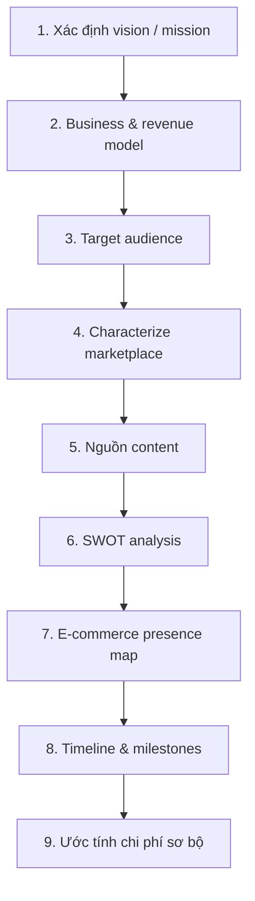
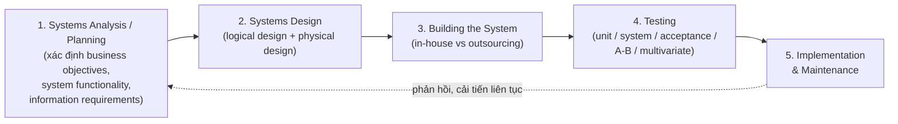
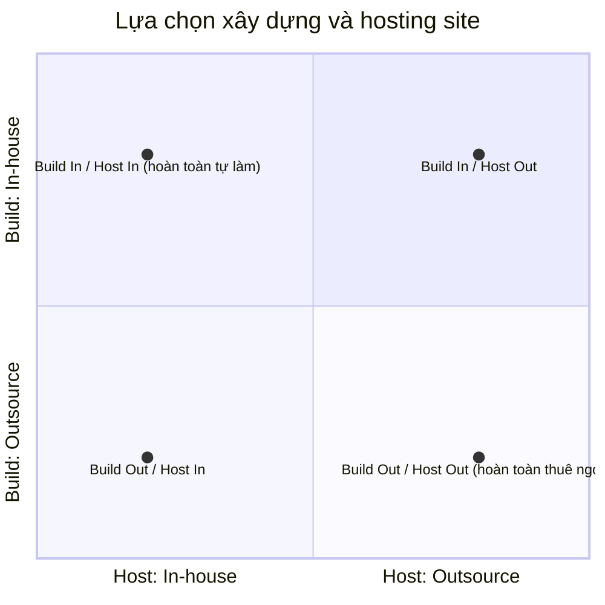
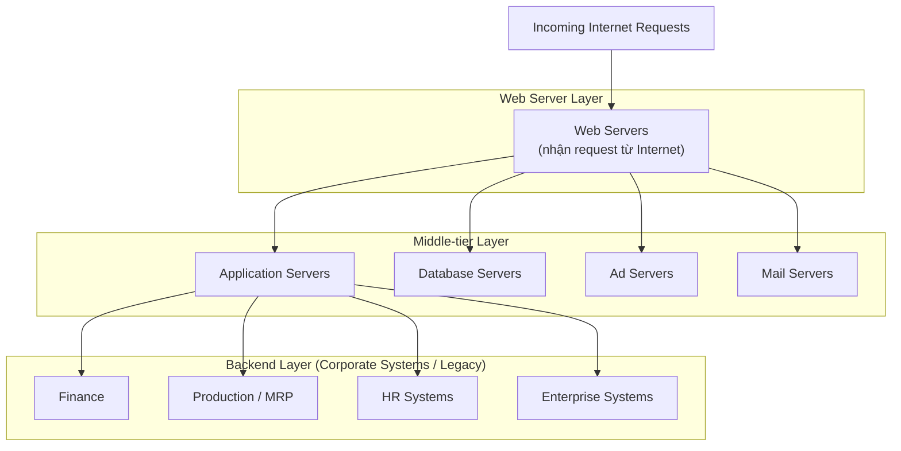
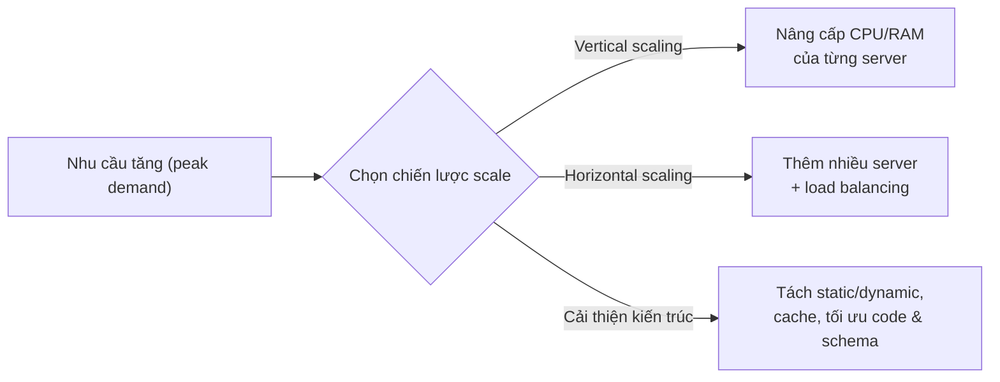

# Chương 4: Xây dựng sự hiện diện Thương mại điện tử — Website, Mobile Site và App

> Nguồn: *E-Commerce 2023–2024: Business, Technology, Society* (Laudon & Traver, 18th/Global Edition), Chương 4, trang sách 176–237 (trang PDF 210–271).

## 1. Tóm tắt & giải thích kiến thức

### Câu chuyện mở đầu: Walmart — từ Supercenter đến Super App

Walmart là công ty lớn nhất thế giới về doanh thu bán lẻ truyền thống nhưng lại là kẻ đi sau trong e-commerce so với Amazon (Amazon chiếm ~40% thị phần e-commerce Mỹ, Walmart chỉ ~7%). Để đuổi kịp, Walmart đã: (1) thiết kế lại website theo hướng hình ảnh chất lượng cao, giảm mật độ thông tin, tăng cá nhân hóa (personalization); (2) hợp nhất 2 app (app chính + app grocery) thành một app duy nhất để có trải nghiệm omnichannel liền mạch; (3) tích hợp "scan & go", universal search/checkout; (4) mở rộng thành "super app" bao gồm cả dịch vụ tài chính (mua lại các công ty fintech để lập ra ONE). Bài học: chiến lược omnichannel (kết hợp store vật lý + web + app) đòi hỏi đầu tư đồng bộ về công nghệ, thiết kế và dữ liệu khách hàng.

---

### 4.1 Hình dung sự hiện diện Thương mại điện tử (Imagine Your E-commerce Presence)

Trước khi xây dựng bất kỳ website/app nào, doanh nghiệp phải trả lời một loạt câu hỏi chiến lược — đây là bước "visioning":

1. **What's the idea? (Visioning process)** — Xác định tầm nhìn/sứ mệnh (mission). Ví dụ: Amazon = "công ty lấy khách hàng làm trung tâm nhất trái đất"; Google = sáng tạo & đổi mới.
2. **Where's the money? (Business & revenue model)** — Chọn mô hình kinh doanh (e-tailer, content provider, transaction broker, market creator, service provider, community provider, portal — xem lại Chương 2) và mô hình doanh thu (quảng cáo, subscription, phí giao dịch, bán hàng, affiliate). Một công ty có thể kết hợp nhiều mô hình.
3. **Who and where is the target audience?** — Xác định đối tượng theo nhân khẩu học (demographics), hành vi tiêu dùng, kênh số ưa thích, buyer persona.
4. **What's the ballpark? (Characterize the marketplace)** — Phân tích thị trường: đang tăng trưởng hay suy giảm, cấu trúc cạnh tranh (đối thủ, nhà cung cấp, sản phẩm thay thế).
5. **Where's the content coming from?** — Nội dung là "xương sống" doanh thu: gồm nội dung tĩnh (static — ít thay đổi) và nội dung động (dynamic — do doanh nghiệp hoặc người dùng tạo ra, gọi là user-generated content).
6. **Know yourself: SWOT analysis** — Phân tích Điểm mạnh (Strengths), Điểm yếu (Weaknesses), Cơ hội (Opportunities), Thách thức (Threats) để định vị chiến lược.
7. **Develop an e-commerce presence map** — Có 4 loại hiện diện: website/app, social media, e-mail, offline media; mỗi loại có nền tảng (platform) và hoạt động (activity) riêng.
8. **Develop a timeline: milestones** — Chia dự án thành các giai đoạn (thường 6 phase: planning → website dev → web implementation → social media plan → social media implementation → mobile plan). Xu hướng hiện nay là đảo ngược thứ tự, làm mobile trước ("mobile-first").
9. **How much will this cost?** — Chi phí gồm hardware, software, hosting, telecom (mỗi loại nhỏ, đã giảm mạnh) nhưng phần lớn ngân sách (>50%) dồn vào content development và marketing.

---

### 4.2 Xây dựng hiện diện E-commerce: cách tiếp cận hệ thống (Building an E-commerce Presence: A Systematic Approach)

Hai thách thức cốt lõi: (1) hiểu rõ mục tiêu kinh doanh, (2) chọn đúng công nghệ để đạt mục tiêu đó — nguyên tắc "**let the business drive the technology**" (để kinh doanh dẫn dắt công nghệ, không phải ngược lại).

Các nhóm yếu tố cần quyết định: **Human resources, Design, Telecommunications, Management, Software, Hardware architecture**.

#### Systems Development Life Cycle (SDLC)

SDLC là phương pháp luận hiểu mục tiêu kinh doanh và thiết kế giải pháp phù hợp, gồm 5 bước:

**Bước 1 — Systems Analysis/Planning:** trả lời câu hỏi "hệ thống này phải làm gì cho doanh nghiệp?". Ba khái niệm quan trọng:
- **Business objectives**: năng lực mà site cần có (ví dụ hiển thị sản phẩm, cá nhân hóa, thực hiện giao dịch...).
- **System functionalities**: loại năng lực hệ thống thông tin cần có để đạt business objectives (ví dụ digital catalog, shopping cart, ad server...).
- **Information requirements**: dữ liệu cụ thể hệ thống cần (mô tả sản phẩm, tồn kho, thông tin khách hàng...).

Sách liệt kê 10 business objective điển hình của website e-commerce: display goods, cung cấp thông tin sản phẩm, personalize/customize, engage customer (blog/forum), execute transaction, tích lũy thông tin khách hàng, hỗ trợ sau bán, điều phối marketing/quảng cáo, đo hiệu quả marketing, liên kết sản xuất/nhà cung cấp.

**Bước 2 — Systems Design:** gồm
- **Logical design**: mô tả luồng thông tin (data flow), các hàm xử lý, database sử dụng, các thủ tục bảo mật/backup.
- **Physical design**: chuyển logical design thành các thành phần vật lý cụ thể (model server, phần mềm, băng thông...).

**Bước 3 — Building the System: In-house vs Outsourcing.** Có 2 quyết định độc lập nhưng thường xét cùng lúc: (a) **Build** site (tự làm hay thuê ngoài) và (b) **Host** site (tự vận hành server hay thuê ngoài).

Về **build**, phổ công cụ trải dài từ rẻ/dễ đến đắt/tùy biến cao:
- Template dựng sẵn (rẻ nhất): Wix, WordPress, Squarespace, Shopify, Weebly.
- Tự code "from scratch": HTML5/CSS/JavaScript, công cụ như Dreamweaver, Visual Studio.
- Gói phần mềm thương mại điện tử cao cấp (đắt nhất): Sitecore Commerce, HCL Commerce (trước là IBM WebSphere Commerce).

Rủi ro tự xây (in-house): chi phí cao, dễ làm kém, đường học tập dài, chậm ra thị trường — nhưng đổi lại có site đúng ý và dễ thay đổi nhanh khi cần. Rủi ro mua gói đắt tiền: phải đánh giá kỹ nhiều gói, tốn thời gian, có thể cần chỉnh sửa phát sinh chi phí ("gói $4.000 dễ thành dự án $40.000–60.000").

Về **hosting**: phần lớn doanh nghiệp nhỏ/vừa thuê ngoài (outsource hosting — trả phí hàng tháng, nhà cung cấp đảm bảo site "live" 24/7). Doanh nghiệp lớn có thể chọn **co-location** (mua/thuê server riêng nhưng đặt tại cơ sở vật lý của nhà cung cấp — vendor lo hạ tầng, đường truyền), hoặc thuê **cloud service** (thuê không gian ảo, trả theo mức dùng — pay-as-you-go, đang thay thế dần co-location vì rẻ và tin cậy hơn).

**Bước 4 — Testing:**
- **Unit testing**: test từng module riêng lẻ.
- **System testing**: test toàn bộ site như người dùng thực tế sẽ dùng.
- **Acceptance testing**: nhân sự chủ chốt (marketing, sản xuất, sales, quản lý) tự dùng thử trên server test để xác nhận mục tiêu kinh doanh đạt được.
- **A/B testing (split testing)**: đưa 2 phiên bản trang cho 2 nhóm người dùng khác nhau xem để so sánh hiệu quả (template test, new concept test, funnel test).
- **Multivariate testing**: test nhiều biến (headline, ảnh, nút, text...) cùng lúc theo mọi tổ hợp có thể (ví dụ 3 phần tử × 2 phiên bản = 2³ = 8 tổ hợp).

Lưu ý: testing thường bị **thiếu ngân sách** (under-budgeted) — có thể chiếm tới 50% ngân sách dự án.

**Bước 5 — Implementation, Maintenance, Optimization:** Chi phí bảo trì hàng năm thường xấp xỉ chi phí phát triển ban đầu (site $40.000 → bảo trì ~$40.000/năm). Phân bổ thời gian bảo trì: ~20% sửa lỗi khẩn cấp, ~20% thay đổi report/data links, ~60% cho quản trị chung + nâng cấp tính năng. Doanh nghiệp cần một **web team** đa kỹ năng (lập trình viên, designer, quản lý kinh doanh) để liên tục theo dõi, benchmarking (so sánh với đối thủ về tốc độ, layout, thiết kế).

**Tối ưu hiệu năng website** gồm 3 nhóm yếu tố: **Page content** (tối ưu HTML/ảnh, kiến trúc site), **Page generation** (server response time, bộ tăng tốc phần cứng), **Page delivery** (CDN như Akamai, edge caching, băng thông).

#### Phương pháp phát triển thay thế (Alternative Web Development Methodologies)

- **Prototyping**: xây bản mẫu nhanh, rẻ để thử nghiệm ý tưởng, cải tiến lặp lại dựa trên phản hồi (wireframe → clickable mockup → prototype thật).
- **Agile development**: chia dự án lớn thành các sub-project nhỏ hoàn thành nhanh theo chu kỳ lặp (iteration) + phản hồi liên tục.
- **Scrum**: một dạng agile, có "sprint" — nhóm liên chức năng đưa một tập tính năng từ ý tưởng → code → tính năng đã test.
- **DevOps**: chiến lược tổ chức xây trên nền agile, thúc đẩy hợp tác chặt giữa dev và operations để release ứng dụng nhanh và ổn định hơn.
- **Component-based development**: xây hệ thống bằng cách lắp ráp các thành phần phần mềm (component) có sẵn (shopping cart, xác thực người dùng, search engine...).
- **Web services**: các thành phần phần mềm lỏng lẻo, tái sử dụng, dùng XML và giao thức mở để ứng dụng này giao tiếp ứng dụng khác qua **API** mà không cần lập trình tùy chỉnh.
- **Service-Oriented Architecture (SOA)**: phong cách thiết kế phần mềm dùng tập hợp các dịch vụ tự chứa (self-contained services) giao tiếp với nhau tạo thành ứng dụng hoàn chỉnh.
- **Microservices**: triển khai SOA ở mức rất chi tiết — ứng dụng được phân rã thành nhiều dịch vụ nhỏ, mỗi dịch vụ đảm nhiệm một tác vụ riêng, có thể build/deploy/scale độc lập.

---

### 4.3 Chọn phần mềm (Choosing Software)

#### Kiến trúc site: đơn tầng vs đa tầng

- **Single-tier (kiến trúc đơn tầng)**: chỉ có 1 server chạy phần mềm web server cơ bản, phục vụ trang HTML tĩnh — phù hợp site không giao dịch tiền.
- **Two-tier architecture**: web server trả lời yêu cầu trang web + database server lưu trữ dữ liệu backend.
- **Multi-tier architecture**: web server liên kết với tầng giữa (middle tier — các application server thực hiện tác vụ chuyên biệt: xử lý giao dịch, quảng cáo, mail...) và tầng backend (hệ thống doanh nghiệp hiện có: tài chính, sản xuất/MRP, HR...).

#### Web server software

Cung cấp: bảo mật, file transfer, search, thu thập dữ liệu, e-mail, site management tools. Hai phần mềm phổ biến nhất:
- **Apache** (chạy trên Linux/Unix) — web server dùng nhiều nhất, miễn phí, cộng đồng lập trình toàn cầu phát triển, rất ổn định.
- **Microsoft IIS (Internet Information Services)** — chạy trên Windows, tương thích tốt với hệ sinh thái Microsoft.

**Site management tools**: kiểm tra link còn hoạt động (tránh **dead link**), phát hiện **orphan file** (file không liên kết tới trang nào), theo dõi hành vi khách hàng.

**Dynamic page generation**: nội dung trang được lưu dưới dạng object trong database thay vì hard-code trong HTML; khi có request, nội dung được lấy từ database qua JSP, Node.js, ASP.NET... Lợi ích: giảm menu cost (chi phí đổi giá/mô tả sản phẩm), cho phép market segmentation (bán cùng sản phẩm cho các thị trường khác nhau) và price discrimination (bán giá khác nhau cho khách khác nhau). **ODBC/JDBC** là chuẩn kết nối dữ liệu độc lập hệ quản trị CSDL.

**Web Content Management System (WCMS)**: tách phần trình bày (design) khỏi nội dung (content) — nội dung lưu trong database, liên kết động với site. Ví dụ: WordPress, Joomla, Drupal (mã nguồn mở); OpenText, Adobe, Sitecore, HubSpot (thương mại).

#### Application servers & E-commerce merchant server software

**Web application server**: phần mềm cung cấp chức năng nghiệp vụ cụ thể (catalog, giỏ hàng, database, streaming media, quảng cáo, email) — đóng vai trò middleware kết nối hệ thống doanh nghiệp truyền thống với khách hàng.

**E-commerce merchant server software (e-commerce software platform)**: gói tích hợp cung cấp gần như toàn bộ chức năng cần thiết — quan trọng nhất là **online catalog** (danh mục sản phẩm) và **shopping cart** (giỏ hàng, tích hợp xử lý thẻ tín dụng).

Các mức độ:
- Template rẻ: Shopify, WordPress/WooCommerce, Wix, Square, Weebly, Squarespace, BigCommerce.
- Mã nguồn mở (open-source): osCommerce, Zen Cart, AgoraCart... (bảng 4.4 liệt kê thêm MySQL cho database; PHP/JavaScript/Ruby on Rails/Django cho scripting; Google Analytics/Matomo cho phân tích).
- Tầm trung: HCL Commerce, Sitecore Experience Commerce.
- Cao cấp/doanh nghiệp lớn: SAP Commerce, Oracle ATG, Adobe Commerce — nhiều nền tảng nay cung cấp theo mô hình **SaaS** (Software as a Service).

**Tiêu chí chọn nền tảng e-commerce**: functionality (kể cả SaaS), hỗ trợ nhiều mô hình kinh doanh (kể cả m-commerce), công cụ mô hình hóa quy trình nghiệp vụ, công cụ quản lý/báo cáo trực quan, hiệu năng & khả năng mở rộng (scalability), khả năng kết nối hệ thống hiện có, tuân thủ chuẩn, khả năng đa văn hóa/toàn cầu, quy tắc thuế/vận chuyển địa phương.

---

### 4.4 Chọn phần cứng (Choosing Hardware)

**Hardware platform**: toàn bộ thiết bị tính toán cần để đạt chức năng e-commerce. Mục tiêu: đủ công suất đáp ứng **peak demand** (nhu cầu đỉnh điểm) mà không lãng phí.

**Phía cầu (demand side)**: phụ thuộc loại site (bảng 4.5 so sánh 5 loại: Publish/Subscribe, Shopping, Customer self-service, Trading, Web services/B2B) theo các tiêu chí: nội dung, bảo mật, số phiên đồng thời, tìm kiếm, số SKU, khối lượng giao dịch, độ phức tạp tích hợp legacy, lượt xem trang. Phiên làm việc web là **stateless** (server không cần duy trì kết nối liên tục với client); phục vụ trang tĩnh là **I/O intensive** (cần I/O hơn là sức mạnh xử lý CPU).

**Phía cung (supply side) — Scalability** (khả năng mở rộng quy mô theo nhu cầu):
- **Vertical scaling**: tăng sức mạnh xử lý của từng thành phần (thêm CPU, nâng cấp chip) — nhược điểm: tốn kém, phụ thuộc vào ít máy mạnh (rủi ro downtime lớn).
- **Horizontal scaling**: thêm nhiều server và cân bằng tải (load balancing) — ưu điểm: rẻ, có dự phòng (redundancy); nhược điểm: tăng độ phức tạp quản lý và diện tích vật lý ("footprint").
- **Cải thiện kiến trúc xử lý**: tách nội dung tĩnh/động, cache nội dung tĩnh trong RAM, cache bảng tra cứu database, dồn business logic (shopping cart, xử lý thẻ) vào server chuyên dụng, tối ưu code và database schema.

---

### 4.5 Các công cụ khác cho E-commerce site (Other E-commerce Site Tools)

**Thiết kế website — cân nhắc kinh doanh cơ bản**: Bảng 4.8 liệt kê các điều làm khách hàng khó chịu (bắt xem quảng cáo trước, pop-up, quá nhiều click, link hỏng, điều hướng rối, bắt đăng ký trước khi xem, trang load chậm, nội dung lỗi thời...). Bảng 4.9 nêu 8 yếu tố thành công: **Functionality, Informational, Ease of use, Redundant navigation (nhiều đường dẫn tới cùng nội dung), Ease of purchase, Multi-browser functionality, Simple graphics, Legible text**.

**SEO (Search Engine Optimization)**: dùng metatags/keyword/title hợp lý (head keyword ngắn/chung, body keyword cụ thể hơn, long-tail keyword rất chi tiết); cung cấp nội dung chuyên môn (white paper, FAQ); được các site khác trỏ link tới (backlink); mua quảng cáo tìm kiếm trả phí; tối ưu local e-commerce bằng từ khóa địa phương.

**Công cụ tương tác & nội dung động**: Lịch sử phát triển qua các công nghệ —
- **CGI (Common Gateway Interface)**: chuẩn đầu tiên cho tương tác browser–server (nay lỗi thời do vấn đề bảo mật).
- **Java / JSP (Java Server Pages)**: Java tạo tương tác phía client (Write Once Run Anywhere qua Java VM); JSP kết hợp HTML + Java để sinh trang động phía server.
- **JavaScript**: ngôn ngữ của Netscape, chạy phía client để validate input, thao tác DOM; nền tảng của Node.js (server-side JS), React, Vue, AngularJS, D3.js, jQuery, Ajax (cập nhật trang bất đồng bộ), TypeScript (superset JS của Microsoft).
- **ASP / ASP.NET**: ASP của Microsoft (chỉ chạy trên IIS/Windows); ASP.NET là bản kế thừa, nay đa nền tảng.
- **ColdFusion**: môi trường server-side tích hợp của Adobe, dùng ngôn ngữ tag-based CFML.
- **PHP**: ngôn ngữ scripting mã nguồn mở phổ biến nhất phía server (>75% thị phần theo W3Techs), là một phần của mô hình **LAMP** (Linux, Apache, MySQL, PHP).
- **Ruby on Rails (RoR)**: framework mã nguồn mở dựa trên Ruby, theo triết lý "convention over configuration" — dùng bởi Shopify, Airbnb, Etsy...
- **Django**: framework mã nguồn mở dựa trên Python, tối ưu cho site hướng database, theo nguyên tắc DRY — dùng bởi Instagram, Spotify, Pinterest...
- **Widget** (gadget/plug-in): đoạn code nhỏ dựng sẵn, chạy tự động trong trang HTML (lịch, thời tiết, tin tức...).
- **Mashup**: kết hợp dữ liệu/chức năng từ 2 chương trình (phổ biến nhất: nhúng Google Maps vào site khác).

**Cá nhân hóa / tùy biến (Personalization/Customization)**: **Personalization** = đối xử với người dùng dựa trên đặc điểm cá nhân & lịch sử; **Customization** = thay đổi sản phẩm cho phù hợp nhu cầu khách. Công cụ cơ bản: **cookie** (file text nhỏ lưu trên máy khách chứa customer ID, lịch sử mua hàng...). Công cụ nâng cao: Kibo Monetate, Barilliance, Salesforce Commerce Cloud, Google Optimize (miễn phí).

**Bộ chính sách thông tin (Information Policy Set)**: **Privacy policy** (chính sách công khai về cách xử lý thông tin cá nhân khách hàng) và **Accessibility rules** (đảm bảo người khuyết tật tiếp cận được site). Mục Insight on Society của sách phân tích tranh cãi pháp lý về ADA (Americans with Disabilities Act) có áp dụng cho website hay không (án lệ Domino's vs Winn-Dixie trái chiều nhau); Bộ Tư pháp Mỹ (DOJ) năm 2022 ra hướng dẫn nghiêng về việc ADA áp dụng cho mọi website; chuẩn kỹ thuật tham chiếu là **WCAG (Web Content Accessibility Guidelines)** của W3C và chuẩn **Section 508** của chính phủ Mỹ.

---

### 4.6 Phát triển Mobile Website và xây dựng Mobile Application

Hơn 90% người dùng Internet truy cập ít nhất một phần qua thiết bị di động, nên doanh nghiệp cần quyết định giữa 4 loại hiện diện di động:

| Loại | Đặc điểm | Tốc độ |
|---|---|---|
| **Mobile website** | Bản rút gọn của website thường, chạy trên server của công ty, dùng HTML/PHP/SQL chuẩn, cần kết nối Web | Chậm nhất |
| **Mobile web app** | Chạy trong trình duyệt mobile (vd Safari), dùng HTML5/CSS/JS, có thể dùng GPS, tính toán real-time | Nhanh hơn mobile website |
| **Native app** | Viết riêng cho hệ điều hành/phần cứng thiết bị (biên dịch ra binary code), hoạt động cả khi offline | Nhanh nhất |
| **Hybrid app** | Kết hợp: chạy trong "native container" (đóng gói phân phối qua app store, truy cập API thiết bị) nhưng nội dung dựng bằng HTML5/CSS3/JS như mobile web app | Trung bình |

**Lập kế hoạch mobile presence**: cũng theo logic phân tích hệ thống (business objective → system functionality → information requirements — bảng 4.10). Ví dụ: mục tiêu **branding/xây cộng đồng** → nên chọn native app (trải nghiệm sâu, dùng được offline, khai thác được phần cứng như gyroscope); mục tiêu **driving sales/quảng bá rộng** → mobile website/mobile web app đủ dùng, rẻ và nhanh triển khai hơn.

**Thiết kế cho di động** phải tính đến: hardware nhỏ hơn/giới hạn tài nguyên, kết nối chậm hơn, màn hình nhỏ cần đơn giản hóa, giao diện cảm ứng (touch) khác chuột/bàn phím.

- **Mobile-first design**: bắt đầu thiết kế từ mobile rồi mở rộng dần lên desktop (progressive enhancement) — thay vì làm desktop rồi cắt gọt xuống mobile. Giúp tập trung vào cái quan trọng nhất nhưng khó với designer quen cách truyền thống.
- **Responsive Web Design (RWD)**: dùng cùng HTML nhưng CSS3 điều chỉnh layout theo độ phân giải màn hình (grid-based layout, ảnh linh hoạt, media queries). Phù hợp site đơn giản; nhược điểm: có thể vẫn nặng/chậm vì mang cả kích thước site desktop.
- **Adaptive Web Design (AWD)** (hay responsive with server-side components — RESS): server phát hiện thiết bị và tải bản site được tối ưu riêng theo template định trước + CSS/JS — tải nhanh hơn, có thể bật/tắt chức năng linh hoạt (ví dụ Lufthansa dùng AWD để ưu tiên check-in, tra cứu chuyến bay trên mobile).

**Công cụ phát triển app đa nền tảng (cross-platform)**: Flutter (Google, build native cho Android/iOS/Windows/Mac/Web), React Native (dùng React + JavaScript), Appery.io, Codiqa, Swiftic (không cần code), Iconic, Axway Appcelerator.

**Chi phí**: mobile website là lựa chọn rẻ nhất (từ dưới $1.000 với template đến hơn $1 triệu cho site tùy biến lớn); mobile web app tốn hơn; native app tốn nhất do phải thiết kế lại toàn bộ logic giao diện (không tái sử dụng được gì từ website cũ) nhưng đổi lại tạo trải nghiệm thương hiệu độc đáo nhất.

Case: **Duolingo** minh họa việc mobile app trở thành trọng tâm phát triển (80% người dùng học trên mobile chỉ sau 2 năm ra mắt app), dùng AWS (DynamoDB, EC2, S3), A/B testing liên tục (>100 test cùng lúc), thuật toán cá nhân hóa AI riêng (BirdBrain), mô hình doanh thu freemium.

---

### 4.7 Nghề nghiệp trong E-commerce & 4.8 Case Study

Mục 4.7 giới thiệu các vị trí nghề nghiệp liên quan (web developer/programmer, front-end/full-stack developer, UI/UX designer, webmaster) qua ví dụ tin tuyển dụng UX Designer tại một chuỗi nhà hàng Ý, kèm bộ câu hỏi phỏng vấn mẫu (về trải nghiệm e-commerce yêu thích, cá nhân hóa, chọn native/mobile web/hybrid app...).

Case Study 4.8 — **Dick's Sporting Goods: Pivoting Pays Off**: Dick's từng thuê ngoài toàn bộ e-commerce (qua GSI, sau đó eBay) suốt ~15 năm; từ 2015 quyết định đưa phát triển phần mềm về in-house (hợp tác VMware Pivotal Labs), xây nền tảng riêng trên IBM WebSphere Commerce (nay HCL Commerce) chạy trên Microsoft Azure, tích hợp SOA (Apache ServiceMix), OMS của Manhattan Associates... Ưu tiên tính năng: mua online nhận tại store (BOPIS), ship from/to store (biến cửa hàng vật lý thành mini trung tâm phân phối — ~80% đơn ship trong khu vực cửa hàng). Khi Covid-19 ập đến (3/2020), nhờ nền tảng đã chủ động, Dick's ra mắt tính năng curbside pickup contactless chỉ trong 48 giờ. Tiếp tục đầu tư: hợp nhất đăng nhập qua Auth0, cá nhân hóa qua Adobe Experience Cloud. Kết quả: doanh thu e-commerce tăng từ 16% lên 21% tổng doanh số.

---

## 2. Key Concepts

*(Tổng hợp từ các thuật ngữ chú giải bên lề chương — trình bày theo từng mục lớn)*

**Mục 4.1–4.2 — Lập kế hoạch & xây dựng:**
- **SWOT analysis**: phân tích Điểm mạnh, Điểm yếu, Cơ hội, Thách thức của doanh nghiệp.
- **Systems Development Life Cycle (SDLC)**: phương pháp luận hiểu mục tiêu kinh doanh và thiết kế giải pháp hệ thống phù hợp.
- **Business objectives**: các năng lực bạn muốn site có.
- **System functionalities**: loại năng lực hệ thống thông tin cần để đạt business objectives.
- **Information requirements**: các thành phần dữ liệu hệ thống cần để đạt business objectives.
- **System design specification**: mô tả các thành phần chính trong hệ thống và quan hệ giữa chúng.
- **Logical design**: mô tả luồng thông tin, các hàm xử lý, database, thủ tục bảo mật/backup sẽ dùng.
- **Physical design**: chuyển logical design thành các thành phần vật lý cụ thể.
- **Outsourcing**: thuê nhà cung cấp bên ngoài thay vì dùng nhân sự nội bộ.
- **Co-location**: doanh nghiệp mua/thuê server riêng nhưng đặt tại cơ sở vật lý của nhà cung cấp, nhà cung cấp lo hạ tầng/đường truyền.
- **Unit testing**: test từng module chương trình riêng lẻ.
- **System testing**: test toàn bộ site như cách người dùng thực tế sẽ dùng.
- **Acceptance testing**: xác nhận các mục tiêu kinh doanh ban đầu thực sự hoạt động đúng.
- **A/B testing (split testing)**: đưa 2 phiên bản trang cho nhóm người dùng khác nhau để so hiệu quả.
- **Multivariate testing**: xác định nhiều biến trên trang, tạo mọi tổ hợp phiên bản để test đồng thời.
- **Benchmarking**: so sánh site với đối thủ về tốc độ phản hồi, chất lượng layout, thiết kế.
- **Prototyping**: xây bản mẫu nhanh, rẻ để test một khái niệm/quy trình.
- **Agile development**: chia dự án lớn thành các sub-project nhỏ hoàn thành theo chu kỳ lặp và phản hồi liên tục.
- **Scrum**: một dạng agile cung cấp khung quản lý quy trình phát triển (dùng khái niệm "sprint").
- **DevOps**: chiến lược tổ chức xây trên nền agile, thúc đẩy hợp tác giữa phát triển và vận hành.
- **Component-based development**: xây hệ thống bằng cách lắp ráp, tích hợp các component phần mềm có sẵn.
- **Web services**: thành phần phần mềm lỏng lẻo, tái sử dụng, dùng XML/giao thức mở để ứng dụng giao tiếp qua API mà không cần code tùy chỉnh.
- **Service-Oriented Architecture (SOA)**: phong cách thiết kế phần mềm dùng tập hợp dịch vụ tự chứa giao tiếp nhau tạo thành ứng dụng.
- **Microservices**: triển khai SOA rất chi tiết, ứng dụng phân rã thành nhiều dịch vụ nhỏ, mỗi dịch vụ một tác vụ riêng.

**Mục 4.3 — Phần mềm:**
- **System architecture**: cách sắp xếp phần mềm, máy móc, tác vụ trong hệ thống thông tin để đạt một chức năng cụ thể.
- **Two-tier architecture**: web server trả lời request trang web + database server lưu dữ liệu backend.
- **Multi-tier architecture**: web server liên kết tầng giữa (application servers) và tầng backend (hệ thống doanh nghiệp hiện có).
- **Site management tools**: xác minh link còn hợp lệ và phát hiện orphan file (file không liên kết tới trang nào).
- **Dynamic HTML (DHTML)**: nhóm công nghệ (HTML, CSS, JavaScript, DOM) kết hợp để tạo website tương tác.
- **Dynamic page generation**: nội dung trang lưu dưới dạng object trong database, được lấy ra khi có yêu cầu, thay vì hard-code trong HTML.
- **Web Content Management System (WCMS)**: dùng để tạo và quản lý nội dung web, tách nội dung khỏi trình bày.
- **Web application server**: phần mềm cung cấp chức năng nghiệp vụ cụ thể mà website cần.
- **E-commerce merchant server software (e-commerce software platform)**: môi trường tích hợp cung cấp gần như toàn bộ chức năng cần để phát triển site lấy khách hàng làm trung tâm.
- **Online catalog**: danh sách sản phẩm có trên website.
- **Shopping cart**: cho phép khách để dành sản phẩm muốn mua, xem lại, chỉnh sửa, rồi thanh toán.
- **Open-source software**: phần mềm do cộng đồng lập trình viên/nhà thiết kế phát triển, miễn phí sử dụng và chỉnh sửa.

**Mục 4.4 — Phần cứng:**
- **Hardware platform**: toàn bộ thiết bị tính toán hệ thống dùng để đạt chức năng e-commerce.
- **Stateless**: server không cần duy trì tương tác liên tục, chuyên biệt với client.
- **I/O intensive**: cần thao tác input/output hơn là sức mạnh xử lý CPU.
- **Scalability**: khả năng site tăng quy mô theo nhu cầu.
- **Vertical scaling**: tăng sức mạnh xử lý của từng thành phần.
- **Horizontal scaling**: dùng nhiều máy tính để chia sẻ tải công việc.

**Mục 4.5 — Công cụ khác:**
- **Common Gateway Interface (CGI)**: chuẩn đầu tiên được chấp nhận rộng rãi cho giao tiếp browser–server.
- **Java**: ngôn ngữ lập trình cho phép tạo tương tác/nội dung động trên máy client, giảm tải cho server.
- **Java Server Pages (JSP)**: chuẩn coding trang web kết hợp HTML, JSP script và Java để sinh trang động khi có yêu cầu.
- **JavaScript**: ngôn ngữ lập trình của Netscape dùng để điều khiển đối tượng trên trang HTML và xử lý tương tác với trình duyệt.
- **Active Server Pages (ASP)**: công cụ phát triển độc quyền của Microsoft cho phép lập trình viên dùng IIS xây trang động.
- **ASP.NET**: bản kế thừa của ASP.
- **ColdFusion**: môi trường server-side tích hợp để phát triển ứng dụng web tương tác.
- **PHP**: ngôn ngữ scripting mã nguồn mở, đa dụng.
- **Ruby on Rails (RoR, Rails)**: framework ứng dụng web mã nguồn mở dựa trên ngôn ngữ Ruby.
- **Django**: framework ứng dụng web mã nguồn mở dựa trên ngôn ngữ Python.
- **Widget**: đoạn code nhỏ dựng sẵn, tự động chạy trong trang HTML, thực hiện nhiều loại tác vụ.
- **Privacy policy**: tuyên bố công khai cho khách hàng biết cách bạn xử lý thông tin cá nhân thu thập trên site.
- **Accessibility rules**: mục tiêu thiết kế đảm bảo người khuyết tật tiếp cận site hiệu quả.

**Mục 4.6 — Mobile:**
- **Mobile website**: phiên bản rút gọn nội dung và điều hướng của website desktop thông thường.
- **Native app**: ứng dụng thiết kế riêng để chạy trên phần cứng và hệ điều hành của thiết bị di động.
- **Mobile web app**: ứng dụng chạy trên trình duyệt web di động tích hợp sẵn trong smartphone/tablet.
- **Hybrid app**: app có nhiều đặc điểm của cả native app và mobile web app.
- **Mobile first design**: bắt đầu quy trình phát triển e-commerce bằng hiện diện mobile thay vì website desktop.
- **Responsive Web Design (RWD)**: công cụ/nguyên tắc thiết kế tự động điều chỉnh layout website theo độ phân giải màn hình thiết bị.
- **Adaptive Web Design (AWD)**: kỹ thuật phía server phát hiện thuộc tính thiết bị và tải phiên bản site tối ưu riêng theo template định trước cùng CSS/JavaScript.

---

## 3. Questions

*(Nguyên văn 20 câu hỏi trong mục 4.9 Review — trang 236)*

**1. What are the main factors to consider in developing an e-commerce presence?**
Các yếu tố chính: nhóm nhân sự/tổ chức (human resources), thiết kế (design), hạ tầng viễn thông (telecommunications), quản lý (management), phần mềm (software), kiến trúc phần cứng (hardware architecture) — như minh họa ở Figure 4.4. Ngoài ra cần trả lời trước các câu hỏi ở mục 4.1 (tầm nhìn, mô hình doanh thu, đối tượng mục tiêu, đặc điểm thị trường, nguồn nội dung, SWOT, e-commerce presence map, timeline, ngân sách).

**2. Define the systems development life cycle, and discuss the various steps involved in creating an e-commerce site.**
SDLC là phương pháp luận để hiểu mục tiêu kinh doanh của một hệ thống và thiết kế giải pháp phù hợp. 5 bước: (1) Systems analysis/planning — xác định business objectives, system functionalities, information requirements; (2) Systems design — logical design và physical design; (3) Building the system — quyết định in-house hay outsourcing (cả build lẫn host); (4) Testing — unit, system, acceptance, A/B, multivariate testing; (5) Implementation and maintenance — vận hành, bảo trì liên tục.

**3. Discuss the differences between a simple logical and a simple physical website design.**
Logical design mô tả luồng thông tin (data flow), các hàm xử lý cần thực hiện, database sẽ dùng, và các thủ tục bảo mật/backup/kiểm soát — ở mức khái niệm, chưa gắn với thiết bị cụ thể. Physical design chuyển logical design đó thành các thành phần vật lý thật: model server cụ thể sẽ mua, phần mềm cụ thể sẽ dùng, kích thước đường truyền viễn thông cần thiết, cách hệ thống được backup và bảo vệ khỏi bên ngoài.

**4. Why is system testing important? Name the types of testing and their relationship to each other.**
System testing quan trọng vì một site e-commerce phức tạp có thể có hàng nghìn luồng đi (pathway) cần được tài liệu hóa và kiểm thử; nếu không test kỹ, lỗi sẽ ảnh hưởng trực tiếp đến trải nghiệm và doanh thu. Các loại: unit testing (từng module) → system testing (toàn site như người dùng thực) → acceptance testing (nhân sự công ty xác nhận mục tiêu kinh doanh đạt được) → A/B testing và multivariate testing (tối ưu thiết kế/nội dung dựa trên so sánh hiệu quả thực tế). Chúng bổ sung cho nhau theo trình tự từ nhỏ đến toàn diện, từ kỹ thuật đến tối ưu kinh doanh.

**5. Compare the costs for system development and system maintenance. Which is more expensive, and why?**
Chi phí bảo trì hàng năm thường xấp xỉ bằng chi phí phát triển ban đầu (ví dụ site $40.000 phát triển thì bảo trì cũng ~$40.000/năm); với site rất lớn (~$1 triệu để phát triển) thì bảo trì hàng năm có thể chỉ bằng một nửa đến ba phần tư chi phí phát triển (có economies of scale). Về lâu dài, tổng chi phí bảo trì tích lũy qua nhiều năm thường vượt chi phí phát triển ban đầu, vì e-commerce site không bao giờ "xong" — luôn trong trạng thái sửa đổi, cải tiến liên tục.

**6. Why is a website so costly to maintain? Discuss the main factors that impact cost.**
Vì không giống hệ thống payroll cố định, site e-commerce liên tục thay đổi/cải tiến/sửa lỗi. Phân bổ thời gian bảo trì điển hình: ~20% debug code và xử lý sự cố khẩn cấp; ~20% thay đổi report, data file, liên kết tới database backend; ~60% còn lại cho quản trị chung (đổi giá, sản phẩm trong catalog) và bổ sung tính năng mới.

**7. What are the main differences between single-tier and multi-tier site architecture?**
Single-tier: chỉ 1 server chạy phần mềm web server cơ bản, phục vụ trang HTML tĩnh, không có giao dịch. Multi-tier: web server liên kết với tầng giữa gồm nhiều application server đảm nhiệm các tác vụ chuyên biệt (giỏ hàng, quảng cáo, mail...) và một tầng backend chứa hệ thống doanh nghiệp/legacy hiện có (tài chính, sản xuất, HR); thường triển khai trên nhiều máy tính vật lý chia sẻ workload.

**8. Name the basic functionalities that web server software should provide.**
Trả lời yêu cầu trang HTML/XML, dịch vụ bảo mật (security services), truyền file (file transfer), dịch vụ tìm kiếm (search services), thu thập dữ liệu (data capture), e-mail, và các công cụ quản lý site (site management tools).

**9. What are the main factors to consider in choosing the best hardware platform for your website?**
Ba yếu tố chính: tốc độ (speed), năng lực (capacity) và khả năng mở rộng (scalability). Cụ thể cần đánh giá: số người dùng đồng thời ở peak, bản chất các yêu cầu của khách hàng, loại nội dung, yêu cầu bảo mật, số lượng SKU trong kho, số lượt truy vấn trang, tốc độ của các ứng dụng legacy cần cung cấp dữ liệu.

**10. What is DevOps and how does it relate to agile development?**
DevOps ("development and operations") là chiến lược tổ chức xây dựng trên các nguyên tắc agile, tạo văn hóa và môi trường thúc đẩy hợp tác chặt chẽ giữa đội phát triển ứng dụng và đội vận hành/duy trì ứng dụng. DevOps hướng tới giao tiếp/hợp tác thường xuyên hơn giữa 2 nhóm và một quy trình làm việc nhanh, ổn định xuyên suốt vòng đời phát triển — nhờ đó release ứng dụng đáng tin cậy hơn, nhanh hơn và thường xuyên hơn so với chỉ áp dụng agile đơn thuần.

**11. Compare and contrast the various scaling methods. Explain why scalability is a key business issue for websites.**
Vertical scaling: tăng sức mạnh xử lý từng máy (thêm CPU, nâng cấp chip) — nhược điểm: tốn kém, phụ thuộc số ít máy mạnh (rủi ro downtime cao khi 1 máy hỏng). Horizontal scaling: thêm nhiều server, cân bằng tải — ưu điểm: rẻ (có thể tận dụng máy cũ), có redundancy (dự phòng khi 1 máy hỏng), nhưng tăng độ phức tạp quản lý và diện tích lắp đặt (footprint) khi số lượng máy lớn. Cách thứ ba là cải thiện kiến trúc xử lý (tách static/dynamic, cache, tối ưu code/schema) — kết hợp cả hai loại scaling với thiết kế khéo léo. Scalability là vấn đề kinh doanh cốt lõi vì site phải đáp ứng đúng nhu cầu đỉnh điểm (tránh chậm/crash gây mất khách) nhưng không lãng phí đầu tư hạ tầng khi nhu cầu thấp.

**12. What are the eight most important factors impacting website design, and how do they affect a site's operation?**
Theo Table 4.9: Functionality (trang hoạt động tốt, load nhanh, hướng khách tới sản phẩm), Informational (link dễ tìm để biết thêm về công ty/sản phẩm), Ease of use (điều hướng đơn giản, không lỗi), Redundant navigation (nhiều đường dẫn khác nhau tới cùng nội dung), Ease of purchase (mua hàng chỉ 1-2 click), Multi-browser functionality (hoạt động tốt trên các trình duyệt phổ biến), Simple graphics (tránh hình ảnh/âm thanh gây xao nhãng mà người dùng không kiểm soát được), Legible text (tránh nền làm méo hoặc khó đọc chữ). Các yếu tố này ảnh hưởng trực tiếp tới việc khách có tìm được, mua được sản phẩm và có quay lại hay không.

**13. What are Java and JavaScript? What role do they play in website design?**
Java là ngôn ngữ lập trình cho phép tạo tương tác và nội dung động chạy trên máy client (giảm tải cho server), ban đầu thiết kế để chạy trên mọi hệ điều hành qua Java Virtual Machine; ngày nay vẫn quan trọng (ví dụ nền tảng Android). JavaScript là ngôn ngữ do Netscape phát minh, dùng để điều khiển đối tượng trên trang HTML và xử lý tương tác với trình duyệt — phổ biến nhất để validate input phía client (kiểm tra định dạng số điện thoại, email...) và là nền tảng của nhiều công cụ khác (Node.js, React, Vue, AngularJS, jQuery, Ajax, TypeScript).

**14. Name and describe three methods used to treat customers individually. Why are they significant to e-commerce?**
Ba phương pháp: (1) Cookie — file text nhỏ đặt trên máy khách lưu ID khách hàng, lịch sử mua hàng, giúp nhận diện khi khách quay lại; (2) Personalization — cá nhân hóa nội dung/thông điệp hiển thị dựa trên đặc điểm và lịch sử của từng khách; (3) Customization — thay đổi chính sản phẩm/gợi ý sản phẩm (similar/complementary items) cho phù hợp nhu cầu riêng của khách. Chúng quan trọng vì giúp e-commerce mô phỏng lại trải nghiệm "chợ truyền thống" (người bán nhớ mặt, hiểu ý khách quen) — thậm chí vượt trội hơn mua sắm đại trà, vô danh ở trung tâm thương mại, từ đó tăng gắn kết và doanh thu.

**15. What are some of the policies e-commerce businesses must develop before launching a site, and why must they be developed?**
Cần phát triển: privacy policy (tuyên bố công khai về cách xử lý thông tin cá nhân thu thập được) và accessibility rules (đảm bảo người khuyết tật tiếp cận được site, dựa theo chuẩn WCAG/Section 508). Cần thiết vì đây là nghĩa vụ pháp lý/đạo đức, ảnh hưởng tới lòng tin khách hàng, và (với accessibility) tránh rủi ro kiện tụng theo ADA — đồng thời mở rộng được tệp khách hàng bao gồm hơn 50 triệu người Mỹ có khuyết tật.

**16. What are the advantages and disadvantages of mobile first design?**
Ưu điểm: buộc designer tập trung vào những gì thực sự quan trọng nhất do giới hạn màn hình nhỏ, tạo ra thiết kế mobile gọn gàng và hiệu quả hơn là thiết kế desktop rồi mới cắt gọt xuống; sau đó mở rộng dần lên desktop (progressive enhancement). Nhược điểm: đòi hỏi cách tiếp cận khác biệt, có thể khó khăn cho các designer vốn quen với quy trình thiết kế truyền thống (desktop trước).

**17. What is the difference between a mobile web app and a native app?**
Mobile web app chạy trong trình duyệt web di động (ví dụ Safari), xây bằng HTML5/CSS/JavaScript, cần kết nối Internet, tốc độ khá nhanh nhưng chậm hơn native app. Native app được thiết kế riêng cho phần cứng/hệ điều hành cụ thể của thiết bị, biên dịch thành binary code, chạy cực nhanh, có thể hoạt động cả khi không kết nối Internet (offline) — nhưng phải phát triển riêng cho từng nền tảng (app iOS không chạy được trên Android).

**18. In what ways does a hybrid mobile app combine the functionality of a mobile web app and the functionality of a native app?**
Giống native app: chạy trong "native container" trên thiết bị, được đóng gói để phân phối qua app store, và truy cập được API của thiết bị (ví dụ gyroscope) mà mobile web app thường không truy cập được. Giống mobile web app: dựa trên HTML5, CSS3 và JavaScript nhưng dùng browser engine của thiết bị để render HTML5 và xử lý JavaScript cục bộ.

**19. What is PHP, and how is it used in web development?**
PHP là ngôn ngữ scripting mã nguồn mở, đa dụng, thường dùng nhiều nhất trong ứng dụng web phía server để sinh nội dung trang động (dù cũng có thể dùng cho giao diện phía client). Nó là một phần của nhiều framework phát triển web (CakePHP, CodeIgniter...) và là thành phần "P" trong mô hình LAMP (Linux, Apache, MySQL, PHP). Theo W3Techs, PHP là ngôn ngữ scripting phía server phổ biến nhất (hơn 75% website xác định được ngôn ngữ dùng).

**20. How does responsive web design differ from adaptive web design?**
Responsive Web Design (RWD) dùng cùng một mã HTML và thiết kế cho mọi thiết bị, chỉ dùng CSS để điều chỉnh layout/hiển thị theo độ phân giải màn hình (kỹ thuật: layout dạng lưới linh hoạt, ảnh/media linh hoạt, media queries) — xử lý hoàn toàn ở phía client/trình duyệt. Adaptive Web Design (AWD) xử lý ở phía server: server phát hiện thuộc tính của thiết bị gửi yêu cầu và dùng các template định trước theo kích thước màn hình (cùng CSS/JavaScript) để tải một phiên bản site đã được tối ưu riêng cho thiết bị đó — nhờ vậy tải nhanh hơn và có thể bật/tắt chức năng linh hoạt hơn so với RWD.

---

## 4. Projects

*(Nguyên văn 5 đề bài trong mục 4.9 Review — trang 236–237, kèm hướng dẫn thực hiện)*

**Project 1.** *"Go to the website of Wix, Weebly, or another provider of your choosing that allows you to create a simple e-commerce website for a free trial period. Create a website. The site should feature at least four pages, including a home page, a product page, a shopping cart, and a contact page. Extra credit will be given for additional complexity and creativity. Come to class prepared to present your concept and website."*

*Hướng dẫn thực hiện:*
1. Đăng ký tài khoản dùng thử miễn phí tại Wix, Weebly, Squarespace hoặc Shopify (theo Section 4.2/4.3 trong chương — đây là các nền tảng template phổ biến).
2. Chọn một chủ đề/sản phẩm cụ thể (ví dụ cửa hàng phụ kiện, đồ handmade) để có nội dung nhất quán.
3. Dựng tối thiểu 4 trang bắt buộc: **Home page** (giới thiệu thương hiệu, banner, điều hướng chính), **Product page** (ít nhất 1 sản phẩm với ảnh, mô tả, giá), **Shopping cart** (kích hoạt tính năng giỏ hàng có sẵn của nền tảng), **Contact page** (form liên hệ hoặc thông tin liên lạc).
4. Để có điểm cộng: thêm blog, mục FAQ, tích hợp mạng xã hội, responsive design test trên mobile, hoặc thêm trang khuyến mãi.
5. Trình bày: chuẩn bị demo trực tiếp trên trình duyệt hoặc chụp screenshot từng trang, giải thích lý do chọn bố cục/màu sắc và cách trang phục vụ mục tiêu kinh doanh giả định.
6. Lưu ý: dùng tài khoản dùng thử miễn phí, không cần thanh toán thật; kiểm tra kỹ hạn dùng thử trước khi hết hạn để kịp trình bày.

**Project 2.** *"Visit several e-commerce sites, not including those mentioned in this chapter, and evaluate the effectiveness of the sites according to the eight basic criteria/functionalities listed in Table 4.9. Choose one site that you feel does an excellent job on all the aspects of an effective site, and create a PowerPoint or similar presentation, including screen shots, to support your choice."*

*Hướng dẫn thực hiện:*
1. Chọn 3–5 website e-commerce KHÔNG được nhắc tới trong chương (tránh Amazon, Walmart, Wix, Dick's Sporting Goods, Duolingo...).
2. Với mỗi site, chấm điểm theo đúng 8 tiêu chí của Table 4.9: Functionality, Informational, Ease of use, Redundant navigation, Ease of purchase, Multi-browser functionality, Simple graphics, Legible text.
3. So sánh điểm giữa các site, chọn ra 1 site làm tốt nhất toàn diện.
4. Tạo bài trình bày PowerPoint (hoặc Google Slides): mỗi tiêu chí nên có 1 slide kèm screenshot minh họa cụ thể (ví dụ khoanh vùng nút mua hàng để minh họa "ease of purchase").
5. Kết luận bằng nhận xét tổng thể vì sao site đó nổi bật, có thể liên hệ với khái niệm trong chương (ví dụ site dùng RWD/AWD, cá nhân hóa, SEO tốt).
6. Lưu ý: chụp screenshot thật (không dùng ảnh minh họa mạng) để đảm bảo tính xác thực của đánh giá.

**Project 3.** *"Imagine that you are in charge of developing a fast-growing startup's e-commerce presence. Consider your options for building the company's e-commerce presence in-house with existing staff or outsourcing the entire operation. Decide which strategy you believe is in your company's best interest, and create a brief presentation outlining your decision. Why choose that approach? And what are the estimated associated costs, compared with the alternative? (You'll need to make some educated guesses here—don't worry about being exact.)"*

*Hướng dẫn thực hiện:*
1. Giả định bối cảnh cụ thể: loại hình startup, quy mô nhân sự hiện tại, ngân sách khả dụng (có thể tham khảo Figure 4.3 và Figure 4.7 trong chương về cơ cấu chi phí và các lựa chọn build/host).
2. Liệt kê ưu/nhược điểm build in-house (tốc độ thay đổi nhanh, kiểm soát tốt hơn, nhưng chi phí cao, rủi ro thất bại, thời gian học tập dài — theo nội dung mục "Build Your Own versus Outsourcing") so với outsourcing (nhanh ra thị trường hơn, ít rủi ro kỹ thuật, nhưng chi phí tùy biến cao và phụ thuộc vendor).
3. Đưa ra quyết định cuối cùng kèm lý do rõ ràng gắn với đặc điểm startup giả định (ví dụ: đội ngũ ít kinh nghiệm kỹ thuật → nên outsource ban đầu rồi dần đưa về in-house khi đã có doanh thu, giống case Dick's Sporting Goods).
4. Ước tính chi phí (không cần chính xác tuyệt đối): có thể tham khảo các mốc chi phí nêu trong chương (site đơn giản vài trăm–vài nghìn USD; site tùy biến vừa $5.000–$10.000; site doanh nghiệp lớn có thể hàng trăm nghìn đến hàng triệu USD/năm) rồi so sánh 2 phương án.
5. Trình bày dưới dạng slide ngắn gọn: bối cảnh → phân tích 2 lựa chọn → quyết định → ước tính chi phí so sánh → rủi ro và cách giảm thiểu.

**Project 4.** *"Choose two e-commerce software packages, and prepare an evaluation chart that rates the packages on the key factors discussed in the section 'Choosing an E-commerce Software Platform.' Which package would you choose if you were developing a website of the type described in this chapter, and why?"*

*Hướng dẫn thực hiện:*
1. Chọn 2 gói phần mềm e-commerce cụ thể (có thể chọn ở các phân khúc khác nhau để dễ so sánh, ví dụ Shopify vs Adobe Commerce, hoặc WooCommerce vs Sitecore Experience Commerce — tham khảo danh sách trong chương: Shopify, WooCommerce, BigCommerce, HCL Commerce, SAP Commerce, Oracle Commerce Cloud, Salesforce Commerce Cloud...).
2. Lập bảng đánh giá (evaluation chart) theo đúng các tiêu chí nêu trong mục "Choosing an E-commerce Software Platform": Functionality (kể cả có SaaS không), Hỗ trợ nhiều mô hình kinh doanh (kể cả m-commerce), Công cụ mô hình hóa quy trình nghiệp vụ, Công cụ quản lý/báo cáo trực quan, Hiệu năng & khả năng mở rộng, Kết nối hệ thống hiện có, Tuân thủ chuẩn, Khả năng đa văn hóa/toàn cầu, Quy tắc thuế/vận chuyển địa phương.
3. Với mỗi tiêu chí, tra cứu tài liệu chính thức/trang so sánh (G2, Capterra) hoặc trang chủ nhà cung cấp để chấm điểm hoặc mô tả định tính (Có/Không/Một phần).
4. Dùng ví dụ doanh nghiệp cỡ vừa được nêu trong chương (công ty phụ tùng công nghiệp, ngân sách $100.000 — mục 4.2) làm bối cảnh tham chiếu để chọn gói phù hợp.
5. Kết luận: chọn 1 gói và giải thích lý do dựa trên bối cảnh giả định (quy mô, ngân sách, độ phức tạp mô hình kinh doanh).

**Project 5.** *"Choose one of the open-source web content management systems such as WordPress, Joomla, or Drupal or another of your own choosing, and prepare an evaluation chart similar to that required by Project 4. Which system would you choose and why?"*

*Hướng dẫn thực hiện:*
1. Chọn 1 WCMS mã nguồn mở (WordPress, Joomla, Drupal, hoặc lựa chọn khác như OpenCms — xem danh sách trong mục "Dynamic Page Generation Tools").
2. Lập bảng đánh giá tương tự Project 4, dùng cùng bộ tiêu chí (functionality, hỗ trợ mô hình kinh doanh, công cụ quản lý, hiệu năng/scalability, kết nối hệ thống, tuân thủ chuẩn, khả năng toàn cầu hóa, quy tắc thuế/vận chuyển).
3. Vì đây là hệ thống quản trị nội dung (không phải nền tảng e-commerce đầy đủ), cần lưu ý thêm về khả năng mở rộng qua plugin/extension để có chức năng thương mại điện tử (ví dụ WooCommerce cho WordPress).
4. So sánh chi phí ẩn: chi phí hosting, chi phí thuê lập trình viên tùy biến, thời gian học (learning curve) — như đã đề cập ở phần "advantage/disadvantage of open-source tools" trong chương.
5. Kết luận: chọn hệ thống phù hợp nhất và giải thích rõ lý do, có thể trình bày dưới dạng bảng Markdown/Excel kèm phần giải thích ngắn.

