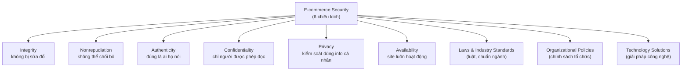
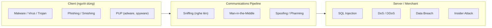
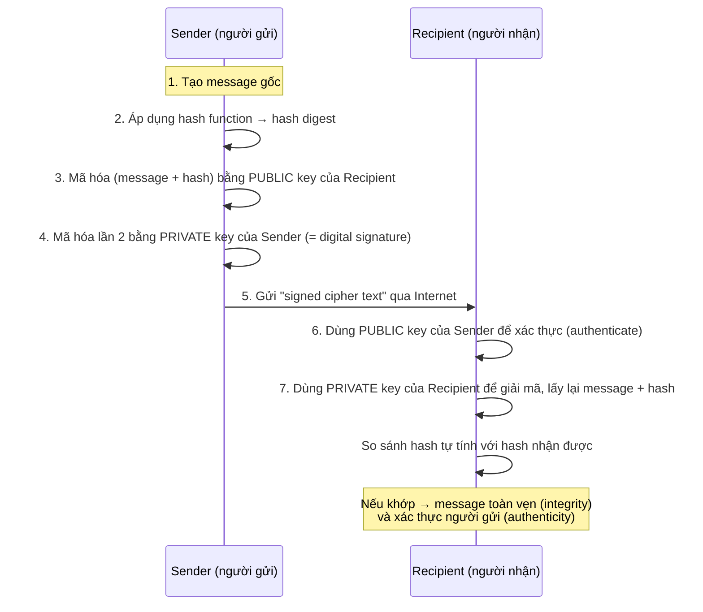
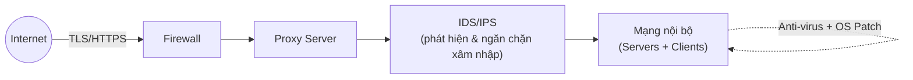
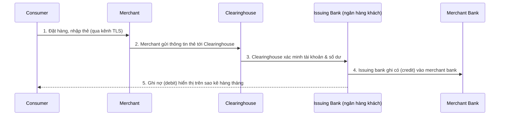
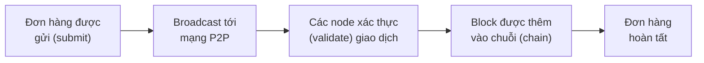

# Chương 5: E-commerce Security and Payment Systems (An ninh & Hệ thống thanh toán trong Thương mại điện tử)

> Nguồn: *E-Commerce: Business, Technology and Society*, Laudon & Traver, 18th edition (2024). Chương 5, trang sách 238–312 (trang PDF 272–346).

## 1. Tóm tắt & giải thích kiến thức

### 5.1 Môi trường an ninh e-commerce (The E-commerce Security Environment)

**Quy mô vấn đề:** Cybercrime là vấn đề lớn nhưng khó đo chính xác vì doanh nghiệp ngại báo cáo (sợ mất lòng tin khách hàng). Theo CSIS/McAfee, chi phí cybercrime toàn cầu năm 2020 vượt **1 nghìn tỷ USD**; Cybersecurity Ventures ước tính 2021 là **6 nghìn tỷ USD**, dự báo gần **11 nghìn tỷ USD** vào 2025. Chi phí trung bình một vụ data breach (IBM/Ponemon 2021) là **4.2 triệu USD** toàn cầu, Mỹ cao nhất (9 triệu USD).

**Thị trường ngầm (underground economy / Dark Web):** Tội phạm không dùng trực tiếp dữ liệu ăn cắp mà bán lại trên các chợ đen (Dark Web/Darknet). Giá tham khảo: một số thẻ tín dụng (kèm CVV) ~$17; thông tin cá nhân đầy đủ (fullz: SSN, tên, ngày sinh...) ~$8/bản ghi.

**6 chiều kích (dimensions) của an ninh e-commerce** — đây là khung khái niệm quan trọng nhất của mục này:

| Chiều kích | Câu hỏi của khách hàng | Câu hỏi của merchant |
|---|---|---|
| **Integrity** (toàn vẹn) | Thông tin tôi gửi/nhận có bị thay đổi không? | Dữ liệu nhận từ khách có hợp lệ, không bị sửa? |
| **Nonrepudiation** (không thể chối bỏ) | Đối tác có thể chối đã thực hiện hành động không? | Khách có thể chối đã đặt hàng không? |
| **Authenticity** (xác thực danh tính) | Tôi đang giao dịch với ai? | Danh tính thật của khách là gì? |
| **Confidentiality** (bảo mật) | Người khác có đọc được tin nhắn của tôi không? | Dữ liệu có bị truy cập trái phép không? |
| **Privacy** (riêng tư) | Tôi có kiểm soát được việc sử dụng thông tin cá nhân? | Thông tin khách hàng được dùng ra sao? |
| **Availability** (sẵn sàng) | Tôi có truy cập được site không? | Site/app có đang hoạt động không? |

**Tension giữa security và giá trị khác:** Bảo mật càng cao → càng khó dùng, càng chậm (thêm chi phí tính toán, lưu trữ). Quá nhiều bảo mật hại lợi nhuận; quá ít bảo mật có thể khiến công ty phá sản. Giải pháp: adaptive security (phân loại rủi ro theo user), cho phép user tùy chỉnh mức bảo mật.

### 5.2 Các mối đe dọa an ninh (Security Threats in the E-commerce Environment)

Ba điểm dễ tổn thương về công nghệ: **client**, **server**, **communications pipeline** (đường truyền Internet).

**Malicious code (malware):** virus (tự nhân bản, gắn vào file khác), worm (tự lan từ máy này sang máy khác, không cần user kích hoạt — vd Slammer, Conficker), ransomware (mã hóa file, đòi tiền chuộc — vd Cryptolocker, WannaCry, các vụ Colonial Pipeline/JBS 2021), Trojan horse (giả trang, không tự nhân bản nhưng mở đường cho mã độc khác — vd Zeus, Emotet, Trickbot), backdoor, bot/botnet (máy tính "zombie" bị điều khiển từ xa). Exploit kit giúp cả người không giỏi kỹ thuật cũng trở thành hacker.

**Potentially Unwanted Programs (PUP/PUA):** adware, browser parasite (thay đổi cài đặt trình duyệt), cryptojacking (chiếm CPU đào coin lén), spyware (ghi lại keystroke, lấy email, chụp màn hình).

**Phishing:** lừa đảo qua email/tin nhắn để lấy thông tin tài chính, dựa vào social engineering chứ không cần mã độc. Biến thể: BEC (Business Email Compromise — giả làm sếp yêu cầu chuyển tiền, thiệt hại >43 tỷ USD 2016–2021), spear phishing (nhắm vào khách hàng cụ thể của một thương hiệu, vd giả LinkedIn). DMARC là giao thức chống giả mạo địa chỉ email gửi.

**Hacking / cybervandalism / hacktivism:** hacker (truy cập trái phép), cracker (hacker có ý đồ xấu), cybervandalism (phá hoại site), hacktivism (hack vì mục đích chính trị, kèm doxing). Có "ethical hacker" được thuê hợp pháp để test bảo mật (bug bounty).

**Data breach:** mất quyền kiểm soát thông tin cho bên ngoài. Ví dụ lớn: Yahoo (3 tỷ user), Marriott/Starwood (~400 triệu), Equifax (~147 triệu), T-Mobile (2021, 50 triệu). Data breach còn tạo điều kiện cho **credential stuffing** (dùng username/password rò rỉ để đăng nhập hàng loạt bằng bot).

**Credit card fraud/theft:** luật Mỹ giới hạn trách nhiệm cá nhân ở $50. EMV card (chip) giảm gian lận "card-present" nhưng gian lận "card-not-present" (CNP) tăng vì thương mại điện tử.

**Identity fraud:** dùng trái phép dữ liệu cá nhân (SSN, thẻ, mật khẩu...) để trục lợi tài chính.

**Spoofing, pharming, spam websites:** spoofing = giả địa chỉ email/IP để che giấu danh tính thật; pharming = tự động chuyển hướng link web sang địa chỉ khác giả mạo; spam/junk websites (link farm) = trang giả vờ cung cấp dịch vụ nhưng thực chất chỉ là tập hợp quảng cáo.

**Sniffing & Man-in-the-Middle (MitM):** sniffer = nghe lén thụ động traffic mạng; MitM = chủ động chen vào giữa, có thể thay đổi nội dung giao tiếp giữa hai bên tưởng đang nói chuyện trực tiếp với nhau.

**DoS / DDoS:** DoS = làm ngập server bằng traffic rác từ một nguồn; DDoS = tấn công từ hàng nghìn máy phân tán (thường qua botnet, kể cả botnet IoT như Mirai). Kỹ thuật "carpet-bombing" nhắm nhiều IP cùng lúc. DDoS lớn nhất từng ghi nhận: 3.45 Tbps nhắm vào khách hàng Azure (11/2021).

**Insider attacks:** đe dọa từ nhân viên nội bộ có quyền truy cập hợp pháp — thường thiệt hại lớn hơn tấn công từ bên ngoài.

**Poorly designed software:** SQL injection (SQLi) — lợi dụng ứng dụng web không kiểm tra input để chèn câu lệnh SQL độc hại (chiếm >55% tấn công web app theo Akamai); zero-day vulnerability — lỗ hổng chưa được công bố/chưa có bản vá (case Log4Shell/Log4j 2021).

**Các nền tảng đặc thù:** social network (viruses, click hijacking, fake apps...), mobile platform (malware mobile, smishing qua SMS, jailbreak làm tăng rủi ro), cloud computing (DDoS đe dọa tính sẵn sàng, trách nhiệm bảo mật dữ liệu không rõ ràng giữa khách hàng và nhà cung cấp cloud), IoT (số lượng thiết bị khổng lồ, vòng đời dài, khó nâng cấp, người dùng không biết khi bị xâm nhập), metaverse (tài sản số, danh tính, dữ liệu sinh trắc học có thể bị đánh cắp/lạm dụng).

### 5.3 Các giải pháp công nghệ (Technology Solutions)

**Encryption (mã hóa):** chuyển plain text thành cipher text. Cung cấp 4/6 chiều kích an ninh: message integrity, nonrepudiation, authentication, confidentiality.

- **Symmetric key cryptography** (secret key): sender và receiver dùng chung 1 key để mã hóa/giải mã. Nhược điểm: phải truyền key an toàn, và số lượng key cần thiết tăng theo n(n-1) khi có nhiều bên. Chuẩn: DES (56-bit, cũ), Triple DES, **AES** (Advanced Encryption Standard — 128/192/256-bit, phổ biến nhất hiện nay).
- **Public key cryptography** (asymmetric, do Diffie & Hellman phát minh 1976): dùng cặp khóa liên quan toán học — public key (công khai) và private key (giữ bí mật). Mã hóa bằng key này thì chỉ giải mã được bằng key kia (hàm một chiều — one-way function).
- **Digital signature + hash function:** hash function tạo ra "message digest" (chuỗi số cố định) để kiểm tra tính toàn vẹn. Kết hợp mã hóa 2 lớp (public key người nhận + private key người gửi) tạo ra digital signature — vừa bảo mật, vừa xác thực người gửi, vừa chống chối bỏ.
- **Digital certificate & PKI (Public Key Infrastructure):** certification authority (CA) — bên thứ 3 đáng tin cậy — cấp digital certificate xác nhận danh tính (tên, public key, ngày hết hạn, chữ ký số của CA...). Hạn chế của PKI: không chống được insider, private key có thể bị mất/đánh cắp, CA có thể không thực sự kiểm chứng kỹ ai đứng sau chứng chỉ, chính sách thu hồi/gia hạn chứng chỉ còn yếu.

**Securing channels of communication:**
- **TLS (Transport Layer Security)** — thay thế SSL cũ, dùng để tạo "secure negotiated session" (URL đổi từ http → https). Quy trình: client và server trao đổi certificate, thống nhất phương thức mã hóa mạnh nhất, tạo session key riêng cho phiên đó.
- **VPN (Virtual Private Network):** cho phép truy cập từ xa an toàn vào mạng nội bộ qua Internet, dùng "tunneling" (bọc gói tin trong lớp mã hóa vô hình).
- **Wi-Fi security:** WEP (yếu, dễ crack) → WPA → WPA2 (dùng AES + CCMP) → WPA3 (mới nhất, vẫn có lỗ hổng).

**Bảo vệ mạng (Protecting Networks):**
- **Firewall:** lọc gói tin ra/vào theo chính sách bảo mật (packet filter hoặc application gateway). Next-generation firewall nhận diện theo ứng dụng, giải mã traffic TLS để kiểm tra.
- **Proxy server:** đóng vai trò "bodyguard", giới hạn truy cập trực tiếp Internet của client nội bộ, ẩn địa chỉ mạng nội bộ, cache trang web để tăng tốc.
- **IDS (Intrusion Detection System):** phát hiện traffic khả nghi, cảnh báo. **IPS (Intrusion Prevention System):** phát hiện + chủ động chặn (ngắt session, chặn IP...).

**Bảo vệ server/client:** cập nhật OS/phần mềm tự động (vá lỗ hổng), phần mềm anti-virus (cần cập nhật liên tục vì virus mới xuất hiện hàng ngày).

### 5.4 Chính sách quản lý, quy trình kinh doanh & luật pháp

**5 bước xây dựng Security Plan:**
1. **Risk assessment** — đánh giá rủi ro và điểm dễ tổn thương (kiểm kê tài sản thông tin, ước tính giá trị × xác suất mất mát).
2. **Security policy** — bộ quy định ưu tiên hóa rủi ro, xác định mức rủi ro chấp nhận được.
3. **Implementation plan** — kế hoạch cụ thể (công nghệ, chính sách, quy trình) để đạt mục tiêu.
4. **Security organization** — đội ngũ/tổ chức phụ trách bảo mật hàng ngày (security officer).
5. **Security audit** — rà soát định kỳ log truy cập, phát hiện bất thường.

**Access control & Authentication:** Zero Trust (ZT) — mặc định không tin ai/thiết bị nào kể cả trong firewall nội bộ. **MFA (Multi-Factor Authentication)** — kết hợp: "something you know" (password), "something you have" (điện thoại, YubiKey), "something you are" (sinh trắc học). **2FA** là tập con của MFA (2 yếu tố). **Biometrics** (vân tay, khuôn mặt — Touch ID/Face ID, iris scan...) ngày càng phổ biến nhưng có rủi ro (không thể "đổi mặt" như đổi mật khẩu). **Security token** (vd RSA SecurID) sinh mã dùng một lần. **Authorization policy** quy định ai được truy cập phần nào của hệ thống.

**Luật & quy định (Table 5.5 — một số luật Mỹ tiêu biểu):**

| Luật | Ý nghĩa |
|---|---|
| Computer Fraud and Abuse Act (CFAA) | Luật liên bang chính chống tội phạm máy tính/hacking |
| Electronic Communications Privacy Act (ECPA) | Phạt hành vi truy cập/nghe lén email riêng tư |
| National Information Infrastructure Protection Act (NIIPA) | Hình sự hóa tấn công DoS |
| HIPAA | Bắt buộc cơ sở y tế báo cáo data breach |
| Gramm-Leach-Bliley Act | Bắt buộc tổ chức tài chính báo cáo data breach |
| E-Sign Law | Công nhận giá trị pháp lý của chữ ký điện tử |
| Patriot Act | Mở rộng quyền giám sát sau 9/11 |
| Homeland Security Act (HSA) | Lập Bộ An ninh Nội địa (DHS) |
| CAN-SPAM Act | Chống spam, hình sự hóa việc giấu danh tính người gửi spam |
| US SAFE WEB Act | Tăng quyền FTC xử lý spyware/spam/gian lận Internet |
| CISA (Cybersecurity Information Sharing Act) | Khuyến khích chia sẻ thông tin đe dọa mạng giữa doanh nghiệp & chính phủ |

Ngoài luật, có các tổ chức hợp tác công-tư: US-CERT (điều phối cảnh báo sự cố mạng), CERT Coordination Center (Carnegie Mellon) — theo dõi, hỗ trợ điều tra tấn công mạng.

### 5.5 Hệ thống thanh toán trong E-commerce (E-commerce Payment Systems)

Thị trường thanh toán trực tuyến Mỹ >1 nghìn tỷ USD (2022); các tổ chức xử lý thu phí ~2–3% giá trị giao dịch.

**Online credit card transaction:** 5 bên tham gia — consumer, merchant, clearinghouse (trung gian xác thực thẻ), merchant bank (acquiring bank), card-issuing bank (ngân hàng phát hành thẻ của khách). Giao dịch online giống MOTO (Mail Order-Telephone Order) — còn gọi là **CNP (Cardholder Not Present)** transaction, dễ bị khách hàng chối bỏ (repudiate) hơn giao dịch tại cửa hàng.

Muốn nhận thanh toán thẻ, merchant cần **merchant account** + **payment gateway** (Authorize.net, Stripe, Square, Cybersource...). Bắt buộc tuân thủ **PCI-DSS** (Payment Card Industry-Data Security Standard — do Visa, Mastercard, Amex, Discover, JCB lập ra, không phải luật nhưng là chuẩn ngành bắt buộc).

**Hạn chế của hệ thống thẻ tín dụng online:** bảo mật kém (không xác thực đầy đủ cả hai bên), rủi ro cho merchant (khách có thể chối giao dịch dù hàng đã giao — CNP fraud ngày càng tăng dù EMV giảm CP fraud), chi phí hành chính/giao dịch cao (~3% + $0.20-0.35/giao dịch), thiếu công bằng xã hội (nhiều người không có/không đủ điều kiện có thẻ).

**Hệ thống thanh toán thay thế (Alternative Online Payment Systems):**
- **PayPal** — "online stored value payment system", dẫn đầu (>425 triệu user hoạt động, 2022). Phí cao (1.9–3.49% + phí cố định) khi dùng thẻ tín dụng làm nguồn tiền.
- **Amazon Pay, Meta Pay, Visa Checkout, MasterPass** — các lựa chọn khác, chưa đạt tầm PayPal.
- **BNPL (Buy Now Pay Later)** — Klarna, Afterpay — trả góp, tăng mạnh từ $6.5 tỷ (2019) lên >$75 tỷ (2022).

**Mobile payment systems (Smartphone Wallet):** 3 loại ví di động:
1. **Universal proximity wallets** (Apple Pay, Google Pay, Samsung Pay) — dùng được tại nhiều merchant.
2. **Branded store proximity wallets** (Walmart Pay, Starbucks Pay) — chỉ dùng tại 1 merchant.
3. **P2P mobile payment apps** (Venmo, Zelle, Square Cash) — chuyển tiền giữa cá nhân.

Công nghệ nền: **NFC (Near Field Communication)** — công nghệ không dây tầm ngắn (~2 inch), dùng cho universal proximity wallets (Apple Pay, Google Pay bắt buộc NFC; Samsung Pay dùng cả NFC lẫn MST). **QR code** — dùng cho branded store wallets (Walmart Pay, Starbucks Pay...).

**Blockchain & Cryptocurrencies:** Blockchain là hệ thống xử lý giao dịch trên **distributed ledger** (sổ cái phân tán) chạy trên mạng ngang hàng (P2P), không cần cơ quan trung ương. Mỗi "block" chứa timestamp + liên kết tới block trước, một khi ghi vào chuỗi thì không thể sửa đổi ngược (immutable). **Smart contract** là chương trình tự động hóa các điều khoản giao dịch.

**Bitcoin** là cryptocurrency nổi bật nhất, do "Satoshi Nakamoto" tạo ra, phi tập trung hoàn toàn, gần như ẩn danh (không cần tên/SSN, chỉ cần "Bitcoin wallet"). "Mining" (đào coin) — máy tính cạnh tranh giải thuật toán mã hóa để xác thực block mới, người thắng nhận thưởng Bitcoin. Giới hạn tối đa 21 triệu Bitcoin. Rủi ro: sàn giao dịch bị hack (Mt. Gox mất 750,000 BTC năm 2014; Axie Infinity mất $615 triệu năm 2022), biến động giá mạnh (đầu cơ), tiêu thụ điện năng khổng lồ (mining), một số nước cấm sử dụng (Trung Quốc, Việt Nam, Thổ Nhĩ Kỳ...). Các altcoin khác: Ethereum/Ether (hỗ trợ smart contract phức tạp), Ripple, Litecoin; **stablecoin** (Tether, USD Coin) neo giá trị vào tài sản bên ngoài (USD) để giảm biến động.

---

## 2. Key Concepts

Danh sách thuật ngữ chính theo mục "Key Concepts" cuối chương (được gộp theo 4 mục tiêu học tập của chương):

**Mục tiêu 5.1 — Phạm vi & 6 chiều kích an ninh:**
- **Integrity (toàn vẹn):** thông tin không bị bên trái phép thay đổi.
- **Nonrepudiation (không thể chối bỏ):** các bên không thể chối đã thực hiện hành động của mình.
- **Authenticity (xác thực):** xác định đúng danh tính của người/tổ chức đang giao dịch.
- **Confidentiality (bảo mật):** chỉ người được phép mới đọc được thông tin.
- **Privacy (riêng tư):** khả năng kiểm soát việc sử dụng thông tin cá nhân của mình.
- **Availability (sẵn sàng):** site/app luôn hoạt động như dự kiến.

**Mục tiêu 5.2 — Các mối đe dọa:**
- **Malicious code / Malware:** virus, worm, ransomware, Trojan horse, bot — mã độc đe dọa tính toàn vẹn và hoạt động của hệ thống.
- **Exploit kit:** bộ công cụ khai thác lỗ hổng đóng gói sẵn, bán/cho thuê.
- **Drive-by download:** malware tự động tải về khi user truy cập trang bị nhiễm.
- **Virus:** chương trình tự nhân bản, lây sang file khác, mang "payload" phá hoại.
- **Worm:** mã độc tự lan từ máy này sang máy khác, không cần user kích hoạt.
- **Ransomware:** mã hóa file và đòi tiền chuộc để giải mã.
- **Trojan horse:** phần mềm giả vờ vô hại nhưng thực hiện hành vi khác, thường mở đường cho mã độc khác.
- **Backdoor:** cửa hậu cho phép kẻ tấn công truy cập bí mật vào hệ thống đã xâm nhập.
- **Bot / Botnet:** máy tính bị chiếm quyền điều khiển từ xa ("zombie"); tập hợp các bot gọi là botnet.
- **Potentially Unwanted Program (PUP):** chương trình tự cài vào máy mà không có sự đồng ý rõ ràng của người dùng.
- **Adware:** PUP hiển thị quảng cáo pop-up.
- **Browser parasite:** chương trình theo dõi/thay đổi cài đặt trình duyệt.
- **Cryptojacking:** cài browser parasite chiếm dụng CPU để đào tiền mã hóa.
- **Spyware:** thu thập keystroke, email, tin nhắn của người dùng.
- **Social engineering:** lợi dụng tính tò mò, tham lam, cả tin, sợ hãi để lừa người dùng.
- **Phishing:** hành vi lừa đảo trực tuyến nhằm lấy thông tin bảo mật để trục lợi tài chính.
- **BEC phishing (Business Email Compromise):** giả làm nhân viên cấp cao yêu cầu chuyển tiền tới tài khoản gian lận.
- **Hacker:** người cố ý truy cập trái phép vào hệ thống máy tính.
- **Cracker:** thuật ngữ chỉ hacker có ý đồ tội phạm.
- **Cybervandalism:** cố ý phá hoại, làm biến dạng, phá hủy một trang web.
- **Hacktivism:** cybervandalism và đánh cắp dữ liệu vì mục đích chính trị.
- **Data breach:** tổ chức mất quyền kiểm soát thông tin (bao gồm thông tin cá nhân) cho bên ngoài.
- **Credential stuffing:** tấn công brute-force dùng cặp username/password rò rỉ từ các vụ data breach trước.
- **Identity fraud:** sử dụng trái phép dữ liệu cá nhân của người khác để trục lợi tài chính.
- **Spoofing:** che giấu danh tính thật bằng cách dùng email/địa chỉ IP của người khác.
- **Pharming:** tự động chuyển hướng link web sang địa chỉ khác, giả mạo điểm đến thật.
- **Spam (junk) websites / link farms:** trang giả vờ cung cấp sản phẩm/dịch vụ nhưng thực chất là tập hợp quảng cáo.
- **Sniffer:** chương trình nghe lén, giám sát thông tin truyền qua mạng.
- **Man-in-the-middle (MitM) attack:** kẻ tấn công chen vào giữa và kiểm soát giao tiếp giữa hai bên.
- **Denial of Service (DoS) attack:** làm ngập site bằng traffic vô ích để làm quá tải server.
- **Distributed Denial of Service (DDoS) attack:** tấn công DoS từ hàng nghìn máy tính phân tán.
- **SQL injection (SQLi) attack:** lợi dụng ứng dụng web mã hóa kém, không kiểm tra input, để chèn mã độc vào hệ thống.
- **Zero-day vulnerability:** lỗ hổng chưa từng được công bố và chưa có bản vá.

**Mục tiêu 5.3 — Giải pháp công nghệ:**
- **Encryption:** chuyển plain text thành cipher text mà chỉ sender/receiver đọc được.
- **Cipher text:** văn bản đã được mã hóa.
- **Key (cipher):** phương pháp để chuyển plain text thành cipher text.
- **Symmetric key cryptography (secret key cryptography):** cả hai bên dùng chung một key để mã hóa/giải mã.
- **Data Encryption Standard (DES):** chuẩn mã hóa của NSA/IBM, dùng key 56-bit.
- **Advanced Encryption Standard (AES):** chuẩn mã hóa khóa đối xứng phổ biến nhất hiện nay (128/192/256-bit).
- **Public key cryptography:** dùng cặp khóa liên quan toán học (public + private), mã hóa bằng key này không thể giải mã bằng chính key đó.
- **Hash function:** thuật toán tạo ra một số có độ dài cố định (hash/message digest) đại diện cho message.
- **Digital signature (e-signature):** cipher text đã "ký" — sản phẩm của việc mã hóa hai lớp bằng public key người nhận và private key người gửi.
- **Digital certificate:** tài liệu số do CA cấp, xác thực danh tính chủ thể.
- **Certification authority (CA):** bên thứ ba đáng tin cậy phát hành digital certificate.
- **Public key infrastructure (PKI):** hệ thống các CA và quy trình chứng chỉ số được các bên chấp nhận.
- **Secure negotiated session:** phiên client-server trong đó URL, nội dung, cookie đều được mã hóa.
- **Session key:** khóa mã hóa đối xứng duy nhất tạo riêng cho một phiên bảo mật.
- **HTTPS:** phiên bản bảo mật của HTTP, dùng TLS để mã hóa và xác thực.
- **Virtual Private Network (VPN):** cho phép truy cập an toàn từ xa vào mạng nội bộ qua Internet.
- **WPA2 / WPA3:** chuẩn bảo mật Wi-Fi thế hệ mới, dùng AES/CCMP (WPA2) hoặc bảo mật mạnh hơn (WPA3).
- **Firewall:** phần cứng/phần mềm lọc gói tin, ngăn chặn theo chính sách bảo mật.
- **Proxy server (proxy):** server phần mềm xử lý mọi giao tiếp với Internet, đóng vai trò "bảo vệ" cho tổ chức.
- **Intrusion detection system (IDS):** giám sát traffic mạng, phát hiện các mẫu/quy tắc chỉ dấu tấn công.
- **Intrusion prevention system (IPS):** như IDS nhưng có thể chủ động ngăn chặn/chặn hành vi khả nghi.
- **Software supply chain attack:** hacker xâm nhập môi trường phát triển để cài mã độc vào phần mềm trước khi phát hành tới người dùng cuối.

**Mục tiêu 5.4 — Chính sách, quy trình & luật pháp:**
- **Risk assessment:** đánh giá rủi ro và các điểm dễ tổn thương.
- **Security policy:** bộ quy định ưu tiên hóa rủi ro thông tin và xác định mục tiêu/chấp nhận rủi ro.
- **Implementation plan:** các bước để đạt được mục tiêu của security plan.
- **Security organization:** đơn vị đào tạo, cảnh báo, duy trì công cụ bảo mật.
- **Access controls:** xác định ai được quyền truy cập hợp pháp vào mạng.
- **Authentication procedures:** chữ ký số, chứng chỉ, PKI, công cụ MFA.
- **Multi-factor authentication (MFA):** yêu cầu nhiều loại thông tin xác thực để chứng minh danh tính.
- **Two-factor authentication (2FA):** một tập con của MFA, yêu cầu 2 yếu tố xác thực.
- **Biometrics:** nghiên cứu các đặc điểm sinh học/vật lý có thể đo lường được.
- **Security token:** thiết bị vật lý/phần mềm sinh mã định danh dùng thay hoặc kèm mật khẩu.
- **Authorization policies:** xác định mức truy cập khác nhau cho các loại người dùng khác nhau.
- **Authorization management system:** xác định khi nào và ở đâu user được phép truy cập.
- **Security audit:** rà soát định kỳ log truy cập.
- **United States Computer Emergency Readiness Team (US-CERT):** đơn vị của Bộ An ninh Nội địa Mỹ điều phối cảnh báo và ứng phó sự cố mạng.
- **CERT Coordination Center:** tổ chức tại Carnegie Mellon giám sát và theo dõi hoạt động tội phạm mạng.

**Mục tiêu 5.5 — Hệ thống thanh toán:**
- **Merchant account:** tài khoản ngân hàng cho phép công ty xử lý thanh toán thẻ và nhận tiền từ giao dịch.
- **PCI-DSS (Payment Card Industry-Data Security Standard):** chuẩn bảo mật dữ liệu do 5 công ty thẻ lớn thiết lập.
- **Online stored value payment system:** hệ thống cho phép thanh toán tức thời dựa trên giá trị lưu trong tài khoản online (vd PayPal).
- **Buy Now Pay Later (BNPL):** dịch vụ cho phép mua hàng và trả góp.
- **Universal proximity mobile wallets:** ví di động dùng được tại nhiều merchant (Apple Pay, Google Pay, Samsung Pay).
- **Branded store proximity mobile wallets:** ví di động chỉ dùng được tại một merchant duy nhất.
- **P2P mobile payment apps:** app thanh toán giữa các cá nhân (Venmo, Zelle, Square Cash).
- **Near field communication (NFC):** công nghệ không dây tầm ngắn dùng để chia sẻ thông tin giữa các thiết bị.
- **Quick Response (QR) code technology:** dùng mã QR hai chiều để trừ tiền từ ví di động.
- **Blockchain:** công nghệ cho phép tạo và xác thực giao dịch trên mạng gần như tức thời, không cần cơ quan trung ương.
- **Blockchain system:** hệ thống xử lý giao dịch trên cơ sở dữ liệu phân tán, chia sẻ (thay vì cơ sở dữ liệu của một tổ chức).
- **Cryptocurrency:** tài sản số thuần túy hoạt động như phương tiện trao đổi, dùng công nghệ blockchain và mã hóa.
- **Bitcoin:** cryptocurrency nổi bật nhất hiện nay.

---

## 3. Questions

### 1. Why is it less risky to steal online? Explain some of the ways cybercriminals deceive consumers and merchants.

**Trả lời:** Ăn cắp trực tuyến ít rủi ro hơn vì Internet cho phép hành động từ xa và gần như ẩn danh — kẻ trộm không cần đối mặt trực tiếp với nạn nhân như trộm cắp truyền thống. Tính ẩn danh này giúp tội phạm tạo danh tính giả trông hợp pháp để đặt hàng gian lận hoặc mạo danh người/tổ chức khác nhằm đánh cắp thông tin. Các cách lừa đảo phổ biến: phishing (email/tin nhắn giả danh tổ chức uy tín để lấy thông tin tài khoản), spoofing (giả địa chỉ email/IP), pharming (chuyển hướng link đến trang giả mạo), social engineering (lợi dụng lòng tin, sự tò mò, nỗi sợ của nạn nhân), và các loại malware (spyware, keylogger) để âm thầm thu thập thông tin đăng nhập, số thẻ tín dụng.

### 2. Explain why an e-commerce site might not want to report being the target of cybercriminals.

**Trả lời:** Doanh nghiệp e-commerce ngại báo cáo bị tấn công vì sợ mất lòng tin của khách hàng — công bố một vụ tấn công/data breach có thể làm tổn hại danh tiếng thương hiệu, khiến khách hàng lo lắng về việc dữ liệu và giao dịch của họ có an toàn hay không, từ đó rời bỏ dịch vụ. Ngoài ra, việc định lượng chính xác giá trị tổn thất bằng tiền cũng khó khăn, khiến nhiều công ty chọn không công khai chi tiết.

### 3. Give an example of security breaches as they relate to each of the six dimensions of e-commerce security. For instance, what would be a privacy incident?

**Trả lời (ví dụ cho từng chiều kích):**
- **Integrity:** hacker chặn và sửa nội dung một lệnh chuyển khoản ngân hàng, đổi số tài khoản nhận tiền.
- **Nonrepudiation:** khách hàng đặt hàng online rồi sau đó chối là chưa từng đặt (vì merchant không có chữ ký vật lý để chứng minh).
- **Authenticity:** một trang web giả mạo (spoofed website) trông giống hệt Amazon để lừa khách nhập thông tin thẻ.
- **Confidentiality:** hacker xâm nhập database và đọc được nội dung email/tin nhắn riêng tư của người dùng.
- **Privacy:** một công ty e-commerce dùng dữ liệu mua sắm của khách hàng để bán cho bên thứ ba mà không xin phép, hoặc dữ liệu cá nhân bị lộ ra ngoài do hacker xâm nhập.
- **Availability:** một cuộc tấn công DDoS khiến trang web thương mại điện tử ngừng hoạt động trong nhiều giờ, khách hàng không thể mua hàng.

### 4. How would you protect your firm against a DoS or DDoS attack?

**Trả lời:** Kết hợp nhiều lớp phòng thủ: dùng firewall và IDS/IPS để phát hiện traffic bất thường sớm; sử dụng dịch vụ chống DDoS chuyên dụng (như dịch vụ bảo vệ DDoS của các nhà cung cấp cloud lớn — ví dụ Azure DDoS Protection) có khả năng hấp thụ traffic khổng lồ; phân tán hạ tầng qua CDN (content delivery network) và nhiều điểm máy chủ (giảm điểm tập trung bị tấn công); giám sát traffic liên tục để phát hiện mẫu tấn công (như carpet-bombing); có kế hoạch ứng phó sự cố (incident response) sẵn sàng; giới hạn tốc độ (rate limiting) và lọc traffic theo IP/nguồn khả nghi; đồng thời giữ quan hệ với ISP để có thể "null-route" traffic độc hại khi cần.

### 5. Name the major points of vulnerability in a typical online transaction.

**Trả lời:** Ba điểm dễ tổn thương chính (Figure 5.2): **(1) Client** (máy tính/thiết bị của người tiêu dùng — nơi malware, sniffing Wi-Fi có thể xảy ra); **(2) Server** (máy chủ merchant — nơi có thể bị SQL injection, hack database khách hàng, DoS attack, đánh cắp thẻ); **(3) Communications pipeline / Internet** (đường truyền giữa client và server — nơi có thể xảy ra wiretap, web beacon theo dõi, wifi listening, security breach khi dữ liệu di chuyển qua nhiều router/server trung gian).

### 6. How does spoofing threaten a website’s operations?

**Trả lời:** Spoofing đe dọa tính toàn vẹn (integrity) và tính xác thực (authenticity) của một trang web. Hacker có thể chuyển hướng khách hàng đến một trang giả mạo trông giống hệt trang thật để thu thập và xử lý đơn hàng — thực chất là đánh cắp hoạt động kinh doanh từ trang thật. Hoặc, nếu mục đích là phá hoại, hacker có thể thay đổi đơn hàng (tăng số lượng, đổi sản phẩm) rồi gửi tiếp đến trang thật để xử lý và giao hàng, khiến khách hàng không hài lòng và công ty gặp biến động tồn kho lớn, ảnh hưởng đến vận hành.

### 7. Why is adware considered to be a security threat?

**Trả lời:** Adware được coi là một mối đe dọa an ninh vì nó tự cài vào máy mà thường không có sự đồng ý rõ ràng của người dùng (một dạng PUP), hiển thị quảng cáo pop-up gây phiền toái, làm chậm máy, và ngày càng được tội phạm mạng lợi dụng như một công cụ phân phối các mã độc khác hoặc theo dõi hành vi người dùng. Adware chiếm 13% loại malware Malwarebytes phát hiện năm 2021, cho thấy nó không đơn thuần là phiền toái mà là một véc-tơ tấn công thực sự.

### 8. What are some of the steps a company can take to curtail cybercriminal activity within the business?

**Trả lời:** Xây dựng và thực hiện security plan đầy đủ 5 bước (risk assessment → security policy → implementation plan → security organization → security audit); áp dụng access controls và authentication procedures nghiêm ngặt (bao gồm MFA); đào tạo nhân viên nhận biết social engineering/phishing; giám sát và ghi log hoạt động nội bộ để phát hiện insider attack; giới hạn quyền truy cập theo nguyên tắc "cần biết mới cho biết" (authorization policy); thực hiện security audit định kỳ; và luôn cập nhật phần mềm/hệ điều hành để vá lỗ hổng kịp thời.

### 9. Explain some of the modern-day flaws associated with encryption. Why is encryption not as secure today as it was earlier in the century?

**Trả lời:** Máy tính ngày nay mạnh và nhanh hơn rất nhiều so với trước, khiến các phương pháp mã hóa cũ (như key ngắn 56-bit của DES) có thể bị bẻ khóa bằng brute force trong thời gian ngắn. Ngay cả AES — chuẩn hiện đại — cũng đã bị các nhà nghiên cứu (Microsoft và một trường đại học Bỉ, 2011) tìm ra cách "làm mỏng" biên độ an toàn (safety margin) của nó, dù chưa bị phá hoàn toàn. Ngoài ra, symmetric key cryptography có nhược điểm nội tại: cần chia sẻ key qua kênh không hoàn toàn an toàn (có thể bị đánh cắp), và số lượng key cần quản lý tăng theo cấp số nhân khi số người dùng tăng (n(n-1) key cho n người). Do đó, độ an toàn của mã hóa luôn là một cuộc chạy đua với sức mạnh tính toán ngày càng tăng.

### 10. Briefly explain how public key cryptography works.

**Trả lời:** Public key cryptography dùng hai khóa liên quan về mặt toán học: một public key (công khai, phổ biến rộng rãi) và một private key (bí mật, chỉ chủ sở hữu giữ). Cả hai khóa đều có thể dùng để mã hóa/giải mã, nhưng một khi đã dùng một khóa để mã hóa, chính khóa đó không thể dùng để giải mã ngược lại (thuật toán là hàm một chiều — one-way function). Ví dụ đơn giản: sender lấy public key của recipient để mã hóa message, gửi qua Internet; chỉ có recipient — người giữ private key tương ứng — mới giải mã được. Phiên bản nâng cao hơn kết hợp hash function và chữ ký số (mã hóa 2 lớp bằng public key người nhận rồi private key người gửi) để đạt được cả tính bảo mật, xác thực, và chống chối bỏ.

### 11. Compare and contrast firewalls and proxy servers and their security functions.

**Trả lời:** Cả hai đều bảo vệ mạng nhưng theo hướng khác nhau. **Firewall** là phần cứng/phần mềm lọc các gói tin ra/vào dựa trên chính sách bảo mật (địa chỉ IP nguồn/đích, cổng, loại dịch vụ...) — chức năng chính là **từ chối truy cập** từ bên ngoài vào máy tính nội bộ (packet filter hoặc application gateway). **Proxy server** đóng vai trò trung gian xử lý mọi giao tiếp giữa client nội bộ và Internet bên ngoài — chức năng chính là **kiểm soát truy cập ra ngoài** của client nội bộ (giới hạn client truy cập trang cấm, ẩn địa chỉ mạng nội bộ, cache trang web để tăng tốc). Nói ngắn gọn: firewall chặn người lạ vào trong, còn proxy kiểm soát người trong đi ra ngoài.

### 12. Is a computer with anti-virus software protected from viruses? Why or why not?

**Trả lời:** Không hoàn toàn. Anti-virus giúp phát hiện và loại bỏ các mã độc đã biết dựa trên "chữ ký" (signature) đã được cập nhật trong cơ sở dữ liệu của phần mềm đó. Tuy nhiên, virus mới xuất hiện hàng ngày, và nếu không cập nhật thường xuyên (một số premium updates hàng giờ), máy tính vẫn có thể bị nhiễm virus mới mà phần mềm chưa "biết". Ngoài ra, các kỹ thuật tấn công tinh vi như zero-day exploit hoặc software supply chain attack có thể vượt qua anti-virus vì mã độc được ẩn giấu trong phần mềm hợp pháp, đáng tin cậy.

### 13. Identify and discuss the five steps in developing an e-commerce security plan.

**Trả lời:** (1) **Perform a risk assessment** — kiểm kê tài sản thông tin, ước tính giá trị và xác suất bị mất mát để xếp hạng ưu tiên rủi ro; (2) **Develop a security policy** — dựa trên kết quả đánh giá rủi ro, xây dựng bộ quy định xác định mức rủi ro chấp nhận được và cơ chế đạt được mục tiêu đó; (3) **Develop an implementation plan** — xác định cụ thể công cụ, công nghệ, quy trình, chính sách nào sẽ được triển khai; (4) **Create a security organization** — thành lập đơn vị/đội ngũ (security officer hoặc team) chịu trách nhiệm đào tạo, giám sát, duy trì công cụ bảo mật hàng ngày; (5) **Perform a security audit** — rà soát định kỳ log truy cập để phát hiện mẫu bất thường, đánh giá hiệu quả của security plan.

### 14. How do biometric devices help improve security? What particular type of security breach do they reduce?

**Trả lời:** Thiết bị sinh trắc học (biometric) xác minh danh tính dựa trên đặc điểm sinh học/vật lý duy nhất của mỗi người (vân tay, khuôn mặt, mống mắt, giọng nói...) thay vì chỉ dựa vào thứ "biết" (mật khẩu) hay thứ "có" (thẻ). Vì các đặc điểm này khó giả mạo hơn nhiều so với mật khẩu bị đánh cắp, biometrics giúp giảm đáng kể khả năng **spoofing/giả mạo danh tính** và **identity fraud** — kẻ tấn công khó có thể "trở thành" người khác chỉ bằng cách biết mật khẩu hay đánh cắp thẻ.

### 15. Briefly discuss the disadvantages of credit cards as the standard for online payments. How does requiring a credit card for payment discriminate against some consumers?

**Trả lời:** Nhược điểm: bảo mật kém (không xác thực được đầy đủ cả merchant và consumer), rủi ro repudiation cao cho merchant (khách có thể chối giao dịch dù đã nhận hàng), chi phí hành chính và giao dịch cao (~3% + phí cố định mỗi giao dịch cộng phí thiết lập), và tính "không dân chủ" — hàng triệu người trẻ tuổi và gần 100 triệu người trưởng thành ở Mỹ không có thẻ tín dụng hoặc không đủ điều kiện (thu nhập thấp, rủi ro tín dụng cao), khiến họ bị loại khỏi khả năng mua sắm trực tuyến dựa vào thẻ — đây chính là sự phân biệt đối xử gián tiếp với nhóm người có thu nhập thấp.

### 16. Describe the major steps involved in an online credit card transaction.

**Trả lời:** (1) Consumer thực hiện mua hàng (thêm vào giỏ hàng); (2) một kênh bảo mật được tạo qua TLS để gửi thông tin thẻ tín dụng tới merchant; (3) phần mềm của merchant liên hệ với clearinghouse (trung gian tài chính xác thực thẻ); (4) clearinghouse liên hệ issuing bank (ngân hàng phát hành thẻ của khách) để xác minh tài khoản và số dư; (5) issuing bank ghi có (credit) vào tài khoản merchant tại merchant bank (thường xử lý theo batch vào ban đêm); (6) khoản ghi nợ (debit) được thể hiện trên sao kê hàng tháng gửi cho consumer.

### 17. Why is Bitcoin so controversial?

**Trả lời:** Bitcoin gây tranh cãi vì nhiều lý do: nó phi tập trung hoàn toàn (không ngân hàng trung ương nào kiểm soát), khiến các chính phủ lo ngại về chủ quyền hệ thống tài chính (một số nước như Trung Quốc, Việt Nam, Thổ Nhĩ Kỳ đã cấm sử dụng); tính ẩn danh gần như hoàn toàn khiến nó trở thành phương tiện thanh toán ưa thích cho các giao dịch bất hợp pháp trên Dark Web (ma túy, vũ khí...); giá trị biến động cực mạnh (đầu cơ), khiến nó khó dùng cho giao dịch hàng ngày và không được bảo vệ như tài sản tài chính truyền thống; các sàn giao dịch tiền mã hóa nhiều lần bị hack gây thiệt hại hàng trăm triệu USD mà không có cơ chế bồi hoàn; và việc "đào" Bitcoin tiêu tốn lượng điện năng khổng lồ (tương đương cả một quốc gia), gây lo ngại về môi trường.

### 18. What is NFC, and how does it work? How does it differ from QR code technology?

**Trả lời:** NFC (Near Field Communication) là tập hợp công nghệ không dây tầm ngắn (~2 inch/50mm) cho phép hai thiết bị trao đổi thông tin khi ở gần nhau. Cần ít nhất một thiết bị "powered" (initiator, như smartphone) và một thiết bị "target" (như đầu đọc NFC của merchant) phản hồi yêu cầu. Người dùng chỉ cần vẫy điện thoại có NFC gần đầu đọc để thanh toán (dùng cho universal proximity wallets như Apple Pay, Google Pay). Ngược lại, **QR code technology** dùng app di động tạo ra một mã vạch 2 chiều (QR code) chứa thông tin mã hóa; merchant quét mã đó để trừ tiền từ ví liên kết với thẻ tín dụng/ghi nợ của khách (thường dùng cho branded store wallets như Walmart Pay, Starbucks Pay). Khác biệt chính: NFC là giao tiếp không dây tầm gần trực tiếp giữa hai thiết bị điện tử, còn QR code là hình ảnh mã hóa được quét bằng camera, không cần công nghệ không dây chuyên dụng.

### 19. How does an online stored value payment system differ from a BNPL service?

**Trả lời:** Online stored value payment system (ví dụ PayPal) cho phép người dùng thực hiện thanh toán **tức thời** dựa trên giá trị đã liên kết/lưu trữ trong tài khoản online (được nạp từ thẻ ngân hàng, thẻ tín dụng hoặc số dư có sẵn) — tiền được chuyển ngay tại thời điểm giao dịch. Ngược lại, **BNPL (Buy Now Pay Later)** (như Klarna, Afterpay) cho phép người mua nhận hàng ngay nhưng **trả góp dần theo thời gian** — thực chất là một hình thức tín dụng ngắn hạn cho từng giao dịch, khác với việc thanh toán toàn bộ ngay từ tài khoản lưu trữ giá trị.

### 20. What are some of the security risks associated with the metaverse?

**Trả lời:** Metaverse (môi trường thực tế ảo 3D) tạo ra các "endpoint" phần cứng mới (kính VR/AR) mà hacker có thể khai thác; kẻ tấn công có thể thao túng nền tảng để tạo ra nguy hiểm vật lý cho người dùng; người tham gia có thể bị quấy rối bởi các đối tượng xấu; danh tính và tiền mã hóa dùng để thanh toán trong metaverse có thể bị đánh cắp; đồng thời các công ty vận hành metaverse có thể theo dõi và lưu trữ dữ liệu sinh trắc học cũng như hành vi thực của người dùng ở mức độ sâu hơn nhiều so với Internet hiện tại, làm dấy lên lo ngại nghiêm trọng về quyền riêng tư.

---

## 4. Projects

### Project 1: Imagine you are the owner of an e-commerce website. What are some of the signs that your site has been hacked? Discuss the major types of attacks you could expect to experience and the resulting damage to your site from each one. Prepare a brief summary presentation.

**Hướng dẫn thực hiện:**
1. **Xác định các dấu hiệu bị hack** dựa trên nội dung Section 5.2 của chương: trang web tải chậm bất thường hoặc bị "down" (dấu hiệu của DoS/DDoS); xuất hiện nội dung lạ/quảng cáo không rõ nguồn gốc trên trang (dấu hiệu cybervandalism, malvertising); khách hàng phàn nàn về đơn hàng bị thay đổi hoặc nhận thông báo lạ (dấu hiệu spoofing/pharming); phát hiện traffic bất thường trong log truy cập (dấu hiệu SQLi, sniffing); nhận được cảnh báo từ ngân hàng/khách hàng về gian lận thẻ tín dụng (dấu hiệu data breach); hoặc phần mềm anti-virus/IDS cảnh báo.
2. **Liệt kê và mô tả từng loại tấn công chính** (dùng lại nội dung Section 5.2): malicious code, phishing, hacking/cybervandalism, data breach, credit card fraud, spoofing/pharming, sniffing/MitM, DoS/DDoS, insider attack, SQL injection — với mỗi loại, mô tả cơ chế tấn công và thiệt hại cụ thể (mất doanh thu do downtime, mất lòng tin khách hàng, chi phí pháp lý/bồi thường, mất dữ liệu khách hàng, chi phí khắc phục).
3. **Trình bày kết quả:** dùng slide (PowerPoint/Google Slides) hoặc tài liệu tóm tắt 1 trang, có thể dùng bảng liệt kê Loại tấn công | Dấu hiệu nhận biết | Thiệt hại tiềm ẩn.
4. **Lưu ý:** nên phân biệt rõ dấu hiệu kỹ thuật (server logs, độ trễ, cảnh báo IDS) và dấu hiệu từ phía người dùng (khiếu nại, thông báo ngân hàng) để bài trình bày toàn diện hơn.

### Project 2: Given the shift toward m-commerce, do a search on m-commerce crime. Identify and discuss the security threats this type of technology creates. Prepare a presentation outlining your vision of the new opportunities for cybercrime that m-commerce may provide.

**Hướng dẫn thực hiện:**
1. **Nghiên cứu (research):** dùng công cụ tìm kiếm/nguồn tin an ninh mạng uy tín (báo cáo Kaspersky, McAfee, Symantec, các bài báo công nghệ như Wired, TechCrunch, CSOonline — tương tự các nguồn được trích dẫn trong chương) để tìm thông tin cập nhật về m-commerce crime (tội phạm trên nền tảng di động).
2. **Nội dung cần khai thác**, tham chiếu Section 5.2 "Mobile Platform Security Issues": mobile malware (madware, Trojan ngân hàng di động), smishing (lừa đảo qua SMS), rủi ro từ Wi-Fi công cộng không bảo mật, rủi ro từ app bên thứ 3 (đặc biệt trên Android), jailbreak/root làm tăng rủi ro (case iKee.B), lỗ hổng SIM card, rủi ro khi thanh toán qua NFC/QR code bị giả mạo.
3. **Xây dựng "tầm nhìn" về cơ hội tội phạm mới:** phân tích vì sao di động tạo bề mặt tấn công mới — thiết bị luôn mang theo người (dữ liệu vị trí, sinh trắc học), dùng cho thanh toán trực tiếp (mobile wallet), kết nối liên tục qua mạng không dây kém an toàn hơn, và người dùng thường ít cẩn trọng với bảo mật di động hơn máy tính để bàn.
4. **Trình bày:** dạng slide trình bày (presentation), có thể chia thành các phần: Bối cảnh m-commerce → Các loại tấn công phổ biến hiện tại → Dự đoán xu hướng tội phạm mới → Đề xuất biện pháp phòng ngừa cho người dùng/doanh nghiệp.
5. **Lưu ý:** cần trích dẫn nguồn tin cậy, cập nhật (vì lĩnh vực này thay đổi rất nhanh), tránh chỉ dựa vào thông tin trong sách vì sách xuất bản 2024 có thể đã có dữ liệu mới hơn.

### Project 3: Find three certification authorities, and compare the features of each company’s digital certificates. Provide a brief description of each company as well, including its number of clients. Prepare a brief presentation of your findings.

**Hướng dẫn thực hiện:**
1. **Xác định 3 certification authority (CA)** để nghiên cứu — sách có nhắc tới VeriSign (nay thuộc DigiCert) như ví dụ; các CA lớn khác trên thị trường gồm DigiCert, GlobalSign, Sectigo (Comodo), Entrust, GoDaddy, Let's Encrypt (miễn phí, phi lợi nhuận).
2. **Với mỗi CA, thu thập thông tin:** mô tả ngắn về công ty (thành lập khi nào, quy mô, thị phần); các loại digital certificate cung cấp (Domain Validation - DV, Organization Validation - OV, Extended Validation - EV, wildcard certificate, code signing certificate...); tính năng đặc trưng (thời hạn chứng chỉ, hỗ trợ đa domain, mức độ xác minh danh tính); số lượng khách hàng/website sử dụng (có thể tham khảo báo cáo thị phần SSL/TLS certificate market share).
3. **So sánh:** lập bảng so sánh 3 CA theo các tiêu chí: loại chứng chỉ, giá cả, mức độ xác minh, thời gian cấp chứng chỉ, độ phổ biến/uy tín, hỗ trợ kỹ thuật.
4. **Trình bày:** slide ngắn gọn, có bảng so sánh trực quan.
5. **Lưu ý:** nên truy cập trực tiếp trang chủ của từng CA để lấy thông tin chính xác, cập nhật nhất thay vì chỉ dựa vào thông tin cũ; phân biệt rõ giữa CA gốc (root CA) và CA trung gian trong hệ thống phân cấp PKI được mô tả trong Section 5.3.

### Project 4: Research the challenges associated with payments across international borders, and prepare a brief presentation of your findings. Do most e-commerce companies conduct business internationally? How do they protect themselves from repudiation? How do exchange rates impact online purchases? What about shipping charges? Summarize by describing the differences between a U.S. customer and an international customer who each make a purchase from a U.S. e-commerce merchant.

**Hướng dẫn thực hiện:**
1. **Nghiên cứu các thách thức thanh toán xuyên biên giới:** khác biệt tỷ giá hối đoái, phí chuyển đổi tiền tệ, quy định pháp lý khác nhau giữa các quốc gia (thuế, hải quan), rủi ro gian lận cao hơn với giao dịch quốc tế (khó xác minh danh tính CNP xuyên biên giới), thời gian xử lý thanh toán lâu hơn, sự khác biệt trong phương thức thanh toán phổ biến ở từng nước (thẻ tín dụng phổ biến ở Mỹ nhưng ở nhiều nước châu Á/châu Âu ưa chuộng ví điện tử/mobile payment — tham khảo Section 5.5).
2. **Trả lời câu hỏi: doanh nghiệp e-commerce có kinh doanh quốc tế không?** Đa số các e-commerce merchant lớn (Amazon, eBay...) đều có hoạt động quốc tế; cần tìm số liệu/khảo sát cụ thể để minh họa (có thể tham khảo báo cáo thương mại điện tử xuyên biên giới của eMarketer/Statista).
3. **Bảo vệ khỏi repudiation (chối bỏ giao dịch):** liên hệ lại kiến thức Section 5.3 — merchant dùng digital signature, PKI, xác thực bổ sung (AVS - address verification, CVV code), yêu cầu 3D Secure (Verified by Visa/Mastercard SecureCode) đặc biệt phổ biến với giao dịch quốc tế; đồng thời hợp đồng điều khoản dịch vụ rõ ràng.
4. **Tỷ giá và phí vận chuyển:** phân tích cách tỷ giá hối đoái biến động ảnh hưởng đến giá hiển thị cho khách quốc tế (chuyển đổi tiền tệ real-time hoặc giá cố định theo USD), phí vận chuyển quốc tế thường cao hơn nhiều so với nội địa, có thể phát sinh thêm thuế nhập khẩu/hải quan mà khách phải trả thêm.
5. **So sánh khách Mỹ vs. khách quốc tế mua từ merchant Mỹ:** lập bảng so sánh gồm các tiêu chí — phương thức thanh toán khả dụng, thời gian giao hàng, chi phí vận chuyển, khả năng bị tính thêm thuế/phí hải quan, độ phức tạp khi xử lý hoàn trả hàng, rủi ro gian lận/chối bỏ giao dịch, trải nghiệm tỷ giá hối đoái.
6. **Trình bày:** slide/tài liệu ngắn kèm bảng so sánh, có trích dẫn nguồn số liệu tham khảo.
7. **Lưu ý:** nên tìm số liệu thống kê cập nhật (vì báo cáo có thể thay đổi theo năm) và nêu rõ nguồn tham khảo trong bài trình bày.
