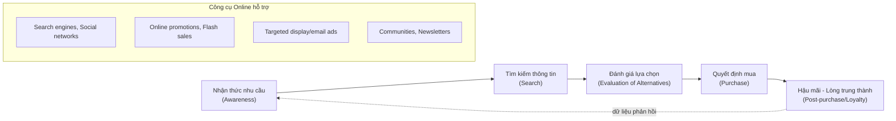
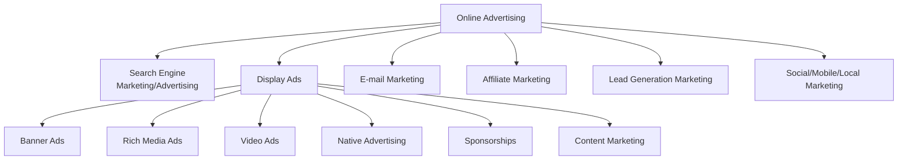
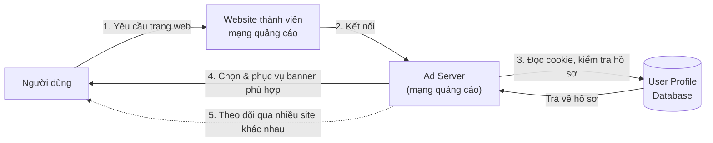
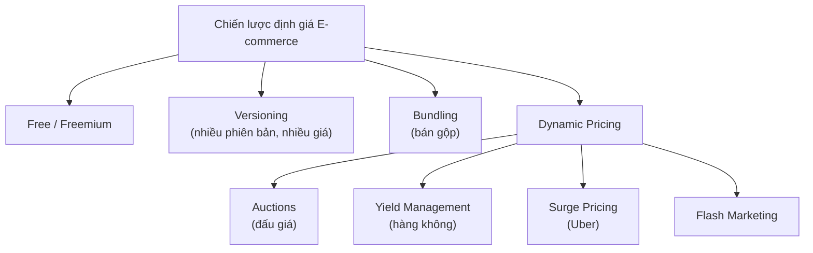

# Chương 6: E-commerce Marketing and Advertising Concepts

> Nguồn: *E-Commerce: Business, Technology and Society* (Laudon & Traver, 18th edition, 2024) — Chương 6, trang in sách 314–389 (trang PDF 348–423).

---

## 1. Tóm tắt & giải thích kiến thức

### Mở đầu: Xu hướng 2022–2023

Chương mở đầu bằng case "Video Ads: Shoot, Click, Buy" — minh họa sự bùng nổ quảng cáo video online (YouTube, in-stream ads, TrueView/Video action campaigns). Bảng "What's New" tóm tắt 3 nhóm xu hướng:
- **Business:** chi tiêu quảng cáo online tăng mạnh, dự kiến chiếm ~80% tổng chi quảng cáo vào 2026; mobile chiếm hơn 2/3 chi tiêu; video ads tăng trưởng nhanh nhất.
- **Technology:** big data, programmatic advertising thống trị; hành vi (behavioral) targeting đang bị thay thế do lo ngại privacy.
- **Society:** lo ngại privacy dẫn đến Apple/Google chặn tracking; lo ngại brand safety; tập trung quyền lực vào Google dẫn đến áp lực quản lý (regulation).

### 6.1 Consumers Online: The Online Audience and Consumer Behavior

**Hồ sơ người tiêu dùng online (Online Consumer Profile):** Khoảng 300 triệu người Mỹ (≈90% dân số) dùng Internet, tốc độ tăng trưởng đã chậm lại (~1%/năm) — thời kỳ tăng trưởng 2 chữ số đã qua. Bù lại là **cường độ sử dụng** tăng (trung bình 8,25 giờ/ngày). Khoảng cách số (digital divide) đã thu hẹp nhưng vẫn tồn tại theo thu nhập, học vấn, tuổi tác, chủng tộc. Loại kết nối (broadband vs mobile-only) cũng ảnh hưởng tới hành vi mua sắm.

**Hiệu ứng cộng đồng (Community/social contagion effects):** Người dùng mạng xã hội có xu hướng mua hàng nhiều hơn khi ở trong "khu vực lân cận" số (digital neighborhood) nơi người khác cũng mua sắm online. Khái niệm **ROPO (Research Online, Purchase Offline / webrooming)** — ngược lại với **showrooming** (xem ở cửa hàng, mua online).

**Mô hình hành vi tiêu dùng (Consumer Behavior Models):** Mô hình chung (Hình 6.1) gồm biến nhân khẩu học, biến can thiệp (kích thích thị trường, thương hiệu, mạng xã hội), dẫn tới quyết định mua. Áp dụng vào online, mô hình bổ sung: đặc điểm website/mobile platform, kỹ năng người dùng (consumer skills), đặc điểm sản phẩm, thái độ mua hàng, và đặc biệt là **clickstream behavior** (dấu vết số khi di chuyển qua các trang web) — yếu tố dự đoán mạnh nhất ngay trước thời điểm mua.

**Quy trình quyết định mua (5 giai đoạn):** nhận thức nhu cầu → tìm kiếm thông tin → đánh giá lựa chọn → quyết định mua → hành vi sau mua (lòng trung thành). Mỗi giai đoạn được hỗ trợ bởi công cụ marketing online/offline khác nhau (xem sơ đồ Mermaid bên dưới).

**Người mua sắm: Browsers và Buyers:** 83,5% người dùng Internet Mỹ là "buyers" (mua online), thêm 9% là "shoppers" (nghiên cứu online nhưng mua offline). ~62% doanh số bán lẻ Mỹ chịu ảnh hưởng từ nghiên cứu số (digitally influenced).

**Vì sao một số người không mua online:** Yếu tố quan trọng nhất là **trust** (sợ bị lừa, mất thông tin thẻ, xâm phạm riêng tư) và **utility** (giá tốt, tiện lợi, giao hàng nhanh). Thứ yếu là "hassle factors" (phí ship, đổi trả, không sờ được sản phẩm).

### 6.2 Digital Commerce Marketing and Advertising Strategies and Tools

**4 đặc điểm nổi bật của marketing online** so với marketing truyền thống: cá nhân hóa (personalized), có sự tham gia (participatory), ngang hàng (peer-to-peer), cộng đồng (communal).

**5 thành phần của kế hoạch marketing đa kênh (Bảng 6.2 — Digital Marketing Roadmap):** Website, Traditional Online Marketing (SEM, display, email, affiliate), Social Marketing, Mobile Marketing, Offline Marketing.

**Website** đóng 4 vai trò: xây dựng nhận diện thương hiệu, thông tin/giáo dục khách hàng, định hình trải nghiệm khách hàng (customer experience), và "neo" thương hiệu (anchor) giữa nhiều kênh số khác nhau.

**Công cụ marketing/advertising truyền thống trực tuyến:**
- **Search Engine Marketing (SEM) & Search Engine Advertising:** SEM xây dựng thương hiệu; search advertising hỗ trợ bán hàng trực tiếp. **Organic search** (kết quả tự nhiên) khác với **pay-per-click (PPC)** — quảng cáo trả tiền theo click, dùng **keyword advertising** (đấu giá từ khóa). Google Ads (keyword ads) và AdSense (đặt quảng cáo trên site publisher) là 2 mô hình chính. Xu hướng mới: **visual search** (Google Lens) và **voice search**. Vấn đề: **click fraud**, **content farms**, **link farms**.
- **Display Ad Marketing:** gồm banner ads (rẻ nhất, hiệu quả thấp nhất), rich media ads (tương tác cao hơn), video ads (tăng trưởng nhanh nhất), sponsorships (gắn thương hiệu với nội dung/sự kiện), native advertising (giống nội dung biên tập — gây tranh cãi về minh bạch, FTC có quy định riêng), content marketing (tạo nội dung — bài viết, infographic — để lan tỏa thương hiệu). Chuẩn ngành LEAN (Lightweight, Encrypted, AdChoices, Non-invasive) của IAB.
- **Advertising Networks, Ad Exchanges, Programmatic Advertising, RTB:** Ad network là trung gian kết nối publisher (có audience) và advertiser (muốn tiếp cận audience) — xem sơ đồ Mermaid. **Ad exchange** dùng đấu giá tự động (**programmatic advertising**) và **real-time bidding (RTB)** để khớp cung–cầu quảng cáo hiển thị theo thời gian thực (>90% display ads hiện nay). Vấn đề: **ad fraud** (bot click giả), **viewability** (quảng cáo có thực sự được nhìn thấy), **ad blocking** (~40% người Mỹ dùng ad blocker).
- **E-mail Marketing:** **Direct e-mail marketing** (opt-in) là kênh chi phí thấp, ROI cao (CTR 3–5%). Vấn đề lớn: **spam**; luật CAN-SPAM của Mỹ không cấm spam mà chỉ yêu cầu ghi nhãn + có tùy chọn opt-out.
- **Affiliate Marketing:** trả hoa hồng (4–20%) khi người giới thiệu từ website/blog khác click vào link và mua hàng (VD: Amazon Associates).
- **Lead Generation Marketing:** dùng nhiều kênh số để tạo "lead" rồi chuyển đổi thành khách hàng qua sales call/email (VD: HubSpot).

**Social, Mobile, Local Marketing** (tóm lược, chi tiết ở Chương 7): mạng xã hội, blog, influencer marketing; mobile marketing (app, QR code, in-store messaging); local marketing (quảng cáo theo vị trí địa lý).

**Multi-channel Marketing:** Kết hợp online + offline hiệu quả hơn dùng riêng lẻ một kênh — người dùng vẫn dành nhiều thời gian cho TV, radio, print dù online tăng trưởng.

**Chiến lược giữ chân khách hàng (Customer Retention):**
- **One-to-one marketing (personalization):** phân khúc thị trường đến từng cá nhân.
- **Behavioral targeting (interest-based advertising):** dùng hành vi online/offline để điều chỉnh thông điệp quảng cáo theo thời gian thực; liên quan đến **retargeting/remarketing** (theo đuổi người dùng qua nhiều site) và **contextual advertising** (khớp quảng cáo với nội dung xung quanh — thay thế behavioral targeting khi third-party cookie bị chặn).
- **Customization & Customer co-production:** thay đổi chính sản phẩm theo yêu cầu khách hàng (VD: NIKEiD, My M&M's).
- **Customer Service:** FAQs, real-time chat (kể cả AI chatbot), intelligent agents, automated response systems.

**Chiến lược định giá (Pricing Strategies):** Xem sơ đồ Mermaid bên dưới.
- **Free & Freemium:** miễn phí dịch vụ cơ bản, thu phí dịch vụ cao cấp (Dropbox, Spotify).
- **Versioning:** tạo nhiều phiên bản sản phẩm thông tin bán cho các phân khúc khác nhau với giá khác nhau.
- **Bundling:** bán gộp 2+ sản phẩm với giá thấp hơn tổng giá riêng lẻ (giảm phương sai nhu cầu thị trường).
- **Dynamic Pricing:** giá thay đổi theo cầu/cung thời gian thực — gồm auctions (đấu giá), **yield management** (hàng không điều chỉnh giá ghế trống), **surge pricing** (Uber), **flash marketing** (giảm giá chớp nhoáng).
- **Price discrimination:** bán cùng sản phẩm cho các nhóm khách khác nhau với giá khác nhau tùy mức sẵn lòng chi trả (willingness to pay).

**Long Tail Marketing:** Nhờ chi phí tồn kho gần bằng 0 và công cụ tìm kiếm/đề xuất, các nhà bán lẻ online (Amazon) có thể kiếm lợi nhuận từ hàng loạt sản phẩm "ngách" (niche) ít người mua — gọi là **long tail effect**. Tuy nhiên nghiên cứu mới cho thấy "hit sản phẩm" (bestseller) vẫn chiếm phần lớn doanh thu (Netflix, Spotify).

### 6.3 Online Marketing Technologies

**Tác động của công nghệ e-commerce lên marketing (Bảng 6.5):** ubiquity, global reach, universal standards, richness, interactivity, information density, personalization, social technology — 4 tác động lớn: mở rộng phạm vi tiếp cận, tăng độ phong phú thông điệp, tăng mật độ thông tin thị trường, tăng khả năng tiếp cận khách hàng (always-on qua mobile).

**Web Transaction Logs:** ghi lại mọi hoạt động người dùng tại website; kết hợp với registration forms và shopping cart database tạo "kho báu" dữ liệu marketing.

**Cookies & Tracking Files:** **Cookie** là file văn bản nhỏ lưu dữ liệu người dùng. **First-party cookie** (do chính site đặt) khác **third-party cookie** (do mạng quảng cáo đặt, theo dõi xuyên site — đang bị Safari, Firefox, và sắp tới Chrome chặn). **Web beacon** (tracking pixel) là ảnh 1-pixel ẩn dùng để theo dõi email/website. Xu hướng chuyển từ third-party sang **first-party data** và **zero-party data** (dữ liệu người dùng chủ động cung cấp) do GDPR, luật California, và Apple ITP. Google đang thử nghiệm **Privacy Sandbox** (FLEDGE, Topics API) và ngành dùng **data clean rooms** để chia sẻ dữ liệu ẩn danh giữa các bên.

**Databases, Data Warehouses, Data Mining, Big Data:**
- **Database/DBMS/SQL:** lưu trữ dữ liệu có cấu trúc (relational database — bảng 2 chiều); **NoSQL database** cho dữ liệu phi cấu trúc.
- **Data warehouse:** kho tổng hợp dữ liệu giao dịch/khách hàng để phân tích không ảnh hưởng hệ thống vận hành. **Data mart:** tập con tập trung của data warehouse. **Data lake:** kho dữ liệu thô chưa xử lý.
- **Data mining:** tìm mẫu hình (pattern) trong dữ liệu để xây **customer profile**.
- **Big Data:** tập dữ liệu khổng lồ (petabyte/exabyte) từ nhiều nguồn, cần công cụ như **Hadoop** (xử lý song song phân tán) hay **Apache Spark** (nhanh hơn nhờ dùng RAM).

**Marketing Automation & CRM:** **Marketing automation systems** theo dõi các bước tạo lead. **CRM system** là kho lưu mọi tiếp xúc (touch points) của khách hàng với doanh nghiệp (web, điện thoại, cửa hàng...), tạo hồ sơ khách hàng "360 độ" (xem sơ đồ Hình 6.9 trong sách gốc). Vendor lớn: Oracle, SAP, Microsoft, Salesforce, SugarCRM.

### 6.4 Understanding the Costs and Benefits of Online Marketing Communications

**Bộ từ vựng đo lường (Bảng 6.6 — Marketing Metrics Lexicon):** gồm nhóm chỉ số display ad (impressions, CTR, VTR, hits, page views, viewability rate, unique visitors, loyalty, reach, recency, stickiness, acquisition rate, conversion rate, browse-to-buy ratio, view-to-cart ratio, cart/checkout conversion rate, abandonment rate, retention/attrition rate), nhóm video (view time, completion rate, skip rate), nhóm email (open rate, delivery rate, CTR email, bounce-back rate, unsubscribe rate, conversion rate email). Xem giải thích chi tiết ở Phần 2 bên dưới.

**Hiệu quả quảng cáo online:** Phụ thuộc mục tiêu chiến dịch, bản chất sản phẩm, chất lượng website. Chỉ số quan trọng nhất là **ROI**, nhưng đo lường khó vì **cross-platform attribution** (gán công đúng kênh marketing nào đã ảnh hưởng tới quyết định mua) — mô hình first-click/last-click đang được thay bằng data-driven attribution (machine learning). Việc third-party tracking biến mất càng làm khó việc đo lường.

**Chi phí quảng cáo online:** Các mô hình định giá (Bảng 6.7): Barter, **CPM** (cost per thousand impressions), **CPC** (cost per click), **CPL** (cost per lead), **CPA** (cost per action), Hybrid, Sponsorship. **eCPM** (effective CPM) đo ROI bằng tổng doanh thu quảng cáo chia cho số impression (nghìn). Nhìn chung quảng cáo online rẻ hơn nhiều so với TV/print truyền thống.

**Marketing Analytics Software:** thu thập/phân tích dữ liệu theo từng giai đoạn "purchasing funnel": awareness → engagement → interaction → purchase → post-purchase (loyalty). Công cụ hàng đầu: Google Analytics, Adobe Analytics, IBM Digital Analytics, Webtrends.

### 6.5 & 6.6 (tóm lược ngắn)
Mục 6.5 mô tả một case nghề nghiệp mẫu (vị trí Digital Marketing Assistant tại chuỗi siêu thị thực phẩm hữu cơ) và câu hỏi phỏng vấn mẫu. Mục 6.6 là case study "Programmatic Advertising: Real-Time Marketing" phân tích 3 loại nền tảng programmatic (open exchange RTB, private marketplace PMP, programmatic direct PD) và các rủi ro (ad fraud, brand safety — ví dụ JPMorgan Chase giảm số site chạy ads từ 400.000 xuống 1.000; YouTube gặp vấn đề brand safety với Disney, Vodafone...).

### Sơ đồ minh họa

**Sơ đồ 1 — Quy trình quyết định mua & marketing communications hỗ trợ (Hình 6.2):**

**Sơ đồ 2 — Các loại quảng cáo trực tuyến (Online Advertising):**

**Sơ đồ 3 — Cơ chế hoạt động của Ad Network / Programmatic Advertising (dựa trên Hình 6.6):**

**Sơ đồ 4 — Các chiến lược định giá (Pricing Strategies):**

---

## 2. Key Concepts

Tổ chức theo 4 mục tiêu học tập (Learning Objectives) như trong sách.

### LO 6.1 — Online audience & consumer behavior
- **Consumer behavior:** ngành khoa học xã hội mô hình hóa hành vi con người trong thị trường.
- **Clickstream behavior:** dấu vết số khi người dùng di chuyển qua các trang web — dữ liệu dự đoán mua hàng mạnh nhất ngay trước thời điểm mua.
- **Customer experience:** tổng thể trải nghiệm khách hàng với doanh nghiệp (tìm kiếm, thông tin, mua, tiêu dùng, hậu mãi) — rộng hơn "customer satisfaction".
- **ROPO (webrooming) / Showrooming:** nghiên cứu online rồi mua offline / ngược lại xem offline rồi mua online.

### LO 6.2 — Chiến lược & công cụ marketing/advertising
- **Online advertising:** thông điệp trả tiền trên website, app hay phương tiện số khác.
- **Ad targeting:** gửi thông điệp marketing đến các nhóm nhỏ cụ thể để tăng khả năng mua.
- **Search engine marketing (SEM):** dùng công cụ tìm kiếm để xây dựng và duy trì thương hiệu.
- **Search engine advertising:** dùng công cụ tìm kiếm để hỗ trợ bán hàng trực tiếp.
- **Organic search:** kết quả tìm kiếm dựa trên thuật toán "không thiên vị" của search engine.
- **Pay-per-click (PPC) search ad:** loại quảng cáo tìm kiếm phổ biến nhất, trả tiền theo click.
- **Keyword advertising:** merchant đấu giá mua từ khóa; ai trả nhiều hơn thì quảng cáo xếp hạng cao hơn.
- **AdSense:** chương trình của Google cho phép publisher đặt quảng cáo liên quan trên site họ, ăn chia doanh thu với Google.
- **Search engine optimization (SEO):** kỹ thuật cải thiện thứ hạng trang web trên kết quả tìm kiếm.
- **Visual search / Voice search:** tìm kiếm bằng hình ảnh (Google Lens) / bằng giọng nói (AI, NLP).
- **Click fraud:** đối thủ click vào quảng cáo để buộc nhà quảng cáo phải trả tiền dù click không hợp lệ.
- **Content farms:** công ty tạo lượng lớn nội dung sao chép để thu hút traffic và hiển thị quảng cáo.
- **Link farms:** nhóm website liên kết chéo nhau để tăng thứ hạng tìm kiếm (bị Google phạt nặng).
- **Display ads:** gồm banner, rich media, video, sponsorship, native ads, content marketing.
- **Banner ad:** quảng cáo hình chữ nhật — lâu đời nhất, hiệu quả thấp nhất.
- **Rich media ad:** quảng cáo có tính tương tác (animation, video, expansion).
- **Video ad:** quảng cáo dạng video giống TV, hiển thị trước/giữa/sau nội dung.
- **Sponsorship:** gắn tên thương hiệu với nội dung/sự kiện theo cách không quá thương mại.
- **Native advertising:** quảng cáo trông giống nội dung biên tập (gây tranh cãi về minh bạch).
- **Content marketing:** tạo chiến dịch nội dung (bài viết, infographic...) rồi đặt trên nhiều website.
- **Advertising networks:** trung gian kết nối nhà quảng cáo với publisher dựa trên dữ liệu khách hàng chi tiết.
- **Ad exchanges:** chợ số dựa trên đấu giá để mạng quảng cáo bán không gian quảng cáo.
- **Programmatic advertising:** phương pháp tự động, dựa trên đấu giá để khớp cung–cầu display ads.
- **Real-time bidding (RTB):** cơ chế khớp cầu quảng cáo với cung không gian trang web theo thời gian thực.
- **Ad fraud:** làm giả traffic web/mobile để tính phí nhà quảng cáo cho impression/click không có thật.
- **Direct e-mail marketing:** email marketing gửi trực tiếp tới người dùng đã opt-in.
- **Spam:** email thương mại không mời gọi (unsolicited).
- **Affiliate marketing:** hoa hồng trả cho website affiliate khi giới thiệu khách hàng tiềm năng.
- **Lead generation marketing:** dùng nhiều kênh số để tạo và quản lý lead cho doanh nghiệp.
- **One-to-one marketing (personalization):** phân khúc thị trường xuống cấp độ cá nhân.
- **Behavioral targeting (interest-based advertising):** dùng hành vi online/offline để điều chỉnh quảng cáo hiển thị.
- **Retargeting (remarketing):** hiển thị lại cùng/quảng cáo tương tự cho một người trên nhiều website/app.
- **Customization:** thay đổi sản phẩm (không chỉ thông điệp) theo sở thích người dùng.
- **Customer co-production:** khách hàng tham gia trực tiếp tạo ra sản phẩm.
- **Contextual advertising:** khớp đặc điểm quảng cáo với nội dung xung quanh vị trí đặt quảng cáo.
- **Frequently asked questions (FAQs):** danh sách câu hỏi/trả lời phổ biến giúp khách tự phục vụ.
- **Real-time customer service chat systems:** hệ thống chat trực tuyến (người hoặc AI chatbot) hỗ trợ khách theo thời gian thực.
- **Automated response system:** hệ thống tự động gửi email xác nhận đơn hàng/phản hồi yêu cầu.
- **Demand curve:** lượng hàng có thể bán được ở các mức giá khác nhau.
- **Law of One Price:** trong thị trường thông tin hoàn hảo, sẽ chỉ có một mức giá thế giới cho mỗi sản phẩm (lý thuyết, thực tế không xảy ra).
- **Pricing:** đặt giá trị lên hàng hóa/dịch vụ.
- **Price discrimination:** bán cùng sản phẩm cho các nhóm khách khác nhau với giá khác nhau tùy mức sẵn lòng trả.
- **Versioning:** tạo nhiều phiên bản sản phẩm thông tin, bán cho các phân khúc thị trường với giá khác nhau.
- **Bundling:** bán gộp 2+ sản phẩm với giá thấp hơn tổng giá bán riêng lẻ.
- **Dynamic pricing:** giá thay đổi theo đặc điểm cầu của khách hàng và tình hình cung của người bán.
- **Long tail effect:** phân phối thống kê với số ít sự kiện biên độ lớn và rất nhiều sự kiện biên độ nhỏ — cho phép bán được nhiều sản phẩm ngách.

### LO 6.3 — Công nghệ hỗ trợ marketing online
- **Transaction log:** ghi lại hoạt động người dùng tại website.
- **Registration forms:** thu thập dữ liệu cá nhân (tên, địa chỉ, email...).
- **Shopping cart database:** lưu toàn bộ dữ liệu chọn sản phẩm, mua, thanh toán.
- **Cookie:** file văn bản nhỏ lưu dữ liệu khách truy cập trên máy họ để truy xuất lại sau.
- **First-party cookie:** cookie do chính domain trang đang truy cập đặt.
- **Third-party cookie:** cookie cho phép nền tảng quảng cáo theo dõi hành vi người dùng xuyên nhiều website/thiết bị.
- **Web beacon:** file ảnh 1-pixel ẩn trong email/website dùng để theo dõi.
- **Profiling:** dùng nhiều công cụ để tạo "chân dung số" cho từng người tiêu dùng.
- **Database / Relational database / DBMS / SQL:** hệ thống lưu trữ, quản lý dữ liệu có cấu trúc dạng bảng, dùng ngôn ngữ truy vấn chuẩn SQL.
- **Nonrelational (NoSQL) database:** mô hình dữ liệu linh hoạt hơn cho dữ liệu phi cấu trúc/bán cấu trúc.
- **Data warehouse:** kho lưu tổng hợp dữ liệu giao dịch/khách hàng của công ty để phân tích riêng.
- **Data mart:** tập con tập trung của data warehouse cho nhóm người dùng cụ thể.
- **Data lake:** kho dữ liệu thô, chưa xử lý, lưu ở dạng gốc.
- **Data mining:** kỹ thuật phân tích tìm mẫu hình trong dữ liệu để mô hình hóa hành vi khách hàng.
- **Customer profile:** tập quy tắc mô tả hành vi điển hình của một khách hàng/nhóm khách hàng.
- **Big data:** tập dữ liệu khổng lồ (petabyte, exabyte) từ nhiều nguồn khác nhau.
- **Hadoop:** framework mã nguồn mở xử lý song song phân tán dữ liệu lớn.
- **Marketing automation systems:** công cụ phần mềm theo dõi các bước tạo lead trong marketing.
- **Customer relationship management (CRM) system:** kho lưu mọi tiếp xúc của khách hàng với doanh nghiệp, tạo hồ sơ khách hàng dùng chung toàn công ty.
- **Customer touch points:** các cách khách hàng tương tác với doanh nghiệp (web, điện thoại, cửa hàng, mobile...).

### LO 6.4 — Chi phí & lợi ích của marketing communications
- **Impressions:** số lần một quảng cáo được phục vụ (hiển thị).
- **Click-through rate (CTR):** tỷ lệ % người xem quảng cáo thực sự click.
- **View-through rate (VTR):** tỷ lệ phản hồi trong 30 ngày dù không click ngay.
- **Hits:** số yêu cầu HTTP máy chủ nhận được (không phản ánh chính xác lượt truy cập).
- **Page views:** số trang được yêu cầu bởi khách truy cập.
- **Viewability rate:** tỷ lệ % quảng cáo thực sự được nhìn thấy.
- **Unique visitors:** số khách truy cập riêng biệt.
- **Loyalty:** tỷ lệ khách quay lại mua trong năm.
- **Reach:** tỷ lệ % người mua tiềm năng ghé thăm website.
- **Recency:** số ngày trung bình giữa các lần truy cập/mua hàng.
- **Stickiness (duration):** thời gian trung bình khách ở lại website.
- **Acquisition rate:** tỷ lệ % khách đăng ký hoặc xem trang sản phẩm.
- **Conversion rate:** tỷ lệ % khách truy cập thực sự mua hàng.
- **Browse-to-buy ratio:** tỷ lệ sản phẩm được mua trên số lượt xem sản phẩm.
- **View-to-cart ratio:** tỷ lệ click "thêm vào giỏ" trên số lượt xem sản phẩm.
- **Cart conversion rate:** tỷ lệ đơn hàng thực tế trên số click "thêm vào giỏ".
- **Checkout conversion rate:** tỷ lệ đơn hàng thực tế trên số lượt bắt đầu checkout.
- **Abandonment rate:** tỷ lệ % khách bỏ giỏ hàng giữa chừng không hoàn tất mua.
- **Retention rate:** tỷ lệ % khách hàng hiện tại tiếp tục mua đều đặn.
- **Attrition rate:** tỷ lệ % khách chỉ mua một lần rồi không quay lại trong năm.
- **View time / Completion rate / Skip rate:** (video ads) thời gian xem thực tế / tỷ lệ xem hết video / tỷ lệ bỏ qua video.
- **Open rate / Delivery rate / Bounce-back rate / Unsubscribe rate / Conversion rate (email):** (email) tỷ lệ mở mail / tỷ lệ gửi thành công / tỷ lệ gửi thất bại / tỷ lệ hủy đăng ký / tỷ lệ mua hàng.
- **Cross-platform attribution:** xác định kênh/định dạng marketing nào thực sự ảnh hưởng đến quyết định mua của khách.
- **Cost per thousand (CPM):** trả tiền theo 1.000 lượt hiển thị.
- **Cost per click (CPC):** trả tiền theo mỗi lượt click.
- **Cost per action (CPA):** trả tiền chỉ khi khách thực hiện hành động cụ thể (đăng ký, mua...).
- **Effective cost-per-thousand (eCPM):** đo ROI bằng tổng doanh thu quảng cáo chia số impression (nghìn).
- **Marketing analytics software:** phần mềm thu thập, lưu trữ, phân tích, trình bày dữ liệu theo từng giai đoạn chuyển đổi khách hàng thành người mua.

---

## 3. Questions

*(Nguyên văn 20 câu hỏi trong mục Review 6.7, kèm câu trả lời dựa trên nội dung chương.)*

**1. Is growth of the Internet, in terms of U.S. users, expected to continue indefinitely? What, if anything, will cause it to slow?**
Không. Tăng trưởng số lượng người dùng Internet Mỹ đã chậm lại đáng kể, từ mức hai chữ số (>30%/năm đầu 2000) xuống chỉ còn ~1%/năm vào 2022, vì phần lớn dân số Mỹ (khoảng 90%) đã trực tuyến — thị trường gần bão hòa. Tăng trưởng trong tương lai chủ yếu đến từ nhóm 65 tuổi trở lên (nhóm còn tỷ lệ sử dụng thấp hơn).

**2. How does the model of online consumer behavior differ from the traditional model of consumer behavior?**
Mô hình online (Hình 6.3) giữ các yếu tố nền tảng (nhân khẩu học, văn hóa, xã hội, tâm lý, thương hiệu, mạng xã hội) nhưng bổ sung các yếu tố đặc thù e-commerce: đặc điểm website/nền tảng mobile (độ trễ, khả năng điều hướng, bảo mật), kỹ năng của người tiêu dùng khi giao dịch online, đặc điểm sản phẩm (có phù hợp bán online không), thái độ mua hàng online, cảm nhận về quyền kiểm soát hành vi (perceived behavioral control), và quan trọng nhất là **clickstream behavior** — dữ liệu hành vi số ngay trước thời điểm mua.

**3. What marketing functions do websites serve?**
Bốn chức năng chính: (1) thiết lập nhận diện thương hiệu và kỳ vọng của khách hàng; (2) thông tin/giáo dục khách hàng về sản phẩm dịch vụ; (3) định hình trải nghiệm khách hàng (customer experience) qua catalog, giỏ hàng; (4) "neo" (anchor) thương hiệu — là nơi tập trung mọi thông điệp từ các kênh số khác (Facebook, Instagram, email, mobile app).

**4. Research has shown that consumers often use the Internet to investigate purchases before buying at a physical location. What implication does this have for online merchants?**
Merchant nên tạo nội dung hữu ích cho người "chỉ nghiên cứu" (browsers, ROPO/webrooming), tối ưu nội dung để xếp hạng cao trên search engine, giảm bớt trọng tâm "bán hàng trực tiếp" trên trang, và tăng cường quảng bá sản phẩm (đặc biệt sản phẩm mới) trên các kênh offline để hỗ trợ ngược lại cho cửa hàng online — vì thương mại online và offline gắn kết chặt chẽ với nhau, không phải hai kênh tách biệt.

**5. What are some of the issues with search engine advertising?**
Gồm: quyền lực gần như độc quyền của Google trong việc xếp hạng (không ai thực sự biết thuật toán vận hành ra sao); **click fraud** (đối thủ hoặc botnet click giả để tốn tiền quảng cáo của đối thủ); **content farms** (tạo nội dung sao chép hàng loạt để hút traffic); **link farms** (nhóm site liên kết chéo gian lận để tăng thứ hạng, bị Google phạt).

**6. Why have advertising networks become controversial? What, if anything, can be done to overcome any resistance to this technique?**
Advertising networks (và các ad exchange/RTB liên quan) gây tranh cãi vì chúng theo dõi hành vi duyệt web của người dùng xuyên hàng nghìn website (third-party tracking) mà người dùng thường không biết, xâm phạm quyền riêng tư. Để giảm phản kháng, ngành đang chuyển sang **first-party data** (dữ liệu công ty tự thu thập trực tiếp, minh bạch hơn, có sự đồng ý rõ ràng), **zero-party data** (dữ liệu người dùng chủ động cung cấp), và các công nghệ bảo vệ quyền riêng tư như Privacy Sandbox (FLEDGE, Topics API) và data clean rooms.

**7. What is a marketing automation system, and how is it used?**
Là công cụ phần mềm giúp marketer theo dõi toàn bộ các bước trong quá trình tạo lead — từ lúc khách hàng biết đến thương hiệu, tìm kiếm và so sánh sản phẩm, cho tới khi quyết định mua. Hệ thống này trực quan hóa hành trình từ hiển thị quảng cáo, tìm thấy trên search engine, các email theo dõi, cho đến khi chuyển đổi thành khách hàng — sau đó CRM tiếp quản việc duy trì mối quan hệ.

**8. List the differences among databases, data warehouses, data marts, data lakes, and data mining.**
- **Database:** ứng dụng phần mềm lưu dữ liệu dạng field/record/file (thường quan hệ - relational).
- **Data warehouse:** kho tổng hợp dữ liệu giao dịch và khách hàng của cả công ty vào một nơi để phân tích, không ảnh hưởng hệ thống vận hành chính.
- **Data mart:** tập con nhỏ hơn, tập trung của data warehouse, phục vụ một nhóm người dùng cụ thể (VD: bộ phận marketing).
- **Data lake:** kho lưu dữ liệu thô, phi cấu trúc hoặc chưa được phân tích, giữ ở định dạng gốc cho đến khi cần dùng.
- **Data mining:** không phải là kho lưu trữ mà là tập kỹ thuật phân tích để tìm mẫu hình trong dữ liệu của database/data warehouse, nhằm mô hình hóa hành vi khách hàng.

**9. What is big data, and why are marketers interested in it?**
Big data là các tập dữ liệu khổng lồ (petabyte, exabyte) đến từ nhiều nguồn khác nhau (web traffic, email, mạng xã hội, dữ liệu cảm biến...), thường phi cấu trúc/bán cấu trúc, vượt quá khả năng xử lý của DBMS truyền thống. Marketer quan tâm vì big data cho phép liên kết lượng lớn dữ liệu từ nhiều nguồn khác nhau (điều trước đây không thể), khai thác mẫu hình hành vi khách hàng, mang lại insight mới về hành vi tiêu dùng, thị trường tài chính hay các hiện tượng khác.

**10. What pricing strategy turned out to be deadly for many e-commerce ventures during the early days of e-commerce? Why?**
Chiến lược định giá sản phẩm/dịch vụ **thấp hơn chi phí biên (marginal cost)**, thậm chí miễn phí, với hy vọng thu hút lượng lớn người dùng trước rồi mới kiếm tiền từ quảng cáo hoặc phí thuê bao sau này. Chiến lược này gây chết yểu nhiều công ty vì phần lớn không bao giờ chuyển đổi được người dùng miễn phí ("freeloaders") thành khách trả tiền, dẫn đến thua lỗ kéo dài không bền vững.

**11. Is price discrimination different from versioning? If so, how?**
Có khác nhau. **Price discrimination** là bán CÙNG một sản phẩm cho các nhóm khách hàng khác nhau ở các mức giá khác nhau tùy mức sẵn lòng chi trả (đòi hỏi phải nhận diện được và tách biệt được các nhóm khách để họ không biết giá của nhau). **Versioning** là tạo ra NHIỀU PHIÊN BẢN khác nhau của cùng một sản phẩm (thông tin) — ví dụ bản miễn phí giới hạn và bản trả phí đầy đủ tính năng — và để khách hàng tự chọn phiên bản phù hợp với mức sẵn lòng trả của họ, thay vì công ty phải trực tiếp phân loại khách hàng.

**12. What are some of the reasons that freebies, such as free Internet service and giveaways, don't work to generate sales at a website?**
"Free" thu hút hàng loạt người dùng nhạy cảm về giá ("freeloaders") không có ý định trả tiền, sẵn sàng chuyển sang dịch vụ miễn phí khác ngay khi bị tính phí; điều này loại bỏ khả năng phân biệt giá phong phú (rich price discrimination), và công ty mất đi doanh thu từ những người lẽ ra sẵn lòng trả một khoản nhỏ. Nhiều doanh nghiệp e-commerce gặp khó khăn khi cố chuyển đổi người dùng miễn phí thành khách hàng trả phí.

**13. Explain how versioning works. How is it different from dynamic pricing?**
**Versioning** tạo nhiều phiên bản của cùng sản phẩm thông tin, bán cho các phân khúc thị trường khác nhau ở các mức giá cố định khác nhau (ví dụ: bản miễn phí giới hạn số bài đọc/tháng, bản trả phí đọc không giới hạn). Giá phụ thuộc vào giá trị cảm nhận đối với từng khách hàng, nhưng MỖI PHIÊN BẢN có giá CỐ ĐỊNH. Ngược lại, **dynamic pricing** là giá của CÙNG MỘT sản phẩm/phiên bản thay đổi LIÊN TỤC theo đặc điểm cầu của khách hàng và tình trạng cung của người bán tại từng thời điểm (ví dụ giá vé máy bay thay đổi theo giờ).

**14. Why do companies that bundle products and services have an advantage over those that don't or can't offer this option?**
Vì mặc dù người tiêu dùng có ý kiến rất khác nhau về giá trị của một sản phẩm ĐƠN LẺ, họ lại có xu hướng đồng thuận nhiều hơn về giá trị của một GÓI sản phẩm bán với giá cố định. Trên thực tế, mức giá bình quân trên mỗi sản phẩm mà người ta sẵn lòng trả cho cả gói thường CAO HƠN so với khi mua riêng lẻ từng sản phẩm — bundling giúp giảm phương sai (dispersion) trong nhu cầu thị trường, giúp doanh nghiệp thu được nhiều doanh thu hơn.

**15. What are some reasons online advertising now constitutes more than 70% of the total advertising market?**
Vì: (1) đối tượng khán giả — đặc biệt nhóm 18–34 tuổi hấp dẫn — đã chuyển sang dùng Internet/mobile phần lớn thời gian trong ngày; (2) quảng cáo online cho phép nhắm mục tiêu (targeting) chính xác tới từng cá nhân/nhóm nhỏ và đo lường hiệu quả gần như thời gian thực — điều bất khả thi với TV/radio/print truyền thống; (3) quảng cáo online thường rẻ hơn nhiều so với quảng cáo truyền thống (CPM thấp hơn); (4) khả năng tương tác hai chiều giữa nhà quảng cáo và khách hàng tiềm năng.

**16. What are some of the advantages of direct e-mail marketing?**
Chi phí thấp và gần như không đổi dù gửi 1.000 hay 1 triệu email; nhắm đúng đối tượng đã opt-in (quan tâm sẵn); tỷ lệ phản hồi tương đối cao (CTR 3-5%) so với chi phí; có thể theo dõi/đo lường phản hồi; có thể cá nhân hóa nội dung và ưu đãi; dẫn traffic về website; có thể test và tối ưu nội dung/ưu đãi; nhắm mục tiêu theo vùng, nhân khẩu học, thời gian trong ngày, hoặc tiêu chí khác.

**17. Why is offline advertising still important?**
Vì phần lớn giao dịch mua sắm chịu ảnh hưởng từ nhiều "điểm chạm" (touch points) cả online lẫn offline — TV, radio, báo in vẫn là kênh chính để người tiêu dùng biết đến sản phẩm mới. Các chiến dịch marketing hiệu quả nhất là chiến dịch đa kênh (multi-channel), kết hợp cả online và offline thay vì chỉ dựa vào một kênh duy nhất; hình ảnh nhất quán giữa các kênh (online và offline chạy song song) làm tăng hiệu quả quảng cáo online.

**18. What is the difference between hits and page views? Why are these not the best measurements of web traffic? Which is the preferred metric for traffic counts?**
**Hits** là số yêu cầu HTTP mà máy chủ nhận được — một trang có nhiều ảnh/đồ họa có thể tạo ra nhiều "hits" cho cùng một lượt xem trang, nên số liệu bị thổi phồng và không phản ánh đúng traffic thực. **Page views** là số trang được yêu cầu — chính xác hơn hits nhưng vẫn có thể bị sai lệch do công nghệ frame (một trang chia làm nhiều khung có thể tính thành nhiều page views). Chỉ số được ưa chuộng hơn để đo traffic là **unique visitors** (số khách truy cập riêng biệt), vì nó phản ánh đúng số lượng người thực sự ghé thăm, bất kể họ xem bao nhiêu trang.

**19. Define CTR, CPM, CPC, CPA, and VTR.**
- **CTR (Click-Through Rate):** tỷ lệ % người xem quảng cáo thực sự click vào quảng cáo đó.
- **CPM (Cost Per Thousand impressions):** mô hình định giá mà nhà quảng cáo trả tiền theo mỗi 1.000 lượt hiển thị quảng cáo.
- **CPC (Cost Per Click):** mô hình định giá mà nhà quảng cáo trả một khoản phí thỏa thuận trước cho mỗi lượt click nhận được.
- **CPA (Cost Per Action):** mô hình định giá mà nhà quảng cáo chỉ trả tiền khi người dùng thực hiện một hành động cụ thể (đăng ký, mua hàng...).
- **VTR (View-Through Rate):** tỷ lệ đo phản hồi trong vòng 30 ngày sau khi xem quảng cáo dù không click ngay lập tức.

**20. What are marketing analytics, and how are they used?**
Marketing analytics là phần mềm thu thập, lưu trữ, phân tích và trình bày trực quan dữ liệu ở từng giai đoạn chuyển đổi khách truy cập thành khách hàng (awareness, engagement, interaction, purchase, post-purchase/loyalty). Chúng được dùng để: hiểu khách đến từ đâu (search, email, mạng xã hội...); đo mức độ tương tác với nội dung (page views, thời lượng); theo dõi hoạt động trên trang giỏ hàng (nơi tạo doanh thu nhưng cũng nơi mất khách nhiều nhất — abandonment); phân tích lòng trung thành và "buzz"/sentiment sau mua; từ đó giúp quản lý tối ưu hóa ROI của các chiến dịch marketing gần như theo thời gian thực.

---

## 4. Projects

*(Nguyên văn 7 đề bài trong mục Review 6.7, kèm hướng dẫn thực hiện chi tiết.)*

**1. Go to www.strategicbusinessinsights.com/vals/surveynew.shtml. Take the survey to determine which lifestyle category you fit into. Then write a two-page paper describing how your lifestyle and values impact your use of e-commerce. How is your online consumer behavior affected by your lifestyle?**

*Hướng dẫn:*
- Truy cập link nêu trên (khảo sát VALS — Values, Attitudes, and Lifestyles của Strategic Business Insights), làm bài khảo sát trực tuyến để xác định nhóm lối sống của bạn (ví dụ: Innovator, Thinker, Achiever, Experiencer...).
- Viết bài luận 2 trang (Word/Google Docs), gồm: (a) mô tả ngắn gọn kết quả nhóm lối sống của bạn theo VALS; (b) liên hệ đặc điểm nhóm đó với hành vi mua sắm online thực tế của bạn (loại sản phẩm hay mua, kênh nào bạn tin tưởng, mức độ nhạy cảm về giá vs. thương hiệu); (c) trả lời trực tiếp câu hỏi "hành vi tiêu dùng online của bạn bị ảnh hưởng bởi lối sống như thế nào" — liên hệ lại với mô hình hành vi tiêu dùng (Hình 6.1, 6.3) đã học trong chương.
- Lưu ý: đây là bài phân tích cá nhân, cần trung thực với kết quả khảo sát, không cần công cụ ngoài trình duyệt web.

**2. Choose an e-commerce site for a small or medium-sized business that you are familiar with, and create an online marketing plan for it that includes each of the following: one-to-one marketing, affiliate marketing, mobile marketing, and social network marketing. Describe how each plays a role in growing the business, and create a slide presentation of your marketing plan.**

*Hướng dẫn:*
- Chọn một website/doanh nghiệp thương mại điện tử quy mô nhỏ/vừa mà bạn quen thuộc (VD: một shop online địa phương, cửa hàng gia đình có website).
- Xây dựng kế hoạch marketing gồm 4 phần bắt buộc:
  - **One-to-one marketing:** đề xuất cách cá nhân hóa (email/gợi ý sản phẩm dựa trên lịch sử mua, chương trình thành viên).
  - **Affiliate marketing:** đề xuất chương trình hoa hồng cho blogger/website liên kết giới thiệu khách hàng.
  - **Mobile marketing:** đề xuất app, tin nhắn SMS/push notification, quảng cáo trên thiết bị di động.
  - **Social network marketing:** đề xuất nội dung, tần suất đăng, nền tảng (Facebook, Instagram, TikTok) phù hợp với đối tượng khách hàng.
- Với mỗi phần, giải thích cụ thể nó giúp tăng trưởng doanh nghiệp như thế nào (tăng doanh thu, giữ chân khách, mở rộng tệp khách hàng mới).
- Trình bày kết quả dưới dạng slide (PowerPoint/Google Slides), khoảng 8–12 slide, có tiêu đề rõ ràng cho từng phần.

**3. Use the Online Consumer Purchasing Model (Figure 6.10) to assess the effectiveness of an e-mail campaign at a small website devoted to the sales of apparel to the ages 18–26 young adult market in the United States. Assume a marketing campaign of 100,000 e-mails (at 25 cents per e-mail address). The expected click-through rate is 5%, the customer conversion rate is 10%, and the loyal customer retention rate is 25%. The average sale is $60, and the profit margin is 50% (the cost of the goods is $30). Does the campaign produce a profit? What would you advise doing to increase the number of purchases and loyal customers? What web design factors? What communications messages?**

*Hướng dẫn tính toán (dùng mô hình phễu chuyển đổi ở Hình 6.10):*
- Bước 1 — Chi phí chiến dịch: 100.000 email × $0,25 = **$25.000**.
- Bước 2 — Số click: 100.000 × 5% (CTR) = **5.000 lượt click** (unique visitors đến site).
- Bước 3 — Số khách mua: 5.000 × 10% (conversion rate) = **500 đơn hàng**.
- Bước 4 — Doanh thu: 500 × $60 (giá bán trung bình) = **$30.000**.
- Bước 5 — Lợi nhuận gộp từ doanh thu: 500 × ($60 − $30 giá vốn) = 500 × $30 = **$15.000** (biên lợi nhuận 50%).
- Bước 6 — Lợi nhuận ròng chiến dịch: $15.000 (lãi gộp) − $25.000 (chi phí email) = **−$10.000** → chiến dịch này **lỗ** ở lần mua đầu tiên.
- Bước 7 — Xét thêm khách hàng trung thành: 500 khách × 25% (loyal retention rate) = **125 khách trung thành**, những khách này dự kiến sẽ mua lại trong tương lai (tạo thêm lợi nhuận biên $30/lần mua lại) — cần tính thêm giá trị vòng đời khách hàng (Customer Lifetime Value) để đánh giá đầy đủ liệu chiến dịch có sinh lời về dài hạn hay không.
- Kết luận cần nêu rõ: chỉ tính đợt mua đầu tiên thì lỗ $10.000, nhưng nếu tính thêm doanh thu từ các lần mua lặp lại của 125 khách trung thành trong tương lai, chiến dịch có thể hòa vốn hoặc có lãi — học viên cần tự giả định thêm số lần mua lại trung bình/năm để tính toán đầy đủ.
- Đề xuất cải thiện: tăng số lượt mua và khách trung thành bằng cách cá nhân hóa tiêu đề email (đưa tên người nhận vào subject line — theo sách có thể tăng gấp đôi CTR), tối ưu landing page (thiết kế web: tốc độ tải trang, điều hướng rõ ràng, quy trình thanh toán đơn giản để giảm abandonment rate), dùng thông điệp truyền thông nhấn mạnh ưu đãi giới hạn thời gian (flash sale/dynamic pricing) và xây dựng chương trình khách hàng thân thiết (loyalty program) để tăng retention rate.

**4. Surf the Web for at least 15 minutes. Visit at least two different e-commerce sites. Make a list describing in detail all the different marketing communication tools you see being used. Which do you believe is the most effective and why?**

*Hướng dẫn:*
- Dành ít nhất 15 phút lướt web, ghé thăm tối thiểu 2 website thương mại điện tử khác nhau (ví dụ: Amazon, Shopee, một site bán quần áo...).
- Với mỗi site, lập danh sách chi tiết các công cụ marketing communication quan sát được — đối chiếu với danh sách công cụ đã học trong Mục 6.2: banner ads, rich media ads, video ads, native ads, sponsorship, content marketing, popup/email đăng ký, chương trình affiliate/referral, thông báo trên mạng xã hội (nút chia sẻ Facebook/Instagram), chatbot/chat hỗ trợ khách hàng, thông báo cá nhân hóa (gợi ý sản phẩm dựa trên lịch sử duyệt web).
- Kết luận: chọn ra công cụ bạn cho là hiệu quả nhất và giải thích lý do (dựa trên mức độ thu hút sự chú ý, mức độ liên quan đến nhu cầu cá nhân, khả năng dẫn tới hành động mua hàng).
- Không cần công cụ đặc biệt ngoài trình duyệt; nên chụp ảnh màn hình (screenshot) làm minh chứng nếu nộp báo cáo.

**5. Do a search for a product of your choice on two search engines. Examine the results page carefully. Can you discern which results, if any, are a result of paid placement? If so, how did you determine this? What other marketing communications related to your search appear on the page?**

*Hướng dẫn:*
- Chọn một sản phẩm cụ thể (VD: "laptop gaming", "giày chạy bộ nam"), tìm kiếm trên 2 công cụ tìm kiếm khác nhau (VD: Google và Bing/Yahoo).
- Quan sát kỹ trang kết quả: phân biệt **paid placement** (quảng cáo trả tiền — thường có nhãn "Sponsored"/"Ad" ở đầu hoặc bên cạnh kết quả, dựa trên khái niệm PPC/keyword advertising đã học) với **organic search results** (kết quả tự nhiên theo thuật toán).
- Ghi lại cách bạn nhận biết (nhãn, vị trí, định dạng khác biệt).
- Liệt kê thêm các loại marketing communications khác xuất hiện trên trang (VD: banner display ads bên cạnh, gợi ý sản phẩm liên quan, shopping ads có hình ảnh/giá, quảng cáo trên bản đồ địa phương...).
- Trình bày kết quả dưới dạng ghi chú/báo cáo ngắn, có thể kèm ảnh chụp màn hình.

**6. Examine the use of rich media and video in advertising. Find and describe at least two examples of advertising using streaming video, sound, or other rich media technologies. (Hint: Check the sites of online advertising agencies for case studies or examples of their work.) What are the advantages and/or disadvantages of this kind of advertising? Prepare a three- to five-page report on your findings.**

*Hướng dẫn:*
- Tìm kiếm case study từ các agency quảng cáo online lớn (VD: trang case study của Google Ads, Meta for Business, hoặc các agency quảng cáo chuyên rich media/video như những đơn vị được nhắc trong sách: Tremor Video, Chocolate Platform).
- Tìm và mô tả chi tiết ít nhất 2 ví dụ quảng cáo dùng video streaming, âm thanh, hoặc công nghệ rich media khác (animation, ad expansion...).
- Với mỗi ví dụ, mô tả: thương hiệu, định dạng quảng cáo (in-stream, bumper ad, in-banner video...), thông điệp truyền tải, và kết quả/hiệu quả nếu có số liệu công bố.
- Phân tích ưu điểm (tương tác cao hơn banner tĩnh, tỷ lệ hoàn thành xem cao — theo sách 57-98% tùy nền tảng, khả năng kể chuyện thương hiệu) và nhược điểm (chi phí sản xuất cao hơn, vấn đề viewability, brand safety, dễ bị bỏ qua/skip, cần băng thông lớn).
- Viết báo cáo 3–5 trang, có trích dẫn nguồn tham khảo.

**7. Visit Facebook, and examine the ads shown in the right margin and in your Feed. What is being advertised and how do you believe it is relevant to your interests or online behavior? You could also search on a retail product, and on related products, on Google several times, and then visit Yahoo or another popular site to see whether your past behavior is helping advertisers track you.**

*Hướng dẫn:*
- Phần 1: Đăng nhập Facebook, quan sát quảng cáo hiển thị trong News Feed (lưu ý: bố cục hiện đại của Facebook chủ yếu dùng native ads trong Feed hơn là "right margin" như sách mô tả — đây là điểm có thể ghi chú khi báo cáo do sách xuất bản trước khi Facebook thay đổi giao diện). Ghi lại các quảng cáo xuất hiện, đối chiếu với sở thích/hành vi online gần đây của bạn (đã từng tìm sản phẩm gì, thích trang nào, tương tác gì).
- Phần 2: Thực hiện thử nghiệm về **retargeting/behavioral targeting**: tìm kiếm một sản phẩm bán lẻ cụ thể và các sản phẩm liên quan trên Google nhiều lần (VD: tìm "giày chạy bộ Nike" vài lần), sau đó truy cập Yahoo hoặc một trang phổ biến khác và quan sát xem quảng cáo hiển thị có liên quan đến sản phẩm vừa tìm hay không.
- Ghi chép lại toàn bộ quan sát: quảng cáo nào xuất hiện, có phải retargeting không, mức độ chính xác của việc nhắm mục tiêu.
- Liên hệ với khái niệm đã học: third-party cookie, ad exchange, behavioral targeting, retargeting/remarketing — và lưu ý rằng nếu dùng trình duyệt Safari/Firefox hoặc Chrome sau khi third-party cookie bị chặn, kết quả thử nghiệm này có thể khác so với mô tả trong sách (do các trình duyệt hiện đại ngày càng hạn chế theo dõi xuyên site).
- Không cần công cụ đặc biệt, chỉ cần trình duyệt và tài khoản Facebook/Google cá nhân.

