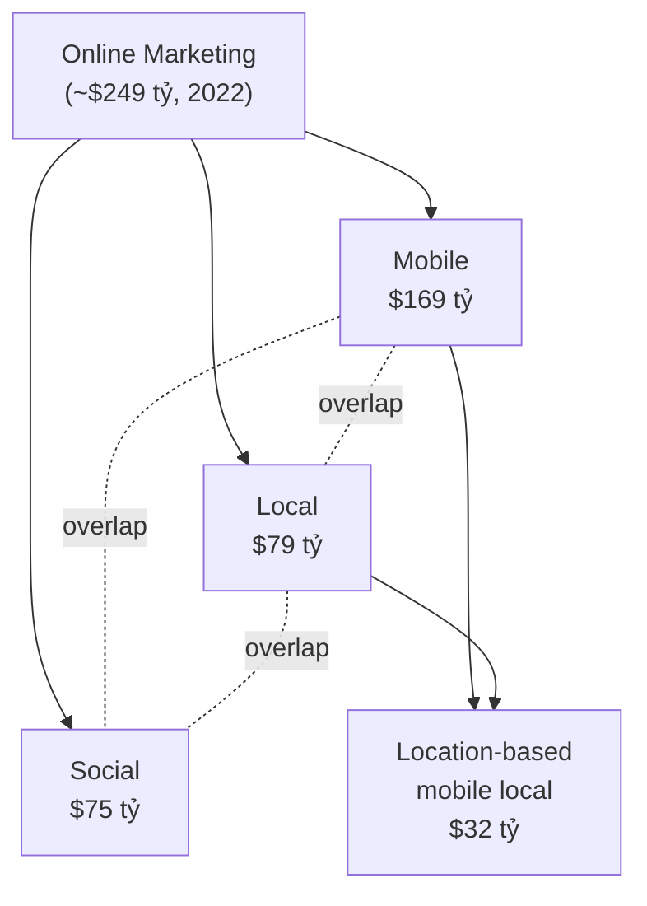
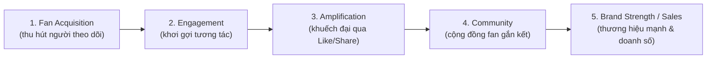
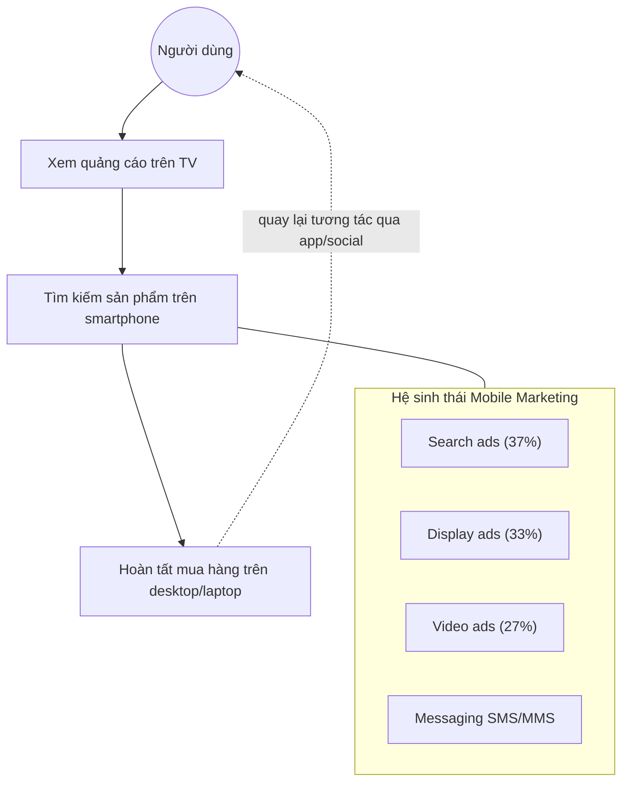
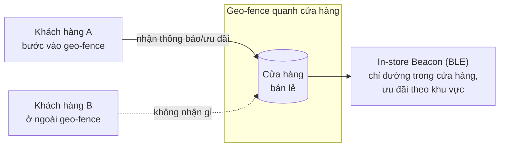

# Chương 7: Social, Mobile, and Local Marketing

> Nguồn: *E-Commerce: Business, Technology and Society*, Laudon & Traver, 18th edition (2024) — bản PDF trang 424–493 (in trang sách 390–459).

---

## 1. Tóm tắt & giải thích kiến thức

### Mở đầu — Case #Marketing: #BookTok, #WeddingTok, và #CrumblReviews
Chương mở đầu bằng case về TikTok: mạng xã hội video ngắn của Bytedance với ~95 triệu người dùng Mỹ. Case minh họa:
- **Hashtag** giúp gom nhóm nội dung và khuếch đại thông điệp marketing (ví dụ #BookTok giúp bán sách tăng vọt, #WeddingTok ảnh hưởng ngành cưới, #CrumblReviews cho chuỗi bánh quy Crumbl).
- **Mặt trái**: rủi ro về brand safety (nội dung tiêu cực lan truyền, "TikTok Challenge" nguy hiểm), vấn đề bảo mật dữ liệu và quyền riêng tư trẻ vị thành niên (TikTok từng bị phạt 92 triệu USD).

### 7.1 Giới thiệu về Social, Mobile, và Local Marketing
Trước 2007 (trước Facebook lớn mạnh và trước iPhone), marketing online chủ yếu là website + display ads + AdWords + email, đo lường bằng "impressions" (lượt hiển thị) và "eyeballs" (lượt truy cập) — tư duy kiểu truyền hình.

**Từ "eyeballs" sang "conversations":** Sau 2007, marketing chuyển trọng tâm từ việc dội quảng cáo sang việc **tham gia hội thoại** (conversations) và **tương tác** (engagement) với khách hàng. Doanh nghiệp không còn kiểm soát hoàn toàn thông điệp thương hiệu; quyết định mua hàng của người tiêu dùng ngày càng bị chi phối bởi hội thoại, lựa chọn, sở thích của mạng xã hội quanh họ.

**Từ desktop sang smartphone/tablet:** Từ 2016, chi tiêu cho mobile marketing vượt desktop. Đến 2026, mobile dự kiến chiếm ~70% tổng chi tiêu quảng cáo số.

**Mối liên hệ Social-Mobile-Local (Nexus):** Ba nền tảng này củng cố lẫn nhau — phần lớn social marketing diễn ra trên mobile (vì người dùng truy cập mạng xã hội chủ yếu bằng điện thoại); local marketing gắn chặt với mobile vì thiết bị di động biết vị trí người dùng.

*Sơ đồ trên minh họa Figure 7.3: ba nền tảng chồng lấn nhau, phần giao thoa lớn nhất là "location-based mobile local marketing".*

### 7.2 Social Marketing
Khác với marketing truyền thống (mục tiêu: càng nhiều impression/visitor càng tốt), **social marketing** hướng tới biến khách hàng tiềm năng thành **fan**, khuyến khích họ **tương tác** (hội thoại) với thương hiệu, rồi **chia sẻ** với bạn bè, tạo **cộng đồng**, cuối cùng củng cố thương hiệu và tăng doanh số.

**Quy trình Social Marketing (5 bước — Figure 7.4):**

Giải thích từng bước:
1. **Fan acquisition**: thu hút người vào trang Facebook/Instagram/TikTok... bằng social ads, contest, coupon.
2. **Engagement**: đăng nội dung hấp dẫn (ảnh, video, text) để fan bình luận, phản hồi; **influencer marketing** là công cụ chính để tăng engagement (2022: chi ~5 tỷ USD, dự kiến 7 tỷ USD năm 2024).
3. **Amplification**: khuyến khích fan chia sẻ (Like, Share) để thông điệp lan tới bạn bè của fan (trung bình ~20 "mutual friends" hữu ích cho marketing) — "bạn của fan là miễn phí".
4. **Community**: nhóm fan ổn định, tương tác lẫn nhau trong thời gian dài; doanh nghiệp nuôi dưỡng bằng thông tin sản phẩm mới, ưu đãi trung thành.
5. **Brand Strength/Sales**: mục tiêu cuối — thương hiệu mạnh hơn và tăng doanh số (đo qua % doanh số đến từ social, conversion rate của fan so với non-fan).

**Đo lường (Table 7.1)**: mỗi bước có chỉ số riêng — số fan/tăng trưởng (Fan Acquisition), số Like/comment/thời lượng xem (Engagement), tỷ lệ share (Amplification), tỷ lệ tương tác hằng tháng (Community), số lead/doanh số từ social (Brand Strength/Sales).

**Dark social**: các hình thức chia sẻ xã hội diễn ra *ngoài* các mạng xã hội chính thống (email, tin nhắn, chat nhóm, gặp mặt trực tiếp) — marketer khó đo lường nhưng chiếm phần lớn "đời sống xã hội" (chỉ ~8% thời gian xã hội hằng tháng diễn ra trên social network, 92% còn lại là dark social/ngoại tuyến).

**Các nền tảng social marketing chính:**

| Nền tảng | Đặc điểm chính | Công cụ marketing chính |
|---|---|---|
| **Facebook** | Kho dữ liệu hành vi cá nhân lớn nhất Internet; "social density" cao | Brand Pages, Groups, Facebook Ads (nhắm mục tiêu theo vị trí/tuổi/sở thích, lookalike audience), Reels, Facebook Live/Watch, Messenger (chatbot, Buy Now) |
| **Instagram** | Mạng xã hội hình ảnh/video, >1,25 tỷ người dùng | Feed ads có thể mua sắm (shoppable), Stories, Reels, Instagram Direct, influencer marketing là chủ đạo |
| **TikTok** | Video ngắn, thuật toán "For You Page" cá nhân hóa mạnh, người dùng trẻ | In-feed ads, Brand Takeover, TopView ads, Branded Hashtag Challenge, Stitch/Duet, influencer & viral video là driver chính |
| **Twitter** | 280 ký tự, tweet/retweet/hashtag | Promoted Ads, Follower Ads, Twitter Takeover, Branded Notifications, Twitter Amplify, Twitter Cards |
| **Pinterest** | "Bảng ghim" hình ảnh, đa số nữ giới | Standard/Carousel/Video/Shopping/Collection ads, Search ads, Idea Pins, Rich Pins (Product/Article/Recipe) |
| **Snapchat** | Nội dung biến mất sau 24h, giới trẻ | Snap Ads, Sponsored Geofilters, Sponsored Lenses (AR) |
| **LinkedIn** | Mạng chuyên nghiệp | Company Page, sponsored posts, InMail, LinkedIn Pulse — chủ yếu để xây thương hiệu cá nhân/tuyển dụng, ít bán hàng trực tiếp |

**Mặt trái của Social Marketing:**
- Doanh nghiệp **mất quyền kiểm soát** nơi quảng cáo xuất hiện và những gì người khác nói về thương hiệu (khác hẳn TV ads).
- **Brand safety** trong influencer marketing — influencer có thể phát ngôn gây hại thương hiệu.
- **Quy định về công khai (disclosure)**: FTC (Endorsement Guides) yêu cầu influencer công khai quan hệ tài trợ; SEC quản lý khi liên quan đầu tư (vụ Kim Kardashian bị phạt 1,26 triệu USD vì quảng bá tiền mã hóa không công khai được trả tiền).
- **Insight on Society — Marketing to Children**: luật COPPA (1998) yêu cầu xin phép phụ huynh trước khi thu thập dữ liệu trẻ dưới 13 tuổi; nhiều vụ phạt lớn (Musical.ly/TikTok 5,7 triệu USD, Google/YouTube 170 triệu USD).

### 7.3 Mobile Marketing
**M-commerce** tăng trưởng nhanh, dự kiến ~500 tỷ USD (2022), ~40% tổng doanh thu e-commerce bán lẻ & du lịch. Amazon là ứng dụng bán lẻ mobile lớn nhất.

**Hành vi thực tế người dùng mobile**: ~70% thời gian dùng mobile diễn ra tại nhà (không phải "đang di chuyển" như nhiều người tưởng). Phần lớn thời gian dành cho **giải trí** (nghe nhạc/podcast, mạng xã hội, video, game) hơn là mua sắm. Người dùng dành thời gian cho **app** (3 giờ 22 phút/ngày) nhiều gấp ~4 lần so với trình duyệt mobile (52 phút) → hàm ý: marketer cần đặt quảng cáo *trong app* phổ biến (top ~45-100 app).

**Multi-screen environment**: người dùng chuyển đổi qua lại giữa TV, desktop, smartphone, tablet để hoàn thành một tác vụ (xem TV → tìm trên điện thoại → mua trên laptop). Điều này đòi hỏi **responsive design** (thiết kế đáp ứng) — nội dung marketing tự co giãn/định dạng lại theo từng màn hình.

**Định dạng quảng cáo mobile chính (Figure 7.9)**: Search ads (lớn nhất, ~37%), Display/banner/rich media (~33%), Video (~27%, tăng nhanh nhất), Messaging (SMS, nhỏ nhất).

**Đặc điểm thiết bị di động (Table 7.12)**: luôn mang theo người (nên người dùng ít chịu được quảng cáo gây phiền), có GPS định vị chính xác (nền tảng cho local marketing), màn hình cảm ứng, hỗ trợ đa phương tiện.

**Công nghệ mới nổi**: quảng cáo 3D, AR (augmented reality — ví dụ Snapchat "Dancing Hot Dog", BMW X2 AR Lens), VR, và metaverse (Walmart Land, Universe of Play trên Roblox).

**Đo lường mobile marketing**: dùng lại khung 5 bước của social marketing (fan acquisition, engagement, amplification, community, brand strength/sales) kết hợp với các chỉ số web truyền thống.

### 7.4 Local và Location-Based Mobile Marketing
**Location-based marketing** (marketing dựa trên vị trí) nhắm thông điệp tới người dùng dựa trên vị trí thực tế của họ; gắn liền với **location-based services** (dịch vụ định vị: chỉ đường, điểm quan tâm, đánh giá, tìm bạn bè, theo dõi gia đình).

Lịch sử: trước Google Maps (2005), quảng cáo local hầu như phi kỹ thuật số (báo, radio, Yellow Pages). Sau smartphone (2007) có GPS, local marketing bùng nổ.

**Hai kỹ thuật chính:**
- **Geo-aware**: xác định vị trí thiết bị rồi gợi ý hành động gần đó (ví dụ: "nhà hàng Ý gần đây").
- **Proximity marketing (geo-fencing)**: xác định một "hàng rào ảo" quanh địa điểm vật lý (cửa hàng, sân bay...) rồi gửi quảng cáo cho ai bước vào phạm vi đó.

**Công nghệ định vị (Table 7.14)**: GPS (chính xác nhất về lý thuyết nhưng yếu trong nhà, tốn thời gian bắt tín hiệu), Wi-Fi (dựa vào vị trí điểm phát Wi-Fi đã biết), **Bluetooth Low Energy — BLE** (dùng trong iBeacon của Apple, tiết kiệm pin, chính xác hơn Wi-Fi), Cell tower (dùng bởi nhà mạng, cơ sở của hệ thống khẩn cấp E9-1-1), Geo-search, Sign-in/registration.

**Proximity Marketing với Beacons**: iBeacon (Apple, 2013) cho phép cửa hàng giao tiếp hai chiều với khách khi họ đi ngang qua vài feet. Mục tiêu: (1) đồng hành khách hàng ngay khi vào cửa hàng, (2) kích hoạt chương trình khách hàng thân thiết, (3) flash sale/giảm giá tức thời, (4) thu thập dữ liệu hành vi mua sắm âm thầm. Ví dụ: Target (bản đồ lối đi), Sephora (bản đồ + lịch sử mua hàng), Walgreens/Duane Reade (coupon số). Hạn chế: chỉ ~20% người dùng Mỹ bật Bluetooth; lo ngại quyền riêng tư.

**Vì sao local marketing hấp dẫn marketer**: người tìm thông tin local trên mobile có xu hướng hành động nhanh hơn (50% ghé cửa hàng trong 1 ngày sau khi tìm kiếm local, 18% mua hàng trong ngày đó). Tuy nhiên, đối mặt thách thức về quyền riêng tư (CCPA, CPRA, Apple App Tracking Transparency).

**Đo lường location-based marketing (Table 7.16)**: dùng khung Acquisition/Engagement/Amplification/Community/Sales tương tự social marketing, cộng thêm chỉ số đặc thù như click-to-call, ghé cửa hàng vật lý.

### 7.5–7.7 (tóm lược)
- **7.5 Careers in E-commerce**: giới thiệu vị trí "Social Media Marketing Associate" tại một agency marketing/PR — trách nhiệm tạo nội dung, quản lý quảng cáo trả phí trên social, A/B testing, viết blog...
- **7.6 Case Study — ExchangeHunterJumper.com**: doanh nghiệp nhỏ (marketplace bán ngựa thi đấu cao cấp) xây dựng thương hiệu qua social marketing (Facebook cá nhân + Groups, Instagram, Twitter), dùng Google Analytics và Bitly để đo lường hiệu quả — minh chứng cho việc social marketing hiệu quả ngay cả với thị trường ngách rất nhỏ.

---

## 2. Key Concepts

Danh sách khái niệm chính (rút từ mục "7.7 Review — Key Concepts" và các định nghĩa lề trang trong chương):

- **Social marketing**: tất cả những gì liên quan đến "xã hội" — lắng nghe, thảo luận, tương tác, đồng cảm, và gắn kết với khách hàng, thay vì chỉ hiển thị quảng cáo.
- **Dark social**: các hình thức chia sẻ xã hội diễn ra ngoài các mạng xã hội chính thống (email, tin nhắn, chat, gặp trực tiếp) — khó đo lường nhưng chiếm phần lớn tương tác xã hội thực tế.
- **Fan acquisition**: bước đầu của social marketing — thu hút người theo dõi trang/kênh thương hiệu.
- **Engagement**: khuyến khích khách truy cập tương tác với nội dung và thương hiệu (bình luận, thích, chia sẻ).
- **Influencers**: người có lượng người theo dõi trung thành trên mạng xã hội, được xem là chuyên gia/người nổi tiếng đáng tin cậy.
- **Influencer marketing**: nhánh của social marketing, thương hiệu tận dụng uy tín của influencer để tạo nhận diện thương hiệu, tăng tương tác và chuyển hóa thành doanh số.
- **Amplification**: khuyến khích khách chia sẻ Like/bình luận với bạn bè để khuếch đại thông điệp.
- **Community**: nhóm fan ổn định, tương tác lẫn nhau về thương hiệu trong thời gian dài.
- **Social density**: số lượng tương tác giữa các thành viên trong nhóm, phản ánh mức độ "kết nối" của nhóm đó (kể cả khi kết nối bị ép buộc).
- **Reactions buttons**: các nút (Like, Love, Haha, Wow, Sad, Angry) cho phép người dùng bày tỏ cảm xúc về nội dung — công cụ khuếch đại nhưng ngoài tầm kiểm soát của marketer.
- **Location-based marketing**: nhắm thông điệp marketing tới người dùng dựa trên vị trí của họ.
- **Location-based services**: cung cấp dịch vụ cho người dùng dựa trên vị trí (chỉ đường, điểm quan tâm, đánh giá, tìm bạn, theo dõi gia đình).
- **Geo-aware (techniques)**: kỹ thuật xác định vị trí thiết bị người dùng rồi nhắm quảng cáo phù hợp với những gì trong tầm với.
- **Proximity marketing (geo-fencing)**: kỹ thuật xác định một chu vi quanh địa điểm vật lý rồi nhắm quảng cáo tới người dùng trong chu vi đó.
- **Responsive design**: thiết kế cho phép nội dung marketing tự thay đổi kích thước/định dạng để hiển thị tốt trên mọi loại màn hình (desktop, tablet, mobile).
- **M-commerce**: thương mại điện tử thực hiện qua thiết bị di động.
- **GPS / A-GPS / BLE (iBeacon) / Wi-Fi location / Cell tower location**: các công nghệ định vị làm nền tảng kỹ thuật cho location-based marketing.

---

## 3. Questions

*(Nguyên văn 20 câu hỏi từ mục 7.7 Review — Questions, kèm câu trả lời dựa trên nội dung chương.)*

**1. Describe the two factors that make social, local, and mobile marketing different from traditional online marketing.**
Trả lời: (1) Sự chuyển dịch trọng tâm từ "eyeballs/impressions" sang **"conversations" và "engagement"** — marketing hiện đại là tham gia hội thoại với khách hàng thay vì chỉ dội thông điệp một chiều; (2) sự chuyển dịch từ **desktop sang smartphone/tablet** — mobile hiện chiếm phần lớn chi tiêu quảng cáo số và cho phép định vị chính xác người dùng (local marketing), điều mà desktop không làm được.

**2. Why are social, mobile, and local marketing efforts interconnected?**
Trả lời: Vì phần lớn hoạt động social marketing diễn ra trên nền tảng mobile (đa số người dùng truy cập Facebook, Twitter... qua điện thoại); local marketing lại phụ thuộc vào khả năng định vị của thiết bị di động (GPS). Do đó ba hình thức này tự củng cố lẫn nhau: một chiến dịch social gần như chắc chắn sẽ được xem trên mobile, và người dùng mobile thường tìm kiếm nội dung local.

**3. Why is the connection among social, mobile, and local marketing important to marketers?**
Trả lời: Vì khi thiết kế một chiến dịch social marketing, marketer phải tính đến việc khách hàng sẽ tiếp cận chiến dịch qua thiết bị di động và thường cũng đang tìm nội dung mang tính địa phương. Bỏ qua mối liên hệ này (ví dụ chỉ tối ưu cho desktop) sẽ làm giảm hiệu quả chiến dịch.

**4. What are the objectives of social marketing?**
Trả lời: Khuyến khích khách hàng tiềm năng trở thành **fan** của sản phẩm/dịch vụ, **tương tác** (hội thoại) với thương hiệu, khuyến khích fan **chia sẻ** sự nhiệt tình đó với bạn bè để tạo **cộng đồng** người hâm mộ trực tuyến, cuối cùng là củng cố thương hiệu và thúc đẩy doanh số — tức tăng "thị phần trong hội thoại trực tuyến" (share of online conversation).

**5. What are the major social networks?**
Trả lời: Facebook, Instagram, TikTok, Twitter, Pinterest, Snapchat, và LinkedIn — nhóm này chiếm hơn 90% tổng lượt truy cập mạng xã hội.

**6. What are the five elements of the social marketing process?**
Trả lời: (1) Fan Acquisition, (2) Engagement, (3) Amplification, (4) Community, (5) Brand Strength/Sales — xem sơ đồ Figure 7.4 ở Phần 1.

**7. Why is LinkedIn attractive to advertisers?**
Trả lời: Vì mặc dù mức độ tương tác trung bình thấp hơn các mạng khác, LinkedIn thu hút một lượng khán giả có học vấn cao, chuyên nghiệp, và quản lý, những người đang tích cực quan tâm đến sự nghiệp và việc làm — phù hợp cho việc xây dựng thương hiệu cá nhân/doanh nghiệp chuyên nghiệp và tuyển dụng, dù ít dùng để bán hàng trực tiếp.

**8. List and briefly describe the basic Facebook marketing tools.**
Trả lời: **Brand Pages** (trang thương hiệu để xây fan, có tab Shops); **Facebook Groups** (cộng đồng riêng/công khai để lắng nghe và xây lòng trung thành); **Facebook Ads** (nhiều mục tiêu: nhận diện thương hiệu, click-through, cài app...; nhắm mục tiêu theo vị trí/tuổi/sở thích/lookalike audience; định dạng ảnh, video, Carousel, Slideshow); **Facebook Live** (livestream miễn phí); **Messenger** (chatbot, Sponsored Messages, Buy Now button).

**9. How can you measure the results of a social marketing campaign?**
Trả lời: Dùng khung 5 bước (Table 7.1): đo Fan Acquisition (số fan, tỷ lệ impression→fan), Engagement (số Like/comment, thời gian ở lại, applause rate), Amplification (tỷ lệ chia sẻ), Community (tỷ lệ tương tác hằng tháng, tỷ lệ bình luận tích cực/tiêu cực), và Brand Strength/Sales (số lead, tỷ lệ chuyển đổi so với kênh khác, % doanh số từ social).

**10. List and briefly describe Twitter marketing tools.**
Trả lời: **Promoted Ads** (Text/Carousel/Moment/Image/Video Ads xuất hiện trong timeline/kết quả tìm kiếm); **Follower Ads** (quảng cáo tài khoản trong "Who to Follow", trả theo follower mới); **Twitter Takeover** (chiếm vị trí đầu Timeline/Trends, rất đắt); **Branded Notifications** (tweet @mention tự động, được cá nhân hóa, gửi cho người đã opt-in); **Twitter Amplify** (video ads gắn với nội dung video cao cấp); **Twitter Cards** (nhúng ưu đãi/form đăng ký vào tweet); **Twitter Live** (livestream sự kiện/ra mắt sản phẩm).

**11. List and briefly describe Instagram marketing tools.**
Trả lời: Quảng cáo hiển thị và video chất lượng cao trong Feed; **Carousel ads**; **Stories ads** (biến mất sau 24h); nút **Buy** trong bài đăng (shoppable posts); **Instagram Direct** (nhắn tin riêng); và đặc biệt **influencer marketing** — kênh chủ đạo của Instagram.

**12. List and briefly describe TikTok marketing tools.**
Trả lời: **In-feed ads** (video, hình ảnh, spark ads); **Brand Takeovers** (quảng cáo toàn màn hình khi mở app); **TopView ads** (không thể bỏ qua, phát khi mở app); **Branded Hashtag Challenges** (thử thách hashtag gắn thương hiệu, có thể mua sắm); **branded effects** (sticker, filter); **Carousel ads**, **Pangle ads** (chạy trên app bên thứ ba); và gần đây là **search ads**. TikTok marketing chủ yếu dựa vào influencer và video viral.

**13. List and briefly describe Pinterest marketing tools.**
Trả lời: **Brand pages**; quảng cáo trả phí gồm **Standard**, **Carousel**, **Video**, **Shopping** (yêu cầu catalog sản phẩm), **Collection**; **Search ads** (keyword campaigns, shopping campaigns); **Idea Pins** (đa trang video/ảnh/text); **Rich Pins** (miễn phí, gồm Product/Article/Recipe Pin với thông tin thời gian thực như giá, tình trạng còn hàng).

**14. Why is mobile marketing different from desktop marketing?**
Trả lời: Về công cụ, không khác nhiều — hầu hết định dạng quảng cáo trên desktop cũng dùng được trên mobile. Điểm khác biệt là: màn hình nhỏ hơn, thiết bị luôn ở bên người dùng (nên người dùng ít chấp nhận quảng cáo gây phiền hơn), có GPS để định vị chính xác, và người dùng chủ yếu dùng **app** thay vì trình duyệt (khác hẳn desktop, nơi trình duyệt là trung tâm).

**15. What is the fastest-growing m-commerce platform, and why?**
Trả lời: **Smartphone** (không phải tablet như kỳ vọng ban đầu). Nguyên nhân: màn hình smartphone ngày càng lớn hơn và độ phân giải tốt hơn, cùng với tìm kiếm mobile, khám phá theo vị trí/ngữ cảnh, và hệ thống thanh toán di động được cải thiện, giúp trải nghiệm mua sắm trên smartphone tốt hơn hẳn.

**16. Why are in-app ads so important to marketers?**
Trả lời: Vì người dùng mobile dành thời gian trong app nhiều gấp ~4 lần so với trình duyệt mobile (3 giờ 22 phút so với 52 phút/ngày). Do đó, nếu marketer muốn tiếp cận người dùng ở nơi họ thực sự dành thời gian, quảng cáo phải đặt bên trong các app phổ biến (mạng xã hội, game, video) thay vì chỉ dựa vào quảng cáo trình duyệt.

**17. What is the multi-screen environment, and how does it change marketing?**
Trả lời: Là môi trường mà người tiêu dùng sử dụng nhiều thiết bị (desktop, laptop, smartphone, tablet, TV) song song hoặc tuần tự để hoàn thành một tác vụ mua sắm (ví dụ xem quảng cáo TV → tìm kiếm trên điện thoại → mua trên desktop). Điều này buộc marketing phải áp dụng **responsive design** — nội dung/quảng cáo phải tự điều chỉnh kích thước và định dạng theo từng loại màn hình, đồng thời đảm bảo thương hiệu nhất quán trên mọi nền tảng.

**18. What kinds of ad formats are found on mobile devices?**
Trả lời: **Search ads** (lớn nhất, ~37% chi tiêu), **Display ads** (banner, rich media, sponsorship, ~33%), **Video ads** (~27%, tăng nhanh nhất), **Messaging** (SMS/MMS/PPS, dùng cho coupon/flash sale), và các định dạng quen thuộc khác như email, classifieds, lead generation.

**19. Why is location-based marketing so attractive to marketers?**
Trả lời: Vì người dùng tìm kiếm thông tin doanh nghiệp local trên mobile có xu hướng hành động (mua hàng) nhanh và gần hơn so với người tìm trên desktop. Khảo sát của Google cho thấy hơn 80% người dùng smartphone/tablet tìm kiếm thông tin local, 50% ghé cửa hàng trong vòng 1 ngày sau khi tìm kiếm, và 18% mua hàng ngay trong ngày đó.

**20. List and describe some basic location-based marketing tools.**
Trả lời (Table 7.15): **Geo-social-based services marketing** (chia sẻ vị trí với bạn bè, ví dụ Foursquare/Swarm); **Location-based services marketing** (cung cấp dịch vụ cho người tìm sản phẩm/dịch vụ local); **Mobile-local social network marketing** (Facebook Marketplace, quảng cáo ưu đãi local trong Feed); **Proximity marketing/geo-fencing** (gửi thông điệp khi khách vào phạm vi cửa hàng, ví dụ Whole Foods); **In-store messaging** (nhắn tin khi khách đang duyệt trong cửa hàng, ví dụ Macy's, Target dùng beacon); **Location-based app messaging** (ví dụ app PayPal gợi ý cửa hàng gần đó chấp nhận thanh toán PayPal).

---

## 4. Projects

*(Nguyên văn 4 đề bài từ mục 7.7 Review — Projects, kèm hướng dẫn thực hiện chi tiết.)*

### Project 1
> "Choose two different online companies, and for each, try to identify the social, mobile, and local marketing efforts the company has implemented. Do they use social plug-ins on their websites? Do they have a Facebook page? If so, visit those pages to see how the companies are using them. How is the Facebook page different from the company's website? Can you identify how the firms use mobile marketing? Use your smartphone or tablet to access their apps, if they have them, and their websites. Are their websites designed specifically for each platform? In conclusion, compare and critically contrast these firms, and make recommendations for how you, as a marketing manager, would improve their effectiveness."

**Hướng dẫn thực hiện:**
1. **Chọn 2 công ty** khác ngành nhau (ví dụ một công ty bán lẻ và một công ty dịch vụ) để so sánh có ý nghĩa.
2. **Kiểm tra website chính thức** của từng công ty: tìm nút/plug-in mạng xã hội (Like button, Share button, link Instagram/TikTok...).
3. **Truy cập Facebook Page** (nếu có): ghi lại loại nội dung đăng (bài viết, Reels, quảng cáo), tần suất đăng, mức độ tương tác (Like, comment, share), có Shop tab không.
4. **So sánh Facebook Page với website**: website thường tĩnh/thông tin sản phẩm, Facebook Page mang tính hội thoại/cộng đồng hơn — ghi rõ khác biệt về giọng điệu, tần suất cập nhật, mức độ tương tác hai chiều.
5. **Kiểm tra mobile**: dùng điện thoại/tablet thật để mở app (nếu có) và website — quan sát xem giao diện có được tối ưu riêng cho mobile (responsive design) hay chỉ là bản desktop thu nhỏ.
6. **Trình bày kết quả**: bảng so sánh 2 công ty theo các tiêu chí (social plug-in, Facebook Page, mobile app, website responsive), sau đó viết nhận xét + đề xuất cải thiện cụ thể (ví dụ: thêm nút Share, tối ưu tốc độ tải trang mobile, tăng tần suất đăng bài tương tác).
7. **Lưu ý**: cần truy cập trực tiếp bằng công cụ trình duyệt/di động thật (không suy đoán); trích ảnh chụp màn hình nếu làm báo cáo.

### Project 2
> "Visit your Facebook profile page, and examine the ads shown in the right margin. What is being advertised, and how do you believe it is relevant to your interests or online behavior? Make a list of ads appearing in your Feed. Are these ads appropriately targeted to you in terms of your demographics, interests, and past purchases? Surf the Web, visiting at least two retail websites. In the next 24 hours, do you see advertising on Facebook related to your surfing behavior?"

**Hướng dẫn thực hiện:**
1. **Bước 1**: Đăng nhập Facebook cá nhân, quan sát quảng cáo ở sidebar phải (nếu giao diện hiện tại không còn sidebar rõ, quan sát quảng cáo xen trong Feed) — ghi lại tên thương hiệu, sản phẩm quảng cáo.
2. **Bước 2**: Tự đánh giá mức độ liên quan giữa quảng cáo và sở thích/hành vi trực tuyến thực tế của bản thân (tuổi, giới tính, sở thích đã thể hiện qua Like, nhóm đã tham gia).
3. **Bước 3**: Lập danh sách toàn bộ quảng cáo xuất hiện trong Feed trong một phiên sử dụng — ghi lại xem có phù hợp với nhân khẩu học/sở thích/lịch sử mua hàng của mình không.
4. **Bước 4 (thực nghiệm)**: Truy cập ít nhất 2 website bán lẻ khác nhau (ví dụ xem sản phẩm cụ thể), sau đó trong vòng 24 giờ tiếp theo, quay lại Facebook để xem có xuất hiện quảng cáo liên quan đến sản phẩm/website vừa xem không (đây là hiện tượng retargeting/remarketing dựa trên Meta Pixel).
5. **Trình bày kết quả**: bảng ghi lại quảng cáo trước và sau thực nghiệm, kèm nhận xét về việc Facebook có theo dõi hành vi duyệt web ngoài nền tảng hay không.
6. **Lưu ý về quyền riêng tư**: nên thực hiện trên tài khoản cá nhân của chính mình, không chia sẻ ảnh chụp màn hình chứa thông tin cá nhân nhạy cảm khi nộp báo cáo; có thể đề cập đến Meta Pixel và App Tracking Transparency của Apple làm bối cảnh giải thích.

### Project 3
> "Visit two websites of your choice, and apply the social marketing process model to both. Critically compare and contrast the effectiveness of these sites in terms of the dimensions of the social marketing process. How well do these sites acquire fans, generate engagement, amplify responses, create a community, and strengthen their brands? What recommendations can you make for these sites to improve their effectiveness?"

**Hướng dẫn thực hiện:**
1. **Chọn 2 website/thương hiệu** có hiện diện trên mạng xã hội để so sánh.
2. **Áp dụng khung 5 bước (Figure 7.4 / Table 7.1)** cho từng website:
   - *Fan Acquisition*: đếm số follower/fan, tốc độ tăng trưởng gần đây (nếu công khai).
   - *Engagement*: quan sát số Like/comment trung bình mỗi bài đăng, loại nội dung tạo tương tác cao nhất.
   - *Amplification*: tỷ lệ share/retweet so với số fan.
   - *Community*: có Group/cộng đồng riêng không, mức độ fan tương tác với nhau (không chỉ với thương hiệu).
   - *Brand Strength/Sales*: có tính năng mua hàng trực tiếp từ social (Shop tab, Buy button) không, có lời kêu gọi hành động (CTA) rõ ràng không.
3. **So sánh chéo 2 website** theo từng chỉ số ở trên, dùng bảng cho dễ đối chiếu.
4. **Đề xuất cải thiện cụ thể** cho từng bước còn yếu (ví dụ: nếu engagement thấp → gợi ý loại nội dung/tần suất đăng khác; nếu thiếu community → gợi ý tạo Facebook Group hoặc chương trình khách hàng thân thiết).
5. **Công cụ hỗ trợ**: có thể dùng công cụ phân tích công khai (ví dụ số liệu follower hiển thị trên trang, hoặc quan sát thủ công vài bài đăng gần nhất) vì không có quyền truy cập Google Analytics/Insights nội bộ của họ.

### Project 4
> "Identify two Pinterest brand pages. Identify how they use the Pinterest marketing tools described in this chapter. Are there some tools they are not using? What recommendations can you make for these companies to improve their Pinterest marketing campaigns?"

**Hướng dẫn thực hiện:**
1. **Tìm 2 brand page trên Pinterest** (ưu tiên các ngành có tính hình ảnh cao như thời trang, ẩm thực, nội thất, làm đẹp — theo nội dung chương, đây là các ngành phù hợp nhất với Pinterest).
2. **Đối chiếu với danh sách công cụ Pinterest marketing đã học** (Table 7.10 và phần "Pinterest Marketing Tools"): Pins (Standard/Video/Product/Idea Pin), Boards, Repins, Hashtags/keywords, Rich Pins (Product/Article/Recipe), Pinterest Lens, quảng cáo trả phí (Standard/Carousel/Video/Shopping/Collection ads), Search ads.
3. **Đánh giá từng brand page**: công cụ nào đang được sử dụng (quan sát trực tiếp các Pin, Board, mô tả có hashtag không, có Rich Pin hiển thị giá/tồn kho không), công cụ nào **chưa** được khai thác.
4. **Đưa ra khuyến nghị cụ thể** để cải thiện — ví dụ: nếu thương hiệu chưa dùng Idea Pins thì gợi ý dùng cho nội dung hướng dẫn/how-to; nếu chưa dùng Rich Pins thì gợi ý bật để hiển thị giá thời gian thực; nếu thiếu đa dạng Board theo chủ đề (lifestyle boards) thì gợi ý bổ sung để tăng tính giải trí/branding chứ không chỉ bán hàng.
5. **Trình bày kết quả**: bảng so sánh 2 brand page theo từng công cụ (có/không dùng), kèm phần khuyến nghị riêng cho mỗi thương hiệu.
6. **Lưu ý**: cần truy cập Pinterest thực tế để quan sát (không suy đoán từ tên thương hiệu); nếu brand page không hoạt động tích cực, có thể chọn thương hiệu khác để đảm bảo đủ dữ liệu phân tích.
