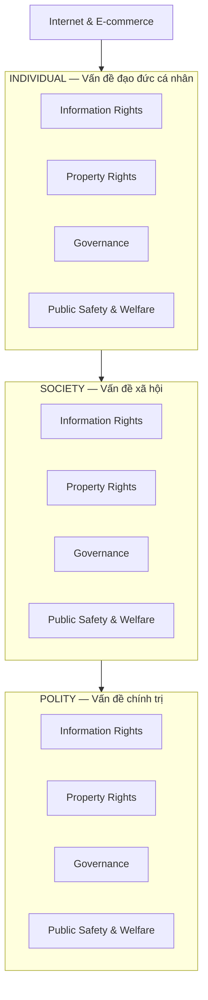
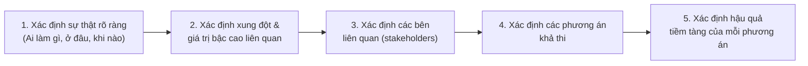
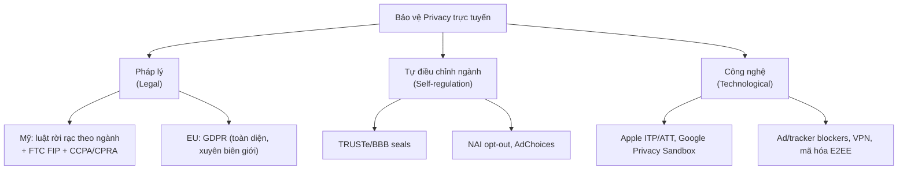
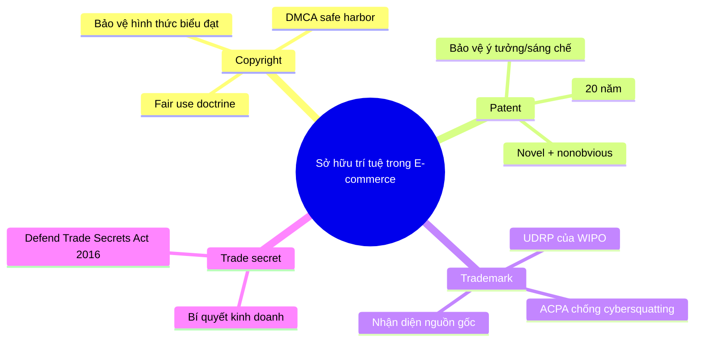
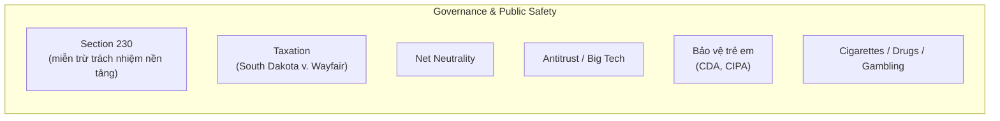

# Chương 8: Ethical, Social, and Political Issues in E-commerce

> Nguồn: *E-Commerce: Business, Technology and Society* (Laudon & Traver, 18th edition, 2024) — Chương 8, trang in sách 460–536 (trang PDF 494–570).

---

## 1. Tóm tắt & giải thích kiến thức

### Bối cảnh chương (Opening Case: The Right to Be Forgotten)

Chương mở đầu bằng case "quyền được lãng quên" (**right to be forgotten**): năm 2014, Tòa án Công lý Châu Âu (CJEU) buộc Google phải gỡ bỏ các link tìm kiếm liên quan đến thông tin cá nhân đã lỗi thời/không còn liên quan theo yêu cầu của công dân EU (vụ Mario Costeja Gonzalez kiện Google Spain). Đây là ví dụ điển hình cho thấy châu Âu đi trước Mỹ trong bảo vệ privacy: EU coi đây là quyền cá nhân (sau này được luật hóa thành "right to erasure" trong GDPR 2018), trong khi Mỹ ưu tiên tự do báo chí/ngôn luận (First Amendment) và chỉ có luật tương tự ở cấp bang (California CCPA 2020).

### 8.1 Hiểu về các vấn đề đạo đức, xã hội, chính trị trong E-commerce

Internet và e-commerce phá vỡ (disrupt) các quan hệ xã hội/kinh doanh sẵn có vì các đặc tính độc đáo của công nghệ (ubiquity, global reach, universal standards, richness, interactivity, information density, personalization, social technology — xem lại Table 1.2 ở Chương 1). Mỗi đặc tính công nghệ đều kéo theo hệ quả đạo đức/xã hội/chính trị tương ứng (Table 8.1), ví dụ: tính "ubiquity" khiến công việc/mua sắm xâm lấn đời sống gia đình; "personalization" mở ra khả năng xâm phạm privacy chưa từng có.

**Mô hình 4 chiều đạo đức (Figure 8.1)**: các vấn đề đạo đức ở cấp *cá nhân* phản chiếu thành vấn đề xã hội ở cấp *xã hội (society)* và vấn đề chính trị ở cấp *chính thể (polity)*, xoay quanh 4 nhóm:
- **Information rights** — quyền kiểm soát thông tin cá nhân
- **Property rights** — quyền sở hữu trí tuệ trong môi trường số
- **Governance** — ai/luật nào quản lý Internet
- **Public safety and welfare** — an toàn công cộng (trẻ em, nội dung độc hại...)

**4 khái niệm đạo đức nền tảng (phương Tây):**
- **Responsibility (trách nhiệm)**: cá nhân/tổ chức là tác nhân đạo đức tự do, phải chịu trách nhiệm cho hành động của mình.
- **Accountability (khả năng giải trình)**: phải giải trình được hậu quả hành động trước người khác.
- **Liability (trách nhiệm pháp lý bồi thường)**: hệ thống luật cho phép người bị hại đòi bồi thường thiệt hại.
- **Due process (thủ tục tố tụng công bằng)**: luật phải rõ ràng, được hiểu đúng, và có cơ chế kháng cáo lên cấp cao hơn.

**Quy trình 5 bước phân tích tình huống khó xử đạo đức (ethical dilemma):**

**8 nguyên tắc đạo đức tham khảo để ra quyết định:**
1. **Golden Rule** — đối xử với người khác như mình muốn được đối xử.
2. **Universalism** — nếu hành động không đúng trong mọi trường hợp thì cũng không đúng trong trường hợp cụ thể.
3. **Slippery Slope** — nếu hành động không thể lặp lại mãi thì không nên làm dù chỉ một lần.
4. **Collective Utilitarian Principle** — chọn hành động tạo giá trị lớn nhất cho toàn xã hội.
5. **Risk Aversion** — chọn hành động gây ít tổn hại/chi phí tiềm tàng nhất.
6. **No Free Lunch** — giả định mọi thứ hữu ích đều thuộc sở hữu ai đó và cần được trả công.
7. **The New York Times Test** — giả định quyết định của bạn sẽ lên trang nhất báo ngày mai, liệu bạn có tự hào không.
8. **The Social Contract Rule** — bạn có muốn sống trong một xã hội mà nguyên tắc này trở thành nguyên tắc tổ chức chung không.

### 8.2 Privacy and Information Rights (Quyền riêng tư và thông tin)

**Privacy** = quyền đạo đức của cá nhân được để yên (left alone), tự do khỏi giám sát/can thiệp từ cá nhân/tổ chức khác kể cả nhà nước. **Information privacy** là một tập con, dựa trên 4 tiền đề: (1) quyền kiểm soát việc sử dụng thông tin của mình, (2) quyền được biết và đồng ý (informed consent) trước khi thu thập, (3) quyền có thủ tục công bằng (due process) đối với thông tin cá nhân, (4) quyền được lưu trữ thông tin an toàn.

**Fair Information Practices (FIP)** của FTC gồm 5 nguyên tắc cốt lõi: Notice/Awareness, Choice/Consent, Access/Participation, Security, Enforcement.

**Khu vực công vs. khu vực tư:** Ở khu vực công (chính phủ), privacy có nền tảng hiến pháp lâu đời (First/Fourth/Fourteenth Amendment, Privacy Act 1974). Ở khu vực tư (doanh nghiệp), luật lệ mang tính rời rạc theo ngành (Fair Credit Reporting Act, HIPAA, COPPA, GLBA...) — Mỹ không có luật privacy tổng quát duy nhất như châu Âu.

**California dẫn đầu ở Mỹ:** CCPA (2020) và CPRA (2023) cho cư dân California quyền biết, xóa ("right to be forgotten"), từ chối bán dữ liệu, và chuyển dữ liệu.

**Thông tin doanh nghiệp thu thập:** PII (**personally identifiable information**) — dữ liệu định danh được cá nhân (tên, SSN, thẻ tín dụng...); **anonymous information** — dữ liệu nhân khẩu/hành vi không định danh trực tiếp (dù vẫn có thể bị "re-identify"). Công cụ thu thập: cookies (first-party/third-party/persistent), web beacons, device fingerprinting, deep packet inspection, cross-device tracking...

**Profiling & behavioral targeting**: tạo "data image" (hồ sơ hành vi) — anonymous profiles (nhóm nhân khẩu ẩn danh) vs. personal profiles (gắn email/địa chỉ thật). Facial recognition làm gia tăng rủi ro do sai số phân biệt chủng tộc/giới tính.

**Vấn đề mobile & social network**: smartphone là thiết bị theo dõi vị trí gần như liên tục (cross-device graph, persistent location tracking); mạng xã hội khuyến khích tự bộc lộ (self-revelation) nên ranh giới "public" và "private" trở nên mờ nhạt.

**FTC** là cơ quan liên bang chủ lực bảo vệ privacy tư nhân tại Mỹ — dựa trên FIP, sau này chuyển sang cách tiếp cận "harm-based" và "consumer rights-based" (Table 8.7): Privacy by Design, Simplified Choice, Greater Transparency.

**GDPR (EU, 2018)** — khung pháp lý mạnh nhất thế giới: áp dụng toàn cầu cho bất kỳ tổ chức nào xử lý dữ liệu công dân EU; cho quyền truy cập miễn phí, quyền xóa (right of erasure), quyền chuyển dữ liệu (data portability); bắt buộc có Data Protection Officer, opt-in tường minh, báo cáo vi phạm trong 72 giờ, phạt tới 4% doanh thu toàn cầu hoặc 20 triệu USD.

**Tự điều chỉnh ngành (industry self-regulation)**: TRUSTe/TrustArc seals, Network Advertising Initiative (NAI) opt-out, AdChoices — nhìn chung được đánh giá là kém hiệu quả.

**Giải pháp công nghệ (Table 8.9)**: Apple ITP/ATT, Google Privacy Sandbox, differential privacy, privacy-first browsers (Brave, DuckDuckGo, Epic), message encryption, ad/spyware blockers, VPN, HTTPS...

**Giới hạn quyền riêng tư — Law enforcement & surveillance**: Patriot Act, FISA, chương trình PRISM của NSA gây tranh cãi; các án lệ quan trọng: *Riley v. California* (2014, cần warrant để khám điện thoại), *Carpenter v. United States* (2018, cần warrant để lấy dữ liệu vị trí điện thoại) — nhưng chính phủ vẫn có thể **mua** dữ liệu vị trí từ data broker (Acxiom, Venntel...) mà không cần warrant, tạo lỗ hổng pháp lý lớn.

### 8.3 Intellectual Property Rights (Quyền sở hữu trí tuệ)

Mục tiêu của luật IP là cân bằng lợi ích công (public interest — phổ biến sáng tạo) và lợi ích tư (private interest — thù lao cho người sáng tạo). Có 4 hình thức bảo hộ chính:

| Loại | Bảo vệ gì | Thời hạn | Ghi chú |
|---|---|---|---|
| **Copyright** | Hình thức biểu đạt (expression), không bảo vệ ý tưởng | Đời tác giả + 70 năm (cá nhân) / 95 năm (doanh nghiệp) | Có **doctrine of fair use** (Table 8.10: mục đích sử dụng, bản chất tác phẩm, tỷ lệ sử dụng, ảnh hưởng thị trường, ngữ cảnh) |
| **Patent** | Ý tưởng/sáng chế (machines, man-made products, compositions of matter, processing methods) | Thường 20 năm | Phải mới, độc đáo, không hiển nhiên (novel, nonobvious); không cấp cho quy luật tự nhiên/hiện tượng tự nhiên/ý tưởng trừu tượng |
| **Trademark** | Tên/biểu tượng nhận diện nguồn gốc hàng hóa | 10 năm, có thể gia hạn vô thời hạn | Kiểm tra vi phạm dựa trên "market confusion" + "bad faith" |
| **Trade secret** | Bí quyết kinh doanh (công thức, quy trình) | Vô thời hạn nếu giữ bí mật | Phải: (1) bí mật, (2) có giá trị thương mại, (3) chủ sở hữu có biện pháp bảo vệ |

**DMCA (Digital Millennium Copyright Act, 1998)** — đạo luật đầu tiên điều chỉnh copyright cho thời đại Internet, gồm 4 Title (Table 8.11), quan trọng nhất là **Title II — Safe Harbor**: ISP không chịu trách nhiệm với nội dung vi phạm bản quyền do người dùng đăng, miễn là (1) không biết nội dung vi phạm, (2) không hưởng lợi tài chính trực tiếp từ vi phạm, (3) gỡ bỏ nhanh chóng khi nhận **takedown notice**. Các case kinh điển: *Lenz v. Universal ("dancing baby")*, *Viacom v. Google/YouTube* (dẫn đến Content ID), *BMG v. Cox Communications*.

**Cybersquatting & Trademark trên Internet**: Anticybersquatting Consumer Protection Act (ACPA) — cấm đăng ký domain trùng/gây nhầm lẫn với thương hiệu nổi tiếng với mục đích xấu (bad faith). **Cybersquatting** = tống tiền chủ thương hiệu; **cyberpiracy** = chuyển hướng traffic gây nhầm lẫn; **typosquatting** = domain dựa trên lỗi chính tả phổ biến. WIPO xử lý tranh chấp qua UDRP.

### 8.4 Governance (Quản trị Internet)

Câu hỏi cốt lõi: ai kiểm soát Internet, kiểm soát gì, và bằng cách nào? Thực tế Internet **có thể** bị kiểm soát/giám sát tập trung (ví dụ "Great Firewall of China"), trái với niềm tin ban đầu rằng Internet không thể kiểm soát được.

**Section 230 (Communications Decency Act 1996)** — luật "tạo ra Internet ngày nay": (c)(1) miễn trách nhiệm publisher cho nền tảng với nội dung người dùng đăng; (c)(2) miễn trách nhiệm khi nền tảng gỡ bỏ nội dung "good faith". Hiện đang bị chỉ trích từ cả hai phía chính trị (bảo thủ cho rằng Big Tech kiểm duyệt thiên vị; cấp tiến cho rằng luật giảm động lực gỡ nội dung có hại) — case *Gonzalez v. Google* đưa vấn đề thuật toán đề xuất lên Tòa Tối cao.

**Thuế (Taxation)**: *South Dakota v. Wayfair* (2018) — cho phép các bang đánh thuế bán hàng trực tuyến dù công ty không có hiện diện vật lý (physical nexus) tại bang đó, đảo ngược tiền lệ cũ. Internet Tax Freedom Act (ITFA) cấm thuế phân biệt đối xử/thuế truy cập Internet.

**Net neutrality** — nguyên tắc ISP phải đối xử bình đẳng với mọi dữ liệu, không phân biệt giá theo nội dung/nền tảng. Lịch sử qua lại: FCC công nhận (2015) → bị chính quyền Trump đảo ngược (2017-2018) → các bang (California) tự ban hành luật riêng.

**Antitrust/độc quyền** — Big Tech (Google, Amazon, Meta) bị cáo buộc dùng quyền lực thị trường để mua/loại bỏ đối thủ (Instagram, WhatsApp, YouTube, DoubleClick, Waze...), tự ưu tiên dịch vụ của mình trong kết quả tìm kiếm (Google Shopping vs Foundem/Yelp/Getty Images). EU mạnh tay hơn Mỹ với các khoản phạt lớn và **Digital Markets Act (DMA)** nhắm vào các nền tảng "gatekeeper".

### 8.5 Public Safety and Welfare (An toàn & phúc lợi công cộng)

**Bảo vệ trẻ em**: Communications Decency Act (CDA, 1996) bị Tòa Tối cao bác bỏ phần lớn vì vi phạm First Amendment (trừ Section 230); Children's Internet Protection Act (CIPA, 2001) — bắt buộc trường học/thư viện dùng phần mềm lọc nội dung, được Tòa Tối cao giữ nguyên (2003). Vấn đề mới nổi: tác động sức khỏe tâm thần của mạng xã hội/metaverse lên trẻ em, thiếu niên (California Age-Appropriate Design Code Act, 2024).

**Thuốc lá, ma túy, cờ bạc — "Internet có thực sự vô biên giới?"**: minh chứng cho xung đột giữa quyền tài phán truyền thống (state/federal jurisdiction) và tính "phi biên giới" bề ngoài của Web.
- Thuốc lá: bị kiểm soát hiệu quả qua áp lực lên hệ thống thanh toán/vận chuyển (PayPal, UPS/FedEx/DHL).
- Thuốc/dược phẩm: nhà thuốc trực tuyến "rogue" bán không cần toa, hàng giả; darknet marketplaces (Silk Road, AlphaBay...) dùng Tor + cryptocurrency để né pháp luật.
- Cờ bạc: Unlawful Internet Gambling Enforcement Act (UIGEA, 2006) chặn dòng tiền tới sàn cá cược; *Murphy v. NCAA* liên quan PASPA (2018) mở đường cho cá cược thể thao hợp pháp tại nhiều bang.

### 8.6–8.8 (tóm tắt nhanh)

- **8.6 Careers**: minh họa vị trí "E-commerce Privacy Research Associate" tại một công ty quảng cáo trực tuyến (ad exchange/programmatic advertising) — công việc nghiên cứu tuân thủ luật privacy trong nước và quốc tế.
- **8.7 Case Study — "Are Big Tech Firms Getting Too Big?"**: đối chiếu 2 thời kỳ tư duy antitrust của Mỹ (1890–1950s: chống độc quyền cấu trúc thị trường, vd *Standard Oil* 1911; sau 1960s: chỉ quan tâm giá/hiệu quả cho người tiêu dùng) với mô hình EU (tập trung vào cấu trúc cạnh tranh, không chỉ giá). Đề xuất 3 giải pháp: (1) thắt chặt xét duyệt sáp nhập, (2) chia tách công ty (Amazon/Meta/Google), (3) theo mô hình quản lý EU (DMA).

---

## 2. Key Concepts

**8.1 — Vấn đề đạo đức/xã hội/chính trị**
- **ethics**: nghiên cứu các nguyên tắc giúp cá nhân/tổ chức xác định đúng-sai.
- **responsibility**: cá nhân/tổ chức/xã hội chịu trách nhiệm cho hành động của mình.
- **accountability**: phải giải trình được hậu quả hành động trước bên khác.
- **liability**: đặc điểm hệ thống pháp lý cho phép đòi bồi thường thiệt hại.
- **due process**: quy trình pháp lý minh bạch, có thể kháng cáo.
- **dilemma**: tình huống có ít nhất 2 phương án đối lập, mỗi phương án đều mang lại lợi ích mong muốn.

**8.2 — Privacy**
- **privacy**: quyền đạo đức được để yên, không bị giám sát/can thiệp.
- **information privacy**: quyền kiểm soát thông tin cá nhân, biết khi bị thu thập, có due process, và được lưu trữ an toàn.
- **right to be forgotten**: quyền yêu cầu chỉnh sửa/xóa thông tin cá nhân.
- **personally identifiable information (PII)**: dữ liệu định danh, xác định vị trí, hoặc liên hệ với một cá nhân cụ thể.
- **anonymous information**: dữ liệu nhân khẩu/hành vi không kèm định danh cá nhân.
- **profiling**: tạo "data image" mô tả hành vi cá nhân/nhóm trực tuyến.
- **data image**: tập hợp bản ghi dữ liệu dùng tạo hồ sơ hành vi.
- **anonymous profiles**: hồ sơ nhóm nhân khẩu không định danh cụ thể.
- **personal profiles**: hồ sơ gắn email/địa chỉ/số điện thoại thật vào dữ liệu hành vi.
- **cross-device graph**: file dữ liệu kết hợp tracking từ mọi thiết bị của một cá nhân.
- **persistent location tracking**: khả năng theo dõi vị trí điện thoại kể cả khi app không hoạt động.
- **informed consent**: sự đồng ý dựa trên hiểu biết đầy đủ các sự kiện liên quan.
- **opt-out model**: mặc định thu thập dữ liệu trừ khi người dùng chủ động từ chối.
- **opt-in model**: chỉ thu thập khi người dùng chủ động đồng ý.
- **General Data Protection Regulation (GDPR)**: khung pháp lý bảo vệ dữ liệu của EU, áp dụng toàn cầu.
- **privacy shield agreements / safe harbor agreements**: cơ chế đảm bảo dữ liệu chuyển ra ngoài EU vẫn tuân thủ chuẩn GDPR.
- **cross-site tracking / cross-device tracking**: theo dõi người dùng qua nhiều website/thiết bị.
- **device fingerprinting**: nhận diện thiết bị dựa trên đặc điểm kỹ thuật duy nhất (không cần cookie).
- **differential privacy software**: hạn chế khả năng ghép nối dữ liệu ẩn danh để tái định danh người dùng.
- **privacy default browsers**: trình duyệt tự động chặn tracking cookie mặc định (Brave, DuckDuckGo, Epic).
- **Intelligent Tracking Prevention (ITP)**: công cụ của Apple Safari giám sát/loại bỏ cookie theo dõi.

**8.3 — Intellectual Property**
- **copyright law**: bảo vệ hình thức biểu đạt gốc (văn bản, nghệ thuật, âm nhạc, phần mềm...) khỏi bị sao chép.
- **doctrine of fair use**: cho phép dùng tài liệu có bản quyền không cần xin phép trong một số điều kiện nhất định.
- **Digital Millennium Copyright Act (DMCA)**: luật đầu tiên điều chỉnh copyright cho thời đại Internet.
- **patent**: cấp độc quyền cho ý tưởng đằng sau một sáng chế, thường 20 năm.
- **trademark**: dấu hiệu nhận diện và phân biệt nguồn gốc hàng hóa.
- **dilution**: hành vi làm suy yếu mối liên kết giữa thương hiệu và sản phẩm.
- **Anticybersquatting Consumer Protection Act (ACPA)**: tạo trách nhiệm dân sự cho hành vi đăng ký domain xấu (bad faith) trùng thương hiệu nổi tiếng.
- **cybersquatting**: đăng ký domain xâm phạm nhằm tống tiền chủ sở hữu hợp pháp.
- **cyberpiracy**: hành vi tương tự cybersquatting nhưng nhằm chuyển hướng traffic sang site xâm phạm.
- **trade secret**: thông tin bí mật, có giá trị thương mại, được chủ sở hữu bảo vệ.

**8.4 — Governance**
- **governance**: kiểm soát xã hội — ai kiểm soát e-commerce, kiểm soát gì, bằng cách nào.
- **net neutrality**: nguyên tắc ISP đối xử bình đẳng với mọi dữ liệu trên Internet.

**8.9 (bổ sung từ 9.1, không thuộc chương 8 nhưng xuất hiện gần cuối tài liệu đọc)**: không đưa vào phạm vi chương này.

---

## 3. Questions

1. **What basic assumption does the study of ethics make about individuals?**
   Đạo đức học giả định rằng cá nhân là **tác nhân đạo đức tự do (free moral agents)** — có khả năng lựa chọn giữa các phương án hành động, và do đó có thể bị đánh giá đúng/sai dựa trên lựa chọn đó.

2. **What are the basic principles of ethics?**
   4 nguyên tắc nền tảng chung của mọi trường phái đạo đức phương Tây: **responsibility** (chịu trách nhiệm cho hành động), **accountability** (phải giải trình hậu quả), **liability** (cơ chế pháp lý cho phép đòi bồi thường), và **due process** (thủ tục pháp lý minh bạch, có thể kháng cáo).

3. **What are the basic steps to follow in analyzing an ethical dilemma?**
   5 bước: (1) xác định và mô tả rõ sự thật (ai làm gì, khi nào, ở đâu, cách nào); (2) xác định xung đột/tình huống khó xử và các giá trị bậc cao liên quan; (3) xác định các bên liên quan (stakeholders); (4) xác định các phương án khả thi; (5) xác định hậu quả tiềm tàng của từng phương án.

4. **Define "universalism," "slippery slope," "the New York Times test," and "the social contract rule" as they apply to ethics.**
   - **Universalism**: nếu một hành động không đúng trong mọi tình huống thì nó cũng không đúng trong tình huống cụ thể đang xét (tự hỏi: nếu áp dụng quy tắc này cho mọi trường hợp, tổ chức/xã hội có tồn tại được không?).
   - **Slippery slope**: nếu một hành động không thể lặp lại nhiều lần thì không nên thực hiện dù chỉ một lần, vì có thể dẫn tới hậu quả tiêu cực nếu lặp lại.
   - **The New York Times test**: giả định quyết định của bạn sẽ là bài báo trang nhất ngày mai — liệu phản ứng công chúng, gia đình, bạn bè có tích cực không; giả định thị trường thông tin hoàn hảo (không có gì bị giấu).
   - **The social contract rule**: tự hỏi liệu bạn có muốn sống trong một xã hội mà nguyên tắc bạn đang ủng hộ trở thành nguyên tắc tổ chức của toàn xã hội hay không.

5. **Explain why people with a serious medical condition might be concerned about researching their condition online or about using a health-related mobile app. What are some technologies that could prevent one's personal information from being revealed?**
   Vì việc tìm kiếm/thao tác với app sức khỏe có thể để lại dấu vết (search history, dữ liệu app y tế kết hợp với geo-location) mà các bên thứ ba (nhà quảng cáo, data broker, thậm chí chính phủ) có thể thu thập và suy luận ra tình trạng bệnh nhạy cảm (ví dụ dữ liệu vị trí trỏ tới cơ sở cai nghiện hay phòng khám — như vụ FTC kiện Kochava). Công nghệ có thể giúp bảo vệ: **private/anonymous browsing**, **VPN**, **privacy default browsers** (Brave, DuckDuckGo, Epic), **ad/tracker blockers**, **message/e-mail encryption** (Signal, ProtonMail), **differential privacy**, và các tùy chọn tắt location services / App Tracking Transparency trên di động.

6. **How does the history of privacy in the public sector differ from that in the private sector?**
   Ở khu vực công, quyền riêng tư có lịch sử lâu đời hơn hai thế kỷ, bắt nguồn từ Hiến pháp Mỹ (First, Fourth, Fourteenth Amendment) và được củng cố bởi Privacy Act 1974 cùng nhiều đạo luật liên bang khác (Table 8.3). Ở khu vực tư, khái niệm privacy còn non trẻ hơn nhiều, chỉ manh nha từ những năm 1960 khi hệ thống máy tính quy mô lớn (thẻ tín dụng, cơ quan chấm điểm tín dụng) xuất hiện, và luật bảo vệ hiện nay mang tính rời rạc theo ngành (piecemeal, sector-by-sector — Table 8.4) thay vì một đạo luật tổng quát.

7. **Describe how the strength of a privacy policy can be measured.**
   Có thể đo bằng khung 10 tiêu chí (Table 8.8), phần lớn bắt nguồn từ FIP của FTC — ví dụ: chính sách có dễ tìm/hiểu không; có công khai đầy đủ cách dùng thông tin không; người dùng có được chọn có bị thu thập/theo dõi/nhắm mục tiêu không; có thể chỉnh sửa thông tin không; có được thông báo khi dữ liệu bị mất/đánh cắp không... Mỗi tiêu chí chấm theo thang 0–4, cho phép so sánh các công ty với nhau hoặc theo thời gian.

8. **How is the opt-in model of informed consent different from the opt-out model? In which type of model does the consumer retain more control?**
   **Opt-out**: mặc định là thu thập dữ liệu, trừ khi người dùng chủ động hành động để ngăn (ví dụ bỏ tick một ô). **Opt-in**: mặc định là KHÔNG thu thập, chỉ khi người dùng chủ động đồng ý (tick vào ô đồng ý) thì mới được thu thập/sử dụng dữ liệu. **Opt-in cho người tiêu dùng nhiều quyền kiểm soát hơn** vì gánh nặng hành động thuộc về bên thu thập dữ liệu, không phải người dùng.

9. **What are the two core principles of the FTC's Fair Information Practices principles?**
   Hai nguyên tắc cốt lõi (core principles) trong Table 8.2 là **Notice/Awareness** (site phải công khai thực hành thu thập dữ liệu trước khi thu thập) và **Choice/Consent** (phải có cơ chế để người tiêu dùng lựa chọn cách thông tin được sử dụng cho mục đích thứ cấp, bao gồm opt-in/opt-out).

10. **What is the GDPR?**
    **General Data Protection Regulation** — khung pháp lý bảo vệ dữ liệu của Liên minh Châu Âu có hiệu lực từ 2018, thay thế Data Protection Directive cũ. Áp dụng cho mọi tổ chức thu thập/lưu trữ/xử lý dữ liệu cá nhân của công dân EU trên toàn cầu (không phụ thuộc nơi xử lý dữ liệu); trao quyền truy cập miễn phí, quyền xóa (right of erasure), quyền chuyển dữ liệu (data portability), quyền kiện đòi bồi thường; bắt buộc có Data Protection Officer, opt-in tường minh, báo cáo vi phạm trong 72 giờ; phạt tới 20 triệu euro hoặc 4% doanh thu toàn cầu.

11. **List and describe five technological protections for online privacy.**
    Ví dụ 5 trong số các công nghệ ở Table 8.9:
    - **Apple Intelligent Tracking Prevention (ITP)**: theo dõi và vô hiệu hóa cookie theo dõi liên trang trên Safari.
    - **Apple App Tracking Transparency (ATT)**: buộc app phải xin phép người dùng trước khi theo dõi và chia sẻ dữ liệu hoạt động.
    - **Differential privacy software**: giảm khả năng ghép các tập dữ liệu ẩn danh để tái định danh người dùng.
    - **Privacy default browsers (Brave, DuckDuckGo, Epic)**: tự động loại bỏ cookie theo dõi và ẩn IP (thường có VPN tích hợp).
    - **Ad blockers**: chặn cuộc gọi tới máy chủ quảng cáo, hạn chế tải hình ảnh theo yêu cầu người dùng.

12. **What is a patent, and how does it differ from a copyright?**
    **Patent** cấp cho chủ sở hữu độc quyền khai thác **ý tưởng** đằng sau một sáng chế (máy móc, sản phẩm, hợp chất, quy trình) trong thời hạn thường là 20 năm, đòi hỏi tính mới, độc đáo, không hiển nhiên. Khác với **copyright** — vốn chỉ bảo vệ **hình thức biểu đạt** cụ thể của một ý tưởng (ví dụ mã nguồn viết ra) chứ không bảo vệ chính ý tưởng đó, và được cấp tự động ngay khi tác phẩm được tạo ra (không cần đăng ký như patent).

13. **How could the Internet potentially change the protection given to intellectual property? What capabilities of the Internet make it more difficult to enforce intellectual property law?**
    Internet cho phép tạo ra **bản sao số hoàn hảo (perfect digital copies)** của các tác phẩm (nhạc, sách, phim...) và phân phối chúng gần như miễn phí tới hàng trăm triệu người dùng trong vài giây, phá vỡ mô hình bảo vệ IP truyền thống vốn dựa trên chi phí sao chép/phân phối vật lý cao. Các đặc tính gây khó khăn cho thực thi luật IP: tính dễ sao chép/truyền tải/chỉnh sửa của media số; tính "nhỏ gọn" (compactness) khiến việc "trộm cắp" dễ dàng; khó phân loại một sản phẩm phần mềm là chương trình/sách/nhạc; khó xác lập tính "độc nhất" của bản sao số.

14. **What does the Digital Millennium Copyright Act (DMCA) attempt to do? Why was it enacted? What types of violations does it try to prevent?**
    DMCA (1998) là nỗ lực đầu tiên điều chỉnh luật bản quyền Mỹ cho phù hợp với kỷ nguyên Internet, thực thi 2 hiệp ước của WIPO. Nó được ban hành để cân bằng lợi ích giữa chủ sở hữu bản quyền, ISP, và người dùng cuối. DMCA cố gắng ngăn chặn: hành vi phá vỡ các biện pháp bảo vệ công nghệ (technology-based protections) đối với tác phẩm có bản quyền (Title I); đồng thời tạo ra 2 "safe harbor" giới hạn trách nhiệm của ISP đối với nội dung vi phạm do người dùng đăng hoặc liên kết tới, miễn ISP tuân thủ quy trình gỡ bỏ (takedown notice) khi được thông báo (Title II).

15. **Define cybersquatting. How is it different from cyberpiracy? What type of intellectual property violation does cybersquatting entail?**
    **Cybersquatting** là hành vi đăng ký domain xâm phạm (hoặc dùng thương hiệu trên Internet theo cách khác) nhằm mục đích tống tiền (extort) chủ sở hữu thương hiệu hợp pháp. **Cyberpiracy** có hành vi tương tự nhưng với mục đích **chuyển hướng traffic** từ site hợp pháp sang site xâm phạm (gây nhầm lẫn thị trường, làm tổn hại uy tín thương hiệu — dilution/tarnishment) thay vì chỉ để đòi tiền chuộc domain. Cybersquatting là một dạng vi phạm **trademark (nhãn hiệu)**.

16. **What is web scraping, and why is it a copyright issue?**
    **Web scraping** là việc dùng một ứng dụng để tự động trích xuất dữ liệu từ website. Đây trở thành vấn đề bản quyền vì nội dung bị scrape có thể là tài liệu có bản quyền (ví dụ bài báo) và việc "tái sử dụng" (repurpose) nội dung đó — như đưa vào bản tin trả phí — có thể cấu thành **copyright infringement** thay vì fair use, như phán quyết trong *Associated Press v. Meltwater U.S. Holdings* (2013); dù việc scrape dữ liệu công khai đơn thuần (không phải nội dung có bản quyền) có thể không vi phạm Computer Fraud and Abuse Act, như *hiQ Labs v. LinkedIn* (2022).

17. **What are some of the tactics that businesses that are illegal in the United States use on the Internet to operate outside the law?**
    Đặt máy chủ/hoạt động ở nước ngoài (offshore) để né quyền tài phán trong nước; sử dụng **darknet marketplaces** (yêu cầu phần mềm đặc biệt như Tor để ẩn IP) và thanh toán bằng **cryptocurrency** để giữ ẩn danh; dùng séc/money order và bưu điện thay vì hệ thống thanh toán bị giám sát; liên tục "mọc lại" dưới tên miền/nền tảng mới sau khi bị đóng cửa (ví dụ Silk Road → AlphaBay/Hansa).

18. **Why can't pornographic sites simply be banned in the United States? Why has the Supreme Court struck down legislation intended to protect children from pornography?**
    Vì **First Amendment** bảo vệ tự do ngôn luận, và nội dung khiêu dâm (không phải khiêu dâm trẻ em) nói chung được coi là được bảo vệ bởi tự do biểu đạt đối với người trưởng thành. Tòa Tối cao đã bác bỏ phần lớn Communications Decency Act (1997) vì cho rằng luật này là một "lệnh cấm nội dung chung chung" (blanket proscription), không thể thực thi theo kiểu phân vùng ("cyberzoning") như lý lẽ chính phủ đưa ra, và do đó vi phạm quyền tự do ngôn luận được bảo vệ bởi First Amendment.

19. **What is the "right to be forgotten"? What are some of the risks and benefits of establishing this right?**
    Là quyền của cá nhân được yêu cầu chỉnh sửa hoặc xóa bỏ thông tin cá nhân của họ (ví dụ các link tìm kiếm không còn liên quan/chính xác/quá mức) — được CJEU công nhận năm 2014 và luật hóa trong GDPR ("right to erasure"). **Lợi ích**: bảo vệ cá nhân khỏi bị gắn mãi mãi với các sự kiện quá khứ không còn liên quan (ví dụ nợ nần đã giải quyết), tăng quyền kiểm soát hình ảnh cá nhân trực tuyến. **Rủi ro**: có thể bị lạm dụng bởi tội phạm, kẻ lừa đảo, quan chức tham nhũng để "viết lại lịch sử"; xung đột với tự do báo chí và quyền công chúng được biết (đặc biệt với người của công chúng); khó thực thi nhất quán trên phạm vi toàn cầu (tranh chấp Pháp–Google về việc xóa toàn cầu hay chỉ trong EU); công nghệ blockchain (không thể sửa/xóa) có thể khiến quyền này về sau khó áp dụng.

20. **What is the doctrine of "fair use"? Why did the courts decide that Google's scanning of copyrighted books was a "fair use"?**
    **Fair use** cho phép sử dụng tài liệu có bản quyền mà không cần xin phép trong một số hoàn cảnh nhất định (dựa trên 5 yếu tố ở Table 8.10: mục đích sử dụng, bản chất tác phẩm, tỷ lệ sử dụng, tác động tới thị trường, ngữ cảnh sử dụng). Tòa án phán quyết Google Books Library Project là fair use vì: Google chỉ hiển thị **đoạn trích ngắn (snippets)**, không bao giờ hiện toàn trang; dự án có mục đích công cộng rộng lớn (giúp học sinh, nhà nghiên cứu dễ tìm sách hơn); được xem là **"transformative"** — tạo ra đặc tính và mục đích mới cho sách (công cụ khám phá) thay vì thay thế bản gốc, đồng thời còn có thể **tăng doanh số** bán sách gốc.

---

## 4. Projects

### Project 1
> *"Do a search on Google to find personal information about yourself. List the general types of information that you are able to find. Is there information that you were surprised to see or that you would like to be deleted? Review the various tools that Google provides that enable you to request the removal of certain information. Write a short report on what you discover."*

**Hướng dẫn thực hiện:**
1. Mở trình duyệt ẩn danh (incognito/private) để tránh kết quả bị cá nhân hóa theo lịch sử duyệt web của bạn; tìm kiếm tên đầy đủ của bạn (có thể thử nhiều biến thể: có/không tên đệm, kèm địa danh/trường học/công ty).
2. Ghi lại các **loại thông tin** xuất hiện: hồ sơ mạng xã hội (LinkedIn, Facebook công khai), bài báo/thông cáo, hồ sơ trường học/doanh nghiệp, ảnh, số điện thoại/địa chỉ (nếu bị các "people search site" như Spokeo, Whitepages thu thập), bài đăng diễn đàn cũ...
3. Đánh giá: thông tin nào bạn **bất ngờ** khi thấy (ví dụ thông tin từ nhiều năm trước, dữ liệu bị các data broker tổng hợp), thông tin nào bạn **muốn xóa**.
4. Tìm và thử dùng công cụ **"Results about you"** của Google (Google's tool cho phép yêu cầu gỡ thông tin cá nhân như SSN, số tài khoản ngân hàng, hình ảnh nhạy cảm khỏi kết quả tìm kiếm — chính sách mở rộng năm 2022 được nhắc tới trong chương) — vào Google Account → Data & Privacy → "Results about you" hoặc tìm form "Remove personal information" của Google.
5. Viết báo cáo ngắn gồm: (a) danh sách loại thông tin tìm thấy, (b) đánh giá mức độ rủi ro/riêng tư, (c) các bước bạn đã thử để yêu cầu gỡ bỏ và kết quả, (d) nhận xét liên hệ với khái niệm "right to be forgotten" đã học trong chương.

**Lưu ý**: không cần đăng thông tin cá nhân thật của bạn vào báo cáo nộp (che/ẩn danh nếu cần); tập trung vào loại thông tin và nguồn, không phải nội dung chi tiết nhạy cảm.

### Project 2
> *"Develop a list of privacy protection features that should be present if a website is serious about protecting privacy. Then visit at least four well-known websites, and examine their privacy policies. Write a report that rates each of the websites on the criteria you have developed."*

**Hướng dẫn thực hiện:**
1. Xây dựng bộ tiêu chí đánh giá — có thể dựa trực tiếp trên **Table 8.8** trong chương (10 tiêu chí: dễ tìm/hiểu; công khai đầy đủ cách dùng dữ liệu; cho phép chọn thu thập hay không; cho phép chọn có bị profiling/targeting hay không; cho phép kiểm soát chia sẻ thông tin nhạy cảm; cho phép sửa thông tin; cho phép kiểm soát ai truy cập; thông báo khi dữ liệu bị mất/đánh cắp; dễ báo cáo và nhận phản hồi; cung cấp bản sao mọi lần tiết lộ thông tin) hoặc dựa trên **FTC FIP** (Table 8.2: Notice, Choice, Access, Security, Enforcement).
2. Chọn ít nhất **4 website nổi tiếng** (ví dụ: Amazon, Facebook/Meta, Google, một trang thương mại điện tử Việt Nam...) và đọc kỹ Privacy Policy/Terms of Use của từng trang.
3. Với mỗi tiêu chí, chấm điểm theo thang 0–4 (0 = không đáp ứng, 4 = đáp ứng đầy đủ) cho từng website — có thể dùng bảng so sánh dạng ma trận (website x tiêu chí).
4. Viết báo cáo trình bày: bảng điểm so sánh, nhận xét website nào bảo vệ privacy tốt nhất/kém nhất và vì sao, có phát hiện gì bất ngờ (ví dụ chính sách quá dài/khó hiểu — tham khảo nghiên cứu trong chương cho biết đọc hết chính sách của 30 trang mất trung bình 8 giờ).

### Project 3
> *"Review the provisions of the Digital Millennium Copyright Act. Examine each of the major sections of the legislation, and make a list of the protections afforded intellectual property owners and users of copyrighted materials. Do you believe this legislation appropriately balances the interests of intellectual property owners and users? Do you have suggestions for strengthening 'fair use' provisions in this legislation?"*

**Hướng dẫn thực hiện:**
1. Dùng **Table 8.11** trong chương làm khung tham chiếu (Title I: WIPO Copyright Treaty Implementation; Title II: Online Copyright Infringement Liability Limitation — safe harbor; Title III: Computer Maintenance Competition Assurance; Title IV: Miscellaneous Provisions).
2. Với mỗi Title, liệt kê rõ: (a) bảo vệ gì cho **chủ sở hữu bản quyền** (ví dụ Title I cấm phá khóa bảo vệ công nghệ), (b) bảo vệ/quyền gì cho **người dùng/ISP** (ví dụ Title II miễn trách nhiệm ISP nếu tuân thủ safe harbor; Title III cho phép sao chép phần mềm để bảo trì máy tính).
3. Có thể tham khảo thêm nguồn gốc (WIPO treaties) và các án lệ minh họa nêu trong chương (*Lenz v. Universal*, *Viacom v. YouTube*, *BMG v. Cox*) để lập luận thực tiễn.
4. Đưa ra quan điểm cá nhân (có lập luận, không chỉ nêu cảm tính) về việc DMCA có cân bằng tốt lợi ích hai bên hay không — có thể tham khảo báo cáo 2020 của Copyright Office được nhắc trong chương (kết luận rằng cơ chế safe harbor không còn cân bằng tốt như trước).
5. Đề xuất cải thiện "fair use": ví dụ làm rõ quy trình xem xét fair use trước khi gửi takedown notice (như án lệ *Lenz*), hoặc có cơ chế phản đối nhanh hơn cho creator bị gỡ nhầm nội dung.
6. Trình bày dưới dạng báo cáo có cấu trúc: giới thiệu → bảng tổng hợp 4 Title → phân tích cân bằng lợi ích → đề xuất → kết luận.

### Project 4
> *"Review the section on net neutrality, and search for two articles that take a position on the topic. Summarize each article, and then write an essay describing your own position on net neutrality."*

**Hướng dẫn thực hiện:**
1. Đọc kỹ lại phần **"Net Neutrality"** trong mục 8.4 để nắm bối cảnh: định nghĩa, lịch sử FCC (2015 công nhận ISP là public utility → 2017-2018 chính quyền Trump đảo ngược → các bang tự ban hành luật riêng như California).
2. Tìm **2 bài báo/nguồn** đưa ra quan điểm về net neutrality — nên chọn 2 nguồn có lập trường khác nhau (một ủng hộ quy định ISP như utility, một ủng hộ thị trường tự do không cần FCC can thiệp) để có góc nhìn cân bằng. Có thể tìm trên các trang tin công nghệ/luật uy tín (ví dụ tương tự các nguồn được trích trong References của chương như Wall Street Journal, Reuters, NCSL.org).
3. Tóm tắt mỗi bài báo ngắn gọn: luận điểm chính, lập luận hỗ trợ, ai được lợi/ai bị hại theo bài viết đó.
4. Viết bài luận (essay) trình bày **quan điểm cá nhân** của bạn về net neutrality — nên đề cập: có nên coi ISP là "public utility" chịu quản lý của FCC hay không; đánh đổi giữa đầu tư hạ tầng của ISP và công bằng truy cập cho người dùng/nội dung nhỏ; vai trò của các bang khi liên bang không hành động.
5. Cấu trúc bài luận gợi ý: mở bài (định nghĩa + tầm quan trọng) → tóm tắt 2 nguồn → lập luận quan điểm cá nhân (có dẫn chứng từ chương và 2 nguồn) → kết luận.
