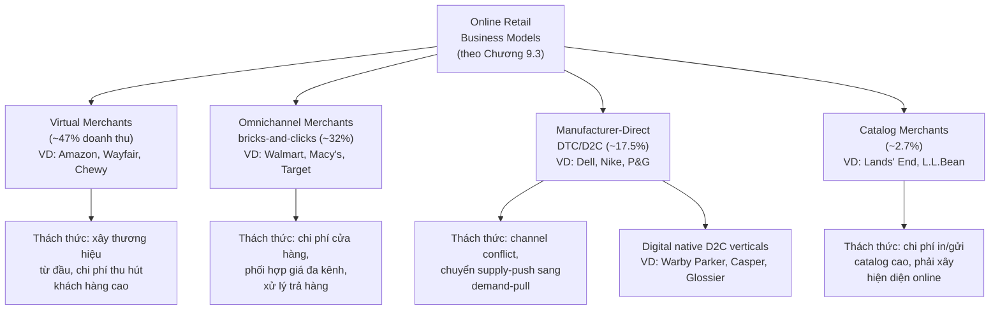
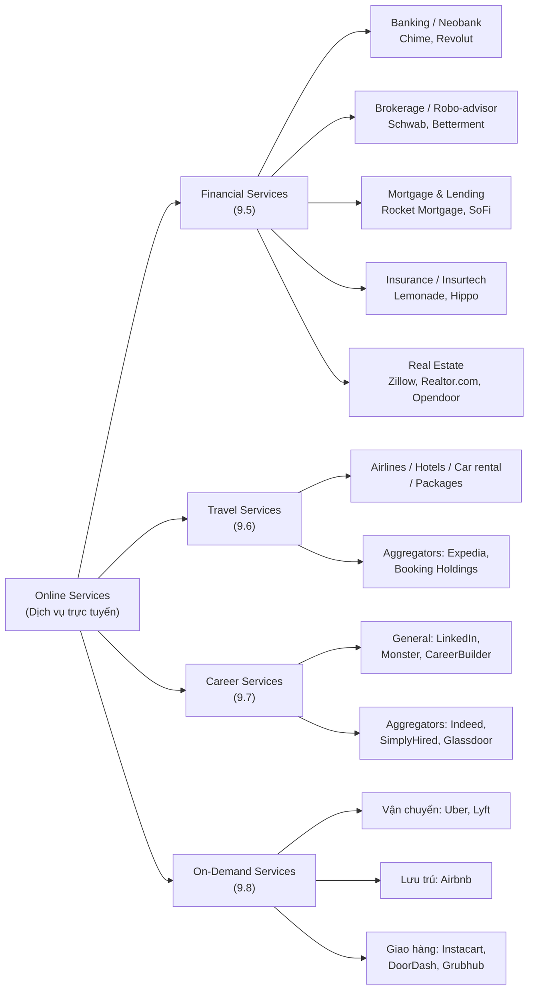
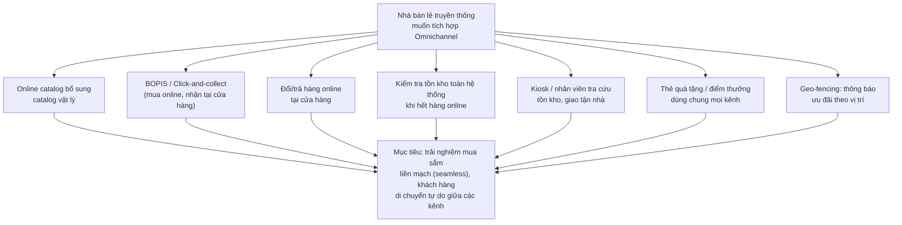

# Chương 9 — Online Retail and Services (Bán lẻ và Dịch vụ trực tuyến)

> Nguồn: *E-Commerce: Business, Technology and Society*, Laudon & Traver, 18th edition (2024), Chapter 9, trang in sách 538–600 (trang vật lý PDF 572–635).

## 1. Tóm tắt & giải thích kiến thức

### Mở đầu chương — Case: Lemonade

Chương mở đầu bằng case study về **Lemonade**, một công ty "insurtech" (bảo hiểm + công nghệ) thành lập năm 2015, bán bảo hiểm nhà/thuê nhà, thú cưng, nhân thọ, xe hơi trực tiếp cho người tiêu dùng qua app di động. Lemonade dùng AI chatbot (Maya để nhận đăng ký, Jim để xử lý bồi thường — có thể duyệt và trả tiền trong 3 giây), dùng big data để phát hiện gian lận (Forensic Graph). Case này minh họa chủ đề xuyên suốt chương: công nghệ số có thể phá vỡ (disrupt) cả những ngành dịch vụ truyền thống lâu đời như bảo hiểm, nhưng đi kèm tranh cãi (vụ kiện về dữ liệu sinh trắc học, tranh cãi dùng AI để từ chối bồi thường).

### 9.1 Analyzing the Viability of Online Firms (Phân tích khả năng tồn tại của doanh nghiệp trực tuyến)

Để đánh giá **economic viability** (khả năng sống sót và có lợi nhuận của doanh nghiệp trong một giai đoạn nhất định), sách dùng 2 hướng phân tích:

**Phân tích chiến lược (Strategic Analysis)** — chia làm 2 nhóm yếu tố:
- *Yếu tố ngành*: rào cản gia nhập ngành (barriers to entry), quyền lực của nhà cung cấp, quyền lực của khách hàng, sự tồn tại của sản phẩm thay thế, chuỗi giá trị ngành (industry value chain), bản chất cạnh tranh nội ngành.
- *Yếu tố riêng của doanh nghiệp*: chuỗi giá trị của doanh nghiệp (firm value chain), năng lực cốt lõi (core competencies), khả năng cộng hưởng (synergies) với các đối tác/công ty liên kết, công nghệ sở hữu riêng, và các thách thức xã hội/pháp lý (kiện tụng, quyền riêng tư, thuế).

**Phân tích tài chính (Financial Analysis)** — dựa trên 2 báo cáo:
- *Báo cáo kết quả hoạt động (statement of operations)*: doanh thu (revenues), giá vốn hàng bán (cost of sales), biên lợi nhuận gộp (gross margin = lợi nhuận gộp / doanh thu thuần), chi phí hoạt động (operating expenses), biên lợi nhuận hoạt động (operating margin = thu nhập từ hoạt động / doanh thu thuần), và biên lợi nhuận ròng (net margin = thu nhập ròng / doanh thu thuần — cho biết % doanh thu công ty thực sự giữ lại sau MỌI chi phí).
- *Bảng cân đối kế toán (balance sheet)*: tài sản (assets), tài sản ngắn hạn (current assets), nợ phải trả (liabilities), nợ ngắn hạn (current liabilities), nợ dài hạn (long-term debt), và **vốn lưu động (working capital = tài sản ngắn hạn − nợ ngắn hạn)** — chỉ số nhanh để đánh giá sức khỏe tài chính ngắn hạn.

Sách lưu ý: nhiều công ty e-commerce công bố "pro forma earnings"/EBITDA (không trừ chi phí cổ phiếu thưởng, khấu hao...) khiến lợi nhuận trông đẹp hơn thực tế theo chuẩn GAAP — nên luôn phân tích theo GAAP.

### 9.2 The Retail Sector: Offline and Online (Ngành bán lẻ: Offline và Online)

Ngành bán lẻ Mỹ chiếm khoảng 24% GDP, chia thành 7 phân khúc lớn: hàng lâu bền (durable goods), hàng tiêu dùng phổ thông (general merchandise), thực phẩm & đồ uống, cửa hàng chuyên biệt (specialty stores), xăng dầu, đặt hàng qua thư/điện thoại (MOTO), và bán lẻ trực tuyến (online retail).

**Tầm nhìn ban đầu về online retail** (theo dự đoán đầu thời kỳ e-commerce, dựa trên cuốn *Blown to Bits*) cho rằng Internet sẽ "làm nổ tung" ngành bán lẻ theo 4 hướng: (1) giảm chi phí tìm kiếm/giao dịch → người dùng chỉ chọn giá rẻ nhất; (2) chi phí gia nhập thấp hơn nhiều so với mở cửa hàng vật lý; (3) nhà bán lẻ truyền thống bị đào thải, công ty mới (như Amazon) sẽ thắng nhờ lợi thế người đi trước; (4) **disintermediation** (loại bỏ trung gian) — nhà sản xuất bán thẳng cho người dùng.

Thực tế sau hơn 25 năm: hầu hết các giả định trên đều SAI. Người tiêu dùng online không hoàn toàn chạy theo giá rẻ mà coi trọng thương hiệu, sự tin cậy, tiện lợi, trải nghiệm. Chi phí gia nhập & chi phí thu hút khách hàng bị đánh giá thấp. Các nhà bán lẻ truyền thống không biến mất mà tái sinh thành **omnichannel retailers** (bán qua nhiều kênh, tích hợp cửa hàng vật lý + website + app di động). Thay vì bị loại bỏ, trung gian trực tuyến (như Amazon) lại đóng vai trò mạnh hơn — hiện tượng ngược gọi là **hypermediation**. Đến năm 2022, bán lẻ trực tuyến vẫn chỉ chiếm khoảng 15% tổng doanh số bán lẻ Mỹ nhưng là kênh tăng trưởng nhanh nhất.

Các danh mục hàng hóa bán online nhiều nhất (2021): máy tính/điện tử tiêu dùng (~19%), quần áo/phụ kiện, nội thất/đồ gia dụng, sức khỏe/chăm sóc cá nhân, ô tô & phụ tùng, sách/nhạc/video.

Xu hướng lớn nhất hiện nay là tích hợp omnichannel — Bảng 9.3 trong sách liệt kê các phương thức tích hợp: catalog online bổ sung catalog giấy; đặt online-nhận tại cửa hàng (**BOPIS/click-and-collect**); đặt online-trả tại cửa hàng; kiểm tra tồn kho chuỗi cửa hàng khi hết hàng online; kiosk trong cửa hàng đặt hàng giao tận nhà; nhân viên bán hàng tra cứu tồn kho online khi hết hàng tại chỗ; nhà sản xuất dùng khuyến mãi online để hướng khách đến cửa hàng nhà phân phối; thẻ quà tặng/điểm thưởng dùng được mọi kênh; đặt hàng qua app dẫn đến website/ưu đãi tại cửa hàng; thông báo định vị (geo-fencing) đẩy quảng cáo cửa hàng gần đó.

Các xu hướng khác: tăng trưởng mạnh m-commerce, social e-commerce (mua hàng qua Facebook/Instagram/TikTok/Pinterest), local e-commerce, và ứng dụng big data + AI để cá nhân hóa (case Stitch Fix — dùng dữ liệu khách hàng, machine learning, và cả AI tạo ảnh DALL-E2 để dự đoán sở thích thời trang).

### 9.3 E-commerce in Action: Online Retail Business Models (Các mô hình kinh doanh bán lẻ trực tuyến)

Sách xác định **4 mô hình kinh doanh chính** của online retail (số liệu thị phần doanh thu online retail 2021):

1. **Virtual merchants** (47% doanh thu) — doanh nghiệp e-commerce thuần túy, gần như toàn bộ doanh thu đến từ bán hàng online. Thách thức: phải xây dựng thương hiệu từ đầu thật nhanh, chi phí thu hút khách hàng cao, biên lợi nhuận gộp thấp như mọi nhà bán lẻ, phải vận hành cực kỳ hiệu quả. Ví dụ điển hình: **Amazon** (phân tích sâu trong case E-commerce in Action — doanh thu 2021 đạt 470 tỷ USD từ 3 mảng: bán lẻ Bắc Mỹ/quốc tế, dịch vụ bên thứ ba (third-party seller services), và AWS; ngoài ra còn có subscription (Prime), quảng cáo (Amazon Ads), và cửa hàng vật lý (Whole Foods)); các ví dụ khác: Wayfair, Overstock, Carvana, Chewy, Zappos, và các doanh nghiệp subscription-box như Birchbox, Stitch Fix, Blue Apron.
2. **Omnichannel merchants** / bricks-and-clicks (32%) — có mạng lưới cửa hàng vật lý là kênh chính, đồng thời có bán online. Lợi thế: thương hiệu, cơ sở khách hàng quốc gia, kho bãi, sức mạnh đàm phán với nhà cung cấp. Thách thức: chi phí cửa hàng/nhân sự cao, phối hợp giá giữa các kênh, xử lý trả hàng đa kênh. Ví dụ: Walmart, Target, Macy's, Home Depot, Best Buy, Costco.
3. **Manufacturer-direct** (direct-to-consumer, DTC/D2C) (~17.5%) — nhà sản xuất (đơn kênh hoặc đa kênh) bán thẳng cho người tiêu dùng, không qua nhà bán lẻ trung gian. Thách thức lớn nhất là **channel conflict** (xung đột kênh — khi nhà bán lẻ phải cạnh tranh giá/tồn kho trực tiếp với chính nhà sản xuất); và phải chuyển từ **supply-push model** (sản xuất trước dựa trên dự báo nhu cầu, tồn kho chờ bán) sang **demand-pull model** (chỉ sản xuất khi có đơn hàng) — điều này rất khó với nhà sản xuất truyền thống. Ví dụ: Dell, Apple, Nike, Procter & Gamble (Pgshop). Nhóm mới nổi: **digital native D2C verticals** — startup online tập trung tự tìm nguồn nguyên liệu, kiểm soát kênh phân phối, kết nối trực tiếp khách hàng (Warby Parker, Casper, Glossier, Away...).
4. **Catalog merchants** (~2.7%) — công ty có hoạt động catalog giấy toàn quốc là kênh chính, phát triển thêm năng lực online. Chi phí in ấn/gửi catalog rất cao (nhiều catalog chỉ được xem 30 giây rồi vứt). Ví dụ: Lands' End, L.L.Bean, Cabela's, CDW.

### 9.4 The Service Sector: Offline and Online (Ngành dịch vụ: Offline và Online)

Ngành dịch vụ là phần lớn nhất và tăng trưởng nhanh nhất của nền kinh tế Mỹ (~80% GDP, 4/5 lao động). Các nhóm dịch vụ chính: tài chính (kể cả bảo hiểm, bất động sản), du lịch, tuyển dụng/nghề nghiệp, kinh doanh, y tế, giáo dục, pháp lý/kế toán.

Sách phân loại dịch vụ theo 2 kiểu:
- **Transaction brokering** (môi giới giao dịch) — đóng vai trò trung gian kết nối bên mua/bên bán (VD: môi giới chứng khoán, LendingTree giới thiệu công ty vay thế chấp, các trang tuyển dụng nối "người mua lao động" với "người bán lao động").
- **Hands-on service** (dịch vụ trực tiếp) — cần tương tác trực tiếp/tại chỗ với khách hàng (dọn dẹp, làm vườn...); Internet chỉ hỗ trợ tìm kiếm thông tin/nhà cung cấp.

Đặc điểm quan trọng nhất của ngành dịch vụ là **tính thâm dụng thông tin và tri thức (knowledge- and information-intense)** và mức độ **cá nhân hóa/tùy chỉnh (personalization/customization)** cần thiết khác nhau (pháp lý/y tế/kế toán cần cá nhân hóa sâu; tài chính chỉ cần tùy chỉnh từ danh mục lựa chọn có sẵn).

### 9.5 Online Financial Services (Dịch vụ tài chính trực tuyến)

- **Fintech**: công ty công nghệ (thường từ ngoài ngành tài chính truyền thống) dùng công nghệ để "tháo rời" (unbundle) các dịch vụ tài chính định chế và cung cấp giải pháp mục tiêu qua di động.
- **Online banking**: các ngân hàng lớn truyền thống (Bank of America, JPMorgan Chase, Citigroup, Wells Fargo) dẫn đầu thị phần ngân hàng online; các ngân hàng trực tuyến thuần (direct banks: Ally, Discover, Capital One 360...) và **neobank** (ngân hàng số hoàn toàn, không chi nhánh — VD Chime, Aspiration, Revolut) tăng trưởng nhanh, đặc biệt với giới trẻ.
- **Online brokerage** (môi giới chứng khoán trực tuyến): E*Trade từng tiên phong nhưng bị Charles Schwab, Fidelity vượt qua; Robinhood tiên phong giao dịch miễn hoa hồng nhưng dính nhiều bê bối (phạt tiền, kiện tụng vụ "meme stock" GameStop). **Robo-advisors** (như Betterment) cung cấp quản lý đầu tư tự động, chi phí thấp.
- **Online mortgage & lending** (thế chấp & cho vay trực tuyến): làn sóng công ty online-only đầu tiên phần lớn thất bại do chi phí cao, không đơn giản hóa được quy trình; hiện nay Rocket Mortgage nổi bật với quy trình phê duyệt hoàn toàn online, nhanh (dưới 10 phút). Các công ty cho vay P2P (peer-to-peer): Lending Club, SoFi, Prosper.
- **Online insurance** (bảo hiểm trực tuyến): ngành bị chi phối bởi quy định của 50 bang riêng biệt (không có quản lý liên bang thống nhất) — đây là rào cản lớn nhất cho tăng trưởng. Sản phẩm bảo hiểm nhân thọ trọn đời (term life) là hàng hóa dễ so sánh giá nên internet giúp giảm giá rõ rệt; các loại bảo hiểm khác phức tạp hơn cần đại lý. "**Insurtech**" (Lemonade, Hippo) dùng AI/big data để định giá và xử lý claim nhanh.
- **Online real estate** (bất động sản trực tuyến): dự đoán ban đầu về việc loại bỏ hoàn toàn môi giới đã không xảy ra — gần 90% người mua nhà vẫn dùng agent dù ai cũng tìm kiếm online trước. Vai trò chính của các trang như Realtor.com, Zillow, Redfin là ảnh hưởng đến quyết định offline (list nhà, ước tính giá bằng AI như Zestimate của Zillow), chưa cách mạng hóa chuỗi giá trị ngành, dù các startup fintech như Opendoor (mua nhà trực tiếp từ người bán) đang bắt đầu thay đổi cục diện.

### 9.6 Online Travel Services (Dịch vụ du lịch trực tuyến)

Du lịch trực tuyến từng là một trong những phân khúc B2C thành công nhất (gần 20% doanh thu B2C Mỹ trước dịch, giảm 50% năm 2020 do Covid-19, phục hồi về gần mức trước dịch năm 2022). Lý do du lịch rất phù hợp với e-commerce: là sản phẩm thâm dụng thông tin, có thể số hóa toàn bộ quy trình (tìm kiếm-so sánh-đặt-thanh toán), không cần tồn kho vật lý, nhà cung cấp (hãng bay, khách sạn, hãng xe) luôn có công suất dư thừa nên sẵn sàng giảm giá.

4 phân khúc chính: vé máy bay (doanh thu lớn nhất, gần như hàng hóa chuẩn hóa), khách sạn, thuê xe, gói du lịch trọn gói (nhỏ nhất). Ngành đã trải qua làn sóng hợp nhất mạnh: Expedia sở hữu Travelocity, Orbitz, Hotels.com, Trivago...; Booking Holdings sở hữu Priceline, Booking.com, Kayak — hai tập đoàn này kiểm soát 95% thị trường đặt tour online Mỹ. Các **meta-search engine** (Trivago, Kayak) làm hàng hóa hóa (commoditize) ngành hơn nữa. Doanh nghiệp cũng cung cấp **corporate online booking solutions (COBS)** cho khách hàng doanh nghiệp.

Insight on Society case "Phony Reviews" phân tích vấn đề review giả trên TripAdvisor/Yelp — dù các nền tảng có thuật toán phát hiện gian lận, review giả vẫn tồn tại đáng kể (TripAdvisor: ~3.6% review năm 2020 bị coi là giả).

### 9.7 Online Job Recruitment and Career Services (Tuyển dụng & dịch vụ nghề nghiệp trực tuyến)

So với các công cụ truyền thống (quảng cáo báo in, hội chợ việc làm, tuyển dụng tại trường, công ty môi giới lao động, chương trình giới thiệu nội bộ — đều có hạn chế về chi phí, thời gian, phạm vi), tuyển dụng online giúp tiết kiệm thời gian/chi phí cho cả nhà tuyển dụng và ứng viên, mở rộng phạm vi địa lý tìm kiếm.

3 nền tảng lớn nhất: **LinkedIn**, **Monster**, **CareerBuilder**; ngoài ra có các aggregator như Indeed, SimplyHired, và Glassdoor (nổi tiếng với review công ty ẩn danh). Chức năng quan trọng không kém của các job board là **thiết lập mức giá thị trường lao động (market prices)** — xác định mức lương và kỹ năng cần thiết, giúp hợp lý hóa tiền lương và tăng tính lưu động lao động.

Xu hướng 2022–2023: social recruiting (LinkedIn); mobile (67% đơn ứng tuyển làm trên di động năm 2021); video/remote recruiting (do Covid-19); job search aggregators (Indeed, SimplyHired "scrape" tin tuyển dụng); và ứng dụng big data/AI/thuật toán (kèm lo ngại về thiên vị/bias — luật New York yêu cầu kiểm toán AI tuyển dụng từ 1/2023).

### 9.8 On-Demand Service Companies (Công ty dịch vụ theo yêu cầu)

Mô hình nền tảng kết nối "người bán" (sở hữu tài nguyên nhàn rỗi: xe, phòng, sức lao động) với "người mua" muốn sử dụng tài nguyên đó, thu phí nền tảng từ cả hai bên (khác với chia sẻ truyền thống không thu phí). Còn gọi là "sharing economy", "peer-to-peer consumption", "we-commerce". Ví dụ: Airbnb (lưu trú), Uber/Lyft (vận chuyển), TaskRabbit (việc vặt), Instacart (đi chợ hộ), Grubhub/DoorDash (giao đồ ăn), Swimply (thuê hồ bơi tư nhân).

Case Insight on Business "Food on Demand" phân tích Instacart và Grubhub — cả hai tăng trưởng bùng nổ trong đại dịch nhưng đều bị chỉ trích về cách đối xử với người lao động (phân loại là nhà thầu độc lập thay vì nhân viên) và thu phí cao từ nhà hàng/cửa hàng đối tác.

3 yếu tố giúp mô hình này thành công: (1) công nghệ di động cho phép giao dịch dịch vụ cá nhân/tài nguyên cá nhân theo thời gian thực và tại địa phương; (2) **hệ thống danh tiếng trực tuyến (reputation systems)** dựa trên đánh giá ngang hàng (peer review) tạo niềm tin; (3) giảm chi phí đáng kể cho các dịch vụ như vận tải đô thị, lưu trú, việc vặt. Các công ty này thường gây tranh cãi và đối mặt thách thức pháp lý lớn (Airbnb bị nhiều thành phố như New York, Boston ban hành luật hạn chế cho thuê ngắn hạn).

### 9.9 Careers in E-commerce & 9.10 Case Study (tóm tắt ngắn gọn)

Mục 9.9 minh họa một vị trí công việc thực tế ("Associate, E-commerce Initiatives" tại một chuỗi bán lẻ thời trang cao cấp) cùng câu hỏi phỏng vấn mẫu, nhấn mạnh kỹ năng phân tích dữ liệu online, omnichannel, SEO/SEM, mạng xã hội. Mục 9.10 là case study "Blue Nile Sparkles for Your Cleopatra" về Blue Nile — nhà bán kim cương/trang sức trực tuyến đã đơn giản hóa chuỗi cung ứng (bỏ qua nhiều lớp trung gian), xây dựng niềm tin qua thông tin minh bạch (chứng nhận GIA, chính sách đổi trả 30 ngày, bảo hành trọn đời), sau đó mở thêm showroom vật lý (không bán tại chỗ) để hỗ trợ trải nghiệm khách hàng, và cuối cùng được Signet Jewelers (chủ sở hữu Kay, Zales, Jared) mua lại năm 2022.

### Sơ đồ minh họa

**Sơ đồ 1 — Bốn mô hình kinh doanh bán lẻ trực tuyến (online retail business models)**

**Sơ đồ 2 — Các loại dịch vụ trực tuyến (online services)**

**Sơ đồ 3 — Thách thức tích hợp Omnichannel (Bảng 9.3)**

## 2. Key Concepts

Danh sách dưới đây tổng hợp các **thuật ngữ cốt lõi (glossary terms)** được định nghĩa trực tiếp trong lề sách xuyên suốt Chương 9 (nguyên văn định nghĩa gốc kèm giải thích tiếng Việt).

- **Economic viability** — *"refers to the ability of firms to survive as profitable business firms during a specified period."* Khả năng một doanh nghiệp tồn tại và có lãi trong một khoảng thời gian xác định; đây là mục tiêu cốt lõi của phân tích chiến lược + tài chính ở mục 9.1.
- **Gross margin** — *"gross profit divided by net sales."* Biên lợi nhuận gộp; cho biết doanh nghiệp có đang được hưởng lợi hay bị ép giá từ nhà cung cấp không.
- **Operating margin** — *"calculated by dividing operating income or loss by net sales revenue."* Biên lợi nhuận hoạt động; đo khả năng biến doanh thu thành lợi nhuận trước thuế sau khi trừ chi phí hoạt động (chưa tính lãi vay).
- **Net margin** — *"the percentage of a firm's gross sales revenue that the firm is able to retain after all expenses are deducted; calculated by dividing net income or loss by net sales revenue."* Biên lợi nhuận ròng; chỉ số tổng hợp nhất phản ánh hiệu quả kinh doanh sau MỌI chi phí.
- **Balance sheet** — *"provides a financial snapshot of a company on a given date and shows its financial assets and liabilities."* Bảng cân đối kế toán — ảnh chụp tài sản/nợ của công ty tại một thời điểm.
- **Assets** — *"refers to stored value."* Tài sản, tức giá trị được lưu trữ (tiền, chứng khoán, hàng tồn kho...).
- **Current assets** — *"assets such as cash, securities, accounts receivable, inventory, or other investments that are likely to be able to be converted to cash within one year."* Tài sản có thể chuyển thành tiền mặt trong vòng 1 năm.
- **Liabilities** — *"outstanding obligations of the firm."* Các nghĩa vụ nợ chưa thanh toán của doanh nghiệp.
- **Current liabilities** — *"debts of the firm that will be due within one year."* Nợ phải trả trong vòng 1 năm.
- **Long-term debt** — *"liabilities that are not due until the passage of a year or more."* Nợ chỉ đến hạn sau hơn 1 năm.
- **Working capital** — *"the firm's current assets minus its current liabilities."* Vốn lưu động; nếu chỉ số này âm hoặc chỉ dương nhẹ, doanh nghiệp có nguy cơ khó đáp ứng nghĩa vụ ngắn hạn.
- **Omnichannel (retailers)** — *"retailers that sell products through a variety of channels and integrate their physical stores with their website and mobile platform."* Nhà bán lẻ đa kênh, tích hợp cửa hàng vật lý + website + app di động.
- **Virtual merchants** — *"single-channel e-commerce firms that generate almost all their revenue from online sales."* Doanh nghiệp thương mại điện tử đơn kênh, gần như 100% doanh thu từ bán hàng online (VD Amazon).
- **Channel conflict** — *"occurs when retailers of products must compete on price and currency of inventory directly against the manufacturers."* Xung đột kênh — khi nhà bán lẻ phải cạnh tranh trực tiếp về giá/tồn kho với chính nhà sản xuất sản phẩm đó.
- **Supply-push model** — *"products are made prior to orders received based on estimated demand."* Mô hình đẩy cung — sản xuất trước dựa trên dự báo nhu cầu, hàng chờ trong kho.
- **Demand-pull model** — *"products are not built until an order is received."* Mô hình kéo theo cầu — chỉ sản xuất khi nhận được đơn hàng.
- **Manufacturer-direct (direct-to-consumer / DTC/D2C)** — *"single- or multi-channel manufacturers that sell directly online to consumers without the intervention of retailers."* Nhà sản xuất bán trực tiếp cho người tiêu dùng, không qua nhà bán lẻ trung gian.
- **Digital native D2C verticals** — *"online startup companies focused on direct sourcing of materials, control of their distribution channels, and direct connection to the consumer."* Nhóm startup D2C thế hệ mới, tự chủ toàn bộ chuỗi từ nguyên liệu đến phân phối và kết nối trực tiếp khách hàng.
- **Catalog merchants** — *"established companies that have a national offline catalog operation that is their largest retail channel but that have also developed online capabilities."* Doanh nghiệp có hoạt động catalog giấy toàn quốc là kênh chính, đã phát triển thêm năng lực online.
- **Transaction brokering** — *"acting as an intermediary to facilitate a transaction."* Môi giới giao dịch — đóng vai trò trung gian giúp hoàn tất một giao dịch (VD môi giới chứng khoán, môi giới thế chấp).
- **Omnichannel merchants (bricks-and-clicks)** — *"companies that have a network of physical stores as their primary retail channel but have also introduced online offerings."* Doanh nghiệp có mạng lưới cửa hàng vật lý là kênh chính, đồng thời có thêm kênh online.
- **Corporate online booking solutions (COBS)** — *"provide integrated airline, hotel, conference center, and auto rental services."* Giải pháp đặt chỗ trực tuyến tích hợp (vé máy bay, khách sạn, phòng hội nghị, thuê xe) dành cho khách hàng doanh nghiệp.

## 3. Questions

**1. *Why were so many entrepreneurs initially drawn to start businesses in the online retail sector?***
Vì bán lẻ là một trong những cơ hội thị trường lớn nhất của nền kinh tế Mỹ, và nhiều người tin vào dự đoán (kiểu "Blown to Bits") rằng Internet sẽ cách mạng hóa hoàn toàn ngành bán lẻ: giảm mạnh chi phí tìm kiếm/giao dịch, chi phí gia nhập thấp hơn nhiều so với mở cửa hàng vật lý, cơ hội trở thành người tiên phong (first-mover) để khóa chân các doanh nghiệp truyền thống chậm chân, và khả năng loại bỏ trung gian (disintermediation) để kết nối trực tiếp nhà sản xuất với người tiêu dùng.

**2. *What frequently makes the difference between profitable and unprofitable online businesses today?***
Sự khác biệt nằm ở việc doanh nghiệp có: định giá đủ cao để bù đắp chi phí hàng hóa và marketing (không bán dưới giá vốn), xây dựng hệ thống tồn kho/hoàn tất đơn hàng (fulfillment) hiệu quả để giảm chi phí, thu hút được lượng khách truy cập đủ lớn mà không tốn quá nhiều cho marketing/thu hút khách hàng, và tạo được niềm tin thương hiệu/trải nghiệm tốt thay vì chỉ cạnh tranh bằng giá thấp nhất.

**3. *What is BOPIS? How has it impacted local e-commerce?***
BOPIS (Buy Online, Pick Up In Store — mua online, nhận tại cửa hàng, còn gọi click-and-collect) là hình thức khách đặt hàng qua mạng rồi đến lấy tại cửa hàng gần nhất. BOPIS thúc đẩy mạnh local e-commerce vì giúp khách nhận hàng nhanh, tránh phí/chờ giao hàng; các nhà bán lẻ omnichannel (như Macy's) ghi nhận doanh số BOPIS tăng hơn 25%/năm, khách mua thêm ~25% khi đến lấy hàng, và Amazon còn mở rộng BOPIS cho người bán bên thứ ba qua sáng kiến Local Selling.

**4. *What are some of the advantages that online retailers have?***
Theo Bảng 9.2: giảm chi phí chuỗi cung ứng nhờ gộp nhu cầu và tăng sức mua; giảm chi phí phân phối (dùng website thay vì cửa hàng vật lý); tiếp cận được lượng khách hàng lớn và phân tán về địa lý; phản ứng nhanh với thị hiếu/nhu cầu; thay đổi giá gần như tức thì; thay đổi hình ảnh trình bày sản phẩm nhanh chóng; tránh chi phí catalog/thư trực tiếp; tăng cơ hội cá nhân hóa/tùy chỉnh; cải thiện lượng thông tin/kiến thức truyền tải cho khách hàng; giảm chi phí giao dịch tổng thể của người mua.

**5. *Name two assumptions that e-commerce analysts made early on about consumers and their buying behavior that turned out to be false.***
(1) Người tiêu dùng online là "rational and cost-driven" — chỉ quan tâm giá thấp nhất — thực tế họ bị chi phối bởi thương hiệu, độ tin cậy, sự tiện lợi và trải nghiệm không kém gì offline. (2) Giả định rằng chi phí gia nhập thị trường online thấp hơn nhiều so với mở cửa hàng vật lý và chi phí thu hút khách hàng sẽ rất thấp — thực tế cả hai loại chi phí này đều bị đánh giá thấp nghiêm trọng.

**6. *Explain the distinction between disintermediation and hypermediation as it relates to online retailing.***
**Disintermediation** là việc loại bỏ hoàn toàn các trung gian bán lẻ truyền thống — nhà sản xuất bán thẳng cho người tiêu dùng qua một kênh duy nhất là Web. **Hypermediation** ngược lại, là hiện tượng xuất hiện một loại trung gian mới, mạnh hơn: doanh nghiệp trực tuyến (virtual firm) xây dựng thương hiệu online thu hút hàng triệu khách hàng trong khi thuê ngoài (outsource) khâu kho bãi/hoàn tất đơn hàng tốn kém — đây chính là mô hình ban đầu của Amazon, và thực tế cho thấy hypermediation mới là điều xảy ra, không phải disintermediation.

**7. *Compare and contrast virtual merchants and omnichannel (bricks-and-clicks) merchants.***
Virtual merchants (VD Amazon) chỉ bán qua kênh online, phải xây dựng thương hiệu/khách hàng từ con số 0, không tốn chi phí cửa hàng vật lý nhưng thiếu lợi thế hiện diện offline, biên lợi nhuận thấp và chi phí thu hút khách cao. Omnichannel merchants (VD Macy's, Walmart) có mạng lưới cửa hàng vật lý làm kênh chính, sẵn có thương hiệu/khách hàng/kho bãi nhưng gánh chi phí cửa hàng và nhân sự lớn, phải giải quyết vấn đề phối hợp giá cả và trả hàng giữa các kênh.

**8. *What is the difference between a supply-push sales model and a demand-pull sales model? Why do most manufacturer-direct firms have difficulty switching from the former to the latter?***
Supply-push: sản xuất hàng trước dựa trên dự báo nhu cầu rồi lưu kho chờ bán. Demand-pull: chỉ sản xuất sau khi nhận đơn hàng cụ thể. Các nhà sản xuất truyền thống khó chuyển đổi vì toàn bộ hệ thống sản xuất, chuỗi cung ứng, và văn hóa vận hành của họ được xây dựng quanh việc sản xuất hàng loạt theo dự báo; chuyển sang demand-pull đòi hỏi tái thiết kế hoàn toàn quy trình sản xuất để đáp ứng đơn hàng cá nhân hóa theo thời gian thực — một thay đổi vận hành rất khó khăn.

**9. *What are five strategic issues specifically related to a firm's capabilities? How are they different from industry-related strategic issues?***
Năm yếu tố chiến lược riêng của doanh nghiệp: (1) firm value chain — chuỗi giá trị/quy trình vận hành của doanh nghiệp; (2) core competencies — năng lực cốt lõi khó sao chép; (3) synergies — khả năng cộng hưởng với công ty liên kết/đối tác; (4) technology — công nghệ sở hữu riêng; (5) social and legal challenges — thách thức xã hội/pháp lý. Chúng khác với yếu tố ngành (rào cản gia nhập, quyền lực nhà cung cấp/khách hàng, sản phẩm thay thế, chuỗi giá trị ngành, bản chất cạnh tranh) ở chỗ: yếu tố ngành áp dụng chung cho MỌI doanh nghiệp trong ngành, còn yếu tố doanh nghiệp phản ánh năng lực thực thi RIÊNG của từng công ty cụ thể.

**10. *Which is the best measure of a firm's financial health: revenues, gross margin, or net margin? Why?***
Net margin (biên lợi nhuận ròng) là chỉ số toàn diện nhất, vì nó tính đến TẤT CẢ chi phí (kể cả chi phí ngoài hoạt động như lãi vay, thưởng cổ phiếu) chứ không chỉ giá vốn hàng bán như gross margin, và phản ánh % doanh thu thực sự được giữ lại — cho phép so sánh hiệu quả tương đối giữa các doanh nghiệp cùng ngành. Doanh thu (revenues) chỉ cho thấy tăng trưởng quy mô chứ không nói lên khả năng sinh lời.

**11. *What are some of the difficulties in providing services in an online environment? What factors differentiate the services sector from the retail sector, for example?***
Khó khăn: nhiều dịch vụ đòi hỏi tương tác trực tiếp/tại chỗ (hands-on) không thể số hóa hoàn toàn; cần mức độ cá nhân hóa cao (pháp lý, y tế); đòi hỏi lực lượng lao động có trình độ chuyên môn cao; và cần xây dựng lòng tin với khách hàng khi giao dịch phi tiếp xúc. Điểm khác biệt chính so với bán lẻ: dịch vụ mang tính thâm dụng thông tin/tri thức (knowledge- and information-intense) cao hơn nhiều, và mức độ cá nhân hóa/tùy chỉnh cần thiết thường cao hơn so với bán một sản phẩm vật lý chuẩn hóa.

**12. *Compare and contrast the two major types of online services industries. What two major features differentiate services from other industries?***
Hai loại chính: **transaction brokering** (môi giới giao dịch — đóng vai trò trung gian kết nối bên mua/bán, VD môi giới chứng khoán, giới thiệu vay thế chấp) và **hands-on service** (dịch vụ trực tiếp — cần sự hiện diện/tương tác vật lý giữa nhà cung cấp và khách hàng, Internet chỉ hỗ trợ tìm thông tin). Hai đặc điểm phân biệt ngành dịch vụ với các ngành khác: (1) tính thâm dụng thông tin/tri thức, và (2) mức độ cá nhân hóa/tùy chỉnh cần thiết.

**13. *What is the biggest deterrent to the growth of the online insurance industry nationally?***
Ngành bảo hiểm không được quản lý ở cấp liên bang mà bị chi phối bởi 50 ủy ban bảo hiểm bang khác nhau (chịu ảnh hưởng mạnh từ các đại lý bảo hiểm địa phương); công ty phải xin giấy phép riêng ở từng bang mới được cung cấp báo giá/bán bảo hiểm — đây là rào cản lớn nhất cho việc mở rộng quy mô toàn quốc.

**14. *Define channel conflict, and explain how it applies to the retail industry.***
Channel conflict xảy ra khi nhà bán lẻ của một sản phẩm phải cạnh tranh trực tiếp về giá và tồn kho với chính nhà sản xuất sản phẩm đó — nhà sản xuất không phải gánh chi phí duy trì tồn kho, cửa hàng vật lý hay đội ngũ bán hàng nên có thể bán giá thấp hơn. Trong ngành bán lẻ, điều này xảy ra khi các nhà sản xuất (như Dell, Nike) mở kênh bán trực tiếp (manufacturer-direct/DTC) cạnh tranh với chính các nhà bán lẻ đang phân phối sản phẩm của họ.

**15. *What is the most common use of real estate websites? What do most consumers do when they go to them?***
Công dụng phổ biến nhất là xem danh sách nhà đang rao bán/cho thuê (listing) kèm mô tả chi tiết, hình ảnh, tour ảo 360 độ, và các công cụ liên kết (tính lãi vay, lịch sử giá, thông tin khu phố/trường học/tội phạm...). Hầu hết người tiêu dùng chỉ dùng các trang này để nghiên cứu/tham khảo — bước đầu tiên trong hành trình mua nhà — nhưng vẫn tiếp tục sử dụng dịch vụ của một agent bất động sản thực (gần 90%) thay vì giao dịch hoàn toàn trực tuyến.

**16. *How have travel services suppliers benefited from consumer use of online travel services providers?***
Các nhà cung cấp (hãng bay, khách sạn, hãng cho thuê xe) được các công ty du lịch trực tuyến (Expedia, Booking Holdings...) gộp hàng triệu người tiêu dùng vào một tập khách hàng tập trung, dễ tiếp cận qua quảng cáo/khuyến mãi trực tuyến; nhờ đó họ có thể lấp đầy công suất dư thừa (ghế trống, phòng trống, xe rảnh) bằng cách giảm giá và quảng cáo trên các nền tảng thu hút lượng truy cập lớn, tạo ra một thị trường hiệu quả với chi phí giao dịch thấp.

**17. *Name and describe five traditional recruitment tools that companies have used to identify and attract employees. What are the disadvantages of such tools compared to online job recruitment and career services companies?***
Năm công cụ truyền thống: (1) quảng cáo phân loại/báo in — tính phí theo từ, giới hạn chi tiết và thời gian đăng; (2) hội chợ việc làm (career expos) — không thể sàng lọc trước ứng viên và giới hạn thời gian gặp mỗi người; (3) tuyển dụng tại trường (on-campus recruiting) — giới hạn số ứng viên gặp được, phải đi nhiều trường; (4) công ty môi giới lao động/staffing firms — phí cao, phạm vi ứng viên thường chỉ ở địa phương; (5) chương trình giới thiệu nội bộ — có thể khiến nhân viên giới thiệu ứng viên không đủ năng lực chỉ để nhận thưởng. Tất cả đều bị giới hạn về phạm vi địa lý, chi phí, và thời gian so với các nền tảng tuyển dụng online.

**18. *In addition to matching job applicants with available positions, what larger function do online job recruitment companies fill? Explain how such companies can affect salaries and going rates.***
Chức năng lớn hơn là thiết lập **giá cả và điều khoản thị trường lao động** — các job board xác định mức lương cho từng vị trí và bộ kỹ năng cần có để đạt mức lương đó, từ đó tạo ra một "thị trường lao động quốc gia" minh bạch. Điều này dẫn đến việc hợp lý hóa (rationalize) mức lương trên toàn thị trường, tăng tính lưu động lao động (labor mobility), và tăng hiệu quả tuyển dụng vì nhà tuyển dụng dễ dàng tìm được đúng người cần.

**19. *Describe the business model of on-demand service companies.***
Các công ty dịch vụ theo yêu cầu vận hành một nền tảng (platform) kết nối "người bán" — những người có tài nguyên nhàn rỗi (xe hơi, phòng trống, thời gian/sức lao động cá nhân) — với "người mua" muốn sử dụng các tài nguyên đó. Khác với chia sẻ truyền thống (không thu phí), các nền tảng này thu phí giao dịch từ một hoặc cả hai bên khi sử dụng nền tảng.

**20. *Why are on-demand service companies viewed as being disruptive and controversial?***
Vì chúng phá vỡ mô hình kinh doanh và cấu trúc chi phí của các ngành truyền thống (khách sạn, taxi...) trong khi thường không phải chịu các gánh nặng thuế/quy định như đối thủ truyền thống; đồng thời gây tranh cãi lớn về việc phân loại người lao động là "nhà thầu độc lập" thay vì nhân viên chính thức (ảnh hưởng đến quyền lợi lao động), và liên tục đối mặt các vụ kiện/luật hạn chế tại nhiều thành phố (VD Airbnb bị New York, Boston hạn chế cho thuê ngắn hạn).

## 4. Projects

**1. *Access the EDGAR archives at Sec.gov, where you can view 10-K filings for all public companies. Search for the 10-K report for the most recent completed fiscal year for two online retail or online service companies of your choice (preferably ones operating in the same industry, such as Expedia and Booking Holdings, etc.). Prepare a presentation that compares the financial stability and prospects of the two businesses, focusing specifically on the performance of their respective e-commerce operations.***

Hướng dẫn thực hiện:
1. Truy cập **www.sec.gov/cgi-bin/browse-edgar** hoặc dùng **EDGAR Full-Text Search** (efts.sec.gov / sec.gov/edgar/search), gõ tên công ty để tìm mã CIK.
2. Chọn 2 công ty cùng ngành để so sánh công bằng — có thể theo gợi ý của sách (Expedia vs Booking Holdings), hoặc tự chọn cặp khác (VD: Chewy vs Wayfair, Etsy vs eBay).
3. Tải báo cáo **10-K** (annual report) của năm tài chính gần nhất nhất của mỗi công ty — tập trung vào các mục: *Item 7 – Management's Discussion and Analysis (MD&A)*, *Item 8 – Financial Statements* (đặc biệt là Consolidated Statements of Operations và Balance Sheet, tương tự Bảng 9.4 trong sách với Amazon).
4. Trích xuất và lập bảng so sánh: doanh thu, tốc độ tăng trưởng doanh thu, giá vốn hàng bán, gross margin, operating margin, net margin, tổng tài sản, working capital, các rủi ro được nêu trong "Risk Factors" (Item 1A).
5. Nếu công ty tách riêng doanh thu theo mảng (segment) — như Amazon tách North America/International/AWS — hãy nêu bật phần liên quan trực tiếp đến hoạt động e-commerce.
6. Trình bày kết quả dưới dạng slide/presentation: 1 slide giới thiệu 2 công ty, 1–2 slide bảng số liệu so sánh, 1 slide biểu đồ (cột hoặc đường) thể hiện xu hướng doanh thu/lợi nhuận qua các năm, 1 slide kết luận về công ty nào có triển vọng/độ ổn định tài chính tốt hơn và vì sao.
7. Lưu ý: 10-K là tài liệu dài, nên dùng chức năng tìm kiếm từ khóa (Ctrl+F) trong file để nhanh chóng định vị các bảng tài chính; đối chiếu số liệu với khung phân tích mục 9.1 của chương (gross margin, operating margin, net margin, working capital).

**2. *Find an example not mentioned in the text of each of the four primary types of online retailing business models. Prepare a short report describing each firm and why it is an example of the particular business model.***

Hướng dẫn thực hiện:
1. Ôn lại định nghĩa 4 mô hình ở mục 9.3: virtual merchant, omnichannel merchant (bricks-and-clicks), manufacturer-direct (DTC/D2C), catalog merchant.
2. Tìm 1 ví dụ CHƯA được nhắc trong sách cho mỗi loại — có thể tham khảo danh sách "Digital Commerce 360 Top 1000" hoặc tìm kiếm trên Google/tin tức thương mại điện tử. Gợi ý hướng tìm (không phải đáp án có sẵn — cần tự nghiên cứu và kiểm chứng thực tế tại thời điểm làm bài): một virtual merchant thuần online không có cửa hàng vật lý; một chuỗi bán lẻ truyền thống đã phát triển mạnh online; một nhà sản xuất bán trực tiếp cho người tiêu dùng; một công ty catalog truyền thống có thêm website.
3. Với mỗi công ty, viết một đoạn ngắn (150–250 từ) mô tả: công ty kinh doanh gì, mô hình doanh thu, và **giải thích cụ thể tại sao** nó thuộc đúng mô hình đó (dựa theo đặc điểm định nghĩa trong sách — ví dụ với manufacturer-direct phải chứng minh công ty bán trực tiếp, không qua nhà bán lẻ trung gian).
4. Trình bày dưới dạng báo cáo ngắn 4 phần (mỗi mô hình 1 phần), có thể kèm ảnh chụp màn hình trang chủ của từng công ty làm minh chứng.

**3. *Drawing on material in the chapter and your own research, prepare a short paper describing your views on the major social and legal issues facing online retailers.***

Hướng dẫn thực hiện:
1. Liệt kê các vấn đề xã hội/pháp lý đã xuất hiện trong chương để làm điểm khởi đầu: quyền riêng tư & bảo mật dữ liệu khách hàng (lo ngại người tiêu dùng nêu ở Bảng 9.2); vụ kiện chống độc quyền nhắm vào Amazon; vụ kiện dữ liệu sinh trắc học của Lemonade; vấn đề đối xử với lao động gig-economy (Instacart, Grubhub — phân loại nhà thầu độc lập); review giả trên các nền tảng (TripAdvisor, Yelp, Google); quy định hạn chế cho thuê ngắn hạn với Airbnb tại các thành phố; thiên vị thuật toán AI trong tuyển dụng (luật New York).
2. Chọn ra 2–3 vấn đề mà bạn muốn đào sâu, bổ sung nghiên cứu riêng (tin tức gần đây, án lệ, quy định mới) để cập nhật hơn so với sách.
3. Viết bài luận ngắn (khoảng 500–800 từ) theo cấu trúc: mở đầu nêu vấn đề chung; 2–3 đoạn thân bài mỗi đoạn phân tích 1 vấn đề cụ thể (nguyên nhân, hệ quả, phản ứng của doanh nghiệp/nhà quản lý); kết luận nêu quan điểm cá nhân về hướng giải quyết hoặc xu hướng tương lai.
4. Trích dẫn nguồn nếu dùng thông tin từ bài báo/nghiên cứu bên ngoài.

**4. *Choose a services industry not discussed in the chapter (such as legal services, medical services, accounting services, or another of your choosing). Prepare a three-to-five-page report discussing recent trends affecting online provision of these services.***

Hướng dẫn thực hiện:
1. Chọn 1 ngành dịch vụ KHÔNG được thảo luận sâu trong chương (chương chỉ tập trung tài chính, du lịch, tuyển dụng, on-demand) — ví dụ: dịch vụ pháp lý (legal tech, VD LegalZoom, Rocket Lawyer), y tế từ xa (telehealth), kế toán/thuế online (TurboTax, tax-tech), giáo dục trực tuyến, hoặc ngành bạn quan tâm.
2. Áp dụng khung phân tích của mục 9.4 vào ngành đã chọn: ngành này thuộc loại transaction brokering hay hands-on service (hay kết hợp cả hai)? Mức độ cá nhân hóa/tùy chỉnh cần thiết ra sao? Mức độ thâm dụng thông tin/tri thức thế nào?
3. Nghiên cứu 2–3 công ty/nền tảng tiêu biểu trong ngành đó, tìm hiểu mô hình kinh doanh, quy mô thị trường, và các rào cản đặc thù (VD: quy định hành nghề luật sư/y tế theo từng bang, giống như rào cản 50-bang của bảo hiểm ở mục 9.5).
4. Viết báo cáo dài 3–5 trang gồm: giới thiệu ngành; các xu hướng công nghệ gần đây (AI, mobile, nền tảng số); thách thức pháp lý/quy định; so sánh với các ngành dịch vụ khác đã học trong chương; kết luận về triển vọng.

**5. *Together with a teammate, investigate the use of mobile apps in the online retail or financial services industries. Prepare a short joint presentation on your findings.***

Hướng dẫn thực hiện:
1. Làm việc theo cặp (đây là bài tập nhóm 2 người) — phân chia: 1 người phụ trách mảng bán lẻ, 1 người phụ trách mảng dịch vụ tài chính, hoặc cùng nghiên cứu chung rồi tổng hợp.
2. Chọn 2–3 app di động tiêu biểu để phân tích trực tiếp (tự cài đặt và trải nghiệm nếu có thể) — ví dụ mảng bán lẻ: app Amazon, Macy's, Amazon Shopping; mảng tài chính: app ngân hàng số (Chime), app môi giới (Robinhood, Schwab), app bảo hiểm (Lemonade).
3. Đánh giá theo các tiêu chí đã nêu trong chương: tính năng cá nhân hóa/gợi ý, tích hợp omnichannel (BOPIS, geo-fencing...), tốc độ/độ tiện lợi giao dịch, tính năng bảo mật, và cách app tích hợp mạng xã hội.
4. Ghi chú lại bằng ảnh chụp màn hình (screenshot) các tính năng nổi bật để minh họa trong bài trình bày.
5. Chuẩn bị bài thuyết trình chung (slide) khoảng 8–10 trang: giới thiệu 2 ngành, so sánh cách mobile app được sử dụng trong mỗi ngành, nhận định xu hướng chung (VD: cá nhân hóa bằng AI, mobile-first design), và kết luận về ngành nào tận dụng mobile hiệu quả hơn và tại sao.
6. Vì đây là bài làm nhóm, nên phân công rõ phần viết báo cáo và phần thuyết trình để đảm bảo cả hai thành viên đóng góp đều.
