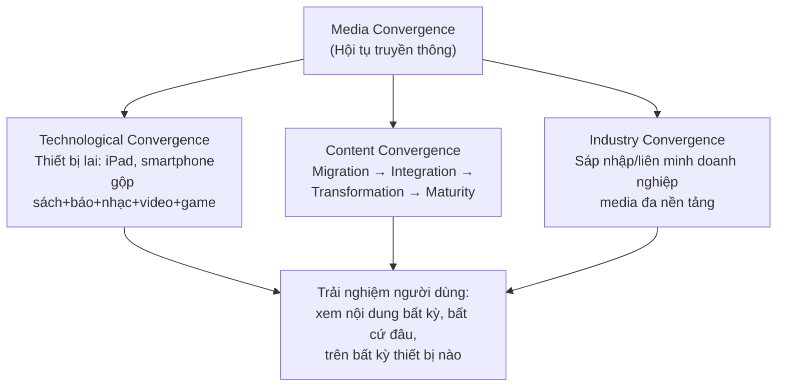
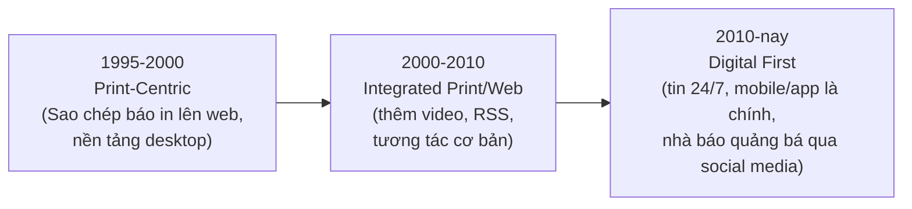
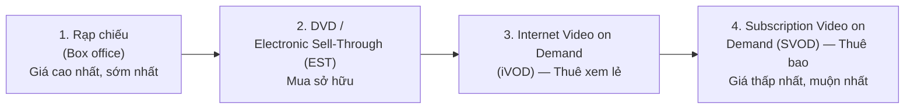
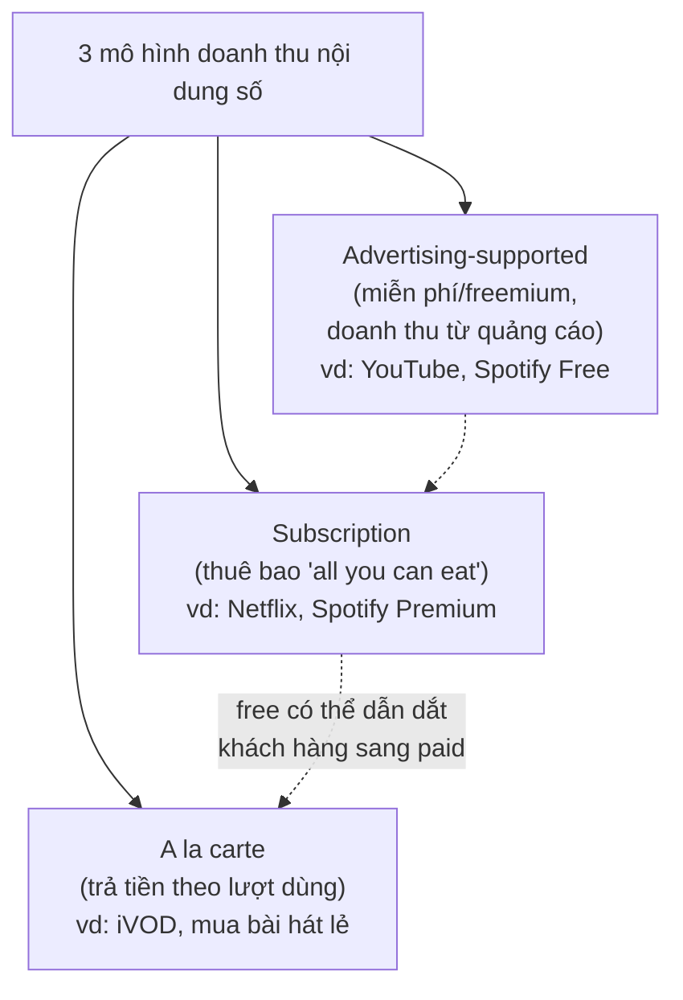

# Chương 10: Online Content and Media (Nội dung và Truyền thông trực tuyến)

> Nguồn: *E-Commerce: Business, Technology and Society*, Laudon & Traver, 18th edition (2024) — Chapter 10, trang sách 602–663 (trang PDF vật lý 636–697).

## 1. Tóm tắt & giải thích kiến thức

### Mở đầu: Streaming Wars — Ai sẽ thắng?
Ca mở chương mô tả "cuộc chiến streaming" (streaming wars): TV truyền thống (broadcast → cable/satellite → Internet) liên tục bị công nghệ mới làm gián đoạn (disrupt). Hộ gia đình Mỹ đang rời bỏ cable/satellite (gọi là **cord-cutters** — đã cắt hẳn, **cord-nevers** — chưa từng dùng cable, **cord-shavers** — cắt giảm gói cước) để chuyển sang các dịch vụ **OTT (over-the-top)** như Netflix, Amazon Prime Video, Hulu, Apple TV+, Disney+. "Content is king" (nội dung là vua) mang nghĩa mới: sở hữu nội dung chất lượng cao = cơ hội kiếm doanh thu từ subscriber trả phí + quảng cáo, nên Big Tech (Apple, Google, Amazon) đổ hàng trăm tỷ USD vào sản xuất/nắm giữ nội dung gốc (original content).

### 10.1 Online Content (Nội dung trực tuyến)

**Đối tượng khán giả (Content Audience):** Người Mỹ trưởng thành tiêu thụ hơn 4.800 giờ/năm cho các loại media (gần gấp 2,5 lần thời gian làm việc). Media số (digital media) chiếm ~62% tổng thời gian. Không còn rõ ranh giới giữa "xem TV" và "xem trên Internet" — chỉ khác phương thức truyền tải. Hiện tượng ban đầu lo ngại Internet sẽ **cannibalization** (Internet "ăn thịt" thời gian dành cho media khác) hóa ra không hoàn toàn đúng — TV, sách, nhạc đều tăng tiêu thụ song song với digital media; chỉ có media vật lý (CD, DVD) là suy giảm thực sự.

**Thị trường nội dung (Content Market):** Tổng doanh thu ngành entertainment & media Mỹ 2021 ~360 tỷ USD, trong đó Entertainment (TV/movie, nhạc/podcast, game) chiếm 78,5%, Print media (sách/báo/tạp chí) chiếm 21,5%.

**Digital Rights Management (DRM) & Walled Gardens:**
- **DRM**: kết hợp kỹ thuật (mã hóa) + pháp lý để ngăn sao chép/phân phối nội dung số trái phép, kiểm soát việc sử dụng nội dung sau khi bán/thuê. Apple từng dùng DRM cho iTunes nhưng bỏ vì phản ứng người dùng và vì Amazon mở cửa hàng nhạc không DRM.
- **Walled garden**: một dạng DRM khóa nội dung vào phần cứng/hệ điều hành/nền tảng streaming cụ thể (ví dụ: sách Kindle chỉ đọc được trên thiết bị/app Kindle). Streaming (nhạc, video) tự nó đã khó copy/redistribute hơn file tải về.

**Cấu trúc ngành media:** Trước 1990 gồm nhiều doanh nghiệp nhỏ tách biệt theo 3 "ống khói dọc" (vertical stovepipes): in ấn, phim/TV, âm nhạc. Sau đó hợp nhất thành các tập đoàn lớn. Telecom (Comcast, AT&T, Verizon) từng mua lại hãng nội dung (NBC Universal, Time Warner, AOL/Yahoo) nhưng phần lớn thất bại (AT&T phải tách WarnerMedia năm 2021); ngược lại Big Tech (Netflix, Amazon, Apple) thành công hơn nhờ hợp đồng license + tự sản xuất nội dung.

**Media Convergence (Hội tụ truyền thông)** — 3 chiều:
1. **Technological convergence**: thiết bị lai (hybrid devices) truyền tải nhiều loại media qua 1 thiết bị (ví dụ iPad, smartphone).
2. **Content convergence**: hội tụ trong thiết kế, sản xuất, phân phối nội dung — trải qua 4 giai đoạn: Media Migration → Media Integration → Media Transformation → Media Maturity (ví dụ sách giấy → PDF → e-book tương tác tích hợp web).
3. **Industry convergence**: sáp nhập doanh nghiệp media thành tổ hợp có thể cross-market nội dung trên nhiều nền tảng (qua M&A hoặc liên minh chiến lược).

### 10.2 The Online Publishing Industry (Ngành xuất bản trực tuyến)

**Báo online (Online Newspapers):** Doanh thu ngành báo Mỹ giảm mạnh từ ~60 tỷ USD (2000) còn ~20 tỷ USD (2021), chủ yếu do sụt giảm **print ad revenue** (từ 48 tỷ còn ~6 tỷ USD) — digital ad revenue (~20% tổng doanh thu) không đủ bù đắp. Nguyên nhân: (1) tăng trưởng Web/mobile hút quảng cáo, (2) nguồn tin số thay thế (Vox, BuzzFeed, HuffPost...), (3) khó tìm mô hình doanh thu phù hợp, (4) social media & search engine (Google) hướng người đọc tới bài viết riêng lẻ thay vì trang chủ báo.

3 giai đoạn mô hình kinh doanh báo online:
- **Print-Centric (1995–2000):** đăng bản sao báo in lên mạng, không thay đổi quy trình làm báo, nền tảng desktop.
- **Integrated Print/Web (2000–2010):** thêm video, tương tác (RSS, ô chữ...), vẫn nền tảng desktop.
- **Digital First (2010–nay):** tin tức là dòng chảy liên tục 24/7 (không dừng ở 5 giờ chiều), nhà báo phải tự quảng bá trên mạng xã hội, nền tảng chính là mobile/app, in ấn chỉ là sản phẩm phái sinh.

Mô hình thu phí báo online: **paywall** (chặn hoàn toàn, không trả phí không đọc được — vd Wall Street Journal), **metered subscription** (đọc miễn phí giới hạn số bài rồi mới thu phí — phổ biến nhất, 72% khảo sát dùng), hoặc freemium (nội dung thường free, nội dung premium thu phí).

**Tạp chí (Magazines):** Doanh số sạp báo giảm từ 2001 nhưng độc giả (đặc biệt giới trẻ) vẫn đọc qua digital/social. Giải pháp: **magazine aggregator** (web/app bán subscription nhiều tạp chí số — Apple News, Zinio, Magzter, Flipboard) và metered paywall (ví dụ The New Yorker, subscription hiện chiếm >70% doanh thu).

**Sách điện tử (E-books) & xuất bản online:** Khác hẳn báo/tạp chí — doanh thu ngành sách vẫn ổn định (~29 tỷ USD 2021, tăng >10%) dù e-book tăng trưởng nhanh những năm đầu (~20% tổng doanh thu). Nhà xuất bản truyền thống (5 "big" publisher) vẫn giữ vị thế. Kênh self-publishing (Amazon Kindle Direct...) mở ra cho tác giả độc lập, dù rất ít người thành công lớn.

2 mô hình kinh doanh e-book:
- **Wholesale model**: nhà bán lẻ (Amazon...) mua sỉ rồi tự định giá bán lẻ.
- **Agency model**: nhà xuất bản định giá, nhà bán lẻ chỉ là đại lý ăn hoa hồng (~30%) — mô hình này ra đời sau vụ Apple + 5 publisher bị Bộ Tư pháp Mỹ kiện vì **price fixing** (thông đồng giá, vi phạm luật chống độc quyền), Apple phải nộp phạt 450 triệu USD.

### 10.3 The Online Entertainment Industry (Ngành giải trí trực tuyến)

Ngành giải trí Mỹ (TV/movie, nhạc & podcast, game) tạo ra ~285 tỷ USD doanh thu 2021. TV/movie chiếm tỷ trọng lớn nhất (~56%), game ~21%, nhạc/radio ~10%.

**Home Entertainment: TV & Movies**
- Thiết bị streaming phổ biến: Apple TV, Google Chromecast, Amazon Fire TV, Roku.
- **OTT (over-the-top) services**: dịch vụ cung cấp TV/phim qua Internet thay vì cable/satellite — gồm 4 nhóm: mua/thuê tải về (Apple TV, Amazon), SVOD (Netflix, Hulu, Apple TV+), broadcast/cable SVOD (Paramount+, HBO Max, Disney+), live/on-demand OTT (Sling TV, YouTube TV).
- Doanh thu home entertainment số hóa gồm 3 hình thức: **EST — Electronic Sell-Through** (mua tải về sở hữu), **iVOD — Internet Video on Demand** (thuê xem lẻ), **SVOD — Subscription Video on Demand** (thuê bao xem không giới hạn) — SVOD chiếm ưu thế lớn nhất (~78% doanh thu digital).
- **Release window**: Hollywood dàn xếp thời điểm phát hành phim qua từng kênh (rạp chiếu → DVD → VOD cable → iVOD → SVOD) theo kiểu phân biệt giá (price discrimination) — ai muốn xem sớm phải trả giá cao hơn. Áp lực rút ngắn cửa sổ này đang tăng (vd Universal-AMC rút còn 17 ngày).
- Piracy (vi phạm bản quyền) vẫn tồn tại dù giảm nhờ dịch vụ hợp pháp tiện lợi, giá rẻ.

**Audio Entertainment: Nhạc & Podcast**
- Doanh thu nhạc thu âm (recorded music) đạt đỉnh 14 tỷ USD (1999) → giảm còn 6,7 tỷ (2015) do CD giảm + tải nhạc lậu (piracy — Napster) → phục hồi từ 2016 nhờ streaming, đạt 15 tỷ USD (2021), lần đầu vượt đỉnh cũ. 87% doanh thu nhạc hiện là digital, trong đó streaming chiếm áp đảo (~83%), download chỉ còn ~4%.
- 2 mô hình dịch vụ nhạc số: **digital download** (mua từng bài/album — Apple, Amazon, Google) và **streaming music** (Spotify, Apple Music, Pandora, Amazon Music) với 2 dòng doanh thu: **ad-supported (freemium)** và **subscription** (trả phí nghe không quảng cáo).
- Vấn đề trả tiền tác giả/nghệ sĩ: nghệ sĩ chỉ nhận ~0,32 cent/lượt stream so với 32 cent/lượt bán trên iTunes → dẫn đến **Music Modernization Act (MMA) 2018**: cho phép nhạc sĩ nhận royalty cho bài hát trước 1972, tạo quy trình nhận royalty chưa nhận, lập cơ sở dữ liệu cấp phép do các dịch vụ streaming tài trợ.
- **Podcast**: nội dung audio dạng "nói chuyện" (talk), tải về nghe theo giờ tự chọn — bùng nổ từ *Serial* (NPR, 2014); ~1/3 dân số Mỹ nghe podcast hàng tháng; doanh thu chủ yếu từ quảng cáo (~1,3 tỷ USD 2021, dự báo tăng gấp 3 vào 2026).

**Games (Trò chơi điện tử)** — ngành lớn nhất trong entertainment số (~60 tỷ USD 2021, từ 6 tỷ năm 2012), vượt cả TV/movie số. Các loại game thủ: PC gamers, social gamers, mobile gamers, MMO gamers, console gamers. Smartphone đã thúc đẩy tăng trưởng mạnh nhất (free-to-play, giá rẻ). **E-sports** (thi đấu game chuyên nghiệp) bùng nổ với khán giả toàn cầu >530 triệu (2022), giải Dota 2 International có tiền thưởng >40 triệu USD; nền tảng xem livestream lớn nhất là **Twitch** (thuộc Amazon).

### 10.4 Creators and User-Generated Content (Nhà sáng tạo & nội dung do người dùng tạo)

**UGC (user-generated content)** đã tồn tại từ đầu Web 2.0, nhưng điểm mới gần đây là quan niệm: **creator sở hữu nội dung mình tạo và có quyền kiếm tiền (monetize) trực tiếp** thay vì chỉ nền tảng hưởng lợi. Các cách creator kiếm tiền: quảng cáo (trực tiếp từ nhãn hàng hoặc chia sẻ doanh thu ads từ nền tảng), bán nội dung số (theo sản phẩm hoặc thuê bao), **NFT** (token không thể thay thế — dùng làm vật phẩm số độc nhất/collectible), tiền "tip" từ fan, thu phí khóa học/livestream/sự kiện online.

Nền tảng hỗ trợ creator: YouTube (chia 55% doanh thu ads video dài; YouTube Shorts Fund), Patreon (nền tảng membership, creator đã kiếm 3,5 tỷ USD tính đến cuối 2021), Substack (subscription cho newsletter — top 10 tác giả kiếm 20 triệu USD năm 2021), Roblox (trả >535 triệu USD cho creator năm 2021, 12 triệu creator tính đến 6/2022). Các mạng xã hội (Meta, TikTok, Snap, Pinterest, LinkedIn) cũng lập **Creator Fund** để giữ chân creator, dù khảo sát cho thấy phần lớn creator nhận được rất ít tiền từ các quỹ này.

### Case Study: Netflix — "How Does This Movie End?"
Netflix từ công ty cho thuê DVD qua bưu điện (1997) → subscription DVD (2000) → streaming VOD (2007) → nhà sản xuất nội dung gốc (House of Cards, Stranger Things, Squid Game...), trở thành SVOD lớn nhất (>220 triệu subscriber toàn cầu giữa 2022). Thách thức: (1) chi phí nội dung rất cao (17,5 tỷ USD/năm, cam kết 23 tỷ USD với nhà sản xuất), (2) rủi ro sản xuất nội dung gốc mới (không đảm bảo thành công dù dùng thuật toán dự đoán), (3) cạnh tranh khốc liệt từ Disney+, Apple TV+, Amazon, HBO — các đối thủ "hầu bao rất sâu". Năm 2022 Netflix lần đầu mất subscriber 2 quý liên tiếp, giá cổ phiếu giảm ~70% từ đỉnh, buộc phải chuyển hướng bổ sung gói có quảng cáo (hợp tác với Microsoft) — điều mà trước đây Netflix luôn từ chối.

---

## 2. Key Concepts

*(Các thuật ngữ then chốt xuất hiện xuyên suốt chương, tương ứng phần định nghĩa lề trang sách và tổng hợp "Key Concepts" cuối chương)*

| Thuật ngữ | Giải thích ngắn gọn |
|---|---|
| **Digital Rights Management (DRM)** | Kết hợp biện pháp kỹ thuật (mã hóa) và pháp lý để bảo vệ nội dung số khỏi bị sao chép/phân phối trái phép. |
| **Walled garden** | Một dạng DRM khóa nội dung vào phần cứng/hệ điều hành/nền tảng riêng (vd sách Kindle chỉ đọc trên hệ sinh thái Amazon). |
| **Technological convergence** | Sự phát triển của thiết bị lai (hybrid devices) có thể truyền tải nhiều loại media (sách, báo, TV, phim, nhạc, game) qua một thiết bị duy nhất. |
| **Content convergence** | Hội tụ trong khâu thiết kế, sản xuất và phân phối nội dung khi nội dung "di cư" dần từ media cũ sang media mới và được biến đổi phù hợp công nghệ mới. |
| **Industry convergence** | Sự sáp nhập các doanh nghiệp media thành tổ hợp mạnh, có thể cross-market nội dung trên nhiều nền tảng, qua M&A hoặc liên minh chiến lược. |
| **Metered subscription** | Mô hình cho đọc miễn phí một số lượng bài viết giới hạn, sau đó yêu cầu trả phí thuê bao. |
| **Paywall** | Không cho truy cập nội dung nếu không trả phí thuê bao (mô hình "cứng" — vd Wall Street Journal). |
| **Magazine aggregator** | Website/app cho phép người dùng thuê bao và mua nhiều tạp chí số khác nhau trong cùng một nơi (vd Apple News, Zinio, Flipboard). |
| **Wholesale model** | Mô hình e-book trong đó nhà bán lẻ mua sỉ từ nhà xuất bản rồi tự quyết định giá bán lẻ. |
| **Agency model** | Mô hình e-book trong đó nhà bán lẻ chỉ là đại lý (agent), giá do nhà xuất bản ấn định, đại lý nhận hoa hồng (thường 30%). |
| **Over-the-top (OTT) services** | Dịch vụ cung cấp TV show và phim qua Internet thay vì qua cable/satellite. |
| **Electronic Sell-Through (EST)** | Bán phim/nội dung để tải về và sở hữu vĩnh viễn (download to own). |
| **Internet Video on Demand (iVOD)** | Bán quyền truy cập một phim/nội dung cụ thể theo lượt (a la carte) qua cable hoặc Internet. |
| **Subscription Video on Demand (SVOD)** | Xem không giới hạn nội dung qua hình thức thuê bao streaming trên Internet. |
| **Release window** | Việc dàn xếp (staging) phát hành phim mới qua các kênh phân phối khác nhau với mức giá khác nhau (rạp → DVD → VOD → streaming) — một hình thức phân biệt giá. |
| **Cord-cutters / cord-nevers / cord-shavers** | Người bỏ hẳn cable TV / chưa bao giờ dùng cable / cắt giảm gói cable xuống mức tối thiểu. |
| **User-Generated Content (UGC) & Creator Economy** | Nội dung do chính người dùng/nhà sáng tạo (creator) tạo ra và có thể tự kiếm tiền (monetize) trực tiếp từ đó (quảng cáo, bán nội dung, tip, NFT, thuê bao...). |
| **E-sports** | Thi đấu game điện tử chuyên nghiệp, có giải thưởng, khán giả trực tiếp và trực tuyến quy mô lớn, tương tự thể thao truyền thống. |
| **Music Modernization Act (MMA)** | Luật Mỹ (2018) đảm bảo nhạc sĩ/nghệ sĩ nhận royalty công bằng hơn từ các dịch vụ streaming, kể cả với bài hát trước 1972. |

---

## 3. Questions

**1. What are the three dimensions in which the term "convergence" has been applied? What does each of these areas of convergence entail?**
Ba chiều: (1) **Technological convergence** — phát triển thiết bị lai (như iPad, smartphone) tích hợp nhiều loại media (sách, báo, TV, nhạc, game) trong một thiết bị. (2) **Content convergence** — hội tụ trong thiết kế, sản xuất và phân phối nội dung; nội dung "di cư" từ media cũ sang mới rồi dần được biến đổi để tận dụng khả năng công nghệ mới (qua 4 giai đoạn: migration → integration → transformation → maturity). (3) **Industry convergence** — các doanh nghiệp media sáp nhập thành tổ hợp mạnh có thể cross-market nội dung trên nhiều nền tảng, thông qua M&A hoặc liên minh chiến lược.

**2. What are the basic revenue models for online content, and what is their major challenge?**
Ba mô hình: **subscription** (thuê bao trọn gói), **a la carte** (trả tiền theo lượt sử dụng), và **advertising-supported** (miễn phí/freemium, doanh thu từ quảng cáo). Thách thức lớn nhất: thuyết phục người dùng trả tiền cho nội dung từng "miễn phí" trên Internet thời kỳ đầu; với mô hình quảng cáo là doanh thu ads số thường không đủ bù đắp mất mát từ ads truyền thống; với subscription là nguy cơ "subscription fatigue" (quá nhiều dịch vụ khiến người dùng ngần ngại — khảo sát cho thấy 55% thấy có quá nhiều lựa chọn streaming).

**3. What are the two primary e-book business models?**
**Wholesale model** (nhà bán lẻ mua sỉ và tự định giá bán) và **agency model** (nhà xuất bản ấn định giá, nhà bán lẻ chỉ là đại lý hưởng hoa hồng ~30%).

**4. What effect is the growth of tablet computing having on online entertainment and content?**
Tablet (như iPad) tạo ra môi trường giải trí di động phong phú, thúc đẩy tiêu thụ e-book, tạp chí số, video, game trên di động; là ví dụ điển hình của technological convergence, giúp gia tăng thời gian dùng digital media và củng cố các mô hình doanh thu số (subscription/streaming).

**5. What techniques do music subscription services use to enforce DRM?**
Chủ yếu dựa vào bản chất kỹ thuật của streaming: nhạc không được lưu trên thiết bị người dùng mà truyền trực tiếp từ máy chủ đám mây, khiến việc sao chép/redistribute khó khăn; yêu cầu tài khoản/thuê bao xác thực để truy cập; hạn chế tải về offline chỉ trong ứng dụng có kiểm soát.

**6. What type of convergence does the Apple iPad represent?**
**Technological convergence** — một thiết bị lai tích hợp chức năng đọc sách, xem báo/tạp chí, xem video, nghe nhạc, chơi game trong một thiết bị duy nhất.

**7. What are the three different business models that newspapers have used to try to adapt to the Internet?**
**Print-Centric (1995–2000)**: chỉ đăng bản sao báo in lên web. **Integrated Print/Web (2000–2010)**: bổ sung đa phương tiện (video, tương tác) nhưng vẫn nền tảng desktop. **Digital First (2010–nay)**: tin tức là dòng chảy liên tục 24/7, ưu tiên bản digital, nền tảng chính là mobile/app, bản in chỉ là sản phẩm phái sinh.

**8. What are the different revenue models that newspapers have used?**
Miễn phí có quảng cáo (đăng ký tài khoản), **metered subscription** (đọc giới hạn số bài rồi thu phí), freemium (nội dung thường free, nội dung cao cấp thu phí), và **hard paywall** (không trả phí không đọc được — WSJ).

**9. What advantages do purely digital news sites have over print newspapers? What advantages do traditional newspapers have over such sites?**
Digital-only: không tốn chi phí in ấn, quy trình làm việc hiệu quả/kịp thời hơn, chi phí thấp hơn (dựa nhiều vào UGC, trả lương thấp, ít chi phí hưu trí), tận dụng công nghệ mới nhanh hơn. Báo truyền thống: uy tín và độ tin cậy cao hơn hẳn (là nguồn tin được tin tưởng nhất theo khảo sát), chất lượng báo chí điều tra chuyên nghiệp, thương hiệu lâu đời, độc giả trung thành, hiệu quả quảng cáo địa phương cao hơn nhiều so với ads số.

**10. How has the book publishing industry's experience with the Internet differed from the newspaper and magazine industries' experience?**
Khác với báo/tạp chí bị Internet "phá hủy" doanh thu quảng cáo, ngành sách vẫn duy trì doanh thu ổn định (thậm chí tăng) dù e-book tăng trưởng nhanh; các nhà xuất bản lớn vẫn giữ vị thế thống trị; số lượng hiệu sách độc lập thực tế còn tăng lên từ 2009; kênh self-publishing mở ra cơ hội mới cho tác giả nhưng không thay thế được vai trò nhà xuất bản truyền thống.

**11. How has the Internet changed the packaging, distribution, marketing, and sale of traditional music tracks?**
Album (đóng gói bài hát) bị "unbundle" thành từng bài lẻ có thể mua/tải riêng; phân phối chuyển từ đĩa vật lý sang tải số (iTunes) rồi sang streaming từ đám mây (không cần sở hữu file); marketing dựa vào thuật toán gợi ý (Pandora, Spotify) và mạng xã hội thay vì kênh phát thanh/bán lẻ truyền thống; doanh thu chuyển dịch từ bán vật lý → tải số → streaming (subscription + quảng cáo); MMA (2018) ra đời để đảm bảo trả royalty công bằng hơn cho nhạc sĩ trong kỷ nguyên streaming.

**12. How has streaming technology impacted the television industry?**
Cho phép các dịch vụ OTT (Netflix, Hulu, Disney+...) cạnh tranh trực tiếp với cable/satellite; thúc đẩy xu hướng cord-cutting, xem theo yêu cầu (a la carte) thay vì gói kênh cố định, và binge-watching thay vì xem tuyến tính; tạo đòn bẩy thương lượng cho nhà sản xuất nội dung (có thể license trực tiếp cho streamer thay vì phụ thuộc cable); đồng thời khiến người xem đối mặt với "quá tải" lựa chọn thuê bao.

**13. Why is the growth of cloud storage services important to the growth of mobile content delivery?**
Vì nội dung không còn gắn với việc sở hữu file vật lý trên thiết bị — người dùng có thể truy cập nội dung từ bất kỳ thiết bị nào, bất cứ đâu, bất cứ lúc nào nhờ máy chủ đám mây; điều này hỗ trợ mô hình streaming, giảm nhu cầu lưu trữ cục bộ trên thiết bị di động (vốn có dung lượng hạn chế), và cho phép mở rộng quy mô phục vụ hàng triệu thiết bị di động cùng lúc.

**14. Has the average consumer become more receptive to advertising-supported Internet content? What developments support this?**
Có. Bằng chứng: các dịch vụ freemium thành công (Spotify, Pandora free tier); ngay cả Netflix và Disney+ — vốn từng từ chối quảng cáo — cũng đã bổ sung gói có ads năm 2022; quảng cáo báo địa phương vẫn có tỷ lệ chuyển đổi mua hàng cao (35% khảo sát); mô hình YouTube (chia sẻ doanh thu ads với creator) hoạt động hiệu quả và phổ biến rộng rãi.

**15. What factors are needed to support successfully charging the consumer for online content?**
Nội dung phải chất lượng cao, độc đáo/khác biệt (unique, exclusive); trải nghiệm thuận tiện qua thiết bị/app tốt (smartphone, tablet, e-reader); thương hiệu đáng tin cậy; mức giá hợp lý so với giá trị cảm nhận; biện pháp DRM/kỹ thuật đủ để bảo vệ nội dung khỏi vi phạm bản quyền tràn lan; văn hóa tiêu dùng đã dần chấp nhận trả tiền cho nội dung số (thay đổi so với thời kỳ đầu Internet).

**16. Why are apps helping the newspaper and magazine industries even though websites failed to help them?**
Vì app tạo ra nền tảng phân phối nội dung độc quyền (proprietary) giống walled garden, cho phép thu phí dễ hơn (kiểm soát truy cập, paywall/subscription chặt chẽ hơn so với website mở); app tối ưu trải nghiệm đọc trên di động, hỗ trợ push notification giữ chân người đọc; đồng thời giảm phụ thuộc vào lưu lượng truy cập "side-door" từ search engine/social media (vốn ít gắn kết và ít giá trị quảng cáo).

**17. What alternatives do magazine publishers have for online distribution channels?**
Phát hành ấn bản số qua website/app riêng có paywall; hợp tác với **magazine aggregator** (Apple News, Zinio, Magzter, Flipboard) để tiếp cận độc giả qua một app duy nhất; xây dựng hiện diện mạnh trên mạng xã hội (Instagram, Facebook) để thu hút subscriber; áp dụng metered paywall cho digital edition.

**18. Why did the Justice Department sue major publishing firms and Apple?**
Vì hành vi **price fixing** (thông đồng ấn định giá) — 5 nhà xuất bản lớn cùng Apple áp dụng agency model để đẩy giá e-book lên (~14,99 USD trở lên) nhằm chống lại việc Amazon bán phá giá, hành vi này vi phạm luật chống độc quyền. Vụ kiện kết thúc với việc Apple phải nộp phạt 450 triệu USD.

**19. How will the Music Modernization Act impact the streaming music industry?**
MMA (2018) giúp: nhạc sĩ/nghệ sĩ được nhận royalty cho các bài hát thu âm trước 1972 (trước đây không được bảo vệ); tạo quy trình pháp lý để nhận các khoản royalty chưa được nhận (trước đây các dịch vụ streaming giữ lại); thiết lập cơ sở dữ liệu cấp phép do các dịch vụ streaming tài trợ nhưng do nhà xuất bản nhạc/nhạc sĩ giám sát, giúp việc trả tiền cho nhạc sĩ minh bạch và nhanh hơn — nhìn chung sẽ làm tăng chi phí cho các dịch vụ streaming nhưng đảm bảo công bằng hơn cho người sáng tạo.

**20. How are mobile devices transforming the gaming industry?**
Smartphone/tablet cho phép chơi game mọi lúc mọi nơi mà không cần console/PC cồng kềnh; thúc đẩy mô hình game **free-to-play** và giá rẻ (0,99–2,99 USD) với chi phí phát triển thấp hơn nhiều so với game console; tạo ra nhóm "mobile gamers"/"casual gamers" đông đảo mới; đưa Apple App Store và Google Play trở thành nhà phân phối game lớn nhất (hưởng 30% doanh thu); cho phép các thể loại game mới như AR-based (Pokémon GO); là phân khúc tăng trưởng nhanh nhất của ngành game, đồng thời góp phần thúc đẩy e-sports và metaverse.

---

## 4. Projects

**1. Research the issue of media convergence in the newspaper industry. Do you believe that convergence will be good for the practice of journalism? Develop a reasoned argument on either side of the issue and write a three- to five-page report on the topic. Include in your discussion the barriers to convergence and whether these barriers should be eased.**

*Hướng dẫn thực hiện:*
- Đọc lại kỹ phần "Media Convergence" (10.1) và "Online Newspapers" (10.2) trong sách để nắm 3 chiều convergence (technological, content, industry) và các mô hình báo online (Print-Centric, Integrated Print/Web, Digital First).
- Tìm thêm 2–3 nguồn thời sự (2023–2026) về việc các tòa soạn tích hợp video, podcast, AI, mạng xã hội vào quy trình làm báo — dùng công cụ tìm kiếm/Google Scholar hoặc báo cáo ngành (Pew Research Center, Reuters Institute Digital News Report).
- Xây dựng lập luận 2 chiều: (a) ủng hộ convergence — tăng khả năng tiếp cận độc giả, đa dạng hóa nội dung, tăng doanh thu; (b) phản đối — áp lực tốc độ có thể làm giảm chất lượng kiểm chứng thông tin, xói mòn văn hóa "chuyên nghiệp" của nhà báo, chi phí đầu tư công nghệ cao.
- Nêu rõ các rào cản hội tụ: chi phí công nghệ, văn hóa tổ chức bảo thủ, thiếu kỹ năng đa phương tiện của nhân sự, áp lực doanh thu ngắn hạn.
- Trình bày: báo cáo dạng văn bản 3–5 trang, có mở bài nêu vấn đề, thân bài phân tích 2 chiều lập luận + dẫn chứng, kết luận nêu quan điểm cá nhân có lý lẽ.
- Lưu ý: không cần chọn phe "đúng" tuyệt đối — mục tiêu là thể hiện khả năng phân tích đa chiều có dẫn chứng từ sách và nguồn ngoài.

**2. Go to Amazon and explore the different digital media products that are available. For each kind of digital media product, describe how Amazon's presence has altered the industry that creates, produces, and distributes this content. Prepare a presentation to convey your findings to the class.**

*Hướng dẫn thực hiện:*
- Truy cập amazon.com, liệt kê các loại sản phẩm digital media Amazon cung cấp: Kindle e-books, Amazon Music (nhạc), Amazon Prime Video (phim/TV), Audible (sách nói), Twitch (game streaming — Amazon sở hữu), Amazon Appstore (game/app).
- Với mỗi loại, đối chiếu nội dung sách (phần E-books, Home Entertainment, Music, Games) để mô tả Amazon đã thay đổi ngành đó ra sao: ví dụ Kindle tạo ra agency/wholesale model tranh chấp với publisher; Amazon Prime Video cạnh tranh trực tiếp với Netflix trong SVOD; Twitch thống trị livestream game (75% thị phần).
- Có thể bổ sung số liệu cập nhật (thị phần, doanh thu) qua tìm kiếm nếu cần, nhưng phần cốt lõi dựa trên nội dung chương 10.
- Trình bày: slide thuyết trình (PowerPoint/Google Slides), mỗi loại sản phẩm 1 slide gồm: mô tả sản phẩm, số liệu thị phần, tác động ngành (trước/sau Amazon), 1 hình minh họa hoặc biểu đồ nếu có.
- Lưu ý: nên có slide tổng kết so sánh chung — Amazon dùng chiến lược "ecosystem" (phần cứng + nội dung + dịch vụ) để khóa khách hàng như thế nào.

**3. Identify three online sources of content that exemplify one of the three digital content revenue models (subscription, a la carte, and advertising-supported) discussed in the chapter. Describe how each site works and how it generates revenue. Describe how each site provides value to the consumer. Which type of revenue model do you prefer, and why?**

*Hướng dẫn thực hiện:*
- Chọn 3 dịch vụ, mỗi dịch vụ đại diện 1 mô hình khác nhau, ví dụ: Netflix (subscription), Apple TV app "buy/rent" hoặc Google Play Movies (a la carte), YouTube phiên bản miễn phí (advertising-supported).
- Với mỗi dịch vụ, mô tả: cách hoạt động (đăng ký, thanh toán, nội dung cung cấp), cách tạo doanh thu (thuê bao định kỳ / trả theo lượt / doanh thu quảng cáo), và giá trị mang lại cho người dùng (tiện lợi, chi phí, đa dạng nội dung, không quảng cáo...).
- So sánh ưu/nhược điểm 3 mô hình rồi nêu quan điểm cá nhân kèm lý do (ví dụ ưu tiên subscription vì chi phí dự đoán được, hoặc a la carte vì chỉ trả cho nội dung thực sự xem).
- Trình bày: báo cáo ngắn dạng văn bản, có thể thêm bảng so sánh 3 dịch vụ theo các tiêu chí: giá, mô hình doanh thu, giá trị mang lại, đối tượng phù hợp.
- Lưu ý: cần trải nghiệm thực tế hoặc tra cứu thông tin chính thức từ trang chủ dịch vụ để có thông tin chính xác về giá/tính năng hiện tại.

**4. Identify a popular online magazine that also has an offline subscription or newsstand edition. What advantages (and disadvantages) does the online edition have when compared to the offline, physical edition? Has technology platform, content design, or industry structure convergence occurred in the online magazine industry? Prepare a short report discussing this issue.**

*Hướng dẫn thực hiện:*
- Chọn một tạp chí có cả bản in và bản online (ví dụ: The New Yorker — được nhắc trực tiếp trong sách, hoặc Time, National Geographic, Vogue).
- So sánh bản online và bản in: ưu điểm bản online (cập nhật liên tục, đa phương tiện — video/audio, tương tác, chi phí phân phối thấp hơn, dễ chia sẻ qua social media); nhược điểm (chất lượng hình ảnh/trải nghiệm đọc có thể kém hơn ấn phẩm cao cấp, dễ bị xao nhãng bởi quảng cáo số, cạnh tranh gay gắt hơn từ nội dung miễn phí).
- Đối chiếu với 3 chiều convergence trong sách: có xảy ra technological convergence không (đọc trên tablet/điện thoại)? Content convergence (thêm video, audio vào bài viết)? Industry convergence (tạp chí có bị mua lại/hợp tác với công ty công nghệ không)?
- Trình bày: báo cáo ngắn (1–2 trang), có phần giới thiệu tạp chí, phần so sánh, phần phân tích convergence, kết luận.
- Lưu ý: nên tham khảo thêm trang "About/Press" của tạp chí để có số liệu subscriber/doanh thu chính xác.

**5. In 2014, as discussed in the Insight on Technology case, Amazon purchased Twitch, which lets users stream their video game sessions, for almost $1 billion. Why would Amazon spend so much money on Twitch? Create a short presentation either defending the purchase or explaining why you think it was a bad idea.**

*Hướng dẫn thực hiện:*
- Đọc lại box "Insight on Technology: Game On: Twitch" trong sách để nắm bối cảnh: Twitch dẫn đầu thị phần livestream game (~75% thị phần thiết bị di động, 94% giờ xem năm 2022), nguồn thu chính từ quảng cáo, được Amazon dùng để tăng engagement cho hệ sinh thái Amazon Prime, đồng thời đối mặt vấn đề nội dung độc hại/harassment.
- Xây dựng lập luận theo 1 trong 2 hướng:
  - *Ủng hộ thương vụ*: Twitch giúp Amazon thâm nhập cộng đồng game thủ trẻ (đối tượng khó tiếp cận bằng quảng cáo truyền thống), tạo thêm dữ liệu người dùng, có thể tích hợp bán chéo (cross-sell) dịch vụ AWS (hạ tầng streaming) và Amazon Prime, đồng thời chặn đối thủ (Google, Microsoft) sở hữu nền tảng này.
  - *Phản đối thương vụ*: giá mua quá cao so với khả năng sinh lời trực tiếp (Twitch chủ yếu dựa vào quảng cáo, biên lợi nhuận thấp), rủi ro pháp lý/danh tiếng liên quan đến nội dung bạo lực/harassment trên nền tảng, cạnh tranh gay gắt từ YouTube Gaming/TikTok có thể xói mòn giá trị đầu tư.
- Trình bày: slide thuyết trình ngắn (5–8 slide) gồm: bối cảnh thương vụ, luận điểm chính, dẫn chứng số liệu từ sách, kết luận.
- Lưu ý: nên cập nhật thêm tình hình Twitch gần đây (nếu có nguồn) để đánh giá liệu quyết định năm 2014 có "đúng" khi nhìn lại theo thời gian.
