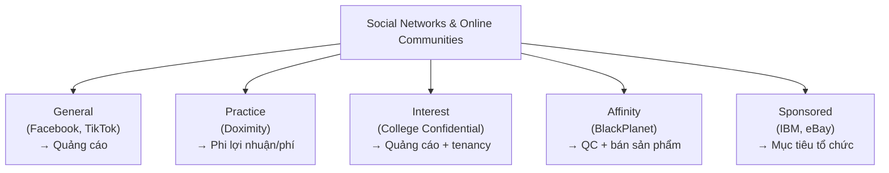
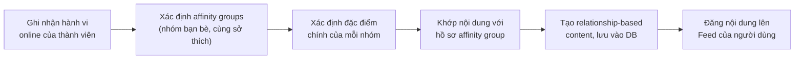
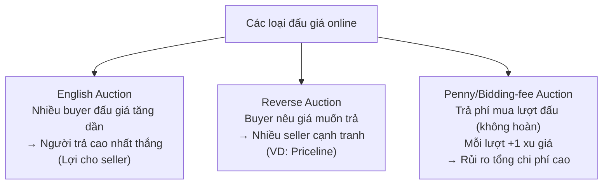
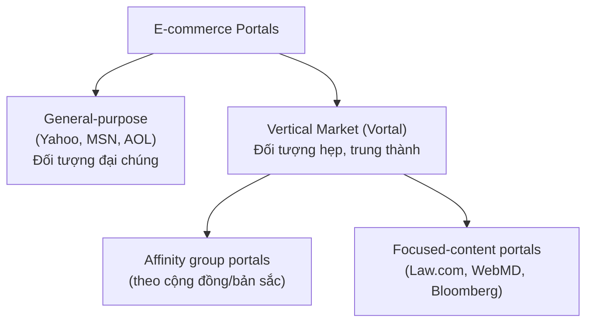

# Chương 11 — Social Networks, Auctions, and Portals

> Nguồn: *E-Commerce: Business, Technology and Society* (Laudon & Traver, 18th edition, 2024), Chương 11, trang sách in 664–705 (trang PDF 698–739).

---

## 1. Tóm tắt & giải thích kiến thức

### Mở đầu chương

Social network (mạng xã hội), auction (đấu giá) và portal (cổng thông tin) có điểm chung: cả ba đều dựa trên cảm giác chia sẻ lợi ích và tự nhận diện bản thân (self-identification) — nói ngắn gọn là **cảm giác cộng đồng (sense of community)**. eBay khởi đầu là một cộng đồng người thích trao đổi đồ cũ; portal cũng chứa yếu tố cộng đồng qua e-mail, chat, diễn đàn.

Case mở đầu: **LinkedIn** — mạng xã hội "khác biệt" vì hướng tới đối tượng doanh nghiệp/nghề nghiệp, người dùng dùng danh tính thật, ít drama hơn Facebook/Twitter/TikTok, mô hình doanh thu chủ yếu từ premium subscription (không chỉ quảng cáo) nên lợi ích của LinkedIn gắn liền lợi ích người dùng.

### 11.1 Social Networks and Online Communities (Mạng xã hội & Cộng đồng trực tuyến)

**Định nghĩa social network**: một nhóm người (1) có tương tác xã hội chung, (2) có mối liên kết chung, (3) cùng chia sẻ một "không gian" trong một khoảng thời gian nào đó (Hillery, 1955). **Online social network** là social network diễn ra trên môi trường trực tuyến — không cần gặp mặt trực tiếp, không giới hạn địa lý/thời gian.

**Lịch sử phát triển**: Internet ban đầu (thập niên 1980) là công cụ giao tiếp cho nhà khoa học → hình thành "virtual communities" đầu tiên (ví dụ *The Well*, 1985) → cuối 1990s công nhận giá trị thương mại → 2002 trở đi: blog, chia sẻ ảnh dễ dàng hơn → từ 2007: smartphone/mobile bùng nổ → mạng xã hội trở thành hiện tượng vừa công nghệ vừa xã hội học, chiếm ~14.5% thời gian dùng digital media, hơn 3.5 tỷ người dùng toàn cầu (2022).

**Top mạng xã hội (Mỹ, 2022)**: Facebook (180 triệu US / 2.9 tỷ toàn cầu) > Instagram (130tr/1.3 tỷ) > TikTok (95tr/750tr) > Snapchat (88tr/465tr) > Pinterest (85tr/430tr) > LinkedIn (68tr/830tr) > Twitter (57tr/345tr). Facebook thống trị về số người dùng nhưng đã chững lại; TikTok/Twitter dẫn đầu về **thời gian sử dụng (engagement)**.

**5 loại mạng xã hội/cộng đồng trực tuyến (Table 11.3)** và mô hình kinh doanh:

| Loại | Mô tả | Ví dụ | Mô hình doanh thu |
|---|---|---|---|
| **General** (đại chúng) | Nơi gặp gỡ, giao lưu tổng quát, chia sẻ nội dung | Facebook, Instagram, TikTok | Quảng cáo |
| **Practice** (nghề nghiệp/chuyên môn) | Thảo luận chuyên sâu một lĩnh vực hành nghề | Just Plain Folks (nhạc sĩ), Doximity (bác sĩ) | Phi lợi nhuận, phí thành viên/quyên góp/quảng cáo hạn chế |
| **Interest** (sở thích chung) | Nhóm quan tâm 1 chủ đề cụ thể (game, thể thao, tài chính...) | Debate Politics, College Confidential | Quảng cáo, tenancy/sponsorship |
| **Affinity** (bản sắc/nhận diện nhóm) | Thành viên tự nhận diện theo chủng tộc, giới, tôn giáo... | Peanut, Built by Girls, BlackPlanet | Quảng cáo + doanh thu bán sản phẩm |
| **Sponsored** (được tài trợ) | Do chính phủ/tổ chức phi lợi nhuận/doanh nghiệp lập ra vì mục tiêu tổ chức | Nike, IBM, Cisco, eBay | Đa dạng (mở rộng thương hiệu, quảng cáo) |

**Công nghệ & tính năng cốt lõi**: *Algorithms* (thuật toán) — chuỗi bước xử lý để tạo nội dung cá nhân hóa. Facebook dùng thuật toán "Feed" để chọn nội dung hiển thị dựa trên **affinity groups** (nhóm người có cùng quan điểm/sở thích): ghi nhận hành vi → xác định affinity groups → xác định đặc điểm nhóm → khớp nội dung với hồ sơ nhóm → tạo "relationship-based content" → hiển thị lên trang cá nhân.

Insight on Technology "*Are Facebook's Algorithms Dangerous?*": thuật toán Feed liên tục thay đổi (2009: xếp theo Like nhiều nhất → 2014-2015: hạ clickbait, ưu tiên video → sau đó ưu tiên reaction "love/angry" → 2018: ưu tiên bài từ bạn bè/gia đình). Hệ quả: tạo **echo chamber/filter bubble** (người dùng chỉ thấy quan điểm giống mình), lan truyền tin giả nhanh hơn tin thật, gây phân cực xã hội. Vụ Frances Haugen (2021) tiết lộ tài liệu nội bộ Facebook cho thấy công ty biết rõ tác hại nhưng khó kiểm soát (thuật toán dùng >10,000 tín hiệu để dự đoán khả năng tương tác).

Insight on Society "*Businesses Beware: The Dark Side of Social Networks*": rủi ro khi doanh nghiệp dùng social network — chiến dịch phản tác dụng (Draper James tặng váy giáo viên), tweet gây tranh cãi (Burger King, ESPN), **brand safety** (nội dung xấu xuất hiện cạnh quảng cáo thương hiệu), rủi ro từ influencer marketing, xử lý phản hồi tiêu cực sai cách (FTC phạt Fashion Nova $4.2 triệu vì chặn review xấu), và vấn đề quyền riêng tư nhân viên trên mạng xã hội.

**Bảng tính năng mạng xã hội (Table 11.4)**: Profiles, Feed, Timeline, Stories, Friends, Network discovery, Favorites (Like), Games/apps, Instant messaging, Storage, Message boards, Groups.

### 11.2 Online Auctions (Đấu giá trực tuyến)

**C2C auctions** (consumer-to-consumer): công ty đấu giá chỉ đóng vai trò trung gian tạo thị trường (market maker) để người mua/bán gặp nhau — ví dụ điển hình: **eBay** (~142 triệu người mua hoạt động, 17 triệu người bán, 1.6 tỷ tin đăng/ngày, 2022). Dù vậy hiện ~90% tin đăng trên eBay là giá cố định (fixed/best-offer), không phải đấu giá.

**Lợi ích của đấu giá**: liquidity (thanh khoản — người mua/bán dễ tìm thấy nhau toàn cầu), price discovery (khám phá giá cho hàng khó định giá), price transparency (minh bạch giá), market efficiency (tăng phúc lợi người tiêu dùng), lower transaction costs, consumer aggregation (tập hợp lượng lớn người mua), network effects (càng nhiều người tham gia càng có giá trị).

**Chi phí/rủi ro của đấu giá**: delayed consumption costs (chờ đấu giá + vận chuyển), monitoring costs (thời gian theo dõi), equipment costs (máy tính, mạng), trust risks (rủi ro gian lận), fulfillment costs (đóng gói/ship do người mua/bán chịu, khác với bán lẻ truyền thống).

**3 loại đấu giá chính trên Internet:**

1. **English auction**: phổ biến nhất (kiểu eBay) — 1 người bán, nhiều người mua đấu giá tăng dần trong thời hạn nhất định, có reserve price (giá sàn bí mật), ai trả cao nhất thắng (nếu vượt reserve price). Có lợi cho **người bán** (seller-biased) vì nhiều người mua cạnh tranh nhau.
2. **Reverse auction**: người mua nêu giá muốn trả, nhiều người bán cạnh tranh giành được giao dịch (ví dụ: Priceline "Name Your Own Price" cho vé máy bay/khách sạn — đã ngừng năm 2020). Giá không giảm dần, là cam kết mua ở mức đã nêu. Hiện chủ yếu dùng trong B2B (mua sắm/procurement).
3. **Penny (bidding fee) auction**: người tham gia phải trả phí không hoàn lại để mua lượt đấu giá trước (thường 50 cent–1 đô/lượt); giá sản phẩm bắt đầu gần $0, mỗi lượt đấu tăng giá 1 xu; ai đấu cuối cùng khi hết giờ thắng. Chi phí thật = giá thắng + tổng phí đấu giá đã trả (kể cả các lượt thua) → tổng chi phí thực tế thường cao hơn nhiều so với giá hiển thị. Ví dụ: QuiBids, DealDash.

**Khi nào nên dùng đấu giá (Table 11.6)**: loại sản phẩm (hiếm/độc nhất vs. hàng hóa thông thường), giai đoạn vòng đời sản phẩm, quản lý kênh phân phối, loại đấu giá (thiên về seller hay buyer), giá khởi điểm (nên thấp để thu hút), mức tăng giá mỗi lượt (nên thấp), thời lượng đấu giá (dài hơn → giá cao hơn, thường 7 ngày trên eBay), số lượng sản phẩm (tránh gộp lô lớn), quy tắc phân bổ giá (đa số ưa uniform pricing — mọi người trả cùng giá), đấu giá kín và mở (closed bidding giúp phân biệt giá không gây khó chịu; open bidding tạo "herd effect"/"winning effect" đẩy giá cao hơn).

**Giá đấu giá có thực sự thấp nhất?** Không hẳn — người mua bị ảnh hưởng bởi yếu tố tâm lý: **herd behavior** (xu hướng đấu giá theo đám đông vào tin đăng đã có sẵn lượt đấu), dẫn tới hiện tượng: **winner's regret** (người thắng cảm thấy đã trả quá nhiều), **seller's lament** (người bán tiếc vì không biết người thắng sẵn sàng trả bao nhiêu), **loser's lament** (người thua tiếc vì đã đấu giá quá keo kiệt).

**Gian lận & lạm dụng trong đấu giá**: bid rigging (thông đồng ngoài luồng hoặc dùng shill đẩy giá), price matching (thoả thuận giá sàn ngầm), shill feedback (phòng thủ/tấn công — dùng ID phụ tăng/giảm điểm uy tín), feedback extortion (đe doạ feedback xấu để đòi lợi ích), transaction interference (email cảnh báo người mua tránh xa seller khác), bid manipulation (đặt giá cao để dò giá tối đa đối thủ rồi rút), non-payment after winning (thắng nhưng không trả để chặn người mua thật), shill bidding (dùng ID phụ tự đẩy giá sản phẩm của mình), transaction non-performance (nhận tiền không giao hàng), non-selling seller (từ chối giao dịch sau khi đấu giá thành công), bid siphoning (email người đấu giá của seller khác chào giá thấp hơn).

**Giải pháp giảm rủi ro**: rating system (đánh giá người bán), watch lists (theo dõi phiên đấu giá), proxy bidding (đặt giá tối đa, hệ thống tự động đấu tăng dần thay bạn).

### 11.3 E-commerce Portals (Cổng thông tin)

Portal (từ tiếng Latin *porta* = cổng/lối vào) là các trang được truy cập nhiều nhất vì thường là trang chủ mặc định của trình duyệt. Ban đầu portal chỉ là công cụ tìm kiếm (search engine) đơn giản, sau đó phát triển thành 4 chức năng cốt lõi: **navigation/search** (tìm kiếm), **content** (tin tức, thời tiết, tài chính...), **commerce** (bán hàng, quảng cáo), **communication** (email, chat, tin nhắn).

**2 loại portal chính:**

- **General-purpose portals** (Yahoo, MSN, AOL): thu hút đối tượng đại chúng rộng, cung cấp nhiều kênh nội dung chuyên sâu (vertical content channels) như tin tức, tài chính, ô tô, thời tiết + search engine, email miễn phí, chat.
- **Vertical market portals** (vortals): thu hút đối tượng hẹp nhưng trung thành, chia làm 2 nhánh: **affinity group portals** (theo cộng đồng/bản sắc) và **focused-content portals** (theo chủ đề chuyên sâu như luật, y tế, tài chính — ví dụ Law.com, WebMD.com, Bloomberg.com).

**Mô hình doanh thu portal (Table 11.7)**: general advertising (tính theo impression), tenancy deals (phí cố định cho vị trí độc quyền), commissions on sales (hoa hồng bán hàng), subscription fees (phí nội dung premium), applications and games (bán app/game + quảng cáo trong app).

Insight on Business "*Yahoo and AOL Get Yet Another New Owner*": minh hoạ sự suy tàn của mô hình portal — AOL & Yahoo từng trị giá hàng trăm tỷ đô (2000) nhưng bị Google (search) và Facebook (social network) vượt mặt. Verizon mua AOL (2015, $4.4 tỷ) rồi Yahoo (2017, $4.5 tỷ), gộp thành "Oath" nhưng thất bại, phải viết giảm giá trị (write-down) hàng tỷ đô, cuối cùng bán cho quỹ đầu tư tư nhân Apollo Global Management (2021, $5 tỷ), đổi tên lại thành "Yahoo". Bài học: network effect và sự dịch chuyển hành vi người dùng sang social network đã làm suy yếu mô hình portal truyền thống.

### 11.4 Careers in E-commerce

Trong 3 mô hình (social network, auction, portal), **social network/social marketing** hiện có nhiều cơ hội nghề nghiệp nhất. Ví dụ vị trí "Social Marketing Specialist" tại 1 công ty bán lẻ hàng thủ công độc đáo — công việc: thử nghiệm chiến dịch trên Facebook/Instagram/TikTok/Pinterest, báo cáo kết quả, phối hợp phòng ban, phân tích đối thủ. Yêu cầu: bằng marketing/MIS/e-commerce, kinh nghiệm dùng social network và Ads Manager, kỹ năng Excel, viết lách tốt.

### 11.5 Case Study: eBay — Refocusing on Its Roots and Embracing Recommerce

eBay khởi đầu là "AuctionWeb" (1995), IPO 1998 nhờ trào lưu Beanie Babies. Khi mô hình đấu giá thuần tuý chững lại (người mua thích tiện lợi của giá cố định như Amazon), CEO John Donahoe chuyển eBay sang mô hình bán giá cố định ("Buy It Now"), điều chỉnh thuật toán tìm kiếm ưu tiên người bán uy tín thay vì phiên đấu giá sắp kết thúc. Đến 2022, đấu giá chỉ còn ~10% trong 1.6 tỷ tin đăng/ngày.

eBay từng mua rồi bán lại nhiều mảng: PayPal (mua 2002 $1.5 tỷ, tách ra 2015), Skype (2005, $3 tỷ), StubHub (2007, $310 triệu), GSI Commerce + Magento (2011, $2.4 tỷ) — tất cả đã thoái vốn để **quay về cốt lõi**: marketplace cho sản phẩm độc đáo/sưu tầm (thẻ bài, đồng hồ, giày sneaker), dưới thời CEO Jamie Iannone (từ 2020).

eBay đẩy mạnh **recommerce** (mua bán hàng đã qua sử dụng) và **circular economy** (kinh tế tuần hoàn) — phù hợp xu hướng Gen Z/Millennials (80% đã mua đồ cũ trong năm qua, vì lý do tài chính lẫn môi trường). Các sáng kiến: eBay Refurbished (2020), Imperfects (2022 — hàng lỗi nhẹ), eBay Vault (dự kiến — sàn giao dịch đồ sưu tầm). Công nghệ hỗ trợ: machine learning cho visual search, app di động sớm (100 triệu lượt tải từ 2012), progressive web app, xác thực hàng chống giả (watch, túi, thẻ bài), money-back guarantee. Về thanh toán: chuyển từ PayPal sang Adyen (hoàn tất 2021) để tự chủ hơn về phí.

Thách thức 2022: GMV đi ngang ($87 tỷ, 2021), số người mua hoạt động giảm (185tr → 147tr), lỗ $1.3 tỷ Q1/2022 — CEO cho rằng do "near-term headwinds" (hậu Covid, lạm phát), tin tưởng chiến lược recommerce/collectibles dài hạn.

---

## 2. Key Concepts

Danh sách thuật ngữ cốt lõi (glossary) xuất hiện trong chương:

- **Social network**: một nhóm người có (1) tương tác xã hội chung, (2) mối liên kết chung, (3) cùng chia sẻ không gian trong một khoảng thời gian.
- **Online social network**: một địa điểm trực tuyến nơi những người có mối liên kết chung có thể tương tác với nhau.
- **General communities**: cộng đồng cho phép thành viên tương tác với đối tượng đại chúng, tổ chức theo các chủ đề tổng quát.
- **Practice networks**: mạng lưới tập trung vào thảo luận, hỗ trợ, kiến thức liên quan đến một lĩnh vực hành nghề cụ thể.
- **Interest-based social networks**: mạng cung cấp nhóm thảo luận tập trung dựa trên một sở thích/chủ đề cụ thể.
- **Affinity communities**: cộng đồng cho phép thảo luận tập trung với người khác cùng chia sẻ một đặc điểm nhận diện (affinity) như chủng tộc, giới tính, tôn giáo...
- **Sponsored communities**: cộng đồng trực tuyến được tạo ra để theo đuổi mục tiêu của một tổ chức (chính phủ/phi lợi nhuận/doanh nghiệp).
- **Algorithms**: tập hợp các bước hướng dẫn tuần tự (giống công thức nấu ăn) để tạo ra kết quả mong muốn từ đầu vào cho trước.
- **Computer algorithms**: chương trình máy tính thực hiện các bước hướng dẫn tuần tự để tạo ra đầu ra mong muốn.
- **Affinity groups**: nhóm người có cùng quan điểm, thái độ, thói quen mua sắm, sở thích (âm nhạc, video...).
- **Consumer-to-consumer (C2C) auctions**: đấu giá mà công ty tổ chức chỉ đóng vai trò trung gian tạo thị trường, cung cấp diễn đàn để người tiêu dùng khám phá giá và giao dịch.
- **English auction**: hình thức đấu giá phổ biến nhất; người trả giá cao nhất thắng.
- **Reverse auction**: đấu giá mà người mua nêu mức giá muốn trả cho hàng hoá/dịch vụ, nhiều nhà cung cấp cạnh tranh để giành được đơn hàng.
- **Penny (bidding fee) auction**: người đấu giá phải trả một khoản phí không hoàn lại để mua lượt đấu giá.
- **Herd behavior**: xu hướng đổ xô đấu giá vào các tin đăng đã có sẵn một hoặc nhiều lượt đấu giá trước đó.
- **Winner's regret**: cảm giác sau khi thắng đấu giá rằng mình đã trả quá nhiều cho món hàng.
- **Seller's lament**: nỗi lo của người bán rằng sẽ không bao giờ biết người thắng cuộc sẵn sàng trả bao nhiêu, hay giá trị thật đối với người thắng cuối cùng.
- **Loser's lament**: cảm giác của người thua vì đã đấu giá quá dè dặt/keo kiệt nên không thắng.
- **General-purpose portals**: portal cố gắng thu hút đối tượng đại chúng rộng lớn, sau đó giữ chân bằng các kênh nội dung chuyên sâu.
- **Vertical market portals (vortals)**: portal cố gắng thu hút đối tượng hẹp, trung thành, có mối quan tâm sâu sắc đến một cộng đồng và/hoặc nội dung chuyên biệt.

---

## 3. Questions

**1. What do social networks, auctions, and portals have in common?**
Cả ba đều dựa trên cảm giác chia sẻ lợi ích và tự nhận diện bản thân (self-identification) — nói cách khác là cảm giác cộng đồng (sense of community). Mạng xã hội và cộng đồng trực tuyến thu hút người có cùng đặc điểm (chủng tộc, giới tính, tôn giáo, quan điểm chính trị) hoặc sở thích chung (hobby, thể thao). eBay khởi đầu là cộng đồng người thích trao đổi đồ cũ. Portal cũng chứa yếu tố cộng đồng qua e-mail, chat, diễn đàn.

**2. What are the four defining elements of a social network—online or offline?**
(1) Một nhóm người (a group of people); (2) tương tác xã hội chung (shared social interaction); (3) mối liên kết chung giữa các thành viên (common ties among members); (4) những người cùng chia sẻ một không gian/khu vực trong một khoảng thời gian nào đó (people who share an area for some period of time) — theo định nghĩa của Hillery (1955).

**3. Why is Pinterest considered a social network, and how does it differ from Facebook?**
Pinterest được coi là mạng xã hội vì nó tập hợp một nhóm người có tương tác xã hội qua việc chia sẻ, "ghim" (pin) và "re-pin" hình ảnh thể hiện gu thẩm mỹ/sở thích — thoả các yếu tố định nghĩa social network (nhóm người + tương tác + mối liên kết chung quanh nội dung hình ảnh). Điểm khác biệt với Facebook: Pinterest thiên về hướng thị giác (visually oriented), giống một "blog hình ảnh" — người dùng tạo "pinboard" và sưu tầm ảnh từ bất kỳ nguồn nào; trong khi Facebook tập trung vào kết nối bạn bè thực, đăng cập nhật cá nhân, tương tác dạng Feed/Timeline tổng hợp nhiều loại nội dung (văn bản, ảnh, video, tin tức).

**4. What are three mobile social networks?**
Theo chương sách, Instagram và Snapchat được mô tả là "gần như hoàn toàn mobile" (almost entirely mobile); TikTok cũng là ứng dụng chia sẻ video ngắn chủ yếu dùng trên di động và có tỷ lệ người dùng trẻ (dưới 25 tuổi) cao nhất. Ba ví dụ: **Instagram, Snapchat, TikTok**.

**5. Why are mobile social networks growing so quickly?**
Do sự phát triển và phổ biến nhanh chóng của thiết bị di động (smartphone). Khoảng 95% người dùng Facebook tại Mỹ truy cập bằng thiết bị di động ít nhất một phần thời gian, và hơn 2/3 là người dùng chỉ-dùng-mobile (mobile-only). Sự tăng trưởng mức độ tương tác với mạng xã hội kể từ năm 2014 gần như hoàn toàn đến từ việc sử dụng smartphone — vì mobile cho phép chia sẻ tức thời ảnh, video, âm nhạc mọi lúc mọi nơi.

**6. What are two measures that can be used to understand the importance of social networks and to compare them to other Internet experiences?**
(1) Số lượng người dùng/khách truy cập (unique visitors/users) — thước đo về độ phủ; (2) Thời gian sử dụng (time spent/engagement) — thước đo mức độ gắn bó, càng nhiều thời gian càng có nhiều cơ hội hiển thị quảng cáo và tạo doanh thu (ví dụ Table 11.2 so sánh giờ/tháng giữa các mạng xã hội).

**7. What is an affinity community, and what is its business model?**
Affinity community là cộng đồng gồm các thành viên tập trung thảo luận và tương tác với những người khác có cùng "affinity" (sự tự nhận diện bản thân/nhóm) — ví dụ theo chủng tộc, tôn giáo, sắc tộc, giới tính, xu hướng tính dục, quan điểm chính trị, vị trí địa lý... Mô hình kinh doanh: kết hợp doanh thu từ quảng cáo cùng doanh thu từ bán sản phẩm (theo phần tóm tắt Review: pha trộn subscription từ nội dung/dịch vụ premium, quảng cáo, tenancy/sponsorship, và các thỏa thuận phân phối).

**8. List and describe four different types of auctions.**
Sách nêu 3 loại đấu giá chính "tìm thấy trên Internet" theo cơ chế đấu giá, cộng với 1 khái niệm phân loại theo cấu trúc thị trường:
- **C2C auction** (consumer-to-consumer): công ty đấu giá chỉ là trung gian/market maker để người mua-bán gặp nhau (ví dụ eBay).
- **English auction**: một người bán, nhiều người mua đấu giá tăng dần trong thời hạn quy định; ai trả cao nhất thắng nếu vượt giá sàn (reserve price).
- **Reverse auction**: người mua nêu giá muốn trả, nhiều người bán cạnh tranh để giành giao dịch (ví dụ Priceline "Name Your Own Price").
- **Penny (bidding fee) auction**: người đấu giá phải trả phí không hoàn lại để mua lượt đấu; mỗi lượt đấu tăng giá một khoản nhỏ cố định (thường 1 xu).

**9. What is the difference between a C2C and a B2B auction?**
C2C auction: công ty tổ chức đấu giá đóng vai trò trung gian thị trường thuần túy, phục vụ giao dịch giữa các cá nhân người tiêu dùng với nhau (ví dụ eBay — người dùng cá nhân vừa mua vừa bán). B2B auction: đấu giá diễn ra giữa các doanh nghiệp, thường dùng để giao dịch hàng hoá công nghiệp/hàng hoá thông thường (commodities) như thép, hoặc dùng hình thức reverse auction để doanh nghiệp mua hàng/dịch vụ từ nhiều nhà cung cấp cạnh tranh — auction cấu thành một phần đáng kể của thương mại B2B.

**10. How does a reverse auction work?**
Người mua (users) nêu ra mức giá mà họ sẵn sàng trả cho một sản phẩm/dịch vụ; nhiều nhà cung cấp (sellers) sau đó cạnh tranh để giành được đơn hàng ở mức giá đó. Giá không giảm dần và cố định: đề nghị ban đầu của người mua là một cam kết sẽ mua ở mức giá đó nếu có nhà cung cấp chấp nhận. Ví dụ tiên phong: Priceline dùng mô hình "Name Your Own Price" để bán vé máy bay, phòng khách sạn, gói du lịch (đã ngừng năm 2020); ngày nay reverse auction chủ yếu xuất hiện trong lĩnh vực B2B.

**11. List and briefly explain three of the benefits of auction markets.**
- **Liquidity (thanh khoản)**: người bán dễ tìm người mua sẵn sàng mua và ngược lại, ở bất kỳ đâu trên toàn cầu, kể cả cho hàng hoá hiếm.
- **Price discovery (khám phá giá)**: người mua/bán nhanh chóng và hiệu quả xác định được giá cho những sản phẩm khó định giá (do khan hiếm, phụ thuộc cung-cầu).
- **Price transparency (minh bạch giá)**: đấu giá công khai cho phép mọi người thấy giá chào bán và giá đấu của người khác.
(Ngoài ra còn có: market efficiency, lower transaction costs, consumer aggregation, network effects.)

**12. What are the four major costs to consumers of participating in an auction?**
Theo sách có 5 loại chi phí/rủi ro, 4 loại chính thường được nhấn mạnh là: **delayed consumption costs** (đấu giá kéo dài nhiều ngày + thời gian vận chuyển), **monitoring costs** (thời gian theo dõi phiên đấu giá), **trust risks** (rủi ro gian lận từ người bán/mua), và **fulfillment costs** (người mua thường phải tự chịu phí đóng gói, vận chuyển, bảo hiểm — khác với mua tại cửa hàng nơi các chi phí này đã gộp vào giá bán lẻ). (Chi phí thứ 5 sách liệt kê thêm là equipment costs — chi phí máy tính/kết nối Internet.)

**13. What are some of the risks of penny (bidding fee) auctions?**
Người tham gia phải trả phí không hoàn lại trước để mua các lượt đấu giá (thường 50 xu–1 đô/lượt, mua theo gói $25–$50); số tiền này bị mất ngay cả khi không thắng. Mỗi lượt đấu chỉ làm giá tăng một khoản rất nhỏ (thường 1 xu) nên giá hiển thị của món hàng trông rất thấp, nhưng chi phí thực tế phải cộng dồn toàn bộ số tiền đã chi cho các lượt đấu (kể cả lượt thua) vào giá thắng cuối cùng — người thắng cuộc thường đã chi tiêu nhiều hơn nhiều so với giá trị món hàng, và người tham gia dễ chi tiêu vượt xa dự tính ban đầu.

**14. What is herd behavior, and how does it impact auctions?**
Herd behavior là xu hướng đổ xô đấu giá vào những tin đăng đã có sẵn một hoặc nhiều lượt đấu giá từ trước (thay vì các tin đăng tương tự nhưng chưa có ai đấu). Tác động: người đấu giá đặt nhiều lượt vào một số phiên đấu giá nhất định trong khi bỏ qua hoàn toàn các phiên đấu giá cho sản phẩm tương đương — dẫn đến hiệu ứng "cascading" đẩy giá lên cao, khiến người mua trả giá cao hơn mức cần thiết vì lý do tâm lý/xã hội chứ không phải giá trị kinh tế thực.

**15. Name and describe five types of possible abuses and frauds that may occur with auctions.**
- **Bid rigging**: thông đồng ngoài luồng để giới hạn mức đấu giá, hoặc dùng "shill" (người giả) đặt giá đấu giả để đẩy giá lên.
- **Shill bidding**: dùng ID phụ hoặc thành viên khác để tự đẩy giá sản phẩm của chính mình lên cao giả tạo.
- **Non-payment after winning**: cố tình thắng đấu giá bằng giá cao rồi không thanh toán, nhằm chặn người mua thật sự.
- **Transaction non-performance**: nhận tiền thanh toán nhưng không giao hàng.
- **Feedback extortion**: đe dọa để lại feedback (đánh giá) tiêu cực nhằm đòi hỏi một lợi ích nào đó từ đối phương.
(Sách còn liệt kê thêm: price matching, shill feedback phòng thủ/tấn công, transaction interference, bid manipulation, non-selling seller, bid siphoning.)

**16. What types of products are well suited for an auction market? At what points in the product life cycle can auction markets prove beneficial for marketers?**
Sản phẩm phù hợp: hàng hiếm, độc nhất, khó định giá vì trước đó chưa có thị trường cho món hàng đó; ngoài ra Priceline đã thành công với cả hàng hoá dễ hư hỏng/có hạn (perishable, như vé máy bay) vốn đã có giá bán lẻ tham chiếu, và một số đấu giá B2B áp dụng cho hàng hoá thông thường (commodities) như thép. Về vòng đời sản phẩm: truyền thống, đấu giá thường dùng cho sản phẩm ở **cuối vòng đời** (thanh lý hàng tồn, đạt giá cao hơn bán thanh lý giá cố định); tuy nhiên ngày càng có xu hướng dùng đấu giá cho sản phẩm ở **đầu vòng đời** — ví dụ bản phát hành sớm của nhạc, sách, video, game, đồ điện tử — bán cho nhóm khách "early adopter" sẵn sàng trả giá cao để sở hữu đầu tiên.

**17. What three characteristics define a portal today?**
Lưu ý: nguyên văn sách mô tả portal có **bốn** đặc điểm cốt lõi (không phải ba): **navigation/search** (điều hướng/tìm kiếm), **content** (nội dung: tin tức, thời tiết, tài chính...), **commerce** (thương mại: bán hàng trực tiếp + quảng cáo cho nhà bán lẻ khác), và **communication** (giao tiếp: e-mail, chat, nhắn tin). Phần tóm tắt Review của sách cũng nhắc lại: "portals serve four main purposes: navigation of the Web (search), content, commerce, and communication."

**18. What are the two main types of vertical market portals, and how are they distinguished from one another?**
Hai loại: **Affinity group portals** (dựa trên cộng đồng/bản sắc mà người dùng tự nhận diện) và **Focused-content portals** (dựa trên nội dung chuyên sâu về một chủ đề, ví dụ luật — Law.com, y tế — WebMD.com, tài chính — Bloomberg.com). Điểm phân biệt: affinity portal xoay quanh *ai là người dùng* (nhóm cộng đồng), còn focused-content portal xoay quanh *nội dung/chủ đề* mà portal cung cấp.

**19. List and briefly explain the main revenue sources for the portal business model.**
- **General advertising**: tính phí dựa trên số lượt hiển thị quảng cáo (impressions).
- **Tenancy deals**: phí cố định cho một số lượng hiển thị được đảm bảo, hoặc quan hệ đối tác độc quyền ("sole provider").
- **Commissions on sales**: doanh thu hoa hồng từ các giao dịch bán hàng do bên thứ ba thực hiện trên portal.
- **Subscription fees**: thu phí cho nội dung cao cấp (premium content).
- **Applications and games**: bán ứng dụng/game cho người dùng, kết hợp đặt quảng cáo bên trong app.

**20. Why have online auctions declined in popularity compared to the early years of e-commerce?**
Do thay đổi trong sở thích của người tiêu dùng, hướng tới sự tiện lợi (convenience) thay vì phải theo dõi phiên đấu giá kéo dài nhiều ngày, cùng với sự cạnh tranh bán lẻ ngày càng tăng (increased retail competition) khiến giá cố định (fixed-price) trở nên hấp dẫn hơn — nghiên cứu của Einav et al. (2018) xác nhận xu hướng này. Ngay cả eBay — vốn là biểu tượng của đấu giá — cũng chủ động điều chỉnh thuật toán tìm kiếm và cơ cấu phí để khuyến khích bán giá cố định ("Buy It Now") thay vì đấu giá, khiến tỷ trọng đấu giá trên eBay giảm còn khoảng 10% tổng tin đăng năm 2022.

---

## 4. Projects

**Project 1: Find two examples of an affinity portal and two examples of a focused-content portal. Prepare a presentation explaining why each of your examples should be categorized as an affinity portal or a focused-content portal. For each example, surf the portal and describe the services it provides. Try to determine what revenue model each of your examples is using and, if possible, how many members or registered users the portal has attracted.**

Hướng dẫn thực hiện:
1. Ôn lại định nghĩa trong mục 11.3: *affinity group portal* (dựa trên bản sắc/cộng đồng người dùng, ví dụ theo giới tính, chủng tộc, sở thích nhóm) vs. *focused-content portal* (dựa trên một chủ đề chuyên sâu, ví dụ Law.com, WebMD.com, Bloomberg.com từ Figure 11.4 trong sách — có thể dùng làm điểm khởi đầu tìm ví dụ tương tự, hoặc tìm ví dụ mới).
2. Tìm 2 ví dụ affinity portal (ví dụ: mạng cộng đồng theo giới, chủng tộc, nghề nghiệp đặc thù) và 2 ví dụ focused-content portal (ví dụ: chuyên trang y tế, tài chính, luật, thể thao).
3. Truy cập từng portal, ghi lại: các dịch vụ cung cấp (nội dung, công cụ, tính năng cộng đồng), cơ chế kiếm tiền quan sát được (quảng cáo hiển thị? subscription? hoa hồng bán hàng?) — đối chiếu với Table 11.7 (các nguồn doanh thu portal) để phân loại đúng.
4. Nếu portal công khai số liệu (trang "About/Press"/báo cáo nhà đầu tư), ghi số lượng thành viên/người dùng đăng ký; nếu không công khai, ghi rõ "không tìm thấy số liệu công khai" — không tự suy đoán số liệu.
5. Trình bày dưới dạng slide/presentation: với mỗi ví dụ nêu (a) lý do phân loại affinity/focused-content, (b) dịch vụ chính, (c) mô hình doanh thu, (d) quy mô người dùng (nếu có).
6. Lưu ý: không nhầm lẫn giữa 2 loại — 1 portal có thể vừa có yếu tố cộng đồng vừa có nội dung chuyên sâu, cần chọn đặc điểm nổi bật nhất để phân loại và giải thích rõ căn cứ.

**Project 2: Examine the use of auctions by businesses. Go to any online auction of your choosing and look for outlet auctions or auctions directly from merchants. Research at least three products for sale. What stage in the product life cycle do these products fall into? Are there quantity purchasing requirements? What was the opening bid price? What are the bid increments? What is the auction duration? Analyze why these firms have used the auction channel to sell these goods, and prepare a short report on your findings.**

Hướng dẫn thực hiện:
1. Chọn một sàn đấu giá trực tuyến (ví dụ eBay, hoặc các sàn chuyên biệt trong Table 11.5 như Auction.com, Copart, Bidspotter...), tìm mục đấu giá do chính nhà bán lẻ/nhà sản xuất (outlet/merchant) tổ chức, không phải người bán cá nhân.
2. Chọn ít nhất 3 sản phẩm đang được đấu giá, ghi lại cho mỗi sản phẩm: giá khởi điểm (opening bid price), mức tăng giá mỗi lượt (bid increment), thời lượng đấu giá (auction duration), và có yêu cầu mua số lượng tối thiểu hay không (quantity purchasing requirements).
3. Đánh giá sản phẩm đang ở giai đoạn nào của vòng đời sản phẩm (đầu, giữa, cuối) — dựa trên gợi ý trong mục "When to Use Auctions": hàng cuối vòng đời (thanh lý) hay hàng đầu vòng đời (early adopter)?
4. Phân tích lý do doanh nghiệp chọn kênh đấu giá cho các sản phẩm này — đối chiếu với Table 11.6 (các yếu tố cân nhắc khi chọn đấu giá): loại sản phẩm, giai đoạn vòng đời, vấn đề quản lý kênh phân phối, v.v.
5. Viết báo cáo ngắn tổng hợp: bảng dữ liệu 3 sản phẩm + đoạn phân tích lý do sử dụng kênh đấu giá.

**Project 3: Visit one for-profit and one nonprofit sponsored social network. Create a presentation to describe and demonstrate the offering at each social network. What organizational objectives is each pursuing? How is the for-profit company using community-building technologies as a customer relations management tool?**

Hướng dẫn thực hiện:
1. Ôn định nghĩa "sponsored communities" trong mục 11.1: cộng đồng được chính phủ/tổ chức phi lợi nhuận/doanh nghiệp tạo ra để theo đuổi mục tiêu của tổ chức (sách nêu ví dụ Nike, IBM, Cisco, hoặc Westchestergov.com, Tide.com).
2. Chọn 1 mạng xã hội/cộng đồng được tài trợ bởi doanh nghiệp vì lợi nhuận (ví dụ: cộng đồng thương hiệu của một hãng tiêu dùng, hoặc trang cộng đồng khách hàng của một công ty công nghệ) và 1 cộng đồng phi lợi nhuận (ví dụ: cộng đồng của tổ chức chính phủ hoặc tổ chức xã hội).
3. Với mỗi cộng đồng, khảo sát và ghi lại: tính năng cung cấp (diễn đàn, chat, chia sẻ nội dung...), mục tiêu tổ chức đang theo đuổi (bán hàng? xây thương hiệu? cung cấp thông tin công cộng? hỗ trợ khách hàng?).
4. Với cộng đồng vì lợi nhuận, phân tích cụ thể cách công nghệ xây dựng cộng đồng (diễn đàn, nhóm, phản hồi) được dùng như một công cụ **customer relationship management (CRM)** — ví dụ: lắng nghe phản hồi khách hàng, giải quyết khiếu nại công khai, thu thập ý tưởng sản phẩm.
5. Trình bày dưới dạng presentation, có phần so sánh mục tiêu giữa 2 loại tổ chức.

**Project 4: Visit one of the social networks listed in Table 11.1, and compare it to Facebook. In what ways is it similar to Facebook, and in what ways is it different? Which do you prefer, and why?**

Hướng dẫn thực hiện:
1. Xem lại Table 11.1 "Other Social Networks" trong sách (BeReal, MeWe, Nextdoor, Meetup, Vero, Mastodon, Clubhouse) và chọn 1 mạng xã hội trong danh sách này để trải nghiệm/khảo sát.
2. So sánh với Facebook theo các tiêu chí đã học trong mục 11.1: loại nội dung chia sẻ (ảnh/video/text/âm thanh), tính năng (Table 11.4: Profiles, Feed, Stories, Groups...), mô hình doanh thu (quảng cáo? không quảng cáo/thu phí như MeWe?), đối tượng người dùng mục tiêu, mức độ riêng tư/dữ liệu người dùng.
3. Liệt kê rõ điểm giống và khác nhau thành 2 cột (giống Facebook / khác Facebook).
4. Đưa ra quan điểm cá nhân: bạn thích mạng nào hơn và giải thích lý do dựa trên tiêu chí đã so sánh (không chỉ nêu cảm tính mà cần gắn với đặc điểm cụ thể đã phân tích ở bước 2).
5. Có thể trình bày dưới dạng bài viết ngắn hoặc bảng so sánh kèm nhận xét kết luận.
