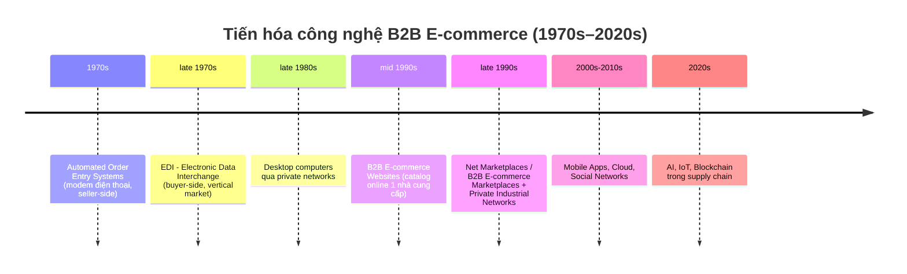
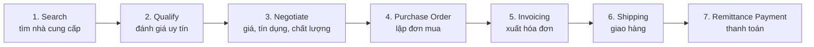
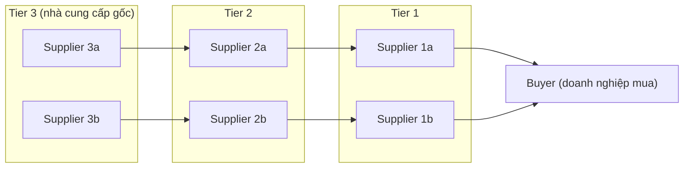
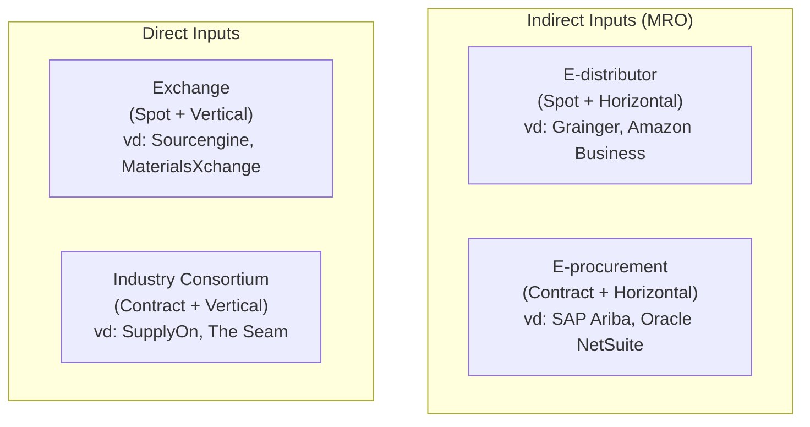
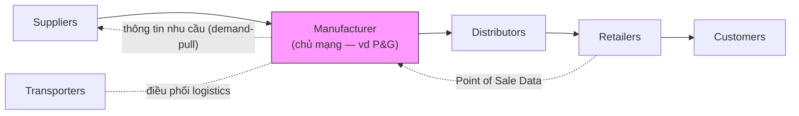

# Chương 12: B2B E-commerce — Supply Chain Management and Collaborative Commerce

> Nguồn: *E-Commerce: Business, Technology and Society* (Laudon & Traver, 18th edition, 2024) — Chapter 12, trang in sách 706–765 (trang PDF 740–799).

## 1. Tóm tắt & giải thích kiến thức

### Case mở đầu: Amazon Business
Amazon Business là ví dụ điển hình cho việc B2B e-commerce học theo các kỹ thuật của B2C. Từ AmazonSupply (2012, chỉ là catalog một nhà bán) chuyển thành Amazon Business (2015, marketplace đa người bán). Kết quả: hơn 5 triệu doanh nghiệp mua hàng, hơn 56 triệu sản phẩm, >30 tỷ USD GMV. Lợi ích cho buyer: search mạnh, gộp đơn từ nhiều vendor, thanh toán, phân quyền mua hàng nội bộ, chiết khấu số lượng. Lợi ích cho seller: quy mô marketing, tiếp cận toàn cầu, giảm chi phí kho (FBA). Bất lợi cho seller: mất quyền sở hữu quan hệ khách hàng, không được cạnh tranh giá "off-market", bị thu phí referral/subscription. Amazon tập trung khai thác "tail spend" (~20% chi tiêu doanh nghiệp không theo nhà cung cấp truyền thống).

### 12.1 Tổng quan về B2B E-commerce

**Định nghĩa cốt lõi:**
- **B2B commerce**: toàn bộ giao dịch liên doanh nghiệp (inter-firm trade) — gồm CRM, demand management, order fulfillment, sản xuất, procurement, phát triển sản phẩm, logistics, quản lý tồn kho.
- **B2B e-commerce (B2B digital commerce)**: phần B2B commerce được thực hiện qua Internet/mobile app.
- **Supply chain (chuỗi cung ứng)**: các liên kết giữa các doanh nghiệp để phối hợp sản xuất — là hệ thống phức hợp gồm tổ chức, con người, quy trình, công nghệ, thông tin.

Quy mô: B2B trade tại Mỹ 2022 ước ~16 nghìn tỷ USD, trong đó B2B e-commerce ~8,5 nghìn tỷ USD, dự kiến đạt ~10 nghìn tỷ USD vào 2026. B2B e-commerce lớn gấp ~7 lần B2C e-commerce.

**Quá trình tiến hóa công nghệ (Figure 12.1)** — mỗi giai đoạn là nền tảng công nghệ mới:

Đặc điểm mỗi loại:
| Công nghệ | Sở hữu bởi | Thiên vị | Thị trường |
|---|---|---|---|
| Automated order entry | Seller | Seller-biased | 1 nhà cung cấp |
| EDI | Buyer | Buyer-biased | Vertical (ngành dọc) |
| B2B website | Seller | Seller-biased | Horizontal |
| B2B marketplace (Net marketplace) | Bên thứ 3/độc lập | Tùy loại | Horizontal/Vertical |
| Private B2B network | Buyer (firm lớn) | Buyer-biased | Collaborative commerce |

**Lợi ích tiềm năng của B2B e-commerce:** giảm chi phí hành chính, giảm chi phí tìm kiếm cho buyer, giảm tồn kho (tăng cạnh tranh giữa suppliers), giảm chi phí giao dịch, tăng tính linh hoạt sản xuất (just-in-time), cải thiện chất lượng, giảm chu kỳ phát triển sản phẩm, tăng cơ hội hợp tác, tăng minh bạch giá (price transparency), tăng khả năng nhìn thấy (visibility) toàn chuỗi cung ứng.

**Thách thức/rủi ro:** thiếu dữ liệu thời gian thực (demand, production, logistics), dữ liệu tài chính nhà cung cấp không đầy đủ → gián đoạn bất ngờ; ít quan tâm tới tác động môi trường, thiên tai, biến động chi phí nhiên liệu/lao động, chính sách lao động/môi trường.

### 12.2 Quy trình Procurement và Supply Chains

**7 bước trong quy trình procurement (Figure 12.4):** Search (tìm nhà cung cấp) → Qualify (đánh giá) → Negotiate (đàm phán giá, tín dụng, escrow, chất lượng, thời gian) → Purchase Order → Invoicing → Shipping → Remittance Payment.

**2 phân loại hàng hóa mua:**
- **Direct goods**: hàng trực tiếp tham gia sản xuất (vd. thép tấm cho ô tô).
- **Indirect goods (MRO goods)**: hàng không trực tiếp sản xuất — vật tư bảo trì/sửa chữa/vận hành (Maintenance, Repair, Operations).

**2 phương thức mua:**
- **Contract purchasing**: hợp đồng dài hạn, thường dùng cho direct goods.
- **Spot purchasing**: mua theo nhu cầu tức thời, thường dùng cho indirect goods (chiếm ~40% tổng chi tiêu procurement).

**Multi-tier supply chain**: chuỗi nhà cung cấp cấp 1, cấp 2, cấp 3... Một hãng lớn (vd. Ford) có thể có >20.000 nhà cung cấp cấp 1. Độ phức tạp tăng theo cấp số nhân (combinatorial explosion).

**Supply chain visibility**: khả năng của firm giám sát output/giá của nhà cung cấp cấp 1-2, theo dõi đơn hàng, quản lý logistics — càng đầu tư số hóa càng có visibility cao. Covid-19 làm nổi bật tầm quan trọng của visibility.

**Legacy systems & Enterprise systems**: hệ thống cũ (legacy) khó trao đổi dữ liệu; enterprise systems (SAP, Oracle, IBM) quản lý toàn bộ hoạt động công ty nhưng thường chỉ hướng nội (inward focus), ít quan tâm supplier bên ngoài. Xu hướng chuyển sang SaaS/cloud-based SCM.

### 12.3 Xu hướng trong Supply Chain Management và Collaborative Commerce

- **Supply chain simplification**: giảm số lượng nhà cung cấp, làm việc chặt với nhóm đối tác chiến lược nhỏ hơn → giảm chi phí, tăng chất lượng. Ngành ô tô giảm >50% số nhà cung cấp.
- **Just-in-time production**: giảm tồn kho tối thiểu, linh kiện đến ngay trước khi lắp ráp; **tight coupling** đảm bảo giao đúng thời điểm/địa điểm.
- **Lean production**: mở rộng JIT ra toàn bộ chuỗi giá trị khách hàng, loại bỏ lãng phí.
- **Adaptive supply chains**: phản ứng "black swan" (sự kiện không lường trước — Covid-19, động đất Nhật 2011, chiến tranh Nga-Ukraine) bằng cách chuyển sản xuất sang vùng khác thay vì tập trung 1 khu vực (regional manufacturing).
- **Accountable supply chains**: điều kiện lao động ở nước sản xuất minh bạch, được xã hội chấp nhận (FLA, Fair Labor Association...).
- **Sustainable supply chains**: giảm tác động môi trường; khái niệm liên quan **circular economy** (loại bỏ chất thải, tái chế, tái tạo tự nhiên).
- **Mobile B2B**: BYOD (Bring Your Own Device), mua hàng/theo dõi supply chain qua di động.
- **B2B in the Cloud**: cloud-based B2B system chuyển chi phí từ firm sang B2B network provider (data hub/platform) — vd SAP Ariba, E2Open, Infor Nexus, Salesforce B2B commerce.
- **Blockchain + IoT**: sổ cái phân tán (distributed ledger) giải quyết vấn đề visibility, thay thế dần EDI; case study Insight on Technology minh họa De Beers Tracr (chuỗi cung ứng kim cương chống "blood diamonds").
- **Collaborative commerce**: dùng công nghệ số để cùng thiết kế, phát triển, xây dựng, marketing, quản lý sản phẩm trong suốt vòng đời — chuyển từ quan hệ giao dịch (transaction) sang quan hệ hợp tác (relationship). Ví dụ P&G hợp tác với supplier/Amazon (co-location kho).
- **Social networks trong B2B**: LinkedIn, Facebook, Twitter dùng để kết nối procurement officers, logistics managers.
- **B2B marketing**: khác B2C — one-to-one/one-to-few, giá trị giao dịch lớn, quan hệ lâu năm → content marketing (white paper, webinar, blog) hiệu quả hơn display/search ads (chỉ dùng nhiều trong spot purchase MRO).

### 12.4 B2B E-commerce Marketplaces — Selling side của B2B

Phân loại theo 2 trục: **loại hàng** (direct vs indirect) × **cách mua** (contract/long-term vs spot) → 4 loại marketplace chính:

| Loại marketplace | Sở hữu | Bias | Thị trường | Cách kiếm tiền |
|---|---|---|---|---|
| **E-distributor** | Bên thứ 3 độc lập | Neutral/nhẹ về seller | Horizontal, public, spot | Markup trên giá bán |
| **E-procurement** | Bên thứ 3 độc lập | Nghiêng về buyer | Horizontal, contract | % giao dịch, phí license/network |
| **Exchange** | Bên thứ 3 độc lập | Nghiêng về buyer | Vertical, spot, dynamic pricing | Hoa hồng giao dịch |
| **Industry consortium** | Do chính ngành sở hữu (đồng sở hữu) | Buyer (nhóm lớn) | Vertical, contract, mời riêng | Phí dịch vụ giá trị gia tăng |

Đặc điểm chung để phân loại marketplace (Table 12.3): **Bias** (buy-side/sell-side/neutral), **Ownership** (industry vs 3rd-party), **Pricing mechanism** (fixed catalog, auction, bid/ask, RFP/RFQ), **Scope/Focus** (horizontal vs vertical), **Value creation**, **Access to market** (public vs private).

- **E-distributor**: catalog online tổng hợp hàng nghìn nhà sản xuất, bán MRO theo spot, one-to-many (vd W.W. Grainger, NeweggBusiness, Amazon Business).
- **E-procurement**: tổng hợp catalog hàng trăm supplier + VCM services (Value Chain Management: tự động hóa procurement bên buyer, tự động hóa selling bên seller), many-to-many (vd SAP Ariba Network — 6,7 triệu công ty kết nối).
- **Exchange**: kết nối hàng nghìn supplier-buyer real-time, thường vertical, many-to-many, dễ thất bại vì thiếu **liquidity** (đo bằng số buyer/seller, khối lượng, quy mô giao dịch) — vd ILS (phụ tùng hàng không), Joor (thời trang wholesale).
- **Industry consortium**: do nhóm doanh nghiệp lớn trong ngành đồng sở hữu ("pay-to-own" thay vì "pay-to-play"), many-to-few, tập trung quan hệ dài hạn và chuẩn hóa dữ liệu ngành — vd SupplyOn (ô tô: Bosch, Continental...), The Seam (nông sản: Cargill...).

### 12.5 Private B2B Networks

**Private B2B network** (trước gọi là private industrial network): mạng Internet-based cho collaborative commerce, kế thừa trực tiếp từ EDI, do 1 firm lớn sở hữu và mời supplier tham gia (buyer-side, buyer-biased nhưng vẫn có lợi cho supplier vì môi trường ít cạnh tranh hơn).

**Mục tiêu của Private B2B network:**
1. Phát triển quy trình mua/bán hiệu quả toàn ngành.
2. Hoạch định nguồn lực toàn ngành (bổ sung cho ERP nội bộ).
3. Tăng supply chain visibility (biết tồn kho của buyer lẫn supplier).
4. Quan hệ buyer-supplier gần gũi hơn (dự báo nhu cầu, giao tiếp, giải quyết xung đột).
5. Vận hành quy mô toàn cầu.
6. Giảm rủi ro mất cân bằng cung-cầu (derivative tài chính, bảo hiểm, futures).

Khác biệt với industry consortium: private network do **1 công ty** sở hữu/kiểm soát (governance riêng); consortium do **nhiều công ty đồng sở hữu** qua equity.

**3 mảnh ghép chính của Collaborative Commerce** qua Private B2B Network (Figure 12.15):
1. **CPFR** (Collaborative Planning, Forecasting, and Replenishment) — phối hợp dự báo nhu cầu, kế hoạch sản xuất, vận chuyển/kho/tồn kho.
2. **Demand chain visibility** — biết được năng lực dư thừa ở đâu trong chuỗi để tránh sản xuất/tồn kho thừa.
3. **Marketing coordination & Product design** — supplier tham gia thiết kế sản phẩm, marketing; tạo **closed-loop marketing** (feedback khách hàng ảnh hưởng trực tiếp thiết kế).

**Rào cản triển khai (Implementation Barriers):**
- Phải chia sẻ dữ liệu nhạy cảm với đối tác — khó kiểm soát giới hạn chia sẻ (rủi ro lộ cho đối thủ).
- Tích hợp vào enterprise system/EDI hiện có rất tốn kém.
- Đòi hỏi thay đổi tư duy/hành vi nhân viên — chuyển lòng trung thành từ firm sang "extended enterprise"; các bên (trừ chủ mạng) mất phần độc lập.

Case study minh họa: **Walmart Retail Link / GRS (Global Replenishment System)** — hệ thống CPFR tiên phong; **True Value** — mạng riêng theo dõi real-time shipment giảm 57% lead time.

### 12.7 Case Study: Elemica

Elemica — nền tảng B2B cloud cho ngành hóa chất, nhựa, cao su, năng lượng, dược, thực phẩm... Ra đời 2000 bởi 22 công ty hóa chất lớn (Dow, DuPont...) như một **industry consortium**, sau đó được bán qua Thoma Bravo (2016) rồi Eurazeo Capital (2019) → chuyển từ mô hình consortium sang mô hình platform-as-a-service (PaaS) độc lập thương mại. Elemica không mua/bán/sở hữu nguyên liệu, chỉ đóng vai trò trung gian kết nối (giống eBay/credit card — thu phí theo giao dịch). Mô hình "Come as You Are" — cho phép công ty dùng bất kỳ công cụ giao tiếp nào (EDI, XML, email) mà không cần thay đổi hệ thống nội bộ. 5 mảng dịch vụ: Buy, Move, Sell, Assure, See.

## 2. Key Concepts

| Thuật ngữ | Giải thích |
|---|---|
| **Supply chain competition** | Cạnh tranh dựa trên việc chuỗi cung ứng vượt trội hơn đối thủ (sản phẩm tốt hơn, nhanh hơn, rẻ hơn). |
| **B2B commerce** | Toàn bộ giao dịch liên doanh nghiệp (inter-firm trade), gồm cả kênh truyền thống lẫn số hóa. |
| **B2B e-commerce (B2B digital commerce)** | Phần B2B commerce được thực hiện qua Internet/mobile app. |
| **Supply chain** | Các liên kết giữa doanh nghiệp để phối hợp sản xuất — gồm tổ chức, con người, quy trình, công nghệ, thông tin. |
| **Automated order entry systems** | Hệ thống đặt hàng tự động qua modem điện thoại (thập niên 1970), thuộc seller-side. |
| **Seller-side solutions** | Giải pháp do người bán sở hữu, chỉ hiển thị hàng của 1 seller (seller-biased). |
| **EDI (Electronic Data Interchange)** | Chuẩn giao tiếp trao đổi tài liệu kinh doanh (hóa đơn, PO, SKU...) giữa doanh nghiệp, thuộc buyer-side, phục vụ vertical market. |
| **Buyer-side solutions** | Giải pháp do buyer sở hữu, nhằm giảm chi phí procurement cho buyer (buyer-biased). |
| **Vertical market** | Thị trường phục vụ chuyên sâu một ngành cụ thể (vd ô tô). |
| **Horizontal market** | Thị trường phục vụ nhiều ngành khác nhau. |
| **B2B e-commerce website** | Catalog online của 1 nhà cung cấp, mở cho công chúng. |
| **B2B e-commerce marketplaces (Net marketplaces)** | Môi trường Internet tập hợp hàng trăm-nghìn supplier và buyer để giao dịch (sell-side). |
| **Private B2B networks (private industrial networks)** | Môi trường giao tiếp Internet vượt xa procurement, hỗ trợ collaborative commerce toàn diện. |
| **Procurement process** | Quy trình doanh nghiệp mua hàng hóa cần để sản xuất ra sản phẩm bán cho người tiêu dùng. |
| **Direct goods** | Hàng hóa trực tiếp tham gia quá trình sản xuất. |
| **Indirect goods (MRO goods)** | Hàng hóa không trực tiếp tham gia sản xuất — bảo trì, sửa chữa, vận hành. |
| **Contract purchasing** | Mua theo hợp đồng dài hạn với điều khoản/chất lượng thỏa thuận trước. |
| **Spot purchasing** | Mua theo nhu cầu tức thời trong thị trường lớn nhiều nhà cung cấp. |
| **Multi-tier supply chain** | Chuỗi nhà cung cấp sơ cấp, thứ cấp, cấp ba nối tiếp nhau. |
| **Supply chain visibility** | Mức độ firm mua có thể giám sát hoạt động của nhà cung cấp cấp 2-3. |
| **Legacy computer systems** | Hệ thống doanh nghiệp cũ, quản lý các quy trình nội bộ, khó tích hợp. |
| **Enterprise systems** | Hệ thống toàn công ty bao gồm tài chính, nhân sự, procurement (SAP, Oracle, IBM...). |
| **Supply chain management (SCM)** | Các hoạt động firm/ngành dùng để phối hợp các bên trong procurement. |
| **Supply chain simplification** | Giảm quy mô chuỗi cung ứng, làm việc gần hơn với nhóm supplier chiến lược nhỏ hơn. |
| **Tight coupling** | Đảm bảo supplier giao đúng linh kiện, đúng thời điểm, đúng địa điểm. |
| **Just-in-time production** | Quản lý tồn kho giảm về mức tối thiểu, hàng đến sát thời điểm sử dụng. |
| **Lean production** | Phương pháp loại bỏ lãng phí xuyên suốt chuỗi giá trị khách hàng. |
| **Adaptive supply chain** | Cho phép công ty phản ứng gián đoạn bằng cách chuyển sản xuất sang vùng khác. |
| **Accountable supply chain** | Điều kiện lao động ở nước sản xuất minh bạch và được xã hội chấp nhận. |
| **Sustainable supply chain** | Sử dụng phương thức sản xuất/phân phối/logistics thân thiện môi trường nhất. |
| **Circular economy** | Kinh tế tuần hoàn — loại bỏ chất thải, tái chế vật liệu, tái tạo tự nhiên. |
| **Bring Your Own Device (BYOD)** | Chính sách cho nhân viên dùng thiết bị cá nhân trong mạng công ty. |
| **Cloud-based B2B system** | Chuyển chi phí hệ thống B2B từ firm sang nhà cung cấp mạng B2B (data hub/platform). |
| **Supply chain management (SCM) systems** | Hệ thống liên kết liên tục hoạt động mua-làm-vận chuyển từ supplier đến firm mua. |
| **Collaborative commerce** | Dùng công nghệ số để các firm cùng thiết kế, phát triển, xây dựng, marketing, quản lý sản phẩm suốt vòng đời. |
| **E-distributor** | Trung gian độc lập cung cấp catalog online từ hàng nghìn nhà sản xuất trực tiếp. |
| **E-procurement company** | Trung gian độc lập giúp tự động hóa procurement, kết nối supplier-buyer qua phí thành viên. |
| **Value chain management (VCM) services** | Dịch vụ tự động hóa toàn bộ quy trình procurement (buyer) và selling (seller). |
| **Exchange** | Marketplace độc lập kết nối hàng trăm-nghìn supplier/buyer theo thời gian thực. |
| **Liquidity** | Đo bằng số buyer/seller, khối lượng và quy mô giao dịch trong thị trường. |
| **Industry consortium** | Thị trường vertical do chính ngành sở hữu, cho phép mua direct input từ nhóm mời riêng. |
| **Collaborative Planning, Forecasting, and Replenishment (CPFR)** | Phối hợp với thành viên mạng để dự báo nhu cầu, lập kế hoạch sản xuất, điều phối vận chuyển/kho/tồn kho. |

## 3. Questions

1. **Explain the differences between B2B commerce and B2B e-commerce.**
   B2B commerce là toàn bộ giao dịch liên doanh nghiệp (inter-firm trade) dưới mọi hình thức, kể cả truyền thống (điện thoại, fax, gặp mặt). B2B e-commerce (hay B2B digital commerce) chỉ là phần của B2B commerce được thực hiện qua Internet và mobile app.

2. **What are the key attributes of a B2B e-commerce website? What early technologies are they descended from?**
   B2B e-commerce website là catalog online của một nhà cung cấp duy nhất, mở cho công chúng — thuộc seller-side, seller-biased, và phục vụ horizontal market (nhiều ngành). Chúng là hậu duệ tự nhiên của automated order entry systems, khác biệt ở 2 điểm: (1) dùng Internet rẻ và phổ biến hơn thay cho mạng riêng, (2) phục vụ horizontal market thay vì chỉ 1 ngành.

3. **List at least five potential benefits of B2B e-commerce.**
   Giảm chi phí hành chính; giảm chi phí tìm kiếm cho buyer; giảm chi phí tồn kho (tăng cạnh tranh giữa supplier); giảm chi phí giao dịch (loại bỏ giấy tờ); tăng linh hoạt sản xuất (just-in-time); cải thiện chất lượng sản phẩm; giảm chu kỳ phát triển sản phẩm; tăng cơ hội hợp tác với supplier/distributor; tăng minh bạch giá; tăng visibility/chia sẻ thông tin thời gian thực trong toàn chuỗi cung ứng.

4. **Name and define the two distinct types of procurements that firms make. Explain the difference between the two.**
   **Direct goods**: hàng hóa trực tiếp tham gia sản xuất (vd thép tấm cho thân xe). **Indirect goods (MRO)**: hàng hóa không trực tiếp tham gia sản xuất, dùng cho bảo trì-sửa chữa-vận hành (vd văn phòng phẩm). Khác biệt: direct goods gắn liền với output cuối cùng của firm, thường mua theo hợp đồng dài hạn; indirect goods hỗ trợ vận hành chung, thường mua theo spot.

5. **Name and define the two methods of purchasing goods.**
   **Contract purchasing**: thỏa thuận văn bản dài hạn mua sản phẩm cụ thể với điều khoản/chất lượng đã thống nhất trong thời gian dài — thường dùng cho direct goods. **Spot purchasing**: mua theo nhu cầu tức thời trong các marketplace lớn nhiều nhà cung cấp — thường dùng cho indirect goods (dù đôi khi cũng dùng cho direct goods, chiếm tới ~40% tổng chi tiêu procurement).

6. **Define the term supply chain, and explain what SCM systems attempt to do. What does supply chain simplification entail?**
   Supply chain là các liên kết kết nối các doanh nghiệp với nhau để phối hợp sản xuất — một hệ thống phức hợp gồm tổ chức, con người, quy trình, công nghệ, thông tin. SCM systems cố gắng liên kết liên tục các hoạt động mua, sản xuất, vận chuyển sản phẩm từ supplier đến firm mua, đồng thời tích hợp phía cầu (order entry system) để tăng minh bạch và khả năng phản hồi gần thời gian thực. Supply chain simplification là việc giảm quy mô chuỗi cung ứng và làm việc chặt chẽ hơn với một nhóm nhỏ supplier chiến lược để giảm chi phí sản phẩm và chi phí hành chính, đồng thời cải thiện chất lượng.

7. **Explain the difference between a horizontal market and a vertical market.**
   Horizontal market phục vụ nhiều ngành khác nhau (vd MRO cho mọi ngành). Vertical market cung cấp chuyên môn và sản phẩm cho một ngành cụ thể (vd phụ tùng ô tô).

8. **How do the value chain management services provided by e-procurement companies benefit buyers? What services do they provide to suppliers?**
   Với buyer: tự động hóa purchase orders, requisitions, sourcing, thực thi quy tắc kinh doanh (business rules), invoicing, và thanh toán. Với supplier: tạo catalog và quản lý nội dung, quản lý đơn hàng, fulfillment, invoicing, shipment, và settlement.

9. **What are the three dimensions that characterize an e-procurement marketplace based on its business functionality? Name two other market characteristics of an e-procurement marketplace.**
   3 chiều phân loại chức năng kinh doanh (theo Figure 12.9): loại hàng mua (direct vs indirect goods), cách mua (contract/long-term sourcing vs spot purchasing), và horizontal vs vertical market. Hai đặc điểm thị trường khác của e-procurement marketplace: chúng là many-to-many markets (nhiều buyer, nhiều seller thông qua bên trung gian độc lập tự xưng là "neutral"), và chúng thường thiên về buyer-biased dù về hình thức trung lập vì tập hợp catalog của nhiều supplier/e-distributor cạnh tranh nhau.

10. **Identify and briefly explain the anticompetitive possibilities inherent in B2B e-commerce marketplaces.**
    Các marketplace B2B thường thiên về bất lợi cho supplier vì buộc họ phải công khai giá và điều khoản cho các supplier khác trong cùng marketplace (giảm khả năng phân biệt giá, giảm biên lợi nhuận trong thị trường minh bạch, đặc biệt với hàng hóa dạng commodity). Exchanges đặt các supplier vào cạnh tranh giá trực tiếp toàn cầu, kéo biên lợi nhuận xuống thấp.

11. **List three of the objectives of a private B2B network.**
    (1) Phát triển quy trình mua-bán hiệu quả trên toàn ngành; (2) Tăng supply chain visibility — biết mức tồn kho của cả buyer và supplier; (3) Đạt được quan hệ buyer-supplier gần gũi hơn, gồm dự báo nhu cầu, giao tiếp và giải quyết xung đột. (Ngoài ra còn có: hoạch định nguồn lực toàn ngành, vận hành quy mô toàn cầu, giảm rủi ro mất cân bằng cung-cầu.)

12. **What is the main reason many of the independent exchanges developed in the early days of e-commerce failed?**
    Nguyên nhân chính là các nhà cung cấp (supplier) từ chối tham gia, dẫn tới thị trường có **liquidity** rất thấp (ít buyer/seller, ít giao dịch, giá trị giao dịch nhỏ) — làm mất đi mục đích và lợi ích cốt lõi của một exchange. Lý do phổ biến nhất khiến supplier không tham gia là thiếu các nhà cung cấp truyền thống, đáng tin cậy trên nền tảng.

13. **Explain the difference between an industry consortium and a private B2B network.**
    Industry consortium do nhiều công ty lớn trong ngành **đồng sở hữu** thông qua tham gia vốn cổ phần (equity participation), phục vụ mua direct input từ tập hợp thành viên mời riêng. Private B2B network do **một công ty duy nhất** sở hữu, thiết lập luật chơi và quyền quản trị (governance), mời các firm khác tham gia theo quyết định riêng — tập trung vào strategic, direct goods/services và collaborative commerce toàn diện hơn (không chỉ giao dịch).

14. **What is CPFR, and what benefits could it achieve for the members of a private B2B network?**
    CPFR (Collaborative Planning, Forecasting, and Replenishment — hoặc trong sách gọi là collaborative resource planning, forecasting, and replenishment) là việc phối hợp với các thành viên mạng để dự báo nhu cầu, phát triển kế hoạch sản xuất, và điều phối vận chuyển, lưu kho, bổ sung hàng sao cho kệ hàng bán lẻ/bán buôn luôn có đúng lượng hàng cần thiết. Lợi ích: có thể loại bỏ hàng trăm triệu USD tồn kho và công suất dư thừa khỏi một ngành — đây được xem là lợi ích lớn nhất, đủ để biện minh cho chi phí xây dựng private B2B network.

15. **What are the barriers to the complete implementation of private B2B networks?**
    (1) Phải chia sẻ dữ liệu nhạy cảm với đối tác kinh doanh — khó kiểm soát giới hạn chia sẻ thông tin trong môi trường số, thông tin có thể lọt đến đối thủ cạnh tranh; (2) Tích hợp private B2B network vào enterprise systems và mạng EDI hiện có đòi hỏi đầu tư lớn về thời gian và tiền bạc; (3) Cần thay đổi tư duy và hành vi của nhân viên — chuyển lòng trung thành từ firm sang "extended enterprise" rộng hơn; tất cả các bên tham gia (trừ chủ mạng) đều mất một phần tính độc lập.

16. **What is EDI, and why is it important?**
    EDI (Electronic Data Interchange) là một chuẩn giao tiếp được định nghĩa rộng, cho phép các firm dễ dàng chia sẻ tài liệu kinh doanh như hóa đơn, purchase orders, shipping bills, mã SKU, và thông tin thanh toán — dựa trên chuẩn ANSI X12 (Mỹ) và EDIFACT (quốc tế). EDI quan trọng vì nó vẫn là công nghệ nền tảng (workhorse) của B2B commerce hiện nay, hỗ trợ giao tiếp giữa một nhóm nhỏ đối tác chiến lược trong quan hệ giao dịch trực tiếp, dài hạn, dù tăng trưởng của nó tương đối phẳng.

17. **Describe at least six major trends in supply chain management and collaboration.**
    Supply chain simplification; just-in-time và lean production; adaptive supply chains (ứng phó "black swan"); accountable supply chains (chuẩn lao động); sustainable supply chains (và circular economy); mobile B2B (BYOD); cloud-based B2B (data hub); ứng dụng blockchain + IoT trong supply chain; collaborative commerce; social networks trong B2B; B2B marketing qua content marketing.

18. **Describe the challenges inherent to B2B e-commerce.**
    Thiếu visibility do thiếu dữ liệu thời gian thực về nhu cầu, sản xuất, logistics, và dữ liệu tài chính không đầy đủ về supplier → dẫn đến gián đoạn bất ngờ. Ít quan tâm đến tác động môi trường của supply chain, tính nhạy cảm với thiên tai, biến động chi phí nhiên liệu/lao động, và tác động của chính sách lao động/môi trường công cộng — khiến nhiều supply chain của các công ty Fortune 1000 trở nên rủi ro, dễ tổn thương, và thiếu bền vững về mặt xã hội/môi trường.

19. **What is a multi-tier supply chain, and why does it pose a challenge for B2B e-commerce?**
    Multi-tier supply chain là chuỗi các nhà cung cấp sơ cấp (tier 1), thứ cấp (tier 2), và cấp ba (tier 3) nối tiếp nhau — một firm lớn có thể có hàng nghìn nhà cung cấp tier 1, mỗi nhà cung cấp đó lại có nhiều nhà cung cấp riêng. Nó là thách thức vì độ phức tạp tăng theo cấp số nhân (combinatorial explosion — ví dụ 4 supplier tier-1 × 3 tier-2 × 3 tier-3 → tổng 53 firm), khiến việc phối hợp và đạt được visibility toàn chuỗi trở nên cực kỳ khó khăn do quy mô và phạm vi của nó.

20. **What is a cloud-based B2B platform, and what advantages does it offer?**
    Cloud-based B2B platform (data hub/B2B platform) chuyển phần lớn chi phí xây dựng và duy trì hệ thống B2B từ firm sang nhà cung cấp mạng B2B. Nhà cung cấp cloud lo phần computing/telecom, thiết lập kết nối với đối tác, cung cấp phần mềm SaaS, xử lý và làm sạch dữ liệu. Lợi ích: tận dụng network effects (chi phí chia đều cho mọi thành viên → giảm chi phí); triển khai nhanh (phù hợp với sáp nhập, thị trường thay đổi nhanh); tính phí theo mức sử dụng thay vì phần trăm giá trị giao dịch; không cần đầu tư hạ tầng riêng.

21. **Describe the differences and similarities between B2C and B2B marketing.**
    Khác biệt: B2C nhắm đến lượng lớn khách hàng đại chúng (one-to-many) với sản phẩm đơn giản, giá trị thấp; B2B thường bán khối lượng thấp các sản phẩm phức tạp, giá trị cao cho số ít người mua (one-to-one/one-to-few), quan hệ kéo dài nhiều năm, dùng nhiều marketing nội dung (content marketing: white paper, video, podcast, webinar, blog) và bán hàng trực tiếp (salesforce) hơn là display/search ads. Tương đồng: trong các thị trường spot purchase (MRO/commodity), B2B marketing dùng nhiều chiến thuật giống B2C (display ads, search engine marketing, social network, mobile ads); cả hai đều ngày càng dùng mobile và social media, dù mobile ít trung tâm hơn trong B2B.

## 4. Projects

1. **"Choose an industry and a B2B vertical market maker that interests you. Investigate the site and prepare a report that describes the size of the industry served, the type of B2B e-commerce marketplace provided, the benefits promised by the site for both suppliers and purchasers, and the history of the company. You might also investigate the bias (buyer vs. seller), ownership (suppliers, buyers, independents), pricing mechanism(s), scope and focus, and access (public vs. private) of the B2B e-commerce marketplace."**

   *Hướng dẫn thực hiện:*
   - Bước 1: Chọn 1 ngành cụ thể (vd nông sản, hóa chất, điện tử, ô tô) và tìm 1 "vertical market maker" thực tế trong chương (SupplyOn, The Seam, Sourcengine, MaterialsXchange, ILS, GHX...) hoặc tự tìm thêm qua tìm kiếm web.
   - Bước 2: Truy cập website của market maker, đọc mục "About/Company/History" để nắm quy mô ngành phục vụ (số lượng thành viên, giá trị giao dịch hàng năm, số quốc gia).
   - Bước 3: Xác định loại marketplace theo khung Figure 12.9 (e-distributor/e-procurement/exchange/industry consortium) dựa trên loại hàng (direct/indirect) và cách mua (spot/contract).
   - Bước 4: Phân tích các đặc điểm theo Table 12.3: bias (buyer/seller/neutral), ownership (industry-owned hay third-party), pricing mechanism (catalog cố định, đấu giá, bid/ask, RFQ), scope (vertical/horizontal), access (public/private).
   - Bước 5: Liệt kê lợi ích cụ thể mà site hứa hẹn cho cả supplier và buyer (giảm chi phí tìm kiếm, tăng visibility, tiếp cận thị trường toàn cầu...).
   - Trình bày: viết báo cáo ngắn (1-2 trang) có cấu trúc: Giới thiệu ngành → Lịch sử công ty → Phân loại marketplace → Đặc điểm (bias/ownership/pricing/scope/access) → Lợi ích cho buyer & seller → Kết luận.
   - Lưu ý: nên chọn công ty còn hoạt động, có thông tin công khai đầy đủ; trích dẫn nguồn website/báo cáo dùng để viết.

2. **"Examine the website of one of the e-distributors listed in Figure 12.9, and compare and contrast it to one of the websites listed for e-procurement marketplaces. If you were a business manager of a medium-sized firm, how would you decide where to purchase your indirect inputs—from an e-distributor or an e-procurement marketplace? Write a short report detailing your analysis."**

   *Hướng dẫn thực hiện:*
   - Bước 1: Chọn 1 e-distributor trong Figure 12.9 (Grainger, Amazon Business, NewEgg Business, Sourcengine) và 1 e-procurement marketplace (Ariba Network, Oracle NetSuite Procurement, SupplyOn).
   - Bước 2: Truy cập cả hai website, ghi nhận: cách tìm sản phẩm (catalog vs tổng hợp catalog nhiều nhà cung cấp), cơ chế giá (fixed price vs có thể thương lượng/hợp đồng), quy trình đặt hàng (spot ngay lập tức vs phải là thành viên/hợp đồng dài hạn), dịch vụ giá trị gia tăng (VCM: quản lý đơn hàng, invoicing tự động, tích hợp ERP).
   - Bước 3: Lập bảng so sánh 2 nền tảng theo các tiêu chí: đối tượng phục vụ, loại hàng (MRO spot vs indirect theo hợp đồng), chi phí sử dụng (markup vs phí giao dịch/subscription), mức độ tích hợp hệ thống nội bộ.
   - Bước 4: Đưa ra quyết định giả định — với vai trò business manager của công ty quy mô vừa, phân tích khi nào nên dùng e-distributor (nhu cầu spot, không thường xuyên, không cần tích hợp phức tạp, ngân sách nhỏ) và khi nào nên dùng e-procurement marketplace (nhu cầu mua lặp lại, cần tự động hóa quy trình procurement, cần kiểm soát chi tiêu nhân viên, muốn tích hợp ERP).
   - Trình bày: báo cáo ngắn có phần so sánh dạng bảng + phần khuyến nghị và lý do.

3. **"Assume you are a procurement officer for an office furniture manufacturer of steel office equipment. You have a single factory located in the Midwest with 2,000 employees. You sell about 40% of your office furniture to retail-oriented catalog outlets such as Quill in response to specific customer orders, and the remainder of your output is sold to resellers under long-term contracts. You have a choice of purchasing raw steel inputs—mostly cold-rolled sheet steel—from an exchange and/or from an industry consortium. Which alternative would you choose and why? Prepare a presentation for management supporting your position."**

   *Hướng dẫn thực hiện:*
   - Bước 1: Xác định bản chất nhu cầu mua thép: đây là **direct good** (nguyên liệu trực tiếp sản xuất), và công ty có cả nhu cầu spot (đáp ứng đơn Quill theo yêu cầu khách) lẫn nhu cầu ổn định dài hạn (hợp đồng với reseller) → cần cân nhắc phối hợp cả 2 kênh.
   - Bước 2: So sánh đặc điểm Exchange (vertical, spot, dynamic pricing/đấu giá, thanh khoản phụ thuộc số lượng supplier tham gia, dễ bị cạnh tranh giá toàn cầu ép biên lợi nhuận supplier) với Industry Consortium (vertical, contract dài hạn, quan hệ ổn định, đồng sở hữu bởi doanh nghiệp lớn trong ngành, tập trung chuẩn hóa dữ liệu/quy trình).
   - Bước 3: Lập luận: vì 40% output phụ thuộc đơn hàng cụ thể (biến động) nên cần nguồn thép linh hoạt, có thể exchange phù hợp cho phần này (mua spot khi cần); phần 60% dài hạn nên dùng industry consortium để đảm bảo ổn định giá/nguồn cung, và giảm rủi ro gián đoạn.
   - Bước 4: Xem xét rủi ro (Section 12.3): độ tin cậy thanh khoản của exchange, rủi ro chuỗi cung ứng tập trung (nên đa dạng hóa nguồn — theo bài học "black swan"/adaptive supply chain).
   - Trình bày: chuẩn bị slide/presentation gồm: Bối cảnh nhu cầu → So sánh 2 lựa chọn (bảng ưu/nhược điểm) → Đề xuất kết hợp hoặc chọn 1 phương án → Rủi ro & biện pháp giảm thiểu → Kết luận.

4. **"You are involved in logistics management for your company, a national retailer of office furniture. In the last year, the company has experienced a number of disruptions in its supply chain as vendors failed to deliver products on time, and the business has lost customers as a result. Your firm has only a limited IT department, and you would like to propose a cloud-based solution. Research various supply chain management products, and write a report to senior management on why you believe that a cloud-based B2B solution is best for your firm."**

   *Hướng dẫn thực hiện:*
   - Bước 1: Xác định vấn đề cốt lõi: gián đoạn giao hàng do thiếu supply chain visibility, và hạn chế về nguồn lực IT nội bộ để tự xây dựng hệ thống.
   - Bước 2: Nghiên cứu các nhà cung cấp cloud-based SCM/B2B nêu trong chương: SAP Ariba, Oracle NetSuite, E2Open, Infor Nexus, Elementum, Salesforce B2B commerce (có thể tìm thêm thông tin giá/tính năng qua website nhà cung cấp).
   - Bước 3: Nêu lý do cloud-based B2B phù hợp với firm có IT hạn chế: chi phí chuyển từ CAPEX (hạ tầng riêng) sang OPEX (trả theo sử dụng); nhà cung cấp cloud lo phần kết nối, bảo trì, cập nhật, bảo mật; triển khai nhanh hơn so với xây hệ thống on-premises; tận dụng network effects giảm chi phí.
   - Bước 4: Liên hệ case Elemica hoặc Elementum trong chương làm ví dụ minh họa mô hình "một kết nối duy nhất, quản lý nhiều đối tác" giúp công ty nhỏ vẫn tham gia mạng lưới lớn mà không cần đội IT hùng hậu.
   - Bước 5: Đề xuất giải pháp cụ thể: chọn 1-2 nhà cung cấp phù hợp quy mô, ước tính lợi ích (giảm % chậm giao hàng, tăng visibility đơn hàng thời gian thực), lộ trình triển khai từng giai đoạn.
   - Trình bày: báo cáo gửi ban lãnh đạo gồm: Tóm tắt vấn đề → Phân tích nguyên nhân gốc (thiếu visibility) → So sánh các giải pháp cloud-based SCM → Đề xuất & lợi ích kỳ vọng → Lộ trình & chi phí ước tính → Kết luận/kêu gọi phê duyệt.
