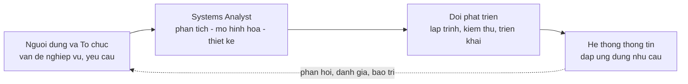
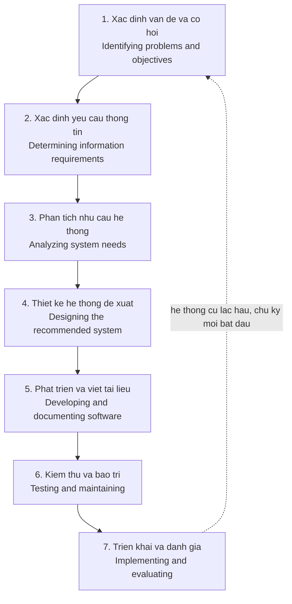
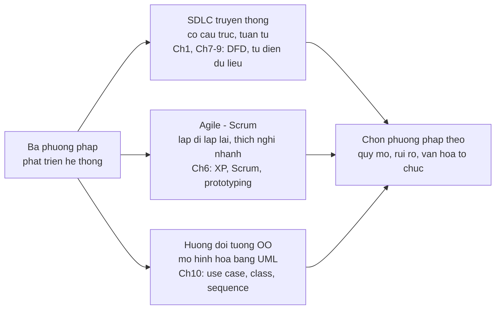
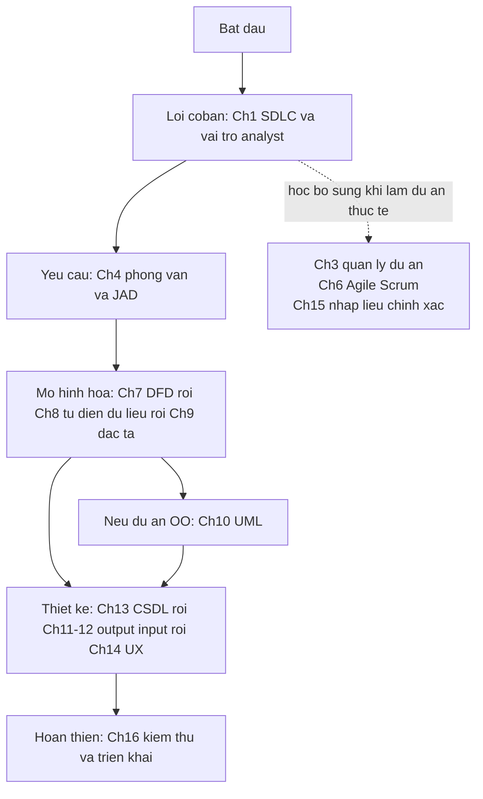

# Chương 0 — Giới thiệu giáo trình Systems Analysis and Design

> Tài liệu dẫn nhập cho bộ ghi chú học tập. Đọc chương này trước để nắm toàn cảnh môn học, cấu trúc giáo trình và cách dùng bộ tài liệu.

## 📕 Thông tin giáo trình

| Mục                 | Nội dung                                                                                                                                                       |
| -------------------- | --------------------------------------------------------------------------------------------------------------------------------------------------------------- |
| Tên sách           | **Systems Analysis and Design**, 11th edition                                                                                                             |
| Tác giả            | Kenneth E. Kendall & Julie E. Kendall — Rutgers University, School of Business–Camden                                                                         |
| Nhà xuất bản      | Pearson, 2023                                                                                                                                                   |
| Quy mô              | 539 trang nội dung,**16 chương**, chia thành **5 phần (Part I–V)**                                                                            |
| Tài liệu kèm theo | Glossary (thuật ngữ), Acronyms (viết tắt), các tình huống Consulting Opportunity, HyperCase và case study xuyên suốt CPU (Central Pacific University) |

## 🎓 Môn học này học cái gì?

**Phân tích và Thiết kế Hệ thống (Systems Analysis and Design — SAD)** trả lời câu hỏi: *làm thế nào để đi từ một vấn đề nghiệp vụ mơ hồ của tổ chức đến một hệ thống thông tin chạy được, đúng nhu cầu người dùng?*

Nhân vật trung tâm của môn học là **systems analyst** (chuyên viên phân tích hệ thống) — người đóng 3 vai trò: **consultant** (tư vấn), **supporting expert** (chuyên gia hỗ trợ) và **agent of change** (tác nhân thay đổi). Analyst đứng giữa người dùng nghiệp vụ và đội kỹ thuật:

Xương sống của môn học là **SDLC (Systems Development Life Cycle)** — vòng đời phát triển hệ thống 7 pha. Toàn bộ 16 chương của sách chính là đi lần lượt qua các pha này:

## 🗺️ Cấu trúc giáo trình: 5 phần — 16 chương

```mermaid
flowchart TD
    B["Systems Analysis and Design 11e<br>Kendall va Kendall"] --> I["PART I<br>Systems Analysis Fundamentals<br>Nen tang phan tich he thong"]
    B --> II["PART II<br>Information Requirements Analysis<br>Phan tich yeu cau thong tin"]
    B --> III["PART III<br>The Analysis Process<br>Qua trinh phan tich"]
    B --> IV["PART IV<br>The Essentials of Design<br>Cot loi cua thiet ke"]
    B --> V["PART V<br>Quality Assurance and Implementation<br>Dam bao chat luong va trien khai"]
    I --> C1["Ch1 He thong, vai tro,<br>phuong phap phat trien"]
    I --> C2["Ch2 Mo hinh hoa<br>he thong to chuc"]
    I --> C3["Ch3 Quan ly du an"]
    II --> C4["Ch4 Thu thap thong tin<br>phuong phap tuong tac"]
    II --> C5["Ch5 Thu thap thong tin<br>phuong phap khong can thiep"]
    II --> C6["Ch6 Agile, Prototyping,<br>Scrum"]
    III --> C7["Ch7 So do dong<br>du lieu DFD"]
    III --> C8["Ch8 Tu dien du lieu"]
    III --> C9["Ch9 Dac ta tien trinh,<br>quyet dinh co cau truc"]
    III --> C10["Ch10 Huong doi tuong<br>voi UML"]
    IV --> C11["Ch11 Thiet ke dau ra"]
    IV --> C12["Ch12 Thiet ke dau vao"]
    IV --> C13["Ch13 Thiet ke CSDL"]
    IV --> C14["Ch14 HCI va UX"]
    V --> C15["Ch15 Quy trinh nhap lieu<br>chinh xac"]
    V --> C16["Ch16 QA va trien khai"]
```

### Tóm tắt nội dung từng phần

| Phần                                      | Chương | Nội dung chính                                                                                                                                                                            | Tương ứng pha SDLC |
| ------------------------------------------ | -------- | ------------------------------------------------------------------------------------------------------------------------------------------------------------------------------------------- | --------------------- |
| **I — Nền tảng**                  | 1–3     | Hệ thống thông tin là gì; vai trò analyst; các phương pháp phát triển (SDLC, Agile, OO); tổ chức như một hệ thống; khởi tạo & quản lý dự án (khả thi, Gantt, PERT) | Pha 1                 |
| **II — Yêu cầu thông tin**       | 4–6     | Thu thập yêu cầu: phỏng vấn, JAD, bảng hỏi (tương tác); sampling, phân tích tài liệu, quan sát STROBE (không can thiệp); prototyping, Agile, Scrum                         | Pha 2                 |
| **III — Quá trình phân tích**   | 7–10    | Mô hình hóa hệ thống: DFD, từ điển dữ liệu, đặc tả tiến trình (structured English, decision table, decision tree), phân tích hướng đối tượng với UML                | Pha 3                 |
| **IV — Cốt lõi thiết kế**       | 11–14   | Thiết kế output, input, cơ sở dữ liệu (ERD, chuẩn hóa 1NF–3NF, data warehouse), giao diện người–máy và UX                                                                    | Pha 4                 |
| **V — Chất lượng & triển khai** | 15–16   | Mã hóa dữ liệu, kiểm tra hợp lệ đầu vào; TQM, Six Sigma, kiểm thử, tài liệu hóa, chiến lược chuyển đổi, huấn luyện, đánh giá                                      | Pha 5–7              |

## 🧭 Ba "trường phái" phương pháp mà sách dạy

Sách trình bày song song 3 cách tiếp cận phát triển hệ thống — analyst giỏi phải biết chọn đúng công cụ cho đúng dự án:

## 📚 Đặc điểm sư phạm của sách (gặp trong từng chương)

- **Learning Objectives** — mục tiêu học tập mở đầu chương.
- **Consulting Opportunities** — tình huống tư vấn ngắn lồng trong chương để áp dụng kiến thức vừa học.
- **HyperCase Experience** — case tương tác về tổ chức ảo MRE để thực hành.
- **CPU Case (Central Pacific University)** — case study xuyên suốt cả sách, làm dần qua từng chương.
- **Summary + Keywords and Phrases** — tóm tắt và danh mục thuật ngữ cuối chương.
- **Review Questions** — câu hỏi ôn tập lý thuyết (đã trả lời đầy đủ trong bộ ghi chú này).
- **Problems** — bài tập vận dụng (đã giải đầy đủ trong bộ ghi chú này).
- **Group Projects** — bài tập nhóm.

## 🛤️ Lộ trình học gợi ý

Học tuần tự 1 → 16 là an toàn nhất vì các chương sau dùng kết quả chương trước (đặc biệt chuỗi DFD → từ điển dữ liệu → đặc tả tiến trình). Nếu cần học nhanh theo trọng tâm:

## 📂 Cách dùng bộ tài liệu này

| Thư mục / file                             | Nội dung                                                                                                                                                                                             |
| -------------------------------------------- | ----------------------------------------------------------------------------------------------------------------------------------------------------------------------------------------------------- |
| `notes/chuong-01…16-*.md`                 | Ghi chú học tập từng chương: mục tiêu, tóm tắt dễ hiểu, sơ đồ Mermaid, bảng thuật ngữ Anh–Việt,**trả lời toàn bộ Review Questions**, **giải toàn bộ Problems** |
| `docx/chuong-*.docx`                       | Bản Word tương ứng, sơ đồ đã render thành hình ảnh — dùng để in hoặc đọc trên Word                                                                                                |
| `chapters-text/ch01…16.txt`               | Text gốc trích từ PDF theo từng chương (để tra lại nguyên văn tiếng Anh)                                                                                                                  |
| `book-extracted-text.txt`                  | Toàn bộ text của sách (610 trang PDF)                                                                                                                                                             |
| `System Analysis and Design 11th 2023.pdf` | Sách gốc — tra hình vẽ, bảng biểu mà bản text không giữ được                                                                                                                            |

**Mẹo học:** với mỗi chương, đọc "🎯 Mục tiêu học tập" → đọc "📖 Tóm tắt" kèm sơ đồ → tự trả lời Review Questions trước rồi mới so với đáp án → làm Problems như bài tập thật. Thuật ngữ tiếng Anh nên học thuộc song ngữ vì đề thi/tài liệu thực tế đều dùng tiếng Anh.

### Danh mục 16 chương

| #  | File ghi chú                                            | Tên gốc                                             |
| -- | -------------------------------------------------------- | ----------------------------------------------------- |
| 1  | chuong-01-he-thong-vai-tro-va-phuong-phap-phat-trien     | Systems, Roles, and Development Methodologies         |
| 2  | chuong-02-hieu-va-mo-hinh-hoa-he-thong-to-chuc           | Understanding and Modeling Organizational Systems     |
| 3  | chuong-03-quan-ly-du-an                                  | Project Management                                    |
| 4  | chuong-04-thu-thap-thong-tin-phuong-phap-tuong-tac       | Information Gathering: Interactive Methods            |
| 5  | chuong-05-thu-thap-thong-tin-phuong-phap-khong-can-thiep | Information Gathering: Unobtrusive Methods            |
| 6  | chuong-06-agile-modeling-prototyping-va-scrum            | Agile Modeling, Prototyping, and Scrum                |
| 7  | chuong-07-su-dung-so-do-dong-du-lieu-dfd                 | Using Data Flow Diagrams                              |
| 8  | chuong-08-phan-tich-he-thong-bang-tu-dien-du-lieu        | Analyzing Systems Using Data Dictionaries             |
| 9  | chuong-09-dac-ta-tien-trinh-va-quyet-dinh-co-cau-truc    | Process Specifications and Structured Decisions       |
| 10 | chuong-10-phan-tich-thiet-ke-huong-doi-tuong-uml         | Object-Oriented Systems Analysis and Design Using UML |
| 11 | chuong-11-thiet-ke-dau-ra-hieu-qua                       | Designing Effective Output                            |
| 12 | chuong-12-thiet-ke-dau-vao-hieu-qua                      | Designing Effective Input                             |
| 13 | chuong-13-thiet-ke-co-so-du-lieu                         | Designing Databases                                   |
| 14 | chuong-14-tuong-tac-nguoi-may-va-thiet-ke-ux             | Human–Computer Interaction and UX Design             |
| 15 | chuong-15-thiet-ke-quy-trinh-nhap-lieu-chinh-xac         | Designing Accurate Data Entry Procedures              |
| 16 | chuong-16-dam-bao-chat-luong-va-trien-khai               | Quality Assurance and Implementation                  |

---

*Nguồn: Kendall & Kendall, Systems Analysis and Design, 11th edition, Pearson 2023.*
