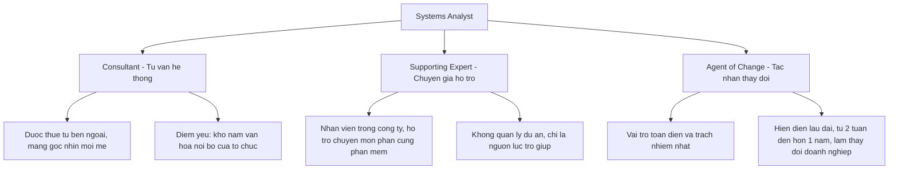
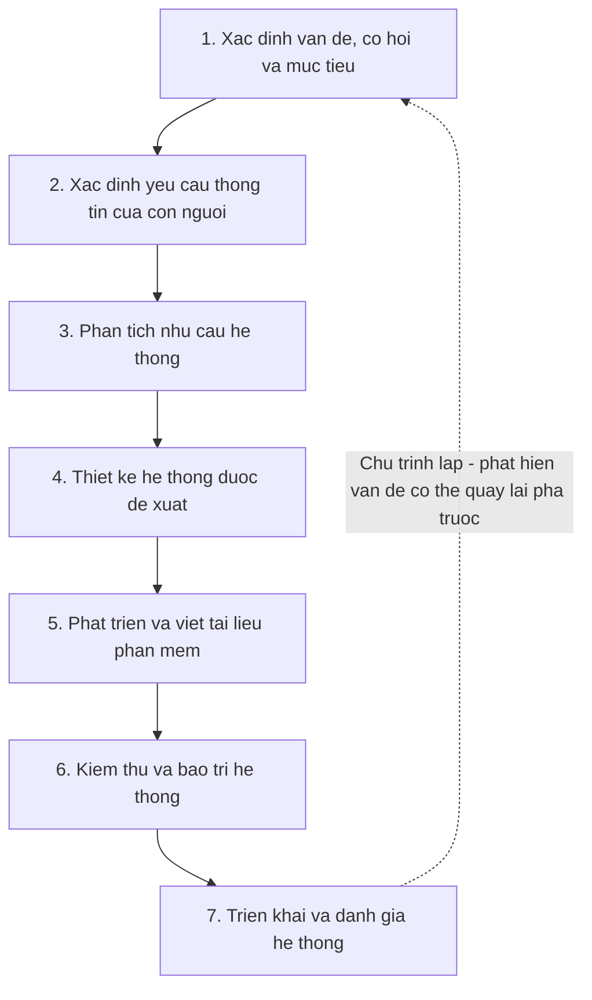
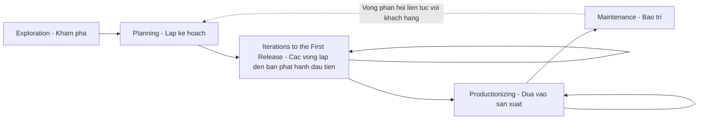
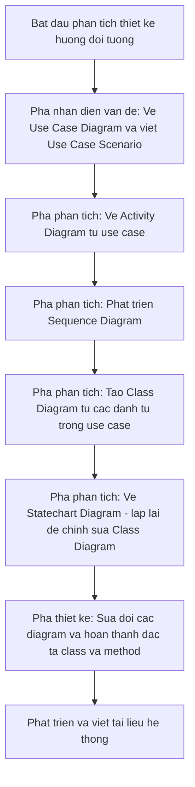
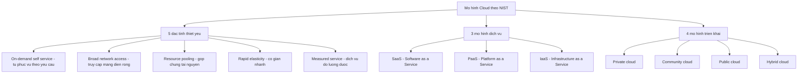
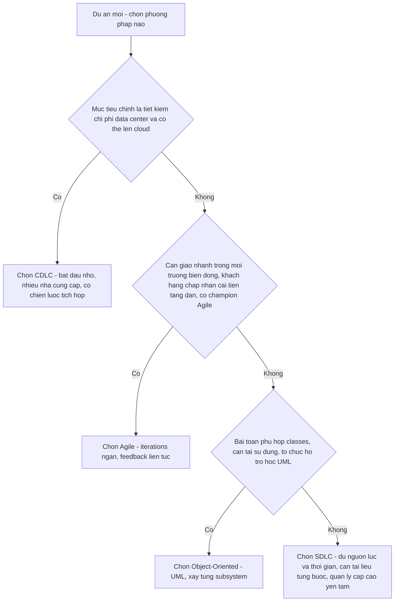

# Chương 1 — Systems, Roles, and Development Methodologies (Hệ thống, Vai trò và Các phương pháp phát triển)

> Nguồn: Kendall & Kendall, *Systems Analysis and Design*, 11th edition — Chapter 1.

---

## 🎯 Mục tiêu học tập

Sau khi học xong chương này, bạn có thể:

1. Hiểu **nhu cầu của phân tích và thiết kế hệ thống** (systems analysis and design) trong các tổ chức.
2. Nhận biết **các vai trò đa dạng của một systems analyst** (chuyên viên phân tích hệ thống).
3. Nắm vững **nền tảng của vòng đời phát triển hệ thống — SDLC** (Systems Development Life Cycle).
4. Hiểu **phương pháp Agile** trong phát triển hệ thống.
5. Có cái nhìn đúng về **thiết kế hệ thống hướng đối tượng** (Object-Oriented systems design).
6. Hiểu tầm quan trọng của **điện toán đám mây** (cloud computing) và **vòng đời phát triển đám mây — CDLC** (Cloud Development Life Cycle).
7. Biết cách **chọn phương pháp phát triển hệ thống** phù hợp cho từng dự án.
8. Khám phá **phần mềm mã nguồn mở** (open source software) là gì và được phát triển như thế nào.

---

## 📖 Tóm tắt & giải thích kiến thức

### 1. Nhu cầu của phân tích và thiết kế hệ thống (Need for Systems Analysis and Design)

**Ý tưởng nền tảng:** Thông tin (information) ngày nay là một **nguồn lực then chốt** của tổ chức, ngang hàng với con người và nguyên vật liệu. Thông tin không phải "sản phẩm phụ" của việc kinh doanh — nó là nhiên liệu vận hành kinh doanh và có thể quyết định thành bại của doanh nghiệp. Vì vậy thông tin phải được **quản lý đúng cách**: việc sản xuất, phân phối, bảo mật, lưu trữ và truy xuất thông tin đều có **chi phí** — thông tin ở khắp nơi nhưng không hề miễn phí.

**Phân tích và thiết kế hệ thống là gì?** Là quy trình mà systems analyst thực hiện để:
- Hiểu người dùng cần gì, từ đó phân tích một cách có hệ thống việc **nhập dữ liệu (input)**, **luồng dữ liệu (data flow)**, **xử lý/biến đổi dữ liệu (process)**, **lưu trữ dữ liệu (store)** và **xuất thông tin (output)** trong bối cảnh một tổ chức cụ thể.
- Xác định và giải quyết **đúng vấn đề** (the right problems) thông qua phân tích kỹ lưỡng hệ thống của khách hàng.
- Phân tích, thiết kế và triển khai các cải tiến cho hệ thống thông tin máy tính hóa.

> 💡 **Ví dụ đời thường:** Giống như xây nhà — nếu không có kiến trúc sư khảo sát nhu cầu gia đình, vẽ bản thiết kế trước, mà cứ "xây tới đâu tính tới đó" thì căn nhà sẽ vừa tốn kém vừa không ai muốn ở. Hệ thống phần mềm phát triển **không có kế hoạch** cũng vậy: gây bất mãn lớn cho người dùng và thường bị **bỏ xó không dùng** (fall into disuse).

**Bảo mật (Security) — chủ đề xuyên suốt:**
- Bảo mật là thách thức của **tất cả mọi người** tham gia phát triển hệ thống; hệ thống thông tin luôn có nhiều lỗ hổng (vulnerabilities) và **"bảo mật hoàn hảo" chỉ là ảo tưởng**.
- Tổ chức phải **đánh đổi (trade-off)**: cân giữa giá trị của dữ liệu đang lưu trữ với rủi ro bị xâm phạm (security breach).
- **Security by design / privacy by design**: thiết kế bảo mật và kiểm soát quyền riêng tư **ngay từ đầu** dự án hiệu quả hơn nhiều so với "vá" vào hệ thống cũ (legacy systems) sau này.

**Vai trò của người dùng:** Sự tham gia của người dùng (user involvement) **xuyên suốt dự án** là yếu tố sống còn. Khi các đội phát triển ngày càng quốc tế hóa, trọng tâm càng dồn về: làm việc cùng người dùng, phân tích nghiệp vụ - vấn đề - mục tiêu của họ, và truyền đạt bản phân tích/thiết kế cho mọi bên liên quan.

### 2. Các vai trò của Systems Analyst (Roles of a Systems Analyst)

**Định nghĩa:** Systems analyst là người **đánh giá một cách có hệ thống** cách người dùng tương tác với công nghệ và cách doanh nghiệp vận hành — bằng cách xem xét việc nhập, xử lý dữ liệu và xuất thông tin — với mục đích **cải tiến các quy trình của tổ chức**.

Analyst đảm nhiệm **3 vai trò chính** (đôi khi cùng lúc):

| Vai trò | Nội dung | Ưu / nhược điểm |
|---|---|---|
| **Consultant** (tư vấn viên) | Được thuê từ bên ngoài để giải quyết các vấn đề hệ thống thông tin của doanh nghiệp | ✅ Góc nhìn tươi mới mà người trong tổ chức không có. ❌ Người ngoài không bao giờ hiểu hết **văn hóa tổ chức** và các tiểu văn hóa (subcultures) — phải dựa vào người dùng để hiểu |
| **Supporting expert** (chuyên gia hỗ trợ) | Nhân viên chính thức của công ty; dùng chuyên môn về phần cứng/phần mềm để hỗ trợ | Thường chỉ là chỉnh sửa nhỏ hoặc quyết định trong phạm vi một phòng ban; **không quản lý dự án**, chỉ đóng vai trò nguồn lực |
| **Agent of change** (tác nhân thay đổi) | Vai trò **toàn diện và trách nhiệm nhất** — bất cứ khi nào analyst thực hiện các hoạt động của SDLC và hiện diện, tương tác với người dùng trong thời gian dài | Sự hiện diện của bạn tự nó đã **thay đổi doanh nghiệp**; phải tương tác với người dùng và ban quản lý ngay từ đầu — không có họ, thay đổi thực sự không thể xảy ra |

**Phẩm chất của một Systems Analyst (Qualities):**
1. **Người giải quyết vấn đề (problem solver)** — xem việc phân tích vấn đề là thử thách, thích tìm giải pháp khả thi; biết áp dụng có hệ thống công cụ, kỹ thuật và kinh nghiệm.
2. **Người giao tiếp (communicator)** — quan hệ hiệu quả với nhiều kiểu người trong thời gian dài; hiểu nhu cầu con người khi tương tác với công nghệ.
3. **Có kinh nghiệm máy tính đủ sâu** — biết lập trình, hiểu năng lực của máy tính, khai thác yêu cầu thông tin từ người dùng và truyền đạt cho lập trình viên.
4. **Đạo đức cá nhân và nghề nghiệp vững vàng** (ethics) — định hình quan hệ với khách hàng (ví dụ: không hứa hẹn tính năng không thể giao).
5. **Kỷ luật và tự tạo động lực (self-disciplined, self-motivated)** — có thể quản lý, điều phối con người và vô số nguồn lực dự án.

### 3. Vòng đời phát triển hệ thống — SDLC (The Systems Development Life Cycle)

**SDLC** là cách tiếp cận **theo pha (phased approach)** để phân tích và thiết kế, dựa trên giả định: hệ thống được phát triển tốt nhất qua một **chu trình cụ thể** các hoạt động của analyst và người dùng. Còn gọi là **waterfall method (mô hình thác nước)** — hoàn thành pha đầu rồi "chảy" xuống pha sau như nước chảy từ tảng đá này xuống tảng đá khác. Viện Quản lý Dự án (PMI) gọi đây là **predictive life cycle** (vòng đời tiên đoán) — các pha được hoạch định trước và diễn ra tuần tự.

Sách chia SDLC thành **7 pha** (Figure 1.1). Lưu ý quan trọng: dù trình bày tách bạch, các pha **không bao giờ thực hiện hoàn toàn riêng lẻ** — nhiều hoạt động diễn ra đồng thời và có thể lặp lại; phát hiện vấn đề ở pha sau có thể buộc quay lại pha trước (systems work is cyclical).

| # | Pha | Nội dung chính | Người tham gia / Sản phẩm |
|---|---|---|---|
| 1 | **Identifying problems, opportunities, and objectives** — Xác định vấn đề, cơ hội, mục tiêu | Nhìn thẳng vào những gì đang diễn ra trong doanh nghiệp; xác định **vấn đề** (thường do người khác nêu ra), **cơ hội** (tình huống analyst tin rằng có thể cải thiện bằng hệ thống máy tính hóa — giúp giành lợi thế cạnh tranh), **mục tiêu** (doanh nghiệp đang cố đạt điều gì). Pha then chốt — không ai muốn tốn thời gian giải sai vấn đề | Người dùng, analyst, systems manager. Hoạt động: phỏng vấn quản lý người dùng, tổng hợp, ước lượng phạm vi, viết tài liệu. **Output: feasibility report** (báo cáo khả thi) gồm định nghĩa vấn đề + tóm tắt mục tiêu; ban quản lý quyết định có tiếp tục hay không |
| 2 | **Determining human information requirements** — Xác định yêu cầu thông tin của con người | Hiểu người dùng cần thông tin gì để làm việc, qua: **phương pháp tương tác** (phỏng vấn, lấy mẫu và khảo sát dữ liệu cứng, bảng hỏi), **phương pháp không xâm nhập** (quan sát hành vi, môi trường làm việc), **phương pháp bao quát** (prototyping). Đặt câu hỏi HCI: hệ thống có dễ nghe, dễ đọc, an toàn, dễ dùng - dễ học - dễ nhớ, thậm chí thú vị không? Cần biết **who - what - where - when - how** của nghiệp vụ hiện tại và hỏi **why** dùng hệ thống hiện tại | Analyst + người dùng (operations managers, operations workers). Kết thúc pha: hiểu cách người dùng làm việc với máy tính, nắm đủ về con người, mục tiêu, dữ liệu và thủ tục |
| 3 | **Analyzing system needs** — Phân tích nhu cầu hệ thống | Dùng công cụ đặc thù: **data flow diagrams (DFD)** ghi lại input - process - output; **activity/sequence diagrams** thể hiện trình tự sự kiện; từ đó xây **data dictionary** (từ điển dữ liệu — liệt kê mọi mục dữ liệu và đặc tả). Phân tích **structured decisions** (quyết định có cấu trúc — điều kiện, phương án, hành động xác định được) bằng 3 công cụ: **structured English, decision tables, decision trees** | **Output: systems proposal** (đề xuất hệ thống) — tóm tắt phát hiện, phân tích **chi phí - lợi ích (cost-benefit)** các phương án, khuyến nghị nên làm gì. Mỗi bài toán là duy nhất — không bao giờ chỉ có một lời giải đúng |
| 4 | **Designing the recommended system** — Thiết kế hệ thống được đề xuất | Thiết kế **logic** của hệ thống thông tin: thủ tục nhập liệu chính xác; thiết kế form, màn hình, trang web; **thiết kế HCI/giao diện người dùng** (bàn phím, menu, GUI) cùng với người dùng; **thiết kế cơ sở dữ liệu** lưu trữ dữ liệu cho người ra quyết định; thiết kế **output** (in hoặc trên màn hình) đáp ứng nhu cầu thông tin | Analyst + người dùng cùng thiết kế |
| 5 | **Developing and documenting software** — Phát triển và viết tài liệu | Làm việc với coder để phát triển phần mềm; cùng người dùng xây dựng **tài liệu hiệu quả**: procedure manuals, online help, FAQ, Read Me. Tài liệu chỉ người dùng cách sử dụng và xử lý khi có sự cố. Coder thiết kế, viết mã, sửa lỗi cú pháp; có thể tổ chức **design/code walkthrough** để đảm bảo chất lượng | Analyst + coders + users |
| 6 | **Testing and maintaining the system** — Kiểm thử và bảo trì | Kiểm thử **trước khi bàn giao** — bắt lỗi trước rẻ hơn nhiều so với sau khi bàn giao. Test với **dữ liệu mẫu** trước, rồi **dữ liệu thật**. Test plan được lập sớm trong SDLC và tinh chỉnh dần. **Bảo trì bắt đầu từ pha này** và kéo dài suốt vòng đời hệ thống | Coder tự test một phần, analyst phối hợp test phần còn lại |
| 7 | **Implementing and evaluating the system** — Triển khai và đánh giá | **Huấn luyện người dùng** (vendor có thể dạy nhưng analyst chịu trách nhiệm giám sát); lập kế hoạch **chuyển đổi êm thấm** từ hệ cũ sang hệ mới: chuyển đổi định dạng file / xây database, lắp đặt thiết bị, đưa hệ thống vào vận hành. **Đánh giá** nằm ở pha cuối nhưng thực tế **diễn ra ở mọi pha**; tiêu chí then chốt: người dùng dự kiến **có thực sự dùng** hệ thống hay không | Analyst + users + vendors |

**Tác động của bảo trì (The Impact of Maintenance):**
- Ước tính **48% – 60%** tổng thời gian phát triển hệ thống của các phòng ban là dành cho **bảo trì** — còn rất ít thời gian cho phát triển mới. Càng viết nhiều chương trình, khối lượng bảo trì càng tăng.
- Bảo trì có **2 lý do**:
  1. **Sửa lỗi phần mềm (correct software errors):** dù test kỹ đến đâu, bug vẫn lọt vào. Với phần mềm PC thương mại, bug được ghi nhận là "known anomalies" và sửa ở phiên bản mới; với **custom software (bespoke software — phần mềm đặt làm riêng)**, bug phải sửa ngay khi phát hiện.
  2. **Nâng cấp năng lực phần mềm** theo nhu cầu tổ chức thay đổi, thường do: (a) người dùng quen hệ thống rồi **đòi thêm tính năng**; (b) **doanh nghiệp thay đổi** theo thời gian; (c) **phần cứng và phần mềm thay đổi** với tốc độ ngày càng nhanh.
- Figure 1.2 (đường cong tiêu tốn tài nguyên): sau khi cài đặt, ban đầu chỉ sửa bug hậu cài đặt → hệ thống đạt **trạng thái ổn định (steady state)** → theo thời gian, thay đổi lớn về nghiệp vụ và công nghệ khiến chi phí bảo trì **tăng vọt**. Tổng chi phí bảo trì theo thời gian thường **vượt** chi phí phát triển; đến một điểm nào đó, làm **nghiên cứu hệ thống mới** còn kinh tế hơn tiếp tục bảo trì.

**Công cụ CASE (Computer-Aided Software Engineering):**
- Là các **công cụ năng suất** hỗ trợ tự động hóa công việc thường nhật của analyst theo SDLC: **tăng năng suất, giao tiếp hiệu quả hơn với người dùng, tích hợp công việc** từ đầu đến cuối vòng đời.
- Mọi thông tin dự án lưu trong **CASE repository** (kho lưu trữ) — tập hợp lớn gồm records, elements, diagrams, screens, reports…; từ repository có thể sinh báo cáo phân tích chỉ ra chỗ thiết kế **thiếu sót hoặc lỗi**.
- Ví dụ: **Visible Analyst (VA)** là CASE tool đầy đủ (có repository, hỗ trợ hoạch định - phân tích - thiết kế đồ họa cho ứng dụng client/server và database); trong khi **Microsoft Visio** hay **OmniGraffle** chỉ là **phần mềm vẽ sơ đồ**, không phải CASE tool đúng nghĩa.
- CASE tools còn giúp khách hàng **nhìn thấy** luồng dữ liệu trên màn hình và yêu cầu chỉnh sửa nhanh; hỗ trợ mô hình hóa yêu cầu chức năng, xác định ranh giới dự án, hình dung dự án khớp với các phần khác của tổ chức thế nào.

### 4. Phương pháp Agile (The Agile Approach)

**Bối cảnh:** SDLC không phải lựa chọn duy nhất. Khi một dự án theo cách tiếp cận có cấu trúc vừa thất bại, hoặc văn hóa tổ chức phù hợp hơn với cách khác, analyst nên cân nhắc **phương án thay thế hoặc bổ sung**.

**Agile là gì?** Là phương pháp phát triển phần mềm dựa trên **values (giá trị), principles (nguyên tắc) và core practices (thực hành cốt lõi)**; là nhánh phát triển từ cách tiếp cận hướng đối tượng (OOA), bao gồm cả phương pháp phát triển (kể cả thu thập yêu cầu) lẫn công cụ phần mềm. PMI gọi Agile là **adaptive lifecycle** (vòng đời thích ứng — đối lập với predictive của SDLC). Hai từ đặc trưng cho dự án Agile: **interactive (tương tác)** và **incremental (tăng dần)**.

- **4 giá trị:** **communication (giao tiếp), simplicity (đơn giản), feedback (phản hồi), courage (can đảm)** — sách khuyên analyst áp dụng 4 giá trị này cho **mọi** dự án, không chỉ dự án Agile.
- **4 biến kiểm soát (control variables)** cần cân bằng để hoàn thành dự án: **time (thời gian), cost (chi phí), quality (chất lượng), scope (phạm vi)**.
- **4 thực hành cốt lõi:** **short releases** (phát hành ngắn), **40-hour workweek** (tuần làm việc 40 giờ), **onsite customer** (khách hàng ngồi cùng đội), **pair programming** (lập trình đôi). Nhìn qua thì "cực đoan" (extreme) nhưng chứa nhiều bài học giá trị.
- **Scrum:** một phương pháp Agile, đặt tên theo thế trận mở màn trong môn **bóng bầu dục (rugby)**. Thành công nhờ **phát hành cực nhanh**: một **sprint** kéo dài **2–4 tuần**, cuối sprint đội phải tạo ra **sản phẩm có thể phát hành được (potentially releasable product)**; mỗi vòng lặp bổ sung bộ tính năng mới. Điểm độc đáo: **thành viên tự chọn việc muốn làm theo nhóm**.

**5 giai đoạn của quy trình phát triển Agile** (Figure 1.4) — các mũi tên lặp về "Iterations" tượng trưng thay đổi tăng dần qua test và feedback lặp lại; sau khi phát hành, **nhịp độ vòng lặp còn tăng lên**; từ Maintenance có vòng phản hồi liên tục quay về Planning:

| Giai đoạn | Thời lượng | Nội dung |
|---|---|---|
| **Exploration** (khám phá) | Vài tuần (nếu đã quen đội và công nghệ) đến vài tháng (nếu mọi thứ đều mới) | Khẳng định vấn đề nên giải bằng Agile; **lập đội và đánh giá kỹ năng thành viên**; khảo sát công nghệ tiềm năng; **luyện ước lượng thời gian** cho các loại task; khách hàng tập viết **user stories** — mục tiêu là story đủ tinh để ước lượng được thời gian xây dựng. Thái độ: **tò mò, ham chơi khám phá** (playful and curious) |
| **Planning** (lập kế hoạch) | Chỉ **vài ngày** (nếu exploration làm tốt) | Cùng khách hàng chốt ngày giao giải pháp cho các vấn đề cấp bách nhất — **2 tháng đến nửa năm** kể từ hiện tại; xử lý tập story **nhỏ nhất nhưng giá trị nhất** |
| **Iterations to the first release** (các vòng lặp đến bản phát hành đầu) | Mỗi iteration ~**3 tuần** | Vòng lặp gồm test - feedback - thay đổi; phác thảo **toàn bộ kiến trúc hệ thống** dù chỉ ở dạng khung xương (skeletal); chạy **function test do khách hàng viết** cuối mỗi iteration; tự hỏi lịch trình có cần đổi hay đang ôm quá nhiều story; **ăn mừng từng iteration thành công** — văn hóa động viên là một phần của Agile |
| **Productionizing** (đưa vào sản xuất) | Feedback rút từ 3 tuần xuống **1 tuần** | **Sản phẩm được phát hành trong pha này** nhưng vẫn có thể cải tiến thêm; có thể họp **daily briefings**; phát triển hệ thống phải **vui** — hãy dành thời gian ăn mừng cùng đồng đội |
| **Maintenance** (bảo trì) | Sau phát hành | Giữ hệ thống chạy mượt; có thể thêm tính năng mới, cân nhắc đề xuất **rủi ro hơn** của khách hàng, xoay vòng thành viên. Thái độ chuyển sang **bảo thủ** — "keeper of the flame" (người giữ lửa) thay vì playful như lúc exploration |

**Planning game (trò chơi lập kế hoạch)** — do **Kent Beck** (cha đẻ Extreme Programming) đặt ra, dùng ẩn dụ trò chơi để mô tả quan hệ giữa đội phát triển Agile và khách hàng doanh nghiệp. Luật chơi không thay thế mối quan hệ mà là **nền tảng để xây dựng và duy trì quan hệ**:
- **Mục tiêu (goal):** tối đa hóa **giá trị** của hệ thống mà đội Agile tạo ra (giá trị = lợi ích trừ chi phí phát triển, thời gian, chi phí và độ bất định phải gánh).
- **Chiến lược (strategy):** luôn là **giới hạn độ bất định** (hạ thấp rủi ro): thiết kế **giải pháp đơn giản nhất có thể**, đưa vào production **sớm nhất có thể**, lấy feedback từ khách hàng về những gì chạy tốt, rồi điều chỉnh thiết kế.
- **Quân cờ (pieces):** **story cards** — mô tả ngắn gọn task, ghi chú, chỗ theo dõi tiến độ.
- **Người chơi (players):** đội phát triển và **business customer** (khách hàng doanh nghiệp). Chọn nhóm nào làm business customer không dễ vì đây là vai **đòi hỏi khắt khe khác thường**: khách hàng quyết định đội làm gì trước, đặt độ ưu tiên và kiểm tra chức năng suốt quá trình.

### 5. Phân tích và thiết kế hướng đối tượng (Object-Oriented Systems Analysis and Design)

**O-O là gì?** Cách tiếp cận nhằm hỗ trợ phát triển các hệ thống **phải thay đổi nhanh** theo môi trường kinh doanh năng động. Đặc biệt phù hợp khi hệ thống thông tin phức tạp đang trải qua **bảo trì, thích ứng và tái thiết kế liên tục**.

- Dùng chuẩn công nghiệp **UML (Unified Modeling Language)** để mô hình hóa, phân rã hệ thống thành **use case model**.
- Khác lập trình thủ tục truyền thống: O-O xem xét các **objects (đối tượng)** — mỗi object là biểu diễn máy tính của một sự vật/sự kiện thực (khách hàng, mặt hàng, đơn hàng…).
- Objects được nhóm thành **classes (lớp)** — tối ưu cho **tái sử dụng (reuse)** và **khả năng bảo trì (maintainability)**. Một class định nghĩa tập **attributes (thuộc tính)** và **behaviors (hành vi)** chung của mọi object trong lớp.

> 💡 **Ví dụ:** Mỗi chiếc ô tô cụ thể là một *object*; tất cả ô tô chia sẻ đặc điểm chung (màu, hãng, tốc độ, khả năng chạy/dừng) hợp thành *class* "Ô tô".

**Điểm giống SDLC:** Các pha trong UML tương tự SDLC; cả hai cùng đòi hỏi **mô hình hóa chặt chẽ, chính xác** nên diễn ra **chậm rãi, thận trọng hơn** nhịp độ Agile. Analyst đi qua pha **nhận diện vấn đề → phân tích → thiết kế** (Figure 1.5).

**Các bước của quy trình UML:**

1. **Define the use case model:** xác định **actors** (tác nhân) và các sự kiện chính do actor khởi phát; vẽ **use case diagram** (hình người que + mũi tên quan hệ) thể hiện luồng sự kiện chuẩn; viết **use case scenario** mô tả bằng lời các bước thường thực hiện.
2. **Pha phân tích — vẽ UML diagrams:** vẽ **activity diagrams** (mọi hoạt động chính trong use case) và **sequence diagrams** cho từng use case (trình tự hoạt động và thời điểm) — đây là dịp xem lại và chỉnh sửa use case nếu cần.
3. **Phát triển class diagrams:** các **danh từ** trong use case là những object tiềm năng, được nhóm thành class.
4. **Vẽ statechart diagrams:** từ class diagram, giúp hiểu các **quy trình phức tạp** mà sequence diagram không diễn tả hết; rất hữu ích để chỉnh sửa class diagram — quá trình mô hình hóa UML mang tính **lặp (iterative)**.
5. **Thiết kế hệ thống:** sửa đổi các diagram đã vẽ; suy ra class với attributes và **methods** (method đơn giản là các operation); viết **class specifications** và **method specifications** (yêu cầu input/output + mô tả chi tiết xử lý bên trong).
6. **Phát triển và viết tài liệu hệ thống:** UML chỉ là ngôn ngữ **mô hình hóa** — mô hình đẹp mấy mà không xây hệ thống thì vô nghĩa. Tài liệu càng đầy đủ, phát triển càng nhanh và sản phẩm cuối càng vững.

**Spiral model:** Phương pháp O-O thường tập trung vào các **vòng lặp nhỏ, nhanh** — phân tích một phần nhỏ của hệ thống (thường bắt đầu từ hạng mục **ưu tiên cao nhất** hoặc **rủi ro lớn nhất**), rồi thiết kế, triển khai; lặp lại chu trình với phần kế tiếp cho đến khi xong. Việc **vẽ lại diagram và làm lại component nhiều lần là bình thường**.

### 6. Điện toán đám mây và CDLC (Cloud Development Life Cycle)

**Cloud computing là gì?** Loại hình điện toán **tăng trưởng nhanh nhất**; là "ẩn dụ cho internet" (vì internet thường được vẽ như đám mây trong sơ đồ mạng). Tổ chức/cá nhân dùng **web services, database services, application services** qua internet **mà không phải đầu tư** phần cứng, phần mềm hay công cụ riêng; truy cập ứng dụng qua trình duyệt (Chrome, Firefox); server lưu phần mềm và dữ liệu. Các "ông lớn" như Cisco, Dell, IBM, HP, Microsoft, SAP, AWS xây dựng hạ tầng cloud khổng lồ với **virtualized resources** (tài nguyên ảo hóa); điểm nổi bật là khả năng **scale (co giãn)** theo nhu cầu thay đổi. Mô hình **SaaS** nằm trong khái niệm cloud computing.

**Lợi ích chính:**
- Người dùng **không cần hiểu hay kiểm soát** hạ tầng công nghệ phức tạp bên dưới; tổ chức không cần giữ đội IT chỉ để scale hệ thống lên/xuống.
- **Không cần chi vốn đầu tư ban đầu (up-front capital expenditures)** cho hạ tầng IT → công ty nhỏ, ngân sách khó đoán vẫn tiến nhanh; công ty lớn dồn vốn cho **dự án chiến lược** thay vì hạ tầng.
- **Chia sẻ tài nguyên IT** → cùng gánh chi phí thấp hơn, tăng năng lực chịu tải đỉnh (peak-load capacity), tận dụng hiệu quả hệ thống nhàn rỗi.
- **Khôi phục sau thảm họa (disaster recovery)** tốt hơn nhờ nhiều site dự phòng — cloud không miễn nhiễm sự cố nhưng **phân tán rủi ro** ra nhiều server.
- **Tính di động (mobility):** người dùng thoát khỏi một máy/một giao diện cố định — truy cập ứng dụng **mọi lúc, mọi nơi, mọi thiết bị**.

**Đánh đổi (trade-offs):**
- **Quyền riêng tư và bảo mật** là rào cản chính khiến tổ chức ngần ngại; giải pháp gồm **fix công nghệ** (phần cứng/phần mềm) hoặc **phản ứng quản trị** (đào tạo nhân viên, đưa bảo mật cloud thành ưu tiên chiến lược).
- Tập trung hóa có thể đồng nghĩa **mất kiểm soát dữ liệu trọng yếu (mission-critical data)**; đôi khi chính phòng IT nội bộ cản trở việc lên cloud vì **bản năng tự bảo tồn** chứ không dựa trên đánh giá rủi ro thực.
- Lựa chọn lớn: **public cloud** (nhà cung cấp ngoài) vs **private cloud** (nội bộ — tập trung hóa data center của tổ chức thành dịch vụ cloud riêng) vs **hybrid** (dữ liệu trọng yếu, gắn mục tiêu chiến lược và sở hữu trí tuệ → private; dữ liệu ít quan trọng → public).
- Đóng góp lớn của analyst: **cân rủi ro bảo mật với giá trị dữ liệu**; ví dụ đánh giá **kế hoạch disaster recovery** của nhà cung cấp cloud đang xử lý dữ liệu trọng yếu.

**5 câu hỏi đánh giá nhà cung cấp cloud (Factors in Choosing a Cloud Provider):**
1. Nếu một khách hàng của nhà cung cấp bị hack, các doanh nghiệp khác đang được host **bị ảnh hưởng** thế nào?
2. Làm sao chắc chắn dữ liệu được **xóa hoàn toàn** khi hệ thống cloud bị ngưng sử dụng (decommissioned)?
3. Kiến trúc dữ liệu có **chuẩn và minh bạch** để khách hàng **đổi nhà cung cấp** được nếu lo ngại chi phí/bảo mật?
4. Có quá nhiều **thực hành phi chuẩn và cấu trúc lập trình độc quyền** khiến việc chuyển dữ liệu ra ngoài bất khả thi không?
5. Làm sao chắc chắn **không ai** ở phía nhà cung cấp (hoặc nhân viên phục vụ khách khác) truy cập được dữ liệu của tổ chức mình?

Ngoài ra: luật về quyền riêng tư dữ liệu **khác nhau theo quốc gia/khu vực tài phán** (EU vs Mỹ...) → cần biết nhà cung cấp **đặt ở đâu** và có tuân thủ luật nơi người dùng không.

**ERP và cloud:** Nhiều thách thức khi triển khai **ERP (Enterprise Resource Planning)** truyền thống có thể được giảm nhẹ nhờ ERP cloud giá thấp: không phải mua IT đắt đỏ; **vendor lo cài đặt phiên bản mới và nâng cấp**; đổi module ít cồng kềnh hơn. Ví dụ: **Workday** (SaaS cho tổ chức tầm trung - lớn; giá thấp, dễ nâng cấp, giảm chi phí lưu trữ, IT "xanh" hơn, **giá thuê bao dự đoán được** — giải quyết các vấn đề kinh niên của ERP legacy: chi phí on-premises khó đoán, giải pháp chắp vá, mức dịch vụ thất thường); **NetSuite** (Oracle mua 2016; kế toán, quản lý tồn kho thời gian thực, CRM, ecommerce cho SME; nhấn mạnh giảm chi phí IT và truy cập mọi lúc mọi nơi).

**Mô hình cloud theo NIST** (Viện Tiêu chuẩn và Công nghệ Quốc gia Mỹ — Mell & Grance, 2011):

**CDLC — Cloud Development Life Cycle:** cũng là **predictive life cycle** như SDLC, gồm **6 pha**: **data gathering (thu thập dữ liệu) → development (phát triển) → launch (ra mắt) → continuing operations (vận hành liên tục) → optimization (tối ưu hóa) → improvement (cải tiến)**.

**Khác biệt SDLC vs CDLC:**
| Khía cạnh | SDLC | CDLC |
|---|---|---|
| Thời điểm quyết định phần cứng | Muộn hơn trong quy trình | **Sớm hơn** — thay đổi này có thể đẩy người ra quyết định chọn cloud sớm |
| Kiểm thử | Test triển khai sau khi cài đặt phần cứng/phần mềm | **Pentesting** (penetration testing — mô phỏng tấn công mạng) trên server phát triển với **chi phí rẻ** |
| Cộng tác | Trong đội của tổ chức | Cộng tác với **hệ sinh thái phát triển** — developer tiếp cận dữ liệu, tốn ít thời gian cho các task phụ như chạy nhiều loại system test |
| Tốc độ | Chậm hơn | **Nhanh hơn** — thời gian triển khai giảm khi hạ tầng do nhà cung cấp cloud quản lý thay vì đội nội bộ; tích hợp với dịch vụ cloud (như AWS) giúp **scale nhanh toàn tổ chức** và kết nối nhanh với vendor phần mềm ngoài |

**5 cân nhắc chiến lược khi triển khai hệ thống cloud** (theo Elman 2020; Hill 2019):
1. Chọn cloud nếu **lý do chủ đạo** của dự án là **tiết kiệm tiền** vốn chi cho data center on-premises, bảo trì và nhân sự hỗ trợ.
2. **Bắt đầu nhỏ**, xây dựng dần để có thể mở rộng về sau.
3. Chọn **nhiều nhà cung cấp cloud** để tránh bị khóa chặt vào một vendor (vendor lock-in).
4. **Giám sát các thay đổi** do cloud tạo ra chặt chẽ như với mọi dự án chuyển đổi IT khác — bảo đảm khả năng nhìn thấy (visibility) ứng dụng và dữ liệu từ nhiều hệ thống.
5. Xây **chiến lược tích hợp** — tận dụng tối đa hệ sinh thái hybrid: synergy mới, quan hệ mới, cơ hội phát triển nhanh mà cloud mang lại.

### 7. Chọn phương pháp phát triển nào (Choosing Which Systems Development Method to Use)

**Điểm chung của cả 4 cách tiếp cận** (khác biệt không lớn như vẻ ngoài): đều phải **hiểu tổ chức trước** → **lập ngân sách thời gian, nguồn lực và đề xuất dự án** → **phỏng vấn thành viên tổ chức, thu thập dữ liệu chi tiết** bằng bảng hỏi, lấy mẫu báo cáo hiện có và quan sát nghiệp vụ. Về phương pháp: SDLC và O-O đều đòi hỏi **hoạch định và vẽ sơ đồ kỹ lưỡng**; Agile và O-O đều cho phép **xây từng subsystem một** đến khi hoàn chỉnh; Agile, SDLC và CDLC đều quan tâm cách **dữ liệu di chuyển logic** qua hệ thống.

**Bảng hướng dẫn chọn phương pháp** (Figure 1.7 — "Choose when..."):

| Phương pháp | Chọn khi... |
|---|---|
| **SDLC** | • Hệ thống đã được phát triển và viết tài liệu bằng SDLC • Việc **ghi chép tài liệu từng bước** là quan trọng • Việc truyền đạt cách hệ thống mới hoạt động là quan trọng • Quản lý cấp cao thấy **thoải mái/an toàn** hơn với SDLC • Có **đủ nguồn lực và thời gian** để hoàn thành trọn vẹn SDLC |
| **Agile** | • Khách hàng hài lòng với **cải tiến tăng dần** • Ứng dụng cần phát triển **nhanh** đáp ứng môi trường năng động • Có **project champion** (người nhiệt thành bảo trợ) cho Agile trong tổ chức • Cần **"giải cứu"** — hệ thống trước đã thất bại và không có thời gian tìm hiểu vì sao • Lãnh đạo và analyst **đồng thuận** với nguyên tắc Agile |
| **Object-Oriented** | • Vấn đề mô hình hóa **phù hợp với classes** • Tổ chức hỗ trợ việc **học UML** • Hệ thống có thể **bổ sung dần từng subsystem** • Có khả năng **tái sử dụng** phần mềm đã viết • Chấp nhận **xử lý các vấn đề khó trước** |
| **CDLC** | • Lý do dự án là **tiết kiệm chi phí** data center on-premises • Dự án có thể **bắt đầu nhỏ và xây dần** • Dùng được **nhiều nhà cung cấp cloud** • Giám sát được thay đổi do cloud để bảo đảm visibility của app và dữ liệu từ nhiều hệ thống • Xây dựng được **chiến lược tích hợp** tận dụng synergy mới |

**Bảng so sánh tổng hợp 4 phương pháp:**

| Tiêu chí | SDLC | Agile | Object-Oriented | CDLC |
|---|---|---|---|---|
| Kiểu vòng đời (theo PMI) | Predictive (tiên đoán) | Adaptive (thích ứng) | Lặp kiểu spiral | Predictive |
| Nhịp độ | Tuần tự, thận trọng | Rất nhanh, lặp ngắn 1–4 tuần | Chậm rãi, mô hình hóa chặt chẽ | Nhanh hơn SDLC nhờ hạ tầng cloud |
| Đơn vị công việc | 7 pha tuần tự | 5 giai đoạn + iterations, user stories | Use case, class, các UML diagram | 6 pha |
| Tài liệu | Rất chú trọng, từng bước | Tối thiểu, ưu tiên giao tiếp | Chú trọng — model + specification | Theo pha |
| Điểm mạnh | Có tổ chức, dễ kiểm soát, quản lý yên tâm | Tốc độ, phản hồi khách hàng liên tục | Tái sử dụng, chịu thay đổi liên tục | Tiết kiệm vốn, scale nhanh, test rẻ |
| Phù hợp khi | Đủ thời gian, nguồn lực, cần tài liệu | Môi trường năng động, cần nhanh, có champion | Bài toán phù hợp class, cần reuse | Muốn bỏ data center on-premises |

### 8. Phát triển phần mềm mã nguồn mở (Developing Open Source Software)

**OSS là gì?** Đối lập với phát triển truyền thống nơi **mã độc quyền (proprietary code) bị giấu kín** với người dùng, **open source software (OSS)** cho phép nhiều người dùng và coder **xem, chia sẻ và sửa đổi mã**. Luật của cộng đồng: mọi sửa đổi chương trình **phải được chia sẻ** với tất cả thành viên dự án, và **phải tuân thủ mọi license**. OSS được tạo ra theo cách **cộng tác** — mỗi người tham gia đều đóng góp và mọi người đóng góp đều hưởng lợi; đó là **quy trình và sản phẩm mang tính cộng đồng (communal)**. OSS còn được mô tả như một **triết lý** chứ không chỉ là quy trình tạo phần mềm — nhiều cộng đồng xem nó là cách giúp xã hội thay đổi; tuy nhiên sẽ là đơn giản hóa quá mức nếu coi OSS là một phong trào thuần nhất (monolithic).

**Ví dụ nổi tiếng:** Android (hệ điều hành nguồn mở trên điện thoại), **Apache** (web server), **Mozilla Firefox** (trình duyệt), **Linux** (hệ điều hành tự do kiểu Unix). Các công nghệ nguồn mở đang lên: blockchain, cybersecurity, IoT, cloud computing, big data analytics.

**Phong trào nguồn mở (The Open Source Movement):**
- Các nhà nghiên cứu phân loại cộng đồng nguồn mở thành **4 kiểu**: **ad hoc, standardized (chuẩn hóa), organized (có tổ chức), commercial (thương mại)** — theo **6 chiều**: general structure (cấu trúc chung), environment (môi trường), goals (mục tiêu), methods (phương pháp), user community (cộng đồng người dùng), licensing (cấp phép). OSS đang ở "ngã ba đường": nhóm thương mại và nhóm cộng đồng cần hiểu điểm hội tụ và nguy cơ xung đột.
- Các quỹ phi lợi nhuận lớn: **The Apache Foundation** (do nhóm phát triển Apache HTTP server lập ra) và **The Linux Foundation** (thúc đẩy cải tiến kỹ thuật của Linux, giáo dục và cộng tác quanh việc phát triển **Linux kernel**; host **hơn 500 dự án** nguồn mở; giúp dự án về hình thành, quản trị, cộng tác).
- **GitHub** (Microsoft mua 2018): nền tảng phát triển phần mềm để lưu trữ, theo dõi công việc và cộng tác trên dự án nguồn mở; đồng thời là **mạng xã hội** cho developer kết nối, cộng tác, thậm chí chào bán dự án mới. GitHub dùng **Git** — phần mềm **quản lý phiên bản (version control)** nguồn mở được dùng nhiều nhất, quan trọng nhất trong việc theo dõi các phiên bản mã nguồn.

**The Third Design Space (Không gian thiết kế thứ ba):**
- Trước đây, doanh nghiệp chỉ lo phát triển **phần mềm độc quyền** (mã được canh giữ cẩn mật để giữ lợi thế cạnh tranh), còn cộng đồng nguồn mở lo cải tiến mã và xây cộng đồng.
- Nhóm nghiên cứu của tác giả (Kendall, Kendall, Germonprez & Mathiassen, 2020) đặt tên cho sự **cộng tác mới giữa developer doanh nghiệp và cộng đồng developer** là **Third Design Space** — một không gian **ẩn dụ**, không phải vật lý.
- Trong không gian này, các bên cùng tạo môi trường thiết kế mới, hình thành **liên kết thiết kế mới** và **luân chuyển tài nguyên thiết kế chung**; kết quả là phần mềm chia sẻ mới và quy trình phát triển sáng tạo; developer mang tính chất **vừa doanh nghiệp vừa cộng đồng**. Những đổi mới phần mềm ở đây **không thể có** trong môi trường thuần thương mại hay thuần cộng đồng độc lập.

**Lợi ích khi doanh nghiệp tham gia OSS** — nghiên cứu bằng **lý thuyết trò chơi (game theory)** (Kendall, Kendall & Germonprez, 2016) xác định **6 lý do lý trí (rational)** và **6 lý do cảm xúc (emotional)** khiến doanh nghiệp vì lợi nhuận tham gia phát triển OSS (Figure 1.8):

| 6 lý do lý trí (Rational) | 6 lý do cảm xúc (Emotional) |
|---|---|
| Tiết kiệm tiền (saving money) | Chấp nhận trách nhiệm (accepting responsibility) |
| Giảm khối lượng bảo trì (performing less maintenance) | Cải thiện phần mềm chung (improving shared software) |
| Đóng góp trong giới hạn (contributing within limits) | Gia tăng ảnh hưởng trong cộng đồng (gaining community influence) |
| Giảm chi phí dài hạn (reducing long-term costs) | Từ bỏ vai trò "người gác cổng" (relinquishing the gatekeeper role) |
| Tăng lợi ích marketing (increasing marketing benefits) | Nâng cao kỹ năng developer (improving developers' skills) |
| Đi trước đối thủ (making the first move) | Kéo dài tuổi thọ dự án (extending the life of projects) |

**Cấp phép và tuân thủ (Licensing and Compliance):**
- Licensing là **yếu tố then chốt** của mọi OSS. Các license phổ biến: **Apache License 2.0, GNU General Public License (GPL), Common Development and Distribution License, Mozilla Public License 2.0**. License là sản phẩm của **đồng thuận cộng đồng** — cộng đồng khác nhau dùng license khác nhau; mọi license phải qua **quy trình review** trước khi được chấp nhận. Phải chọn license phù hợp với dự án; phía người dùng phải **nhận diện license đang dùng** để báo cáo và bảo đảm tuân thủ.
- **SPDX** (Software Package Data Exchange) — working group do The Linux Foundation bảo trợ, chuẩn hóa việc nhận diện license.
- **FOSSology** (một dự án của Linux Foundation): hệ thống + toolkit nguồn mở **quét license, copyright và export control** từ dòng lệnh; có compliance workflow; sinh file SPDX hoặc ReadMe kèm copyright chỉ với **một cú click**; quét cả bản phân phối nguồn mở, tự động submit phiên bản mới và **chỉ quét lại file đã thay đổi** — tiết kiệm rất nhiều thời gian với dự án lớn.
- Với cá nhân: kinh nghiệm nguồn mở là kỹ năng đáng ghi vào **CV** — hơn **90%** hiring manager gặp tình trạng thiếu nhân tài nguồn mở; nhiều nơi tìm ứng viên có **chứng chỉ nguồn mở** và hơn **85%** sẵn sàng hỗ trợ nhân viên lấy chứng chỉ. Cách tham gia: đăng ký **GitHub**, đăng ký các dự án trên site **Linux Foundation**, hoặc tham gia nhóm nguồn mở ngay tại công ty mình.

**Vai trò của analyst trong OSS:**
- Analyst có thể được **công ty chủ quản** cử tham gia một cộng đồng nguồn mở. Hơn **75%** tổ chức được khảo sát cho biết họ phụ thuộc vào OSS năm 2022 nhiều hơn năm trước → **thiếu hụt developer nguồn mở**. Cộng đồng nổi tiếng: Linux kernel (cộng đồng ảo lớn, thành viên có mức độ và lý do tham gia khác nhau), Mozilla Firefox, Android, Apache, thậm chí cả **NASA**.
- **2 lý do công ty cử analyst tham gia:**
  1. **Tò mò về lợi ích** phần mềm nguồn mở có thể mang lại — thường do **hiệu ứng bầy đàn (bandwagon effect)**: biết đối thủ đã tham gia thì mình ít nhất cũng phải điều tra nghiêm túc chứ không gạt bỏ.
  2. Đạt được **"responsive design" (thiết kế đápi ứng theo cộng đồng)**: vừa tham gia cộng đồng nguồn mở, vừa làm cho tổ chức muốn **tận dụng sự tham gia đó** để đưa các thiết kế OSS vào sản phẩm, quy trình, tri thức và IT artifact **độc quyền** mà tổ chức đang phát triển và hy vọng bán ra như sản phẩm **khác biệt** với thứ cộng đồng tạo ra. Qua responsive design, IT artifact được thấm nhuần cấu trúc, tri thức và thực hành của **cả cộng đồng lẫn tổ chức**.

---

## 🔑 Bảng thuật ngữ (Keywords and Phrases)

| Thuật ngữ tiếng Anh | Nghĩa tiếng Việt |
|---|---|
| adaptive lifecycle | vòng đời thích ứng (cách PMI gọi Agile — kế hoạch điều chỉnh liên tục theo phản hồi) |
| agent of change | tác nhân thay đổi (vai trò toàn diện nhất của systems analyst) |
| agile approach | phương pháp Agile (phát triển dựa trên giá trị, nguyên tắc, thực hành cốt lõi; lặp nhanh, tăng dần) |
| bespoke software | phần mềm đặt làm riêng (custom software — bug phải sửa ngay khi phát hiện) |
| cloud computing | điện toán đám mây (dùng dịch vụ web, database, ứng dụng qua internet, không cần tự đầu tư hạ tầng) |
| computer-assisted software engineering (CASE) | công cụ kỹ nghệ phần mềm có máy tính hỗ trợ (tăng năng suất cho analyst theo SDLC) |
| enterprise resource planning (ERP) system | hệ thống hoạch định nguồn lực doanh nghiệp |
| exploration phase | giai đoạn khám phá (giai đoạn đầu của Agile: lập đội, khảo sát công nghệ, viết user stories) |
| human–computer interaction (HCI) | tương tác người–máy |
| iterations to the first release phase | giai đoạn các vòng lặp đến bản phát hành đầu tiên (mỗi iteration ~3 tuần) |
| Linux kernel | nhân Linux (dự án nguồn mở với cộng đồng ảo lớn) |
| maintenance phase | giai đoạn bảo trì |
| object-oriented (O-O) systems analysis and design | phân tích và thiết kế hệ thống hướng đối tượng |
| open source communities | các cộng đồng nguồn mở (4 kiểu: ad hoc, standardized, organized, commercial) |
| open source software (OSS) | phần mềm mã nguồn mở (mã công khai để xem, sửa, phân phối) |
| planning game | trò chơi lập kế hoạch (do Kent Beck đề xuất — luật hợp tác giữa đội Agile và khách hàng) |
| planning phase | giai đoạn lập kế hoạch (của Agile — chỉ vài ngày) |
| predictive lifecycle | vòng đời tiên đoán (cách PMI gọi SDLC/CDLC — các pha hoạch định trước, tuần tự) |
| private cloud | đám mây riêng (dịch vụ cloud cấu hình riêng, nội bộ tổ chức) |
| productionizing phase | giai đoạn đưa vào sản xuất (Agile — phát hành sản phẩm, feedback rút còn 1 tuần) |
| prototyping | làm bản mẫu (phương pháp "bao quát" để thu thập yêu cầu; ghép cặp với Agile ở Chương 6) |
| public cloud | đám mây công cộng (dịch vụ cloud của nhà cung cấp bên ngoài) |
| Scrum | phương pháp Agile đặt tên theo thế trận rugby; sprint 2–4 tuần, cuối sprint có sản phẩm phát hành được |
| security | bảo mật (phải được thiết kế ngay từ đầu — security by design) |
| stakeholder | bên liên quan (người dùng, analyst, systems manager... trong dự án) |
| systems analysis and design | phân tích và thiết kế hệ thống |
| systems analyst | chuyên viên phân tích hệ thống |
| systems consultant | tư vấn viên hệ thống (analyst được thuê từ bên ngoài) |
| systems development life cycle (SDLC) | vòng đời phát triển hệ thống (7 pha, kiểu thác nước) |
| Third Design Space | Không gian thiết kế thứ ba (không gian ẩn dụ nơi doanh nghiệp và cộng đồng nguồn mở cộng tác) |
| unified modeling language (UML) | ngôn ngữ mô hình hóa thống nhất (chuẩn công nghiệp để mô hình hóa hệ thống O-O) |

---

## ❓ Trả lời Review Questions

**1. List the advantages of using systems analysis and design techniques...** *(Lợi ích của kỹ thuật phân tích & thiết kế hệ thống với hệ thống thông tin doanh nghiệp?)*

- Đem lại **cấu trúc** cho việc phân tích và thiết kế hệ thống thông tin — một công việc tốn kém mà nếu không sẽ được làm **tùy tiện (haphazard)**.
- Là **chuỗi quy trình có hệ thống** nhằm cải thiện doanh nghiệp thông qua hệ thống thông tin máy tính hóa.
- Giúp **xác định và giải đúng vấn đề** nhờ phân tích kỹ lưỡng hệ thống của khách hàng: phân tích luồng nhập, xử lý, lưu trữ dữ liệu và xuất thông tin trong bối cảnh tổ chức cụ thể.
- Tránh hậu quả của phát triển thiếu kế hoạch: **người dùng bất mãn** và hệ thống **bị bỏ xó không dùng**.
- Bảo đảm **sự tham gia của người dùng xuyên suốt** dự án — yếu tố sống còn cho thành công; hỗ trợ người dùng làm việc với công nghệ trong môi trường tổ chức.

**2. Why is security of information systems an important consideration...?** *(Vì sao bảo mật là cân nhắc quan trọng trong phát triển hệ thống?)*

- Bảo mật là **thiết yếu cho sự vận hành** của hệ thống thông tin tổ chức và là thách thức của mọi người tham gia phát triển.
- Hệ thống thông tin có **nhiều lỗ hổng (vulnerabilities)** và **bảo mật hoàn hảo là ảo tưởng** — tổ chức phải đánh đổi: cân **giá trị dữ liệu lưu trữ** với **rủi ro bị xâm phạm**.
- Thiết kế **bảo mật và quyền riêng tư ngay từ đầu** (security/privacy by design) hiệu quả và đáng mong muốn hơn nhiều so với bổ sung vào hệ thống legacy cũ; khi nâng cấp hệ thống cũ cũng phải rà soát lỗ hổng và cải thiện đào tạo về bảo mật.

**3. List three roles that a systems analyst is called upon to play. Provide a definition for each.** *(3 vai trò của systems analyst + định nghĩa.)*

1. **Consultant (tư vấn viên):** được thuê từ bên ngoài để giải quyết các vấn đề hệ thống thông tin trong doanh nghiệp; ưu thế là góc nhìn tươi mới, nhược điểm là không nắm được văn hóa tổ chức thực sự.
2. **Supporting expert (chuyên gia hỗ trợ):** nhân viên chính thức của tổ chức, sử dụng chuyên môn về phần cứng/phần mềm và ứng dụng của chúng trong doanh nghiệp; thường chỉ là sửa đổi nhỏ hoặc quyết định phạm vi một phòng ban; không quản lý dự án mà là **nguồn lực** cho người quản lý.
3. **Agent of change (tác nhân thay đổi):** vai trò toàn diện và trách nhiệm nhất, cả nội bộ lẫn bên ngoài; analyst là tác nhân thay đổi mỗi khi thực hiện hoạt động nào đó của SDLC và hiện diện, tương tác với người dùng và doanh nghiệp trong thời gian dài (2 tuần đến hơn 1 năm); sự hiện diện của analyst tự nó làm thay đổi doanh nghiệp.

**4. What personal qualities are helpful to a systems analyst? List them.** *(Phẩm chất cá nhân hữu ích cho analyst?)*

- Là **người giải quyết vấn đề** — xem vấn đề là thử thách, thích tìm giải pháp khả thi, tiếp cận tình huống một cách có hệ thống bằng công cụ, kỹ thuật, kinh nghiệm.
- Là **người giao tiếp giỏi** — quan hệ hiệu quả với nhiều kiểu người trong thời gian dài.
- Hiểu **nhu cầu của con người** khi tương tác với công nghệ; đủ **kinh nghiệm máy tính** để lập trình, hiểu năng lực máy tính, khai thác yêu cầu từ người dùng, truyền đạt cho coder.
- Có **đạo đức cá nhân và nghề nghiệp** vững vàng để định hình quan hệ khách hàng.
- **Kỷ luật tự giác, tự tạo động lực**; có khả năng quản lý và điều phối con người cùng vô số nguồn lực dự án.

**5. List and briefly define the seven phases of the SDLC.** *(7 pha của SDLC.)*

1. **Identifying problems, opportunities, and objectives** — xác định vấn đề, cơ hội, mục tiêu; output là feasibility report; quyết định dự án có tiếp tục không.
2. **Determining human information requirements** — xác định nhu cầu thông tin của người dùng bằng phỏng vấn, bảng hỏi, quan sát, prototyping; hiểu who-what-where-when-how-why của nghiệp vụ.
3. **Analyzing system needs** — phân tích nhu cầu hệ thống bằng DFD, data dictionary, structured English, decision tables, decision trees; output là systems proposal với phân tích chi phí–lợi ích.
4. **Designing the recommended system** — thiết kế logic: thủ tục nhập liệu, giao diện người dùng (HCI), cơ sở dữ liệu, output.
5. **Developing and documenting software** — cùng coder phát triển phần mềm; cùng người dùng viết tài liệu (manual, online help, FAQ); coder viết mã, sửa lỗi, walkthrough.
6. **Testing and maintaining the system** — kiểm thử với dữ liệu mẫu rồi dữ liệu thật trước khi bàn giao; bảo trì bắt đầu và kéo dài suốt vòng đời.
7. **Implementing and evaluating the system** — huấn luyện người dùng, chuyển đổi từ hệ cũ sang hệ mới, đưa vào vận hành; đánh giá (thực chất diễn ra ở mọi pha) — tiêu chí then chốt là người dùng có thực sự dùng hệ thống.

**6. What are CASE tools used for?** *(CASE tools dùng để làm gì?)*

CASE (computer-aided software engineering) tools là công cụ năng suất tự động hóa công việc thường nhật của analyst, dùng để: **tăng năng suất**, **giao tiếp hiệu quả hơn với người dùng** (khách hàng nhìn thấy luồng dữ liệu trên màn hình và yêu cầu chỉnh sửa nhanh), và **tích hợp công việc từ đầu đến cuối vòng đời**. Thông tin dự án lưu trong **CASE repository** — từ đó sinh báo cáo chỉ ra thiết kế thiếu/lỗi. CASE tools còn hỗ trợ mô hình hóa yêu cầu chức năng, xác định ranh giới dự án và hình dung dự án khớp với các phần khác của tổ chức. Ví dụ CASE tool đầy đủ: Visible Analyst (Visio, OmniGraffle chỉ là công cụ vẽ sơ đồ).

**7. Explain what is meant by the agile approach.** *(Giải thích phương pháp Agile.)*

Agile là **phương pháp phát triển phần mềm dựa trên values, principles và core practices**, phát triển từ cách tiếp cận hướng đối tượng; PMI gọi là **adaptive lifecycle**. 4 giá trị: **communication, simplicity, feedback, courage**. Dự án Agile mang tính **interactive và incremental**; cân bằng 4 biến kiểm soát **time, cost, quality, scope**; áp dụng 4 thực hành cốt lõi (short releases, 40-hour workweek, onsite customer, pair programming); tiến hành qua 5 giai đoạn: exploration, planning, iterations to the first release, productionizing, maintenance. Hệ thống theo Agile được **phát triển nhanh** nhờ vòng lặp ngắn với phản hồi khách hàng liên tục.

**8. What is the meaning of the phrase planning game?** *(Planning game nghĩa là gì?)*

Là cách **Kent Beck** (cha đẻ Extreme Programming) mô tả toàn bộ quá trình lập kế hoạch Agile theo ẩn dụ trò chơi: đặt ra **luật** giúp định hình quan hệ giữa đội phát triển và khách hàng doanh nghiệp (luật không thay thế quan hệ mà là nền tảng xây dựng và duy trì quan hệ). **Goal:** tối đa hóa giá trị của hệ thống (giá trị = trừ đi chi phí phát triển, thời gian, chi phí, độ bất định). **Strategy:** giới hạn độ bất định — thiết kế giải pháp đơn giản nhất, đưa vào production sớm nhất, lấy feedback và điều chỉnh. **Pieces:** story cards mô tả task. **Players:** đội phát triển và business customer — khách hàng quyết định làm gì trước, đặt ưu tiên, kiểm tra chức năng.

**9. What are the stages in agile development?** *(Các giai đoạn của phát triển Agile?)*

5 giai đoạn: **(1) Exploration** — khám phá môi trường, lập đội, khảo sát công nghệ, khách hàng viết user stories; **(2) Planning** — vài ngày, chốt ngày giao (2 tháng đến nửa năm) cho tập story giá trị nhất; **(3) Iterations to the first release** — các vòng lặp ~3 tuần gồm test, feedback, thay đổi; phác thảo kiến trúc tổng thể; chạy function test của khách hàng cuối mỗi iteration; **(4) Productionizing** — phát hành sản phẩm, feedback rút còn 1 tuần, có thể họp daily briefings; **(5) Maintenance** — giữ hệ thống chạy mượt, thêm tính năng, thái độ chuyển sang bảo thủ ("keeper of the flame").

**10. What is Scrum?** *(Scrum là gì?)*

Scrum là một **phương pháp Agile**, đặt tên theo thế trận mở màn trong môn **rugby**. Thành công của Scrum nằm ở các **bản phát hành cực nhanh**: chu kỳ **sprint** kéo dài **2–4 tuần**; cuối sprint, đội phát triển phải tạo ra **sản phẩm có khả năng phát hành (potentially releasable product)** — nghĩa là ứng dụng/website thay đổi liên tục, mỗi vòng lặp có bộ tính năng mới. Điểm độc đáo: **các thành viên tự chọn công việc muốn làm theo nhóm**.

**11. Define the term object-oriented analysis and design.** *(Định nghĩa phân tích thiết kế hướng đối tượng.)*

Là cách tiếp cận phân tích - thiết kế nhằm **hỗ trợ phát triển các hệ thống phải thay đổi nhanh** theo môi trường kinh doanh năng động; đặc biệt hiệu quả khi hệ thống phức tạp đang **bảo trì, thích ứng, tái thiết kế liên tục**. O-O dùng chuẩn **UML** để phân rã hệ thống thành **use case model**. Khác lập trình thủ tục, O-O xem xét các **objects** — biểu diễn máy tính của sự vật/sự kiện thực (khách hàng, đơn hàng...) — được nhóm vào **classes** (định nghĩa tập thuộc tính và hành vi chung) tối ưu cho tái sử dụng và bảo trì. Phát triển thường theo vòng lặp nhỏ, nhanh (spiral model), bắt đầu từ hạng mục ưu tiên/rủi ro cao nhất.

**12. What is UML?** *(UML là gì?)*

**Unified Modeling Language** — **chuẩn công nghiệp** để mô hình hóa hệ thống hướng đối tượng; một **ngôn ngữ mô hình hóa chuẩn hóa** trong đó các object được tạo ra chứa không chỉ dữ liệu mà cả **chỉ dẫn về các operation thực hiện trên dữ liệu đó**. Quy trình UML gồm: vẽ use case diagram và viết use case scenario → activity diagrams → sequence diagrams → class diagrams → statechart diagrams → sửa đổi diagram và hoàn thành đặc tả → phát triển và viết tài liệu hệ thống. UML là công cụ mô hình hóa mạnh giúp nâng cao đáng kể chất lượng phân tích, thiết kế và sản phẩm cuối.

**13. What are the benefits of implementing systems and software using cloud computing?** *(Lợi ích của cloud computing?)*

- Dùng web/database/application services qua internet **không cần đầu tư** phần cứng, phần mềm, công cụ riêng; không cần chi **vốn ban đầu** cho hạ tầng IT → công ty nhỏ tiến nhanh, công ty lớn dồn vốn cho dự án chiến lược.
- **Khả năng co giãn (scalability)** theo nhu cầu tăng/giảm; không cần giữ đội IT chỉ để scale hệ thống.
- **Chia sẻ tài nguyên** → chi phí thấp hơn, tăng năng lực tải đỉnh, dùng hiệu quả hệ thống nhàn rỗi.
- Cải thiện **disaster recovery** nhờ nhiều site dự phòng — phân tán rủi ro ra nhiều server.
- **Di động**: truy cập ứng dụng từ bất cứ đâu, bất cứ lúc nào, trên bất kỳ thiết bị nào qua trình duyệt.
- Với ERP cloud: chi phí thấp, vendor lo nâng cấp, giá thuê bao dự đoán được.

**14. What is a private cloud?** *(Private cloud là gì?)*

Là **đám mây nội bộ** — dịch vụ cloud được **cấu hình riêng tư** cho một tổ chức, có thể hiện thực hóa bằng cách **tập trung hóa các data center của tổ chức** thành một dịch vụ cloud riêng. Thường dùng khi tổ chức cần **kiểm soát chiến lược** dữ liệu quan trọng.

**15. What is the difference between a private cloud and a public cloud?** *(Khác nhau private vs public cloud?)*

- **Public cloud:** dùng **nhà cung cấp cloud bên ngoài**; chia sẻ hạ tầng với khách hàng khác; ít quyền kiểm soát dữ liệu hơn.
- **Private cloud:** cloud **nội bộ**, cấu hình riêng cho tổ chức (tập trung hóa data center riêng); tổ chức giữ quyền **kiểm soát chiến lược đối với dữ liệu**.
- Quyết định thường dựa vào mức độ **trọng yếu của việc kiểm soát dữ liệu chiến lược**. Giải pháp **hybrid**: dữ liệu trọng yếu gắn với mục tiêu chiến lược và sở hữu trí tuệ đặt ở private cloud, dữ liệu ít quan trọng dùng public cloud.

**16. Explain why ERP systems served with a cloud platform might be more affordable to small and medium-sized businesses...** *(Vì sao ERP cloud rẻ hơn ERP truyền thống cho SME?)*

- Tổ chức **không phải mua hạ tầng IT mới đắt đỏ**; phiên bản mới và nâng cấp do **vendor cloud bảo trì và cài đặt**; chuyển đổi giữa các module ít cồng kềnh hơn.
- ERP cloud (ví dụ Workday) quảng bá: **chi phí thấp, dễ nâng cấp, giảm chi phí lưu trữ dữ liệu, IT "xanh" hơn**, và mô hình **giá thuê bao dự đoán được** — khắc phục các vấn đề kinh niên của ERP on-premises: chi phí khó đoán, giải pháp chắp vá, mức dịch vụ thất thường.
- NetSuite phục vụ đúng phân khúc **SME**: kế toán, tồn kho thời gian thực, CRM, ecommerce; nhấn mạnh **giảm chi phí IT** và truy cập thông tin kinh doanh mọi lúc mọi nơi.
- Với SME có ngân sách nhỏ và khó dự đoán, việc không cần chi **vốn đầu tư ban đầu** là điểm quyết định.

**17. What is the cloud development life cycle (CDLC)?** *(CDLC là gì?)*

Là vòng đời phát triển hệ thống dựa trên cloud, thuộc loại **predictive life cycle** (giống SDLC), gồm **6 pha**: **data gathering, development, launch, continuing operations, optimization, improvement**. Khác SDLC ở chỗ: (1) **quyết định phần cứng được đưa ra sớm hơn**; (2) cho phép **pentesting rẻ** trên server phát triển (SDLC chỉ test được sau khi cài phần cứng/phần mềm); (3) cộng tác với **hệ sinh thái phát triển** giúp developer tiếp cận dữ liệu và giảm thời gian cho các task phụ; (4) **nhanh hơn SDLC** — hạ tầng do nhà cung cấp cloud quản lý, tích hợp với dịch vụ cloud giúp scale nhanh toàn tổ chức.

**18. What is open source software?** *(OSS là gì?)*

Là **phần mềm có mã nguồn mở cho công chúng xem, thay đổi và phân phối** theo cách developer thấy phù hợp — đối lập với phần mềm độc quyền giấu mã với người dùng. OSS được tạo theo cách **cộng tác**: mỗi người tham gia đóng góp và mọi người đóng góp đều hưởng lợi — một quy trình và sản phẩm mang tính **cộng đồng**. Luật cộng đồng: mọi sửa đổi phải được **chia sẻ** với tất cả thành viên dự án; mọi **license phải được tuân thủ**; toàn bộ mã nguồn mở chịu sự điều chỉnh của open source licenses (license phải qua review trước khi được chấp nhận). Ví dụ: Android, Apache, Mozilla Firefox, Linux.

**19. What are two ways a programmer can begin to contribute to open source projects?** *(2 cách bắt đầu đóng góp cho dự án nguồn mở?)*

1. **Đăng ký GitHub** — tải mã của mình lên, cộng tác với người khác trên nền tảng vừa là công cụ phát triển vừa là mạng xã hội cho developer.
2. **Đăng ký các dự án cụ thể trên site của Linux Foundation** (nơi host hơn 500 dự án nguồn mở).
(Cách thứ ba sách nêu thêm: tìm hiểu xem **công ty mình có nhóm nguồn mở** để tham gia hay không.)

**20. What is the role of a systems analyst working in a corporation in the development of open source software?** *(Vai trò của analyst trong doanh nghiệp với OSS?)*

Analyst có thể được **công ty chủ quản yêu cầu tham gia** một cộng đồng nguồn mở (như cộng đồng Linux kernel — cộng đồng ảo lớn nơi các thành viên có mức độ và lý do tham gia khác nhau). Khi tham gia, analyst vừa **đóng góp cho cộng đồng** vừa giúp tổ chức **tận dụng sự tham gia đó** thông qua **responsive design**: đưa các thiết kế OSS vào sản phẩm, quy trình, tri thức và IT artifact độc quyền mà công ty đang phát triển để bán ra như sản phẩm khác biệt. Qua đó IT artifact mang trong mình cấu trúc, tri thức, thực hành của **cả cộng đồng lẫn tổ chức**. Analyst cũng có thể giúp về licensing/compliance và học hỏi để nâng kỹ năng (kinh nghiệm nguồn mở rất được thị trường tuyển dụng săn đón).

**21. List two reasons an organization may want its analysts to participate in an open source community.** *(2 lý do tổ chức muốn analyst tham gia cộng đồng nguồn mở?)*

1. **Tò mò về lợi ích** mà phần mềm nguồn mở có thể mang lại cho tổ chức — thường do **hiệu ứng bầy đàn (bandwagon effect)**: khi biết đối thủ cạnh tranh đã tham gia, tổ chức thấy cần **điều tra nghiêm túc** thay vì gạt bỏ.
2. Đạt được **"responsive design"**: tận dụng sự tham gia của analyst trong cộng đồng để **tích hợp các thiết kế OSS vào sản phẩm, quy trình, tri thức và IT artifact độc quyền** mà tổ chức đang phát triển, nhằm bán ra sản phẩm khác biệt với những gì cộng đồng tạo ra.

---

## 🧩 Giải Problems

> **Ghi chú quan trọng về nguồn:** Trong file text trích xuất `ch01.txt` (ấn bản 11), sau mục **Review Questions** (21 câu) là **Selected Bibliography** rồi chuyển thẳng sang Chương 2 — **không có mục "Problems" riêng** trong text trích xuất (ở ấn bản 11, phần bài tập/HyperCase được chuyển sang eText/tài nguyên online). Do đó, phần này giải **toàn bộ các tình huống thực hành có trong chương**: câu hỏi của **Systems Scenario** (Consulting Opportunity mở đầu) và **Consulting Opportunity 1.1** — đây chính là các "bài tập tình huống" của chương. Các câu dựa trên video/hình trong sách được ghi chú "(dựa trên video/hình trong sách)".

### Bài A — Systems Scenario: "Delivering Service to the Client" (dựa trên video trong sách)

**Tóm tắt đề:** Video hài hước về một "pet consultant" giao tiếp với khách hàng, minh họa việc cung cấp dịch vụ xuất sắc. Bài học cho analyst: quan tâm khách hàng, hỏi khách hàng cần gì và đáp ứng, **đoán trước nhu cầu** (thậm chí gây bất ngờ thú vị), hiệu quả và hành động. Trả lời 4 câu hỏi phản tư:

**A1. Làm thế nào để bạn, với tư cách systems analyst, giành được lòng tin của khách hàng?**
- **Lắng nghe chủ động và hỏi đúng:** hỏi khách hàng cần gì thay vì áp đặt giải pháp; thể hiện mình hiểu nghiệp vụ và bối cảnh của họ (như chương đã nhấn mạnh: phải hiểu who-what-where-when-how-why của công việc).
- **Giữ lời hứa và minh bạch:** chỉ cam kết những gì làm được (chương nêu rõ: không hứa tính năng không thể giao); báo cáo tiến độ trung thực, kể cả tin xấu.
- **Chứng minh năng lực qua kết quả nhỏ, sớm:** giao các cải tiến nhỏ hữu ích sớm để xây tín nhiệm (tinh thần "short releases" của Agile).
- **Tôn trọng văn hóa tổ chức:** như vai trò consultant trong chương — người ngoài không thể tự biết văn hóa nội bộ, nên phải khiêm tốn dựa vào người dùng để hiểu.
- **Hành xử đạo đức nhất quán:** bảo mật thông tin khách hàng, không thiên vị nhà cung cấp.

**A2. Làm sao truyền đạt sự nhiệt tình với khách hàng bằng cách khác ngoài lời nói?**
- **Hành động và sự hiện diện:** phản hồi nhanh email/yêu cầu; có mặt đúng giờ; chủ động đến quan sát nơi làm việc của người dùng.
- **Ngôn ngữ cơ thể:** giao tiếp mắt, chăm chú ghi chép khi phỏng vấn, thái độ tích cực trong các buổi họp.
- **Sản phẩm trung gian chất lượng:** bản prototype, sơ đồ, mock-up được chuẩn bị chu đáo — cho thấy bạn đầu tư thật sự vào dự án của họ.
- **Đoán trước nhu cầu:** mang tới giải pháp/ý tưởng khách hàng chưa kịp hỏi (như video gợi ý: "anticipate the clients' needs, perhaps even surprise them").
- **Ăn mừng các cột mốc cùng khách hàng** — đúng văn hóa Agile mà chương mô tả.

**A3. Pet consultant trong video đã mắc những lỗi gì khi làm việc với khách hàng?** *(dựa trên video trong sách — suy luận từ thông điệp của scenario)*
- **Không hỏi và không lắng nghe** nhu cầu thực của khách hàng — tự giả định mình biết khách cần gì (tương đương analyst giải sai vấn đề — vi phạm nguyên tắc pha 1 của SDLC: xác định đúng vấn đề).
- **Không đáp ứng/đáp ứng chậm** các nhu cầu đã được nêu; thiếu hiệu quả, thiếu hành động cụ thể.
- **Không đoán trước nhu cầu** của khách hàng; làm khách bất ngờ theo hướng tiêu cực thay vì tích cực.
- **Đặt lợi ích/quan điểm của mình trên lợi ích khách hàng** — thiếu tinh thần phục vụ mà video muốn nhấn mạnh.

**A4. Analyst phải có đạo đức — ngoài việc không hứa tính năng không thể giao, còn những chuẩn mực đạo đức nào trong quan hệ khách hàng?**
- **Bảo mật và quyền riêng tư:** không tiết lộ dữ liệu, quy trình nội bộ, bí mật kinh doanh của khách hàng; thiết kế bảo mật từ đầu (security by design) như chương yêu cầu.
- **Trung thực về chi phí và tiến độ:** không ước lượng thấp để thắng hợp đồng; báo ngay khi có rủi ro trễ hạn/vượt ngân sách.
- **Tránh xung đột lợi ích:** không nhận hoa hồng từ nhà cung cấp để thiên vị giải pháp; khuyến nghị dựa trên lợi ích khách hàng.
- **Tôn trọng sở hữu trí tuệ và license:** dùng phần mềm/mã nguồn đúng giấy phép (liên quan trực tiếp phần Licensing and Compliance của chương).
- **Không lợi dụng vai trò "agent of change":** sự hiện diện của analyst thay đổi tổ chức — phải dùng ảnh hưởng đó vì lợi ích người dùng, không thao túng.
- **Ghi nhận công bằng đóng góp của người dùng** và trao lại quyền quyết định cho khách hàng (như planning game: khách hàng đặt ưu tiên).

### Bài B — Consulting Opportunity 1.1: "Healthy Hiring: Ecommerce Help Wanted"

**Tóm tắt đề:** Đội systems analyst của chuỗi cửa hàng Marathon Vitamin Shops được duyệt tuyển một analyst mới chuyên phát triển ecommerce. Các thành viên tranh luận về tiêu chí: Ginger Rute muốn người **giỏi kỹ thuật** (system modeling, JavaScript, C++, Rational Rose, Ajax, và thắc mắc về UML); Al Falfa muốn thêm **hiểu biết kinh doanh** (kế toán, tồn kho, phân phối) và người **hiểu việc ra quyết định, nắm tầm quan trọng chiến lược của web**; Vita Minh muốn người **hợp tính cách, hòa đồng, giao tiếp tốt**. Yêu cầu: xác định bộ tiêu chí tuyển dụng.

**B1. Đội nên tìm những tiêu chí nào ở thành viên mới?**
Dựa trên mục "Qualities of a Systems Analyst" của chương, ứng viên lý tưởng cần **kết hợp cả ba nhóm** mà ba người nêu ra:
- **Kỹ năng giải quyết vấn đề** (quan trọng nhất theo sách): tiếp cận có hệ thống, thích thử thách.
- **Kỹ năng giao tiếp:** làm việc với người dùng, đội nhóm và khách hàng doanh nghiệp trong thời gian dài — qua thuyết trình, vẽ sơ đồ, phỏng vấn (như đoạn hội thoại của Al).
- **Nền tảng kỹ thuật đủ:** biết lập trình và mô hình hóa (JavaScript, UML...), hiểu năng lực máy tính — nhưng không cần là "Superman" biết mọi công cụ.
- **Hiểu biết kinh doanh:** kế toán, tồn kho, phân phối, và **tầm chiến lược của ecommerce/web** (thiết kế trang chỉ là phần nhỏ).
- **Đạo đức, kỷ luật tự giác, tự tạo động lực**; tính cách phù hợp văn hóa đội.

**B2. Biết ngôn ngữ cụ thể quan trọng hơn, hay năng khiếu học nhanh ngôn ngữ/công cụ mới quan trọng hơn?**
**Năng khiếu học nhanh quan trọng hơn.** Lý do từ chính chương: (1) sách nhấn mạnh "phần cứng và phần mềm thay đổi với tốc độ ngày càng nhanh" — công cụ hot hôm nay (Rational Rose, Ajax trong đề) có thể lỗi thời nhanh chóng; (2) nghề analyst là "ever-changing and always challenging"; (3) phẩm chất cốt lõi sách nêu là **problem solver** và khả năng áp dụng "tools, techniques, and experience" một cách có hệ thống — tức năng lực nền, không phải danh sách công cụ. Kỹ năng ngôn ngữ cụ thể chỉ nên là điểm cộng khởi đầu.

**B3. Hiểu biết kinh doanh cơ bản quan trọng đến mức nào?**
**Rất quan trọng.** Định nghĩa systems analyst trong chương gắn chặt với việc hiểu "cách doanh nghiệp vận hành" và cải tiến quy trình tổ chức; pha 1–2 của SDLC đòi hỏi hiểu vấn đề, cơ hội, mục tiêu **kinh doanh** và ngữ cảnh công việc của người dùng. Với dự án ecommerce của Marathon, người mới phải hiểu kế toán, tồn kho, phân phối hàng hóa (như Al nói) thì mới phân tích đúng yêu cầu; nếu chỉ giỏi code sẽ dễ "giải sai vấn đề" — điều pha 1 cảnh báo là lãng phí nhất.

**B4. Mọi thành viên trong đội có cần năng lực và kỹ năng giống hệt nhau không?**
**Không.** Đội hiệu quả cần **kỹ năng bổ trợ nhau** (complementary skills): người mạnh mô hình hóa kỹ thuật, người mạnh nghiệp vụ, người mạnh giao tiếp với khách hàng. Chính cuộc thảo luận trong đề minh họa: mỗi analyst nhìn từ một góc và tổng hợp lại mới ra chân dung đầy đủ; câu đùa "phải tìm Superman" cho thấy một người ôm mọi kỹ năng là phi thực tế. Điều **phải chung** là các phẩm chất nền: đạo đức, tinh thần giải quyết vấn đề, khả năng giao tiếp và cộng tác.

**B5. Những đặc điểm tính cách nào đáng mong muốn ở analyst làm ecommerce?**
- **Hòa đồng, hợp tác tốt trong nhóm** (điểm Vita Minh nêu — môi trường đội thân thiện là lý do cô chọn công ty).
- **Giao tiếp giỏi cả với đội lẫn khách hàng doanh nghiệp**, qua nhiều kênh: thuyết trình, sơ đồ, phỏng vấn.
- **Tự kỷ luật, tự tạo động lực**; chịu được nhịp thay đổi nhanh của môi trường ecommerce năng động.
- **Tò mò, ham học** công nghệ mới (phù hợp thái độ "playful and curious" của giai đoạn exploration trong Agile).
- **Đạo đức nghề nghiệp** và khả năng xây dựng quan hệ tin cậy với khách hàng.
- **Tư duy hướng người dùng:** kiên nhẫn lắng nghe, đồng cảm với người dùng cuối — nền tảng của HCI mà chương nhấn mạnh.

### Bài C — Câu hỏi vận dụng tổng hợp: chọn phương pháp phát triển (tự luyện theo Figure 1.7)

**Tóm tắt:** Chương kết thúc phần phương pháp bằng câu hỏi "được chọn SDLC, Agile, OOA hay CDLC, bạn chọn gì?" — đây là bài vận dụng chính của chương (dựa trên hình 1.7 trong sách).

**Lời giải — quy tắc quyết định rút gọn:**

**Giải thích cách làm:** đi lần lượt theo động cơ chủ đạo của dự án — (1) nếu động cơ là **chi phí hạ tầng** → CDLC; (2) nếu là **tốc độ và thích ứng** (kể cả tình huống "giải cứu" hệ thống thất bại) → Agile; (3) nếu là **cấu trúc bài toán và tái sử dụng** → O-O; (4) nếu là **kiểm soát, tài liệu, sự yên tâm của quản lý** và có đủ nguồn lực/thời gian → SDLC. Lưu ý sách nhấn mạnh: khác biệt giữa 4 phương pháp **không lớn như vẻ ngoài** — cả 4 đều bắt đầu bằng hiểu tổ chức, lập ngân sách/đề xuất, và thu thập dữ liệu chi tiết từ người dùng.

---

*Hết Chương 1. Chương tiếp theo: "Understanding and Modeling Organizational Systems" — tổ chức như hệ thống gồm các subsystem, DFD mức ngữ cảnh, mô hình E-R, use case và văn hóa tổ chức.*
