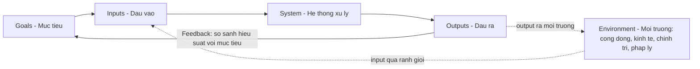
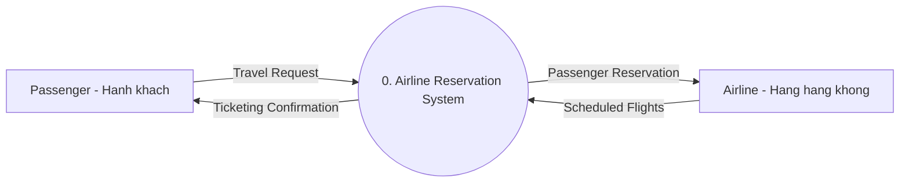
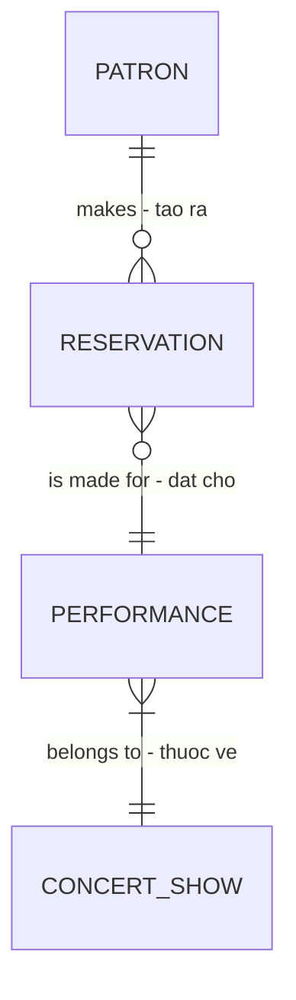
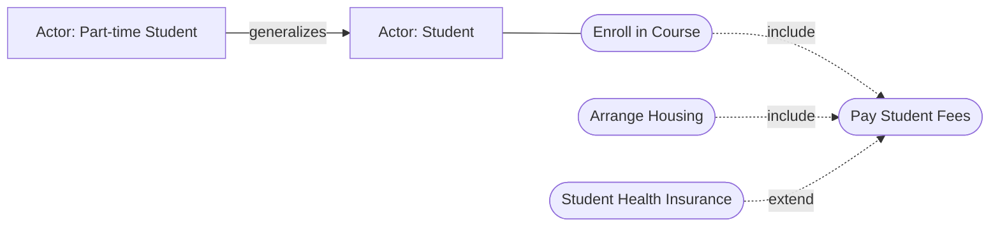
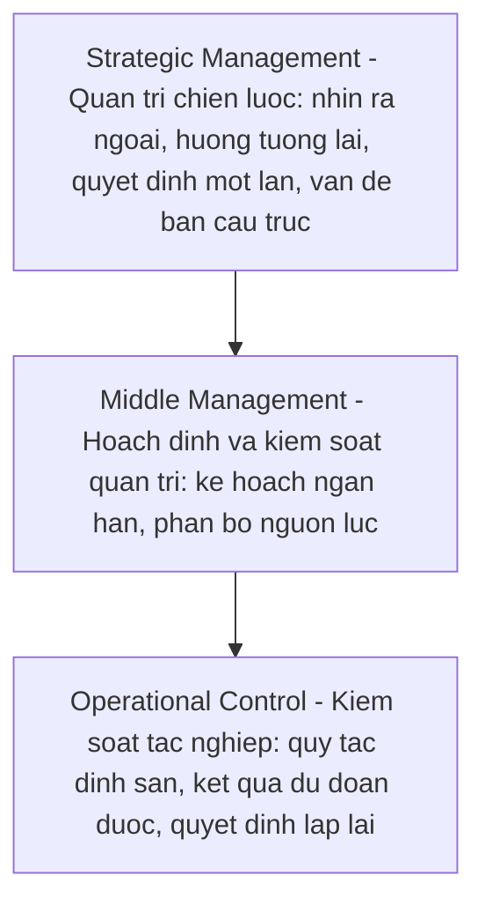
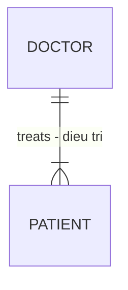
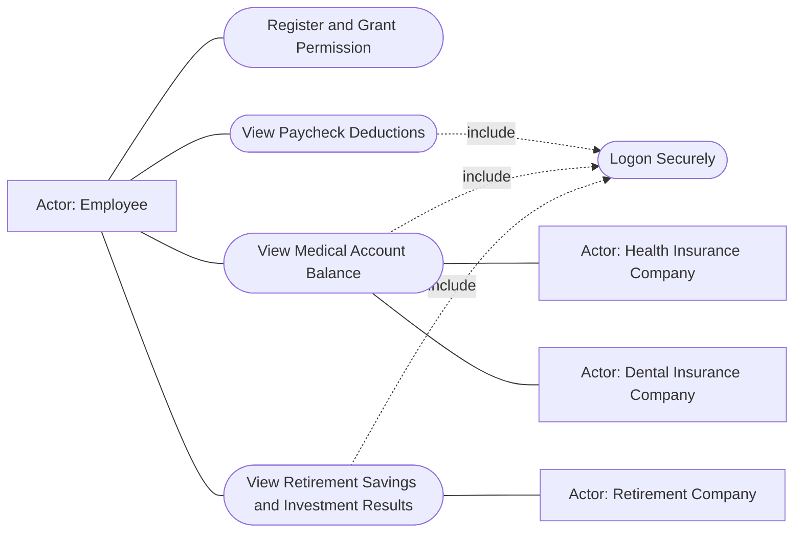
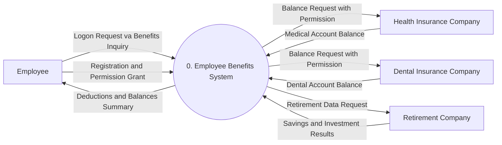
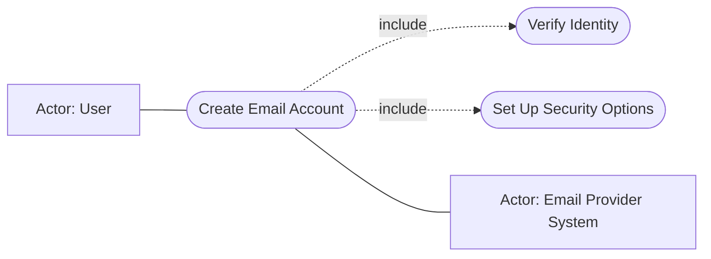
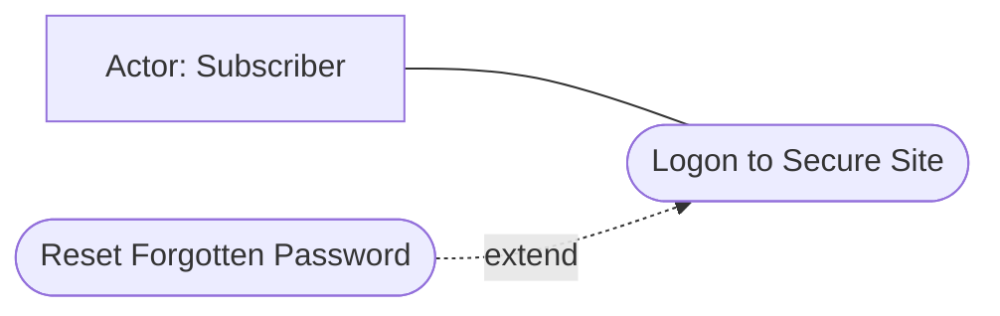

# Chương 2 — Understanding and Modeling Organizational Systems (Hiểu và Mô hình hóa hệ thống tổ chức)

> Sách: *Systems Analysis and Design*, Kendall & Kendall, 11th edition — Chương 2 (trang 25–53).

---

## 🎯 Mục tiêu học tập

Sau khi học xong chương này, bạn có thể:

1. **Hiểu rằng tổ chức là những hệ thống lớn** được cấu thành từ các hệ thống con (subsystems) có quan hệ tương hỗ với nhau.
2. **Mô tả hệ thống bằng đồ họa** thông qua sơ đồ luồng dữ liệu mức ngữ cảnh (context-level data flow diagram) và mô hình thực thể – quan hệ (entity-relationship model).
3. **Mô hình hóa "use case"** và hiểu cách use case modeling hỗ trợ việc phân tích hệ thống.
4. **Nhận ra rằng các cấp quản lý khác nhau** trong tổ chức cần những hệ thống thông tin khác nhau.
5. **Đánh giá đúng vai trò của văn hóa tổ chức (organizational culture)** trong việc ảnh hưởng đến thiết kế hệ thống thông tin.

**Ý tưởng xuyên suốt chương:** để phân tích và thiết kế hệ thống thông tin phù hợp, chuyên viên phân tích hệ thống (systems analyst) phải hiểu tổ chức mình làm việc như một **hệ thống** được định hình bởi 3 lực lượng chính: (1) các cấp quản lý, (2) thiết kế/cấu trúc của tổ chức, và (3) văn hóa tổ chức.

---

## 📖 Tóm tắt & giải thích kiến thức

### 1. Organizations as Systems (Tổ chức như những hệ thống)

Tổ chức và các thành viên của nó nên được hình dung là **hệ thống (systems)** — được thiết kế để đạt các mục tiêu định trước thông qua con người và các nguồn lực khác. Tổ chức được cấu thành từ các **hệ thống con nhỏ hơn** (phòng ban, đơn vị, bộ phận…) đảm nhận chức năng chuyên biệt: kế toán, marketing, sản xuất, IT, vận hành, pháp lý, quản lý… Các chức năng chuyên biệt này cuối cùng được **tái tích hợp** để tạo thành một tổng thể tổ chức hiệu quả.

**Vì sao quan trọng với analyst?** Nguyên lý hệ thống cho ta cái nhìn sâu vào cách tổ chức vận hành. Muốn xác định đúng yêu cầu thông tin và thiết kế hệ thống thông tin phù hợp, trước hết phải hiểu **toàn bộ tổ chức như một tổng thể**.

#### 1.1. Interrelatedness và Interdependence (Tính tương hỗ và phụ thuộc lẫn nhau)

- Mọi hệ thống và hệ thống con đều **liên quan và phụ thuộc lẫn nhau**. Khi một phần tử bị thay đổi hoặc loại bỏ, các phần tử và hệ thống con còn lại **đều bị ảnh hưởng đáng kể**.
- *Ví dụ trong sách:* công ty quyết định không thuê trợ lý hành chính nữa mà thay bằng máy tính nối mạng → ảnh hưởng không chỉ trợ lý và quản lý, mà cả **mọi thành viên** từng xây dựng mạng lưới giao tiếp với các trợ lý đó.
- Mọi hệ thống đều **xử lý input từ môi trường**: quá trình xử lý (process) **biến đổi input thành output**. Khi khảo sát một hệ thống, hãy kiểm tra *cái gì đang bị thay đổi/biến đổi* — nếu không có gì thay đổi, có thể bạn chưa xác định đúng một process. Process điển hình: verify (kiểm tra), update (cập nhật), print (in).

#### 1.2. Boundaries (Ranh giới) và Environments (Môi trường)

- Mọi hệ thống đều được bao bọc bởi **ranh giới (boundaries)** ngăn cách nó với môi trường. Ranh giới tổ chức nằm trên một **dải liên tục (continuum)** từ **cực kỳ thẩm thấu (permeable)** đến **gần như không thẩm thấu (impermeable)**.
- Để thích nghi và tồn tại, tổ chức phải **nhập** con người, nguyên liệu, thông tin qua ranh giới (inputs) và **trao đổi** sản phẩm/dịch vụ/thông tin hoàn chỉnh với thế giới bên ngoài (outputs).
- **Environment (môi trường):** mọi thứ bên ngoài ranh giới của tổ chức. Bốn loại môi trường chính:

| Môi trường | Nội dung |
|---|---|
| **Cộng đồng (community)** | Nơi tổ chức đặt trụ sở; định hình bởi quy mô dân số, hồ sơ nhân khẩu học (trình độ học vấn, thu nhập trung bình) |
| **Kinh tế (economic)** | Các yếu tố thị trường, bao gồm cạnh tranh |
| **Chính trị (political)** | Kiểm soát bởi chính quyền bang và địa phương |
| **Pháp lý (legal)** | Luật và hướng dẫn liên bang, bang, vùng, địa phương |

- Tổ chức **có thể lập kế hoạch** cho thay đổi môi trường nhưng thường **không thể trực tiếp kiểm soát** chúng.
- Liên quan đến độ thẩm thấu ranh giới bên ngoài là khái niệm **openness (độ mở)** và **closedness (độ đóng)** bên trong tổ chức — cũng tồn tại trên một dải liên tục; **không có tổ chức nào mở hoàn toàn hay đóng hoàn toàn**.

#### 1.3. Feedback (Phản hồi) — một hình thức kiểm soát hệ thống

- Tổ chức dùng **planning (hoạch định)** và **control (kiểm soát)** để quản lý nguồn lực hiệu quả. **Output của hệ thống được dùng làm feedback để so sánh hiệu suất với mục tiêu (goals)** → giúp nhà quản lý đặt ra mục tiêu cụ thể hơn làm input mới.
- *Ví dụ:* công ty Mỹ sản xuất bộ tạ màu đỏ-trắng-xanh và màu xám. Một năm sau Olympic, bộ đỏ-trắng-xanh bán rất chậm → quản lý sản xuất dùng thông tin này làm feedback để quyết định sản lượng mỗi màu.
- **Hệ thống lý tưởng là hệ thống tự hiệu chỉnh (self-correcting / self-regulating)** — không cần con người ra quyết định cho các tình huống thường lệ. *Ví dụ:* hãng dệt kim Ý sản xuất áo len màu trắng chưa nhuộm, dùng hệ thống thông tin tồn kho để biết màu nào bán chạy rồi mới **nhuộm ngay trước khi giao hàng**.

*Sơ đồ: Tổ chức như một hệ thống mở — output làm feedback so sánh hiệu suất với mục tiêu (Figure 2.1 mở rộng).*

#### 1.4. Virtual Organizations và Virtual Teams (Tổ chức ảo và Nhóm ảo)

- Không phải mọi tổ chức (hoặc bộ phận của nó) đều hiện diện ở một địa điểm vật lý. **Virtual enterprise (doanh nghiệp ảo)** dùng **mạng máy tính và công nghệ truyền thông** để tập hợp những người có kỹ năng cụ thể làm việc trên các dự án **không cùng địa điểm vật lý**; công nghệ thông tin đảm nhận việc phối hợp các thành viên từ xa.
- Virtual team thường xuất hiện trong các tổ chức đã có sẵn; có tổ chức toàn nhân viên từ xa thành công mà không cần đầu tư cơ sở vật chất truyền thống.

| Khía cạnh | Tổ chức truyền thống | Tổ chức ảo (virtual) |
|---|---|---|
| Địa điểm | Cơ sở vật lý (văn phòng, nhà máy) | Không cần cùng địa điểm; kết nối điện tử |
| Phối hợp | Gặp mặt trực tiếp | Mạng máy tính, công nghệ truyền thông |
| Chi phí cơ sở vật chất | Cao | Có thể giảm mạnh |
| Phản ứng với khách hàng | Chậm hơn | Nhanh hơn (rapid response) |
| Nhu cầu xã hội / văn hóa | Có sẵn hiện vật văn hóa (đồng phục, cốc, logo…) | Là vấn đề còn tranh luận — nhân viên ảo vẫn cần "bản sắc hữu hình" |

- **Lợi ích tiềm năng:** giảm chi phí cơ sở vật chất; phản ứng nhanh hơn với nhu cầu khách hàng; giúp nhân viên đạt **work–life balance (cân bằng công việc–cuộc sống)**.
- **Điểm hạn chế:** việc đáp ứng **nhu cầu xã hội** của người lao động ảo vẫn là câu hỏi mở. *Ví dụ:* sinh viên đại học trực tuyến (không có khuôn viên) vẫn liên tục xin áo, cốc, cờ hiệu in logo trường — đó là các **hiện vật văn hóa (cultural artifacts)** có ý nghĩa mà trường truyền thống vốn cung cấp.
- Nhiều nhóm phân tích & thiết kế hệ thống nay làm việc ảo (họ chính là người mở đường): ứng dụng hỗ trợ kỹ thuật qua web cho phép analyst "nhìn thấy" cấu hình phần mềm/phần cứng của người dùng → tạo **nhóm ảo tức thời (ad hoc virtual team)** giữa analyst và user. Trong đại dịch toàn cầu, làm việc từ xa/hybrid thành công đến mức nhiều người chọn nó thay cho đi lại hàng ngày.

#### 1.5. Taking a Systems Perspective (Góc nhìn hệ thống)

- Góc nhìn hệ thống giúp analyst bắt đầu **hiểu rộng** về doanh nghiệp mình tiếp xúc. Thành viên các hệ thống con phải nhận ra công việc của họ **liên quan với nhau**: output của bộ phận sản xuất là input của marketing, và output của marketing lại là input mới cho sản xuất — **không bộ phận nào tự mình hoàn thành mục tiêu**.
- **Vấn đề:** mỗi nhà quản lý chức năng thường có "bức tranh cá nhân" xem bộ phận **của mình là trung tâm** của doanh nghiệp (marketing manager thấy marketing là trung tâm; production manager thấy sản xuất là trung tâm). Điều này trở nên nghiêm trọng khi họ **thăng tiến lên cấp chiến lược** mà vẫn quá coi trọng yêu cầu thông tin theo chức năng cũ, thay vì nhu cầu rộng hơn của cả tổ chức.

#### 1.6. Enterprise Systems / ERP (Hệ thống doanh nghiệp)

- **Enterprise system**, hay **Enterprise Resource Planning (ERP)** = hệ thống thông tin **tích hợp toàn tổ chức**. ERP là phần mềm giúp **luồng thông tin chảy giữa các khu vực chức năng** trong tổ chức.
- Thường **không tự phát triển in-house** mà **mua** từ các hãng nổi tiếng (SAP, Oracle Cloud) rồi **tùy biến (customize)** cho công ty; nhà cung cấp thường yêu cầu cam kết **đào tạo chuyên biệt** cho user/analyst. Thập kỷ gần đây ERP đang chuyển sang **cloud computing**.
- ERP đã bén rễ ở các công ty lớn và lan sang doanh nghiệp vừa & nhỏ.
- **Khác biệt lớn nhất so với phát triển hệ thống thông thường:** thay vì (1) thiết kế lại quy trình nghiệp vụ dựa trên phân tích logic → (2) chọn IT hỗ trợ quy trình đó, một bản cài đặt ERP lớn có thể **đảo ngược trình tự này**: buộc doanh nghiệp áp dụng **các quy trình nghiệp vụ mới đã "nhúng" sẵn trong công nghệ**. Analyst thường tham gia nhóm nội bộ lo **giao diện giữa hệ thống cũ (legacy) và ERP** đang cài đặt.
- **Triển khai ERP là dự án phức tạp, cường độ cao, gây thay đổi tổ chức to lớn**: ảnh hưởng thiết kế công việc của nhân viên, kỹ năng cần có, thậm chí định vị chiến lược của công ty. Các rào cản: chấp nhận của người dùng; tích hợp legacy systems và chuỗi cung ứng; nâng cấp chức năng (và độ phức tạp) của module ERP; tổ chức lại đời sống công việc của user và người ra quyết định; phạm vi mở rộng qua nhiều tổ chức (IT supply chain); tái định vị chiến lược.
- Nghiên cứu mới: ERP có thể giúp nhân viên hiệu quả hơn **2–3 năm sau cài đặt**, nhưng ngay từ giai đoạn hoạch định phải **phân tích sâu** tác động của hệ thống mới lên công việc hằng ngày của nhân viên. ERP là "game changer" đối với thiết kế công việc và là động lực thay đổi cách tiếp cận chiến lược của tổ chức.

---

### 2. Depicting Systems Graphically (Mô tả hệ thống bằng đồ họa)

Một hệ thống/hệ thống con trong tổ chức có thể được vẽ bằng nhiều mô hình đồ họa khác nhau — chúng cho thấy **ranh giới của hệ thống** và **thông tin được dùng trong hệ thống**.

#### 2.1. Context-Level Data Flow Diagram (Sơ đồ luồng dữ liệu mức ngữ cảnh)

- **Data flow diagram (DFD)** tập trung vào **dữ liệu chảy vào/ra hệ thống** và việc **xử lý (biến đổi) dữ liệu**.
- Sơ đồ mức ngữ cảnh chỉ dùng **3 ký hiệu**:

| Ký hiệu | Hình dạng | Ý nghĩa |
|---|---|---|
| **Process (tiến trình)** | Hình chữ nhật bo góc | Một hành động hoặc nhóm hành động diễn ra. Ở mức ngữ cảnh **chỉ có 1 process duy nhất, đại diện toàn bộ hệ thống** (đánh số 0) |
| **External entity (thực thể ngoài)** | Hình vuông có 2 cạnh tô bóng | Người, nhóm người, chức danh/phòng ban, hoặc hệ thống khác **cung cấp hoặc nhận** thông tin từ hệ thống nhưng **không thuộc** hệ thống |
| **Data flow (luồng dữ liệu)** | Mũi tên | Sự di chuyển của dữ liệu từ/đến process |

- *Ví dụ trong sách (Figure 2.5):* hệ thống đặt vé máy bay — trước kia có **travel agent** làm trung gian; sau khi có đặt vé trực tuyến, hành khách gửi Travel Request trực tiếp vào hệ thống và nhận Ticketing Confirmation.

*Sơ đồ: Context-level DFD của hệ thống đặt vé máy bay khi đặt trực tuyến (theo Figure 2.5, phiên bản sau).*

- **Vai trò quan trọng nhất:** context-level DFD **định nghĩa ranh giới (boundaries) và phạm vi (scope) của hệ thống** — cái gì nằm trong hệ thống. External entities nằm **ngoài phạm vi** và hệ thống **không kiểm soát được** chúng. (Ở ví dụ trên: chỉ việc đặt chỗ thuộc hệ thống; mua máy bay, đổi lịch bay, định giá, tuyển phi hành đoàn… không thuộc hệ thống này.)
- Context-level DFD cũng là **điểm khởi đầu tốt để vẽ use case diagram**.

#### 2.2. Entity-Relationship Model (Mô hình thực thể – quan hệ, E-R)

- Cách thứ hai để thể hiện phạm vi và ranh giới hệ thống. Các phần tử cấu thành hệ thống tổ chức gọi là **entity (thực thể)**: có thể là **người, nơi chốn, vật** (hành khách, điểm đến, máy bay) hoặc **sự kiện** (cuối tháng, kỳ bán hàng, máy hỏng). **Relationship (quan hệ)** là sự liên kết mô tả tương tác giữa các entity.
- Có nhiều quy ước vẽ E-R (crow's foot, arrow, Bachman…). Sách dùng **crow's foot notation (ký hiệu chân quạ)**. Entity vẽ bằng hình chữ nhật; quan hệ là đường nối với **ký hiệu ở đầu mút**:

| Ký hiệu đầu mút | Ý nghĩa |
|---|---|
| Hai vạch ngắn song song `\|\|` | **Đúng một (exactly one)** |
| Vạch ngắn `\|` | **Một (one)** |
| Chân quạ `>` kèm vạch | **Một hoặc nhiều (one or many)** — chân quạ KHÔNG bắt buộc nghĩa "nhiều", mà là "từ một đến nhiều" |
| Vòng tròn `O` | **Không (zero)** — quan hệ tùy chọn; `O` + `\|` cùng nhau = tình huống Boolean "một hoặc không" |

- **Các kiểu quan hệ:**

| Kiểu | Ví dụ trong sách |
|---|---|
| **One-to-one (1:1)** | Một EMPLOYEE được gán đúng một PHONE EXTENSION; một EMPLOYEE được gán một OFFICE |
| **One-to-many (1:N)** | Một CARGO AIRCRAFT phục vụ một hoặc nhiều DISTRIBUTION CENTER |
| **Many-to-one (N:1)** | Nhiều EMPLOYEE là thành viên của một DEPARTMENT |
| **Many-to-many (M:N)** | Một hoặc nhiều SALESPERSON được gán cho một hoặc nhiều CUSTOMER; nhiều PASSENGER bay đến nhiều DESTINATION |

- **Ba loại thực thể (Figure 2.9):**

| Loại entity | Bản chất | Ví dụ |
|---|---|---|
| **Fundamental entity (thực thể nền tảng)** | Thực thể "thật": người, nơi chốn, vật | PATRON (khán giả), CONCERT/SHOW |
| **Associative entity (thực thể kết hợp)** | Thứ **được tạo ra để nối hai entity** — chỉ tồn tại khi kết nối với **ít nhất 2 entity khác**. Còn gọi là gerund, junction, intersection, concatenated entity | RESERVATION (đặt chỗ), hóa đơn, biên nhận — biên nhận không tồn tại nếu không có khách hàng + người bán |
| **Attributive entity (thực thể thuộc tính)** | Mô tả các thuộc tính, đặc biệt là **nhóm dữ liệu lặp lại (repeating groups)**; **phụ thuộc hoàn toàn** vào sự tồn tại của fundamental entity | PERFORMANCE (suất diễn — một concert có nhiều suất); bản copy thứ n của cùng một cuốn sách trong thư viện |

- *Ví dụ dựng dần trong sách:* PATRON — CONCERT/SHOW: ban đầu vẽ đơn giản "patron makes a reservation for concert/show". Nhưng thực chất PATRON **tạo ra** một RESERVATION (associative entity), reservation dành cho concert/show. Vì concert/show có **nhiều suất diễn**, thêm PERFORMANCE (attributive entity): RESERVATION được đặt cho một PERFORMANCE cụ thể; PERFORMANCE thuộc về một CONCERT/SHOW.

*Sơ đồ: E-R hoàn chỉnh của hệ thống đặt vé xem ca nhạc (theo Figure 2.12) — RESERVATION là associative entity, PERFORMANCE là attributive entity.*

- Cạnh mỗi entity là tập **attributes (thuộc tính)**; các thuộc tính gạch chân là **keys (khóa)** — có thể tìm kiếm được (bàn kỹ ở Chương 13). Ví dụ: Patron có Patron-name, Patron-address, Patron-phone, Patron-credit-card; Reservation có Reservation-number, Patron-name, Performance-number…
- **4 bước phác thảo E-R diagram** của analyst:
  1. **Liệt kê các entity** trong tổ chức để hiểu tổ chức tốt hơn.
  2. **Chọn các entity then chốt** để thu hẹp phạm vi bài toán về kích thước quản lý được và có ý nghĩa.
  3. **Xác định entity chính (primary entity)** là gì.
  4. **Xác nhận kết quả** của các bước trên bằng những phương pháp thu thập dữ liệu khác (điều tra, phỏng vấn, bảng hỏi, quan sát, prototyping — Chương 4–6).
- **Lưu ý cốt lõi:** analyst nên **vẽ E-R ngay khi bước vào tổ chức**, chứ không đợi đến lúc thiết kế database. E-R giúp hiểu doanh nghiệp thực sự làm gì, xác định quy mô & phạm vi vấn đề, và biết mình có đang giải **đúng vấn đề** hay không. E-R cần được xác nhận/chỉnh sửa liên tục trong quá trình thu thập dữ liệu.
- *Công cụ:* Microsoft Visio (PC) hoặc OmniGraffle (Mac) hỗ trợ vẽ E-R và hầu hết sơ đồ trong sách.

---

### 3. Use Case Modeling (Mô hình hóa Use Case)

- Use case vốn ra đời trong **UML (Unified Modeling Language)** hướng đối tượng, nhưng nay được dùng **bất kể phương pháp phát triển nào** (SDLC truyền thống hay agile). Chữ "use" đọc là danh từ /juːs/ ("yoos").
- **Use case model mô tả hệ thống LÀM GÌ mà không mô tả LÀM THẾ NÀO** → là **mô hình logic** của hệ thống; phản ánh góc nhìn của **người dùng bên ngoài hệ thống** (tức system requirements).
- Analyst xây dựng use case **cùng với các chuyên gia nghiệp vụ (business experts)**; use case model là **phương tiện giao tiếp hiệu quả** giữa nhóm nghiệp vụ và nhóm phát triển. Nó phân chia cách hệ thống hoạt động thành các **hành vi, dịch vụ, phản hồi** (chính là các use case) có ý nghĩa với người dùng.
- Từ góc nhìn actor, một use case phải **tạo ra thứ gì đó có giá trị** cho người dùng (ví dụ: nhập mật khẩu có "giá trị" không? — chỉ đưa vào nếu user quan tâm bảo mật hoặc nó thiết yếu cho dự án).

#### 3.1. Use Case Symbols (Ký hiệu)

- Use case diagram gồm: **actor** (hình người que), **use case** (hình oval), và các **đường nối**.
- **Actor** giống external entity — **tồn tại ngoài hệ thống**. Actor chỉ **một VAI TRÒ (role)** của người dùng, không phải một cá nhân: cùng một người có thể vừa là nhân viên vừa là khách hàng → vẽ thành **2 actor khác nhau**. Actor có thể là **người, hệ thống khác, hoặc thiết bị** (bàn phím, kết nối web). Actor có thể khởi tạo use case; một actor tương tác với một hay nhiều use case và ngược lại.
- **Hai nhóm actor:**
  - **Primary actors (actor chính):** cung cấp dữ liệu hoặc nhận thông tin từ hệ thống; có thể trực tiếp dùng hệ thống (system actors) hoặc là người kinh doanh không trực tiếp dùng nhưng **có lợi ích liên quan (stake)**. Họ cung cấp chi tiết về việc use case nên làm gì, danh sách mục tiêu và độ ưu tiên.
  - **Supporting actors (actor hỗ trợ / secondary actors):** giúp hệ thống chạy hoặc cung cấp dịch vụ khác — analyst, coder, nhân viên help desk…
- Có thể lập **actor profile** (bảng liệt kê actor, nền tảng, kỹ năng) và danh sách **mục tiêu & độ ưu tiên** của mỗi actor — **mỗi mục tiêu có thể trở thành một use case**.
- Một use case luôn mô tả 3 thứ: **actor khởi tạo sự kiện**; **sự kiện (event) kích hoạt use case**; **use case thực hiện các hành động** do sự kiện gây ra. Một use case tài liệu hóa **một giao dịch/sự kiện đơn lẻ**. Event = input đến hệ thống tại một thời điểm, địa điểm cụ thể, khiến hệ thống làm gì đó.
- **Nên tạo ÍT use case hơn là nhiều**: thường không đưa query và report vào; **20 use case (tối đa 40–50) là đủ cho một hệ thống lớn**. Use case có thể lồng nhau (nested); có thể dùng động từ *manage* để gom các use case thêm/xóa/sửa vào một sơ đồ mức thấp hơn. Một use case có thể xuất hiện trên nhiều sơ đồ nhưng **chỉ định nghĩa một lần trong repository**. **Tên use case = động từ + danh từ** (ví dụ: Enroll in Course).

#### 3.2. Use Case Relationships (4 quan hệ hành vi)

Quan hệ chủ động gọi là **behavioral relationships** — cả 4 đều là động từ hành động:

| Quan hệ | Ký hiệu | Ý nghĩa | Ví dụ trong sách |
|---|---|---|---|
| **Communicates** | Đường thẳng **không mũi tên** nối actor với use case | Actor kết nối/tương tác với use case | Student — Enroll in Course |
| **Includes** (còn gọi *uses*) | Mũi tên **nét đứt** + nhãn `<<include>>`, **chỉ về use case chung** | Một use case chứa hành vi **chung cho nhiều use case khác** | Pay Student Fees được include trong Enroll in Course và Arrange Housing (trường hợp nào cũng phải đóng phí) |
| **Extends** | Mũi tên nét đứt + nhãn `<<extend>>`, **chỉ từ use case mở rộng về use case cơ bản** | Use case mới xử lý **biến thể/ngoại lệ** của use case cơ bản | Student Health Insurance extends Pay Student Fees |
| **Generalizes** | Mũi tên **chỉ về "thứ" tổng quát hơn** | Một "thing" UML tổng quát hơn thing kia; áp dụng cho 2 actor hoặc 2 use case | Part-time Student generalizes Student (SV bán thời gian là dạng cụ thể của SV) |

*Sơ đồ: 4 loại quan hệ use case qua ví dụ đăng ký học của sinh viên (theo Figure 2.14).*

#### 3.3. Developing System Scope (Xác định phạm vi hệ thống)

- **Scope** định nghĩa ranh giới: cái gì **in scope** (trong hệ thống), cái gì **out of scope**. Dự án thường có **ngân sách** cùng **thời điểm bắt đầu/kết thúc** giúp định nghĩa scope.
- **Actor luôn nằm ngoài scope.** Các đường *communicates* nối actor với use case chính là **ranh giới** và định nghĩa scope. Vì use case diagram được tạo **sớm** trong vòng đời hệ thống, ngân sách/thời gian/scope có thể thay đổi khi dự án tiến triển.

#### 3.4. Developing Use Case Diagrams (Xây dựng sơ đồ use case)

- **Primary use case** = luồng sự kiện chuẩn (standard flow of events) mô tả hành vi hệ thống **bình thường, kỳ vọng và hoàn tất thành công**.
- Bắt đầu bằng cách **hỏi user liệt kê mọi thứ hệ thống nên làm cho họ** (qua phỏng vấn, phiên JAD — Chương 4, hoặc agile stories — Chương 6). Ghi lại ai liên quan đến mỗi use case và trách nhiệm/dịch vụ nó phải cung cấp. **3 hướng dẫn:**
  1. Xem lại đặc tả nghiệp vụ và **xác định các actor**.
  2. Xác định **sự kiện mức cao** và xây dựng **primary use case** mô tả sự kiện đó + cách actor khởi tạo. Use case có ít/không có tương tác người dùng thì không cần vẽ.
  3. Rà soát từng primary use case để tìm **các biến thể luồng** → thiết lập **alternative paths (đường thay thế)**: tìm hoạt động có thể thành công/thất bại, các nhánh logic có kết cục khác nhau.
- Nếu đã có **context-level DFD**, dùng nó làm điểm bắt đầu: **external entity = actor tiềm năng**; xét mỗi data flow xem nó khởi tạo use case hay do use case sinh ra.
- *Ví dụ Figure 2.15 — hệ thống lập kế hoạch hội nghị:* actor gồm Conference Chair, Participant, Speaker, Keynote Speaker, Hotel Reservations, Caterer. Reserve Room được **include** bởi Arrange Speaker và Register for Conference (cả diễn giả lẫn người tham dự đều cần chỗ ở); Arrange Language Translation **extends** Register for Conference (không phải ai cũng cần dịch); Speaker là **generalization** của Keynote Speaker.

#### 3.5. Developing Use Case Scenarios (Kịch bản use case)

- Mỗi use case có một **mô tả** = **use case scenario**. Primary use case là luồng chuẩn; **alternative paths** mô tả các biến thể (hết hàng, thẻ tín dụng bị từ chối…).
- **Không có format chuẩn hóa** — mỗi tổ chức tự quy định template để dễ đọc và thống nhất. **3 phần chính:**

  **(1) Header — định danh & khởi tạo:** tên use case + UniqueID; area (khu vực nghiệp vụ/hệ thống); actor(s); stakeholders (người có lợi ích cao nhưng có thể không bao giờ trực tiếp tương tác — cổ đông, HĐQT, sales manager; primary actor là stakeholder nhưng không liệt kê ở mục này); level (blue, kite…); mô tả ngắn; **triggering event (sự kiện kích hoạt)** và **loại trigger**: **external** (do actor — người hoặc hệ thống khác — khởi động) hoặc **temporal** (theo thời gian: gửi email khuyến mãi tối Chủ nhật hằng tuần, gửi hóa đơn vào ngày cố định, thống kê hằng quý).

  **(2) Steps performed — các bước thực hiện + thông tin cần cho từng bước:** luồng sự kiện chuẩn để hoàn tất thành công. Nên viết use case cho **main path**, rồi viết **riêng từng alternative path** thay vì dùng câu IF...THEN. Bước đánh số nguyên (1, 2, 3…); extension/alternative đánh số thập phân (3.1, 3.2…). Bước có thể chứa điều kiện "if" trên main path, và có thể có bước lặp (iterative/looping). Analyst phải xác định **thông tin cần cho mỗi bước** — nếu không xác định được thì hẹn phỏng vấn tiếp. Cùng user brainstorm "cái gì có thể sai" trên main path → phát hiện lỗi **sớm** trong vòng đời.

  **(3) Footer — điều kiện & thông tin bổ sung:**
  - **Preconditions (tiền điều kiện):** trạng thái hệ thống trước khi use case chạy (có thể là một use case khác đã hoàn tất; ví dụ "đã đăng nhập thành công").
  - **Postconditions (hậu điều kiện):** trạng thái hệ thống sau khi kết thúc — output đã nhận, dữ liệu đã tạo/cập nhật, truyền tới hệ thống khác.
  - **Assumptions (giả định):** công nghệ tối thiểu, ví dụ trình duyệt phải bật cookies/JavaScript (Google Maps cần JavaScript; Netflix cần cookies). Trang web tốt phải phát hiện giả định không thỏa và thông báo cho người xem.
  - **Minimal guarantee:** mức tối thiểu hứa với user (có thể là "không có gì xảy ra").
  - **Success guarantee:** điều làm user hài lòng — thường là mục tiêu use case đạt được.
  - **Outstanding issues:** câu hỏi phải trả lời trước khi triển khai (ví dụ: "xử lý thẻ bị từ chối thế nào?").
  - **Priority** (tùy chọn): use case nào làm trước; **Risk** (tùy chọn): đánh giá thô độ khó/rủi ro khi xây dựng.
  - **Requirements Met:** liên kết use case với yêu cầu người dùng/mục tiêu từ problem definition.
- *Ví dụ Figure 2.16 — "Register for Conference":* actor duy nhất là Participant; area = Conference Planning; trigger = participant đăng nhập trang Registration (external); 12 bước (logon → xác thực → hiển thị form → submit → validate → xác nhận → tính phí thẻ → ghi journal → cập nhật Registration/Session/Participant Master → gửi trang xác nhận); risk = Medium vì cần secure server và nhận thẻ tín dụng.
- Sau khi viết scenario, **review với business experts** để xác minh và tinh chỉnh.

#### 3.6. Use Case Levels (5 mức "độ cao" của use case — Alistair Cockburn)

| Mức | Ẩn dụ | Cấp độ | Ví dụ |
|---|---|---|---|
| **White (trắng)** | Mây — cao nhất | **Enterprise level** — cả tổ chức chỉ 4–5 use case | Quảng bá hàng hóa, bán hàng, quản lý tồn kho, quản lý chuỗi cung ứng, tối ưu vận chuyển |
| **Kite (diều)** | Thấp hơn mây, vẫn cao | **Business unit / department** — tóm tắt mục tiêu | Đăng ký sinh viên; đặt vé máy bay/khách sạn/xe/du thuyền |
| **Blue (xanh biển)** | Mực nước biển | **User goals** — mức user quan tâm nhất, doanh nghiệp dễ hiểu nhất; mỗi hoạt động làm được trong **2–20 phút** | Đăng ký cho SV đang học, thêm khách hàng mới, bỏ hàng vào giỏ, thanh toán đơn hàng |
| **Indigo / Fish (chàm / cá)** | Dưới mặt nước | Chi tiết, mức **chức năng/tiểu chức năng** | Chọn lớp học, đóng học phí, tra mã sân bay theo thành phố, lọc danh sách khách theo tên |
| **Black / Clam (đen / sò)** | Đáy đại dương | **Chi tiết nhất**, mức subfunction | Xác thực đăng nhập an toàn, thêm field bằng dynamic HTML, dùng Ajax cập nhật một phần trang web |

#### 3.7. Creating Use Case Descriptions (4 bước viết mô tả use case)

1. Dùng **agile stories, mục tiêu problem definition, yêu cầu người dùng, hoặc danh sách tính năng** làm điểm khởi đầu.
2. Hỏi về **các nhiệm vụ phải làm** để hoàn tất giao dịch; hỏi use case có **đọc dữ liệu hay cập nhật bảng** nào không.
3. Tìm xem có **hành động lặp (iterative/looping)** nào không.
4. Use case **kết thúc khi mục tiêu của khách hàng hoàn thành**.

#### 3.8. Why Use Case Diagrams Are Helpful (Vì sao use case hữu ích)

Dù dùng SDLC truyền thống, agile hay hướng đối tượng, use case đều có giá trị. Lý do viết use case (Figure 2.18):
- Truyền đạt yêu cầu hệ thống hiệu quả vì **sơ đồ được giữ đơn giản**.
- Cho phép mọi người **kể chuyện (tell stories)**; câu chuyện **dễ hiểu với người không chuyên kỹ thuật**.
- **Không phụ thuộc ngôn ngữ đặc biệt** nào.
- Mô tả được hầu hết **yêu cầu chức năng** (tương tác actor–ứng dụng) và cả **yêu cầu phi chức năng** (hiệu năng, khả bảo trì) qua stereotypes.
- Giúp analyst **định nghĩa ranh giới**.
- **Truy vết được (traceable)** — liên kết use case với các công cụ thiết kế và tài liệu khác.
- Use case scenario ghi lại **triggering event** nên truy được chuỗi bước dẫn tới use case khác; các bước ghi rõ nên có thể dùng để **viết logical processes**. Sơ đồ giúp user "nhìn thấy" hệ thống, phản hồi, thậm chí quyết định **build hay buy** phần mềm.

---

### 4. Levels of Management (Các cấp quản lý)

Quản lý tồn tại trên **3 tầng ngang**: **operational control** (kiểm soát tác nghiệp), **managerial planning and control** (hoạch định & kiểm soát quản trị — quản lý cấp trung), và **strategic management** (quản trị chiến lược). Mỗi cấp có trách nhiệm riêng nhưng đều hướng về mục tiêu tổ chức theo cách của mình.

*Sơ đồ: Tháp 3 cấp quản lý (theo Figure 2.19) — trên cùng hẹp nhất là chiến lược, đáy rộng nhất là tác nghiệp.*

| Tiêu chí | Operational control | Middle management | Strategic management |
|---|---|---|---|
| Vị trí | Tầng đáy | Tầng giữa | Tầng đỉnh |
| Bản chất quyết định | Dùng **quy tắc định sẵn**, kết quả **dự đoán được** khi thực hiện đúng | **Hoạch định & kiểm soát ngắn hạn**: phân bổ nguồn lực tốt nhất để đạt mục tiêu tổ chức | **Nhìn ra ngoài tổ chức, hướng tương lai**; định hướng cho cấp giữa và tác nghiệp trong nhiều tháng/năm tới |
| Phạm vi việc | Lập lịch làm việc, kiểm soát tồn kho, giao nhận hàng, kiểm soát quy trình sản xuất | Xử lý sự cố (troubleshooting), điều phối | Định hướng, chiến lược dài hạn |
| Môi trường ra quyết định | Chắc chắn | Trung gian | **Rất bất định (highly uncertain)** |
| Mục tiêu quyết định | **Đơn mục tiêu** | Trung gian | **Đa mục tiêu** |
| Nhận diện vấn đề | Dễ | Trung gian | **Khó** |
| Loại vấn đề | **Có cấu trúc (structured)** | Trung gian | **Bán cấu trúc (semistructured)** |
| Phương án giải quyết | Dễ liệt kê | Trung gian | **Khó diễn đạt** |
| Tính chất quyết định | **Lặp lại (repetitive)** | Trung gian | **Một lần (one-time)** |

#### 4.1. Implications for Information Systems Development (Hàm ý cho phát triển HTTT)

Mỗi cấp quản lý có yêu cầu thông tin khác nhau — có cái rõ ràng, có cái mờ và chồng lấn:

| Nhu cầu thông tin | Operations managers | Middle managers | Strategic managers |
|---|---|---|---|
| Nguồn thông tin | **Nội bộ**, tính lặp lại, mức thấp | **Chủ yếu nội bộ** | **Chủ yếu bên ngoài** (xu hướng thị trường, chiến lược đối thủ) |
| Thông tin thời gian thực (real-time/online) | Dùng thường xuyên (hiệu suất hiện tại) | **Nhu cầu cực cao** (do tính chất xử lý sự cố) | — |
| Thông tin quá khứ / định kỳ | Nhu cầu **vừa phải** | **Nhu cầu cao** về thông tin lịch sử | Nhu cầu **mạnh** về thông tin báo cáo định kỳ (để thích nghi thay đổi nhanh) |
| Thông tin dự báo / "what-if" | **Gần như không cần** thông tin bên ngoài để dự phóng | Cao — dự đoán sự kiện tương lai, **mô phỏng nhiều kịch bản** | **Rất cao** — dự phóng tương lai bất định, tạo nhiều kịch bản "what if", kèm **đánh giá rủi ro chính xác** (kể cả rủi ro an ninh HTTT) |

#### 4.2. Collaborative Design (Thiết kế cộng tác)

- Trong phân tích & thiết kế hệ thống, **collaborative design** = các **stakeholder bên ngoài** (khách hàng ngoài công ty) lẫn **bên trong** cùng tham gia quy trình thiết kế hệ thống đáp ứng mục tiêu của họ. Cộng tác viên nội bộ có thể đến từ **các cấp bậc khác nhau** (chiến lược, quản trị, tác nghiệp) hoặc **các phòng ban khác nhau cùng cấp**.
- Nghiên cứu (Levina 2005; Phelps 2012) cho thấy nhiều cuộc cộng tác thiết kế nội bộ dựa trên **quan hệ quyền lực và luồng thông tin** (một phần dựa trên thứ bậc). Dự án HTTT có thể suôn sẻ hơn nếu **người ở cấp thấp** (ví dụ graphic designer) được **dùng chuyên môn tạo thiết kế ban đầu**, sau đó người cấp cao hơn trong IT xem xét. Ngược lại, trao quyền cho người có chuyên môn kỹ thuật/chiến lược **thay vì** designer khi bắt đầu dự án bằng phương pháp có cấu trúc **có thể gây trục trặc** cho sự cộng tác.
- Với **cộng tác bên ngoài**: chú ý đưa **stakeholder liên quan vào các luồng thông tin phù hợp** và nhấn mạnh **mối quan hệ** hình thành giữa người tham gia trong–ngoài.

---

### 5. Organizational Culture (Văn hóa tổ chức)

- Văn hóa tổ chức là lĩnh vực nghiên cứu đã phát triển mạnh. Tổ chức không chỉ chứa nhiều công nghệ mà còn là "vật chủ" của **nhiều tiểu văn hóa (subcultures) thường cạnh tranh nhau**.
- Chưa có đồng thuận về định nghĩa chính xác subculture, nhưng thống nhất rằng các subculture cạnh tranh **có thể xung đột**, cố lôi kéo người theo tầm nhìn của mình về "tổ chức nên là gì". (Đang nghiên cứu tác động của tổ chức ảo/nhóm ảo lên việc hình thành subculture khi thành viên không chung không gian vật lý nhưng chung nhiệm vụ.)
- Thay vì nghĩ về văn hóa như một khối, nên nghĩ về **các yếu tố quyết định có thể nghiên cứu được** của subculture — **biểu tượng ngôn từ và phi ngôn từ được chia sẻ**:
  - **Verbal symbolism (biểu tượng ngôn từ):** ngôn ngữ chung dùng để xây dựng, truyền tải, gìn giữ **huyền thoại, ẩn dụ, tầm nhìn, sự hài hước** của tiểu văn hóa.
  - **Nonverbal symbolism (biểu tượng phi ngôn từ):** hiện vật, nghi thức, nghi lễ chung; **trang phục** của người ra quyết định và nhân viên; cách dùng, bố trí, trang trí **văn phòng**; nghi thức mừng **sinh nhật, thăng chức, nghỉ hưu**.
- Subculture **cùng tồn tại** bên trong văn hóa "chính thức" (văn hóa được phê chuẩn có thể quy định dress code, cách xưng hô với cấp trên/đồng nghiệp, cách ứng xử với công chúng).
- Một thành viên có thể thuộc **một hoặc nhiều** subculture. Subculture có thể là **yếu tố quyết định mạnh mẽ** đối với yêu cầu thông tin, tính sẵn có và cách dùng thông tin; ảnh hưởng mạnh đến hành vi thành viên, **kể cả "thưởng/phạt" việc dùng hệ thống thông tin**.
- **Hàm ý cho analyst:** hiểu và nhận diện các subculture chủ đạo giúp **vượt qua sự kháng cự thay đổi (resistance to change)** khi cài đặt hệ thống mới — ví dụ thiết kế **chương trình đào tạo người dùng** nhắm vào mối quan tâm cụ thể của từng subculture.

#### 5.1. Technology's Impact on Culture (Tác động của công nghệ lên văn hóa — Slack)

- Công nghệ đang thay đổi văn hóa tổ chức và nhóm. **Slack** là nền tảng mạng xã hội được doanh nghiệp phê chuẩn (workplace-messaging app): hội thoại giữa đồng nghiệp có thể công khai, riêng tư hoặc ở giữa; theo nhóm hoặc 1-1.
- Kênh (channel) có thể dành cho những chủ đề tưởng như vụn vặt (đồ ăn vặt, món ăn căng tin) nhưng **mục đích chính là thúc đẩy cộng tác và giao tiếp**. Slack **ít trang trọng hơn email**, được ưa chuộng bởi thế hệ millennial; có thể **định hình văn hóa**, thậm chí trở thành một "văn hóa văn phòng" hoàn chỉnh với cả trò đùa lập trình được, giúp thành viên né tránh khó khăn khi phải bày tỏ trực tiếp trong cuộc họp.
- Cấu trúc Slack:
  - **Public channels:** mở cho mọi thành viên team; tin nhắn được **lưu trữ (archived)** và **tìm kiếm được** bởi cả team.
  - **Private channels:** giới hạn số thành viên, **vào bằng lời mời**; phải là thành viên mới xem/tìm kiếm được nội dung.
  - **Direct messages (DM) / group DMs:** nhắn tin nhanh, riêng tư giữa 2 người trở lên; khả năng tìm kiếm phụ thuộc bạn có phải người nhận hay không.
- Slack và các công cụ công nghệ tương tự **rất hữu ích cho giao tiếp nhóm** và có thể dùng để **tạo hoặc củng cố** các yếu tố văn hóa/tiểu văn hóa của tổ chức.

### Tóm tắt chương (Summary)

Ba nền tảng tổ chức cần xét khi phân tích & thiết kế HTTT: (1) **tổ chức là hệ thống**, (2) **các cấp quản lý**, (3) **văn hóa tổ chức**. Tổ chức là hệ thống phức tạp gồm các hệ thống con tương hỗ, phụ thuộc lẫn nhau; nội môi trường nằm trên dải mở–đóng; có thể tổ chức theo kiểu ảo; ERP là hệ thống thông tin tích hợp toàn doanh nghiệp. Có nhiều cách vẽ hệ thống — context-level DFD, E-R diagram, use case diagram/scenario — dùng **sớm** để định nghĩa ranh giới, phạm vi và xác định ai/hệ thống nào nằm ngoài. E-R thể hiện quan hệ 1-1, 1-N, N-1, M-N. Ba cấp quản lý có **chân trời thời gian ra quyết định khác nhau**. Văn hóa và tiểu văn hóa quyết định cách con người dùng thông tin và HTTT; công nghệ như Slack có thể tạo/củng cố văn hóa.

---

## 🔑 Bảng thuật ngữ (Keywords and Phrases)

| Thuật ngữ tiếng Anh | Nghĩa tiếng Việt |
|---|---|
| actor | Tác nhân — vai trò của người dùng (hoặc hệ thống/thiết bị) bên ngoài hệ thống trong use case diagram |
| associative entity | Thực thể kết hợp — được tạo ra để nối ít nhất 2 thực thể khác (vd: hóa đơn, đặt chỗ) |
| attributive entity | Thực thể thuộc tính — mô tả thuộc tính/nhóm dữ liệu lặp lại, phụ thuộc hoàn toàn vào thực thể nền tảng |
| closedness | Tính đóng — mức độ hạn chế luồng tự do của input/output trong tổ chức |
| collaborative design | Thiết kế cộng tác — stakeholder trong và ngoài công ty cùng tham gia thiết kế hệ thống |
| context-level data flow diagram | Sơ đồ luồng dữ liệu mức ngữ cảnh — 1 process đại diện toàn hệ thống + external entities + data flows |
| crow's foot notation | Ký hiệu chân quạ — quy ước vẽ lực lượng quan hệ (cardinality) trong E-R diagram |
| direct message (DM) | Tin nhắn trực tiếp — nhắn riêng tư nhanh giữa 2+ thành viên (trong Slack) |
| enterprise resource planning (ERP) | Hoạch định nguồn lực doanh nghiệp — phần mềm tích hợp luồng thông tin giữa các khu vực chức năng |
| enterprise systems | Hệ thống doanh nghiệp — hệ thống thông tin tích hợp toàn tổ chức |
| entity (fundamental entity) | Thực thể (thực thể nền tảng) — người, nơi chốn, vật, hoặc sự kiện |
| entity-relationship (E-R) model | Mô hình thực thể – quan hệ — mô tả thực thể và quan hệ giữa chúng |
| environment | Môi trường — mọi thứ bên ngoài ranh giới tổ chức (cộng đồng, kinh tế, chính trị, pháp lý) |
| feedback | Phản hồi — output được dùng để so sánh hiệu suất với mục tiêu; phục vụ hoạch định & kiểm soát |
| interdependent | Phụ thuộc lẫn nhau — thay đổi một phần tử ảnh hưởng các phần tử còn lại |
| interrelatedness | Tính tương hỗ — các hệ thống/hệ thống con liên quan với nhau |
| middle management | Quản lý cấp trung — hoạch định & kiểm soát ngắn hạn, phân bổ nguồn lực |
| openness | Tính mở — mức độ cho phép nguồn lực (người, thông tin, vật liệu) đi qua ranh giới tự do |
| operational control | Kiểm soát tác nghiệp — cấp quản lý đáy, quyết định theo quy tắc định sẵn, kết quả dự đoán được |
| organizational boundaries | Ranh giới tổ chức — ngăn cách hệ thống với môi trường; từ thẩm thấu đến không thẩm thấu |
| organizational culture | Văn hóa tổ chức — hệ giá trị, biểu tượng, nghi thức chung của tổ chức |
| organizational subculture | Tiểu văn hóa tổ chức — các nhóm văn hóa nhỏ, thường cạnh tranh, cùng tồn tại trong văn hóa chính thức |
| scope of the system | Phạm vi hệ thống — cái gì nằm trong / ngoài hệ thống |
| Slack | Nền tảng nhắn tin công việc được doanh nghiệp phê chuẩn (public/private channels, DM) |
| strategic management | Quản trị chiến lược — cấp cao nhất, nhìn ra ngoài và hướng tương lai |
| systems | Hệ thống — tập hợp các thành phần tương hỗ hoạt động vì mục tiêu chung |
| use case | Trường hợp sử dụng — mô tả một giao dịch/sự kiện: hệ thống làm GÌ, không nói làm THẾ NÀO |
| use case diagram | Sơ đồ use case — actor + use case + các quan hệ hành vi |
| use case scenario | Kịch bản use case — mô tả chi tiết use case: header, các bước, footer điều kiện |
| virtual enterprise | Doanh nghiệp ảo — dùng mạng máy tính & truyền thông kết nối người có kỹ năng làm dự án từ xa |
| virtual organization | Tổ chức ảo — tổ chức (hoặc bộ phận) không hiện diện tại một địa điểm vật lý |
| virtual team | Nhóm ảo — nhóm thành viên từ xa được kết nối điện tử |

---

## ❓ Trả lời Review Questions

**1. Ba nhóm nền tảng tổ chức nào mang hàm ý cho việc phát triển hệ thống thông tin?**
(1) Khái niệm **tổ chức như những hệ thống** (organizations as systems); (2) **các cấp quản lý** (levels of management); (3) **văn hóa tổ chức tổng thể** (organizational culture). Cả ba định hình cách xác định yêu cầu thông tin và cách thiết kế, triển khai HTTT.

**2. "Các hệ thống con của tổ chức là tương hỗ và phụ thuộc lẫn nhau" nghĩa là gì?**
Nghĩa là mọi hệ thống/hệ thống con đều liên kết với nhau: **khi bất kỳ phần tử nào bị thay đổi hoặc loại bỏ, các phần tử và hệ thống con còn lại đều bị ảnh hưởng đáng kể**. Ví dụ: bỏ vị trí trợ lý hành chính, thay bằng PC nối mạng → ảnh hưởng cả những nhân viên từng dựa vào mạng lưới giao tiếp với các trợ lý đó. Analyst phải cân nhắc hiệu ứng lan tỏa này khi thay đổi bất kỳ bộ phận nào.

**3. Định nghĩa "organizational boundary" (ranh giới tổ chức).**
Là ranh giới ngăn cách hệ thống (tổ chức) với **môi trường** của nó. Ranh giới tồn tại trên dải liên tục từ **cực kỳ thẩm thấu (permeable)** đến **gần như không thẩm thấu (impermeable)**. Để tồn tại, tổ chức phải nhập người, nguyên liệu, thông tin qua ranh giới (input) và xuất sản phẩm/dịch vụ/thông tin ra ngoài (output).

**4. Hai mục đích chính của feedback trong tổ chức là gì?**
**Planning (hoạch định)** và **control (kiểm soát)**. Output của hệ thống được dùng làm feedback để **so sánh hiệu suất với mục tiêu**; kết quả so sánh giúp nhà quản lý xây dựng mục tiêu cụ thể hơn làm input mới (ví dụ: dùng dữ liệu bán hàng bộ tạ theo màu để quyết định sản lượng mỗi màu).

**5. Định nghĩa "openness" trong môi trường tổ chức.**
Tính mở là mức độ tổ chức **cho phép luồng tự do của nguồn lực** (con người, thông tin, vật liệu) đi qua ranh giới của nó. Hệ thống mở cho input/output lưu chuyển tự do. Openness tồn tại trên dải liên tục — không có tổ chức nào mở tuyệt đối.

**6. Định nghĩa "closedness" trong môi trường tổ chức.**
Tính đóng là mức độ tổ chức **hạn chế/không cho phép luồng tự do** của input và output. Cũng nằm trên dải liên tục — không có tổ chức nào đóng hoàn toàn.

**7. Khác biệt giữa tổ chức truyền thống và tổ chức ảo?**
Tổ chức truyền thống hiện diện tại một **địa điểm vật lý** (văn phòng, nhà máy) nơi nhân viên gặp mặt trực tiếp. Tổ chức ảo (toàn bộ hoặc một phần) **không cần cùng địa điểm vật lý**: dùng **mạng máy tính và công nghệ truyền thông** để tập hợp người có kỹ năng làm việc trên dự án từ xa; CNTT đảm nhận phối hợp thành viên; có thể thành công mà không cần đầu tư cơ sở vật chất truyền thống.

**8. Lợi ích tiềm năng và một hạn chế của tổ chức ảo?**
*Lợi ích:* (1) giảm chi phí cơ sở vật chất; (2) phản ứng nhanh hơn với nhu cầu khách hàng; (3) giúp nhân viên đạt cân bằng công việc–cuộc sống. *Hạn chế:* khó đáp ứng **nhu cầu xã hội / nhu cầu gắn kết văn hóa hữu hình** của người lao động ảo (vd: sinh viên đại học ảo vẫn đòi áo, cốc in logo trường — hiện vật văn hóa mà tổ chức vật lý cung cấp một cách tự nhiên).

**9. Cho ví dụ cách analyst có thể làm việc với user như một nhóm ảo.**
Analyst cung cấp **hỗ trợ kỹ thuật qua web**: ứng dụng cho phép analyst "nhìn thấy" cấu hình phần mềm/phần cứng của user đang cần trợ giúp, từ đó tạo **nhóm ảo tức thời (ad hoc virtual team)** gồm analyst + user để chẩn đoán và giải quyết vấn đề mà không cần gặp trực tiếp. (Tương tự: họp yêu cầu qua video call, chia sẻ màn hình khi làm prototype, cộng tác qua Slack.)

**10. ERP (Enterprise Resource Planning) là gì?**
Là **hệ thống thông tin tích hợp toàn tổ chức (enterprise)** — phần mềm hỗ trợ **luồng thông tin giữa các khu vực chức năng** của tổ chức. Thường được **mua** từ hãng chuyên ERP (SAP, Oracle Cloud) rồi **tùy biến** theo yêu cầu công ty, kèm yêu cầu đào tạo chuyên biệt; xu hướng hiện nay là chuyển lên cloud.

**11. Khác biệt chính giữa phân tích quy trình nghiệp vụ cho ERP và cho các hệ thống khác?**
Với hệ thống thông thường: **phân tích logic quy trình → thiết kế lại quy trình phục vụ chiến lược → chọn IT hỗ trợ**. Với ERP, trình tự có thể **bị đảo ngược**: doanh nghiệp phải **áp dụng các quy trình nghiệp vụ mới đã nhúng sẵn trong phần mềm ERP** — công nghệ quyết định quy trình chứ không phải ngược lại. Analyst thường lo phần giao diện giữa legacy systems và ERP.

**12. Analyst thường gặp vấn đề gì khi triển khai gói ERP?**
- **Sự chấp nhận của người dùng** (user acceptance);
- **Tích hợp với hệ thống cũ (legacy systems)** và chuỗi cung ứng;
- **Nâng cấp chức năng** (kèm tăng độ phức tạp) của các module ERP;
- **Tổ chức lại đời sống công việc** của user và người ra quyết định;
- **Phạm vi mở rộng qua nhiều tổ chức** (IT supply chain);
- **Tái định vị chiến lược** của công ty;
- Ngoài ra: yêu cầu đào tạo chuyên biệt; thay đổi tổ chức to lớn (thiết kế công việc, kỹ năng); hiệu quả chỉ thấy sau 2–3 năm.

**13. Hai ký hiệu trên use case diagram là gì, đại diện cho gì?**
(1) **Actor** (hình người que): một **vai trò** của người dùng — có thể là người, hệ thống khác, hoặc thiết bị — tồn tại **ngoài hệ thống** và tương tác với hệ thống. (2) **Use case** (hình oval): một **hành vi/dịch vụ/phản hồi** của hệ thống — một giao dịch/sự kiện đơn lẻ tạo giá trị cho actor. (Kèm các đường nối thể hiện quan hệ.)

**14. Use case scenario là gì?**
Là **bản mô tả (description) của một use case**: ghi lại luồng sự kiện chuẩn (main path) của use case chính và các đường thay thế (alternative paths) mô tả biến thể hành vi (vd: hết hàng, thẻ bị từ chối). Không có format chuẩn hóa — mỗi tổ chức tự quy định template.

**15. Ba phần chính của use case scenario?**
(1) **Header** — định danh use case và tác nhân khởi tạo (tên, UniqueID, area, actors, stakeholders, level, mô tả, triggering event + loại trigger external/temporal); (2) **Steps performed** — các bước thực hiện + thông tin cần cho mỗi bước; (3) **Footer** — preconditions, postconditions, assumptions, minimal/success guarantee, outstanding issues, priority, risk.

**16. Bốn bước tạo mô tả use case (use case descriptions)?**
1. Dùng **agile stories, mục tiêu problem definition, yêu cầu người dùng hoặc danh sách tính năng** làm điểm khởi đầu.
2. **Hỏi về các nhiệm vụ** phải làm để hoàn tất giao dịch; hỏi use case có đọc dữ liệu hay cập nhật bảng nào không.
3. Tìm các **hành động lặp (iterative/looping)**.
4. Use case **kết thúc khi mục tiêu của khách hàng hoàn thành**.

**17. Năm ẩn dụ "độ cao" mô tả use case theo cấp độ? Chúng đại diện cho gì?**
1. **White (mây)** — cấp doanh nghiệp (enterprise), chỉ 4–5 use case cho cả tổ chức.
2. **Kite (diều)** — cấp đơn vị kinh doanh/phòng ban, tóm tắt mục tiêu.
3. **Blue (mực nước biển)** — mục tiêu người dùng (user goals), mức doanh nghiệp dễ hiểu nhất, mỗi hoạt động 2–20 phút.
4. **Indigo/Fish (chàm/cá)** — chi tiết mức chức năng/tiểu chức năng.
5. **Black/Clam (đen/sò — đáy đại dương)** — chi tiết nhất, mức subfunction (vd: validate secure logon).

**18. Process trên context-level DFD đại diện cho gì?**
Cho biết **một hành động hoặc nhóm hành động** diễn ra — sự **biến đổi dữ liệu vào thành thông tin ra**. Ở mức ngữ cảnh chỉ có **một process duy nhất, đại diện cho TOÀN BỘ hệ thống** (đánh số 0).

**19. Entity trên data flow diagram là gì?**
Là **external entity**: một người, nhóm người, phòng ban/chức danh, hoặc hệ thống khác **cung cấp (originate) hoặc nhận (receive)** thông tin/dữ liệu của hệ thống nhưng **không phải là một phần của hệ thống** — nằm ngoài phạm vi và không bị hệ thống kiểm soát.

**20. "Entity-relationship diagram" nghĩa là gì?**
Là sơ đồ mô hình hóa **các thực thể (entities)** của một hệ thống tổ chức — người, nơi chốn, vật, sự kiện — và **các quan hệ (relationships)** mô tả sự tương tác giữa chúng. Analyst dùng E-R để hiểu tổ chức, xác định phạm vi/ranh giới hệ thống sớm, và về sau để mô hình hóa file/database.

**21. Những ký hiệu nào được dùng để vẽ E-R diagram?**
- **Hình chữ nhật**: entity (fundamental entity; associative entity và attributive entity có ký hiệu biến thể riêng — hình 2.9);
- **Đường nối** giữa các entity, ghi nhãn quan hệ;
- **Ký hiệu đầu mút** (crow's foot notation): hai vạch song song `||` = đúng một; vạch ngắn `|` = một; **chân quạ** = một-hoặc-nhiều; **vòng tròn O** = không (zero/tùy chọn).

**22. Liệt kê các loại E-R diagram (theo kiểu quan hệ).**
(1) **One-to-one (1:1)**; (2) **One-to-many (1:N)**; (3) **Many-to-one (N:1)**; (4) **Many-to-many (M:N)**.

**23. Entity, associative entity và attributive entity khác nhau thế nào?**
- **Fundamental entity**: thực thể "thật" — người, nơi chốn, vật (vd: PATRON).
- **Associative entity**: thứ được **tạo ra** trong quá trình phát triển HTTT để **nối hai entity**; chỉ tồn tại khi kết nối với **ít nhất 2 entity khác** (vd: RESERVATION, hóa đơn, biên nhận). Còn gọi là gerund/junction/intersection/concatenated entity.
- **Attributive entity**: dùng để mô tả **các thuộc tính**, đặc biệt là **nhóm dữ liệu lặp lại**; **phụ thuộc hoàn toàn** vào sự tồn tại của fundamental entity (vd: PERFORMANCE của một concert; bản copy của một cuốn sách).

**24. Ba tầng quản lý ngang trong tổ chức?**
(1) **Operational control** (kiểm soát tác nghiệp — tầng đáy); (2) **Managerial planning and control / middle management** (hoạch định & kiểm soát quản trị — tầng giữa); (3) **Strategic management** (quản trị chiến lược — tầng đỉnh).

**25. Ai nên tham gia thiết kế cộng tác (collaborative design) hệ thống thông tin?**
Cả **stakeholder bên ngoài** (khách hàng ngoài công ty) và **bên trong** công ty; nội bộ nên gồm người từ **các cấp bậc khác nhau** (chiến lược, quản trị, tác nghiệp) và **các phòng ban khác nhau cùng cấp**. Nên trao cơ hội cho **người cấp thấp có chuyên môn** (vd: graphic designer) tạo thiết kế ban đầu; chú ý đưa các stakeholder liên quan vào đúng luồng thông tin và vun đắp quan hệ trong–ngoài.

**26. Hiểu tiểu văn hóa tổ chức giúp gì cho thiết kế HTTT?**
Subculture là **yếu tố quyết định mạnh** đối với yêu cầu thông tin, tính sẵn có và cách sử dụng thông tin; chúng có thể "thưởng/phạt" việc dùng HTTT. Hiểu và nhận diện subculture chủ đạo giúp analyst **vượt qua sự kháng cự thay đổi** khi cài hệ thống mới — ví dụ **thiết kế đào tạo người dùng** nhắm đúng mối quan tâm của từng subculture, chọn cách triển khai phù hợp với giá trị của từng nhóm.

**27. Nhóm phân tích hệ thống có thể dùng Slack để xây dựng/củng cố văn hóa (tiểu văn hóa) tổ chức như thế nào?**
- Tạo **public channels** cho cả team để chia sẻ, lưu trữ và tìm kiếm hội thoại → xây tri thức và ngôn ngữ chung (verbal symbolism);
- Tạo **private channels** (vào bằng lời mời) cho các nhóm/tiểu văn hóa cụ thể;
- Dùng **DM/group DM** cho trao đổi nhanh, riêng tư;
- Lập kênh cho cả chủ đề "đời thường" (đồ ăn vặt, sinh nhật) — chính là nghi thức/hiện vật văn hóa giúp gắn kết;
- Tận dụng tính **ít trang trọng hơn email** để khuyến khích thành viên (kể cả người ngại phát biểu trực tiếp) giao tiếp, đùa vui, từ đó tạo ra hoặc củng cố bản sắc văn hóa của nhóm.

---

## 🧩 Giải Problems

### Problem 1 — Cửa hàng tạp hóa Always Open và ranh giới thẩm thấu
**Đề:** Addana Abara, chủ cửa hàng Always Open Grocery, bị "kéo về nhiều hướng": đối thủ (cửa hàng tiện lợi) làm một kiểu, khách hàng muốn giữ nguyên cửa hàng nhỏ thân thiện, tạp chí ngành lại nói tương lai là siêu thị tự phục vụ với máy quét UPC. Hãy dùng khái niệm **ranh giới tổ chức thẩm thấu (permeable organizational boundaries)** phân tích vấn đề của Addana (1 đoạn văn).

**Lời giải:** Cửa hàng của Addana là một hệ thống mở có **ranh giới rất thẩm thấu**: thông tin từ nhiều môi trường bên ngoài — môi trường **kinh tế/cạnh tranh** (các cửa hàng tiện lợi), môi trường **cộng đồng** (khách hàng muốn giữ nguyên), và môi trường **ngành** (SuperMarket News cổ vũ siêu thị tự phục vụ) — đều xuyên qua ranh giới và trở thành input cho việc ra quyết định. Vì ranh giới quá thẩm thấu và các input này **mâu thuẫn nhau**, Addana bị "quá tải phản hồi": bà tiếp nhận mọi tín hiệu mà **không có cơ chế lọc và so sánh chúng với mục tiêu riêng của tổ chức**. Theo nguyên lý hệ thống, feedback chỉ hữu ích khi được đối chiếu với **goals** (Figure 2.1); Addana chưa xác định mục tiêu rõ ràng nên mọi feedback đều "có vẻ đúng". Giải pháp: xác định trước mục tiêu và phân khúc khách hàng cốt lõi của Always Open, rồi **điều tiết độ thẩm thấu** — chỉ cho những input môi trường liên quan đến mục tiêu đó ảnh hưởng đến chiến lược; các tín hiệu còn lại được ghi nhận để theo dõi chứ không làm thay đổi định hướng liên tục.

### Problem 2 — Bảy câu đọc quan hệ từ PHẢI sang TRÁI trong Figure 2.8
**Đề:** Viết 7 câu giải thích quan hệ **right-to-left** của 7 cặp entity trong Figure 2.8. *(Dựa trên hình trong sách; hướng trái→sang phải đã cho trong text.)*

1. **Employee – Office (1:1):** "One OFFICE **is occupied by** one EMPLOYEE" — Một văn phòng được chiếm dụng bởi đúng một nhân viên.
2. **Cargo Aircraft – Distribution Center (1:N):** "One or many DISTRIBUTION CENTERs **are served by** one CARGO AIRCRAFT" — Một hoặc nhiều trung tâm phân phối được phục vụ bởi một máy bay chở hàng.
3. **Systems Analyst – Project (1 : 0..N):** "Each PROJECT **will be developed by** one SYSTEMS ANALYST" — Mỗi dự án sẽ được phát triển bởi một chuyên viên phân tích hệ thống (còn chiều xuôi: analyst có thể được gán 0, 1 hoặc nhiều dự án).
4. **Machine – Scheduled Maintenance (1 : 0..1):** "SCHEDULED MAINTENANCE **is being done to** one MACHINE" — Việc bảo trì định kỳ (nếu có) đang được thực hiện trên một máy; máy có thể đang hoặc không đang được bảo trì (ký hiệu O và I = Boolean một-hoặc-không).
5. **Salesperson – Customer (M:N):** "One or many CUSTOMERs **are called on by** one or many SALESPEOPLE" — Một hoặc nhiều khách hàng được chăm sóc bởi một hoặc nhiều nhân viên bán hàng.
6. **Home Office – Employee (1 : 0..N):** "One or more EMPLOYEEs **may or may not be assigned to** the HOME OFFICE" — Một hoặc nhiều nhân viên có thể được (hoặc không được) phân về trụ sở chính.
7. **Passenger – Destination (M:N bắt buộc):** "Many DESTINATIONs **will be visited by** many PASSENGERs" — Nhiều điểm đến sẽ được ghé thăm bởi nhiều hành khách.

### Problem 3 — E-R diagram quan hệ bệnh nhân – bác sĩ
**Đề:** Vẽ E-R diagram cho quan hệ patient–doctor. (a) Nó thuộc loại nào? (b) Giải thích vì sao vẽ như vậy.

**a.** Đây là quan hệ **many-to-one** (nhiều bệnh nhân — một bác sĩ), đọc chiều ngược: **one-to-many** (một bác sĩ điều trị nhiều bệnh nhân).

**b.** Trong mô hình khám chữa bệnh thông thường (ví dụ bác sĩ gia đình/bác sĩ điều trị chính), **một bác sĩ có danh sách nhiều bệnh nhân**, trong khi **mỗi bệnh nhân được gán cho một bác sĩ điều trị chính** tại một thời điểm. Vì vậy đầu PATIENT mang chân quạ (một-hoặc-nhiều) còn đầu DOCTOR mang vạch đơn (một). *Ghi chú:* nếu ngữ cảnh là bệnh viện lớn nơi bệnh nhân gặp nhiều bác sĩ chuyên khoa, quan hệ có thể mô hình thành **many-to-many** — điều này minh họa đúng bài học của chương: E-R phải được **xác nhận lại với thực tế tổ chức** qua phỏng vấn/quan sát.

### Problem 4 — Thuyết phục dùng E-R sớm + tutorial vẽ E-R
**Đề:** Bạn vẽ E-R ngay khi vào làm cho một tổ chức bảo trì sức khỏe (HMO); đồng đội hoài nghi việc dùng E-R trước khi thiết kế database. (a) Viết đoạn văn thuyết phục; (b) Viết tutorial ngắn về cách vẽ E-R cho project manager.

**a. Đoạn thuyết phục:** Vẽ E-R sớm không phải để thiết kế database — mà để **hiểu tổ chức**. Theo Kendall & Kendall, analyst nên vẽ E-R **ngay khi bước vào tổ chức** vì sơ đồ giúp: (1) hiểu **doanh nghiệp thực sự làm gì** (HMO của chúng ta xoay quanh những thực thể nào: bệnh nhân, bác sĩ, hợp đồng, yêu cầu bồi hoàn?); (2) xác định **quy mô và phạm vi** của vấn đề — tránh dự án phình to; (3) kiểm tra xem ta có đang giải **đúng vấn đề** không. Nếu đợi đến giai đoạn thiết kế database mới vẽ, các hiểu lầm về nghiệp vụ đã ăn sâu vào yêu cầu và chi phí sửa sẽ lớn hơn nhiều. E-R vẽ sớm chỉ là bản phác thảo rẻ tiền, được xác nhận và chỉnh sửa dần qua phỏng vấn, bảng hỏi, quan sát — đầu tư vài giờ bây giờ tiết kiệm hàng tuần về sau.

**b. Tutorial ngắn: Cách vẽ một E-R diagram**
1. **Liệt kê các entity** (thực thể) — người, nơi chốn, vật hoặc sự kiện quan trọng với tổ chức. *Entity* = thứ mà ta cần lưu thông tin về nó (BỆNH NHÂN, BÁC SĨ, LỊCH HẸN). Vẽ mỗi entity là một **hình chữ nhật**.
2. **Chọn các entity then chốt** để thu hẹp phạm vi, và **xác định primary entity** (thực thể trung tâm của bài toán).
3. **Nối các entity có tương tác** bằng đường thẳng; ghi trên đường nhãn quan hệ ở cả hai chiều (vd: "khám / được khám bởi"). *Relationship* = sự liên kết mô tả tương tác giữa các entity.
4. **Đánh dấu lực lượng (cardinality)** ở hai đầu mút bằng ký hiệu chân quạ: `||` = đúng một; `|` = một; **chân quạ** = một-hoặc-nhiều; `O` = không (tùy chọn). Từ đó có 4 kiểu quan hệ: 1-1, 1-nhiều, nhiều-1, nhiều-nhiều.
5. Khi cần, dùng **associative entity** (thực thể sinh ra để nối 2 entity, vd: LỊCH HẸN nối BỆNH NHÂN với BÁC SĨ) và **attributive entity** (mô tả nhóm dữ liệu lặp lại, vd: từng LẦN TÁI KHÁM của một lịch hẹn).
6. **Xác nhận sơ đồ** với người dùng qua phỏng vấn/quan sát và chỉnh sửa liên tục.

### Problem 5 — Meilin ở Ushi Plant-Based Foods thuộc cấp quản lý nào?
**Đề:** Meilin có nhiều công thức thay thế tùy giá & nguồn protein từ các nhà cung cấp; đặt nguyên liệu **2 lần/tuần**; dù không dự đoán được khi nào nguyên liệu có giá nào, việc đặt hàng của cô được coi là **thường lệ (routine)**. (a) Cô đang ở cấp quản lý nào? (b) Thuộc tính nào của công việc phải thay đổi để xếp cô sang cấp khác?

**a.** Meilin làm việc ở cấp **operational control (kiểm soát tác nghiệp)**. Dù input (giá, nguồn cung) biến động, cô ra quyết định bằng **các quy tắc định trước** — bộ công thức đã chuẩn bị sẵn ứng với từng tình huống nguyên liệu — nên khi áp dụng đúng, **kết quả dự đoán được**. Quyết định của cô có tính **lặp lại** (2 lần/tuần), **mục tiêu đơn** (đặt đủ nguyên liệu với chi phí hợp lý), vấn đề **có cấu trúc**, phương án **dễ liệt kê** — đúng các đặc trưng của operations manager trong sách.

**b.** Các thuộc tính phải thay đổi để xếp cô lên cấp cao hơn:
- Quyết định chuyển từ **lặp lại → một lần (one-time)**;
- Từ **quy tắc định sẵn → hoạch định ngắn hạn/phân bổ nguồn lực** (cấp trung) hoặc **định hướng tương lai, nhìn ra ngoài tổ chức** (chiến lược);
- Từ **mục tiêu đơn → đa mục tiêu**;
- Vấn đề từ **có cấu trúc → bán cấu trúc**, phương án khó liệt kê;
- Nhu cầu thông tin từ **nội bộ, thời gian thực → lịch sử + dự báo + mô phỏng kịch bản** (cấp trung) hoặc **thông tin bên ngoài về thị trường, đối thủ, kịch bản what-if** (chiến lược);
- Phạm vi: từ vận hành chi tiết → xử lý sự cố & phân bổ nguồn lực → định vị dài hạn của Ushi (vd: quyết định mở dòng sản phẩm mới, chọn thị trường).

### Problem 6 — Các tiểu văn hóa ở Ushi's
**Đề:** Ở Ushi's có 3 nhóm: (1) cực kỳ tận tụy, cống hiến cả đời; (2) cho rằng công ty lạc hậu, cần hệ thống sản xuất/HTTT/chuỗi cung ứng/mạng xã hội tinh vi hơn; (3) cảm thấy việc mình làm không được trân trọng. Mô tả các subculture và đặt tên mô tả cho từng nhóm.

| Nhóm | Tên gợi ý | Mô tả subculture |
|---|---|---|
| 1 | **"Những người trung thành" (The Loyalists / True Believers)** | Chia sẻ huyền thoại và tầm nhìn gắn với truyền thống công ty; biểu tượng chung là sự cống hiến trọn đời; có xu hướng bảo vệ hiện trạng, dễ **kháng cự thay đổi** khi đưa hệ thống mới vào. |
| 2 | **"Những người hiện đại hóa" (The Modernizers / Innovators)** | Ngôn ngữ chung xoay quanh công nghệ, cạnh tranh, chuỗi cung ứng, mạng xã hội; coi hiện trạng là "lạc hậu"; sẽ là **đồng minh tự nhiên** của analyst khi triển khai hệ thống mới, nhưng có thể xung đột với nhóm 1. |
| 3 | **"Những người bị lãng quên" (The Unappreciated / Overlooked)** | Biểu tượng chung là cảm giác không được ghi nhận; nhu cầu chính là **sự công nhận**; nếu hệ thống mới làm nổi bật đóng góp của họ (dashboard ghi nhận công việc, luồng thông tin minh bạch) họ có thể ủng hộ, ngược lại sẽ thờ ơ hoặc chống đối. |

**Hàm ý:** Analyst nên thiết kế **đào tạo và truyền thông riêng cho từng subculture** (theo mục Organizational Culture): trấn an nhóm 1 rằng giá trị truyền thống được giữ, cho nhóm 2 tham gia thiết kế, và bảo đảm hệ thống mới làm rõ đóng góp của nhóm 3.

### Problem 7 — Use case diagram cho hệ thống phúc lợi nhân viên Garcia Manufacturing
**Đề:** Gabriela (HR) mất vài giờ mỗi ngày trả lời nhân viên về các khoản khấu trừ lương (bảo hiểm, thuế, y tế, hưu trí bắt buộc/tự nguyện). Cô muốn hệ thống web đăng nhập an toàn cho nhân viên tự xem; giao tiếp với công ty bảo hiểm y tế & nha khoa để lấy số dư tài khoản y tế; lấy số tiền hưu trí đã tiết kiệm + kết quả đầu tư; nhân viên phải **đăng ký và cấp quyền** trước khi hệ thống lấy dữ liệu tài chính từ bên ngoài. Vẽ use case diagram.

**Giải thích cách làm:**
- **Actor:** Employee (người dùng chính); Health Insurance Company, Dental Insurance Company, Retirement Company là **actor hệ thống bên ngoài** cung cấp dữ liệu (actor không nhất thiết là người). Gabriela/HR có thể thêm là actor quản trị nếu mở rộng.
- **Use case** đặt tên **động từ + danh từ** đúng quy tắc sách.
- "Register and Grant Permission" phản ánh yêu cầu **quyền riêng tư** của Gabriela — là **precondition** cho các use case xem dữ liệu bên ngoài.
- "Logon Securely" là hành vi **chung** cho mọi use case xem thông tin → dùng quan hệ **includes**.

### Problem 8 — Use case scenario cho Garcia Manufacturing
**Đề:** Viết use case scenario cho use case diagram ở Problem 7. (Chọn use case trung tâm: **View Medical Account Balance**.)

| Mục | Nội dung |
|---|---|
| **Use case name** | View Medical Account Balance |
| **UniqueID** | BEN VW 002 |
| **Area** | Employee Benefits |
| **Actor(s)** | Employee; Health Insurance Company; Dental Insurance Company |
| **Stakeholders** | Phòng Nhân sự (Gabriela), Ban giám đốc Garcia Manufacturing |
| **Level** | Blue |
| **Description** | Cho phép nhân viên xem an toàn các khoản khấu trừ và **số dư còn lại trong tài khoản y tế/nha khoa** của năm |
| **Triggering event** | Nhân viên đăng nhập trang Benefits và chọn "Medical Account" |
| **Trigger type** | External |

**Steps Performed (Main Path)** — *Thông tin cho mỗi bước:*
1. Nhân viên đăng nhập bằng secure web server — *userID, Password*
2. Bản ghi nhân viên được đọc, mật khẩu được xác thực — *Employee Record*
3. Hệ thống kiểm tra nhân viên **đã đăng ký và cấp quyền** truy xuất dữ liệu bên ngoài — *Permission Record*
4. Trang Benefits hiển thị các khoản khấu trừ lương hiện tại — *Payroll Deduction Records*
5. Nhân viên chọn xem số dư tài khoản y tế — *Benefits Web Page*
6. Hệ thống gửi yêu cầu an toàn tới công ty bảo hiểm y tế và nha khoa — *Employee ID, Permission Token*
7. Công ty bảo hiểm trả về số dư còn lại trong năm — *Medical Account Balance, Dental Account Balance*
8. Trang tổng hợp hiển thị số dư cho nhân viên — *Benefits Summary Web Page*
9. Bản ghi nhật ký truy vấn được ghi lại — *Inquiry Journal Record*

**Footer:**
- **Preconditions:** Nhân viên đã hoàn tất use case *Register and Grant Permission* và có userID/password hợp lệ.
- **Postconditions:** Nhân viên đã xem số dư y tế/nha khoa; nhật ký truy vấn được ghi.
- **Assumptions:** Nhân viên có trình duyệt hỗ trợ; cookies/JavaScript bật; kết nối tới các công ty bảo hiểm khả dụng.
- **Minimum guarantee:** Nhân viên đăng nhập được và xem được các khoản khấu trừ nội bộ (kể cả khi hệ thống bảo hiểm ngoài không phản hồi).
- **Success guarantee:** Nhân viên xem đầy đủ khấu trừ + số dư y tế/nha khoa + số liệu hưu trí.
- **Requirements met:** Giảm thời gian Gabriela trả lời thủ công; bảo đảm quyền riêng tư qua đăng ký/cấp quyền.
- **Outstanding issues:** Xử lý thế nào khi hệ thống công ty bảo hiểm không phản hồi hoặc trả dữ liệu không khớp?
- **Priority:** High. **Risk:** Medium–High (dữ liệu tài chính cá nhân, tích hợp hệ thống ngoài, yêu cầu secure server).

### Problem 9 — Use case ở mức nào?
**Đề:** Use case cho Garcia Manufacturing ở mức nào trong 5 ẩn dụ độ cao? Giải thích.

**Trả lời:** Mức **Blue (mực nước biển)**. Vì đây là **mục tiêu của người dùng (user goal)**: một nhân viên hoàn thành trọn vẹn hoạt động "xem khấu trừ/số dư phúc lợi" trong khoảng **2–20 phút**, mỗi lần một người thực hiện; nó được viết cho **một hoạt động nghiệp vụ** cụ thể mà doanh nghiệp dễ hiểu nhất. Nó không phải mức White/Kite (không phải mục tiêu toàn doanh nghiệp hay tóm tắt cấp phòng ban như "quản lý phúc lợi nhân viên"), cũng chưa xuống mức Indigo/Black (chưa mô tả chi tiết tiểu chức năng như "xác thực logon an toàn" hay "gọi API bảo hiểm").

### Problem 10 — Context-level DFD cho hệ thống phúc lợi nhân viên
**Đề:** Vẽ context-level DFD cho hệ thống ở Problem 7 (tự giả định dữ liệu vào/ra process trung tâm). (a) So sánh với use case/use case scenario. (b) Tutorial ngắn cho Gabriela về cách vẽ context-level diagram.

*Giả định:* payroll (khấu trừ lương) là dữ liệu nội bộ của hệ thống nên không vẽ như entity ngoài; nếu payroll là hệ thống riêng thì thêm entity "Payroll System" cung cấp "Deduction Data".

**a. So sánh:** Context-level DFD **tốt hơn** ở việc thể hiện nhanh **phạm vi và ranh giới**: chỉ một hình cho toàn hệ thống, thấy ngay ai ở ngoài (3 công ty bên ngoài + nhân viên) và dữ liệu nào ra/vào. Nhưng nó **kém hơn** use case/scenario ở chỗ: không thể hiện **trình tự các bước**, điều kiện, tiền/hậu điều kiện, giả định, mức ưu tiên hay rủi ro — những thứ scenario ghi rất rõ. Tóm lại: DFD ngữ cảnh trả lời "hệ thống trao đổi **gì** với **ai**", use case scenario trả lời "hệ thống phục vụ mục tiêu người dùng **như thế nào** từng bước". Tốt nhất là dùng **cả hai**, và sách cũng khuyên dùng context-level DFD làm điểm khởi đầu để xây use case (external entity → actor tiềm năng).

**b. Tutorial cho Gabriela — Cách vẽ context-level diagram:**
1. **Vẽ một process duy nhất** (hình chữ nhật bo góc, đánh số 0) ở giữa — đại diện **toàn bộ** hệ thống phúc lợi. *Process* nghĩa là có hành động biến đổi dữ liệu (kiểm tra, cập nhật, tổng hợp).
2. **Xác định các external entity** (hình vuông có 2 cạnh tô bóng): người/tổ chức/hệ thống **cung cấp hoặc nhận** dữ liệu nhưng **không thuộc** hệ thống — ở đây là Employee và 3 công ty bảo hiểm/hưu trí. Hệ thống **không kiểm soát** được các entity này.
3. **Vẽ các data flow** (mũi tên) nối entity với process, ghi nhãn ngắn gọn cho dữ liệu di chuyển (vd: "Benefits Inquiry", "Medical Account Balance"). Mũi tên chỉ hướng dữ liệu chảy.
4. **Không vẽ chi tiết bên trong** — mức ngữ cảnh cố ý không cho biết hệ thống xử lý thế nào.
5. **Vì sao vẽ sớm?** Sơ đồ này định nghĩa **ranh giới và phạm vi** hệ thống ngay từ những buổi làm việc đầu: mọi người thống nhất cái gì thuộc hệ thống (tra cứu phúc lợi) và cái gì không (vd: tính lương), tránh hiểu lầm và phình phạm vi về sau.

### Problem 11 — Use case + scenario: đăng ký 2–3 tài khoản email
**Đề:** Vẽ use case và viết scenario cho việc lấy 2–3 tài khoản email; chú ý các bước bảo đảm an ninh.

**Use case scenario — Create Email Account** (Level: Blue; Trigger: external — user mở trang đăng ký; Actor: User; lặp lại cho mỗi nhà cung cấp để có 2–3 tài khoản):

*Steps performed (main path)* — thông tin cho từng bước:
1. User truy cập trang đăng ký của nhà cung cấp email — *Sign-up Web Page*
2. User nhập họ tên, ngày sinh, tên tài khoản mong muốn — *Registration Form*
3. Hệ thống kiểm tra tên tài khoản còn trống; nếu trùng, gợi ý tên thay thế — *Account Name Database*
4. User tạo **mật khẩu mạnh** (độ dài tối thiểu, chữ hoa/thường, số, ký tự đặc biệt); hệ thống chấm điểm độ mạnh — *Password Policy Rules*
5. User cung cấp **số điện thoại hoặc email khôi phục** — *Recovery Contact*
6. Hệ thống gửi **mã xác minh** (OTP) tới số điện thoại/email khôi phục; user nhập mã — *Verification Code*
7. User trả lời **CAPTCHA** chứng minh không phải bot — *CAPTCHA Challenge*
8. User đồng ý điều khoản dịch vụ — *Terms of Service Page*
9. Hệ thống tạo tài khoản, ghi bản ghi tài khoản — *Account Master Record*
10. User bật **xác thực hai yếu tố (2FA)** trong phần cài đặt bảo mật — *Security Settings Page*
11. Lặp lại bước 1–10 với nhà cung cấp thứ hai (và thứ ba), dùng **mật khẩu KHÁC NHAU** cho mỗi tài khoản — *(bước lặp / iterative)*

*Footer:* **Preconditions:** user có thiết bị nối internet và một phương thức khôi phục (SĐT). **Postconditions:** 2–3 tài khoản email hoạt động, mỗi tài khoản có 2FA và mật khẩu riêng. **Assumptions:** trình duyệt bật JavaScript/cookies. **Minimum guarantee:** không tài khoản nào bị tạo sai/treo. **Success guarantee:** đăng nhập thành công vào cả 2–3 tài khoản. **Outstanding issues:** làm gì khi mã OTP không đến? Có nên dùng trình quản lý mật khẩu?

### Problem 12 — Use case + scenario: quên mật khẩu khi đăng nhập site bảo mật
**Đề:** Vẽ use case và viết scenario cho user đăng nhập một site bảo mật đã đăng ký nhưng **quên mật khẩu**.

*Lưu ý mô hình:* "Reset Forgotten Password" **extends** "Logon to Secure Site" — đúng ngữ nghĩa quan hệ *extends* trong sách: xử lý **ngoại lệ/biến thể** của use case cơ bản (không phải ai đăng nhập cũng quên mật khẩu).

**Use case scenario — Reset Forgotten Password** (Level: Blue; Actor: Subscriber; Trigger: external — user bấm "Forgot password?" sau khi không đăng nhập được):

*Steps performed (main path):*
1. User nhập userID/email và bấm liên kết "Forgot password" — *Logon Page*
2. Hệ thống xác nhận tài khoản tồn tại (không tiết lộ ra ngoài việc tài khoản có tồn tại hay không, để chống dò tài khoản) — *Account Record*
3. Hệ thống gửi **liên kết đặt lại có thời hạn** (hoặc mã OTP) tới email/SĐT khôi phục đã đăng ký — *Recovery Contact, Reset Token*
4. User mở liên kết trong thời hạn cho phép — *Reset Web Page*
5. Hệ thống xác minh token hợp lệ và chưa dùng — *Token Record*
6. (Nếu bật) user trả lời **câu hỏi bảo mật** hoặc nhập OTP thứ hai — *Security Questions / 2FA*
7. User nhập **mật khẩu mới** đạt chính sách độ mạnh, nhập lại để xác nhận; mật khẩu mới không được trùng các mật khẩu gần đây — *Password Policy, Password History*
8. Hệ thống cập nhật mật khẩu (băm), **vô hiệu hóa token** và **đăng xuất mọi phiên cũ** — *Account Master*
9. Hệ thống gửi email thông báo "mật khẩu đã thay đổi" — *Notification Email*
10. User đăng nhập lại bằng mật khẩu mới — *Logon Page*

*Alternative scenarios:* 3.1 — Email khôi phục không còn truy cập được → chuyển sang quy trình xác minh danh tính thủ công. 5.1 — Token hết hạn → user yêu cầu gửi lại (giới hạn số lần để chống lạm dụng).

*Footer:* **Preconditions:** user đã có tài khoản và đã đăng ký phương thức khôi phục. **Postconditions:** mật khẩu mới có hiệu lực; phiên cũ bị hủy; nhật ký bảo mật được ghi. **Assumptions:** user còn truy cập được email/SĐT khôi phục. **Minimum guarantee:** tài khoản không bị chiếm đoạt qua quy trình reset. **Success guarantee:** user đăng nhập thành công với mật khẩu mới. **Outstanding issues:** xử lý ra sao nếu nghi ngờ kẻ tấn công kích hoạt reset? **Priority:** High. **Risk:** High (đây là điểm tấn công phổ biến).

### Problem 13 — Nghiên cứu nền tảng mạng xã hội công việc (Slack)
**Đề:** Nghiên cứu các nền tảng mạng xã hội được doanh nghiệp phê chuẩn; chọn một (vd Slack) và viết 2 đoạn: (1) lợi ích, (2) hạn chế; rồi 1 đoạn nêu ý kiến bạn có muốn làm việc ở công ty dùng Slack không, vì sao.

**(1) Lợi ích:** Slack thúc đẩy **cộng tác và giao tiếp** trong nhóm với chi phí giao tiếp thấp hơn email: hội thoại theo **kênh** (public/private) và **DM** cho phép chọn đúng phạm vi người nghe; tin nhắn kênh công khai được **lưu trữ và tìm kiếm được** bởi cả team — tạo thành kho tri thức chung, người mới có thể tự đọc lại lịch sử thay vì hỏi lại. Slack **ít trang trọng hơn email**, hạ rào cản cho người ngại phát biểu trong cuộc họp; kênh cho các chủ đề đời thường (đồ ăn, sự kiện) giúp xây dựng nghi thức và bản sắc — tức **củng cố văn hóa/tiểu văn hóa** tổ chức, đặc biệt quý giá với **nhóm ảo/làm việc từ xa**. Với nhóm phân tích hệ thống, Slack còn tích hợp được công cụ (thông báo build, chia sẻ tài liệu) hỗ trợ luồng công việc.

**(2) Hạn chế:** Slack có thể gây **gián đoạn liên tục** — thông báo dồn dập làm giảm thời gian tập trung sâu; kỳ vọng "trả lời ngay" xóa nhòa ranh giới công việc–cuộc sống (trớ trêu là ngược với lợi ích work–life balance của làm việc ảo). Thông tin quan trọng dễ **trôi** trong dòng chat thay vì được tài liệu hóa chính thức; kênh private và DM có thể tạo "hộp kín" làm **phân mảnh luồng thông tin** và nuôi các tiểu văn hóa khép kín, loại trừ người ngoài kênh. Ngoài ra còn chi phí thuê bao, rủi ro bảo mật/dữ liệu doanh nghiệp trên nền tảng bên thứ ba, và nguy cơ giao tiếp phi chính thức thay thế các quyết định lẽ ra cần văn bản chính thức.

**(3) Ý kiến cá nhân (mẫu):** Tôi **muốn** làm việc ở công ty dùng Slack, với điều kiện có **quy ước sử dụng rõ ràng**: chủ đề nào vào kênh nào, quyết định quan trọng phải được chốt lại thành tài liệu, và tôn trọng giờ tập trung/giờ nghỉ (tắt thông báo ngoài giờ). Dùng đúng cách, Slack giúp nhóm — nhất là nhóm ảo — chia sẻ nhanh, giữ được lịch sử tri thức và xây văn hóa gắn kết; các hạn chế chủ yếu đến từ **cách dùng** chứ không phải bản thân công cụ, nên có thể quản trị được bằng chuẩn mực của tổ chức.

---

*Ghi chú: chương còn 3 tình huống Consulting Opportunity (2.1 Marathon Vitamin Shops — hệ thống ecommerce; 2.2 "Where There's Carbon, There's a Copy" — bỏ form hồng vì bỏ qua tính tương hỗ của hệ thống; 2.3 Pyramid Power — MIS xung đột cấu trúc thứ bậc/văn hóa) và 5 Group Projects; các phần này minh họa thêm cho khái niệm tương hỗ hệ thống, cấp quản lý và văn hóa tổ chức.*
