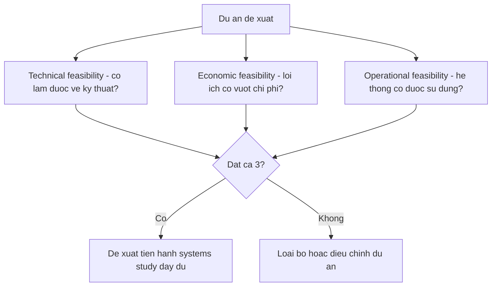
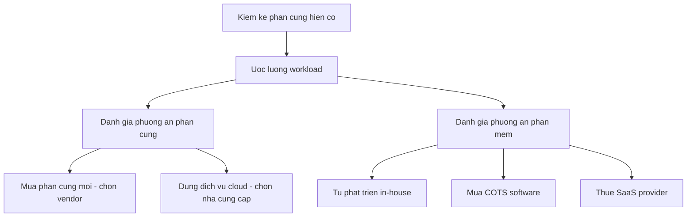
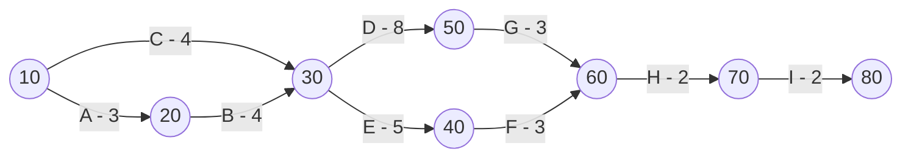
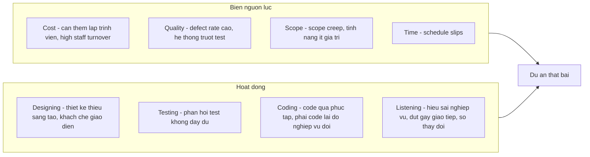
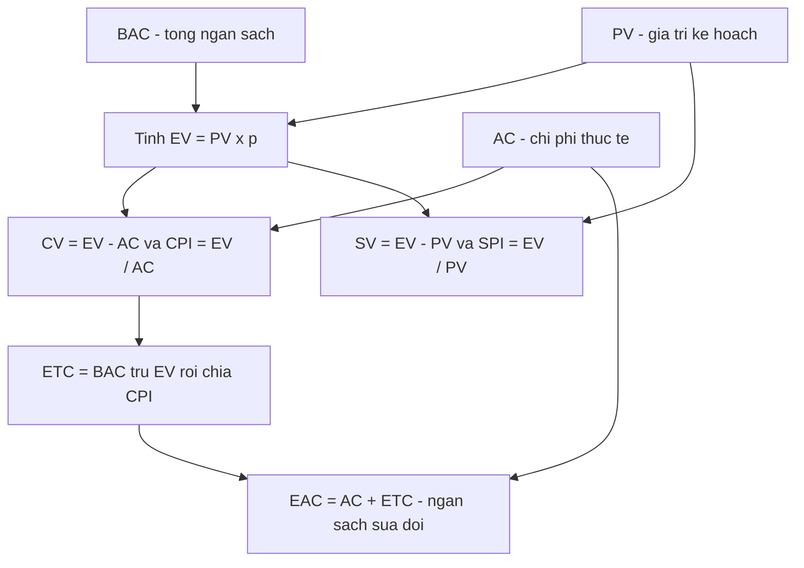
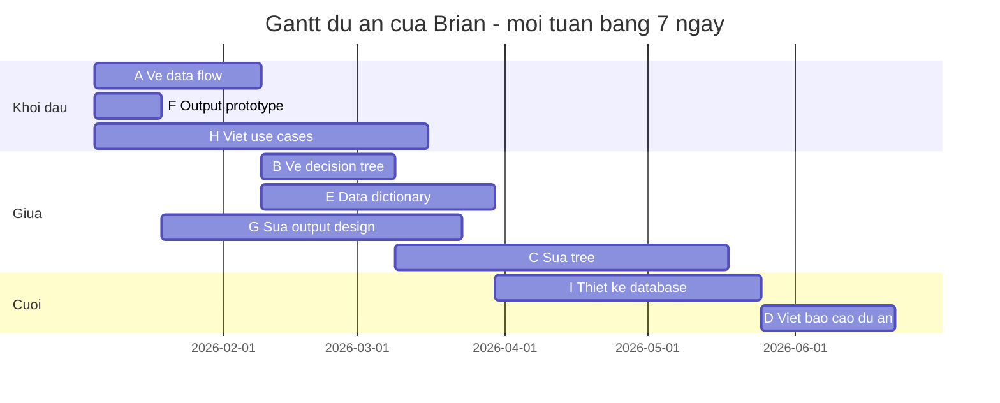
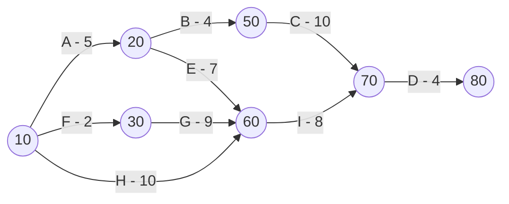
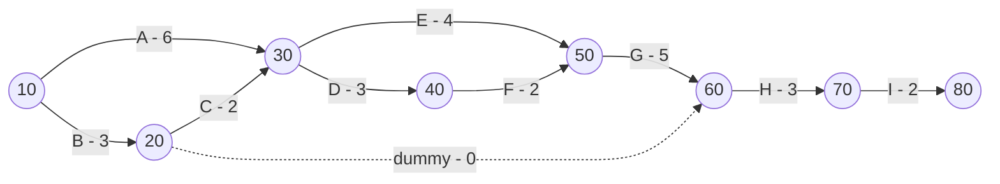

# Chương 3 — Project Management (Quản lý dự án)

> Nguồn: Kendall & Kendall, *Systems Analysis and Design*, 11th edition — Chapter 3 (trang sách 55–105).

---

## 🎯 Mục tiêu học tập

*(Trang mở đầu chương với danh sách Learning Objectives không nằm trong file trích xuất; các mục tiêu dưới đây được tổng hợp trung thực theo các mục lớn của chương.)*

Sau khi học xong chương này, bạn có thể:

1. Hiểu cách các dự án hệ thống được **khởi tạo (project initiation)** và **lựa chọn (project selection)**; biết cách **định nghĩa vấn đề (problem definition)** của doanh nghiệp.
2. Xác định **tính khả thi (feasibility)** của dự án đề xuất trên 3 phương diện: **kỹ thuật (technical)**, **kinh tế (economic)** và **vận hành (operational)**.
3. Xác định nhu cầu **phần cứng và phần mềm**: kiểm kê, đánh giá, so sánh **mua phần cứng vs dùng cloud**, hiểu **BYOD**, và quyết định **tự viết phần mềm vs mua COTS vs thuê SaaS**.
4. **Dự báo (forecasting)** và so sánh **chi phí – lợi ích** (tangible/intangible) bằng **break-even analysis** và **payback**.
5. Lập kế hoạch dự án: xây **Work Breakdown Structure (WBS)**, **ước lượng thời gian** (kinh nghiệm, tương tự, three-point estimation, function point analysis, phần mềm COCOMO II) và **lập lịch** bằng **Gantt chart** và **PERT diagram** (tìm **critical path**, **slack time**).
6. **Kiểm soát dự án**: ước lượng chi phí, lập **ngân sách (budget)**, quản lý **rủi ro** (fishbone diagram), **đẩy nhanh tiến độ (expediting)** và kiểm soát chi phí bằng **Earned Value Management (EVM)**.
7. **Quản lý nhóm dự án**: lập nhóm đa dạng, giao tiếp, hai kiểu trưởng nhóm, chuẩn mực nhóm (team norms), đặt mục tiêu năng suất, tạo động lực; đặc thù quản lý dự án ecommerce; viết **project charter**.
8. Soạn và trình bày một **systems proposal (đề xuất hệ thống)** hiệu quả với 10 phần chuẩn, dùng bảng và đồ thị đúng cách.

---

## 📖 Tóm tắt & giải thích kiến thức

### 1. Khởi tạo dự án (Project Initiation)

Dự án hệ thống được đề xuất vì **2 lý do lớn**: (1) doanh nghiệp gặp **vấn đề (problems)** có thể giải quyết bằng hệ thống thông tin, và (2) doanh nghiệp nhận ra **cơ hội cải tiến (opportunities)** qua việc nâng cấp, thay đổi hoặc cài đặt hệ thống mới.

**Cách phát hiện vấn đề** (Figure 3.1):

| Cách phát hiện | Dấu hiệu cụ thể |
|---|---|
| Kiểm tra đầu ra so với tiêu chí hiệu suất | Quá nhiều lỗi; công việc làm chậm, sai, không đầy đủ, hoặc không làm |
| Quan sát hành vi nhân viên | Vắng mặt cao, bất mãn với công việc cao, tỷ lệ nghỉ việc cao |
| Lắng nghe phản hồi bên ngoài (khách hàng, nhà cung cấp, đối tác) | Khiếu nại, góp ý cải tiến, mất doanh số / doanh số giảm |

> **Ví dụ đời thường:** một quán ăn nhận thấy khách phàn nàn chờ lâu (phản hồi bên ngoài), nhân viên phục vụ nghỉ việc liên tục (hành vi nhân viên), và hóa đơn hay bị tính sai (đầu ra lỗi) → có thể cần một hệ thống order/tính tiền mới.

#### Định nghĩa vấn đề (Problem Definition)

Dù dùng SDLC cổ điển hay hướng đối tượng, nhà phân tích trước hết phải định nghĩa **vấn đề và mục tiêu** của hệ thống. Một problem definition gồm:

1. **Problem statement** — phát biểu vấn đề (1–2 đoạn).
2. **Issues** — các mảng vấn đề độc lập của *tình trạng hiện tại*.
3. **Objectives** — mục tiêu, *tình trạng mong muốn*, đối ứng 1-1 với từng issue (kèm **trọng số/weight** thể hiện tầm quan trọng, do người dùng đánh giá).
4. **Requirements** — những điều bắt buộc phải đạt (bảo mật, tính dễ dùng, yêu cầu pháp lý…).
5. **Constraints** — ràng buộc giới hạn (thường chứa từ "không được": ngân sách, thời hạn…).

**7 cách nhận diện issue chính từ phỏng vấn người dùng:** (1) chủ đề lặp lại nhiều lần bởi nhiều người; (2) dùng cùng ẩn dụ (kinh doanh là "cuộc chiến", "cỗ máy"…); (3) kể một câu chuyện có mở–thân–kết; (4) nói rất lâu về một chủ đề; (5) nói thẳng "đây là vấn đề lớn"; (6) ngôn ngữ cơ thể / nhấn mạnh; (7) là điều đầu tiên người dùng nhắc đến.

**Ví dụ Catherine's Catering:** công ty tiệc cưới nhỏ phát triển nhanh, quá tải điện thoại hỏi menu, xếp lịch nhân viên bán thời gian rối loạn, khó xử lý thay đổi số khách sát ngày… → problem definition với 6 issues (có trọng số 10, 9, 8, 7, 6, 5, 3), 6 objectives đối ứng, requirements (hệ thống phải bảo mật, dễ dùng cho người không rành kỹ thuật…) và constraints (chi phí phát triển ≤ $50.000; website phải xong trước 1/3). Từ mỗi objective sinh ra **user requirements**, và mỗi requirement sinh ra một mục trong **test plan sơ bộ**.

#### Lựa chọn dự án (Selection of Projects)

Không phải dự án nào cũng đáng làm. **5 tiêu chí lựa chọn dự án:**

1. Có **sự hậu thuẫn của ban quản lý (backing from management)** — điều kiện tiên quyết.
2. **Thời điểm (timing)** cam kết nguồn lực phù hợp cho cả tổ chức lẫn nhà phân tích.
3. Cải thiện việc đạt **mục tiêu chiến lược** của tổ chức (tăng lợi nhuận, hỗ trợ chiến lược cạnh tranh, cải thiện hợp tác với đối tác, vận hành nội bộ, hỗ trợ ra quyết định, dịch vụ khách hàng, tinh thần nhân viên).
4. **Khả thi thực tế** về nguồn lực và năng lực của nhà phân tích lẫn doanh nghiệp.
5. **Đáng giá** so với các cách đầu tư nguồn lực khác — mọi dự án cạnh tranh nhau về thời gian, tiền và con người.

---

### 2. Xác định tính khả thi (Determining Feasibility)

**Feasibility study không phải là nghiên cứu hệ thống đầy đủ** — nó chỉ thu thập dữ liệu ở mức rộng để ban quản lý quyết định *có nên tiến hành systems study hay không*. Dự án phải khả thi trên **cả 3** phương diện:

| Loại khả thi | Câu hỏi trung tâm | Nội dung đánh giá |
|---|---|---|
| **Technical feasibility** (kỹ thuật) | *Có làm được không?* | Hệ thống hiện tại có nâng cấp/bổ sung được không; công nghệ đáp ứng yêu cầu có tồn tại không; nhân sự có đủ trình độ kỹ thuật, có thể thuê thêm/outsource không; có phần mềm đóng gói phù hợp không |
| **Economic feasibility** (kinh tế) | *Có đáng tiền không?* | Thời gian của nhà phân tích & nhóm; chi phí nghiên cứu hệ thống; chi phí thời gian nhân viên; chi phí ước tính phần cứng; chi phí phần mềm/phát triển/tùy biến. Nếu lợi ích dài hạn không vượt chi phí ngắn hạn → dừng |
| **Operational feasibility** (vận hành) | *Có được dùng không?* | Nguồn nhân lực có sẵn cho dự án; hệ thống *có vận hành và được sử dụng* sau khi triển khai không. Nếu người dùng "chung thủy" với hệ thống cũ và không thấy vấn đề → kháng cự mạnh, khả năng vận hành thấp |

> **Ví dụ đời thường:** mở quán cà phê robot pha chế — *kỹ thuật*: robot pha cà phê có bán trên thị trường (khả thi); *kinh tế*: giá robot 2 tỷ trong khi quán chỉ lãi 20 triệu/tháng (không khả thi); *vận hành*: khách quen thích trò chuyện với barista, có thể tẩy chay (rủi ro). → Dự án nên dừng dù "làm được".

#### Ước lượng khối lượng công việc (Estimating Workloads)

Nhà phân tích ước tính **workload hiện tại và tương lai** để phần cứng mua về gánh được cả hai. Workload được **lấy mẫu (sampled)** chứ không chạy thử toàn bộ. So sánh hệ thống hiện tại vs đề xuất theo: khi nào/cách làm, thời gian con người, thời gian máy (ví dụ Figure 3.4: hệ thống dashboard web mới giảm thời gian nhập liệu hàng ngày từ 20 phút còn 10 phút, báo cáo hàng tháng từ 30 phút còn 10 phút).

---

### 3. Xác định nhu cầu phần cứng và phần mềm

#### Kiểm kê phần cứng (Inventorying Computer Hardware)

Cần biết 7 điều: (1) loại thiết bị, model, hãng; (2) trạng thái vận hành (đang đặt, đang chạy, lưu kho, chờ sửa); (3) tuổi ước tính; (4) tuổi thọ dự kiến; (5) vị trí vật lý; (6) bộ phận/người chịu trách nhiệm; (7) hình thức tài chính (sở hữu, thuê, mướn).

#### Đánh giá phần cứng — 4 tiêu chí hiệu năng

1. Thời gian cho giao dịch trung bình (nhập liệu + nhận kết quả).
2. Tổng dung lượng xử lý đồng thời (volume capacity).
3. Thời gian rảnh (idle time) của CPU/mạng.
4. Dung lượng bộ nhớ.

Chạy thử workload mô phỏng trên nhiều hệ thống gọi là **benchmarking**.

#### Mua phần cứng vs Dùng dịch vụ Cloud (Figure 3.6)

| | Ưu điểm | Nhược điểm |
|---|---|---|
| **Mua phần cứng** | Toàn quyền kiểm soát phần cứng & phần mềm; thường rẻ hơn về dài hạn; lợi thế thuế nhờ khấu hao | Chi phí ban đầu cao; rủi ro lỗi thời; rủi ro "kẹt" nếu chọn sai; chịu toàn bộ trách nhiệm vận hành & bảo trì |
| **Dùng cloud** | Nhà cung cấp lo bảo trì & nâng cấp; thay đổi phần cứng/phần mềm nhanh; **scalable** — mở rộng nhanh; nhất quán đa nền tảng; không đọng vốn | Không kiểm soát dữ liệu của chính mình; rủi ro an ninh dữ liệu; rủi ro độ tin cậy của Internet; API độc quyền gây khó đổi nhà cung cấp |

**4 loại hình cloud computing:** **SaaS** (Software as a Service — thuê ứng dụng), **IaaS** (Infrastructure as a Service, còn gọi **HaaS** — thuê hạ tầng phần cứng), **PaaS** (Platform as a Service — thuê cả nền tảng: phần cứng, hệ điều hành, lưu trữ, mạng), và **DRaaS** (Disaster Recovery as a Service — khôi phục ứng dụng doanh nghiệp tại địa điểm khác khi có thảm họa). Có thể dùng **hybrid** (một phần tại chỗ, một phần trên cloud; public + private).

Chiến lược cloud (theo Cearley): (1) xác định business case cấp cao; (2) xác định yêu cầu cốt lõi (hiệu năng, bảo mật, IT governance, tăng trưởng dự kiến); (3) xác định công nghệ cốt lõi.

#### BYOD (Bring Your Own Device / BYOT)

Nhân viên dùng **thiết bị cá nhân** (điện thoại, tablet) truy cập mạng, dữ liệu, dịch vụ công ty từ xa.

- **Lợi ích:** tăng tinh thần nhân viên; giảm chi phí mua thiết bị ban đầu; truy cập từ xa 24/7 mọi nơi; tận dụng giao diện quen thuộc.
- **Nhược điểm lớn nhất: rủi ro an ninh từ người dùng không được huấn luyện** — mất/trộm thiết bị và dữ liệu, truy cập trái phép vào mạng công ty, thói quen cá nhân nguy hiểm (Wi-Fi công cộng miễn phí, app như Dropbox…).

#### Phần mềm: Tự viết vs Mua COTS vs Thuê SaaS (Figure 3.8)

| Phương án | Ưu điểm | Nhược điểm | Khi nào dùng |
|---|---|---|---|
| **Custom software** (tự viết) | Đáp ứng đúng nhu cầu chuyên biệt; đổi mới tạo lợi thế cạnh tranh; đội in-house sẵn sàng bảo trì; niềm tự hào sở hữu | Chi phí ban đầu có thể cao hơn nhiều; phải thuê/làm việc với đội phát triển; tự lo bảo trì lâu dài | Không có COTS phù hợp; muốn lợi thế cạnh tranh/first mover; yêu cầu đặc thù/ngành ngách |
| **COTS** (commercial off-the-shelf — mua đóng gói) | Đã được "mài giũa" thương mại; độ tin cậy cao (test kỹ); nhiều chức năng bổ sung; chi phí ban đầu thường thấp; nhiều công ty khác đã dùng; kèm help & training | Thiên về lập trình, không thiên về nghiệp vụ; phải sống chung với tính năng có sẵn; tùy biến hạn chế; tương lai tài chính vendor bất định; giảm cảm giác sở hữu & cam kết | Dễ tích hợp vào hệ thống hiện có; không cần thay đổi/tùy biến liên tục; tổ chức không sắp thay đổi lớn |
| **SaaS** (thuê ngoài) | Tập trung vào sứ mệnh chiến lược; không cần thuê/đào tạo/giữ đội IT lớn; không tốn thời gian nhân viên cho việc IT không cốt lõi | Mất kiểm soát dữ liệu, hệ thống, nhân sự IT, lịch trình; lo ngại về sự ổn định tài chính của provider; lo ngại bảo mật, bí mật, quyền riêng tư; mất lợi thế chiến lược từ ứng dụng tự đổi mới | Tổ chức nhỏ, ít chuyên môn IT, muốn nhanh |

Thực tế: hơn một nửa dự án được xây từ đầu; ~71% công ty dùng agile cho một số dự án; **dưới 5%** phần mềm là off-the-shelf dùng ngay không cần chỉnh sửa.

#### Đánh giá vendor (Figure 3.7 & 3.9)

- **Vendor hỗ trợ phần cứng:** dòng sản phẩm đầy đủ, chất lượng, bảo hành; bảo trì định kỳ, thời gian phản hồi khẩn cấp cam kết, cho mượn thiết bị khi sửa; đào tạo tại chỗ, hỗ trợ kỹ thuật. Cloud provider thường có cam kết uptime, hoàn tiền 30–60 ngày.
- **6 nhóm tiêu chí chấm điểm phần mềm:** (1) performance effectiveness (làm được mọi việc yêu cầu & mong muốn); (2) performance efficiency (phản hồi nhanh, nhập/xuất/lưu trữ/backup hiệu quả); (3) ease of use (giao diện tốt, help menu, phục hồi lỗi tốt); (4) flexibility (tùy chọn nhập/xuất, dùng chung với phần mềm khác); (5) quality of documentation; (6) manufacturer support (hotline, FAQ, newsletter, bản cập nhật).
- Đánh giá phần mềm bằng **demo với dữ liệu thử của chính khách hàng**, không tin lời chào hàng suông; nhờ pháp chế xem hợp đồng trước khi ký.

---

### 4. Xác định, dự báo và so sánh chi phí – lợi ích

Quyết định tiếp tục dự án dựa trên **cost–benefit analysis**, không phải chỉ dựa trên yêu cầu thông tin.

#### Dự báo (Forecasting)

- **Không có dữ liệu lịch sử** → dùng phương pháp phán đoán: ước lượng của đội bán hàng, khảo sát nhu cầu khách hàng, **Delphi study** (nhóm chuyên gia dự báo độc lập qua nhiều vòng để đạt đồng thuận), xây kịch bản, loại suy lịch sử.
- **Có dữ liệu lịch sử** → chia 2 lớp:
  - **Conditional** (có quan hệ nhân quả giữa các biến): correlation, regression, leading indicators, econometrics, input/output models.
  - **Unconditional** (không cần tìm quan hệ nhân quả — rẻ, dễ làm): graphical judgment, **moving average (trung bình trượt)**, phân tích chuỗi thời gian.
- **Moving average:** trung bình cộng của N kỳ gần nhất dùng để dự báo kỳ kế tiếp (trung bình 3 tháng 1–2–3 dự báo tháng 4…). Ưu: làm mượt biến động mùa vụ/ngẫu nhiên, lộ ra xu hướng. Nhược: bị ảnh hưởng bởi giá trị cực đoan mạnh hơn so với phán đoán đồ thị hay least squares.

#### Chi phí và lợi ích: hữu hình vs vô hình

| | **Tangible (hữu hình — đo được bằng tiền)** | **Intangible (vô hình — khó/không đo được)** |
|---|---|---|
| **Benefits** | Tăng tốc độ xử lý; truy cập thông tin trước đây không truy cập được; thông tin kịp thời hơn; sức mạnh tính toán của máy; giảm thời gian nhân viên hoàn thành công việc | Cải thiện quá trình ra quyết định; tăng độ chính xác; cạnh tranh hơn về dịch vụ khách hàng; giữ hình ảnh doanh nghiệp tốt; tăng sự hài lòng của nhân viên (bỏ việc nhàm chán) |
| **Costs** | Chi phí thiết bị (máy tính, máy in), tài nguyên, thời gian nhà phân tích, thời gian lập trình viên, lương nhân viên — dự toán được chính xác | Mất lợi thế cạnh tranh; mất danh tiếng người đi đầu; hình ảnh công ty xấu đi do khách bất mãn; ra quyết định kém do thông tin chậm/thiếu — gần như không thể quy ra tiền |

> ⚠️ Hệ thống xây **chỉ vì lợi ích vô hình sẽ không thành công**, nhưng đề xuất phải trình bày **cả hai** loại để người quyết định có đủ thông tin.

#### So sánh chi phí – lợi ích

- **Break-even analysis (phân tích hòa vốn):** điểm tổng chi phí của hệ thống *hiện tại* và hệ thống *đề xuất* giao nhau = **break-even point** — từ điểm đó hệ thống mới bắt đầu có lợi. Tổng chi phí = chi phí vận hành lặp lại + chi phí phát triển một lần. Hữu ích khi doanh nghiệp đang tăng trưởng và **khối lượng (volume)** là biến chính của chi phí. Nhược điểm: **giả định lợi ích không đổi** dù dùng hệ thống nào — điều này không đúng thực tế.
- **Payback analysis (phân tích hoàn vốn):** xác định **mất bao lâu để lợi ích tích lũy bù lại chi phí phát triển** (ví dụ trong sách: payback period 3,5 năm — vẽ đường lợi ích tích lũy cắt đường chi phí tích lũy).

---

### 5. Quản lý thời gian và hoạt động (Managing Time and Activities)

#### Work Breakdown Structure (WBS)

Để hoàn thành dự án **đúng hạn, trong ngân sách, đủ tính năng đã hứa**, dự án phải được chia thành các task nhỏ — tập hợp các task này là **WBS**. Task đúng chuẩn có 3 tính chất:

1. Mỗi task có **một deliverable** (kết quả hữu hình) duy nhất.
2. Mỗi task giao được cho **một cá nhân hoặc một nhóm** duy nhất.
3. Mỗi task có **một người chịu trách nhiệm** giám sát và kiểm soát.

Các task không cần dài bằng nhau, nhưng **tổng phải bằng 100% khối lượng công việc**. Phương pháp chính là **decomposition (phân rã)**: từ ý tưởng lớn chẻ dần thành hoạt động nhỏ, dừng khi mỗi task chỉ còn một deliverable. WBS có thể **product-oriented** (chia website theo từng trang: home, sản phẩm, FAQ, liên hệ, ecommerce) hoặc **process-oriented** (chia theo pha SDLC: khởi tạo → lập kế hoạch → kế hoạch hỗ trợ → phân tích → thiết kế → ra mắt) — loại sau điển hình trong phân tích thiết kế hệ thống.

#### Kỹ thuật ước lượng thời gian — 5 cách

1. **Dựa vào kinh nghiệm** — biết cả thời gian "bình thường" lẫn khi "có chuyện".
2. **Dùng phép loại suy (analogies)** — tìm dự án tương tự đã làm, xây 2 mô hình (2 sơ đồ PERT) và so sánh.
3. **Three-point estimation** — 3 ước lượng cho mỗi task rồi tính trung bình có trọng số:

   **E = (a + 4m + b) / 6**

   với *a* = lạc quan nhất (best case), *m* = khả dĩ nhất (most likely), *b* = bi quan nhất (worst case).

   *Ví dụ trong sách:* viết một module thường mất 10 ngày (m), thuận lợi thì 8 ngày (a), nếu coder nghỉ việc thì 30 ngày (b) → E = (8 + 4×10 + 30)/6 = **13 ngày**.
4. **Function point analysis** — lấy **5 thành phần chính** của hệ thống: (1) external inputs, (2) external outputs, (3) external queries, (4) internal logical files, (5) external interface files — chấm điểm độ phức tạp từng loại; dùng để ước lượng khối lượng công việc, quy mô nhân sự, và so sánh thời gian phát triển giữa các ngôn ngữ lập trình (tham khảo www.ifpug.org).
5. **Phần mềm ước lượng** — mô hình **COCOMO II** (Constructive Cost Model), **COSYSMO**, hay phần mềm như SystemStar: nhập quy mô hệ thống (ví dụ số dòng code), kinh nghiệm đội ngũ, nền tảng, mức usability… → dự phóng thô ngày hoàn thành, tinh chỉnh dần khi dự án chạy.

---

### 6. Lập lịch dự án (Project Scheduling)

**Planning** = chọn đội phân tích, phân công, ước lượng thời gian từng task, xếp lịch. **Control** = dùng phản hồi để giám sát (so kế hoạch với thực tế), điều chỉnh/đẩy nhanh hoạt động, động viên đội ngũ.

Quy trình: phân rã 3 pha lớn (Analysis → Design → Implementation) thành hoạt động con, rồi chẻ tiếp thành task chi tiết kèm số tuần (ví dụ Figure 3.14: Data gathering gồm phỏng vấn 3 tuần, bảng hỏi 4 tuần, đọc báo cáo 4 tuần, giới thiệu prototype 5 tuần, quan sát phản ứng 3 tuần; Data flow analysis 8 tuần; Proposal gồm cost-benefit 3 tuần, soạn 2 tuần, trình bày 2 tuần).

#### Gantt chart

Biểu đồ thanh ngang: **mỗi thanh = một task, chiều dài thanh tỷ lệ với thời lượng**; trục ngang = thời gian, trục dọc = hoạt động. Có ký hiệu ▲ đánh dấu tuần hiện tại; thanh tô màu = phần đã hoàn thành → nhìn ra ngay task nào trễ, task nào vượt tiến độ. **Ưu điểm chính: đơn giản**, dễ dùng, giao tiếp tốt với người dùng cuối, thanh vẽ theo tỷ lệ. **Nhược điểm: không thể hiện quan hệ phụ thuộc (precedence)** giữa các task.

#### PERT diagram (Program Evaluation and Review Technique)

- Ra đời cuối thập niên 1950 cho dự án tàu ngầm hạt nhân **Polaris của Hải quân Mỹ** (tiết kiệm 2 năm phát triển). Trong Microsoft Project gọi là **network diagram**.
- **Mũi tên = hoạt động** (độ dài mũi tên KHÔNG tỷ lệ thời lượng); **nút tròn = sự kiện (event)** — ghi nhận hoạt động hoàn thành và chỉ ra hoạt động nào phải xong trước (**precedence**).
- Hữu ích khi các hoạt động có thể làm **song song**.
- **Critical path (đường găng)** = đường **dài nhất** từ đầu đến cuối; định nghĩa: đường mà **chỉ cần trễ 1 ngày trên đó là cả dự án trễ theo**. Thời gian dự án = độ dài đường găng (dự án không phải cuộc đua — mọi đường đều phải hoàn thành).
- **Slack time** = độ trễ cho phép trên các đường không găng.
- **Dummy activity** (hoạt động giả, thời lượng 0) dùng để bảo toàn logic phụ thuộc hoặc làm rõ sơ đồ (ví dụ Figure 3.17: dummy quyết định C cần cả A và B xong, hay chỉ cần B).

**3 lợi thế của PERT so với Gantt:** (1) dễ nhận diện thứ tự phụ thuộc; (2) dễ nhận diện critical path và hoạt động găng; (3) dễ xác định slack time.

**Ví dụ PERT trong sách (Figure 3.18–3.19)** — pha phân tích:

| Task | Hoạt động | Phải sau | Thời lượng (tuần) |
|---|---|---|---|
| A | Phỏng vấn | — | 3 |
| B | Phát bảng hỏi | A | 4 |
| C | Đọc báo cáo công ty | — | 4 |
| D | Phân tích luồng dữ liệu | B, C | 8 |
| E | Giới thiệu prototype | B, C | 5 |
| F | Quan sát phản ứng với prototype | E | 3 |
| G | Phân tích chi phí-lợi ích | D | 3 |
| H | Soạn proposal | F, G | 2 |
| I | Trình bày proposal | H | 2 |

4 đường: 10–20–30–50–60–70–80 (A,B,D,G,H,I) = 3+4+8+3+2+2 = **22 tuần** ← **critical path**; 10–20–30–40–60–70–80 = 19; 10–30–50–60–70–80 = 19; 10–30–40–60–70–80 = 16. Nhà phân tích phải giám sát chặt các hoạt động trên đường găng.

---

### 7. Kiểm soát dự án (Controlling a Project)

#### Ước lượng chi phí & lập ngân sách

Sau khi có WBS và lịch, cần: (1) ước lượng chi phí cho từng hoạt động trong WBS; (2) lập **budget** và được tổ chức/khách hàng duyệt; (3) quản lý & kiểm soát chi phí suốt dự án. **3 cách ước lượng chi phí:**

1. **Top-down** — dựa trên dự án tương tự đã làm, điều chỉnh theo khác biệt.
2. **Bottom-up** — từng thành viên phụ trách tự ước lượng chi phí phần việc của mình; project manager rà soát và tổng hợp. Nhược: chất lượng phụ thuộc năng lực từng người, và tốn thời gian.
3. **Parametric modeling** — ước lượng theo tham số (ví dụ $75/dòng code, $80/giờ lập trình viên × số dòng code, số giờ ước tính); phần mềm như COCOMO II hỗ trợ.

**2 lý do ước lượng chi phí thất bại:** (1) nhà phân tích **quá lạc quan** (tin đội mình làm nhanh, không lỗi → đánh giá thấp khối lượng); (2) **vội vàng** muốn qua nhanh bước ước lượng để bắt tay vào việc → dành ít thời gian hơn mức cần.

**Budget** là deliverable then chốt — khách hàng nào cũng muốn thấy sớm; theo mẫu chuẩn của khách hàng; gồm giờ công × đơn giá của từng người (nội bộ/outsource), chi phí phần cứng, phần mềm, đào tạo (ví dụ Figure 3.20: tổng dự toán $419.000).

#### Quản lý rủi ro & Fishbone diagram

Phòng thủ tốt nhất: các thảo luận ban đầu + feasibility study. Dự án agile cũng **không miễn nhiễm** với rắc rối. Để liệt kê hệ thống mọi thứ có thể hỏng, vẽ **fishbone diagram** (còn gọi **cause-and-effect diagram / Ishikawa diagram**): với agile, xếp các biến kiểm soát nguồn lực (Cost, Quality, Scope, Time) phía trên và các hoạt động (Designing, Testing, Coding, Listening) phía dưới.

Bài học từ thất bại (theo lập trình viên chuyên nghiệp): quản lý đặt **deadline bất khả thi**; tin vào **huyền thoại "thêm người là nhanh hơn"**; **cấm đội tìm chuyên gia bên ngoài** giúp giải quyết vấn đề. Nhớ: quyết định cuối cùng thuộc về management; uy tín của đội gắn liền với dự án họ nhận.

#### Đẩy nhanh tiến độ (Expediting) & Crash time

- **Expediting** = tăng tốc một quy trình. Lý do: được **thưởng** nếu xong sớm; **giải phóng nguồn lực** cho dự án khác sớm hơn; (và bù thời gian khi trễ tiến độ).
- **Crash time** = thời gian **tối thiểu tuyệt đối** để hoàn thành một hoạt động nếu rót thêm tiền. Số tuần giảm được tối đa = thời lượng dự kiến − crash time.
- **Nguyên tắc vàng: chỉ expedite hoạt động NẰM TRÊN critical path mới rút ngắn được dự án.** Trong các hoạt động găng đủ điều kiện, chọn hoạt động **rẻ nhất** mỗi bước; khi xuất hiện **nhiều đường găng**, phải rút ngắn **đồng thời tất cả** các đường găng (chọn hoạt động chung, hoặc tổ hợp mỗi đường một hoạt động).
- Ví dụ trong sách (Figure 3.22–3.23): rút dự án 22 tuần → tối thiểu **15 tuần** với tổng chi phí $5.600 (giảm A 2 tuần, B 2 tuần, C 1 tuần, D 2 tuần, I 1 tuần). Nếu ngân sách chỉ $4.000 → dừng ở 17 tuần ($3.400). Nếu mỗi tuần rút ngắn chỉ tiết kiệm $750 → dừng khi chi phí biên bước kế tiếp ($800) vượt $750.

#### Earned Value Management (EVM)

Kỹ thuật xác định **tiến độ (hoặc thụt lùi)** của dự án, liên quan chi phí, lịch trình và hiệu suất của đội. **4 đại lượng cốt lõi:**

| Đại lượng | Ý nghĩa | Công thức |
|---|---|---|
| **BAC** — Budget at Completion | Tổng ngân sách toàn dự án (hoặc task) | Tổng chi phí dự toán các giai đoạn |
| **PV** — Planned Value | Giá trị công việc *theo kế hoạch* phải xong đến thời điểm này (budgeted cost of work scheduled) | Dự toán tích lũy đến hiện tại |
| **AC** — Actual Cost | Tổng chi phí *thực tế* (trực tiếp + gián tiếp) đã bỏ ra đến hiện tại | — |
| **EV** — Earned Value | Ước tính giá trị công việc *đã thực sự hoàn thành* | **EV = PV × p** (p = % công việc đã hoàn thành) |

**4 chỉ số hiệu suất suy ra:**

| Chỉ số | Công thức | Diễn giải |
|---|---|---|
| **CV** — Cost Variance | CV = EV − AC | Âm → vượt chi phí; dương → dưới chi phí |
| **SV** — Schedule Variance | SV = EV − PV | Âm → chậm tiến độ; dương → vượt tiến độ |
| **CPI** — Cost Performance Index | CPI = EV / AC | < 1.0 → vượt ngân sách; > 1.0 → dưới ngân sách |
| **SPI** — Schedule Performance Index | SPI = EV / PV | < 1.0 → chậm tiến độ; > 1.0 → nhanh hơn kế hoạch |

**2 ước tính về sau:** **ETC** (Estimate to Complete) = (BAC − EV) / CPI — cần thêm bao nhiêu tiền để hoàn thành với tốc độ hiện tại; **EAC** (Estimate at Completion) = AC + ETC — ngân sách sửa đổi, tổng chi khi xong.

**Ví dụ website 5 tháng trong sách (Figure 3.24):** BAC = $18.000. Cuối tháng 4: PV = $15.000; AC = $17.000; p = (100+100+100+50)/400 = 0,875 → EV = 15.000 × 0,875 = **$13.125**. CV = 13.125 − 17.000 = **−$3.875** (vượt chi); SV = 13.125 − 15.000 = **−$1.875** (chậm tiến độ); CPI = 13.125/17.000 = **0,772**; SPI = 13.125/15.000 = **0,875**. ETC = (18.000 − 13.125)/0,772 = **$6.315**; EAC = 17.000 + 6.315 = **$23.315** — vượt xa ngân sách $18.000 ban đầu. Nhà phân tích phải liên tục cân bằng **cost – time – scope**.

---

### 8. Quản lý nhóm dự án (Managing the Project Team)

#### Lập nhóm (Assembling a Team)

Tìm người chia sẻ giá trị teamwork, muốn giao hệ thống chất lượng đúng hạn đúng ngân sách; có đạo đức nghề nghiệp, trung thực, năng lực, sẵn sàng lãnh đạo theo chuyên môn, động lực, nhiệt huyết, tin cậy. Nhóm lý tưởng: ≥ 2 systems analyst (hỗ trợ, kiểm tra chéo, san sẻ việc); người hiểu nghiệp vụ (chuyên gia lĩnh vực của hệ thống — ví dụ người marketing cho site ecommerce); người biết lập trình VÀ người biết walkthrough/review/test/tài liệu; cả người nhìn "bức tranh lớn" lẫn người giỏi việc chi tiết; người có **kinh nghiệm** (code nhanh gấp ~5 lần người mới) và **nhiệt huyết**; chuyên gia usability; người viết tốt & nói giỏi để trình bày proposal.

**Nhóm đa dạng & hòa nhập (diverse & inclusive):** 4 bước của Alexander (2021): (1) quy trình tuyển minh bạch, công bằng; (2) công bằng lương; (3) hỗ trợ từng cá nhân thành công (kể cả thành viên khuyết tật); (4) bảo đảm mỗi người có tiếng nói. Nghiên cứu: nhóm đa dạng (≥3 người) ra quyết định tốt hơn cá nhân tới 87% số lần, cải thiện 60% chất lượng quyết định; nhóm **đa dạng nhận thức (cognitively diverse)** giải quyết vấn đề nhanh hơn.

#### Giao tiếp & hai kiểu trưởng nhóm

Nhóm luôn tìm **cân bằng giữa hoàn thành công việc và duy trì quan hệ**. Nhóm thường có **2 leader**: **task leader** (dẫn dắt hoàn thành nhiệm vụ) và **socioemotional leader** (chăm lo quan hệ xã hội, gắn kết) — cả hai đều cần. Căng thẳng (tension) phải được giải tỏa liên tục qua **feedback** khéo léo; phớt lờ căng thẳng → nhóm tan rã.

**Team norms** = kỳ vọng, giá trị, cách hành xử chung của nhóm — thuộc về nhóm đó, không tự chuyển sang nhóm khác, thay đổi theo thời gian (là **team process** hơn là sản phẩm). Norm có thể **functional** (giúp đạt mục tiêu) hoặc **dysfunctional** (ví dụ: "lính mới phải làm toàn bộ việc xếp lịch" — gây áp lực lên người mới, phí kinh nghiệm nhóm). Cần làm norm **tường minh** và định kỳ đánh giá lại; kỳ vọng bao trùm: **thay đổi là chuẩn mực**.

#### Mục tiêu năng suất & tạo động lực

Mục tiêu năng suất dựa trên chuyên môn, thành tích quá khứ của thành viên và tính chất dự án; nhóm phải **cùng xây dựng và đồng thuận** mục tiêu. Goal setting tạo động lực vì: (1) thành viên **biết trước** chính xác điều được kỳ vọng (trước mọi kỳ đánh giá); (2) có **quyền tự chủ** về cách đạt mục tiêu (mục tiêu định trước, phương tiện thì không); (3) mục tiêu **làm rõ** mức thành tựu kỳ vọng — đơn giản hóa không khí làm việc và "nạp điện" cho nó bằng cảm giác khả thi.

#### Quản lý dự án Ecommerce — 4 khác biệt so với dự án truyền thống

1. **Dữ liệu phân tán khắp tổ chức** → chính trị nội bộ (các đơn vị "giữ" dữ liệu của mình).
2. Cần **nhân sự đa dạng, liên phòng ban** (developer, consultant, chuyên gia DB, system integrator); nhóm ổn định là ngoại lệ; phải xây quan hệ đối tác trong-ngoài từ sớm.
3. Thách thức thật sự là **tích hợp ecommerce vào toàn bộ hệ thống nội bộ** (front end là phần dễ) — nhấn mạnh tích hợp cũng là cách chống chính trị nội bộ phá dự án.
4. **An ninh tối quan trọng** vì kết nối Internet với thế giới bên ngoài — kế hoạch bảo mật là một dự án riêng phải được quản lý như một dự án.

#### Project Charter

Văn bản tường thuật, làm rõ **9 câu hỏi**: (1) người dùng kỳ vọng gì (objectives), hệ thống làm gì để đạt; (2) **scope**/ranh giới dự án; (3) phương pháp phân tích sẽ dùng; (4) ai tham gia chính, người dùng cam kết bao nhiêu thời gian; (5) **deliverables** là gì; (6) ai đánh giá hệ thống, đánh giá thế nào, kết quả báo cho ai; (7) timeline ước tính, tần suất báo cáo milestone; (8) ai đào tạo người dùng; (9) ai bảo trì hệ thống. Charter thực chất là **hợp đồng** giữa trưởng nhóm phân tích với đội và với người dùng.

---

### 9. Systems Proposal (Đề xuất hệ thống)

Proposal bổ sung chi tiết mà charter chưa có: nhu cầu, phương án, khuyến nghị. **10 phần theo thứ tự:**

1. **Cover letter** — thư ngỏ, liệt kê người thực hiện, tóm tắt mục tiêu; ngắn gọn, thân thiện.
2. **Title page** — tên dự án, tên nhóm, ngày nộp.
3. **Table of contents** — bỏ nếu proposal < 10 trang.
4. **Executive summary** — 250–375 từ, trả lời who/what/when/where/why/how + khuyến nghị (nhiều người chỉ đọc phần này); **viết sau cùng**.
5. **Outline of systems study** — mọi phương pháp đã dùng (phỏng vấn, bảng hỏi, lấy mẫu, quan sát, prototyping).
6. **Detailed results** — phát hiện về nhu cầu con người & hệ thống, vấn đề/cơ hội dẫn tới các phương án.
7. **Systems alternatives** — **2–3 phương án** (trong đó có phương án *giữ nguyên hệ thống*), mỗi phương án có chi phí/lợi ích, ưu/nhược, và hành động triển khai rõ ràng.
8. **Systems analysts' recommendations** — phương án khuyến nghị + lý do, logic từ phân tích ở trên.
9. **Proposal summary** — ngắn, phản chiếu executive summary, kết thúc tích cực.
10. **Appendices** — tài liệu phụ, thư từ, tóm tắt các pha.

Trao báo cáo **tận tay** người được chọn; tổ chức buổi trình bày riêng **30–40 phút** (đa số thời gian cho Q&A), dùng slide, **không bao giờ đọc nguyên văn báo cáo**.

**Dùng bảng hiệu quả:** đặt trong thân bài (không đẩy xuống phụ lục); gọn trong 1 trang dọc; đánh số + tiêu đề mô tả ở đầu; dán nhãn hàng/cột; đóng khung nếu có chỗ; chú thích chân bảng khi cần. **Dùng đồ thị hiệu quả:** line/column/bar so sánh biến; pie/area thể hiện cơ cấu phần trăm; chọn kiểu truyền tải đúng ý; đặt trong thân bài; đánh số + tiêu đề; dán nhãn trục và mọi thành phần; kèm chú giải (key). Hình **luôn phải được diễn giải bằng lời**, không đứng một mình.

---

## 🔑 Bảng thuật ngữ (Keywords and Phrases)

| Thuật ngữ tiếng Anh | Nghĩa tiếng Việt |
|---|---|
| actual cost (AC) | chi phí thực tế đã bỏ ra đến thời điểm hiện tại |
| benchmarking | chạy thử workload mô phỏng trên nhiều hệ thống để so sánh hiệu năng |
| break-even analysis | phân tích hòa vốn |
| bring your own device (BYOD) | nhân viên dùng thiết bị cá nhân cho công việc |
| bring your own technology (BYOT) | nhân viên dùng công nghệ cá nhân (đồng nghĩa BYOD) |
| budget | ngân sách dự án |
| budget at completion (BAC) | tổng ngân sách toàn dự án/task |
| cloud computing | điện toán đám mây |
| cost performance index (CPI) | chỉ số hiệu suất chi phí (EV/AC) |
| cost variance (CV) | chênh lệch chi phí (EV − AC) |
| critical path | đường găng — đường dài nhất, trễ 1 ngày là cả dự án trễ |
| Disaster Recovery as a Service (DRaaS) | khôi phục sau thảm họa dưới dạng dịch vụ |
| earned value (EV) | giá trị đạt được — giá trị công việc đã hoàn thành |
| earned value management (EVM) | quản lý giá trị đạt được |
| ecommerce project management | quản lý dự án thương mại điện tử |
| economic feasibility | khả thi kinh tế |
| estimate at completion (EAC) | ước tính tổng chi phí khi hoàn thành (ngân sách sửa đổi) |
| estimate to complete (ETC) | ước tính chi phí còn cần để hoàn thành |
| expediting | đẩy nhanh tiến độ (rót thêm tiền để rút ngắn thời gian) |
| forecasting | dự báo |
| function point analysis | phân tích điểm chức năng (ước lượng theo 5 thành phần hệ thống) |
| Gantt chart | biểu đồ Gantt (thanh ngang theo thời gian) |
| Infrastructure as a Service (IaaS) | hạ tầng dưới dạng dịch vụ |
| Hardware as a Service (HaaS) | phần cứng dưới dạng dịch vụ (tên khác của IaaS) |
| intangible benefits | lợi ích vô hình (khó đo bằng tiền) |
| intangible costs | chi phí vô hình (khó ước tính) |
| moving average | trung bình trượt (dự báo làm mượt dao động) |
| operational feasibility | khả thi vận hành |
| payback | (phân tích) hoàn vốn |
| planned value (PV) | giá trị kế hoạch (chi phí dự toán của công việc theo lịch) |
| Platform as a Service (PaaS) | nền tảng dưới dạng dịch vụ |
| Program Evaluation and Review Technique (PERT) | kỹ thuật đánh giá và rà soát chương trình (sơ đồ mạng) |
| problem definition | định nghĩa vấn đề |
| productivity goals | mục tiêu năng suất |
| project charter | hiến chương dự án (văn bản cam kết kỳ vọng & deliverables) |
| schedule performance index (SPI) | chỉ số hiệu suất tiến độ (EV/PV) |
| schedule variance (SV) | chênh lệch tiến độ (EV − PV) |
| socioemotional leader | trưởng nhóm cảm xúc–xã hội (chăm lo quan hệ) |
| Software as a Service (SaaS) | phần mềm dưới dạng dịch vụ |
| systems proposal | đề xuất hệ thống |
| tangible benefits | lợi ích hữu hình (đo được bằng tiền) |
| tangible costs | chi phí hữu hình (dự toán chính xác được) |
| task leader | trưởng nhóm nhiệm vụ (dẫn dắt hoàn thành công việc) |
| team norms | chuẩn mực nhóm |
| team process | tiến trình tương tác của nhóm |
| technical feasibility | khả thi kỹ thuật |
| vendor support | hỗ trợ của nhà cung cấp |
| work breakdown structure (WBS) | cấu trúc phân rã công việc |

---

## ❓ Trả lời Review Questions

**1. Năm nội dung nền tảng của quản lý dự án?**
(1) Khởi tạo dự án — định nghĩa vấn đề; (2) xác định tính khả thi của dự án; (3) lập kế hoạch và kiểm soát hoạt động; (4) lập lịch dự án; (5) quản lý các thành viên nhóm phân tích hệ thống.

**2. Ba cách phát hiện vấn đề/cơ hội cần giải pháp hệ thống?**
(1) Kiểm tra đầu ra so với tiêu chí hiệu suất (lỗi nhiều, việc làm chậm/sai/thiếu/không làm); (2) quan sát hành vi nhân viên (vắng mặt cao, bất mãn, nghỉ việc nhiều); (3) lắng nghe phản hồi bên ngoài từ khách hàng, nhà cung cấp, đối tác (khiếu nại, góp ý, mất/giảm doanh số).

**3. Năm tiêu chí lựa chọn dự án hệ thống?**
(1) Được ban quản lý hậu thuẫn; (2) thời điểm cam kết phù hợp; (3) cải thiện việc đạt mục tiêu chiến lược của tổ chức; (4) khả thi về nguồn lực của nhà phân tích và tổ chức; (5) đáng giá so với các dự án/cách đầu tư khác.

**4. Technical feasibility là gì?**
Khả năng phát triển hệ thống mới với nguồn lực kỹ thuật hiện có: hệ thống hiện tại có thể nâng cấp/bổ sung để đáp ứng yêu cầu không; nếu không, có công nghệ nào tồn tại đáp ứng đặc tả không; tổ chức có (hoặc thuê được) nhân sự đủ trình độ kỹ thuật không.

**5. Economic feasibility là gì?**
Đánh giá xem nguồn lực kinh tế bỏ ra có xứng đáng không: thời gian của nhà phân tích và nhóm, chi phí nghiên cứu hệ thống đầy đủ (gồm thời gian nhân viên tham gia), chi phí ước tính phần cứng, phần mềm/phát triển/tùy biến phần mềm. Nếu lợi ích dài hạn không vượt chi phí ngắn hạn hoặc không giảm ngay chi phí vận hành → không khả thi kinh tế.

**6. Operational feasibility là gì?**
Phụ thuộc vào nguồn nhân lực có sẵn cho dự án; là việc dự đoán xem hệ thống **có vận hành và có được sử dụng** sau khi đưa vào hoạt động hay không (người dùng gắn bó với hệ thống cũ → kháng cự cao → khả thi vận hành thấp).

**7. Bốn tiêu chí đánh giá phần cứng hệ thống?**
(1) Thời gian cần cho giao dịch trung bình (nhập + xuất); (2) tổng dung lượng xử lý đồng thời của hệ thống; (3) thời gian rảnh (idle time) của CPU/mạng; (4) dung lượng bộ nhớ.

**8. Hai phương án chính để có/sử dụng phần cứng?**
(1) Mua phần cứng riêng; (2) thuê thời gian và không gian trên cloud (dùng dịch vụ điện toán đám mây).

**9. COTS là viết tắt của gì?**
**C**ommercial **O**ff-**T**he-**S**helf (software) — phần mềm thương mại đóng gói sẵn.

**10. Năm lợi ích của cloud computing?**
(1) Ít thời gian bảo trì hệ thống cũ/việc lặt vặt như nâng cấp; (2) mua dịch vụ IT đơn giản hơn, dừng dịch vụ không cần cũng nhanh hơn; (3) khả năng mở rộng (scalable); (4) tính nhất quán trên nhiều nền tảng trước đây rời rạc; (5) không đọng vốn, không cần vay tài chính.

**11. Ba nhược điểm của cloud computing?**
(1) Mất quyền kiểm soát dữ liệu (nếu nhà cung cấp phá sản, không rõ dữ liệu ra sao); (2) nguy cơ an ninh với dữ liệu không nằm trên máy của tổ chức; (3) độ tin cậy của Internet như một nền tảng; (ngoài ra: API độc quyền gây khó chuyển nhà cung cấp; một số quốc gia bắt buộc dùng cloud nội địa).

**12. BYOD là viết tắt của gì?**
**B**ring **Y**our **O**wn **D**evice — mang thiết bị cá nhân của mình (đi làm).

**13. Lợi ích của BYOD với tổ chức?**
Tăng tinh thần nhân viên; giảm chi phí ban đầu mua phần cứng IT; tạo điều kiện truy cập mạng công ty từ xa 24/7 bất kể vị trí; tận dụng giao diện quen thuộc để truy cập dịch vụ, ứng dụng, cơ sở dữ liệu, lưu trữ của công ty.

**14. Lợi ích của BYOD với nhân viên?**
Được dùng thiết bị của chính mình đã quen thuộc (giao diện quen), thuận tiện làm việc từ xa mọi lúc mọi nơi, thoải mái hơn (nâng cao tinh thần) vì trung bình họ đã mang sẵn một hoặc nhiều thiết bị di động đi làm.

**15. Nhược điểm lớn nhất của BYOD với tổ chức?**
**Rủi ro an ninh do người dùng không được huấn luyện**: mất thiết bị, trộm thiết bị và dữ liệu, truy cập trái phép vào mạng công ty qua thiết bị cá nhân, hành vi nguy hiểm (Wi-Fi công cộng, app như Dropbox…).

**16. Bốn loại hình cloud computing chính?**
SaaS (Software as a Service), IaaS (Infrastructure as a Service, còn gọi HaaS), PaaS (Platform as a Service), DRaaS (Disaster Recovery as a Service).

**17. Định nghĩa tangible costs và tangible benefits, ví dụ?**
- *Tangible costs*: chi phí mà nhà phân tích và bộ phận kế toán dự toán được chính xác, đòi hỏi chi tiền thật — ví dụ: chi phí mua máy tính/máy in, thời gian nhà phân tích, lương lập trình viên.
- *Tangible benefits*: lợi ích đo được bằng tiền/tài nguyên/thời gian tiết kiệm — ví dụ: tăng tốc độ xử lý, giảm thời gian nhân viên hoàn thành công việc, truy cập thông tin kịp thời hơn.

**18. Định nghĩa intangible costs và intangible benefits, ví dụ?**
- *Intangible costs*: chi phí khó ước tính, có thể không biết được — ví dụ: mất lợi thế cạnh tranh, hình ảnh công ty xấu đi do khách bất mãn, ra quyết định kém do thông tin chậm.
- *Intangible benefits*: lợi ích khó đo lường nhưng quan trọng — ví dụ: cải thiện quá trình ra quyết định, nâng cao độ chính xác, giữ hình ảnh doanh nghiệp tốt, tăng hài lòng của nhân viên.

**19. Bốn kỹ thuật so sánh chi phí – lợi ích?**
Chương này trình bày chi tiết hai kỹ thuật: **break-even analysis** và **payback**. Hai kỹ thuật kinh điển khác thường được kể cùng (ở các ấn bản trước): **cash-flow analysis** (phân tích dòng tiền) và **present value analysis** (phân tích giá trị hiện tại).

**20. Khi nào tính payback period hữu ích?**
Khi cần biết **mất bao lâu để lợi ích tích lũy của hệ thống bù lại chi phí phát triển** — đặc biệt hữu ích khi doanh nghiệp đang tăng trưởng và khối lượng giao dịch là biến số chính của chi phí, hoặc khi so sánh nhiều dự án cạnh tranh theo tốc độ thu hồi vốn.

**21. Ba nhược điểm của phương pháp payback?**
*(Ấn bản này không liệt kê tường minh; đáp án theo kiến thức chuẩn về payback):* (1) bỏ qua giá trị thời gian của tiền (time value of money); (2) bỏ qua toàn bộ lợi ích phát sinh **sau** điểm hoàn vốn; (3) chỉ đo tốc độ thu hồi vốn chứ không đo khả năng sinh lời tổng thể của hệ thống.

**22. WBS là gì, dùng khi nào?**
Work Breakdown Structure là việc chia dự án thành các task/hoạt động nhỏ hơn, mỗi task có đúng một deliverable, giao được cho một cá nhân/nhóm, và có một người chịu trách nhiệm giám sát; tổng các task = 100% khối lượng công việc. Dùng ở **giai đoạn lập kế hoạch**, khi cần hoàn thành dự án đúng hạn, trong ngân sách, đủ tính năng đã hứa — trước khi ước lượng thời gian, lập lịch và dự toán chi phí.

**23. Gantt chart là gì?**
Công cụ lập lịch dạng biểu đồ trong đó **thanh ngang đại diện cho task/hoạt động**, chiều dài thanh tỷ lệ với thời lượng tương đối của task; trục ngang là thời gian, trục dọc là danh mục hoạt động. Ưu điểm chính là đơn giản, giao tiếp tốt với người dùng cuối.

**24. Khi nào PERT diagram hữu ích cho dự án hệ thống?**
Khi các hoạt động có thể tiến hành **song song** thay vì tuần tự — ví dụ một số thành viên làm việc này trong khi các thành viên khác làm việc khác; và khi cần xác định đường găng, slack time để kiểm soát dự án.

**25. Ba lợi thế của PERT so với Gantt?**
(1) Dễ nhận diện thứ tự phụ thuộc (precedence); (2) dễ nhận diện critical path và các hoạt động găng; (3) dễ xác định slack time.

**26. Định nghĩa critical path?**
Đường **dài nhất** từ sự kiện đầu đến sự kiện cuối của sơ đồ mạng; được định nghĩa là đường mà **chỉ một ngày chậm trễ trên đó cũng làm cả dự án chậm theo** (không có slack).

**27. Project manager đánh giá rủi ro và tính nó vào kế hoạch thời gian như thế nào?**
Dùng các thảo luận ban đầu và feasibility study làm hàng rào chống dự án dễ thất bại; vẽ **fishbone diagram** để liệt kê hệ thống mọi thứ có thể hỏng (schedule slips, scope creep, tính năng ít giá trị…); học từ thất bại quá khứ (deadline phi thực tế, "thêm người là nhanh hơn", cấm tìm chuyên gia ngoài); dùng ước lượng ba điểm (kèm ước lượng bi quan) để dự phòng thời gian; theo dõi bối cảnh chính trị, tài chính, cạnh tranh của tổ chức.

**28. Cần ước tính các chi phí nào để lập budget?**
Giờ công và đơn giá của từng thành viên (nội bộ và outsource — project manager, thành viên, contractor); chi phí phần cứng (số lượng, đơn giá); chi phí phần mềm (off-the-shelf và phát triển in-house); chi phí đào tạo (seminar cho đội, cho học viên, giờ công học viên); thiết bị và công cụ đặc biệt cho từng hoạt động trong WBS.

**29. Vì sao budget quan trọng với nhà phân tích quản lý dự án?**
Budget là **deliverable then chốt** — mọi khách hàng đều muốn thấy budget chi tiết sớm; nó là cơ sở kiểm soát chi phí suốt dự án (baseline để so sánh, sửa đổi và thông báo các stakeholder); phải tuân theo quy trình/biểu mẫu chuẩn của khách hàng.

**30. Ba tình huống cần expediting?**
(1) Được **thưởng** nếu hoàn thành sớm hơn; (2) nguồn lực và thành viên quý giá có thể **dùng cho dự án khác** nếu xong trước hạn; (3) dự án **trễ tiến độ** cần bù thời gian để hoàn thành đúng hạn.

**31. Crash time nghĩa là gì khi expediting?**
Là **thời gian tối thiểu tuyệt đối** để hoàn thành một hoạt động nếu rót thêm tiền vào hoạt động đó; hoạt động đã ở crash time thì không thể rút ngắn thêm.

**32. Earned value management (EVM) là gì?**
Kỹ thuật giúp xác định **tiến độ (hoặc thụt lùi)** của dự án, liên quan tới chi phí dự án, lịch trình dự án và hiệu suất làm việc của đội dự án.

**33. Bốn đại lượng then chốt của EVM?**
Budget at completion (BAC), Planned value (PV), Actual cost (AC), Earned value (EV).

**34. Nhà phân tích dùng EVM vào việc gì?**
Tính các chỉ số hiệu suất: cost variance (CV), schedule variance (SV), cost performance index (CPI), schedule performance index (SPI) để biết dự án vượt/dưới ngân sách và nhanh/chậm tiến độ; tính ETC và EAC để ước lượng chi phí còn lại và ngân sách sửa đổi; cập nhật baseline và thông báo stakeholder khi có thay đổi.

**35. Hai kiểu trưởng nhóm?**
**Task leader** (dẫn dắt nhóm hoàn thành nhiệm vụ) và **socioemotional leader** (chăm lo quan hệ xã hội giữa các thành viên).

**36. Dysfunctional team norm nghĩa là gì?**
Một chuẩn mực (kỳ vọng hành vi) của nhóm nhưng **không giúp — thậm chí cản trở — nhóm đạt mục tiêu**. Ví dụ: kỳ vọng rằng thành viên mới phải làm toàn bộ việc xếp lịch dự án — gây áp lực cực lớn lên người mới và bỏ phí kinh nghiệm của nhóm, lãng phí nguồn lực.

**37. Team process nghĩa là gì?**
Là **cách các thành viên tương tác với nhau** — các norm của nhóm nên được xem như một *tiến trình tương tác* thay đổi theo thời gian chứ không phải một sản phẩm cố định; nhóm phải đồng thuận rằng cách họ tương tác đủ quan trọng để dành thời gian cho nó.

**38. Ba chiều đa dạng để xây nhóm dự án?**
Đa dạng về **nhận thức (cognitive)**, **giới tính (gender)** và **sắc tộc (ethnic)** — kèm sự hòa nhập (inclusion): tuyển dụng công bằng, công bằng lương, hỗ trợ cá nhân (kể cả người khuyết tật), bảo đảm mỗi người có tiếng nói.

**39. Ba lý do goal setting tạo động lực cho thành viên nhóm phân tích?**
(1) Thành viên **biết trước** chính xác điều được kỳ vọng trước mọi kỳ đánh giá hiệu suất; (2) mỗi người có **quyền tự chủ** trong cách đạt mục tiêu (dùng chuyên môn, kinh nghiệm riêng); (3) mục tiêu **làm rõ** những gì phải làm và mức thành tựu kỳ vọng — đơn giản hóa môi trường làm việc và truyền cảm hứng rằng điều kỳ vọng là khả thi.

**40. Bốn khác biệt giữa quản lý dự án ecommerce và truyền thống?**
(1) Dữ liệu phân tán khắp tổ chức chứ không gói trong một phòng ban → dễ vướng chính trị nội bộ; (2) cần nhiều nhân sự hơn, đa kỹ năng, từ khắp tổ chức (developer, consultant, chuyên gia DB, system integrator) và phải xây quan hệ đối tác trong-ngoài từ sớm; (3) thách thức thật sự là tích hợp ecommerce chiến lược vào mọi hệ thống nội bộ (front end chỉ là phần dễ); (4) an ninh tối quan trọng vì kết nối Internet — kế hoạch bảo mật là một dự án riêng.

**41. Các yếu tố trong project charter?**
Các câu trả lời cho 9 câu hỏi: mục tiêu/kỳ vọng của người dùng và hệ thống làm gì để đạt; phạm vi (ranh giới) dự án; phương pháp phân tích sẽ dùng; người tham gia chính và thời gian người dùng cam kết; các deliverables; ai đánh giá và đánh giá thế nào, truyền đạt kết quả cho ai; timeline và tần suất báo cáo milestone; ai đào tạo người dùng; ai bảo trì hệ thống.

**42. Fishbone diagram dùng để làm gì?**
Để **liệt kê một cách có hệ thống tất cả các vấn đề có thể xảy ra** trong quá trình phát triển hệ thống (sơ đồ nhân–quả, còn gọi Ishikawa diagram) — nhận diện những gì có thể hỏng, ví dụ schedule slips, scope creep, tính năng ít giá trị…

**43. Ba bước để có systems proposal hiệu quả?**
(1) **Tổ chức** nội dung proposal một cách hiệu quả (10 phần chức năng); (2) **viết** theo văn phong kinh doanh phù hợp, rõ ràng, dễ hiểu (chú trọng yếu tố trực quan: bảng, đồ thị); (3) **trình bày/chuyển giao** proposal phù hợp — trao tận tay, thuyết trình trực tiếp ngắn gọn, thuyết phục với người ra quyết định.

**44. Mười phần chính của systems proposal?**
(1) Cover letter; (2) title page; (3) table of contents; (4) executive summary (gồm khuyến nghị); (5) outline of systems study kèm tài liệu; (6) detailed results của systems study; (7) systems alternatives (2–3 phương án); (8) systems analysts' recommendations; (9) proposal summary; (10) appendices.

---

## 🧩 Giải Problems

### Problem 1 — Williwonk's Chocolates: liệt kê cơ hội/vấn đề cho dự án hệ thống

**Đề (tóm tắt):** Hãng chocolate có 6 cửa hàng trong thành phố, 5 cửa hàng sân bay, một nhánh mail-order thủ công; hệ thống tồn kho nhà máy không kết nối cửa hàng. Nhiều khiếu nại: kẹo hỏng/trễ/không đến; kẹo sân bay bị ôi; **giao nhầm chocolate thường cho khách tiểu đường**; chưa bán hàng online; muốn bán chocolate khắc tên; muốn mạng nội bộ đặt hàng trực tiếp với đối tác châu Âu; cần phân tích xu hướng tồn kho; deadline tuyệt đối trước mùa lễ; hệ thống phải an toàn.

**Lời giải — các vấn đề/cơ hội có thể thành dự án hệ thống:**

1. **Xử lý đơn mail-order thủ công** → đơn chậm, thất lạc, hàng hỏng khi tới nơi → cần hệ thống xử lý đơn hàng tự động có theo dõi trạng thái.
2. **Giao nhầm loại chocolate** (đặc biệt loại dietetic cho người tiểu đường — rủi ro sức khỏe) → cần kiểm soát dữ liệu đơn hàng, mã sản phẩm và xác thực khi soạn hàng.
3. **Tồn kho không kết nối các điểm bán lẻ/sân bay** → kẹo ôi do tồn quá lâu hoặc thiếu hàng → cần tích hợp tồn kho nhà máy với các cửa hàng.
4. **Chưa có web ordering** (chỉ có form tải về gửi email) → cơ hội xây hệ thống ecommerce bán hàng trực tuyến.
5. **Không có phương thức đặt chocolate cá nhân hóa** (khắc tên) dù sản xuất làm được → cơ hội thêm module đặt hàng tùy biến.
6. **Đặt hàng với đối tác châu Âu qua phone/email/mail** → cơ hội xây mạng nội bộ dựa trên Internet (extranet/B2B) để nhân viên đặt hàng trực tiếp.
7. **Thiếu phân tích xu hướng** theo mùa/lễ → cơ hội xây báo cáo/dự báo (moving average…) để duy trì tồn kho hợp lý.

Ràng buộc kèm theo: hoàn thành **trước mùa lễ** (deadline tuyệt đối), **test hoàn chỉnh trước khi public**, hệ thống phải **secure**.

### Problem 2 — Nguồn phản hồi và độ tin cậy

Phần lớn phản hồi đến từ **bên ngoài tổ chức — từ khách hàng**: khiếu nại của khách mail-order (kẹo hỏng, giao trễ, không nhận được), thư phàn nàn về kẹo ôi tại các cửa hàng sân bay, và khiếu nại giao nhầm loại chocolate cho người tiểu đường. Đây đúng là kênh "external feedback" mà chương nhấn mạnh không được bỏ qua. **Độ tin cậy khá cao** vì đó là trải nghiệm trực tiếp của người tiêu dùng, xuất hiện lặp lại từ nhiều nguồn độc lập (nhiều cửa hàng, nhiều khách) — dấu hiệu của vấn đề hệ thống chứ không phải sự cố đơn lẻ. Tuy nhiên khiếu nại mang tính giai thoại (anecdotal), có thể thiên lệch (người hài lòng ít lên tiếng), nên cần **kiểm chứng bằng dữ liệu nội bộ** (nhật ký giao hàng, số liệu tồn kho, tỷ lệ đổi trả) trước khi kết luận quy mô vấn đề.

### Problem 3 — Đề xuất dự án hệ thống cho Williwonk's

**a. Đề xuất (2 đoạn):**
Trước hết, tôi đề xuất một **hệ thống ecommerce tích hợp**: website cho khách đặt hàng trực tuyến (kể cả module đặt chocolate khắc tên), kết nối trực tiếp với hệ thống xử lý đơn hàng và tồn kho của nhà máy, đồng thời mở rộng tới 11 cửa hàng bán lẻ để tồn kho được theo dõi thời gian thực. Hệ thống nhập đơn phải phân biệt rõ mã sản phẩm thường và sản phẩm dietetic (kèm bước xác nhận) để loại trừ việc giao nhầm chocolate cho khách tiểu đường; đồng thời theo dõi trạng thái giao hàng để giảm khiếu nại trễ/thất lạc. Giả định thực tế: dùng nền tảng ecommerce COTS/SaaS tùy biến để kịp deadline mùa lễ, kèm kế hoạch test đầy đủ trước khi mở công khai và các yêu cầu bảo mật (thanh toán, dữ liệu khách).

Thứ hai, tôi đề xuất một **extranet B2B với các đối tác châu Âu** cho phép nhân viên đặt hàng nhập khẩu trực tiếp thay vì phone/email/mail, và một **phân hệ báo cáo – phân tích xu hướng** (theo mùa, ngày lễ, khu vực) trên dữ liệu bán hàng và tồn kho hợp nhất, giúp giảm cả tình trạng kẹo ôi vì tồn quá nhiều lẫn thiếu hàng khi nhu cầu tăng.

**b. Vấn đề nào KHÔNG phù hợp cho dự án hệ thống?**
Có. **Kẹo hỏng khi đến tay khách** có thể chủ yếu là vấn đề **vận chuyển/đóng gói/chuỗi lạnh** (vật lý), và **kẹo ôi ở sân bay** một phần là vấn đề **luân chuyển hàng tại quầy** — hệ thống thông tin chỉ hỗ trợ gián tiếp (theo dõi tuổi tồn kho, cảnh báo), chứ không tự giải quyết chất lượng vật lý của sản phẩm. Những phần này cần biện pháp vận hành song song với dự án hệ thống.

### Problem 4 — Problem definition cho Williwonk's

*(Trọng số là ước lượng của người biên soạn theo mức nghiêm trọng.)*

**Problem statement:** Williwonk's đang gặp vấn đề trong việc xử lý đơn hàng mail-order thủ công, giao nhầm sản phẩm cho khách có nhu cầu ăn kiêng đặc biệt, tồn kho không kết nối các điểm bán dẫn tới hàng ôi hoặc thiếu hàng, và chưa có kênh đặt hàng trực tuyến với khách lẻ lẫn đối tác nhập khẩu châu Âu, trong khi thiếu thông tin xu hướng phục vụ hoạch định tồn kho.

| Issues | Weight |
|---|---|
| 1. Giao nhầm loại chocolate (nguy cơ sức khỏe với khách tiểu đường) | 10 |
| 2. Đơn mail-order xử lý thủ công: chậm, thất lạc, hàng hỏng khi đến | 9 |
| 3. Không có kênh đặt hàng web; form phải tải về và gửi email | 8 |
| 4. Tồn kho không kết nối cửa hàng bán lẻ/sân bay → hàng ôi hoặc thiếu | 8 |
| 5. Thiếu thông tin phân tích xu hướng theo mùa/lễ | 7 |
| 6. Đặt hàng với đối tác châu Âu qua phone/email/mail, chậm và dễ sai | 6 |
| 7. Không có phương thức đặt chocolate cá nhân hóa (khắc tên) | 5 |

**Objectives (đối ứng từng issue):**
1. Bảo đảm nhận diện và xác nhận đúng loại sản phẩm (thường/dietetic) trên mọi đơn hàng.
2. Tự động hóa tiếp nhận và xử lý đơn mail-order, có theo dõi trạng thái giao hàng.
3. Xây website ecommerce cho khách xem sản phẩm và đặt hàng trực tuyến.
4. Tích hợp tồn kho nhà máy với toàn bộ điểm bán, theo dõi tuổi tồn kho.
5. Cung cấp báo cáo và dự báo xu hướng theo mùa/ngày lễ.
6. Xây extranet B2B để nhân viên đặt hàng trực tiếp với đối tác châu Âu.
7. Bổ sung module đặt chocolate cá nhân hóa chuyển thẳng yêu cầu xuống sản xuất.

**Requirements:** hệ thống phải **bảo mật** (yêu cầu của order processing manager); mọi chức năng phải được **kiểm thử hoàn chỉnh** trước khi site mở công khai; dễ dùng cho nhân viên bán hàng không rành kỹ thuật.

**Constraints:** toàn bộ thay đổi phải hoàn thành **trước mùa lễ tới** — "deadline tuyệt đối" (Candy Kane); ngân sách trong giới hạn được ban quản lý duyệt.

### Problem 5 — User requirements từ problem definition trên

1. Cho phép khách duyệt danh mục sản phẩm (gồm dòng dietetic được gắn nhãn rõ) và đặt hàng trực tuyến với xác nhận loại sản phẩm trước khi thanh toán.
2. Định tuyến mỗi đơn hàng đến bộ phận phù hợp và cập nhật trạng thái xử lý/giao hàng mà khách tra cứu được.
3. Kiểm tra hợp lệ dữ liệu đơn (địa chỉ, mã sản phẩm, ghi chú ăn kiêng) và cảnh báo khi đơn chứa sản phẩm dietetic.
4. Đồng bộ tồn kho thời gian thực giữa nhà máy, 6 cửa hàng thành phố và 5 cửa hàng sân bay; cảnh báo hàng sắp hết hạn/ôi.
5. Cung cấp báo cáo tổng hợp và dự báo nhu cầu theo mùa/lễ (ví dụ trung bình trượt) cho quản lý tồn kho.
6. Cho phép nhân viên tạo đơn nhập khẩu gửi trực tiếp đến hệ thống của đối tác châu Âu qua extranet, có xác nhận hai chiều.
7. Cho phép khách nhập tên khắc lên từng viên chocolate; yêu cầu được chuyển thành lệnh sản xuất.
8. Phân quyền, xác thực người dùng và mã hóa dữ liệu thanh toán (yêu cầu bảo mật).

### Problem 6 — Delicato, Inc.: tiêu chí chọn vendor

**a. Phê bình danh sách 4 tiêu chí** (giá thấp; phần mềm kỹ thuật viết chính xác; vendor bảo trì định kỳ phần cứng; đào tạo nhân viên): Danh sách **quá ngắn và trộn lẫn** tiêu chí phần cứng, phần mềm và dịch vụ; đặt "giá thấp" lên đầu là nguy hiểm vì chương nhấn mạnh việc đánh giá vendor **không đơn giản là so giá và chọn rẻ nhất** — cần vendor là thực thể doanh nghiệp ổn định. Danh sách thiếu hẳn: chất lượng/độ tin cậy sản phẩm, bảo hành, thời gian phản hồi khẩn cấp, cho mượn thiết bị khi sửa, hỗ trợ kỹ thuật, tài liệu, khả năng mở rộng, và sự ổn định tài chính của vendor. Cũng chưa có thứ tự ưu tiên.

**b. Danh sách phù hợp hơn để chọn vendor phần cứng/phần mềm (mua):**
1. Chất lượng sản phẩm và dòng phần cứng đầy đủ; 2. Bảo hành và test khi giao hàng; 3. Bảo trì định kỳ + thời gian phản hồi khẩn cấp cam kết (ví dụ trong 6 giờ); 4. Cho mượn thiết bị khi phải sửa off-site; 5. Phần mềm đáp ứng đúng ứng dụng kỹ thuật (chính xác cho engineering), có custom programming nếu cần; 6. Đào tạo in-house/seminar và hỗ trợ kỹ thuật; 7. Ổn định tài chính của vendor; 8. Tổng chi phí hợp lý (xét sau các tiêu chí chất lượng).

**c. Danh sách chọn cloud vendor (HaaS và SaaS):**
1. Cam kết uptime và thời gian phản hồi hỗ trợ (ví dụ trong 24 giờ); 2. An ninh và bảo mật dữ liệu, phương án khi provider ngừng hoạt động; 3. Khả năng mở rộng (scalability) khi nhu cầu tính toán khoa học tăng; 4. Chính sách hoàn tiền (30–60 ngày) và điều khoản hợp đồng rõ; 5. Với SaaS: nâng cấp phần mềm tự động, dịch vụ hỗ trợ, bảo vệ an ninh/antivirus; 6. Với DR: bảo đảm khôi phục dữ liệu 24/7, chống ransomware; 7. Tránh API độc quyền gây khóa chân (lock-in); 8. Sự ổn định tài chính dài hạn của provider; 9. Chi phí thuê bao so với lợi ích.

**d. Khác biệt tiêu chí phần cứng mua vs cloud HaaS:** Khi **mua**, trọng tâm là đặc tính vật lý và vòng đời thiết bị: chất lượng, bảo hành, bảo trì, mượn thiết bị khi sửa, rủi ro lỗi thời, chi phí vốn và khấu hao — vì công ty chịu toàn bộ trách nhiệm vận hành. Khi thuê **HaaS**, thiết bị nằm ở provider nên tiêu chí chuyển sang chất lượng *dịch vụ*: uptime, scalability, an ninh dữ liệu, độ tin cậy đường truyền, điều khoản thoát hợp đồng và sự ổn định của provider — không cần quan tâm bảo trì vật lý hay khấu hao.

**e. Khác biệt tiêu chí phần mềm mua vs SaaS:** Khi **mua ứng dụng**, đánh giá theo 6 nhóm của Figure 3.9 (hiệu quả, hiệu suất, dễ dùng, linh hoạt, tài liệu, hỗ trợ hãng) với demo trên dữ liệu của chính mình, quyền tùy biến và chi phí một lần. Khi thuê **SaaS**, phần mềm chạy trên hạ tầng provider nên phải thêm: quyền kiểm soát và sở hữu dữ liệu, bảo mật/riêng tư, cam kết nâng cấp – hỗ trợ liên tục, khả năng tách khỏi dịch vụ (xuất dữ liệu), sự ổn định tài chính của provider, và chi phí thuê bao định kỳ thay vì chi phí mua một lần.

### Problem 7 — SoftWear Silhouettes (mail-order quần áo cotton muốn lên web)

**a. Thuộc tính phần mềm nên nhấn mạnh:** dễ sử dụng (nhân viên ít được đào tạo máy tính); giao diện thân thiện, help menu và phục hồi lỗi tốt; **tích hợp** được kênh mail-order hiện tại với website (đơn hàng, tồn kho, khách hàng dùng chung); tài liệu chất lượng và đào tạo kèm theo; hỗ trợ hãng mạnh (hotline, FAQ, cập nhật online — vì công ty ở vùng hẻo lánh); độ tin cậy cao, ít cần bảo trì tại chỗ; khả năng mở rộng khi bán hàng web tăng; chức năng ecommerce sẵn có (giỏ hàng, thanh toán, vận chuyển).

**b. Khuyến nghị:** **Thuê SaaS** (hoặc COTS ecommerce ở phương án gần kề) chứ không tự viết. Với chỉ 2 systems analyst và 1 lập trình viên, nguồn lực phát triển và bảo trì in-house quá mỏng; công ty ở thị trấn hẻo lánh, dân số giảm, khó tuyển thêm nhân sự IT; nhân viên hiện tại ít kỹ năng máy tính nên cần giải pháp được provider vận hành, nâng cấp và hỗ trợ chuyên nghiệp. SaaS cho phép công ty tập trung vào thế mạnh cốt lõi (bán quần áo cotton), khởi động nhanh, chi phí ban đầu thấp và mở rộng dễ khi kênh web tăng trưởng; đội IT nhỏ hiện có dùng để tích hợp dữ liệu mail-order với nền tảng thuê ngoài.

**c. Các biến dẫn tới khuyến nghị:** quy mô đội IT rất nhỏ (2 analyst + 1 programmer); trình độ máy tính thấp của nhân viên; vị trí địa lý hẻo lánh và nguồn tuyển dụng hạn chế; nhu cầu triển khai nhanh để nắm cơ hội tăng trưởng; nhu cầu tích hợp với nghiệp vụ mail-order hiện có; chi phí vốn hạn chế; nhu cầu mở rộng trong tương lai.

### Problem 8 — Viking Village: đồ thị nhu cầu & trung bình trượt 3 năm

**a. Dữ liệu nhu cầu (để vẽ đồ thị):** nhìn tổng thể, đường nhu cầu **tăng dần** từ ~20.000 (2011) lên ~57.600 (2022), có vài chỗ trũng nhẹ (2012, 2018, 2021).

**b. Trung bình trượt 3 năm** (trung bình 3 năm liền trước dự báo cho năm kế tiếp):

| 3 năm dùng tính | Tổng | Trung bình trượt (dự báo cho năm sau) |
|---|---|---|
| 2011–2013: 20.123 + 18.999 + 20.900 | 60.022 | **20.007,3** → dự báo 2014 |
| 2012–2014: 18.999 + 20.900 + 31.200 | 71.099 | **23.699,7** → 2015 |
| 2013–2015: 20.900 + 31.200 + 38.000 | 90.100 | **30.033,3** → 2016 |
| 2014–2016: 31.200 + 38.000 + 41.200 | 110.400 | **36.800,0** → 2017 |
| 2015–2017: 38.000 + 41.200 + 49.700 | 128.900 | **42.966,7** → 2018 |
| 2016–2018: 41.200 + 49.700 + 46.400 | 137.300 | **45.766,7** → 2019 |
| 2017–2019: 49.700 + 46.400 + 50.200 | 146.300 | **48.766,7** → 2020 |
| 2018–2020: 46.400 + 50.200 + 52.300 | 148.900 | **49.633,3** → 2021 |
| 2019–2021: 50.200 + 52.300 + 49.200 | 151.700 | **50.566,7** → 2022 |
| 2020–2022: 52.300 + 49.200 + 57.600 | 159.100 | **53.033,3** → dự báo 2023 |

Chuỗi trung bình trượt tăng đều đặn (20.007 → 53.033) → **xu hướng tuyến tính đi lên rõ rệt**; các dao động ngẫu nhiên của dữ liệu gốc đã được làm mượt.

### Problem 9 — Dữ liệu Viking Village có biến động chu kỳ (cyclical) không?

**Không rõ ràng.** Dữ liệu chủ yếu thể hiện **xu hướng tăng dài hạn** kèm dao động ngẫu nhiên nhỏ. Có các chỗ trũng ở 2012, 2018 và 2021 — nếu muốn có thể ngờ một "chu kỳ" ~3 năm, nhưng biên độ nhỏ, khoảng cách không đều (2012→2018 cách 6 năm) và chỉ 12 điểm dữ liệu nên không đủ bằng chứng kết luận biến động chu kỳ thật sự; hợp lý hơn là coi đó là biến động ngẫu nhiên (ví dụ năm ra phiên bản game mới/cũ) quanh xu hướng tăng.

### Problem 10 — Interglobal Health Consultants: break-even

**Tính tổng chi phí từng năm:**

| Năm | Proposed system | Present system |
|---|---|---|
| 1 | 20.000 + 30.000 + 4.000 + 30.000 = **84.000** | 11.500 + 50.000 + 3.000 = **64.500** |
| 2 | 20.000 + 33.000 + 4.400 + 12.000 = **69.400** | 10.500 + 55.000 + 3.300 = **68.800** |
| 3 | 20.000 + 36.000 + 4.900 = **60.900** | 10.500 + 60.000 + 3.600 = **74.100** |
| 4 | 20.000 + 39.000 + 5.500 = **64.500** | 10.500 + 66.000 + 4.000 = **80.500** |

**Chi phí tích lũy:**

| Cuối năm | Proposed (tích lũy) | Present (tích lũy) |
|---|---|---|
| 1 | 84.000 | 64.500 |
| 2 | 153.400 | 133.300 |
| 3 | 214.300 | 207.400 |
| 4 | 278.800 | 287.900 |

**Kết luận:** Xét chi phí **hàng năm**, hệ thống đề xuất bắt đầu rẻ hơn từ **năm 3** (60.900 < 74.100; năm 2 gần như ngang nhau: 69.400 vs 68.800). Xét chi phí **tích lũy** (đường vẽ trên đồ thị), hai đường cắt nhau **trong năm 4**: cuối năm 3 hệ đề xuất còn cao hơn 6.900; trong năm 4 mỗi năm hệ đề xuất rẻ hơn 16.000 → điểm hòa vốn ≈ 3 + 6.900/16.000 ≈ **năm thứ 3,4 (khoảng đầu–giữa năm 4)**. Trên đồ thị: trục hoành = năm, trục tung = chi phí tích lũy; đường "present" xuất phát thấp nhưng dốc dần lên, đường "proposed" xuất phát cao (do chi phí phát triển năm 1–2) nhưng thoải hơn; giao điểm trong năm 4 là **break-even point**.

### Problem 11 — Payback cho hệ thống đề xuất

Lợi ích: năm 1 = 55.000; năm 2 = 75.000; năm 3 = 80.000; năm 4 = 85.000. Chi phí hệ đề xuất (Problem 10): 84.000; 69.400; 60.900; 64.500.

| Cuối năm | Chi phí tích lũy | Lợi ích tích lũy | Chênh (lợi ích − chi phí) |
|---|---|---|---|
| 1 | 84.000 | 55.000 | −29.000 |
| 2 | 153.400 | 130.000 | −23.400 |
| 3 | 214.300 | 210.000 | −4.300 |
| 4 | 278.800 | 295.000 | **+16.200** |

Lợi ích tích lũy vượt chi phí tích lũy **trong năm 4**. Nội suy: đầu năm 4 còn thiếu 4.300; trong năm 4 lợi ích ròng = 85.000 − 64.500 = 20.500/năm → 4.300/20.500 ≈ 0,21 năm. **Payback period ≈ 3,2 năm** (khoảng 3 năm 2–3 tháng).

### Problem 12 — Brian F. O'Byrne (frozen foods): Gantt chart

**Bảng hoạt động (Figure 3.EX1):**

| Task | Mô tả | Phải sau | Tuần |
|---|---|---|---|
| A | Vẽ data flow | — | 5 |
| B | Vẽ decision tree | A | 4 |
| C | Sửa tree | B | 10 |
| D | Viết báo cáo dự án | C, I | 4 |
| E | Lập data dictionary | A | 7 |
| F | Làm output prototype | — | 2 |
| G | Sửa output design | F | 9 |
| H | Viết use cases | — | 10 |
| I | Thiết kế database | H, E, G | 8 |

**a. Tính thời điểm bắt đầu sớm nhất (ES) từng task:** A: tuần 0–5; F: 0–2; H: 0–10; B: 5–9; E: 5–12; G: 2–11; C: 9–19; I: max(12; 11; 10) = 12 → 12–20; D: max(19; 20) = 20 → 20–24. **Toàn dự án 24 tuần.**

**b. Khi nào dùng Gantt, nhược điểm?** Gantt phù hợp khi cần một công cụ lập lịch **đơn giản, trực quan** để giao tiếp với người dùng cuối và ban quản lý: thanh vẽ theo tỷ lệ thời lượng, dễ thấy tiến độ (phần đã hoàn thành so với tuần hiện tại), phù hợp dự án ít phụ thuộc phức tạp. Nhược điểm: **không thể hiện quan hệ phụ thuộc (precedence)** giữa các task — không biết C bắt đầu ở tuần 9 là do chủ đích hay trùng hợp; do đó **không nhận diện được critical path và slack time**, khó đánh giá tác động dây chuyền khi một task trễ.

### Problem 13 — PERT cho Brian: liệt kê đường và tìm critical path

*(Sơ đồ mạng dựng lại theo bảng phụ thuộc; bố cục nút dựa trên Figure 3.EX2 trong sách.)*

**Các đường và độ dài:**

| Đường | Hoạt động | Tính | Tổng (tuần) |
|---|---|---|---|
| 1 | A → B → C → D | 5 + 4 + 10 + 4 | 23 |
| 2 | A → E → I → D | 5 + 7 + 8 + 4 | **24** ← critical path |
| 3 | F → G → I → D | 2 + 9 + 8 + 4 | 23 |
| 4 | H → I → D | 10 + 8 + 4 | 22 |

**Critical path = A–E–I–D (vẽ data flow → data dictionary → thiết kế database → viết báo cáo), dài 24 tuần.** Trễ 1 tuần bất kỳ trên đường này là cả dự án trễ; các đường còn lại có slack lần lượt 1, 1 và 2 tuần.

### Problem 14 — Latifah Musa (Faithhealers): PERT + critical path

**Bảng hoạt động (Figure 3.EX3):**

| Task | Mô tả | Phải sau | Tuần |
|---|---|---|---|
| A | Phỏng vấn lãnh đạo | — | 6 |
| B | Phỏng vấn nhân viên order fulfillment | — | 3 |
| C | Thiết kế input prototype | B | 2 |
| D | Thiết kế output prototype | A, C | 3 |
| E | Viết use cases | A, C | 4 |
| F | Ghi nhận phản ứng nhân viên với prototype | D | 2 |
| G | Phát triển hệ thống | E, F | 5 |
| H | Viết tài liệu đào tạo | B, G | 3 |
| I | Đào tạo nhân viên | H | 2 |

**Các đường:**

| Đường | Tính | Tổng (tuần) |
|---|---|---|
| A–D–F–G–H–I | 6 + 3 + 2 + 5 + 3 + 2 | **21** ← critical path |
| A–E–G–H–I | 6 + 4 + 5 + 3 + 2 | 20 |
| B–C–D–F–G–H–I | 3 + 2 + 3 + 2 + 5 + 3 + 2 | 20 |
| B–C–E–G–H–I | 3 + 2 + 4 + 5 + 3 + 2 | 19 |
| B–(dummy)–H–I | 3 + 0 + 3 + 2 | 8 |

**Critical path = A–D–F–G–H–I = 21 tuần.**

**Nếu tiết kiệm thời gian ở "write use cases" (E) có giúp không?** **Không.** E không nằm trên critical path (đường chứa E dài nhất là 20 tuần, slack 1 tuần). Rút ngắn E chỉ tăng thêm slack cho đường không găng, còn dự án vẫn bị chốt bởi đường A–D–F–G–H–I 21 tuần. Chỉ khi rút các hoạt động **trên đường găng** thì tổng thời gian dự án mới giảm.

### Problem 15 — Expediting trên sơ đồ Figure 3.EX2 (dự án của Brian)

**a. Expedite hoạt động nào để xong sớm 1 tuần?** Critical path là **A–E–I–D (24 tuần)**, vậy chỉ có thể rút một trong các hoạt động **A, E, I hoặc D** đi 1 tuần. Rút bất kỳ hoạt động nào trong số đó 1 tuần đưa dự án về 23 tuần (khi đó các đường A–B–C–D và F–G–I–D, đều 23 tuần, trở thành găng cùng lúc).

**b. E rẻ nhất — chuyện gì xảy ra nếu cố rút hơn 1 tuần?** Sau khi rút E 1 tuần, dự án còn 23 tuần nhưng lúc này có **ba đường găng song song**: A–B–C–D = 23, A–E–I–D = 23, F–G–I–D = 23. Rút E thêm nữa **không rút ngắn dự án** vì hai đường găng kia (không chứa E) vẫn giữ 23 tuần. Muốn giảm tiếp phải rút **đồng thời tất cả các đường găng**: hoặc chọn hoạt động chung của nhiều đường (D chung cả 4 đường; I chung 3 đường), hoặc tổ hợp mỗi đường một hoạt động — chi phí sẽ cao hơn hẳn việc chỉ rút E.

### Problem 16 — Expediting dự án của Latifah (giới hạn $325/tuần)

Dữ liệu crash:

| Task | Thời lượng | Crash time | Chi phí/tuần |
|---|---|---|---|
| A | 6 | 3 | $600 |
| B | 3 | 2 | $100 |
| C | 2 | 2 | $400 |
| D | 3 | 2 | $400 |
| E | 4 | 2 | $200 |
| F | 2 | 2 | $200 |
| G | 5 | 3 | $300 |
| H | 3 | 2 | $400 |
| I | 2 | 2 | $300 |

Critical path (Problem 14): **A–D–F–G–H–I = 21 tuần**.

**a. Ba hoạt động không thể expedite vì đã ở crash time:** **C, F, I** (thời lượng = crash time: 2 = 2).

**b. Hai hoạt động không thể expedite vì chi phí vượt hạn mức $325/tuần:** **D và H** (mỗi hoạt động $400/tuần > $325). *(Ghi chú: A với $600/tuần cũng vượt hạn mức — nghiêm ngặt thì có 3 hoạt động vượt; nếu đề chỉ yêu cầu 2, đó là D và H, còn A thường được nhắc riêng vì đắt nhất.)*

**c. Hai hoạt động không đáng expedite vì không nằm trên critical path:** **B và E** (đường chứa chúng chỉ dài tối đa 20 tuần; C cũng ngoài đường găng nhưng đã ở crash time — thuộc câu a).

**d. Bảng expediting từng bước:**

Các đường: P1 = A–D–F–G–H–I = 21; P2 = A–E–G–H–I = 20; P3 = B–C–D–F–G–H–I = 20; P4 = B–C–E–G–H–I = 19; P5 = B–H–I = 8.

| Bước | Hoạt động găng đủ điều kiện (≤ $325) | Chọn | Chi phí | Chi phí tích lũy | P1 | P2 | P3 | P4 |
|---|---|---|---|---|---|---|---|---|
| 0 | — | — | — | — | **21** | 20 | 20 | 19 |
| 1 | Chỉ G ($300) | G (5→4) | $300 | $300 | **20** | 19 | 19 | 18 |
| 2 | Chỉ G ($300) | G (4→3, đạt crash) | $300 | $600 | **19** | 18 | 18 | 17 |
| 3 | Không còn (A $600, D $400, H $400 đều > $325; F, I, G đã crash) | dừng | — | — | 19 | 18 | 18 | 17 |

*(G nằm trên mọi đường P1–P4 nên mỗi lần rút G, cả bốn đường giảm 1 tuần; P5 = 8 không đổi và không bao giờ găng.)*

**Thời gian tối thiểu trong hạn mức = 19 tuần** (rút G tổng cộng 2 tuần, tốn $600, tức $300/tuần ≤ $325/tuần).

**e. Vì sao rút thêm 1 tuần nữa sẽ vượt hạn mức?** Sau bước 2, G đã ở crash time; những hoạt động còn rút được trên critical path chỉ còn **A ($600/tuần), D ($400/tuần), H ($400/tuần)** — bất kỳ lựa chọn nào cũng vượt giới hạn $325/tuần của Latifah, nên việc rút ngắn thêm không còn đáng làm.

### Problem 17 — Latanya Williams: EVM tại tuần 3

**a. Bảng theo mẫu Figure 3.24:**

| Cuối tuần | Giai đoạn | Chi phí dự toán | Dự toán tích lũy | % hoàn thành | Chi phí thực tế giai đoạn | Chi phí thực tế tích lũy |
|---|---|---|---|---|---|---|
| Tuần 1 | Stage 1 | $500 | $500 | 100% | $500 | $500 |
| Tuần 2 | Stage 2 | 400 | 900 | 100% | 500 | 1.000 |
| Tuần 3 | Stage 3 | 600 | 1.500 | 100% | 700 | 1.700 |
| Tuần 4 | Stage 4 | 500 | 2.000 | 50% | 50 | 1.750 |
| Tuần 5 | Stage 5 | 400 | 2.400 | 0% | chưa bắt đầu | — |

**b. Tại cuối tuần 3:**
- **BAC** = 500 + 400 + 600 + 500 + 400 = **$2.400**
- **PV** = dự toán tích lũy đến tuần 3 = **$1.500**
- **AC** = 500 + 500 + 700 = **$1.700**
- p = (100 + 100 + 100) / (100 × 3) = 1,0 → **EV** = PV × p = 1.500 × 1,0 = **$1.500**

**c. Chỉ số hiệu suất tuần 3:**
- **CV** = EV − AC = 1.500 − 1.700 = **−$200**
- **SV** = EV − PV = 1.500 − 1.500 = **$0**
- **CPI** = EV/AC = 1.500/1.700 ≈ **0,882**
- **SPI** = EV/PV = 1.500/1.500 = **1,0**

**d. Về ngân sách:** CV = −$200 và CPI = 0,882 < 1,0 → dự án đang **vượt chi $200** (đội chỉ tạo ra 88,2 cent giá trị cho mỗi $1 chi ra), do tuần 2 tốn 500 thay vì 400 và tuần 3 tốn 700 thay vì 600.

**e. Về tiến độ:** SV = 0 và SPI = 1,0 → dự án **đúng tiến độ** — cả 3 giai đoạn theo lịch đều hoàn thành 100%.

**f. ETC và EAC tuần 3:**
- **ETC** = (BAC − EV)/CPI = (2.400 − 1.500)/0,88235 = 900 × 1.700/1.500 = **$1.020**
- **EAC** = AC + ETC = 1.700 + 1.020 = **$2.720** (vượt $320 so với ngân sách gốc $2.400).

### Problem 18 — Latanya Williams: EVM tại tuần 4

**a.** (Bảng như Problem 17a.)

**b. Tại cuối tuần 4:**
- **BAC** = **$2.400**
- **PV** = dự toán tích lũy đến tuần 4 = 500 + 400 + 600 + 500 = **$2.000**
- **AC** = 500 + 500 + 700 + 50 = **$1.750**
- p = (100 + 100 + 100 + 50) / (100 × 4) = 350/400 = **0,875** → **EV** = 2.000 × 0,875 = **$1.750**

**c. Chỉ số hiệu suất tuần 4:**
- **CV** = EV − AC = 1.750 − 1.750 = **$0**
- **SV** = EV − PV = 1.750 − 2.000 = **−$250**
- **CPI** = 1.750/1.750 = **1,0**
- **SPI** = 1.750/2.000 = **0,875**

**d. Về ngân sách:** CV = 0 và CPI = 1,0 → tính đến tuần 4, xét trên giá trị công việc đã hoàn thành, dự án **đang đúng ngân sách** (Stage 4 mới tiêu $50 cho 50% khối lượng đã bù lại phần vượt chi của các tuần trước).

**e. Về tiến độ:** SV = −$250 và SPI = 0,875 < 1,0 → dự án **chậm tiến độ**: chỉ hoàn thành 87,5% giá trị công việc lẽ ra phải xong (Stage 4 mới xong một nửa).

**f. ETC và EAC tuần 4:**
- **ETC** = (BAC − EV)/CPI = (2.400 − 1.750)/1,0 = **$650**
- **EAC** = AC + ETC = 1.750 + 650 = **$2.400** — đúng bằng ngân sách gốc; vấn đề của dự án lúc này là **thời gian**, không phải tiền.

### Problem 19 — Problem definition cho nhà hàng Angus McIndoe

**Problem statement:** Nhà hàng của Angus McIndoe đông khách quen nhưng mọi hiểu biết về sở thích của họ (chỗ ngồi ưa thích, món hay gọi, giờ thường đến) chỉ nằm trong trí nhớ của Angus và nhân viên; không có hệ thống lưu trữ, tra cứu hay tổng hợp các thông tin này, khiến việc cá nhân hóa phục vụ không nhất quán và bỏ lỡ cơ hội tăng doanh thu từ khách trung thành.

| Issues | Weight |
|---|---|
| 1. Sở thích của khách (chỗ ngồi, món ăn, giờ đến) không được ghi nhận và lưu trữ có hệ thống | 10 |
| 2. Không nhận diện được khách quen khi họ đặt bàn hoặc đến quán | 8 |
| 3. Không có thông tin tổng hợp về xu hướng món ăn, giờ cao điểm theo nhóm khách | 7 |
| 4. Việc cá nhân hóa phục vụ phụ thuộc trí nhớ từng nhân viên, không nhất quán khi đổi ca/đổi người | 6 |
| 5. Không có kênh cho khách tự cập nhật sở thích hoặc đặt bàn kèm yêu cầu riêng | 5 |

**Objectives (đối ứng):**
1. Xây cơ sở dữ liệu hồ sơ khách hàng lưu sở thích chỗ ngồi, món ăn, khung giờ thường đến.
2. Cho phép nhận diện khách quen khi đặt bàn/check-in và hiển thị hồ sơ sở thích cho nhân viên.
3. Cung cấp báo cáo tổng hợp và xu hướng (món được ưa chuộng, giờ cao điểm, tần suất quay lại).
4. Chuẩn hóa quy trình phục vụ cá nhân hóa: mọi nhân viên tra cứu được cùng một hồ sơ khách.
5. Cung cấp kênh đặt bàn (web/điện thoại) cho phép khách ghi kèm yêu cầu và cập nhật sở thích.

**Requirements:** hệ thống phải dễ dùng cho nhân viên phục vụ trong giờ cao điểm (thao tác vài chạm); dữ liệu cá nhân của khách phải được bảo mật và chỉ nhân viên được phân quyền truy cập; thông tin sở thích phải cập nhật được ngay tại bàn.

**Constraints:** ngân sách của một nhà hàng độc lập (giới hạn, ví dụ không vượt chi phí một hệ POS mở rộng); việc triển khai không được làm gián đoạn giờ phục vụ; hoàn thành trước mùa cao điểm kế tiếp.

### Problem 20 — Mega Phone: hai leader, norms, openness

**a.** **Bill Pei** — thoải mái, được nhóm quý mến về mặt quan hệ → **socioemotional leader** (trưởng nhóm cảm xúc–xã hội). **Penny Weiss** — luôn lập kế hoạch và xếp lịch hoạt động → **task leader** (trưởng nhóm nhiệm vụ). Một nhóm thường có cả hai và cả hai đều cần thiết.

**b.** "Ai cũng tự biết phải làm gì" là biểu hiện của **team norms** — những kỳ vọng, giá trị và cách hành xử chung (tường minh lẫn ngầm định) mà nhóm đã hình thành; chính các chuẩn mực này dẫn dắt hành vi thành viên trong cuộc họp mà không cần chỉ thị.

**c.** Sự cởi mở trong việc nêu và xử lý vấn đề ngay khi phát sinh (thay vì để bung bét) thể hiện **team process** lành mạnh — nhóm coi trọng *cách họ tương tác* và dùng **feedback** khéo léo để giải tỏa căng thẳng liên tục; đó là một **functional norm** giúp nhóm đạt mục tiêu.

### Problem 21 — DayGlow Paints: phương án nào đưa vào proposal?

**a.** Proposal không nên (và sẽ không) chứa **mọi** phương án nhóm từng cân nhắc, vì: người đọc — nhất là ban quản lý — cần tài liệu súc tích để ra quyết định; chương chỉ dẫn phần systems alternatives trình bày **2–3 phương án** khả dĩ trực tiếp giải quyết vấn đề đã nêu. Liệt kê hàng loạt phương án đã bị loại (vì không khả thi kỹ thuật, kinh tế hoặc vận hành) sẽ làm loãng lập luận, kéo dài tài liệu, gây rối cho người đọc và làm giảm sức nặng của khuyến nghị; các phương án yếu đã bị chính quá trình đánh giá khả thi sàng lọc rồi.

**b.** Những phương án nên xuất hiện: **2–3 giải pháp khả thi** trực tiếp giải quyết các vấn đề nêu trong phần detailed results, trong đó **bắt buộc có phương án giữ nguyên hệ thống hiện tại** làm mốc so sánh. Mỗi phương án được trình bày riêng với **chi phí và lợi ích**, **ưu điểm và nhược điểm** (vì mọi giải pháp đều có trade-off), và chỉ rõ **người dùng/quản lý phải làm gì để triển khai** bằng ngôn từ hành động cụ thể (ví dụ "mua phần mềm đóng gói quản lý tồn kho", "sửa hệ thống hiện có bằng lập trình in-house"). Khuyến nghị cuối cùng của nhóm phải logic từ chính phân tích các phương án đó.

---

*Ghi chú: các Consulting Opportunities 3.1–3.5 và Group Projects 1–5 là bài thảo luận tình huống/nhóm, không thuộc mục "Problems" nên không giải ở đây; nội dung nền của chúng đã được lồng trong phần tóm tắt kiến thức.*
