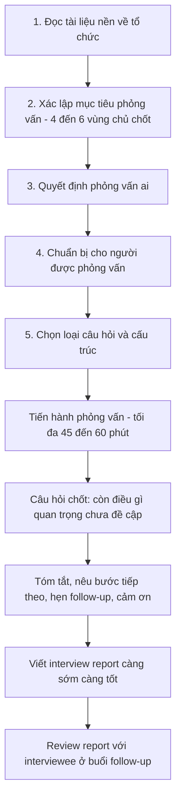
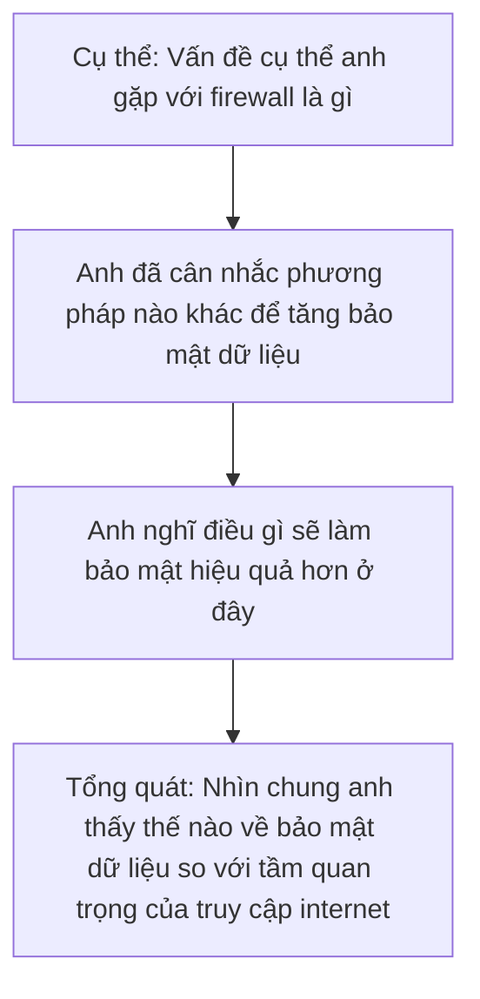
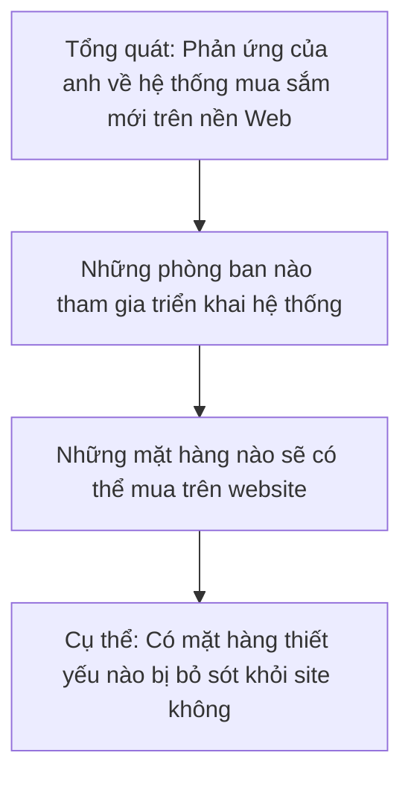
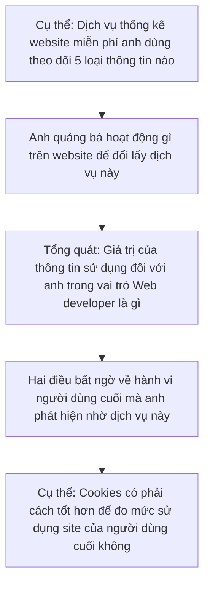
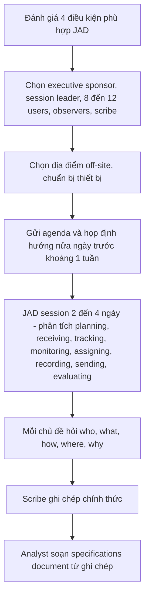
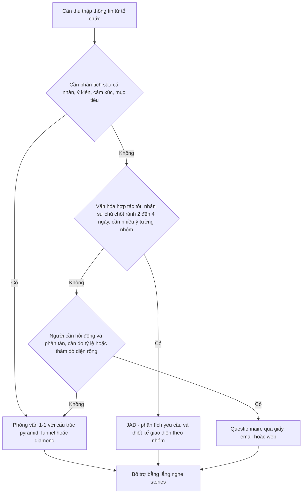
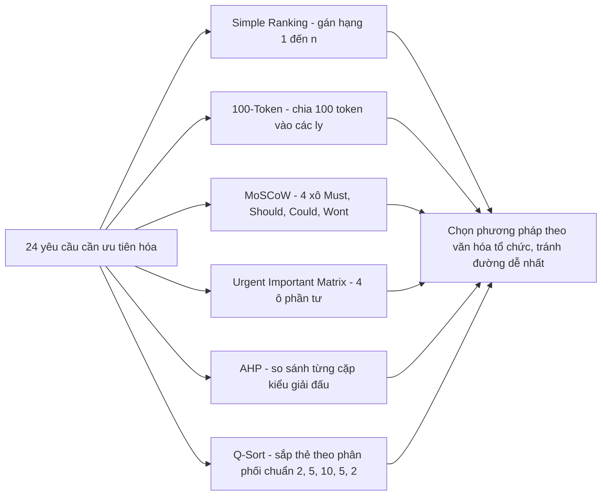

# Chương 4 — Information Gathering: Interactive Methods (Thu thập thông tin: Các phương pháp tương tác)

> Nguồn: Kendall & Kendall, *Systems Analysis and Design*, 11th edition — Chapter 4 (trang 109–139).
> Chương này thuộc Part II: Information Requirements Analysis (Phân tích yêu cầu thông tin).

---

## 🎯 Mục tiêu học tập

Sau khi học xong chương này, bạn có thể:

1. **Phỏng vấn (Interviewing)**: Lập kế hoạch và thực hiện phỏng vấn thu thập thông tin — nhận biết mục tiêu phỏng vấn, các loại câu hỏi (open-ended, closed, probes) và 3 cấu trúc sắp xếp câu hỏi (pyramid, funnel, diamond).
2. **Lắng nghe câu chuyện (Listening to Stories)**: Hiểu 7 yếu tố cấu thành một câu chuyện trong tổ chức và 4 lý do người dùng kể chuyện, dùng storytelling bổ trợ cho các phương pháp khác.
3. **Joint Application Design (JAD)**: Biết khi nào nên dùng JAD thay cho phỏng vấn 1-1, ai tham gia, tổ chức ở đâu, lợi ích và hạn chế.
4. **Bảng câu hỏi (Questionnaires/Surveys)**: Thiết kế questionnaire hiệu quả — viết câu hỏi, chọn từ ngữ, dùng thang đo (nominal, interval), đảm bảo validity/reliability, tránh lỗi thang đo (leniency, central tendency, halo effect), sắp xếp thứ tự câu hỏi và chọn cách phát questionnaire.
5. **Ưu tiên hóa yêu cầu (Requirements Prioritization)**: Áp dụng 6 phương pháp — simple ranking, 100-token, MoSCoW, Urgent/Important Matrix, AHP, Q-sort — để giúp người dùng xếp hạng tính năng quan trọng nhất.

---

## 📖 Tóm tắt & giải thích kiến thức

### 1. Phỏng vấn (Interviewing)

#### 1.1. Trước hết: "Phỏng vấn chính mình"

Trước khi phỏng vấn ai đó, bạn phải **tự phỏng vấn bản thân**: nhận diện thiên kiến (bias) của mình — học vấn, trí tuệ, cách được nuôi dạy, cảm xúc, khung đạo đức — vì tất cả đều là "bộ lọc" ảnh hưởng đến những gì bạn *nghe được* trong phỏng vấn. Hãy hình dung trước: đi phỏng vấn để làm gì, sẽ hỏi gì, thế nào là một buổi phỏng vấn thành công (cho cả bạn lẫn người được phỏng vấn).

#### 1.2. Phỏng vấn thu thập thông tin là gì?

> **Information-gathering interview** = một cuộc **hội thoại có định hướng với mục đích cụ thể**, dùng định dạng **hỏi–đáp (question-and-answer)**.

Trong phỏng vấn, systems analyst tìm kiếm 4 loại thông tin chính từ người được phỏng vấn (interviewee):

| Loại thông tin | Giải thích | Ví dụ đời thường |
|---|---|---|
| **Opinions (Ý kiến)** | Quan trọng và "lộ" nhiều hơn cả facts | Hỏi chủ cửa hàng số lượng hàng hoàn trả/tuần → trả lời "20–25" nhưng thực tế chỉ 10.5. Nếu hỏi *ý kiến* ("mối lo lớn nhất là gì?") → phát hiện chủ cửa hàng coi hàng hoàn trả qua web là vấn đề then chốt cần giải quyết |
| **Feelings (Cảm nhận)** | Interviewee hiểu tổ chức hơn bạn; nghe cảm nhận giúp hiểu **văn hóa tổ chức** | Nhân viên "ngán" hệ thống cũ → dấu hiệu văn hóa kháng cự thay đổi |
| **Goals (Mục tiêu)** | Facts từ hard data giải thích *quá khứ*; goals chiếu về *tương lai* của tổ chức — thường **không thể thu được bằng phương pháp nào khác** | "Chúng tôi muốn giảm 50% thời gian xử lý đơn trong 2 năm" |
| **HCI concerns** | Ergonomics, usability, tính dễ chịu/thú vị (pleasing, enjoyable), tính hữu ích (usefulness) của hệ thống | "Màn hình nhập liệu có làm anh mỏi mắt không?" |

Phỏng vấn cũng là dịp **xây dựng quan hệ** với người lạ: tạo niềm tin nhanh nhưng vẫn **giữ quyền kiểm soát** cuộc phỏng vấn, đồng thời "bán" hệ thống mới bằng cách cung cấp thông tin cần thiết cho interviewee.

#### 1.3. Năm bước chuẩn bị phỏng vấn (Figure 4.1)

1. **Read background material** — Đọc tài liệu nền: website công ty, annual report, bản tin nội bộ… Chú ý **ngôn ngữ** tổ chức dùng để tự mô tả → xây dựng vốn từ chung để đặt câu hỏi dễ hiểu; tiết kiệm thời gian phỏng vấn (không phí thời gian hỏi câu nền chung chung).
2. **Establish interviewing objectives** — Xác lập mục tiêu: nên có **4–6 vùng chủ chốt** về HCI, xử lý thông tin và hành vi ra quyết định: HCI concerns, nguồn thông tin (information sources), định dạng thông tin (information formats), tần suất ra quyết định, chất lượng thông tin, phong cách ra quyết định.
3. **Decide whom to interview** — Chọn người phỏng vấn: bao gồm **người chủ chốt ở mọi cấp** chịu ảnh hưởng bởi hệ thống; cân bằng để bao phủ nhu cầu của nhiều người dùng nhất; tham khảo ý kiến đầu mối liên hệ trong tổ chức.
4. **Prepare the interviewee** — Chuẩn bị cho interviewee: gọi điện/email trước để họ có thời gian suy nghĩ; với phỏng vấn chuyên sâu có thể email câu hỏi trước. Phỏng vấn **nên tiến hành trực tiếp (in person)**, không qua email (vì còn phải xây niềm tin, quan sát nơi làm việc).
5. **Decide on question types and structure** — Quyết định loại câu hỏi và cấu trúc.

**Lưu ý về video call**: Từ đại dịch Covid-19, nhiều phỏng vấn chuyển sang Zoom, Google Meet, Microsoft Teams… Nghiên cứu cho thấy lạm dụng video conferencing gây kiệt sức — có hẳn thang đo **Zoom Exhaustion and Fatigue scale** (Fauville et al., 2021). Vì vậy phỏng vấn (trực tiếp lẫn online) nên giữ **tối đa 45 phút – 1 giờ**; kéo dài hơn 1 giờ thì interviewee sẽ khó chịu (vì họ đang mất thời gian làm việc khác), dù có nói ra hay không.

#### 1.4. Các loại câu hỏi (Question Types)

Có **3 loại chính**: open-ended questions, closed questions và probes.

**(a) Open-ended questions (Câu hỏi mở)** — "mở" mô tả *lựa chọn trả lời* của interviewee: câu trả lời có thể là 2 từ hoặc 2 đoạn văn.
Ví dụ: *"Anh nghĩ gì về việc đưa tất cả manager lên intranet?"*, *"Hãy giải thích cách anh ra quyết định lập lịch"*, *"Ý kiến của anh về hiện trạng B2B ecommerce trong công ty?"*

**8 lợi ích của câu hỏi mở:**
1. Giúp interviewee thoải mái (at ease)
2. Cho phép interviewer nắm bắt vốn từ của interviewee (phản ánh học vấn, giá trị, thái độ, niềm tin)
3. Cung cấp chi tiết phong phú (richness of detail)
4. Mở ra các hướng hỏi tiếp mà nếu không sẽ bị bỏ sót
5. Làm phỏng vấn thú vị hơn cho interviewee
6. Cho phép tự phát (spontaneity) nhiều hơn
7. Interviewer dễ diễn đạt câu hỏi hơn
8. Dùng được khi "chữa cháy" — interviewer chưa chuẩn bị kịp

**5 hạn chế của câu hỏi mở:**
1. Có thể nhận quá nhiều chi tiết không liên quan
2. Có thể mất kiểm soát cuộc phỏng vấn
3. Câu trả lời tốn quá nhiều thời gian so với lượng thông tin hữu ích thu được
4. Có thể tạo ấn tượng interviewer chưa chuẩn bị
5. Có thể gây cảm giác interviewer đang "đi câu" (fishing expedition) không có mục tiêu rõ

**(b) Closed questions (Câu hỏi đóng)** — giới hạn lựa chọn trả lời (như thi trắc nghiệm: chỉ chọn trong các đáp án cho sẵn).
Ví dụ: *"Hệ thống hiện tại có dễ dùng không?"*, *"Anh có bao nhiêu nhân viên cấp dưới?"*, *"Trung bình call center nhận bao nhiêu cuộc gọi mỗi tháng?"*

Trường hợp đặc biệt: **dichotomous closed question** (câu hỏi đóng lưỡng cực) — chỉ cho chọn 1 trong 2 cực: yes/no, true/false, agree/disagree. Ví dụ: *"Anh có dùng Web để cung cấp thông tin cho vendor không?"*, *"Form này đã hoàn chỉnh chưa?"*

**6 lợi ích của câu hỏi đóng:**
1. Tiết kiệm thời gian
2. Dễ so sánh giữa các cuộc phỏng vấn
3. Đi thẳng vào vấn đề
4. Giữ được quyền kiểm soát phỏng vấn
5. Bao phủ nhiều chủ đề nhanh chóng
6. Thu được dữ liệu liên quan (relevant data)

**4 hạn chế của câu hỏi đóng:**
1. Nhàm chán cho interviewee
2. Không thu được chi tiết phong phú (vì interviewer đã áp khung tham chiếu lên interviewee)
3. Bỏ lỡ các ý tưởng chính (vì lý do trên)
4. Không xây được rapport (quan hệ thân thiện) giữa hai bên

**Bảng so sánh thuộc tính open-ended vs closed (Figure 4.5):**

| Thuộc tính | Open-Ended (Mở) | Closed (Đóng) |
|---|---|---|
| Ease of Analysis (Dễ phân tích) | Khó (Difficult) | Dễ (Easy) |
| Reliability of Data (Độ tin cậy dữ liệu) | Thấp (Low) | Cao (High) |
| Efficient Use of Time (Hiệu quả thời gian) | Thấp | Cao |
| Precision of Data (Độ chính xác dữ liệu) | Thấp | Cao |
| Breadth and Depth (Độ rộng và sâu) | Nhiều (Much) | Ít (Little) |
| Interviewer Skill Required (Kỹ năng đòi hỏi) | Nhiều | Ít |

→ **Trade-off**: câu hỏi mở cho độ rộng/sâu nhưng khó phân tích; câu hỏi đóng ngược lại.

**(c) Probes (Câu hỏi thăm dò / follow-up)** — câu hỏi mạnh nhất và đơn giản nhất là **"Why?" (Tại sao?)**. Mục đích: **vượt qua câu trả lời ban đầu** để lấy thêm ý nghĩa, làm rõ (clarify), khơi mở và mở rộng quan điểm của interviewee. Probe có thể là câu hỏi mở hoặc đóng.
Ví dụ: *"Hãy cho ví dụ một lần anh thấy hệ thống không đáng tin"*, *"Xin nói rõ hơn điểm đó"*, *"Điều gì khiến anh cảm thấy như vậy?"*, *"Kể từng bước điều gì xảy ra sau khi khách hàng bấm nút Submit"*.

⚠️ **Probing là bắt buộc**. Người phỏng vấn mới vào nghề thường ngại probe, chấp nhận câu trả lời hời hợt vì "biết ơn" interviewee đã dành thời gian → mất thông tin quý.

#### 1.5. Sắp xếp câu hỏi theo trình tự logic — 3 cấu trúc

Tương tự 2 cách suy luận **quy nạp (inductive)** và **diễn dịch (deductive)**, có 2 cách tổ chức phỏng vấn + 1 cách kết hợp:

**(a) Pyramid structure (Kim tự tháp — quy nạp)**: bắt đầu bằng câu hỏi **rất cụ thể** (thường là closed), rồi mở rộng dần sang câu hỏi mở, tổng quát.
- **Dùng khi**: interviewee cần "khởi động" (warm up) với chủ đề; hoặc khi bạn muốn có **kết luận chung cuộc** về chủ đề ở cuối (ví dụ câu chốt: "Nhìn chung, anh cân nhắc thế nào giữa bảo mật dữ liệu và tầm quan trọng của truy cập internet?").

**(b) Funnel structure (Cái phễu — diễn dịch)**: bắt đầu bằng câu hỏi **tổng quát, mở**, rồi thu hẹp dần bằng câu hỏi đóng, cụ thể.
- **Dùng khi**: cần cách mở đầu **dễ chịu, không đe dọa** (nonthreatening); hoặc khi interviewee **có cảm xúc mạnh** về chủ đề và cần không gian bày tỏ cảm xúc.

**(c) Diamond-shaped structure (Kim cương — kết hợp)**: bắt đầu **cụ thể** (câu đóng dễ, để warm-up) → giữa buổi hỏi **tổng quát** (ý kiến về chủ đề rộng, không có đáp án "đúng") → kết thúc **cụ thể** (chốt lại, tạo closure cho cả hai bên).
- **Ưu**: kết hợp điểm mạnh của cả hai cấu trúc. **Nhược**: mất **nhiều thời gian hơn** hai cấu trúc kia.

**So sánh nhanh 3 cấu trúc:**

| | Pyramid | Funnel | Diamond |
|---|---|---|---|
| Hướng đi | Cụ thể → Tổng quát | Tổng quát → Cụ thể | Cụ thể → Tổng quát → Cụ thể |
| Kiểu suy luận | Quy nạp (inductive) | Diễn dịch (deductive) | Kết hợp |
| Khi nào dùng | Interviewee cần warm-up; cần kết luận chung cuộc | Mở đầu nhẹ nhàng; interviewee nhiều cảm xúc | Muốn cả warm-up lẫn closure |
| Nhược điểm chính | — | — | Tốn thời gian nhất |

#### 1.6. Kết thúc phỏng vấn và viết Interview Report

- **Câu hỏi chốt vàng**: *"Còn điều gì chúng ta chưa đề cập mà anh/chị thấy tôi cần biết không?"* — đa phần trả lời "Không", nhưng đôi khi câu này **"mở cửa xả lũ"** và rất nhiều dữ liệu mới xuất hiện.
- Khi kết thúc: **tóm tắt** và phản hồi ấn tượng tổng quát; thông báo **bước tiếp theo**; hỏi **nên nói chuyện với ai tiếp**; hẹn lịch follow-up; cảm ơn và bắt tay.
- **Interview report**: viết **càng sớm càng tốt** sau phỏng vấn — càng để lâu, chất lượng dữ liệu càng đáng ngờ. Sau tóm tắt ban đầu, ghi chi tiết các điểm chính + ý kiến riêng của bạn. **Review report với interviewee** tại buổi follow-up: vừa làm rõ ý nghĩa, vừa cho interviewee thấy bạn thật sự quan tâm đến quan điểm của họ.

---

### 2. Lắng nghe câu chuyện (Listening to Stories)

Câu chuyện (stories) sinh ra ở nơi làm việc, được chia sẻ và kể lại — giống như huyền thoại (myths) và ngụ ngôn (fables), chúng truyền tải thông tin đủ quan trọng để "xây cả một câu chuyện quanh nó". **Enduring stories** (chuyện bền vững, được kể đi kể lại) nắm bắt mọi khía cạnh của tổ chức — đây là loại analyst nên tìm kiếm.

**Tại sao cần stories?** Phỏng vấn có cấu trúc (structured interviews) cho phép hỏi nhiều người cùng bộ câu hỏi, nhưng **có thể không tạo ra chi tiết phong phú** cần cho thiết kế. Khi developer phải phân tích/thiết kế lại hệ thống, những trải nghiệm từ dự án trước (vấn đề gặp phải, trở ngại đã vượt, bài học rút ra) là **ẩn số** — không thể soạn sẵn câu hỏi. Khuyến khích kể chuyện sẽ khơi những trải nghiệm này ra. **Kiên nhẫn là phẩm chất then chốt của người nghe.** Nghe chuyện tốn thời gian hơn hỏi đáp, nhưng chuyện **dễ nhớ hơn** câu trả lời phỏng vấn — phần nào bù lại thời gian bỏ ra.

#### 2.1. Bảy yếu tố của một câu chuyện

Người kể thường tự đặt mình làm **nhân vật chính (hero/protagonist)** — điều này không phải nhược điểm, nó khiến câu chuyện chân thực và người nghe đồng cảm. Mọi câu chuyện đều có 7 yếu tố:

1. **The call to adventure (Tiếng gọi phiêu lưu)**: lý do nhận ra cơ hội hoặc vấn đề cần giải quyết — không bao giờ có lời giải đơn giản ("Tối qua gió lùa nên tôi dậy đóng cửa sổ" là *statement*, không phải story).
2. **The quest (Cuộc truy tìm)**: có điều gì đó đáng để tìm/đạt được — qua đó người kể liệt kê **mục tiêu của tổ chức**.
3. **The struggle (Cuộc vật lộn)**: lắng nghe ai bị gọi là "villain" (kẻ phản diện) — quy định nhà nước? đối thủ bên ngoài? thành viên nội bộ? → hiểu **trở ngại hiện hữu**.
4. **The transformation (Sự chuyển hóa)**: vấn đề được giải bằng **thay đổi quy trình/hành vi** chứ không phải thay sản phẩm; người kể bộc lộ điểm yếu của mình và cách vượt qua nó.
5. **The resolution (Kết cục)**: quest thành công hay thất bại (thường nghe chuyện tích cực hơn).
6. **The moral (Bài học)**: nói cho người khác biết nên **hành xử thế nào, giá trị nào cần có** — tuyên bố về lessons learned.
7. **The epilogue (Hậu truyện)**: kết thúc "có hậu" ban đầu có thể thay đổi theo thời gian — cạnh tranh, sở thích khách hàng, phần cứng mới, vấn đề xã hội/môi trường/pháp lý tạo ra trở ngại mới → có thể chính là lý do developer được mời vào thay đổi hệ thống lần nữa.

#### 2.2. Bốn loại (lý do kể) câu chuyện

Giống ngụ ngôn thời thơ ấu ("Kiến và Châu Chấu" dạy chăm chỉ, "Rùa và Thỏ" dạy chớ tự mãn), chuyện kinh doanh có mục đích — nhưng phức tạp hơn, chia 4 loại:

1. **Experiential stories (Chuyện trải nghiệm)**: mô tả cuộc sống trong tổ chức như thế nào.
2. **Explanatory stories (Chuyện giải thích)**: đi xa hơn — giải thích hành vi hoặc lý do các quyết định trong tổ chức.
3. **Validating stories (Chuyện xác nhận)**: thuyết phục mọi người rằng tổ chức đã quyết định đúng; bày tỏ và duy trì giá trị hiện có của tổ chức.
4. **Prescriptive stories (Chuyện răn dạy)**: tương đương ngụ ngôn thời thơ ấu — gợi ý mọi người trong tổ chức **nên hành xử ra sao**.

**Cách dùng**: storytelling là **phương pháp bổ trợ** cho interviewing, JAD, surveys. Analyst cần *tham gia*: phản ứng với chuyện, kể lại chuyện cho người khác (matching), thậm chí cộng tác với người kể để reframe câu chuyện. Phải nghe **trọn vẹn câu chuyện** — nhiều analyst chỉ ghi lại các mảnh vụn (fragments) nên không hiểu được ý định/mục đích của câu chuyện.

---

### 3. Joint Application Design (JAD)

#### 3.1. JAD là gì?

Phỏng vấn 1-1 **tốn thời gian, dễ sai sót, dữ liệu dễ bị diễn giải sai**. **IBM** phát triển JAD (đọc là "jad", vần với "add") như phương án thay thế: thay vì phỏng vấn từng người, phân tích yêu cầu và **thiết kế giao diện người dùng cùng với users trong bối cảnh nhóm (group setting)**.

**3 động lực dùng JAD:**
1. **Cắt giảm thời gian** (và do đó chi phí) so với phỏng vấn cá nhân
2. **Cải thiện chất lượng** kết quả đánh giá yêu cầu thông tin
3. **Tăng sự gắn bó của user** với hệ thống mới nhờ quy trình có tính tham gia (participative)

JAD có thể thay phỏng vấn cá nhân ở **bất kỳ thời điểm phù hợp nào trong SDLC**. Chi tiết đầy đủ chỉ học được qua seminar thương mại (proprietary methods), nhưng sách cung cấp đủ để so sánh với phỏng vấn 1-1.

#### 3.2. Bốn điều kiện nên dùng JAD

Cân nhắc dùng JAD khi:
1. **User groups đang "bồn chồn" (restless)** và muốn thứ gì đó mới mẻ, không phải giải pháp chuẩn cho vấn đề thông thường.
2. **Văn hóa tổ chức hỗ trợ** hành vi giải quyết vấn đề chung (joint problem-solving) giữa nhiều cấp nhân viên.
3. Analyst dự báo số ý tưởng từ phỏng vấn 1-1 sẽ **ít hơn** số ý tưởng có thể sinh ra từ bài tập nhóm mở rộng.
4. **Quy trình công việc cho phép** những nhân sự chủ chốt vắng mặt trong khối thời gian **2–4 ngày**.

#### 3.3. Ai tham gia JAD?

| Vai trò | Số lượng | Mô tả |
|---|---|---|
| **Executive sponsor** | 1 | Người cấp cao, mở đầu và kết thúc session; nên là executive từ **nhóm user** có thẩm quyền đối với người IS làm dự án — biểu tượng hữu hình của cam kết tổ chức |
| **IS analyst** | ≥ 1 | Vai trò **thụ động** (khác phỏng vấn truyền thống!) — lắng nghe user; cho **ý kiến chuyên môn về chi phí bất hợp lý** của giải pháp được đề xuất ngay tại chỗ (nếu không, giải pháp phi thực tế sẽ lọt vào proposal, sau này rất tốn kém để loại bỏ) |
| **Users** | 8–12 (mọi cấp bậc) | Chọn user **có khả năng diễn đạt** thông tin họ cần để làm việc và điều họ mong ở hệ thống mới |
| **Session leader** | 1 | **KHÔNG cần** là chuyên gia phân tích thiết kế hệ thống — cần **kỹ năng giao tiếp xuất sắc** để điều phối; **không được** là người báo cáo cho ai đó trong nhóm (nên thuê consultant bên ngoài); nhiệm vụ: hướng chú ý vào vấn đề quan trọng, đàm phán và giải quyết xung đột, giúp nhóm đạt đồng thuận |
| **Observers** | 1–2 | Analyst/chuyên gia kỹ thuật từ mảng chức năng khác — giải thích kỹ thuật và tư vấn cho nhóm |
| **Scribe** | 1 (từ phòng IS) | Ghi chép **chính thức** mọi thứ diễn ra |

#### 3.4. Tổ chức JAD ở đâu, khi nào?

- **Off-site** (ngoài công ty) nếu có thể, 2–4 ngày, môi trường thoải mái (executive centers, group decision support facilities của các đại học) → giảm phân tâm từ công việc thường ngày.
- Chưa có nghiên cứu về phương án video call thay thế JAD trực tiếp → nên xếp lịch để **mọi người gặp mặt trực tiếp**.
- Thiết bị tối thiểu: **2 projector** nối 2 laptop/iPad/PC, whiteboard, flip chart, máy photocopy dễ tiếp cận. Phòng group decision support còn có PC nối mạng, hệ thống chiếu, phần mềm hỗ trợ tương tác nhóm.
- **Chỉ tổ chức khi TẤT CẢ người được mời có thể tham dự** — quy tắc sống còn. Gửi **agenda trước**; cân nhắc họp **định hướng nửa ngày** khoảng 1 tuần trước workshop.

#### 3.5. Phân tích có cấu trúc các hoạt động dự án

IBM khuyến nghị JAD session xem xét các điểm: **planning, receiving, receipt processing/tracking, monitoring, assigning, recording, sending, evaluating** — với mỗi chủ đề, hỏi và trả lời **who, what, how, where, why**. (Các hệ thống tương tác ad hoc như recommender systems, hệ thống phụ thuộc phong cách người ra quyết định, prototype — **khó** phân tích bằng cách tiếp cận cấu trúc của JAD.)

Sau session, analyst nhận ghi chép của scribe và soạn **specifications document**: trình bày mục tiêu quản lý, phạm vi/ranh giới dự án, chi tiết hệ thống (layout màn hình, báo cáo).

#### 3.6. Bốn lợi ích tiềm năng của JAD (so với phỏng vấn truyền thống)

1. **Tiết kiệm thời gian** — một số tổ chức ước tính JAD tiết kiệm **15%** so với phỏng vấn 1-1.
2. **Phát triển nhanh (rapid development)** — không phỏng vấn tuần tự trong nhiều tuần/tháng nên phát triển nhanh hơn.
3. **Cải thiện quyền sở hữu (ownership)** hệ thống của user — tính tương tác + độ hiển thị cao giúp user tham gia sớm, phản hồi được coi trọng, ý tưởng user được phản ánh vào thiết kế cuối.
4. **Phát triển thiết kế sáng tạo** — tính tương tác giống brainstorming; thiết kế tiến hóa qua tương tác được điều phối thay vì trong cô lập.

#### 3.7. Ba hạn chế tiềm năng của JAD

1. Đòi hỏi **cam kết khối thời gian lớn** của tất cả người tham gia (2–4 ngày) — không thể làm việc khác song song hay dịch thời gian như phỏng vấn 1-1.
2. Nếu **chuẩn bị chưa đầy đủ** hoặc **báo cáo follow-up/tài liệu specifications không hoàn chỉnh** → thiết kế có thể không đạt. Nhiều biến số phải khớp đúng → **kết quả JAD kém dự đoán được** hơn phỏng vấn chuẩn.
3. **Kỹ năng tổ chức và văn hóa tổ chức** có thể chưa đủ chín để nỗ lực tập trung kiểu JAD có hiệu quả.

**Bảng: khi nào dùng Interview 1-1 vs JAD**

| Tiêu chí | Interview 1-1 | JAD |
|---|---|---|
| Thời gian/chi phí | Tốn (tuần/tháng, tuần tự) | Tiết kiệm ~15%, nhanh |
| Vai trò analyst | Chủ động điều khiển | Thụ động, lắng nghe |
| Số người | 1 mỗi lần | 8–12 users + đội hỗ trợ |
| Ý tưởng | Ít hơn | Nhiều hơn (hiệu ứng nhóm, brainstorming) |
| User ownership | Thấp hơn | Cao hơn (tham gia sớm) |
| Độ dự đoán kết quả | Ổn định hơn | Kém dự đoán hơn (nhiều biến số) |
| Điều kiện | Hầu như luôn khả thi | Cần văn hóa hợp tác + rảnh 2–4 ngày |

---

### 4. Sử dụng bảng câu hỏi (Using Questionnaires)

#### 4.1. Questionnaire dùng để làm gì?

Questionnaire (còn gọi **survey**) cho phép analyst nghiên cứu **4 thứ** từ nhiều người chủ chốt bị ảnh hưởng bởi hệ thống:

| Khái niệm | Định nghĩa |
|---|---|
| **Attitudes (Thái độ)** | Điều mọi người trong tổ chức **nói rằng họ muốn** (vd: ở hệ thống mới) |
| **Beliefs (Niềm tin)** | Điều mọi người **nghĩ là đúng** trên thực tế |
| **Behavior (Hành vi)** | Điều các thành viên tổ chức **làm** |
| **Characteristics (Đặc điểm)** | Thuộc tính của người hoặc vật |

- Câu trả lời **closed** có thể **định lượng hóa (quantified)**; khảo sát qua email/web có phần mềm chuyển thẳng thành bảng dữ liệu cho spreadsheet/phần mềm thống kê. Câu trả lời **open-ended** phải phân tích, diễn giải cách khác.
- Câu hỏi về thái độ/niềm tin rất **nhạy cảm với cách chọn từ** của analyst.
- **Quan hệ với phỏng vấn**: questionnaire có thể (a) **định lượng hóa** những gì tìm thấy trong phỏng vấn; (b) xác định một tâm tư nêu trong phỏng vấn **phổ biến đến mức nào**; (c) ngược lại, khảo sát mẫu lớn user để **dò vấn đề (problem sensing)** trước khi lên lịch phỏng vấn. Lý tưởng là **dùng kết hợp cả hai**, nhưng không phải lúc nào cũng cần cả hai.

#### 4.2. Lập kế hoạch dùng questionnaire — 4 tình huống phù hợp

Trông thì "nhanh", nhưng phát triển questionnaire hữu ích đòi hỏi **thời gian lập kế hoạch đáng kể**; khảo sát email/web còn thêm mối lo: **bảo mật thông tin (confidentiality), xác thực danh tính (authentication), trả lời nhiều lần (multiple responses)**.

Trước hết phải xác định **mục tiêu khảo sát** (vd: muốn biết % user thích trang FAQ → questionnaire hợp; muốn phân tích sâu quy trình ra quyết định của một manager → interview tốt hơn).

**Cân nhắc dùng questionnaire khi:**
1. Người cần hỏi **phân tán rộng về địa lý** (các chi nhánh khác nhau của cùng công ty)
2. **Nhiều người** tham gia dự án và cần biết **tỷ lệ** một nhóm (vd: management) tán thành/không tán thành một tính năng cụ thể
3. Đang làm **nghiên cứu thăm dò (exploratory study)** — muốn đo ý kiến tổng quát trước khi dự án được định hướng cụ thể
4. Muốn **chắc chắn mọi vấn đề của hệ thống hiện tại được nhận diện** và xử lý trong các phỏng vấn follow-up

**Bảng so sánh Interview vs Questionnaire:**

| Tiêu chí | Interview | Questionnaire |
|---|---|---|
| Tương tác | Có — analyst có thể tinh chỉnh câu hỏi, định nghĩa thuật ngữ, đổi hướng hỏi, phản ứng với vẻ mặt bối rối | Gần như không → câu hỏi phải **trong suốt, rõ ràng**, dòng chảy mạch lạc, lường trước thắc mắc, lên kế hoạch phát chi tiết |
| Số người tiếp cận | Ít (tốn thời gian) | Nhiều, phân tán rộng |
| Độ sâu | Sâu (opinions, feelings, goals, stories) | Nông hơn nhưng đo được độ phổ biến |
| Chi phí | Cao | Thấp (đặc biệt điện tử) |
| Định lượng | Khó | Dễ (câu đóng) |
| Phù hợp cho | Phân tích sâu quy trình quyết định của cá nhân | Đo tỷ lệ, thăm dò diện rộng, dò vấn đề trước phỏng vấn |

#### 4.3. Viết câu hỏi cho questionnaire

**Open-ended questions trên questionnaire**: để mở mọi phương án trả lời. Nhưng phải **lường trước** loại phản hồi: hỏi "Bạn cảm thấy thế nào về hệ thống?" sẽ nhận câu trả lời quá rộng, không diễn giải/so sánh nổi → câu mở phải **đủ hẹp để dẫn hướng** trả lời cụ thể. Phù hợp nhất khi muốn lấy **ý kiến** về khía cạnh nào đó của hệ thống và khi **không thể liệt kê hết** các phương án trả lời.

**Closed questions trên questionnaire**: dùng khi (a) **có thể liệt kê hiệu quả tất cả** phương án trả lời, và (b) các phương án **loại trừ lẫn nhau (mutually exclusive)**. Dùng khi khảo sát **mẫu lớn** — nếu dùng toàn câu mở cho hàng trăm người thì không thể phân tích đúng nếu thiếu phần mềm phân tích nội dung/text analytics.

**Bảng trade-off trên questionnaire (Figure 4.13):**

| Tiêu chí | Open-Ended | Closed |
|---|---|---|
| Speed of Completion (Tốc độ hoàn thành) | Chậm (Slow) | Nhanh (Fast) |
| Exploratory Nature (Tính thăm dò) | Cao | Thấp |
| Breadth and Depth (Độ rộng và sâu) | Cao | Thấp |
| Ease of Preparation (Dễ soạn) | Dễ | Khó |
| Ease of Analysis (Dễ phân tích) | Khó | Dễ |

#### 4.4. Chọn từ ngữ (Word Choice) — các nguyên tắc

Ngôn ngữ là yếu tố cực kỳ quan trọng. Nên viết theo **thuật ngữ riêng của doanh nghiệp** (họ dùng "supervisors" thì đừng viết "managers"; "units" thì đừng viết "departments") → người trả lời liên hệ được với câu hỏi, phản hồi dễ diễn giải chính xác hơn, người trả lời nhiệt tình hơn. Nên **thử trên nhóm pilot (test)** để kiểm tra tính phù hợp của từ ngữ.

Nguyên tắc chọn ngôn ngữ:
1. Dùng **ngôn ngữ của người trả lời** bất cứ khi nào có thể; từ ngữ đơn giản.
2. **Cụ thể** thay vì mơ hồ — nhưng cũng tránh quá cụ thể (overly specific).
3. Câu hỏi **ngắn**.
4. **Không hạ thấp (patronize)** người trả lời bằng ngôn từ trình độ quá thấp.
5. **Tránh thiên kiến (bias)** trong từ ngữ — bao gồm tránh câu hỏi gây khó chịu; nhờ đồng đội review ngôn ngữ.
6. **Nhắm đúng người trả lời** (người có khả năng trả lời) — đừng giả định người ta biết quá nhiều.
7. Đảm bảo câu hỏi **chính xác về mặt kỹ thuật** trước khi đưa vào.
8. Dùng phần mềm kiểm tra **mức độ đọc hiểu (reading level)** phù hợp với người trả lời.

#### 4.5. Thang đo (Scales) trong questionnaire

> **Scaling** = quá trình gán số hoặc ký hiệu khác cho một thuộc tính/đặc điểm nhằm **đo lường** thuộc tính/đặc điểm đó. Thang đo thường mang tính tùy định (arbitrary) và không duy nhất (vd: nhiệt độ đo bằng Fahrenheit hoặc Celsius).

**Hai loại thang đo analyst thường dùng:**

1. **Nominal scale (Thang định danh)** — để **phân loại (classify)**. Ví dụ: "Bạn dùng loại phần mềm nào nhiều nhất? 1=Word processor, 2=Spreadsheet, 3=Database, 4=Email". Là dạng đo **yếu nhất** — chỉ có thể **đếm tổng** từng loại.
2. **Interval scale (Thang khoảng)** — khoảng cách giữa mỗi cặp số **bằng nhau** → thực hiện được các **phép toán học**, phân tích đầy đủ hơn. Ví dụ: thang Fahrenheit/Celsius. Trong khảo sát: neo (anchor) hai đầu thang, ví dụ "Hỗ trợ của Technical Support Group hữu ích đến mức nào? Not Useful at All 1-2-3-4-5 Extremely Useful" — nếu giả định người trả lời cảm nhận các khoảng bằng nhau thì phân tích định lượng sâu hơn.

**Validity và Reliability — 2 thước đo hiệu năng khi xây thang đo:**

| | Định nghĩa |
|---|---|
| **Validity (Tính hợp lệ)** | Mức độ câu hỏi **đo đúng cái analyst muốn đo** (vd: questionnaire nhằm xác định tổ chức đã sẵn sàng cho thay đổi lớn chưa — câu hỏi có thật sự đo điều đó?) |
| **Reliability (Độ tin cậy)** | Đo **tính nhất quán**: phát questionnaire 2 lần trong cùng điều kiện mà kết quả giống nhau → **external consistency**; các phần con (subparts) cho kết quả tương đương → **internal consistency**. Cả hai đều quan trọng |

**3 vấn đề do xây thang đo cẩu thả + cách khắc phục:**

| Vấn đề | Mô tả | Khắc phục |
|---|---|---|
| **Leniency (Dễ dãi)** | Người trả lời chấm điểm "rộng tay" | Dời hạng mục "average" sang trái (hoặc phải) so với tâm |
| **Central tendency (Xu hướng trung tâm)** | Chấm mọi thứ ở mức trung bình | 1 - làm chênh lệch ở hai đầu nhỏ hơn; 2 - điều chỉnh cường độ mô tả (descriptors); 3 - tạo thang nhiều điểm hơn |
| **Halo effect (Hiệu ứng hào quang)** | Ấn tượng từ câu hỏi này lan sang câu hỏi kế (vd: có ấn tượng tốt về một nhân viên → chấm cao mọi tiêu chí) | Đặt **1 đặc điểm + nhiều nhân viên** trên mỗi trang, thay vì 1 nhân viên + nhiều đặc điểm |

#### 4.6. Thiết kế questionnaire

Người trả lời nhận **quá nhiều survey**, phần lớn thiết kế tồi và tầm phào → không có động lực trả lời. Questionnaire thiết kế tốt, liên quan giúp vượt kháng cự. **4 quy tắc thiết kế để có response rate tốt:**
1. Chừa **nhiều khoảng trắng** (white space)
2. Chừa **đủ chỗ để viết/gõ** câu trả lời
3. Làm cho việc **đánh dấu câu trả lời dễ dàng, rõ ràng**
4. **Nhất quán về phong cách** (style)

Thiết kế **web survey** áp dụng cùng quy tắc như bản giấy. Các định dạng nhập liệu web (Figure 4.14):

| Điều khiển | Công dụng |
|---|---|
| One-line text box | Lấy lượng text nhỏ, giới hạn vài từ |
| Scrolling text box | Lấy một hoặc nhiều đoạn văn |
| Check box | Câu trả lời yes-no (vd: có muốn vào mailing list không) |
| Radio button | Yes-no hoặc true-false (chọn 1) |
| Drop-down menu | Kết quả nhất quán hơn — chọn từ danh sách định trước (vd: mã bang) |
| Push button | Hành động (vd: nút Submit hoặc Clear) |

**Thứ tự câu hỏi (Question Order)** — không có "cách tốt nhất"; hãy nghĩ về mục tiêu và nhìn questionnaire **qua con mắt người trả lời**:
1. Đặt câu hỏi **quan trọng với người trả lời** lên đầu
2. **Gom cụm** các mục có nội dung tương tự
3. Đưa câu **ít gây tranh cãi** lên trước

→ Mục đích: người trả lời cảm thấy không bị đe dọa, hứng thú, không bị kích động về một vấn đề cụ thể.

#### 4.7. Phát questionnaire (Administering)

**Ai nhận?** Quyết định cùng lúc với việc đặt mục tiêu; **sampling** (Chương 5) giúp xác định tính đại diện cần thiết. Người nhận thường được chọn vì: **cấp bậc, thâm niên, nhiệm vụ công việc, hoặc mối quan tâm đặc biệt** đến hệ thống. Nhớ chọn **đủ đông** để bù cho những phiếu không được trả lại hoặc điền sai phải loại bỏ.

**5 phương án phát questionnaire:**
1. **Triệu tập tất cả** người trả lời liên quan cùng một lúc
2. **Phát tận tay** phiếu trắng và thu lại phiếu đã điền
3. Cho người trả lời **tự điền tại nơi làm việc** và bỏ vào hộp đặt ở vị trí trung tâm
4. **Gửi bưu điện** đến nhân viên chi nhánh, kèm deadline, hướng dẫn, tem hồi đáp
5. **Phát điện tử** qua email hoặc web

Phổ biến nhất là **tự điền (self-administer)** — response rate thấp hơn chút (người ta quên, làm mất, hoặc cố tình lơ) nhưng người trả lời cảm thấy **được ẩn danh** → câu trả lời **ít dè dặt hơn**. Email và web survey đều thuộc nhóm tự điền.

**Ưu điểm khảo sát điện tử**: tiếp cận user nhanh; chi phí nhân bản tối thiểu; trả lời lúc thuận tiện; thu thập/lưu trữ tự động; có phần mềm cho phép lưu dở và điền tiếp; nhắc nhở qua email rẻ và dễ; phần mềm chuyển dữ liệu email thành bảng cho spreadsheet/thống kê. Dịch vụ phổ biến: **SurveyMonkey** (SaaS, đã mua lại Intuit MailChimp — công cụ gửi newsletter và chạy/theo dõi chiến dịch email). Nghiên cứu cho thấy người trả lời **sẵn sàng trả lời các vấn đề nhạy cảm cao qua internet** → câu khó hỏi trực tiếp có thể chấp nhận được trên web survey.

---

### 5. Ưu tiên hóa yêu cầu (Requirements Prioritization)

Tên gọi dễ gây nhầm: "requirements" ở đây **khác** với "information requirements" ở phần trước. Khi xác định information requirements, ta lắng nghe khách hàng để nắm mục tiêu, nỗi lo, chính sách/thủ tục và thông tin cần thiết. **Requirements prioritization** thì liên quan đến khách hàng theo cách khác: phỏng vấn và questionnaire **không hiệu quả** để hỏi khách hàng muốn tính năng nào trong sản phẩm cuối (hỏi "tính năng nào *ít* quan trọng nhất" thì vụng về, thậm chí không trả lời nổi). Sách dùng lẫn các từ "requirements", "features", "deliverables" và minh họa với **24 yêu cầu**.

**6 phương pháp:**

#### 5.1. Simple Ranking (Xếp hạng đơn giản)
Yêu cầu các bên xếp hạng danh sách: 1 = mong muốn nhất, 10 = ít mong muốn nhất. Làm được với 10 yêu cầu, nhưng **sụp đổ với 24 phương án**. Ví dụ đời thường: xếp hạng *tất cả* nhà hàng bạn từng ăn — sau vài cái đầu thì chán và vô nghĩa (nhà hàng thứ 20 hay 21 có khác gì nhau?). Đa số người **không giỏi lập và sắp thứ tự danh sách dài**.

#### 5.2. 100-Token Method (Phương pháp 100 token)
Bày 24 chiếc ly (mỗi ly = 1 yêu cầu), phát mỗi người **100 token** để phân bổ theo mức độ quan trọng họ cảm nhận. Có thể dồn cả 100 vào 1 ly hoặc chia đều — nhưng làm vậy nghĩa là **nhường quyền ưu tiên cho người khác**. Nói "yêu cầu này đáng x token" **dễ hơn** gán hạng cho từng yêu cầu. **Vấn đề**: bỏ token là **ẩn danh** → mất thông tin phòng ban nào đã bỏ, trong khi **sự đồng thuận đa phòng ban (multidepartment buy-in) là chỉ báo tốt của thành công**. Dùng token khác màu theo phòng ban có thể giúp, nhưng phương pháp vẫn rất đơn giản hóa.

#### 5.3. MoSCoW Method
Thay vì xếp hạng mọi thứ, đặt yêu cầu vào **1 trong 4 "xô" (buckets)**:

| Chữ | Loại | Ý nghĩa |
|---|---|---|
| **M** | **Must** | Bắt buộc hoàn thành thì dự án mới được coi là thành công |
| **S** | **Should** | Nên đưa vào **nếu còn thời gian và tiền**; thiếu nó dự án vẫn có thể coi là thành công |
| **C** | **Could** | Sau khi xong hết Must và Should thì mới cân nhắc; có thể thêm giá trị nhưng không bắt buộc |
| **W** | **Won't** | Sẽ **không** được thực hiện **ở thời điểm này** |

**Phê bình**: (1) yêu cầu đã rơi vào Won't thì **không bao giờ có cơ hội** được triển khai; (2) hạng mục **quá rộng** — analyst không phân biệt được thứ tự ưu tiên *bên trong* mỗi hạng mục lớn.

#### 5.4. Urgent/Important Matrix (Ma trận Khẩn cấp/Quan trọng)
Tương tự MoSCoW, vẽ được trên whiteboard: **trục x = urgency (khẩn cấp)**, **trục y = importance (quan trọng)**. Người tham gia viết yêu cầu (hoặc mã) vào ô phần tư họ cho là phù hợp. Analyst xử lý trước các yêu cầu **vừa quan trọng vừa khẩn cấp**; sau đó cân nhắc nhóm **"không quan trọng nhưng khẩn cấp"** để đạt thêm mục tiêu trước ngày release; nhóm **vừa không quan trọng vừa không khẩn cấp** thì đến lúc nào đó không nên xét nữa.

#### 5.5. Analytic Hierarchy Processing (AHP)
Phương pháp **phức tạp hơn nhiều**: đưa ra **các cặp phương án** và người tham gia chọn cái nào quan trọng hơn (pairwise comparison). Với 24 yêu cầu: bắt đầu 12 cặp so sánh, đấu dần lên đến cặp cuối cùng → cuối cùng có **danh sách xếp hạng**. **Tốn thời gian** nhưng cho **kết quả tốt với các quyết định lớn, quan trọng**. Analyst có thể làm cho vui bằng ẩn dụ **giải đấu** (như NCAA March Madness): đội thắng đi tiếp, đội thua bị loại.

#### 5.6. Q-Sort
Sắp **bộ bài các yêu cầu** vào các chồng (piles) — giống 100-token và MoSCoW, nhưng khác ở chỗ **mỗi chồng phải chứa đúng số lượng quy định**, xếp theo **phân phối chuẩn (normal distribution)**: với 24 yêu cầu, các chồng từ phải (quan trọng nhất) sang trái (ít quan trọng nhất) chứa lần lượt **2, 5, 10, 5, 2**. Trong lúc sắp, người tham gia di chuyển thẻ qua lại giữa các chồng (nếu chồng 5 đã đủ 2 thẻ mà muốn thêm thẻ mới → phải chọn thẻ nào chuyển từ chồng 5 xuống chồng 4) — so sánh này tương tự pairwise của AHP.

**4 ưu điểm của Q-sort:**
1. Không có áp lực phải "đúng ngay lần đầu" — thẻ di chuyển tương tác giữa các chồng
2. Ép sắp theo phân phối chuẩn → **tránh được nhiều vấn đề của questionnaire** (central tendency, leniency)
3. Analyst có thể **nhận diện những người có thái độ tương đồng** qua cách họ sắp bộ thẻ, dù khác phòng ban/đơn vị
4. Người tham gia thường thấy **vui** khi sắp đi sắp lại các thẻ

**Nhược điểm**: toàn bộ yêu cầu phải được **in sẵn trên thẻ** để sắp dễ dàng.

**Lời khuyên chung**: hãy cảnh giác với **"con đường ít trở lực nhất"** — phương pháp dễ set up và dễ triển khai nhất **chưa chắc** cho kết quả chất lượng nhất. Nên **hiểu văn hóa tổ chức trước**, rồi chọn phương pháp tương xứng với mức nỗ lực mà thành viên tổ chức sẵn sàng bỏ ra.

---

## 🔑 Bảng thuật ngữ (Keywords and Phrases)

| Thuật ngữ tiếng Anh | Tiếng Việt / Giải nghĩa |
|---|---|
| analytic hierarchy processing (AHP) | Xử lý phân cấp phân tích — ưu tiên hóa yêu cầu bằng so sánh từng cặp |
| central tendency | Xu hướng trung tâm — lỗi thang đo: người trả lời chấm mọi thứ ở mức trung bình |
| closed questions | Câu hỏi đóng — giới hạn các phương án trả lời |
| diamond-shaped structure | Cấu trúc kim cương — cụ thể → tổng quát → cụ thể |
| dichotomous closed questions | Câu hỏi đóng lưỡng cực — chỉ 2 lựa chọn: yes/no, agree/disagree |
| funnel structure | Cấu trúc phễu — tổng quát → cụ thể (diễn dịch) |
| halo effect | Hiệu ứng hào quang — ấn tượng từ câu hỏi này lan sang câu hỏi kế |
| interval scale | Thang khoảng — khoảng cách giữa các số bằng nhau, tính toán được |
| joint application design (JAD) | Thiết kế ứng dụng liên kết — phân tích yêu cầu và thiết kế UI cùng users theo nhóm (do IBM phát triển) |
| leniency | Sự dễ dãi — lỗi thang đo: người trả lời chấm điểm "rộng tay" |
| MoSCoW method | Phương pháp MoSCoW — 4 xô Must / Should / Could / Won't |
| nominal scale | Thang định danh — dùng để phân loại; dạng đo yếu nhất |
| 100-token method | Phương pháp 100 token — phân bổ 100 token theo mức quan trọng |
| open-ended questions | Câu hỏi mở — mở mọi phương án trả lời cho người được hỏi |
| probes | Câu hỏi thăm dò/follow-up — đào sâu quá câu trả lời ban đầu (mạnh nhất: "Why?") |
| pyramid structure | Cấu trúc kim tự tháp — cụ thể → tổng quát (quy nạp) |
| Q-sort | Q-sort — sắp thẻ yêu cầu vào các chồng theo phân phối chuẩn bắt buộc |
| questionnaire | Bảng câu hỏi/khảo sát — nghiên cứu attitudes, beliefs, behavior, characteristics |
| reliability | Độ tin cậy — tính nhất quán của thang đo (external + internal consistency) |
| requirements prioritization | Ưu tiên hóa yêu cầu — giúp khách hàng xếp hạng tính năng mong muốn |
| simple ranking | Xếp hạng đơn giản — gán số thứ tự cho từng yêu cầu |
| stories | Câu chuyện (tổ chức) — phương tiện truyền tải thông tin quan trọng, có 7 yếu tố |
| validity | Tính hợp lệ — mức độ câu hỏi đo đúng cái muốn đo |
| video calling | Gọi video — phỏng vấn qua Zoom, Google Meet, Microsoft Teams… |
| video conferencing | Hội nghị video — họp nhóm từ xa qua video |
| Zoom fatigue | Mệt mỏi Zoom — kiệt sức do lạm dụng video conferencing (thang đo Zoom Exhaustion and Fatigue) |

---

## ❓ Trả lời Review Questions

**1. Cần tìm loại thông tin gì trong phỏng vấn?**
Bốn loại: (1) **ý kiến (opinions)** của interviewee — thường quan trọng và bộc lộ nhiều hơn facts; (2) **cảm nhận (feelings)** — giúp hiểu văn hóa tổ chức; (3) **mục tiêu (goals)** của tổ chức — hướng về tương lai, khó thu được bằng phương pháp khác; (4) **thủ tục không chính thức** khi tương tác với công nghệ thông tin, cùng các mối quan tâm **HCI** (ergonomics, usability, tính dễ chịu, tính hữu ích) về hiện trạng hệ thống.

**2. Liệt kê 5 bước chuẩn bị phỏng vấn.**
(1) Đọc tài liệu nền; (2) Xác lập mục tiêu phỏng vấn; (3) Quyết định phỏng vấn ai; (4) Chuẩn bị cho người được phỏng vấn; (5) Quyết định loại câu hỏi và cấu trúc.

**3. Hai nền tảng video-conferencing phổ biến.**
Zoom và Microsoft Teams (sách còn nhắc Google Meet).

**4. "Zoom fatigue" là gì?**
Là tình trạng **kiệt sức** phát sinh từ việc lạm dụng video conferencing, xảy ra theo những cách bất ngờ. Đã có thang đo riêng: **Zoom Exhaustion and Fatigue scale** (Fauville et al., 2021). Vì vậy nên giữ phỏng vấn (kể cả online) tối đa 45 phút–1 giờ.

**5. Định nghĩa câu hỏi mở; 8 lợi ích và 5 hạn chế.**
Câu hỏi mở là câu **để mở mọi lựa chọn trả lời** cho interviewee — trả lời có thể 2 từ hoặc 2 đoạn văn.
*8 lợi ích*: (1) giúp interviewee thoải mái; (2) interviewer nắm bắt được vốn từ của interviewee; (3) chi tiết phong phú; (4) mở ra hướng hỏi mới; (5) phỏng vấn thú vị hơn cho interviewee; (6) tự phát hơn; (7) interviewer dễ diễn đạt; (8) cứu cánh khi chưa chuẩn bị.
*5 hạn chế*: (1) quá nhiều chi tiết không liên quan; (2) có thể mất kiểm soát phỏng vấn; (3) trả lời tốn thời gian so với lượng thông tin hữu ích; (4) có vẻ interviewer chưa chuẩn bị; (5) tạo ấn tượng "đi câu" không mục tiêu.

**6. Khi nào câu hỏi mở phù hợp trong phỏng vấn?**
Khi muốn interviewee thoải mái, cần chi tiết phong phú và độ rộng/sâu; khi muốn học vốn từ, giá trị, thái độ của interviewee; khi muốn khám phá hướng hỏi chưa lường trước; và khi bị động, chưa kịp chuẩn bị. (Phù hợp với đầu cấu trúc funnel hoặc phần giữa/cuối pyramid.)

**7. Định nghĩa câu hỏi đóng; 6 lợi ích và 4 hạn chế.**
Câu hỏi đóng **giới hạn số phương án trả lời** (như thi trắc nghiệm). Dạng đặc biệt: dichotomous — chỉ 2 cực.
*6 lợi ích*: (1) tiết kiệm thời gian; (2) dễ so sánh giữa các phỏng vấn; (3) đi thẳng vào vấn đề; (4) giữ kiểm soát phỏng vấn; (5) bao phủ nhiều chủ đề nhanh; (6) thu dữ liệu liên quan.
*4 hạn chế*: (1) nhàm chán với interviewee; (2) không thu được chi tiết phong phú; (3) bỏ lỡ ý tưởng chính; (4) không xây được rapport.

**8. Khi nào câu hỏi đóng phù hợp trong phỏng vấn?**
Khi thời gian eo hẹp, cần dữ liệu cụ thể/định lượng, cần so sánh nhiều cuộc phỏng vấn với nhau, cần giữ chặt quyền kiểm soát và bao phủ nhiều chủ đề nhanh — ví dụ phỏng vấn manager rất bận, hoặc phần mở đầu cấu trúc pyramid/diamond.

**9. Probing question là gì? Mục đích?**
Là câu hỏi **follow-up** (mạnh nhất là "Why?"), có thể mở hoặc đóng. Mục đích: **vượt qua câu trả lời ban đầu** — lấy thêm ý nghĩa, làm rõ, khơi mở và mở rộng quan điểm của interviewee. Probing là bắt buộc; người mới thường ngại probe nên chấp nhận câu trả lời hời hợt.

**10. Pyramid structure là gì? Khi nào dùng?**
Tổ chức câu hỏi kiểu **quy nạp**: bắt đầu bằng câu hỏi rất chi tiết (thường đóng), mở rộng dần sang câu hỏi mở, tổng quát. Dùng khi: interviewee **cần warm-up** với chủ đề, hoặc khi muốn có **kết luận chung cuộc** (ending determination) về chủ đề.

**11. Funnel structure là gì? Khi nào dùng?**
Tổ chức kiểu **diễn dịch**: bắt đầu bằng câu hỏi tổng quát, mở; thu hẹp dần bằng câu hỏi đóng, cụ thể. Dùng khi: cần cách **mở đầu dễ chịu, không đe dọa**, hoặc khi interviewee **có cảm xúc về chủ đề** và cần tự do bày tỏ cảm xúc.

**12. Diamond-shaped structure là gì? Khi nào dùng?**
Là **kết hợp pyramid + funnel**: mở đầu rất cụ thể (câu đóng dễ, warm-up) → giữa buổi hỏi ý kiến về chủ đề rộng không có đáp án "đúng" → kết thúc bằng câu cụ thể (tạo closure cho cả hai bên). Dùng khi muốn kết hợp điểm mạnh của cả hai cấu trúc; nhược điểm là **tốn thời gian hơn**.

**13. Bảy yếu tố chung của các câu chuyện người dùng kể?**
(1) The call to adventure; (2) The quest; (3) The struggle; (4) The transformation; (5) The resolution; (6) The moral; (7) The epilogue.

**14. Bốn lý do người dùng kể chuyện cho analyst?**
Tương ứng 4 loại chuyện: (1) **Experiential** — mô tả cuộc sống trong tổ chức; (2) **Explanatory** — giải thích hành vi/lý do quyết định; (3) **Validating** — thuyết phục rằng tổ chức quyết định đúng, duy trì giá trị hiện có; (4) **Prescriptive** — răn dạy mọi người nên hành xử ra sao (tương đương ngụ ngôn).

**15. Định nghĩa JAD.**
Joint Application Design — kỹ thuật do **IBM** phát triển, thay thế phỏng vấn 1-1: cho phép analyst thực hiện **phân tích yêu cầu và thiết kế giao diện người dùng cùng với users trong bối cảnh nhóm**. Động lực: giảm thời gian/chi phí phỏng vấn cá nhân, tăng chất lượng đánh giá yêu cầu, tăng gắn bó của user với hệ thống mới nhờ tính tham gia.

**16. Các tình huống nên dùng JAD thay phỏng vấn cá nhân?**
(1) User groups bồn chồn, muốn thứ mới chứ không phải giải pháp chuẩn; (2) văn hóa tổ chức hỗ trợ giải quyết vấn đề chung giữa nhiều cấp nhân viên; (3) dự báo lượng ý tưởng từ phỏng vấn 1-1 sẽ ít hơn từ bài tập nhóm mở rộng; (4) quy trình công việc cho phép nhân sự chủ chốt vắng mặt 2–4 ngày.

**17. Lợi ích tiềm năng của JAD?**
(1) Tiết kiệm thời gian (~15% so với phỏng vấn truyền thống); (2) phát triển nhanh (không phỏng vấn tuần tự kéo dài); (3) cải thiện ownership của user với hệ thống; (4) phát triển thiết kế sáng tạo (giống brainstorming, thiết kế tiến hóa qua tương tác được điều phối).

**18. Ba hạn chế tiềm năng của JAD?**
(1) Đòi hỏi tất cả người tham gia cam kết khối thời gian lớn 2–4 ngày, không làm việc khác song song được; (2) nếu chuẩn bị hoặc báo cáo follow-up/tài liệu đặc tả không đầy đủ thì thiết kế kém — kết quả JAD kém dự đoán hơn phỏng vấn chuẩn; (3) kỹ năng tổ chức và văn hóa tổ chức có thể chưa đủ phát triển cho nỗ lực tập trung kiểu JAD.

**19. Analyst tìm loại thông tin gì qua questionnaire/survey?**
**Attitudes** (điều người ta nói họ muốn), **beliefs** (điều người ta nghĩ là đúng), **behavior** (điều người ta làm), **characteristics** (thuộc tính của người/vật) — từ những người chủ chốt bị ảnh hưởng bởi hệ thống hiện tại và hệ thống đề xuất, cùng các mối quan tâm HCI.

**20. Bốn tình huống phù hợp dùng questionnaire?**
(1) Người cần hỏi phân tán rộng; (2) nhiều người tham gia dự án và cần biết tỷ lệ tán thành/không tán thành một tính năng; (3) nghiên cứu thăm dò, muốn đo ý kiến tổng quát trước khi định hướng dự án; (4) muốn chắc chắn vấn đề của hệ thống hiện tại được nhận diện và xử lý trong phỏng vấn follow-up.

**21. Hai loại câu hỏi cơ bản trên questionnaire?**
Open-ended (mở) và closed (đóng).

**22. Hai lý do dùng câu hỏi đóng trên questionnaire?**
(1) Khi có thể **liệt kê hiệu quả tất cả** các phương án trả lời và chúng loại trừ lẫn nhau; (2) khi khảo sát **mẫu lớn** — câu đóng nhanh hoàn thành, dễ phân tích/định lượng (câu mở với hàng trăm người sẽ không phân tích nổi nếu không có phần mềm text analytics).

**23. Hai lý do dùng câu hỏi mở trên questionnaire?**
(1) Khi muốn lấy **ý kiến** của thành viên tổ chức về khía cạnh nào đó của hệ thống (sản phẩm hoặc quy trình); (2) khi **không thể liệt kê hết** các phương án trả lời khả dĩ — câu mở cho insight thăm dò, độ rộng và sâu.

**24. Các nguyên tắc chọn ngôn ngữ cho questionnaire?**
(Sách liệt kê các nguyên tắc sau:) (1) dùng ngôn ngữ của người trả lời, từ ngữ đơn giản; (2) cụ thể thay vì mơ hồ nhưng tránh quá cụ thể; (3) câu hỏi ngắn; (4) không hạ thấp người trả lời bằng ngôn từ trình độ thấp; (5) tránh bias trong từ ngữ, tránh câu hỏi gây khó chịu; (6) nhắm câu hỏi đến đúng người có khả năng trả lời, không giả định quá nhiều kiến thức; (7) đảm bảo câu hỏi chính xác về kỹ thuật; (8) dùng phần mềm kiểm tra reading level phù hợp.

**25. Định nghĩa scaling.**
Scaling là **quá trình gán số hoặc ký hiệu khác cho một thuộc tính/đặc điểm nhằm đo lường** thuộc tính/đặc điểm đó. Thang đo thường tùy định và không duy nhất (vd: Fahrenheit vs Celsius).

**26. Hai loại thang đo analyst thường dùng nhất?**
**Nominal scale** (thang định danh) và **interval scale** (thang khoảng).

**27. Nominal scale dùng để làm gì?**
Để **phân loại (classify)** — vd: "Bạn dùng loại phần mềm nào nhiều nhất? 1=word processor, 2=spreadsheet, 3=database, 4=email". Là dạng đo yếu nhất; thường chỉ có thể lấy **tổng số cho mỗi phân loại**.

**28. Ví dụ về interval scale.**
Thang Fahrenheit hoặc Celsius (đo nhiệt độ). Trong khảo sát: "Hỗ trợ của Technical Support Group hữu ích đến mức nào?" với thang neo hai đầu: Not Useful at All 1–2–3–4–5 Extremely Useful.

**29. Khi nào analyst nên dùng interval scale?**
Khi muốn thực hiện **phép toán và phân tích định lượng đầy đủ hơn** trên dữ liệu — với điều kiện các khoảng giữa các số bằng nhau (hoặc giả định người trả lời cảm nhận các khoảng bằng nhau khi thang được neo hai đầu).

**30. Định nghĩa reliability (trong xây thang đo).**
Reliability đo **tính nhất quán (consistency)**: nếu questionnaire được phát 2 lần trong cùng điều kiện mà cho cùng kết quả → **external consistency**; nếu các phần con của questionnaire cho kết quả tương đương → **internal consistency**. Cả hai đều quan trọng.

**31. Định nghĩa validity (trong xây thang đo).**
Validity là **mức độ câu hỏi đo được đúng cái analyst chủ đích đo**. Vd: nếu mục đích questionnaire là xác định tổ chức đã sẵn sàng cho thay đổi lớn trong vận hành máy tính chưa, thì câu hỏi có thực sự đo điều đó không?

**32. Ba vấn đề do xây thang đo cẩu thả?**
(1) **Leniency** — người trả lời dễ dãi, chấm rộng tay; (2) **Central tendency** — chấm mọi thứ trung bình; (3) **Halo effect** — ấn tượng từ câu hỏi này lan sang câu hỏi khác.

**33. Bốn hành động để format questionnaire có response rate tốt?**
(1) Chừa nhiều khoảng trắng; (2) chừa đủ chỗ viết/gõ câu trả lời; (3) làm cho việc đánh dấu câu trả lời dễ dàng, rõ ràng; (4) nhất quán về phong cách.

**34. Câu hỏi nào nên đặt đầu questionnaire?**
Những câu hỏi **quan trọng đối với người trả lời** (đồng thời nên là câu ít gây tranh cãi).

**35. Vì sao nên gom cụm câu hỏi cùng chủ đề?**
Để questionnaire có trật tự hợp lý qua con mắt người trả lời — giúp họ hiểu questionnaire dễ hơn, cảm thấy hứng thú và không bị đe dọa, từ đó trả lời tốt hơn và dữ liệu dễ diễn giải hơn.

**36. Vị trí phù hợp cho câu hỏi gây tranh cãi?**
Đặt **sau** — đưa các câu **ít gây tranh cãi lên trước**, để người trả lời không bị kích động (overwrought) về một vấn đề cụ thể ngay từ đầu.

**37. Năm phương pháp phát questionnaire?**
(1) Triệu tập tất cả người trả lời cùng lúc; (2) phát tận tay phiếu trắng và thu lại phiếu đã điền; (3) để người trả lời tự điền tại nơi làm việc và bỏ vào hộp trung tâm; (4) gửi bưu điện đến chi nhánh kèm deadline, hướng dẫn, tem hồi đáp; (5) phát điện tử qua email hoặc web.

**38. Cân nhắc gì khi questionnaire trên web?**
Áp dụng cùng quy tắc thiết kế như bản giấy; dùng đúng các điều khiển nhập liệu (text box, scrolling text box, check box, radio button, drop-down menu, push button); lo về **confidentiality, xác thực danh tính, trả lời nhiều lần**; tận dụng ưu điểm: thu thập/lưu tự động, trả lời lúc thuận tiện, lưu dở điền tiếp, nhắc qua email, chuyển thành bảng dữ liệu; có thể hỏi được vấn đề nhạy cảm (người trả lời sẵn sàng trả lời qua internet); dịch vụ như SurveyMonkey hỗ trợ tạo/phát/tổng hợp.

**39. Sáu phương pháp requirements prioritization?**
(1) Simple ranking; (2) 100-token method; (3) MoSCoW method; (4) Urgent/Important Matrix; (5) Analytic hierarchy processing (AHP); (6) Q-sort.

**40. Phương pháp nào được ưa chuộng?**
Sách **không chỉ định một phương pháp "tốt nhất"** — cảnh báo về "con đường ít trở lực nhất": phương pháp dễ set up/triển khai nhất chưa chắc cho kết quả chất lượng nhất. Nên **tìm hiểu văn hóa tổ chức trước**, rồi chọn phương pháp tương xứng với mức nỗ lực mà thành viên tổ chức sẵn sàng bỏ ra. (AHP cho kết quả tốt với quyết định lớn/quan trọng nhưng tốn thời gian; Q-sort có nhiều ưu điểm nổi bật về hành vi trả lời.)

**41. Một nhược điểm của mỗi phương pháp trong 6 phương pháp?**
- **Simple ranking**: sụp đổ khi danh sách dài (24 mục) — con người không giỏi sắp thứ tự danh sách dài.
- **100-token**: bỏ token ẩn danh → mất thông tin phòng ban nào ủng hộ, trong khi multidepartment buy-in là chỉ báo thành công; phương pháp quá đơn giản hóa.
- **MoSCoW**: yêu cầu rơi vào "Won't" không bao giờ còn cơ hội; các hạng mục quá rộng, không phân biệt được ưu tiên bên trong mỗi hạng mục.
- **Urgent/Important Matrix**: (tương tự MoSCoW) chỉ 4 ô phần tư rộng, không cho thứ tự chi tiết bên trong mỗi ô; nhóm not important/not urgent bị bỏ hẳn.
- **AHP**: rất **tốn thời gian** (phải so sánh cặp lặp đi lặp lại).
- **Q-sort**: tất cả yêu cầu phải **in sẵn trên thẻ** để sắp.

**42. Bốn ưu điểm của Q-sorting?**
(1) Không áp lực "đúng ngay lần đầu" — thẻ di chuyển tương tác giữa các chồng; (2) phân phối chuẩn bắt buộc tránh được nhiều vấn đề của questionnaire (central tendency, leniency); (3) analyst nhận diện được những người có thái độ tương đồng qua cách sắp thẻ, dù khác phòng ban; (4) người tham gia thường thấy vui khi sắp đi sắp lại các thẻ.

---

## 🧩 Giải Problems

### Problem 1 — Phỏng vấn Nawaf Aljohani (chief accountant, Xanadu Corporation)

**Đề**: Dự án cập nhật chức năng kế toán tự động cho Xanadu (hãng sản xuất máy ảnh số). Viết 4–6 mục tiêu phỏng vấn về: nguồn thông tin, định dạng thông tin, tần suất ra quyết định, chất lượng thông tin mong muốn, phong cách ra quyết định.

**Mục tiêu phỏng vấn (mẫu):**
1. Xác định các **nguồn thông tin** Nawaf dựa vào khi ra quyết định kế toán (báo cáo hệ thống, bảng tính riêng, trao đổi với bộ phận sản xuất/bán hàng, dữ liệu ngân hàng).
2. Xác định **định dạng thông tin** ông ưa thích (báo cáo in, dashboard, bảng tính, đồ thị) và định dạng của các đầu ra hiện tại.
3. Xác định **tần suất ra quyết định**: quyết định nào hằng ngày (duyệt chi), hằng tháng (đóng sổ), hằng quý/năm (báo cáo tài chính, ngân sách).
4. Xác định **chất lượng thông tin** ông cần: độ chính xác, tính kịp thời, mức tổng hợp/chi tiết, độ tin cậy của số liệu kế toán.
5. Hiểu **phong cách ra quyết định** của ông: phân tích dựa dữ liệu hay trực giác kinh nghiệm; quyết một mình hay tham vấn cấp dưới.
6. Khám phá **mối quan tâm HCI**: tính dễ dùng, hữu ích của hệ thống kế toán hiện tại; điểm gây khó chịu/mệt mỏi.

**a. Cách tiếp cận để hẹn phỏng vấn:** Gọi điện hoặc gửi email trước, tự giới thiệu và giới thiệu dự án, nêu rõ mục đích phỏng vấn và lợi ích cho phòng kế toán, đề nghị cuộc gặp trực tiếp **45–60 phút** vào thời gian thuận tiện cho ông, gửi trước danh mục chủ đề (hoặc vài câu hỏi chính) để ông có thời gian suy nghĩ — đúng bước 4 "Prepare the interviewee".

**b. Chọn cấu trúc nào? Vì sao?** Chọn **diamond-shaped**: mở đầu bằng vài câu đóng dễ (chức danh, phạm vi trách nhiệm, các báo cáo nhận được) để warm-up với một người bận rộn và có vị thế; giữa buổi hỏi mở về mục tiêu, chất lượng thông tin, phong cách quyết định (không có đáp án "đúng"); kết thúc bằng câu cụ thể chốt yêu cầu ưu tiên → tạo closure. Chấp nhận nhược điểm tốn thời gian hơn vì đây là interviewee then chốt của hệ thống kế toán.

**c. Có phỏng vấn 4 cấp dưới của Nawaf không?** **Có.** Nguyên tắc "Deciding whom to interview" yêu cầu bao gồm **người chủ chốt ở mọi cấp bị ảnh hưởng bởi hệ thống**. Cấp dưới là người dùng trực tiếp hằng ngày — họ biết thủ tục không chính thức, lỗi nhập liệu thường gặp, các vấn đề usability mà chief accountant có thể không thấy; đồng thời phỏng vấn họ tạo cân bằng nhu cầu của nhiều user.

**d. Có phỏng vấn khách hàng (khách truy cập website)?** Phỏng vấn 1-1 từng khách là **không thực tế**: khách đông, phân tán, không rõ danh tính, khó sắp lịch. Cách tốt hơn: **web survey/questionnaire** (khách đông và phân tán — đúng tình huống 1 và 2 của việc dùng questionnaire), phân tích phản hồi/dữ liệu web sẵn có; nếu cần chiều sâu thì phỏng vấn một nhóm nhỏ khách hàng đại diện.

**e. Ba câu hỏi mở email trước cho Nawaf (mẫu):**
1. "Theo ông, những mục tiêu quan trọng nhất của phòng kế toán trong 2 năm tới là gì?"
2. "Xin mô tả những vấn đề lớn nhất ông gặp với các chức năng kế toán tự động hiện tại."
3. "Ông mong hệ thống kế toán mới hỗ trợ việc ra quyết định của ông theo những cách nào?"
*Vì sao phỏng vấn trực tiếp/video tốt hơn email*: phỏng vấn có nhiều mục tiêu ngoài thu câu trả lời — **xây dựng niềm tin, quan sát nơi làm việc**, tinh chỉnh câu hỏi, đọc phản ứng, probe ngay tại chỗ — những điều email không làm được.

**f. Cách mời Nawaf kể chuyện + 7 yếu tố cần lắng nghe:** Hỏi kiểu: "Ông có thể kể lại lần gần nhất phòng kế toán triển khai/thay đổi một hệ thống — chuyện đã diễn ra thế nào, từ đầu đến cuối?" rồi **kiên nhẫn lắng nghe trọn vẹn**, không ngắt. Lắng nghe 7 yếu tố: (1) call to adventure — vì sao vấn đề/cơ hội xuất hiện; (2) quest — mục tiêu đáng theo đuổi; (3) struggle — ai/cái gì là "villain", trở ngại; (4) transformation — thay đổi quy trình/hành vi nào đã giúp giải quyết; (5) resolution — thành công hay thất bại; (6) moral — bài học, giá trị; (7) epilogue — điều gì thay đổi sau đó, trở ngại mới nào xuất hiện.

---

### Problem 2 — Sửa 5 câu hỏi phỏng vấn (manager cửa hàng LOWCO, hệ thống thông tin tồn kho)

**Đề**: Review 5 câu hỏi do thành viên nhóm soạn.

**a. Viết lại từng câu cho hiệu quả hơn:**

| # | Câu gốc | Vấn đề | Câu viết lại (mẫu) |
|---|---|---|---|
| 1 | "Lần cuối anh nghĩ nghiêm túc về quy trình ra quyết định của mình là khi nào?" | Xúc phạm — ngụ ý manager không nghiêm túc suy nghĩ | "Xin mô tả cách anh ra quyết định đặt hàng bổ sung tồn kho." |
| 2 | "Ai là những kẻ gây rối trong cửa hàng — những người sẽ kháng cự thay đổi nhất?" | Thiên kiến nặng, gây khó chịu, ép nêu tên đồng nghiệp | "Theo anh, nhân viên sẽ đón nhận thay đổi hệ thống tồn kho như thế nào? Điều gì giúp họ thích nghi dễ hơn?" |
| 3 | "Có quyết định nào anh cần thêm thông tin trước khi ra không?" | Câu dichotomous, dễ nhận "Không" cụt lủn | "Những quyết định nào anh thấy cần thêm thông tin mới ra được? Đó là thông tin gì?" |
| 4 | "Anh không có vấn đề lớn nào với hệ thống kiểm soát tồn kho hiện tại, đúng không?" | **Câu dẫn dắt (leading)** — mớm câu trả lời "đúng" | "Anh đang gặp những vấn đề gì với hệ thống kiểm soát tồn kho hiện tại?" |
| 5 | "Kể tôi nghe một chút về output anh muốn thấy." | Quá mơ hồ, "một chút" làm giảm giá trị | "Anh muốn nhận những báo cáo tồn kho nào, với nội dung và tần suất ra sao?" |

**b. Sắp xếp theo cấu trúc (chọn funnel):**
1. (Mở, tổng quát) "Xin mô tả cách anh ra quyết định đặt hàng bổ sung tồn kho."
2. "Anh đang gặp những vấn đề gì với hệ thống kiểm soát tồn kho hiện tại?"
3. "Những quyết định nào anh thấy cần thêm thông tin mới ra được?"
4. "Anh muốn nhận những báo cáo tồn kho nào, nội dung và tần suất ra sao?"
5. (Đóng dần, cụ thể) "Theo anh, nhân viên sẽ đón nhận thay đổi hệ thống như thế nào?"
→ **Funnel structure**: mở đầu nhẹ nhàng bằng câu tổng quát, thu hẹp dần về chi tiết — phù hợp vì manager có thể có cảm xúc về hệ thống mới.

**c. Guideline cho đồng đội:**
- Tránh câu **dẫn dắt (leading)** mớm sẵn đáp án.
- Tránh câu **xúc phạm/hạ thấp** hoặc buộc nêu tên đồng nghiệp tiêu cực.
- Tránh câu dichotomous khi cần chi tiết — dùng câu mở rồi **probe**.
- Dùng **ngôn ngữ của tổ chức**, câu ngắn, cụ thể nhưng không quá hẹp.
- Sắp câu hỏi theo một **cấu trúc chủ đích** (pyramid/funnel/diamond) thay vì ngẫu nhiên.
- Chuẩn bị trước: đọc tài liệu nền, xác lập mục tiêu 4–6 vùng chủ chốt.

---

### Problem 3 — Interviewee bồn chồn (Robin Tang)

**Đề**: Robin xáo giấy tờ, nhìn đồng hồ, gõ ngón tay — có vẻ lo việc khác; không thể dời lịch. Xử lý thế nào?

**Lời giải (mẫu đoạn văn):** Trước hết **thừa nhận trực tiếp** tình huống để giải tỏa: "Tôi thấy anh đang rất bận — tôi cam kết cuộc phỏng vấn này sẽ không quá 45 phút" (đúng nguyên tắc giữ phỏng vấn 45–60 phút). Nêu ngắn gọn mục tiêu và lợi ích của dự án cho công việc của Robin để anh thấy thời gian bỏ ra là xứng đáng. Sau đó **chuyển sang câu hỏi đóng, cụ thể** để dùng thời gian hiệu quả, bao phủ nhanh các chủ đề then chốt (ưu điểm của closed questions: tiết kiệm thời gian, giữ kiểm soát, vào thẳng vấn đề) — tức áp dụng cấu trúc **pyramid**: bắt đầu cụ thể, chỉ mở rộng khi Robin đã tập trung. Ghi nhanh những chủ đề cần đào sâu và đề nghị **một buổi follow-up ngắn** (hoặc gửi vài câu hỏi mở qua email trước buổi sau) thay vì cố kéo dài buổi này. Kết thúc đúng giờ đã hứa, tóm tắt, cảm ơn — giữ được thiện chí của Robin cho các lần thu thập dữ liệu sau.

---

### Problem 4 — Sáu câu hỏi ĐÓNG về phong cách ra quyết định (manager LOWCO)

1. "Anh ra quyết định đặt hàng bổ sung tồn kho bao nhiêu lần mỗi tuần?"
2. "Khi quyết định, anh dựa vào nguồn nào nhiều nhất: (a) báo cáo tồn kho hệ thống, (b) quan sát trực tiếp kệ hàng, (c) đề xuất của nhân viên, (d) dữ liệu bán hàng?"
3. "Anh có tham khảo ý kiến người khác trước khi ra quyết định đặt hàng không? (Có/Không)"
4. "Trung bình một quyết định đặt hàng mất bao lâu: dưới 15 phút, 15–60 phút, hay hơn 1 giờ?"
5. "Anh nhận báo cáo tồn kho với tần suất nào: hằng ngày, hằng tuần, hay hằng tháng?"
6. "Trên thang 1–5, thông tin hiện tại đáp ứng nhu cầu ra quyết định của anh tốt đến mức nào?"

### Problem 5 — Sáu câu hỏi MỞ về phong cách ra quyết định (cùng manager)

1. "Xin mô tả quy trình anh trải qua khi quyết định đặt thêm hàng cho một mặt hàng."
2. "Anh dùng những nguồn thông tin nào khi ra quyết định về tồn kho, và dùng như thế nào?"
3. "Theo anh, thông tin lý tưởng để hỗ trợ quyết định tồn kho cần có những phẩm chất gì?"
4. "Những quyết định nào là khó nhất đối với anh, và điều gì khiến chúng khó?"
5. "Vai trò của nhân viên và cấp trên trong các quyết định của anh là gì?"
6. "Anh hình dung hệ thống thông tin tồn kho mới sẽ thay đổi cách anh ra quyết định như thế nào?"

---

### Problem 6 — Nhận diện và tái cấu trúc chuỗi 9 câu hỏi

**Đề**: Chuỗi: (1) Anh làm vị trí này bao lâu? (2) Trách nhiệm chính? (3) Nhận báo cáo nào? (4) Nhìn nhận mục tiêu phòng ban thế nào? (5) Mô tả quy trình ra quyết định? (6) Quy trình đó được hỗ trợ tốt nhất bằng cách nào? (7) Tần suất ra các quyết định đó? (8) Ai được tham vấn khi ra quyết định? (9) Quyết định nào thiết yếu cho vận hành phòng ban?

**a. Cấu trúc đang dùng:** **Diamond-shaped**. Nhận biết: mở đầu bằng các câu **cụ thể, đóng, dễ trả lời** (1–3: thâm niên, trách nhiệm, báo cáo — warm-up); giữa chuỗi chuyển sang câu **mở, tổng quát** về mục tiêu và quy trình ra quyết định (4–6, không có đáp án "đúng"); cuối chuỗi **thu hẹp lại** về các câu cụ thể (7–9: tần suất, ai được tham vấn, quyết định thiết yếu — tạo closure).

**b. Tái cấu trúc thành FUNNEL (tổng quát → cụ thể):**
1. "Anh nhìn nhận mục tiêu của phòng ban như thế nào?" (4)
2. "Hãy mô tả quy trình ra quyết định của anh." (5)
3. "Quy trình đó được hỗ trợ tốt nhất bằng cách nào?" (6)
4. "Quyết định nào anh ra là thiết yếu cho vận hành phòng ban?" (9)
5. "Ai được tham vấn khi anh ra quyết định?" (8)
6. "Anh ra các quyết định đó với tần suất nào?" (7)
7. "Anh nhận những báo cáo nào?" (3)
→ Bắt đầu bằng câu mở tổng quát, kết thúc bằng câu đóng cụ thể; có thể lược bỏ câu (1), (2) vì thuộc dạng warm-up của diamond. **Nhãn: Funnel structure.**
*(Phương án khác: đảo thành pyramid bằng cách bắt đầu từ 1→2→3→7→8→9 rồi kết bằng 5→4.)*

---

### Problem 7 — Phê bình interview report

**Đề**: Report viết: "Theo tôi buổi phỏng vấn rất tốt. Subject cho tôi nói chuyện một tiếng rưỡi. Anh ấy kể toàn bộ lịch sử doanh nghiệp, rất thú vị. Subject nói mọi thứ không thay đổi mấy trong 16 năm anh ở công ty. Chúng tôi sẽ gặp lại để hoàn tất vì chưa kịp vào các câu hỏi đã chuẩn bị."

**a. Phê bình — thông tin thiết yếu bị thiếu (2 đoạn):**
Báo cáo thiếu gần như toàn bộ nội dung chuẩn của một interview report: không có **ngày giờ, địa điểm, tên và chức danh interviewee, mục tiêu phỏng vấn**, không có **tóm tắt các điểm chính** liên quan đến hệ thống (opinions, feelings, goals, HCI concerns, thủ tục không chính thức), không có dữ liệu nào phục vụ phân tích yêu cầu, không có ý kiến đánh giá của analyst gắn với mục tiêu dự án, không nêu **bước tiếp theo** cụ thể hay ai nên được phỏng vấn tiếp.
Nghiêm trọng hơn, buổi phỏng vấn cho thấy analyst **mất kiểm soát hoàn toàn**: kéo dài 90 phút (vượt giới hạn 45–60 phút), không hỏi được câu hỏi nào đã chuẩn bị — tức không đạt bất kỳ mục tiêu nào trong 4–6 vùng chủ chốt đã đặt. Report cũng không được viết theo cấu trúc tóm tắt-rồi-chi-tiết và không có kế hoạch review lại với interviewee.

**b. Thông tin thừa (extraneous):** Cảm nhận chủ quan "buổi phỏng vấn rất tốt", "rất thú vị"; toàn bộ "lịch sử doanh nghiệp" không gắn với mục tiêu; chi tiết 16 năm thâm niên chỉ có giá trị nếu gắn với bối cảnh hệ thống.

**c. Ba gợi ý cho lần sau:**
1. **Chuẩn bị và bám mục tiêu**: xác lập 4–6 mục tiêu, mang theo danh sách câu hỏi và chủ động dẫn dắt vào chúng sớm.
2. **Giữ kiểm soát cuộc phỏng vấn**: giới hạn 45–60 phút; khi interviewee lan man, dùng câu hỏi đóng hoặc probe lịch sự để kéo về chủ đề (đặc biệt tránh nhược điểm "mất kiểm soát" của câu hỏi mở).
3. **Viết report đúng chuẩn, ngay sau phỏng vấn**: ghi ngày giờ/người/mục tiêu, tóm tắt điểm chính + ý kiến riêng, càng sớm càng tốt để không suy giảm chất lượng dữ liệu, và hẹn review report với interviewee.

**d. Làm sao để interviewee kể một câu chuyện *liên quan*?** Thay vì để anh ấy kể "toàn bộ lịch sử công ty", hãy **định hướng câu chuyện vào chủ đề hệ thống**: "Hãy kể cho tôi về một lần công ty đưa vào một hệ thống hoặc công nghệ mới — chuyện bắt đầu thế nào, khó khăn ở đâu và kết thúc ra sao?" Rồi kiên nhẫn lắng nghe **trọn vẹn** và bám theo 7 yếu tố (call to adventure → epilogue); phản ứng với câu chuyện và probe để làm rõ mục đích người kể (experiential, explanatory, validating hay prescriptive).

---

### Problem 8 — Thuyết phục Shan Xiao dùng questionnaire (Ground Ride Sharing, 130 thành phố)

**a. Ba lý do thuyết phục nên dùng survey:**
1. Nhân viên GRS **phân tán ở 130 thành phố** — đúng tình huống kinh điển dùng questionnaire (người cần hỏi phân tán rộng); phỏng vấn 1-1 toàn bộ là bất khả thi về thời gian/chi phí.
2. **Rất nhiều người** liên quan đến dự án — questionnaire cho biết **tỷ lệ** từng nhóm tán thành/không tán thành các tính năng của hệ thống hiện tại và đề xuất.
3. Đây là giai đoạn **thăm dò**: survey giúp đo ý kiến tổng quát và **dò vấn đề (problem sensing)** trước khi định hướng dự án và lên lịch các phỏng vấn follow-up có trọng tâm.

**b. Thuyết phục Shan rằng câu hỏi đóng cũng hữu ích (đoạn văn mẫu):**
"Shan, nếu toàn bộ questionnaire cho hàng nghìn nhân viên ở 130 thành phố đều là câu mở, chúng ta sẽ không thể phân tích và diễn giải chính xác các câu trả lời nếu không có phần mềm phân tích nội dung — đó chính là trade-off của câu mở: **giàu tính thăm dò, rộng và sâu, dễ soạn, nhưng chậm hoàn thành và rất khó phân tích**. Câu đóng thì ngược lại: **nhanh hoàn thành, dễ phân tích, định lượng được** — ta có thể nói chính xác bao nhiêu phần trăm tài xế muốn tính năng X, so sánh giữa các thành phố, và đưa thẳng dữ liệu vào phần mềm thống kê. Cái giá phải trả là mất tính thăm dò và độ sâu. Vì vậy phương án tốt nhất là **kết hợp**: dùng chủ yếu câu đóng để định lượng trên mẫu lớn, chèn một số câu mở đủ hẹp ở các điểm then chốt để bắt những vấn đề ta chưa lường trước."

---

### Problem 9 — Cá nhân hóa questionnaire chuẩn (Pohattan Power Company)

**a. Các bước tùy biến một questionnaire chuẩn hóa:**
1. Đọc tài liệu nền về PPC (website, báo cáo, bản tin) để nắm **thuật ngữ riêng** của tổ chức.
2. Phỏng vấn/trao đổi sơ bộ với vài người chủ chốt (như Raj) để học ngôn ngữ họ dùng mô tả công việc và hệ thống.
3. **Viết lại câu hỏi bằng thuật ngữ của doanh nghiệp** (nếu họ nói "supervisors" thì không dùng "managers"; "units" thay vì "departments").
4. Loại bỏ/điều chỉnh các câu không áp dụng cho ngành điện lực; đảm bảo câu hỏi chính xác kỹ thuật với ngữ cảnh emergency systems.
5. Chạy **pilot test** trên một nhóm nhỏ nhân viên PPC, nhờ họ soát tính phù hợp của từ ngữ và sửa từ nào "không thuận tai".
6. Kiểm tra reading level bằng phần mềm; nhờ đồng đội review để loại bias.

**b. Ưu/nhược điểm của việc điều chỉnh questionnaire theo tổ chức:**
- *Ưu*: người trả lời **liên hệ được với câu hỏi** và cảm kích nỗ lực của người soạn → nhiệt tình hơn, response rate cao hơn; câu trả lời **dễ diễn giải chính xác** hơn; nắm bắt đúng vấn đề đặc thù của tổ chức.
- *Nhược*: tốn **thời gian lập kế hoạch/soạn thảo** đáng kể; mất khả năng **so sánh chuẩn hóa** với các tổ chức khác hoặc với dữ liệu benchmark của questionnaire gốc; cần pilot test thêm.

**c. Thu thập stories trước khi viết questionnaire giúp gì?** Lắng nghe chuyện của users (như câu chuyện "rừng rậm báo cáo PDF" mà nhân viên PPC có thể kể) giúp analyst nắm **vốn từ, ẩn dụ, giá trị và các vấn đề thực sự** mà nhân viên trải nghiệm — từ đó viết câu hỏi bằng chính ngôn ngữ của họ, nhắm đúng vấn đề đang nhức nhối (thay vì câu "goofy" vô nghĩa mà Raj phàn nàn), khiến questionnaire **liên quan** hơn và người trả lời thấy được lắng nghe.

---

### Problem 10 — Câu hỏi thâm niên của AlwaysOn Power Company

**Đề**: "I have been with the company: 20–upward years / 10–15 years upward / 5–10 years upward / Less than a year. Check one that most applies."

**a. Loại thang đo:** **Nominal scale** dùng để phân loại người trả lời theo nhóm thâm niên (mỗi lựa chọn là một phân loại; check một ô).

**b. Các lỗi khi xây câu hỏi và hậu quả:**
- Các khoảng **không loại trừ lẫn nhau** ("10–15 upward" và "5–10 upward" chồng lấn tại 10; "upward" gắn khắp nơi khiến các khoảng đè lên nhau).
- Các khoảng **không bao phủ đầy đủ (not exhaustive)**: người có thâm niên **1–5 năm** và **15–20 năm** không có ô để chọn.
- Khoảng cách **không đều** và thứ tự liệt kê **ngược** (từ cao xuống thấp rồi nhảy xuống "less than a year").
→ Hậu quả: người trả lời bối rối, chọn tùy tiện, bỏ trống, hoặc chọn 2 ô — dữ liệu không dùng được.

**c. Viết lại câu hỏi:**
"Tôi đã làm việc tại công ty được: [ ] Dưới 1 năm  [ ] 1 – dưới 5 năm  [ ] 5 – dưới 10 năm  [ ] 10 – dưới 15 năm  [ ] 15 – dưới 20 năm  [ ] 20 năm trở lên. (Đánh dấu MỘT ô.)"
→ Các khoảng loại trừ lẫn nhau và bao phủ mọi trường hợp.

**d. Vị trí trên questionnaire:** Câu về **đặc điểm cá nhân/nhân khẩu** như thâm niên không phải câu "quan trọng với người trả lời" — nên đặt ở **cuối questionnaire** (cùng cụm với các câu hỏi về bản thân người trả lời, như ví dụ Figure 4.11 đặt câu 67–69 về thâm niên ở nhóm cuối), sau khi các câu quan trọng, ít gây tranh cãi đã đi trước.

---

### Problem 11 — Câu hỏi "direct customers to website" của PPC

**Đề**: "When residential customers call, I always direct them to our website to get an answer." — Sometimes(1) Never(2) Always(3) Usually(4).

**a. Loại thang đo dự định:** **Interval scale** (thang đánh giá tần suất kiểu 1–4, muốn đo mức độ đồng ý/tần suất hành vi để phân tích định lượng).

**b. Vấn đề & viết lại:** Lỗi: (1) các descriptor **không theo thứ tự tăng/giảm dần** (Sometimes–Never–Always–Usually lộn xộn → số gán không có nghĩa khoảng); (2) câu khẳng định chứa **"always"** trong khi thang lại đo tần suất → mâu thuẫn logic (đã "always" thì không thể "sometimes"); (3) thiếu mức và khoảng không đều.
Viết lại:
"Khi khách hàng hộ gia đình gọi điện, tôi hướng dẫn họ vào website của công ty để tìm câu trả lời:
Never (1) — Rarely (2) — Sometimes (3) — Often (4) — Always (5)"
→ Bỏ "always" khỏi mệnh đề; descriptor xếp **tăng dần đều**, thang 5 điểm neo hai đầu để có thể giả định khoảng bằng nhau và phân tích định lượng.

---

### Problem 12 — Phê bình questionnaire của Di Wooly (Green Toe Textiles) *(dựa trên Figure 4.EX1 trong sách)*

**a. Phê bình một câu cho từng câu hỏi:**
- *Mở đầu "Hi! All Employees… What's new? According to the grapevine…"*: giọng suồng sã, thiếu mục đích chính thức, không nêu lý do khảo sát, hạn chót hay cách nộp.
- **(a) "How long have you used the old computer?"**: gọi "old computer" là gán nhãn thiên kiến; không có khung trả lời (năm? tháng?) → dữ liệu không nhất quán.
- **(b) "How often does it go down?"**: mơ hồ — thiếu khung thời gian và thang đo (mỗi ngày? tuần?); "go down" cần định nghĩa.
- **(c) "Who repairs it for you?"**: giả định máy có hỏng và có người sửa; nên hỏi quy trình hỗ trợ thay vì tên người.
- **(d) "…suggested an improvement… and it was put into use? What was it?"**: câu kép (double-barreled) — hai câu hỏi trong một; đòi trí nhớ chi tiết.
- **(e) "…suggested… and nobody used it? What was it?"**: câu kép và **mang tính tiêu cực/nhạy cảm** — dễ khiến người trả lời phòng thủ; trùng lặp với (d).
- **(f) "Do you use a VDT or printer or both?"**: thuật ngữ lỗi thời ("VDT"), câu đóng ba lựa chọn viết như câu mở; các lựa chọn nên liệt kê rõ.
- **(g) "How fast do you type?"**: gần như **không liên quan** đến mục tiêu (mua hệ thống mới) và có thể gây cảm giác bị đánh giá năng lực cá nhân.
- **(h) "How many people need to access the database regularly at your branch? Is there anyone not using the computer now who would like to?"**: lại câu kép; câu đầu người trả lời thường không có số liệu chính xác; câu sau yêu cầu đoán ý người khác.

**b. Phê bình layout & style (đoạn văn):** Questionnaire vi phạm cả 4 quy tắc thiết kế: **thiếu khoảng trắng** (các câu dồn sát nhau), **không chừa chỗ trả lời** (không có dòng kẻ, ô đánh dấu hay thang đo cho bất kỳ câu nào), **không dễ đánh dấu câu trả lời** (toàn câu mở tự do, không hướng dẫn định dạng), và **không nhất quán về phong cách** (trộn câu đóng viết kiểu mở, câu kép, giọng tán gẫu). Ngoài ra không có tiêu đề mục đích, không hạn nộp, không hướng dẫn hoàn trả, không nhóm câu theo chủ đề, không đảm bảo ẩn danh — tất cả sẽ kéo response rate xuống thấp và cho dữ liệu khó phân tích.

### Problem 13 — Viết lại questionnaire cho Di Wooly

Mục tiêu suy đoán của Di: đánh giá hiện trạng sử dụng/độ tin cậy máy tính và nhu cầu người dùng trước khi **mua và triển khai hệ thống máy tính mới**. Bản viết lại (câu quan trọng và ít nhạy cảm trước; nhóm theo chủ đề; chừa chỗ trả lời):

> **KHẢO SÁT Ý KIẾN NHÂN VIÊN VỀ HỆ THỐNG MÁY TÍNH — Green Toe Textiles**
> Công ty đang cân nhắc đầu tư hệ thống máy tính mới. Ý kiến của bạn sẽ giúp lựa chọn hệ thống phù hợp. Khảo sát ẩn danh, mất ~5 phút. Vui lòng nộp về hộp thư văn phòng trước ngày __.
>
> *Phần A — Sử dụng hiện tại*
> 1. (Đóng — dễ trả lời, thu thông tin nền nhất quán) Trung bình mỗi ngày bạn dùng máy tính bao nhiêu giờ? [ ] Dưới 1  [ ] 1–3  [ ] 4–6  [ ] Trên 6
> 2. (Đóng — liệt kê được hết thiết bị, dễ phân tích) Bạn thường dùng thiết bị nào? (chọn mọi ô phù hợp) [ ] Máy tính để bàn  [ ] Máy in  [ ] Thiết bị khác: ____
> 3. (Đóng, interval — định lượng độ tin cậy thay cho câu "go down" mơ hồ) "Hệ thống máy tính hiện tại hoạt động ổn định." Strongly Disagree 1 2 3 4 5 Strongly Agree
> 4. (Đóng — đo tần suất sự cố có khung thời gian rõ) Trong một tháng điển hình, bạn gặp sự cố máy tính làm gián đoạn công việc mấy lần? [ ] 0  [ ] 1–2  [ ] 3–5  [ ] Trên 5
>
> *Phần B — Vấn đề và nhu cầu*
> 5. (Mở — không thể liệt kê hết vấn đề; đủ hẹp để dẫn hướng) Ba vấn đề thường gặp nhất của bạn với hệ thống máy tính hiện tại là gì? A.___ B.___ C.___
> 6. (Mở — lấy ý kiến cải tiến, thay cho cặp câu kép d/e) Nếu được thay đổi một điều ở hệ thống máy tính để công việc của bạn tốt hơn, đó sẽ là gì? Vì sao? ____
> 7. (Đóng — đo nhu cầu truy cập dữ liệu, thay câu h) Công việc của bạn có cần truy cập dữ liệu dùng chung (vd: database) không? [ ] Có, hằng ngày  [ ] Có, thỉnh thoảng  [ ] Không
>
> *Phần C — Về bạn (đặt cuối)*
> 8. (Đóng, nominal — phân loại để phân tích theo nhóm) Bạn làm việc tại Green Toe Textiles được: [ ] Dưới 1 năm  [ ] 1 – dưới 5 năm  [ ] 5 – dưới 10 năm  [ ] 10 năm trở lên
>
> Cảm ơn bạn! Kết quả tổng hợp sẽ được chia sẻ sau khi khảo sát kết thúc.

Mỗi câu được chú thích **mở/đóng** và lý do như trên: câu đóng dùng khi liệt kê được hết đáp án loại trừ nhau và cần định lượng trên nhiều nhân viên; câu mở dùng khi không thể liệt kê hết vấn đề/ý tưởng và cần insight thăm dò.

### Problem 14 — Chuyển questionnaire Problem 13 sang email

Giữ nguyên nội dung câu hỏi nhưng điều chỉnh: (1) đưa phần giới thiệu/mục đích/hạn chót vào **thân email ngắn gọn**, subject rõ ràng; (2) định dạng **thuần văn bản đơn giản**, mỗi câu một khối, hướng dẫn người trả lời gõ X vào [ ] hoặc gõ câu trả lời ngay dưới câu hỏi (Reply để trả lời); (3) rút ngắn tối đa vì người đọc email dễ bỏ ngang; (4) lưu ý **email không ẩn danh** — phải nêu rõ cách xử lý bảo mật danh tính, hoặc chấp nhận mất tính ẩn danh; (5) cần xử lý **xác thực danh tính và trả lời trùng** (mỗi người một phiếu); (6) tận dụng ưu điểm điện tử: gửi **nhắc nhở** qua email, dùng phần mềm gom câu trả lời **thành bảng dữ liệu** cho spreadsheet/thống kê.

### Problem 15 — Chuyển questionnaire Problem 13 thành web survey

Áp dụng cùng quy tắc thiết kế như bản giấy nhưng dùng các điều khiển web (Figure 4.14): **radio button** cho các câu chọn-một (câu 1, 3, 4, 7, 8), **check box** cho câu chọn-nhiều (câu 2), **scrolling text box** cho câu mở (5, 6), **one-line text box** cho "Thiết bị khác", **drop-down menu** nếu cần danh sách dài (vd: chi nhánh), nút **Submit/Clear** (push button). Thay đổi cần thiết: mỗi phần một màn hình/khối, thanh tiến độ, kiểm tra dữ liệu bắt buộc ngay khi nhập → **kết quả nhất quán hơn** bản giấy/email; câu trả lời **tự động thu thập và lưu trữ** thành bảng dữ liệu; cho phép **lưu dở và điền tiếp**; đảm bảo **ẩn danh tốt hơn email** (người trả lời cởi mở hơn với câu nhạy cảm); nhưng phải xử lý **authentication và chặn trả lời nhiều lần** (link một-lần cho mỗi nhân viên); có thể triển khai nhanh qua dịch vụ như **SurveyMonkey**.

---

### Group Projects (định hướng giải — bài tập nhóm nhập vai)

1. **Maverick Transport — role-play phỏng vấn**: chia vai (president, IT director, dispatcher, customer service agent, truck driver) và các analyst. Analyst soạn **bộ câu hỏi chung** (mục tiêu công ty, vấn đề công nghệ hiện tại — mainframe cũ, form giấy nhiều liên khó lưu trữ) + **câu riêng theo vai** (driver: tablet và tính di động; dispatcher: theo dõi hàng/tài xế trên cloud). Bắt buộc có đủ câu **mở, đóng và probe**.
2. **Thực hiện 5 cuộc phỏng vấn**: dành một phần mỗi buổi để **mời và lắng nghe stories** từ mỗi interviewee (nghe đủ 7 yếu tố).
3. **Kế hoạch JAD session**: chọn executive sponsor (vd: president), 8–12 users (đủ các vai), session leader bên ngoài, 1–2 observers kỹ thuật, 1 scribe từ IS; địa điểm off-site 2–4 ngày với 2 projector, whiteboard, flip chart; gửi agenda trước và họp định hướng nửa ngày trước ~1 tuần; chỉ họp khi mọi người tham dự được.
4. **Questionnaire cho hàng trăm tài xế**: ưu tiên câu **đóng** (mẫu lớn, tài xế ít thời gian), ngắn gọn, ngôn ngữ của tài xế, hỏi mức quen thuộc với tablet/cloud, chừa 1–2 câu mở hẹp; cân nhắc phát bản giấy tại bãi xe hoặc mobile survey.
5. **Email/web survey cho 20 programmer**: dùng SurveyMonkey; hỏi kỹ năng, ý tưởng hệ thống mới; vì 15/20 mới vào trong năm → thêm câu về onboarding; đối chiếu với tầm nhìn của IT director.
6.–8. **Ganymede Fitness**: Team 1 (analysts) soạn 6 câu mở cho users + 6 câu mở cho ecommerce managers về recommendation/rating systems; Team 2 (users) lập danh sách sản phẩm và tính năng ưa thích; Team 3 (managers) soạn 6 câu cho analysts + 6 câu cho users; role-play phỏng vấn có **probe**, có **scribe**; mỗi team viết **báo cáo 1 trang** (ngày, giờ, thời lượng, người tham gia, điểm chính, điểm cần làm rõ); chia sẻ báo cáo và thuyết trình; cuối cùng mỗi team thiết kế **online survey** (trộn câu mở + đóng) cho một đối tượng cụ thể về việc thêm ranking/recommendation vào website.

---

*Hết Chương 4. Chương 5 tiếp nối với các phương pháp KHÔNG can thiệp (Unobtrusive Methods): sampling, phân tích tài liệu, text analytics, process mining, workplace analytics, quan sát STROBE — nên dùng kết hợp cả hai nhóm phương pháp (multiple methods approach).*
