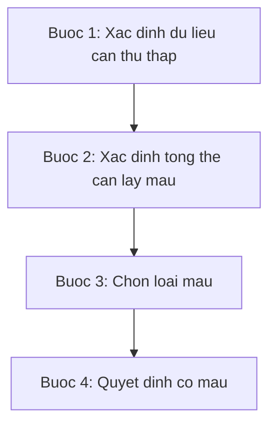
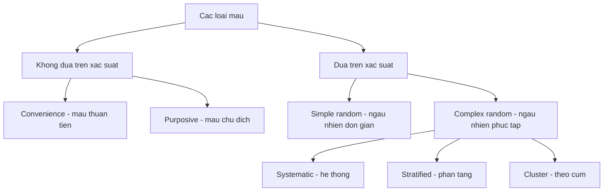
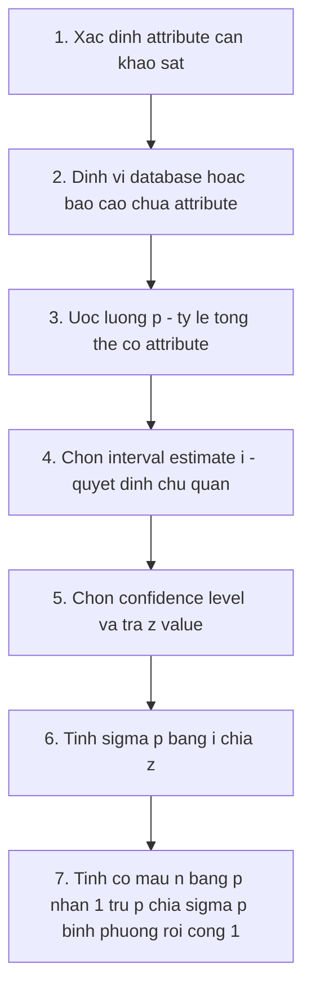
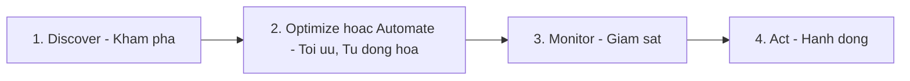
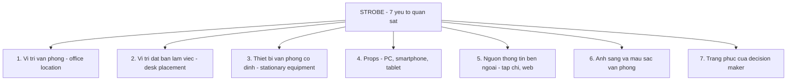
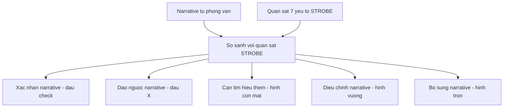

# Chương 5 — Information Gathering: Unobtrusive Methods (Thu thập thông tin: Các phương pháp không can thiệp)

> Nguồn: Kendall & Kendall, *Systems Analysis and Design*, 11th edition, Chapter 5 (trang 141–167).
> "Unobtrusive methods" = các phương pháp thu thập thông tin **không can thiệp / không quấy rầy** người dùng — khác với phỏng vấn, JAD hay bảng hỏi (các phương pháp tương tác — interactive methods ở Chương 4). Phương pháp không can thiệp nên được dùng **kết hợp** với phương pháp tương tác để có bức tranh đầy đủ.

---

## 🎯 Mục tiêu học tập

Sau khi học xong chương này, bạn có thể:

1. Hiểu **sampling (lấy mẫu)** là gì, tại sao cần lấy mẫu, và nắm **4 bước thiết kế một mẫu tốt**.
2. Phân biệt **4 loại mẫu** (convenience, purposive, simple random, complex random) và 3 dạng complex random (systematic, stratified, cluster); biết khi nào dùng loại nào.
3. **Tính được cỡ mẫu (sample size)** theo quy trình 7 bước với công thức chuẩn của sách (dựa trên p, i, z).
4. Biết cách **điều tra (investigation)** — phân tích **tài liệu định lượng (quantitative documents)**: báo cáo hiệu suất, records, biểu mẫu nhập liệu.
5. Biết cách phân tích **tài liệu định tính (qualitative documents)**: memo, biển hiệu, website, manual, sổ tay chính sách — qua 5 hướng dẫn hệ thống (ẩn dụ, "ta với họ", thuật ngữ thiện/ác, thông điệp nơi công cộng, khiếu hài hước).
6. Hiểu **text analytics** — phần mềm phân tích dữ liệu định tính phi cấu trúc (ví dụ Leximancer).
7. Hiểu **process mining** (4 bước: Discover → Optimize/Automate → Monitor → Act) và **task mining**.
8. Hiểu **workforce analytics** (phân tích lực lượng lao động) và các câu hỏi nó trả lời được.
9. Biết dùng **analyst's playscript** để quan sát hành vi ra quyết định của người quản lý.
10. Biết dùng **STROBE** (STRuctured OBservation of the Environment) với **7 yếu tố quan sát cụ thể** và bảng anecdotal list với 5 ký hiệu để đối chiếu quan sát với lời kể (narrative).

---

## 📖 Tóm tắt & giải thích kiến thức

### 1. Sampling (Lấy mẫu)

**Định nghĩa:** Sampling là quá trình **chọn lựa một cách có hệ thống các phần tử đại diện của một tổng thể (population)**. Khi phân tích kỹ các phần tử được chọn, kết quả sẽ tiết lộ thông tin hữu ích về toàn bộ tổng thể.

Systems analyst phải quyết định 2 vấn đề then chốt:
- **Tài liệu:** trong vô số báo cáo, biểu mẫu, memo, website mà tổ chức tạo ra — cái nào cần xem, cái nào bỏ qua?
- **Con người:** trong rất nhiều nhân viên bị ảnh hưởng bởi hệ thống mới — nên phỏng vấn ai, khảo sát ai, quan sát ai?

**Ví dụ đời thường:** nấu một nồi canh lớn, bạn không cần uống hết nồi để biết mặn nhạt — chỉ cần khuấy đều rồi nếm một muỗng. "Khuấy đều" chính là thiết kế mẫu tốt; "một muỗng" là mẫu đại diện.

#### 1.1. Bốn lý do cần lấy mẫu (The Need for Sampling)

1. **Containing costs — Tiết kiệm chi phí:** xem hết mọi tờ giấy, nói chuyện với mọi người, đọc mọi trang web là quá tốn kém (photocopy, chiếm thời gian nhân viên, khảo sát trùng lặp).
2. **Speeding up data gathering — Tăng tốc thu thập dữ liệu:** chỉ thu thập dữ liệu chọn lọc thay vì toàn bộ; analyst cũng đỡ gánh nặng phân tích cả tổng thể.
3. **Improving effectiveness — Tăng hiệu quả:** phỏng vấn **ít người hơn nhưng hỏi sâu hơn**, có thời gian quay lại bổ sung dữ liệu thiếu → thông tin chính xác hơn.
4. **Reducing bias — Giảm thiên lệch:** ví dụ khi phỏng vấn một executive đã đầu tư thời gian vào dự án, họ có xu hướng đánh giá thiên vị về tính năng "đã cố định" của hệ thống hiện tại (vì khó thay đổi được nữa). Lấy mẫu rộng giúp giảm loại thiên lệch này.

#### 1.2. Bốn bước thiết kế mẫu (Sampling Design)

1. **Determine the data to be collected or described** — xác định dữ liệu cần thu thập/mô tả: xác định biến (variables), thuộc tính (attributes), data items; tránh thu thập dữ liệu vô ích gây lãng phí thời gian, tiền bạc. Phải cân nhắc mục tiêu nghiên cứu và phương pháp thu thập (investigation, interview, questionnaire, observation).
2. **Determine the population to be sampled** — xác định tổng thể: với hard data, dữ liệu 2 tháng đủ chưa hay cần cả năm? Với con người, chỉ một cấp tổ chức hay tất cả các cấp? Có cần ra ngoài hệ thống (khách hàng, nhà cung cấp, đối thủ)?
3. **Choose the type of sample** — chọn loại mẫu (xem 1.3).
4. **Decide on the sample size** — quyết định cỡ mẫu (xem 1.4).

#### 1.3. Bốn loại mẫu (Types of Samples — Figure 5.1)

- **Convenience sample (mẫu thuận tiện):** không hạn chế, phi xác suất. Ví dụ: đăng thông báo trên intranet "ai quan tâm báo cáo bán hàng mới thì đến họp sáng thứ Ba". **Dễ tổ chức nhất nhưng kém tin cậy nhất.**
- **Purposive sample (mẫu chủ đích):** dựa trên **phán đoán** — analyst chọn nhóm người có vẻ am hiểu và quan tâm hệ thống mới. Có tiêu chí nhưng vẫn phi xác suất → **chỉ tin cậy vừa phải**.
- **Simple random sample (mẫu ngẫu nhiên đơn giản):** cần **danh sách đánh số của tổng thể** để mỗi tài liệu/người có cơ hội được chọn ngang nhau. Thường **không thực tế**, nhất là khi mẫu là tài liệu, báo cáo.
- **Complex random sample (mẫu ngẫu nhiên phức tạp)** — phù hợp nhất cho systems analyst, gồm 3 dạng:
  1. **Systematic sampling (lấy mẫu hệ thống):** đơn giản nhất trong các phương pháp xác suất — ví dụ phỏng vấn **mỗi người thứ k** trong danh sách nhân viên. **Nhược điểm:** không dùng để chọn "mỗi ngày thứ k" vì gặp vấn đề **chu kỳ (periodicity)**; không dùng khi danh sách đã được **sắp thứ tự** (ví dụ ngân hàng xếp từ nhỏ đến lớn) vì sẽ gây thiên lệch.
  2. **Stratified sampling (lấy mẫu phân tầng):** **công cụ quan trọng nhất cho systems analyst.** Xác định các **tổng thể con (strata)** rồi chọn đối tượng trong từng tầng. Cần thiết khi: (a) muốn lấy ý kiến từ nhiều cấp tổ chức — nếu lấy hệ thống thì cấp vận hành (đông người) sẽ chiếm tỷ lệ áp đảo, phân tầng sẽ bù lại; (b) muốn dùng **phương pháp khác nhau cho nhóm khác nhau** (ví dụ: khảo sát cho quản lý cấp trung, phỏng vấn trực tiếp cho executives).
  3. **Cluster sampling (lấy mẫu theo cụm):** chọn **một nhóm** người/tài liệu để nghiên cứu. Ví dụ: công ty có 20 help desk rải khắp cả nước, chọn 1–2 cái với giả định chúng **điển hình** cho tất cả.

**Bảng so sánh các loại sampling:**

| Loại mẫu | Dựa trên xác suất? | Cách chọn | Độ tin cậy | Ví dụ | Khi nào dùng |
|---|---|---|---|---|---|
| Convenience | Không | Không hạn chế, ai tiện thì lấy | Thấp nhất | Thông báo mời họp tự nguyện trên intranet | Cần nhanh, chấp nhận rủi ro thiên lệch |
| Purposive | Không | Theo phán đoán/tiêu chí của analyst | Trung bình | Chọn người am hiểu + quan tâm hệ thống | Cần ý kiến chuyên sâu từ người hiểu việc |
| Simple random | Có | Danh sách đánh số, cơ hội ngang nhau | Cao | Bốc thăm từ danh sách nhân viên đánh số | Khi có danh sách đầy đủ (hiếm khi khả thi với tài liệu) |
| Systematic | Có (complex) | Mỗi phần tử thứ k | Cao (trừ khi có chu kỳ/danh sách sắp thứ tự) | Phỏng vấn mỗi nhân viên thứ 10 | Danh sách không theo thứ tự, không có tính chu kỳ |
| Stratified | Có (complex) | Chia tầng rồi chọn trong từng tầng | Cao — quan trọng nhất cho analyst | Chọn đủ người ở mọi cấp quản lý | Tổng thể không đồng nhất, cần đại diện mọi nhóm |
| Cluster | Có (complex) | Chọn 1–2 cụm điển hình | Cao nếu cụm thật sự điển hình | Chọn 2 trong 20 help desk | Tổng thể phân tán địa lý, chi phí đi lại cao |

> **Lưu ý của sách:** analyst **nên dùng complex random sample nếu có thể**.

#### 1.4. Quyết định cỡ mẫu (The Sample Size Decision)

Nguyên tắc nền tảng:
- Nếu ai cũng nghĩ giống nhau / mọi tài liệu giống hệt nhau → mẫu 1 là đủ. Thực tế không vậy → cỡ mẫu phải **lớn hơn 1 nhưng nhỏ hơn tổng thể**.
- **Con số tuyệt đối quan trọng hơn tỷ lệ phần trăm:** lấy 20 người trong 200 hay 20 người trong 2.000.000 đều có thể cho kết quả thỏa đáng.
- Cỡ mẫu thực tế còn phụ thuộc chi phí, thời gian của analyst và thời gian người trong tổ chức dành được.

**Quy trình 7 bước xác định cỡ mẫu (dữ liệu thuộc tính — attribute data):**

1. Xác định **attribute** (thuộc tính) cần khảo sát (ví dụ: loại lỗi cần tìm).
2. Định vị **database hoặc báo cáo** chứa thuộc tính đó.
3. Xem xét thuộc tính, **ước lượng p** — tỷ lệ tổng thể có thuộc tính đó.
4. Quyết định chủ quan về **interval estimate chấp nhận được, i** (khoảng ước lượng, ví dụ ±0.10).
5. Chọn **confidence level** (mức tin cậy) và tra **confidence coefficient (z value)** trong bảng.
6. Tính **σp — standard error of the proportion (sai số chuẩn của tỷ lệ):**

   σp = i / z

7. Tính **cỡ mẫu cần thiết n:**

   n = p(1 − p) / σp² + 1

**Bảng z value (Figure 5.2 — diện tích dưới đường cong chuẩn):**

| Confidence Level (mức tin cậy) | Confidence Coefficient (z value) |
|---|---|
| 99% | 2.58 |
| 98% | 2.33 |
| 97% | 2.17 |
| 96% | 2.05 |
| 95% | 1.96 |
| 90% | 1.65 |
| 80% | 1.28 |
| 50% | 0.67 |

**Lưu ý về heuristic 0.25:** nhiều giáo trình gợi ý dùng 0.25 cho p(1−p). Đây là **giá trị lớn nhất** của p(1−p) (chỉ xảy ra khi p = 0.50) nên hầu như luôn cho cỡ mẫu **lớn hơn cần thiết**. Thực tế thường p = 0.10 → p(1−p) = 0.09 → cỡ mẫu nhỏ hơn nhiều.

**Ví dụ trong sách (A. Sembly Company — nhà sản xuất kệ):** cần biết bao nhiêu % đơn hàng có lỗi.

1. Attribute = lỗi tên, địa chỉ, số lượng, mã sản phẩm trên đơn hàng.
2. Nguồn = bản sao order forms 6 tháng gần nhất.
3. Xem sơ bộ → ước lượng p ≈ 5% = 0.05.
4. Chọn i = ±0.02.
5. Chọn confidence level 95% → z = 1.96.
6. σp = i/z = 0.02/1.96 = **0.0102**.
7. n = p(1−p)/σp² + 1 = (0.05 × 0.95)/(0.0102)² + 1 = 0.0475/0.00010404 + 1 ≈ 457 + 1 = **458**.

→ Cỡ mẫu = **458 đơn hàng**. Nếu giữ i = ±0.02 nhưng nâng confidence level lên 99% (z = 2.58) thì n = **1.827** — lớn hơn nhiều. **Kết luận: mức tin cậy càng cao hoặc khoảng ước lượng càng hẹp → cỡ mẫu càng lớn.**

**Cỡ mẫu khi phỏng vấn (Determining Sample Size When Interviewing):**
- **Không có công thức thần kỳ.** Biến số quyết định (overriding variable) là **thời gian một cuộc phỏng vấn chiếm** — phỏng vấn sâu + phỏng vấn follow-up rất tốn thời gian cho cả hai bên.
- **Quy tắc kinh nghiệm (rule of thumb):** phỏng vấn **ít nhất 3 người ở mỗi cấp tổ chức** và **ít nhất 1 người từ mỗi functional area** sẽ làm việc trực tiếp với hệ thống mới/nâng cấp.
- Tổ chức lớn hơn **không** đồng nghĩa phải phỏng vấn nhiều hơn — stratified sample làm đúng thì số ít người vẫn đại diện được cả tổ chức.

---

### 2. Investigation — Phân tích tài liệu định lượng (Analyzing Quantitative Documents)

**Investigation** là hành động **khám phá và phân tích dữ liệu**. Analyst đóng vai như thám tử Sherlock Holmes: xem xét **hard data** (dữ liệu cứng) mà không phương pháp nào khác cung cấp được. Hard data cho thấy **tổ chức đã ở đâu và các thành viên tin nó đang đi về đâu**. Cần xem cả hard data **định lượng lẫn định tính**.

Tài liệu định lượng gồm: báo cáo dùng để ra quyết định, **performance reports**, **records**, và nhiều loại **forms** — mỗi tài liệu có mục đích và đối tượng riêng.

#### 2.1. Các báo cáo dùng cho ra quyết định

- **Sales report** (báo cáo bán hàng): tóm tắt lượng bán, loại hình bán; có thể kèm đồ thị so sánh doanh thu/lợi nhuận qua các kỳ → giúp phát hiện xu hướng nhanh.
- **Production reports** (báo cáo sản xuất): chi phí gần đây, tồn kho hiện tại, thông tin lao động và nhà máy.
- **Service reports**: giao dịch vụ, hiệu suất nhân viên, mức hài lòng khách hàng.
- **Summary reports**: cung cấp bối cảnh, **phát hiện ngoại lệ** (exceptions), cho cái nhìn chiến lược.

#### 2.2. Performance Reports (Báo cáo hiệu suất)

- Dạng chung: **actual versus intended performance** (thực tế so với dự định/mục tiêu).
- Chức năng quan trọng: **đo khoảng cách (gap)** giữa thực tế và mục tiêu, và xem gap đang **rộng ra hay hẹp lại** như một xu hướng tổng thể.
- Ví dụ Figure 5.3: báo cáo % lô hàng bị loại giảm dần từ 7.8% xuống 4.4% qua các tuần, so với mục tiêu <5% → cải thiện rõ rệt trong 2–3 tháng.
- Analyst cần lưu ý: tổ chức có sẵn thước đo hiệu suất phù hợp cho các mảng then chốt không.

#### 2.3. Records (Sổ ghi chép)

Records cung cấp **cập nhật định kỳ** về những gì đang diễn ra. Nếu được cập nhật kịp thời bởi người ghi cẩn thận, nó rất hữu ích. Analyst kiểm tra record theo 4 cách (ví dụ Figure 5.4 — sổ thanh toán tiền thuê căn hộ viết tay):

1. **Kiểm tra lỗi** trong số tiền và tổng số.
2. **Tìm cơ hội cải thiện thiết kế** biểu mẫu ghi chép.
3. **Quan sát số lượng và loại giao dịch.**
4. **Tìm chỗ máy tính có thể đơn giản hóa công việc** (tính toán, xử lý dữ liệu).

#### 2.4. Data Capture Forms (Biểu mẫu thu thập dữ liệu)

Trước khi thay đổi luồng thông tin, phải hiểu hệ thống hiện tại. Cần hỏi quản lý xem form nào có online cho khách hàng, form nào chỉ dùng nội bộ; nên tải/thu thập/catalog **một bản trắng của mọi form** đang dùng (chính thức lẫn không chính thức); nhớ in cả web-based forms; bản điện tử có thể lưu vào database để kiểm tra sau. (Nếu doanh nghiệp có người phụ trách forms management thì đó là nguồn đầu tiên.)

**4 bước lập catalog forms:**
1. Thu thập ví dụ **tất cả** forms đang dùng — kể cả **bootleg forms** (form "lậu", không được phê duyệt chính thức).
2. Ghi chú **loại form** (in nội bộ, viết tay, máy tính tạo, online, web fill-in, mua ngoài...).
3. Ghi lại **intended distribution pattern** (luồng phân phối dự định).
4. **So sánh** luồng phân phối dự định với người **thực sự nhận** form.

Cách khác: lấy mẫu forms **đã điền**. Các câu hỏi HCI (usability, aesthetics, usefulness — Figure 5.5):
1. Form có được điền **đầy đủ** không? Mục nào bị bỏ trống, có bỏ trống **nhất quán** không? Tại sao?
2. Có form nào **không bao giờ được dùng**? Tại sao? (Kiểm tra thiết kế và tính phù hợp với chức năng.)
3. Tất cả bản sao có đến **đúng người**, được lưu đúng chỗ? Người cần truy cập form online có truy cập được không (permissions, links hoạt động)?
4. Nếu form giấy tồn tại song song form web → **so sánh tỷ lệ hoàn thành** của cả hai.
5. Có **bootleg forms** được dùng thường xuyên không? (Dấu hiệu quy trình chuẩn có vấn đề, hoặc **đấu đá chính trị** về việc ai kiểm soát input, ai nhập dữ liệu.)

Ví dụ Figure 5.5 (form đặt lại hàng sữa Farmfresh): form chính thức **quá tải thông tin**, **không có thứ tự logic**, hỏi cả tổng số không cần thiết → nhân viên tự chế bootleg form đơn giản hơn.

---

### 3. Phân tích tài liệu định tính (Analyzing Qualitative Documents)

Qualitative documents gồm: **email, memos, biển hiệu/poster trên bảng tin và khu làm việc, web pages, procedure manuals (sổ tay quy trình), policy handbooks (sổ tay chính sách)**. Chúng giàu chi tiết, tiết lộ **kỳ vọng về hành vi** mà người viết đặt lên người khác và cách người dùng kỳ vọng tương tác với công nghệ.

#### 3.1. Năm hướng dẫn phân tích hệ thống (liên quan khía cạnh cảm xúc, động lực của HCI và quan hệ liên nhân):

1. **Tìm ẩn dụ then chốt/dẫn dắt (key or guiding metaphors)** — vì **ngôn ngữ định hình hành vi**. Ví dụ: tổ chức gọi nhân viên là "bánh răng trong cỗ máy" → cái nhìn cơ giới (mechanistic); memo trong Figure 5.6 dùng ẩn dụ "We're one big happy family" (một đại gia đình hạnh phúc) → analyst dự đoán được loại ẩn dụ nào sẽ có sức thuyết phục trong tổ chức.
2. **Tìm tâm lý "người trong cuộc vs. kẻ ngoài cuộc"** — "us against them". Nếu phòng ban này đang "đánh nhau" với phòng ban kia, có thể không lấy được hợp tác cho dự án hệ thống cho tới khi chính trị nội bộ được giải quyết.
3. **Liệt kê thuật ngữ mô tả thiện/ác (good or evil)** xuất hiện lặp lại trong tài liệu.
4. **Tìm thông điệp và hình ảnh có ý nghĩa** đăng ở khu vực chung hoặc web pages.
5. **Nhận diện khiếu hài hước (sense of humor)** nếu có — là "phong vũ biểu" nhanh và chính xác về nhiều biến HCI, liên nhân và tổ chức: người đó thuộc subculture nào, tinh thần làm việc (morale) ra sao.

#### 3.2. Từng loại tài liệu định tính

- **Memos (email threads):** xem **ai gửi, ai nhận**. Thông thường thông tin chảy **xuống dưới và ngang** nhiều hơn là lên trên. Memo hé lộ cuộc "đối thoại sống động, liên tục" của tổ chức; phân tích nội dung memo cho biết **values, attitudes, beliefs** (giá trị, thái độ, niềm tin) của các thành viên.
- **Signs/Posters (biển hiệu, áp phích):** tưởng nhỏ nhặt nhưng là **chất củng cố tinh tế các giá trị**. Khẩu hiệu như "Quality Is Forever" hay "Safety First" cho analyst cảm nhận về **văn hóa tổ chức chính thức**.
- **Corporate Websites:** xem cả **B2C** lẫn **B2B** ecommerce. Kiểm tra ẩn dụ, hài hước, tính năng thiết kế (màu, đồ họa, animation, hyperlinks), độ rõ của thông điệp. Đánh giá theo **3 chiều: technical, aesthetic, managerial** (kỹ thuật, thẩm mỹ, quản lý). Câu hỏi: có mâu thuẫn giữa mục tiêu tuyên bố và những gì hiển thị không? Mức customization/personalization cho người dùng? Ghi chú mức tương tác, khả năng tiếp cận (accessibility) của hình + chữ, mức bảo mật — nhiều metric có thể xin từ internet provider của công ty.
- **Manuals (sổ tay/tài liệu hướng dẫn):** gồm manual quy trình vận hành máy tính và manual online. Phân tích theo 5 hướng dẫn ở trên. Nhớ rằng manual trình bày cái **"lý tưởng" (the ideal)** — cách máy móc và con người **được kỳ vọng** hành xử. Manual trên web tăng khả năng được tra cứu; manual in **hiếm khi được cập nhật**, thường bị xếp xó.
- **Policy Handbooks (sổ tay chính sách):** analyst quan tâm chủ yếu chính sách về **computer services, use, access, security, charges**. Xem chính sách giúp nhận biết **values, attitudes, beliefs** dẫn dắt công ty.

**Lưu ý chung (từ Summary):** tài liệu là **thông điệp có tính thuyết phục (persuasive messages)** — thay đổi tài liệu rất có thể sẽ thay đổi chính tổ chức.

---

### 4. Text Analytics (Phân tích văn bản)

**Text analytics** là **phần mềm phân tích dữ liệu định tính phi cấu trúc (unstructured)** từ mọi nguồn: transcript phỏng vấn, báo cáo viết, giao tiếp khách hàng qua email, wiki, blog, chat room, mạng xã hội.

- **Nguồn dữ liệu "mềm" (soft data):** blogs, chat rooms, bảng hỏi có câu hỏi mở (open-ended), thảo luận online, trao đổi trên mạng xã hội (Facebook, YouTube, WhatsApp, Instagram, Weixin/WeChat, TikTok...) và các đối thoại web giữa khách hàng và tổ chức.
- Giúp người ra quyết định hiểu **khách hàng đang nghĩ gì** về tổ chức, giá trị và hành động của công ty, **động cơ** của khách hàng/vendor khi bắt đầu, duy trì, cải thiện hay chấm dứt quan hệ.
- **Đối chiếu:** structured data (Chương 13) là dữ liệu có tổ chức tốt, truy vấn được bằng query/thuật toán chuẩn qua **data analytics** (ví dụ: relational database, dữ liệu cảm biến máy) — chiếm phần lớn thông tin của tổ chức.
- Nếu analyst đang giúp tổ chức xây dựng hiện diện online thì **nên tích hợp text analytics** vào hệ thống mới.

**Ví dụ công cụ — Leximancer** (công ty Úc): không cần setup; người dùng nộp tài liệu → loại bỏ stop words (a, the...) → phần mềm **đếm từ khóa** → chia văn bản thành các đoạn → các concept hình thành một **"thesaurus"** các từ "đi cùng nhau" qua văn bản. Kết quả:
- **Concept map** (Figure 5.7): hiển thị trực quan độ nổi bật và quan hệ giữa các concept (ví dụ project Open Source Communities: *Linux, projects, trying, process* dính cụm với nhau; *community* tách riêng nhưng nối qua *people*).
- **Ranked concepts** (Figure 5.8): biểu đồ cột xếp hạng concept nổi bật trong từng category (ví dụ category "community" gắn mạnh với từ "development").

**Vai trò của analyst:** không chỉ "cắm" công cụ vào — phải **thiết kế các hoạt động con người xung quanh** việc dùng text analytics: hướng dẫn decision makers cách xem, diễn giải kết quả định tính và dùng bằng chứng để đưa ra khuyến nghị hợp lý. Nhớ: **không phải là chuyển dữ liệu định tính thành định lượng**, mà là xây hệ thống dùng text analytics như một phương tiện hữu ích để đạt mục đích.

---

### 5. Process Mining (Khai phá quy trình)

Analyst mô tả hệ thống **"as is"** (như đang có) trước khi đề xuất **"should be"** (nên là). Phân tích thủ công rất tốn thời gian và tiền → nếu tự động hóa được thì rất giá trị.

**Process mining** là quá trình **tự động, không can thiệp**, quét các quy trình thông qua **APIs** trong các gói phần mềm doanh nghiệp như **SAP, Salesforce, Oracle**... và xác định nơi có thể tồn tại vấn đề. Các enterprise applications **ghi lại mọi hoạt động** — đó chính là dữ liệu cho process mining.

- **Celonis** (www.celonis.com) chiếm >60% thị trường, được Gartner Group (2019) công nhận là leader; các đối thủ: **UIPath, Fluxicon, QPR Software**.
- Định nghĩa của Celonis: *"một ngành phân tích để khám phá, giám sát và cải thiện quy trình kinh doanh **như chúng thực sự là** — không phải như bạn nghĩ"*. Gartner: *"cung cấp khả năng nhìn thấy và hiểu vận hành/quy trình kinh doanh thực tế bằng cách áp dụng một tập thuật toán lên các events"*.

**4 bước process mining (theo UIPath.com):**

1. **Discover:** app đọc dữ liệu từ enterprise systems, tạo **event log** (sự kiện gì, xảy ra khi nào); vẽ ra **path** cho thấy bottlenecks, variations, exceptions.
2. **Optimize/Automate:** cải thiện — có thể retrain nhân viên, nhưng đây cũng là thời điểm tốt để **tự động hóa** một số task (thường rẻ hơn và bền vững hơn đào tạo lại).
3. **Monitor:** quan sát xem bước tối ưu/tự động hóa ảnh hưởng thế nào đến path — ví dụ tự động hóa có thể chỉ **đẩy bottleneck xuống xa hơn** trên path.
4. **Act:** động lực để công ty tiến hành các thay đổi cần thiết — tìm giải pháp công nghệ mới, kêu gọi luật mới, hoặc thay đổi ảnh hưởng đến lợi nhuận.

**Ví dụ (hệ thống fulfillment + invoicing):** các câu hỏi hàng ngày — quy trình chạy trơn tru không? Có bottleneck khi tạo đơn không? Giao hàng đúng hẹn không? Hóa đơn đúng không? Thanh toán về đúng hạn không? Process mining có thể giám sát khối lượng giao dịch, thời gian đơn hàng đầu-cuối, giao trễ, thời gian tạo/phát hành hóa đơn, khoản phải thu. Ví dụ tự động: thay vì nhân viên kiểm tra thủ công hàng ngày xem khách đã trả hóa đơn trước chưa rồi chỉnh ngày giao, ứng dụng đọc dữ liệu SAP và **tự động điều chỉnh ship date**.

- Shah (2022): process mining là "họ kỹ thuật bắc cầu giữa phân tích dữ liệu kỹ thuật và tác động kinh doanh"; Celonis còn giúp **định lượng carbon footprint** sâu hơn dashboard truyền thống.
- Celonis giúp analyst: (1) phân tích **nguyên nhân gốc** của lãng phí/kém hiệu quả, (2) khuyến nghị cải tiến giảm thiểu lãng phí đã xác định, (3) đưa ra **tác động định lượng** của thay đổi đề xuất.
- **Figure 5.9:** đường lý tưởng là đường thẳng đứng "Create Sales Order → Generate Delivery Document → Release Delivery → Ship Goods → Send Invoice"; mỗi lần activity **rẽ nhánh** khỏi đường thẳng nghĩa là hệ thống "as is" kém hiệu quả (ví dụ "Approve Credit Check", "Change Price"); cột "Impact" ghi rõ chi phí giao trễ, hàng trả về, đơn chưa xuất hóa đơn. **Figure 5.10:** **simulation** so sánh path sau khi gỡ bottleneck với path hiện tại — cho thấy tiềm năng cải thiện chu kỳ thời gian và phân bố chi phí.

**Task mining:** là **ghi nhận không can thiệp trên desktop** các tác vụ mà nhân viên thực hiện — cho thấy **cá nhân đang làm gì** và tìm được chỗ cải thiện, tương tự process mining. Phần mềm phổ biến: **Microsoft Viva, Allactivity, Activtrak**. Task mining là một phần của hoạt động rộng hơn gọi là **workplace analytics**. Process mining + task mining kết hợp là cách giá trị để giữ mọi hệ thống chạy trơn tru.

> Celonis còn có **global academic alliance** với hơn 700 học viện đào tạo sinh viên về process discovery, analysis building, conformance checking, process automation.

---

### 6. Workforce Analytics (Phân tích lực lượng lao động)

Nhà quản lý muốn: đúng người đúng việc, chia đều workload, giám sát hiệu suất, đánh giá giá trị các app đã mua, và tăng năng suất chung. Đại dịch COVID-19 + làm việc từ xa khiến workforce analytics trở nên tinh vi và "biết nói" hơn — thay cho việc quan sát nhân viên tại bàn làm việc như trước.

**Workforce analytics dùng để (6 mục đích):**
1. Đảm bảo **đúng người đúng chỗ**.
2. **Cân bằng workload** giữa nhân viên.
3. **So sánh hiệu suất** giữa các nhân viên/team.
4. Nhận ra **bottleneck trong workflow** ở đâu.
5. Xác định **app nào được dùng nhiều hơn**.
6. Nhận ra **app nào mang lại năng suất cao hơn**.

**Ví dụ — ActivTrak** (nền tảng SaaS về workforce & productivity), cam kết bảo vệ quyền riêng tư, thực hiện **mà KHÔNG**: (1) giám sát email, (2) keystroke logging, (3) giám sát thiết bị cá nhân, (4) truy cập camera nhân viên, (5) quay video. **Workforce management không phải là surveillance (theo dõi/do thám)** — mục đích là hiểu cách công việc được thực hiện, công cụ nào được dùng, team tương tác ra sao, và chỗ nào cải thiện được.

Ba nhóm ứng dụng minh họa:
1. **Hiểu mức dùng app và lượt truy cập website (Figure 5.11):** tự động phân loại app/website là productive hay nonproductive, phân loại theo kiểu (email, meeting, CRM...). Câu hỏi analyst: "Nhân viên dùng công cụ giao tiếp nào nhiều nhất: email, messaging hay collaboration?", "Mức dùng app khác nhau theo từng cá nhân thế nào?". Từ đó nhận diện hoạt động ngốn thời gian, chỗ gây phân tâm (social media, email), và **app trùng chức năng** (2 app subscription làm cùng việc → bỏ 1).
2. **Xác định khi nào và vì sao nhân viên mất tập trung (Figure 5.12):** dashboard chia hoạt động mỗi giờ thành **focused / collaborative / multitasking**. Câu hỏi: "Giờ nào trong ngày nhân viên năng suất nhất/kém nhất?", "Nhân viên có online và gắn kết trong giờ kinh doanh trọng yếu không, hay cần điều chỉnh mô hình nhân sự?". Mục tiêu: cải thiện hiệu suất **đồng thời tạo môi trường làm việc lành mạnh**.
3. **So sánh hiệu suất giữa các team (Figure 5.13):** xem team cạnh nhau; dashboard chứa hiệu suất team, hiệu suất cá nhân, top categories app, top activities, thời gian trung bình. Câu hỏi: "Dữ liệu team này so với team kia thế nào?", "Thành viên năng suất nhất làm việc ra sao, có thể mô hình hóa hành vi của họ cho người khác không?". Quản lý dùng để **coach** các team.

---

### 7. Quan sát hành vi của người ra quyết định (Observing a Decision Maker's Behavior)

Quan sát decision makers — môi trường vật lý và tương tác của họ với môi trường ergonomic — là phương pháp không can thiệp quan trọng để biết **điều gì thực sự được làm**, chứ không chỉ điều được ghi chép hay kể lại. Quan sát còn cho thấy trực tiếp **quan hệ** giữa decision maker và các thành viên khác, và các manh mối **HCI** — hệ thống "vừa vặn" với người dùng đến đâu.

#### Analyst's Playscript (Kịch bản của analyst)

- Ngày làm việc của quản lý được mô tả là "**một chuỗi gián đoạn xen kẽ những đợt làm việc ngắn**" → khó "ghim" quản lý làm gì. Phỏng vấn/bảng hỏi cho biết quản lý **tự mô tả** công việc thế nào; quan sát cho thấy **tận mắt** cách họ **thu thập, xử lý, chia sẻ và sử dụng thông tin** và công nghệ.
- Vì đối tượng là **con người và hoạt động của họ** (không phải hộp và mũi tên), sách đề xuất cách tiếp cận **nhân văn hơn**: **analyst's playscript**.
- Cách làm: **"actor" (diễn viên) là decision maker** được quan sát khi "diễn" — tức ra quyết định. Lập bảng 2 cột: **cột trái = actor**, **cột phải = tất cả hành động của họ** (information-related activities). Mọi hoạt động ghi bằng **động từ hành động (action verbs)**: "talking", "sampling", "corresponding", "deciding"...
- Ví dụ Figure 5.14 (Solid Steel Shelving — Quality Assurance): QA Manager hỏi báo cáo sản xuất → Shop Floor Supervisor in báo cáo, thảo luận vấn đề tái diễn → QA Manager đọc báo cáo, so sánh với báo cáo cùng tuần, nhập dữ liệu vào QA model, quan sát kết quả, gọi nhà cung cấp thép về sai lệch chất lượng → họp về tiêu chuẩn mới → soạn thư báo nhà cung cấp → gửi VP duyệt qua email → sửa lại theo góp ý.
- **Giá trị:** cách tiếp cận có tổ chức, hệ thống, buộc analyst hiểu và diễn đạt được hành động của từng decision maker; cuối cùng giúp xác định **thông tin cần thiết cho các quyết định lớn/thường xuyên**. Ví dụ từ playscript trên: dù QA manager ở cấp quản lý trung, người này cần khá nhiều **thông tin bên ngoài** (external information) để làm việc.

---

### 8. Quan sát môi trường vật lý — STROBE (Observing the Physical Environment)

Quan sát **môi trường vật lý** nơi decision makers làm việc (chủ yếu là văn phòng của họ) cũng tiết lộ nhiều về nhu cầu thông tin. Decision makers **ảnh hưởng đến và chịu ảnh hưởng bởi** môi trường vật lý của họ. Nhiều mối quan tâm HCI có thể được nhận diện qua quan sát có cấu trúc và **xác nhận lại bằng kỹ thuật khác** (phỏng vấn, bảng hỏi, process/task mining).

#### 8.1. Nguồn gốc ý tưởng — mise-en-scène

Nhà phê bình phim dùng **mise-en-scène analysis** để đánh giá một khung hình: dựng phim, góc máy, bối cảnh, diễn viên và phục trang — xem chúng có đang tạo nghĩa đúng ý đạo diễn không; đôi khi mise-en-scène **mâu thuẫn với lời thoại**. Systems analyst đóng vai tương tự **nhà phê bình phim**: quan sát chi tiết môi trường xung quanh để **xác nhận hoặc phủ nhận organizational narrative** (câu chuyện/lời kể của tổ chức) thu được qua phỏng vấn, bảng hỏi. (Ví dụ vui thời COVID: tài khoản Twitter "Room Rater" chấm điểm 1–10 background video-conference của mọi người và gợi ý "cải thiện" như thêm tranh, thêm cây.)

#### 8.2. STROBE — STRuctured OBservation of the Environment

Phương pháp được sách khuyến nghị. Áp dụng thành công đòi hỏi analyst quan sát tường minh **7 yếu tố cụ thể (concrete elements)** thường thấy trong văn phòng (Figure 5.15):

| # | Yếu tố quan sát | Câu hỏi analyst có thể đặt |
|---|---|---|
| 1 | **Office location** (vị trí văn phòng) | Ai có văn phòng góc? Các decision makers chủ chốt có rải rác trên nhiều tầng không? |
| 2 | **Desk placement** (vị trí đặt bàn) | Cách đặt bàn có khuyến khích giao tiếp không? Có thể hiện quyền lực không? |
| 3 | **Stationary equipment** (thiết bị cố định: tủ hồ sơ, kệ) | Decision maker có thích tự thu thập và lưu trữ thông tin cá nhân không? Khu lưu trữ lớn hay nhỏ? |
| 4 | **Props** (đạo cụ: thiết bị di động) | Có bằng chứng decision maker dùng PC, smartphone, tablet trong văn phòng không? |
| 5 | **External information sources** (nguồn thông tin bên ngoài) | Decision maker có lấy nhiều thông tin từ nguồn ngoài như trade journals hay Web không? |
| 6 | **Office lighting and color** (ánh sáng và màu sắc) | Ánh sáng phục vụ làm việc chi tiết hay giao tiếp thân mật? Màu có ấm áp, mời gọi không? |
| 7 | **Clothing worn by decision makers** (trang phục) | Decision maker có thể hiện quyền lực qua trang phục "quyền uy" (authoritative) không? Nhân viên có phải mặc đồng phục không? |

7 yếu tố này tiết lộ cách decision maker **thu thập, xử lý, lưu trữ và chia sẻ thông tin**, cũng như **uy tín (credibility)** của họ tại nơi làm việc.

**Bảng tương ứng đặc điểm decision maker ↔ yếu tố môi trường (Figure 5.16):**

| Đặc điểm của decision maker | Yếu tố tương ứng trong môi trường vật lý |
|---|---|
| Thu thập thông tin không chính thức (informally) | Ánh sáng đèn sợi đốt ấm áp, màu sắc ấm |
| Tìm kiếm thông tin ngoài tổ chức | Trade journals hiện diện trong văn phòng |
| Tự mình xử lý dữ liệu | PC hoặc tablet hiện diện trong văn phòng |
| Tự mình lưu trữ thông tin | Thiết bị/hồ sơ hiện diện trong văn phòng |
| Thể hiện quyền lực khi ra quyết định | Bàn được đặt ở thế "quyền lực" |
| Thể hiện uy tín khi ra quyết định | Mặc trang phục quyền uy |
| Chia sẻ thông tin với người khác | Văn phòng dễ tiếp cận |

#### 8.3. Áp dụng STROBE — Anecdotal List với 5 ký hiệu (Figure 5.17)

Một cách triển khai STROBE là dùng **anecdotal checklist** (danh mục giai thoại) với ký hiệu viết tắt có nghĩa (đã áp dụng cho 4 decision makers chủ chốt của một cửa hàng quần áo nhượng quyền):

**Quy trình:** (1) analyst viết ra các **chủ đề tổ chức then chốt** rút từ phỏng vấn (narrative) → (2) quan sát và ghi các yếu tố STROBE → (3) **so sánh** narrative với quan sát, dùng 1 trong 5 ký hiệu để mô tả quan hệ → tạo ra một bảng vừa ghi chép vừa hỗ trợ phân tích.

**5 ký hiệu:**

| Ký hiệu | Ý nghĩa |
|---|---|
| ✓ Check mark | Quan sát **xác nhận (confirm)** narrative |
| ✗ Chữ X | Quan sát **đảo ngược/phủ nhận (reverse/negate)** narrative |
| 👁 Hình oval/con mắt | **Gợi ý cần tìm hiểu thêm (cue to look further)** |
| ▢ Hình vuông | Quan sát **điều chỉnh (modify)** narrative |
| ◯ Hình tròn | Quan sát **bổ sung (supplement)** narrative |

> **Ghi nhớ tổng quát của chương:** sampling + investigation (tài liệu định lượng & định tính) + text analytics + process/task mining + workforce analytics + observation (playscript, STROBE) = bộ công cụ **không can thiệp**. Chúng cho thấy điều **thực sự xảy ra**, bổ sung (chứ không thay thế) cho phỏng vấn/bảng hỏi vốn cho thấy điều **được kể lại**.

---

## 🔑 Bảng thuật ngữ (Keywords and Phrases)

| Thuật ngữ tiếng Anh | Nghĩa tiếng Việt |
|---|---|
| analyst's playscript | kịch bản của analyst — bảng ghi actor (người ra quyết định) và các hành động của họ bằng động từ hành động |
| business-to-business (B2B) ecommerce | thương mại điện tử giữa doanh nghiệp với doanh nghiệp |
| business-to-consumer (B2C) ecommerce | thương mại điện tử giữa doanh nghiệp với người tiêu dùng |
| cluster sampling | lấy mẫu theo cụm — chọn một nhóm điển hình để nghiên cứu |
| complex random sample | mẫu ngẫu nhiên phức tạp (gồm systematic, stratified, cluster) |
| confidence level | mức tin cậy — độ chắc chắn mong muốn (ví dụ 95%) |
| convenience sample | mẫu thuận tiện — không hạn chế, phi xác suất, kém tin cậy nhất |
| process mining | khai phá quy trình — quét tự động, không can thiệp các quy trình qua API của phần mềm doanh nghiệp để tìm vấn đề |
| purposive sample | mẫu chủ đích — chọn theo phán đoán/tiêu chí, phi xác suất |
| qualitative documents | tài liệu định tính (email, memo, biển hiệu, web pages, manuals, policy handbooks) |
| quantitative documents | tài liệu định lượng (báo cáo ra quyết định, performance reports, records, forms) |
| sampling | lấy mẫu — chọn có hệ thống các phần tử đại diện của tổng thể |
| simple random sample | mẫu ngẫu nhiên đơn giản — từ danh sách đánh số, cơ hội chọn ngang nhau |
| stratified sampling | lấy mẫu phân tầng — chia tổng thể con (strata) rồi chọn trong từng tầng |
| STROBE | STRuctured OBservation of the Environment — quan sát có cấu trúc môi trường với 7 yếu tố cụ thể |
| systematic sampling | lấy mẫu hệ thống — chọn mỗi phần tử thứ k |
| task mining | khai phá tác vụ — ghi nhận không can thiệp trên desktop những gì cá nhân đang làm |
| text analytics | phân tích văn bản — phần mềm phân tích dữ liệu định tính phi cấu trúc |
| workforce analytics | phân tích lực lượng lao động — tự động thu thập dữ liệu về workload và hiệu suất |

---

## ❓ Trả lời Review Questions

**1. Định nghĩa sampling.**
Sampling (lấy mẫu) là quá trình **chọn lựa một cách có hệ thống các phần tử đại diện của một tổng thể (population)**. Khi các phần tử được chọn được xem xét kỹ, việc phân tích mẫu sẽ tiết lộ thông tin hữu ích về toàn bộ tổng thể.

**2. Bốn lý do analyst muốn lấy mẫu dữ liệu hoặc chọn người đại diện để phỏng vấn.**
(1) **Containing costs** — tiết kiệm chi phí; (2) **Speeding up data gathering** — tăng tốc thu thập dữ liệu; (3) **Improving effectiveness** — tăng hiệu quả (ít người hơn nhưng hỏi sâu hơn, có thời gian follow-up); (4) **Reducing bias** — giảm thiên lệch trong thu thập dữ liệu.

**3. Bốn bước thiết kế một mẫu tốt.**
(1) Xác định dữ liệu cần thu thập hoặc mô tả; (2) Xác định tổng thể cần lấy mẫu; (3) Chọn loại mẫu; (4) Quyết định cỡ mẫu.

**4. Ba cách tiếp cận complex random sampling.**
(1) **Systematic sampling** (lấy mẫu hệ thống — mỗi phần tử thứ k); (2) **Stratified sampling** (lấy mẫu phân tầng); (3) **Cluster sampling** (lấy mẫu theo cụm).

**5. Định nghĩa stratification (phân tầng) của mẫu.**
Stratification là quá trình **xác định các tổng thể con (subpopulations/strata)** rồi **chọn đối tượng hoặc con người để lấy mẫu bên trong các tổng thể con đó**. Phân tầng thường thiết yếu để thu thập dữ liệu hiệu quả (đảm bảo mọi cấp tổ chức được đại diện cân xứng) và khi analyst muốn dùng các phương pháp thu thập khác nhau cho các nhóm con khác nhau (khảo sát với quản lý trung, phỏng vấn với executives).

**6. Dùng confidence level lớn hơn có tác động gì đến cỡ mẫu khi lấy mẫu dữ liệu thuộc tính?**
Confidence level **càng cao** → z value càng lớn → σp = i/z càng nhỏ → cỡ mẫu cần thiết **càng lớn**. Ví dụ trong sách: giữ i = ±0.02, tăng mức tin cậy từ 95% (n = 458) lên 99% thì n = 1.827 — lớn hơn nhiều.

**7. Biến số quyết định (overriding variable) số người analyst nên phỏng vấn sâu là gì?**
Là **thời gian mà một cuộc phỏng vấn chiếm** — phỏng vấn sâu thực sự cùng phỏng vấn follow-up rất tốn thời gian cho cả người phỏng vấn lẫn người tham gia. (Không có công thức thần kỳ; quy tắc kinh nghiệm: ít nhất 3 người mỗi cấp tổ chức, ít nhất 1 người mỗi functional area làm việc trực tiếp với hệ thống.)

**8. Text analytics là gì?**
Là **phần mềm có thể phân tích dữ liệu định tính phi cấu trúc từ bất kỳ nguồn nào** — transcript phỏng vấn, báo cáo viết, giao tiếp của khách hàng thu thập qua email, wiki, blog, chat room và mạng xã hội — nhằm cung cấp cho analyst và người ra quyết định những insight về tổ chức (khách hàng nghĩ gì, động cơ bắt đầu/duy trì/chấm dứt quan hệ...).

**9. Các nguồn big data cho text analytics mà analyst có thể dùng.**
Blogs; chat rooms; bảng hỏi dùng câu hỏi mở (open-ended questions); các thảo luận online trên web; trao đổi trên mạng xã hội như **Facebook, YouTube, WhatsApp, Instagram, Weixin, WeChat, TikTok**; các đối thoại web khác giữa khách hàng và tổ chức; ngoài ra còn email, wiki, transcript phỏng vấn, báo cáo viết.

**10. Process mining là gì?**
Là một quá trình **tự động, không can thiệp**, quét các quy trình được tìm thấy **qua APIs** trong các gói phần mềm doanh nghiệp (SAP, Salesforce, Oracle...) và **xác định nơi có thể tồn tại vấn đề**. Theo Celonis: "một ngành phân tích để khám phá, giám sát và cải thiện quy trình kinh doanh như chúng thực sự là — không phải như bạn nghĩ".

**11. Nguồn dữ liệu dùng trong process mining?**
Dữ liệu hoạt động do **các enterprise applications ghi lại** (SAP, Salesforce, Oracle...) — các ứng dụng này ghi mọi activity, và đó chính là dữ liệu cho process mining (được đọc qua API, tạo thành event log).

**12. Bốn bước của process mining.**
(1) **Discover** — khám phá (đọc dữ liệu, tạo event log, vẽ path chỉ ra bottlenecks, variations, exceptions); (2) **Optimize/Automate** — tối ưu/tự động hóa; (3) **Monitor** — giám sát tác động của bước 2 lên path; (4) **Act** — hành động (áp dụng thay đổi cần thiết).

**13. Task mining là gì?**
Là **ghi nhận không can thiệp trên desktop (unobtrusive desktop capture)** các tác vụ mà nhân viên của tổ chức thực hiện — cho phép thấy **cá nhân đang làm gì** và, giống process mining, tìm ra chỗ có thể cải thiện. Task mining là một phần của workplace analytics. Phần mềm phổ biến: Microsoft Viva, Allactivity, Activtrak.

**14. Nguồn dữ liệu dùng trong task mining?**
Dữ liệu **ghi nhận từ desktop của nhân viên** — các tác vụ, thao tác mà từng cá nhân thực hiện trên máy tính của họ trong quá trình làm việc.

**15. Workforce analytics là gì?**
Là việc **tự động thu thập và phân tích thông tin về workload (khối lượng công việc) và performance (hiệu suất)** của nhân viên/team nhằm hiểu cách công việc được thực hiện, công cụ và app nào được dùng, các team tương tác thế nào, và xác định chỗ có thể cải thiện — **không phải để surveillance/do thám**.

**16. Năm câu hỏi về cá nhân hoặc team mà workforce analytics trả lời được.**
(Sách nêu 6 — chọn 5 trong số này:) (1) Đúng người có đang ở đúng chỗ không? (2) Workload có được cân bằng giữa nhân viên không? (3) Hiệu suất của các nhân viên/team so với nhau thế nào? (4) Bottleneck đang xảy ra ở đâu trong workflow? (5) App nào được dùng nhiều hơn app nào? (6) App nào mang lại năng suất cao hơn cho team?

**17. Qua quan sát, analyst muốn thu được thông tin gì về decision maker?**
Cái nhìn về **điều thực sự được làm** (chứ không chỉ điều được ghi chép hay giải thích): cách decision maker **thu thập, xử lý, chia sẻ và sử dụng thông tin** và công nghệ để hoàn thành công việc; **các mối quan hệ** giữa decision maker và các thành viên khác trong tổ chức; và các manh mối **HCI** — hệ thống fit với người dùng đến mức nào.

**18. Năm bước giúp analyst quan sát các hoạt động điển hình của decision maker.**
(Theo quy trình quan sát chuẩn của giáo trình; bản in này trình bày thông qua kỹ thuật playscript:) (1) **Quyết định quan sát cái gì** — hoạt động/sự kiện nào cần quan sát; (2) **Quyết định mức độ chi tiết/cụ thể** của hoạt động cần ghi nhận; (3) **Tạo các danh mục (categories)** để bắt được các hoạt động chính; (4) **Chuẩn bị thang đo, checklist và vật liệu phù hợp** cho quan sát (ví dụ mẫu playscript); (5) **Quyết định khi nào quan sát** (theo thời gian hoặc theo sự kiện).

**19. Trong kỹ thuật analyst's playscript, ai là "actor"?**
**Actor là decision maker (người ra quyết định)** được quan sát khi đang "diễn" — tức đang ra quyết định. Tên actor được ghi ở cột bên trái của playscript.

**20. Trong analyst's playscript, thông tin gì về managers được ghi ở cột bên phải?**
Cột phải ghi **tất cả các hành động/hoạt động liên quan đến thông tin (information-related activities)** của actor, được ghi bằng **động từ hành động (action verbs)** như "talking", "sampling", "corresponding", "deciding", "reading", "comparing"...

**21. Ý tưởng STROBE bắt nguồn từ thế giới điện ảnh — vai trò của systems analyst giống ai?**
Giống **nhà phê bình phim (film critic)** dùng phương pháp **mise-en-scène analysis** để đánh giá có hệ thống những gì có trong một khung hình (dựng phim, góc máy, bối cảnh, diễn viên, phục trang) — analyst quan sát chi tiết môi trường để xác nhận hoặc phủ nhận "lời thoại" (organizational narrative) thu được từ phỏng vấn.

**22. Bảy yếu tố cụ thể của môi trường vật lý mà analyst có thể quan sát bằng STROBE.**
(1) **Office location** — vị trí văn phòng; (2) **Desk placement** — vị trí đặt bàn làm việc; (3) **Stationary office equipment** — thiết bị văn phòng cố định; (4) **Props** — đạo cụ như thiết bị cầm tay, PC; (5) **External information sources** — nguồn thông tin bên ngoài như trade journals, việc dùng web; (6) **Office lighting and color** — ánh sáng và màu sắc văn phòng; (7) **Clothing worn by the decision maker** — trang phục của người ra quyết định.

---

## 🧩 Giải Problems

### Problem 1 — Tính cỡ mẫu cho Leigh Mutchler

**Đề:** Leigh Mutchler lo ngại quá nhiều form bị điền sai. Cô ước lượng khoảng **8% (p = 0.08)** form có lỗi.

Chuẩn bị chung: p = 0.08 → p(1 − p) = 0.08 × 0.92 = **0.0736**. Công thức: σp = i/z; n = p(1−p)/σp² + 1.

**a. Cỡ mẫu để chắc chắn 99% với interval estimate ±0.02?**
- Confidence level 99% → z = **2.58** (tra Figure 5.2); i = 0.02.
- Bước 6: σp = i/z = 0.02/2.58 = **0.00775**.
- Bước 7: σp² = 0.00775² = 0.0000601.
- n = 0.0736/0.0000601 + 1 = 1224.6 + 1 ≈ **1.226 forms** (≈ 1.225–1.226 tùy làm tròn).

**b. Cỡ mẫu để chắc chắn 90% với interval estimate ±0.02?**
- Confidence level 90% → z = **1.65**; i = 0.02.
- σp = 0.02/1.65 = **0.01212**.
- σp² = 0.01212² = 0.000147.
- n = 0.0736/0.000147 + 1 = 500.9 + 1 ≈ **502 forms**.

**c. Giải thích sự khác nhau giữa (a) và (b) bằng lời.**
Cùng một khoảng ước lượng ±0.02, muốn **chắc chắn hơn** (99% thay vì 90%) thì phải kiểm tra **nhiều form hơn hẳn** (~1.226 so với ~502 — gấp khoảng 2,4 lần). Mức tin cậy cao hơn nghĩa là z lớn hơn → sai số chuẩn cho phép σp nhỏ hơn → cần mẫu lớn hơn để ước lượng tỷ lệ lỗi với độ chắc chắn đó. Nói cách khác: **độ chắc chắn phải "mua" bằng công sức lấy mẫu**; Leigh phải cân nhắc giữa chi phí/thời gian kiểm tra thêm form và mức rủi ro chấp nhận được khi kết luận sai.

**d. Nếu Leigh chấp nhận confidence level 95% với interval ±0.02, cỡ mẫu là bao nhiêu?**
- Confidence level 95% → z = **1.96**; i = 0.02.
- σp = 0.02/1.96 = **0.0102**.
- σp² = 0.0102² = 0.000104.
- n = 0.0736/0.000104 + 1 = 706.9 + 1 ≈ **708 forms**.
- Nhận xét: 708 nằm giữa 502 (90%) và 1.226 (99%) — đúng quy luật mức tin cậy tăng thì cỡ mẫu tăng.

### Problem 2 — Thuyết phục Ali Vedadi (Sawder's Furniture Company) về giá trị của tài liệu

**Đề:** Bạn ôm một xấp tài liệu (financial statements, production reports 6 tháng, performance reports về mục tiêu và hiệu suất 6 tháng). Ali — trưởng nhóm liên lạc MIS — cho rằng đó là "đồ bỏ", chỉ cần nói chuyện với người dùng là đủ.

**a. Giải thích mỗi loại tài liệu đóng góp gì cho hiểu biết của analyst về doanh nghiệp.**
Mỗi tài liệu cung cấp thông tin **không thể lấy được bằng cách nào khác** — kể cả phỏng vấn: (1) **Financial statements** cho bức tranh khách quan về sức khỏe tài chính, xu hướng doanh thu/chi phí, cho biết tổ chức "đã ở đâu và đang đi về đâu" — điều người dùng khi trò chuyện có thể không biết chính xác hoặc trình bày thiên lệch. (2) **Production reports** cho biết chi phí gần đây, tồn kho hiện tại, thông tin lao động và nhà máy — dữ liệu vận hành thực tế giúp phát hiện vấn đề, xu hướng và ngoại lệ. (3) **Performance reports** dạng "actual vs. intended" cho phép đo **khoảng cách giữa thực tế và mục tiêu** và xu hướng gap đang rộng ra hay hẹp lại — thứ mà người được phỏng vấn thường mô tả cảm tính. Hard data là bằng chứng **không can thiệp, không thiên lệch bởi trí nhớ hay động cơ cá nhân**, giúp kiểm chứng (hoặc phản bác) những gì người dùng kể — vì vậy nó **bổ sung**, chứ không thay thế, việc "nói chuyện với người dùng" mà Ali đề cao.

**b. Liệt kê các tài liệu định lượng còn thiếu.**
- **Sales reports** (báo cáo bán hàng — lượng bán, loại hình bán, đồ thị so sánh doanh thu qua các kỳ).
- **Service reports** (giao dịch vụ, hiệu suất nhân viên, mức hài lòng khách hàng).
- **Summary reports** cho quản lý (bối cảnh, ngoại lệ, cái nhìn chiến lược).
- **Records** (sổ ghi chép cập nhật định kỳ các giao dịch).
- **Data capture forms** — bản trắng lẫn bản đã điền của mọi biểu mẫu (chính thức và bootleg), gồm cả web forms; kèm hướng dẫn điền và luồng phân phối.
- Các báo cáo tồn kho, chi phí vận chuyển (đặc thù công ty ship đồ nội thất tự lắp ráp), và dữ liệu giao dịch ecommerce nếu có.

### Problem 3 — Phân tích memo của Imogene (Sawder's Furniture Company)

**Đề:** Memo gửi Sid, Ernie, Carl về vật tư máy tính/máy in: "waging a war", "good soldiers", "supply sergeant", "standard issue", "midnight requisitioning", "being GI", "makes the battle easier".

**a. Ẩn dụ nào đang được dùng?**
Ẩn dụ chủ đạo: **quân đội/chiến tranh (military/war metaphor)**. Các cụm từ chơi trên chủ đề đó: "waging a war" (tiến hành cuộc chiến), "good soldiers" (người lính tốt), "supply sergeant" (trung sĩ quân nhu), "standard issue" (quân trang tiêu chuẩn), "midnight requisitioning" (tiếng lóng quân đội chỉ việc "trưng dụng lúc nửa đêm" — lấy trộm vặt vật tư), "being GI" (đúng chuẩn lính), "makes the battle easier" (giúp trận đánh dễ dàng hơn).

**b. Nếu thấy ý tưởng này lặp lại trong nhiều email khác, bạn diễn giải thế nào?**
Vì **ngôn ngữ định hình hành vi**, việc ẩn dụ quân đội lặp lại nhiều lần cho thấy tổ chức (hoặc ít nhất là bộ phận này) tự nhìn mình như một **đơn vị quân đội**: mệnh lệnh từ trên xuống, kỷ luật, tuân thủ, khan hiếm tài nguyên phải "phân phối theo tiêu chuẩn", và cấp dưới được kỳ vọng phục tùng ("good soldiers") thay vì chất vấn. Nó cũng ám chỉ **không khí đối đầu/khan hiếm**: quản lý coi yêu cầu vật tư của nhân viên như một "cuộc chiến" phải kìm giữ, thậm chí nghi ngờ nhân viên "lấy trộm vặt" — dấu hiệu của căng thẳng giữa nhu cầu thực tế và ngân sách, và có thể của văn hóa kiểm soát, thiếu tin tưởng.

**c. Nhóm systems analysis dùng thông tin này để định hình dự án cho Sawder's như thế nào?**
Nhóm có thể: (1) **dùng ẩn dụ có sức thuyết phục** trong tổ chức khi trình bày đề xuất — trình bày hệ thống mới bằng ngôn ngữ "kỷ luật, chuỗi mệnh lệnh, tiêu chuẩn hóa" sẽ dễ được chấp nhận hơn ngôn ngữ "tự do, thử nghiệm"; (2) nhận ra **vấn đề tiềm ẩn về ngân sách vật tư** — hệ thống mới nên tính đến quản lý/theo dõi vật tư in ấn (hoặc giảm nhu cầu in bằng output điện tử); (3) lường trước **phong cách ra quyết định từ trên xuống** — cần được cấp trên "phê chuẩn" chính thức thì các "người lính" mới hợp tác; (4) chú ý **quan hệ căng thẳng** giữa quản lý và nhân viên về tài nguyên khi thiết kế quy trình phê duyệt trong hệ thống.

**d. Vì sao vấn đề vật tư không xuất hiện trong phỏng vấn Sid, Ernie, Carl, và giá trị của việc xem email/memo bên cạnh phỏng vấn?**
Vấn đề có thể không được nêu trong phỏng vấn vì: nhân viên coi nó là **chuyện nhỏ, nhạy cảm hoặc "đã rồi"** không đáng nói với người ngoài; họ **ngại chỉ trích cấp trên** hoặc sợ bị coi là kêu ca; họ đã **quen sống chung** với hạn chế đến mức không nhận ra đó là vấn đề; hoặc câu hỏi phỏng vấn không chạm tới chủ đề này. Điều đó minh họa giá trị của phương pháp không can thiệp: **email/memo ghi lại cuộc đối thoại thực, đang diễn ra** của tổ chức — bao gồm xung đột, giá trị, thái độ, niềm tin — mà người được phỏng vấn có thể né tránh, quên hoặc tô hồng. Kết hợp cả hai phương pháp giúp analyst **đối chiếu lời kể với bằng chứng**, phát hiện vấn đề ẩn (như thiếu hụt vật tư ảnh hưởng đến vận hành hệ thống in ấn/máy tính) và có bức tranh trung thực, đầy đủ hơn.

### Problem 4 — "Blue Book" của Botong Xue (Prechter and Gumbel)

**Đề:** Sổ chính sách khổng lồ, phủ bụi, chỉ Botong có bản đầy đủ vì photo quá đắt; hầu hết các trang bắt đầu bằng "Trang này thay thế trang 23.1 trong Vol. II. Hủy các tờ chèn trước; không dùng."

**a. Quan sát về tần suất sử dụng Blue Book.**
- Manual **phủ bụi** → hầu như không ai mở ra dùng.
- **Chỉ một người duy nhất** (người giữ tài liệu) có bản đầy đủ → người dùng hệ thống thực tế **không thể tra cứu** chính sách.
- Chi phí sao chép quá cao → không được phân phối → tần suất sử dụng gần như **bằng không**.
- Điều này khớp với nhận định của sách: manual in **hiếm khi được cập nhật kịp và thường bị xếp xó**; manual trình bày "cái lý tưởng" nhưng ở đây ngay cả cái lý tưởng cũng không đến được người cần.

**b. Các bản cập nhật trong manual thân thiện với người dùng đến đâu?**
**Rất không thân thiện.** Cơ chế "trang này thay thế trang X, hủy tờ chèn trước" buộc người dùng phải tự tay gỡ – chèn – hủy từng trang, dễ sai sót, không có cách nào biết chắc bản mình cầm đã đúng phiên bản mới nhất hay chưa.

**c. Nhận xét về sự "khôn ngoan" của việc dồn mọi chính sách quan trọng cho mọi người dùng vào một cuốn sách in duy nhất.**
Đây là cách làm **kém khôn ngoan** về nhiều mặt: (1) **điểm nghẽn duy nhất** — chỉ một bản đầy đủ tồn tại, ai cần chính sách phải qua một người; (2) **rủi ro mất mát** — hỏng/mất cuốn sách là mất "bộ nhớ chính sách" của công ty; (3) **luôn lạc hậu** — quy trình cập nhật thủ công bằng tờ chèn đảm bảo nội dung không bao giờ đồng bộ; (4) **không phù hợp đối tượng** — người dùng khác nhau chỉ cần các phần khác nhau, bắt tất cả dùng chung một cuốn đồ sộ khiến không ai đọc; (5) chi phí sao chép làm chính sách **không thể phổ biến** — trái ngược hoàn toàn mục đích tồn tại của một policy handbook.

**d. Đề xuất giải pháp dùng online policy manuals cho một số người dùng.**
Chuyển Blue Book thành **policy manual online** (trên intranet/web): nội dung chia theo module/chủ đề và theo vai trò người dùng (mỗi nhóm chỉ thấy phần liên quan); có **tìm kiếm toàn văn**, mục lục, siêu liên kết; cập nhật **tập trung một nơi, hiệu lực tức thì** cho mọi người (không còn "trang thay thế trang"); ghi **version history** và ngày hiệu lực để truy vết; thông báo tự động (email/notification) khi chính sách liên quan thay đổi; kiểm soát truy cập cho chính sách nhạy cảm. Như sách lưu ý, manual đưa lên web **tăng khả năng được tra cứu thực sự**. Có thể giữ một bản in tối thiểu cho bộ phận không có máy tính, in theo yêu cầu từ bản online (luôn mới nhất).

**e. Text analytics giúp rà soát nội dung chính sách online như thế nào? Có khuyến nghị không?**
*Đoạn 1:* Khi chính sách đã online, toàn bộ nội dung trở thành **dữ liệu văn bản phi cấu trúc** mà text analytics xử lý được: phần mềm (ví dụ Leximancer) có thể đếm từ khóa, sinh **concept map** và bảng xếp hạng concept để chỉ ra chủ đề nào chiếm ưu thế, chủ đề nào vắng bóng; phát hiện **trùng lặp, mâu thuẫn hoặc chồng chéo** giữa các chính sách; tìm **ẩn dụ dẫn dắt** và giọng điệu (kiểm soát hay hỗ trợ) phản ánh values/attitudes/beliefs của công ty; đối chiếu ngôn ngữ chính sách với phản hồi của nhân viên (khảo sát mở, diễn đàn nội bộ) để xem chính sách có được hiểu đúng không.
*Đoạn 2:* **Khuyến nghị: nên áp dụng.** Với một tổ chức lớn như Prechter and Gumbel, khối lượng chính sách vượt khả năng rà soát thủ công; text analytics cho cách tiếp cận **nhanh, trực quan và vẫn giữ tính định tính**, chi phí hợp lý (nhiều công cụ không cần setup phức tạp). Điều kiện kèm theo: kết quả phần mềm chỉ là **phương tiện**, cần con người (analyst + bộ phận chính sách) diễn giải và ra quyết định — đúng tinh thần sách: xây dựng hoạt động con người xung quanh công cụ, không phó mặc cho công cụ.

### Problem 5 — Thuyết phục Feng Xu về tầm quan trọng của quan sát (Steak Your Claim)

**Đề:** Feng sắp phỏng vấn Anwuli Emem (VP strategic planning của chuỗi 130 nhà hàng đồ ăn thực vật) và cho rằng chỉ cần "trí nhớ tốt" và "nghe quan trọng hơn nhìn".

**a. Thuyết phục Feng rằng chỉ nghe là chưa đủ; quan sát và ghi lại quan sát cũng quan trọng.**
Nghe chỉ cho biết **narrative** — điều Anwuli *nói* mình làm; quan sát cho thấy **điều cô ấy thực sự làm** và môi trường làm việc thực tế, hai thứ này thường không trùng nhau (giống mise-en-scène của phim có thể mâu thuẫn với lời thoại). Quan sát môi trường vật lý và hành vi giúp **xác nhận, đảo ngược, điều chỉnh hoặc bổ sung** những gì nghe được trong phỏng vấn (chính là logic của STROBE), đồng thời tiết lộ cách cô ấy thu thập/xử lý/lưu trữ/chia sẻ thông tin và các vấn đề HCI mà lời nói không bộc lộ. Còn về "trí nhớ tốt": ngày làm việc của quản lý là chuỗi gián đoạn với vô số chi tiết; trí nhớ con người chọn lọc và phai nhanh, dễ bị ấn tượng chủ quan bóp méo. **Ghi chép có hệ thống** (playscript, anecdotal list với ký hiệu) tạo ra bằng chứng có thể so sánh, phân tích lại và chia sẻ với cả team — trí nhớ thì không.

**b. Danh sách các hạng mục/hành vi cần quan sát và thông tin hy vọng thu được.**
*Hành vi ra quyết định (ghi bằng playscript):*
- **Các hoạt động liên quan thông tin của Anwuli** (đọc báo cáo gì, hỏi ai, gọi điện cho ai, nhập liệu vào đâu, quyết định thế nào) → xác định thông tin cần cho các quyết định lớn/thường xuyên của VP hoạch định chiến lược.
- **Ai tương tác với cô ấy và theo trình tự nào** → quan hệ và luồng thông tin thực tế trong tổ chức.
- **Cô ấy dùng công nghệ gì khi làm việc** → mức độ hệ thống hiện tại fit với người dùng (HCI).

*Môi trường vật lý (7 yếu tố STROBE):*
1. **Vị trí văn phòng** → mức trung tâm/quyền lực, mức tiếp cận của người khác (chia sẻ thông tin).
2. **Vị trí đặt bàn** → khuyến khích giao tiếp hay thể hiện quyền lực.
3. **Thiết bị cố định (tủ hồ sơ, kệ)** → có tự lưu trữ thông tin cá nhân không, kho lưu lớn hay nhỏ.
4. **Props (PC, smartphone, tablet)** → có tự xử lý dữ liệu không, mức độ dùng công nghệ thật.
5. **Nguồn thông tin bên ngoài (trade journals, web)** → phụ thuộc thông tin ngoài tổ chức đến đâu (rất quan trọng với VP chiến lược ngành nhà hàng plant-based đang thay đổi nhanh).
6. **Ánh sáng và màu sắc** → phong cách thu thập thông tin chính thức hay thân mật.
7. **Trang phục** → cách thể hiện uy tín/quyền lực trong ra quyết định.

### Problem 6 — STROBE với I. B. Daring (Michigan Manufacturing — 2M)

**Đề (dựa trên mô tả tình huống trong sách):** I. B. tuyên bố "Chúng tôi là công ty tiến bộ, luôn đi trước đối thủ, sẵn sàng thử mọi thứ — tất cả mọi người đều vậy." Quan sát: kệ đầy **procedures manuals nội bộ**; **PC phủ bụi** ở bàn sau, manuals còn nguyên shrink-wrap; công ty có intranet nhưng **không thấy cáp nối** vào PC của I. B.; sau **bàn mahogany đồ sộ** là 5 bức chân dung sơn dầu các nhà sáng lập quanh tấm biển vàng khắc khẩu hiệu "Make sure you're right, then go ahead" (Hãy chắc là bạn đúng, rồi hãy tiến).

**a. Organizational narrative do I. B. kể là gì? Diễn đạt lại.**
"Chúng tôi là một công ty **tiến bộ, tiên phong**, luôn đón đầu xu hướng; chúng tôi sẵn sàng **thử nghiệm bất cứ thứ gì** giúp vượt đối thủ, và tinh thần đó thấm đến **từng con người** trong công ty — kể cả tôi."

**b. Các yếu tố STROBE quan sát được trong cuộc phỏng vấn.**
(1) **Stationary equipment / nguồn lưu trữ trên kệ** — kệ đầy manual quy trình nội bộ; (2) **Props** — PC trên bàn sau; (3) **Tình trạng props** — màn hình phủ bụi, manual còn shrink-wrap, không có cáp mạng dù công ty có intranet; (4) **Desk placement** — bàn mahogany đồ sộ (thế quyền lực); (5) **External information sources** — hầu như không có: thông tin trên kệ chủ yếu là tài liệu **nội bộ**; (6) **Trang trí/thông điệp trong văn phòng** — chân dung các nhà sáng lập + khẩu hiệu bảo thủ "Make sure you're right, then go ahead".

**c. Diễn giải từng yếu tố.**
- *Kệ đầy manual nội bộ* → I. B. hướng **vào trong**, dựa vào quy trình nội bộ, gần như không tìm kiếm thông tin ngoài tổ chức — trái với hình ảnh "đi trước đối thủ" (muốn đi trước phải nhìn ra ngoài).
- *PC phủ bụi, manual chưa bóc* → I. B. **không hề dùng máy tính**, không tự xử lý dữ liệu bằng công nghệ — mâu thuẫn với "sẵn sàng thử mọi thứ, kể cả mọi người chúng tôi".
- *Không cáp nối intranet* → I. B. **không kết nối** với hạ tầng thông tin của chính công ty mình.
- *Bàn mahogany đồ sộ* → bàn đặt ở thế **quyền lực**, tạo khoảng cách, ra quyết định kiểu áp đặt hơn là cộng tác.
- *Chân dung nhà sáng lập + khẩu hiệu "Make sure you're right, then go ahead"* → tôn thờ **truyền thống và sự thận trọng**; khẩu hiệu thực chất khuyên **chỉ hành động khi chắc chắn** — gần như đối nghịch với "give anything a whirl" (thử mọi thứ).

**d. Bảng đối chiếu narrative với các yếu tố STROBE (ký hiệu anecdotal list).** *(dựa trên hình trong sách — Figure 5.17)*

| Narrative của I. B. | Vị trí/thiết bị văn phòng (PC bụi, không cáp, kệ manual nội bộ) | Trang trí/thông điệp (chân dung, khẩu hiệu) | Vị trí bàn (mahogany đồ sộ) | Trang phục/phong thái executive |
|---|---|---|---|---|
| "Công ty tiến bộ, luôn đi trước" | **X** — đảo ngược (không dùng công nghệ, không nguồn ngoài) | **X** — đảo ngược (khẩu hiệu thận trọng, thờ truyền thống) | **▢** — điều chỉnh (phong cách quyền lực cũ kỹ) | **👁** — cần tìm hiểu thêm |
| "Sẵn sàng thử mọi thứ, tất cả mọi người" | **X** — đảo ngược (chính I. B. không thử gì) | **▢** — điều chỉnh ("thử" nhưng phải "chắc đúng trước") | **👁** — cần tìm hiểu thêm (có thật sự mở với cấp dưới?) | **◯** — bổ sung |

(Ghi chú ký hiệu: ✓ xác nhận, X đảo ngược, 👁 cần tìm hiểu thêm, ▢ điều chỉnh, ◯ bổ sung.)

**e. Dự đoán khó khăn khi xin phê duyệt hệ thống mới; chẩn đoán sẽ khác thế nào nếu chỉ nói chuyện điện thoại hoặc đọc bình luận viết?**
*Đoạn dự đoán:* Quan sát STROBE cho thấy narrative "tiến bộ" của I. B. **bị chính môi trường của ông phủ nhận**: ông không dùng công nghệ, không kết nối intranet, hướng nội, tôn thờ truyền thống và sự chắc chắn. Vì vậy có thể dự đoán: (1) I. B. sẽ **nói ủng hộ** dự án nhưng **trì hoãn hành động** ("make sure you're right, then go ahead") — yêu cầu thêm bằng chứng, thêm nghiên cứu trước khi phê duyệt; (2) ông có thể **không đích thân dùng** hệ thống mới, làm suy yếu vai trò hình mẫu và nguồn lực cho dự án; (3) phong cách quyền lực + truyền thống nghĩa là dự án cần **được đóng khung như sự tiếp nối di sản công ty** (giảm rủi ro, "chắc đúng") thay vì như một cuộc cách mạng; (4) cần tranh thủ những subordinates đã bày tỏ quan tâm làm đồng minh, đồng thời chuẩn bị chứng cứ vững chắc (số liệu, pilot) để thỏa mãn chuẩn "chắc chắn mới tiến" của I. B.
*Nếu chỉ qua điện thoại hoặc đọc bình luận viết:* analyst sẽ **chỉ nhận được narrative** — hình ảnh một executive tiến bộ, cởi mở với công nghệ — và có thể lầm tưởng việc phê duyệt sẽ nhanh chóng, dễ dàng. Không có quan sát môi trường, sẽ không phát hiện mâu thuẫn giữa lời nói và thực tế (PC phủ bụi, khẩu hiệu bảo thủ), dẫn đến chiến lược tiếp cận sai và bất ngờ khi dự án bị ngâm. Đây chính là minh chứng cho giá trị của STROBE: **quan sát xác nhận hoặc phủ nhận lời kể**.

---

### 📎 Phụ lục — Gợi ý cho Group Projects (tóm tắt hướng giải)

1. **Maverick Transport (hãng vận tải JIT, 626 đầu kéo):** (a) nguồn archival data: hồ sơ vận đơn/bill of lading, lịch trình giao nhận JIT, hợp đồng với shipper/receiver, báo cáo bảo trì đội xe, báo cáo hiệu suất giao hàng đúng hẹn, hồ sơ kho 45.000 sq ft, records nhân sự lái xe, financial statements, memo/email nội bộ, policy handbooks, website công ty. (b) sơ đồ lấy mẫu: **stratified sampling** theo loại tài liệu và theo thời kỳ (ví dụ chọn các năm đại diện trong 15 năm, ưu tiên 2 năm gần nhất); trong mỗi tầng dùng **systematic sampling** (mỗi tài liệu thứ k), chú ý tránh chu kỳ theo mùa; với 21.000 sq ft văn phòng phân tán có thể **cluster** theo địa điểm điển hình; tính cỡ mẫu cho thuộc tính lỗi chứng từ bằng quy trình 7 bước.
2. **Nghiên cứu công ty process mining (Celonis, UIPath, Fluxicon, QPR):** mỗi thành viên viết 1 trang: tính năng, đối tượng khách hàng mục tiêu (quy mô, ngành), khách hàng hiện tại, và có khuyến nghị áp dụng để bổ sung việc nhận diện vấn đề hệ thống một cách không can thiệp hay không.
3. **Thực hành quan sát tại một tổ chức địa phương:** phân công mỗi thành viên một phương pháp — (1) analyst's playscript hoặc (2) STROBE; sắp xếp chuyến thăm sao cho mọi người thử được phương pháp của mình; kết hợp nhiều phương pháp (phỏng vấn + quan sát đồng thời) là cách hiệu quả-chi phí duy nhất để có bức tranh đúng và kịp thời.
4. **Họp nhóm sau dự án 2/3:** so sánh phát hiện — quan sát **xác nhận, đảo ngược hay phủ nhận** những gì phỏng vấn cho biết? Có phát hiện nào mâu thuẫn nhau? Lập danh sách cách xử lý thông tin khó hiểu (ví dụ phỏng vấn follow-up) và chia sẻ với cả nhóm.
5. **Nghiên cứu phần mềm quản lý dữ liệu thu thập** (gợi ý: DEVONthink Pro trong mục Mac Appeal): mỗi người tự tìm một package (~20 phút), ghi ưu/nhược; sau đó lập bảng tổng hợp tất cả phần mềm kèm ưu điểm và nhược điểm của từng cái.
