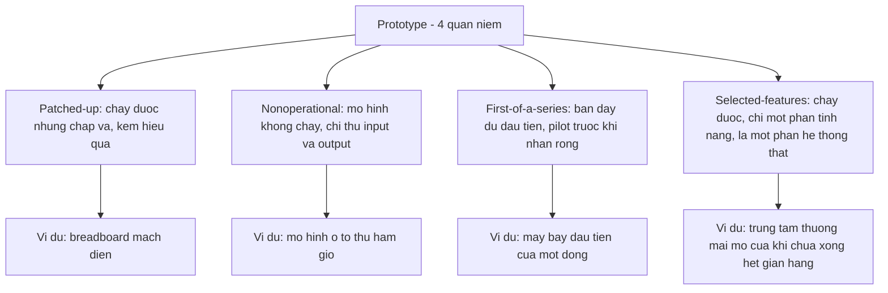
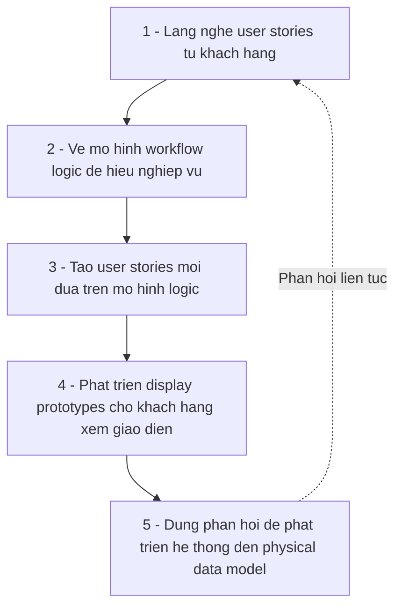
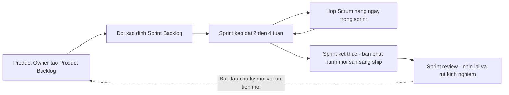
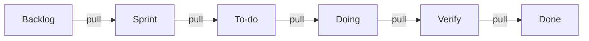
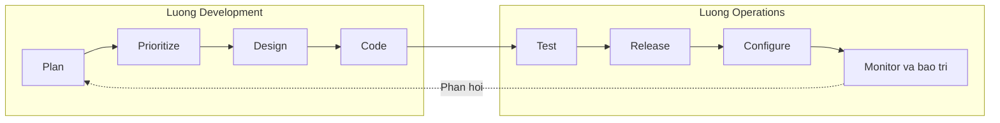

# Chương 6 — Agile Modeling, Prototyping, and Scrum (Mô hình hóa Agile, Làm bản mẫu và Scrum)

> Kendall & Kendall — *Systems Analysis and Design*, 11th edition, Chapter 6 (Part II: Information Requirements Analysis).
> Ghi chú: bản text trích từ PDF bắt đầu ở trang 169; phần mở đầu chương (mục tiêu học tập in trong sách, mục hướng dẫn xây prototype chi tiết) không nằm trong file trích, các ý liên quan được khôi phục từ phần Summary của chính chương này.

---

## 🎯 Mục tiêu học tập

Sau khi học xong chương này, bạn có thể:

1. Hiểu **prototyping (làm bản mẫu)** là một kỹ thuật thu thập thông tin bổ trợ cho SDLC truyền thống, và phân biệt **4 loại prototype**: patched-up, nonoperational, first-of-a-series, selected-features.
2. Nắm được **vai trò của người dùng** trong prototyping (honest involvement — tham gia chân thành) và 4 hướng dẫn phát triển prototype: làm theo module quản lý được, xây nhanh, chỉnh sửa liên tục, chú trọng giao diện người dùng.
3. Hiểu **agile modeling**: 4 giá trị (communication, simplicity, feedback, courage), 14 nguyên tắc, 4 hoạt động (coding, testing, listening, designing), 4 biến tài nguyên (time, cost, quality, scope) và 4 thực hành cốt lõi (short releases, 40-hour workweek, on-site customer, pair programming) — gắn với **extreme programming (XP)** của Beck.
4. Viết và sử dụng **user stories** làm điểm khởi đầu cho xác định yêu cầu.
5. Hiểu **Scrum**: 3 vai trò, product backlog, sprint backlog, chu kỳ sprint, planning meeting, planning poker, daily Scrum, burndown chart, sprint review; ưu và nhược điểm của Scrum.
6. Hiểu **kanban** (visualize workflow, giới hạn WIP, pull system, cycle time, throughput) và biến thể **scrumban**.
7. Hiểu **DevOps** như một sự dịch chuyển văn hóa với hai luồng song song development và operations.
8. Biết về **no-code development** và **work management systems** (Jira, epic, roadmap) hỗ trợ phát triển agile.
9. **So sánh agile với phương pháp cấu trúc (SDLC)** qua 7 chiến lược cải thiện hiệu suất tri thức của Davis & Naumann, và nhận diện **6 rủi ro** khi tổ chức áp dụng đổi mới phương pháp luận.

---

## 📖 Tóm tắt & giải thích kiến thức

### 1. Prototyping (Làm bản mẫu)

**Ý tưởng cốt lõi:** Thay vì phân tích – thiết kế – xây dựng trọn vẹn rồi mới đưa cho người dùng xem, nhà phân tích xây một **bản mẫu (prototype)** để người dùng tương tác sớm. Khi trình bày prototype, nhà phân tích đặc biệt quan tâm **phản ứng của người dùng và quản lý**: họ phản ứng thế nào khi làm việc với prototype, và mức độ khớp giữa nhu cầu của họ với các tính năng được làm mẫu.

Phản hồi được thu thập qua: **quan sát, phỏng vấn, phiếu phản hồi (feedback sheets — có thể là bảng hỏi)**. Thông tin thu được trong giai đoạn prototyping giúp nhà phân tích **đặt ưu tiên và điều chỉnh kế hoạch với chi phí thấp, ít xáo trộn** — vì vậy prototyping và lập kế hoạch (planning) luôn đi đôi với nhau.

Bốn loại thông tin nhà phân tích tìm kiếm qua prototyping:
1. **Phản ứng (reactions)** của người dùng với prototype.
2. **Đề xuất (suggestions)** thay đổi hoặc mở rộng prototype.
3. **Sáng kiến (innovations)** — cách dùng hệ thống theo hướng hoàn toàn mới.
4. **Kế hoạch chỉnh sửa (revision plans)** nảy sinh từ quá trình làm việc với người dùng.

#### 1.1. Bốn loại prototype (Kinds of Prototypes)

Từ "prototype" được dùng theo nhiều nghĩa; sách không ép một định nghĩa duy nhất mà trình bày 4 quan niệm, mỗi loại hữu dụng trong một tình huống (Figure 6.1 trong sách):

| Loại | Bản chất | Ví dụ đời thường | Khi dùng |
|---|---|---|---|
| **Patched-up prototype** (bản mẫu chắp vá) | Hệ thống **hoạt động được** nhưng chắp vá, kém hiệu quả. Trong kỹ thuật gọi là *breadboarding* (lắp mạch thử trên bảng cắm) | Mạch điện thử nghiệm lắp tạm trên breadboard | Muốn người dùng tương tác thật với đầy đủ tính năng, làm quen giao diện và output; chấp nhận lưu trữ/truy xuất kém hiệu quả vì code viết nhanh cho "chạy được" chứ không tối ưu |
| **Nonoperational prototype** (bản mẫu không vận hành) | Mô hình **không hoạt động**, chỉ để thử một số khía cạnh thiết kế | Mô hình ô tô kích thước thật để thử trong hầm gió — đúng hình dáng nhưng không chạy được | Khi phần xử lý (processing) quá tốn kém/thời gian để làm mẫu; chỉ prototype **input và output**, người dùng vẫn đánh giá được tính hữu dụng |
| **First-of-a-series prototype** (bản mẫu đầu của loạt / pilot) | Mô hình **đầy đủ, vận hành hoàn chỉnh**, là bản đầu tiên của một loạt bản giống hệt nhau | Chiếc máy bay đầu tiên của một dòng: bay thử trước khi sản xuất chiếc thứ hai | Khi dự kiến **triển khai cùng một hệ thống ở nhiều nơi**. Ví dụ trong sách: chuỗi bán lẻ dùng blockchain nhận hàng của nhà cung cấp — triển khai đầy đủ ở **một cửa hàng** trước, xử lý hết vấn đề rồi mới nhân rộng |
| **Selected-features prototype** (bản mẫu tính năng chọn lọc) | Mô hình **vận hành được** nhưng chỉ gồm **một phần** tính năng của hệ thống cuối | Trung tâm thương mại khai trương khi chưa xây xong hết các gian hàng | Menu hệ thống hiện 6 tính năng nhưng chỉ 3 dùng được (vd: thêm, xóa, liệt kê bản ghi). Được xây **theo module** để tính năng thành công được đưa thẳng vào hệ thống cuối — đây **không phải mock-up** mà là **một phần hệ thống thật** |

> ⚠️ Lưu ý quan trọng của sách: từ đây trở đi, khi nói "prototyping" trong chương, mặc định là **selected-features prototype**.

#### 1.2. Hướng dẫn phát triển prototype & vấn đề của prototyping

Theo phần Summary của chương, **4 hướng dẫn chính** khi phát triển prototype:
1. **Làm việc theo các module quản lý được** (work in manageable modules).
2. **Xây prototype nhanh chóng** (build rapidly) — tốc độ là bản chất; giao trễ làm mất ý nghĩa (xem Consulting Opportunity 6.3).
3. **Chỉnh sửa prototype** (modify) qua nhiều vòng lặp dựa trên phản hồi — prototype là **sản phẩm tiến hóa**, không phải sản phẩm hoàn chỉnh.
4. **Chú trọng giao diện người dùng** (stress the user interface) — nơi người dùng tương tác trực tiếp.

**Hai vấn đề chính của prototyping** (dựa trên ngữ cảnh giáo trình): (1) việc **quản lý dự án prototyping khó** vì chu trình lặp nhanh, dễ kéo dài vô hạn nếu không kiểm soát; (2) người dùng có thể **coi prototype chưa hoàn thiện là hệ thống cuối cùng** và không muốn thay đổi nữa (minh họa sống động ở Consulting Opportunity 6.4 — Willa không muốn sửa prototype dù báo cáo chưa đến đúng người).

**Tiêu chí để quyết định có nên prototype:** dự án phù hợp khi yêu cầu người dùng chưa rõ/hay thay đổi, cần phản hồi sớm, chi phí và rủi ro sai yêu cầu cao, hệ thống tương tác nhiều với người dùng; ngược lại, bài toán nhỏ, đơn giản, yêu cầu đã rõ và ngân sách hạn hẹp thì prototyping có thể không đáng (thông điệp của Consulting Opportunity 6.1 — Pyramid, Inc.).

#### 1.3. Vai trò của người dùng trong prototyping

Tóm gọn trong hai từ: **honest involvement — tham gia chân thành**. Không có sự tham gia của người dùng thì prototyping gần như vô nghĩa. Nhà phân tích phải:
- Truyền đạt rõ **mục đích** của prototyping cho người dùng.
- **Khuyến khích và đón nhận** góp ý; cảnh giác với sức ì tự nhiên của chính đội phân tích khi ngại thay đổi prototype.
- Quan sát 4 biến: phản ứng, đề xuất, sáng kiến, kế hoạch chỉnh sửa.
- Cuối cùng, **trách nhiệm cân nhắc phản hồi và chuyển thành thay đổi khả thi thuộc về nhà phân tích**, không phải người dùng.

---

### 2. Agile Modeling (Mô hình hóa Agile)

Agile methods là **tập hợp các cách tiếp cận sáng tạo, lấy người dùng làm trung tâm** để phát triển hệ thống. Nhiều dự án thành công nhờ agile, thậm chí agile đã "giải cứu" các công ty khỏi hệ thống thất bại được thiết kế bằng phương pháp cấu trúc. Nền tảng giá trị – nguyên tắc do **Beck (2000)** phát triển trong công trình về agile modeling mà ông gọi là **extreme programming (XP)**.

#### 2.1. Bốn giá trị của agile (Four Values)

Tồn tại sự căng thẳng giữa cái developer làm ngắn hạn và cái doanh nghiệp cần dài hạn → cần giá trị chung làm nền tảng hợp tác:

1. **Communication (Giao tiếp):** dự án hệ thống đầy rủi ro hiểu lầm — deadline gấp, thuật ngữ chuyên môn, người vào/ra dự án giữa chừng. Các thực hành như pair programming, ước lượng task, unit testing đều dựa trên giao tiếp tốt; vấn đề được sửa nhanh, lỗ hổng được bịt, tư duy yếu được củng cố qua tương tác.
2. **Simplicity (Đơn giản):** "chưa biết đứng thì đừng đòi đi, chưa biết đi thì đừng đòi chạy" — bắt đầu từ **điều đơn giản nhất có thể làm hôm nay**, chấp nhận mai có thể phải sửa một chút. Đòi hỏi tập trung rõ ràng vào mục tiêu dự án.
3. **Feedback (Phản hồi):** gắn liền với **thời gian** — phản hồi hữu ích có thể đến trong vài giây, phút, ngày, tuần hay tháng. Một test case của đồng nghiệp làm "vỡ" code bạn vừa viết vài giờ trước là phản hồi vô giá — sửa được trước khi lỗi ăn sâu vào hệ thống. Khách hàng viết functional test cho các story; phản hồi về tiến độ giúp doanh nghiệp trải nghiệm sớm hệ thống tương lai.
4. **Courage (Can đảm):** mức độ tin cậy và thoải mái trong đội. Không sợ **vứt bỏ cả buổi chiều code** để làm lại nếu thấy sai; hành động theo phản hồi cụ thể và trực giác của đồng đội khi họ có cách đơn giản hơn. Là giá trị **rủi ro cao – phần thưởng cao**, khuyến khích thử nghiệm.

**Thái độ bao trùm cả 4 giá trị: sự khiêm tốn (humility).** Trước kia "guru" máy tính hay tự cho mình đúng; agile modeler thì đề xuất, nêu quan điểm nhưng **không bao giờ khăng khăng mình đúng 100%**, cho phép khách hàng chất vấn, phê bình, than phiền — vì khách hàng mới là chuyên gia lĩnh vực.

#### 2.2. Các nguyên tắc cơ bản của agile (Agile Principles)

Nguyên tắc là **sự phản chiếu và cụ thể hóa của giá trị** — biến giá trị mơ hồ thành thứ đo lường được, đồng thời phân biệt agile với phương pháp plan-driven truyền thống (SDLC, hướng đối tượng). 14 nguyên tắc (khởi nguồn từ Beck, 2000):

1. Làm hài lòng khách hàng thông qua **giao phần mềm chạy được**.
2. **Đón nhận thay đổi**, kể cả khi xuất hiện muộn trong quá trình phát triển.
3. Tiếp tục giao phần mềm hoạt động **tăng dần và thường xuyên**.
4. Khuyến khích khách hàng và nhà phân tích **làm việc cùng nhau hằng ngày**.
5. **Tin tưởng các cá nhân có động lực** hoàn thành công việc.
6. Đề cao **trò chuyện mặt đối mặt**.
7. Tập trung vào việc **làm cho phần mềm chạy**.
8. Khuyến khích phát triển **liên tục, đều đặn và bền vững**.
9. Áp dụng agility với sự chú ý đến **thiết kế có chủ đích** (mindful design).
10. Hỗ trợ **đội tự tổ chức** (self-organizing teams).
11. Cung cấp **phản hồi nhanh**.
12. Khuyến khích **chất lượng**.
13. **Xem lại và điều chỉnh** hành vi định kỳ.
14. Chấp nhận **sự đơn giản**.

Developer agile hay dùng các "châm ngôn" dễ nhớ: *"model with a purpose"* (mô hình hóa có mục đích), *"software is your primary goal"* (phần mềm là mục tiêu chính), *"travel light"* (đi nhẹ — tài liệu vừa đủ là tốt rồi).

#### 2.3. Bốn hoạt động cơ bản (Four Basic Activities)

1. **Coding:** hoạt động **không thể thiếu**. Giá trị lớn nhất từ code là "**learning**" — có ý tưởng, code nó, test nó, xem ý tưởng có logic không. Code cũng là phương tiện **giao tiếp** ý tưởng mà lời nói còn mơ hồ.
2. **Testing:** agile coi **automated tests là then chốt** — viết test kiểm tra code, chức năng, hiệu năng, tính tuân thủ. Ngắn hạn: test chạy tốt → tự tin tiếp tục. Dài hạn: test giữ hệ thống "sống", cho phép thay đổi lâu dài.
3. **Listening (Lắng nghe):** trong agile, lắng nghe được thực hiện "đến mức cực đoan" — active listening với programming partner và với khách hàng. Developer **giả định mình không biết gì về nghiệp vụ** nên phải lắng nghe kỹ. Ít dựa vào văn bản chính thức → lắng nghe trở thành kỹ năng tối quan trọng. Không nghe thì không biết code gì, test gì.
4. **Designing (Thiết kế):** tạo cấu trúc tổ chức logic của hệ thống. Thiết kế mang tính **tiến hóa** — hệ thống agile "luôn đang được thiết kế". Thiết kế tốt thường đơn giản, linh hoạt, cho phép mở rộng bằng cách **chỉ sửa một chỗ**, đặt logic gần dữ liệu mà nó thao tác, hữu ích cho mọi người kể cả khách hàng.

**Ví dụ đời thường trong sách:** chủ nhà hàng Trung Hoa thiếu người, tự vào bếp nấu (đảm bảo hoạt động "coding") nhưng ngừng ra chào khách (**hy sinh "listening"**) → việc kinh doanh sa sút. Bài học: phải cân bằng cả 4 hoạt động.

#### 2.4. Bốn biến kiểm soát tài nguyên (Resource Control Variables)

Quản lý dự án agile là bài toán **đánh đổi (trade-off)** giữa 4 biến — nhà phân tích có thể điều chỉnh bất kỳ biến nào:

| Biến | Nội dung chính | Thông điệp agile |
|---|---|---|
| **Time (Thời gian)** | Cần thời gian cho nghe, thiết kế, code, test. | Agile **thách thức quan niệm thêm thời gian sẽ cho kết quả tốt hơn**. Khách hàng thường **hài lòng 80% với 20% chức năng đầu tiên**; hoàn thành 80% còn lại chỉ tăng thêm chút ít hài lòng → **đừng dời deadline, agile đòi hỏi xong đúng hạn** |
| **Cost (Chi phí)** | Cách tăng chi tiêu dễ nhất là **thuê thêm người** — nhưng không hẳn nhanh hơn (ví dụ sửa mái nhà: 2 người tăng lên 4 người thì va vào nhau, phải hỏi han nhau; người mới làm chậm người cũ vì cần được hướng dẫn). **Overtime** cũng không giúp: lập trình viên mệt mỏi làm chậm và tạo lỗi tốn kém hơn để sửa | Chi tiền khôn ngoan hơn vào **công cụ** (Visio, CASE tools như Visible Analyst) và **phần cứng** (laptop, màn hình lớn, bàn phím Bluetooth, card đồ họa mạnh) |
| **Quality (Chất lượng)** | **Internal quality:** test chức năng (làm đúng việc?) và conformance (đạt chuẩn, bảo trì được?) — **không nên đụng vào**. **External quality:** cảm nhận của khách hàng — độ tin cậy, báo cáo hiệu quả và đúng hạn, chạy mượt, giao diện dễ dùng | Triết lý "extreme" cho phép **hy sinh một phần chất lượng bên ngoài** để phát hành đúng hạn (chấp nhận vài bug, giao diện chưa hoàn hảo, sửa ở bản sau) — như cách các hãng phần mềm thương mại cập nhật liên tục |
| **Scope (Phạm vi)** | Xác định bằng cách **lắng nghe khách hàng và để họ viết stories**, rồi xem làm được bao nhiêu trong thời gian cho phép. Ví dụ hệ thống đặt vé máy bay: hiển thị chuyến thay thế, gợi ý rẻ hơn, mua vé, chọn ghế | Để giữ chất lượng, quản chi phí và đúng hạn → **điều chỉnh scope**: thỏa thuận với khách hàng hoãn một số story sang phiên bản sau (vd: hoãn tính năng chọn ghế) |

#### 2.5. Bốn thực hành cốt lõi (Four Core Agile Practices)

Bốn thực hành làm agile **khác biệt hẳn** các cách tiếp cận khác:

1. **Short releases (Phát hành ngắn):** nén thời gian giữa các lần phát hành — làm **tính năng quan trọng nhất trước**, phát hành, rồi cải thiện sau; thay vì tung bản đầy đủ sau một năm.
2. **40-hour workweek (Tuần làm việc 40 giờ):** văn hóa làm việc **tập trung cường độ cao trong 40 giờ/tuần**; làm thêm giờ quá một tuần liên tục là **rất có hại** cho dự án và developer. Nghỉ ngơi đủ → tỉnh táo phát hiện vấn đề, tránh lỗi và burnout.
3. **On-site customer (Khách hàng tại chỗ):** một người dùng **am hiểu nghiệp vụ** hiện diện trong suốt quá trình phát triển — viết user stories, giao tiếp với đội, giúp ưu tiên và cân bằng nhu cầu dài hạn, quyết định tính năng nào làm trước.
4. **Pair programming (Lập trình đôi):** làm việc với một lập trình viên khác **do bạn chọn** — cả hai cùng code, cùng chạy test. Người có tầm nhìn rõ nhất về mục tiêu sẽ code tại thời điểm đó. Theo "giao thức" pair programming, khi được mời ghép cặp thì **có nghĩa vụ đồng ý**. Cặp đổi thường xuyên, nhất là giai đoạn khám phá. Lợi ích: làm rõ tư duy, tiết kiệm thời gian, giảm tư duy cẩu thả, kích thích sáng tạo — và vui.

Bốn thực hành này **liên kết và hỗ trợ** 4 giá trị, 4 hoạt động, 4 tài nguyên (Figure 6.3 trong sách).

#### 2.6. Quy trình phát triển agile (The Agile Development Process)

"**Modeling**" là từ khóa: agile tận dụng cơ hội tạo mô hình — mô hình logic (bản vẽ hệ thống) hoặc mock-up (prototype). Quy trình agile modeling điển hình gồm **5 bước**:

1. **Lắng nghe user stories** từ khách hàng.
2. **Vẽ mô hình workflow logic** để hiểu các quyết định nghiệp vụ trong user story.
3. **Tạo user stories mới** dựa trên mô hình logic.
4. **Phát triển display prototypes** — cho khách hàng thấy giao diện họ sẽ có.
5. **Dùng phản hồi** từ prototype và sơ đồ workflow logic để phát triển hệ thống cho đến khi có **physical data model**.

"**Agile**" nghĩa là cơ động, linh hoạt. Hệ thống hiện đại (nhất là web) có **hai đòi hỏi song song**: phát hành sớm nhất có thể **và** liên tục cải tiến thêm tính năng. Agile modeling vì thế là **phương pháp đón nhận thay đổi** (change-embracing), tạo ứng dụng động, nhạy ngữ cảnh, mở rộng được và tiến hóa.

---

### 3. User Stories (Câu chuyện người dùng)

**User story** là **lời giải thích thân mật (casual) về một tính năng phần mềm, viết từ góc nhìn của khách hàng hoặc người dùng cuối**, nhấn mạnh **giá trị nghiệp vụ (business value)**. Dạng đơn giản nhất:

> *"As a \<type of user\>, I can \<some goal\> so that \<some reason\>."*
> (Là một \<loại người dùng\>, tôi có thể \<mục tiêu\> để \<lý do\>.)

Điểm then chốt:
- User stories là **công cụ giao tiếp** — "conversation starters" (mồi khơi chuyện) giữa developer và người dùng; là **điểm khởi đầu** của tương tác, không phải toàn bộ tương tác → tiếp cận với sự khiêm tốn.
- Nhấn mạnh **tương tác nói hằng ngày**, không phải văn bản → user stories là **định nghĩa yêu cầu phi chính thức**.
- Nghiên cứu (Soares et al., 2015): **mức chi tiết thấp** của user stories là "nguyên nhân chính của khó khăn" — dùng user stories làm giảm chú trọng vào đặc tả yêu cầu → khẳng định lại: user story là **khởi đầu**, không phải kết thúc của xác định yêu cầu.

**Ba hướng dẫn tạo user story** (theo quy trình của Jira, áp dụng cả khi không dùng phần mềm):
1. Mỗi user story **đứng độc lập**, không phụ thuộc story khác.
2. Mỗi user story **có thể thương lượng** giữa các bên liên quan.
3. Mỗi user story **tập trung vào yêu cầu người dùng** và liên hệ với giá trị nghiệp vụ.

**Công cụ hỗ trợ:** Jira, Planbox, ScrumDesk, Agilio for trac, digital.ai... Người thực hành ưu tiên công cụ: (1) dễ cài đặt ban đầu, (2) dễ học (không có learning curve dốc), (3) đơn giản khi dùng, (4) tùy biến được theo dự án — thích công cụ dễ hiểu hơn công cụ tinh vi nhưng tốn thời gian học.

**Ví dụ trong sách** — chuỗi stories cho ứng dụng ecommerce bán sách/CD/phim: *Welcome the customer; Show specials on home page; Search for desired product; Show matching titles and availability; Allow customer to ask for greater detail; Display reviews; Place a product into a shopping cart; Keep purchase history on file; Suggest other books; Proceed to checkout; Review the purchases; Continue shopping; Apply shortcut methods for faster checkout; Add names and shipping addresses; Offer options for shipping; Complete the transaction.* — Mỗi story rất ngắn, dễ hiểu; nhà phân tích chọn vài story, code, phát hành, rồi lại chọn tiếp cho đến khi hết (hoặc thống nhất bỏ story không đáng làm).

**Thẻ user story (Figure 6.4):** trên thẻ giấy hoặc điện tử, nhà phân tích ghi *Need or Opportunity* (nhu cầu/cơ hội), *Story* (mô tả ngắn), rồi ước lượng sơ bộ mức nỗ lực cho 4 **Activities** (coding, testing, listening, designing) và 4 **Resources** (time, cost, quality, scope) trên thang: Well Below – Below Average – Average – Above Average – Well Above. Không cần chính xác hơn mức có thể — nhưng vẫn là bài tập hữu ích.

---

### 4. Scrum

Tên "scrum" lấy từ **bóng bầu dục (rugby)**: đội hình hai đội chụm lại tranh bóng — Scrum là về **teamwork**. Như đội rugby vào trận với chiến lược tổng thể, đội phát triển bắt đầu với **kế hoạch cấp cao có thể thay đổi linh hoạt** khi "trận đấu" diễn ra. Thành công của **dự án** là trên hết, thành công cá nhân là thứ yếu. Product owner có ảnh hưởng **hạn chế** vào chi tiết — "lối chơi chiến thuật" thuộc về các thành viên, như cầu thủ trên sân. Đội làm việc trong **khung thời gian nghiêm ngặt (2–4 tuần)** như thời lượng một trận đấu.

Scrum phù hợp với **dự án phức tạp hơn, cần hành động liên tục**. Trong Scrum, một số lượng giới hạn tính năng/task được chọn để hoàn thành trong một **sprint** (thường 2–4 tuần); kết quả là một **sản phẩm có khả năng phát hành (potentially shippable product)**. Sprint kết thúc → quy trình lặp lại với ưu tiên và tính năng mới.

#### 4.1. Ba vai trò trong Scrum

1. **Product owner:** "người khởi tạo dự án" — **diễn đạt tầm nhìn sản phẩm**; chịu trách nhiệm kế hoạch ban đầu, các đợt phát hành sản phẩm, và đánh giá cuối cùng.
2. **Scrum Master:** nhiều vai — **huấn luyện viên (coach)**, cố vấn giàu kiến thức, developer kinh nghiệm, **facilitator**; ẩn dụ: thuyền trưởng, "hướng dẫn viên rừng rậm" dọn đường (**dẹp chướng ngại** cho đội), người bảo vệ. Cần vừa am hiểu agile vừa có kinh nghiệm. **Văn hóa nhóm phụ thuộc vào Scrum Master** vì họ chọn thành viên, tổ chức/điều phối các cuộc họp Scrum, hòa giải xung đột trong và ngoài.
3. **Team member:** vai trò **quan trọng nhất**. Bốn hành động của team member:
   1. Tạo và cải thiện user stories.
   2. Đưa ra ước lượng (estimates).
   3. **Tự tổ chức** để hoàn thành công việc.
   4. Sẵn sàng tham gia **bất kỳ hoạt động nào** giúp dự án.

Thành viên được chọn vì **kỹ năng quản lý lẫn kỹ thuật** (kỹ năng quản lý gồm giao tiếp và xây dựng quan hệ). Đội có thể gồm: designer, coder, chuyên gia giao diện người dùng (UI expert), tester, và **domain expert** hiểu nghiệp vụ và khách hàng.

#### 4.2. Product Backlog

**Product backlog** gồm **các tính năng và deliverable khác** mà nhà thiết kế dự định cho sản phẩm, **dựa trên user stories**. Ngoài tính năng, backlog còn liệt kê **bug cần sửa** và cả **ứng dụng cần viết tài liệu**.

Sổ đăng ký backlog (Figure 6.5) gồm các cột: số hiệu, mô tả task theo user story, **ai hưởng lợi**, **tài nguyên cần thiết**, và **điều kiện chấp nhận** ("will be accepted when" — vd: người dùng phản hồi tích cực với prototype, code hoàn tất và đã test).

Nguyên tắc sắp xếp: **story quan trọng nhất lên đầu**; các **mục nhỏ làm nhanh được** rất phù hợp ở đầu danh sách — hoàn thành nhiều task nhỏ **khích lệ tinh thần** hơn vật lộn với một task lớn. User stories phải được **cả đội hiểu**; story chưa rõ thì đẩy xuống dưới.

#### 4.3. Sprint Cycle (Chu kỳ sprint)

- **Sprint backlog:** danh sách user stories cần hoàn thành **sớm**, chọn ra từ product backlog. Phân biệt: **stories** là deliverable của cả đội; **tasks** là phần của story — đơn vị công việc từng thành viên làm.
- Độ dài sprint linh hoạt nhưng **đa số công ty chọn 2 tuần**. Sau khi quen, chu kỳ 2 tuần trở nên "routine và thỏa mãn".
- Cuối chu kỳ, đội trả lời **2 câu hỏi** để quyết định phát hành:
  1. *"Bản phát hành tiềm năng này có **giá trị** không?"* — phải có giá trị hơn bản trước.
  2. *"Bản phát hành đã **sẵn sàng ship** chưa?"* — tính năng mới đã hoàn thành, đã test, chạy được và không lỗi.
- Lợi ích phát hành 2 tuần: tinh thần đội cao (dễ đo thành quả), việc hoàn thành sản phẩm "thật" hơn, và **phản hồi liên tục từ khách hàng** — *short releases chính là các prototype*, phản ứng của khách hàng rất giá trị.

#### 4.4. Các đặc trưng riêng khác của Scrum

**a) Scrum Planning Meeting (Họp lập kế hoạch)** — 2 phần:
1. Product owner trình bày **wish list các user stories**; đội đặt câu hỏi.
2. **Ước lượng tài nguyên** cần cho các tính năng — thường qua **planning poker**. Từ đây, **đội làm chủ**: chọn deliverables, chia việc thành tasks, xếp ưu tiên và **cam kết** hoàn thành một số story trước cuối sprint. Họp cũng là dịp giao lưu, gắn kết đội.

**b) Scrum Planning Poker** — trò chơi bài giúp ước lượng:
- Bộ bài dựa trên **số Fibonacci: 0, 1, 2, 3, 5, 8, 13, 21, 34, 55, 89** — dãy số bắt đầu thấp, tăng nhanh, vì **story càng lớn thì độ bất định càng cao** (khoảng cách giữa các số cũng lớn dần). Bộ bài có thể thêm **ký hiệu vô cực** (quá lớn), **dấu hỏi**, và **tách cà phê** (cần nghỉ giải lao).
- **Luật chơi (7 bước):**
  1. Một **moderator** giữ cuộc họp hiệu quả.
  2. Product owner trình bày một user story cần ước lượng.
  3. Mỗi thành viên chọn một lá bài, đặt **úp xuống** (số thấp = làm nhanh hơn; con số có thể là ngày, story points, hoặc độ khó trừu tượng).
  4. **Lật bài cùng lúc** — tránh hiệu ứng **anchoring** (bám theo ước lượng nêu ra đầu tiên).
  5. Người ước lượng **cao nhất và thấp nhất** được bảo vệ quan điểm.
  6. Cả đội thảo luận; moderator nên **giới hạn thời gian** (dùng timer điện thoại).
  7. Chơi ván mới đến khi **đồng thuận**, rồi chuyển sang story tiếp theo.
- Giá trị: ước lượng tốt rất khó với developer thiếu kinh nghiệm — planning poker **tăng độ tin cậy ước lượng của đội mà không tạo áp lực** lên thành viên mới, lại vui.

**c) Daily Scrum Meetings (Họp Scrum hằng ngày)** — mở đầu ngày bằng **stand-up meeting** chỉ vài phút (đứng họp cho ngắn). Mỗi người trả lời 3 điều: **đã làm gì** từ daily Scrum trước, **dự định hoàn thành gì** hôm nay, và **chướng ngại nào** có thể cản trở. Chướng ngại thường không giải quyết được trong 15 phút, nhưng **nhận diện được chúng** ngay lúc đó là quan trọng.

**d) Burndown Chart (Biểu đồ burndown)** — theo dõi hiệu suất, cập nhật hằng ngày: **trục ngang là thời gian** đã trôi qua (theo sprint cycle), **trục dọc** là số task còn lại hoặc số giờ còn lại. Trong Figure 6.8: đường đỏ = giờ công còn lại, cột vàng = số task còn lại. Cách trực quan thể hiện tiến độ dự án agile.

**e) Sprint Review (Đánh giá sprint)** — cuối sprint, đội họp **nhìn lại (retrospective)**: nêu bật user stories đã hoàn thành, ghi nhận stories đã cam kết nhưng chưa xong, nói rõ **cái gì tốt, cái gì chưa** và bài học rút ra để cải thiện sprint sau. Lưu ý: sprint review **không quyết định cho sprint kế tiếp** — việc đó diễn ra khi lặp lại quy trình từ product backlog mới.

#### 4.5. Kanban và Scrumban

**Kanban** do **Toyota** phát triển để giao sản phẩm hiệu quả hơn; nghĩa tiếng Anh là "**signboard**" (bảng hiệu). Bốn yếu tố then chốt khi áp dụng vào phần mềm:
1. **Trực quan hóa workflow** (visualize the workflow).
2. Giữ **work in progress (WIP) nhỏ nhất có thể**.
3. **Đánh giá lại workflow**, gán lại ưu tiên nếu cần.
4. **Cải tiến liên tục**: loại bỏ nút thắt cổ chai, đánh giá giới hạn WIP.

**Pull system (hệ thống kéo):** task **được kéo** (pull) qua các cột, không bao giờ bị **đẩy** (push) — giúp xác lập **trách nhiệm giải trình** khi làm việc nhóm. Ví dụ trong sách: story "cập nhật website" → tạo "thẻ" kanban → ưu tiên cao nên kéo từ cột **backlog** sang **sprint** → **to-do** → designer bắt đầu làm thì kéo vào **doing** → xong trang web thì kéo sang **verify** để test link → test xong kéo vào **done**. (Bảng kanban vật lý như *patboard* của công ty Hà Lan dùng thẻ nam châm rửa được — tương tác thú vị hơn phần mềm.)

**Hai chỉ số:**
- **Cycle time (CT):** thời gian một task đi từ "backlog" đến "done" — càng ngắn càng tốt.
- **Throughput (TP):** số mục trung bình đi từ backlog đến done trong một chu kỳ. Công thức: **TP = WIP / CT**. Ví dụ: 12 user stories đang tiến hành trong 4 tuần → TP = 12/4 = **3 user stories mỗi chu kỳ** (chỉ là con số hướng dẫn).

**Scrumban** = kanban áp dụng vào Scrum; khác kanban thuần ở chỗ **dùng các sprint cố định**.

#### 4.6. Ưu và nhược điểm của Scrum

| ✅ 9 ưu điểm | ❌ 7 nhược điểm |
|---|---|
| 1. Phát triển sản phẩm nhanh | 1. Ghi tài liệu tính năng không đúng mức |
| 2. Tiếp cận hướng người dùng | 2. Phát hành sản phẩm còn lỗi |
| 3. Khuyến khích teamwork | 3. Phát hành quá sớm so với nhu cầu người dùng |
| 4. Ít gây rối hơn phương pháp chính thống | 4. Hoàn thành sprint backlog dưới áp lực |
| 5. Linh hoạt | 5. Khó làm việc khi đội phân tán địa lý |
| 6. Thỏa mãn cho thành viên | 6. Khó khi công việc cần kỹ năng đặc thù |
| 7. Tưởng thưởng các thành quả nhỏ nhưng ý nghĩa | 7. Khó thay thế thành viên rời đội |
| 8. Cung cấp phản hồi | |
| 9. Thích ứng cao | |

Scrum là phương pháp **cường độ cao**, tốt cho gói phần mềm phức tạp và sáng tạo; nếu quá căng, tổ chức có thể chọn phương pháp agile khác.

---

### 5. DevOps — Dịch chuyển văn hóa cho phát triển ứng dụng

**DevOps** (ghép từ **development + operations**) là cách **giảm thời gian triển khai** ứng dụng mới và tối đa hóa lợi nhuận bằng cách nhanh chóng nắm bắt cơ hội thị trường và nhận phản hồi khách hàng kịp thời — DevOps tìm cách **hợp nhất hai quy trình** này.

DevOps được mô tả là **một nền văn hóa** hơn là một phương pháp luận (như SDLC hay agile) vì đòi hỏi **thay đổi tư duy**: thay vì chờ vấn đề xảy ra rồi tranh cãi lỗi ở đâu, ai chịu trách nhiệm (lãng phí thời gian sửa), DevOps chạy **hai luồng song song**:
- **Development:** phát triển nhanh ứng dụng mới — plan, prioritize, design, code.
- **Operations:** test, release, configure, monitor, rồi **bảo trì** các bản phát hành mới và phần mềm đã có.

Đặc điểm vận hành của DevOps:
- Tổ chức quy trình quanh các **value streams** (dòng giá trị) — mỗi stream có thể phân tích 12–15 quy trình; **đội nhỏ 5–10 người chịu trách nhiệm trọn vẹn** một value stream.
- **Quy tắc "hai pizza" của Amazon** cho quy mô đội: nếu đội không đủ nhỏ để **hai chiếc pizza cỡ lớn nuôi no** thì đội quá lớn.
- Hạn chế đa nhiệm (**tối đa 1–3 dự án**), làm theo **lô nhỏ, bước nhỏ**, giảm số lần bàn giao (handoff) cho khách hàng ngoài (external) và phòng ban khác (internal). Loại bỏ lãng phí: việc dở dang, quy trình thừa, chuyển đổi task, truy tìm defect.
- Phát hiện lỗi sớm bằng cách **"swarm"** (cả đội xúm vào) một vấn đề để sửa ngay, không đẩy tiếp với chi phí cao hơn — **chất lượng được đẩy về nơi công việc đang diễn ra**.
- **Resilience và "fire drills":** Netflix gọi là "**Chaos Monkey**" — tắt toàn bộ server và tiến trình để chắc chắn công ty ứng phó được kịch bản xấu nhất. Sau diễn tập, mọi người được **debrief** đánh giá thành/bại và mức đạt mục tiêu kinh doanh.
- **Bảo mật được đẩy về đội DevOps** và tích hợp vào kho code dùng chung; mọi vụ vi phạm bảo mật đều được **postmortem** để đội học và không lặp lại.

---

### 6. No-Code Software Development (Phát triển phần mềm không cần code)

Phát triển phần mềm gần đây dịch chuyển từ lập trình viên chuyên nghiệp sang **người không lập trình**: bất kỳ ai cũng có thể tạo phần mềm bằng **giao diện đồ họa (kéo-thả)** thay vì viết code. Các khối kéo-thả có thể chứa HTML5, CSS, JavaScript — nhưng người dùng **không cần biết ngôn ngữ lập trình nào**.

**Nền tảng ví dụ:** Wix, Bubble, WordPress (dựng web); Monday.com, Jotform, Airtable (bảng dạng spreadsheet, dashboard tự cập nhật); Microsoft Azure **Power Apps** (low-code, kéo thả, tuyên bố tích hợp được AI mà không cần biết machine learning).

| ✅ 4 ưu điểm | ❌ 2 nhược điểm |
|---|---|
| 1. **Tiết kiệm chi phí** — không cần thuê/outsource coder chuyên nghiệp; nhân viên hiểu sản phẩm tự viết nội dung trên template công ty | 1. Ứng dụng/website **không được phát triển một cách chiến lược** khi ai cũng dùng no-code được |
| 2. **Dễ hơn** — kéo thả ít tốn công hơn viết HTML | 2. Thường **không có tài liệu** |
| 3. **Nhanh hơn** — dùng HTML mỗi năm một lần thì phải tra cứu lại, tốn thời gian; giao diện quen thuộc (giống Excel) giúp phát triển nhanh | |
| 4. **Một người làm được việc của cả đội** — không cần điều phối người thiết kế, người dựng, người viết nội dung; một người có thể prototype website nhanh chóng | |

Việc áp dụng no-code trong tổ chức khuyến khích **mọi người trở thành "designer"** giải quyết vấn đề cấp bách mà không chờ trung tâm dữ liệu; điều này tốt hay không phụ thuộc năng lực nhân viên, chất lượng đào tạo, độ minh bạch của vấn đề và văn hóa tổ chức. Dù chính sách thế nào, **no-code hữu ích trong prototyping và như một công cụ trong agile methods** — và sẽ ngày càng phổ biến.

---

### 7. Work Management Systems (Hệ thống quản lý công việc) cho agile

Microsoft Project có thể **quá cứng nhắc** cho dự án agile. **Jira** là hệ thống quản lý công việc coi công việc là quy trình cộng tác, với **3 loại template**: kanban, Scrum, và bug tracking.

- **Scrum board trong Jira** (Figure 6.11): 4 cột — to-do, in progress, in review, done; ảnh thành viên chịu trách nhiệm gắn trên task.
- **Epic** = **tuyển tập (compendium) các user stories** từ khách hàng và người dùng cuối. Epic dùng để **tổ chức tất cả user stories và chia nhỏ tasks thành các phiên bản phát hành (release versions)**. Trong Jira, user stories gọi là "**issues**" ("Issues là khối xây dựng của mọi dự án Jira — một issue có thể là story, bug, task, hoặc loại issue khác"), được hoàn thành qua chuỗi sprint.
- Epic mô tả **bức tranh lớn**: cung cấp **roadmap** (kế hoạch hành động tương lai), xác định **theme** (tập mục tiêu), và được **phân rã (decomposition)** thành tasks/initiatives nhỏ hoàn thành trong thời gian ngắn (Figure 6.12).

**Epic như một cách viết tài liệu cho agile** — 4 yếu tố:
1. **Reporting responsibilities:** epic ở mức cao nên đặc biệt hữu ích để **báo cáo với quản lý**.
2. **Revealing user stories:** epic cho thấy tiến trình từ đầu đến cuối — đội đi đến trạng thái hiện tại thế nào, các điều chỉnh dọc đường thay đổi kết quả ra sao.
3. **Sizing the epic:** ranh giới của epic là gì (issue nào không thuộc epic), mức chi tiết đến đâu — trả lời tốt nhất dựa trên thực tiễn và văn hóa tổ chức.
4. **Deciding on the time period:** epic kéo dài bao lâu — vd: khi nào ngừng thêm tính năng cho OS 14 để bắt đầu OS 15?

**4 lợi ích của phần mềm quản lý công việc agile tự động (như Jira):**
1. Cách tiếp cận có cấu trúc giữ công việc đúng hướng — *agile không có nghĩa là tùy tiện, ngẫu nhiên*; agile phải có ý nghĩa, logic, trật tự.
2. **Tự động hóa quy trình** (vd: tự thêm 3 user stories vào epic, tự đóng stories khi epic được đánh dấu done).
3. **Tổng hợp và báo cáo tiến độ** (tính năng "Insights" của Jira).
4. **Giao tiếp tốt** — báo cáo đẹp trên màn hình/bản in màu dễ đọc hơn ảnh chụp nguệch ngoạc trên bảng trắng.

---

### 8. So sánh Agile Modeling và Structured Methods (phương pháp cấu trúc)

Agile ra đời để giải quyết các than phiền về SDLC truyền thống: **quá tốn thời gian, tập trung vào dữ liệu thay vì con người, quá tốn kém**. Agile thì **nhanh, lặp, linh hoạt, có sự tham gia** — đáp ứng thay đổi về yêu cầu thông tin, điều kiện kinh doanh và môi trường. Nhận xét bao trùm: agile là **cách tiếp cận hướng con người**, cho phép tạo các giải pháp tinh tế mà đặc tả quy trình chính thức không tạo ra được.

#### 8.1. Sáu bài học từ agile modeling (Figure 6.14)

1. **Short releases cho phép hệ thống tiến hóa** — cập nhật thường xuyên, thay đổi được tích hợp nhanh, hệ thống lớn lên theo hướng khách hàng thấy hữu ích.
2. **Pair programming nâng cao chất lượng tổng thể** — dù gây tranh cãi, nó thúc đẩy giao tiếp tốt, đồng cảm với khách hàng, ưu tiên phần giá trị nhất trước, test mọi code khi phát triển, tích hợp code sau khi qua test.
3. **On-site customer có lợi cho cả doanh nghiệp lẫn đội phát triển** — khách hàng là "tài liệu tham khảo sống" và "reality check"; khách hàng trở nên giống developer hơn, developer đồng cảm với khách hàng hơn.
4. **Tuần 40 giờ tăng hiệu quả** — developer giỏi mấy cũng lỗi và burnout nếu làm quá sức quá lâu; làm việc với **nhịp độ bền vững** tốt cho đời dự án, đời hệ thống và đời developer.
5. **Cân bằng tài nguyên và hoạt động hỗ trợ mục tiêu dự án** — quản lý dự án là bài toán trade-off giữa time, cost, quality, scope với coding, designing, testing, listening.
6. **Giá trị agile là then chốt của thành công** — toàn tâm với communication, simplicity, feedback, courage; cam kết cá nhân và đội nhóm kiểu này giúp nhà phân tích thành công ở chỗ người có kỹ năng tương đương nhưng thiếu giá trị sẽ thất bại.

#### 8.2. Bảy chiến lược cải thiện hiệu suất tri thức: SDLC vs Agile

Davis & Naumann (1999) đưa ra 7 chiến lược cải thiện **hiệu suất knowledge work**; họ nhận thấy lập trình viên giỏi nhất **năng suất gấp 5–10 lần** người kém nhất (tỷ lệ này chỉ 2:1 với công việc văn phòng/thể chất). Bảng so sánh cách hai phương pháp hiện thực hóa từng chiến lược (Figure 6.15):

| Chiến lược | Structured (cấu trúc) | Agile |
|---|---|---|
| 1. Giảm thời gian giao tiếp với giao diện công cụ và lỗi (interface time and errors) | Chuẩn hóa tổ chức: quy tắc coding, đặt tên (vd: luôn dùng I = Internal, E = External Customer); dùng biểu mẫu, đưa vào data repository | **Pair programming** — người này kiểm tra công việc người kia, sở hữu chung thiết kế/code; thời gian tương tác là phần tự nhiên của quy trình |
| 2. Giảm thời gian học quy trình và tổn thất xử lý kép (process learning, dual-processing) | Quản lý thời điểm phát hành cập nhật để người dùng không phải vừa học vừa dùng phần mềm; học CASE tool, ngôn ngữ riêng tốn thời gian | **Prototyping tùy biến (ad hoc) và phát triển nhanh** — bỏ qua CASE tools, tài liệu chi tiết, dồn thời gian cho phát triển hệ thống |
| 3. Giảm công sức cấu trúc task và định dạng output | CASE tools, sơ đồ (ERD, DFD), phần mềm quản lý dự án (MS Project), mô tả công việc chi tiết, tái sử dụng form/template/code | **Short releases** — chuỗi deadline cho nhiều bản phát hành; bản đầu ít tính năng, mỗi bản thêm dần |
| 4. Giảm phình việc phi năng suất (định luật Parkinson: *"công việc nở ra lấp đầy thời gian có sẵn"*) | Quản lý dự án, đặt deadline — nhưng deadline xa tạo thiên kiến kéo dài task đầu, dồn ép task cuối | **Giới hạn scope mỗi release** — deadline luôn cận kề, giao đúng hẹn dù bớt vài tính năng |
| 5. Giảm thời gian/chi phí tìm kiếm và lưu trữ dữ liệu, tri thức | Kỹ thuật thu thập có cấu trúc: phỏng vấn, bảng hỏi, quan sát có cấu trúc (STROBE), kế hoạch lấy mẫu định lượng | **On-site customer** — muốn biết gì cứ hỏi. Nhược điểm: người đại diện có thể **bịa thông tin** khi không biết hoặc né tránh sự thật vì động cơ riêng |
| 6. Giảm thời gian/chi phí giao tiếp và điều phối (2 người = 1 kênh, 3 người = 3, 4 người = 6...) | Chia task lớn thành task nhỏ, nhóm gọn; **dựng rào cản** (vd: khách hàng không được tiếp cận lập trình viên) — nhưng tăng hiệu suất kiểu này thường giảm hiệu quả và sinh lỗi | **Timeboxing** — giới hạn **thời gian** thay vì task: 1–2 tuần cho một tính năng/module; Scrum đề cao thời gian. Lưu ý: communication là giá trị agile nên chi phí giao tiếp có xu hướng **tăng** chứ không giảm |
| 7. Giảm tổn thất do quá tải thông tin (ví dụ tổng đài viên điện thoại quá tải thì bỏ cuộc hoàn toàn) | **Lọc thông tin** để che chắn analyst/coder khỏi than phiền của khách hàng | **Giữ tuần 40 giờ** — chất lượng đến từ lịch làm việc điều độ; thêm giờ là lúc thiết kế và lập trình kém chất lượng xuất hiện |

> **Hybrid approach (cách tiếp cận lai):** phần Summary nhấn mạnh agile đã trở thành cách tiếp cận **chủ đạo**, nhất là khi dùng **lai ghép với các quy trình SDLC chọn lọc** — kết hợp **agile + SDLC**.

#### 8.3. Rủi ro khi tổ chức áp dụng đổi mới (Risks Inherent in Organizational Innovation)

Khi tư vấn cho người dùng, nhà phân tích phải cân nhắc rủi ro của tổ chức khi áp dụng phương pháp luận mới (Figure 6.16) — **6 biến số**:

1. **Organizational culture (Văn hóa tổ chức):** văn hóa **bảo thủ, ổn định, không đổi mới** có thể là môi trường không phù hợp/thiếu thân thiện cho agile — thành viên lâu năm có thể cảm thấy bị đe dọa. Ngược lại, tổ chức **sống nhờ đổi mới** sẽ chào đón agile vì đã "thấm" các nguyên tắc cốt lõi (phản hồi nhanh, phản ứng động, dựa vào khách hàng). Ở giữa hai thái cực là tổ chức không dựa vào R&D nhưng muốn đổi mới ở **các đơn vị nhỏ** — đây là tình huống phù hợp cho **hybrid approach** (agile + SDLC).
2. **Timing (Thời điểm):** khi nào là lúc tốt nhất để đổi mới — phải xét toàn bộ danh mục dự án, deadline sắp tới, lịch nâng cấp cơ sở vật chất, dự báo ngành và kinh tế.
3. **Cost (Chi phí):** chi phí **đào tạo** analyst/coder (seminar off-site tốn kém hoặc thuê consultant on-site) + **chi phí cơ hội** khi developer bị rút khỏi dự án đang chạy để học kỹ năng mới, không tạo thu nhập trong thời gian đào tạo.
4. **Clients' reactions (Phản ứng của khách hàng):** có khách hàng vui mừng với lợi ích về thời gian và sự tham gia; có khách hàng **không muốn bị đem ra "thí nghiệm"** với kết quả bất định. Quan hệ khách hàng–nhà phân tích phải đủ bền để hấp thụ thay đổi hành vi; vd: on-site customer là **cam kết lớn** cần được hiểu và đồng thuận kỹ.
5. **Measuring impact (Đo lường tác động):** điểm mạnh/yếu của phương pháp cấu trúc đã được biết rõ; agile có nhiều bằng chứng **giai thoại (anecdotal)** nhưng lịch sử ngắn, **chưa được kiểm chứng thực nghiệm đầy đủ** → rủi ro hệ thống không thành công hoặc **không tương thích với hệ thống legacy**. Tổ chức cần đề xuất phép đo tác động **song song** với việc áp dụng phương pháp mới.
6. **Individual rights of programmers/analysts (Quyền cá nhân):** người phát triển giỏi cần **sáng tạo** và quyền làm việc theo cấu hình hiệu quả nhất với họ; yêu cầu của agile (vd: **pair programming**) có thể xâm phạm quyền làm việc một mình hoặc theo nhóm tùy thiết kế đòi hỏi. Không có "one best way" — cần cân bằng sáng tạo cá nhân với việc tổ chức áp dụng đổi mới.

---

### 9. Các hộp tình huống (Consulting Opportunities) — ý chính

- **6.1 "Is Prototyping King?"** (Pyramid, Inc.): khách hàng nhiệt tình đòi prototype nhưng dự án **nhỏ, bài toán đơn giản, ngân sách hạn hẹp** → phải cân nhắc tiêu chí trước khi prototype; nhiệt tình không phải lý do đủ.
- **6.2 "Clearing the Way for Customer Links"** (World's Trend): chọn **loại prototype phù hợp** cho website clearance — cân nhắc từng loại trong 4 loại prototype cho bài toán tổ chức thông tin trang web.
- **6.3 "To Hatch a Fish"** (trại cá): tranh luận **giao prototype đúng hẹn với ít tính năng** hay **trễ hẹn để thêm tính năng** — bài học về tầm quan trọng của **rapid development** và giữ lời hứa với người dùng đã được "mồi" sẵn tâm lý nhận prototype sớm.
- **6.4 "This Prototype Is All Wet"** (RainFall): người dùng **hài lòng giả tạo**, tự tay chép báo cáo gửi các phòng thay vì yêu cầu sửa hệ thống — nhà phân tích phải giúp người dùng hiểu prototype là **sản phẩm tiến hóa**, không sợ bị "lấy mất".
- **Mac Appeal — OmniFocus:** công cụ quản lý task theo phương pháp **Getting Things Done** (David Allen): collect – process – organize – review – do; minh họa rằng agile trông "phi cấu trúc" nhưng thực ra **có khá nhiều cấu trúc** (40-hour workweek, pair programming) và analyst cần công cụ đặt mục tiêu, giữ ngân sách, xếp ưu tiên.

---

## 🔑 Bảng thuật ngữ (Keywords and Phrases)

| Thuật ngữ (Anh) | Nghĩa tiếng Việt / giải thích |
|---|---|
| 40-hour workweek | Tuần làm việc 40 giờ — thực hành cốt lõi agile: làm việc cường độ cao nhưng không làm thêm giờ kéo dài để tránh lỗi và burnout |
| Agile modeling | Mô hình hóa agile — cách tiếp cận phát triển phần mềm: lập kế hoạch tổng thể nhanh, phát triển và phát hành nhanh, liên tục chỉnh sửa bổ sung tính năng |
| Agile principles | Các nguyên tắc agile — cụ thể hóa giá trị agile thành hướng dẫn hành động (14 nguyên tắc) |
| Agile values | Các giá trị agile — communication, simplicity, feedback, courage |
| Burndown chart | Biểu đồ burndown — thể hiện khối lượng công việc còn lại theo thời gian (sprint cycles) |
| DevOps | Văn hóa hợp nhất development và operations thành hai luồng song song để rút ngắn thời gian triển khai |
| Epic | Tuyển tập user stories từ khách hàng/người dùng cuối; dùng tổ chức stories và chia tasks thành các bản phát hành |
| Extreme programming (XP) | Lập trình cực hạn — tên Beck đặt cho phương pháp agile của ông; đẩy các thực hành tốt đến mức "cực hạn" |
| First-of-a-series prototype | Bản mẫu đầu của loạt (pilot) — bản vận hành đầy đủ đầu tiên trước khi nhân rộng nhiều nơi |
| Hybrid approach | Cách tiếp cận lai — kết hợp agile methods với các quy trình SDLC chọn lọc |
| Kanban | Hệ thống "bảng hiệu" của Toyota: trực quan hóa workflow, giới hạn WIP, pull system, cải tiến liên tục |
| No-code | Phát triển phần mềm không cần viết code — kéo thả trên giao diện đồ họa |
| Nonoperational prototype | Bản mẫu không vận hành — mô hình tỷ lệ không chạy, chỉ thử một số khía cạnh thiết kế (thường chỉ input/output) |
| On-site customer | Khách hàng tại chỗ — chuyên gia nghiệp vụ hiện diện cùng đội phát triển, viết stories, ưu tiên tính năng |
| Pair programming | Lập trình đôi — hai lập trình viên cùng code, cùng test trên một sản phẩm |
| Patched-up prototype | Bản mẫu chắp vá — hệ thống chạy được nhưng ghép nối tạm, kém hiệu quả (breadboarding) |
| Product backlog | Danh sách tính năng, bug cần sửa, tài liệu cần viết... cho sản phẩm, dựa trên user stories, xếp theo ưu tiên |
| Prototype | Bản mẫu — mô hình sớm của hệ thống để thu thập phản hồi người dùng |
| Scrum | Phương pháp agile cho dự án phức tạp: đội tự tổ chức làm việc theo sprint 2–4 tuần, tạo sản phẩm potentially shippable |
| Scrum planning poker | Trò chơi bài (bộ bài Fibonacci) giúp đội ước lượng công sức hoàn thành các user stories |
| Selected-features prototype | Bản mẫu tính năng chọn lọc — vận hành được với một phần tính năng; là một phần của hệ thống thật, xây theo module |
| Short release | Phát hành ngắn — nén thời gian giữa các bản phát hành, làm tính năng quan trọng nhất trước |
| Sprint | Chu kỳ phát triển 2–4 tuần trong Scrum, kết thúc bằng sản phẩm có khả năng phát hành |
| Sprint backlog | Danh sách user stories chọn từ product backlog để hoàn thành trong sprint hiện tại |
| Sprint review | Họp cuối sprint — retrospective: nêu thành quả, việc chưa xong và bài học để cải thiện sprint sau |
| Throughput | Thông lượng — số mục trung bình đi từ backlog đến done trong một chu kỳ; TP = WIP / CT |
| User involvement with prototyping | Sự tham gia của người dùng vào prototyping — "honest involvement", điều kiện sống còn của prototyping |
| User story | Câu chuyện người dùng — mô tả thân mật một tính năng từ góc nhìn người dùng, nhấn mạnh giá trị nghiệp vụ |
| Work management systems | Hệ thống quản lý công việc (vd: Jira) — hỗ trợ kanban, Scrum, bug tracking, epics, roadmap cho agile |

---

## ❓ Trả lời Review Questions

**1. Nhà phân tích tìm kiếm 4 loại thông tin gì qua prototyping?**
(1) **Phản ứng của người dùng** (user reactions) với prototype; (2) **đề xuất của người dùng** (suggestions) về thay đổi hoặc mở rộng prototype; (3) **sáng kiến** (innovations) — ví dụ đề xuất dùng hệ thống theo cách hoàn toàn mới; (4) **kế hoạch chỉnh sửa** (revision plans) nảy sinh từ quá trình làm việc với người dùng. Thông tin này giúp đặt ưu tiên và điều chỉnh kế hoạch với chi phí thấp, ít xáo trộn.

**2. "Patched-up prototype" nghĩa là gì?**
Là bản mẫu **hoạt động được nhưng chắp vá, ghép nối tạm bợ** — trong kỹ thuật gọi là *breadboarding*. Trong hệ thống thông tin, đó là mô hình chạy được với đầy đủ tính năng cần thiết nhưng **kém hiệu quả** (lưu trữ/truy xuất chậm) vì ứng dụng được viết nhanh với mục tiêu "chạy được" chứ không phải "tối ưu". Người dùng vẫn tương tác được với hệ thống, làm quen giao diện và các loại output.

**3. Định nghĩa prototype là mô hình tỷ lệ không hoạt động.**
Là **nonoperational prototype** — mô hình không chạy, được dựng lên chỉ để **kiểm thử một số khía cạnh thiết kế nhất định**. Ví dụ: mô hình ô tô kích thước thật để thử trong hầm gió (đúng kích thước, hình dáng nhưng không vận hành). Với hệ thống thông tin: khi việc code quá tốn kém để prototype toàn bộ, chỉ **prototype input và output**, không prototype phần xử lý; người dùng vẫn đánh giá được tính hữu dụng của hệ thống.

**4. Cho ví dụ về prototype là mô hình đầy đủ đầu tiên.**
Đó là **first-of-a-series prototype (pilot)**. Ví dụ trong sách: **chiếc máy bay đầu tiên của một dòng máy bay** — bay thử trước khi sản xuất chiếc thứ hai. Trong hệ thống thông tin: chuỗi bán lẻ thực phẩm dự định dùng **blockchain** để nhận hàng nhà cung cấp ở nhiều cửa hàng — triển khai đầy đủ tại **một cửa hàng** trước để người dùng xử lý hết vấn đề, rồi mới nhân rộng ra toàn chuỗi. Phù hợp khi có kế hoạch **triển khai cùng một hệ thống ở nhiều nơi**.

**5. Định nghĩa prototype là mô hình có một phần (không phải tất cả) tính năng thiết yếu.**
Là **selected-features prototype** — mô hình **vận hành được** gồm một số nhưng không phải tất cả tính năng của hệ thống cuối. Ví dụ: menu hiện 6 tính năng nhưng chỉ 3 dùng được. Được xây **theo module**, các tính năng thành công được **đưa thẳng vào hệ thống cuối** mà không cần công sức tích hợp lớn — chúng là **một phần hệ thống thật**, không phải mock-up.

**6. Tiêu chí quyết định có nên prototype một hệ thống là gì?**
(Phần chi tiết nằm ngoài đoạn trích; dựa trên ngữ cảnh giáo trình.) Nên cân nhắc prototype khi: **yêu cầu người dùng chưa rõ ràng hoặc hay thay đổi**; cần **phản hồi người dùng sớm** với chi phí thấp; **rủi ro và chi phí của việc xây sai hệ thống cao**; hệ thống có **tương tác người dùng nhiều** (giao diện quan trọng); và dự án đủ quy mô/độ bất định để việc lặp mang lại giá trị. Ngược lại (như tình huống Pyramid, Inc. — bài toán đơn giản, dự án nhỏ, ngân sách hẹp), prototyping có thể không đáng chi phí.

**7. Hai vấn đề chính của prototyping là gì?**
(Dựa trên ngữ cảnh giáo trình và Consulting Opportunity 6.4.) (1) **Khó quản lý quá trình prototyping**: bản chất lặp nhanh khiến dự án dễ kéo dài, khó kiểm soát phạm vi và tiến độ nếu không quản trị chặt (phải làm module được, giao nhanh, kiểm soát vòng sửa đổi). (2) **Người dùng có thể coi prototype dở dang là hệ thống hoàn chỉnh**: chấp nhận nó "như đã xong", ngại thay đổi hoặc kỳ vọng sai về chất lượng/hiệu năng của sản phẩm cuối.

**8. Cách tiếp cận hybrid kết hợp hai phương pháp phát triển hệ thống nào?**
Kết hợp **agile methods** với **các quy trình SDLC** (phương pháp cấu trúc truyền thống). Summary của chương nêu rõ agile trở thành cách tiếp cận chủ đạo *"đặc biệt khi dùng theo kiểu lai với các quy trình SDLC chọn lọc"*; phần rủi ro tổ chức cũng chỉ ra hybrid phù hợp với tổ chức muốn đổi mới ở các đơn vị nhỏ.

**9. Bốn giá trị mà đội phát triển và khách hàng doanh nghiệp phải cùng chia sẻ khi theo agile là gì?**
**Communication (giao tiếp), Simplicity (đơn giản), Feedback (phản hồi), Courage (can đảm).** Bao trùm cả bốn là thái độ **khiêm tốn (humility)**.

**10. Agile principles là gì? Nêu 5 ví dụ.**
Agile principles là **sự phản chiếu và cụ thể hóa của các giá trị agile** — hướng dẫn hành động cho developer, giúp đo lường mức độ "sống đúng" giá trị và phân biệt agile với phương pháp plan-driven (SDLC, OO). Năm ví dụ: (1) làm hài lòng khách hàng qua việc giao phần mềm chạy được; (2) đón nhận thay đổi kể cả khi xuất hiện muộn; (3) giao phần mềm hoạt động tăng dần và thường xuyên; (4) khuyến khích khách hàng và nhà phân tích làm việc cùng nhau hằng ngày; (5) đề cao trò chuyện mặt đối mặt. (Các nguyên tắc khác: tin tưởng cá nhân có động lực, phát triển bền vững, đội tự tổ chức, phản hồi nhanh, chất lượng, xem lại hành vi, đơn giản...)

**11. Bốn thực hành cốt lõi của agile là gì?**
(1) **Short releases** — phát hành ngắn, tính năng quan trọng nhất trước; (2) **40-hour workweek** — tuần 40 giờ, không làm thêm giờ kéo dài; (3) **On-site customer** — khách hàng am hiểu nghiệp vụ hiện diện tại chỗ; (4) **Pair programming** — lập trình đôi.

**12. Bốn biến kiểm soát tài nguyên trong agile là gì?**
**Time (thời gian), Cost (chi phí), Quality (chất lượng), Scope (phạm vi).** Nhà phân tích agile có thể điều chỉnh bất kỳ biến nào trong bốn biến này để cân bằng dự án, với ưu tiên cao nhất là hoàn thành đúng hạn.

**13. Phác thảo các bước điển hình trong một "episode" phát triển agile.**
Theo Summary của chương: (1) **chọn một task** gắn trực tiếp với tính năng khách hàng mong muốn, dựa trên user stories; (2) **chọn programming partner** (lập trình đôi); (3) **chọn và viết test cases** phù hợp; (4) **viết code**; (5) **chạy test cases**; (6) **debug** cho đến khi tất cả test chạy đạt; (7) **implement với thiết kế hiện có**; (8) **tích hợp** vào phần hệ thống đang tồn tại. (Ở mức quy trình modeling: lắng nghe user stories → vẽ mô hình workflow logic → tạo stories mới → làm display prototypes → dùng phản hồi phát triển đến physical data model.)

**14. User story là gì? Chủ yếu viết hay nói? Chọn và bảo vệ bằng ví dụ.**
User story là **lời giải thích thân mật về một tính năng phần mềm từ góc nhìn của khách hàng/người dùng cuối, nhấn mạnh giá trị nghiệp vụ**; dạng chuẩn: "As a \<user\>, I can \<goal\> so that \<reason\>". **Chủ yếu là NÓI**: sách nhấn mạnh trọng tâm là **tương tác nói hằng ngày** giữa developer và người dùng, không phải văn bản — user story là "conversation starter" (mồi khơi chuyện) và định nghĩa yêu cầu **phi chính thức**. Ví dụ: story "Apply shortcut methods for faster checkout" chỉ vài dòng trên thẻ; giá trị thực nằm ở cuộc **trao đổi** tiếp theo giữa analyst và người dùng để làm rõ khi nào áp dụng shortcut, dữ liệu thẻ tín dụng lưu ra sao... — thẻ chỉ là điểm khởi đầu cho hội thoại.

**15. Vì sao user stories có giá trị với nhà phân tích?**
Vì chúng: (1) là **phương tiện giao tiếp** chính giữa analyst với người dùng và với nhau — điểm khởi đầu của tương tác; (2) giúp tìm ra **yêu cầu nghiệp vụ nào quan trọng nhất** với người dùng; (3) **ngắn, dễ hiểu**, cho bức tranh khá đầy đủ về nhu cầu ở từng giai đoạn; (4) đủ để analyst **bắt đầu ước lượng** công sức hoàn thành dự án dù chưa đủ để code; (5) là nền để chọn tính năng cho từng **release** và cho product backlog trong Scrum.

**16. Liệt kê các công cụ phần mềm hỗ trợ developer kiểm thử code.**
Agile dựa vào **automated tests** — tồn tại **các thư viện test lớn cho hầu hết ngôn ngữ lập trình** (kiểm tra coding, chức năng, hiệu năng, tính tuân thủ), cần cập nhật trong suốt dự án. Ngoài ra chương nhắc các công cụ hỗ trợ agile như **Jira** (có template **bug tracking**), Planbox, ScrumDesk, Agilio for trac, digital.ai; công cụ hỗ trợ chung: Microsoft Visio, CASE tools như Visible Analyst.

**17. Scrum là gì?**
Scrum là một **phương pháp agile** (tên lấy từ đội hình tranh bóng trong rugby, biểu trưng cho teamwork) **phù hợp với dự án phức tạp cần hành động liên tục**. Một số lượng giới hạn tính năng/task được chọn hoàn thành trong một **sprint** 2–4 tuần; kết quả sprint là **sản phẩm có khả năng phát hành**; sprint kết thúc thì chu trình lặp lại với ưu tiên mới. Đội bắt đầu với kế hoạch cấp cao thay đổi linh hoạt, thành công dự án đặt trên thành công cá nhân, chiến thuật do đội tự quyết.

**18. Ba vai trò trong Scrum?**
(1) **Product owner** — diễn đạt tầm nhìn sản phẩm, kế hoạch ban đầu, các đợt phát hành, đánh giá cuối; (2) **Scrum Master** — coach, cố vấn, facilitator, người dẹp chướng ngại, định hình văn hóa nhóm; (3) **Team member** — vai trò trọng yếu, tự tổ chức thực hiện công việc.

**19. Bốn hành động của team members trong Scrum?**
(1) Làm việc để **tạo và cải thiện user stories**; (2) **đưa ra ước lượng**; (3) **tự tổ chức** để hoàn thành công việc; (4) **sẵn sàng tham gia bất kỳ hoạt động nào** giúp ích cho dự án.

**20. Product backlog registry nên liệt kê những gì?**
Các **tính năng và deliverable khác dựa trên user stories**, cộng với **bug cần sửa** và **ứng dụng cần viết tài liệu**. Mỗi dòng gồm: số hiệu, mô tả task theo user story, **ai sẽ hưởng lợi**, **tài nguyên cần thiết**, và **điều kiện chấp nhận** (will be accepted when). Danh sách xếp story quan trọng nhất lên đầu; mục nhỏ làm nhanh phù hợp ở trên cùng.

**21. Ai cần hiểu các user stories trên product backlog registry?**
**Tất cả mọi người trong đội (everyone on the team)** — vì cả đội phải làm việc trên danh sách này. Story nào chưa rõ với mọi người thì bị đẩy xuống dưới danh sách.

**22. Hai câu hỏi đội nên tự hỏi sau khi hoàn thành một sprint 2 tuần?**
(1) *"Bản phát hành tiềm năng này có **giá trị** không?"* — sản phẩm phải có giá trị hơn bản phát hành trước. (2) *"Bản phát hành đã **sẵn sàng để ship** chưa?"* — đội phải đã hoàn thành và test các tính năng mới theo user stories; sản phẩm phải chạy được và không lỗi.

**23. Chín ưu điểm của Scrum?**
(1) Phát triển sản phẩm nhanh; (2) tiếp cận hướng người dùng; (3) khuyến khích teamwork; (4) ít gây rối/bối rối hơn các phương pháp chính thống; (5) linh hoạt; (6) thỏa mãn cho thành viên đội; (7) tưởng thưởng những thành quả nhỏ nhưng ý nghĩa; (8) cung cấp phản hồi; (9) khả năng thích ứng.

**24. Hai trong số các đặc trưng riêng của Scrum?**
Có thể nêu hai trong các đặc trưng sau: **Scrum planning meeting** (2 phần: trình wish list stories + ước lượng bằng planning poker), **daily Scrum/stand-up meeting** (họp đứng vài phút: đã làm gì, sẽ làm gì, vướng gì), **burndown chart** (theo dõi công việc còn lại theo thời gian), **sprint review** (retrospective cuối sprint). Ví dụ trả lời: (1) daily stand-up meeting; (2) burndown chart.

**25. Bảy nhược điểm của Scrum?**
(1) Ghi tài liệu tính năng không đúng mức; (2) phát hành sản phẩm còn lỗi; (3) phát hành quá sớm so với người dùng; (4) hoàn thành sprint backlog dưới áp lực; (5) khó làm việc với đội phân tán địa lý; (6) khó khi cần kỹ năng đặc thù; (7) khó thay thế thành viên rời đội.

**26. Bốn yếu tố then chốt của hệ thống kanban áp dụng vào phát triển phần mềm?**
(1) **Trực quan hóa workflow**; (2) giữ **WIP (work in progress) nhỏ nhất có thể**; (3) **đánh giá lại workflow**, gán lại ưu tiên nếu cần; (4) **phấn đấu cải tiến liên tục** — loại bỏ nút thắt cổ chai và đánh giá các giới hạn WIP.

**27. DevOps là viết tắt của gì?**
Ghép từ **development** (phát triển) và **operations** (vận hành) — một sự dịch chuyển **văn hóa** trong tổ chức nhằm hợp nhất hai quy trình này, giảm thời gian triển khai ứng dụng mới.

**28. Quy tắc "hai pizza" của Amazon để xác định quy mô đội là gì?**
Nếu đội **không đủ nhỏ để được nuôi no bởi hai chiếc pizza cỡ lớn** thì đội đó **quá lớn**. Áp dụng cho đội DevOps: đội nhỏ 5–10 người chịu trách nhiệm trọn vẹn một value stream.

**29. Hai luồng (track) song song nào được dùng để vận hành DevOps?**
(1) Luồng **development** — hỗ trợ phát triển các ứng dụng đổi mới nhanh (plan, prioritize, design, code); (2) luồng **operations** — hỗ trợ bảo trì và vận hành các quy trình đã có (test, release, configure, monitor, maintain).

**30. Vì sao cần đẩy vấn đề bảo mật hệ thống về các đội DevOps?**
Để **phát hiện và xử lý lỗ hổng sớm**, ngay tại nơi công việc diễn ra: lỗ hổng bảo mật được đẩy về đội DevOps và **tích hợp vào kho code dùng chung**; đội "swarm" vấn đề để sửa ngay, không đẩy tiếp với chi phí cao hơn. Khi có sự cố bảo mật, đội tiến hành **postmortem** trên mọi vụ vi phạm để **học từ vấn đề và không lặp lại** — kèm "fire drills" (như Chaos Monkey của Netflix) để đảm bảo hệ thống chịu được kịch bản xấu nhất.

**31. No-code software development nghĩa là gì?**
Là việc **người không lập trình cũng tạo được phần mềm** bằng **giao diện đồ họa kéo-thả** thay vì viết code. Các khối kéo-thả có thể chứa HTML5, CSS, JavaScript nhưng người dùng không cần biết ngôn ngữ nào — chỉ cần kéo block vào vùng làm việc. Ví dụ nền tảng: Wix, Bubble, WordPress, Monday.com, Airtable, Power Apps.

**32. Bốn ưu điểm của cách tiếp cận no-code (vd: phát triển web page)?**
(1) **Tiết kiệm chi phí** — không cần thuê coder chuyên nghiệp; (2) **dễ hơn** — kéo thả ít tốn công hơn code HTML; (3) **nhanh hơn** — không phải tra cứu cú pháp, giao diện quen thuộc kiểu spreadsheet; (4) **một người có thể làm việc của cả đội** — không cần điều phối người thiết kế/dựng/viết nội dung.

**33. Hai nhược điểm của no-code?**
(1) Ứng dụng và website **không được phát triển một cách chiến lược** khi bất kỳ ai cũng làm được; (2) thường **không có tài liệu (documentation)**.

**34. Cho ví dụ một work management system.**
**Jira** (Atlassian) — coi công việc là quy trình cộng tác; có template cho **kanban, Scrum và bug tracking**; hỗ trợ Scrum board, epics, roadmap, và báo cáo tiến độ qua "Insights".

**35. Từ "epic" nghĩa là gì trong ngữ cảnh user stories?**
Epic là **tuyển tập (compendium) các user stories** từ khách hàng và người dùng cuối. Epic dùng để **tổ chức tất cả user stories và chia nhỏ tasks thành các phiên bản phát hành**; nó mô tả bức tranh lớn, cung cấp **roadmap**, xác định **theme** (tập mục tiêu), và phục vụ như một hình thức **tài liệu hóa** cho agile (báo cáo với quản lý, thể hiện tiến trình stories, xác định ranh giới và khung thời gian).

**36. Bảy chiến lược cải thiện hiệu suất trong knowledge work (Davis & Naumann)?**
(1) Giảm thời gian giao tiếp với giao diện và lỗi (interface time and errors); (2) giảm thời gian học quy trình và tổn thất xử lý kép (process learning time, dual-processing losses); (3) giảm thời gian/công sức cấu trúc task và định dạng output; (4) giảm sự phình việc phi năng suất (nonproductive expansion of work); (5) giảm thời gian/chi phí tìm kiếm và lưu trữ dữ liệu, tri thức; (6) giảm thời gian/chi phí giao tiếp và điều phối; (7) giảm tổn thất do quá tải thông tin ở con người.

**37. Sáu rủi ro khi áp dụng đổi mới trong tổ chức?**
(1) **Văn hóa tổ chức** (organizational culture) không tương thích; (2) **thời điểm** (timing) của dự án không phù hợp; (3) **chi phí** (cost) đào tạo analyst/coder + chi phí cơ hội; (4) **phản ứng của khách hàng** (clients' reactions) với kỳ vọng hành vi mới; (5) khó khăn trong **đo lường tác động** (measuring impact) — agile chưa được kiểm chứng thực nghiệm đầy đủ, rủi ro không tương thích legacy; (6) xâm phạm **quyền cá nhân của lập trình viên/nhà phân tích** (individual rights) — vd pair programming ép người thích làm việc một mình.

---

## 🧩 Giải Problems

### Problem 1 — Clone Bank of Clone, Colorado
**Đề (tóm tắt):** Ngân hàng muốn thử form báo cáo tháng mới cho khách hàng tài khoản tiền gửi/tiết kiệm. Lãnh đạo đã tin khách hàng muốn form giống 3 ngân hàng khác trong vùng, chỉ cần "bản tổng hợp phản hồi khách hàng" để hợp thức hóa quyết định; **phản hồi sẽ không được dùng để thay đổi prototype**. Họ muốn gửi form mới cho một nhóm và form cũ cho nhóm khác.

**a) Vì sao không đáng prototype trong hoàn cảnh này?**
Prototyping chỉ có ý nghĩa khi phản hồi người dùng được dùng để **chỉnh sửa và cải tiến** bản mẫu — bản chất của prototyping là vòng lặp phản hồi → sửa đổi. Ở đây ngân hàng đã **quyết định trước** (làm giống 3 ngân hàng kia) và tuyên bố rõ **phản hồi sẽ không thay đổi form theo bất kỳ cách nào** — tức là thiếu điều kiện sống còn "honest involvement" và mục đích thật của prototyping. Việc gửi form chỉ là **hợp thức hóa quyết định có sẵn**, tốn chi phí mà không thu được giá trị nào của prototyping (không có revision plans, không có innovations). Nếu chỉ cần xác nhận ý kiến, một **khảo sát/bảng hỏi** đơn giản là đủ và rẻ hơn.

**b) Tình huống nào thì nên prototype form mới?**
Nên prototype khi **yêu cầu chưa được xác định chắc chắn** và ngân hàng **thực sự sẵn sàng sửa đổi** form theo phản hồi: ví dụ ngân hàng chưa biết khách hàng muốn bố cục, mức chi tiết, thứ tự thông tin nào trên báo cáo tháng; khi đó gửi form mẫu cho một nhóm khách hàng, thu thập phản ứng – đề xuất – sáng kiến – kế hoạch chỉnh sửa qua nhiều vòng lặp, mỗi vòng cải tiến form với chi phí thấp trước khi in đại trà. Prototype cũng hợp lý nếu form gắn với hệ thống mới (vd: sao kê online) mà tương tác người dùng quan trọng.

### Problem 2 — Kal Malimage ở Conventional Corporation
**Đề (tóm tắt):** Kal đồng ý prototype nhưng tuyên bố "không thèm quan sát người dùng" vì "người dùng chẳng biết họ muốn gì".

**a) Danh sách lý do (trình bày khéo léo) về tầm quan trọng của việc quan sát phản ứng, đề xuất, sáng kiến của người dùng:**
1. Không có sự tham gia của người dùng thì **prototyping gần như mất lý do tồn tại** — người dùng là trung tâm của quy trình.
2. Phản ứng của người dùng cho biết **mức độ khớp** giữa nhu cầu và tính năng được làm mẫu — thứ mà analyst không thể tự suy ra.
3. Đề xuất của người dùng chỉ ra **hướng cải tiến và mở rộng** prototype sát thực tế nghiệp vụ.
4. Sáng kiến của người dùng có thể mở ra **cách dùng hệ thống hoàn toàn mới** mà đội phát triển không nghĩ tới.
5. Kế hoạch chỉnh sửa hình thành từ làm việc với người dùng giúp **đặt ưu tiên và điều hướng dự án** với chi phí thấp, ít xáo trộn.
6. Quan sát giúp phát hiện vấn đề **sớm**, khi sửa còn rẻ — thay vì sau khi hệ thống hoàn thành.
7. Cuối cùng, quyền cân nhắc và chuyển phản hồi thành thay đổi **vẫn thuộc về analyst** — quan sát người dùng không có nghĩa là làm theo mọi ý kiến, nên Kal không mất quyền chuyên môn.

**b) Điều gì xảy ra nếu prototype một phần hệ thống mà không tích hợp phản hồi người dùng?**
Prototype khi đó chỉ là bài tập kỹ thuật một chiều: hệ thống kế tiếp sẽ **lặp lại nguyên các thiếu sót** mà người dùng đã nhìn thấy, sự "khớp" giữa nhu cầu và tính năng không được cải thiện. Người dùng nhận ra ý kiến của họ bị bỏ qua sẽ **mất niềm tin và ngừng tham gia** (mất "honest involvement"), thậm chí kháng cự hệ thống mới. Kết quả nhiều khả năng là hệ thống cuối giải sai bài toán, phải sửa chữa tốn kém sau triển khai — đúng loại lãng phí mà prototyping sinh ra để tránh.

### Problem 3 — Flo Chart ở 2 Good 2 Be True
**Đề (tóm tắt):** Flo than yêu cầu người dùng thay đổi liên tục như "bắn bia di động", "nửa số lần chính họ cũng không biết mình muốn gì".

**a) Prototyping giúp Flo xác định yêu cầu thông tin của người dùng tốt hơn thế nào?**
Prototyping biến yêu cầu từ trừu tượng thành **thứ sờ được**: thay vì yêu cầu người dùng mô tả bằng lời hệ thống tương lai, Flo đưa cho họ một bản mẫu để **tương tác thật**, rồi thu phản ứng, đề xuất, sáng kiến và kế hoạch chỉnh sửa. Vòng lặp ngắn giúp Flo "bắt kịp bia di động": mỗi khi yêu cầu đổi, bản mẫu được sửa nhanh với chi phí thấp, ưu tiên được điều chỉnh liên tục — phù hợp triết lý đón nhận thay đổi thay vì chống lại nó.

**b) Bình luận câu "nửa số lần họ cũng không biết mình muốn gì":**
Nhận xét của Flo phản ánh một thực tế bình thường, không phải lỗi của người dùng: con người **khó phát biểu yêu cầu cho thứ chưa từng thấy**. Prototyping giải quyết đúng điểm này — khi được cầm, bấm, xem output của một bản mẫu cụ thể, người dùng mới **nhận ra và diễn đạt được** điều họ thật sự cần ("tôi không muốn thế này, tôi muốn thêm cột kia"). Tức là prototype đóng vai trò **công cụ học tập hai chiều**: người dùng hiểu rõ hơn chính nhu cầu của mình, còn analyst hiểu rõ hơn nghiệp vụ. Yêu cầu "thay đổi" thực chất là yêu cầu đang **dần rõ nét** — điều đáng mong đợi.

**c) Website tương tác chứa prototype giúp gì cho Flo?**
Một website tương tác cho phép **nhiều người dùng ở nhiều nơi** thử prototype bất cứ lúc nào, phản hồi được thu liên tục (form phản hồi, quan sát hành vi click, thống kê tính năng được dùng). Với công ty khảo sát sản phẩm cho nhiều hãng sản xuất như 2 Good 2 Be True, cách này thu phản hồi từ **mẫu người dùng rộng và đa dạng**, phát hiện khác biệt nhu cầu giữa các nhóm, và cho phép cập nhật prototype thường xuyên — mỗi bản cập nhật là một "short release" thu thêm phản hồi mới, giúp bám sát "bia di động" gần thời gian thực.

### Problem 4 — Dustin Ormand ở Sprocket's Gifts
**Đề (tóm tắt):** Dustin nghĩ prototype chỉ có nghĩa duy nhất là "mô hình tỷ lệ không hoạt động" (nonoperational) nên cho rằng prototyping hệ thống thông tin quá cồng kềnh.

**a) So sánh 3 loại prototype còn lại để Dustin hiểu:**
- **Patched-up prototype:** trái với hình dung của Dustin, đây là hệ thống **hoạt động được** ngay — đầy đủ tính năng cần thiết, chỉ kém hiệu quả bên trong vì được ghép nhanh. Người dùng tương tác thật với giao diện và output, cho phản hồi thật; không hề "cồng kềnh" vì mục tiêu là "chạy được" chứ không phải hoàn hảo.
- **First-of-a-series prototype (pilot):** bản **vận hành đầy đủ đầu tiên** của một hệ thống sẽ triển khai nhiều nơi — như chiếc máy bay đầu tiên của một dòng. Cho người dùng trải nghiệm thực tế hoàn chỉnh trong khi **giới hạn rủi ro và chi phí** ở một địa điểm trước khi nhân rộng.
- **Selected-features prototype:** bản **vận hành với một phần tính năng** — như trung tâm thương mại mở cửa khi chưa xây xong hết gian hàng. Xây theo module nên các tính năng thành công **trở thành một phần của hệ thống cuối**, không phí công làm lại; đây là loại prototype mặc định trong phát triển hệ thống thông tin hiện đại.
Kết luận cho Dustin: nonoperational chỉ là 1 trong 4 quan niệm; ba loại còn lại đều **hoạt động được ở mức độ khác nhau** và đều khả thi, ít cồng kềnh với hệ thống thông tin.

**b) Dustin có phương án: triển khai một hệ thống, thử, nếu thành công thì cài ở 5 địa điểm Sprocket khác. Loại prototype nào phù hợp?**
**First-of-a-series prototype (pilot).** Lý do: đây chính xác là kịch bản "nhiều bản cài đặt của cùng một hệ thống thông tin" mà sách nêu. Cài bản vận hành đầy đủ tại **một** cửa hàng cho phép người dùng trải nghiệm tương tác thực tế và bộc lộ mọi vấn đề (dữ liệu, quy trình, đào tạo) trong môi trường thật, trong khi **chi phí khắc phục được giữ ở mức tối thiểu** vì mới chỉ một địa điểm chịu ảnh hưởng. Sau khi hoàn thiện, việc nhân rộng ra 5 cửa hàng còn lại có độ rủi ro thấp — tương tự ví dụ chuỗi bán lẻ thử blockchain ở một cửa hàng trong sách.

### Problem 5 — Farahnaz Sadoughi: "bỏ SDLC, prototype tất cả!"
**a) Lý do can ngăn Farahnaz:**
1. Prototyping là kỹ thuật **bổ trợ SDLC**, không phải phương pháp thay thế trọn vẹn cho mọi dự án.
2. Không phải dự án nào cũng đáng prototype — dự án nhỏ, yêu cầu rõ ràng, ổn định thì prototyping thêm chi phí mà không thêm giá trị (bài học Pyramid, Inc.).
3. Quá trình prototyping **khó quản lý**: vòng lặp nhanh dễ trượt phạm vi, kéo dài vô hạn nếu không có kỷ luật của một khung phương pháp.
4. Người dùng có thể **nhầm prototype dở dang là hệ thống cuối**, tạo kỳ vọng sai về chất lượng, hiệu năng, tiến độ.
5. Bỏ hẳn SDLC là bỏ các pha phân tích khả thi, thiết kế dữ liệu, kiểm soát chất lượng, tài liệu — những thứ cần cho hệ thống lớn, hệ thống phải **tích hợp với legacy** và cần bảo trì lâu dài.
6. Tác động của phương pháp mới **chưa được đo lường thực nghiệm đầy đủ** — áp dụng đại trà cho mọi dự án là rủi ro tổ chức (văn hóa, chi phí đào tạo, phản ứng khách hàng).
7. Lựa chọn hợp lý hơn là **hybrid**: kết hợp prototyping/agile với các quy trình SDLC chọn lọc theo đặc điểm từng dự án.

**b) Những tình huống phù hợp với prototyping (để động viên Farahnaz):**
Prototyping tỏa sáng khi: **yêu cầu người dùng mơ hồ hoặc biến động**, cần khám phá dần; hệ thống có **giao diện/tương tác người dùng là trọng tâm**; **rủi ro xây sai đắt đỏ** nên cần phản hồi sớm với chi phí thấp; dự kiến **triển khai nhiều nơi** (dùng pilot); hoặc cần thuyết phục người dùng/quản lý bằng thứ nhìn thấy được thay vì tài liệu đặc tả. Trong các tình huống này, chính sự nhiệt tình của Farahnaz với vòng lặp nhanh và sự chú ý dành cho người dùng là tài sản quý — chỉ cần chọn đúng dự án để áp dụng.

### Problem 6 — Fence-Me-In: "prototype trễ 3 tuần rồi!"
**a) Tầm quan trọng của việc giao nhanh một phần prototype:**
Tốc độ là **bản chất** của prototyping — giá trị của nó nằm ở việc thu phản hồi sớm để điều chỉnh kế hoạch với chi phí thấp. Giao trễ làm xói mòn niềm tin của quản lý và người dùng (như câu than phiền ở Fence-Me-In), làm nguội sự tham gia đã được "mồi" sẵn, và trì hoãn toàn bộ vòng phản hồi – chỉnh sửa phía sau. Agile cũng dạy rằng khách hàng thường hài lòng 80% với 20% chức năng đầu tiên — vì vậy **giao đúng hẹn một bản ít tính năng tốt hơn giao trễ một bản nhiều tính năng** (bài học Consulting Opportunity 6.3).

**b) Ba yếu tố của quá trình prototyping phải kiểm soát để giao đúng hạn:**
1. **Phạm vi/số lượng tính năng** đưa vào mỗi bản mẫu (làm theo module quản lý được, chống "feature creep").
2. **Thời gian** cho mỗi vòng lặp xây–thu phản hồi–sửa (timeboxing, lịch giao cụ thể).
3. **Vòng chỉnh sửa** — số lần và mức độ sửa đổi theo phản hồi phải được quản lý, tránh sửa vô hạn; kèm theo đó là kỷ luật về chi phí/nguồn lực dành cho từng vòng.

**c) Những yếu tố khó quản lý của quá trình prototyping:**
- **Kỳ vọng của người dùng** (tưởng prototype là sản phẩm cuối, hoặc đòi thêm tính năng liên tục).
- **Số lượng và chất lượng phản hồi** — không ép được người dùng tham gia chân thành, đúng lúc.
- **Xu hướng cầu toàn của đội phát triển** — muốn "làm đẹp thêm" trước khi đưa cho người dùng (như Sam và Wally ở hộp 6.3), trong khi kháng cự tự nhiên với việc sửa prototype theo góp ý.
- **Điểm dừng** — biết khi nào prototype "đủ tốt" để chuyển giai đoạn, tránh lặp vô hạn.

### Problem 7 — Online travel agent: hết thời gian, đánh đổi gì?
**Danh sách hoạt động cho đội phát triển website đại lý du lịch online (gợi ý):**
1. Lắng nghe/thu thập user stories từ khách hàng (vd: tìm chuyến bay, hiển thị chuyến thay thế, danh sách 5 chuyến rẻ nhất, gợi ý phương án rẻ hơn, mua vé bằng thẻ tín dụng, chọn ghế trên sơ đồ máy bay, đặt khách sạn/xe, quản lý booking, gửi email xác nhận).
2. Vẽ mô hình workflow logic cho quy trình tìm–chọn–đặt–thanh toán.
3. Thiết kế và làm display prototype giao diện tìm kiếm và kết quả.
4. Code các tính năng theo cặp (pair programming); viết và chạy automated tests (đặc biệt cho thanh toán).
5. Test tích hợp với cổng thanh toán và hệ thống đặt chỗ; thu phản hồi người dùng trên prototype; phát hành bản đầu và lặp lại.

**Các phương án khi hết thời gian — theo 4 biến tài nguyên:**
- **Time:** agile khuyên **không dời deadline** — giữ ngày phát hành.
- **Cost:** có thể chi thêm cho công cụ/phần cứng; nhưng **thuê thêm người hoặc overtime thường phản tác dụng** (người mới làm chậm người cũ; developer mệt tạo lỗi).
- **Quality:** có thể hy sinh một phần **chất lượng bên ngoài** (giao diện chưa bóng bẩy, chấp nhận vài lỗi nhỏ không nghiêm trọng, sửa ở bản sau) — nhưng **không hy sinh chất lượng bên trong** và tuyệt đối không hy sinh chất lượng phần thanh toán/đặt chỗ (thẻ không hợp lệ, khách ra sân bay không có vé là thảm họa).
- **Scope:** **đánh đổi chính nên là scope** — thỏa thuận với khách hàng hoãn các story ít quan trọng sang bản sau. Ví dụ: phát hành đúng hạn với tìm chuyến + mua vé; hoãn "chọn ghế trên sơ đồ máy bay", "gợi ý ngày bay thay thế/sân bay thay thế", các tiện ích cá nhân hóa. Website vẫn có giá trị cốt lõi và ship đúng hẹn.

### Problem 8 — Williwonk's chocolates: biến tài nguyên nào có thể điều chỉnh? *(dựa trên tình huống ở Problem 1 Chương 3 trong sách)*
Với bốn biến **time, cost, quality, scope**:
- **Quality** không nên điều chỉnh ở phần cốt lõi (đơn hàng, công thức, an toàn thực phẩm) — chất lượng bên trong không đáng đụng vào; chỉ có thể nới nhẹ chất lượng bên ngoài (giao diện, báo cáo phụ).
- **Time**: theo triết lý agile, deadline nên giữ nguyên — không phải biến nên nới.
- **Cost**: có thể tăng chừng mực (công cụ, thiết bị) nhưng thuê thêm người/overtime ít hiệu quả.
- **Scope** là biến **phù hợp nhất để điều chỉnh**: chia các yêu cầu của Williwonk thành stories, làm những story mang giá trị nghiệp vụ cao nhất trước (vd: xử lý đơn hàng, tồn kho), hoãn các tính năng "nice-to-have" (vd: thống kê nâng cao, cá nhân hóa) sang bản phát hành sau. Kết hợp: giữ time cố định, quality cốt lõi cố định, chi phí tăng nhẹ có chọn lọc, **scope co giãn theo từng release**.

### Problem 9 — Viết user story theo format Figure 6.4 cho 3 tính năng mới *(dựa trên hình trong sách: thẻ story gồm Need or Opportunity, Story, và ước lượng Activities + Resources trên thang Well Below → Well Above)*

**a) Include pop-up ads (chèn quảng cáo pop-up):**
- *Need or Opportunity:* Tăng doanh thu quảng cáo và quảng bá chéo sản phẩm bằng pop-up ads.
- *Story:* Khi khách đang duyệt trang sản phẩm, hiển thị pop-up quảng cáo sản phẩm liên quan hoặc khuyến mãi hiện hành; khách có thể đóng pop-up dễ dàng và tần suất hiển thị bị giới hạn để không gây khó chịu.
- *Activities:* Coding — Average; Testing — Average; Listening — Above Average (cần nghe phản ứng khó chịu của người dùng); Designing — Above Average (thiết kế sao cho không phá trải nghiệm).
- *Resources:* Time — Average; Cost — Below Average; Quality — Above Average (external quality nhạy cảm); Scope — Below Average.

**b) Offer to share purchase details with friends (chia sẻ chi tiết mua hàng với bạn bè):**
- *Need or Opportunity:* Tăng tiếp thị lan truyền bằng cách cho khách chia sẻ món vừa mua với bạn bè.
- *Story:* Sau khi hoàn tất giao dịch, hỏi khách có muốn chia sẻ thông tin về sản phẩm vừa mua (tên, ảnh, link) qua email hoặc mạng xã hội không; chỉ chia sẻ khi khách chủ động đồng ý, không tiết lộ giá đã trả hay dữ liệu thanh toán.
- *Activities:* Coding — Average; Testing — Above Average (quyền riêng tư!); Listening — Above Average; Designing — Average.
- *Resources:* Time — Average; Cost — Average; Quality — Well Above (bảo mật, riêng tư); Scope — Average.

**c) Extend offer to purchase other items (mời mua thêm sản phẩm khác):**
- *Need or Opportunity:* Tăng giá trị đơn hàng bằng gợi ý mua thêm (cross-sell) tại bước checkout.
- *Story:* Trước khi khách hoàn tất giao dịch, hiển thị các sản phẩm liên quan đến những món trong giỏ (cùng tác giả, cùng chủ đề, phụ kiện đi kèm) kèm nút thêm nhanh vào giỏ; nếu khách bỏ qua, checkout tiếp tục bình thường.
- *Activities:* Coding — Above Average (thuật toán gợi ý/collaborative filtering); Testing — Average; Listening — Average; Designing — Above Average.
- *Resources:* Time — Above Average; Cost — Average; Quality — Average; Scope — Above Average.

### Problem 10 — Khám phá website palmgear.com và viết 12 user stories cải thiện website
*(Bài yêu cầu truy cập website thực tế — dưới đây là 12 user stories mẫu hợp lý cho một website tải ứng dụng/phần mềm di động, viết ngắn theo phong cách chương:)*
1. **Tìm ứng dụng nhanh.** Cung cấp ô tìm kiếm nổi bật với gợi ý tự động khi gõ.
2. **Lọc theo thể loại.** Cho phép duyệt ứng dụng theo danh mục (game, năng suất, tiện ích...).
3. **Hiển thị đánh giá.** Cho người dùng xem điểm và nhận xét của người dùng khác về mỗi ứng dụng.
4. **Xem ảnh chụp màn hình.** Hiển thị ảnh/video demo của ứng dụng trước khi tải.
5. **Kiểm tra tương thích.** Cho biết ứng dụng có chạy trên thiết bị/phiên bản hệ điều hành của khách không.
6. **Tải xuống một chạm.** Đơn giản hóa quy trình mua/tải chỉ còn một bước xác nhận.
7. **Lưu danh sách yêu thích.** Cho khách đánh dấu ứng dụng để xem lại sau.
8. **Gợi ý ứng dụng tương tự.** Hiển thị các ứng dụng cùng loại hoặc của cùng nhà phát triển.
9. **Thông báo cập nhật.** Báo cho khách khi ứng dụng đã mua có phiên bản mới.
10. **Xem lịch sử mua.** Cho khách xem và tải lại các ứng dụng đã mua trước đây.
11. **Đăng nhập nhanh.** Ghi nhớ khách quen và chào mừng họ quay lại, giữ tùy chọn thanh toán.
12. **Hỗ trợ hoàn tiền.** Cho khách yêu cầu hoàn tiền trong thời hạn nhất định với quy trình rõ ràng.

### Problem 11 — Viết 12 user stories cải thiện website iTunes
*(Tương tự, 12 stories mẫu cho cửa hàng nhạc/phim số:)*
1. **Nghe thử dài hơn.** Cho khách nghe đoạn preview dài hơn trước khi mua bài hát.
2. **Gợi ý theo gu nghe.** Đề xuất nhạc dựa trên lịch sử nghe và mua của khách.
3. **Tìm kiếm theo lời bài hát.** Cho phép tìm bài hát khi chỉ nhớ một câu hát.
4. **Danh sách phát chia sẻ được.** Cho khách tạo playlist và chia sẻ với bạn bè.
5. **Mua tặng.** Cho khách mua album/bài hát làm quà tặng kèm lời nhắn.
6. **Xem bảng xếp hạng theo vùng.** Hiển thị top nhạc theo quốc gia hoặc thể loại.
7. **Đồng bộ đa thiết bị.** Nhạc đã mua tự xuất hiện trên mọi thiết bị của khách.
8. **Thông báo phát hành mới.** Báo khi nghệ sĩ khách theo dõi ra album mới.
9. **Giao diện gia đình.** Cho phép chia sẻ mua hàng trong nhóm gia đình với kiểm soát của phụ huynh.
10. **Đánh giá và bình luận.** Cho khách chấm sao, viết nhận xét về album và phim.
11. **Thanh toán nhanh.** Ghi nhớ phương thức thanh toán để mua một chạm.
12. **Hoàn tiền/báo lỗi tải.** Quy trình đơn giản để báo file lỗi và nhận lại tiền hoặc tải lại.

### Problem 12 — Dùng các stories ở Problem 9, đi qua 5 giai đoạn của phương pháp phát triển agile
Áp dụng quy trình agile modeling 5 bước của chương cho 3 tính năng (pop-up ads, chia sẻ mua hàng, mời mua thêm):

1. **Lắng nghe user stories từ khách hàng:** ngồi với chủ cửa hàng media online, nghe họ mô tả nhu cầu: tăng doanh thu quảng cáo (pop-up), lan tỏa thương hiệu (chia sẻ với bạn bè), tăng giá trị đơn hàng (cross-sell). Ghi mỗi nhu cầu thành một thẻ story ngắn với Need or Opportunity + Story.
2. **Vẽ mô hình workflow logic:** vẽ luồng nghiệp vụ hiện tại của quá trình mua hàng (duyệt → giỏ → checkout → hoàn tất) và xác định điểm chèn của từng tính năng: pop-up xuất hiện khi duyệt trang sản phẩm; lời mời chia sẻ xuất hiện **sau** khi hoàn tất giao dịch; gợi ý mua thêm xuất hiện **trước** bước xác nhận thanh toán. Mô hình làm lộ các quyết định nghiệp vụ: tần suất pop-up, điều kiện riêng tư khi chia sẻ, nguồn dữ liệu gợi ý.
3. **Tạo user stories mới dựa trên mô hình logic:** workflow làm nảy sinh các stories phụ: "Cho khách tắt pop-up trong phần cài đặt tài khoản", "Hỏi ý kiến đồng ý trước khi chia sẻ bất kỳ dữ liệu nào", "Không gợi ý sản phẩm khách đã mua". Các stories này được thương lượng với chủ cửa hàng và thêm vào backlog.
4. **Phát triển display prototypes:** dựng màn hình mẫu — mock-up pop-up với nút đóng rõ ràng, hộp thoại chia sẻ hiển thị đúng thông tin sẽ gửi, khối "Bạn có thể thích" ở trang checkout. Cho khách hàng (on-site customer) xem và tương tác để họ hình dung giao diện sẽ có.
5. **Dùng phản hồi để phát triển hệ thống đến physical data model:** từ phản hồi (vd: khách ghét pop-up che nút mua → giảm tần suất; muốn chia sẻ qua email trước → ưu tiên kênh email), chỉnh prototype và workflow, rồi thiết kế mô hình dữ liệu vật lý: bảng quảng cáo và lịch hiển thị, bảng đồng ý chia sẻ (consent), bảng quan hệ sản phẩm liên quan cho gợi ý. Code – test – tích hợp từng story theo short releases cho đến khi cả ba tính năng hoạt động trong hệ thống.

### Group Projects (tóm tắt hướng làm)
1. **Nhóm 1** dùng CASE tool/word processor dựng **2 màn hình nonoperational prototype** cho dispatcher của Maverick Transport (từ phỏng vấn ở Chương 4); **Nhóm 2** đóng vai dispatcher, phản hồi thêm/bớt gì.
2. Nhóm 1 **chỉnh sửa prototype theo góp ý**; Nhóm 2 nhận xét mức độ các quan ngại ban đầu đã được xử lý — mô phỏng đúng vòng lặp phản hồi của prototyping.
3. Cả nhóm viết đoạn văn **rút kinh nghiệm** về việc dùng prototyping để xác định yêu cầu thông tin.
4. Phân vai agile (bắt buộc có 1 **on-site customer**, ít nhất 2 **programmer**; thêm vai khác tùy chọn), mô phỏng tình huống Problem 7 hoặc một ecommerce quen thuộc; role-play xem mỗi người làm gì theo agile, rồi viết đoạn văn về **các ràng buộc** mỗi vai phải đối mặt (on-site customer phải cam kết hiện diện và quyết định ưu tiên; programmer phải pair, giữ 40-hour workweek, chấp nhận scope co giãn...).

---

*Hết Chương 6. Chương tiếp theo (Chương 7) chuyển sang Phần III — The Analysis Process, bắt đầu với Data Flow Diagrams.*
