# Chương 7 — Using Data Flow Diagrams (Sử dụng sơ đồ dòng dữ liệu DFD)

> Nguồn: Kendall & Kendall, *Systems Analysis and Design*, 11th edition — Chapter 7 (trang 207–235).
> Chương này thuộc PART III — The Analysis Process. Ví dụ xuyên suốt: **World's Trend Catalog Division** (còn dùng lại ở Chương 8 và 9).

---

## 🎯 Mục tiêu học tập

Sau khi học xong chương này, bạn có thể:

1. **Hiểu tầm quan trọng** của cách tiếp cận dòng dữ liệu (data flow approach) khi xác định yêu cầu thông tin của người dùng — hình dung dữ liệu di chuyển trong tổ chức, các quá trình biến đổi (transformation) dữ liệu, và đầu ra của hệ thống.
2. **Nắm vững 4 ký hiệu cơ bản** của DFD (external entity, data flow, process, data store) và các quy tắc đặt tên, đánh số.
3. **Vẽ được DFD theo cách tiếp cận top-down**: context diagram → Diagram 0 → child diagram (level 1, level 2...), áp dụng đúng quy tắc **vertical balancing** khi "explode"/decompose.
4. **Kiểm tra và tránh các lỗi thường gặp** khi vẽ DFD (quên dòng dữ liệu, nối trực tiếp entity–data store, quá 9 process, mất cân bằng khi phân rã...).
5. **Phân biệt logical DFD và physical DFD**, biết tiến trình chuyển từ current logical → new logical → new physical; sử dụng CRUD matrix, transaction data store, base/derived element.
6. **Dùng event modeling (event response table) và use case** để xây dựng từng DFD fragment rồi ghép thành Diagram 0.
7. **Phân hoạch (partitioning) DFD** thành các thủ tục thủ công và các chương trình máy tính theo 6 tiêu chí; áp dụng partitioning khi thiết kế website (kể cả cân nhắc dùng Ajax).
8. **Dùng DFD để giao tiếp và làm tài liệu hệ thống** trong suốt quá trình phân tích – thiết kế.

---

## 📖 Tóm tắt & giải thích kiến thức

### 1. Cách tiếp cận dòng dữ liệu (The Data Flow Approach)

Khi xác định yêu cầu thông tin của người dùng, systems analyst phải **khái niệm hóa được**: dữ liệu di chuyển trong tổ chức thế nào, dữ liệu bị **biến đổi (processes/transformation)** ra sao, và **đầu ra** là gì. Phỏng vấn và điều tra hard data chỉ cho ta lời kể (verbal narrative); một **hình vẽ trực quan** sẽ "kết tinh" thông tin đó cho cả người dùng lẫn analyst.

**Data Flow Diagram (DFD)** là kỹ thuật của **structured analysis** — biểu diễn đồ họa các quá trình xử lý dữ liệu trong tổ chức chỉ bằng **4 ký hiệu**. DFD hữu ích trong cả **agile** lẫn **SDLC**.

Bốn lợi thế của DFD so với mô tả bằng lời (theo Summary của sách):

1. **Không phải cam kết sớm** vào cách hiện thực kỹ thuật của hệ thống.
2. Hiểu sâu hơn **mối liên hệ giữa hệ thống và các hệ thống con**.
3. **Truyền đạt kiến thức về hệ thống hiện tại** cho người dùng thông qua DFD.
4. **Phân tích hệ thống đề xuất** để xác định dữ liệu và process cần thiết đã được định nghĩa đủ chưa.

### 2. Bốn ký hiệu DFD (Conventions)

| Ký hiệu | Hình dạng | Ý nghĩa | Quy tắc đặt tên |
|---|---|---|---|
| **External Entity** (thực thể ngoài) | Hình vuông kép (double square) | Phòng ban khác, doanh nghiệp, con người hay máy móc **gửi/nhận dữ liệu** với hệ thống; còn gọi là **source** (nguồn) hoặc **destination** (đích). Nằm **ngoài ranh giới** hệ thống. | Danh từ (noun). Một entity có thể vẽ lặp lại trên cùng DFD để tránh các đường dòng dữ liệu cắt nhau. |
| **Data Flow** (dòng dữ liệu) | Mũi tên (arrow) | Sự di chuyển của dữ liệu; đầu mũi tên chỉ về **đích đến**. Dòng xảy ra đồng thời vẽ bằng mũi tên song song. Data flow = **dữ liệu đang chuyển động (data in motion)**. | Danh từ (mô tả dữ liệu về người/nơi chốn/sự vật). |
| **Process** (quá trình) | Hình chữ nhật **bo góc** | Sự **biến đổi dữ liệu**. Dòng ra khỏi process luôn phải **được đặt tên khác** dòng đi vào (vì đã bị biến đổi). Process = công việc được thực hiện trong hệ thống. | 3 mức: (1) mức cao nhất → tên cả hệ thống (VD: INVENTORY CONTROL SYSTEM); (2) subsystem lớn → VD: INVENTORY REPORTING SUBSYSTEM; (3) process chi tiết → **động từ – tính từ – danh từ** (verb–adjective–noun), VD: COMPUTE SALES TAX, VERIFY CUSTOMER ACCOUNT STATUS, PREPARE SHIPPING INVOICE, PRINT BACK-ORDERED REPORT. Kèm **số định danh duy nhất** thể hiện mức của process. |
| **Data Store** (kho dữ liệu) | Hình chữ nhật **hở đầu phải** (open-ended rectangle) | Dữ liệu **ở trạng thái nghỉ (data at rest)**: tủ hồ sơ thủ công, file máy tính hay database. Trong logical DFD **không chỉ định loại lưu trữ vật lý**. Kho tạm (ghi chú tay, file tạm) **không** đưa vào DFD. | Danh từ + mã tham chiếu duy nhất **D1, D2, D3...** |

> ⚠️ Lưu ý ký hiệu process: mỗi process nên được rà soát nếu chỉ có **một dòng vào và một dòng ra** — thường là dấu hiệu **thiếu dòng dữ liệu**.

**Mô phỏng 4 ký hiệu bằng Mermaid** (quy ước trong tài liệu này: external entity = chữ nhật, process = node bo tròn có số, data store = node hình trụ có mã D):

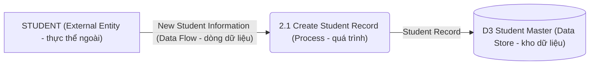
```mermaid
flowchart LR
    E["STUDENT (External Entity - thực thể ngoài)"]
    P("2.1 Create Student Record (Process - quá trình)")
    D1[("D3 Student Master (Data Store - kho dữ liệu)")]
    E -->|"New Student Information (Data Flow - dòng dữ liệu)"| P
    P -->|"Student Record"| D1
```

### 3. Bảy bước phát triển DFD (top-down) & 4 quy tắc cơ bản

**Các bước** (Figure 7.2):

1. Lập **danh sách hoạt động nghiệp vụ** (business activities), từ đó xác định: external entities, data flows, processes, data stores.
2. Vẽ **context diagram**: chỉ external entities + dòng dữ liệu vào/ra hệ thống. **Không** vẽ process chi tiết, **không** vẽ data store.
3. Vẽ **Diagram 0** (mức tiếp theo): hiện các process nhưng giữ ở mức tổng quát; **bắt đầu hiện data store** ở mức này.
4. Tạo **child diagram** cho từng process trong Diagram 0.
5. **Kiểm tra lỗi**, đảm bảo nhãn của mọi process/data flow có ý nghĩa.
6. Phát triển **physical DFD** từ logical DFD: phân biệt process thủ công/tự động, đặt tên file/report thật, thêm controls (báo hoàn tất/lỗi).
7. **Partition** physical DFD: tách hoặc gộp các phần để thuận tiện lập trình và triển khai.

**4 quy tắc bắt buộc:**

1. Một DFD phải có **ít nhất 1 process**; **không** có đối tượng đứng rời (freestanding) hoặc tự nối với chính nó.
2. Mỗi process phải có **ít nhất 1 dòng vào VÀ 1 dòng ra**.
3. Mỗi data store phải **nối với ít nhất 1 process**.
4. **Các external entity không được nối trực tiếp với nhau** — chúng có thể giao tiếp riêng, nhưng giao tiếp đó không thuộc hệ thống ta mô hình hóa.

Bắt đầu bằng cách **rút gọn narrative** (lời kể của tổ chức) thành danh sách 4 loại thành phần → giúp xác định **ranh giới hệ thống** (cái gì thuộc, cái gì không thuộc hệ thống).

### 4. Context Diagram (sơ đồ ngữ cảnh)

- Là **mức cao nhất** của DFD, cho **cái nhìn toàn cảnh (bird's-eye view)** về dòng dữ liệu.
- Chỉ chứa **MỘT process duy nhất**, đại diện cho **toàn bộ hệ thống**, được đánh **số 0**.
- Hiện **tất cả external entities** và các dòng dữ liệu chính đến/đi từ chúng.
- **KHÔNG chứa data store nào.**

**Ví dụ minh họa — hệ thống đặt hàng online (context diagram):**

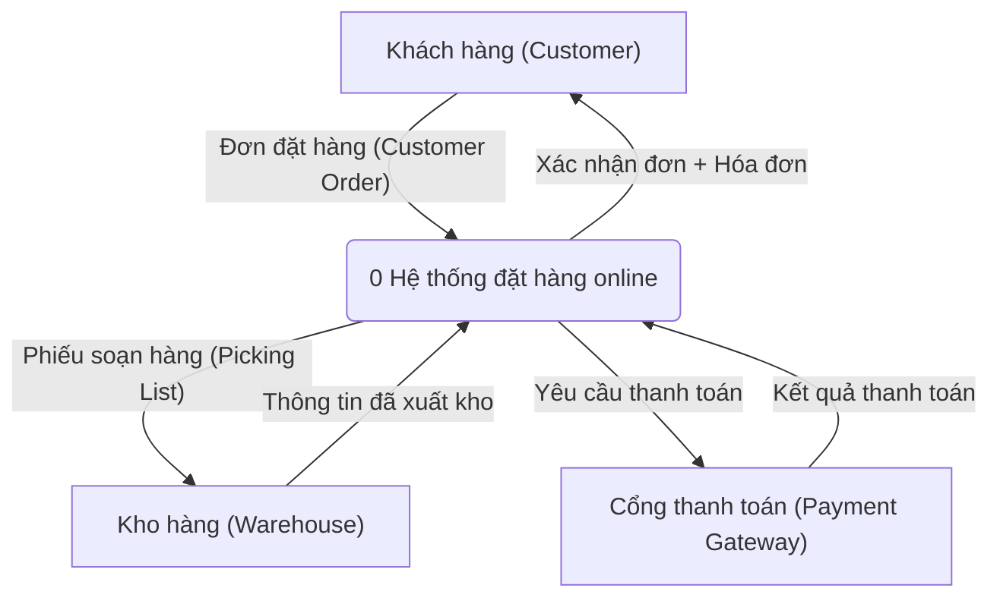
```mermaid
flowchart TD
    KH["Khách hàng (Customer)"]
    KHO["Kho hàng (Warehouse)"]
    NH["Cổng thanh toán (Payment Gateway)"]
    P0("0 Hệ thống đặt hàng online")
    KH -->|"Đơn đặt hàng (Customer Order)"| P0
    P0 -->|"Xác nhận đơn + Hóa đơn"| KH
    P0 -->|"Phiếu soạn hàng (Picking List)"| KHO
    KHO -->|"Thông tin đã xuất kho"| P0
    P0 -->|"Yêu cầu thanh toán"| NH
    NH -->|"Kết quả thanh toán"| P0
```

### 5. Diagram 0 — "Exploding" / Decomposition (phân rã)

- Diagram 0 là **kết quả phân rã (explosion/decomposition) của context diagram** — như đặt kính lúp lên sơ đồ gốc.
- **Input và output đã chỉ định ở sơ đồ trên KHÔNG ĐỔI** ở mọi sơ đồ dưới.
- Chứa **3–9 processes** (quá 9 → sơ đồ rối, khó hiểu; nếu hơn 9 thì gộp các process liên quan thành subsystem và đưa xuống child diagram).
- Mỗi process đánh **số nguyên** (1, 2, 3...), thường bắt đầu từ góc trên-trái xuống góc dưới-phải.
- **Các data store chính** (master files) và **tất cả external entities** đều có mặt trên Diagram 0.
- Xử lý **ngoại lệ (exceptions) được bỏ qua** ở 2–3 mức đầu tiên.

DFD là 2 chiều nên có thể bắt đầu vẽ từ bất kỳ điểm nào; 5 chiến lược gợi ý:

1. **Đi từ dòng dữ liệu vào** của một entity: "Dữ liệu vào hệ thống rồi bị làm gì? Có được lưu không? Là input cho nhiều process không?"
2. **Đi ngược từ dòng dữ liệu ra**: với mỗi field trên output hỏi "Nó đến từ đâu? Được tính toán hay lấy từ file?" (VD: trên PAYCHECK — EMPLOYEE NAME/ADDRESS lấy từ EMPLOYEE file, HOURS WORKED từ TIME RECORD, GROSS PAY/DEDUCTIONS được tính).
3. **Xét dòng vào/ra một data store**: "Process nào ghi dữ liệu vào kho? Process nào dùng?" (Lưu ý: data store có thể do hệ thống KHÁC tạo ra → từ góc nhìn của ta có thể không có dòng vào.)
4. **Phân tích một process đã rõ**: xem nó cần input gì, tạo output gì, rồi nối với data store/entity phù hợp.
5. **Ghi chú các vùng chưa rõ** → lập danh sách câu hỏi cho các buổi phỏng vấn follow-up.

**Ví dụ: Diagram 0 của hệ thống đặt hàng online** (explode từ context diagram ở trên — input/output với 3 entity giữ nguyên):

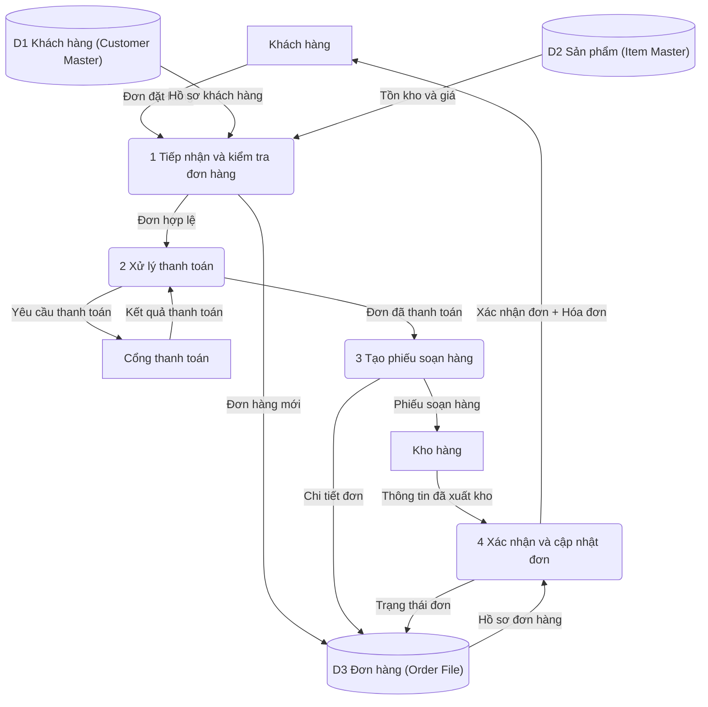
```mermaid
flowchart TD
    KH["Khách hàng"]
    KHO["Kho hàng"]
    NH["Cổng thanh toán"]
    P1("1 Tiếp nhận và kiểm tra đơn hàng")
    P2("2 Xử lý thanh toán")
    P3("3 Tạo phiếu soạn hàng")
    P4("4 Xác nhận và cập nhật đơn")
    D1[("D1 Khách hàng (Customer Master)")]
    D2[("D2 Sản phẩm (Item Master)")]
    D3[("D3 Đơn hàng (Order File)")]
    KH -->|"Đơn đặt hàng"| P1
    D1 -->|"Hồ sơ khách hàng"| P1
    D2 -->|"Tồn kho và giá"| P1
    P1 -->|"Đơn hợp lệ"| P2
    P1 -->|"Đơn hàng mới"| D3
    P2 -->|"Yêu cầu thanh toán"| NH
    NH -->|"Kết quả thanh toán"| P2
    P2 -->|"Đơn đã thanh toán"| P3
    P3 -->|"Phiếu soạn hàng"| KHO
    P3 -->|"Chi tiết đơn"| D3
    KHO -->|"Thông tin đã xuất kho"| P4
    D3 -->|"Hồ sơ đơn hàng"| P4
    P4 -->|"Xác nhận đơn + Hóa đơn"| KH
    P4 -->|"Trạng thái đơn"| D3
```

### 6. Child Diagram (sơ đồ con) & quy tắc Vertical Balancing

- Mỗi process trên Diagram 0 có thể được explode thành một **child diagram** chi tiết hơn (đôi khi gọi là **Level 1 Diagram**). Process bị phân rã gọi là **parent process**.
- **Quy tắc số 1 — VERTICAL BALANCING (cân bằng dọc):** child diagram **không được tạo ra output hoặc nhận input mà parent process không có**. Mọi dòng vào/ra parent process phải xuất hiện trên child diagram.
- **Đánh số:** child diagram mang **cùng số với parent process** (process 3 → Diagram 3). Các process con đánh số `số cha.số con`: 3.1, 3.2, 3.3... → cho phép truy vết qua nhiều mức phân rã.
- **Entities thường KHÔNG vẽ** ở các child diagram dưới Diagram 0.
- Dòng dữ liệu khớp với dòng của parent gọi là **interface data flow** — vẽ mũi tên đi từ/đến **vùng trống** của child diagram.
- Child diagram **được phép thêm**: data store của parent, **data store mới** (VD: bảng thuế — tax table, file trung gian nối 2 process con), và **dòng phụ nhỏ như error line** (không có trên parent).
- Process không phân rã tiếp gọi là **functionally primitive / primitive process** — sẽ được mô tả bằng logic đặc tả (process specifications, Chương 9).

**Ví dụ: child Diagram 1 — phân rã process "1 Tiếp nhận và kiểm tra đơn hàng"** (input "Đơn đặt hàng" và output "Đơn hợp lệ", "Đơn hàng mới" khớp parent — interface data flow vẽ từ vùng trống; thêm error line chỉ có ở mức con):

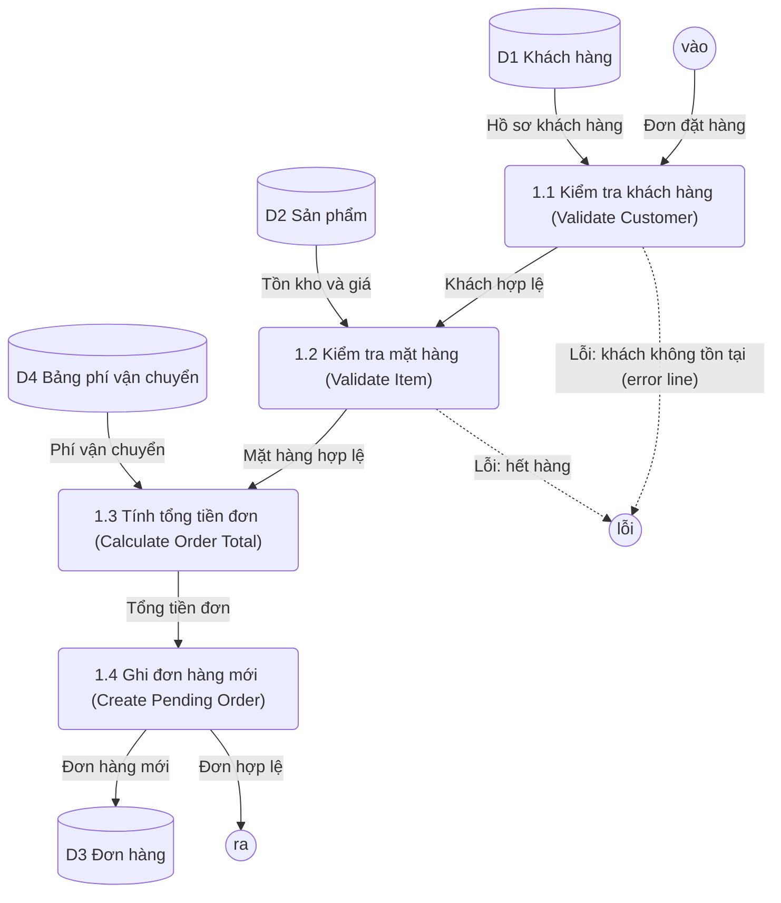
```mermaid
flowchart TD
    P11("1.1 Kiểm tra khách hàng (Validate Customer)")
    P12("1.2 Kiểm tra mặt hàng (Validate Item)")
    P13("1.3 Tính tổng tiền đơn (Calculate Order Total)")
    P14("1.4 Ghi đơn hàng mới (Create Pending Order)")
    D1[("D1 Khách hàng")]
    D2[("D2 Sản phẩm")]
    D3[("D3 Đơn hàng")]
    D4[("D4 Bảng phí vận chuyển")]
    IN(("vào")) -->|"Đơn đặt hàng"| P11
    D1 -->|"Hồ sơ khách hàng"| P11
    P11 -.->|"Lỗi: khách không tồn tại (error line)"| OUTERR(("lỗi"))
    P11 -->|"Khách hợp lệ"| P12
    D2 -->|"Tồn kho và giá"| P12
    P12 -.->|"Lỗi: hết hàng"| OUTERR
    P12 -->|"Mặt hàng hợp lệ"| P13
    D4 -->|"Phí vận chuyển"| P13
    P13 -->|"Tổng tiền đơn"| P14
    P14 -->|"Đơn hàng mới"| D3
    P14 -->|"Đơn hợp lệ"| OUT(("ra"))
```

### 7. Các LỖI THƯỜNG GẶP khi vẽ DFD (Checking Diagrams for Errors) ⚠️

Sách nêu 6 nhóm lỗi (minh họa bằng ví dụ payroll — Figure 7.5/7.6):

1. **Quên dòng dữ liệu hoặc vẽ mũi tên sai hướng.** Process chỉ toàn input hoặc chỉ toàn output là sai — mỗi process phải **nhận input và tạo output**. (VD trong sách: process 1 CALCULATE GROSS PAY không có output vì mũi tên GROSS PAY chỉ sai hướng; process 2 CALCULATE WITHHOLDING AMOUNT thiếu input về withholding rates và số người phụ thuộc.)
2. **Nối trực tiếp data store và external entity với nhau** (mọi tổ hợp đều sai): data store ↔ data store, entity ↔ data store, entity ↔ entity. File không tự "nói chuyện" với file mà không có chương trình/con người chuyển dữ liệu (EMPLOYEE MASTER không thể tự tạo CHECK RECONCILIATION); external entity không được thao tác trực tiếp vào file (không để khách hàng "lục lọi" customer master; EMPLOYEE không tự tạo EMPLOYEE TIME FILE). Hai entity nối nhau nghĩa là chúng muốn liên lạc — chỉ đưa vào DFD nếu hệ thống làm trung gian, và khi đó **vẫn phải chèn một process** vào giữa (VD: process tạo báo cáo).
3. **Đặt nhãn sai** cho process hay data flow: process phải mang tên hệ thống hoặc theo dạng **verb–adjective–noun**; data flow phải là **danh từ**.
4. **Đưa quá 9 process vào một DFD** → rối, cản trở giao tiếp. Hơn 9 process → gộp nhóm thành subsystem, đưa vào child diagram.
5. **Bỏ sót dòng dữ liệu.** Dấu hiệu: **linear flow** (mỗi process chỉ 1 vào – 1 ra) — hiếm khi đúng, trừ child DFD rất chi tiết; thường là thiếu dòng. (VD: NET PAY không thể tính chỉ từ WITHHOLDING; EMPLOYEE PAYCHECK cần thêm EMPLOYEE NAME, số liệu payroll hiện tại + lũy kế năm, WITHHOLDING AMOUNT.)
6. **Phân rã mất cân bằng (unbalanced decomposition)**: child diagram phải có **cùng input/output** với parent process — ngoại lệ duy nhất là output nhỏ như **error line** (chỉ có ở child).

**Minh họa lỗi bằng Mermaid** (trích ý ví dụ payroll của sách — bên trái SAI, bên phải quy tắc đúng):

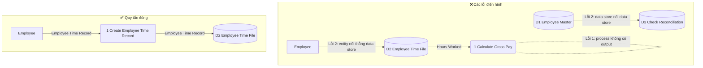
```mermaid
flowchart TD
    subgraph SAI["❌ Các lỗi điển hình"]
        NV1["Employee"]
        D2S[("D2 Employee Time File")]
        D1S[("D1 Employee Master")]
        D3S[("D3 Check Reconciliation")]
        P1S("1 Calculate Gross Pay")
        NV1 -->|"Lỗi 2: entity nối thẳng data store"| D2S
        D1S -->|"Lỗi 2: data store nối data store"| D3S
        D2S -->|"Hours Worked"| P1S
        P1S -.-|"Lỗi 1: process không có output"| P1S
    end
    subgraph DUNG["✅ Quy tắc đúng"]
        NV2["Employee"]
        PC("1 Create Employee Time Record")
        D2D[("D2 Employee Time File")]
        NV2 -->|"Employee Time Record"| PC
        PC -->|"Employee Time Record"| D2D
    end
```

### 8. Logical DFD vs Physical DFD

| Đặc điểm thiết kế | **Logical DFD** | **Physical DFD** |
|---|---|---|
| Mô hình thể hiện gì | **Cách nghiệp vụ vận hành** (how the business operates) | **Cách hệ thống được hiện thực** (hoặc hệ hiện tại vận hành thế nào) |
| Process đại diện cho | **Hoạt động nghiệp vụ** (business activities) | **Chương trình, module chương trình, thủ tục thủ công** |
| Data store đại diện cho | **Tập dữ liệu bất kể cách lưu trữ** | **File/database vật lý, file thủ công** |
| Loại data store | Kho dữ liệu **lâu dài (permanent)** | **Master file, transaction file**; 2 process chạy **khác thời điểm** phải nối qua data store |
| Controls | Business controls | Controls kiểm tra input, tìm record (record found status), xác nhận process hoàn tất, bảo mật hệ thống (VD: journal records) |

- **Logical DFD**: tập trung nghiệp vụ, mô tả **business events** cùng dữ liệu mỗi event cần/tạo ra; xây dựng từ các câu chuyện (stories) trong phỏng vấn. **Không quan tâm** hệ thống sẽ xây thế nào.
- **Physical DFD**: cho biết hệ thống sẽ hiện thực ra sao — **hardware, software, files, con người**; xây từ logical DFD + hệ hiện tại + dữ liệu lưu trữ + báo cáo chính + dữ liệu phỏng vấn.

**Tiến trình chuẩn (Figure 7.8):**

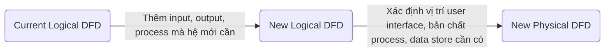
```mermaid
flowchart LR
    A("Current Logical DFD") -->|"Thêm input, output, process mà hệ mới cần"| B("New Logical DFD")
    B -->|"Xác định vị trí user interface, bản chất process, data store cần có"| C("New Physical DFD")
```

- Current logical DFD rút ra bằng cách xem physical DFD hiện tại và **cô lập các hoạt động nghiệp vụ thuần túy**.
- Lợi ích của việc vẽ logical DFD hệ hiện tại: dùng nó làm nền tạo logical DFD hệ mới (bỏ process không cần, thêm tính năng/output/input/dữ liệu mới) → **đảm bảo giữ lại các tính năng thiết yếu** của hệ cũ, và chuyển tiếp dần sang thiết kế hệ mới.

**Ví dụ grocery store cashier (Figure 7.9):** logical DFD chỉ nói: nhận diện mặt hàng → tra giá → tính tổng → thanh toán và đưa RECEIPT. Physical DFD lộ chi tiết: quét **UPC BAR CODE**, process thủ công "Pass Items Over Scanner (Manual)", **file tạm** giữ subtotal (Temporary Trans. File), thanh toán bằng **CASH/CREDIT/DEBIT CARD**, biên nhận gọi đúng tên **CASH REGISTER RECEIPT**.

**5 lợi thế của logical DFD:**
1. Giao tiếp với người dùng tốt hơn (xoay quanh hoạt động nghiệp vụ họ quen thuộc).
2. Hệ thống **ổn định hơn** (dựa trên business events, không dựa vào công nghệ cụ thể — VD đăng ký hội viên gym, tích điểm thưởng, đóng phí năm đều xảy ra dù hệ thống là tự động, thủ công hay lai).
3. Analyst **hiểu nghiệp vụ sâu hơn**.
4. Linh hoạt, dễ bảo trì.
5. Loại bỏ dư thừa, dễ tạo physical model hơn.

**6 lợi thế của physical DFD:**
1. Làm rõ process nào do **người làm (manual)**, process nào **tự động**.
2. Mô tả process **chi tiết hơn** logical.
3. **Sắp thứ tự (sequencing)** các process phải chạy theo trình tự.
4. Xác định **data store tạm thời**.
5. Chỉ định **tên thật** của file, bảng database, bản in.
6. Thêm **controls** đảm bảo process chạy đúng.

**Nội dung physical DFD thường có (Figure 7.10):** manual processes; process thêm/xóa/sửa/cập nhật record; process nhập liệu và kiểm tra (keying, verifying); process validation; sequencing processes; process tạo mọi output duy nhất của hệ; intermediate data stores; tên file thật; controls báo hoàn tất/lỗi.

**Các khái niệm gắn với physical DFD:**
- **CRUD matrix**: CRUD = **Create, Read, Update, Delete** — 4 hoạt động phải tồn tại cho mỗi master file. Ma trận CRUD cho biết **process nào thực hiện hoạt động nào trên file nào** (Figure 7.11 — online store: Item Selection tạo Order (C) và Order Detail (C); Order Checkout cập nhật (U) Customer/Item/Order; Change Customer Order có thể CRUD trên Order Detail...).
- **Transaction file / intermediate data store**: vì các process cần chung một tập dữ liệu **hiếm khi chạy cùng một thời điểm**, cần transaction file giữ dữ liệu giữa các process. Ví dụ đời thường: đi chợ → nấu ăn → ăn: *xe đẩy* nối "chọn hàng" và "tính tiền"; *túi đựng* nối "tính tiền" và "chở về nhà"; *tủ bếp/tủ lạnh* nối "chở về" và "nấu ăn"; *chén đĩa* nối "nấu" và "ăn".
- **Timing**: physical DFD có thể chỉ định trình tự (edit program chạy trước update program; update xong mới in summary report; đơn phải nhập trên website trước khi verify số tiền với tổ chức tài chính) → physical DFD thường trông **tuyến tính hơn** logical.
- **Trigger / Response**: dòng dữ liệu vào từ external entity gọi là **trigger** (khởi động process); dòng ra tới external entity gọi là **response**.
- **Base element**: field phải **nhập (key)** vào và **lưu trong file**. **Derived element**: phần tử **không nhập**, là kết quả **tính toán hoặc phép logic**.
- **Khi nào tách child diagram?** Đếm số dòng vào + ra của một process: **tổng > 4** → process đó là ứng viên tốt để tách child diagram.

### 9. Event Modeling & Event Response Table

Cách thực dụng để tạo physical DFD: vẽ **một DFD fragment cho mỗi event duy nhất** của hệ thống.
- **Event** khiến hệ thống làm gì đó, đóng vai trò **trigger**: trigger khởi động các hoạt động và process, các process dùng dữ liệu hoặc tạo output. (VD: khách đặt vé máy bay trên web — mỗi web form submit sẽ kích hoạt validate + lưu dữ liệu + format và hiển thị trang kế.)
- Events được tóm tắt trong **event response table** với các cột: **Event | Source | Trigger | Activity | Response | Destination**.
- **Mỗi hàng = 1 DFD fragment = 1 process trên DFD.** Trigger/Response trở thành **input/output data flow**; Activity trở thành **process**; analyst tự xác định **data store** cần thiết bằng cách xét các dòng vào/ra.
- **Ghép tất cả fragments → Diagram 0.**
- Trigger có 2 loại: **External** (do entity bên ngoài gây ra — khách bấm nút "Check Out") và **Temporal** (theo thời gian — "Temporal, hourly": mỗi giờ gửi email xác nhận giao hàng).
- **Ưu điểm**: người dùng **quen thuộc với các event** trong lĩnh vực của họ và biết event kéo theo hoạt động nào.

Ví dụ trong sách (internet storefront — Figure 7.12): các event Customer logs on / browses items / places item into shopping basket / checks out / obtain customer payment / send customer email; 3 hàng đầu được vẽ thành 3 fragment (Figure 7.13): process 1 GET CUSTOMER SIGNIN (D1 Customer Master), process 2 BROWSE ITEM RECORDS (D2 Item Master), process 3 ADD CUSTOMER ITEM (D1, D2, D7 Order Detail, D8 Shipping Tables).

### 10. Use Cases và DFD

- **Use case** tóm tắt một event, format tương tự process specifications (Chương 9). Mỗi use case định nghĩa **một activity** cùng **trigger, input, output** của nó.
- Các thành phần của form use case (Figure 7.14): **Use case name; Process ID; Description; Trigger; Trigger type (External/Temporal); Input Name + Source; Output Name + Destination; Steps Performed; Information for Steps** (dữ liệu dùng ở mỗi bước).
- Quy trình: (1) định nghĩa sơ bộ use cases không đi vào chi tiết → có overview và tạo được Diagram 0; (2) đặt tên + mô tả ngắn từng activity, liệt kê inputs/outputs; (3) tài liệu hóa các bước dưới dạng **business rules** (theo trình tự thực hiện bình thường); (4) xác định dữ liệu mỗi bước dùng (dễ hơn nếu đã có data dictionary); (5) **cho người dùng review** và góp ý chỉnh sửa. Use case phải được viết **rõ ràng**.
- VD use case "Add Customer Item" (process 3): trigger = khách bỏ hàng vào giỏ; các bước: tìm Item Record theo Item Number (không thấy → báo lỗi trên trang) → lưu Order Detail Record → tìm Customer Record → tính Shipping Cost từ Item Weight + Zip Code tra Shipping Tables → cập nhật Customer Total → cập nhật Item Quantity on Hand.

### 11. Partitioning DFD (phân hoạch)

**Partitioning** = xem xét một DFD và quyết định chia nó thành **tập các thủ tục thủ công** và **tập các ứng dụng máy tính**; phân tích từng process xem nên thủ công hay tự động, rồi **gộp các process tự động thành chuỗi chương trình**. Vẽ **đường đứt nét (dashed line)** bao quanh nhóm process thuộc cùng một chương trình.

**6 lý do partitioning:**

1. **Nhóm người dùng khác nhau (Different user groups)** — process do các nhóm khác nhau, thường ở địa điểm khác nhau, thực hiện → tách chương trình riêng. (VD: xử lý hàng trả và xử lý thanh toán của khách ở cửa hàng New York vs San Francisco — cùng điều chỉnh tài khoản khách nhưng người khác nhau làm, mỗi nhóm cần màn hình khác nhau: credit screen vs payment screen.)
2. **Thời điểm (Timing)** — 2 process chạy **khác thời điểm** thì không thể gộp một chương trình. Timing còn liên quan lượng dữ liệu trên một trang web (trang đặt hàng/đặt vé dài → tách thành nhiều chương trình format và hiển thị dữ liệu).
3. **Nhiệm vụ tương tự (Similar tasks)** — có thể gộp vào một ứng dụng.
4. **Hiệu quả (Efficiency)** — gộp nhiều process vào một chương trình để xử lý hiệu quả (nhiều báo cáo dùng chung các file input lớn → chạy cùng nhau tiết kiệm thời gian máy).
5. **Nhất quán dữ liệu (Consistency of data)** — gộp để dữ liệu nhất quán (công ty thẻ tín dụng chụp "snapshot" và in nhiều báo cáo cùng lúc để số liệu khớp nhau).
6. **Bảo mật (Security)** — tách chương trình vì lý do bảo mật (đường đứt nét quanh các trang trên secure server; trang nhập user ID + password thường tách khỏi trang đặt hàng).

### 12. Ví dụ xuyên suốt: World's Trend Catalog Division

World's Trend là nhà **bán quần áo thời trang qua catalog** (đặt qua điện thoại, gửi form theo catalog, hoặc website). **Danh sách hoạt động nghiệp vụ** (Figure 7.15):

1. Khi đơn khách đến: cập nhật cả **item master** lẫn **customer master**; nếu hết hàng → **thông báo Inventory Control Department**.
2. Khách mới → tạo record mới trong customer master.
3. Tạo **picking slips** cho đơn hàng, gửi tới **warehouse**.
4. Chuẩn bị **shipping statement**.
5. Ship đơn: lấy hàng từ kho + khớp shipping statement + đúng địa chỉ khách → gửi khách.
6. **Customer statement** được tạo; **billing statement** gửi khách **mỗi tháng một lần**.
7. **Accounts receivable report** gửi **Accounting Department**.

- **Context diagram (Figure 7.16):** process 0 ORDER PROCESSING SYSTEM + 5 external entities: CUSTOMER (vẽ 2 lần nhưng là một), INVENTORY CONTROL DEPARTMENT, ACCOUNTING DEPARTMENT, WAREHOUSE. Dòng chính: Customer Order, New Customer Information, Item Number or Description vào; Shipped Order, Customer Billing Statement, Item Information, Back-Ordered Item, Accounts Receivable Report, Order Picking List ra; Order Goods từ Warehouse.
- **Diagram 0 (Figure 7.17)** — 8 process: 1 ADD CUSTOMER ORDER, 2 ADD CUSTOMER RECORD, 3 PRODUCE PICKING SLIPS, 4 PREPARE SHIPPING STATEMENT, 5 SHIP CUSTOMER ORDER, 6 CREATE CUSTOMER STATEMENT, 7 PRODUCE ACCOUNTS RECEIVABLE, 8 QUERY ITEM INFORMATION; data stores D1 CUSTOMER MASTER, D2 ITEM MASTER; dòng PENDING ORDER nối chuỗi process.
- **Diagram 1 (Figure 7.18)** — child của process 1 với 7 subprocess: 1.1 VALIDATE CUSTOMER ACCOUNT (error: Customer Not Found), 1.2 VALIDATE ORDER ITEM (error: Item Not Found), 1.3 DETERMINE QUANTITY AVAILABLE (output Back-Ordered Item), 1.4 UPDATE ITEM QUANTITY, 1.5 CALCULATE ORDER TOTALS (dùng D4 Shipping and Handling Table), 1.6 UPDATE CUSTOMER RECORD, 1.7 CREATE PENDING ORDER. Subprocess **không cần nối external entity** (tra ngược parent để biết).
- **Physical child DFD (Figure 7.19)** — process 3 PRODUCE PICKING SLIPS phân rã vật lý: 3.1 READ ITEM RECORD → 3.2 CREATE ORDER ITEM RECORD (D6 Order Item File) → 3.3 **SORT ORDER ITEM BY LOCATION WITHIN WAREHOUSE** (so với logical chỉ cần "SORT ORDER ITEM") → D7 Sorted Order Item File → 3.4 GET CUSTOMER RECORD (D1 Customer Master File) → 3.5 FORMAT CUSTOMER LINES → 3.6 FORMAT ITEM LINES → 3.7 PRINT ORDER PICKING SLIP. Nhãn physical: data store gọi đúng **tên file thật** (CUSTOMER MASTER FILE, SORTED ORDER ITEM FILE), data flow gọi đúng **form/report/screen thật** (ORDER PICKING SLIP).
- **Partitioning (Figure 7.20):** gộp process **1 và 2** vào một chương trình (thêm khách mới ngay lúc đặt đơn đầu tiên — cùng thời điểm); process **3 và 4** đều là **batch process** nhưng phải tách chương trình riêng vì **chạy khác thời điểm**. Process 3 là batch vì có computer output (Order Picking List) và computer input (3 file).

### 13. Partitioning Websites

- Chia website thành **chuỗi web page** giúp: cải thiện cách con người dùng site, tốc độ xử lý, dễ bảo trì. Mỗi lần cần lấy dữ liệu từ **data store hoặc đối tác ngoài** → cân nhắc tạo một web form + một DFD process riêng để validate và xử lý.
- **Ajax**: gửi request lên server, nhận về lượng dữ liệu nhỏ/XML cho **cùng trang** — tránh tạo quá nhiều trang nhỏ chỉ khác vài phần tử form. Nhưng vẫn nên tạo nhiều trang khi: cần lấy **lượng dữ liệu lớn** từ server (VD danh sách mọi chuyến bay khớp sân bay đi/đến); truy cập **database khác nhau** → tách trang; cùng database khác bảng → có thể một process.
- **Ví dụ đặt vé máy bay (Figure 7.21):** process 1 nhận và validate ngày + mã sân bay; process 2 hiển thị chuyến bay khả dụng — tách riêng vì phải **tìm trong data store** và dùng **transaction file FLIGHT DETAILS** để hiển thị nhiều trang liên tiếp (tìm lại từ đầu sẽ quá chậm với người dùng); process 4 chọn ghế tách riêng vì **database nội bộ không có dữ liệu ghế trống** — hãng bay nhận đặt chỗ từ nhiều đại lý; process 5 book flight qua **kết nối bảo mật** với credit card company (bảo mật → process riêng); sau khi xác nhận thẻ: process 6 charge thẻ, process 7 update airline flights (báo hãng bay), process 8 tạo e-ticket + email xác nhận.
- Nguyên tắc: mỗi lần dùng **data store mới** → thêm process format/lấy dữ liệu; mỗi lần dính tới **công ty/hệ thống ngoài** → partition thành **chương trình riêng**. Form tách nhỏ → đơn giản, hấp dẫn, dễ điền (đạt cả usability và usefulness); chương trình nhỏ → dễ sửa; website **an toàn, hiệu quả, dễ bảo trì**.

### 14. Giao tiếp bằng DFD (Communicating Using DFDs)

- DFD hữu ích **xuyên suốt** phân tích và thiết kế: DFD gốc chưa explode dùng **sớm** khi xác định yêu cầu thông tin — cho cái nhìn tổng quan dòng dữ liệu mà narrative không có.
- Muốn DFD thực sự truyền đạt được: **nhãn phải có ý nghĩa, không generic** (mọi mô hình hệ thống đều có input–process–output, nên nhãn phải cụ thể hơn thế).
- DFD dùng để **tài liệu hóa hệ thống**: giả định DFD sẽ **sống lâu hơn người vẽ ra nó** (luôn đúng nếu người vẽ là consultant bên ngoài); dùng ghi lại phân tích ở mức cao lẫn thấp và chứng minh logic của các dòng dữ liệu.
- Ghi chú lịch sử (Mac Appeal): **CASE tools** từng thịnh hành nhưng bị coi là quá cứng nhắc khi chuyển sang agile; **Microsoft Visio** thân thiện hơn (không có sẵn trong Office, không có bản Mac trừ Visio Plan 1 web); trên Mac có **OmniGraffle** với template/stencil DFD, hợp phong cách agile.

---

## 🔑 Bảng thuật ngữ (Keywords and Phrases)

| Thuật ngữ (EN) | Nghĩa tiếng Việt / giải thích |
|---|---|
| Ajax | Kỹ thuật web gửi request tới server lấy lượng dữ liệu nhỏ/XML về cùng trang, tránh tạo nhiều trang nhỏ |
| Base element | Phần tử cơ sở — dữ liệu phải nhập (key) và lưu trong file |
| Child diagram | Sơ đồ con — kết quả phân rã một parent process |
| Context-level data flow diagram | Sơ đồ dòng dữ liệu mức ngữ cảnh — 1 process số 0 đại diện toàn hệ thống, mọi external entity, không data store |
| Data flow diagram (DFD) | Sơ đồ dòng dữ liệu — biểu diễn đồ họa các quá trình xử lý dữ liệu bằng 4 ký hiệu |
| Data flow diagram fragment | Mảnh DFD — một process đơn ứng với một hàng của event response table |
| Data store | Kho dữ liệu — dữ liệu ở trạng thái nghỉ (file, database, tủ hồ sơ) |
| Decomposing / decomposition | Phân rã — tách một sơ đồ/process thành mức chi tiết hơn (đồng nghĩa exploding) |
| Derived element | Phần tử dẫn xuất — kết quả tính toán/phép logic, không cần nhập |
| Event response table | Bảng sự kiện–phản hồi: Event, Source, Trigger, Activity, Response, Destination; mỗi hàng → 1 DFD fragment |
| Exploding | "Nổ" sơ đồ — phóng to chi tiết một process thành sơ đồ con (đồng nghĩa decomposition) |
| External entity (source or destination) | Thực thể ngoài (nguồn/đích) — người, phòng ban, doanh nghiệp, máy móc gửi/nhận dữ liệu, nằm ngoài ranh giới hệ thống |
| Functionally primitive | Nguyên thủy về chức năng — process không phân rã thêm |
| Interface data flow | Dòng dữ liệu giao diện — dòng trên child diagram khớp với dòng của parent, vẽ từ/đến vùng trống |
| Level 0 diagram | Diagram 0 — phân rã của context diagram, tối đa 9 process, có data store |
| Logical data flow diagram | DFD logic — mô tả nghiệp vụ vận hành, không quan tâm cách hiện thực |
| Parent process | Process cha — process trên Diagram 0 (hoặc mức trên) được phân rã |
| Partitioning | Phân hoạch — chia DFD thành các thủ tục thủ công và các chương trình máy tính |
| Physical data flow diagram | DFD vật lý — mô tả cách hiện thực: hardware, software, file, con người, controls |
| Primitive process | Process nguyên thủy — process không được explode, mô tả bằng logic (Chương 9) |
| Process | Quá trình — sự biến đổi dữ liệu, công việc được thực hiện trong hệ thống |
| Top-down approach | Cách tiếp cận từ trên xuống — từ tổng quát (context) đến chi tiết (child diagrams) |
| Transaction data store | Kho dữ liệu giao dịch — file trung gian giữ dữ liệu giữa 2 process chạy khác thời điểm |
| Use case | Ca sử dụng — tóm tắt một event: một activity + trigger, input, output |
| Vertical balancing | Cân bằng dọc — child diagram không được tạo output/nhận input mà parent process không có |

---

## ❓ Trả lời Review Questions (19 câu)

**1. Phương pháp chính nào để phân tích hệ thống hướng dữ liệu (data-oriented systems)?**
Sơ đồ dòng dữ liệu — **Data Flow Diagram (DFD)** — một kỹ thuật của structured analysis, cho phép analyst biểu diễn đồ họa các quá trình dữ liệu trong toàn tổ chức chỉ với 4 ký hiệu, dùng được trong cả agile lẫn SDLC.

**2. Bốn lợi thế của cách tiếp cận dòng dữ liệu so với giải thích bằng lời?**
(1) Tự do, **không phải cam kết sớm** vào cách hiện thực kỹ thuật của hệ thống; (2) hiểu sâu hơn **mối liên hệ qua lại giữa hệ thống và các hệ thống con**; (3) **truyền đạt kiến thức về hệ thống hiện tại** tới người dùng thông qua DFD; (4) **phân tích hệ thống đề xuất** để xác định dữ liệu và process cần thiết đã được định nghĩa chưa.

**3. Bốn thành phần dữ liệu được ký hiệu trên DFD?**
(1) **External entity** — hình vuông kép (nguồn/đích dữ liệu); (2) **Data flow** — mũi tên (dữ liệu chuyển động); (3) **Process** — chữ nhật bo góc (biến đổi dữ liệu); (4) **Data store** — chữ nhật hở đầu phải (dữ liệu ở trạng thái nghỉ).

**4. Context-level DFD là gì? So sánh với Level 0 DFD.**
Context diagram là **mức cao nhất** của DFD: chỉ có **một process duy nhất số 0** đại diện toàn hệ thống, hiện **tất cả external entity** cùng các dòng dữ liệu chính, và **không có data store**. Level 0 (Diagram 0) là **phân rã** của context diagram: chứa **tối đa 9 process** đánh số nguyên, hiện các **data store chính** và mọi external entity, chi tiết hơn về dòng dữ liệu — nhưng input/output với bên ngoài phải giữ nguyên như context diagram.

**5. Định nghĩa top-down approach trong vẽ DFD.**
Đi **từ tổng quát đến cụ thể**: bắt đầu bằng danh sách hoạt động nghiệp vụ → vẽ context diagram (toàn cảnh) → explode thành Diagram 0 → tiếp tục explode từng process thành child diagram chi tiết dần. Sơ đồ đầu giúp nắm chuyển động dữ liệu cơ bản, các mức sau lấp dần chi tiết.

**6. "Exploding" DFD nghĩa là gì? Có khác "decomposing" không? Tại sao?**
Exploding là phóng to một process/sơ đồ để thấy chi tiết bên trong — như đặt kính lúp lên DFD gốc: phần được explode thành 3–9 process con, kèm data store và dòng dữ liệu mức thấp mới. **Không khác** — sách nói rõ exploding "is also called decomposition": hai từ chỉ cùng một thao tác phân rã, chỉ là hai cách gọi.

**7. Trade-off khi quyết định phân rã sâu đến đâu?**
Phân rã **chưa đủ sâu** → thiếu chi tiết để hiểu logic, khó viết đặc tả, có thể bỏ sót dòng dữ liệu/lỗi. Phân rã **quá sâu** → tốn công vẽ và bảo trì nhiều mức sơ đồ, dễ mất cân bằng, rối rắm, cản trở giao tiếp. Nguyên tắc dừng: process **functionally primitive** thì không explode nữa (mô tả bằng logic ở Chương 9); process có **tổng dòng vào + ra > 4** là ứng viên tốt để tách child diagram; mỗi sơ đồ giữ 3–9 process, vẽ tay thì mỗi sơ đồ một trang giấy; bỏ qua ngoại lệ ở 2–3 mức đầu.

**8. Vì sao đặt nhãn DFD quan trọng? Nhãn hiệu quả giúp gì cho người chưa quen hệ thống?**
Vì DFD chỉ thực sự **truyền đạt** được cho người dùng và thành viên dự án khi mọi thành phần dữ liệu có **nhãn ý nghĩa**. Nhãn không được generic — mọi mô hình hệ thống đều là input–process–output nên nhãn phải cụ thể hơn thế. Nhãn tốt giúp người chưa quen hệ thống hiểu ngay tình huống nghiệp vụ, đọc được logic dòng dữ liệu, và DFD trở thành **tài liệu hệ thống** sống lâu hơn người vẽ ra nó.

**9. Khác biệt giữa logical DFD và physical DFD?**
**Logical DFD** mô tả **cách nghiệp vụ vận hành**: các business event, dữ liệu mỗi event cần và tạo ra — không quan tâm hệ thống được xây thế nào; process = hoạt động nghiệp vụ; data store = tập dữ liệu bất kể cách lưu. **Physical DFD** mô tả **cách hệ thống được hiện thực**: hardware, software, file, con người; process = chương trình/module/thủ tục thủ công; data store = file/database vật lý, master file, transaction file; có thêm controls (validate input, record found, hoàn tất process, bảo mật).

**10. Ba lý do tạo logical DFD.**
(Chọn 3 trong 5): (1) giao tiếp với người dùng tốt hơn — mô hình xoay quanh hoạt động nghiệp vụ họ quen; (2) hệ thống **ổn định hơn** vì dựa trên business event, không phụ thuộc công nghệ; (3) analyst **hiểu nghiệp vụ sâu hơn**; (4) linh hoạt và dễ bảo trì; (5) loại bỏ dư thừa và tạo physical model dễ hơn.

**11. Năm đặc trưng của physical DFD mà logical DFD không có.**
(Chọn 5): (1) manual processes — process do người làm; (2) process thêm/xóa/sửa/cập nhật record và process nhập liệu, kiểm tra dữ liệu (keying, verifying, validation); (3) sequencing — trình tự chạy của process; (4) **intermediate/temporary data stores** (transaction file); (5) **tên thật** của file, bảng database, bản in; (6) **controls** báo hoàn tất tác vụ hoặc điều kiện lỗi.

**12. Khi nào cần transaction file trong thiết kế hệ thống?**
Khi hai process cần dùng chung một tập dữ liệu nhưng **chạy ở hai thời điểm khác nhau** — transaction file giữ dữ liệu từ process này tới process kế tiếp (quy tắc: mọi process hoạt động ở hai thời điểm khác nhau phải nối với nhau qua một data store). VD đời thường: xe đẩy siêu thị nối "chọn hàng" và "tính tiền"; túi đựng nối "tính tiền" và "chở về nhà".

**13. Dùng event table để tạo DFD như thế nào?**
Mỗi **hàng** của event response table là một **DFD fragment** — một process đơn trên DFD: cột **Trigger** và **Response** trở thành **dòng dữ liệu vào và ra**, cột **Activity** trở thành **process**; analyst xác định **data store** cần thiết bằng cách xét input/output của process. Ghép tất cả fragment lại sẽ được **Diagram 0**. Ưu điểm: người dùng quen thuộc với các event trong nghiệp vụ của họ.

**14. Các phần chính của một use case.**
**Use case name; Process ID; Description** (mô tả); **Trigger** và **Trigger type** (External hay Temporal); **Input Name + Source; Output Name + Destination; Steps Performed** (các bước, dạng business rules theo trình tự); **Information for Steps** (dữ liệu dùng cho từng bước).

**15. Dùng use case để tạo DFD như thế nào?**
Mỗi use case định nghĩa **một activity** cùng trigger, input, output → analyst làm việc với người dùng để hiểu bản chất process rồi tạo **một DFD fragment** tương ứng. Bước đầu định nghĩa use case sơ bộ (không chi tiết) cho overview → dẫn tới **Diagram 0**; sau đó đặt tên, mô tả, liệt kê activities/inputs/outputs, ghi các bước thành business rules, xác định dữ liệu mỗi bước, và cho người dùng review.

**16. Partitioning là gì và được dùng thế nào?**
Là quá trình **xem xét DFD và quyết định chia nó** thành các tập **thủ tục thủ công** và các tập **ứng dụng máy tính**: phân tích từng process xem thủ công hay tự động, gộp các process tự động thành chuỗi chương trình, và vẽ **đường đứt nét** quanh nhóm process thuộc một chương trình. Dùng để tổ chức việc lập trình/triển khai, và rất hữu ích khi thiết kế website (chia trang, tách chương trình theo bảo mật, dữ liệu ngoài, v.v.).

**17. Làm sao analyst xác định khi nào cần user interface?**
Bằng cách **xét các process trên logical DFD mới** khi dẫn xuất physical DFD (Figure 7.8): xác định vị trí giao diện người dùng ở những nơi **dữ liệu vượt ranh giới người–hệ thống** — nơi input từ external entity phải được **nhập (keyed)** vào hệ thống (trigger), nơi output phải **hiển thị/in** cho external entity (response), và nơi người dùng phải nhập/xác nhận dữ liệu (các base element cần key). Với website: mỗi lần cần lấy dữ liệu từ data store hay đối tác ngoài, hoặc cần user input, cân nhắc một web form (giao diện) + process riêng.

**18. Ba cách xác định partitioning trong DFD.**
(Chọn 3 trong 6): (1) process do **nhóm người dùng khác nhau** (khác địa điểm) thực hiện → tách; (2) **timing** — process chạy khác thời điểm không thể chung một chương trình; (3) **similar tasks** — nhiệm vụ tương tự có thể gộp; (4) **efficiency** — gộp để chạy hiệu quả (chung file input lớn); (5) **consistency of data** — gộp để số liệu nhất quán (snapshot); (6) **security** — tách trang/chương trình bảo mật (trang login tách khỏi trang đặt hàng).

**19. Ba cách sử dụng DFD đã hoàn chỉnh.**
(1) Dùng **sớm trong xác định yêu cầu thông tin** — DFD chưa explode cho cái nhìn tổng quan dòng dữ liệu mà narrative không cho được; (2) **giao tiếp** với người dùng và thành viên dự án về hệ thống hiện tại/đề xuất (nhờ nhãn ý nghĩa); (3) **tài liệu hóa hệ thống** — ghi lại phân tích ở mức cao và mức thấp, chứng minh logic các dòng dữ liệu; DFD tồn tại lâu hơn người vẽ.

---

## 🧩 Giải Problems (22 bài)

### Bài 1 — Giải thích DFD cho Kevin Cahoon (chủ xưởng nhạc cụ)

**Đề:** Kevin không hiểu hệ thống đề xuất được mô tả thế nào trong bộ DFD bạn vẽ. (a) Viết đoạn văn giải thích DFD cho người dùng, kèm danh sách ký hiệu; (b) Có đáng chia sẻ DFD với người dùng không? (c) So sánh DFD với use case.

**a. Đoạn giải thích mẫu:** "Thưa anh Kevin, sơ đồ này vẽ lại **hành trình của thông tin** trong doanh nghiệp của anh — giống như bản đồ đường đi của dữ liệu, chứ không phải sơ đồ máy móc. Chỉ có 4 ký hiệu: **hình vuông kép** là người/tổ chức bên ngoài gửi hoặc nhận thông tin với hệ thống (VD: khách hàng, nhà cung cấp gỗ); **mũi tên** là thông tin đang di chuyển, tên trên mũi tên cho biết đó là thông tin gì (VD: 'Đơn đặt nhạc cụ'); **hình chữ nhật bo góc** là một việc mà hệ thống làm để biến đổi thông tin (VD: 'Tính giá đơn hàng') — thông tin đi ra luôn khác thông tin đi vào; **hình chữ nhật hở một đầu** là nơi thông tin được cất giữ để dùng lại (VD: hồ sơ khách hàng). Đọc sơ đồ bằng cách đi theo các mũi tên: thông tin từ đâu đến, được xử lý ra sao, được lưu ở đâu và cuối cùng ai nhận kết quả."

**b. Có đáng không? — Có.** Vì: (1) DFD giúp người dùng **xác nhận analyst hiểu đúng nghiệp vụ** — người dùng là người duy nhất phát hiện được process thiếu, dòng dữ liệu sai; (2) một trong 4 lợi thế của DFD là **truyền đạt kiến thức hệ thống hiện tại đến người dùng**; (3) logical DFD xoay quanh **hoạt động nghiệp vụ quen thuộc** với người dùng nên chi phí "dạy" họ đọc sơ đồ (chỉ 4 ký hiệu) rất nhỏ so với lợi ích tránh xây sai hệ thống; (4) DFD là tài liệu chung sống lâu dài giữa hai bên. Cần chọn mức phù hợp (context, Diagram 0) và nhãn ý nghĩa, không generic.

**c. DFD vs use case:** Use case tóm tắt **một event/một activity** kèm trigger, input, output và các bước — rất tốt để mô tả **tương tác từng kịch bản** giữa actor và hệ thống. Nhưng DFD cho thấy điều use case khó thể hiện: (1) **bức tranh tổng thể dòng dữ liệu xuyên hệ thống** — dữ liệu chảy từ process này sang process kia, qua những kho nào; (2) **data store** và việc dữ liệu được lưu/lấy ở đâu; (3) **mối liên hệ giữa nhiều process** và giữa các hệ thống con (nhờ phân rã nhiều mức có cân bằng dọc); (4) ranh giới hệ thống với mọi external entity trên một trang. Hai công cụ bổ trợ nhau: mỗi use case thường tương ứng một DFD fragment; ghép các fragment thành Diagram 0.

### Bài 2 — Valentine Producers Financial (VPF): gộp 2 hệ thống vay vốn

**Đề:** Hệ **loan application** (của Vanessa James — mới nhưng không tài liệu) nhận hồ sơ vay, xử lý, khuyến nghị phê duyệt; hệ **loan management** (của Don Sanders — cũ, cần sửa nhiều) nhận các khoản vay đã duyệt và theo dõi đến khi kết thúc (paid — trả xong, sold — bán đi, defaulted — vỡ nợ). Vẽ (a) context diagram và (b) Diagram 0 cho hệ thống gộp lý tưởng.

**a. Context diagram:**

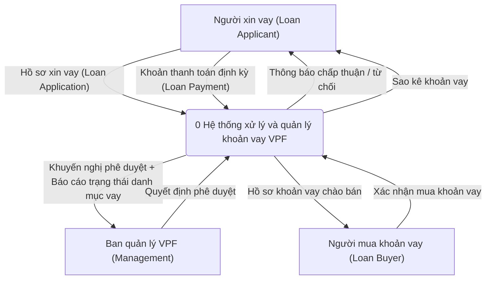
```mermaid
flowchart TD
    A["Người xin vay (Loan Applicant)"]
    M["Ban quản lý VPF (Management)"]
    B["Người mua khoản vay (Loan Buyer)"]
    P0("0 Hệ thống xử lý và quản lý khoản vay VPF")
    A -->|"Hồ sơ xin vay (Loan Application)"| P0
    P0 -->|"Thông báo chấp thuận / từ chối"| A
    A -->|"Khoản thanh toán định kỳ (Loan Payment)"| P0
    P0 -->|"Sao kê khoản vay"| A
    P0 -->|"Khuyến nghị phê duyệt + Báo cáo trạng thái danh mục vay"| M
    M -->|"Quyết định phê duyệt"| P0
    P0 -->|"Hồ sơ khoản vay chào bán"| B
    B -->|"Xác nhận mua khoản vay"| P0
```

**b. Diagram 0** (một chuỗi liền mạch: application → approval → management → disposition; loại bỏ việc mã hóa hồ sơ độc lập ở hai hệ cũ bằng kho vay chung):

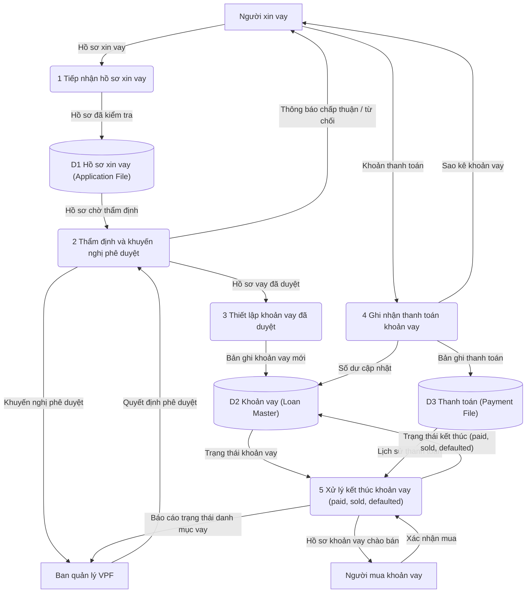
```mermaid
flowchart TD
    A["Người xin vay"]
    M["Ban quản lý VPF"]
    B["Người mua khoản vay"]
    P1("1 Tiếp nhận hồ sơ xin vay")
    P2("2 Thẩm định và khuyến nghị phê duyệt")
    P3("3 Thiết lập khoản vay đã duyệt")
    P4("4 Ghi nhận thanh toán khoản vay")
    P5("5 Xử lý kết thúc khoản vay (paid, sold, defaulted)")
    D1[("D1 Hồ sơ xin vay (Application File)")]
    D2[("D2 Khoản vay (Loan Master)")]
    D3[("D3 Thanh toán (Payment File)")]
    A -->|"Hồ sơ xin vay"| P1
    P1 -->|"Hồ sơ đã kiểm tra"| D1
    D1 -->|"Hồ sơ chờ thẩm định"| P2
    P2 -->|"Khuyến nghị phê duyệt"| M
    M -->|"Quyết định phê duyệt"| P2
    P2 -->|"Thông báo chấp thuận / từ chối"| A
    P2 -->|"Hồ sơ vay đã duyệt"| P3
    P3 -->|"Bản ghi khoản vay mới"| D2
    A -->|"Khoản thanh toán"| P4
    P4 -->|"Bản ghi thanh toán"| D3
    P4 -->|"Số dư cập nhật"| D2
    P4 -->|"Sao kê khoản vay"| A
    D2 -->|"Trạng thái khoản vay"| P5
    D3 -->|"Lịch sử thanh toán"| P5
    P5 -->|"Hồ sơ khoản vay chào bán"| B
    B -->|"Xác nhận mua"| P5
    P5 -->|"Trạng thái kết thúc (paid, sold, defaulted)"| D2
    P5 -->|"Báo cáo trạng thái danh mục vay"| M
```

**Giải thích:** hệ gộp dùng **một Loan Master chung** (D2) thay vì hai bộ mã hồ sơ độc lập — dòng "Hồ sơ vay đã duyệt" từ process 2 sang process 3 chính là điểm nối liền hai hệ cũ. Ba trạng thái kết thúc của loan management (paid/sold/defaulted) tập trung ở process 5.

### Bài 3 — Đăng ký học phần (enrolling in a college course)

**a. Level 1 DFD của quy trình đăng ký học phần:**

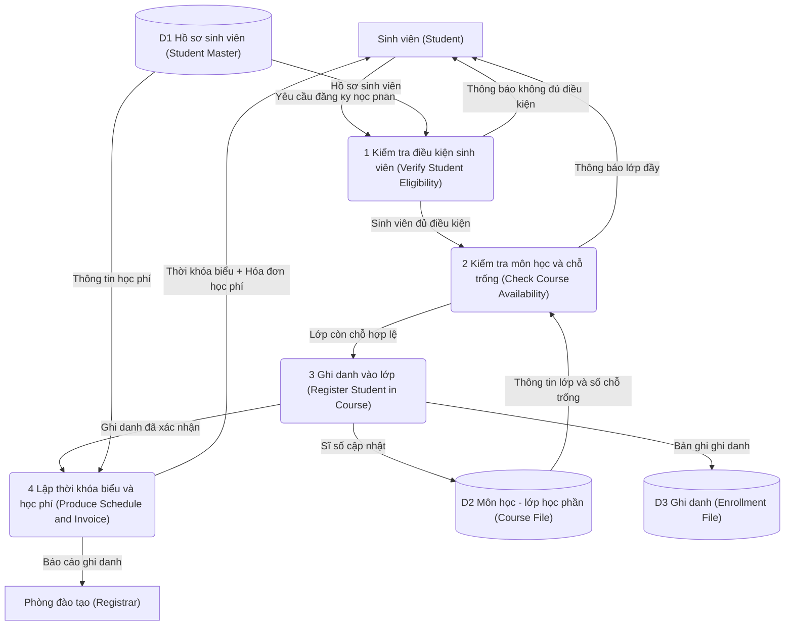
```mermaid
flowchart TD
    SV["Sinh viên (Student)"]
    PDT["Phòng đào tạo (Registrar)"]
    P1("1 Kiểm tra điều kiện sinh viên (Verify Student Eligibility)")
    P2("2 Kiểm tra môn học và chỗ trống (Check Course Availability)")
    P3("3 Ghi danh vào lớp (Register Student in Course)")
    P4("4 Lập thời khóa biểu và học phí (Produce Schedule and Invoice)")
    D1[("D1 Hồ sơ sinh viên (Student Master)")]
    D2[("D2 Môn học - lớp học phần (Course File)")]
    D3[("D3 Ghi danh (Enrollment File)")]
    SV -->|"Yêu cầu đăng ký học phần"| P1
    D1 -->|"Hồ sơ sinh viên"| P1
    P1 -->|"Sinh viên đủ điều kiện"| P2
    P1 -->|"Thông báo không đủ điều kiện"| SV
    D2 -->|"Thông tin lớp và số chỗ trống"| P2
    P2 -->|"Lớp còn chỗ hợp lệ"| P3
    P2 -->|"Thông báo lớp đầy"| SV
    P3 -->|"Bản ghi ghi danh"| D3
    P3 -->|"Sĩ số cập nhật"| D2
    P3 -->|"Ghi danh đã xác nhận"| P4
    D1 -->|"Thông tin học phí"| P4
    P4 -->|"Thời khóa biểu + Hóa đơn học phí"| SV
    P4 -->|"Báo cáo ghi danh"| PDT
```

**b. Explode process 3 "Ghi danh vào lớp" thành các subprocess:**

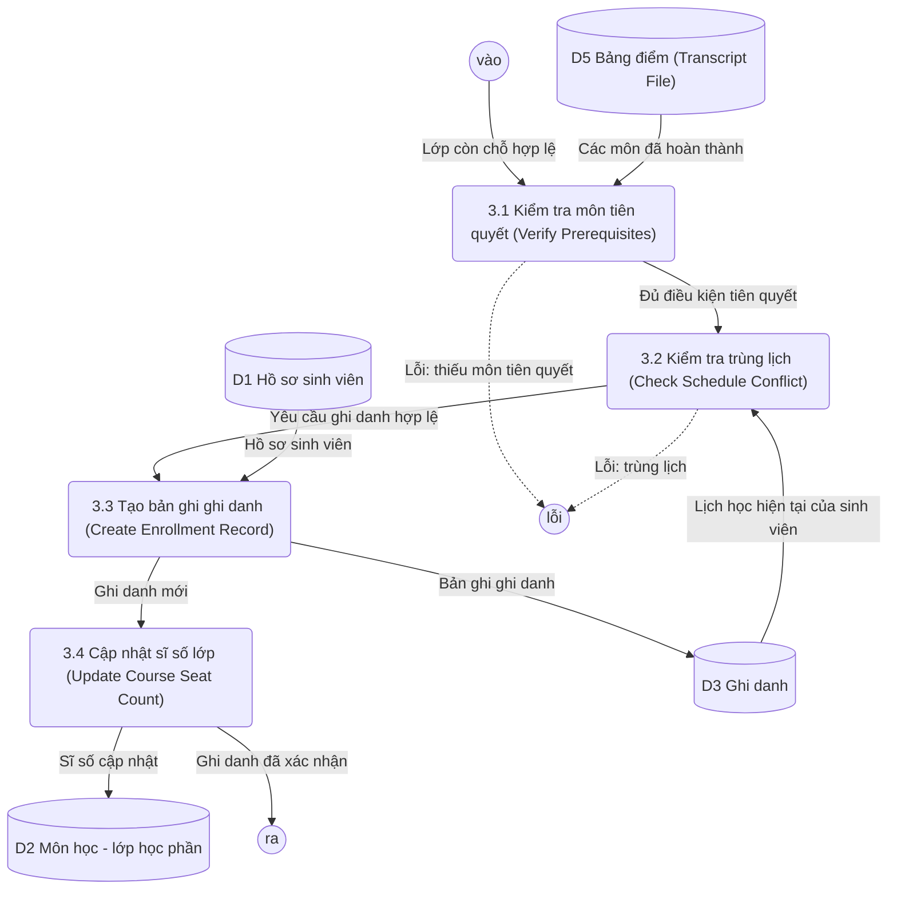
```mermaid
flowchart TD
    P31("3.1 Kiểm tra môn tiên quyết (Verify Prerequisites)")
    P32("3.2 Kiểm tra trùng lịch (Check Schedule Conflict)")
    P33("3.3 Tạo bản ghi ghi danh (Create Enrollment Record)")
    P34("3.4 Cập nhật sĩ số lớp (Update Course Seat Count)")
    D1[("D1 Hồ sơ sinh viên")]
    D2[("D2 Môn học - lớp học phần")]
    D3[("D3 Ghi danh")]
    D5[("D5 Bảng điểm (Transcript File)")]
    IN(("vào")) -->|"Lớp còn chỗ hợp lệ"| P31
    D5 -->|"Các môn đã hoàn thành"| P31
    P31 -.->|"Lỗi: thiếu môn tiên quyết"| ERR(("lỗi"))
    P31 -->|"Đủ điều kiện tiên quyết"| P32
    D3 -->|"Lịch học hiện tại của sinh viên"| P32
    P32 -.->|"Lỗi: trùng lịch"| ERR
    P32 -->|"Yêu cầu ghi danh hợp lệ"| P33
    D1 -->|"Hồ sơ sinh viên"| P33
    P33 -->|"Bản ghi ghi danh"| D3
    P33 -->|"Ghi danh mới"| P34
    P34 -->|"Sĩ số cập nhật"| D2
    P34 -->|"Ghi danh đã xác nhận"| OUT(("ra"))
```

Lưu ý các quy tắc được áp dụng: subprocess đánh số 3.1–3.4; input "Lớp còn chỗ hợp lệ" và output "Ghi danh đã xác nhận" **khớp parent** (vertical balancing); error line và data store mới (D5 Bảng điểm) chỉ xuất hiện ở mức con — đúng luật.

**c. Các phần "ẩn" với người quan sát ngoài (phải giả định):** (1) cách kiểm tra **môn tiên quyết** dựa vào bảng điểm; (2) kiểm tra **hold** tài chính/kỷ luật trước khi cho đăng ký; (3) logic **trùng lịch** giữa các lớp; (4) cách trường quản lý **giới hạn sĩ số** và danh sách chờ (waitlist); (5) quy tắc tính **học phí** theo số tín chỉ; (6) sự đồng bộ giữa hồ sơ sinh viên, file lớp học phần và file ghi danh; (7) yêu cầu chấp thuận của giảng viên/cố vấn học tập với một số môn.

### Bài 4 — Tìm lỗi trong DFD của Marilyn's Tours *(dựa trên hình 7.EX1 trong sách)*

**Đề:** Hình 7.EX1 là DFD level 1 vẽ tay cho hãng tour thác Niagara, gồm: các entity PRIVATE TRAVEL AGENT, AIRLINE TRAVEL AGENT, CASH PAYING TOURIST, TOURIST WITH CHARGE CARD, TOURIST; các process 1 CHECK CREDIT, 2 DETERMINE TOUR DESIRED, 3 MAKE RESERVATIONS; các kho D1 CREDIT HISTORY, D2 COST OF TOURS, D3 TRAVEL BROCHURES, D4 TRAVEL ITINERARY.

**a. Các lỗi tìm được:**
1. **Nhiều external entity trùng lặp/không nhất quán** cho cùng một đối tượng: TOURIST, CASH PAYING TOURIST, TOURIST WITH CHARGE CARD — cùng là "khách du lịch"; nên hợp nhất thành một entity TOURIST (được phép vẽ lặp để tránh cắt đường, nhưng phải **cùng tên**).
2. **External entity nối trực tiếp với external entity** (các travel agent ↔ tourist) — vi phạm quy tắc: giao tiếp giữa 2 entity không thuộc hệ thống, nếu hệ thống làm trung gian thì phải chèn process ở giữa.
3. **External entity nối trực tiếp với data store** (VD: agent/tourist lấy TRAVEL BROCHURES hoặc COST OF TOURS trực tiếp từ kho) — dữ liệu từ kho phải đi qua process.
4. **Dòng dữ liệu không được đặt nhãn** — mũi tên phải mang danh từ mô tả dữ liệu.
5. **Process thiếu input hoặc output** (VD: CHECK CREDIT chỉ nhận CREDIT HISTORY mà không trả kết quả ra; MAKE RESERVATIONS không ghi kết quả đặt chỗ vào kho nào) — mỗi process phải có ít nhất 1 vào và 1 ra.
6. **TRAVEL ITINERARY để dạng data store (D4)** trong khi bản chất là **output (data flow)** gửi cho khách — nhầm loại ký hiệu; tương tự TRAVEL BROCHURES thiên về dòng dữ liệu ra.
7. **Tên process quá chung / không đúng dạng verb–adjective–noun** và thiếu liên kết giữa các process (khách trả tiền mặt không cần CHECK CREDIT nhưng sơ đồ không thể hiện rẽ nhánh đó).

**b. Vẽ lại cho đúng** (hợp nhất entity, mọi dòng qua process, nhãn đầy đủ):

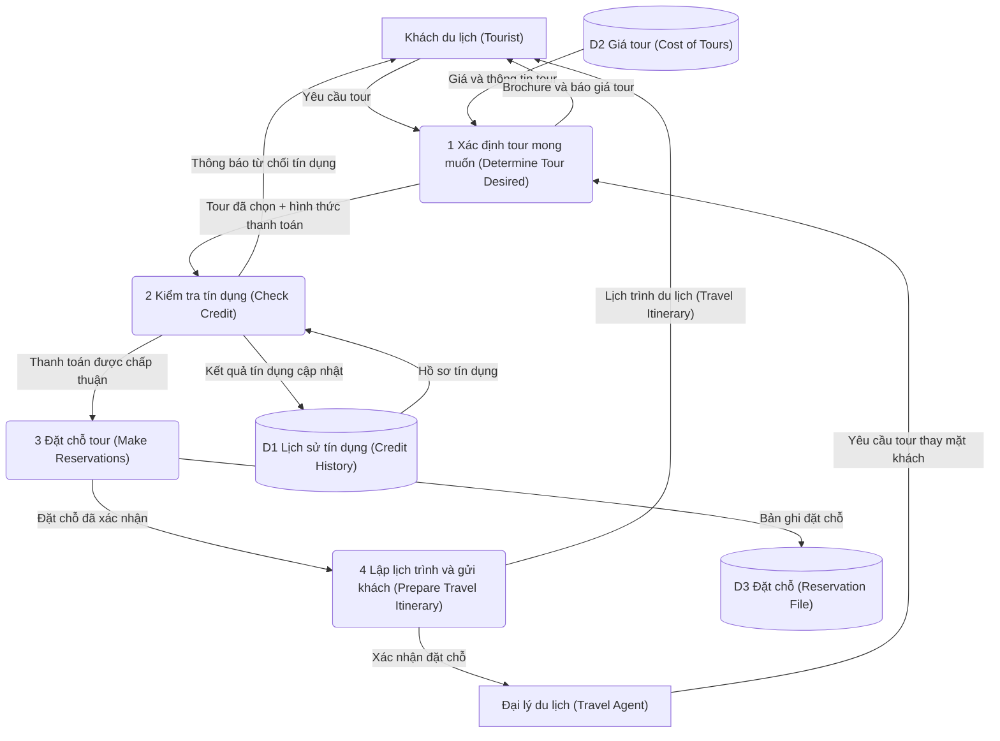
```mermaid
flowchart TD
    T["Khách du lịch (Tourist)"]
    TA["Đại lý du lịch (Travel Agent)"]
    P1("1 Xác định tour mong muốn (Determine Tour Desired)")
    P2("2 Kiểm tra tín dụng (Check Credit)")
    P3("3 Đặt chỗ tour (Make Reservations)")
    P4("4 Lập lịch trình và gửi khách (Prepare Travel Itinerary)")
    D1[("D1 Lịch sử tín dụng (Credit History)")]
    D2[("D2 Giá tour (Cost of Tours)")]
    D3[("D3 Đặt chỗ (Reservation File)")]
    T -->|"Yêu cầu tour"| P1
    TA -->|"Yêu cầu tour thay mặt khách"| P1
    D2 -->|"Giá và thông tin tour"| P1
    P1 -->|"Brochure và báo giá tour"| T
    P1 -->|"Tour đã chọn + hình thức thanh toán"| P2
    D1 -->|"Hồ sơ tín dụng"| P2
    P2 -->|"Kết quả tín dụng cập nhật"| D1
    P2 -->|"Thanh toán được chấp thuận"| P3
    P2 -->|"Thông báo từ chối tín dụng"| T
    P3 -->|"Bản ghi đặt chỗ"| D3
    P3 -->|"Đặt chỗ đã xác nhận"| P4
    P4 -->|"Lịch trình du lịch (Travel Itinerary)"| T
    P4 -->|"Xác nhận đặt chỗ"| TA
```

(Khách trả tiền mặt có thể đi thẳng nhánh P1 → P3 trong thực tế; ở mức này ta để P2 xử lý cả hai hình thức và chỉ tra tín dụng khi thanh toán bằng thẻ.)

### Bài 5 — KinLee Pizza: viết tóm tắt hoạt động nghiệp vụ

**Summary of Business Activities — KinLee Pizza:**
1. Khách quen gọi điện đặt hàng; nhân viên hỏi **số điện thoại**; nhập số vào máy thì **tên, địa chỉ, ngày đặt gần nhất** tự động hiện lên màn hình (khách mới → tạo hồ sơ khách mới).
2. Nhân viên **nhận đơn** (pizza, cánh gà) từ khách.
3. Hệ thống **tính tổng tiền** gồm thuế và phí giao hàng.
4. Đơn hàng được **chuyển cho bếp** để các đầu bếp chuẩn bị món.
5. **In hóa đơn (receipt)**; thỉnh thoảng in kèm **coupon** giảm giá cho lần đặt sau.
6. Khách **đến lấy (pick up)**: nhận receipt + coupon (nếu có) + đồ ăn; hoặc **tài xế giao hàng**: đưa khách bản sao receipt + coupon (nếu có).
7. **Tổng doanh số theo tuần** được lưu để so sánh với kết quả cùng kỳ năm trước.

### Bài 6 — Context diagram cho KinLee Pizza

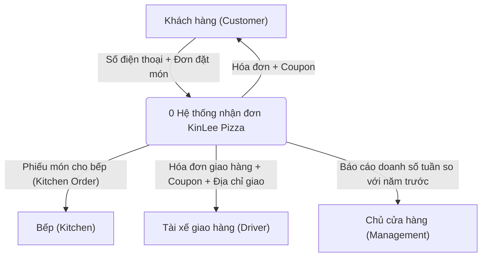
```mermaid
flowchart TD
    KH["Khách hàng (Customer)"]
    BEP["Bếp (Kitchen)"]
    TX["Tài xế giao hàng (Driver)"]
    QL["Chủ cửa hàng (Management)"]
    P0("0 Hệ thống nhận đơn KinLee Pizza")
    KH -->|"Số điện thoại + Đơn đặt món"| P0
    P0 -->|"Hóa đơn + Coupon"| KH
    P0 -->|"Phiếu món cho bếp (Kitchen Order)"| BEP
    P0 -->|"Hóa đơn giao hàng + Coupon + Địa chỉ giao"| TX
    P0 -->|"Báo cáo doanh số tuần so với năm trước"| QL
```

(Bếp và tài xế được coi là external entity vì họ nhận thông tin từ hệ thống ghi đơn; nếu coi bếp là bộ phận trong hệ thống thì có thể bỏ entity này ở phương án khác — ranh giới hệ thống là quyết định của analyst.)

### Bài 7 — Diagram 0 (logical) cho KinLee Pizza

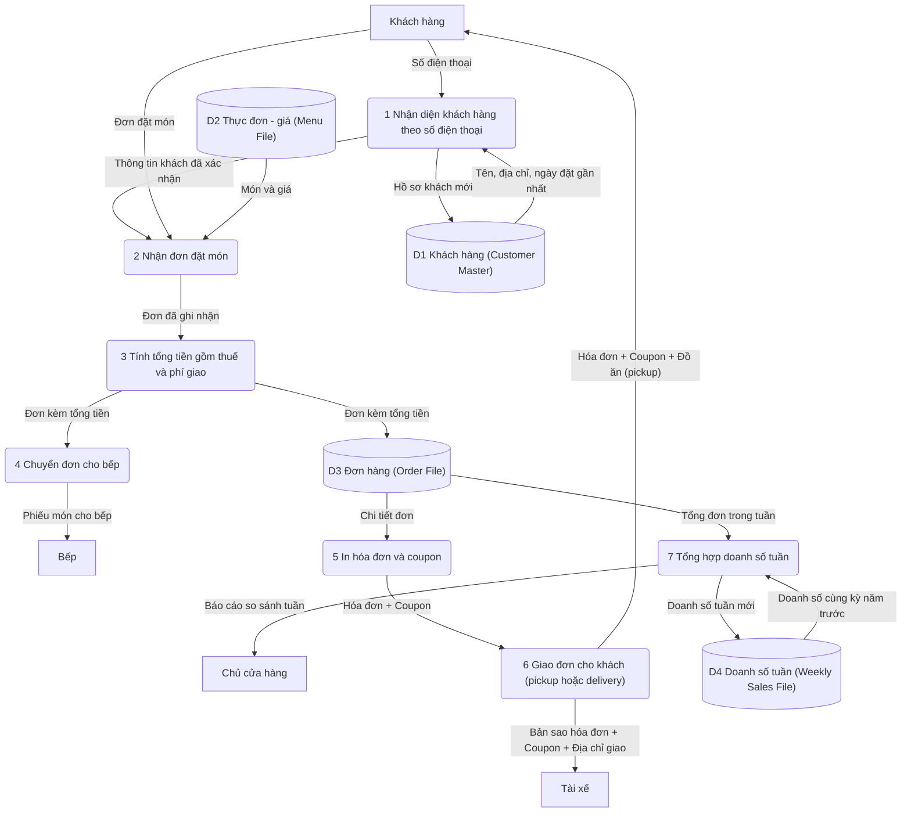
```mermaid
flowchart TD
    KH["Khách hàng"]
    BEP["Bếp"]
    TX["Tài xế"]
    QL["Chủ cửa hàng"]
    P1("1 Nhận diện khách hàng theo số điện thoại")
    P2("2 Nhận đơn đặt món")
    P3("3 Tính tổng tiền gồm thuế và phí giao")
    P4("4 Chuyển đơn cho bếp")
    P5("5 In hóa đơn và coupon")
    P6("6 Giao đơn cho khách (pickup hoặc delivery)")
    P7("7 Tổng hợp doanh số tuần")
    D1[("D1 Khách hàng (Customer Master)")]
    D2[("D2 Thực đơn - giá (Menu File)")]
    D3[("D3 Đơn hàng (Order File)")]
    D4[("D4 Doanh số tuần (Weekly Sales File)")]
    KH -->|"Số điện thoại"| P1
    D1 -->|"Tên, địa chỉ, ngày đặt gần nhất"| P1
    P1 -->|"Hồ sơ khách mới"| D1
    P1 -->|"Thông tin khách đã xác nhận"| P2
    KH -->|"Đơn đặt món"| P2
    D2 -->|"Món và giá"| P2
    P2 -->|"Đơn đã ghi nhận"| P3
    P3 -->|"Đơn kèm tổng tiền"| D3
    P3 -->|"Đơn kèm tổng tiền"| P4
    P4 -->|"Phiếu món cho bếp"| BEP
    D3 -->|"Chi tiết đơn"| P5
    P5 -->|"Hóa đơn + Coupon"| P6
    P6 -->|"Hóa đơn + Coupon + Đồ ăn (pickup)"| KH
    P6 -->|"Bản sao hóa đơn + Coupon + Địa chỉ giao"| TX
    D3 -->|"Tổng đơn trong tuần"| P7
    D4 -->|"Doanh số cùng kỳ năm trước"| P7
    P7 -->|"Doanh số tuần mới"| D4
    P7 -->|"Báo cáo so sánh tuần"| QL
```

### Bài 8 — Child diagram (logical) cho process thêm khách hàng mới

Phân rã process 1 (phần xử lý khách chưa từng đặt hàng — "Diagram 1"):

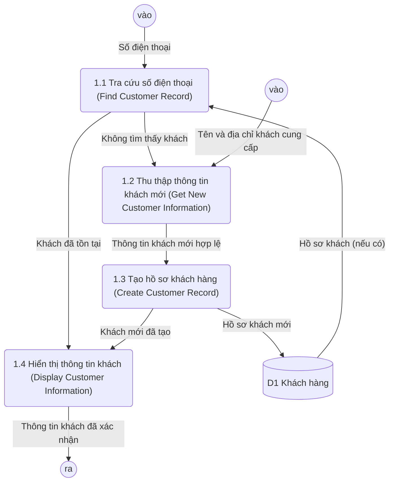
```mermaid
flowchart TD
    P11("1.1 Tra cứu số điện thoại (Find Customer Record)")
    P12("1.2 Thu thập thông tin khách mới (Get New Customer Information)")
    P13("1.3 Tạo hồ sơ khách hàng (Create Customer Record)")
    P14("1.4 Hiển thị thông tin khách (Display Customer Information)")
    D1[("D1 Khách hàng")]
    IN(("vào")) -->|"Số điện thoại"| P11
    D1 -->|"Hồ sơ khách (nếu có)"| P11
    P11 -->|"Khách đã tồn tại"| P14
    P11 -->|"Không tìm thấy khách"| P12
    IN2(("vào")) -->|"Tên và địa chỉ khách cung cấp"| P12
    P12 -->|"Thông tin khách mới hợp lệ"| P13
    P13 -->|"Hồ sơ khách mới"| D1
    P13 -->|"Khách mới đã tạo"| P14
    P14 -->|"Thông tin khách đã xác nhận"| OUT(("ra"))
```

Vertical balancing: input (số điện thoại, thông tin khách) và output ("Thông tin khách đã xác nhận", "Hồ sơ khách mới" vào D1) khớp với process 1 ở Diagram 0.

### Bài 9 — Physical DFD cho Diagram 0 (Bài 7)

Physical DFD thêm: process **thủ công (Manual)**, **tên file thật**, **màn hình/máy in**, **kho tạm**, controls:

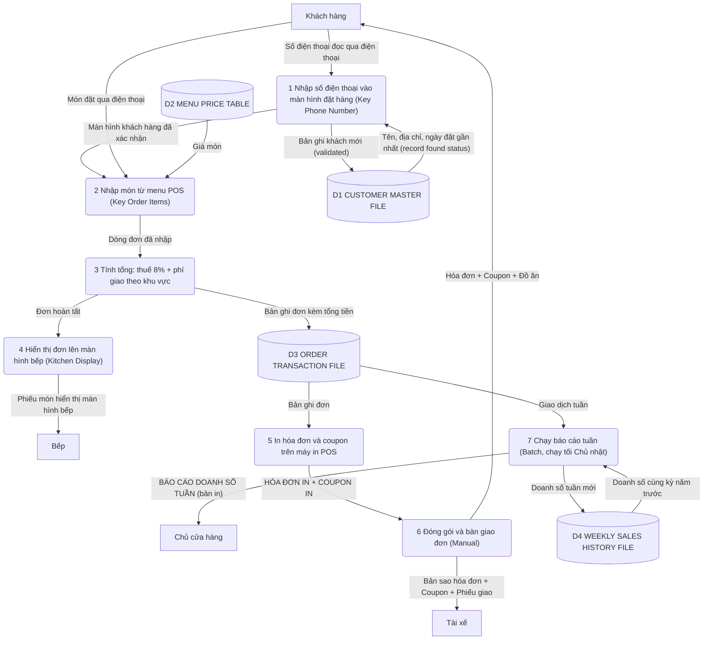
```mermaid
flowchart TD
    KH["Khách hàng"]
    BEP["Bếp"]
    TX["Tài xế"]
    QL["Chủ cửa hàng"]
    P1("1 Nhập số điện thoại vào màn hình đặt hàng (Key Phone Number)")
    P2("2 Nhập món từ menu POS (Key Order Items)")
    P3("3 Tính tổng: thuế 8% + phí giao theo khu vực")
    P4("4 Hiển thị đơn lên màn hình bếp (Kitchen Display)")
    P5("5 In hóa đơn và coupon trên máy in POS")
    P6("6 Đóng gói và bàn giao đơn (Manual)")
    P7("7 Chạy báo cáo tuần (Batch, chạy tối Chủ nhật)")
    D1[("D1 CUSTOMER MASTER FILE")]
    D2[("D2 MENU PRICE TABLE")]
    D3[("D3 ORDER TRANSACTION FILE")]
    D4[("D4 WEEKLY SALES HISTORY FILE")]
    KH -->|"Số điện thoại đọc qua điện thoại"| P1
    D1 -->|"Tên, địa chỉ, ngày đặt gần nhất (record found status)"| P1
    P1 -->|"Bản ghi khách mới (validated)"| D1
    P1 -->|"Màn hình khách hàng đã xác nhận"| P2
    KH -->|"Món đặt qua điện thoại"| P2
    D2 -->|"Giá món"| P2
    P2 -->|"Dòng đơn đã nhập"| P3
    P3 -->|"Bản ghi đơn kèm tổng tiền"| D3
    P3 -->|"Đơn hoàn tất"| P4
    P4 -->|"Phiếu món hiển thị màn hình bếp"| BEP
    D3 -->|"Bản ghi đơn"| P5
    P5 -->|"HÓA ĐƠN IN + COUPON IN"| P6
    P6 -->|"Hóa đơn + Coupon + Đồ ăn"| KH
    P6 -->|"Bản sao hóa đơn + Coupon + Phiếu giao"| TX
    D3 -->|"Giao dịch tuần"| P7
    D4 -->|"Doanh số cùng kỳ năm trước"| P7
    P7 -->|"Doanh số tuần mới"| D4
    P7 -->|"BÁO CÁO DOANH SỐ TUẦN (bản in)"| QL
```

**Điểm physical:** process 6 là **manual**; process 7 là **batch** chạy định kỳ (timing); D3 là **transaction file** nối các process chạy khác thời điểm (nhập đơn → in hóa đơn → báo cáo tuần); dòng dữ liệu gọi đúng tên bản in/màn hình; process 1 có control "record found status".

### Bài 10 — Physical DFD cho child diagram thêm khách mới (Bài 8)

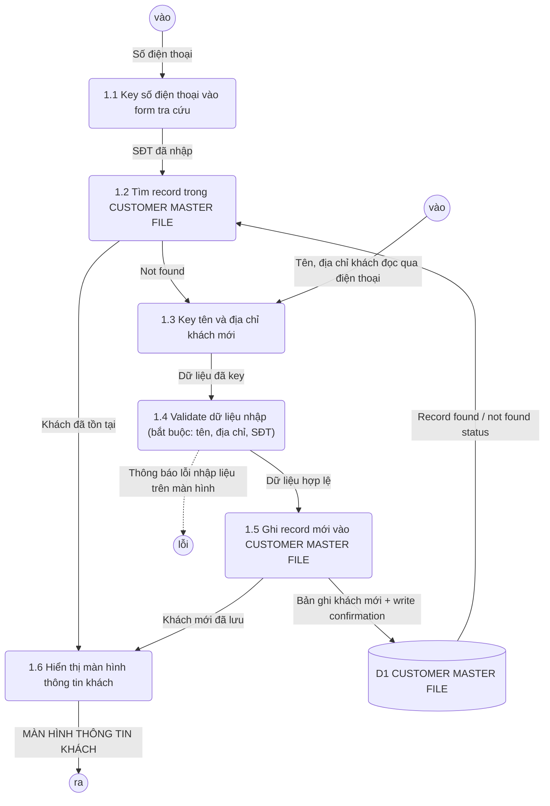
```mermaid
flowchart TD
    P11("1.1 Key số điện thoại vào form tra cứu")
    P12("1.2 Tìm record trong CUSTOMER MASTER FILE")
    P13("1.3 Key tên và địa chỉ khách mới")
    P14("1.4 Validate dữ liệu nhập (bắt buộc: tên, địa chỉ, SĐT)")
    P15("1.5 Ghi record mới vào CUSTOMER MASTER FILE")
    P16("1.6 Hiển thị màn hình thông tin khách")
    D1[("D1 CUSTOMER MASTER FILE")]
    IN(("vào")) -->|"Số điện thoại"| P11
    P11 -->|"SĐT đã nhập"| P12
    D1 -->|"Record found / not found status"| P12
    P12 -->|"Khách đã tồn tại"| P16
    P12 -->|"Not found"| P13
    IN2(("vào")) -->|"Tên, địa chỉ khách đọc qua điện thoại"| P13
    P13 -->|"Dữ liệu đã key"| P14
    P14 -.->|"Thông báo lỗi nhập liệu trên màn hình"| ERR(("lỗi"))
    P14 -->|"Dữ liệu hợp lệ"| P15
    P15 -->|"Bản ghi khách mới + write confirmation"| D1
    P15 -->|"Khách mới đã lưu"| P16
    P16 -->|"MÀN HÌNH THÔNG TIN KHÁCH"| OUT(("ra"))
```

Physical bổ sung so với logical: process **key/validate** riêng, **thông báo lỗi** (control), **write confirmation**, tên file và màn hình thật.

### Bài 11 — Partition physical DFD của Bài 7/9

- **Gộp process 1 + 2 + 3** vào **một chương trình nhận đơn (Order Entry)**: cùng người dùng (nhân viên nghe điện thoại), cùng thời điểm (trong một cuộc gọi), nhiệm vụ liên tục — giống World's Trend gộp process 1 và 2 (thêm khách mới ngay khi đặt đơn đầu).
- **Process 4 (màn hình bếp)** tách chương trình riêng: **nhóm người dùng khác** (đầu bếp) ở vị trí khác, cần màn hình riêng.
- **Process 5 (in hóa đơn/coupon)** có thể gộp với nhóm nhận đơn (in ngay khi chốt đơn — cùng thời điểm) hoặc để trigger từ bếp khi món xong; ở đây gộp với nhóm 1–3 vì chạy ngay sau khi chốt đơn.
- **Process 6** là **thủ tục thủ công** — nằm ngoài mọi partition chương trình.
- **Process 7 (báo cáo tuần)** tách thành **chương trình batch riêng**: chạy **khác thời điểm** (cuối tuần), khối lượng dữ liệu lớn, và để số liệu **nhất quán** (snapshot doanh số cả tuần).
- Nếu về sau nhận đơn online: trang nhập **thanh toán** phải partition riêng trên secure server (lý do **security**).

### Bài 12 — Child diagram cho process 6 trong Figure 7.17 *(dựa trên hình trong sách)*

Process 6 = **CREATE CUSTOMER STATEMENT**: nhận Customer Record (D1 Customer Master) + dữ liệu đơn đã ship, tạo **Customer Billing Statement** gửi khách mỗi tháng.

**a. Logical child diagram (Diagram 6):**

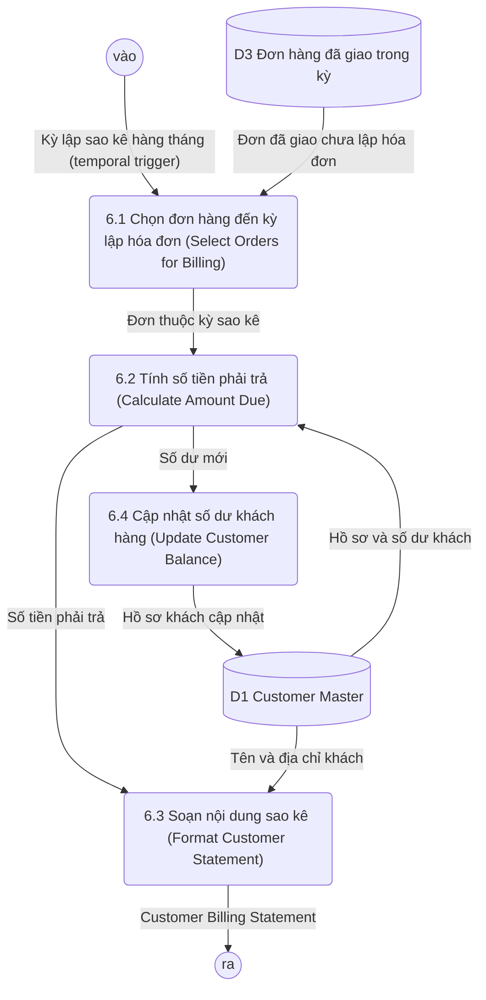
```mermaid
flowchart TD
    P61("6.1 Chọn đơn hàng đến kỳ lập hóa đơn (Select Orders for Billing)")
    P62("6.2 Tính số tiền phải trả (Calculate Amount Due)")
    P63("6.3 Soạn nội dung sao kê (Format Customer Statement)")
    P64("6.4 Cập nhật số dư khách hàng (Update Customer Balance)")
    D1[("D1 Customer Master")]
    D3[("D3 Đơn hàng đã giao trong kỳ")]
    IN(("vào")) -->|"Kỳ lập sao kê hàng tháng (temporal trigger)"| P61
    D3 -->|"Đơn đã giao chưa lập hóa đơn"| P61
    P61 -->|"Đơn thuộc kỳ sao kê"| P62
    D1 -->|"Hồ sơ và số dư khách"| P62
    P62 -->|"Số tiền phải trả"| P63
    P62 -->|"Số dư mới"| P64
    P64 -->|"Hồ sơ khách cập nhật"| D1
    D1 -->|"Tên và địa chỉ khách"| P63
    P63 -->|"Customer Billing Statement"| OUT(("ra"))
```

**b. Physical child diagram (Diagram 6, mức vật lý):** chạy **batch hàng tháng**: 6.1 READ CUSTOMER MASTER FILE tuần tự → 6.2 EXTRACT SHIPPED ORDER RECORDS FOR PERIOD (từ ORDER FILE) → 6.3 SORT STATEMENT RECORDS BY CUSTOMER NUMBER (ghi **SORTED STATEMENT FILE** — kho tạm) → 6.4 CALCULATE AMOUNT DUE AND UPDATE CUSTOMER BALANCE (control: update hoàn tất trước khi in) → 6.5 FORMAT STATEMENT LINES → 6.6 **PRINT CUSTOMER BILLING STATEMENT** (bản in gửi khách). Đặc trưng physical: trình tự bắt buộc (update trước khi in), file tạm sorted, tên file/bản in thật.

### Bài 13 — Physical DFD cho process 1.1 trong Figure 7.18 *(dựa trên hình trong sách)*

Process 1.1 = **VALIDATE CUSTOMER ACCOUNT** (input: Customer Order; đọc D1 Customer Master; output: Valid Customer Information; error: Customer Not Found):

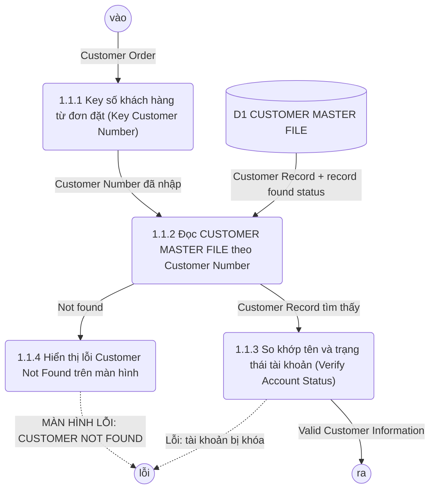
```mermaid
flowchart TD
    P111("1.1.1 Key số khách hàng từ đơn đặt (Key Customer Number)")
    P112("1.1.2 Đọc CUSTOMER MASTER FILE theo Customer Number")
    P113("1.1.3 So khớp tên và trạng thái tài khoản (Verify Account Status)")
    P114("1.1.4 Hiển thị lỗi Customer Not Found trên màn hình")
    D1[("D1 CUSTOMER MASTER FILE")]
    IN(("vào")) -->|"Customer Order"| P111
    P111 -->|"Customer Number đã nhập"| P112
    D1 -->|"Customer Record + record found status"| P112
    P112 -->|"Not found"| P114
    P114 -.->|"MÀN HÌNH LỖI: CUSTOMER NOT FOUND"| ERR(("lỗi"))
    P112 -->|"Customer Record tìm thấy"| P113
    P113 -->|"Valid Customer Information"| OUT(("ra"))
    P113 -.->|"Lỗi: tài khoản bị khóa"| ERR
```

### Bài 14 — Context diagram: hệ thống ghép người mua với nhà bán (real estate agent)

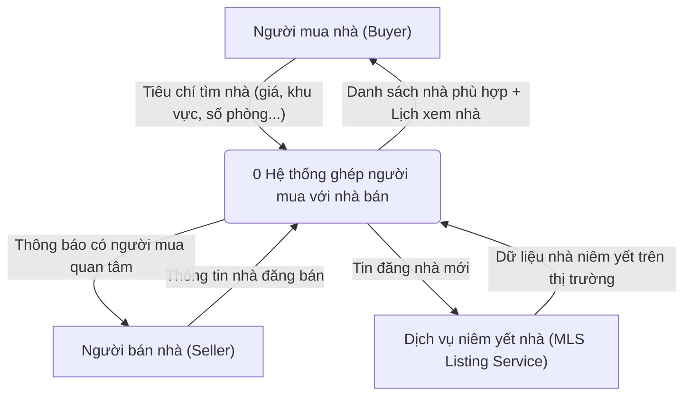
```mermaid
flowchart TD
    B["Người mua nhà (Buyer)"]
    S["Người bán nhà (Seller)"]
    MLS["Dịch vụ niêm yết nhà (MLS Listing Service)"]
    P0("0 Hệ thống ghép người mua với nhà bán")
    B -->|"Tiêu chí tìm nhà (giá, khu vực, số phòng...)"| P0
    P0 -->|"Danh sách nhà phù hợp + Lịch xem nhà"| B
    S -->|"Thông tin nhà đăng bán"| P0
    P0 -->|"Thông báo có người mua quan tâm"| S
    MLS -->|"Dữ liệu nhà niêm yết trên thị trường"| P0
    P0 -->|"Tin đăng nhà mới"| MLS
```

### Bài 15 — Diagram 0 (logical) cho Bài 14

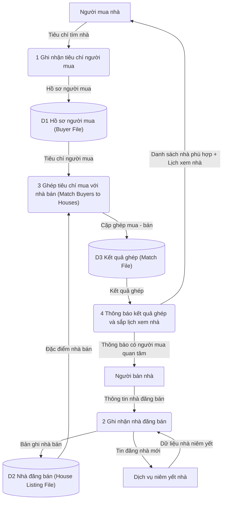
```mermaid
flowchart TD
    B["Người mua nhà"]
    S["Người bán nhà"]
    MLS["Dịch vụ niêm yết nhà"]
    P1("1 Ghi nhận tiêu chí người mua")
    P2("2 Ghi nhận nhà đăng bán")
    P3("3 Ghép tiêu chí mua với nhà bán (Match Buyers to Houses)")
    P4("4 Thông báo kết quả ghép và sắp lịch xem nhà")
    D1[("D1 Hồ sơ người mua (Buyer File)")]
    D2[("D2 Nhà đăng bán (House Listing File)")]
    D3[("D3 Kết quả ghép (Match File)")]
    B -->|"Tiêu chí tìm nhà"| P1
    P1 -->|"Hồ sơ người mua"| D1
    S -->|"Thông tin nhà đăng bán"| P2
    MLS -->|"Dữ liệu nhà niêm yết"| P2
    P2 -->|"Bản ghi nhà bán"| D2
    P2 -->|"Tin đăng nhà mới"| MLS
    D1 -->|"Tiêu chí người mua"| P3
    D2 -->|"Đặc điểm nhà bán"| P3
    P3 -->|"Cặp ghép mua - bán"| D3
    D3 -->|"Kết quả ghép"| P4
    P4 -->|"Danh sách nhà phù hợp + Lịch xem nhà"| B
    P4 -->|"Thông báo có người mua quan tâm"| S
```

### Bài 16 — Context diagram: hệ thống lập hóa đơn phòng khám nha (dental office billing)

```mermaid
flowchart TD
    PT["Bệnh nhân (Patient)"]
    IC["Công ty bảo hiểm (Insurance Company)"]
    P0("0 Hệ thống lập hóa đơn phòng khám nha")
    PT -->|"Thông tin điều trị + Thông tin bảo hiểm"| P0
    P0 -->|"Hóa đơn phần bệnh nhân tự trả (Patient Statement)"| PT
    PT -->|"Khoản thanh toán của bệnh nhân"| P0
    P0 -->|"Yêu cầu bồi hoàn bảo hiểm (Insurance Claim)"| IC
    IC -->|"Khoản chi trả + Thông báo giải quyết quyền lợi (EOB)"| P0
```

### Bài 17 — Diagram 0 (logical) cho Bài 16

```mermaid
flowchart TD
    PT["Bệnh nhân"]
    IC["Công ty bảo hiểm"]
    P1("1 Ghi nhận dịch vụ điều trị đã thực hiện")
    P2("2 Lập yêu cầu bồi hoàn bảo hiểm (Prepare Insurance Claim)")
    P3("3 Ghi nhận khoản chi trả của bảo hiểm")
    P4("4 Lập hóa đơn phần bệnh nhân tự trả")
    P5("5 Ghi nhận thanh toán của bệnh nhân")
    D1[("D1 Hồ sơ bệnh nhân (Patient Master)")]
    D2[("D2 Dịch vụ điều trị (Treatment File)")]
    D3[("D3 Công nợ (Accounts Receivable)")]
    PT -->|"Thông tin điều trị + Thông tin bảo hiểm"| P1
    P1 -->|"Bản ghi điều trị"| D2
    P1 -->|"Thông tin bảo hiểm cập nhật"| D1
    D2 -->|"Dịch vụ chưa yêu cầu bồi hoàn"| P2
    D1 -->|"Thông tin hợp đồng bảo hiểm"| P2
    P2 -->|"Insurance Claim"| IC
    IC -->|"Khoản chi trả + EOB"| P3
    P3 -->|"Số tiền bảo hiểm đã trả"| D3
    D3 -->|"Số dư còn lại sau bảo hiểm"| P4
    D1 -->|"Tên và địa chỉ bệnh nhân"| P4
    P4 -->|"Patient Statement"| PT
    PT -->|"Khoản thanh toán"| P5
    P5 -->|"Công nợ cập nhật"| D3
```

### Bài 18 — Event Response Table cho World's Trend

| # | Event | Source | Trigger | Activity | Response | Destination |
|---|---|---|---|---|---|---|
| 1 | Khách gửi đơn đặt hàng | Customer | Customer Order (điện thoại/mail/web) | Kiểm tra khách và mặt hàng; xác định số lượng khả dụng; cập nhật Item Master; tính tổng đơn; tạo Pending Order | Back-Ordered Item (nếu hết hàng) | Inventory Control Department |
| 2 | Khách mới đặt hàng lần đầu | Customer | New Customer Information | Tạo record mới trong Customer Master | Xác nhận khách mới | Customer |
| 3 | Đơn hàng sẵn sàng soạn | Internal | Pending Order | Tạo picking slips từ đơn hàng | Order Picking List | Warehouse |
| 4 | Chuẩn bị gửi hàng | Internal | Pending Order | Chuẩn bị shipping statement, lấy đúng địa chỉ khách | Customer Shipping Statement | (process Ship) |
| 5 | Kho giao hàng ra | Warehouse | Order Goods + Fulfillment Items | Khớp hàng với shipping statement và ship cho khách | Shipped Order | Customer |
| 6 | Đến kỳ lập sao kê | **Temporal, hàng tháng** | Kỳ billing tháng | Tạo customer statement từ Customer Master và đơn đã giao | Customer Billing Statement | Customer |
| 7 | Đến kỳ báo cáo công nợ | **Temporal** | Kỳ báo cáo | Tổng hợp công nợ phải thu | Accounts Receivable Report | Accounting Department |
| 8 | Khách hỏi thông tin hàng | Customer | Item Number or Description | Tra Item Master, trả thông tin hàng | Item Information | Customer |

Mỗi hàng ứng với một process của Diagram 0 (Figure 7.17); ghép các fragment lại chính là Diagram 0.

### Bài 19 — Use case cho 7 process của World's Trend

(Format rút gọn: Name / ID / Trigger — type / Input ← Source / Output → Destination / Các bước chính.)

1. **Add Customer Order — ID 1.** Trigger: khách gửi đơn (External). Input: Customer Order ← Customer. Output: Back-Ordered Item → Inventory Control; Pending Order → process 3/4. Steps: validate customer account → validate order item → xác định số lượng khả dụng (hết → báo back-order) → cập nhật item quantity → tính order totals (dùng Shipping & Handling Table) → cập nhật customer record → tạo pending order.
2. **Add Customer Record — ID 2.** Trigger: đơn đến từ khách chưa có hồ sơ (External). Input: New Customer Information ← Customer. Output: Customer Record → D1 Customer Master. Steps: kiểm tra khách chưa tồn tại → nhập thông tin tên/địa chỉ → tạo record mới → xác nhận.
3. **Produce Picking Slips — ID 3.** Trigger: có pending order (Internal/tiếp nối). Input: Pending Order; Item Record ← D2. Output: Order Picking List → Warehouse. Steps: đọc item record → tạo order item record → sắp xếp theo vị trí trong kho → lấy customer record → format và in picking slip.
4. **Prepare Shipping Statement — ID 4.** Trigger: pending order đã có picking slip. Input: Pending Order; Customer Name and Address ← D1. Output: Customer Shipping Statement → process 5. Steps: lấy địa chỉ khách → soạn shipping statement khớp đơn.
5. **Ship Customer Order — ID 5.** Trigger: kho xuất hàng (External — Warehouse). Input: Order Goods, Fulfillment Items ← Warehouse; Customer Shipping Statement. Output: Shipped Order → Customer. Steps: khớp hàng với statement → đóng gói → gửi khách.
6. **Create Customer Statement — ID 6.** Trigger: **Temporal — hàng tháng**. Input: Customer Record ← D1; đơn đã giao. Output: Customer Billing Statement → Customer. Steps: chọn đơn trong kỳ → tính số phải trả → format → gửi sao kê.
7. **Produce Accounts Receivable — ID 7.** Trigger: **Temporal — theo kỳ báo cáo**. Input: Customer Record (số dư) ← D1. Output: Accounts Receivable Report → Accounting Department. Steps: tổng hợp công nợ mọi khách → lập báo cáo.

### Bài 20 — CRUD matrix cho các file của World's Trend

| Activity \\ File | Customer Master (D1) | Item Master (D2) | Pending Order |
|---|---|---|---|
| 1 Add Customer Order | R, U | R, U | **C** |
| 2 Add Customer Record | **C** | | |
| 3 Produce Picking Slips | R | R | R |
| 4 Prepare Shipping Statement | R | | R, U |
| 5 Ship Customer Order | R | | U (đánh dấu đã giao) |
| 6 Create Customer Statement | R, U (số dư) | | R |
| 7 Produce Accounts Receivable | R | | R |
| 8 Query Item Information | | R | |

Nhận xét kiểm tra CRUD: mỗi master file phải đủ C-R-U-D trong toàn hệ thống — hiện **thiếu Delete** (xóa khách ngừng giao dịch, xóa mặt hàng ngừng bán, xóa đơn đã hoàn tất lâu) → gợi ý bổ sung các process bảo trì file (maintenance) khi thiết kế hệ thống thật.

### Bài 21 — Partitioning các process của Bài 18

- **Gộp process 1 + 2 + 8** vào **một chương trình online nhận đơn**: process 2 xảy ra ngay lúc khách mới đặt đơn đầu tiên (cùng thời điểm — như sách gợi ý gộp 1 và 2); process 8 (tra cứu hàng) phục vụ chính nhân viên nhận đơn khi khách hỏi — **similar tasks + cùng nhóm người dùng**.
- **Process 3 và 4 tách thành 2 chương trình batch riêng**: cả hai là batch (có computer input/output) nhưng **chạy khác thời điểm** — đúng phân tích của Figure 7.20.
- **Process 5** phần lớn **thủ công** (kho lấy hàng, khớp statement, gửi hàng) — không thuộc partition chương trình; phần ghi nhận "đã giao" là một chương trình nhỏ ở kho (**nhóm người dùng khác, địa điểm khác**).
- **Gộp process 6 + 7** vào **một chương trình batch tháng**: cùng dùng dữ liệu công nợ/đơn đã giao (**efficiency** — chung file input lớn) và chạy cùng snapshot để sao kê khách khớp báo cáo kế toán (**consistency of data**).

### Bài 22 — Physical child diagram: câu lạc bộ chạy bộ, process 1 ADD NEW MEMBERS

Đề cho các bước: (a) key thông tin hội viên mới; (b) validate, lỗi hiện lên màn hình; (c) dữ liệu hợp lệ → màn hình xác nhận, cán bộ CLB nhìn-xác nhận rồi accept hoặc cancel; (d) giao dịch được accept → thêm vào MEMBERSHIP MASTER trên SSD laptop; (e) giao dịch accept đồng thời ghi vào MEMBERSHIP JOURNAL trên SSD thứ hai.

```mermaid
flowchart TD
    OFF["Cán bộ câu lạc bộ (Club Officer)"]
    P11("1.1 Key thông tin hội viên mới (Key New Member Information)")
    P12("1.2 Validate thông tin nhập (Validate Member Information)")
    P13("1.3 Hiển thị màn hình xác nhận và chờ accept hoặc cancel (Manual visual confirm)")
    P14("1.4 Thêm hội viên vào MEMBERSHIP MASTER (SSD laptop)")
    P15("1.5 Ghi giao dịch vào MEMBERSHIP JOURNAL (SSD thứ hai)")
    D1[("D1 MEMBERSHIP MASTER - SSD 1")]
    D2[("D2 MEMBERSHIP JOURNAL - SSD 2")]
    OFF -->|"Thông tin hội viên mới (form giấy tại buổi họp)"| P11
    P11 -->|"Dữ liệu đã key"| P12
    P12 -.->|"MÀN HÌNH LỖI NHẬP LIỆU"| OFF
    P12 -->|"Dữ liệu hợp lệ"| P13
    P13 -->|"MÀN HÌNH XÁC NHẬN"| OFF
    OFF -->|"Accept hoặc Cancel"| P13
    P13 -->|"Giao dịch được accept"| P14
    P14 -->|"Bản ghi hội viên mới"| D1
    P14 -->|"Giao dịch đã ghi master"| P15
    P15 -->|"Bản ghi journal (audit trail)"| D2
```

Đặc trưng physical thể hiện đủ yêu cầu đề: process key + validate riêng, **error line ra màn hình**, bước xác nhận **thủ công bằng mắt** (accept/cancel), tên file và thiết bị lưu trữ thật (**SSD 1, SSD 2**), journal file là **control** bảo mật/audit điển hình của physical DFD.

### Ghi chú Group Projects (gợi ý ngắn)

Bốn bài nhóm về **Maverick Transport** (đã giới thiệu ở Chương 4) lặp lại đúng quy trình 7 bước của chương: (1) chọn **một mảng chức năng** (VD: điều phối xe – dispatch) thay vì mô hình hóa cả công ty, vẽ context diagram; (2) explode thành level 0 logical DFD, **liệt kê các giả định**; (3) chọn một process chủ chốt explode thành logical child diagram, ghi **danh sách câu hỏi follow-up** cho phần còn mù mờ; (4) từ đó vẽ physical DFD cho một phần hệ thống đề xuất (thêm manual/automated, tên file, controls).

---

*Hết Chương 7. Chương tiếp theo: Chapter 8 — Analyzing Systems Using Data Dictionaries (dùng DFD đã vẽ để lập từ điển dữ liệu).*
