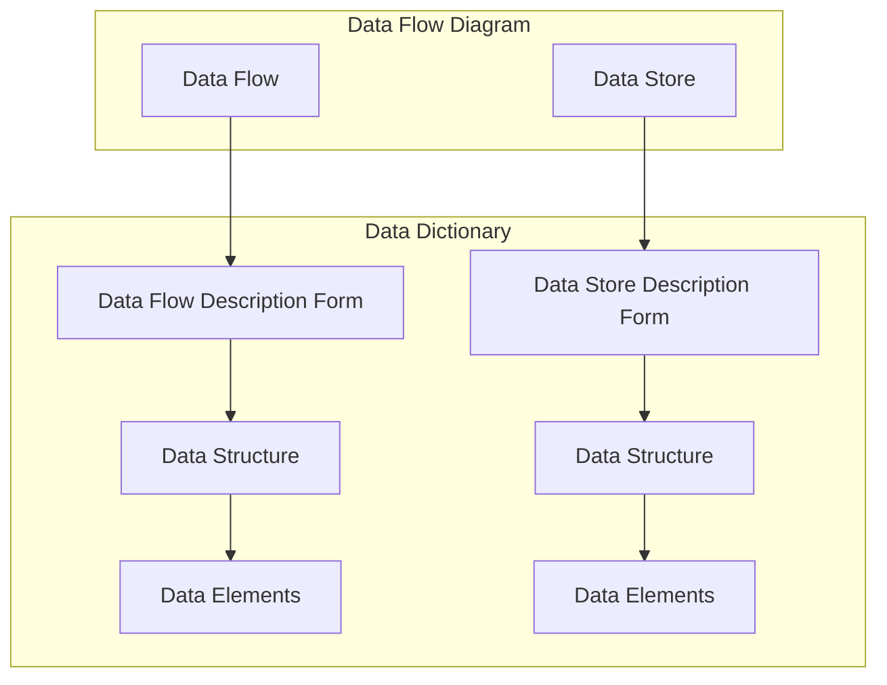
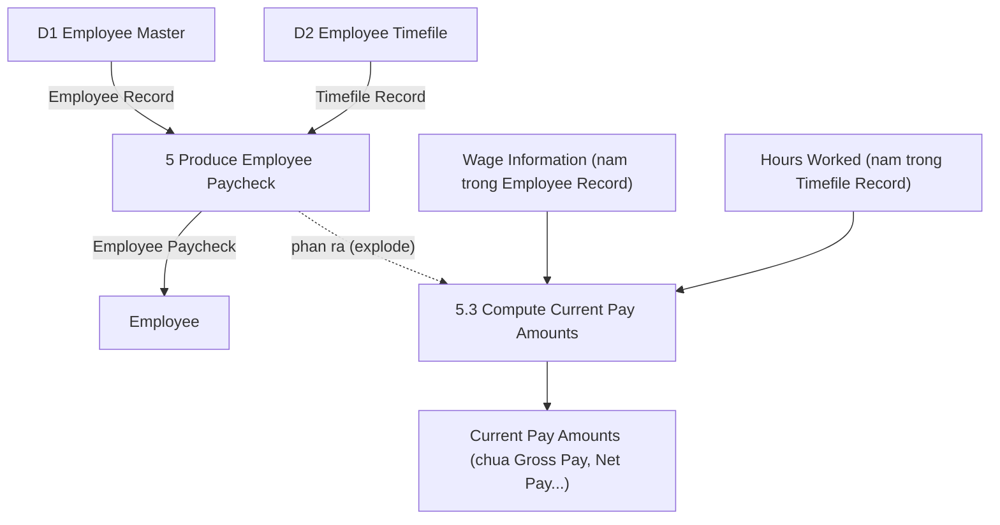
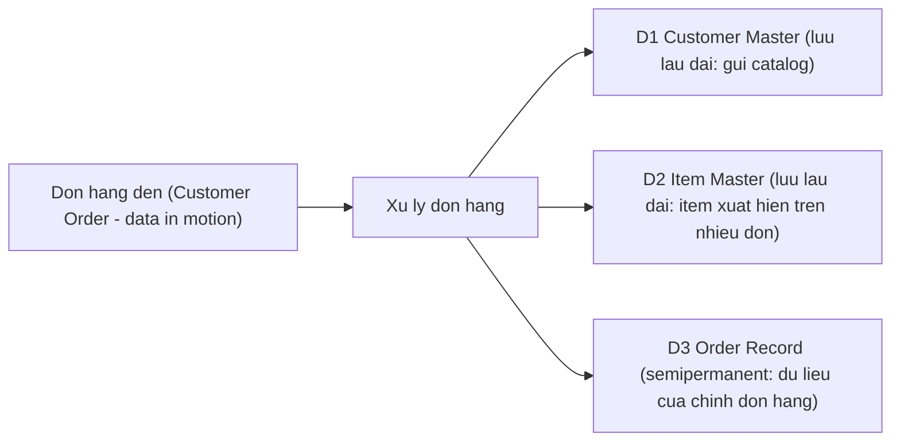
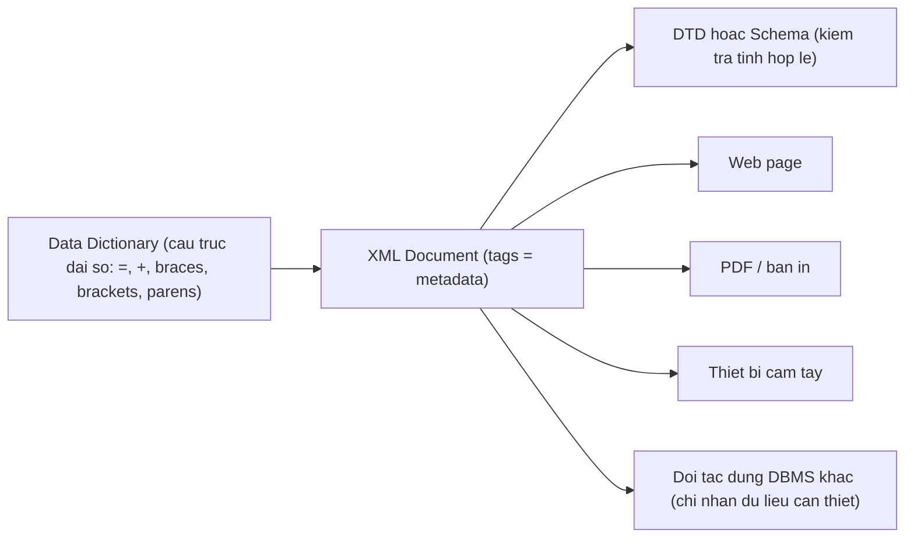

# Chương 8 — Analyzing Systems Using Data Dictionaries (Phân tích hệ thống bằng từ điển dữ liệu)

> Nguồn: Kendall & Kendall, *Systems Analysis and Design*, 11th edition — Chapter 8 (trang 237–258).

---

## 🎯 Mục tiêu học tập

Sau khi học xong chương này, bạn có thể:

1. **Hiểu data dictionary (từ điển dữ liệu) là gì** và tại sao systems analyst phải hiểu cách nó được xây dựng, dù đã có công cụ tự động.
2. **Hiểu khái niệm data repository (kho lưu trữ dự án)** — tập hợp thông tin dự án lớn hơn data dictionary — và những gì nó chứa.
3. **Tạo được các mục từ điển dữ liệu** cho: data flows (dòng dữ liệu), data structures (cấu trúc dữ liệu), data elements (phần tử dữ liệu) và data stores (kho dữ liệu), bằng ký hiệu đại số chuẩn `=`, `+`, `{}`, `[]`, `()`.
4. **Phân biệt** logical vs physical data structure, base vs derived element, structural record vs element.
5. **Biết cách xây dựng data dictionary từ DFD** theo hướng top-down, phân tích input/output, phát triển data stores, và dùng từ điển để kiểm tra tính đầy đủ/chính xác của thiết kế.
6. **Dùng data dictionary để tạo XML**, hiểu Document Type Definition (DTD) và XML Schema để trao đổi dữ liệu giữa các hệ thống khác nhau.

---

## 📖 Tóm tắt & giải thích kiến thức

### 1. Data Dictionary là gì?

**Data dictionary (từ điển dữ liệu)** là một tài liệu tham chiếu chứa **dữ liệu về dữ liệu** — gọi là **metadata (siêu dữ liệu)** — về mọi process, data store, data flow, data structure và element (logic lẫn vật lý) trong hệ thống đang nghiên cứu. Giống như từ điển thường mô tả *từ ngữ*, data dictionary mô tả *dữ liệu*: nó thu thập, điều phối các thuật ngữ dữ liệu và **xác nhận mỗi thuật ngữ có ý nghĩa gì** đối với những người khác nhau trong tổ chức.

Nhiều hệ quản trị CSDL (DBMS) ngày nay đi kèm data dictionary **tự động hóa** — có loại tự động catalog các data item khi lập trình, có loại chỉ cung cấp template để người dùng điền theo cách thống nhất.

**Lý do quan trọng để duy trì data dictionary: giữ dữ liệu "sạch" (clean data)** — tức dữ liệu phải **nhất quán**. Ví dụ trong sách: nếu khách hàng bên ngoài (external customer) được lưu là `"Ext"` ở record này, `"E"` ở record khác, và số `1` ở record thứ ba → dữ liệu không sạch. Data dictionary giúp tránh điều đó.

**Vì sao analyst vẫn phải hiểu data dictionary dù đã có công cụ tự động?** Vì hiểu quá trình biên soạn giúp analyst **hình dung được hệ thống và cách nó hoạt động**. DFD (Chương 7) là điểm khởi đầu tuyệt vời để thu thập các mục cho từ điển.

**Ngoài việc cung cấp tài liệu và loại bỏ dư thừa (redundancy), data dictionary được dùng để:**

1. **Validate DFD** — kiểm tra tính đầy đủ và chính xác của sơ đồ dòng dữ liệu.
2. **Làm điểm khởi đầu** để phát triển màn hình (screens) và báo cáo (reports).
3. **Xác định nội dung dữ liệu** được lưu trong các file.
4. **Phát triển logic** cho các process trong DFD.
5. **Tạo XML** (Extensible Markup Language).

### 2. Data Repository (kho lưu trữ dự án)

Data dictionary chứa thông tin về dữ liệu và thủ tục; còn **repository** là **tập hợp thông tin dự án lớn hơn**. Một lợi ích của CASE tool là khả năng xây dựng repository **chia sẻ** giữa các thành viên nhóm. Repository có thể chứa:

1. **Thông tin về dữ liệu** hệ thống duy trì: data flows, data stores, record structures, elements, entities, messages.
2. **Procedural logic** (logic thủ tục) và **use cases**.
3. **Thiết kế màn hình và báo cáo** (screen and report design).
4. **Quan hệ dữ liệu** — cách một data structure liên kết với structure khác.
5. **Yêu cầu dự án** (project requirements) và **sản phẩm bàn giao cuối cùng** (final system deliverables).
6. **Thông tin quản lý dự án**: lịch bàn giao, thành tựu, vấn đề cần giải quyết, người dùng dự án.

> Bốn hạng mục cốt lõi của data dictionary cần phát triển: **data flows, data structures, data elements, data stores**. (Procedural logic ở Chương 9, entities ở Chương 13, messages/use cases ở Chương 2 & 10.)

Data dictionary được tạo bằng cách **khảo sát và mô tả nội dung của data flows, data stores và processes**: mỗi data store/data flow được định nghĩa, rồi mở rộng ra chi tiết các element bên trong; logic của mỗi process được mô tả bằng dữ liệu chảy vào/ra process đó; các thiếu sót và lỗi thiết kế được ghi nhận và giải quyết.



*Sơ đồ: quan hệ DFD ↔ data dictionary (theo Figure 8.1) — mỗi data flow/data store trên DFD trỏ tới một form mô tả, form trỏ tới data structure, structure phân rã thành elements.*

**Ví dụ xuyên suốt chương: World's Trend Catalog Division** — công ty bán quần áo qua thư đặt hàng (mail order), điện thoại miễn phí/fax, và web form. Dù đơn hàng đến từ kênh nào, dữ liệu nền tảng đều giống nhau: tên, địa chỉ, điện thoại người đặt; chi tiết đơn (mô tả mặt hàng, size, màu, giá, số lượng...); phương thức thanh toán.

### 3. Defining the Data Flows (Định nghĩa dòng dữ liệu)

**Data flows thường là thành phần được định nghĩa ĐẦU TIÊN.** Analyst xác định input/output của hệ thống qua phỏng vấn, quan sát người dùng, phân tích tài liệu và hệ thống hiện hữu. Mỗi data flow được tóm tắt trên một **form** gồm **9 mục**:

1. **ID** (tùy chọn) — có thể mã hóa theo hệ thống và ứng dụng.
2. **Tên mô tả duy nhất** — chính là text xuất hiện trên sơ đồ, được tham chiếu trong mọi mô tả.
3. **Mô tả chung** về data flow.
4. **Source (nguồn)** — external entity, process, hoặc data flow từ data store.
5. **Destination (đích)** — cùng các loại như source.
6. **Loại data flow** — là record vào/ra một **file**, hay chứa một **report/form/screen**; nếu dữ liệu chỉ dùng **giữa các process** → đánh dấu **internal**.
7. **Tên data structure** mô tả các element trong dòng này (flow đơn giản có thể chỉ 1 hoặc vài element).
8. **Volume/time (khối lượng theo thời gian)** — vd: số record mỗi ngày/giờ.
9. **Comments** — ghi chú thêm.

**Ví dụ (Figure 8.3)** — data flow `CUSTOMER ORDER` của World's Trend: Source = external entity **CUSTOMER**, Destination = **PROCESS 1** (liên kết ngược về DFD); ô "Screen" được tick → flow này là màn hình nhập liệu (web page, GUI, mobile, mainframe...); Data structure = `Order Information`; Volume = `10/hour`.

**Thứ tự mô tả:** mô tả **input/output trước** (vì chúng đại diện giao diện với con người), sau đó đến các dòng trung gian và các dòng vào/ra data store. Chi tiết mỗi flow được mô tả bằng **elements** (còn gọi là fields), **data structure**, hoặc nhóm elements. Flow đơn giản có thể chỉ là 1 element — vd: `Customer Number` mà chương trình tra cứu dùng để tìm record khách hàng.

### 4. Describing Data Structures (Mô tả cấu trúc dữ liệu) — ký hiệu đại số

Data structures được mô tả bằng **algebraic notation (ký hiệu đại số)**, cho phép analyst thể hiện các element cấu thành, nhóm lặp, phần tử loại trừ lẫn nhau, phần tử tùy chọn:

| Ký hiệu | Ý nghĩa |
|---|---|
| `=` | **"is composed of"** — được cấu thành từ |
| `+` | **"and"** — và |
| `{ }` | **Repeating group / lặp lại** (còn gọi repeating groups hay tables). Có thể 1 hoặc nhiều element lặp; có thể kèm điều kiện: số lần lặp cố định, hoặc giới hạn trên/dưới |
| `[ ]` | **Either/or** — chọn MỘT trong các phương án, **loại trừ lẫn nhau** (mutually exclusive), phân tách bằng `|` |
| `( )` | **Optional (tùy chọn)** — có thể bỏ trống trên màn hình nhập; có thể chứa space/zero trong file |
| `*  *` | Comment / chú thích |

**Ví dụ cụ thể (Figure 8.4) — cấu trúc màn hình thêm đơn hàng khách:**

```
Customer Order = Customer Number +
                 Customer Name +
                 Address +
                 Telephone +
                 Catalog Number +
                 Order Date +
                 {Available Order Items} +
                 Merchandise Total +
                 (Tax) +
                 Shipping and Handling +
                 Order Total +
                 Method of Payment +
                 (Card Type) + (Card Number) + (Expiration Date)

Customer Name = First Name + (Middle Initial) + Last Name
Address       = Street + (Apartment) + City + State + Zip +
                (Zip Expansion) + (Country)
Telephone     = Area Code + Local Number
Available Order Items = Quantity Ordered + Item Number + Item Description +
                        Size + Color + Price + Item Total
Method of Payment = [Credit Card | Debit Card]
Card Type = [World's Trend | American Express | MasterCard | Visa]
```

Đọc ví dụ: `Customer Order` **được cấu thành từ** các mục bên phải dấu `=`. `(Tax)` là tùy chọn (đơn có thể miễn thuế). `{Available Order Items}` là nhóm lặp (nhiều dòng hàng). `Method of Payment` là **hoặc** thẻ tín dụng **hoặc** thẻ ghi nợ — không thể cả hai.

#### Structural Records (bản ghi cấu trúc)

Một số mục bên phải dấu `=` không phải element đơn mà là **nhóm elements** — gọi là **structural record**. Vd: `CUSTOMER NAME` = `FIRST NAME + MIDDLE INITIAL + LAST NAME`. **Mỗi structural record phải được định nghĩa tiếp cho đến khi toàn bộ phân rã hết thành elements thành phần.** Ngay cả `TELEPHONE NUMBER` cũng định nghĩa thành structure để `Area Code` có thể xử lý riêng.

Structural records và elements dùng trong nhiều hệ thống được đặt **tên không gắn với hệ thống cụ thể** (non-system-specific), vd `street`, `city`, `zip` — không phản ánh khu vực chức năng — để **định nghĩa một lần, dùng lại ở nhiều ứng dụng** (city có thể là customer city, supplier city, employee city).

#### Logical vs Physical Data Structures

- **Logical design:** khi mới định nghĩa, chỉ gồm các element **người dùng nhìn thấy** (tên, địa chỉ, số dư...) — thể hiện dữ liệu doanh nghiệp cần cho vận hành hằng ngày; phải phản ánh đúng **mental model** của người dùng (bài học từ HCI).
- **Physical design:** dựa trên logical, thêm các element cần cho **cài đặt hệ thống**:
  1. **Key fields** để định vị record trong bảng CSDL (vd item number — doanh nghiệp không cần nhưng máy tính cần).
  2. **Codes** nhận diện trạng thái master record (vd nhân viên active/inactive).
  3. **Transaction codes** phân biệt loại record khi 1 file chứa nhiều loại (vd file công nợ chứa cả record hàng trả lẫn record thanh toán).
  4. **Số đếm** (count) phần tử trong repeating group.
  5. **Giới hạn** (limits) số phần tử trong repeating group.
  6. **Password** khách dùng khi truy cập website bảo mật.

**Ví dụ (Figure 8.5) — hóa đơn khách hàng, có repeating group giới hạn 1–5:**

```
Customer Billing Statement = Current Date +
                             Customer Number +
                             Customer Name +
                             Address +
                             1{Order Line}5 +
                             (Previous Payment Amount) +
                             Total Amount Owed +
                             (Comment)
Order Line = Order Number + Order Date + Order Total
```

`1{Order Line}5` nghĩa là `ORDER LINE` vừa là **repeating item** vừa là **structural record**, lặp **từ 1 đến 5 lần** (khách đặt tối đa 5 mặt hàng trên màn hình này; thêm nữa thì sang đơn kế tiếp).

**Các dạng ký hiệu lặp khác:**
- Lặp cố định: `12{Monthly Sales}` — lặp đúng 12 lần (mỗi tháng một lần).
- Không ghi số → lặp **vô hạn định**: `Customer Master Table = {Customer Records}`.
- Số lần lặp phụ thuộc điều kiện: `{Items Purchased}5` — 5 là số item.

### 5. Data Elements (phần tử dữ liệu)

Mỗi data element được **định nghĩa MỘT lần duy nhất** trong từ điển, có thể ghi trên **element description form** (Figure 8.6). Các đặc tính thường gồm:

1. **Element ID** (tùy chọn) — hỗ trợ xây dựng data dictionary tự động.
2. **Name** — mô tả, duy nhất, dựa trên tên gọi phổ biến nhất trong các chương trình/bởi người dùng chính.
3. **Aliases (bí danh)** — tên đồng nghĩa dùng bởi người dùng khác/hệ thống khác. Vd: `CUSTOMER NUMBER` có thể còn được gọi là `RECEIVABLE ACCOUNT NUMBER` hoặc `CLIENT NUMBER`.
4. **Mô tả ngắn** về element.
5. **Base hay Derived:**
   - **Base element:** được **nhập (keyed) ban đầu** vào hệ thống (tên, địa chỉ, thành phố...). **Base elements phải được lưu trong file.**
   - **Derived element:** được **process tạo ra** từ **phép tính** hoặc chuỗi **câu lệnh quyết định** (vd: gross pay lũy kế).
6. **Length (độ dài):** một số element có độ dài chuẩn (ở Mỹ: viết tắt bang, zip code, số điện thoại). Với element khác, analyst + người dùng quyết định dựa trên:
   - *Số tiền:* ước lượng số lớn nhất + dư phòng mở rộng; **field tổng phải đủ chứa tổng các số cộng dồn**.
   - *Tên/địa chỉ:* dùng bảng thống kê — vd field **Last Name 11 ký tự chứa được 98%** họ ở Mỹ; First Name 18 → 95%; Company Name 20 → 95%; Street 18 → 90%; City 17 → 99%.
   - *Field khác:* khảo sát/sampling dữ liệu lịch sử. Nếu field quá ngắn → dữ liệu bị **cắt cụt (truncated)**: họ khách bị cắt thì thư vẫn tới; **email bị cắt thì thư bị trả lại (not found)**.
7. **Type of data (kiểu dữ liệu):** numeric, date, alphabetic, **varchar**, character (alphanumeric/text). Varchar = số ký tự tùy ý tới giới hạn của DB software (khai báo length là tùy chọn). Nếu là date → phải xác định format (vd MMDDYYYY). Các format PC: currency, number (integer, long integer, single/double precision...), scientific. **Unicode** = hệ mã hóa chuẩn cho ký hiệu đồ họa (chữ Trung/Nhật). **3 format chuẩn mainframe:** **zoned decimal** (để in/hiển thị), **packed decimal** (tiết kiệm chỗ, cho field tính toán nhiều), **binary** (mục đích như packed nhưng ít dùng hơn).
   - Ví dụ kiểu dữ liệu PC (Figure 8.7): `Bit` (1/0, true/false), `Char/varchar/text`, `Datetime/smalldatetime`, `Decimal/numeric` (chính xác đến chữ số cuối), `Float/real` (xấp xỉ), `Int/smallint/tinyint`, `Binary/varbinary/image` (âm thanh, ảnh, video), `Cursor/timestamp/uniqueidentifier` (giá trị luôn duy nhất trong DB), `Autonumber` (tự tăng 1), `Currency/money/smallmoney` (chính xác 4 số lẻ).
8. **Input/Output formats** — dùng **ký tự định dạng** (Figure 8.8), mỗi ký hiệu = 1 ký tự/chữ số; lặp nhiều lần thì viết gọn `X(8)`:
   | Ký tự | Ý nghĩa |
   |---|---|
   | `X` | Nhập/hiển thị ký tự bất kỳ |
   | `9` | Chỉ nhập/hiển thị số |
   | `Z` | Hiển thị số 0 dẫn đầu thành khoảng trắng |
   | `,` | Chèn dấu phẩy vào hiển thị số |
   | `.` | Chèn dấu chấm vào hiển thị số |
   | `/` | Chèn dấu gạch chéo (vd ngày) |
   | `-` | Chèn dấu gạch nối |
   | `V` | Vị trí thập phân ngầm (khi không lưu dấu chấm) |
9. **Validation criteria (tiêu chí kiểm tra):** element hoặc **discrete** (giá trị cố định) hoặc **continuous** (dải giá trị trơn). Các tiêu chí phổ biến:
   - **Range (khoảng)** cho dữ liệu liên tục — vd GPA 0.00–4.00; nếu chỉ có 1 biên → dùng **limit**.
   - **List of values** cho dữ liệu rời rạc — vd mã màu hàng hóa.
   - **Table of codes** khi danh sách dài — vd viết tắt bang, mã quốc gia điện thoại.
   - **Check digit** cho key/index element.
10. **Default value (giá trị mặc định)** — hiển thị sẵn trên màn hình nhập, giảm gõ phím. Với drop-down list: giá trị đang chọn/highlight; radio button: option được chọn sẵn; check box: mặc định yes/no quyết định có tick sẵn không.
11. **Comments/remarks** — format ngày, validation đặc biệt, phương pháp check digit (Chương 15)...

**Ví dụ form (Figure 8.6):** `CUSTOMER NUMBER` — Alias: `Client Number`, `Receivable Account Number`; mô tả: "định danh duy nhất khách hàng có giao dịch trong 5 năm gần nhất"; Length 6; Input/Output format `9(6)`; Numeric; **Derived** (do máy sinh + thêm check digit); Continuous, Upper limit `<999999`, Lower limit `>0`; Comment: phải qua kiểm tra **modulus-11 check digit**.

**Element chữ cái (alphabetic):** World's Trend dùng mã màu `BL` = blue, `WH` = white, `GR` = green → khi cài đặt cần **bảng tra** (table) cho người dùng tra nghĩa mã.

### 6. Data Stores (kho dữ liệu)

**Mọi base element PHẢI được lưu trong hệ thống.** Derived element (vd year-to-date gross pay) *có thể* được lưu. **Data store được tạo cho mỗi thực thể dữ liệu (data entity) khác nhau** — khi các base element của data flow gộp thành structural record, tạo một data store cho **mỗi structural record duy nhất**. Vì một data flow có thể chỉ thể hiện *một phần* dữ liệu mà structural record chứa, có thể phải khảo sát **nhiều** data flow structure mới ra được mô tả data store hoàn chỉnh.

**Form mô tả data store (Figure 8.9)** gồm:

1. **ID** — thường **bắt buộc** để tránh lưu thông tin trùng lặp (vd `D1` cho CUSTOMER MASTER).
2. **Name** — mô tả và duy nhất.
3. **Alias** — vd `CLIENT MASTER` là alias của `CUSTOMER MASTER`.
4. **Mô tả ngắn.**
5. **File type:** computer hay manual (thủ công).
6. **File format:** database table hay flat file (chi tiết ở Chương 13).
7. **Số record tối đa và trung bình** + **tăng trưởng %/năm** → giúp dự báo dung lượng đĩa, lập kế hoạch mua phần cứng.
8. **File/data set name** — giai đoạn thiết kế ban đầu có thể để trống.
9. **Data structure name** — phải có trong data dictionary; kèm link tới các element.
10. **Primary và secondary keys** — phải là element (hoặc tổ hợp element) trong data structure. Vd: `CUSTOMER NUMBER` là primary key (duy nhất); `CUSTOMER NAME`, `ZIP`, `YEAR-TO-DATE AMOUNT PURCHASED` là secondary keys — dùng sắp thứ tự record trên báo cáo và truy cập trực tiếp.
11. **Comments** — thời điểm update/backup, bảo mật... Vd form mẫu: record Customer Master được copy sang history file và purge nếu khách không mua gì trong 5 năm; khách có thể được giữ lại nếu yêu cầu catalog.

Ví dụ số liệu form D1 Customer Master: Record size 200, Block size 4000; Records max 45,000, average 42,000; tăng trưởng 6%/năm; Data set name `Customer.MST`; Copy member `Custmast`; Data structure `Customer Record`.

### 7. Creating a Data Dictionary (Tạo từ điển dữ liệu từ DFD)

Mục từ điển có thể tạo **sau khi DFD hoàn thành** hoặc **song song khi vẽ DFD**. Ký hiệu đại số + structural records cho phép làm **top-down**: sau vài buổi phỏng vấn đầu, analyst vẽ Diagram 0 và tạo ngay các mục sơ bộ (tên data flow + data structure tương ứng); phỏng vấn thêm → mở rộng DFD, vẽ child diagram, bổ sung structural records và elements mới từ phỏng vấn/quan sát/phân tích tài liệu.

**Nguyên tắc dữ liệu theo cấp DFD:**
- **Diagram 0:** chỉ nên gồm **forms, screens, reports, records**.
- **Child diagrams:** dòng dữ liệu vào/ra process **chi tiết dần**, gồm structural records và elements.
- **Quy tắc cân bằng:** tên data flow trên **child DFD phải được chứa** (dưới dạng element hoặc structural record) trong data flow của **parent process**.

**Ví dụ (Figure 8.10) — sản xuất phiếu lương nhân viên:**

```
Employee Record   = Employee Number + Personal Information +
                    Wage Information + Current Pay Information +
                    Year-to-Date Information
Timefile Record   = Employee Number + Employee Name + Hours Worked
Employee Paycheck = Employee Number + Employee Name + Address +
                    Current Pay Amounts + Year-to-Date Figures
Wage Information  = Rate of Pay + Number of Dependents
Current Pay Amounts = Gross Pay + Federal Withholding + State Withholding +
                      Social Security Withholding + Net Pay
```

`WAGE INFORMATION` (input vào process con 5.3 COMPUTE CURRENT PAY AMOUNTS) là structural record **nằm trong** `EMPLOYEE RECORD` (input vào process cha 5). Tương tự, `GROSS PAY` (output từ process 5.3.4 cấp thấp hơn) nằm trong structural record `CURRENT PAY AMOUNTS` (output từ process cha 5.3).



*Sơ đồ: cân bằng giữa 2 cấp DFD — data flow ở child diagram phải là element/structural record chứa trong data flow ở parent.*

### 8. Analyzing Input and Output (Phân tích đầu vào/đầu ra)

Bước quan trọng là **nhận diện và phân loại data flow input/output** của hệ thống. **Input and Output Analysis Form** thường gồm:

1. **Tên mô tả** cho input/output. Trên sơ đồ **logic** → tên nói dữ liệu là gì (vd `CUSTOMER INFORMATION`); ở thiết kế **vật lý** hoặc khi người dùng nêu rõ → tên kèm format (vd `CUSTOMER BILLING STATEMENT`, `CUSTOMER DETAILS INQUIRY`).
2. **User contact** — người chịu trách nhiệm làm rõ chi tiết, phản hồi thiết kế, phê duyệt cuối.
3. **Input hay output.**
4. **Format** của data flow (ở giai đoạn logic có thể là *undetermined*).
5. **Sequencing elements** — element quy định thứ tự dữ liệu trên report/screen (vd theo cột).
6. **Danh sách elements**: tên, độ dài, base/derived (B/D), tiêu chí edit.

Sau khi hoàn thành form, phân tích từng element: **có lặp không, có optional không, có loại trừ với element khác không**. Các element hay đi cùng nhau trong nhiều structure → gộp vào một **structural record**.

**Ví dụ (Figure 8.11)** — `CUSTOMER BILLING STATEMENT`, user contact Susan Han, Output, Report; sequencing: `Zip Code (page sequence)`, `Order Number`. Các element tiêu biểu: `Current Date 6 B (system supplied)`, `Customer Number 6 D (có check digit)`, `Customer First Name 20 B Not Spaces`, `State 2 B Valid State Abbr.`, `Zip 9 B Numeric, 4 số cuối optional`, `Order Number 6 D >0`, `Order Total 9 D Format 9(7)V99`, `Comment 60 B`... → `CUSTOMER FIRST NAME`, `CUSTOMER LAST NAME`, `CUSTOMER MIDDLE INITIAL` nên gộp vào một structural record. Comment: in một trang cho mỗi khách; quá dài thì sang trang 2.

### 9. Developing Data Stores (Phát triển data stores)

- **Data flows = dữ liệu ĐANG CHUYỂN ĐỘNG (data in motion); data stores = dữ liệu Ở TRẠNG THÁI NGHỈ (data at rest).**
- Data store chứa thông tin **permanent (lâu dài)** hoặc **semipermanent (tạm thời)**. Khi đơn hàng đến World's Trend, phần lớn là thông tin tạm (đủ để xử lý đơn đó), nhưng một phần được lưu lâu dài: thông tin **khách hàng** (để gửi catalog) và thông tin **mặt hàng** (vì xuất hiện trên nhiều đơn khác).
- Vd giá trị lâu dài: `ITEM NUMBER`, `DESCRIPTION`, `ITEM COST`, `TAX RATE`. Còn `TAX CHARGED` = `ITEM COST × TAX RATE` là **derived** → **không bắt buộc lưu**.
- Data store tạo cho **chỉ một report/screen** gọi là **"user view"** — thể hiện cách người dùng muốn thấy thông tin.

**Ví dụ (Figure 8.12) — data stores rút ra từ một đơn hàng chờ xử lý:**

```
Customer Master = Customer Number + Customer Name + Address + Telephone +
                  Corporate Credit Card Number + Expiration Date
Item Master     = Item Number + Price + Quantity on Hand
Order Record    = Customer Number + Catalog Number + Order Date +
                  {Available Order Items} + Merchandise Total + (Tax) +
                  Shipping and Handling + Order Total + Method of Payment +
                  (Card Type) + (Card Number) + (Expiration Date)
Available Order Items = Item Number + Quantity Ordered + Quantity Shipped +
                        Current Price
Method of Payment = [Credit Card | Debit Card]
Card Type = [World's Trend | American Express | MasterCard | Visa]
```



*Sơ đồ: từ một data flow (đơn hàng) tách ra các data store — dữ liệu chuyển động trở thành dữ liệu ở trạng thái nghỉ.*

### 10. Using a Data Dictionary (Sử dụng từ điển dữ liệu)

Data dictionary lý tưởng: **automated, interactive, online, evolutionary** (tự động, tương tác, trực tuyến, tiến hóa dần). Analyst bổ sung data item dần khi tìm hiểu hệ thống. **Từ điển KHÔNG phải mục đích tự thân** — phải xem là hoạt động **song song** với phân tích & thiết kế, tránh sa lầy vào việc xây từ điển "hoàn chỉnh". Để phát huy tối đa, từ điển nên **gắn với các chương trình hệ thống**: cập nhật/xóa item trong từ điển → tự động cập nhật/xóa trong database. **Không cập nhật thì từ điển chỉ còn là "món đồ cổ lịch sử".**

**Ứng dụng:**

- **Tạo screens, reports, forms:** vì elements + độ dài đã định nghĩa sẵn, việc tạo tài liệu vật lý chỉ là **sắp xếp element** đẹp và tiện dụng theo design guideline + common sense. **Repeating groups → thành cột (columns)**; **structural records → nhóm lại với nhau** trên screen/report/form. (Vd Order Picking Slip — Figure 8.13/8.14: FIRST NAME + LAST NAME gộp thành NAME; các element lặp QUANTITY PICKED/ORDERED, SECTION, SHELF NUMBER, ITEM NUMBER, DESCRIPTION, SIZE, COLOR thành dãy cột.)
- **Sinh source code:** data structure và elements của data store thường dùng để sinh mã nguồn ngôn ngữ lập trình tương ứng đưa vào chương trình.
- **Kiểm tra thiết kế cùng DFD** — phát hiện lỗi và chỗ cần làm rõ, theo 3 quy tắc:
  1. Mọi **base element trên output flow** phải **có mặt trên input flow** vào process tạo output đó (base element chỉ được nhập, **không bao giờ do process tạo ra**).
  2. **Derived element** phải **do một process tạo ra** và phải là **output của ít nhất một process** mà nó không phải input.
  3. Elements trong data flow vào/ra một **data store** phải **được chứa trong data store** đó.
- Bắt đầu sớm → tiết kiệm nhiều giờ trong phân tích & thiết kế; là **nguồn chung duy nhất** trong tổ chức để trả lời câu hỏi và phân xử tranh cãi về định nghĩa dữ liệu; là tài liệu tham chiếu xuất sắc khi **bảo trì hệ thống lạ**; từ điển tự động phục vụ cả **người lẫn chương trình**.

### 11. Using Data Dictionaries to Create XML

**XML (Extensible Markup Language)** dùng để **trao đổi dữ liệu giữa các doanh nghiệp hoặc giữa các hệ thống trong một doanh nghiệp**. Giống HTML nhưng mạnh hơn: **HTML chủ yếu lo định dạng tài liệu; XML giải quyết bài toán chia sẻ dữ liệu** khi các bên dùng hệ thống/phần mềm/DBMS khác nhau (vd một bên Oracle RDBMS, một bên IBM Db2). Nếu mọi người dùng cùng phần mềm thì gần như không cần XML.

**Đặc điểm chính:**

- Nội dung dữ liệu **tách khỏi định dạng đầu ra**: định nghĩa dữ liệu MỘT lần, transform bao nhiêu lần tùy nhu cầu → in ấn, web page, thiết bị cầm tay, PDF...
- **Bảo mật/chọn lọc:** analyst chọn **chỉ những dữ liệu mà bộ phận nội bộ/đối tác cần** — vd công ty vận chuyển chỉ nhận tên, địa chỉ, item number, số lượng, **không nhận** thông tin thẻ tín dụng → bảo mật + giảm quá tải thông tin.
- XML là cách **define, sort, filter, translate dữ liệu thành ngôn ngữ dữ liệu phổ quát**; có thể tạo từ database, form, chương trình, hoặc gõ trực tiếp.
- **Data dictionary là điểm khởi đầu lý tưởng** để phát triển nội dung XML. Chìa khóa là **định nghĩa chuẩn của dữ liệu** qua bộ **tags** (tên dữ liệu) bao trước/sau mỗi element hoặc structure. **Tags chính là metadata.** Element XML có thể có **attributes** — dữ liệu bổ sung trong tag mô tả điều gì đó về element.

**Ví dụ (Figure 8.15)** — từ data dictionary `Customer = Name + Address + Current Balance + {Order Information} + Payment` sinh ra XML:

- **Root element:** `<customers>` — tập hợp toàn bộ khách hàng; **một XML document chỉ có MỘT root element**, thường là **số nhiều** của dữ liệu bên trong. Dòng cuối là closing tag `</customers>`.
- Tag names dùng `<` `>` (như HTML); **không được có khoảng trắng trong tên tag** → dùng **underscore** (`<middle_initial>`).
- `<customer number="C15008">` — customer number lưu dạng **attribute** (luôn có tranh luận nên lưu element hay attribute).
- `<name type="I">` — attribute `type`: `I` (individual) hoặc `C` (corporation); structure `name` gồm `<lastname>`, `<firstname>`, `<middle_initial>` (optional).
- Nhiều `<order>` (repeating group), mỗi order có `<order_number>`, `<order_date format="yyyymmdd">`, `<ship_date>`, `<total>`; **date có attribute `format`** (mmddyyyy / yyyymmdd / ddmmyyyy).
- Payment: **chỉ một trong** credit card / debit card ([either/or]); credit card có attribute `type` = `M|V|A|D|O` (MasterCard, Visa, Amex, Discover, Other) + verification code.
- **Indentation (thụt lề)** thể hiện structure chứa element. XML document **phản chiếu (mirror) cấu trúc data dictionary**.



*Sơ đồ: data dictionary → XML → transform ra nhiều định dạng đầu ra, validate bằng DTD/Schema.*

#### XML Document Type Definitions (DTD)

**DTD** định nghĩa cấu trúc element của nội dung XML, dùng để xác định XML document có **valid** không — tức có đúng **thứ tự và loại dữ liệu** bắt buộc không. DTD dễ tạo, được phần mềm chuẩn hỗ trợ tốt, và **dễ tạo hơn nếu đã có data dictionary** (analyst đã cùng người dùng chốt cấu trúc dữ liệu). Cú pháp (Figure 8.16):

| Ký hiệu DTD | Ý nghĩa | Tương đương data dictionary |
|---|---|---|
| `!DOCTYPE` | Bắt đầu DTD (keyword phải VIẾT HOA) | — |
| `!ELEMENT` | Mô tả một element | mục `=` |
| `!ATTLIST` | Mô tả attribute (tên element + tên attribute) | — |
| `#PCDATA` | *Parsed character data* — element nguyên thủy, không định nghĩa thêm | data element |
| `(a, b, c)` | Các child element, **phải đúng thứ tự liệt kê** | `a + b + c` |
| `?` | Element **optional** (0 hoặc 1) | `( )` |
| `+` | **1 hoặc nhiều** | `1{ }` |
| `*` | **0 hoặc nhiều** | `{ }` |
| `|` (vertical bar) | Các child **loại trừ lẫn nhau** | `[ | ]` |
| `ID` | Attribute chỉ được xuất hiện **một lần duy nhất** trong document (gần giống primary key); phải bắt đầu bằng chữ/underscore, không thuần số | primary key |
| `IDREF` | Attribute **tham chiếu** tới một ID — giá trị phải tồn tại ở một ID nào đó trong document | foreign key |
| `#REQUIRED` | Attribute **bắt buộc** | — |
| `#IMPLIED` | Attribute **tùy chọn** | `( )` |
| `(M|V|A|D|O)` trong ATTLIST | Attribute phải chứa **một trong các giá trị** liệt kê | list of values |

Vd: `<!ELEMENT name (lastname, firstname, middle_initial?)>` → name phải có lastname rồi firstname, middle_initial có thể bỏ. `<!ELEMENT customers (customer)+>` → phải có ít nhất 1 customer. `<!ELEMENT customer (name, address, current_balance, order*)>` → mỗi khách 0..n orders. `<!ATTLIST customer number ID #REQUIRED>`; `<!ATTLIST order customer_number IDREF #REQUIRED>` → C15008 phải tồn tại ở một ID trong document.

#### XML Schemas

**Schema** là cách định nghĩa nội dung XML document **chính xác hơn** DTD: có thể quy định **số lần chính xác** một element xuất hiện, **kiểu dữ liệu** trong element (character/numeric), **độ dài**, **giới hạn giá trị**, **số chữ số** trước/sau dấu thập phân.

**Ưu điểm XML:** dữ liệu ở dạng **text thuần**, **không phụ thuộc phần mềm độc quyền**; dễ validate và transform ra nhiều định dạng. **Nhóm ngành/tổ chức** có thể định nghĩa cấu trúc XML riêng cho ngành để mọi bên hiểu cùng một nghĩa — quan trọng khi một tên element có nhiều nghĩa (vd `state`: viết tắt bang bưu chính, hay trạng thái đơn hàng/tài khoản). Xem ví dụ DTD/schema theo ngành tại www.xml.org.

---

## 🔑 Bảng thuật ngữ (Keywords and Phrases)

| Thuật ngữ (EN) | Nghĩa tiếng Việt |
|---|---|
| **base element** | Phần tử gốc — được nhập (keyed) ban đầu vào hệ thống, bắt buộc lưu trong file |
| **binary** | Định dạng nhị phân (mainframe) — mục đích tương tự packed decimal nhưng ít dùng hơn |
| **data dictionary** | Từ điển dữ liệu — tài liệu tham chiếu chứa metadata về mọi dữ liệu của hệ thống |
| **data element** | Phần tử dữ liệu — đơn vị dữ liệu nhỏ nhất, định nghĩa một lần trong từ điển |
| **data structure** | Cấu trúc dữ liệu — nhóm elements/structural records, mô tả bằng ký hiệu đại số |
| **derived element** | Phần tử dẫn xuất — do process tạo ra từ phép tính hoặc chuỗi quyết định |
| **document type definition (DTD)** | Định nghĩa kiểu tài liệu — xác định cấu trúc element của XML để kiểm tra tính hợp lệ |
| **extensible markup language (XML)** | Ngôn ngữ đánh dấu mở rộng — trao đổi dữ liệu giữa các hệ thống khác nhau |
| **ID** | Attribute định danh trong DTD — giá trị chỉ được xuất hiện một lần trong document |
| **IDREF** | Attribute tham chiếu — giá trị phải tồn tại ở một ID trong document |
| **packed decimal** | Thập phân nén (mainframe) — tiết kiệm chỗ, cho field tính toán nhiều |
| **physical data structure** | Cấu trúc dữ liệu vật lý — logical + các element cài đặt (key, code, count, limit, password) |
| **repeating group** | Nhóm lặp — element/nhóm elements xuất hiện nhiều lần, ký hiệu `{ }` |
| **repeating item** | Mục lặp — một phần tử lặp lại trong cấu trúc |
| **repository** | Kho lưu trữ dự án — tập hợp thông tin dự án lớn hơn data dictionary (CASE tool) |
| **schema** | Lược đồ XML — cách định nghĩa nội dung XML chính xác hơn DTD (kiểu, độ dài, giới hạn) |
| **structural record** | Bản ghi cấu trúc — nhóm elements có nghĩa khi đi cùng nhau (vd Customer Name, Address) |
| **varchar** | Kiểu ký tự biến đổi — chứa số ký tự tùy ý tới giới hạn của phần mềm CSDL |
| **zoned decimal** | Thập phân vùng (mainframe) — dùng để in và hiển thị dữ liệu |

*(Thuật ngữ liên quan khác trong chương: metadata — dữ liệu về dữ liệu; alias — bí danh; check digit — chữ số kiểm tra; default value — giá trị mặc định; user view — góc nhìn người dùng; root element — phần tử gốc XML; attribute — thuộc tính XML.)*

---

## ❓ Trả lời Review Questions

**1. Định nghĩa data dictionary. Định nghĩa metadata.**
- **Data dictionary** là tài liệu tham chiếu chứa dữ liệu về dữ liệu (metadata) của mọi process, data store, data flow, data structure và element (logic + vật lý) trong hệ thống đang nghiên cứu. Nó thu thập và điều phối các thuật ngữ dữ liệu cụ thể, xác nhận mỗi thuật ngữ có nghĩa gì với những người khác nhau trong tổ chức.
- **Metadata** là "dữ liệu về dữ liệu" — thông tin mô tả đặc tính của dữ liệu (tên, kiểu, độ dài, format, ý nghĩa...). Trong XML, các tag chính là metadata.

**2. Bốn lý do để biên soạn data dictionary hoàn chỉnh?**
Ngoài việc cung cấp tài liệu và loại bỏ dư thừa, data dictionary được dùng để: (1) **validate DFD** về tính đầy đủ và chính xác; (2) làm **điểm khởi đầu phát triển screens và reports**; (3) **xác định nội dung dữ liệu lưu trong files**; (4) **phát triển logic cho các process của DFD**. (Sách 11th edition bổ sung lý do thứ 5: **tạo XML**.)

**3. Data repository chứa những thông tin gì?**
(1) Thông tin về dữ liệu hệ thống duy trì: data flows, data stores, record structures, elements, entities, messages; (2) procedural logic và use cases; (3) thiết kế screen và report; (4) quan hệ dữ liệu (cách các data structure liên kết); (5) yêu cầu dự án và sản phẩm bàn giao cuối; (6) thông tin quản lý dự án: lịch bàn giao, thành tựu, vấn đề cần giải quyết, người dùng dự án.

**4. Structural record là gì?**
Là một **nhóm các element** cùng xuất hiện và có ý nghĩa khi đi với nhau bên trong một data structure — vd `CUSTOMER NAME = First Name + (Middle Initial) + Last Name`, hay `ADDRESS`, `TELEPHONE`. Mỗi structural record phải được định nghĩa tiếp cho đến khi phân rã hết thành elements. Chúng thường được đặt tên không gắn hệ thống cụ thể để định nghĩa một lần và tái sử dụng ở nhiều ứng dụng.

**5. Tám hạng mục mỗi mục từ điển cần chứa (kèm định nghĩa ngắn):**
Theo phần Summary của chương, mỗi entry chứa:
1. **Item name** — tên duy nhất, mô tả của mục dữ liệu.
2. **English description** — mô tả bằng lời ý nghĩa của mục.
3. **Aliases** — các tên đồng nghĩa mà người dùng/hệ thống khác gọi.
4. **Related data elements** — các phần tử dữ liệu liên quan tới mục này.
5. **Range** — khoảng giá trị hợp lệ (cho dữ liệu liên tục) hoặc danh sách giá trị (rời rạc).
6. **Length** — độ dài lưu trữ/hiển thị của mục.
7. **Encoding** — cách mã hóa/kiểu dữ liệu (numeric, alphanumeric, packed decimal, mã màu BL/WH...).
8. **Necessary editing information** — thông tin kiểm tra/hiệu chỉnh cần thiết (validation, check digit, format nhập-xuất, default...).

**6. Khác biệt cơ bản giữa entry cho data store, data structure và data element?**
- **Data element:** đơn vị **nhỏ nhất**, không phân rã thêm; entry mô tả đặc tính chi tiết: ID, tên, alias, base/derived, độ dài, kiểu dữ liệu, format nhập/xuất, validation, default, comment.
- **Data structure:** **nhóm** elements và/hoặc structural records, mô tả bằng **ký hiệu đại số** (`=`, `+`, `{}`, `[]`, `()`) — thể hiện thành phần, lặp, tùy chọn, loại trừ; dùng chung cho cả data flow lẫn data store.
- **Data store:** mô tả **dữ liệu ở trạng thái nghỉ** — entry chứa ID (thường bắt buộc), tên, alias, mô tả, file type (computer/manual), format (database/flat file), số record max/average, % tăng trưởng năm, tên data set, tên data structure, primary/secondary keys, comments. Data flow entry thì mô tả **dữ liệu chuyển động**: source/destination, loại (file/screen/report/form/internal), structure đi kèm, volume/time.

**7. Tại sao dùng structural records?**
Vì chúng cho phép: (1) **định nghĩa một lần, tái sử dụng** ở nhiều hệ thống/ứng dụng (street, city, zip dùng cho khách hàng, nhà cung cấp, nhân viên); (2) **gộp** các element thường đi cùng nhau, làm cấu trúc gọn và dễ hiểu; (3) hỗ trợ cách tiếp cận **top-down** — cấp DFD cao dùng structural record, cấp thấp phân rã dần thành element; (4) khi thiết kế screen/report, structural record được **nhóm chung** một chỗ, giúp bố trí nhanh.

**8. Khác biệt giữa logical và physical data structure?**
- **Logical:** chỉ gồm element **người dùng nhìn thấy** (tên, địa chỉ, số dư...) — dữ liệu doanh nghiệp cần cho vận hành hằng ngày, phản ánh mental model của người dùng.
- **Physical:** = logical **cộng thêm** các element cần cho cài đặt: key fields định vị record, codes trạng thái master record (active/inactive), transaction codes phân loại record, số đếm phần tử trong repeating group, giới hạn số lần lặp, password truy cập web bảo mật.

**9. Khác biệt giữa base và derived element?**
- **Base element:** được **nhập ban đầu (keyed)** vào hệ thống — vd tên khách, địa chỉ, thành phố; **bắt buộc lưu** trong file; không bao giờ do process tạo ra.
- **Derived element:** do **process tạo ra** qua **phép tính** hoặc chuỗi **quyết định** — vd year-to-date gross pay, tax charged = item cost × tax rate; **không bắt buộc lưu** (có thể tính lại khi cần).

**10. Data dictionary entries liên quan thế nào tới các cấp DFD?**
Mỗi cấp DFD dùng dữ liệu **phù hợp với cấp đó**: Diagram 0 chỉ nên có forms, screens, reports, records; child diagrams càng xuống càng chi tiết, gồm structural records và elements. **Quy tắc cân bằng:** tên data flow trên child DFD phải được **chứa** (dưới dạng element hoặc structural record) trong data flow của parent process — vd WAGE INFORMATION (input process 5.3) nằm trong EMPLOYEE RECORD (input process 5); GROSS PAY (output process 5.3.4) nằm trong CURRENT PAY AMOUNTS (output process 5.3).

**11. Bốn bước biên soạn data dictionary?**
(1) **Định nghĩa các data flow** từ DFD — điền form mô tả data flow (bắt đầu từ input/output đại diện giao diện người dùng); (2) **Mô tả các data structure** bằng ký hiệu đại số, phân rã structural records thành elements; (3) **Mô tả từng data element** (độ dài, kiểu, format, validation, default...) — kết hợp phân tích input/output để nhận diện element lặp/optional/loại trừ và gộp thành structural record; (4) **Phát triển các data store** — tạo data store cho mỗi structural record duy nhất, mô tả bằng data store description form.

**12. Tại sao không nên coi việc biên soạn data dictionary là mục đích tự thân?**
Vì data dictionary chỉ là **công cụ** hỗ trợ phân tích và thiết kế; nếu sa đà vào việc xây từ điển "hoàn hảo", analyst sẽ bị **lạc hướng** khỏi mục tiêu chính là phát triển hệ thống. Nên xem đây là hoạt động **song song** với systems analysis and design. Ngoài ra, từ điển phải **gắn với hệ thống thực** và được cập nhật liên tục — nếu không, nó chỉ còn là "món đồ cổ lịch sử" vô dụng.

**13. Các lợi ích chính của data dictionary?**
(1) Validate DFD đầy đủ/chính xác; (2) điểm khởi đầu tạo screens/reports/forms; (3) xác định nội dung file/data store; (4) phát triển logic process; (5) tạo XML; (6) loại bỏ dư thừa, giữ dữ liệu sạch/nhất quán; (7) từ điển tự động **cross-reference** các data item → thay đổi một element được lan tỏa sang mọi chương trình dùng chung nó (tránh sửa chắp vá); (8) là **nguồn chung duy nhất** để trả lời câu hỏi và phân xử tranh cãi về định nghĩa dữ liệu; (9) tham chiếu xuất sắc cho **bảo trì** hệ thống lạ; (10) tiết kiệm nhiều giờ trong phân tích/thiết kế nếu bắt đầu sớm; (11) sinh source code cho chương trình.

**14. XML mô tả điều gì?**
XML mô tả **nội dung và ý nghĩa của dữ liệu** (chứ không phải cách trình bày như HTML) thông qua các **tag** bao quanh mỗi element/structure — tag chính là **metadata**. XML là cách define, sort, filter và translate dữ liệu thành **ngôn ngữ dữ liệu phổ quát** để trao đổi giữa các doanh nghiệp/hệ thống dùng phần mềm, DBMS khác nhau; nội dung định nghĩa một lần rồi transform ra nhiều định dạng đầu ra (web, in, PDF, thiết bị cầm tay).

**15. Document type definition là gì?**
**DTD** là bản định nghĩa **cấu trúc element** của nội dung XML, dùng để xác định XML document có **valid** không — tức có tuân theo đúng **thứ tự và loại dữ liệu** phải có trong document không. DTD dễ tạo (nhất là khi đã có data dictionary), được phần mềm chuẩn hỗ trợ tốt, và sau khi hoàn thành có thể dùng công cụ XML chuẩn để validate document.

**16. DTD giúp bảo đảm XML document chứa đủ các element cần thiết như thế nào?**
DTD liệt kê từng element (`!ELEMENT`) cùng các **child element trong ngoặc đơn theo đúng thứ tự bắt buộc**; các ký hiệu quy định số lượng: `?` = optional, `+` = 1 hoặc nhiều, `*` = 0 hoặc nhiều, `|` = loại trừ lẫn nhau; attribute khai báo `#REQUIRED` bắt buộc phải có, `#IMPLIED` là tùy chọn. Khi validate, nếu document thiếu element bắt buộc, sai thứ tự, thiếu attribute #REQUIRED, hay chứa element không khai báo → document **không hợp lệ** và bị phát hiện ngay.

**17. Khi nào nên dùng attribute trong XML document?**
Dùng attribute khi cần **dữ liệu bổ sung mô tả điều gì đó VỀ element** (data about the element) chứ không phải nội dung chính của nó — vd: `format` của ngày (mmddyyyy/yyyymmdd/ddmmyyyy), `type` của name (I/C), `type` của thẻ tín dụng (M/V/A/D/O), hay mã định danh như customer `number` (ID) — nơi cần bảo đảm tính duy nhất/tham chiếu. (Sách lưu ý: việc lưu một mục là element hay attribute thường gây tranh luận; như customer number được chọn lưu là attribute.)

**18. ID attribute bảo đảm điều gì?**
Bảo đảm giá trị attribute đó **chỉ xuất hiện MỘT lần duy nhất trong toàn bộ XML document** (kể cả khi nhiều element khác nhau có attribute ID, giá trị đó — vd C15008 — vẫn chỉ được xuất hiện một lần) — gần giống **primary key**. ID phải bắt đầu bằng chữ cái hoặc underscore, không được thuần số.

**19. IDREF attribute kiểm tra điều gì?**
Kiểm tra rằng giá trị của attribute **phải tồn tại ở một ID nào đó trong document** — tức nó **liên kết/tham chiếu** một element tới element khác có ID (như **foreign key**). Vd: tag ORDER có attribute `customer_number` khai báo IDREF → giá trị C15008 phải hiện diện trong một ID ở đâu đó trong document, nếu không document không hợp lệ.

---

## 🧩 Giải Problems

### Problem 1 — Mục từ điển TOURIST PAYMENT của Marilyn's Tours

**Đề:** Joe lập entry "DATA ELEMENT TOURIST PAYMENT" (alias TOURISTPAY, 12–24 ký tự, range $5.00–$1,000, giá trị bất kỳ theo dollars & cents, được tính = tổng chi phí tour + thuế NY − tiền đặt cọc). *(Dựa trên Figure 7.EX1 trong sách.)*

**a) Đây có thật là data element không? Tại sao?**
**KHÔNG.** Có hai dấu hiệu: (1) Nó được **tính toán từ nhiều thành phần khác** (tổng chi phí tour, thuế bang N.Y., trừ tiền đặt cọc) — một element đúng nghĩa là đơn vị nhỏ nhất, không phân rã được; entry này thực chất mô tả một **kết quả tổng hợp gồm nhiều element**. (2) Độ dài "12–24 ký tự" biến thiên bất thường cho một số tiền — cho thấy Joe đang gộp nhiều dữ liệu. Vậy TOURIST PAYMENT nên **phân loại lại thành data structure** (mà kết quả cuối là một **derived element** TOURIST PAYMENT AMOUNT do process tính ra, không phải base element).

**b) Viết lại entry theo đúng dạng:**

```
Tourist Payment = Total Tour Cost +
                  (N.Y. State Tax) +
                  (Reservation Deposits) +
                  Tourist Payment Amount
                  *Tourist Payment Amount = Total Tour Cost + N.Y. State Tax
                   - Reservation Deposits; la derived element, tinh boi process*

Total Tour Cost        = {Tour Charge}    *tong chi phi cac tour da dat*
N.Y. State Tax         *derived: Total Tour Cost x tax rate, chi ap dung khi
                        chiu thue N.Y.*
Reservation Deposits   *tong cac khoan dat coc da tra truoc*
```

Kèm element description cho phần tử tiền:

```
Name:             Tourist Payment Amount
Alias:            TOURISTPAY
Description:      So tien khach du lich thuc tra cho cac tour da dat
Base or Derived:  Derived
Length:           7 (dang 9(5)V99)
Type:             Numeric (currency)
Input/Output:     $Z,ZZ9.99
Validation:       Continuous; Lower limit >= 5.00; Upper limit <= 1,000.00
```

### Problem 2 — Data dictionary cho Mumbai Megabank (Homyar Karanjia)

**Đề:** Viết entry cho **3 data flows** và **3 data stores** trong nghiệp vụ ngân hàng khu vực, càng đầy đủ càng tốt. *(Bài mở — dựa trên ngữ cảnh Chương 7; dưới đây là lời giải mẫu hợp lý.)*

**a) Ba data flow entries:**

```
ID:            DF-01
Name:          Customer Deposit
Description:   Thong tin gui tien cua khach: tai khoan, so tien, ngay gio giao dich.
Source:        Customer (external entity)
Destination:   Process 1 (Process Deposit)
Type:          Form (phieu gui tien) / Screen (giao dich quay)
Data Structure: Deposit Slip Information
Volume/Time:   500/day moi chi nhanh
Comments:      Nhan tai quay, ATM hoac mobile banking.

ID:            DF-02
Name:          Withdrawal Request
Description:   Yeu cau rut tien gom so tai khoan, so tien rut, chu ky/PIN.
Source:        Customer (external entity)
Destination:   Process 2 (Verify and Process Withdrawal)
Type:          Screen
Data Structure: Withdrawal Information
Volume/Time:   350/day
Comments:      Phai kiem tra so du va han muc rut trong ngay truoc khi chi.

ID:            DF-03
Name:          Monthly Account Statement
Description:   Sao ke thang gui khach: thong tin tai khoan, cac giao dich, so du.
Source:        Process 4 (Produce Statements) - doc tu D2 Transaction File
Destination:   Customer (external entity)
Type:          Report
Data Structure: Account Statement
Volume/Time:   40,000/month
Comments:      In cuoi thang; ban PDF gui qua email neu khach dang ky.
```

**b) Ba data store entries:**

```
ID:            D1
Name:          Customer Master
Alias:         Client Master
Description:   Mot record cho moi khach hang cua ngan hang khu vuc.
File Type:     Computer          File Format: Database
Records:       Max 250,000 / Average 230,000; Growth 5%/year
Data Structure: Customer Record  (Customer Number + Name + Address +
               Telephone + (Email) + Date of Birth + {Account Number})
Primary Key:   Customer Number
Secondary Keys: Customer Name, Zip/Postal Code
Comments:      Backup hang dem; du lieu ca nhan phai ma hoa.

ID:            D2
Name:          Account Master
Description:   Mot record cho moi tai khoan (thanh toan, tiet kiem, vay).
File Type:     Computer          File Format: Database
Records:       Max 400,000 / Average 360,000; Growth 7%/year
Data Structure: Account Record   (Account Number + Customer Number +
               Account Type + Current Balance + Date Opened + Status Code)
Primary Key:   Account Number
Secondary Keys: Customer Number, Account Type
Comments:      Status Code: A=Active, D=Dormant, C=Closed.

ID:            D3
Name:          Transaction File
Description:   Nhat ky moi giao dich gui/rut/chuyen khoan.
File Type:     Computer          File Format: Database
Records:       Max 2,000,000/thang; Growth 10%/year
Data Structure: Transaction Record (Transaction Number + Account Number +
               Transaction Code + Amount + Date + Time + (Teller ID))
Primary Key:   Transaction Number
Secondary Keys: Account Number, Date
Comments:      Chuyen sang history file sau 24 thang; transaction code
               D=Deposit, W=Withdrawal, T=Transfer.
```

### Problem 3 — Hỏi manager hiệu sách (Tripti Singh) quá chi tiết

**Đề:** Thành viên nhóm hỏi thẳng manager những câu quá chi tiết (vd "ISBN chiếm bao nhiêu ký tự?") khiến bà thấy phiền.

**a) Vấn đề của cách tiếp cận này:** Manager là người quản lý cấp cao — không phải nguồn phù hợp cho chi tiết kỹ thuật ở mức field/character; hỏi liên tục những câu như vậy **lãng phí thời gian quý của bà**, khiến nhóm **mất uy tín và thiện cảm** (bị coi là "nuisance"), có nguy cơ làm xấu quan hệ hợp tác cho phần còn lại của dự án. Ngoài ra manager có thể **không biết hoặc trả lời sai** các chi tiết đó (bà nhìn hệ thống ở mức nghiệp vụ, không ở mức lưu trữ dữ liệu), dẫn đến data dictionary không chính xác. Nhiều câu hỏi kiểu này còn có thể tự trả lời được mà không cần phỏng vấn ai.

**b) Cách thu thập thông tin tốt hơn:** Chương này chỉ rõ analyst nên thu thập dữ liệu cho từ điển bằng cách **phân tích tài liệu và hệ thống hiện có**: xem xét form, hóa đơn, báo cáo, màn hình, file/CSDL hiện hữu; **sampling dữ liệu lịch sử** của tổ chức để xác định độ dài field phù hợp; tra **chuẩn công nghiệp** cho những element đã chuẩn hóa (ISBN là mã chuẩn quốc tế 13 chữ số — không cần hỏi ai); quan sát và hỏi **nhân viên nghiệp vụ trực tiếp làm việc với dữ liệu** (thủ kho, thu ngân) thay vì manager; chỉ đưa lên manager những quyết định thật sự cần bà (vd chốt độ dài field không chuẩn, phê duyệt thiết kế).

### Problem 4 — Data elements cho 6 mũ du lịch từ 3 nhà cung cấp (Karen Lichtman)

**Đề:** Nhà sản xuất có mã riêng của họ, và có nhiều nhà sản xuất → cửa hàng cần **hệ mã riêng của mình** để thống nhất. Lập data elements cho 6 mũ từ 3 suppliers.

**Lời giải — định nghĩa các element cần thiết:**

```
Name:            Item Number
Description:     Ma hang noi bo duy nhat do cua hang cap (khong dung ma NSX
                 vi moi NSX ma khac nhau)
Base/Derived:    Derived (he thong sinh, kem check digit)
Length: 6        Type: Numeric      Format: 9(6)
Validation:      >0, check digit modulus-11

Name:            Supplier Number
Description:     Ma nha cung cap
Base/Derived:    Base    Length: 4   Type: Numeric   Format: 9(4)
Validation:      Phai ton tai trong Supplier Master (table of codes)

Name:            Supplier Item Code
Description:     Ma hang theo he thong rieng cua NSX (alias: Manufacturer Code)
Base/Derived:    Base    Length: 15  Type: Alphanumeric  Format: X(15)
Validation:      Not spaces

Name:            Item Description
Base/Derived:    Base    Length: 30  Type: Alphanumeric  Format: X(30)

Name:            Size            *discrete*
Base/Derived:    Base    Length: 2   Type: Character
Validation:      List of values: [S | M | L | XL]

Name:            Color           *discrete, can bang tra ma*
Base/Derived:    Base    Length: 2   Type: Character
Validation:      Table of codes (vd BK=Black, TN=Tan, KH=Khaki, GR=Green)

Name:            Price
Base/Derived:    Base    Length: 6   Type: Numeric   Format: ZZ9.99
Validation:      Continuous; >0, <500.00

Name:            Quantity on Hand
Base/Derived:    Base    Length: 4   Type: Numeric   Format: ZZZ9
Validation:      >=0
```

**Dữ liệu mẫu 6 mũ / 3 suppliers:**

| Item Number | Supplier | Supplier Item Code | Description | Size | Color | Price |
|---|---|---|---|---|---|---|
| 100016 | 1001 | TILLEY-T5MO | Airflo Sun Hat | M | TN | 89.00 |
| 100024 | 1001 | TILLEY-LTM6 | Broad Brim Hat | L | KH | 95.00 |
| 100032 | 1002 | SUNDAY-1PM2 | Adventure Hat | M | GR | 44.00 |
| 100040 | 1002 | SUNDAY-3CR9 | Cruiser Hat | S | BK | 38.00 |
| 100057 | 1003 | OR-243358-01 | Helios Sun Hat | L | TN | 36.00 |
| 100065 | 1003 | OR-254041-02 | Sombriolet Hat | XL | KH | 42.00 |

Điểm mấu chốt: dùng **Item Number nội bộ** làm primary key, lưu **Supplier Item Code** như element riêng để đối chiếu với từng nhà cung cấp.

### Problem 5 — Data structure cho PRODUCT-PART web page (bộ kit cắm trại)

**Đề:** Mỗi PRODUCT (kit) lắp từ nhiều PART; trang web PRODUCT-PART cho biết part nào dùng cho product nào. Tạo data structure entry. *(Dựa trên hình 8.EX1 trong sách.)*

```
Product-Part Web Page = Current Date +
                        Product Number +
                        Product Description +
                        Product Cost +
                        {Part Line} +
                        Number of Parts
                        *Number of Parts la so dong part cua product*

Part Line = Part Number +
            Part Description +
            Quantity Used +
            Part Cost +
            Extended Cost
            *Extended Cost = Quantity Used x Part Cost (derived)*
```

Giải thích: `{Part Line}` là repeating group (số part thay đổi theo product) và đồng thời là structural record; trên web page nhóm lặp này hiển thị thành **các cột**.

### Problem 6 — Data stores PRODUCT MASTER và PART MASTER; element nào là derived?

**Đề:** Từ các element trên trang PRODUCT-PART, tạo data structure cho 2 data store và chỉ ra derived elements. *(Dựa trên hình trong sách.)*

```
Product Master = Product Number +
                 Product Description +
                 Product Cost +
                 {Part Number + Quantity Used}
                 *quan he product-part: part nao, so luong bao nhieu*

Part Master    = Part Number +
                 Part Description +
                 Part Cost +
                 Quantity on Hand
```

**Derived elements trên trang PRODUCT-PART:** `Extended Cost` (= Quantity Used × Part Cost), `Number of Parts` (đếm số dòng part), `Current Date` (hệ thống cung cấp), và `Product Cost` nếu được tính bằng tổng các Extended Cost. Theo nguyên tắc chương: derived element **không bắt buộc** lưu trong data store (có thể tính lại), nên chúng không xuất hiện như base data trong 2 master trên.

### Problem 7 — Data structure cho CRUISE AVAILABILITY INQUIRY (Pacific Holiday)

**Đề:** Màn hình tra cứu tình trạng chỗ của các chuyến cruise (Figure 8.EX2). *(Dựa trên hình trong sách.)*

```
Cruise Availability Inquiry = Current Date +
                              Current Time +
                              Starting Date Requested +
                              {Cruise Information}
                              *lap cho moi cruise thoa dieu kien tim*

Cruise Information = Cruise Ship +
                     Location +
                     Starting Date +
                     Ending Date +
                     Number of Days +
                     Cost +
                     {Discount Accepted} 3 +
                     Openings Remaining
                     *toi da 3 loai discount hien thi tren man hinh*
```

Ghi chú theo format trên prototype: `Current Date` = MM/DD/YYYY; `Current Time` = HH:MM; các ngày cruise dạng `Z9-ZZZ-9999` (vd 5-JAN-2026); `Number of Days` = ZZ9; `Cost` = ZZ,ZZZ.99; `Openings Remaining` = ZZZZ9.

### Problem 8 — Master files cần để cài đặt CRUISE AVAILABILITY INQUIRY

**Đề:** Liệt kê các master file cần thiết.

1. **CRUISE MASTER** — mỗi record một chuyến cruise: Cruise Number + Cruise Ship + Location + Starting Date + Ending Date + Number of Days + Cost + Capacity + Openings Remaining. (Openings Remaining có thể derived = Capacity − số booking.)
2. **SHIP MASTER** — thông tin tàu: Ship Number + Ship Name + Capacity + tiện nghi.
3. **LOCATION / PORT MASTER** — các địa điểm/cảng: Location Code + Location Name.
4. **DISCOUNT MASTER** — các loại giảm giá được chấp nhận: Discount Code + Discount Description + điều kiện áp dụng.
5. **RESERVATION/BOOKING FILE** — (hỗ trợ tính chỗ trống) mỗi record một booking: Reservation Number + Cruise Number + Customer Number + số khách.

### Problem 9 — Tạo element PORT OF CALL

**Đề:** 12 cảng: Apia, Pago Pago, Bora Bora, Moorea, Nuku Hiva, Papeete, Raiatea, Napier, Auckland, Wellington, Christchurch, Dunedin. Xác định độ dài và format.

**Phân tích dữ liệu:** tên dài nhất là **Christchurch = 12 ký tự**; Wellington = 10; Pago Pago / Bora Bora / Nuku Hiva = 9 (có khoảng trắng). → độ dài tối thiểu 12; nên đặt **15–20** để dự phòng cảng mới trong tương lai (nguyên tắc "allow reasonable room for expansion").

```
Name:             Port of Call
Description:      Ten cang ghe tham trong hanh trinh cruise cua
                  Pacific Holiday Company
Base/Derived:     Base
Length:           12 (khuyen nghi 20 de mo rong)
Type:             Alphabetic (chu cai + khoang trang; khong so)
Input/Output:     X(12)  (hoac X(20))
Validation:       Discrete - table of codes / list of values:
                  [Apia | Pago Pago | Bora Bora | Moorea | Nuku Hiva |
                   Papeete | Raiatea | Napier | Auckland | Wellington |
                   Christchurch | Dunedin]
Default Value:    (khong co)
Comments:         Danh sach cang co the mo rong; nen luu bang tra
                  (port table) thay vi hard-code.
```

### Problem 10 — XML gửi công ty vận chuyển (Barba Bowls)

**Đề:** Đơn hàng trên web có: customer number, tên & địa chỉ, điện thoại, email, product number & quantity, thông tin thẻ tín dụng; một đơn có thể nhiều sản phẩm. Định nghĩa XML **chỉ chứa thông tin công ty vận chuyển cần** để giao hàng.

**Phân tích:** shipper chỉ cần **định danh đơn, tên, địa chỉ giao, điện thoại (liên hệ giao hàng), sản phẩm + số lượng**. **Loại bỏ**: thông tin thẻ tín dụng, email (nguyên tắc bảo mật + giảm information overload của chương).

```xml
<?xml version="1.0"?>
<shipping_orders>
  <shipping_order order_number="00789">
    <customer number="C10245">
      <name>
        <lastname>Esparza</lastname>
        <firstname>Maria</firstname>
      </name>
      <address>
        <street>456 Palm Avenue</street>
        <apartment>Apt 3B</apartment>
        <city>San Diego</city>
        <state>CA</state>
        <zip>92101</zip>
        <country>United States</country>
      </address>
      <telephone>619-555-0182</telephone>
    </customer>
    <items>
      <item>
        <product_number>BB-1044</product_number>
        <quantity>2</quantity>
      </item>
      <item>
        <product_number>BB-2071</product_number>
        <quantity>1</quantity>
      </item>
    </items>
  </shipping_order>
</shipping_orders>
```

Root element `<shipping_orders>` (số nhiều, duy nhất); `{item}` là repeating group; tên tag dùng underscore vì không được chứa khoảng trắng.

### Problem 11 — XML công ty vận chuyển gửi ngược về Barba Bowls

**Đề:** Sau khi ship, shipper trả về: tên & địa chỉ khách, tracking number, ngày ship, quantity ordered / shipped / backordered (theo từng item).

```xml
<?xml version="1.0"?>
<shipment_confirmations>
  <shipment order_number="00789">
    <customer>
      <name>
        <lastname>Esparza</lastname>
        <firstname>Maria</firstname>
      </name>
      <address>
        <street>456 Palm Avenue</street>
        <apartment>Apt 3B</apartment>
        <city>San Diego</city>
        <state>CA</state>
        <zip>92101</zip>
        <country>United States</country>
      </address>
    </customer>
    <tracking_number>1Z999AA10123456784</tracking_number>
    <date_shipped format="yyyymmdd">2026-07-01</date_shipped>
    <items>
      <item>
        <product_number>BB-1044</product_number>
        <quantity_ordered>2</quantity_ordered>
        <quantity_shipped>1</quantity_shipped>
        <quantity_backordered>1</quantity_backordered>
      </item>
      <item>
        <product_number>BB-2071</product_number>
        <quantity_ordered>1</quantity_ordered>
        <quantity_shipped>1</quantity_shipped>
        <quantity_backordered>0</quantity_backordered>
      </item>
    </items>
  </shipment>
</shipment_confirmations>
```

Attribute `format` trên date theo đúng mẫu của sách; mỗi `<item>` lặp cho từng sản phẩm.

### Problem 12 — DTD cho XML ở Problem 11

```
<!DOCTYPE shipment_confirmations [
<!ELEMENT shipment_confirmations (shipment)+ >
<!ELEMENT shipment              (customer, tracking_number, date_shipped, items) >
<!ATTLIST shipment order_number ID #REQUIRED>
<!ELEMENT customer              (name, address) >
<!ELEMENT name                  (lastname, firstname) >
<!ELEMENT lastname              (#PCDATA) >
<!ELEMENT firstname             (#PCDATA) >
<!ELEMENT address               (street, apartment?, city, state, zip, country) >
<!ELEMENT street                (#PCDATA) >
<!ELEMENT apartment             (#PCDATA) >
<!ELEMENT city                  (#PCDATA) >
<!ELEMENT state                 (#PCDATA) >
<!ELEMENT zip                   (#PCDATA) >
<!ELEMENT country               (#PCDATA) >
<!ELEMENT tracking_number       (#PCDATA) >
<!ELEMENT date_shipped          (#PCDATA) >
<!ATTLIST date_shipped format   (mmddyyyy | yyyymmdd | ddmmyyyy) #REQUIRED>
<!ELEMENT items                 (item)+ >
<!ELEMENT item                  (product_number, quantity_ordered,
                                 quantity_shipped, quantity_backordered) >
<!ELEMENT product_number        (#PCDATA) >
<!ELEMENT quantity_ordered      (#PCDATA) >
<!ELEMENT quantity_shipped      (#PCDATA) >
<!ELEMENT quantity_backordered  (#PCDATA) >
] >
```

Giải thích: `(shipment)+` và `(item)+` = 1 hoặc nhiều; `apartment?` = optional; `order_number` là ID (duy nhất trong document, #REQUIRED); attribute `format` chỉ nhận một trong 3 giá trị.

### Problem 13 — Data structure đăng ký nhận nuôi thú (Nine Lives Animal Rescue)

**Đề:** Người đăng ký gồm: tên, địa chỉ (street, city, state/province, zip/postal code), điện thoại, email, ngày sinh, thú cưng hiện có (loại, giống, tuổi — có thể nhiều, có thể không có), và **ít nhất 3** người tham chiếu (tên, địa chỉ, điện thoại, email, quan hệ). Dùng đủ ký hiệu lặp và optional.

```
Adoption Registration = Applicant Name +
                        Address +
                        Telephone +
                        Email Address +
                        Date of Birth +
                        {Current Pet} +
                        3{Reference}
                        *{Current Pet}: 0 hoac nhieu; 3{Reference}: it nhat 3,
                         khong gioi han tren*

Applicant Name = First Name +
                 (Middle Initial) +
                 Last Name

Address = Street +
          (Apartment) +
          City +
          [State | Province] +
          [Zip Code | Postal Code] +
          (Country)

Telephone = Area Code + Local Number

Current Pet = Pet Type +
              Breed +
              Pet Age

Reference = Reference Name +
            Reference Address +
            Reference Telephone +
            Reference Email +
            Relationship
            *Relationship: nguoi tham chieu biet nguoi dang ky the nao*

Reference Name    = First Name + (Middle Initial) + Last Name
Reference Address = Street + (Apartment) + City + [State | Province] +
                    [Zip Code | Postal Code] + (Country)
```

Điểm cần chú ý: `[State | Province]` và `[Zip Code | Postal Code]` là either/or (Mỹ vs Canada); `{Current Pet}` lặp không giới hạn và về logic là optional (người chưa có pet); `3{Reference}` có **giới hạn dưới = 3**.

### Problem 14 — Độ dài, kiểu dữ liệu, validation cho các element ở Problem 13

| Element | Length | Type | Validation criteria |
|---|---|---|---|
| First Name | 18 | Alphabetic | Not spaces (bảng chương: 18 chứa 95% tên ở Mỹ) |
| Middle Initial | 1 | Alphabetic | A–Z hoặc space (optional) |
| Last Name | 15 | Alphabetic | Not spaces (11 chứa 98%; lấy 15 dư phòng) |
| Street | 20 | Alphanumeric | Not spaces |
| Apartment | 10 | Alphanumeric | Optional |
| City | 17 | Alphabetic | Not spaces (17 chứa 99% ở Mỹ) |
| State / Province | 2 | Alphabetic | Table of codes — viết tắt bang/tỉnh hợp lệ |
| Zip Code | 9 | Numeric | 5 số đầu bắt buộc, 4 số cuối optional |
| Postal Code | 6 | Alphanumeric | Format Canada `A9A9A9` |
| Country | 20 | Alphabetic | Optional; table of codes quốc gia |
| Area Code | 3 | Numeric | 9(3) |
| Local Number | 7 | Numeric | 9(7); hiển thị 999-9999 |
| Email Address | 50 | Alphanumeric (varchar) | Phải chứa `@` và dấu chấm sau `@`; không cắt cụt (email cắt sẽ bị trả lại) |
| Date of Birth | 8 | Date | MM/DD/YYYY; hợp lệ; tuổi ≥ 18 (limit: DOB ≤ ngày hiện tại − 18 năm) |
| Pet Type | 10 | Alphabetic | List of values: [Cat \| Dog \| Bird \| Other] (discrete) |
| Breed | 20 | Alphabetic | Table of codes giống theo Pet Type |
| Pet Age | 2 | Numeric | Continuous; range 0–30 |
| Reference Relationship | 20 | Alphanumeric | Not spaces |

(Reference Name/Address/Telephone/Email dùng cùng element chuẩn ở trên — structural record định nghĩa một lần, dùng lại.)

### Problem 15 — Data stores để cài đặt việc đăng ký ở Problem 13

1. **D1 APPLICANT MASTER (Adopter Master)** — mỗi record một người đăng ký: Applicant Number (key, derived) + Applicant Name + Address + Telephone + Email + Date of Birth. Primary key: Applicant Number; secondary: Last Name, Zip/Postal Code.
2. **D2 APPLICANT PET FILE** — mỗi record một thú cưng hiện có của người đăng ký: Applicant Number + Pet Sequence + Pet Type + Breed + Pet Age. (Tách riêng vì là repeating group không giới hạn.)
3. **D3 REFERENCE FILE** — mỗi record một người tham chiếu: Applicant Number + Reference Sequence + Reference Name + Reference Address + Reference Telephone + Reference Email + Relationship. (Ràng buộc: tối thiểu 3 record cho mỗi applicant.)
4. *(Mở rộng cho nghiệp vụ đầy đủ)* **D4 ANIMAL MASTER** — thú chờ nhận nuôi, và **D5 ADOPTION FILE** — ghép applicant với animal khi việc nhận nuôi diễn ra.

Lý do tách store: theo chương, **mỗi structural record duy nhất tạo một data store**; repeating groups (pets, references) tách thành file riêng liên kết qua Applicant Number.

### Problem 16 — XML mẫu cho một người đăng ký nhận nuôi

```xml
<?xml version="1.0"?>
<adoption_registrations>
  <applicant number="A00512">
    <name>
      <firstname>Linh</firstname>
      <middle_initial>T</middle_initial>
      <lastname>Nguyen</lastname>
    </name>
    <address>
      <street>78 Maple Street</street>
      <city>Portland</city>
      <state>OR</state>
      <zip>97205</zip>
    </address>
    <telephone>503-555-0147</telephone>
    <email>linh.nguyen@example.com</email>
    <date_of_birth format="yyyymmdd">1992-04-16</date_of_birth>
    <current_pets>
      <pet>
        <pet_type>Cat</pet_type>
        <breed>Domestic Shorthair</breed>
        <pet_age>4</pet_age>
      </pet>
    </current_pets>
    <references>
      <reference>
        <name><firstname>David</firstname><lastname>Kim</lastname></name>
        <address>
          <street>12 Oak Lane</street><city>Portland</city>
          <state>OR</state><zip>97210</zip>
        </address>
        <telephone>503-555-0101</telephone>
        <email>david.kim@example.com</email>
        <relationship>Coworker</relationship>
      </reference>
      <reference>
        <name><firstname>Sara</firstname><lastname>Lopez</lastname></name>
        <address>
          <street>301 Pine Court</street><city>Beaverton</city>
          <state>OR</state><zip>97005</zip>
        </address>
        <telephone>503-555-0166</telephone>
        <email>sara.lopez@example.com</email>
        <relationship>Neighbor</relationship>
      </reference>
      <reference>
        <name><firstname>Minh</firstname><lastname>Tran</lastname></name>
        <address>
          <street>9 Cedar Way</street><city>Portland</city>
          <state>OR</state><zip>97219</zip>
        </address>
        <telephone>503-555-0122</telephone>
        <email>minh.tran@example.com</email>
        <relationship>Friend since college</relationship>
      </reference>
    </references>
  </applicant>
</adoption_registrations>
```

Đúng quy tắc chương: một root element (`adoption_registrations`); applicant number là attribute (ID); middle_initial optional; pets lặp 0..n; đủ tối thiểu 3 references; tag names dùng underscore.

### Group Projects (gợi ý ngắn)

1. **Maverick Transport:** dùng CASE tool hoặc thủ công, từ các DFD đã vẽ ở Chương 7, lập entry cho một process, một data flow, một data store, một data structure; cả nhóm thống nhất các giả định để hoàn chỉnh từng data element (độ dài, kiểu, validation).
2. **Danh sách phương pháp thu thập:** nghiên cứu báo cáo/form hiện có; dựa trên DFD mới hoặc cũ; phỏng vấn người dùng nghiệp vụ trực tiếp; sampling dữ liệu lịch sử; tra chuẩn công nghiệp; đối chiếu CSDL hiện hữu; review chéo trong nhóm để phát hiện thiếu sót.
