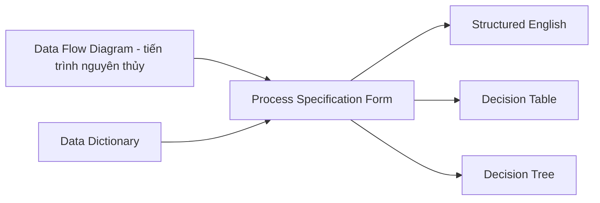
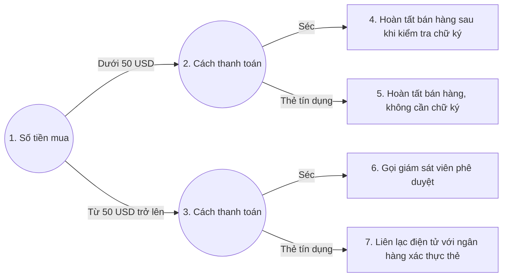
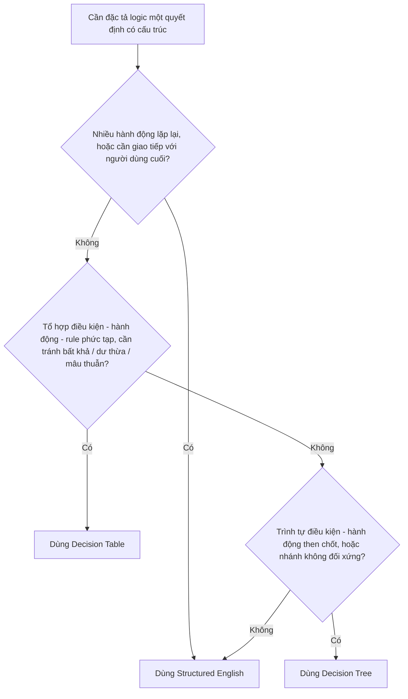
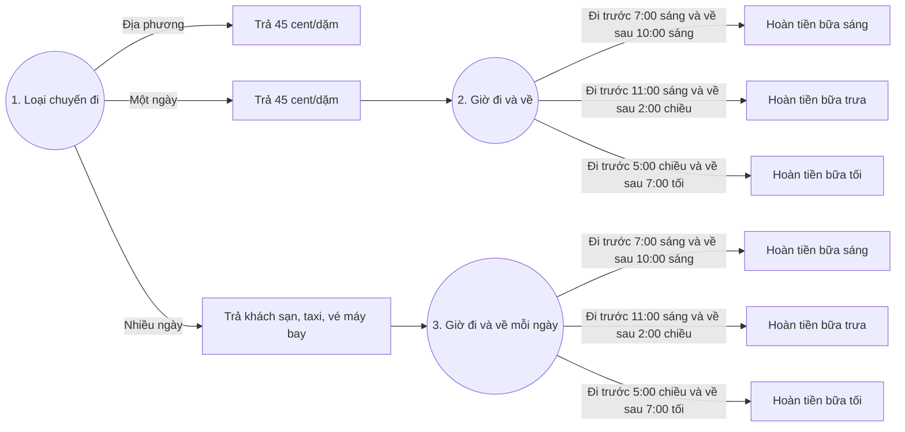
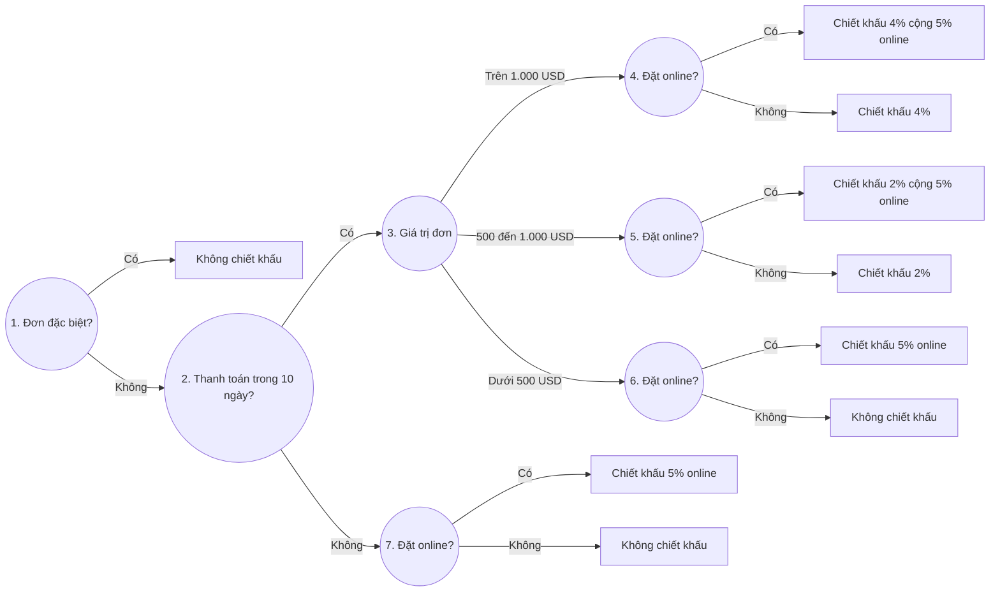
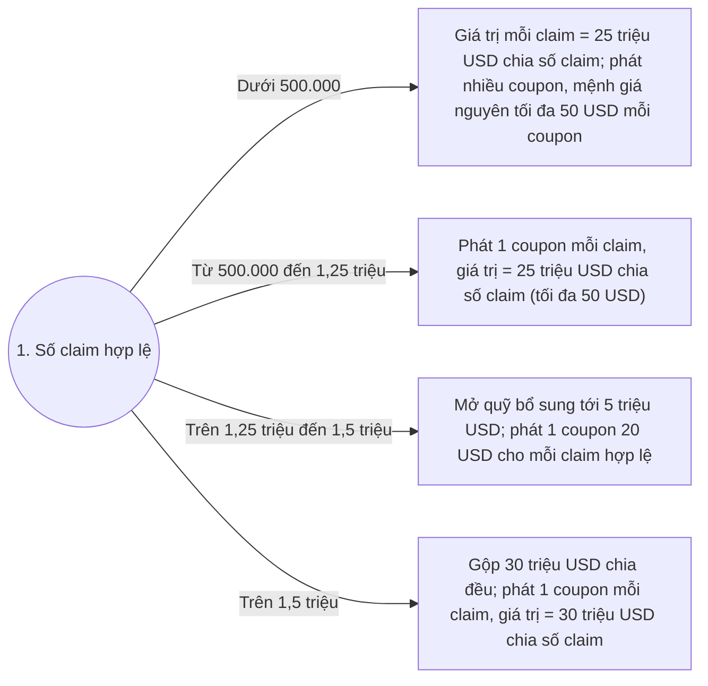
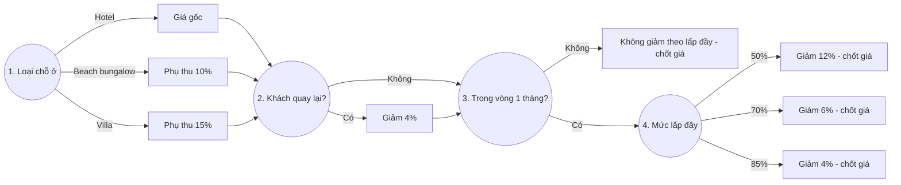
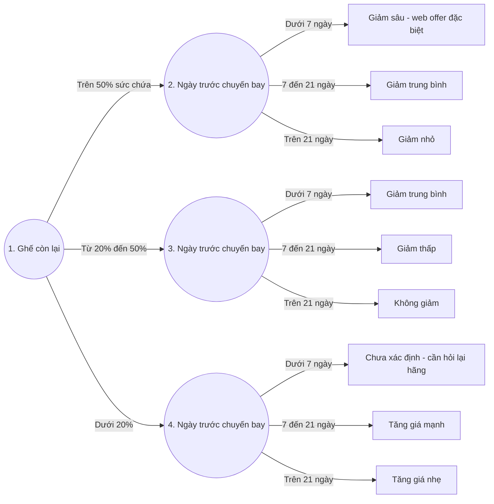

# Chương 9 — Process Specifications and Structured Decisions (Đặc tả tiến trình và Quyết định có cấu trúc)

> Nguồn: Kendall & Kendall, *Systems Analysis and Design*, 11th edition, Chapter 9 (trang 260–277).

## 🎯 Mục tiêu học tập

*(Trang mục tiêu đầu chương không nằm trong bản trích; tổng hợp từ nội dung chương.)*

Sau khi học xong chương này, bạn có thể:

1. Hiểu **process specifications** (mini specs) là gì, mục đích tạo ra chúng và khi nào KHÔNG cần tạo.
2. Phân biệt **structured decision** (quyết định có cấu trúc) với quyết định phi cấu trúc.
3. Viết **structured English** để mô tả logic quyết định (sequence, decision, case, iteration).
4. Xây dựng, kiểm tra và **rút gọn decision tables** (bảng quyết định); phát hiện 4 lỗi: thiếu sót, tình huống bất khả, mâu thuẫn, dư thừa.
5. Vẽ **decision trees** (cây quyết định) với ký hiệu tròn (điều kiện) / vuông (hành động).
6. Biết **chọn kỹ thuật nào** (structured English / decision table / decision tree) cho từng tình huống phân tích quyết định.

---

## 📖 Tóm tắt & giải thích kiến thức

### 1. Tổng quan về Process Specifications (Đặc tả tiến trình)

Để xác định yêu cầu thông tin cho chiến lược phân tích quyết định, analyst phải xác định **mục tiêu của người dùng và của tổ chức** (theo cách tiếp cận top-down hoặc hướng đối tượng). Cách tiếp cận top-down quan trọng vì mọi quyết định của con người trong tổ chức đều phải liên quan (ít nhất gián tiếp) đến mục tiêu chung của tổ chức.

**Process specifications** — còn gọi là **mini specs** (vì chúng chỉ là một phần nhỏ của toàn bộ đặc tả dự án) — được tạo cho:

- Các **primitive process** (tiến trình nguyên thủy, không phân rã nữa) trên Data Flow Diagram (DFD);
- Một số tiến trình mức cao hơn có phân rã thành child diagram;
- **Class methods** trong thiết kế hướng đối tượng;
- Các bước trong một **use case** (Chương 2 và 10).

Chúng giải thích **logic ra quyết định và công thức** biến dữ liệu vào (input) thành dữ liệu ra (output). Mỗi phần tử dẫn xuất (derived element) phải có logic tiến trình cho thấy nó được tạo ra từ các phần tử cơ sở (base elements) hoặc phần tử dẫn xuất đã có trước đó như thế nào.

#### 1.1. Ba mục tiêu của process specifications

| # | Mục tiêu | Giải thích |
|---|---|---|
| 1 | **Giảm sự mơ hồ (ambiguity) của tiến trình** | Buộc analyst tìm hiểu chi tiết cách tiến trình hoạt động; các điểm mơ hồ được ghi lại, tổng hợp lại làm câu hỏi cho các buổi phỏng vấn tiếp theo với người dùng. |
| 2 | **Thu được mô tả chính xác về việc tiến trình thực hiện** | Thường được đưa vào gói đặc tả (packet of specifications) chuyển cho lập trình viên. |
| 3 | **Kiểm chứng (validate) thiết kế hệ thống** | Đảm bảo tiến trình có ĐỦ mọi luồng dữ liệu vào cần thiết để tạo ra output; mọi input/output đều phải xuất hiện trên DFD. |

#### 1.2. Khi nào KHÔNG cần tạo process specification

Ba loại tiến trình thường **không** cần đặc tả (chỉ ghi chú trong mô tả tiến trình):

1. **Tiến trình nhập/xuất vật lý** (physical input/output) như đọc (read) và ghi (write) — logic quá đơn giản.
2. **Tiến trình kiểm tra dữ liệu đơn giản** (simple data validation) — tiêu chí kiểm tra (edit criteria) đã nằm trong data dictionary và được đưa vào mã nguồn. (Với việc kiểm tra **phức tạp** thì vẫn nên viết đặc tả.)
3. **Tiến trình dùng mã viết sẵn** (prewritten code) — các procedure, method, function hoặc class library (mua hoặc miễn phí trên web). Đây là các khối mã dùng chung (ví dụ kiểm tra ngày tháng, check digit), viết và tài liệu hoá một lần nhưng xuất hiện như tiến trình trên nhiều DFD.

#### 1.3. Định dạng form đặc tả tiến trình (Process Specification Format)

Process specification **liên kết một tiến trình với DFD và data dictionary**. Mỗi đặc tả nhập vào một form riêng hoặc màn hình CASE tool (ví dụ Visible Analyst), gồm **10 mục**:

1. **Process number** — trùng với ID tiến trình trên DFD (giúp tra ngược DFD dễ dàng).
2. **Process name** — trùng tên hiển thị trong ký hiệu tiến trình trên DFD.
3. **Mô tả ngắn** tiến trình làm gì.
4. **Danh sách input data flows** — dùng đúng tên trên DFD; tên dữ liệu trong công thức/logic phải khớp data dictionary để nhất quán.
5. **Output data flows** — cũng dùng tên trên DFD và data dictionary.
6. **Loại tiến trình**: batch, online hay manual. Tiến trình *online* cần thiết kế màn hình; tiến trình *manual* cần thủ tục rõ ràng cho nhân viên thực hiện.
7. Nếu dùng **mã viết sẵn**: ghi tên subprogram/function chứa mã đó.
8. **Mô tả logic tiến trình** bằng ngôn ngữ đời thường (KHÔNG dùng pseudo-code máy tính), nêu chính sách và **business rules** — các thủ tục/điều kiện/công thức giúp doanh nghiệp vận hành. Các định dạng business rule phổ biến:
   - Định nghĩa thuật ngữ nghiệp vụ;
   - Điều kiện và hành động nghiệp vụ;
   - Ràng buộc toàn vẹn dữ liệu (data integrity constraints);
   - Suy diễn toán học và hàm (mathematical and functional derivations);
   - Suy luận logic (logical inferences);
   - Trình tự xử lý (processing sequences);
   - Quan hệ giữa các sự kiện nghiệp vụ.
9. Nếu form không đủ chỗ cho mô tả structured English hoàn chỉnh, hoặc logic được thể hiện bằng decision table/tree, ghi **tên bảng/cây tương ứng**.
10. **Danh sách vấn đề chưa giải quyết** (unresolved issues), phần logic chưa hoàn chỉnh — làm cơ sở câu hỏi phỏng vấn tiếp theo với người dùng/chuyên gia nghiệp vụ.

*Ví dụ trong sách (Figure 9.2 — World's Trend, process 1.3 "Determine Quantity Available"):* xác định mặt hàng có sẵn để bán không; nếu không đủ thì tạo bản ghi backordered item; input là Valid Item + Quantity on Hand, output là Available Item + Backordered Item; logic viết bằng structured English; unresolved issues: "Có nên tính cả lượng hàng đang đặt mua (on order) không? Ngày hàng về dự kiến có làm thay đổi cách tính số lượng khả dụng không?"



*(Sơ đồ: quan hệ giữa process specification với DFD, data dictionary và 3 kỹ thuật mô tả logic — theo Figure 9.1.)*

### 2. Structured English (Tiếng Anh có cấu trúc)

**Khi nào dùng:** khi logic tiến trình gồm **công thức hoặc phép lặp (iteration)**, hoặc khi quyết định có cấu trúc **không quá phức tạp**.

Structured English dựa trên **2 khối xây dựng (building blocks)**:

1. **Structured logic** — các chỉ thị được tổ chức thành các thủ tục lồng nhau và nhóm lại (nested and grouped procedures);
2. **Các câu tiếng Anh đơn giản** như *add, multiply, move*.

Một bài toán bằng lời (word problem) được chuyển thành structured English bằng cách đặt các quy tắc quyết định vào đúng trình tự và dùng quy ước **IF-THEN-ELSE** xuyên suốt.

#### 2.1. Năm quy ước khi viết Structured English

1. Biểu diễn mọi logic bằng **một trong 4 kiểu cấu trúc**: sequential (tuần tự), decision (rẽ nhánh), case (chọn trường hợp), iteration (lặp).
2. Dùng và **VIẾT HOA** các từ khóa chuẩn: `IF, THEN, ELSE, DO, DO WHILE, DO UNTIL, PERFORM`.
3. **Thụt lề (indent)** các khối lệnh để thể hiện rõ phân cấp (lồng nhau).
4. **Gạch chân** các từ/cụm từ đã được định nghĩa trong data dictionary (Chương 8) — báo hiệu chúng có nghĩa chuyên biệt, dành riêng.
5. Cẩn thận với **"and"/"or"** và phân biệt rõ **"lớn hơn" (>) với "lớn hơn hoặc bằng" (≥)**: "A and B" nghĩa là cả A lẫn B; "A or B" nghĩa là A hoặc B nhưng không phải cả hai. Làm rõ logic ngay bây giờ, đừng đợi đến giai đoạn lập trình.

#### 2.2. Bốn kiểu cấu trúc logic (Figure 9.3)

| Kiểu | Mô tả | Ví dụ |
|---|---|---|
| **Sequential structure** | Khối lệnh không có rẽ nhánh | `Action #1` → `Action #2` → `Action #3` |
| **Decision structure** | Chỉ khi điều kiện đúng mới thực hiện; ngược lại nhảy sang ELSE | `IF Condition A is True / THEN Action A / ELSE Action B / ENDIF` |
| **Case structure** | Kiểu decision đặc biệt: các trường hợp **loại trừ lẫn nhau** (một cái xảy ra thì cái khác không) | `IF Case #1 Action #1 / ELSE IF Case #2 Action #2 / ... / ELSE print error / ENDIF` |
| **Iteration** | Khối lệnh lặp lại đến khi xong | `DO WHILE there are customers / Action #1 / ENDDO` |

#### 2.3. Ví dụ: xử lý yêu cầu bồi thường y tế (medical claims)

Lời kể: *"Chúng tôi xử lý mọi claim như sau: trước hết kiểm tra người yêu cầu đã từng gửi claim chưa, nếu chưa thì lập bản ghi mới. Cập nhật tổng claim trong năm. Sau đó xác định người đó có policy A hay B (khác nhau ở mức khấu trừ và đồng chi trả). Với cả hai policy, kiểm tra đã đạt mức khấu trừ chưa ($100 cho A, $50 cho B); nếu chưa thì trừ vào khấu trừ. Bước tiếp theo điều chỉnh đồng chi trả: trừ phần trăm khách tự trả (40% policy A, 60% policy B) khỏi claim. Rồi xuất séc nếu còn tiền phải trả, in bản tóm tắt, cập nhật tài khoản. Làm đến khi hết claim trong ngày."*

Structured English tương ứng (Figure 9.4 — từ gạch chân là thuật ngữ đã có trong data dictionary):

```
DO WHILE there are claims remaining
   IF claimant has not sent in a claim
      THEN set up new claimant record
   ELSE continue
   ENDIF
   Add claim to YTD Claim
   IF claimant has policy-plan A
      THEN IF deductible of $100.00 has not been met
              THEN subtract deductible-not-met from claim
                   Update deductible
           ELSE continue
           ENDIF
           Subtract copayment of 40% of claim from claim
   ELSE IF claimant has policy-plan B
           THEN IF deductible of $50.00 has not been met
                   THEN subtract deductible-not-met from claim
                        Update deductible
                ELSE continue
                ENDIF
                Subtract copayment of 60% of claim from claim
        ELSE write plan-error-message
        ENDIF
   ENDIF
   IF claim is greater than zero
      THEN print check
   ENDIF
   Print summary for claimant
   Update accounts
ENDDO
```

**Bài học rút ra:** khi viết structured English, những logic tưởng như đã rõ hoá ra lại **mơ hồ** — ví dụ: cộng claim vào tổng năm *trước hay sau* khi cập nhật khấu trừ? Điều gì xảy ra nếu bản ghi lưu thứ gì đó khác policy A/B? "Trừ 40% *của cái gì* khỏi claim?" → phải làm rõ NGAY tại bước này.

**Ưu điểm lớn của structured English:** ngoài việc làm rõ logic, nó là **công cụ giao tiếp** — có thể dạy cho người dùng trong tổ chức hiểu được; nếu giao tiếp quan trọng thì đây là lựa chọn khả thi cho phân tích quyết định.

#### 2.4. Data dictionary quyết định cấu trúc của process specification

Mọi chương trình máy tính đều mã hoá được bằng **3 cấu trúc cơ bản**: *sequence*, *selection* (IF-THEN-ELSE và case), *iteration/looping*. **Data dictionary cho biết cấu trúc nào phải có mặt** trong đặc tả:

| Ký hiệu trong data dictionary | Cấu trúc tương ứng trong process specification |
|---|---|
| Chuỗi field tuần tự, không lặp/không lựa chọn | Chuỗi lệnh đơn giản: `MOVE`, `ADD`, `SUBTRACT` |
| Phần tử tuỳ chọn `( )` hoặc phần tử hoặc-này-hoặc-kia `[ ]` | `IF ... THEN ... ELSE` (kể cả khi một lượng như QUANTITY BACKORDERED > 0) |
| Phép lặp `{ }` | `DO WHILE`, `DO UNTIL` hoặc `PERFORM UNTIL` để điều khiển vòng lặp |

*Ví dụ SHIPPING STATEMENT của World's Trend (Figure 9.5, 9.6):* ORDER NUMBER, ORDER DATE, CUSTOMER NUMBER là field tuần tự → 3 lệnh MOVE; `5 {Order Item Lines}` (lặp tối đa 5 dòng hàng) → khối `DO WHILE there are items for the order ... ENDDO` (dòng 8–17: GET Item Record, format dòng hàng, nhân Unit Price × Quantity Ordered ra Extended Amount, cộng dồn Merchandise Total, IF Quantity Backordered > 0 thì ghi ra); `(Tax)` tuỳ chọn → `IF State is equal to CT / Multiply Merchandise Total by Tax Rate giving Tax / ENDIF`; cuối cùng cộng Merchandise Total + Tax + Shipping and Handling ra Order Total.

### 3. Decision Tables (Bảng quyết định)

**Decision table** là bảng gồm các hàng và cột, chia thành **4 góc phần tư (quadrants)**:

| | Trái | Phải |
|---|---|---|
| **Nửa trên** | **Conditions** (các điều kiện) | **Condition alternatives** (các phương án của điều kiện, ví dụ Y/N) |
| **Nửa dưới** | **Actions** (các hành động) | **Action entries / Rules** (quy tắc thực hiện hành động — dấu X) |

Khi dùng bảng để xác định hành động, logic đi **theo chiều kim đồng hồ, bắt đầu từ góc trên-trái**.

#### 3.1. Ví dụ mở đầu: chính sách thanh toán không tiền mặt của cửa hàng (Figure 9.8)

3 điều kiện (mỗi cái 2 phương án Y/N), 4 hành động, 4 rule:

| Conditions and Actions | 1 | 2 | 3 | 4 |
|---|---|---|---|---|
| Mua dưới $50 | Y | Y | N | N |
| Trả bằng séc kèm 2 giấy tờ tuỳ thân | Y | N | Y | N |
| Dùng thẻ tín dụng | N | Y | N | Y |
| Hoàn tất bán hàng sau khi kiểm tra chữ ký | X | | | |
| Hoàn tất bán hàng, không cần chữ ký | | X | | |
| Gọi giám sát viên phê duyệt | | | X | |
| Liên lạc điện tử với ngân hàng để xác thực thẻ tín dụng | | | | X |

**Rule** = tổ hợp các phương án điều kiện dẫn tới một hành động. Ví dụ Rule 3 đọc là: IF N (tổng KHÔNG dưới $50) AND IF Y (khách trả séc với 2 giấy tờ) AND IF N (không dùng thẻ) THEN DO X (gọi giám sát viên phê duyệt). Việc ví dụ này có đúng 4 rule và 4 hành động chỉ là trùng hợp — bảng quyết định thực tế thường lớn và phức tạp hơn nhiều.

#### 3.2. Chín bước xây dựng decision table

1. **Xác định số điều kiện** ảnh hưởng đến quyết định. Gộp các hàng chồng lấn (ví dụ các điều kiện loại trừ lẫn nhau). Số điều kiện = số hàng nửa trên.
2. **Xác định số hành động** có thể thực hiện = số hàng nửa dưới.
3. **Xác định số phương án (alternatives) cho mỗi điều kiện.** Dạng đơn giản nhất: 2 phương án (Y/N). Trong **extended-entry table** có thể có nhiều phương án. Phải bảo đảm **bao phủ mọi giá trị có thể** — ví dụ đề bài nói tổng đơn $100–$1.000 và trên $1.000 thì analyst phải tự thêm khoảng 0–$100, nhất là khi có điều kiện khác áp dụng cho khoảng đó.
4. **Tính số cột tối đa** = tích số phương án của từng điều kiện. Ví dụ 4 điều kiện × mỗi cái 2 phương án → 2×2×2×2 = **16 cột**.
5. **Điền các phương án điều kiện:** với điều kiện thứ nhất, lấy số cột chia cho số phương án (16 ÷ 2 = 8) → viết Y vào 8 cột đầu, N vào 8 cột sau. Lặp lại cho từng điều kiện tiếp theo trên từng nửa nhỏ dần:

   ```
   Condition 1: Y Y Y Y Y Y Y Y N N N N N N N N
   Condition 2: Y Y Y Y N N N N Y Y Y Y N N N N
   Condition 3: Y Y N N Y Y N N Y Y N N Y Y N N
   Condition 4: Y N Y N Y N Y N Y N Y N Y N Y N
   ```

6. **Hoàn thành bảng** bằng cách chèn dấu **X** nơi rule dẫn tới hành động.
7. **Gộp các rule** khi một phương án rõ ràng không ảnh hưởng kết quả — dùng **dấu gạch ngang [—]** nghĩa là điều kiện đó Y hay N đều được:

   | | R1 | R2 | | → | R gộp |
   |---|---|---|---|---|---|
   | Condition 1 | Y | Y | | | Y |
   | Condition 2 | Y | N | | | — |
   | Action 1 | X | X | | | X |

8. **Kiểm tra bảng** để loại tình huống bất khả (impossible situations), mâu thuẫn (contradictions), dư thừa (redundancies).
9. **Sắp xếp lại** điều kiện, hành động (hoặc cả rule) nếu giúp bảng dễ hiểu hơn.

#### 3.3. Ví dụ xây dựng và rút gọn: gửi catalog cho khách hàng (Figures 9.9, 9.10)

Công ty muốn duy trì mailing list "có ý nghĩa": chỉ gửi những catalog mà khách sẽ mua. 3 điều kiện (C1: khách đã đặt từ catalog Mùa thu; C2: từ catalog Ngày lễ; C3: từ catalog Chuyên đề), mỗi cái 2 phương án → bảng 6 hàng (3 điều kiện + 3 hành động) × **8 cột** (2×2×2). 3 hành động: A1 gửi catalog Ngày lễ năm nay; A2 gửi catalog Chuyên đề mới; A3 gửi cả hai.

**Bảng đầy đủ (Figure 9.9):**

| Conditions and Actions | 1 | 2 | 3 | 4 | 5 | 6 | 7 | 8 |
|---|---|---|---|---|---|---|---|---|
| C1: Đặt từ catalog Mùa thu | Y | Y | Y | Y | N | N | N | N |
| C2: Đặt từ catalog Ngày lễ | Y | Y | N | N | Y | Y | N | N |
| C3: Đặt từ catalog Chuyên đề | Y | N | Y | N | Y | N | Y | N |
| A1: Gửi catalog Ngày lễ năm nay | | X | | X | | X | | X |
| A2: Gửi catalog Chuyên đề | | | X | | | | X | |
| A3: Gửi cả hai catalog | X | | | | X | | | |

**Rút gọn (Figure 9.10):** không có điều kiện nào loại trừ lẫn nhau (không giảm được số hàng điều kiện), không rule nào cho phép gộp hành động, nhưng gộp được rule:

- **Rules 2, 4, 6, 8** gộp làm một vì có 2 điểm chung: (1) cùng hành động "gửi catalog Ngày lễ"; (2) phương án của C3 luôn là N. Hai điều kiện đầu Y/N gì cũng được → thay bằng dấu **—**.
- Rules 1, 3, 5, 7 không gộp hết được vì còn **2 hành động khác nhau**; thay vào đó gộp **Rule 1 với 5** (cùng gửi cả hai) và **Rule 3 với 7** (cùng gửi Chuyên đề).

| Conditions and Actions | 1' | 2' | 3' |
|---|---|---|---|
| C1: Đặt từ catalog Mùa thu | — | — | — |
| C2: Đặt từ catalog Ngày lễ | Y | N | — |
| C3: Đặt từ catalog Chuyên đề | Y | Y | N |
| A1: Gửi catalog Ngày lễ năm nay | | | X |
| A2: Gửi catalog Chuyên đề | | X | |
| A3: Gửi cả hai catalog | X | | |

**Thêm một điều kiện làm thay đổi toàn bộ bảng (Figure 9.11):** nếu bỏ sót điều kiện quan trọng "khách đặt hàng từ $50 trở lên" (*phần chữ trong sách viết $100 — sách không nhất quán giữa lời văn và hình*), phải thêm điều kiện mới, hành động mới "Không gửi catalog nào" và Rule 4' mới: nếu khách KHÔNG đạt ngưỡng đặt hàng → không gửi gì; các rule 1'–3' được thêm Y cho điều kiện mới.

| Conditions and Actions | 1' | 2' | 3' | 4' |
|---|---|---|---|---|
| C1: Đặt từ catalog Mùa thu | — | — | — | — |
| C2: Đặt từ catalog Ngày lễ | Y | N | — | — |
| C3: Đặt từ catalog Chuyên đề | Y | Y | N | — |
| C4: Khách đặt hàng từ $50 trở lên | Y | Y | Y | N |
| A1: Gửi catalog Ngày lễ năm nay | | | X | |
| A2: Gửi catalog Chuyên đề | | X | | |
| A3: Gửi cả hai catalog | X | | | |
| A4: Không gửi catalog nào | | | | X |

#### 3.4. Kiểm tra tính đầy đủ và chính xác — 4 lỗi thường gặp

1. **Incompleteness (thiếu sót):** thiếu điều kiện/phương án/hành động/rule → phải đảm bảo đầy đủ tuyệt đối (ví dụ Figure 9.11 ở trên).
2. **Impossible situations (tình huống bất khả):** tổ hợp không thể xảy ra trong thực tế. Ví dụ (Figure 9.12): Rule 1 với "Lương > $50.000/năm = Y" **và** "Lương < $2.000/tháng = Y" là bất khả (không ai vừa kiếm hơn $50.000/năm vừa dưới $2.000/tháng); lỗi khó thấy vì một điều kiện đo theo **năm**, cái kia theo **tháng**. Ba rule còn lại hợp lệ.
3. **Contradictions (mâu thuẫn):** các rule **thoả cùng tập điều kiện** nhưng lại chỉ định **hành động khác nhau**. Nguyên nhân: cách analyst dựng bảng, hoặc thông tin thu thập sai; thường xảy ra khi chèn dấu **—** không đúng.
4. **Redundancy (dư thừa):** các tập phương án **giống hệt nhau** yêu cầu **đúng cùng một hành động** (rule bị lặp). Analyst phải xác định đâu là đúng rồi xử lý mâu thuẫn/dư thừa.

**Ưu điểm của decision tables:** giúp analyst **bảo đảm tính đầy đủ (completeness)**; dễ kiểm tra các lỗi (tình huống bất khả, mâu thuẫn, dư thừa); quy tắc xây dựng và rút gọn bảng đơn giản, dễ quản lý. Ngoài ra còn có các **decision table processors** — phần mềm nhận bảng làm input và sinh ra mã chương trình làm output.

### 4. Decision Trees (Cây quyết định)

**Khi nào dùng:** khi quyết định có cấu trúc có **rẽ nhánh phức tạp (complex branching)**, hoặc khi cần **giữ chuỗi quyết định theo một trình tự nhất định**.

Đặc điểm:

- Cây thường vẽ **nằm ngang**: gốc (root) ở bên trái tờ giấy, nhánh toả sang phải — để analyst ghi chú điều kiện/hành động lên nhánh.
- Khác với decision tree trong khoa học quản lý (management science), cây của analyst **KHÔNG chứa xác suất và outcome**; trong phân tích hệ thống, cây chủ yếu dùng để **nhận diện và tổ chức điều kiện + hành động** trong một tiến trình quyết định hoàn toàn có cấu trúc.
- Ký hiệu: **nút vuông (□) = hành động (action)**, **nút tròn (○) = điều kiện (condition)**. Nghĩ về hình tròn như **IF**, hình vuông như **THEN**. Đánh số tuần tự các nút tròn/vuông giúp cây dễ đọc.

**Các bước vẽ cây:**

1. Xác định **tất cả điều kiện và hành động**, cùng **thứ tự và thời điểm** của chúng (nếu quan trọng).
2. Xây cây **từ trái sang phải**, bảo đảm liệt kê **đủ mọi phương án (alternatives)** trước khi đi tiếp sang phải.

Ví dụ cây cho chính sách mua hàng không tiền mặt (Figure 9.14 — cùng bài toán với bảng ở mục 3.1):



*(Nút tròn = điều kiện/IF, nút chữ nhật = hành động/THEN.)*

Cây này đối xứng và 4 hành động ở cuối là duy nhất — nhưng **cây KHÔNG bắt buộc đối xứng**: đa số cây có các điều kiện với số nhánh khác nhau, và hành động giống nhau có thể xuất hiện nhiều lần.

**Ba ưu điểm của decision tree so với decision table:**

1. Tận dụng **cấu trúc tuần tự** của các nhánh → **thứ tự** kiểm tra điều kiện và thực hiện hành động thấy được ngay lập tức.
2. Điều kiện/hành động **chỉ xuất hiện trên nhánh liên quan** (trong bảng thì mọi thứ nằm chung một bảng): những gì quan trọng nối trực tiếp với nhau, những gì không liên quan thì vắng mặt — cây không cần đối xứng.
3. **Dễ hiểu hơn** với người khác trong tổ chức → phù hợp làm **công cụ giao tiếp** hơn.

### 5. Chọn kỹ thuật phân tích quyết định có cấu trúc

Ba kỹ thuật không loại trừ nhau, nhưng thông lệ là **chọn MỘT** kỹ thuật cho một quyết định thay vì dùng cả ba. Hướng dẫn chọn:

| Kỹ thuật | Dùng khi |
|---|---|
| **Structured English** | (a) Có nhiều **hành động lặp đi lặp lại**, HOẶC (b) **giao tiếp với người dùng cuối** là quan trọng. |
| **Decision tables** | (a) Gặp **tổ hợp phức tạp** của điều kiện, hành động, rule, HOẶC (b) cần phương pháp **tránh hiệu quả** tình huống bất khả, dư thừa, mâu thuẫn. |
| **Decision trees** | (a) **Trình tự** điều kiện và hành động là then chốt, HOẶC (b) **không phải điều kiện nào cũng liên quan tới mọi hành động** (các nhánh khác nhau). |



### 6. Các Consulting Opportunities trong chương (tình huống tư vấn)

- **9.1 Kit Chen Kaboodle, Inc.:** hãng bán dụng cụ bếp qua web/mail-order kể chính sách xử lý đơn chưa giao (unfilled orders): quét file hàng tuần; đơn đã giao → xoá bản ghi; chưa viết thư cho khách trong 4 tuần → gửi thiệp "chưa sẵn sàng"; backorder > 45 ngày → gửi thông báo; hàng theo mùa + backorder ≥ 30 ngày → thông báo đặc biệt; ngày backorder thay đổi + chưa gửi thiệp trong 2 tuần → gửi thiệp khác; hàng không còn bán → thông báo + xoá bản ghi. Nhiệm vụ: đóng khung hành động, khoanh tròn điều kiện, liệt kê điểm mơ hồ và viết 5 câu hỏi làm rõ.
- **9.2 Kneading Structure:** viết lại chính sách trên bằng **structured English** và mô tả thay đổi nếu thông báo bằng email thay vì thư giấy.
- **9.3 Citron Car Rental:** 5 hạng xe A–E; nếu hết hạng xe đã đặt → nâng hạng miễn phí; công ty có tài khoản → nâng hạng miễn phí; thành viên frequent-flyer → giảm giá; hỏi bảo hiểm và thời gian thuê rồi tính tiền. Nhiệm vụ: vẽ **decision table** cho quy trình lập hoá đơn tự động, rồi bảng cập nhật thêm giảm 10% khi đặt xe online.
- **9.4 A Tree for Free (Premium Airlines):** chính sách tích dặm thưởng: dặm bay thực tế; leg < 500 dặm → tính 500 dặm; bay thứ Bảy → nhân 2; thứ Ba → nhân 1,5; leg thứ 9 trong tháng → nhân đôi bất kể ngày nào; leg thứ 17 → nhân ba; đặt qua dịch vụ online (Priceline, KAYAK...) → cộng 100 dặm. Nhiệm vụ: vẽ **decision tree** để chính sách rõ ràng, dễ nắm bắt trực quan, dễ giải thích.

---

## 🔑 Bảng thuật ngữ (Keywords and Phrases)

| Thuật ngữ tiếng Anh | Nghĩa tiếng Việt |
|---|---|
| action | hành động (việc cần thực hiện, nằm nửa dưới-trái decision table hoặc nút vuông trên decision tree) |
| action rule | quy tắc hành động (tổ hợp phương án điều kiện kích hoạt một hành động — cột dấu X) |
| condition | điều kiện (yếu tố ảnh hưởng quyết định, nửa trên-trái decision table hoặc nút tròn trên tree) |
| condition alternative | phương án điều kiện (các giá trị có thể của điều kiện, ví dụ Y/N; nửa trên-phải bảng) |
| decision table | bảng quyết định (bảng 4 góc phần tư: conditions / condition alternatives / actions / action rules) |
| decision tree | cây quyết định (gốc bên trái, nút tròn = điều kiện, nút vuông = hành động) |
| mini specs | đặc tả mini (tên gọi khác của process specifications — phần nhỏ trong toàn bộ đặc tả dự án) |
| process specifications | đặc tả tiến trình (mô tả logic quyết định và công thức biến input thành output của tiến trình nguyên thủy) |
| structured decision | quyết định có cấu trúc (quyết định lặp lại, thường lệ, ra được bằng một tập quy tắc định trước, không cần phán đoán con người) |
| structured English | tiếng Anh có cấu trúc (logic có cấu trúc lồng nhau + các câu tiếng Anh đơn giản, dùng IF-THEN-ELSE, DO WHILE...) |

---

## ❓ Trả lời Review Questions

**1. Nêu 3 lý do tạo process specifications.**
(1) **Giảm sự mơ hồ** của tiến trình — buộc analyst tìm hiểu chi tiết cách tiến trình hoạt động, ghi lại các điểm chưa rõ làm câu hỏi phỏng vấn tiếp theo; (2) **thu được mô tả chính xác** về việc tiến trình thực hiện — đưa vào gói đặc tả cho lập trình viên; (3) **kiểm chứng thiết kế hệ thống** — bảo đảm tiến trình có đủ mọi luồng dữ liệu vào để sinh output, và mọi input/output đều xuất hiện trên DFD.

**2. Định nghĩa structured decision (quyết định có cấu trúc).**
Là quyết định **có thể ra được bằng cách tuân theo một tập quy tắc định trước**: điều kiện, phương án điều kiện, hành động và quy tắc hành động đều xác định được đầy đủ. Đây là loại quyết định lặp lại, thường lệ; như phần Summary nêu, "việc ra quyết định có cấu trúc **không cần đến phán đoán của con người**" — do đó có thể tự động hoá/lập trình. (Ngược lại, quyết định phi cấu trúc — như các quyết định cá nhân trong video Systems Scenario — dựa nhiều vào phán đoán, trực giác.)

**3. Bốn phần tử phải biết để analyst thiết kế hệ thống cho quyết định có cấu trúc?**
(1) **Conditions** — các điều kiện; (2) **condition alternatives** — các phương án của từng điều kiện; (3) **actions** — các hành động cần thực hiện; (4) **action rules** — quy tắc kết nối tổ hợp điều kiện với hành động.

**4. Hai khối xây dựng (building blocks) của structured English?**
(1) **Structured logic** — các chỉ thị được tổ chức thành thủ tục lồng nhau, nhóm lại; (2) **các câu tiếng Anh đơn giản** như *add, multiply, move*.

**5. Nêu 5 quy ước khi dùng structured English.**
(1) Biểu diễn mọi logic bằng 1 trong 4 kiểu: sequential, decision, case, iteration; (2) dùng và VIẾT HOA từ khóa chuẩn (IF, THEN, ELSE, DO, DO WHILE, DO UNTIL, PERFORM); (3) thụt lề khối lệnh để thể hiện phân cấp/lồng nhau; (4) gạch chân từ/cụm từ đã định nghĩa trong data dictionary; (5) cẩn thận với "and"/"or" và phân biệt "lớn hơn" với "lớn hơn hoặc bằng" — làm rõ logic ngay, không đợi đến khi lập trình.

**6. Lợi ích của structured English trong giao tiếp với người trong tổ chức?**
Structured English **có thể dạy được cho người dùng** và do đó **người dùng hiểu được** — nó vừa làm rõ logic và quan hệ vốn mơ hồ trong ngôn ngữ tự nhiên, vừa là **công cụ giao tiếp** hiệu quả giữa analyst và người dùng; khi giao tiếp là quan trọng, structured English là lựa chọn khả thi cho phân tích quyết định.

**7. Góc phần tư nào của decision table dùng cho conditions? Góc nào cho condition alternatives?**
**Conditions** nằm ở góc **trên-trái**; **condition alternatives** nằm ở góc **trên-phải**. (Nửa dưới: actions bên trái, action rules/entries bên phải; logic đọc theo chiều kim đồng hồ từ góc trên-trái.)

**8. Bước đầu tiên khi xây dựng decision table?**
**Xác định số điều kiện có thể ảnh hưởng đến quyết định**, đồng thời gộp các hàng chồng lấn (các điều kiện loại trừ lẫn nhau). Số điều kiện này trở thành số hàng ở nửa trên của bảng.

**9. Bốn vấn đề chính có thể xảy ra khi xây dựng decision tables?**
(1) **Incompleteness** — thiếu sót (thiếu điều kiện/hành động/rule); (2) **impossible situations** — tình huống bất khả (tổ hợp không thể xảy ra, ví dụ lương > $50.000/năm và < $2.000/tháng); (3) **contradictions** — mâu thuẫn (cùng tập điều kiện nhưng chỉ định hành động khác nhau, thường do chèn dấu — sai); (4) **redundancy** — dư thừa (các tập phương án giống hệt nhau yêu cầu cùng một hành động).

**10. Một ưu điểm lớn của decision tables so với các phương pháp khác?**
Bảng quyết định giúp analyst **bảo đảm tính đầy đủ (completeness)**. Ngoài ra, khi dùng bảng rất **dễ kiểm tra các lỗi** như tình huống bất khả, mâu thuẫn và dư thừa; còn có các decision table processor sinh mã chương trình từ bảng.

**11. Công dụng chính của decision trees trong phân tích hệ thống?**
Dùng khi quyết định có cấu trúc có **rẽ nhánh phức tạp** và khi cần **giữ chuỗi quyết định theo trình tự nhất định**. Trong phân tích hệ thống, cây chủ yếu dùng để **nhận diện và tổ chức các điều kiện và hành động** trong một tiến trình quyết định hoàn toàn có cấu trúc (khác cây trong khoa học quản lý — không có xác suất và outcome).

**12. Bốn bước chính khi xây dựng decision tree?**
(1) Xác định **tất cả các điều kiện và hành động** liên quan đến quyết định; (2) xác định **thứ tự và thời điểm (order & timing)** của điều kiện/hành động nếu chúng quan trọng; (3) **vẽ cây từ trái sang phải** (gốc bên trái), dùng nút tròn cho điều kiện (IF) và nút vuông cho hành động (THEN), đánh số tuần tự; (4) bảo đảm **liệt kê đủ mọi phương án** của mỗi điều kiện trước khi di chuyển tiếp sang phải.

**13. Ba ưu điểm của decision trees so với decision tables?**
(1) Tận dụng **cấu trúc tuần tự** của nhánh — thứ tự kiểm tra điều kiện/thực hiện hành động thấy được ngay; (2) điều kiện và hành động **chỉ nằm trên các nhánh liên quan** (cây không cần đối xứng; những gì không quan trọng thì vắng mặt) trong khi ở bảng mọi thứ chung một bảng; (3) **dễ hiểu hơn** với người khác trong tổ chức — phù hợp hơn làm công cụ giao tiếp.

**14. Hai tình huống nên dùng structured English?**
(a) Khi có **nhiều hành động lặp đi lặp lại** (repetitious actions); (b) khi **giao tiếp với người dùng cuối** là quan trọng.

**15. Hai tình huống decision tables phát huy tốt nhất?**
(a) Khi gặp **tổ hợp phức tạp** của điều kiện, hành động và rule; (b) khi cần một phương pháp **tránh hiệu quả** các tình huống bất khả, dư thừa và mâu thuẫn.

**16. Hai tình huống nên dùng decision trees?**
(a) Khi **trình tự của điều kiện và hành động là then chốt**; (b) khi **không phải điều kiện nào cũng liên quan đến mọi hành động** (các nhánh khác nhau, cây không đối xứng).

---

## 🧩 Giải Problems

### Problem 1 — Structured English cho chính sách hoàn phí công tác (Greg Bott)

**Tóm tắt đề:** Chuyến đi **địa phương (local)** → chỉ trả 45 cent/dặm. Chuyến **1 ngày** → trả tiền dặm + xét giờ đi/về để hoàn tiền bữa ăn: bữa sáng — đi trước/đúng 7:00 sáng VÀ về sau 10:00 sáng; bữa trưa — đi trước/đúng 11:00 sáng VÀ về sau 2:00 chiều; bữa tối — đi trước/đúng 5:00 chiều VÀ về sau 7:00 tối. Chuyến **nhiều ngày** → khách sạn, taxi, vé máy bay + phụ cấp ăn với cùng quy tắc giờ.

*(Ghi chú mơ hồ: nguyên văn đề nói giờ về của bữa tối là "by 7:00 p.m."; theo logic hai câu trước — "return later than" — hiểu là về SAU 7:00 tối. Đây chính là điểm cần làm rõ với người dùng, đúng tinh thần chương.)*

```
IF chuyến đi là chuyến địa phương (local)
     THEN trả tiền dặm 45 cent/dặm
ELSE
     IF chuyến đi là chuyến 1 ngày
          THEN trả tiền dặm 45 cent/dặm
               IF giờ khởi hành trước hoặc bằng 7:00 sáng
                    AND giờ trở về sau 10:00 sáng
                    THEN hoàn tiền bữa sáng
               ENDIF
               IF giờ khởi hành trước hoặc bằng 11:00 sáng
                    AND giờ trở về sau 2:00 chiều
                    THEN hoàn tiền bữa trưa
               ENDIF
               IF giờ khởi hành trước hoặc bằng 5:00 chiều
                    AND giờ trở về sau 7:00 tối
                    THEN hoàn tiền bữa tối
               ENDIF
     ELSE (chuyến đi nhiều ngày)
          Hoàn tiền khách sạn
          Hoàn tiền taxi
          Hoàn tiền vé máy bay
          DO WHILE còn ngày công tác chưa xét
               Áp dụng cùng các quy tắc giờ ở trên để hoàn tiền
                    bữa sáng, bữa trưa, bữa tối của ngày đó
          ENDDO
     ENDIF
ENDIF
```

**Giải thích:** cấu trúc ngoài cùng là *case structure* 3 trường hợp loại trừ nhau (local / 1 ngày / nhiều ngày); bên trong mỗi trường hợp là các *decision structure* độc lập cho từng bữa ăn; chuyến nhiều ngày thêm *iteration* theo ngày.

### Problem 2 — Decision tree cho chính sách hoàn phí (Problem 1)



**Giải thích:** nút tròn = điều kiện (IF), nút chữ nhật = hành động (THEN). Cây **không đối xứng** — nhánh "địa phương" kết thúc ngay sau một hành động, minh hoạ ưu điểm "điều kiện không liên quan thì vắng mặt". Hành động giống nhau (hoàn tiền các bữa) xuất hiện lặp lại trên hai nhánh — điều được phép ở decision tree.

### Problem 3 — Decision table cho chính sách hoàn phí (Problem 1)

**Bảng chính — xác định loại chuyến và khoản được hoàn** (2 điều kiện loại trừ nhau về loại chuyến; tổ hợp Local = Y và Một-ngày = Y là bất khả nên loại):

| Conditions and Actions | 1 | 2 | 3 |
|---|---|---|---|
| C1: Chuyến đi địa phương | Y | N | N |
| C2: Chuyến đi một ngày | N | Y | N |
| A1: Trả tiền dặm 45 cent/dặm | X | X | |
| A2: Trả khách sạn, taxi, vé máy bay | | | X |
| A3: Xét hoàn tiền bữa ăn (bảng phụ) | | X | X |

**Bảng phụ — hoàn tiền bữa ăn** (áp dụng cho rule 2 và 3 của bảng chính; 6 điều kiện nhưng từng cặp chỉ liên quan tới một bữa nên rút gọn bằng dấu —; mỗi bữa xét độc lập):

| Conditions and Actions | 1 | 2 | 3 | 4 |
|---|---|---|---|---|
| C1: Khởi hành ≤ 7:00 sáng | Y | — | — | N |
| C2: Trở về > 10:00 sáng | Y | — | — | — |
| C3: Khởi hành ≤ 11:00 sáng | — | Y | — | — |
| C4: Trở về > 2:00 chiều | — | Y | — | — |
| C5: Khởi hành ≤ 5:00 chiều | — | — | Y | — |
| C6: Trở về > 7:00 tối | — | — | Y | — |
| A1: Hoàn tiền bữa sáng | X | | | |
| A2: Hoàn tiền bữa trưa | | X | | |
| A3: Hoàn tiền bữa tối | | | X | |
| A4: Không hoàn bữa nào (không cặp điều kiện nào thoả) | | | | X |

**Giải thích cách rút gọn:** nếu lập bảng đầy đủ cho 6 điều kiện Y/N sẽ có 2⁶ = 64 cột; nhưng vì mỗi bữa ăn chỉ phụ thuộc **đúng cặp điều kiện của nó** (các điều kiện khác không ảnh hưởng → dấu —), và ba hành động hoàn tiền **không loại trừ nhau** (một chuyến có thể được hoàn cả 3 bữa), ta tách thành các rule độc lập. Rule 4 bảo đảm tính đầy đủ (completeness). Lưu ý C1=N ở rule 4 chỉ minh hoạ một trường hợp không thoả; đầy đủ hơn: "không cặp (đi, về) nào thoả" → không hoàn.

### Problem 4 — Decision table (Y/N) cho chính sách chiết khấu True Disk

**Tóm tắt đề:** True Disk gửi hoá đơn hàng tháng, **chiết khấu nếu thanh toán trong 10 ngày**: đơn > $1.000 → trừ 4%; đơn $500–$1.000 → trừ 2%; đơn < $500 → không chiết khấu. Mọi đơn **đặt online** tự động được **thêm 5%**. **Đơn đặc biệt** (ví dụ nội thất máy tính) **miễn trừ khỏi mọi chiết khấu**.

**Bước 1–4 (xây dựng):** 5 điều kiện Y/N → tối đa 2⁵ = 32 cột. Nhưng C3 (> $1.000) và C4 ($500–$1.000) **loại trừ lẫn nhau** → mọi cột có C3 = Y và C4 = Y là **tình huống bất khả** (8 cột bị loại). *(Giả định theo chữ "extra": chiết khấu online 5% áp dụng "tự động" cho mọi đơn online không phải đơn đặc biệt, kể cả khi không thanh toán trong 10 ngày; chiết khấu theo giá trị đơn thì bắt buộc thanh toán trong 10 ngày — điểm mơ hồ nên xác nhận lại với True Disk.)*

**Bảng sau khi rút gọn (dấu — nghĩa là Y/N đều được):**

| Conditions and Actions | 1 | 2 | 3 | 4 | 5 | 6 | 7 | 8 | 9 |
|---|---|---|---|---|---|---|---|---|---|
| C1: Đơn đặc biệt (special order) | Y | N | N | N | N | N | N | N | N |
| C2: Thanh toán trong 10 ngày | — | Y | Y | Y | Y | Y | Y | N | N |
| C3: Giá trị đơn > $1.000 | — | Y | Y | N | N | N | N | — | — |
| C4: Giá trị đơn $500–$1.000 | — | N | N | Y | Y | N | N | — | — |
| C5: Đặt hàng online | — | Y | N | Y | N | Y | N | Y | N |
| A1: Không áp dụng chiết khấu nào | X | | | | | | X | | X |
| A2: Trừ 4% | | X | X | | | | | | |
| A3: Trừ 2% | | | | X | X | | | | |
| A4: Trừ thêm 5% (online) | | X | | X | | X | | X | |

**Giải thích cách rút gọn:**
- Rule 1: đơn đặc biệt miễn mọi chiết khấu → 4 điều kiện còn lại đều — (gộp 16 cột thành 1).
- Rules 2–7: không đặc biệt + thanh toán trong 10 ngày, chia theo 3 mức giá trị đơn × có/không online. Hành động A2/A3 (theo giá trị) và A4 (online) **có thể cùng kích hoạt** trong một rule (ví dụ rule 2: 4% + 5% = 9%).
- Rules 8–9: không thanh toán trong 10 ngày → mất chiết khấu theo giá trị (C3, C4 thành —), chỉ còn xét online.

### Problem 5 — Extended-entry decision table cho True Disk

Trong **extended-entry table**, mỗi điều kiện có thể nhận **nhiều hơn 2 phương án**, giúp bảng gọn hơn và loại bỏ tình huống bất khả ngay từ cấu trúc:

| Conditions and Actions | 1 | 2 | 3 | 4 | 5 | 6 | 7 | 8 |
|---|---|---|---|---|---|---|---|---|
| C1: Loại đơn | Đặc biệt | Thường | Thường | Thường | Thường | Thường | Thường | Thường |
| C2: Thanh toán trong 10 ngày | — | Có | Có | Có | Có | Có | Có | Không |
| C3: Giá trị đơn | — | > $1.000 | > $1.000 | $500–$1.000 | $500–$1.000 | < $500 | < $500 | — |
| C4: Kênh đặt hàng | — | Online | Khác | Online | Khác | Online | Khác | (xét riêng) |
| A1: Không chiết khấu | X | | | | | | X | X (nếu không online) |
| A2: Trừ 4% | | X | X | | | | | |
| A3: Trừ 2% | | | | X | X | | | |
| A4: Trừ thêm 5% (online) | | X | | X | | X | | X (nếu online) |

**Giải thích:** C3 giờ là MỘT điều kiện với 3 phương án (thay vì 2 điều kiện Y/N ở Problem 4) → không còn tổ hợp bất khả ">$1.000 đồng thời $500–$1.000". Số cột lý thuyết = 2 × 2 × 3 × 2 = 24, rút gọn còn 8 nhờ dấu —. Đây chính là lợi thế của extended entries khi điều kiện có bản chất "một trong nhiều mức".

### Problem 6 — Decision tree cho chính sách True Disk



**Giải thích:** trình tự kiểm tra hiện rõ: xét "đơn đặc biệt" TRƯỚC TIÊN (vì nó phủ quyết mọi thứ), rồi mới xét thanh toán, giá trị đơn, kênh đặt. Cây không đối xứng (nhánh "đặc biệt" kết thúc ngay); hành động "không chiết khấu" và "5% online" lặp lại trên nhiều nhánh.

### Problem 7 — Structured English cho True Disk

```
IF đơn hàng là đơn đặc biệt (special order)
     THEN không áp dụng chiết khấu nào
ELSE
     Move 0 to Tổng-chiết-khấu
     IF thanh toán được thực hiện trong vòng 10 ngày
          THEN IF giá trị đơn lớn hơn $1.000
                    THEN Add 4% to Tổng-chiết-khấu
               ELSE IF giá trị đơn từ $500 đến $1.000
                         THEN Add 2% to Tổng-chiết-khấu
                    ELSE (giá trị đơn dưới $500)
                         không cộng chiết khấu theo giá trị
                    ENDIF
               ENDIF
     ENDIF
     IF đơn hàng được đặt online
          THEN Add 5% to Tổng-chiết-khấu
     ENDIF
     Subtract Tổng-chiết-khấu khỏi số tiền hoá đơn
ENDIF
```

**Giải thích:** khối giá trị đơn là *case structure* (3 mức loại trừ nhau); chiết khấu online là *decision structure* độc lập cộng dồn thêm; đơn đặc biệt chặn từ ngoài cùng.

### Problem 8 — Decision tree cho thoả thuận bồi thường của Premium Airlines

**Tóm tắt đề:** Quỹ chính $25 triệu coupon. Nếu số claim hợp lệ ≤ 1,25 triệu → giá trị mỗi claim = $25M ÷ tổng số claim (ví dụ 500.000 claim → mỗi người coupon $50). Mệnh giá mỗi coupon là **số nguyên đô-la, không quá $50** → nếu dưới 500.000 claim, giá trị mỗi claim chia thành **từ 2 coupon trở lên** (ví dụ 250.000 claim → 2 coupon $50 = $100). Nếu 1,25–1,5 triệu claim → mở quỹ bổ sung tới $5M để phát **một coupon $20**/claim. Nếu > 1,5 triệu claim → tổng $30M (quỹ chính + bổ sung) chia đều, **một coupon**/claim trị giá $30M ÷ số claim.



**Giải thích:** một điều kiện duy nhất (số claim hợp lệ) nhưng có **4 phương án** — minh hoạ việc nhánh của decision tree không nhất thiết nhị phân. Ngưỡng 500.000 xuất phát từ ràng buộc mệnh giá ≤ $50: $25M ÷ 500.000 = $50 — đúng biên; dưới mức đó, giá trị/claim vượt $50 nên phải tách nhiều coupon.

### Problem 9 — Structured English cho thoả thuận Premium Airlines

```
Tính Số-claim-hợp-lệ
IF Số-claim-hợp-lệ nhỏ hơn hoặc bằng 1.250.000
     THEN Divide $25.000.000 by Số-claim-hợp-lệ giving Giá-trị-mỗi-claim
          IF Giá-trị-mỗi-claim nhỏ hơn hoặc bằng $50
               THEN phát cho mỗi claim hợp lệ 1 coupon
                    có mệnh giá bằng Giá-trị-mỗi-claim
          ELSE (Số-claim-hợp-lệ dưới 500.000)
               chia Giá-trị-mỗi-claim thành 2 coupon trở lên,
                    mỗi coupon mệnh giá số nguyên đô-la không quá $50
               phát bộ coupon đó cho mỗi claim hợp lệ
          ENDIF
ELSE IF Số-claim-hợp-lệ nhỏ hơn hoặc bằng 1.500.000
          THEN mở Quỹ-bổ-sung (tối đa $5.000.000) ở mức cần thiết
               phát cho mỗi claim hợp lệ 1 coupon $20
     ELSE (trên 1.500.000 claim)
          Add Quỹ-chính $25.000.000 và Quỹ-bổ-sung $5.000.000
               giving Tổng-quỹ $30.000.000
          Divide Tổng-quỹ by Số-claim-hợp-lệ giving Giá-trị-mỗi-claim
          phát cho mỗi claim hợp lệ 1 coupon
               có mệnh giá bằng Giá-trị-mỗi-claim
     ENDIF
ENDIF
```

**Giải thích:** cấu trúc chính là *case structure* theo 3 khoảng số claim; bên trong khoảng đầu lồng thêm một *decision structure* xử lý ràng buộc mệnh giá coupon ≤ $50.

### Problem 10 — Decision table (Y/N) cho hệ thống tính phí của Less Is More

**Tóm tắt đề:** Khách **quay lại** (trong vòng 1 năm sau khi kết thúc chương trình) → giá ưu đãi $100 cho lần khám đầu, **không được dùng coupon**. Khách **mới** trả phí ban đầu **$200** (đánh giá sức mạnh & sức bền); có **coupon** → trừ $50. Khách **chuyển từ trung tâm ở thành phố khác** → trừ $75 khỏi phí lần đầu, **coupon không áp dụng**. Khách **trả tiền mặt** → giảm 10% trên $200 (= $20), **không kèm coupon**.

**Xây dựng:** 4 điều kiện Y/N → tối đa 2⁴ = 16 cột. Bảng đầy đủ 16 cột sau đó rút gọn (các tổ hợp mà đề không nói rõ — như chuyển-trung-tâm + trả-tiền-mặt, hay khách-quay-lại + chuyển-trung-tâm — là **điểm mơ hồ cần hỏi lại Sharon**; ở đây giả định thứ tự ưu tiên: quay lại > chuyển trung tâm > tiền mặt > coupon, mỗi khách chỉ hưởng MỘT khoản giảm).

**Bảng rút gọn:**

| Conditions and Actions | 1 | 2 | 3 | 4 | 5 |
|---|---|---|---|---|---|
| C1: Khách quay lại trong vòng 1 năm | Y | N | N | N | N |
| C2: Có coupon | — | — | — | Y | N |
| C3: Chuyển từ trung tâm thành phố khác | — | Y | N | N | N |
| C4: Trả tiền mặt | — | — | Y | N | N |
| A1: Thu phí ưu đãi $100 (không giảm thêm) | X | | | | |
| A2: Thu phí ban đầu $200 | | X | X | X | X |
| A3: Trừ $75 (chuyển trung tâm; coupon không áp dụng) | | X | | | |
| A4: Trừ 10% = $20 (tiền mặt; không kèm coupon) | | | X | | |
| A5: Trừ $50 (coupon) | | | | X | |

**Giải thích cách rút gọn:** Rule 1 gộp 8 cột (C1 = Y thì mọi điều kiện khác vô nghĩa — khách quay lại chỉ trả $100, "không được dùng coupon"). Rule 2 gộp các cột C1=N, C3=Y (coupon không áp dụng → C2 = —; giả định tiền mặt không cộng dồn → C4 = —). Rule 3: C1=N, C3=N, C4=Y (không coupon → C2 = —). Rules 4–5: khách mới thường, chỉ còn xét coupon. Kết quả phí: quay lại $100; chuyển $125; tiền mặt $180; coupon $150; thường $200.

### Problem 11 — Rút gọn bảng quyết định kho hàng (Figure 9.EX1) *(dựa trên hình trong sách)*

**Bảng gốc 16 rule** — 4 điều kiện Y/N: C1 đủ hàng tồn (sufficient quantity on hand); C2 số lượng đủ lớn để chiết khấu; C3 khách bán buôn (wholesale); C4 đã nộp hồ sơ miễn thuế bán hàng (sales tax exemption filed). 4 hành động: A1 giao hàng & lập hoá đơn; A2 lập backorder; A3 trừ chiết khấu; A4 cộng thuế bán hàng. Theo hình: A1 đánh X ở rule 1–8 (C1=Y); A2 ở rule 9–16 (C1=N); A3 ở rule 1–2 (C1=Y, C2=Y, C3=Y — chiết khấu chỉ cho khách bán buôn mua đủ số lượng); A4 ở các rule 2, 3, 4, 6, 7, 8 (đang giao hàng và KHÔNG PHẢI trường hợp "bán buôn + đã nộp miễn thuế").

**Bảng rút gọn (16 → 6 rule):**

| Conditions and Actions | 1 | 2 | 3 | 4 | 5 | 6 |
|---|---|---|---|---|---|---|
| C1: Đủ hàng tồn kho | Y | Y | Y | Y | Y | N |
| C2: Số lượng đủ lớn để chiết khấu | Y | Y | N | N | — | — |
| C3: Khách bán buôn | Y | Y | Y | Y | N | — |
| C4: Đã nộp hồ sơ miễn thuế | Y | N | Y | N | — | — |
| A1: Giao hàng và lập hoá đơn | X | X | X | X | X | |
| A2: Lập backorder | | | | | | X |
| A3: Trừ chiết khấu | X | X | | | | |
| A4: Cộng thuế bán hàng | | X | | X | X | |

**Giải thích từng bước rút gọn:**
1. **Rules 9–16 → rule 6:** cả 8 cột có C1 = N và cùng một hành động duy nhất (backorder) → C2, C3, C4 đều thành —.
2. **Rules 3, 4 (Y Y N Y / Y Y N N) và 7, 8 (Y N N Y / Y N N N) → rule 5:** khách KHÔNG bán buôn (C3=N) luôn bị cộng thuế (miễn thuế chỉ dành cho bán buôn) và không được chiết khấu → C2, C4 = —.
3. **Rules 1, 2** (bán buôn + đủ số lượng) giữ nguyên nhưng tách theo C4: rule 1 (đã nộp miễn thuế → không thuế), rule 2 (chưa nộp → cộng thuế).
4. **Rules 5, 6** (bán buôn nhưng KHÔNG đủ số lượng chiết khấu) giữ tách theo C4 tương tự: rule 3 (miễn thuế), rule 4 (cộng thuế).
5. Không rút thêm được: rule 1 ≠ rule 3 (khác A3), rule 2 ≠ rule 4 (khác A3), rule 4 ≠ rule 5 (khác giá trị C3 và ràng buộc C2/C4) — mọi phép gộp thêm sẽ tạo **contradiction**.

### Problem 12 — Decision table tối ưu cho giá phòng Azure Isle Resort

**Tóm tắt đề:** 3 loại chỗ ở — hotel (giá gốc), beach bungalow (**phụ thu 10%**), villa (**phụ thu 15%**). Khách quay lại: **giảm 4%**. Nếu đặt trong vòng 1 tháng kể từ hiện tại VÀ resort đầy 50% → **giảm 12%**; đầy 70% → **giảm 6%**; đầy 85% → **giảm 4%**.

**Phân tích:** 3 nhóm điều chỉnh giá **độc lập và cộng dồn** (loại phòng, khách quay lại, mức lấp đầy + trong-1-tháng) → thay vì bảng khổng lồ 3 × 2 × 2 × 3 = 36 cột, dùng **extended entries + dấu —**:

| Conditions and Actions | 1 | 2 | 3 | 4 | 5 | 6 | 7 | 8 | 9 |
|---|---|---|---|---|---|---|---|---|---|
| C1: Loại chỗ ở | Hotel | Bungalow | Villa | — | — | — | — | — | — |
| C2: Khách quay lại | — | — | — | Y | N | — | — | — | — |
| C3: Ngày ở trong vòng 1 tháng | — | — | — | — | — | Y | Y | Y | N |
| C4: Mức lấp đầy resort | — | — | — | — | — | 50% | 70% | 85% | — |
| A1: Dùng giá gốc (hotel) | X | | | | | | | | |
| A2: Phụ thu 10% | | X | | | | | | | |
| A3: Phụ thu 15% | | | X | | | | | | |
| A4: Giảm 4% (khách quay lại) | | | | X | | | | | |
| A5: Giảm 12% | | | | | | X | | | |
| A6: Giảm 6% | | | | | | | X | | |
| A7: Giảm 4% (lấp đầy 85%) | | | | | | | | X | |
| A8: Không giảm theo lấp đầy | | | | | | | | | X |

**Giải thích:** bảng tối ưu chia làm 3 "khối" rule độc lập vì các hành động cộng dồn (giá cuối = giá gốc + phụ thu − các khoản giảm). Rules 1–3 xử lý loại phòng; rules 4–5 xử lý khách quay lại; rules 6–9 xử lý giảm theo lấp đầy (chỉ khi trong vòng 1 tháng — nếu C3 = N thì mức lấp đầy vô nghĩa, C4 = —). **Ghi chú tính đầy đủ:** đề không nói resort lấp đầy dưới 50%, giữa các mốc, hay trên 85% thì sao — đây là **incompleteness** cần hỏi lại (giả định hợp lý: các mốc là ngưỡng "từ X% trở lên", trên 85% hết giảm).

### Problem 13 — Decision tree cho Azure Isle Resort (Problem 12)



**Giải thích:** vì các khoản điều chỉnh cộng dồn theo trình tự (phụ thu → giảm khách quen → giảm lấp đầy), cây thể hiện đúng ưu điểm "trình tự điều kiện và hành động là then chốt": hành động phụ thu đứng TRƯỚC rồi mới dẫn tiếp vào điều kiện sau — điều mà decision table không thể hiện được.

### Problem 14 — Decision table tối ưu cho điều chỉnh giá vé Cloudliner Airlines

**Tóm tắt đề:** giá vé cơ sở do quãng đường + ngày trong tuần quyết định (đầu vào, không nằm trong bảng). Điều chỉnh theo: **ghế còn lại** (>50% / 20–50% / <20% sức chứa) × **số ngày trước chuyến bay** (<7 / 7–21 / >21): >50% & <7 → giảm sâu (web offer đặc biệt); >50% & 7–21 → giảm trung bình; >50% & >21 → giảm nhỏ; 20–50% & <7 → giảm trung bình; 20–50% & 7–21 → giảm thấp; 20–50% & >21 → không giảm; <20% & 7–21 → **tăng mạnh**; <20% & >21 → **tăng nhẹ**.

**Bảng tối ưu (extended-entry, 3 × 3 = 9 rule):**

| Conditions and Actions | 1 | 2 | 3 | 4 | 5 | 6 | 7 | 8 | 9 |
|---|---|---|---|---|---|---|---|---|---|
| C1: Ghế còn lại | >50% | >50% | >50% | 20–50% | 20–50% | 20–50% | <20% | <20% | <20% |
| C2: Số ngày trước chuyến bay | <7 | 7–21 | >21 | <7 | 7–21 | >21 | <7 | 7–21 | >21 |
| A1: Giảm sâu (web offer đặc biệt) | X | | | | | | | | |
| A2: Giảm trung bình | | X | | X | | | | | |
| A3: Giảm nhỏ | | | X | | | | | | |
| A4: Giảm thấp | | | | | X | | | | |
| A5: Không giảm | | | | | | X | | | |
| A6: Tăng giá mạnh | | | | | | | | X | |
| A7: Tăng giá nhẹ | | | | | | | | | X |
| A8: ??? (đề KHÔNG định nghĩa) | | | | | | | ? | | |

**Giải thích:**
- Dùng extended entries cho cả 2 điều kiện (mỗi cái 3 phương án) → đúng 9 tổ hợp, không có tình huống bất khả.
- **Không thể rút gọn thêm bằng dấu —**: hành động "giảm trung bình" xuất hiện ở rule 2 (>50%, 7–21) và rule 4 (20–50%, <7) nhưng hai rule này khác nhau ở CẢ hai điều kiện nên không gộp được thành một rule có dấu —.
- **Phát hiện incompleteness (đúng kỹ thuật của chương):** đề bỏ sót tổ hợp **ghế còn < 20% VÀ còn dưới 7 ngày** (rule 7) — bảng quyết định làm lộ ngay lỗ hổng này; analyst phải ghi vào "unresolved issues" và hỏi lại hãng (dự đoán hợp lý theo xu hướng: tăng giá mạnh nhất, nhưng KHÔNG được tự bịa khi chưa xác nhận).

### Problem 15 — Decision tree cho Cloudliner Airlines (Problem 14)



**Giải thích:** cây đối xứng 3 × 3; hành động "giảm trung bình" xuất hiện trên 2 nhánh khác nhau (hợp lệ với decision tree). Nhánh "dưới 20% ghế + dưới 7 ngày" được vẽ tường minh với hành động "chưa xác định" để làm nổi bật lỗ hổng chính sách phát hiện ở Problem 14 — minh hoạ giá trị "kiểm chứng tính đầy đủ" của các kỹ thuật phân tích quyết định có cấu trúc.

---

*Ghi chú chung: Group Projects (Maverick Transport) và Selected Bibliography không yêu cầu lời giải cá nhân nên không giải ở đây; các điểm mơ hồ trong lời giải đều được ghi rõ theo đúng tinh thần "unresolved issues" của process specification.*
