# Chương 10 — Object-Oriented Systems Analysis and Design Using UML (Phân tích & thiết kế hướng đối tượng với UML)

> Nguồn: Kendall & Kendall, *Systems Analysis and Design*, 11th edition — Chapter 10 (trang 279–317).

---

## 🎯 Mục tiêu học tập

Sau khi học xong chương này, bạn có thể:

1. Hiểu các **khái niệm hướng đối tượng (object-oriented — O-O)** cốt lõi: object, class, inheritance — và vì sao O-O giúp **tái sử dụng (reusability)** và **bảo trì (maintainability)** hệ thống tốt hơn.
2. Sử dụng kỹ thuật **CRC cards** (Class – Responsibilities – Collaborators) và **Object Think** để bắt đầu mô hình hóa hệ thống theo tư duy hướng đối tượng.
3. Nắm cấu trúc tổng thể của **UML (Unified Modeling Language)**: things, relationships, diagrams.
4. Vẽ và đọc hiểu 6 loại sản phẩm UML thông dụng nhất: **use case diagram, use case scenario, activity diagram, sequence diagram, communication diagram, class diagram, statechart diagram**.
5. Hiểu các loại quan hệ giữa các class: **association, whole/part (aggregation, collection, composition), generalization/specialization (gen/spec)**, cùng các khái niệm **polymorphism, abstract class, method overloading**.
6. Biết dùng **packages** và các artifact khác (component diagram, deployment diagram, notes) để tổ chức mô hình.
7. Nắm quy trình 6 bước **"Putting UML to Work"** — áp dụng UML lặp (iterative) trong phân tích và thiết kế để nâng chất lượng hệ thống.

---

## 📖 Tóm tắt & giải thích kiến thức

### 1. Khái niệm hướng đối tượng (Object-Oriented Concepts)

Lập trình hướng đối tượng khác lập trình thủ tục (procedural) truyền thống ở chỗ nó nhìn hệ thống qua **các đối tượng (objects)** cấu thành hệ thống. Mỗi object là biểu diễn trên máy tính của một sự vật hoặc sự kiện thực tế.

Khi phương pháp O-O mới ra đời, lợi ích được nhấn mạnh nhất là **khả năng tái sử dụng (reusability)** — "tái chế" các phần chương trình giúp giảm chi phí phát triển (đặc biệt hiệu quả với GUI và database). Ngoài ra, **bảo trì (maintainability)** cũng rất quan trọng: vì object gói cả **dữ liệu lẫn mã chương trình** trong một khối, thay đổi ở một object có **tác động tối thiểu** lên các object khác.

#### 1.1. Object (Đối tượng)

- Object là **người, nơi chốn, hoặc sự vật** liên quan đến hệ thống đang phân tích. Ví dụ: khách hàng (customer), mặt hàng (item), đơn hàng (order).
- Object cũng có thể là thành phần **giao diện đồ họa (GUI)**: màn hình hiển thị, vùng text trên màn hình.

#### 1.2. Class (Lớp)

- Object thường thuộc về một nhóm các thứ tương tự nhau gọi là **class**. Việc phân loại không mới — giống cách khoa học phân loại động vật thành lớp (mammals), rồi lớp con (thú có túi...). Mô tả "gấu koala là thú có túi, đầu tròn to, tai có lông" **hiệu quả hơn** mô tả lại toàn bộ đặc điểm từ đầu → đó chính là tinh thần của **reusable**: không phải bắt đầu lại từ số 0 mỗi lần cần mô tả một object.
- **Class định nghĩa tập attributes và behaviors chung** của mọi object trong class. Ví dụ: hồ sơ sinh viên trong một lớp học — mỗi sinh viên có **giá trị** khác nhau nhưng **loại thông tin** giống nhau.
- **Instantiate**: tạo một object từ class. Ví dụ: chương trình instantiate sinh viên "Mala Kaul" từ class `Student`.
- Điểm khác biệt cốt lõi so với lập trình cổ điển: **đóng gói toàn bộ attributes và methods của object vào một cấu trúc tự chứa** — chính là class. Ví dụ đời thực: hộp bột làm bánh (có sẵn nguyên liệu + hướng dẫn trộn/nướng), áo len (có nhãn hướng dẫn giặt tay, phơi phẳng may kèm).
- **Ký hiệu UML**: class vẽ bằng **hình chữ nhật 3 phần**: (1) tên class, (2) attributes, (3) methods.
  - **Tên class**: danh từ/cụm ngắn, **viết hoa chữ đầu** (vd: `RentalCar`).
  - **Attribute**: thuộc tính mà mọi object của class đều có (vd: `size, color, make, model` — mỗi xe có giá trị khác nhau). Chữ đầu **viết thường**.
  - **Method** (còn gọi là **operation**): hành động có thể yêu cầu từ bất kỳ object nào của class — "những quy trình mà class biết cách thực hiện" (vd: `rentOut()`, `checkIn()`, `service()`). Chữ đầu viết thường.

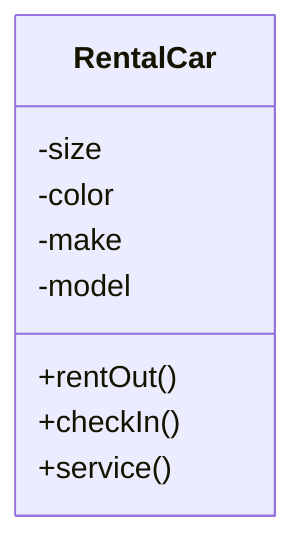

#### 1.3. Inheritance (Kế thừa)

- Class có thể có "con": một class được tạo ra từ class khác. Class gốc gọi là **base class** (lớp cha), class con gọi là **derived class** (lớp dẫn xuất).
- Derived class **kế thừa toàn bộ attributes và behaviors** của base class, và có thể **thêm** attributes/behaviors riêng.
- Ví dụ sách: class `Vehicle` (size, color, make, model, available, ratePerDay...) → hai lớp con `Car` (thêm `style`) và `Truck` (thêm `length, 4WheelDrive, manualShift`). Quan hệ đọc là "**is a**" (Car *is a* Vehicle).
- Lợi ích: **giảm công lập trình** — lập trình viên chỉ khai báo `Car` kế thừa `Vehicle` rồi bổ sung phần riêng; mọi thứ của `Vehicle` tự động thuộc về `Car`. Analyst "**định nghĩa một lần, dùng nhiều lần**" (tương tự dữ liệu ở dạng chuẩn 3 — 3NF — chỉ định nghĩa một lần trong một bảng).
- Ký hiệu **dấu trừ (−)** trước attribute = **private** (không chia sẻ với class khác); **dấu cộng (+)** trước method = **public** (class khác gọi được).
- Tái sử dụng code đã tồn tại từ lâu trong phát triển cấu trúc (COBOL, subprograms), nhưng **inheritance là đặc tính CHỈ có ở hệ thống hướng đối tượng**.

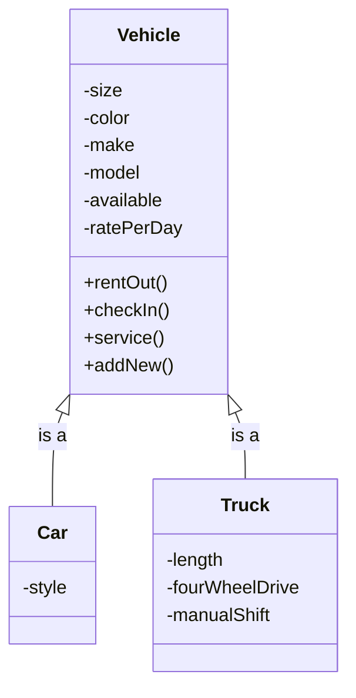

---

### 2. CRC Cards và Object Think

**CRC = Class, Responsibilities, Collaborators.** CRC cards dùng để biểu diễn **trách nhiệm của các class** và **tương tác giữa các class**. Analyst tạo thẻ dựa trên các **scenario** phác thảo yêu cầu hệ thống. Thẻ có thể làm thủ công trên giấy note (linh hoạt khi làm nhóm) hoặc trên máy tính.

Sách bổ sung 2 cột vào mẫu CRC gốc:
- **Object Think**: các câu tiếng Anh đơn giản, viết ở **ngôi thứ nhất** — vd: "I know my ISBN", "I know my author" → giúp suy ra **attributes**.
- **Property**: tên thuộc tính tương ứng (vd: `edition`, `publisher`).

#### Tiến hành một phiên CRC (CRC Session)

1. Nhóm analyst cùng nhau tìm class trong problem domain: **danh từ (nouns) → class**, **động từ (verbs) → responsibilities**.
2. **Brainstorm** tìm class (không phê phán ý kiến, gom càng nhiều càng tốt) → lọc bỏ cái phi logic → mỗi class một thẻ, **giao mỗi người "sở hữu" một class** trong suốt phiên.
3. Nhóm tạo **scenarios** — walkthrough các chức năng hệ thống lấy từ tài liệu yêu cầu; xét các luồng chuẩn trước, ngoại lệ (như khôi phục lỗi) sau.
4. Khi nhóm quyết định class nào chịu trách nhiệm chức năng nào, người sở hữu thẻ giơ thẻ lên: "I need to fulfill my responsibility" — **thẻ được giơ lên coi như một object và có thể làm việc**. Nhóm chia nhỏ trách nhiệm thành các task nhỏ hơn; nếu cần class khác chưa tồn tại → tạo mới.
5. **Responsibilities về sau tiến hóa thành methods**; câu Object Think trở thành **attributes**.

Ví dụ 4 thẻ CRC cho hệ course offerings: class `Course` cộng tác với 4 collaborators: `Department`, `Textbook`, `Assignment`, `Exam` — mỗi collaborator lại là một class với thẻ CRC riêng.

---

### 3. Khái niệm và sơ đồ UML (UML Concepts and Diagrams)

UML được chấp nhận và sử dụng rộng rãi — cung cấp **bộ công cụ chuẩn hóa để tài liệu hóa** phân tích và thiết kế phần mềm, như **bản vẽ thiết kế (blueprints)** giúp hình dung việc xây một tòa nhà. Tài liệu UML là phương tiện **giao tiếp hiệu quả giữa đội phát triển và đội nghiệp vụ**.

UML gồm 3 thành phần chính: **things, relationships, diagrams**.

#### 3.1. Things (các "thứ")

| Loại | Nội dung | Vai trò |
|---|---|---|
| **Structural things** | classes, interfaces, collaborations, use cases, active classes, components, nodes | Phổ biến nhất; tạo mô hình, mô tả quan hệ |
| **Behavioral things** | interactions, state machines | Mô tả cách mọi thứ **vận hành** |
| **Grouping things** | packages | Định nghĩa **ranh giới**, phân nhóm |
| **Annotational things** | notes | Thêm **ghi chú** vào sơ đồ |

#### 3.2. Relationships (quan hệ) — "chất keo" gắn kết things

- **Structural relationships** (dùng trong sơ đồ cấu trúc): **dependencies, aggregations, associations, generalizations** (vd: thể hiện inheritance).
- **Behavioral relationships** (dùng trong sơ đồ hành vi): **communicates, includes, extends, generalizes**.

#### 3.3. Diagrams (sơ đồ)

- **Structural diagrams** — mô tả quan hệ tĩnh giữa các class: **class diagram, object diagram, component diagram, deployment diagram**.
- **Behavioral diagrams** — mô tả tương tác giữa người dùng (**actor**) và hệ thống: **use case diagram, sequence diagram, communication diagram, statechart diagram, activity diagram**.

#### 3.4. Sáu sản phẩm UML dùng nhiều nhất & quan hệ giữa chúng

1. **Use case diagram** — mô tả cách hệ thống được sử dụng; **analyst bắt đầu từ đây**.
2. **Use case scenario** (về kỹ thuật không phải sơ đồ) — diễn đạt bằng lời các luồng, gồm cả **ngoại lệ** của hành vi chính.
3. **Activity diagram** — luồng hoạt động tổng thể; **mỗi use case có thể tạo một activity diagram**.
4. **Sequence diagram** — trình tự hoạt động và quan hệ class; **mỗi use case scenario có thể tạo một hoặc nhiều sequence diagram**. Thay thế được bằng **communication diagram** (cùng thông tin nhưng nhấn mạnh tổ chức/giao tiếp thay vì thời gian).
5. **Class diagram** — class và quan hệ; sequence diagram (cùng CRC cards) giúp **xác định class**. Nhánh mở rộng: **gen/spec diagram** (generalization/specialization).
6. **Statechart diagram** — chuyển trạng thái; **mỗi class có thể tạo một statechart** — hữu ích để **xác định methods** của class.

Chuỗi dẫn xuất: *Use case diagram → use case scenarios → activity diagram / sequence diagram → class diagram → statechart diagram* (và statechart quay lại giúp hoàn thiện class diagram).

---

### 4. Use Case Modeling (Mô hình hóa use case)

UML **đặt nền tảng trên use case modeling**. Use case model thể hiện **góc nhìn của người dùng**: mô tả hệ thống **làm gì (what)** mà không mô tả **làm thế nào (how)** — không chứa chi tiết kỹ thuật hay cài đặt. Có thể coi một use case như **một chuỗi giao dịch (transactions)** trong hệ thống.

Một use case **luôn mô tả 3 thứ**:
1. Một **actor** khởi tạo sự kiện;
2. **Sự kiện (event)** kích hoạt use case;
3. **Use case** thực hiện các hành động do sự kiện kích hoạt.

**Event** = một input đến hệ thống, xảy ra tại thời điểm và địa điểm cụ thể, khiến hệ thống phải làm gì đó. Use case tài liệu hóa **một giao dịch/sự kiện đơn lẻ**.

**Ví dụ xuyên suốt của sách — đăng ký học tại trường đại học** (Figure 10.6):
- Actor: `Student`, `Registration`, `Financial Office`, `Bookstore`, `Department`.
- Use case: `Add Student`, `Enroll in Class`, `Transfer Credits`, `Change Student Information`, `View Student Information`, `Verify Identity`, `Purchase Textbook`.
- `Add Student` **«include»** `Verify Identity` (bắt buộc xác minh danh tính); `Change Student Information` cũng «include» `Verify Identity` (nhập user ID + password).
- `Purchase Textbook` **«extend»** `Enroll in Class` (mở rộng tùy tình huống — vd khóa online).
- Lưu ý: `Add Student` **không nói cách thêm** sinh viên (trực tiếp, web, điện thoại...) — đúng tinh thần "what, not how". `Change Student Information` tưởng nhỏ nhưng ban quản trị coi là quan trọng (sinh viên tự cập nhật thông tin cá nhân) → **đáng được viết thành use case**; sinh viên không được đổi GPA, học phí còn nợ...

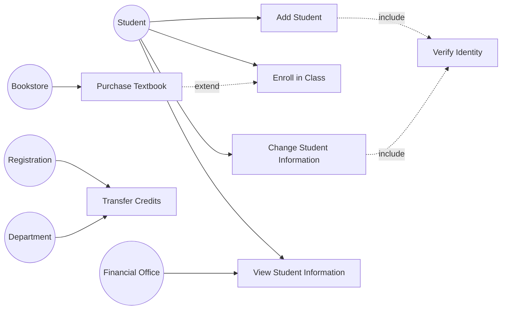

#### Use Case Scenario (kịch bản use case)

Là bản mô tả bằng lời, chia **3 vùng chính** (một số mục là tùy chọn theo tổ chức):

1. **Vùng header (định danh & khởi tạo)**: tên use case, UniqueID, Area, Actor(s), Description, Triggering Event, Trigger Type (External / Temporal).
2. **Steps Performed (Main Path)**: chuỗi bước thực hiện khi không có lỗi, kèm cột **Information for Steps** (dữ liệu dùng ở từng bước).
3. **Vùng footer**: **Preconditions, Postconditions, Assumptions, Requirements Met, Outstanding Issues, Priority, Risk**.

Ví dụ sách — *Change Student Information* (UniqueID: Student UC 005, actor: Student, trigger external): sinh viên logon web bảo mật → hệ thống đọc record + xác minh password → hiển thị thông tin hiện tại → sinh viên nhập thay đổi + Submit → validate → ghi **Change Student Journal record** → cập nhật **Student Master** → gửi trang xác nhận. Precondition: sinh viên đang ở đúng trang web; Assumption: có browser và user ID/password hợp lệ; Outstanding issue: có nên giới hạn số lần logon?

**Vai trò**: use case diagram là nền để tạo các sơ đồ khác (class, activity diagram); use case scenario giúp vẽ **sequence diagram**. Cả hai giúp hiểu hệ thống vận hành tổng quát ra sao.

---

### 5. Activity Diagrams (Sơ đồ hoạt động)

Activity diagram thể hiện **chuỗi các hoạt động** trong một quy trình, gồm hoạt động **tuần tự và song song**, cùng **các quyết định**. Thường tạo **cho một use case** và có thể thể hiện các scenario khác nhau.

#### Ký hiệu (Figure 10.8)

| Ký hiệu | Ý nghĩa |
|---|---|
| Chữ nhật bo tròn | **Activity** — thủ công (ký hợp đồng) hoặc tự động (method/chương trình) |
| Mũi tên | **Event** — điều xảy ra tại thời điểm, địa điểm cụ thể |
| Hình thoi | **Decision (branch)** — 1 vào, nhiều ra, kèm **guard condition** `[điều kiện]`; hoặc **Merge** — nhiều event gộp thành một |
| Thanh ngang dài | **Synchronization bar** — **fork** (1 vào, nhiều ra: các hoạt động chạy **song song**) / **join** (nhiều vào, 1 ra) |
| Chấm tròn đen | **Initial state** (bắt đầu) |
| Chấm đen trong vòng tròn | **Final state** (kết thúc) |
| **Swimlane** | Hình chữ nhật bao quanh, **phân vùng**: hoạt động nào chạy trên nền tảng nào (browser, server, mainframe) hoặc do nhóm người dùng nào thực hiện; thể hiện cả logic lẫn **trách nhiệm của class** |

#### Ví dụ sách — activity diagram cho use case *Change Student Information* với 3 swimlane: **Client Web Page / Web Server / Mainframe**

Sinh viên logon (điền form, Submit) → form truyền tới web server → server chuyển dữ liệu cho mainframe → mainframe truy cập database STUDENT → trả "Not Found" hoặc dữ liệu sinh viên → **decision**: không tìm thấy → hiển thị lỗi; tìm thấy → hiển thị dữ liệu hiện tại → sinh viên nhập thay đổi → validate trên server → lỗi → báo lỗi; hợp lệ → **update Student Record + ghi Change Student Journal Record** → gửi trang xác nhận → kết thúc. Sinh viên có thể **Cancel** từ trạng thái Logon hoặc Enter Changes.

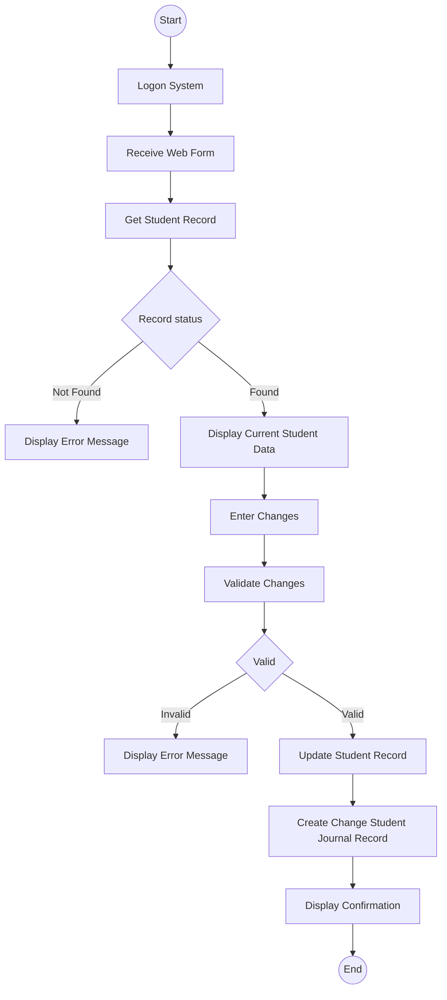

#### Cách tạo activity diagram

- Hỏi: **cái gì xảy ra trước, cái gì xảy ra sau?** Xác định tuần tự hay song song. Nếu đã có **physical DFD** (Chương 7) → dùng để suy ra trình tự. Tìm điểm quyết định và hỏi điều gì xảy ra với từng kết cục.
- Có thể tạo bằng cách xét **tất cả scenario của một use case** — mỗi đường đi qua các quyết định là một scenario khác nhau. Vd: main path = Logon → Receive Web Form → Get Student Record → Display Current Data → Enter Changes → Validate → Update → Journal → Confirmation; scenario khác = ... → Get Student Record → **Display Error Message**.
- **Swimlane** giúp: (1) thấy nơi dữ liệu phải **truyền/chuyển đổi giữa các nền tảng** — server dùng ASCII, mainframe dùng EBCDIC → cần **middleware** (IBM thường dùng **mqueue/message queue**, gọi chương trình mainframe viết bằng **CICS**); (2) đặt **quyết định ở đúng nền tảng** (nếu decision đánh giá ở server thì server phải gọi lại mainframe → chậm phản hồi); (3) **phân chia việc trong team**: web designer (client), lập trình viên Java/PHP/Ruby/Perl/.NET (server), lập trình viên CICS (mainframe); dữ liệu message queue có thể là **XML** (nhất là khi có tổ chức bên ngoài).
- Activity diagram là "**bản đồ của use case**" — analyst có thể thử di chuyển các phần thiết kế sang nền tảng khác để hỏi "What if?". Cũng dùng để **xây test plan** (test từng event, từng decision).

**Khi nào dùng activity diagram**: (1) giúp hiểu các hoạt động của use case; (2) luồng điều khiển phức tạp; (3) cần mô hình hóa **workflow**; (4) cần thể hiện **tất cả scenario**. **Không cần** khi use case đơn giản hoặc khi cần mô hình hóa **thay đổi trạng thái** (dùng statechart). Ngoài ra activity diagram còn dùng mô hình hóa **logic chi tiết của một method** cấp thấp.

**Repository entries**: mỗi state/event có thể được mô tả thêm bằng văn bản trong **repository** (kho mô tả text của dự án) — state: tên trang web, các phần tử trên trang...; event: dữ liệu cần truyền cho state kế tiếp, mô tả sự kiện gây transition (vd: button click).

---

### 6. Sequence Diagrams và Communication Diagrams

**Interaction diagram** = sequence diagram **hoặc** communication diagram — cả hai thể hiện **cùng một thông tin**. Chúng (cùng class diagram) được dùng trong **use case realization** — cách hiện thực hóa một use case.

#### 6.1. Sequence Diagram

- Minh họa **chuỗi tương tác giữa các class hoặc object instance theo thời gian**. Thường dùng để thể hiện quy trình mô tả trong **use case scenario**. Trong thực hành: dẫn xuất từ phân tích use case; trong thiết kế: dùng để suy ra **interactions, relationships, methods** của các object.
- **Ký hiệu**:
  - Actor và class/object đặt trong **hộp trên đầu sơ đồ**; **object khởi đầu ở ngoài cùng bên trái** (có thể là người — dùng ký hiệu actor, window, dialogue box, hoặc giao diện khác).
  - Quy ước tên hộp: `objectName:` = object; `:class` = class; `objectName:class` = object thuộc class.
  - **Đường thẳng đứng** = **lifeline** (từ lúc object được tạo đến khi bị hủy; dấu **X** cuối lifeline = object bị hủy). **Thanh dọc** trên lifeline = **focus of control** (object đang bận xử lý).
  - **Mũi tên ngang** = **message/signal** giữa các class; **message thuộc về class NHẬN**. Đầu mũi tên **đặc** = **synchronous call** (phổ biến nhất — bên gửi chờ phản hồi); đầu mũi tên **nửa/mở** = **asynchronous call** (gửi không chờ trả về — vd chạy chương trình từ menu). **Return** vẽ bằng mũi tên (thường nét đứt).
  - Cách ghi nhãn message: `messageName()`; `messageName(param1, param2)`; `messageName(parameterType:parameterName(defaultValue))`; hoặc **stereotype** như `«Create»` (tạo object mới).
  - **Thời gian chạy từ trên xuống dưới**: tương tác đầu tiên vẽ trên cùng.
- **Ví dụ sách — tuyển sinh (student admission)**: class `:newStudentUserInterface` gửi `initialize()` tới `:Student` (tạo record, trả studentNumber) → gửi `selectDorm()` tới `:Dorm` (trả dormRoom) → gửi `selectProgram()` tới `:Program` (trả programAdvisor) → gửi `studentComplete()` tới `:Student`.

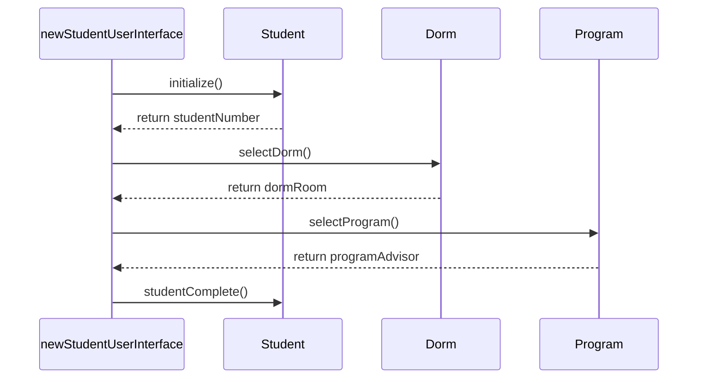

- **Trong phân tích**: sequence diagram ban đầu thể hiện actor + class + tương tác cho một quy trình cụ thể → dùng để **xác minh quy trình với chuyên gia nghiệp vụ**. Sequence diagram **nhấn mạnh trình tự thời gian (time ordering)** của message.
- **Trong thiết kế**: tinh chỉnh để suy ra **methods** và tương tác giữa class; message giúp nhận diện **quan hệ class**; actor chuyển thành **interfaces**; tương tác class chuyển thành **class methods**.

#### 6.2. Communication Diagram

- Ra đời trong **UML 2.0** (tên cũ ở UML 1.x: **collaboration diagram**). Mô tả tương tác của **hai hay nhiều thứ** cùng thực hiện một hành vi **vượt quá khả năng từng thứ riêng lẻ** (ví dụ: các bộ phận của động cơ ô tô "giao tiếp" với nhau để động cơ chạy khi tài xế đạp ga).
- Gồm **3 phần**: **objects (participants), communication links, messages** truyền trên các link. **Message được đánh số** để thể hiện trình tự thời gian (vd `1:initialize()`, `2:selectDorm()`...). Giá trị trả về cũng có thể được đánh số.
- Thể hiện **cùng thông tin với sequence diagram nhưng có thể khó đọc hơn**; **nhấn mạnh tổ chức của các object** (đường link cho thấy object này nối với object kia thế nào) thay vì trình tự thời gian.
- Một số phần mềm UML (IBM Rational Rose) **chuyển đổi tự động** giữa sequence ↔ communication diagram chỉ với một cú nhấp.

---

### 7. Class Diagrams (Sơ đồ lớp)

Phương pháp O-O làm việc để khám phá **classes, attributes, methods và relationships** giữa các class. Vì **lập trình diễn ra ở cấp class**, việc định nghĩa class là một trong những nhiệm vụ phân tích O-O quan trọng nhất. Class diagram thể hiện **đặc trưng tĩnh (static)** của hệ thống, không thể hiện xử lý cụ thể; đồng thời thể hiện **bản chất quan hệ giữa các class**. Class diagram cho thấy cả **nhu cầu lưu trữ dữ liệu lẫn nhu cầu xử lý**.

#### 7.1. Attributes (thuộc tính)

- Attribute là **những gì class biết về đặc điểm** của object; method là **những gì class biết cách làm**.
- Mức độ hiển thị (visibility):
  - `-` **private**: chỉ dùng trong object — **mặc định thông thường** cho attribute;
  - `#` **protected**: ẩn với mọi class trừ **subclass trực tiếp**;
  - `+` **public**: nhìn thấy từ class khác (hiếm khi dùng cho attribute).
- Đặt attribute private nghĩa là bên ngoài chỉ truy cập được **thông qua methods** — kỹ thuật **encapsulation (đóng gói) / information hiding (che giấu thông tin)**.
- Class diagram có thể hiển thị: chỉ tên class (khi sơ đồ phức tạp); tên + attributes; hoặc tên + attributes + methods. Attribute có thể ghi kèm **kiểu dữ liệu** (string, double, integer, date) và **giá trị khởi tạo**: vd `creditsCompleted: Decimal=0.0`. Nếu attribute chỉ nhận **hữu hạn giá trị** → ghi trong ngoặc nhọn: `studentType:char{F,P,N}`.

#### 7.2. Methods (phương thức)

- Vì information hiding, method thường **public** (dấu `+`) để class khác gọi được. Method có **ngoặc đơn** — có thể truyền dữ liệu qua **parameters**.
- Hai loại: **standard methods** (mọi class đều biết làm, vd tạo instance mới) và **custom methods** (thiết kế riêng cho class).

#### 7.3. Method Overloading (nạp chồng phương thức)

- Là việc **định nghĩa cùng một method nhiều lần trong một class**, miễn là **message signature khác nhau** (signature = tên method + parameters): khác **số lượng** tham số hoặc khác **kiểu** tham số.
- Ví dụ: dấu `+` trong nhiều ngôn ngữ — hai số thì cộng, hai chuỗi thì nối. Ví dụ ngân hàng: method deposit check với phiếu gửi tiền chỉ có số tiền, hoặc có thêm số tiền mặt cần trả lại — **cùng method, tham số khác nhau**.

#### 7.4. Bốn loại class

1. **Entity class**: đại diện sự vật thực (người, vật...) — chính là các entity trên **E-R diagram** (CASE tool như Visible Analyst có thể chuyển entity E-R thành UML entity class). Analyst chỉ đưa vào những attribute **tổ chức thực sự dùng** (cùng một sinh viên: trường học cần GPA, tín chỉ; cửa hàng quần áo online cần số đo, màu ưa thích).
2. **Boundary/Interface class**: cho người dùng làm việc với hệ thống. Hai nhóm: **human interface** (display, window, Web form, dialogue box, menu, list box, điện thoại phím, mã vạch... — nên prototype, dùng storyboard) và **system interface** (gửi/nhận dữ liệu với hệ thống khác — thường là file **XML**; giao diện ngoài **kém ổn định nhất** vì không kiểm soát được đối tác; XML giúp chuẩn hóa: bên nhận có thể **bỏ qua phần tử mới thêm** mà không lỗi). Attribute = những gì trên display/report; method = thao tác với display/tạo report.
3. **Abstract class**: **không thể instantiate trực tiếp**; nối với concrete class trong quan hệ **gen/spec**; tên thường in **nghiêng**.
4. **Control class** (active class): **điều phối luồng hoạt động**; thường được suy ra trong **thiết kế**; nhiều control class nhỏ giúp tăng tái sử dụng. Ví dụ logon: một control class xử lý riêng màn hình logon, chuyển dữ liệu cho một **validation control class tổng quát** kiểm tra ID/password từ nhiều giao diện khác nhau → tách logic xác minh khỏi xử lý giao diện.

**Quy tắc khi vẽ sequence diagram với các loại class**: interface class **phải** nối với control class; entity class **phải** nối với control class; interface class **không bao giờ nối trực tiếp** với entity class.

#### 7.5. Định nghĩa messages và methods

- Mỗi message định nghĩa bằng ký pháp giống **data dictionary** (Chương 8): danh sách parameters truyền đi + phần tử trong message trả về. Logic method mô tả bằng **structured English, decision table, hoặc decision tree** (Chương 9).
- **Horizontal balancing**: mọi dữ liệu trả về từ entity class phải đến từ (1) attributes lưu trong class, (2) parameters truyền vào, hoặc (3) kết quả **tính toán** của method → kiểm tra method có đủ thông tin để hoàn thành việc.

---

### 8. Nâng cấp Sequence Diagram (Enhancing Sequence Diagrams)

Sau khi có class diagram, quay lại sequence diagram và dùng **ký hiệu đặc biệt (stereotypes)** cho từng loại class — stereotype là **phần mở rộng của UML**, dùng nhiều khi thiết kế O-O, cho analyst tự do "chơi" với thiết kế để **tối ưu tái sử dụng**. Các bước tiếp cận hệ thống:

1. Đưa **actor** từ use case diagram vào (hình người que); có thể có actor bổ sung bên phải (vd công ty thẻ tín dụng, ngân hàng).
2. Định nghĩa **một hoặc nhiều interface class cho MỖI actor** (mỗi actor có interface class riêng).
3. Tạo **prototype web pages** cho mọi human interface.
4. Đảm bảo mỗi use case có **một control class** (có thể thêm khi thiết kế chi tiết).
5. Xét use case để tìm các **entity class** hiện diện → đưa vào sơ đồ.
6. Chấp nhận rằng sequence diagram **sẽ được sửa tiếp** khi thiết kế chi tiết (thêm web page, control class — một cho mỗi Web form submit).
7. Để tăng tái sử dụng, cân nhắc **chuyển method từ control class sang entity class**.

**Ví dụ Web của sách** (Figure 10.15 — sinh viên xem thông tin cá nhân và khóa học): `:View Student User Interface` (interface class) nhận userLogon → `logon()` tới `:View Student Interface Controller` (control class — điều phối mọi message) → `getStudent()` tới `:Student` (entity) → trả studentData → trả studentWebPage hiển thị trên browser → sinh viên click nextButton → gửi `studentNumber()` → controller gửi `getSection()` tới `:Section` → trả sectionGrade; `:Section` gửi `calculateGPA()` tới `:Calculate Grade Point Average` (control) → `getCourse()`/`getCredits()` tới `:Course` → trả credits → tính GPA trả về controller → lặp cho đến hết các section → trả courseWebPage hiển thị.

Điểm mấu chốt: nếu `studentNumber` không được gửi tự động kèm form thì sinh viên phải **gõ lại** — giao diện tồi (redundant keying). Có **3 cách lưu và truyền lại dữ liệu từ web page**:

1. **Đưa vào URL** (vd `...studentinq.html?studentNumber=12345`): dễ làm, hay dùng ở search engine; nhược điểm — **riêng tư** (ai cũng đọc được; không dùng cho thông tin y tế, số thẻ tín dụng; browser gợi ý lại địa chỉ cũ → nguy cơ **identity theft**); dữ liệu **mất khi đóng browser**.
2. **Cookie** (file nhỏ lưu trên máy client): cách **duy nhất có persistence** (tồn tại qua các phiên browser) — cho phép "Welcome back, Robin". Thường lưu **primary key/account number**, không lưu thẻ tín dụng. Giới hạn **20 cookie/domain**, mỗi cookie **≤ 4.000 ký tự**; cần **kiểm soát tập trung tên cookie**; cần hơn 20 → tạo thêm domain con (support.cpu.edu...).
3. **Hidden web form fields**: trường ẩn do server gửi, không chiếm chỗ trên trang; khi Submit thì gửi kèm về server; **không lưu giữa các phiên** → bảo toàn riêng tư.

#### Ba lớp (layers) trong sequence diagram

1. **Presentation layer** — những gì user thấy: chứa **interface/boundary classes**.
2. **Business layer** — các quy tắc nghiệp vụ riêng của ứng dụng: chứa **control classes**.
3. **Persistence (data access) layer** — lấy và lưu dữ liệu: chứa **entity classes**.

Lý tưởng là code viết tách riêng từng lớp. Nhưng **Ajax** (Asynchronous JavaScript and XML — tập kỹ thuật cho phép ứng dụng web lấy dữ liệu từ server **mà không thay đổi hiển thị trang hiện tại**, không phải reload cả trang) làm **mờ ranh giới**: nhiều validation/control logic chuyển sang JavaScript phía browser → **business rules nằm ở cả boundary lẫn control class**, có thể không tách được 3 lớp thuần túy.

---

### 9. Nâng cấp Class Diagram (Enhancing Class Diagrams)

Ký hiệu class đặc biệt (entity/boundary/control) cũng dùng được trên class diagram và communication diagram. Với **interface class**: attribute = các control (field) trên màn hình/form, method = thao tác với màn hình (submit, reset — có thể là JavaScript). Với **control class**: attribute = biến dùng nội bộ, method = tính toán, ra quyết định, gửi message. Với **entity class**: attribute = dữ liệu lưu cho entity, method = tạo/sửa/xóa/lấy/in. Một website có thể phối hợp rất nhiều class (có class chỉ có method 1 dòng code) để đạt mục tiêu **tái sử dụng**.

#### 9.1. Relationships (quan hệ giữa các class)

Quan hệ = kết nối giữa các class (giống trên E-R diagram), vẽ bằng **đường nối**. Hai nhóm: **associations** và **whole/part relationships**.

**Association** — quan hệ cấu trúc đơn giản nhất, vẽ bằng đường thẳng; hai đầu ghi **multiplicity** (tương đương cardinality trên E-R):

| Ký hiệu | Nghĩa |
|---|---|
| `0..1` | không hoặc một |
| `1` | đúng một |
| `*` | nhiều |
| `1..*` | một đến nhiều |
| `5..*`, `1..10`, `2,3,4` | giới hạn tùy ý (min, max, hoặc liệt kê) |

Association thường được **đặt tên mô tả** (vd Student *enrolls in* Course). Ví dụ sách: GraduateStudent 1–1 Thesis (has); Student 1..* Course (enrolls in); Student 0..1 DormRoom (is assigned to); Student –* VolunteerActivity (participates in).

- **Association class**: dùng để **tách quan hệ nhiều-nhiều** (tương tự associative entity trên E-R). Student ↔ Course nhiều-nhiều → thêm class `Section` (nối bằng **đường chấm** vào đường quan hệ).
- **Reflexive association**: object trong một class quan hệ với object **cùng class** — vd task có precedent task, nhân viên giám sát nhân viên khác; vẽ đường nối class với chính nó, ghi **role names**.

**Whole/Part relationship** — một class là **tổng thể (whole)**, các class khác là **bộ phận (part)**; whole là "container" chứa các part; vẽ bằng đường có **hình thoi** ở phía whole. Ví dụ: hệ thống máy tính gồm máy tính, máy in, màn hình; hoặc màn hình GUI chứa list, box, radio button, header/body/footer. Ba loại:

1. **Aggregation** — quan hệ "**has a**": whole là tổng của các part; **hình thoi RỖNG**; quan hệ **yếu hơn** — bỏ whole thì part vẫn tồn tại (bỏ department, course vẫn còn; gói máy tính ngừng bán nhưng máy in vẫn tồn tại).
2. **Collection** — whole và **các thành viên (members)**: khu bầu cử với cử tri, thư viện với sách; thành viên thay đổi nhưng whole giữ nguyên bản sắc; **liên kết yếu**.
3. **Composition** — whole **chịu trách nhiệm về** part; **quan hệ mạnh hơn**, **hình thoi ĐẶC**; từ khóa: whole "**always contains**" part; **xóa whole → xóa hết part** (hợp đồng bảo hiểm hủy → các điều khoản bổ sung/riders hủy theo; xóa course → xóa assignments và exams; trong database: referential integrity đặt **delete cascading**).

#### 9.2. Generalization/Specialization (Gen/Spec) Diagram

Gen/spec diagram được coi là **class diagram nâng cao** — khi cần tách cái tổng quát khỏi cái cụ thể (koala *là* động vật hay *là một loại* động vật? koala còn có thể là thú nhồi bông...).

- **Generalization**: quan hệ giữa cái tổng quát và cái cụ thể hơn — quan hệ "**is a**" (car *is a* vehicle). Lớp tổng quát = **superclass / base class / parent class**; lớp chuyên biệt = **subclass / derived class / child class**. **Mũi tên chỉ về superclass**.
- **Inheritance**: khi nhiều class có chung attributes/methods → tạo lớp tổng quát chứa phần chung; lớp chuyên biệt **kế thừa** và có thêm phần riêng → **tái sử dụng code + dễ bảo trì** ("định nghĩa một lần, dùng nhiều lần"). Đặc sản O-O: **thư viện class khổng lồ** sẵn có ở Java, .NET, C#.
- **Polymorphism** ("nhiều hình thái") = **method overriding** (KHÁC method overloading): chương trình O-O có nhiều phiên bản của **cùng một method cùng tên** trong quan hệ superclass/subclass. Subclass kế thừa method của cha nhưng có thể **sửa đổi/bổ sung** (vd khách hàng được thêm chiết khấu số lượng → method tính tổng đơn được sửa ở subclass). Khi method định nghĩa nhiều lần, **bản cụ thể nhất (thấp nhất trong cây)** được dùng — chương trình "đi ngược lên chuỗi class" tìm method.
- **Abstract class trong gen/spec**: lớp tổng quát trở thành abstract class — **không có instance trực tiếp**, chỉ dùng cùng lớp chuyên biệt; thường có attributes và ít methods.
- Ví dụ sách (Figure 10.20): `Person` (abstract — lastName, firstName, địa chỉ, điện thoại, email; changeAddress(), changeName()) → `Student` (studentNumber, GPA...) và `Employee` (salary, dateHired...) → `Employee` lại có `Faculty` (degree, position, webURL) và `Administrator` (title). Sinh viên không có salary, nhân viên không có GPA → phải tách lớp.
- **Động từ đặc biệt định nghĩa subclass** (viết liền): `isa` ("is a" — không phân biệt is a/is an), `isakinda` ("is a kind of"), `canbea` ("can be a"). Vd: Faculty **isa** Employee; Administrator **isakinda** Employee; Employee **canbea** Faculty.

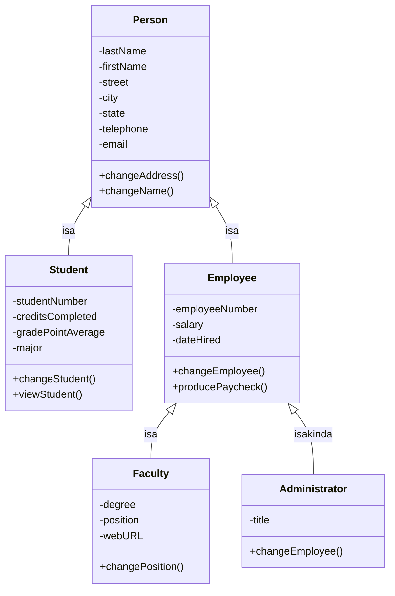

#### 9.3. Tìm class và xác định methods

- **Nhận diện abstract class**: nhiều class/bảng có cùng phần tử hoặc cùng method → **rút phần chung** thành lớp tổng quát (vd ngân hàng: rút tiền, trả nợ vay, viết séc — đều có method **trừ tiền khỏi số dư**).
- **Tìm class**: qua **phỏng vấn, JAD sessions** (Chương 4), phiên làm việc nhóm, **brainstorming**, phân tích tài liệu/memo; dễ nhất là **phương pháp CRC**; và **tìm DANH TỪ trong use case** — mỗi danh từ là một **candidate class** (gọi là "ứng viên" vì có danh từ thực ra là attribute). Mỗi class phải tồn tại cho một object rõ ràng; hỏi **class biết gì (attributes)** và **biết làm gì (methods)**; xác định quan hệ + multiplicity; nhiều-nhiều → tạo **intersection/associative class**.
- **Xác định methods**: một số method chuẩn luôn có, như `new()` hay stereotype `«create»` (ký hiệu « » gọi là **guillemets/chevrons**, không phải cặp dấu <>). Cách hữu ích khác: xét **ma trận CRUD** (Chương 7): **C** → thêm method `new()`; **R** → method find/view/print; **U** → `update()`/`change()`; **D** → `delete()`/`remove()`.
- **Messages**: để làm việc hữu ích, các class phải **giao tiếp** bằng message (giống lời gọi hàm) — message vừa là lệnh bảo class nhận làm gì; gồm **tên method ở class nhận + parameters**; class nhận **phải có method trùng tên message**. Message có thể coi là output/input giữa hai class. Nếu có **physical child DFD**: data flow giữa hai primitive process = message; primitive process = **candidate method**.

---

### 10. Statechart Diagrams (Sơ đồ trạng thái)

Statechart (state transition) diagram là một cách khác để **xác định class methods** — xem xét **các trạng thái (states)** mà một object có thể có. Statechart được tạo **cho MỘT class duy nhất**. Object thường được tạo ra, trải qua thay đổi, rồi bị xóa.

- **State** = tình trạng của object tại một thời điểm — được xác định bởi **giá trị các attribute** (đôi khi có attribute riêng chỉ trạng thái, vd Order Status: pending, picking, packaged, shipped, received). Tên state: **mỗi từ viết hoa chữ đầu**, duy nhất, có nghĩa với user. State có **entry/exit actions** (việc phải làm mỗi khi vào/ra state).
- **Event** = điều xảy ra tại thời điểm, địa điểm cụ thể → làm object **đổi trạng thái**, ta nói transition "**fires**". **States ngăn cách events, và events ngăn cách states**. Transition event đặt tên ở **thì quá khứ** (vì nó đã xảy ra mới tạo ra transition).
- **Guard condition**: điều kiện đúng/sai phải thỏa để event gây transition — ghi trong **ngoặc vuông** cạnh nhãn event (vd "Click to confirm order", hoặc điều kiện trong method như hết hàng).
- **Deferred events**: sự kiện bị **giữ lại** đến khi object sang trạng thái chấp nhận được — vd user gõ phím khi word processor đang backup định kỳ; backup xong thì text mới hiện ra.
- **Ba loại event**: (1) **Signals/asynchronous messages** — bên gọi không chờ trả lời (chạy tính năng từ menu); (2) **Synchronous messages** — gọi hàm/subroutine, bên gọi dừng chờ; (3) **Temporal events** — xảy ra vào **thời điểm định trước**, thường **không có actor** hay sự kiện ngoài.
- **Persistence**: object vật chất tồn tại lâu; chuyến bay, buổi hòa nhạc — persistence ngắn hơn; **transient objects** không sống qua phiên làm việc (bộ nhớ chính, dữ liệu URL, web page, màn hình CICS) — muốn giữ phải **lưu thông tin về chúng** (vd cookie).
- **Liên hệ với methods & giao diện**: mỗi lần object đổi state → một số attribute đổi giá trị → **phải có method** thay đổi các attribute đó → mỗi method cần **display/Web form** để nhập/sửa (form thường có thêm khóa chính, thông tin định danh...). Ngoại lệ: **temporal event** có thể dùng bảng database hoặc queue.

**Ví dụ sách — sinh viên nhập học**: các state: Potential Student → Accepted Student → Dorm Assigned Student → Program Student → Current Student → Continuing Student → Graduated Student. Mỗi state gắn: Event, Method, Attributes changed, User interface. Vd state *Potential Student*: event = Application Submitted, method = `new()`, attributes = Number/Name/Address, UI = Student Application Web Form; *Accepted Student*: event = Requirements Met, method = `acceptStudent()`, attributes = Admission Date, Student Status, Return Acceptance Letter, UI = Accept Student Display; *Dorm Assigned Student*: event = Dorm Selected, method = `assignDorm()`, attributes = Dorm Name, Dorm Room, Meal Plan.

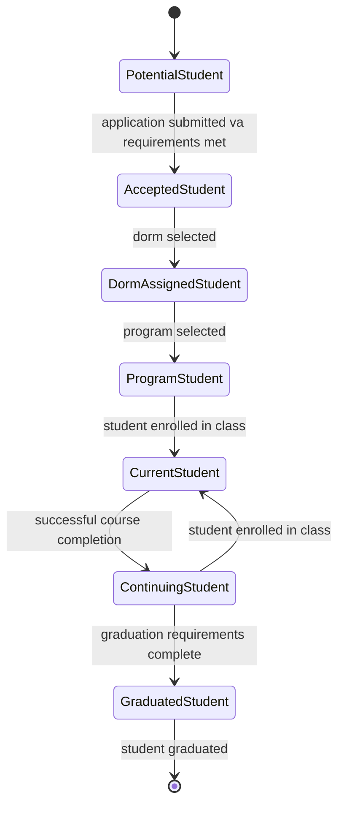

**Khi nào tạo statechart** (không phải class nào cũng cần):
1. Class có **vòng đời phức tạp**;
2. Instance của class **cập nhật attributes theo nhiều cách** trong vòng đời;
3. Class có **vòng đời vận hành (operational life cycle)**;
4. **Hai class phụ thuộc lẫn nhau**;
5. Hành vi hiện tại của object **phụ thuộc điều đã xảy ra trước đó**.

**Kiểm tra sơ đồ**: tìm lỗi/ngoại lệ — event có xảy ra sai thời điểm không, đã đủ mọi event/state chưa. **Hai lỗi cần tránh**: state chỉ có transition đi **vào** hoặc chỉ có transition đi **ra** — mỗi state phải có **ít nhất một transition vào VÀ một transition ra**. Statechart có thể dùng ký hiệu start (chấm đen) và end (vòng tròn đồng tâm) như activity diagram.

---

### 11. Packages và các artifact UML khác

- **Package** là **vật chứa (container)** cho các thứ UML khác (use cases, classes...). Package thể hiện **phân vùng hệ thống (system partitioning)**: **logical packages** (class/use case nào thuộc subsystem nào), **component packages** (chứa thành phần vật lý), **use case packages** (nhóm các use case). Ký hiệu: **hình folder** (tên ghi ở tab hoặc giữa folder). Đóng gói có thể làm ngay khi phân tích hoặc khi thiết kế. Package cũng có **quan hệ** (association, inheritance) như class diagram.
  - Ví dụ sách (Figure 10.23): package **Student** chứa Add Student, Enroll in Class, Transfer Credits, View Student Information; package **Faculty** chứa Add Faculty, View Faculty Information, Assign Faculty to Course.
- **Component diagram**: giống class diagram nhưng là **cái nhìn toàn cảnh (bird's-eye view) kiến trúc hệ thống** — thể hiện các thành phần (class file, package, shared library, database...) và quan hệ giữa chúng; chi tiết từng component nằm ở các sơ đồ khác.
- **Deployment diagram**: minh họa **triển khai vật lý** — phần cứng, quan hệ giữa các phần cứng, hệ thống được deploy lên đó (server, workstation, printer...).
- **Annotational things — Notes**: ghi chú gắn vào bất cứ thứ gì trong UML (object, behavior, relationship, diagram) cần mô tả chi tiết/giả định/thông tin liên quan. Ký hiệu: **tờ giấy gấp góc** nối bằng đường kẻ tới vùng cần giải thích. Thành công của UML dựa trên **tài liệu hóa đầy đủ, chính xác** — notes giúp đội phát triển "cùng một trang".

---

### 12. Đưa UML vào thực tế (Putting UML to Work) — quy trình 6 bước

Giá trị của sản phẩm UML phụ thuộc **trình độ của analyst khi dùng công cụ**. Ban đầu analyst dùng UML tách yêu cầu hệ thống thành **use case model** (mô tả use cases + actors) và **object model** (mô tả objects, associations, responsibilities, collaborators, attributes).

1. **Định nghĩa use case model**: tìm **actors** (xem yêu cầu hệ thống, phỏng vấn chuyên gia nghiệp vụ) → nhận diện các **sự kiện chính** do actor khởi tạo, xây dựng các **primary use cases** mức rất cao theo góc nhìn từng actor → vẽ **use case diagrams** → tinh chỉnh primary use cases thành mô tả chi tiết; viết **use case scenarios** cho các **luồng thay thế (alternate flows)** → **review với chuyên gia nghiệp vụ**, sửa đến khi họ đồng ý là đầy đủ, chính xác.
2. **Tiếp tục vẽ UML trong pha phân tích**: dẫn xuất **activity diagrams** từ use case diagrams; xây **sequence và communication diagrams** từ use case scenarios; review sequence diagrams với chuyên gia nghiệp vụ (dịp để họ **nghĩ lại và tinh chỉnh quy trình ở mức nguyên tử hơn**).
3. **Phát triển class diagrams**: tìm **danh từ** trong use cases → potential objects → tìm điểm giống/khác (theo state/behavior) → tạo class; xác định quan hệ chính ("has a", "is a"); xét use case + sequence diagram để xác định class; bắt đầu từ những use case **quan trọng nhất**; một class diagram có thể đại diện nhiều use case liên quan.
4. **Vẽ statechart diagrams**: cho một số class để phân tích sâu hơn (các quy trình phức tạp mà sequence diagram không lột tả hết); dùng statechart **xác định methods**; suy ra attributes từ use cases, chuyên gia nghiệp vụ, class methods; đánh dấu **public/private**; statechart **rất hữu ích để chỉnh sửa class diagram**.
5. **Bắt đầu thiết kế hệ thống** bằng cách tinh chỉnh sơ đồ UML: review toàn bộ sơ đồ; viết **class specifications** (attributes, methods, mô tả); viết **methods specifications** (input/output, xử lý nội bộ chi tiết); tạo thêm sequence diagrams (nếu cần) phản ánh methods thực tế; vẽ class diagram với **ký hiệu boundary/entity/control**; phân tích class diagram để suy ra **system components** (nhóm class liên quan compile & deploy cùng nhau — .DLL, .COM object, Java Bean, package...); vẽ **deployment diagrams**.
6. **Tài liệu hóa thiết kế chi tiết** — bước then chốt: thông tin cung cấp cho đội phát triển càng đầy đủ, việc phát triển càng **nhanh** và sản phẩm cuối càng **vững chắc**.

### 13. Tầm quan trọng của việc dùng UML để mô hình hóa

- Dùng UML **lặp đi lặp lại (iteratively)** trong phân tích và thiết kế → **hiểu biết chung giữa đội nghiệp vụ và đội IT** về yêu cầu và quy trình. Vòng lặp đầu ở mức **rất cao** (mục tiêu tổng thể, xác định actor, use case model ban đầu); các vòng sau tinh chỉnh dần qua use case scenarios, class/sequence/statechart diagrams — mỗi vòng nhìn **chi tiết hơn** cho đến khi things và relationships được định nghĩa **rõ ràng, chính xác** trong tài liệu UML.
- Khi hoàn tất, bạn có bộ **đặc tả chính xác, chi tiết** cho classes, scenarios, activities, sequencing. Mức độ kỹ lưỡng của phân tích/thiết kế tỉ lệ với thời gian phát triển và **chất lượng sản phẩm**.
- Điều hay bị bỏ quên: dự án càng tiến xa, **chi phí thay đổi yêu cầu càng đắt**. Sửa thiết kế bằng CASE tool hay trên giấy trong pha phân tích/thiết kế **dễ, nhanh, rẻ hơn nhiều** so với sửa trong pha phát triển (redesign, recode, retest). Một số nhà tuyển dụng thiển cận nghĩ chỉ khi lập trình viên **gõ code** mới là làm việc, đánh giá năng suất bằng lượng code — không nhận ra việc vẽ sơ đồ **tiết kiệm thời gian và tiền bạc**.
- Phép loại suy **xây nhà**: không ai muốn sống trong ngôi nhà xây không có bản vẽ; "Đưa dự án lên giấy trước khi code rốt cuộc rẻ hơn — **xóa một sơ đồ rẻ hơn nhiều so với sửa code**." Xác nhận phân tích/thiết kế trên giấy (qua sơ đồ UML) với các **chuyên gia nghiệp vụ** giúp đảm bảo hệ thống hoàn thành đáp ứng đúng yêu cầu.

---

## 🔑 Bảng thuật ngữ (Keywords and Phrases)

| Thuật ngữ (EN) | Nghĩa tiếng Việt |
|---|---|
| abstract class | lớp trừu tượng — không thể instantiate trực tiếp, dùng trong gen/spec |
| activity diagram | sơ đồ hoạt động — chuỗi hoạt động tuần tự/song song và quyết định |
| actor | tác nhân — người/thứ bên ngoài khởi tạo sự kiện, dùng hệ thống |
| aggregation | quan hệ kết tập — whole/part "has a", hình thoi rỗng, quan hệ yếu |
| Ajax (Asynchronous JavaScript and XML) | kỹ thuật cho web lấy dữ liệu từ server không cần reload trang |
| annotational thing | thành phần chú giải — notes gắn vào sơ đồ |
| association | quan hệ liên kết — kết nối cấu trúc giữa các class, có multiplicity |
| asynchronous message | thông điệp bất đồng bộ — gửi không chờ trả lời |
| boundary class (interface class) | lớp biên/giao diện — nơi user hoặc hệ thống khác tương tác |
| branch | rẽ nhánh — quyết định trên activity diagram (hình thoi) |
| class | lớp — khuôn định nghĩa attributes + methods chung của các object |
| class diagram | sơ đồ lớp — thể hiện class, attribute, method và quan hệ (tĩnh) |
| communication diagram | sơ đồ giao tiếp — như sequence nhưng nhấn mạnh tổ chức object |
| control class | lớp điều khiển — điều phối luồng hoạt động giữa các class |
| CRC cards | thẻ Class–Responsibilities–Collaborators |
| dependencies | quan hệ phụ thuộc (một loại structural relationship) |
| deployment diagram | sơ đồ triển khai — cài đặt vật lý phần cứng/hệ thống |
| entity class | lớp thực thể — biểu diễn sự vật thực (người, vật...) |
| event | sự kiện — xảy ra tại thời điểm/địa điểm cụ thể, gây transition |
| fork | phân nhánh song song — 1 luồng tách thành nhiều luồng (sync bar) |
| generalization/specialization (gen/spec) diagram | sơ đồ tổng quát hóa/chuyên biệt hóa — class diagram nâng cao thể hiện kế thừa |
| inheritance | kế thừa — lớp con nhận attributes/behaviors của lớp cha |
| join | hợp luồng — nhiều luồng song song gộp thành một |
| main path | luồng chính — chuỗi bước khi không có lỗi trong use case scenario |
| merge | gộp — nhiều event kết hợp thành một (hình thoi) |
| message | thông điệp — tên method + parameters gửi giữa các class |
| method overloading | nạp chồng phương thức — cùng tên method, khác signature, trong một class |
| method overriding | ghi đè phương thức — subclass định nghĩa lại method của superclass (= polymorphism) |
| object | đối tượng — biểu diễn của người/nơi/vật liên quan hệ thống |
| object-oriented (O-O) | hướng đối tượng |
| package | gói — vật chứa nhóm các thứ UML (ký hiệu folder) |
| polymorphism | đa hình — nhiều phiên bản cùng method trong quan hệ cha/con |
| primary use case | use case chính — mức cao, mô tả sự kiện theo góc nhìn actor |
| relationship | quan hệ — "chất keo" nối các things trong UML |
| sequence diagram | sơ đồ tuần tự — tương tác giữa class/object theo thứ tự thời gian |
| state | trạng thái — tình trạng của object tại một thời điểm |
| statechart diagram | sơ đồ trạng thái — các state của một class và transitions |
| swimlane | làn phân vùng — chia activity diagram theo nền tảng/nhóm chịu trách nhiệm |
| synchronization bar | thanh đồng bộ — thể hiện fork/join (hoạt động song song) |
| synchronous message | thông điệp đồng bộ — bên gửi chờ phản hồi |
| temporal event | sự kiện thời gian — xảy ra vào thời điểm định trước, không cần actor |
| unified modeling language (UML) | ngôn ngữ mô hình hóa thống nhất — bộ công cụ chuẩn tài liệu hóa phân tích/thiết kế |
| use case diagram | sơ đồ use case — actor và cách hệ thống được sử dụng |
| use case scenario | kịch bản use case — mô tả bằng lời các bước, điều kiện, ngoại lệ |
| whole/part relationship | quan hệ tổng thể/bộ phận — aggregation, collection, composition |

---

## ❓ Trả lời Review Questions

**1. Nêu hai lý do dùng cách tiếp cận hướng đối tượng trong phát triển hệ thống.**
(1) **Tái sử dụng (reusability)**: các object/class được thiết kế để dùng lại, giảm chi phí phát triển — đặc biệt hiệu quả với GUI và database; "định nghĩa một lần, dùng nhiều lần". (2) **Dễ bảo trì (maintainability)**: object chứa cả dữ liệu lẫn mã chương trình trong một khối tự chứa, nên thay đổi ở một object có **tác động tối thiểu** lên các object khác.

**2. Mô tả sự khác nhau giữa class và object.**
**Class** là định nghĩa/khuôn mẫu: tập **attributes và behaviors chung** cho mọi object thuộc nó — đơn vị phân tích chính của O-O. **Object** là một **thể hiện cụ thể** (instance) được tạo ra từ class (quá trình **instantiate**), với giá trị attribute riêng. Ví dụ: class `Student` định nghĩa mọi sinh viên có studentNumber, name...; object là sinh viên cụ thể "Mala Kaul".

**3. Giải thích khái niệm inheritance trong hệ thống O-O.**
Inheritance là việc một class được tạo ra từ class khác: lớp gốc là **base class** (cha), lớp mới là **derived class** (con). Lớp con **tự động kế thừa toàn bộ attributes và behaviors** của lớp cha mà không cần lập trình lại, đồng thời có thể có attributes/behaviors riêng. Điều này giảm công lập trình, tăng tái sử dụng ("định nghĩa một lần, dùng nhiều lần") và là đặc tính **chỉ có ở hệ thống hướng đối tượng**.

**4. CRC là viết tắt của gì?**
**Class, Responsibilities, Collaborators** (lớp, các trách nhiệm, các lớp cộng tác).

**5. Object Think bổ sung gì cho thẻ CRC?**
Object Think thêm các **câu tiếng Anh đơn giản viết ở ngôi thứ nhất** — vd "I know my ISBN", "I know my author" — cùng cột **Property** ghi tên thuộc tính tương ứng. Mục đích: làm rõ tư duy, khuyến khích nhóm phân tích mô tả càng nhiều càng tốt trong phiên CRC, và các câu này được dùng để **suy ra attributes** trong UML.

**6. UML là gì?**
UML (Unified Modeling Language) là **bộ công cụ chuẩn hóa để tài liệu hóa phân tích và thiết kế** hệ thống phần mềm. Các sơ đồ UML giúp hình dung việc xây dựng hệ thống O-O như bản vẽ blueprint giúp hình dung việc xây nhà; là phương tiện giao tiếp hiệu quả giữa đội phát triển và đội nghiệp vụ. UML đặt nền tảng trên kỹ thuật **use case modeling**.

**7. Ba thành phần chính của UML là gì?**
**Things** (các thứ), **relationships** (quan hệ) và **diagrams** (sơ đồ).

**8. Structural things gồm những gì?**
Classes, interfaces, collaborations, use cases, active classes, components, nodes — là loại thing phổ biến nhất, cung cấp cách tạo mô hình và cho phép mô tả quan hệ.

**9. Behavioral things gồm những gì?**
**Interactions** (tương tác) và **state machines** (máy trạng thái) — mô tả cách mọi thứ vận hành.

**10. Hai loại sơ đồ chính trong UML?**
**Structural diagrams** (sơ đồ cấu trúc) và **behavioral diagrams** (sơ đồ hành vi).

**11. Liệt kê các sơ đồ thuộc structural diagram.**
Class diagram, object diagram, component diagram, deployment diagram.

**12. Liệt kê các sơ đồ thuộc behavioral diagram.**
Use case diagram, sequence diagram, communication diagram, statechart diagram, activity diagram.

**13. Use case model mô tả điều gì?**
Mô tả hệ thống theo **góc nhìn người dùng**: hệ thống **làm gì (what)** mà **không mô tả cách làm (how)** — không có chi tiết kỹ thuật/cài đặt. Nó phân hoạch chức năng hệ thống thành các hành vi (use cases) có ý nghĩa với người dùng (actors), dựa trên tương tác và quan hệ giữa các use case.

**14. Use case model là mô hình logic hay vật lý? Bảo vệ câu trả lời.**
Là **mô hình logic**. Use case model mô tả *what* chứ không *how*: nó không chứa chi tiết kỹ thuật hay cài đặt. Ví dụ use case *Add Student* không nói sinh viên được thêm bằng cách nào — trực tiếp, qua web, qua điện thoại phím hay kết hợp — tức là hoàn toàn độc lập với công nghệ và phương án triển khai vật lý. Vì mô hình phản ánh yêu cầu nghiệp vụ theo góc nhìn người dùng và giữ nguyên giá trị dù công nghệ thay đổi, nó là mô hình logic, không phải mô hình vật lý.

**15. Actor trong use case diagram là gì?**
Actor là **người hoặc thứ bên ngoài hệ thống sử dụng hệ thống và khởi tạo sự kiện** — một event bắt đầu chuỗi tương tác liên quan trong hệ thống. Actor có thể là người (Student, Registration) hoặc hệ thống/tổ chức bên ngoài.

**16. Ba điều mà một use case luôn phải mô tả?**
(1) Một **actor** khởi tạo sự kiện; (2) **sự kiện (event)** kích hoạt (trigger) use case; (3) **use case** thực hiện các hành động do sự kiện kích hoạt.

**17. Activity diagram mô tả điều gì?**
Mô tả **chuỗi các hoạt động trong một quy trình**, gồm hoạt động **tuần tự và song song**, và **các quyết định** được đưa ra. Thường được tạo cho một use case và có thể thể hiện các scenario khác nhau của use case đó.

**18. Viết một đoạn văn mô tả việc dùng swimlanes trên activity diagram.**
Swimlane là các hình chữ nhật bao quanh nhóm ký hiệu, dùng để **phân vùng (partition)** activity diagram: chỉ ra hoạt động nào được thực hiện trên **nền tảng nào** (browser, web server, mainframe) hoặc bởi **nhóm người dùng nào**; swimlane vừa thể hiện logic vừa thể hiện **trách nhiệm của class**. Swimlane rất hữu ích ở chỗ: khi một event **vượt qua ranh giới swimlane** (vd từ server sang mainframe) tức là dữ liệu phải được **truyền/chuyển đổi giữa hai nền tảng** (ASCII ↔ EBCDIC, cần middleware/message queue); nó giúp analyst đặt các quyết định ở đúng nền tảng để tối ưu phản hồi; và giúp **phân chia công việc trong team**: web designer làm phần client, lập trình viên Java/PHP/.NET làm phần server, lập trình viên CICS làm phần mainframe.

**19. Sequence hay communication diagram thể hiện được gì?**
Cả hai (gọi chung là interaction diagram) thể hiện **chuỗi tương tác giữa các class hoặc object instance theo thời gian**: các actor/class/object và các **message** (kèm parameters, giá trị trả về) truyền giữa chúng cho một quy trình/use case cụ thể. **Sequence diagram nhấn mạnh trình tự thời gian** (trên xuống dưới); **communication diagram nhấn mạnh tổ chức và liên kết giữa các object** (message đánh số để chỉ trình tự). Chúng dùng để xác minh quy trình với chuyên gia nghiệp vụ và (khi thiết kế) suy ra methods và quan hệ class.

**20. Vì sao định nghĩa class là nhiệm vụ phân tích O-O quan trọng như vậy?**
Vì **việc lập trình diễn ra ở cấp class** — class là đơn vị mà lập trình viên cài đặt. Phương pháp O-O làm việc để khám phá classes, attributes, methods và quan hệ; class quyết định cả **yêu cầu lưu trữ dữ liệu** (attributes) lẫn **yêu cầu xử lý** (methods), nên định nghĩa class đúng là nền tảng của toàn bộ hệ thống.

**21. Class diagram thể hiện được gì?**
Thể hiện **đặc trưng tĩnh** của hệ thống: các class (tên, attributes — kèm kiểu dữ liệu, giá trị khởi tạo, mức truy cập −/#/+; methods kèm parameters), **quan hệ giữa các class** (association với multiplicity, whole/part, generalization) — tức cả nhu cầu lưu trữ dữ liệu lẫn nhu cầu xử lý. Không thể hiện một quy trình xử lý cụ thể nào.

**22. Định nghĩa method overloading.**
Là việc **đưa cùng một method (operation) vào một class nhiều lần**, với điều kiện **message signature khác nhau** — khác số lượng parameters hoặc khác kiểu parameters. Ví dụ: dấu `+` cộng hai số nhưng nối hai chuỗi; method deposit check nhận (số tiền) hoặc (số tiền, tiền mặt trả lại).

**23. Bốn loại class?**
**Entity class** (thực thể), **boundary/interface class** (biên/giao diện), **abstract class** (trừu tượng), **control class** (điều khiển).

**24. Các bước tạo (nâng cấp) sequence diagram?**
(1) Đưa actor từ use case diagram vào (có thể thêm actor bên phải như ngân hàng, công ty thẻ); (2) định nghĩa một hoặc nhiều interface class cho mỗi actor; (3) tạo prototype web page cho mọi human interface; (4) đảm bảo mỗi use case có một control class; (5) xét use case tìm các entity class và đưa vào sơ đồ; (6) chấp nhận sơ đồ sẽ được sửa tiếp khi thiết kế chi tiết (thêm web page/control class); (7) để tăng tái sử dụng, cân nhắc chuyển method từ control class sang entity class.

**25. Hai nhóm quan hệ giữa các class?**
**Associations** (liên kết) và **whole/part relationships** (tổng thể/bộ phận: aggregation, collection, composition).

**26. Gen/spec diagram được dùng thế nào?**
Là **class diagram nâng cao**, dùng khi cần **tách cái tổng quát khỏi cái chuyên biệt**: mô hình hóa **class inheritance và specialization** — lớp tổng quát (superclass, thường là abstract class chứa attributes/methods chung) với mũi tên từ các subclass chỉ về nó; subclass kế thừa và bổ sung phần riêng. Giúp tái sử dụng code, bảo trì dễ, và làm rõ các quan hệ "is a" / "is a kind of" / "can be a".

**27. Thuật ngữ khác của polymorphism?**
**Method overriding** (ghi đè phương thức) — lưu ý khác với method overloading.

**28. Statechart diagram mô tả điều gì?**
Mô tả **các trạng thái (states) mà một object của MỘT class có thể có** và các **transitions/events** làm object chuyển từ trạng thái này sang trạng thái khác (kèm guard conditions). Nó hữu ích để **xác định methods của class** — mỗi lần đổi state, attributes thay đổi, và phải có method thực hiện thay đổi đó.

**29. Package trong UML là gì?**
Package là **vật chứa (container) cho các thứ UML khác** như use cases hay classes, ký hiệu bằng **hình folder**. Package thể hiện phân vùng hệ thống: logical packages (nhóm class/use case vào subsystem), component packages (thành phần vật lý), use case packages (nhóm use case). Package cũng có thể có quan hệ (association, inheritance).

**30. Vì sao dùng UML để mô hình hóa lại quan trọng?**
Vì UML dùng **lặp đi lặp lại** trong phân tích/thiết kế tạo ra **hiểu biết chung giữa đội nghiệp vụ và đội IT** về yêu cầu hệ thống; mỗi vòng lặp tinh chỉnh cho đến khi mọi thứ được định nghĩa rõ ràng, chính xác. Nó cho bộ đặc tả chi tiết làm nền phát triển nhanh và chất lượng. Quan trọng nhất: **dự án càng tiến xa, thay đổi càng đắt** — sửa sơ đồ trong pha phân tích/thiết kế rẻ và nhanh hơn nhiều so với redesign/recode/retest trong pha phát triển ("xóa một sơ đồ rẻ hơn sửa code"); xác nhận thiết kế trên giấy với chuyên gia nghiệp vụ giúp đảm bảo hệ thống đáp ứng đúng yêu cầu nghiệp vụ.

---

## 🧩 Giải Problems

### Problem 1 — Thẻ CRC cho World's Trend Catalog Division

**Đề (tóm tắt)**: Dựa trên hoạt động nghiệp vụ của World's Trend (Consulting Opportunity 10.1 — hãng bán quần áo qua catalog: nhận đơn qua điện thoại/thư/website; cập nhật item master + customer master; báo inventory control khi hết hàng; tạo record khách mới; in picking slips gửi kho; lập shipping statement; xuất kho, khớp chứng từ, lấy đúng địa chỉ, gửi hàng; gửi billing statement hàng tháng; gửi báo cáo accounts receivable cho kế toán). Sau khi đặt hàng, đội **order fulfillment** kiểm tra tồn kho, soạn đơn và tính tổng tiền. Tạo **5 thẻ CRC**: Order, Order Fulfillment, Inventory, Product, Customer — điền phần Class, Responsibilities, Collaborators.

**Lời giải:**

| Class: **Order** | |
|---|---|
| **Responsibilities** | **Collaborators** |
| Tạo đơn hàng mới khi khách đặt | Customer |
| Cập nhật thông tin đơn hàng | Order Fulfillment |
| Tính tổng tiền đơn hàng | Product |
| Cung cấp thông tin đơn cho picking slip và shipping statement | Inventory |

| Class: **Order Fulfillment** | |
|---|---|
| **Responsibilities** | **Collaborators** |
| Kiểm tra hàng có sẵn (availability) | Inventory |
| Soạn đơn (fill the order), in picking slip gửi kho | Order |
| Lập shipping statement, khớp hàng với chứng từ | Product |
| Lấy đúng địa chỉ khách và gửi hàng | Customer |

| Class: **Inventory** | |
|---|---|
| **Responsibilities** | **Collaborators** |
| Cập nhật item master khi có đơn | Order |
| Theo dõi mức tồn kho từng sản phẩm | Product |
| Thông báo inventory control khi hết hàng (out of stock) | Order Fulfillment |

| Class: **Product** | |
|---|---|
| **Responsibilities** | **Collaborators** |
| Cung cấp mô tả, giá của mặt hàng | Order |
| Thêm/sửa/xóa mặt hàng trong catalog | Inventory |
| Cung cấp thông tin cho việc tính tổng đơn | Order Fulfillment |

| Class: **Customer** | |
|---|---|
| **Responsibilities** | **Collaborators** |
| Tạo record khách hàng mới (nếu là khách mới) | Order |
| Cập nhật customer master khi có đơn | Order Fulfillment |
| Cung cấp địa chỉ giao hàng đúng | |
| Sinh customer statement + billing statement hàng tháng; dữ liệu cho báo cáo accounts receivable | |

*Giải thích*: theo kỹ thuật của sách — **danh từ** trong mô tả nghiệp vụ → class; **động từ** → responsibilities; class nào cần class khác để hoàn thành trách nhiệm → collaborator.

### Problem 2 — Hoàn thiện thẻ CRC bằng Object Think và Property

**Đề (tóm tắt)**: Bổ sung cột Object Think (câu ngôi thứ nhất) và Property cho 5 class ở Problem 1.

**Lời giải:**

| Class | Object Think | Property |
|---|---|---|
| **Order** | I know my order number | orderNumber |
| | I know my order date | orderDate |
| | I know which customer placed me | customerNumber |
| | I know the items and quantities ordered | itemNumber, quantityOrdered |
| | I know my total amount | orderTotal |
| | I know my status | orderStatus |
| **Order Fulfillment** | I know my picking slip number | pickingSlipNumber |
| | I know which order I fulfill | orderNumber |
| | I know my shipping statement number | shippingStatementNumber |
| | I know the date I was shipped | dateShipped |
| | I know the shipping address used | shippingAddress |
| **Inventory** | I know my item number | itemNumber |
| | I know my quantity on hand | quantityOnHand |
| | I know my reorder point | reorderPoint |
| | I know if I am out of stock | outOfStockFlag |
| | I know my warehouse location | warehouseLocation |
| **Product** | I know my product number | productNumber |
| | I know my description | productDescription |
| | I know my price | unitPrice |
| | I know my size and color | size, color |
| **Customer** | I know my customer number | customerNumber |
| | I know my name | customerName |
| | I know my address | street, city, state, zip |
| | I know my phone number | telephone |
| | I know my account balance | accountBalance |
| | I know when I was billed last | lastBillingDate |

### Problem 3 — Use case diagram cho World's Trend Catalog Division

**Đề (tóm tắt)**: Vẽ use case diagram cho nghiệp vụ World's Trend.

**Lời giải** (actors: Customer, Warehouse, Inventory Control, Accounting):

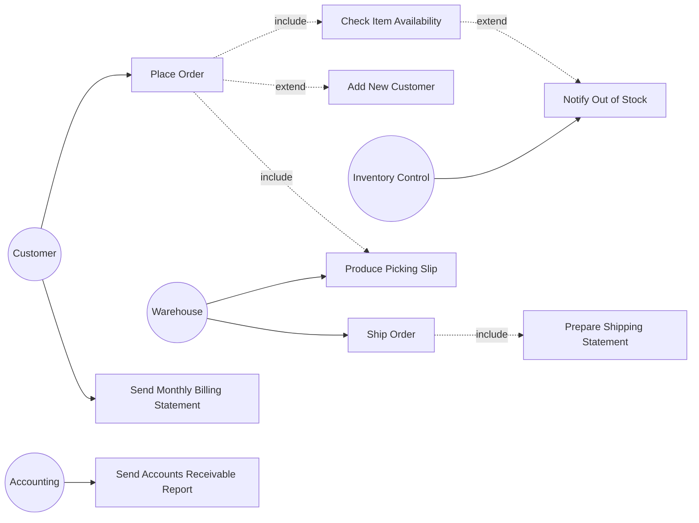

*Giải thích*: `Place Order` luôn phải kiểm tra tồn kho → «include» `Check Item Availability`; chỉ khi khách mới thì mới tạo record → `Add New Customer` là «extend»; hết hàng mới báo inventory control → «extend» `Notify Out of Stock`. Kho nhận picking slip và gửi hàng; kế toán nhận báo cáo công nợ.

### Problem 4 — Bốn quan hệ hành vi (behavioral relationships) cho đại lý BMW của Joel Porter

**Đề (tóm tắt)**: Vẽ 4 ví dụ về 4 loại behavioral relationship (communicates, includes, extends, generalizes). Khách phải thu xếp tài chính là quan hệ gì? Lease và Buy có hoạt động chung không? Manager và Salesperson quan hệ gì?

**Lời giải** *(dựa trên hình trong sách — 4 loại behavioral relationship ở Figure 10.4)*:

1. **Communicates**: actor `Customer` nối với use case `Buy Automobile` — actor giao tiếp với use case (đường liền).
2. **Includes** (khách **phải** thu xếp tài chính): `Buy Automobile` «include» `Arrange Financing` — hành vi bắt buộc, dùng chung, luôn được thực hiện như một phần của use case gốc.
3. **Extends**: `Add Extended Warranty` «extend» `Buy Automobile` — hành vi tùy chọn, chỉ xảy ra trong một số tình huống, mở rộng use case cơ sở. (Tương tự: nếu Lease và Buy có các hoạt động chung như kiểm tra tín dụng, lái thử — phần chung nên tách thành use case được «include» bởi cả hai.)
4. **Generalizes**: `Employee` là actor tổng quát; `Manager` và `Salesperson` là actor chuyên biệt **generalize** về `Employee` (Manager *is an* Employee, Salesperson *is an* Employee) — quan hệ tổng quát hóa giữa hai thứ cùng loại, cái con kế thừa cái cha.

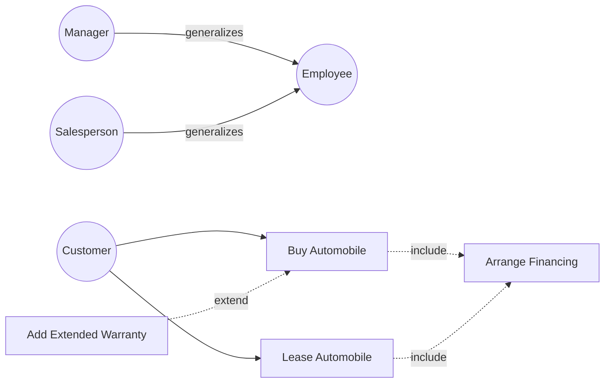

### Problem 5 — Communication diagram: sinh viên học một khóa do giảng viên (thuộc faculty) dạy

**Đề (tóm tắt)**: Vẽ communication diagram cho việc sinh viên học một course từ một teacher thuộc faculty.

**Lời giải** (Mermaid không có loại communication diagram riêng — thể hiện bằng flowchart với message đánh số theo quy ước của sách):

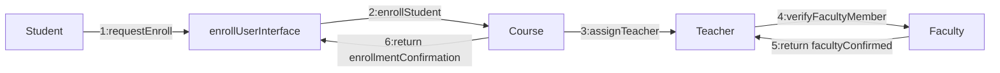

*Giải thích*: mỗi hình chữ nhật là object/class; **đường nối** thể hiện class nào cần cộng tác với class nào; **số thứ tự trước message** thể hiện trình tự thời gian (đặc trưng của communication diagram — nhấn mạnh tổ chức object thay vì trục thời gian).

### Problem 6 — Sequence diagram: cuộc gọi điện thoại ở Coleman County

**Đề (tóm tắt)**: Tổng đài (phone exchange) xử lý cuộc gọi giữa người gọi (caller) và người nhận (call recipient). Với 3 actor này, vẽ sequence diagram đơn giản cho một cuộc gọi.

**Lời giải:**

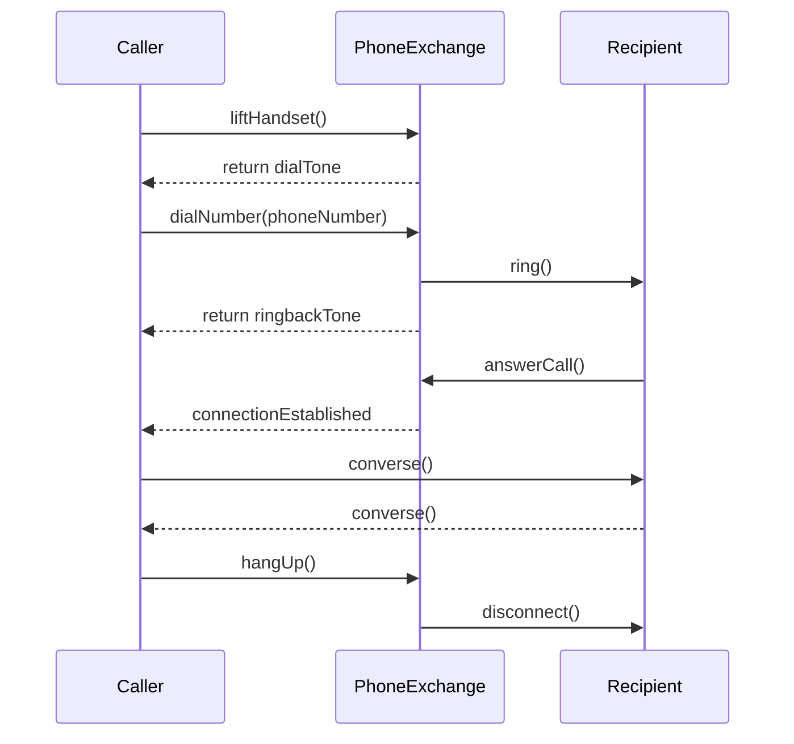

*Giải thích*: thời gian chạy từ trên xuống; actor khởi đầu (Caller) đặt bên trái; mũi tên liền = synchronous message, mũi tên đứt = return.

### Problem 7 — Class diagram cho Aldo Sohm Clinic

**Đề (tóm tắt)**: Vẽ class diagram gồm physician, patient, appointment, patient's bill (không đưa công ty bảo hiểm vào).

**Lời giải:**

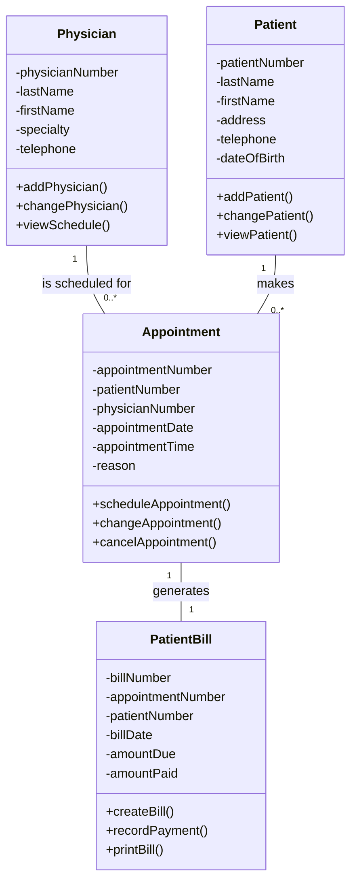

*Giải thích*: `Appointment` đóng vai trò **association class** hóa giải quan hệ nhiều-nhiều giữa Patient và Physician (một bệnh nhân khám nhiều bác sĩ, một bác sĩ khám nhiều bệnh nhân); mỗi lần khám sinh đúng một hóa đơn.

### Problem 8 — Bốn quan hệ cấu trúc (structural relationships) cho Aldo Sohm Clinic

**Đề (tóm tắt)**: Dùng UML vẽ ví dụ 4 structural relationships (dependencies, associations, aggregations, generalizations).

**Lời giải:**

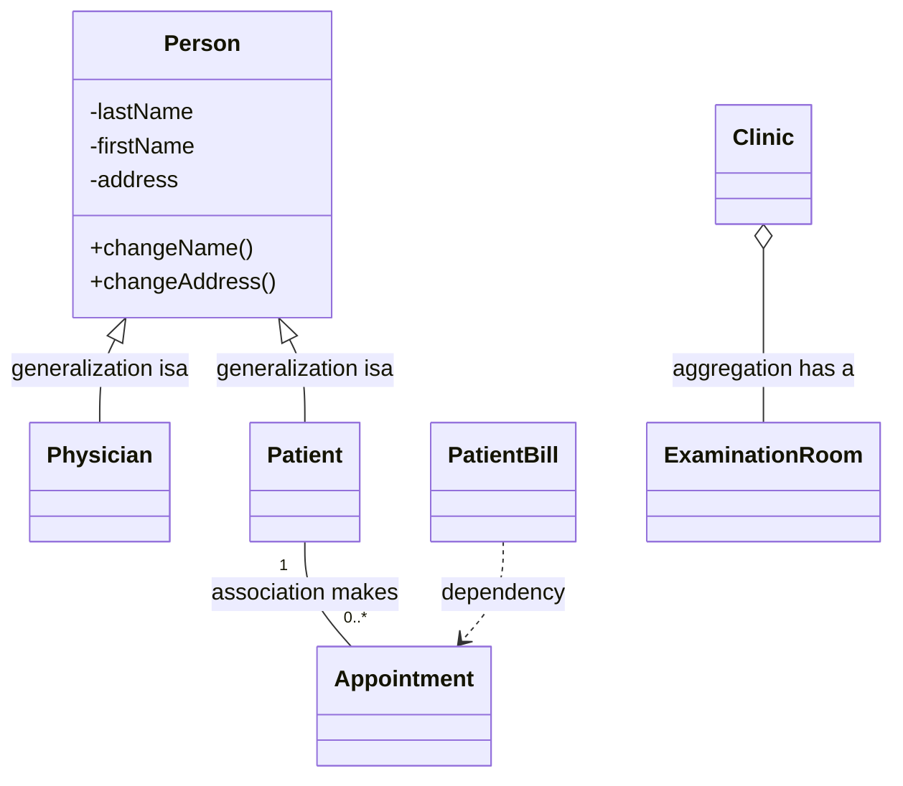

*Giải thích từng quan hệ*:
1. **Generalization** (mũi tên tam giác rỗng chỉ về superclass): Physician *is a* Person, Patient *is a* Person — hai lớp con kế thừa tên, địa chỉ... từ lớp cha.
2. **Association** (đường liền + multiplicity): một Patient *makes* 0..* Appointment.
3. **Aggregation** (hình thoi rỗng phía whole): Clinic *has a* ExaminationRoom — phòng khám gồm các phòng khám bệnh; quan hệ yếu (phòng vẫn tồn tại nếu tổ chức lại clinic).
4. **Dependency** (mũi tên nét đứt): PatientBill phụ thuộc Appointment — hóa đơn chỉ được tạo dựa trên thông tin buổi hẹn; thay đổi Appointment ảnh hưởng PatientBill.

### Problem 9 — Use case scenario: bệnh nhân khám bác sĩ tại Aldo Sohm Clinic

**Đề (tóm tắt)**: Viết use case scenario mẫu cho bệnh nhân đến khám.

**Lời giải** (đủ các mục chuẩn theo Figure 10.7 của sách):

| Mục | Nội dung |
|---|---|
| **Use case name** | See Physician |
| **UniqueID** | Clinic UC 001 |
| **Area** | Patient Care (Khám chữa bệnh) |
| **Actor(s)** | Patient (bệnh nhân) |
| **Description** | Cho phép bệnh nhân đến phòng khám, được xác nhận lịch hẹn, được bác sĩ khám, nhận chẩn đoán/đơn thuốc và hóa đơn thanh toán. |
| **Triggering Event** | Bệnh nhân đến quầy tiếp đón (check-in) vào giờ hẹn đã đặt. |
| **Trigger type** | External (bên ngoài) |

**Steps Performed (Main Path)** — kèm Information for Steps:

| # | Bước thực hiện | Thông tin cho bước |
|---|---|---|
| 1 | Bệnh nhân check-in tại quầy tiếp đón | Patient Number, Patient Name |
| 2 | Hệ thống đọc hồ sơ bệnh nhân và xác minh lịch hẹn | Patient Record, Appointment Record |
| 3 | Nhân viên xác nhận thông tin cá nhân và bảo hiểm còn đúng | Patient Record |
| 4 | Bệnh nhân được đưa vào phòng khám; y tá ghi sinh hiệu | Vital Signs, Visit Record |
| 5 | Bác sĩ khám, ghi chẩn đoán và chỉ định điều trị vào hồ sơ | Visit Record, Diagnosis, Treatment |
| 6 | Bác sĩ kê đơn thuốc (nếu cần) và hẹn tái khám (nếu cần) | Prescription, Follow-up Appointment |
| 7 | Hệ thống tạo hóa đơn cho buổi khám | Patient Bill, Service Codes |
| 8 | Bệnh nhân thanh toán hoặc ghi nhận công nợ; nhận biên nhận | Payment, Receipt |

| Mục | Nội dung |
|---|---|
| **Preconditions** | Bệnh nhân đã đăng ký trong hệ thống và có lịch hẹn hợp lệ với bác sĩ. |
| **Postconditions** | Buổi khám được ghi vào hồ sơ bệnh nhân; hóa đơn được tạo; đơn thuốc/lịch tái khám (nếu có) được lưu. |
| **Assumptions** | Bệnh nhân đến đúng giờ; bác sĩ có mặt; hồ sơ bệnh nhân truy cập được trong hệ thống. |
| **Requirements Met** | Cho phép bệnh nhân được bác sĩ khám theo lịch hẹn và ghi nhận đầy đủ hồ sơ khám cùng hóa đơn. |
| **Outstanding Issues** | Xử lý thế nào khi bệnh nhân đến trễ quá 15 phút? Bệnh nhân vãng lai (walk-in) không có hẹn có được khám không? |
| **Priority** | High |
| **Risk** | Medium |

### Problem 10 — Activity diagram cho Adaku's Supermarket

**Đề (tóm tắt)**: Chuỗi siêu thị xây website cho khách đặt hàng online: khách đặt web order → cập nhật customer master → tạo order record → đơn in tại cửa hàng địa phương → nhân viên nhặt hàng từ kệ → gửi email báo đơn sẵn sàng → khách đến lấy thì đồ đông lạnh, đồ mát và các món khác được gom lại. Vẽ activity diagram thể hiện: khách dùng website đặt hàng, xác minh đơn, xác nhận đơn, gửi chi tiết đơn về cửa hàng, gửi email cho khách.

**Lời giải** (3 swimlane: Customer Website / Order Server / Local Store — thể hiện bằng subgraph):

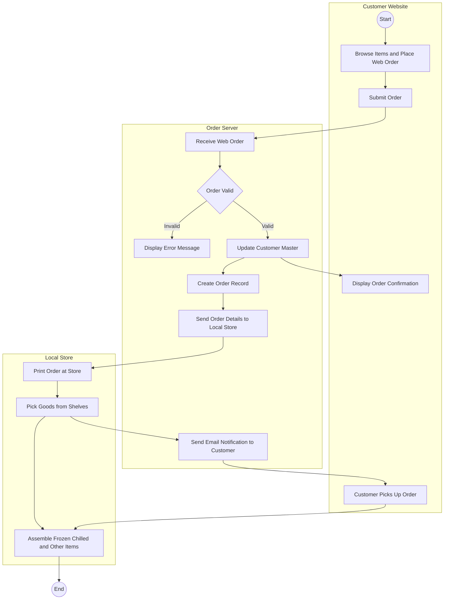

*Giải thích*: swimlane trái = hoạt động trên browser của khách; giữa = server xử lý đơn (validate, cập nhật master, tạo order record, gửi email); phải = cửa hàng địa phương (in đơn, nhặt hàng, gom đồ đông lạnh/mát khi khách đến lấy — đúng trình tự đề: đồ lạnh chỉ gom khi khách tới). Sự kiện vượt swimlane = dữ liệu truyền giữa các nền tảng.

### Problem 11 — Sequence diagram cho Sludge's Auto (dùng boundary, control, entity class)

**Đề (tóm tắt)**: Trung tâm tái chế phụ tùng ô tô dùng **Ajax**: khách nhập make, model, year của xe + tên phụ tùng; nếu có hàng, hiển thị mô tả, tình trạng (condition), giá, phí ship, số lượng theo từng condition, kèm ảnh — không rời trang web hiện tại. Vẽ sequence diagram cho Auto Part Query.

**Lời giải:**

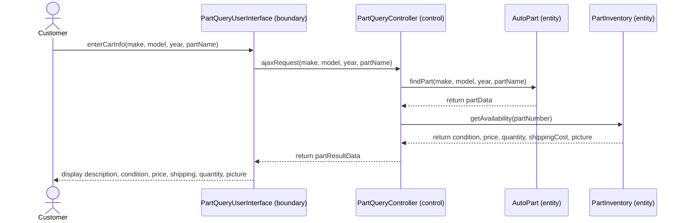

*Giải thích*: đúng quy tắc của sách — **boundary class** (`PartQueryUserInterface`) chỉ nối với **control class** (`PartQueryController`); control class nối với các **entity class** (`AutoPart` lưu thông tin phụ tùng, `PartInventory` lưu tồn kho theo condition); boundary **không bao giờ** nối trực tiếp entity. Nhờ Ajax, `ajaxRequest` lấy dữ liệu từ server và cập nhật kết quả **ngay trên trang hiện tại** không cần reload.

### Problem 12 — Musixscore.com (Browse Music Score)

**Đề (tóm tắt)**: Dịch vụ bán sheet nhạc online. Trang "Browse Music": khách chọn **genre** từ drop-down → Ajax lấy danh sách **performers** khớp genre (drop-down 2) → chọn performer → Ajax hiển thị drop-down 3 các **CD/tác phẩm** → chọn CD → Ajax lấy các **bài hát** trên CD (drop-down 4, chọn được nhiều) → click **Add to Shopping Cart** → bài hát thêm vào giỏ; khách có thể đổi bất kỳ drop-down nào để chọn thêm, quy trình lặp lại.

#### 12a. Use case description cho use case Browse Music Score

| Mục | Nội dung |
|---|---|
| **Use case name** | Browse Music Score |
| **UniqueID** | Music UC 001 |
| **Area** | Online Music Sales |
| **Actor(s)** | Customer (khách hàng) |
| **Description** | Cho phép khách duyệt sheet nhạc theo genre → performer → CD → songs bằng bốn drop-down cập nhật động qua Ajax, và thêm các bài đã chọn vào shopping cart. |
| **Triggering Event** | Khách mở trang "Browse Music" và chọn một genre từ drop-down. |
| **Trigger type** | External |

**Steps Performed (Main Path)** — kèm Information for Steps:

| # | Bước | Thông tin cho bước |
|---|---|---|
| 1 | Khách chọn genre từ drop-down thứ nhất | genre |
| 2 | Trang web dùng Ajax lấy danh sách performers khớp genre và đổ vào drop-down thứ hai | genre, performerList |
| 3 | Khách chọn performer; trang dùng Ajax lấy danh sách CD/tác phẩm của performer, hiển thị drop-down thứ ba | performerID, cdList |
| 4 | Khách chọn CD; trang dùng Ajax lấy tất cả bài hát trên CD, hiển thị drop-down thứ tư | cdID, songList |
| 5 | Khách chọn một hoặc nhiều bài hát | songID(s) |
| 6 | Khách click ảnh Add to Shopping Cart; các bài được thêm vào giỏ | songID(s), cartID |
| 7 | Khách có thể đổi bất kỳ drop-down nào để chọn thêm sheet nhạc; quy trình lặp lại từ bước tương ứng | |

| Mục | Nội dung |
|---|---|
| **Preconditions** | Khách đang ở trang Browse Music; danh mục nhạc (genre, performer, CD, song) tồn tại trong database. |
| **Postconditions** | Các bài hát đã chọn nằm trong shopping cart của khách. |
| **Assumptions** | Trình duyệt của khách hỗ trợ JavaScript/Ajax; kết nối server hoạt động. |
| **Requirements Met** | Cho phép khách duyệt và chọn sheet nhạc nhanh, không phải reload trang. |
| **Outstanding Issues** | Có giới hạn số bài trong giỏ không? Khách chưa đăng nhập thì giỏ hàng lưu ở đâu (cookie)? |
| **Priority** | High |
| **Risk** | Low |

#### 12b. Sequence diagram (boundary, control, entity)

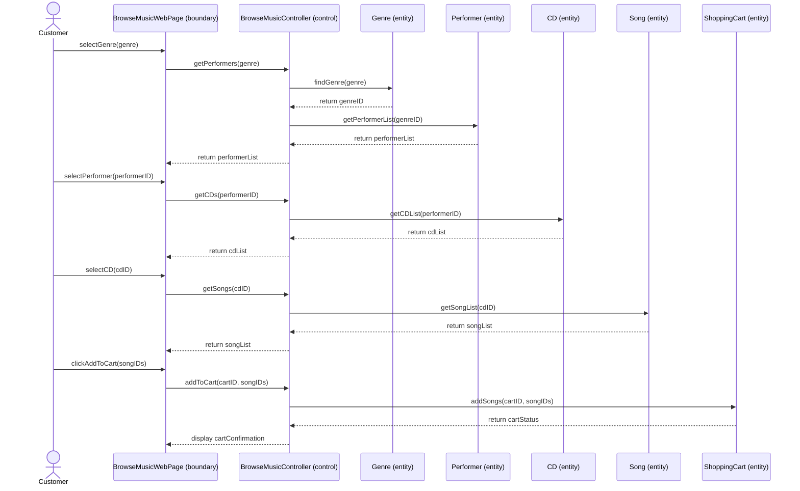

*Giải thích*: boundary (`BrowseMusicWebPage`) chỉ nói chuyện với control (`BrowseMusicController`); control gọi các entity (`Genre`, `Performer`, `CD`, `Song`, `ShoppingCart`). Mỗi lượt chọn drop-down là một vòng Ajax request/response, trang không reload.

#### 12c. Danh sách messages, parameters và giá trị trả về (kèm kiểu dữ liệu — có giả định về dữ liệu)

| Message | Parameters (kiểu) | Return values (kiểu) |
|---|---|---|
| `getPerformers()` | genre: String | performerList: mảng {performerID: Integer, performerName: String} |
| `findGenre()` | genre: String | genreID: Integer |
| `getPerformerList()` | genreID: Integer | performerList: mảng {performerID: Integer, performerName: String} |
| `getCDs()` | performerID: Integer | cdList: mảng {cdID: Integer, cdTitle: String, releaseYear: Integer} |
| `getCDList()` | performerID: Integer | cdList: mảng {cdID: Integer, cdTitle: String, releaseYear: Integer} |
| `getSongs()` | cdID: Integer | songList: mảng {songID: Integer, songTitle: String, price: Decimal} |
| `getSongList()` | cdID: Integer | songList: mảng {songID: Integer, songTitle: String, price: Decimal} |
| `addToCart()` | cartID: Integer, songIDs: mảng Integer | cartStatus: Boolean, numberOfItems: Integer, cartTotal: Decimal |
| `addSongs()` | cartID: Integer, songIDs: mảng Integer | cartStatus: Boolean (thành công/thất bại) |

*Giả định*: dữ liệu Ajax trả về được đóng gói dạng XML/JSON; `cartID` lưu trong cookie hoặc hidden form field để duy trì giỏ hàng qua các request (đúng 3 cách lưu dữ liệu web mà sách nêu); giá bài hát là Decimal; danh sách trả về là mảng bản ghi.

---

*Hết Chương 10.*
