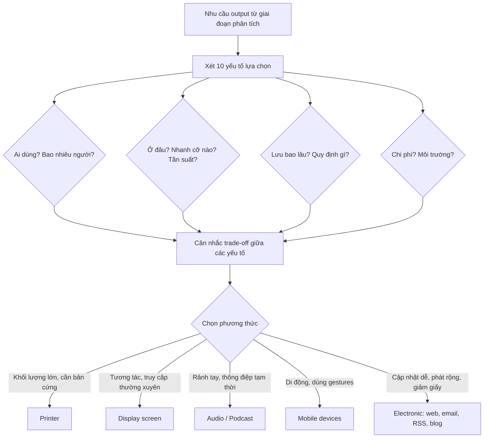
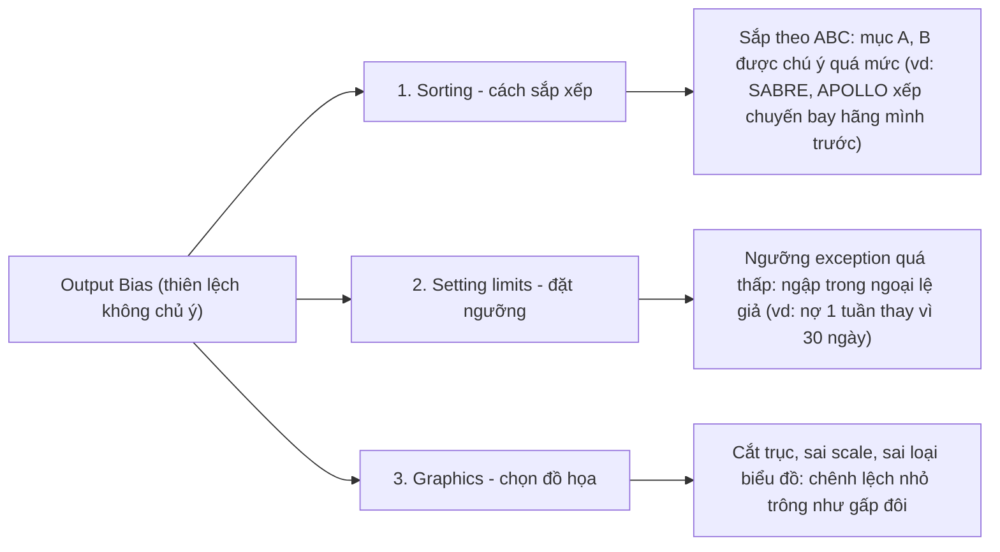
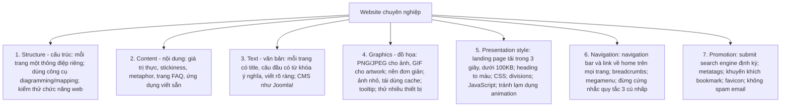
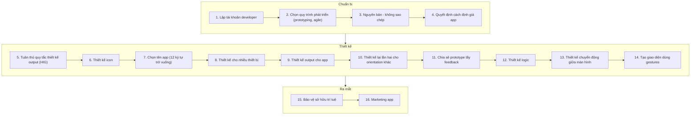
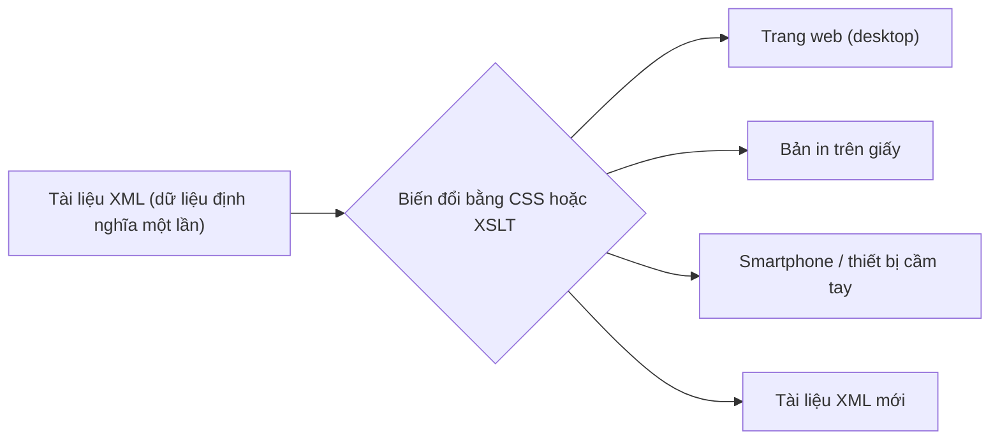
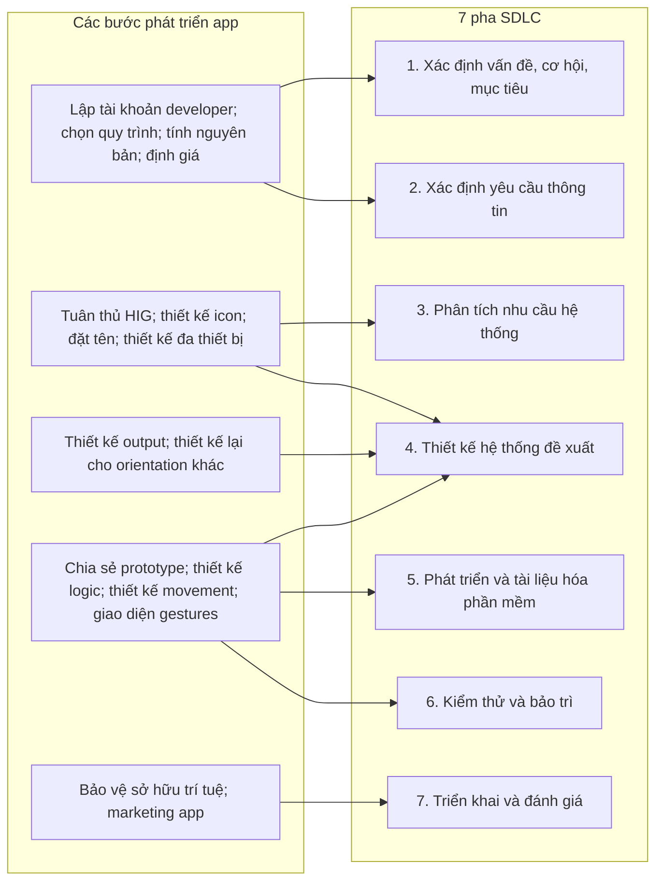

# Chương 11 — Designing Effective Output (Thiết kế đầu ra hiệu quả)

> Nguồn: Kendall & Kendall, *Systems Analysis and Design*, 11th edition — Chapter 11 (trang 321–364).

---

## 🎯 Mục tiêu học tập

Sau khi học xong chương này, bạn có thể:

1. **Hiểu 6 mục tiêu thiết kế output** (đầu ra) mà systems analyst phải theo đuổi: đúng mục đích, phù hợp người dùng, đúng lượng, đúng nơi, đúng lúc, đúng phương thức.
2. **Liên hệ nội dung output với phương thức output**, phân biệt output **bên ngoài (external)** và **bên trong (internal)**, và nắm xu hướng **green IT**.
3. **Chọn công nghệ output phù hợp** dựa trên 10 yếu tố cân nhắc (người dùng, số lượng, phân phối, mục đích, tốc độ, tần suất, thời gian lưu trữ, quy định pháp lý, chi phí, môi trường).
4. **Nhận diện và tránh output bias** (thiên lệch trong đầu ra): thiên lệch do sắp xếp, do đặt ngưỡng, do đồ họa.
5. **Thiết kế báo cáo in** (detailed / exception / summary) và **thiết kế output cho màn hình** theo 4 nguyên tắc.
6. **Thiết kế dashboard, infographic và data visualization** hiệu quả cho người ra quyết định.
7. **Thiết kế website chuyên nghiệp**: responsive/adaptive design, flat vs skeuomorphic design, 7 yếu tố (structure, content, text, graphics, presentation style, navigation, promotion), megamenu, quy tắc 3 cú nhấp.
8. **Tích hợp Web 2.0 và thiết kế cho social media** với 4 nguyên tắc thiết kế trực quan.
9. **Thiết kế app cho smartphone và tablet**: 16 bước, chiến lược định giá, icon, orientation, gestures, bảo vệ sở hữu trí tuệ.
10. **Hiểu cách sản xuất output với XML**: biến đổi bằng CSS/XSLT và kỹ thuật Ajax.

---

## 📖 Tóm tắt & giải thích kiến thức

### 1. Mục tiêu thiết kế output (Output Design Objectives)

**Output** là bất kỳ thông tin hữu ích nào mà hệ thống thông tin đưa đến người dùng — có thể ở dạng bản in, màn hình máy tính/smartphone/tablet, âm thanh, microform, bài đăng social media, hay tài liệu web. Output phải **hữu dụng** thì hệ thống mới được chấp nhận và sử dụng. Analyst tập trung vào **6 mục tiêu**:

| # | Mục tiêu | Giải thích |
|---|----------|-----------|
| 1 | **Phục vụ đúng mục đích** (serve the intended purpose) | Mọi output phải có mục đích, xác định từ giai đoạn phân tích yêu cầu. Output không có chức năng thì **không nên tạo** vì tốn thời gian và vật liệu. |
| 2 | **Phù hợp với người dùng** (fit the user) | Dựa vào phỏng vấn, quan sát, chi phí, prototype để thiết kế output đáp ứng đa số người dùng. Output cá nhân hóa thực tế nhất khi thiết kế DSS hoặc ứng dụng tương tác cao (web). |
| 3 | **Đúng lượng** (appropriate quantity) | Heuristic: cung cấp đủ những gì mỗi người cần để hoàn thành công việc. Tránh **information overload** — hiển thị tập con trước, cho phép truy cập thêm qua hyperlink/drill-down. |
| 4 | **Đúng nơi** (where it is needed) | Output phải đến đúng người ra quyết định; báo cáo hay đến đâu mà người cần không thấy thì vô giá trị. |
| 5 | **Đúng lúc** (on time) | Phàn nàn phổ biến: nhận thông tin quá trễ để ra quyết định. Báo cáo có thể theo ngày, tháng, năm, hoặc theo ngoại lệ (by exception). Output web giúp cải thiện timing. |
| 6 | **Đúng phương thức** (right output method) | Mỗi phương thức có trade-off về chi phí, khả năng truy cập, linh hoạt, độ bền, phân phối, lưu trữ/truy xuất, tính di động, tác động tổng thể. |

### 2. Liên hệ nội dung output với phương thức output

- **External output** (ra ngoài doanh nghiệp — khách hàng, nhà cung cấp, cổ đông, cơ quan quản lý): khác internal ở **phân phối, thiết kế và hình thức**; thường cần **hướng dẫn sử dụng** cho người nhận; hay in trên **form in sẵn (preprinted forms)** hoặc website mang logo và màu sắc công ty.
- **Internal output** (trong doanh nghiệp — trên intranet): từ báo cáo tóm tắt ngắn đến báo cáo chi tiết dài; gồm cả **báo cáo lịch sử (historical reports)** và **báo cáo ngoại lệ (exception reports)** chỉ xuất khi có ngoại lệ (VD: nhân viên không nghỉ ngày nào trong năm, nhân viên bán hàng không đạt chỉ tiêu tháng).
- **Green IT** (green computing / ICT sustainability): khuyến khích khách hàng chuyển từ sao kê giấy sang hóa đơn online — tiết kiệm môi trường, dễ dùng, truy cập 24h; doanh nghiệp hạn chế in báo cáo, thêm ghi chú "hãy cân nhắc trước khi in" vào email.

### 3. Các công nghệ output & bảng so sánh (Figure 11.1)

Công nghệ để tạo output: máy in (in tài liệu chuẩn, in nhãn, in 3-D), màn hình (gắn kèm/độc lập/cảm ứng), âm thanh (loa hoặc nghe cá nhân), output điện tử (web, email, RSS feeds, blog).

| Phương thức | Ưu điểm | Nhược điểm |
|---|---|---|
| **Printer (máy in)** | Giá hợp lý với đa số tổ chức; linh hoạt loại output, vị trí, khả năng; xử lý khối lượng lớn; độ tin cậy cao, ít downtime | Vẫn cần người vận hành; vấn đề tương thích phần mềm; có thể cần vật tư đặc biệt đắt tiền; có thể chậm tùy model; **không thân thiện môi trường** |
| **Display screen (màn hình)** | Tương tác; truyền online thời gian thực; yên tĩnh; tận dụng khả năng máy tính di chuyển trong database/file; tốt cho thông điệp truy cập thường xuyên, ngắn hạn (ephemeral) | Có thể cần đi cáp và không gian lắp đặt; cần cơ chế "chụp" màn hình để lưu lại dùng sau |
| **Audio output & podcast** | Tốt cho người dùng cá nhân; tốt cho thông điệp tạm thời; tốt khi người dùng cần **rảnh tay**; tốt nếu cần phát rộng | Cần tai nghe nơi output gây nhiễu công việc khác; **phạm vi ứng dụng hạn chế** |
| **Mobile devices (thiết bị di động)** | Rất di động; tương tác cao bằng cử chỉ (gestures); zoom/phóng to được | Màn hình có thể quá nhỏ cho văn bản; icon/nút có thể gây nhầm lẫn; dễ thất lạc hơn |
| **Electronic output (email, website, blog, RSS feeds)** | Giảm giấy; cập nhật rất dễ; có thể "broadcast"; có thể làm tương tác | Email khó định dạng, khó truyền tải ngữ cảnh thông điệp; website cần bảo trì siêng năng |

### 4. Mười yếu tố cân nhắc khi chọn công nghệ output

1. **Ai sẽ dùng (xem) output?** (chất lượng yêu cầu) — VD: quản lý hay di chuyển cần bản in mang theo hoặc truy cập web/database từ xa; người ngồi bàn cố định (điều phối xe tải) hợp với màn hình. Người nhận bên ngoài (khách hàng, nhà cung cấp, cổ đông, cơ quan quản lý) cần output khác người trong doanh nghiệp; đối tác có thể dùng **extranet**. *Ví dụ sách: website Merchants Bay dùng ẩn dụ (metaphor) hàng hải xuyên suốt, giao diện "bừa bộn có chủ đích" như chợ trời để hợp với khách hàng thích mặc cả.*
2. **Bao nhiêu người cần output?** — Nhiều người → tài liệu web có tùy chọn in hoặc bản in; một người → màn hình hay audio phù hợp hơn.
3. **Output cần ở đâu?** (phân phối, logistics) — Gần nơi tạo, ít người dùng → in hoặc intranet; truyền đi xa cho chi nhánh → phân phối điện tử qua web/extranet. Có khi quy định liên bang/tiểu bang buộc lưu bản in tại một địa điểm trong thời gian nhất định.
4. **Mục đích output là gì? Hỗ trợ nhiệm vụ nào?** — Báo cáo thường niên thu hút cổ đông → bản in đẹp + bản web; cập nhật giá chứng khoán tức thời → screen crawls, chyrons, web, audio; output phải hỗ trợ nhiệm vụ người dùng (phân tích, tính tỷ số → kèm calculator, công thức nhúng) và nhiệm vụ tổ chức (tracking, scheduling, monitoring). Video phù hợp để kể chuyện/lưu sự kiện lịch sử.
5. **Cần output nhanh đến mức nào?** — Quản lý vận hành (operations) cần output **nhanh** để xử lý sự cố (dây chuyền dừng, nguyên liệu trễ, công nhân vắng) → màn hình online; quản lý chiến lược cần output theo **kỳ** để dự báo chu kỳ, xu hướng.
6. **Tần suất truy cập?** — Truy cập càng thường xuyên → càng nên xem trên màn hình nối LAN/web; truy cập hiếm, ít người dùng → lưu trữ (archive), có thể trên cloud. Output điện tử tránh hao mòn vật lý của bản in bị cầm nắm nhiều.
7. **Output phải lưu bao lâu?** — Giấy xuống cấp nhanh; microform/lưu trữ số bền hơn trước ánh sáng, độ ẩm, cầm nắm — nhưng rủi ro nếu phần cứng đọc trở nên lỗi thời. Quy định chính phủ hoặc chính sách nội bộ quyết định thời gian lưu; Google, IBM, Amazon cung cấp cloud phù hợp cho lưu trữ dài hạn.
8. **Quy định đặc biệt nào chi phối việc tạo, lưu, phân phối output?** — VD: ở Mỹ, form W-2 (lương và khấu trừ thuế) phải **in được** dù nằm trong hệ ERP; hệ thống máu khu vực phải lưu hồ sơ y tế người hiến máu (nội dung bị quy định chặt, hình thức thì không).
9. **Chi phí ban đầu và chi phí duy trì, vật tư?** — Vendor giúp ước tính chi phí mua/thuê ban đầu nhưng thường **không** cho biết chi phí vận hành lâu dài → analyst phải tự nghiên cứu.
10. **Yêu cầu môi trường và con người?** — Khả năng tiếp cận (accessibility), hấp thụ tiếng ồn, nhiệt độ, không gian thiết bị, đi cáp, gần điểm Wi-Fi (hot spots). Máy in cần môi trường khô, mát; audio/video cần yên tĩnh và chỉ nghe được bởi người đang dùng; thư viện, bệnh viện ưu tiên màn hình vì cần im lặng. Green IT cũng là một cân nhắc.



### 5. Output bias — thiên lệch trong đầu ra và cách tránh

Output **không trung lập** — nó tác động đến người dùng. Ảnh hưởng của analyst kéo dài sau khi dự án kết thúc: phần lớn thông tin mà thành viên tổ chức dùng để ra quyết định do analyst quyết định là "quan trọng". **Bias tồn tại trong mọi thứ con người tạo ra** — không hẳn xấu, nhưng không thể tách rời khỏi sản phẩm. Nhiệm vụ của analyst: **tránh bias không cần thiết** và **làm người dùng nhận thức được bias có thể có**.

Ba cách output bị thiên lệch **không chủ ý**:

1. **Bias khi sắp xếp thông tin (sorting)** — Cách sắp xếp phổ biến: theo bảng chữ cái, theo thời gian, theo chi phí. Sắp theo bảng chữ cái làm người dùng chú ý quá mức các mục bắt đầu bằng A, B (vì người ta chú ý thông tin xuất hiện trước). *Ví dụ: hệ thống đặt vé SABRE và APOLLO liệt kê chuyến bay của hãng mình trước, bị các hãng khác khiếu nại là sắp xếp thiên lệch.*
2. **Bias khi đặt ngưỡng (setting limits)** — Nhiều báo cáo chỉ xuất theo ngoại lệ (exception basis). Ngưỡng đặt **quá thấp** làm người dùng ngập trong "ngoại lệ" không đáng lo. *Ví dụ: công ty bảo hiểm xuất báo cáo ngoại lệ cho mọi tài khoản trễ 1 tuần → người dùng tưởng có rất nhiều nợ quá hạn; ngưỡng phù hợp hơn là 30 ngày.*
3. **Bias qua đồ họa (graphics)** — Bias xảy ra khi chọn **kích thước, màu, thang đo (scale), loại biểu đồ**. Kích thước phải tỷ lệ để không phóng đại tầm quan trọng của biến. *Ví dụ Figure 11.4: cột dọc bị "cắt trục" (bắt đầu từ 400 thay vì 0) khiến số no-show năm 2022 trông gấp đôi 2021 dù thực tế chỉ tăng nhẹ.*



**5 chiến lược tránh bias khi thiết kế output:**

1. Nhận thức các **nguồn bias** (cá nhân, hàm ẩn, hay hệ thống).
2. Thiết kế output **tương tác trong quá trình prototyping**, có người dùng tham gia và thử trên nhiều cấu hình hệ thống khác nhau khi kiểm tra giao diện tài liệu web.
3. **Làm việc với người dùng** để họ được thông báo về bias của output và nhận ra hệ quả khi tùy biến màn hình.
4. Tạo output **linh hoạt**, cho phép người dùng **thay đổi ngưỡng và khoảng giá trị** (limits and ranges).
5. **Huấn luyện người dùng dựa vào nhiều output** để "kiểm tra thực tế" (reality tests) đối với output hệ thống.

### 6. Thiết kế output in (Designing Printed Output)

- Nguồn thông tin cho báo cáo là **data dictionary** (từ điển dữ liệu — Chương 8): chứa tên phần tử dữ liệu và độ dài trường yêu cầu.
- **Ba loại báo cáo:**

| Loại | Đặc điểm | Dùng cho |
|---|---|---|
| **Detailed report** (chi tiết) | In **một dòng cho mỗi record** trên master file | Gửi thư khách hàng, bảng điểm sinh viên, in catalog… (nhiều báo cáo chi tiết đã bị thay thế bởi inquiry screens) |
| **Exception report** (ngoại lệ) | In một dòng cho **các record thỏa điều kiện** (VD: hàng trang trí giảm giá sau lễ, sinh viên đạt dean's list) | Giúp quản lý vận hành và nhân viên văn phòng điều hành công việc |
| **Summary report** (tổng hợp) | In **một dòng cho một nhóm record** | Ra quyết định (mặt hàng nào bán chậm, mặt hàng nào bán chạy) |

- Lưu ý web: một số khách truy cập thích **in** nội dung web → cân nhắc chèn **PDF tải về được** và thử in từng trang trên các browser khác nhau để đảm bảo bản in trông chuyên nghiệp.

### 7. Thiết kế output cho màn hình (Designing Output for Displays)

Màn hình khác bản in: **ephemeral** (không cố định lâu dài như bản in), nhắm đích cụ thể hơn tới người dùng, lịch trình linh hoạt hơn, **không di động** theo cùng cách, và đôi khi **thay đổi được qua tương tác trực tiếp**. Người dùng cần được hướng dẫn phím bấm, link, cách cuộn, cách kết thúc, cách tương tác. Truy cập màn hình có thể kiểm soát bằng **mật khẩu**, còn bản in kiểm soát bằng cách khác.

**4 nguyên tắc thiết kế màn hình:**

1. **Giữ màn hình đơn giản** (keep the display simple).
2. **Giữ trình bày nhất quán** (keep the presentation consistent) — thông tin hiển thị nhất quán giữa các trang.
3. **Tạo thuận lợi cho người dùng di chuyển** giữa các màn hình output (facilitate user movement).
4. **Tạo màn hình hấp dẫn, dễ chịu** (create an attractive and pleasing display).

Màn hình tốt không tạo ra trong cô lập — cần **feedback của người dùng** qua các vòng prototype liên tiếp. *Ví dụ sách (Figure 11.5–11.6): màn hình "New Zoo Order Status" gọn gàng, có heading định hướng, dòng chỉ dẫn ở đáy (phím bất kỳ để xem tiếp; ESC kết thúc; ? trợ giúp); đưa con trỏ vào số đơn hàng → màn hình chi tiết của một retailer (địa chỉ, ngày đặt, trạng thái từng phần lô hàng, liên hệ, số dư, xếp hạng tín dụng) — thay vì nhồi tất cả vào một trang, cho người dùng **drill-down** khi cần.*

**Đồ họa trong thiết kế màn hình:** đồ họa mạnh — nhận ra xu hướng/mẫu hình trên biểu đồ dễ hơn trên bảng. Phải **cùng người dùng chọn kiểu biểu đồ đúng**. Người ra quyết định cần biết **giả định (bias)** đằng sau biểu đồ để điều chỉnh. Khi thiết kế đồ họa, analyst và người dùng phải xác định **4 điều**: (1) **mục đích** của biểu đồ; (2) **loại dữ liệu** cần hiển thị; (3) **đối tượng xem** (audience); (4) **hiệu ứng lên đối tượng** của các loại đồ họa khác nhau. Với DSS, đồ họa hỗ trợ 3 pha giải quyết vấn đề: **intelligence, design, choice** (ví dụ DSS hoạch định nhân lực của Nebraska State Patrol: biểu đồ cột so sánh thời gian phản hồi hiện tại, dự báo, và mức tối thiểu).

### 8. Dashboards (bảng điều khiển)

Dashboard giống bảng đồng hồ ô tô: nhiều "gauge" — mỗi gauge có thể là biểu đồ (như đồng hồ tốc độ), đèn cảnh báo sự cố (như đèn ABS), hoặc chữ (như odometer). Dashboard **truyền đạt các phép đo (measurements)** cho người dùng; lãnh đạo dùng dashboard xem chỉ số hiệu suất và hành động khi cần. Công cụ trực quan hóa hỗ trợ xây dashboard: **Tableau**. **12 quy tắc thiết kế dashboard:**

1. **Đảm bảo dữ liệu có ngữ cảnh** — "doanh số tháng trước $851,235" nghĩa là gì? Trên hay dưới trung bình?
2. **Mức tóm tắt và độ chính xác phù hợp** — hiển thị $851,235.32 thay vì $851,235 hoặc $851K là làm rối màn hình.
3. **Chọn chỉ số hiệu suất phù hợp để hiển thị** — vẽ chênh lệch thực tế so với kỳ vọng trên deviation chart có ý nghĩa hơn line chart vẽ cả hai đường.
4. **Trình bày dữ liệu công bằng** — đưa bias vào dashboard sẽ cản trở quyết định tốt.
5. **Chọn đúng kiểu biểu đồ** — pie chart giỏi thuyết phục nhưng không hợp để giám sát hiệu suất các văn phòng khu vực.
6. **Dùng phương tiện hiển thị được thiết kế tốt** — biểu đồ tốt vẫn cần vẽ, chỉnh kích thước, màu, nhãn đẹp và có ý nghĩa.
7. **Hạn chế số kiểu thành phần** — ít kiểu graph/chart/table để truyền đạt nhanh và chính xác.
8. **Làm nổi bật dữ liệu quan trọng** — màu sáng và chữ đậm chỉ cho dữ liệu quan trọng; nhấn mạnh KPI **hoặc** ngoại lệ quan trọng, không phải cả hai.
9. **Nhóm dữ liệu có ý nghĩa** — các chỉ số liên quan đặt cạnh nhau.
10. **Giữ màn hình gọn gàng** — tránh ảnh chụp, logo cầu kỳ, theme gây phân tán.
11. **Giữ toàn bộ dashboard trên MỘT màn hình** — nếu phải chuyển màn hình, người dùng không thấy hai chỉ số liên quan cùng lúc.
12. **Cho phép linh hoạt** — lãnh đạo muốn biểu đồ khác thì cân nhắc thay; prototype dashboard và tinh chỉnh theo feedback.

### 9. Infographics

Một số người dùng "lạc" trong bảng số hoặc chán khi xem quá nhiều bảng. **Infographic** = bất kỳ graph, chart, hoặc hình ảnh nào truyền đạt dữ liệu **tốt hơn chữ hoặc bảng**; xu hướng là kết hợp số, chart, nhiều loại graph **trong một khung nhìn**. Công cụ web tạo infographic: **Piktochart**. Nguyên tắc:

- Infographic nên **có tính thời sự (newsworthy)**: bắt đầu bằng **headline ngắn, bắt mắt**; thiết kế một trang thông tin nhỏ trộn các yếu tố trực quan **kể một câu chuyện**.
- Yếu tố thiết kế: chart/graph, hình ảnh (chủ yếu **icon và cartoon** — hiếm khi dùng ảnh chụp), text tóm tắt ngắn, thông tin liên hệ hoặc hành động mong muốn (call-to-action).
- Dùng **bảng màu giới hạn** (ví dụ trong sách: đỏ, xanh mòng két, đen trên nền be; **đỏ** là màu năng lượng cao thu hút chú ý vào thông tin quan trọng).
- Nội dung được xem và chia sẻ nhiều nhất trên social media là **nội dung trực quan** → thiết kế infographic cho nội dung muốn được chia sẻ.

### 10. Data Visualization (trực quan hóa dữ liệu)

**Data visualization** = biểu diễn dữ liệu dưới dạng chart, diagram, map hoặc hình ảnh trực quan khác, nhằm **làm dữ liệu phức tạp trở nên dễ hiểu**. Với nhiều người, xem dữ liệu trên chart/map dễ hiểu hơn cùng dữ liệu đó trong bảng. Gói thương mại: **Tableau, QlikView, Zoho**. **Datawrapper** vận hành "The River" — cộng đồng trao đổi chart: ai cũng có thể tìm một visualization, tùy biến, xuất bản lên website của mình. Nguồn dữ liệu lớn: World Bank, WHO, IMF, các NGO. **R** là ngôn ngữ mã nguồn mở phổ biến trong data mining và trực quan hóa (BBC có package vẽ đồ họa kiểu BBC).

**5 lợi ích:** (1) xem dữ liệu theo cách tốt hơn; (2) nhận diện xu hướng và mẫu hình; (3) thấy nhiều thuộc tính cùng lúc; (4) ra quyết định nhanh; (5) truyền đạt thông tin cho người khác hiệu quả hơn.

**4 điều NÊN (dos):** chọn đúng loại đồ họa; dùng màu khôn ngoan; vẽ nhiều biến/thuộc tính trên cùng biểu đồ nếu có thể; nhận thức rằng mỗi khách hàng cảm nhận visualization khác nhau.

**4 điều KHÔNG NÊN (don'ts):** chọn sai kiểu đồ họa; biến visualization thành infographic; đưa bias vào visualization; kỳ vọng mọi người đều thích visualization mình tạo.

**Case study — bản đồ tàu điện ngầm NYC (MTA):** bản đồ trừu tượng đẹp năm 1972 bị phàn nàn vì **bóp méo địa lý** (ga trông gần hơn thực tế). Bản 1979 (người thiết kế được kể là đã nhắm mắt đi khắp hệ thống để "cảm" các khúc cua) giữ đường cong và manh mối định hướng trên mặt đất (hồ trong Central Park) — vẫn méo nhưng được người New York ưa hơn, tồn tại hơn 40 năm dù **phá vỡ quy ước thiết kế** (dùng ~20 kiểu font thay vì 3–4). Bản thử nghiệm mới: góc sắc thay đường cong, bỏ chi tiết địa lý, mỗi tuyến R, W, N, Q một đường riêng thay vì gộp "trunk". Bản **tương tác** 2020 (Work & Co làm pro bono): đúng địa lý, **tự cấu hình lại theo nhu cầu người đi tàu**. Bài học: *đừng cho rằng ai cũng hiểu và thích đồ họa bạn tạo ra* — giá trị phụ thuộc vào người dùng và bối cảnh.

### 11. Thiết kế Website

Từ khóa là **site**: không còn là một "home page" đơn lẻ mà là tập hợp trang cần **tổ chức, phối hợp, thiết kế, phát triển, bảo trì** có trật tự. Trang đầu tiên người dùng đến gọi là **landing page**. Khác với in ấn (môi trường kiểm soát cao) và màn hình GUI, **web là môi trường output rất KHÔNG kiểm soát**: browser hiển thị ảnh khác nhau, độ phân giải đa dạng (không còn "chuẩn" 4:3 1024×768 — nay là HD 16:9), thiết bị cầm tay, người dùng đổi font, tắt JavaScript/cookies.

#### Responsive vs Adaptive web design

| | **Responsive web design** | **Adaptive web design** |
|---|---|---|
| Định nghĩa | Website xem được trên **mọi thiết bị** (desktop, tablet, smartphone): thấy đủ nội dung, cùng ý tưởng thiết kế, làm được mọi tác vụ | **Chọn một layout thiết kế khác nhau** tùy theo thiết bị |
| Lưới | **Fluid grid** — thiết kế theo **phần trăm (%)**, không theo pixel cố định | **Fixed grid** — lưới cố định cho từng thiết bị |
| Ghi chú | Quảng cáo (banner) có thể không "fluid" → cần landing page riêng từng thiết bị, hoặc dùng Ajax nhận diện thiết bị để hiển thị quảng cáo kích thước khác | Một số designer cho là linh hoạt hơn nếu thiết kế/khả năng thiết bị thay đổi theo thời gian |

Công cụ: cloud-based **Weebly, Wix** — kéo-thả WYSIWYG, người mới làm nhanh không cần HTML, mô hình freemium, nhưng **khó chuyển site sang hosting khác**; phần mềm **stand-alone** (đầy đủ tính năng, không watermark, không phụ thuộc host) → dễ dời website nếu không hài lòng với hosting.

#### Skeuomorphic vs Flat web design

- **Skeuomorphic design**: vật thể trông **thật, 3-D**, có bóng đổ ("fake realism") — nút là hình tròn có drop shadow, notepad có gáy lò xo, address book có mép trang — hình ảnh cũ kỹ của đồ văn phòng không còn dùng.
- **Flat web design**: tối giản (minimalistic), **sạch, 2-D, đơn giản**, bảng màu tươi sáng nhất quán; tập trung vào **những gì cần thiết**; làm rõ app số khác biệt với "họ hàng" vật lý. Xu hướng sẽ còn xoay vòng (3-D/skeuomorphic đang trở lại); hãy để mắt tới font sáng tạo, nền texture, site minh họa, site lấy bản đồ làm trung tâm, chuyển động tinh tế.

#### Nguyên tắc chung khi thiết kế website

1. **Dùng công cụ chuyên nghiệp** — web editor như Adobe Dreamweaver, Website X5 Evolution (Windows), Rapidweaver (Mac); nhanh và sáng tạo hơn viết HTML tay.
2. **Nghiên cứu website khác** — phân tích yếu tố thiết kế của site hấp dẫn rồi tạo trang prototype mô phỏng (**không** cắt dán ảnh hay code — vi phạm đạo đức và pháp luật).
3. **Xem tác phẩm của designer chuyên nghiệp** — hỏi: cái gì hiệu quả? người dùng tương tác thế nào (link email, form, khảo sát, game, quiz, chat, blog)? phối màu và metaphor xuyên suốt ra sao?
4. **Dùng công cụ đã học** — form đánh giá website (website critique form, Figure 11.15) chấm điểm 1–5 các mục: Overall Appearance, Graphics, Color, Sound/Video, New Technology; Content, Navigability, Site Management (tổng /40).
5. **Dùng storyboarding, wireframing và mockup** — *storyboarding* mượn từ điện ảnh (Walt Disney Studios thập niên 1930): vẽ từng cảnh, ghim theo thứ tự; cho thấy khác biệt giữa các screen và cách khách điều hướng site (làm bằng PowerPoint, Keynote, Visio, OmniGraffle). *Wireframing* chỉ vẽ phần cơ bản — không màu, không kiểu chữ, đồ họa là hộp gạch chéo X (placeholder) — giúp lập kế hoạch (1) **overall design** (phần tử nào ở vị trí nào), (2) **navigational design** (di chuyển giữa trang bằng nút, tab, link, menu kéo xuống), (3) **interface design** (tương tác nhập liệu, trả lời câu hỏi). *Mockup* cho thấy output/input trông thế nào **trước khi lập trình**; phần mềm mockup có object kéo-thả, template cho desktop/notebook/smartphone/tablet cả hai orientation. Cả wireframe và mockup là **nonoperational prototyping** (Chương 6).
6. **Tạo template riêng** — trang chuẩn giúp site lên nhanh và nhất quán; dùng **CSS (cascading style sheets)**: khai báo màu, cỡ chữ, font… **một lần** trong file style sheet áp cho nhiều trang; đổi style sheet → mọi trang cập nhật.
7. **Dùng extension, plug-in, audio, video tiết chế** — không phải ai xem site cũng có plug-in mới; đừng làm nản lòng khách.

#### Nguyên tắc cụ thể — 7 yếu tố của website tốt



- **Structure (cấu trúc):** bước quan trọng nhất; nghĩ về mục tiêu; **mỗi trang có một thông điệp riêng biệt**; dùng công cụ diagramming/mapping của website (quan trọng cả khi bảo trì — link ngoài có thể dời bất cứ lúc nào); tìm app kiểm thử chức năng web/kiểm lỗi website. *Ví dụ site DinoTech: logo, feature story, quick links, main stories, chat rooms, ads, RSS feeds, banner ads, link tới subwebs, search engine.*
- **Content (nội dung):** cung cấp thứ **quan trọng** cho người dùng — lời khuyên kịp thời, thông tin quan trọng, quà miễn phí, top-10 tips, hoạt động tương tác kéo người dùng khỏi chế độ "browse" sang "interactive". **Stickiness** = mức độ giữ chân — người dùng ở lại site lâu nghĩa là stickiness cao (VD: công ty du lịch online đăng video cách xếp hành lý). Dùng **metaphor**/theme (storefront, deli); tránh lạm dụng cartoon, tránh lặp. **Mỗi site nên có trang FAQ** — 80% câu hỏi rơi vào FAQ; tiết kiệm thời gian nhân viên và người dùng, cho thấy bạn hiểu người dùng. Tận dụng **ứng dụng viết sẵn**: search engine, bản đồ, thời tiết, tin tức, stock ticker — tăng chức năng, khuyến khích bookmark.
- **Text (văn bản):** mỗi trang web **phải có title**; đặt **từ ngữ có ý nghĩa ở câu đầu tiên**; cho người dùng biết họ đã đến đúng site; viết rõ ràng. Nội dung ecommerce cần cập nhật liên tục → dùng **CMS (content management system)**; **Joomla!** là CMS mã nguồn mở phổ biến (PHP + MySQL, giấy phép GPL) so với CMS độc quyền đắt tiền.
- **Graphics (đồ họa) — 6 chi tiết:** (1) dùng định dạng phổ biến: **PNG/JPEG cho ảnh chụp, GIF cho artwork** (GIF giới hạn 256 màu, hỗ trợ nền trong suốt, có thể interlaced — hiện dần rõ nét); (2) **nền đơn giản**, chữ đọc rõ trên nền; (3) tạo **vài** đồ họa chuyên nghiệp; (4) **ảnh nhỏ, tái sử dụng** bullet/nút điều hướng — ảnh dùng lại lấy từ **cache** giúp trang tải nhanh; (5) **tooltip text** trong thuộc tính title cho image hot spots (VD bản đồ Mỹ, rê chuột hiện tên bang — lưu ý hot spot ít hữu ích trên mobile vì không có con trỏ hover); (6) **kiểm tra site trên nhiều màn hình, độ phân giải, smartphone, tablet**.
- **Presentation style (phong cách trình bày) — 9 chi tiết:** (1) home/landing page giới thiệu site, **tải trong 3 giây**, **≤ 100 KB** kể cả đồ họa; chứa menu lựa chọn — links/buttons bên trái hoặc trên cùng; (2) **số đồ họa tối thiểu hợp lý**; (3) **font to, màu sắc cho heading**; (4) ảnh và nút thú vị cho link — **image map** (nhiều ảnh gộp một, chứa hot spots); (5) dùng **CSS** kiểm soát format/layout — tách nội dung khỏi trình bày; (6) dùng **divisions** thay bảng lồng bảng — mỗi block có vị trí, kích thước, viền, màu nền; (7) **dùng lại cùng ảnh** trên nhiều trang (nhất quán + nhanh nhờ cache); (8) dùng **JavaScript** — đổi ảnh khi hover, mở rộng menu, reformat theo kích thước màn hình, phát hiện ngôn ngữ browser để chuyển landing page đa ngôn ngữ; (9) **tránh lạm dụng animation, âm thanh**.
- **Navigation (điều hướng):** điều hướng phải "vui" chứ không "đau khổ"; **navigation bar và link về home page trên MỌI trang** (khách có thể đến từ search engine); người dùng phải **tìm thấy thứ họ muốn nhanh chóng** qua menu có ý nghĩa cung cấp nhiều loại "manh mối" (nhãn link, ngữ cảnh, kinh nghiệm trước đó); dùng **breadcrumbs** định hướng; tránh nhãn menu tên lạ/thương hiệu hóa. **Quy tắc 3 cú nhấp (three-click rule)**: người dùng nên đi từ trang hiện tại đến trang chứa thông tin trong 3 cú nhấp — nhưng nghiên cứu (Nielsen & Li, 2017) khuyên **không tuân thủ cứng nhắc** đến mức phi lý (đánh đổi độ sâu menu chỉ để giữ luật) mà tập trung vào việc người dùng **tìm được nội dung thành công**. Một cách: **megamenu** — panel 2 chiều lớn, chia nhóm các tùy chọn điều hướng, cấu trúc bằng layout, font, icon; **hiển thị mọi thứ cùng lúc, không cần cuộn**; mở bằng hover, click hoặc tap. Để **accessibility**: mỗi lựa chọn menu cấp cao nhất phải click được, dẫn đến trang web thường trình bày đủ các tùy chọn dạng HTML truy cập được. Ví dụ site có megamenu: daveramsey.com, johnlewis.com.
- **Promotion (quảng bá):** đừng cho rằng search engine tự tìm thấy bạn ngay — **submit site vài tháng một lần**; nhúng **metatags** (từ khóa cho search engine); dùng email quảng bá sẽ bị coi là **spam**; khuyến khích người đọc **bookmark** (favorites); thiết kế **favicon** để người dùng nhận diện site trong danh sách favorites.

### 12. Web 2.0 Technologies

**Web 2.0** = các công nghệ **cho phép và tạo thuận lợi cho nội dung do người dùng tạo (user-generated content) và cộng tác qua web**. Các loại quen thuộc nên cân nhắc đưa vào website công khai lẫn nội bộ: **blogs, wikis, link tới mạng xã hội** nơi công ty có hiện diện, và **tagging (social bookmarking)** — con trỏ hữu ích tới tài nguyên online (website, nội dung intranet, tài liệu, ảnh).

- **Hướng ra ngoài (outward-facing):** truyền thông chiến lược thương hiệu và thông điệp tích hợp trên nhiều nền tảng, đo lường ý kiến người tiêu dùng, thu thập feedback, xây cộng đồng người dùng.
- **Hướng vào trong (inward-facing):** xây dựng quan hệ nhân viên, duy trì niềm tin, chia sẻ tri thức, đổi mới sáng tạo, định vị tài nguyên công ty nhanh hơn, nuôi dưỡng văn hóa doanh nghiệp.

**5 khía cạnh analyst nên cân nhắc khi đưa Web 2.0 vào website tổ chức:**

1. **Nhận ra khác biệt giữa mục tiêu công ty và mục tiêu của các bên liên quan chính** — mỗi nhóm coi trọng công cụ cộng tác vì lý do khác nhau.
2. **Làm "tiếng nói của khách hàng"** cho tổ chức khách hàng — diễn đạt nhu cầu của khách hàng cho tổ chức.
3. **Nhận thức tầm quan trọng của thiết kế trang trực quan** để hiển thị hiệu quả các công cụ cộng tác — người dùng có **kỳ vọng về vị trí** các icon Web 2.0 (Facebook, Twitter, tagging) → phải tuân theo hoặc củng cố quy ước đang hình thành.
4. **Sửa đổi và cập nhật thường xuyên** các công nghệ Web 2.0 — có kế hoạch (và bộ công cụ) cập nhật khi phong cách, tập quán và công cụ thay đổi.
5. **Tích hợp Web 2.0 với branding hiện có** — đảm bảo thông điệp nhất quán trên mọi website hướng ra ngoài và mọi truyền thông công khai.

### 13. Thiết kế cho Social Media

Doanh nghiệp dùng social media để: **mở rộng khán giả** (nhắm đúng nhóm nhân khẩu học), **tăng traffic** về website có sẵn, **củng cố nhận diện thương hiệu**, xây dựng hiện diện online đáng tin, thêm hoạt động tương tác vui (game, cuộc thi, phần thưởng, điểm/huy hiệu). Nền tảng: Facebook, Instagram, Twitter, Snapchat, YouTube, LinkedIn, Pinterest… — mỗi nền tảng có khác biệt (Snapchat: video/ảnh biến mất sau khi xem; Twitter: tái dùng ảnh đại diện và username). Nội dung social media **cực kỳ trực quan** — nội dung trực quan có khả năng được chia sẻ **gấp 40 lần**; trọng tâm chuyển từ "viết rõ ràng, thiết kế trật tự" sang **nhấn mạnh thị giác**. Công cụ: Canva, Pablo by Buffer, Adobe Creative Cloud Express, Desygner.

**4 nguyên tắc thiết kế social media:**

1. **Nhấn mạnh mục tiêu của thiết kế** — nội dung này để mời tham gia? thu hút khách hàng mới? nhắc sự kiện? khẳng định hiện diện? Chỉ giữ những gì **phải** có; nội dung ưu tiên 2–3 chuyển sang nền tảng mở rộng hơn (website, video).
2. **Phát triển diện mạo nhất quán** — logo/trademark trong **mọi** bài đăng; giữ bảng màu đã thiết lập của tổ chức (xanh lá–nâu–xanh dương cho công ty thực phẩm hữu cơ; đen–vàng kim cho hàng xa xỉ); màu sắc gắn với các yếu tố then chốt của "câu chuyện"; **giới hạn khoảng 3 typeface** — quá nhiều font gây rối và mất mạch chuyện.
3. **Tạo dòng chảy thiết kế hấp dẫn** — góc **trên-trái** và cạnh trái màn hình là nơi dễ được chú ý nhất; bố cục các yếu tố theo mẫu **"E", "F" hoặc "Z"** (mắt người đọc tiếng Anh di chuyển theo các mẫu này) → giữ người xem ở lại bài đăng lâu hơn.
4. **Đơn giản hóa để dùng không gian một cách tích cực** — "less is more"; **positive space** giống dấu "lặng" (rest) trong bản nhạc — im lặng nhưng thiết yếu cho tổng thể; sau khi thiết kế xong hãy tự hỏi **"Có thể bỏ gì?"** — xóa yếu tố thừa (object thừa, màu thừa) hoặc resize để không gian trống tôn các đối tượng quan trọng.

Về lâu dài: dùng phần mềm **text analytics (TA)** diễn giải dữ liệu định tính từ phản hồi của khách hàng qua blog, wiki, social media — khép kín vòng feedback do Web 2.0 tạo ra.

### 14. Thiết kế app cho Smartphone và Tablet

Từ "program" → Apple gọi "application" → khi phần mềm viết cho iPhone/iPad thì thành **"app"**. Tạo app gồm brainstorming, hình dung, thiết kế màn hình sơ bộ, quyết định giao diện, thiết kế màn hình chi tiết; có thể bắt đầu bằng **bảng trắng và bút** trước khi dùng Adobe Illustrator/Photoshop. Động lực tạo app thường đến từ **chính developer** chứ không từ phân tích yêu cầu chính thức, nhưng nhiều công cụ thiết kế màn hình/web vẫn áp dụng được. **16 bước thiết kế app:**



- **Tài khoản developer & walled garden:** Apple duyệt **mọi** app bán trong App Store — "**walled garden**" (vườn có tường bao: tập app được phê duyệt trước, đóng với developer bên ngoài) → không có app nội dung phản cảm, nhưng cũng không có app "hay mà vi phạm quy định". **Android mở hơn**, nhiều developer phát triển trong cộng đồng mã nguồn mở.
- **Quy trình phát triển:** trừ khi làm app chuyên biệt giá > $19.95, **prototyping** là cách tốt nhất; phát hành nhanh (quick releases) quan trọng, lợi thế lớn khi là người **đầu tiên** giới thiệu một loại app; áp dụng nguyên lý **agile**: ra app trước, thêm tính năng ở các bản sau (người dùng hoan nghênh cải tiến; app còn xuất hiện trong danh sách "vừa cập nhật" → tăng hiển thị).
- **Tính nguyên bản:** không sao chép phần mềm của developer khác (bất hợp pháp, phi đạo đức); không dùng trademark của Apple (tránh cả từ *iPad*, *iPhone*, *Apple* trong tên app); tuân thủ mọi giới hạn giấy phép.
- **6 lựa chọn định giá app** (quyết định giá **ảnh hưởng đến thiết kế** — quảng cáo chiếm chỗ màn hình; nâng cấp tính năng cần giao diện mời nâng cấp):
  1. **Giá thấp** — giá trung bình app ~$1.00, game ~$0.49; iPhone phổ biến $0.99, iPad chuẩn $1.99.
  2. **Premium** — từ $19.95 trở lên, cho dân chuyên nghiệp (bản iPad của phần mềm desktop, VD Omni Group); ít người mua nhưng là người dùng nghiêm túc, đòi hỏi tính năng và hỗ trợ tốt.
  3. **Freemium** — miễn phí tính năng cơ bản, mua trong app (in-app purchase) cho tính năng cao cấp; từng bị phản ứng nhưng nay phổ biến.
  4. **Miễn phí** — hữu ích nếu bạn là người thứ *n* làm app loại đó, hoặc có app khác để bán kèm.
  5. **Khuyến mãi giảm giá** — giảm giá/miễn phí ngắn hạn để lọt vào các danh sách top của Apple.
  6. **Chấp nhận quảng cáo** — với app mở thường xuyên (thời tiết, chứng khoán, game phổ biến); dùng thận trọng (người dùng thường xin bản không quảng cáo).
- **Tuân thủ quy tắc:** Apple từ chối nhiều app vi phạm **Human Interface Guidelines (HIG)**.
- **Icon:** trên smartphone/tablet, icon quan trọng **ngang tên app**: đơn giản, dễ nhận diện, dễ nhớ; tạo bằng **đồ họa vector** (Adobe Illustrator) để scale thay vì vẽ bitmap nhiều cỡ; bắt đầu từ **1024×1024** rồi thu nhỏ (in được 3.5×3.5 inch ở 300 dpi). Apple yêu cầu nộp icon **512×512** cho App Store — bằng cả màn hình Macintosh gốc (512×342)!
- **Tên app:** **≤ 12 ký tự** — dài hơn sẽ bị cắt chữ khi hiển thị dưới icon.
- **Thiết kế cho nhiều thiết bị:** mỗi đời iPhone/iPad có kích thước màn hình, icon khác nhau (Figure 11.19) — icon phức tạp sẽ trông khác nhau giữa thiết bị; **đơn giản là đức tính** khi thiết kế icon.
- **Thiết kế output:** dùng app chuyên tạo mockup cho thiết bị cầm tay: **App Cooker, iMockups, AppCraftHD** — có widget kéo thả, template iPhone/iPad cả hai orientation.
- **Thiết kế lần hai cho orientation khác:** xoay thiết bị 90° và thiết kế lại; một số app đẹp hơn ở một chế độ (đọc văn bản: portrait trên phone, landscape trên tablet; text justified ở portrait có khoảng cách từ lớn hơn, khó đọc hơn; Kindle đổi orientation đổi cả số từ và cấu trúc cột); người dùng **thích tự chọn** orientation; tận dụng orientation: app máy tính bỏ túi ở portrait là calculator đơn giản, xoay landscape thành **scientific calculator**.
- **Chia sẻ prototype:** trước khi code, lấy feedback từ bạn bè, người dùng tiềm năng, developer khác (VD AppTaster thử prototype tạo bởi App Cooker).
- **Thiết kế logic:** phác thảo logic bằng nguyên tắc viết đặc tả xử lý và sơ đồ quyết định có cấu trúc (Chương 9).
- **Thiết kế chuyển động (movement):** cách di chuyển giữa các màn hình ảnh hưởng lớn trải nghiệm — đừng phó mặc; dùng storyboard hoặc App Cooker lập kế hoạch điều hướng.
- **Giao diện gestures:** màn hình cảm ứng điện dung (touchscreen capacitive sensing); người dùng đòi hỏi giao diện cảm ứng dùng cử chỉ: **swipe (vuốt), pinch (chụm), tug (kéo), shake (lắc)**; kỳ vọng feedback và khả năng opt-out một số tính năng (chi tiết Chương 14).
- **Bảo vệ sở hữu trí tuệ:** (1) **trademark** icon và logo; (2) **copyright** app (không đắt); (3) tạo **EULA (end user license agreement)** riêng — cấp quyền dùng app, giới hạn việc người dùng làm với app, nên kèm **warranty disclaimer** (một số người đòi hoàn tiền dù chỉ trả 99 cent); Apple có EULA mặc định nhưng lời khuyên là làm EULA tùy chỉnh.
- **Marketing:** trang sản phẩm trên App Store cần icon lớn, mô tả, mục "có gì mới", bộ screenshot mẫu — screenshot chọn lọc rất quan trọng; thiết kế tốt là "bộ mặt" của app.

### 15. Sản xuất output và XML

Output có thể tạo từ nhiều nền tảng: database (Microsoft Access), gói thống kê (SAS), trình tạo tài liệu (Adobe Acrobat). Lợi thế lớn của **XML** (Chương 8): một tài liệu XML **biến đổi được thành nhiều loại media output** — "định nghĩa dữ liệu một lần, dùng nhiều lần ở nhiều định dạng" — thông qua **CSS** hoặc **XSLT**.

| | **CSS (cascading style sheets)** | **XSLT (extensible stylesheet language transformations)** |
|---|---|---|
| Cách hoạt động | Bộ style (font family, size, màu, viền…) **liên kết với các phần tử XML**; style khác nhau cho media khác nhau (màn hình: bảng màu phong phú + sans serif; bản in: serif + đen/xám; thiết bị cầm tay: font nhỏ hơn); phần mềm biến đổi tự phát hiện loại thiết bị và áp style đúng | Dùng chuỗi **câu lệnh** (không phải ngôn ngữ lập trình) định nghĩa **phần tử nào được output, thứ tự sắp xếp (sort), tiêu chí chọn dữ liệu**, chèn phần tử vào trang web hoặc media khác |
| Hạn chế / Sức mạnh | **Chỉ để định dạng (formatting)**: không thao tác dữ liệu, không sắp xếp lại thứ tự phần tử, chỉ thêm được lượng text nhận diện (caption) hạn chế | **Mạnh hơn CSS**: chọn lọc, sắp xếp, chèn dữ liệu; trong kết quả biến đổi, chỉ dữ liệu **giữa các tag** được đưa vào output |



**Ajax** = kỹ thuật dùng **JavaScript + XML** để lấy **lượng nhỏ dữ liệu** (plain text hoặc XML) từ server **mà không rời trang web** → không phải nạp lại toàn trang; trang tự **reformat theo lựa chọn người dùng nhập**. Với output: analyst quyết định **khi nào** dữ liệu được thêm/đổi trên trang và **điều kiện** gây thay đổi; thứ tự đặt câu hỏi cũng thuộc thiết kế. *Ví dụ Figure 11.24: người dùng thu hẹp tìm kiếm khách hàng bằng 1 trong 4 cách (3 chữ số đầu zip code, mã vùng điện thoại, chọn bang, chọn quốc gia) → bấm "Get Customers" → server tìm record, tạo tài liệu XML gửi về cùng trang → điền vào drop-down list; chọn khách → hiện thêm chi tiết.* Triết lý Ajax: **hiển thị câu hỏi giới hạn, tăng dần (incremental)** — loại bỏ sự bừa bộn màn hình; trả lời xong một câu hỏi mới sinh câu hỏi tiếp theo.

---

## 🔑 Bảng thuật ngữ (Keywords and Phrases)

| Thuật ngữ (EN) | Nghĩa tiếng Việt / giải thích |
|---|---|
| **app** | Ứng dụng (application/program) cho smartphone, tablet |
| **Ajax** | Kỹ thuật JavaScript + XML lấy lượng nhỏ dữ liệu từ server không cần nạp lại trang web |
| **audio output** | Đầu ra âm thanh (qua loa hoặc nghe cá nhân, podcast) |
| **blog** | Nhật ký web — không chính thức, cá nhân, mời bình luận, cập nhật thường xuyên |
| **bookmark** | Đánh dấu trang web ("favorites" ở một số browser) |
| **browser** | Trình duyệt web |
| **cascading style sheets (CSS)** | Ngôn ngữ định kiểu: khai báo màu, cỡ chữ, font… một lần, áp cho nhiều trang |
| **dashboard** | Bảng điều khiển — nhiều "gauge" (biểu đồ, đèn cảnh báo, chữ) trên một màn hình cho người ra quyết định |
| **data visualization** | Trực quan hóa dữ liệu — biểu diễn dữ liệu dạng chart, diagram, map để dễ hiểu |
| **electronic output** | Đầu ra điện tử: email, website, blog, RSS feeds |
| **email** | Thư điện tử |
| **end user license agreement (EULA)** | Thỏa thuận giấy phép người dùng cuối — cấp và giới hạn quyền dùng app |
| **extensible stylesheet language transformations (XSLT)** | Phép biến đổi XML mạnh hơn CSS: chọn, sắp xếp, chèn phần tử dữ liệu vào output |
| **flat web design** | Thiết kế web phẳng — tối giản, 2-D, sạch, bảng màu tươi sáng |
| **general public license (GPL)** | Giấy phép công cộng — mã nguồn mở miễn phí (VD Joomla!) |
| **gestures** | Cử chỉ cảm ứng: vuốt (swipe), chụm (pinch), kéo (tug), lắc (shake) |
| **green IT** | CNTT xanh (green computing / ICT sustainability) — giảm in ấn, chuyển output lên online |
| **infographics** | Đồ họa thông tin — kết hợp số, chart, icon trong một khung nhìn, truyền đạt tốt hơn chữ/bảng |
| **megamenu** | Menu lớn dạng panel 2 chiều, chia nhóm, hiển thị mọi tùy chọn cùng lúc không cần cuộn |
| **metatags** | Từ khóa nhúng trong trang để search engine liên kết truy vấn tới site |
| **mockups** | Bản mô phỏng giao diện — cho thấy output/input trông thế nào trước khi lập trình |
| **orientation** | Hướng màn hình: dọc (portrait) / ngang (landscape) |
| **output bias** | Thiên lệch đầu ra — do sắp xếp, đặt ngưỡng, hoặc chọn đồ họa |
| **output design** | Thiết kế đầu ra |
| **responsive web design** | Thiết kế web đáp ứng — xem được trên mọi thiết bị, lưới fluid theo phần trăm |
| **RSS feeds** | Nguồn cấp RSS (Real Simple Syndication) — phát nội dung cập nhật tới người đăng ký |
| **skeuomorphic design** | Thiết kế mô phỏng vật thật — 3-D, bóng đổ, "fake realism" |
| **social media** | Mạng xã hội (Facebook, Twitter, Instagram, Snapchat, YouTube, LinkedIn, Pinterest…) |
| **stickiness** | Độ "dính" — mức độ website giữ chân người dùng ở lại lâu |
| **storyboarding** | Kỹ thuật vẽ từng cảnh/màn hình theo thứ tự (gốc từ điện ảnh Walt Disney) để lập kế hoạch điều hướng |
| **walled garden** | "Vườn có tường bao" — hệ sinh thái app được duyệt trước, đóng với bên ngoài (App Store của Apple) |
| **Web 2.0 technologies** | Công nghệ cho phép nội dung do người dùng tạo và cộng tác qua web: blog, wiki, social network, tagging |
| **web page** | Trang web |
| **wiki** | Trang web cộng tác cho phép nhiều người cùng biên tập nội dung |
| **wireframing** | Khung dây — bản vẽ trang chỉ có phần cơ bản (không màu, không kiểu chữ, đồ họa là hộp X) để hoạch định layout, điều hướng, giao diện |

---

## ❓ Trả lời Review Questions

**1. Liệt kê 6 mục tiêu khi thiết kế output.**
(1) Thiết kế output phục vụ đúng mục đích đã định; (2) phù hợp với người dùng; (3) cung cấp đúng lượng output; (4) đảm bảo output đến đúng nơi cần; (5) cung cấp output đúng lúc; (6) chọn đúng phương thức output.

**2. So sánh external output với internal output.**
**External output** đi ra ngoài doanh nghiệp, đến khách hàng, nhà cung cấp, cổ đông, cơ quan quản lý — khác internal về **phân phối, thiết kế, hình thức**: thường phải kèm **hướng dẫn** cho người nhận sử dụng đúng; hay đặt trên **form in sẵn** hoặc website mang logo và màu công ty; hình thức phải chuyên nghiệp vì đại diện hình ảnh doanh nghiệp. **Internal output** ở lại trong doanh nghiệp (VD trên intranet), phục vụ nhân viên là người đã quen hệ thống nên không cần hướng dẫn chi tiết; gồm báo cáo tóm tắt ngắn đến báo cáo chi tiết dài, báo cáo lịch sử, báo cáo ngoại lệ. Người dùng ngoài (khách, vendor) có thể truy cập qua **extranet**; người dùng trong truy cập qua intranet.

**3. Liệt kê các phương thức output điện tử.**
Email, website/trang web, blog, RSS feeds; ngoài ra còn audio output/podcast trên thiết bị di động và nội dung social media.

**4. Nhược điểm của output điện tử và web?**
Email **không thuận tiện cho việc định dạng** và **khó truyền tải ngữ cảnh** của thông điệp; website đòi hỏi **bảo trì siêng năng, liên tục**. (Web còn là môi trường output không kiểm soát: hiển thị khác nhau theo browser, độ phân giải, thiết bị, thiết lập của người dùng.)

**5. 10 yếu tố phải cân nhắc khi chọn công nghệ output.**
(1) Ai sẽ dùng/xem output (chất lượng yêu cầu); (2) bao nhiêu người cần output; (3) output cần ở đâu (phân phối, logistics); (4) mục đích của output, hỗ trợ nhiệm vụ nào của người dùng và tổ chức; (5) tốc độ cần output; (6) tần suất truy cập output; (7) output phải/sẽ lưu bao lâu; (8) quy định đặc biệt nào chi phối việc tạo, lưu, phân phối; (9) chi phí ban đầu và chi phí duy trì, vật tư; (10) yêu cầu con người và môi trường (accessibility, tiếng ồn, nhiệt độ, không gian, cáp, gần Wi-Fi hot spots).

**6. Loại output nào tốt nhất nếu cần cập nhật thường xuyên?**
Output **điện tử/màn hình online (web-based)** — dễ cập nhật nhất, hiển thị thời gian thực, người dùng truy cập trực tiếp phiên bản mới nhất.

**7. Loại output nào phù hợp nếu nhiều người đọc, lưu trữ, xem lại trong nhiều năm?**
**Bản in (printed output)** phù hợp cho nhiều người đọc; nhưng vì giấy xuống cấp theo thời gian, việc lưu trữ nhiều năm nên kết hợp **lưu trữ số hóa/microform hoặc tài liệu web/cloud** — bền trước ánh sáng, độ ẩm và cầm nắm (lưu ý rủi ro phần cứng đọc bị lỗi thời).

**8. Hai nhược điểm của audio output?**
(1) Cần **tai nghe/earbuds** ở nơi output gây nhiễu với công việc khác (đòi hỏi môi trường yên tĩnh); (2) **phạm vi ứng dụng hạn chế** (không phù hợp lưu trữ, tra cứu, môi trường nhiều người làm việc khác nhau).

**9. Ba cách chính khiến trình bày output bị thiên lệch không chủ ý?**
(1) Cách **sắp xếp (sort)** thông tin; (2) việc **đặt ngưỡng chấp nhận được (setting limits)**; (3) **lựa chọn đồ họa** (kích thước, màu, thang đo, loại biểu đồ).

**10. Năm cách analyst tránh làm thiên lệch output?**
(1) Nhận thức các nguồn bias (cá nhân, hàm ẩn, hệ thống); (2) thiết kế output tương tác khi prototyping có người dùng tham gia và thử trên nhiều cấu hình hệ thống; (3) làm việc với người dùng để họ được thông báo về bias và hiểu hệ quả của việc tùy biến hiển thị; (4) tạo output linh hoạt cho phép người dùng thay đổi ngưỡng và khoảng giá trị; (5) huấn luyện người dùng dựa vào nhiều output để "kiểm tra thực tế" output hệ thống.

**11. Tại sao quan trọng phải cho người dùng xem prototype của báo cáo/màn hình output?**
Vì output tốt không được tạo ra trong cô lập: prototype giúp người dùng **phản hồi sớm**, phát hiện thiếu sót, thông tin sai vị trí, ngưỡng không đúng, bias — trước khi hệ thống hoàn thiện; qua các vòng prototype và tinh chỉnh liên tiếp, layout mới được chốt; điều này bảo đảm output phù hợp nhu cầu, tăng sự chấp nhận hệ thống, và giảm chi phí sửa sau này.

**12. Ba loại báo cáo in?**
Detailed report (chi tiết), exception report (ngoại lệ), summary report (tổng hợp).

**13. Một khác biệt giữa exception report và summary report?**
Exception report in một dòng cho **mọi record thỏa một tập điều kiện** (dùng cho quản lý vận hành và nhân viên nghiệp vụ); summary report in **một dòng cho một nhóm record** (dùng để **ra quyết định**, VD hàng nào bán chạy/ế).

**14. Màn hình, bản in và tài liệu web khác nhau thế nào?**
**Màn hình**: ephemeral (không lâu bền), nhắm đích cụ thể tới người dùng, lịch trình linh hoạt, không di động như bản in, có thể thay đổi qua tương tác trực tiếp, truy cập kiểm soát bằng mật khẩu. **Bản in**: lâu bền, di động, môi trường **kiểm soát cao** (analyst biết chính xác output trông thế nào), phân phối kiểm soát bằng cách khác. **Tài liệu web**: môi trường output **rất không kiểm soát** — phụ thuộc browser, độ phân giải, thiết bị, thiết lập người dùng; dễ cập nhật, có thể tương tác, truy cập mọi lúc mọi nơi.

**15. Bốn nguyên tắc thiết kế màn hình output tốt?**
(1) Giữ màn hình đơn giản; (2) giữ trình bày nhất quán; (3) tạo thuận lợi cho người dùng di chuyển giữa các màn hình; (4) tạo màn hình hấp dẫn, dễ chịu.

**16. Output của DSS khác gì output của MIS truyền thống gửi báo cáo định trước?**
Output DSS **tương tác và cá nhân hóa/tùy biến được theo người dùng** — người ra quyết định có thể drill-down, thay đổi hiển thị, chọn đồ họa hỗ trợ các pha giải quyết vấn đề (intelligence, design, choice); trong khi MIS truyền thống gửi các **báo cáo định trước (predetermined)** cố định về nội dung, định dạng và lịch trình, người nhận thụ động. Thiết kế output tùy biến theo người dùng thực tế nhất chính là ở DSS và ứng dụng tương tác cao.

**17. Bốn cân nhắc chính khi thiết kế đồ họa output cho DSS?**
(1) **Mục đích** của biểu đồ; (2) **loại dữ liệu** cần hiển thị; (3) **đối tượng xem** (audience); (4) **hiệu ứng của các loại đồ họa khác nhau lên đối tượng xem**.

**18. Định nghĩa stickiness.**
Stickiness (độ dính) là phẩm chất một website có thể sở hữu: nếu người dùng **ở lại site trong thời gian dài**, site có độ stickiness cao. Đó là lý do các merchant đưa nhiều nội dung hấp dẫn lên site (VD công ty du lịch đăng video hướng dẫn xếp hành lý).

**19. Bảy nguyên tắc (yếu tố) tạo website tốt?**
(1) Structure — cấu trúc; (2) Content — nội dung; (3) Text — văn bản; (4) Graphics — đồ họa; (5) Presentation style — phong cách trình bày; (6) Navigation — điều hướng; (7) Promotion — quảng bá.

**20. Định nghĩa responsive web design.**
Responsive web design nghĩa là website được phát triển sao cho **xem được trên mọi thiết bị** — desktop, tablet, smartphone — bao gồm thấy đủ nội dung, trải nghiệm cùng ý tưởng thiết kế, và thực hiện được mọi tác vụ trên bất kỳ thiết bị nào; website được thiết kế theo **phần trăm** (fluid grid) thay vì số pixel cố định.

**21. So sánh skeuomorphic design và flat web design.**
**Skeuomorphic**: đối tượng trông **thật và 3-D**, có bóng đổ ("fake realism") — nút là hình tròn có drop shadow, notepad có gáy lò xo — mô phỏng đồ vật văn phòng đã lỗi thời. **Flat design**: cách tiếp cận **tối giản** — sạch, **2-D**, đơn giản, bảng màu tươi sáng nhất quán; tập trung vào những gì cần thiết; làm rõ ứng dụng số là thứ khác biệt với vật thể vật lý, không mô phỏng bóng và đường nét của thế giới thực.

**22. Năm nguyên tắc dùng đồ họa khi thiết kế website?**
(1) Dùng định dạng ảnh phổ biến nhất: PNG/JPEG cho ảnh chụp, GIF cho artwork (GIF 256 màu, hỗ trợ nền trong suốt, interlaced); (2) giữ nền đơn giản, bảo đảm đọc rõ chữ trên nền; (3) tạo một vài đồ họa trông chuyên nghiệp cho các trang; (4) giữ ảnh nhỏ và tái sử dụng bullet/nút điều hướng để tận dụng cache tăng tốc độ tải; (5) đưa tooltip text vào thuộc tính title cho image hot spots; (và 6: kiểm tra website trên nhiều màn hình, độ phân giải, smartphone, tablet).

**23. Bảy ý tưởng cải thiện trình bày website doanh nghiệp?**
(1) Home/landing page giới thiệu site, tải nhanh (quy tắc 3 giây, ≤100 KB kể cả đồ họa), có menu links/buttons bên trái hoặc trên cùng; (2) giữ số lượng đồ họa ở mức tối thiểu hợp lý; (3) dùng font to, nhiều màu cho heading; (4) dùng ảnh và nút thú vị cho link (image map với hot spots); (5) dùng CSS kiểm soát định dạng và layout; (6) dùng divisions để cải thiện layout (thay bảng lồng bảng); (7) dùng lại cùng ảnh trên nhiều trang (nhất quán + tải nhanh nhờ cache); (thêm: 8 — dùng JavaScript cho hiệu ứng hover, reformat theo màn hình, phát hiện ngôn ngữ; 9 — tránh lạm dụng animation và âm thanh).

**24. Quy tắc "3 cú nhấp" là gì? Nên tuân thủ nghiêm ngặt đến đâu?**
Quy tắc phát biểu rằng người dùng nên di chuyển được từ trang hiện tại đến trang chứa thông tin họ muốn **chỉ trong 3 cú nhấp chuột**. Nghiên cứu (Nielsen & Li, 2017; Laubheimer, 2019) khuyên **không nên** tuân thủ đến mức phi lý — đừng đánh đổi độ sâu hợp lý của menu chỉ để giữ một luật cứng nhắc; thay vào đó hãy tập trung thiết kế sao cho **người dùng thành công trong việc tìm nội dung** (menu ý nghĩa, nhiều loại manh mối, breadcrumbs, megamenu).

**25. Megamenu là gì?**
Megamenu là các **panel hai chiều lớn** có thể chia thành nhóm hiển thị các tùy chọn điều hướng; được cấu trúc thêm bằng layout, thiết kế font, và icon; **hiển thị mọi thứ cùng lúc** nên người dùng không phải cuộn; mở ra bằng hover, click, hoặc tap. Để bảo đảm accessibility, mỗi lựa chọn menu cấp cao nhất nên click được và dẫn đến một trang web thường trình bày đầy đủ các tùy chọn drop-down ở dạng HTML truy cập được (VD: daveramsey.com, johnlewis.com).

**26. Cách khuyến khích công ty quảng bá website bạn đã phát triển?**
Submit site tới các search engine **vài tháng một lần** (đừng cho rằng search engine tự tìm thấy ngay); nhúng **metatags** (từ khóa) để search engine liên kết truy vấn tới site; **không** dùng email quảng bá (bị coi là spam); khuyến khích người đọc **bookmark** site; thiết kế **favicon** để người dùng nhận diện site trong danh sách favorites; cân nhắc kỹ khi link tới site khác vì có thể làm khách không quay lại.

**27. Data visualization là gì?**
Là việc **biểu diễn dữ liệu dưới dạng chart, diagram, map hoặc hình ảnh trực quan khác**, dùng để **làm dữ liệu phức tạp trở nên dễ hiểu** — với nhiều người, dữ liệu trên chart/map dễ lĩnh hội hơn cùng dữ liệu trong bảng. Gói thương mại: Tableau, QlikView, Zoho.

**28. Năm lợi ích của data visualization?**
(1) Xem dữ liệu theo cách tốt hơn; (2) nhận diện xu hướng và mẫu hình; (3) thấy nhiều hơn một thuộc tính cùng lúc; (4) ra quyết định nhanh; (5) truyền đạt thông tin cho người khác hiệu quả hơn.

**29. Bốn điều "NÊN" khi dùng visualization?**
(1) Chọn đúng loại đồ họa; (2) dùng màu khôn ngoan; (3) vẽ các biến/thuộc tính khác nhau trên cùng một biểu đồ nếu có thể; (4) nhận thức rằng các khách hàng khác nhau sẽ cảm nhận visualization khác nhau.

**30. Bốn điều "KHÔNG NÊN" khi dùng visualization?**
(1) Đừng chọn sai kiểu đồ họa; (2) đừng biến visualization thành infographic; (3) đừng đưa bias vào visualization; (4) đừng kỳ vọng mọi người đều thích visualization bạn tạo ra.

**31. Web 2.0 technologies là gì? Kể 4 loại.**
Là các công nghệ tập trung vào việc **cho phép và tạo thuận lợi cho nội dung do người dùng tạo (user-generated content) và cộng tác qua web**. Bốn loại: (1) **blogs**; (2) **wikis**; (3) **link tới các mạng xã hội** nơi công ty có hiện diện; (4) **tagging (social bookmarking)** — con trỏ hữu ích tới tài nguyên online.

**32. Năm yếu tố analyst nên cân nhắc khi đưa Web 2.0 vào trang web tổ chức?**
(1) Nhận ra khác biệt giữa mục tiêu công ty và mục tiêu của các bên liên quan chính; (2) làm "tiếng nói của khách hàng" đối với tổ chức khách hàng; (3) nhận thức tầm quan trọng của thiết kế trang trực quan để hiển thị hiệu quả công cụ cộng tác (tuân theo quy ước vị trí icon); (4) sửa đổi và cập nhật các công nghệ Web 2.0 thường xuyên; (5) làm việc để tích hợp Web 2.0 với branding hiện có.

**33. Bốn nguyên tắc thiết kế output và nội dung cho social media?**
(1) Nhấn mạnh mục tiêu của thiết kế; (2) phát triển diện mạo nhất quán; (3) tạo dòng chảy thiết kế hấp dẫn (mẫu E/F/Z, góc trên-trái); (4) đơn giản hóa để dùng không gian một cách tích cực ("less is more").

**34. Từ khác cho "app"?**
**Application** (ứng dụng) — trước đó còn gọi là "program" (chương trình).

**35. Kể 8 trong 16 bước phát triển app liên quan đến thiết kế.**
(1) Tuân theo quy tắc thiết kế output (HIG); (2) thiết kế icon; (3) chọn tên app phù hợp (≤12 ký tự); (4) thiết kế cho nhiều loại thiết bị; (5) thiết kế output cho app; (6) thiết kế output lần thứ hai cho orientation khác; (7) chia sẻ prototype để lấy feedback; (8) thiết kế logic của app; (thêm: 9 — thiết kế chuyển động/movement; 10 — tạo giao diện người dùng bằng gestures).

**36. Hai chương trình giúp thiết kế output cho app smartphone/tablet?**
**App Cooker** và **iMockups** (ngoài ra còn AppCraftHD; công cụ tổng quát: Adobe Illustrator, Visio, OmniGraffle).

**37. Nguyên lý agile nào áp dụng cho phát triển app?**
**Quick releases** (phát hành nhanh — lợi thế người đi đầu), **prototyping**, phát hành với **tính năng giới hạn rồi bổ sung ở các bản sau** mà không hy sinh chất lượng — người dùng hoan nghênh cải tiến và app tăng hiển thị khi xuất hiện trong danh sách cập nhật.

**38. Tại sao phải thiết kế app cho cả hai orientation (portrait và landscape)?**
Vì một số app **trông đẹp hơn ở một chế độ** (văn bản: portrait trên phone, landscape trên tablet; text justified ở portrait có khoảng trống giữa từ lớn hơn, khó đọc); trên Kindle đổi orientation đổi cả số từ trên trang và cấu trúc cột; **người dùng thích tự chọn** orientation; và developer có thể tận dụng orientation để cung cấp chức năng khác nhau (calculator đơn giản ở portrait → scientific calculator ở landscape).

**39. Sáu lựa chọn cơ bản để định giá app?**
(1) Chiến lược giá thấp (~$0.99 iPhone, $1.99 iPad); (2) app "premium" ($19.95 trở lên, cho dân chuyên nghiệp); (3) mô hình "freemium" (miễn phí cơ bản, mua trong app cho tính năng cao cấp); (4) miễn phí hoàn toàn; (5) khuyến mãi bằng giảm giá tạm thời; (6) chấp nhận quảng cáo.

**40. Gestures trong thiết kế smartphone/tablet là gì?**
Là các **cử chỉ cảm ứng** người dùng thao tác trên màn hình cảm ứng điện dung (touchscreen capacitive sensing): **swipe (vuốt), pinch (chụm), tug (kéo), shake (lắc)**. Người dùng kỳ vọng giao diện nhạy cảm ứng dùng cử chỉ, các loại feedback khác nhau, và khả năng opt-out một số tính năng.

**41. Ba cách bảo vệ app như tài sản trí tuệ?**
(1) **Trademark** (đăng ký nhãn hiệu) icon và logo; (2) **copyright** (bản quyền) app — không đắt; (3) tạo **EULA riêng** (end user license agreement) — cấp quyền dùng, giới hạn việc người dùng làm, kèm warranty disclaimer.

**42. CSS cho phép analyst tạo output như thế nào?**
Style sheet cung cấp một loạt style (font family, cỡ, màu, viền…) được **liên kết với các phần tử của tài liệu XML**; style có thể khác nhau cho các media khác nhau (màn hình, bản in, thiết bị cầm tay); phần mềm biến đổi **phát hiện loại thiết bị** và áp đúng style để kiểm soát output. Hạn chế: CSS **chỉ để định dạng** — không thao tác dữ liệu, không sắp xếp lại phần tử, chỉ thêm được caption hạn chế.

**43. Ưu điểm của XSLT so với CSS?**
XSLT là phương tiện **mạnh hơn** để biến đổi XML: cho phép analyst **chọn các phần tử** và chèn vào trang web hoặc media khác; định nghĩa được **phần tử nào được output, thứ tự sắp xếp (sort), tiêu chí chọn dữ liệu**… — trong khi CSS chỉ định dạng, không thao tác được dữ liệu.

**44. RSS feeds là gì?**
RSS (**Real Simple Syndication**) feeds là một hình thức **output điện tử** cho phép "broadcast" (phát) nội dung cập nhật của website/blog tới những người đăng ký theo dõi — dễ cập nhật, phân phối rộng.

**45. Công dụng chính của dashboard?**
Dashboard **truyền đạt các phép đo (measurements)** cho người dùng: hiển thị **tất cả thông tin cần cho quyết định trên một màn hình** duy nhất (nhiều gauge: biểu đồ, đèn cảnh báo, chữ); lãnh đạo dùng nó để **xem xét các chỉ số hiệu suất và hành động** nếu thông tin trên màn hình yêu cầu — giúp ra quyết định **hiệu quả và nhanh chóng**.

**46. Infographics là gì?**
Infographic là **bất kỳ graph, chart hoặc hình ảnh nào truyền đạt dữ liệu tốt hơn chữ hoặc bảng**; với designer, nó nghĩa là hiển thị dữ liệu một cách trực quan và chọn loại graph/chart (hoặc con số) phù hợp nhất; xu hướng là kết hợp số, chart, nhiều loại graph, icon **trong một khung nhìn** (VD tạo bằng Piktochart); nên có headline bắt mắt, kể một câu chuyện, bảng màu giới hạn.

**47. CSS cho phép analyst tạo output như thế nào?**
*(Câu hỏi trùng lặp với câu 42 trong sách.)* Xem câu 42: style liên kết với phần tử XML, khác nhau theo media, phần mềm biến đổi phát hiện thiết bị và áp style; CSS chỉ dùng để định dạng.

**48. Ajax giúp xây trang web hiệu quả như thế nào?**
Ajax dùng JavaScript + XML để lấy **lượng nhỏ dữ liệu từ server mà không rời/nạp lại trang** → người dùng không phải chờ trang mới hiển thị sau mỗi lựa chọn; trang **tự reformat theo input** của người dùng; cho phép **hiển thị ít dữ liệu hơn trên một trang** — output bớt bừa bộn, bớt gây nhầm lẫn; triết lý Ajax: hiển thị câu hỏi giới hạn theo kiểu **tăng dần (incremental)** — trả lời một câu, câu tiếp theo mới sinh ra.

---

## 🧩 Giải Problems

### Problem 1 — Ada Aliyu tự ý đổi external output sang giấy in khổ lớn

*Tóm tắt đề:* Vì thiếu nhân sự, Ada định gửi thẳng báo cáo trên giấy máy tính khổ lớn (oversized computer sheets) cho các khách hàng lớn nhất, kèm ghi chú viết tay hướng dẫn cách phản hồi — thay vì cô đọng, đánh máy lại như trước.

**a. Các vấn đề tiềm ẩn khi thay đổi external output một cách tùy tiện:**
1. External output đại diện **hình ảnh doanh nghiệp** — giấy khổ lớn thô, ghi chú viết tay trông thiếu chuyên nghiệp, làm giảm uy tín với các khách hàng lớn nhất.
2. External output cần **hướng dẫn rõ ràng, được thiết kế** cho người nhận; một dòng ghi chú viết tay dễ bị hiểu sai → người nhận phản hồi sai hoặc không phản hồi.
3. Khách hàng đã **quen định dạng cũ** (đã cô đọng); đổi đột ngột không báo trước gây nhầm lẫn, khó đối chiếu.
4. Bỏ qua **form in sẵn/logo/màu công ty** — mất tính nhận diện, người nhận có thể nghi ngờ tính xác thực.
5. Báo cáo chưa cô đọng chứa **quá nhiều thông tin** (information overload) và có thể lộ dữ liệu nội bộ không dành cho bên ngoài.
6. Khổ giấy lớn khó lưu trữ, gửi thư, xử lý ở phía người nhận; có thể vi phạm kỳ vọng hoặc quy định về định dạng chứng từ.
7. Quyết định thay đổi output không qua **phân tích/prototype với người dùng** — vi phạm nguyên tắc thiết kế output.

**b. Internal và external output khác nhau về hình thức và chức năng:**
External output đi ra ngoài doanh nghiệp (khách hàng, nhà cung cấp, cổ đông, cơ quan quản lý) nên khác internal ở phân phối, thiết kế và hình thức: nó phải chuyên nghiệp, thường in trên form in sẵn hoặc website mang logo và màu công ty, và phải kèm hướng dẫn để người nhận dùng đúng — vì người nhận không quen thuộc với hệ thống. Internal output ở lại trong doanh nghiệp, phục vụ nhân viên vốn đã hiểu ngữ cảnh, nên có thể ít trang trọng hơn, từ báo cáo tóm tắt đến chi tiết, báo cáo lịch sử và báo cáo ngoại lệ; hình thức được tối ưu cho hiệu quả công việc thay vì hình ảnh thương hiệu. Do đó, cùng một nội dung, phiên bản external cần đầu tư trình bày và hướng dẫn nhiều hơn hẳn phiên bản internal.

### Problem 2 — Kiến trúc sư Hadiza Hussein cần thông tin tức thời

*Tóm tắt đề:* Hadiza không cần xem thường xuyên, nhưng khi cần thì phải lấy được **ngay**: chi phí đấu thầu công trình tương tự lần trước, giá vật liệu (thép, kính, bê tông) từ 3 nhà cung cấp hàng đầu, đối thủ cạnh tranh tiềm năng, và thành phần hội đồng quyết định thầu. Hiện thông tin "nằm rải trong cả trăm báo cáo".

**a. Đề xuất phương thức output:**
Nên dùng **output màn hình online dạng tra cứu/dashboard** (hệ hỗ trợ quyết định truy cập qua web hoặc intranet, có tìm kiếm và drill-down): một màn hình tổng hợp theo từng gói thầu, với các khối thông tin — lịch sử giá thầu theo diện tích, bảng giá vật liệu hiện hành của 3 nhà cung cấp, hồ sơ đối thủ, danh sách hội đồng chấm thầu — mỗi khối có hyperlink xuống chi tiết.
*Lý do:* nội dung Hadiza cần mang tính **truy cập không thường xuyên nhưng đòi hỏi tốc độ và tính cập nhật** — đúng đặc tính của output màn hình/web: tra cứu tức thời, luôn là dữ liệu mới nhất (giá vật liệu thay đổi liên tục), tìm kiếm được thay vì lật cả trăm báo cáo giấy, và có thể truy cập từ xa khi cô đang ở công trường. Nội dung (dữ liệu tra cứu, so sánh, thay đổi nhanh) quyết định phương thức (màn hình tương tác) — bản in sẽ lỗi thời ngay khi in ra và lặp lại đúng vấn đề "chồng giấy trên bàn ai đó" đã làm mất hợp đồng.

**b. Các yếu tố phải cân nhắc trước khi bỏ hẳn báo cáo in:**
Trước khi chỉ dùng output hiển thị, cần cân nhắc: **quy định pháp lý** có buộc lưu bản in tại một địa điểm trong thời hạn nhất định không; nhu cầu **lưu trữ lâu dài** và phương án sao lưu khi hệ thống hỏng/mất điện/mất mạng; **tính di động** (mang vào cuộc họp đấu thầu, nơi không có thiết bị); thói quen và sở thích của những người dùng khác; khả năng **chú thích, ký duyệt** trên giấy; chi phí và độ tin cậy của hạ tầng truy cập; và bảo mật (màn hình kiểm soát bằng mật khẩu nhưng cũng cần kiểm soát in ấn từ màn hình).

**c. 5–7 câu hỏi nên hỏi Hadiza và những người khác:**
1. Ai khác trong công ty đang dùng các báo cáo in này, và cho nhiệm vụ gì?
2. Có quy định pháp lý/hợp đồng nào yêu cầu lưu bản in hồ sơ thầu trong một thời hạn nhất định không?
3. Bao lâu một lần chị cần từng loại thông tin (giá vật liệu, lịch sử thầu, đối thủ, hội đồng)?
4. Chị cần truy cập thông tin ở đâu — văn phòng, công trường, cuộc họp với chủ đầu tư?
5. Thông tin cần "tươi" đến mức nào (giá vật liệu theo ngày? theo tuần?)
6. Nếu hệ thống ngừng hoạt động đúng lúc chuẩn bị nộp thầu, phương án dự phòng là gì?
7. Ai chịu trách nhiệm cập nhật dữ liệu nguồn, và output hiện tại có bao giờ được dùng làm chứng từ đối chiếu/kiểm toán không?

### Problem 3 — Chọn phương thức output cho từng tình huống

| Câu | Tình huống | Quyết định output phù hợp |
|---|---|---|
| a | Nhà cung cấp lớn, uy tín cần báo cáo tổng kết cuối năm về tổng mua từ họ | **External output trang trọng**: báo cáo in chất lượng cao trên giấy tiêu đề/logo công ty (hoặc PDF chính thức gửi email kèm thông báo), có hướng dẫn nếu cần |
| b | Memo brainstorming nội bộ về picnic công ty | **Email/intranet nội bộ** — không trang trọng, cập nhật dễ, phát rộng, không cần in (green IT) |
| c | Báo cáo tóm tắt tài chính cho người ra quyết định chủ chốt trình nhà đầu tư bên ngoài | **Bản in thiết kế đẹp, chuyên nghiệp** (kiểu annual report) kèm slide trình chiếu; chất lượng cao vì dùng để thuyết phục bên ngoài |
| d | Danh sách đặt phòng khách sạn đêm nay cho lễ tân | **Màn hình online** tại quầy — cập nhật liên tục theo thời gian thực, kèm tùy chọn in khi cần |
| e | Danh sách đặt phòng đêm nay cho cảnh sát địa phương | **Bản in một lần** (external, chính thức) — cơ quan bên ngoài, cần bản cứng làm hồ sơ; kiểm soát phân phối chặt |
| f | Đếm người qua cổng Wallaby World theo thời gian thực cho đội tuần tra bãi xe | **Màn hình trên thiết bị di động** (mobile devices) — đội tuần tra di chuyển liên tục, cần số liệu thời gian thực |
| g | Hệ thống kho phải ghi nhận mỗi lần quét mã bằng wand | **Audio output** (tiếng bíp xác nhận) kết hợp hiển thị ngắn trên màn hình thiết bị quét — người thao tác rảnh tay, phản hồi tức thời |
| h | Báo cáo tăng lương theo thành tích của 120 nhân viên cho 22 supervisor dùng trong họp chung và giải thích sau đó | **Báo cáo in tóm tắt** nhân bản cho 22 người (nhiều người dùng, mang theo, tham chiếu sau) — nội dung nhạy cảm nên đánh số bản và kiểm soát phân phối |
| i | Thông tin cạnh tranh cho 3 nhà hoạch định chiến lược, nhạy cảm nếu phát tán rộng | **Màn hình bảo vệ bằng mật khẩu** (truy cập giới hạn 3 người) — kiểm soát truy cập tốt hơn bản in; nếu in thì bản đánh số, phân phối tay |
| j | Phong cách trò chuyện thân mật để giới thiệu tính năng mạnh nhưng ít dùng của sản phẩm | **Audio/podcast hoặc blog/video** — giọng điệu tự nhiên, thân mật, người dùng nghe lúc thuận tiện |
| k | Khu phố lịch sử muốn giới thiệu công trình và sự kiện lịch sử cho du khách | **Podcast/audio tour trên thiết bị di động** (kết hợp trang web, mã QR tại điểm tham quan) — du khách vừa đi vừa nghe, rảnh tay |
| l | Cảnh báo bão phải đến người đăng ký app trên vùng địa lý rộng | **Push notification qua app trên smartphone** (electronic output, broadcast) — tức thời, phủ rộng, đến đúng thuê bao |
| m | Lãnh đạo muốn xem nhiều thống kê và chỉ số trên một màn hình | **Dashboard** — mọi chỉ số hiệu suất trên một màn hình duy nhất |
| n | Người dùng muốn output website màu tươi sáng, không đổ bóng | **Flat web design** — 2-D, sạch, bảng màu tươi, không bóng/hiệu ứng 3-D |
| o | Công ty muốn cập nhật dữ liệu giàu hình ảnh, làm mới theo chu kỳ trong trận bóng | **Infographic/data visualization trên web hoặc social media tự làm mới** (có thể dùng Ajax để cập nhật không nạp lại trang) |

### Problem 4 — Missy deLimit và tiếng bíp cảnh báo

*Tóm tắt đề:* Prototype màn hình cảnh báo "vấn đề" (kèm tiếng bíp) khi chỉ 5% sinh viên muốn học không được xếp lớp; nhưng theo Missy, đến 20% không được xếp lớp cũng chưa là vấn đề. Cô định "cứ kệ tiếng bíp".

**a. Vấn đề:** Đây là **output bias do đặt ngưỡng (setting limits)**: analyst định trước ngưỡng ngoại lệ (5%) **quá thấp** so với quy tắc nghiệp vụ thực tế của người dùng (20%) → hệ thống báo động hàng loạt "ngoại lệ" không phải ngoại lệ thật, làm sai lệch nhận thức về mức độ nghiêm trọng.

**b. "Kệ tiếng bíp" có hợp lý không?** **Không.** Mục đích của giai đoạn prototype chính là để phát hiện và **sửa** những vấn đề như thế này khi chi phí sửa còn thấp. Nếu tập thói quen bỏ qua cảnh báo, người dùng sẽ bị "chai" (habituation) và bỏ lỡ cả những cảnh báo thật khi tỷ lệ vượt 20%; cảnh báo mất hoàn toàn giá trị thông tin. Phải phản hồi lại cho analyst để chỉnh ngưỡng.

**c. Cách sửa màn hình output:** Áp dụng chiến lược tránh bias thứ 4 của chương: làm output **linh hoạt, cho phép người dùng thay đổi ngưỡng và khoảng giá trị**. Cụ thể: đặt lại ngưỡng mặc định thành 20% đúng quy tắc của Missy; thêm tùy chọn cấu hình để người dùng (hoặc quản trị) tự điều chỉnh ngưỡng theo từng học kỳ/loại lớp; có thể hiển thị nhiều mức (VD vàng ở 15%, đỏ ở 20%) thay vì một tiếng bíp nhị phân; và ghi rõ trên màn hình ngưỡng đang áp dụng để người dùng biết "giả định" đằng sau cảnh báo — đúng tinh thần làm người dùng nhận thức được bias của output.

### Problem 5 — Thiết kế báo cáo in cho viện dưỡng lão

*Tóm tắt đề:* Từ log sheet ghi khách thăm và hoạt động của bệnh nhân theo ca, thiết kế (1) báo cáo tóm tắt theo ca cho y tá trưởng và (2) báo cáo tuần cho điều phối viên hoạt động — dùng cho xếp lịch nhân sự và lên chương trình hoạt động tương lai.

**Báo cáo 1 — Tóm tắt ca trực cho y tá trưởng (Shift Summary Report):**

```text
================================================================================
                    VIỆN DƯỠNG LÃO SUNRISE - BÁO CÁO TÓM TẮT CA TRỰC
  Ngày: 14/02/2026        Ca: Sáng (07:00-15:00)        Y tá trưởng: __________
================================================================================
Bệnh nhân   Số khách  Quan hệ khách thăm      Hoạt động chính
--------------------------------------------------------------------------------
Li              2     Mẹ, cha                 Đi bộ hành lang; thiền; ăn ở
                                              cafeteria; dùng social media
Zhang           6     Đồng nghiệp             Chơi game; tiệc tại phòng
Ali             0     —                       Ăn tại phòng; dùng social media
Devi            4     Chồng và bạn            Game phòng sunroom; xem TV;
                                              dùng social media
Yang            2     Cha mẹ                  Trò chuyện; ăn ở cafeteria
Abdullahi       1     Chị/em gái              Trò chuyện; phòng thủ công; dùng
                                              email trên máy tính của viện
Melnyk          2     Chị/em gái, anh/em trai Trò chuyện; game ngoài phòng;
                                              whirlpool; dùng email
--------------------------------------------------------------------------------
TỔNG HỢP CA:   Tổng bệnh nhân có khách: 6/7      Tổng lượt khách: 17
               Bệnh nhân KHÔNG có khách: Ali  (lưu ý theo dõi)
               Hoạt động ngoài phòng: 5   |  Hoạt động trong phòng: 2
================================================================================
Trang 1/1                    In ngày 14/02/2026 15:05           Mẫu: NS-011 v1.0
```

**Báo cáo 2 — Báo cáo hoạt động tuần cho điều phối viên (Weekly Activities Summary):** báo cáo **summary** — một dòng cho mỗi nhóm hoạt động:

```text
================================================================================
        VIỆN DƯỠNG LÃO SUNRISE - TỔNG HỢP HOẠT ĐỘNG TUẦN (09/02 - 15/02/2026)
                        Người nhận: Điều phối viên hoạt động
================================================================================
Nhóm hoạt động             Số lượt tham gia   Số BN khác nhau   % trên tổng BN
--------------------------------------------------------------------------------
Social media / Email               5                 5               71%
Trò chuyện với khách thăm          4                 4               57%
Game (trong + ngoài phòng)         4                 4               57%
Ăn tại cafeteria                   2                 2               29%
Xem TV                             1                 1               14%
Thủ công (crafts room)             1                 1               14%
Whirlpool / vận động               2                 2               29%
Thiền / đi bộ                      1                 1               14%
--------------------------------------------------------------------------------
Khách thăm trong tuần: 17 lượt   |   BN không có khách: 1 (Ali)
GHI CHÚ ĐỀ XUẤT: Nhu cầu social media/email cao -> cân nhắc thêm máy tính;
game được ưa chuộng -> mở rộng giờ phòng sinh hoạt chung.
================================================================================
```

*Giải thích quy ước áp dụng:* mỗi báo cáo có **heading** định danh (tên tổ chức, tên báo cáo, kỳ báo cáo, người nhận), cột có nhãn rõ, dòng tổng hợp, ngày in, số trang, mã mẫu; báo cáo ca thuộc dạng **detailed** (một dòng/bệnh nhân, kèm ngoại lệ "không có khách"), báo cáo tuần thuộc dạng **summary** (một dòng/nhóm hoạt động) phục vụ ra quyết định về nhân sự và chương trình.

### Problem 6 — Thiết kế output màn hình cho Problem 5

**Màn hình 1 — Tổng quan ca trực (display):**

```text
+------------------------------------------------------------------+
|  SUNRISE CARE - TÓM TẮT CA TRỰC          Ngày 14/02  Ca: Sáng    |
+------------------------------------------------------------------+
|  Bệnh nhân    Khách  Hoạt động nổi bật              Cờ theo dõi  |
|  Li             2    Đi bộ, thiền, cafeteria             -       |
|  Zhang          6    Game, tiệc tại phòng                -       |
|  Ali            0    Ăn tại phòng, social media       [!] 0 khách|
|  Devi           4    Game, TV, social media               -      |
|  Yang           2    Trò chuyện, cafeteria                -      |
|  Abdullahi      1    Thủ công, email                      -      |
|  Melnyk         2    Game, whirlpool, email               -      |
+------------------------------------------------------------------+
|  Đưa con trỏ vào tên bệnh nhân + Enter để xem chi tiết.          |
|  Phím bất kỳ: trang tiếp | ESC: kết thúc | ?: trợ giúp           |
+------------------------------------------------------------------+
```

**Màn hình 2 — Chi tiết bệnh nhân (drill-down khi chọn tên):** hiện đầy đủ khách thăm (tên quan hệ), từng hoạt động kèm giờ, ghi chú của y tá, lịch sử 7 ngày — mô phỏng đúng mẫu Figure 11.5/11.6 của sách (màn hình tổng quan gọn + màn hình chi tiết gọi lên khi cần, dòng chỉ dẫn ở đáy).

**a. Vì sao thiết kế mỗi báo cáo như vậy — khác biệt giữa bản in và màn hình:**
Bản in (Problem 5) được thiết kế **tự chứa và cố định**: đầy đủ tổng hợp, ngày in, số trang, vì nó lâu bền, mang đi họp được, và người đọc không thể tương tác. Màn hình được thiết kế **phân lớp**: màn hình đầu gọn (tránh quá tải), có cờ ngoại lệ nổi bật, drill-down bằng con trỏ, dòng chỉ dẫn thao tác — tận dụng tính tương tác và tính ephemeral. **Không thể "bê nguyên" báo cáo in lên màn hình**: báo cáo in dày đặc sẽ bừa bộn trên màn hình; màn hình cần chỉ dẫn điều hướng, nhất quán giữa các trang, kiểm soát truy cập bằng mật khẩu, và tách chi tiết ra màn hình thứ cấp — những thứ bản in không có/không cần.

**b. Màn hình web cho gia đình bệnh nhân (có mật khẩu, dùng megamenu):**

```text
+--------------------------------------------------------------------------+
| SUNRISE CARE FAMILY PORTAL          [Đăng nhập: gia đình BN Devi]  [Thoát]|
+--------------------------------------------------------------------------+
| [ MEGAMENU - hiện toàn bộ khi hover/click/tap ]                           |
|  HOẠT ĐỘNG HÔM NAY | KHÁCH THĂM | SỨC KHỎE & BỮA ĂN | LIÊN HỆ | TRỢ GIÚP  |
|  - Hoạt động sáng    - Hôm nay    - Thực đơn hôm nay  - Nhắn y tá  - FAQ  |
|  - Hoạt động chiều   - Tuần này   - Lịch sinh hoạt    - Đặt giờ    - HD   |
|  - Ảnh sinh hoạt     - Đăng ký thăm - Ghi chú y tá      gọi video    dùng |
+--------------------------------------------------------------------------+
|  Devi - Thứ Bảy 14/02:  4 khách thăm (chồng và bạn)                       |
|  Hoạt động: chơi game ở sunroom, xem TV, dùng social media                |
|  [Breadcrumb: Trang chủ > Devi > Hôm nay]                                 |
+--------------------------------------------------------------------------+
```

*Điều chỉnh so với báo cáo nội bộ:* chỉ hiển thị dữ liệu **của một bệnh nhân** (quyền riêng tư — đăng nhập bằng mật khẩu theo gia đình); bỏ thông tin của bệnh nhân khác và ghi chú nghiệp vụ nội bộ; ngôn ngữ thân thiện thay vì thuật ngữ điều dưỡng; thêm điều hướng web (megamenu, breadcrumb, link về trang chủ trên mọi trang) và tính tương tác (đăng ký giờ thăm, nhắn tin) — vì web là external output cho người dùng không chuyên.

**c. Infographic chia sẻ trên social media:** một hình vuông (định dạng ưu tiên của Facebook/Instagram) với: **headline bắt mắt** ("Một ngày của Devi tại Sunrise �TÍCH CỰC"), 3–4 **icon** (🎲 game, 📺 TV, 💬 4 khách thăm), một **vòng tròn tiến độ** "tham gia hoạt động 3/4 khung giờ", đánh giá tinh thần bằng **mặt cười**, bảng màu giới hạn 3 màu theo màu thương hiệu của viện, logo góc dưới, và call-to-action ("Đăng ký giờ thăm tại sunrisecare.example"). Không dùng ảnh chụp bệnh nhân (quyền riêng tư) — dùng icon/cartoon đúng khuyến nghị infographic của chương.

### Problem 7 — Output dạng bảng cho dashboard của Mandhana

*Tóm tắt đề:* Hãng may đồng phục cảnh sát cần output dạng bảng về kiểu đồng phục, nhóm khách mua ví dụ, và designer phụ trách — theo đúng quy ước bảng, dùng mã và chú giải (key).

```text
+---------------------------------------------------------------------------+
|          MANDHANA UNIFORMS - DANH MỤC KIỂU ĐỒNG PHỤC & DESIGNER           |
|                         Cập nhật: 03/07/2026                              |
+------+-----------------+---------------------+----------------------------+
| Mã   | Kiểu (Style)    | Khách mua ví dụ     | Designer (mã)              |
+------+-----------------+---------------------+----------------------------+
| FM   | Full military   | NYPD                | CH, AH, MM                 |
| HM   | Half military   | LAPD                | AH, CA, SU, MM             |
| FD   | Formal dress    | Australian Armed F. | CH, JA, MM                 |
| CD   | Casual dress    | "Miami Vice"        | BO, MM                     |
+------+-----------------+---------------------+----------------------------+
| KEY - Mã designer:  CH=Chen  AH=Ahmed  CA=Calvetti  SU=Sun  JA=Jallow     |
|                     BO=Bondar  MM=Melvin Mine                             |
| KEY - Mã kiểu:      FM/HM/FD/CD như cột 1                                 |
+---------------------------------------------------------------------------+
```

*Giải thích:* bảng có tiêu đề định danh và ngày cập nhật (dữ liệu có ngữ cảnh); mỗi cột có nhãn rõ; dùng **mã hai chữ cái + key** để bảng gọn trên dashboard (quy tắc tóm tắt phù hợp, màn hình không bừa bộn); dễ bổ sung cột chỉ số (doanh số theo kiểu) sau này. Có thể tô nổi (bold) dòng có thay đổi mới — chỉ nhấn mạnh dữ liệu quan trọng.

### Problem 8 — Đồ họa cho DSS của Mandhana

Dữ liệu: tỷ lệ % doanh số theo kiểu đồng phục 2018–2022 (Full Military tăng 50→65%, Half Military giảm 20→10%, Formal Dress 20→15%, Casual Dress ~10%).

**a. Infographic với biểu đồ phù hợp:** chọn **biểu đồ cột chồng 100% (100% stacked bar chart)** — mỗi năm một cột, 4 phân đoạn màu ứng với 4 kiểu; vì dữ liệu là **thành phần phần trăm của tổng** theo từng năm, cột chồng 100% thể hiện đúng cơ cấu và sự dịch chuyển cơ cấu qua các năm. Infographic: headline "Full Military thống trị: 65% doanh số 2022 ⬆", biểu đồ cột chồng ở giữa, icon đồng phục cho mỗi kiểu, key màu (■ FM ■ HM ■ FD ■ CD), số liệu nổi bật ("FM +15 điểm % trong 5 năm"), bảng màu giới hạn, trục bắt đầu từ 0 (tránh bias đồ họa).

**b. Biểu đồ thứ hai để thấy xu hướng:** **line chart (biểu đồ đường)** — trục hoành là năm 2018–2022, mỗi kiểu đồng phục một đường (4 đường, ký hiệu/màu khác nhau + key); trục tung 0–70%. Đường FM dốc lên rõ, HM dốc xuống — người ra quyết định thấy ngay **xu hướng theo thời gian**, điều mà cột chồng thể hiện kém hơn.

**c. So sánh hai biểu đồ:** Cột chồng 100% trả lời câu hỏi *"cơ cấu doanh số mỗi năm gồm những gì?"* — mạnh về so sánh **thành phần trong một năm**, nhưng khó đọc xu hướng của các phân đoạn giữa (vì điểm gốc mỗi phân đoạn trôi). Line chart trả lời *"mỗi kiểu diễn biến thế nào qua 5 năm?"* — mạnh nhất về **xu hướng**, đúng nhu cầu "seeing a trend" của đề. Trên dashboard nên dùng line chart cho giám sát định kỳ (đúng khuyến nghị của chương: pie/persuasive chart không hợp để giám sát), còn cột chồng dùng khi trình bày cơ cấu trong báo cáo thuyết trình. Cả hai đều phải có key, trục không cắt gốc, màu nhất quán giữa hai biểu đồ để tránh bias.

### Problem 9 — Chỉ số hiệu suất cho đội đua xe của Michael Cerveris

Các **performance measures** cần theo dõi:
- **Tay đua (driver):** thời gian mỗi vòng (lap time) và độ ổn định giữa các vòng; vị trí phân hạng (qualifying); vị trí về đích; số lần vượt/bị vượt; số lỗi/va chạm/phạt; tỷ lệ hoàn thành chặng (finish rate).
- **Pit crew:** thời gian trung bình mỗi lần pit stop; độ lệch chuẩn thời gian pit; số lỗi thao tác (lắp lỏng bánh, tràn nhiên liệu); số lần pit ngoài kế hoạch.
- **Xe & lốp:** mức mòn lốp theo vòng (kể cả cảnh báo **lốp mòn trọc — bald tires**); tiêu hao nhiên liệu; nhiệt độ động cơ/phanh; số sự cố kỹ thuật/DNF (không hoàn thành) và nguyên nhân.
- **Đội hỗ trợ (support staff):** thời gian chuẩn bị xe trước chặng; số hạng mục checklist hoàn tất đúng hạn; chi phí bảo dưỡng trên mỗi chặng; tồn kho phụ tùng và lốp.
- **Tổng thể:** điểm trong mùa giải; thứ hạng đội; chi phí trên mỗi điểm giành được; so sánh thành tích với đối thủ chính.

### Problem 10 — Dashboard cho Michael (Problem 9)

Thiết kế **một màn hình duy nhất** (đúng quy tắc dashboard), bố cục nhóm theo chủ đề:

```text
+---------------------------------------------------------------------------+
|  CERVERIS RACING DASHBOARD          Chặng: Watkins Glen   Mùa giải 2026   |
+-------------------------+----------------------+--------------------------+
| TAY ĐUA                 | PIT CREW              | XE & LỐP                 |
| Lap time (line chart    | Pit stop trung bình:  | Đồng hồ mòn lốp (gauge)  |
| 20 vòng gần nhất, kèm   | 3.1s  [▲ chậm hơn     |  FL ■■■□  FR ■■□□        |
| đường mục tiêu)         |  mục tiêu 2.8s]       |  RL ■■■□  RR ■□□□ [!ĐỎ]  |
| Vị trí hiện tại: P4     | Deviation chart:      | Nhiên liệu còn: 42%      |
| (số lớn, bold)          | thực tế - mục tiêu    | Nhiệt phanh: BÌNH THƯỜNG  |
|                         | theo từng lần pit     | (đèn trạng thái xanh)    |
+-------------------------+----------------------+--------------------------+
| MÙA GIẢI: Điểm 87 (P3 toàn đoàn) | DNF: 1/9 chặng | Chi phí/điểm: $4.2K    |
| (thanh tiến độ so mục tiêu năm)  | Cảnh báo: lốp RR cần thay trong 5 vòng |
+---------------------------------------------------------------------------+
```

*Áp dụng quy tắc của chương:* dữ liệu có **ngữ cảnh** (so mục tiêu, so mùa trước); mức tóm tắt hợp lý (3.1s, $4.2K); **deviation chart** cho pit stop thay vì hai đường thực tế/kỳ vọng; màu đỏ/bold **chỉ** cho ngoại lệ quan trọng (lốp RR); nhóm dữ liệu theo driver–crew–car; ít kiểu biểu đồ (line, gauge, đèn trạng thái, số); không ảnh trang trí; tất cả trên một màn hình; cho phép Michael thay biểu đồ theo ý (prototype và tinh chỉnh).

### Problem 11 — Dashboard theo dõi cổ phiếu và danh mục đầu tư

Một màn hình, hỗ trợ quyết định **mua/bán**, lưu ý một khách hàng có thể có **nhiều hơn một stockbroker**:

- **Hàng trên — Tổng quan danh mục:** tổng giá trị (số lớn, kèm % thay đổi hôm nay và YTD so benchmark — dữ liệu có ngữ cảnh); biểu đồ đường giá trị danh mục 12 tháng kèm đường chỉ số tham chiếu (S&P 500); vòng tròn phân bổ tài sản (cổ phiếu/trái phiếu/tiền mặt) so với phân bổ mục tiêu.
- **Giữa — Bảng vị thế:** mỗi dòng một mã: mã CK, **broker quản lý (mã: BR1/BR2 + key)**, khối lượng, giá vốn, giá hiện tại, lãi/lỗ % (màu chỉ dùng cho ngoại lệ vượt ngưỡng ±10%), tỷ trọng trong danh mục; sắp theo tỷ trọng (tránh bias sắp theo ABC), có nút đổi thứ tự sắp xếp.
- **Góc phải — Cảnh báo hành động (exception):** chỉ hiện mã chạm ngưỡng người dùng **tự đặt** (giá mục tiêu, stop-loss, tỷ trọng vượt trần, cổ tức sắp chốt) — ngưỡng cho người dùng chỉnh được để tránh bias do đặt ngưỡng.
- **Dưới — So sánh broker:** cột nhỏ so hiệu suất và phí giữa các broker → hỗ trợ quyết định giao dịch qua broker nào.
Tất cả trên một màn hình, drill-down vào từng mã để xem chi tiết lịch sử và tin tức.

### Problem 12 — Dashboard cho Ayo Jaiyesimi (nhà hát phi lợi nhuận)

*Ràng buộc:* 7 vở/năm, 3 nhà hát, mỗi vở 8 tuần (+4 tuần nếu thành công); Ayo rất **thị giác, không thích bảng** → dashboard thuần đồ họa, không bảng số:

- **Timeline dạng Gantt màu** (trục ngang là 52 tuần): 7 thanh — mỗi vở một thanh theo nhà hát; màu thể hiện **pha**: xám = tiền kỳ (casting/dựng cảnh), xanh dương = tập, xanh lá = đang diễn, vàng kim = gia hạn 4 tuần; hình tròn nhỏ đánh dấu đêm công diễn đầu.
- **3 "nhiệt kế" bán vé** — một cho mỗi nhà hát: cột nước dâng theo % ghế bán của tuần hiện tại so công suất; đổi màu đỏ nếu < ngưỡng gia hạn.
- **7 vòng tròn tiến độ doanh thu vé** — mỗi vở một vòng: % đạt so với mục tiêu vé của vở; icon mặt cười/mặt thường/mặt buồn thể hiện triển vọng gia hạn.
- **Biểu đồ đường doanh thu tuần** toàn nhà hát so với cùng kỳ năm trước (ngữ cảnh).
- **Đèn trạng thái quyết định gia hạn**: với vở đến tuần 6, đèn xanh/vàng/đỏ trả lời trực tiếp "có gia hạn 4 tuần không?" — chỉ số hành động rõ ràng.
Tất cả trên một màn hình, màu nhất quán theo vở, không có bảng nào — đúng "gu" thị giác của Ayo; prototype và tinh chỉnh theo phản hồi của cô.

### Problem 13 — Đánh giá 3 website tốt và 3 website kém

*(Bài thực hành tự khảo sát — kết quả phụ thuộc website thực tế bạn chọn; dưới đây là khung thực hiện và ví dụ minh họa.)*
Dùng **website critique form** (Figure 11.15) chấm 1–5 cho 8 tiêu chí: Overall Appearance, Use of Graphics, Use of Color, Use of Sound/Video, Use of New Technology; Content, Navigability, Site Management & Communications (tổng /40). Ví dụ cách viết nhận xét:
- **Tốt** (VD: một site tin tức lớn, một site chính phủ dịch vụ công, một site thương mại điện tử hàng đầu): tải nhanh, landing page rõ mục đích, navigation bar và link home trên mọi trang, breadcrumbs/megamenu, responsive trên mobile, nội dung cập nhật, FAQ đầy đủ → điểm 34–40.
- **Kém** (VD: site doanh nghiệp nhỏ lâu không cập nhật): ảnh nặng tải chậm (>3 giây), chữ khó đọc trên nền hoa văn, link gãy, không có title trang, menu tên "sáng tạo" khó đoán, không xem được trên điện thoại, "cập nhật lần cuối 2019" → điểm 10–18.
So sánh - đối chiếu: điểm chênh chủ yếu ở **Navigability** và **Site Management** — đúng nhận định của chương rằng website cần bảo trì siêng năng và điều hướng phải giúp người dùng tìm được nội dung thành công.

### Problem 14 — Đề xuất website cho Mandhana

**Người dùng dự kiến & lý do cần web:** người dùng là các phòng mua sắm của sở cảnh sát/quân đội trên toàn thế giới, nhà phân phối trang phục chuyên dụng, và designer đối tác. Mandhana bán toàn cầu với lợi thế "giá thấp, thiết kế giản dị trang nghiêm" — web cho phép khách quốc tế xem catalog 24/7, yêu cầu báo giá theo số lượng lớn, theo dõi đơn hàng, giảm chi phí in catalog giấy (green IT) và củng cố hình ảnh chuyên nghiệp.

**Prototype trang chủ (mô tả wireframe):**

```text
+---------------------------------------------------------------------------+
| [Logo MANDHANA]   [Search ____________ 🔍]   [EN|FR|ES]  [Đăng nhập]      |
+---------------------------------------------------------------------------+
| MEGAMENU: SẢN PHẨM ▾ | GIẢI PHÁP THEO LỰC LƯỢNG ▾ | DESIGNER | HỖ TRỢ ▾   |
|  (Full military / Half military / Formal dress / Casual dress - mỗi mục   |
|   kèm icon phẳng + ảnh thumbnail, hiện toàn bộ khi hover)                 |
+---------------------------------------------------------------------------+
| HERO: ảnh lớn đồng phục + tagline "Trang phục xứng tầm lực lượng của bạn" |
| [Nút CTA: Yêu cầu báo giá]  [Nút: Tải catalog PDF]                        |
+------------------------+------------------------+-------------------------+
| Tin: mẫu mới 2026      | Case study: NYPD       | FAQ + liên hệ 24/7      |
| (hyperlink -> trang    | (hyperlink -> trang    | (hyperlink -> trang FAQ)|
|  bộ sưu tập)           |  khách hàng)           |                         |
+------------------------+------------------------+-------------------------+
| Footer: navigation lặp lại | icon social media đặt theo quy ước | favicon |
+---------------------------------------------------------------------------+
```

**Trang hyperlink minh họa — "Full Military":** ảnh sản phẩm lớn, bảng thông số vải/size, designer phụ trách (Chen, Ahmed, Melvin Mine), nhóm khách tham khảo (NYPD), nút "Yêu cầu báo giá theo số lượng", breadcrumb `Trang chủ > Sản phẩm > Full Military`, link về home.

**Chọn flat design hay skeuomorphic — và lý do:** chọn **flat web design**. Khách hàng của Mandhana là tổ chức chuyên nghiệp (cảnh sát, quân đội) — flat design sạch, 2-D, tối giản, bảng màu kỷ luật (xanh navy, xám, trắng) truyền tải đúng tinh thần "đơn giản nhưng trang nghiêm" của chính sản phẩm; icon phẳng tải nhanh (trang chủ ≤100 KB, quy tắc 3 giây), hiển thị nhất quán trên mọi thiết bị theo responsive design, và tập trung sự chú ý vào sản phẩm thay vì hiệu ứng trang trí. Skeuomorphic (bóng đổ, giả chất liệu) sẽ nặng trang, dễ lỗi thời và không thêm giá trị cho người mua tổ chức.

### Problem 15 — Gift registry online cho Kintetsu Department Stores

**a. Trang tìm cửa hàng gần nhất theo mã bưu chính:** form một trường duy nhất ở giữa trang: `Nhập mã bưu chính: [______] [Tìm cửa hàng]`; dùng **Ajax** — nhập mã, server trả danh sách cửa hàng gần nhất (tên, địa chỉ, giờ mở, khoảng cách, số điện thoại) hiển thị ngay bên dưới **không nạp lại trang**, kèm bản đồ nhúng; có phương án thay thế "chọn tỉnh/thành từ danh sách" cho người không nhớ mã.

**b. Trang duyệt quà cưới (dùng megamenu):**

```text
+---------------------------------------------------------------------------+
| KINTETSU GIFT REGISTRY     [Tìm cặp đôi: tên hoặc mã sự kiện ______] [🔍] |
+---------------------------------------------------------------------------+
| MEGAMENU: NHÀ BẾP ▾ | PHÒNG TẮM ▾ | BÀN ĂN ▾ | TRANG TRÍ ▾ | QUÀ THEO GIÁ ▾|
|  (mỗi panel hiện toàn bộ nhóm con: nồi/chảo/dao... - hover hoặc tap)      |
+---------------------------------------------------------------------------+
| Registry: Yuki & Kenta - 14/09/2026        Sắp xếp: [Giá ▲▼] [Loại] [Còn  |
|                                             thiếu trước]                  |
+---------------------------------------------------------------------------+
| [Ảnh] Chân nến pha lê (1 cặp)     Mong muốn: 1 | Đã mua: 1  ✔ ĐỦ          |
| [Ảnh] Giỏ picnic đầy đủ           Mong muốn: 1 | Đã mua: 0  ○ CÒN THIẾU   |
| [Ảnh] Bộ bàn ăn trang trọng       Mong muốn: 8 | Đã mua: 5  ◐ CÒN 3       |
|       (dĩa chính, dĩa salad, tô súp, dĩa tráng miệng)                     |
| [Ảnh] Đũa + gác đũa               Mong muốn: 8 | Đã mua: 8  ✔ ĐỦ          |
+---------------------------------------------------------------------------+
| Key: ✔ đã đạt số lượng tối đa  ◐ mua một phần  ○ chưa ai mua              |
+---------------------------------------------------------------------------+
```

*Tùy chọn cho khách:* đổi thứ tự sắp xếp (giá tăng/giảm, theo loại, ưu tiên món còn thiếu), lọc theo khoảng giá, xem số lượng mong muốn và **icon/đếm số đã mua + trạng thái đạt tối đa** (như thiết kế trên), xem ảnh phóng to, thêm vào giỏ.

**c. Tùy chọn đặt mua:** click một món → sang trang checkout: xác nhận món + số lượng (không vượt số còn thiếu), **checkbox "Gói quà và gửi thẳng đến cặp đôi từ Kintetsu"** (địa chỉ cặp đôi đã lưu trong registry, người mua không thấy chi tiết — riêng tư), **ô "Viết thiệp chúc mừng"** (soạn lời nhắn in kèm quà ngay lúc mua), chọn phương thức thanh toán, xác nhận → hệ thống tự cập nhật bộ đếm "đã mua" của registry.

**d. Danh sách in tại cửa hàng:** khách yêu cầu bản in tại quầy: tiêu đề registry (tên cặp đôi, ngày cưới, mã), sắp xếp **theo khu vực gian hàng trong cửa hàng** (nhà bếp → bàn ăn → phòng tắm → trang trí) để khách đi một vòng là tìm đủ — tối ưu hơn sắp theo giá hay ABC; trong mỗi khu sắp theo vị trí kệ. **Không in mọi món cặp đôi yêu cầu**: chỉ in món **còn thiếu** (đã lọc bỏ món đã được mua đủ — gợi ý của đề), kèm cột "còn cần: n", giá, mã kệ; chân trang ghi giờ in và lưu ý "số lượng có thể thay đổi — quét QR để xem bản cập nhật".

### Problem 16 — Outline podcast tham quan trường/doanh nghiệp

Podcast tour một ngày (khách đến buổi sáng, có nghỉ trưa) — mỗi track ứng một điểm dừng, khách rảnh tay vừa đi vừa nghe (đúng ưu thế audio output):

| # | Track / Điểm dừng | Thời lượng | Nội dung |
|---|---|---|---|
| 1 | Chào mừng + hướng dẫn dùng podcast | 3 phút | Cách chuyển track theo biển số tại mỗi điểm; bản đồ đi kèm |
| 2 | Cổng chính & lịch sử trường | 5 phút | Năm thành lập, kiến trúc, số liệu tổng quan |
| 3 | Thư viện trung tâm | 7 phút | Bộ sưu tập, không gian học, giờ mở cửa |
| 4 | Giảng đường & khoa tiêu biểu | 8 phút | Ngành đào tạo chính, phòng lab, câu chuyện cựu sinh viên |
| 5 | Khu ký túc xá & đời sống sinh viên | 6 phút | Nhà ở, câu lạc bộ, hoạt động |
| 6 | **Nghỉ trưa — nhà ăn/canteen** | 45–60 phút | Track ngắn 2 phút gợi ý món và khu ngồi; tạm dừng podcast |
| 7 | Khu thể thao & sân vận động | 5 phút | Cơ sở vật chất, đội tuyển |
| 8 | Trung tâm tuyển sinh/tư vấn nghề nghiệp | 6 phút | Thủ tục nhập học, học bổng, liên hệ |
| 9 | Kết thúc + Q&A thường gặp | 4 phút | FAQ, mời ghé quầy thông tin, kêu gọi đăng ký tham quan sâu |

*Nguyên tắc chuỗi:* đi theo **tuyến vòng khép kín** từ cổng về lại cổng, điểm "đinh" (giảng đường, thư viện) đặt buổi sáng khi khách còn tỉnh táo, nghỉ trưa ở giữa lộ trình về mặt địa lý; mỗi track ≤ 8 phút để giữ chú ý; tổng nghe ~44 phút + di chuyển ≈ nửa ngày.

### Problem 17 — Sơ đồ so sánh các bước phát triển app với 7 pha SDLC

*(Đề nhắc "14 bước"; chương liệt kê 16 bước — sơ đồ dưới ánh xạ các bước thiết kế cốt lõi vào 7 pha SDLC.)*



### Problem 18 — Hai đoạn văn so sánh app development và SDLC

**Điểm tương đồng:** Cả hai đều đi từ ý tưởng đến sản phẩm vận hành qua các bước có trật tự: xác định mục tiêu (chọn ý tưởng app, định giá ↔ xác định vấn đề/cơ hội), thiết kế (icon, màn hình, movement ↔ pha thiết kế hệ thống), hiện thực hóa và kiểm chứng (prototype, feedback ↔ phát triển, kiểm thử), và đưa ra thị trường (marketing app ↔ triển khai, đánh giá). Cả hai đều dựa nặng vào **prototyping và phản hồi người dùng**: chia sẻ prototype trước khi code tương ứng với việc SDLC dùng prototype để tinh chỉnh yêu cầu; và cả hai đều tiếp tục "bảo trì" sau khi phát hành — app qua các bản cập nhật tính năng, hệ thống qua pha kiểm thử-bảo trì.

**Điểm khác biệt:** SDLC khởi nguồn từ **yêu cầu của tổ chức** được phân tích bài bản (pha 2–3 dành riêng cho xác định yêu cầu thông tin và phân tích nhu cầu), còn động lực tạo app thường đến từ **chính developer** muốn lấp hoặc tạo ra một nhu cầu, nên các pha phân tích bị nén lại đáng kể. App development mang đậm tính **agile và thị trường**: phát hành nhanh để đi đầu, ra bản thiếu tính năng rồi bổ sung, quyết định giá cả ảnh hưởng ngược lại thiết kế — những yếu tố không có vị trí tương đương trong SDLC truyền thống. Ngược lại, app development thêm những bước SDLC không có: xin **duyệt vào walled garden** của Apple, thiết kế icon/tên theo ràng buộc cửa hàng, thiết kế hai orientation, và **bảo vệ sở hữu trí tuệ** (trademark, copyright, EULA) — vì sản phẩm bán cho công chúng thay vì triển khai nội bộ cho một tổ chức.

### Problem 19 — Màn hình nhắc chuyến bay trên smartphone (portrait)

```text
+---------------------------+
|  ✈ FLIGHT REMINDER        |
|---------------------------|
|  VN 216  HAN -> SGN       |
|  Hôm nay - 03/07          |
|                           |
|   KHỞI HÀNH   14:35       |
|   (chữ rất lớn)           |
|   Lên máy bay: 14:05      |
|---------------------------|
|  Cổng  12   Ghế  23A      |
|  Nhà ga T1                |
|  Trạng thái: ĐÚNG GIỜ ✅  |
|  (đổi màu đỏ nếu delay)   |
|---------------------------|
|  [ Xem boarding pass QR ] |
|  [ Chỉ đường đến cổng   ] |
|  [ Đổi/hủy chuyến       ] |
+---------------------------+
```

*Nguyên tắc áp dụng:* portrait = cuộn dọc một cột; thông tin quan trọng nhất (giờ khởi hành, cổng, ghế) chữ lớn, trên cùng; màu chỉ dùng cho trạng thái ngoại lệ (delay = đỏ); nút to cho thao tác chạm bằng ngón cái; nội dung tối giản vì màn hình nhỏ; hỗ trợ gesture (kéo xuống để refresh trạng thái).

### Problem 20 — Màn hình nhắc chuyến bay trên tablet (landscape)

```text
+---------------------------------------------------------------------------+
| ✈ FLIGHT REMINDER    VN 216  HAN -> SGN    Hôm nay 03/07   ĐÚNG GIỜ ✅    |
+--------------------------+------------------------------------------------+
| KHỞI HÀNH    14:35       |  [ BẢN ĐỒ NHÀ GA T1 ]                          |
| Lên máy bay  14:05       |   vị trí hiện tại -> cổng 12                   |
| Cổng 12 | Ghế 23A        |   (bản đồ tương tác, pinch để zoom)            |
| Hạng: Phổ thông          |                                                |
|--------------------------|------------------------------------------------|
| Dòng thời gian:          |  Thời tiết SGN: 32°C ☀   Băng chuyền: #5       |
| Check-in ✔ - Security ✔  |  [Boarding pass QR]  [Đổi chuyến] [Trợ giúp]   |
| - Boarding 14:05 - Cất   |                                                |
| cánh 14:35 - Hạ 16:40    |                                                |
+--------------------------+------------------------------------------------+
```

*Khác biệt so với Problem 19 (đúng tinh thần "thiết kế lần hai cho orientation khác"):* landscape trên tablet có bề ngang → bố cục **hai cột**: thông tin chuyến bay bên trái, **nội dung bổ sung mà smartphone không chứa nổi** (bản đồ nhà ga tương tác, dòng thời gian hành trình, thời tiết điểm đến) bên phải; tận dụng gesture pinch-zoom trên bản đồ; cùng dữ liệu nhưng nhiều lớp thông tin hơn — minh họa việc orientation/thiết bị khác nhau cho phép mức chức năng khác nhau (như ví dụ calculator của sách).

### Problem 21 — Trang web kiểu Ajax chọn giảng viên thỉnh giảng cho dean

**Thiết kế luồng Ajax (theo mẫu Figure 11.24 của sách):**

```text
+---------------------------------------------------------------------------+
|  COMMUNITY COLLEGE - CHỌN GIẢNG VIÊN THỈNH GIẢNG (IT PROJECT MANAGEMENT)  |
+---------------------------------------------------------------------------+
| Bước 1 - Thu hẹp:  Chọn ngành: [IT ▾]   HOẶC  Chọn môn: [IT Project Mgmt ▾]|
|                                   [ Tìm giảng viên ]                      |
|  -> Bấm nút: giá trị chọn gửi lên server; server tạo TÀI LIỆU XML chứa   |
|     mọi giảng viên thỉnh giảng đủ điều kiện; trả về CÙNG trang (không     |
|     nạp lại) và đổ vào drop-down bên dưới.                                |
|---------------------------------------------------------------------------|
| Bước 2 - Chọn người:  Giảng viên: [ Nguyen, T. ▾ ]  (drop-down từ XML)    |
|---------------------------------------------------------------------------|
| Bước 3 - Chi tiết hiện ngay khi click tên (Ajax, không rời trang):        |
|  Họ tên: Nguyen, T.            Bằng cấp: MS CNTT, PMP                     |
|  Kinh nghiệm giảng dạy: 6 học kỳ | Đánh giá SV trung bình: 4.5/5          |
|  Kinh nghiệm thực tế: 10 năm quản lý dự án phần mềm                       |
|  KHUNG GIỜ DẠY ĐƯỢC: T2-T4 tối; T7 sáng   (ràng buộc quan trọng!)         |
|  Môn ưa thích/sở trường: Agile PM, Risk Management                        |
|  Môn đã dạy tại trường: ITPM 101, ITPM 202                                |
|  Mức thù lao/khóa: $3,200      Lần dạy gần nhất: Kỳ Xuân 2026             |
|  [ Mời dạy kỳ này ]  [ So sánh với ứng viên khác ]                        |
+---------------------------------------------------------------------------+
```

**Thông tin nên đưa vào để dean quyết định** (theo gợi ý của đề): khung ngày/buổi có thể dạy (chỉ sáng/chiều/tối, ngày nào trong tuần), môn ưa thích và sở trường, bằng cấp/chứng chỉ (PMP), số học kỳ đã dạy và điểm đánh giá của sinh viên, kinh nghiệm thực tế trong ngành, môn từng dạy tại trường, mức thù lao, và thời điểm dạy gần nhất. **Ưu điểm Ajax ở đây:** dean trả lời từng câu hỏi nhỏ tăng dần (ngành → môn → người), trang chỉ hiển thị dữ liệu cần thiết ở mỗi bước — không bừa bộn, không phải chờ nạp lại trang sau mỗi lựa chọn.

---

### 📎 Phụ lục — Gợi ý nhanh cho Group Projects

1. **Output cho lãnh đạo Dizzyland:** liệt kê tình huống quyết định (điều phối dòng khách theo giờ → dashboard thời gian thực; báo cáo doanh thu quý cho HĐQT → báo cáo in trang trọng; cảnh báo thời tiết cho quản lý khu vực → push notification mobile; theo dõi hài lòng khách → data visualization từ social media) rồi giải thích: phương thức chọn theo người dùng, tốc độ, tần suất, nơi cần (10 yếu tố).
2. **Thiết kế display/form** cho từng tình huống ở GP1 bằng Visio/CASE tool/giấy — áp 4 nguyên tắc màn hình (đơn giản, nhất quán, dễ di chuyển, hấp dẫn).
3. **Dashboard Dizzyland:** một màn hình — lượng khách hiện tại vs công suất (gauge), thời gian chờ trung bình theo khu (bar), doanh thu ngày vs mục tiêu (deviation chart), đèn cảnh báo sự cố ride; tuân 12 quy tắc dashboard.
4. **Infographic nhắc backup dữ liệu:** headline bắt mắt ("Mất 1 phút backup — cứu 1 năm công sức!"), bảng màu giới hạn 3 màu, icon (💾, ⏰, ☁), một thống kê nổi bật ("30% nhân viên từng mất file"), call-to-action; khổ poster.
5. **Website Dizzyland:** prototype landing page với megamenu (Vé | Trò chơi | Bản đồ | Lịch diễn | Trợ giúp/FAQ), hero image, quy tắc 3 giây/100 KB; thu feedback nhóm khác rồi tinh chỉnh — thiết kế web khác display nội bộ ở chỗ môi trường không kiểm soát, đa thiết bị, cần responsive, promotion và stickiness.
6. **Ba trang app vẽ tay** (VD app thời tiết): trang chính (nhiệt độ chữ lớn + icon), trang dự báo giờ/tuần (cuộn dọc), trang cài đặt vị trí; thiết kế cả portrait lẫn landscape, gestures (vuốt đổi thành phố, kéo refresh).
7. **Joomla!:** CMS mã nguồn mở (PHP + MySQL, GPL, miễn phí) giúp triển khai và cập nhật nội dung poster/chiến dịch backup nội bộ ở GP4 mà không cần sửa code; so sánh với CMS khác (VD WordPress: cũng GPL miễn phí, hệ plugin/cộng đồng lớn hơn, dễ dùng hơn cho người mới; Drupal: mạnh và linh hoạt hơn nhưng khó học hơn) theo 4 tiêu chí đề yêu cầu: chi phí, độ dễ dùng, hỗ trợ, tính sẵn có.
