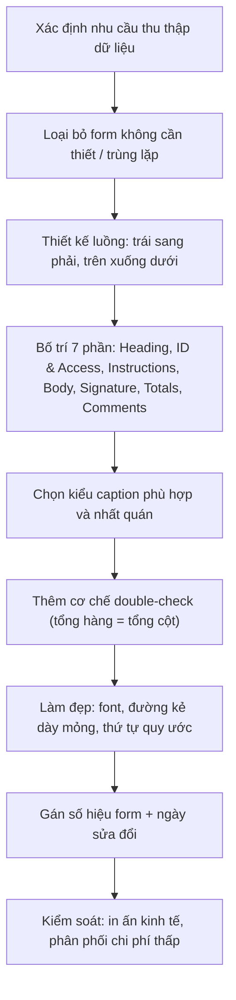
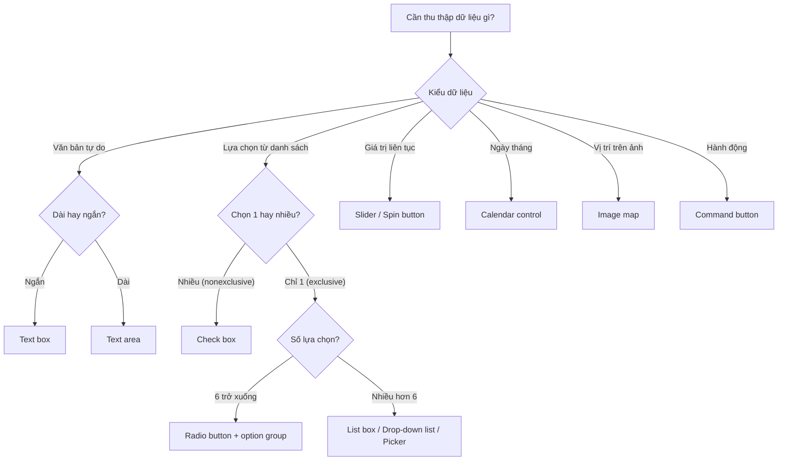
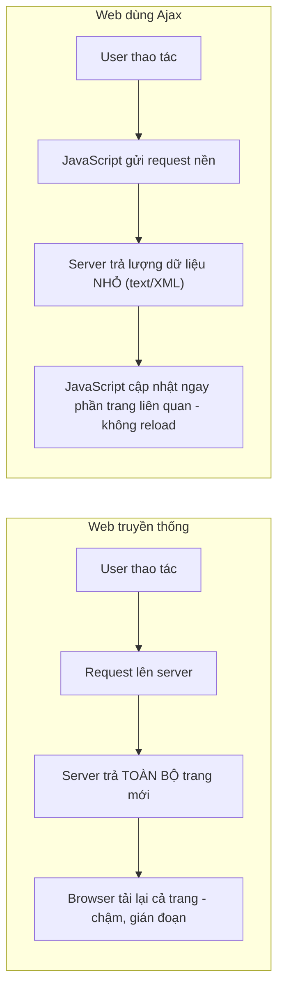
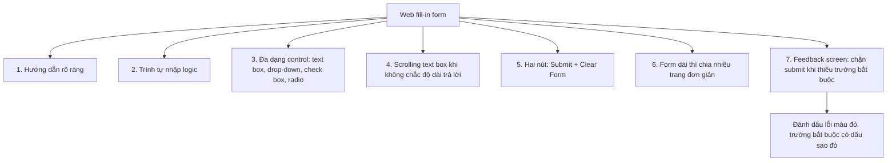

# Chương 12 — Designing Effective Input (Thiết kế đầu vào hiệu quả)

> Kendall & Kendall, *Systems Analysis and Design*, 11th edition — Part IV: The Essentials of Design (trang 366–391).

---

## 🎯 Mục tiêu học tập

Sau khi học xong chương này, bạn có thể:

1. **Thiết kế form giấy (paper form)** hoàn chỉnh, hữu ích: dễ điền, đúng mục đích, đảm bảo điền chính xác, và hấp dẫn (attractive).
2. **Thiết kế màn hình nhập liệu (display/screen)** và **web fill-in form** đạt các mục tiêu tổng thể của thiết kế đầu vào: **effectiveness (hiệu quả), accuracy (chính xác), ease of use (dễ dùng), simplicity (đơn giản), consistency (nhất quán), attractiveness (hấp dẫn)**.
3. **Chọn đúng GUI control** cho từng loại dữ liệu: text box, check box, option/radio button, list box, drop-down list, picker, tab control dialog box, slider/spin button, calendar control, image map, text area, message box, command button.
4. Hiểu cách **form values** (cặp name–value) và **hidden fields** hoạt động khi truyền dữ liệu từ web form về server.
5. Lập **event-response chart** để mô tả tương tác phức tạp trên form; thiết kế **dynamic web pages**, **three-dimensional web pages (layers)** và ứng dụng **Ajax**.
6. **Dùng màu (color)** đúng cách trong thiết kế màn hình, có tính đến **color vision deficiency (CVD)**.
7. Áp dụng các thành phần điều hướng website phổ biến: **hamburger icon/menu, context-sensitive help, input validation, breadcrumb trail, fat footer**.
8. Nắm **7 hướng dẫn thiết kế web fill-in form** cho intranet/internet và các yêu cầu bổ sung của ứng dụng ecommerce (shopping cart, bảo mật, quyền riêng tư).

---

## 📖 Tóm tắt & giải thích kiến thức

### 1. Thiết kế form tốt (Good Form Design)

**Form** là giấy in sẵn (preprinted paper) yêu cầu người dùng điền thông tin theo cách **chuẩn hóa**. Form thu thập (elicit & capture) thông tin mà tổ chức cần, thường trở thành **source document** (tài liệu nguồn) để nhập vào máy tính hoặc input cho ứng dụng ecommerce. Form không cần thiết, lãng phí tài nguyên → phải loại bỏ.

**4 nguyên tắc (guidelines) thiết kế form:**

| # | Nguyên tắc | Ý nghĩa |
|---|-----------|---------|
| 1 | **Make forms easy to fill in** — dễ điền | Giảm lỗi, điền nhanh, dễ nhập dữ liệu. Chi phí form rất nhỏ so với chi phí **thời gian** nhân viên điền và nhập liệu |
| 2 | **Meet the intended purpose** — đúng mục đích | Form phải phục vụ mục đích ghi nhận, xử lý, lưu trữ, truy xuất thông tin |
| 3 | **Ensure accurate completion** — điền chính xác | Thiết kế tốt làm tỷ lệ lỗi giảm mạnh |
| 4 | **Keep forms attractive** — hấp dẫn | Form đẹp thu hút người điền, khuyến khích hoàn thành |

#### 1.1 Làm form dễ điền

**a) Form flow (luồng form):** form phải chảy **từ trái sang phải, từ trên xuống dưới**. Luồng phi logic (bắt điền cuối form rồi nhảy ngược lên đầu) gây tốn thời gian và ức chế. Có thể loại bỏ hẳn bước "chép lại" (transcription) bằng **electronic submission** — người dùng tự gõ trên website.

**b) 7 phần (sections) của một form** — nhóm thông tin theo logic:

| # | Phần | Vị trí | Nội dung |
|---|------|--------|----------|
| 1 | **Heading** (tiêu đề) | ¼ trên | Tên + địa chỉ tổ chức phát hành form |
| 2 | **Identification & access** (định danh & truy cập) | ¼ trên | Mã số để lưu trữ (file) và truy xuất sau này — quan trọng khi phải lưu tài liệu nhiều năm |
| 3 | **Instructions** (hướng dẫn) | ¼ trên | Cách điền form, nộp/chuyển đi đâu khi điền xong |
| 4 | **Body** (thân) | ~½ giữa | Phần chi tiết nhất, chứa **dữ liệu biến đổi (variable data)** |
| 5 | **Signature & verification** (chữ ký & xác nhận) | ¼ dưới | Chữ ký người khai, người duyệt |
| 6 | **Totals** (tổng) | ¼ dưới | Các con số tổng — tạo "closure" cho người điền |
| 7 | **Comments** (ghi chú) | ¼ dưới | Nhận xét, tóm tắt |

Ví dụ trong sách: **Employee Expense Voucher của Bakerloo's** (Figure 12.1) — còn có cơ chế **internal double-check**: tổng theo cột và tổng theo hàng phải bằng nhau → người điền tự phát hiện lỗi ngay tại chỗ.

**c) Captioning (chú thích/nhãn):** caption cho người điền biết phải ghi gì vào dòng/ô. Các kiểu caption (Figure 12.2):

| Kiểu caption | Mô tả | Khi nào dùng |
|--------------|-------|--------------|
| **Line caption** (trên cùng dòng, bên trái) | Nhãn nằm trái, dữ liệu điền lên dòng kẻ | Dữ liệu tự do, ngắn |
| **Below-line caption** (dưới dòng kẻ) | Nhãn in **dưới** dòng điền → nhiều chỗ hơn cho dữ liệu; nhược: dễ nhầm dòng nào đi với nhãn nào | Khi cần tối đa hóa chỗ điền |
| **Boxed caption** (ô hộp) | Ô vuông thay dòng kẻ; caption trong/trên/dưới ô, cỡ chữ nhỏ; có thể thêm vạch tick dọc nếu dữ liệu sẽ nhập máy | Giúp điền đúng chỗ, người nhận dễ đọc; thêm ghi chú định dạng như `Date (MM/DD/YYYY)` |
| **Vertical check-off caption** (danh sách tick dọc) | Danh sách lựa chọn tick chọn theo cột dọc | Khi lựa chọn **bị giới hạn** (vd: phương tiện đi công tác) — nhanh hơn dòng trống, còn nhắc người kiểm tra đối chiếu chứng từ |
| **Horizontal check-off caption** (tick ngang) | Lựa chọn xếp ngang | Thông tin **thường quy, ổn định** (vd: chọn 1 trong các phòng ban: Photo Lab, Printing, Maintenance, Supplies) |
| **Table caption** (bảng) | Bảng có cột tiêu đề | Phần **body** cần chi tiết; người điền tự tạo "bảng" gọn cho người nhận |

Nguyên tắc: dùng caption **nhất quán** (không trộn above-line và below-line trong cùng form); có thể **kết hợp** nhiều kiểu (table caption cho chi tiết + line caption cho subtotal, thuế, tổng).

#### 1.2 Đúng mục đích — Specialty forms

Khi cần cung cấp thông tin khác nhau cho các phòng ban/người dùng khác nhau nhưng vẫn chia sẻ phần thông tin chung → dùng **specialty form**. Thuật ngữ này cũng chỉ các form do nhà in chuyên nghiệp (stationer) sản xuất:
- **Multiple-part forms**: tạo bản sao (triplicate) tức thì.
- **Continuous-feed forms**: chạy liên tục qua máy in không cần can thiệp.
- **Perforated forms**: có đường đục lỗ, xé để lại cuống (stub) làm bằng chứng lưu.

#### 1.3 Đảm bảo điền chính xác

Thiết kế tốt → tỷ lệ lỗi giảm mạnh. Với nhân viên hiện trường (đọc công tơ, kiểm kê), dùng **handheld devices** quét/nhập tại chỗ → bỏ bước transcription; dữ liệu upload qua wireless hoặc khi cắm thiết bị về hệ thống lớn.

#### 1.4 Giữ form hấp dẫn

- Form phải **thoáng, không rối** (uncluttered).
- Hỏi thông tin theo **thứ tự quy ước**: tên → địa chỉ → thành phố → bang → mã bưu chính (→ quốc gia nếu cần).
- Dùng **font chữ khác nhau**, **đường kẻ dày/mỏng** để tách nhóm/nhóm con — thu hút chú ý và tạo cảm giác an tâm đang điền đúng.

#### 1.5 Kiểm soát form (Controlling Business Forms)

Thường có **forms specialist**, đôi khi là systems analyst. Nhiệm vụ:
- Đảm bảo mỗi form đang dùng **phục vụ đúng mục đích** và mục đích đó thiết yếu với tổ chức.
- **Ngăn trùng lặp** thông tin thu thập và form thu thập.
- Thiết kế form hiệu quả; chọn cách **in ấn kinh tế nhất**; thiết lập quy trình để form **sẵn có khi cần với chi phí thấp nhất** (thường đưa form lên web để in).
- Mỗi form phải có **số hiệu form duy nhất + ngày sửa đổi (tháng/năm)** — dù nộp giấy hay điện tử.



---

### 2. Thiết kế màn hình & web form tốt (Good Display and Web Form Design)

Nhiều nguyên tắc form giấy chuyển được sang display/website/smartphone/tablet, nhưng display có **đặc thù riêng** — analyst không nên bê nguyên quy ước giấy:
- **Cursor** luôn hiện diện → định hướng vị trí nhập liệu hiện tại, tự tiến lên khi gõ.
- Có thể nhúng **context-sensitive help** → giảm hướng dẫn in trên từng dòng, giảm rối và giảm cuộc gọi hỗ trợ kỹ thuật.
- Web form có **hyperlinks** → dẫn tới ví dụ form đã điền đúng.

**4 nguyên tắc (guidelines) thiết kế display:**

#### 2.1 Keep the display simple (đơn giản)
- Chỉ hiển thị những gì cần cho thao tác hiện tại; với người dùng thỉnh thoảng (occasional user), **~50% diện tích màn hình** chứa thông tin hữu ích.
- **3 phần (sections) của màn hình:**

| Phần | Nội dung |
|------|----------|
| **Heading** (trên) | Tiêu đề phần mềm/file đang mở, pull-down menu, icon chức năng |
| **Body** (giữa) | Vùng nhập liệu, tổ chức **trái→phải, trên→dưới** (thói quen đọc phương Tây); có caption + hướng dẫn; right-click để mở context-sensitive help |
| **Comments & instructions** (dưới) | Menu lệnh cơ bản: đổi trang, lưu file, thoát — giúp người mới thấy an tâm |

- Cách khác để giữ đơn giản: context-sensitive help, **rollover buttons**, pop-up windows, cho người dùng minimize/maximize cửa sổ (bắt đầu đơn giản, tự tùy biến bằng nhiều cửa sổ). Hyperlink trên web form có vai trò tương tự.

#### 2.2 Keep the display consistent (nhất quán)
- Nếu người dùng làm việc từ form giấy → display nên **theo bố cục giấy**.
- Đặt thông tin ở **cùng vị trí** mỗi lần mở màn hình mới.
- **Nhóm thông tin liên quan logic** đi cùng nhau (name + address đi với nhau, không tách name một vùng và postal code vùng khác); không để nhóm chồng lấn nhau.

#### 2.3 Facilitate movement (dễ di chuyển giữa các trang)
- Quy tắc **"three-clicks"**: tới trang cần trong 3 cú click/phím — nhưng nghiên cứu mới (Nielsen & Li, 2017) chỉ ra đây là **heuristic, không phải luật cứng**, không nên trói tay designer.
- Cách hỗ trợ: **hyperlinks**, **scrolling arrows**, **context-sensitive pop-up windows**, **onscreen dialog** — tạo ảo giác "di chuyển vật lý" sang trang mới.

#### 2.4 Attractive & pleasing display (hấp dẫn)
- Display đẹp → năng suất cao hơn, cần ít giám sát hơn, ít lỗi hơn.
- Dùng nhiều **khoảng trống (open area)** quanh field nhập liệu; **không bao giờ nhồi nhét** — thà dùng nhiều cửa sổ/hyperlink còn hơn dồn hết một trang.
- Bố trí theo **luồng logic**, theo cách người dùng hình dung công việc.
- GUI cho phép dùng màu, ô đổ bóng, hộp/mũi tên 3 chiều. Font lạ/cỡ chữ khác chỉ dùng nếu **thật sự giúp** hiểu — nếu gây phân tâm thì bỏ. Nhớ **test prototype trên nhiều browser** vì hiển thị khác nhau.

#### 2.5 Icons trong thiết kế display
- **Icon** = hình ảnh trên màn hình tượng trưng hành động máy tính (chọn bằng chuột, bàn phím, lightpen, touch screen, joystick). Ý nghĩa được nắm bắt **nhanh hơn chữ**; iPhone/iPad phổ cập icon trên màn hình cảm ứng.
- Hướng dẫn: hình dạng **dễ nhận diện** (dùng icon chuẩn đã quen thuộc: file cabinet, folder, giấy, sọt rác); giới hạn **~20 hình** cho một ứng dụng; dùng **nhất quán** xuyên suốt các ứng dụng xuất hiện cùng nhau; icon chỉ đáng dùng nếu **có ý nghĩa** với người dùng.

---

### 3. Thiết kế GUI — các control và khi nào dùng (Graphical User Interface Design)

Người dùng tương tác với OS qua **GUI (point-and-click interface)**. Các control chính (ví dụ minh họa: form Microsoft Access, Figure 12.3):

**a) Text box** — hình chữ nhật cho nhập/hiển thị dữ liệu. Phải **đủ rộng** cho mọi ký tự cần nhập; có **caption bên trái**. Trong Access: chữ căn trái, số căn phải. HTML5 bổ sung:
- **Placeholder**: chữ mờ gợi ý trong ô, biến mất khi con trỏ vào ô.
- Kiểu **email / telephone / URL**: trên tablet/smartphone tự đổi **bàn phím ảo** (số điện thoại → bàn phím số; URL → có nút `.com`; email → có phím `@`) → nhập nhanh và chính xác.
- **Datalist**: hiện drop-down gợi ý định sẵn khi gõ vài ký tự đầu → dùng cho **autocomplete**.

**b) Check box** — chứa X (hoặc dấu ✓) hoặc rỗng; dùng cho **lựa chọn KHÔNG loại trừ** (nonexclusive — chọn được nhiều). Label đặt **bên phải**; nếu nhiều check box → sắp thứ tự (alphabet hoặc mục hay chọn nhất lên đầu); **>10 check box** → gom vào bordered box.

**c) Option button (radio button)** — cho **lựa chọn LOẠI TRỪ** (exclusive — chỉ chọn 1). Lựa chọn liệt kê bên phải, theo trình tự; lựa chọn phổ biến để làm **default**; thường bao quanh bằng hình chữ nhật gọi là **option group**; **>6 option** → chuyển sang list box / drop-down list box.

**d) List box & Drop-down list box** — list box hiển thị nhiều lựa chọn chọn bằng chuột; **drop-down list box** dùng khi **ít chỗ trên trang**: chữ nhật + mũi tên xuống bên phải, click mở danh sách, chọn xong danh sách biến mất, lựa chọn hiển thị trong ô. Lựa chọn phổ biến → default. Trên Apple có **picker**: một hoặc nhiều danh sách cuộn (scrollable lists) các giá trị, giá trị đang chọn hiển thị **đậm hơn ở giữa**; đặt cuối màn hình hoặc dạng popover (vd: chọn thành phố đến trong app hàng không, chọn ngày trên lịch).

**e) Tab control dialog box** — hộp thoại nhiều tab giúp tổ chức tính năng: mỗi tính năng riêng **một tab**, tab hay dùng **đặt trước và hiển thị đầu tiên**, có nút **OK, Cancel, Help**.

**f) Slider & Spin button** — cho dữ liệu có **dải giá trị liên tục**; kéo slider (trái/phải hoặc lên/xuống) để tăng/giảm — người dùng kiểm soát giá trị tốt hơn.

**g) Calendar control** (HTML5) — chọn date / date-time / local date-time từ lịch hiện ra; phổ biến trên trang đặt khách sạn (chọn ngày đến → lịch thứ hai bật lên với ngày đi mặc định là hôm sau). Chọn từ lịch **dễ và ít lỗi hơn gõ chữ**.

**h) Image map** — chọn giá trị **trong một hình ảnh**: click vào điểm, tọa độ **x-y** được gửi cho chương trình (vd: bản đồ click vùng để xem chi tiết). Đã **giảm phổ biến**, khó xây → dùng image map editor/web editor, đừng tự viết từ đầu.

**i) Text area** — nhập **lượng chữ lớn**: nhiều hàng, cột, thanh cuộn. Hai cách xử lý: **không word wrap** (nhấn Enter xuống dòng, chữ cuộn ngang) hoặc **cho word wrap**.

**j) Message box** — cảnh báo/phản hồi trong hộp thoại, thường đè lên màn hình; phải là cửa sổ chữ nhật, thông điệp **rõ ràng**: chuyện gì đang xảy ra, hành động nào khả dĩ.

**k) Command button** — thực hiện hành động khi chọn (Calculate Total, Add Order, OK); chữ căn giữa trong nút chữ nhật; nút default có **viền nét đứt quanh chữ** hoặc đổ bóng, nhấn **Enter** để chọn nút default.

#### 📋 Bảng chọn control

| Tình huống dữ liệu | Control nên dùng |
|--------------------|------------------|
| Văn bản/số tự do, ngắn | **Text box** (+ placeholder, kiểu email/tel/URL trên HTML5) |
| Văn bản dài nhiều dòng | **Text area** (quyết định word wrap) |
| Chọn nhiều mục cùng lúc (nonexclusive) | **Check box** (>10 → gom vào bordered box) |
| Chọn đúng 1 trong ít lựa chọn (exclusive, ≤6) | **Option/radio button** (+ option group) |
| Chọn 1 trong nhiều lựa chọn, còn chỗ | **List box** |
| Chọn 1 trong nhiều lựa chọn, ít chỗ | **Drop-down list box** (iOS: **picker**) |
| Gõ có gợi ý autocomplete | **Datalist** (HTML5) |
| Giá trị liên tục trong một dải | **Slider / Spin button** |
| Ngày, ngày giờ | **Calendar control** (HTML5) |
| Chọn vị trí trên hình/bản đồ | **Image map** |
| Nhóm nhiều tính năng cấu hình | **Tab control dialog box** |
| Kích hoạt hành động | **Command button** |
| Cảnh báo/phản hồi | **Message box** |
| Dữ liệu truyền ngầm giữa các form | **Hidden field** |



---

### 4. Form controls và values (Form Controls and Values)

Mỗi control phải có cách **lưu dữ liệu** gắn với nó. Trên web page: cặp **name–value** truyền về server (hoặc gửi kèm email) — vd name = `city`, value = `Paris`. Name định nghĩa trên web form; **server phải nhận diện name** để biết xử lý value thế nào.

Cách lấy value khác nhau theo control:
- **Text box / text area**: value = ký tự người dùng gõ.
- **Radio button / check box**: chữ hiển thị bên phải **chỉ dành cho con người đọc**; value được **định nghĩa sẵn trong form** và truyền khi submit. Nếu cập nhật database, value thường là **mã (code)** — analyst phải quyết định value phù hợp cho từng nút.
- **Drop-down list**: nhiều option → phải quyết định value **cho từng option**; option nào được chọn thì value đó được gửi.

**Hai cách dùng form values:** (1) truyền về **server** để lưu/cập nhật database; (2) dùng trong **tính toán JavaScript trên browser** (nhân, cộng, ra quyết định).

Ví dụ sách (Figure 12.4 — form đăng ký cruise): radio 4-day/7-day/14-day gửi value `S`/`A`/`L`; chọn radio thì số tiền tự điền vào text box bên trái và xóa lựa chọn cũ; check box ocean-view gửi `Y`; người dùng sửa ô tiền đã tính → bị **reset**; nhấn Submit → toàn bộ gửi về server.

### 5. Hidden fields

**Hidden field**: control **không hiển thị**, không chiếm chỗ trên trang, chỉ chứa **name + value**. Công dụng:
- Lưu value chuyển từ form này sang form khác khi giao dịch cần **nhiều form** liên tiếp.
- Lưu thông tin về **browser, hệ điều hành** của người xem.
- Chứa **key field** để định vị bản ghi khách hàng hoặc phiên duyệt (browsing session).

### 6. Event-response charts

Khi web form (hoặc GUI form bất kỳ) có **tương tác phức tạp**, dùng **event-response chart** liệt kê các sự kiện có thể xảy ra. (Ở mức cao dùng mô hình sự kiện nghiệp vụ — Chương 7; trên form thì event chủ yếu là **hành động người dùng**.)

- **Các loại event**: click nút, **thay đổi value**, **focus** (con trỏ vào field/control), **blur** (con trỏ rời field), **load trang**, phát hiện **keystroke**…
- **Response**: mô tả trang phải phản ứng thế nào khi event xảy ra. Mỗi event gắn với một **object** cụ thể (nút, text field, cả trang…).
- Vì người dùng có thể thao tác **theo bất kỳ thứ tự nào**, chart giúp xây form **đòi hỏi thao tác tối thiểu** (vd Azure Islé Resort: đổi tháng bắt đầu → tháng kết thúc tự khớp; tháng nhỏ hơn tháng hiện tại → tự tăng năm; gõ đủ 3 số mã vùng → con trỏ tự nhảy field kế).
- Chart còn dùng để **khám phá cải tiến** trang (vd đa số khách ở 7 ngày → mặc định ngày kết thúc +7) và để **điều hướng giữa các trang**, thay đổi nội dung drop-down phụ thuộc (chọn nhóm nghề → drop-down thứ hai hiện các vị trí chi tiết).

### 7. Dynamic web pages (trang web động)

Trang **tự thay đổi theo hành động người dùng**, thường bằng **JavaScript** (đổi ảnh khi rê chuột, xoay ảnh ngẫu nhiên, dò chiều rộng cửa sổ để chỉnh trang, menu mở rộng khi click dấu +).

Browser hiện đại cho phép form **"morph"**: thêm/bớt field, đổi thuộc tính field (độ dài, radio → check box) → trang phản hồi tốt hơn, **không cần tải trang mới**. Ví dụ: đặt **danh sách quốc gia trước** các phần địa chỉ → chọn United States thì caption là *State/Zip Code*, Canada → *Province/Postal Code*, Japan → *Prefecture/Mail Code*. Ví dụ khác: form bảo hiểm (Figure 12.7) — check "Corporate" thì Last/First/Middle Name đổi thành field *Company*; click "Add New Property" → sinh bộ field mới (chú ý sinh **name duy nhất** để server nhận diện). Expedia.com: click radio flight/hotel/car/cruise → form đổi theo.

**Khi nào nên dùng**: khi dữ liệu thay đổi phụ thuộc phần khác của trang (click radio, chọn drop-down). **Không nên** khi một phần form không mã hóa còn phần khác cần **encryption**.

**Nhược điểm**: (1) không hoạt động nếu **JavaScript bị tắt** — nếu buộc phải dùng (intranet công ty, vay sinh viên, giao dịch chính phủ) thì thông báo rõ và hướng dẫn bật; đa số site ecommerce có website thay thế; (2) có thể **không tuân thủ ADA** (Americans with Disabilities Act — xem Chương 14 về accessibility).

### 8. Three-dimensional web pages (trang web 3 chiều — layers)

Dùng **các lớp (layers) xếp chồng** (thuộc tính CSS **z-index**) để hiển thị tạm thông tin: khối help, **lịch clickable** cho field ngày, mã sân bay… **Base plane** = trang chính (lớp chuẩn hiển thị/thu thập thông tin); các lớp dưới **không nhìn thấy**. Khi cần → lớp trồi lên trên (hoặc do JavaScript sinh ra); xong (chọn ngày, click close, click ra ngoài) → lớp chìm xuống/bị gỡ.

**Analyst phải xác định 7 điều:**
1. **Lớp được xây thế nào?** JavaScript thuần (lịch) hay cần dữ liệu bổ sung? Nếu cần, dữ liệu ở đâu, lấy sao — lý tưởng: từ **một bảng database** trên server bằng **Ajax**.
2. **Event nào tạo lớp?** Click/tab vào field, click link, đếm số keystroke (vd khách sạn: gõ 3 ký tự → hiện danh sách khách sạn bắt đầu bằng 3 chữ đó; chỉ 2 ký tự thì danh sách quá dài).
3. **Event nào gỡ lớp?** Nút close, click ngày, click ra ngoài vùng, chọn một mục.
4. **Đặt khối ở đâu?** Thường **cạnh field** sinh ra nó (tọa độ x-y).
5. **Khối lớn bao nhiêu (pixel)?** Nội dung quá lớn → thêm scroll bar hoặc link "trang sau".
6. **Định dạng vùng**: màu, viền; hỏi user có muốn **đổi màu hàng khi rê chuột**.
7. **Chọn một option thì chuyện gì xảy ra?** (click ngày → điền vào starting date; chọn khách sạn → điền city/state/country + link).

**Ưu điểm của layers**: không cần **pop-up page** (dễ bị phần mềm bảo mật chặn), không phải tải trang mới, không chiếm chỗ trên trang chính.

### 9. Ajax (Asynchronous JavaScript and XML)

Kỹ thuật dùng **JavaScript + XML**. Truyền thống: mỗi lần cần dữ liệu từ bảng khác → gửi request, **tải lại cả trang** (chậm). **Ajax**: browser gửi request, server trả **một lượng dữ liệu nhỏ**, trang hiện tại **được cập nhật động, không reload** → web hoạt động như **ứng dụng desktop**, người dùng không bị gián đoạn.

- Dữ liệu trả về: file text nhỏ hoặc **XML document** (mỗi phần tử lặp — vd customer — là một **node**, đánh số từ 0 → trang có thể nhảy tới node đầu/cuối hoặc lặp từng node bằng click nút).
- Ví dụ sách (Figure 12.8 — đặt phà châu Âu): thay vì 3–4 trang riêng, một form Ajax: nhập điểm đi/đến + ngày → kiểm tra chỗ trống; đổi số hành khách → form **tự thêm 3 drop-down cho mỗi hành khách** kèm hướng dẫn; chọn loại xe "Car" → server trả danh sách **Car Make**, chọn Make → server trả **Car Model**…
- **Phân chia giao dịch**: analyst quyết định phần nào dùng Ajax, phần nào tách trang. Dữ liệu nhỏ, logic nằm gọn một form → Ajax; giao dịch lớn (đặt vé máy bay) → nhiều trang, có thể chỉ trang chọn ghế/suất ăn dùng Ajax. Vẫn cần trang **xác nhận** và trang nhập tên/địa chỉ/thẻ.
- **Ưu**: nhanh hơn, trải nghiệm mượt hơn. **Nhược**: JavaScript phải bật; có thể vi phạm **ADA**; phải cân nhắc **security**. Ví dụ nổi tiếng: Google Earth, Google Suggest.



### 10. Dùng màu trong thiết kế display (Using Color in Display Design)

Màu giúp: **tương phản nền–chữ**, **làm nổi field quan trọng**, **báo lỗi**, **mã hóa đặc biệt cho input**. Nền ảnh hưởng cảm nhận màu chữ (xanh đậm trên nền trắng ≠ trên nền vàng).

**Top 5 tổ hợp chữ/nền dễ đọc nhất (giảm dần):**
1. **Đen trên vàng** (black on yellow)
2. **Xanh lá trên trắng** (green on white)
3. **Xanh dương trên trắng** (blue on white)
4. **Trắng trên xanh dương** (white on blue)
5. **Vàng trên đen** (yellow on black)

Kém đọc nhất: **đỏ trên xanh lá** và **xanh dương trên đỏ**. Nguyên tắc: màu **sáng cho chữ**, màu **ít sáng cho nền**; gán màu tương phản mạnh **trước tiên** cho các field cần phân biệt.

- Chú ý **chuẩn mực văn hóa**: đỏ = nguy hiểm/"in the red" = lỗ; xanh lá = "go", an toàn ở phương Tây.
- **Color vision deficiency (CVD)** — thường bị gọi nhầm là "mù màu": **8–10% nam**, **<1% nữ**. Khắc phục: dùng thêm **chữ và vị trí trên màn hình** (ngoài màu) để hỗ trợ hoàn thành tác vụ.
- Đừng lạm dụng: heuristic **≤4 màu cho người dùng mới, ≤7 cho người dùng có kinh nghiệm**; màu vô nghĩa gây phân tâm, giảm hiệu suất.

### 11. Thiết kế website (Website Design) — các thành phần điều hướng phổ biến

| Thành phần | Mô tả & công dụng |
|-----------|-------------------|
| **Hamburger icon/menu** | 3 thanh ngang xếp chồng (giống miếng patty trong bánh); đặt **trên đầu** màn hình; click để mở menu của site → **tiết kiệm chỗ**, đặc biệt hữu ích trên mobile |
| **Context-sensitive help** | Con trỏ đổi thành **dấu hỏi** khi hover từ có trợ giúp; click hiện chú giải cho đúng tính năng đang dùng; **không cần internet**. Khác **online help**: phải lên internet, trợ giúp chuyên sâu nhiều tính năng, tài liệu Read Me |
| **Input validation** | Hiển thị lại mục vừa gõ; **chặn không cho sang field kế** đến khi sửa xong; kèm thông điệp lỗi (vd "Amount box must contain a number") → sửa lỗi **real time**, dữ liệu sai **không lọt vào database/file** |
| **Breadcrumb trail** | "Vệt bánh mì" (từ truyện Hansel & Gretel): cho biết user **đang ở đâu** trên site lớn/chương trình/tài liệu phức tạp; hiển thị thanh mờ trên đầu trang hoặc path đơn giản `Home>Help>Contact Us>Email>Live Chat` → tăng cảm giác **kiểm soát**, hữu ích cho site **phân cấp lớn** (retail) |
| **Fat footer** | Footer "béo" — cả một khu vực cuối trang: **link mạng xã hội**, gợi ý nội dung nên xem tiếp, **keywords/tags cho SEO**, trích **mission statement**, **slogan**, giá trị cốt lõi, hình/icon hài hước tạo chất "người"; kèm thông tin liên hệ, copyright. Footer không phải phần bỏ đi |

### 12. Thiết kế web fill-in form cho intranet/internet — 7 hướng dẫn

1. **Hướng dẫn rõ ràng** — người dùng web có thể không rành thuật ngữ kỹ thuật.
2. **Trình tự nhập logic** — nhất là khi user phải cuộn xuống vùng chưa nhìn thấy.
3. **Đa dạng control**: text box, push button, drop-down menu, check box, radio button — vừa đúng chức năng vừa tạo hứng thú.
4. **Scrolling text box** khi không chắc user cần bao nhiêu chỗ (hoặc ngôn ngữ/cấu trúc nào) để trả lời.
5. Mỗi web form có **2 nút cơ bản: Submit và Clear Form**.
6. Form **dài, phải cuộn nhiều → chia thành nhiều form đơn giản** trên các trang riêng.
7. **Feedback screen từ chối submit** đến khi các **trường bắt buộc** điền đúng; phản hồi chi tiết bằng **màu khác (đỏ phù hợp)**; trường bắt buộc thường đánh dấu **dấu sao đỏ (*)**.

**Ecommerce** đòi hỏi thêm: khách hàng cần **tự tin** mua đúng số lượng, đúng giá, tổng chi phí (gồm phí ship) đúng kỳ vọng → dùng ẩn dụ **shopping cart/shopping bag** (Figure 12.10 — Merchants Bay); giỏ hàng phải cho **sửa số lượng hoặc xóa mặt hàng**. Analyst còn phải đáp ứng: tuyên bố sứ mệnh & giá trị về **bảo mật thông tin**, **quyền riêng tư**, **đổi trả dễ & nhanh**, xử lý giao dịch hiệu quả, xây dựng quan hệ khách hàng.



---

## 🔑 Bảng thuật ngữ (Keywords and Phrases)

| Thuật ngữ (EN) | Nghĩa tiếng Việt |
|----------------|------------------|
| Ajax | Kỹ thuật JavaScript + XML bất đồng bộ: server trả lượng dữ liệu nhỏ để cập nhật trang mà không reload |
| Base plane | Lớp nền — trang web chính (lớp chuẩn) trong thiết kế trang nhiều lớp |
| Breadcrumb trail | Vệt điều hướng cho biết người dùng đang ở đâu trên website/chương trình/tài liệu lớn |
| Check box | Ô tick — lựa chọn không loại trừ (chọn được nhiều) |
| Color vision deficiency (CVD) | Khiếm khuyết thị giác màu (thường bị gọi nhầm là mù màu); 8–10% nam, <1% nữ |
| Command button | Nút lệnh — thực hiện hành động khi được chọn (OK, Calculate Total…) |
| Context-sensitive help | Trợ giúp theo ngữ cảnh — chú giải cho đúng tính năng đang dùng, không cần internet |
| Controlling business forms | Kiểm soát biểu mẫu doanh nghiệp — đảm bảo mỗi form đúng mục đích, không trùng lặp, in ấn kinh tế |
| Cursor | Con trỏ — luôn hiện trên display, định hướng vị trí nhập liệu hiện tại |
| Drop-down list box | Hộp danh sách thả xuống — dùng khi ít chỗ trên trang |
| Dynamic web pages | Trang web động — tự thay đổi theo hành động người dùng (thường bằng JavaScript) |
| Event-response chart | Bảng sự kiện–phản hồi — liệt kê control, event và cách trang phản ứng |
| Fat footer | Footer "béo" — khu vực cuối trang chứa link mạng xã hội, SEO keywords, slogan, giá trị cốt lõi… |
| Form flow | Luồng form — trái sang phải, trên xuống dưới |
| Form values | Giá trị form — cặp name–value truyền về server hoặc dùng tính toán JavaScript |
| Hamburger icon / hamburger menu | Icon 3 thanh ngang mở menu website, tiết kiệm chỗ trên mobile |
| Hidden field | Trường ẩn — không hiển thị, chứa name + value truyền giữa các form/phiên |
| Horizontal check-off caption | Caption tick-chọn xếp ngang — cho thông tin thường quy, ổn định |
| Image map | Bản đồ ảnh — click vào điểm trên ảnh, gửi tọa độ x-y cho chương trình |
| Input validation | Kiểm tra hợp lệ đầu vào — chặn dữ liệu sai kiểu/sai định dạng ngay khi nhập |
| Layer | Lớp — tầng xếp chồng (z-index) hiển thị tạm help, lịch… trên trang 3 chiều |
| Line caption | Caption dòng kẻ — nhãn bên trái hoặc dưới dòng điền dữ liệu |
| List box | Hộp danh sách — hiển thị nhiều lựa chọn, chọn bằng chuột |
| Message box | Hộp thông điệp — cảnh báo/phản hồi trong dialog đè lên màn hình |
| Option button | Nút lựa chọn (= radio button) — lựa chọn loại trừ, chỉ chọn 1 |
| Picker | Control của Apple: danh sách cuộn, giá trị đang chọn hiển thị đậm ở giữa |
| Radio button | Nút radio (= option button) |
| Slider | Thanh trượt — điều chỉnh giá trị trong dải liên tục |
| Specialty form | Form chuyên dụng — multiple-part, continuous-feed, perforated; phục vụ nhiều mục đích/phòng ban |
| Spin button | Nút xoay tăng/giảm giá trị liên tục |
| Table caption | Caption dạng bảng — cho phần body cần chi tiết |
| Text box | Ô văn bản — nhập/hiển thị dữ liệu, có caption bên trái |
| Vertical check-off caption | Caption tick-chọn xếp dọc — khi lựa chọn bị giới hạn |

---

## ❓ Trả lời Review Questions

**1. Mục tiêu thiết kế cho form giấy, màn hình nhập và web fill-in form?**
Sáu mục tiêu: **effectiveness (hiệu quả)** — phục vụ đúng mục đích thu thập dữ liệu; **accuracy (chính xác)** — thiết kế đảm bảo điền/nhập đúng; **ease of use (dễ dùng)** — không cần thời gian học thêm; **simplicity (đơn giản)** — không rối, tập trung vào việc cần làm; **consistency (nhất quán)** — bố cục, caption giống nhau xuyên suốt; **attractiveness (hấp dẫn)** — thu hút và giữ người dùng hoàn thành.

**2. Bốn nguyên tắc thiết kế form tốt?**
(1) Làm form dễ điền; (2) đảm bảo form đúng mục đích thiết kế; (3) thiết kế để đảm bảo điền chính xác; (4) giữ form hấp dẫn.

**3. Form flow đúng là gì?**
Là luồng điền **từ trái sang phải và từ trên xuống dưới**. Luồng phi logic (điền cuối form rồi nhảy ngược lên đầu) tốn thời gian và gây ức chế — đó là flow kém.

**4. Bảy phần của một form tốt?**
(1) Heading — tiêu đề; (2) Identification and access — định danh & truy cập; (3) Instructions — hướng dẫn; (4) Body — thân form (≈ nửa form, chứa dữ liệu biến đổi); (5) Signature and verification — chữ ký & xác nhận; (6) Totals — các tổng; (7) Comments — ghi chú. Ba phần đầu chiếm ¼ trên, body chiếm nửa giữa, ba phần cuối chiếm ¼ dưới.

**5. Bốn kiểu captioning trên form?**
(1) **Line caption** (kể cả biến thể below-line caption); (2) **check-off caption** (dọc — vertical và ngang — horizontal); (3) **boxed caption** — ô hộp chứa dữ liệu, caption trong/trên/dưới ô; (4) **table caption** — dạng bảng cho phần chi tiết. Có thể kết hợp nhiều kiểu trong một form nhưng mỗi kiểu phải dùng nhất quán.

**6. Specialty form là gì? Nhược điểm?**
Specialty form là form phục vụ nhu cầu chuyên biệt (cung cấp thông tin khác nhau cho các bộ phận khác nhau nhưng chia sẻ dữ liệu chung), hoặc chỉ cách form được nhà in chuyên nghiệp (stationer) sản xuất: **multiple-part** (bản sao tức thì), **continuous-feed** (in liên tục), **perforated** (đục lỗ để lại cuống lưu). Nhược điểm: chi phí in ấn chuyên nghiệp **cao**, phải đặt in và lưu kho, kém linh hoạt khi cần sửa đổi so với form thường/form điện tử — vì vậy khâu controlling forms phải cân nhắc cách in ấn kinh tế nhất.

**7. Bốn nguyên tắc thiết kế display tốt?**
(1) Giữ display đơn giản; (2) giữ trình bày display nhất quán; (3) tạo thuận lợi cho việc di chuyển giữa các màn hình/trang; (4) tạo display hấp dẫn, dễ chịu.

**8. Ba phần giúp đơn giản hóa display?**
(1) **Heading** (trên): tiêu đề phần mềm/file mở, pull-down menu, icon; (2) **Body** (giữa): vùng nhập liệu, tổ chức trái→phải, trên→dưới, có caption và hướng dẫn; (3) **Comments and instructions** (dưới): menu lệnh cơ bản (đổi trang, lưu file, thoát).

**9. Ưu điểm của onscreen windows?**
Người dùng bắt đầu với một display đơn giản, gọn, rồi **tự tùy biến và kiểm soát** bằng nhiều cửa sổ: minimize/maximize khi cần; pop-up/rollover hiển thị thêm thông tin đúng lúc; nhiều cửa sổ giúp tránh nhồi nhét mọi thứ vào một màn hình (thà nhiều cửa sổ còn hơn một trang chật cứng), hỗ trợ xem nhiều nguồn thông tin song song.

**10. Nhược điểm của onscreen windows?**
Nhiều cửa sổ có thể **chồng lấn, che khuất** thông tin quan trọng bên dưới; mở quá nhiều cửa sổ gây **rối, quá tải** và mất phương hướng cho người dùng ít kinh nghiệm; người dùng tốn thao tác quản lý (di chuyển, đóng, thu phóng) thay vì làm việc chính — vi phạm mục tiêu simplicity nếu lạm dụng.

**11. Hai cách giữ màn hình nhất quán?**
(1) Đặt thông tin ở **cùng một vùng** mỗi lần mở màn hình mới; (2) **nhóm các thông tin thuộc về nhau một cách logic** và nhất quán (name đi với address; không để name một vùng, postal code vùng khác); ngoài ra nếu người dùng làm việc từ form giấy thì display nên theo bố cục giấy.

**12. Ba cách tạo thuận lợi di chuyển giữa các trang display?**
(1) **Hyperlinks** đến trang liên quan (web form); (2) **scrolling arrows** tạo cảm giác di chuyển vật lý; (3) **context-sensitive pop-up windows**; (4) onscreen dialog. Heuristic "three-clicks": tới trang cần trong ~3 click, nhưng không phải luật cứng.

**13. Bốn thành phần GUI và khi nào dùng?**
- **Text box**: khi cần nhập dữ liệu ký tự/số tự do; phải đủ rộng, caption bên trái.
- **Check box**: khi lựa chọn **không loại trừ** — người dùng có thể chọn một hoặc nhiều option.
- **Option (radio) button**: khi lựa chọn **loại trừ** — chỉ được chọn đúng một; ≤6 lựa chọn.
- **Drop-down list box**: khi có nhiều lựa chọn nhưng **ít chỗ** trên trang.
(Các thành phần khác: list box, slider/spin button cho giá trị liên tục, tab control dialog box để tổ chức tính năng, calendar control cho ngày, image map cho tọa độ trên ảnh, text area cho văn bản dài, message box cho cảnh báo, command button cho hành động.)

**14. Khi nào dùng check box?**
Khi các lựa chọn **không loại trừ nhau** — người dùng được chọn nhiều option cùng lúc (chọn 0, 1 hoặc nhiều). Label đặt bên phải ô; sắp xếp theo alphabet hoặc mục hay chọn nhất lên đầu; hơn 10 check box thì gom vào bordered box.

**15. Khi nào dùng option button?**
Khi các lựa chọn **loại trừ nhau** — chỉ được chọn đúng **một** trong nhiều option; giúp người dùng hiểu rõ họ phải quyết định giữa các phương án. Lựa chọn phổ biến nên đặt làm default; thường bao trong option group; nếu hơn 6 option → cân nhắc list box hoặc drop-down list box.

**16. "Picker" trong phát triển app là gì?**
Là control trên các sản phẩm **Apple** để chọn từ danh sách định sẵn: gồm **một hoặc nhiều danh sách cuộn (scrollable lists)** các giá trị riêng biệt, giá trị đang chọn hiển thị bằng **chữ đậm hơn ở trung tâm** khung nhìn. Picker đặt ở **cuối màn hình** hoặc dưới dạng **popover** đè lên app khi người dùng chạm menu. Ví dụ: chọn thành phố đến trong app hãng bay, chọn ngày khi thêm sự kiện vào lịch.

**17. Hai cách form values được sử dụng?**
(1) **Truyền về server** dưới dạng cặp name–value khi submit form (hoặc gửi kèm email) để server xử lý/cập nhật database — với radio/check box/drop-down, value thường là **mã** do analyst quy định; (2) dùng trong **tính toán bằng JavaScript trên browser** — nhân, cộng, và ra quyết định ngay phía client.

**18. Hidden fields dùng để làm gì trên web form?**
Trường ẩn không hiển thị, không chiếm chỗ, chỉ có name + value. Dùng để: (1) **lưu giá trị chuyển từ form trước** khi giao dịch cần nhiều form; (2) lưu thông tin về **loại browser, hệ điều hành** của người xem; (3) chứa **key field** để định vị bản ghi khách hàng hoặc phiên duyệt web.

**19. Bốn loại event?**
(1) **Click** nút (button clicked); (2) **thay đổi giá trị** (value changes); (3) **focus** — con trỏ di chuyển vào field/radio/check box; (4) **blur** — con trỏ rời khỏi field. Ngoài ra: **load trang** (page loads), **phát hiện keystroke**, thay đổi lựa chọn drop-down…

**20. Dynamic web pages là gì?**
Là trang web **tự thay đổi chính nó do hành động của người dùng**, thường dùng JavaScript để sửa một phần trang hoặc style: đổi ảnh khi rê chuột, xoay ảnh theo chu kỳ, dò độ rộng browser để chỉnh trang, menu mở rộng, form "morph" thêm/bớt field hoặc đổi thuộc tính field — giảm nhu cầu tải trang mới theo lựa chọn của người dùng.

**21. Three-dimensional web pages là gì?**
Là trang web dùng **chuỗi lớp (layers) xếp chồng** (CSS **z-index**) để hiển thị thông tin tạm thời: khối help, lịch clickable cho field ngày, mã sân bay… Trang chính là **base plane**; các lớp khác nằm dưới, không nhìn thấy; khi có event (click vào field, gõ đủ n ký tự…) lớp trồi lên hoặc được JavaScript sinh ra, xong thì chìm xuống/bị gỡ. Ưu điểm: không cần pop-up page (dễ bị chặn), không tải trang mới, không chiếm chỗ trên trang chính.

**22. Ajax cải thiện trang web thay đổi theo hành động người dùng như thế nào?**
Thay vì tải lại **cả trang** mỗi khi cần dữ liệu mới từ server, Ajax để browser gửi request và server chỉ trả về **một lượng dữ liệu nhỏ** (text hoặc XML), JavaScript dùng dữ liệu đó **cập nhật trang hiện tại tại chỗ**. Kết quả: trang phản hồi **nhanh hơn nhiều**, người dùng **không bị gián đoạn công việc**, trải nghiệm mượt như ứng dụng desktop (vd: form đặt phà tự sinh drop-down cho từng hành khách, tự nạp Car Make/Car Model theo lựa chọn).

**23. Năm tổ hợp màu chữ/nền dễ đọc nhất?**
(1) Đen trên vàng; (2) xanh lá trên trắng; (3) xanh dương trên trắng; (4) trắng trên xanh dương; (5) vàng trên đen. (Kém nhất: đỏ trên xanh lá, xanh dương trên đỏ.)

**24. CVD nghĩa là gì? Hai việc web designer có thể làm để giảm ảnh hưởng?**
**Color vision deficiency** — khiếm khuyết thị giác màu (hay bị gọi nhầm là "mù màu"): ảnh hưởng **8–10% nam giới** và **dưới 1% nữ giới**. Giảm ảnh hưởng: (1) dùng **các chỉ báo khác ngoài màu** — chữ (text) và **vị trí trên màn hình/thiết bị** — để hỗ trợ người dùng hoàn thành tác vụ; (2) chọn tổ hợp màu chữ/nền **tương phản cao** (màu sáng cho chữ, ít sáng cho nền) và tuân thủ hướng dẫn web accessibility.

**25. Hamburger menu/icon hoạt động thế nào trên trang web?**
Là icon gồm **ba thanh ngang xếp chồng song song trong một ô vuông** (trông như miếng patty trong bánh hamburger), đặt ở **đầu trang**. Người dùng click vào icon → **menu của website hiện ra**. Nó tiết kiệm không gian trang, đặc biệt hữu ích khi thiết kế cho thiết bị di động màn hình nhỏ.

**26. Context-sensitive help khác online help ra sao?**
**Context-sensitive help**: con trỏ đổi thành dấu hỏi khi hover lên từ được hỗ trợ; click hiện chú giải **cho đúng tính năng đang dùng**; **không cần kết nối internet**. **Online help**: phải **lên internet** để nhận trợ giúp **chuyên sâu về nhiều tính năng** của phần mềm hoặc truy cập tài liệu Read Me (chi tiết phần mềm, troubleshooting nhiều chủ đề).

**27. Input validation cải thiện chất lượng dữ liệu lưu trong database như thế nào?**
Nó **ngăn người dùng nhập sai kiểu dữ liệu hoặc sai định dạng**: hiển thị lại mục vừa gõ, **không cho tiến sang field kế tiếp** cho đến khi lỗi được sửa, kèm thông điệp rõ ràng ("Amount box must contain a number", "Date box must contain a date"). Người dùng sửa lỗi **theo thời gian thực**, nhờ đó **dữ liệu sai không bao giờ bị lưu nhầm** vào database hay file.

**28. Breadcrumb trail trong thiết kế web là gì?**
Là thành phần điều hướng cho người dùng biết **họ đang ở đâu** trên một website lớn, trong một chương trình hoặc tài liệu phức tạp (tên lấy từ vệt bánh mì của Hansel & Gretel). Hiển thị dạng thanh mờ trên đầu subpage cho thấy đường đi đã qua, hoặc path đơn giản như `Home>Help>Contact Us>Email>Live Chat`. Nó nâng cao trải nghiệm và **cảm giác kiểm soát**, đặc biệt trên site phân cấp lớn như retail.

**29. Năm mục có thể đưa vào fat footer?**
Bất kỳ 5 trong số: (1) link **mạng xã hội**; (2) **gợi ý nội dung** khách nên xem tiếp trên site; (3) **keywords và tags** cải thiện SEO; (4) trích đoạn **mission statement** tạo ấn tượng lâu dài; (5) **slogan** công ty; (6) một **giá trị cốt lõi**; (7) hình/icon **hài hước** thể hiện khía cạnh con người của doanh nghiệp; (8) thông tin liên hệ, copyright.

**30. Bốn tình huống màu sắc hữu ích cho display và web form?**
(1) **Tương phản foreground với background**; (2) **làm nổi bật các field quan trọng**; (3) **chỉ ra lỗi** (feature errors); (4) **mã hóa đặc biệt cho input** (special code input). Ngoài ra còn gọi chú ý đến các thuộc tính đặc biệt khác.

**31. Bảy hướng dẫn thiết kế web fill-in form?**
(1) Cung cấp hướng dẫn rõ ràng; (2) thể hiện trình tự nhập logic; (3) dùng đa dạng text box, push button, drop-down menu, check box, radio button; (4) cung cấp scrolling text box khi không chắc người dùng cần bao nhiêu chỗ; (5) chuẩn bị 2 nút cơ bản Submit và Clear Form; (6) form dài phải cuộn nhiều → chia thành nhiều form đơn giản trên các trang riêng; (7) tạo feedback screen từ chối submit đến khi các trường bắt buộc điền đúng, highlight lỗi bằng màu phù hợp (đỏ).

---

## 🧩 Giải Problems

### Problem 1 — Form điều tra dân số bang (state census)

**Đề:** Form cũ có các caption xếp dọc rời rạc: Name, Occupation, Address, Zip code, Number of people in household, Age of head of household. (a) Sửa caption; (b) thiết kế lại cho đúng flow (thêm phần identification & access); (c) chuyển thành form web — nêu thay đổi.

**a) Sửa caption** — thêm chỉ dẫn định dạng, nhất quán kiểu caption (line caption bên trái, cùng dòng):

| Caption cũ | Caption mới (rõ ràng hơn) |
|-----------|---------------------------|
| Name | Full Name (Last, First, Middle Initial) |
| Occupation | Occupation (Job Title) |
| Address | Street Address — tách thêm City, State |
| Zip code | ZIP Code (5 digits) |
| Number of people in household | Number of People in Household (including yourself) |
| Age of head of household | Age of Head of Household (years) |

**b) Form thiết kế lại đúng flow** (trái→phải, trên→dưới; đủ 7 phần):

```
+--------------------------------------------------------------------+
| STATE CENSUS BUREAU – Household Census Form          [Heading]     |
| 123 Capitol Ave, State City                                        |
+--------------------------------------------------------------------+
| Form SC-101  Rev. 01/2026   Census Tract #___  District #___      |
|                                        [Identification & Access]  |
+--------------------------------------------------------------------+
| INSTRUCTIONS: Print clearly in ink. Complete all items.           |
| Return by mail in the enclosed envelope by June 30. [Instructions]|
+--------------------------------------------------------------------+
| Full Name (Last, First, MI): ______________________     [Body]    |
| Occupation (Job Title):      ______________________               |
| Street Address: ___________________________________               |
| City: ______________  State: ____  ZIP Code: [_][_][_][_][_]      |
| Number of People in Household: [__]                               |
| Age of Head of Household:      [__]                               |
+--------------------------------------------------------------------+
| I certify the information above is correct.                       |
| Signature: ______________  Date: __/__/____ [Signature & Verif.]  |
+--------------------------------------------------------------------+
| Total persons reported: [__]                          [Totals]    |
| Comments: _______________________________________   [Comments]    |
+--------------------------------------------------------------------+
```

Điểm mấu chốt: phần **identification & access** (số form, tract, district) cho phép lưu và truy xuất trong hệ thống máy tính của bang; luồng đi một mạch từ trên xuống, không nhảy ngược.

**c) Phiên bản web** — thay đổi khi chuyển từ giấy sang điện tử:
- Dòng kẻ → **text box** (ZIP dùng text box giới hạn 5 số); số người/tuổi → **spin button** hoặc text box số có **input validation**.
- Thêm **drop-down list** cho State; **placeholder** gợi ý định dạng; **dấu sao đỏ** cho trường bắt buộc.
- Thêm 2 nút **Submit** và **Clear Form**; **feedback screen** từ chối submit khi thiếu/sai trường bắt buộc.
- Bỏ hướng dẫn gửi thư (thay bằng xác nhận điện tử); phần identification (số phiếu, tract) có thể là **hidden field** do hệ thống tự gán — người dân không phải điền.
- Không cần chữ ký tay — thay bằng check box xác nhận ("I certify…") ; dữ liệu vào thẳng database, **loại bỏ bước transcription**.

### Problem 2 — Thư viện Buck Memorial, Elkhorn College

**a) Màn hình sign-in tại chỗ** (đủ 3 phần của display):

```
+------------------------------------------------------------+
| BUCK MEMORIAL LIBRARY – Computer Sign-In      [HEADING]    |
| File  Help                                    (menu, icon) |
+------------------------------------------------------------+
| Student ID:   [____________]                  [BODY]       |
| Name:         [____________]                               |
| Computer No.: [ 07 ▼]  (drop-down)                         |
| Purpose:      (•) Coursework ( ) Research ( ) Other        |
| Time In: 10:42 AM  (tự động)                               |
|                     [ Sign In ]  [ Clear ]                 |
+------------------------------------------------------------+
| F1=Help  Esc=Cancel  Nhấn Sign In để bắt đầu phiên         |
|                              [COMMENTS & INSTRUCTIONS]     |
+------------------------------------------------------------+
```

**b) Màn hình login từ xa:** thêm **Password** (text box che ký tự), link "Forgot password?", thông báo chính sách sử dụng, và **CAPTCHA/xác thực bổ sung**.
Khác biệt (đoạn văn): đăng nhập trong thư viện diễn ra trên máy do trường kiểm soát (browser chuẩn hóa, mạng nội bộ) nên chỉ cần định danh ai đang dùng máy nào; đăng nhập từ xa đi qua **internet công cộng** nên cần **bảo mật mạnh hơn**: mật khẩu bắt buộc, mã hóa HTTPS, giới hạn số lần thử, có thể xác thực 2 yếu tố; đồng thời phải **tương thích nhiều browser** khác nhau (không thể giả định browser như trong thư viện), giao diện phải responsive và tự giải thích vì không có thủ thư hỗ trợ tại chỗ.

**c) Form giấy cho khách cộng đồng** (đủ 7 phần):

```
[1 Heading]        BUCK MEMORIAL LIBRARY – Elkhorn College
                   Community Computer Use Log
[2 Ident./Access]  Form LIB-22  Rev. 06/2026   Station #___  Date __/__/____
[3 Instructions]   Please print. Complete one line per session.
                   Leave the form beside the computer when finished.
[4 Body]           (table caption)
   | Name | Time In | Purpose (word processing / web / real estate docs / other) | Time Off |
   |      |         |                                                            |          |
[5 Signature]      Signature: ____________________
[6 Totals]         Total time used: ____ minutes
[7 Comments]       Comments/problems with equipment: ______________________
```

### Problem 3 — Speedy Spuds (nhà hàng khoai tây thuần chay, luật 30 giây)

**a) Form order giấy** — dùng **check-off captions** để tick nhanh, table caption cho tổng; dữ liệu là input cho hệ thống inventory/reorder trên extranet với nhà trồng khoai Idaho:

```
SPEEDY SPUDS – ORDER TICKET      Form SS-01 Rev. 06/2026   Server #__  Time __:__
--------------------------------------------------------------------------------
POTATO (chọn 1 mỗi dòng)     QTY    TOPPINGS (tick nhiều)
[ ] Baked Russet             [__]   [ ] Vegan cheddar  [ ] Vegan gouda
[ ] Mashed                   [__]   [ ] Chives         [ ] Onions
[ ] Fries                    [__]   [ ] Parsley        [ ] Dairy-free sour cream
[ ] Sweet Potato             [__]   [ ] Other: ______
--------------------------------------------------------------------------------
                              Subtotal  ____   Tax ____   TOTAL ____
```

Lý do: lựa chọn món **giới hạn và ổn định** → **vertical check-off** nhanh hơn viết tay; cột QTY là boxed caption; phần totals tạo closure và phục vụ nhập liệu cuối ngày (loại khoai, topping, số lượng, giá — đúng các trường hệ thống cần).

**b) Màn hình nhập cho server/clerk:** lặp lại bố cục form giấy (nguyên tắc **nhất quán với giấy**): heading (logo + số order + giờ tự động); body: khoai = **radio buttons** (mỗi order 1 loại — exclusive), toppings = **check boxes** (nonexclusive), số lượng = **spin button**, giá/subtotal/tax/total = text box **tự tính, khóa sửa**; nút **Add Order**, **Clear**; phần dưới: hướng dẫn phím tắt.

**c) Màn hình cho kitchen crew (output display):** hiển thị món phải chuẩn bị theo từng order. Ba thay đổi so với display (b):
1. **Bỏ toàn bộ vùng nhập liệu và giá tiền** — bếp chỉ cần biết món + topping + số lượng, không cần tax/total.
2. **Phóng to chữ, dùng màu** làm nổi order mới/ưu tiên (đọc từ xa trong bếp), sắp theo hàng đợi thời gian.
3. Thay nút Add/Clear bằng nút **"Done"** để bếp đánh dấu order đã làm xong (event cập nhật hàng đợi); thông tin chỉ đọc, không có con trỏ nhập.

### Problem 4 — LiveKindly Alternative Plant-Based Products

**a) Form khách tự điền (3½ × 6 inch), dễ điền & dễ tổng hợp:** thu gọn 150 mặt hàng thành **danh mục in sẵn dạng check-off + ô số lượng** (boxed caption), bỏ việc khách tự viết tên hàng:

```
LIVEKINDLY ORDER CARD   Form LK-05 Rev. 06/2026  Store #__  Date __/__
Khoanh/tick và ghi số lượng:
PLANT-BASED           QTY | NON-DAIRY MILK       QTY
[ ] Tofu block        [_] | [ ] Oat milk 1L      [_]
[ ] Tempeh            [_] | [ ] Soy milk 1L      [_]
[ ] Vegan cheese      [_] | [ ] Almond milk 1L   [_]
...                       | ...
                 TOTAL ITEMS [__]   Customer name: ________
```

Lỗi giảm vì khách **chỉ tick + ghi số**, office worker tổng hợp bằng cách cộng cột.

**b) Specialty form cùng cỡ:** dùng **multiple-part form (3 liên)** — liên 1 (trắng): khách/quầy giữ làm biên nhận; liên 2 (vàng): office worker dùng tổng hợp trừ tồn kho; liên 3 (hồng): gửi warehouse để chuẩn bị giao hàng hôm sau. Một lần điền phục vụ 3 đối tượng — đúng bản chất specialty form.

**c) Hai form cùng cỡ, dễ phân biệt bằng mắt:** in **hai màu khác nhau** — form **xanh lá** cho *Plant-Based Products*, form **xanh dương** cho *Dairy-Free Milk Products*; tiêu đề lớn khác nhau + icon khác nhau (lá cây / hộp sữa); bố cục giữ giống nhau để thao tác nhất quán.

**d) Fill-in form onscreen cho nhân viên quầy:** heading (store #, clerk ID, ngày giờ tự động); body: **drop-down list** chọn sản phẩm (150 mặt hàng — quá nhiều cho radio/check box) có **datalist autocomplete**, **spin button** số lượng, nút **Add Item** thêm dòng vào bảng order, tổng tự tính; nút **Submit to Warehouse**; footer hướng dẫn. Dữ liệu gửi thẳng máy chủ warehouse trung tâm để kiểm soát tồn kho.

**e) Hai đoạn văn:**
- *Nhược điểm nhiều người nhập ở nhiều nơi:* mức độ huấn luyện và cẩn thận không đồng đều → **dữ liệu không nhất quán** (viết tắt khác nhau, chọn nhầm mã hàng); khó truy vết ai nhập sai; lỗi nhân lên theo số điểm nhập; xung đột cập nhật tồn kho khi nhiều người nhập đồng thời; khó chuẩn hóa quy trình và hỗ trợ kỹ thuật ở xa.
- *Biện pháp của designer để đảm bảo chính xác:* dùng control **hạn chế lựa chọn** (drop-down/datalist thay vì gõ tự do) để không thể nhập tên hàng sai; **input validation** chặn số lượng âm/phi số và không cho sang field kế đến khi sửa; **default values** hợp lý; caption và hướng dẫn rõ; trường bắt buộc đánh dấu sao đỏ + **feedback screen** từ chối submit khi thiếu; hiển thị lại order để xác nhận trước khi gửi; thiết kế nhất quán giữa các cửa hàng.

**f) Web page khách tự đặt hàng:** heading + logo; **breadcrumb** `Home > Order`; body: tìm kiếm sản phẩm (text box + datalist), danh mục dạng **drop-down**, bảng giỏ hàng (**shopping cart** — sửa số lượng, xóa mặt hàng), tổng tiền cập nhật động; radio chọn **Pickup / Delivery**; 2 nút **Submit Order** / **Clear Form**; hướng dẫn rõ ràng cho người không rành kỹ thuật; trường bắt buộc có dấu sao đỏ.

**g) Trang thẻ tín dụng — tách 2 trang để tăng bảo mật:**
- *Trang 1:* tên trên thẻ, **loại thẻ (radio buttons)**, số thẻ (text box có validation định dạng) → submit qua HTTPS; số order truyền sang trang 2 bằng **hidden field**.
- *Trang 2:* ngày hết hạn (**drop-down** tháng/năm) + **security code** (text box ngắn) + nút Confirm Purchase.
Tách như vậy để một trang bị lộ cũng không đủ trọn bộ thông tin thẻ; cả hai trang đều mã hóa, không dùng dynamic form trộn phần mã hóa và không mã hóa (đúng khuyến nghị trong chương).

**h) Trang 3D dynamic tùy biến sản phẩm:** trang chính (base plane) có **drop-down** chọn sản phẩm (sticky tofu bowl, Caesar salad…). Event *selection changes* → gửi value sản phẩm về server bằng **Ajax**, server trả danh sách nguyên liệu; một **layer** (z-index) trồi lên **cạnh drop-down** hiển thị nguyên liệu dưới dạng **check boxes** (nonexclusive — chọn nguyên liệu muốn có) + nút **Done**. Event gỡ layer: click Done hoặc click ra ngoài vùng; lựa chọn được ghi vào order trên trang chính. Xác định đủ: cách xây layer (Ajax từ 1 bảng DB), event tạo, event gỡ, vị trí (cạnh field), kích thước (thêm scroll bar nếu nguyên liệu dài), màu/viền, và hành vi khi chọn xong.

**i) Fat footer cho trang (f):**

```
---------------------------------------------------------------
LIVEKINDLY   [Facebook] [Instagram] [TikTok] [X]
Khám phá tiếp: Sản phẩm mới | Công thức thuần chay | Blog dinh dưỡng
Keywords: plant-based, vegan cheese, oat milk, dairy-free, organic
"Fresh is the key to our customers' hearts."
© 2026 LiveKindly – Liên hệ | Chính sách riêng tư | Đổi trả
---------------------------------------------------------------
```

Gồm đủ: social links, keywords (SEO), tham chiếu trang khác đáng xem, tuyên bố giá trị cốt lõi.

### Problem 5 — R. Ajab's (cửa hàng thời trang cao cấp)

**a) Card 3 × 5 inch cho khách trong cửa hàng** — phải **đẹp, tối giản** để khách sang trọng chịu điền:

```
        R .  A J A B ' S            (logo, font serif thanh lịch)
   Join our private mailing list
   Name    ______________________________
   Email   ______________________________
   Phone   (____) ____ – ______
   Style interests:  [ ] Women  [ ] Men  [ ] Accessories
   Card RA-1 Rev. 06/2026
```

Ít trường (chỉ cái cần cho mailing list), nhiều khoảng trắng, đường kẻ mảnh, boxed/line caption nhất quán → uncluttered & attractive.

**b) Màn hình nhập từ card:** bố cục **giống hệt card** (nguyên tắc nhất quán giấy → màn hình): heading "Add In-Store Customer"; body: text box Name (placeholder "Last, First"), Email (HTML5 email type), Phone (tel type), Style interests = **check boxes**; nút Save / Clear; footer phím tắt. Nhập viên nhìn card và gõ theo đúng thứ tự, không phải nhảy mắt.

**c) Tab control dialog box so sánh khách in-store vs catalog:** hộp thoại có các tab: **[In-Store] [Catalog] [Comparison]** — tab hay dùng nhất (Comparison) đặt trước và hiển thị đầu tiên; mỗi tab một tính năng riêng; tab Comparison hiển thị bảng số khách, doanh số trung bình, tần suất mua của hai nhóm; có đủ nút **OK, Cancel, Help** (đúng 3 yêu cầu thiết kế tab control trong sách).

**d) Web form cho ecommerce site:** thu thập Name, Email (validation), Password, Address (country drop-down đặt **trước** để đổi caption State/Province…), sở thích = check boxes, opt-in newsletter, nút Submit/Clear, trường bắt buộc dấu sao đỏ.
Khác form in (đoạn văn): form web có **input validation real-time** và feedback screen nên dữ liệu sạch ngay khi nhập, **không cần bước chép lại** từ card vào máy; có thể hỏi nhiều hơn (mật khẩu, địa chỉ giao hàng) vì không bị giới hạn 3×5 inch; dùng control hạn chế lựa chọn (drop-down, check box) thay chữ viết tay khó đọc; có context-sensitive help và placeholder thay cho hướng dẫn in; đổi lại phải quan tâm bảo mật/riêng tư và tương thích browser.

**e) Social media post:** *(bài mở, dựa trên bối cảnh thương hiệu)* Ảnh khách hàng (hoặc influencer) mặc set đồ R. Ajab's bước ra khỏi cửa hàng với túi giấy có logo, ánh sáng ấm; caption: "Found the one. ✨ #MyAjabMoment" — thương hiệu chỉ hiện diện **kín đáo** qua túi giấy và hashtag, kèm tag địa điểm cửa hàng; khuyến khích khách chia sẻ trải nghiệm với hashtag để tạo nội dung lan truyền tinh tế.

### Problem 6 — Brokerage house: phần mềm quản lý danh mục web-based

**a) Hai input display:**
1. *Nhập mã cổ phiếu theo dõi:* text box "Stock Symbol" có **datalist autocomplete** (gõ vài ký tự hiện gợi ý mã); nút **Add** đưa mã vào **list box** "Watched Stocks" bên cạnh; nút **Remove** xóa mã chọn trong list; validation từ chối mã không tồn tại; nút Save.
2. *Thiết kế báo cáo bằng icon:* màn hình dạng **icon-based**: kéo/click các icon chuẩn, dễ nhận diện — 📈 line chart, 📊 bar chart, 🥧 pie chart, 📄 text table — vào khung "Your Report"; **slider** chọn khoảng thời gian (1 tuần → 5 năm); **check boxes** chọn chỉ số hiển thị (price, volume, % change); nút Preview / Save Report. Icon ≤ 20 hình, dùng nhất quán.

**b) Hai display khác nên có:** (1) màn hình **đặt lệnh mua/bán** (trade entry): mã, radio Buy/Sell, số lượng (spin button), loại lệnh drop-down (market/limit), xác nhận trước khi gửi; (2) màn hình **cảnh báo giá (price alerts)**: đặt ngưỡng trên/dưới cho từng mã, chọn kênh thông báo (email/app) bằng check boxes. *(Cũng hợp lý: màn hình xem số dư/lịch sử giao dịch.)*

### Problem 7 — My Belle Cosmetics

**a) Display cho salesclerk thử màu nhanh:** heading "My Belle Virtual Try-On"; body chia 2 cột — trái: input khách hàng: **Hair color** (drop-down/picker: blonde, brunette, black, red, gray…), **Favorite clothing color** (bảng ô màu — image map/color swatch click chọn), **Lighting** (**radio buttons**: fluorescent / incandescent / outdoor — exclusive); phải: khung **ảnh khách hàng trực tiếp** với lớp màu son/phấn áp lên; dưới: dải **swatch các shade** (click đổi ngay — dynamic), **slider** cường độ màu; nút Save Look / Print / Reset. Radio + drop-down đảm bảo nhập nhanh, chính xác trong vài giây.

**b) Display chứng minh giá trị của màu cho ban lãnh đạo:** cùng bố cục (a) nhưng trình diễn **song song hai phiên bản**: nửa trái render **grayscale/không màu**, nửa phải **đầy đủ màu** — cho thấy: shade son không thể phân biệt nếu thiếu màu; field quan trọng (shade đang chọn) được highlight màu; lỗi (shade hết hàng) hiện **đỏ**; nhóm sản phẩm mã hóa theo màu. Minh họa trực tiếp 4 công dụng của màu: tương phản nền–chữ, nổi bật field quan trọng, báo lỗi, mã hóa input.

**c) Đưa lên ecommerce site của chuỗi department store (đoạn văn):** thay ảnh chụp tại quầy bằng **ảnh khách tự upload hoặc webcam/camera điện thoại**; các input (hair color, clothing color, lighting) giữ nguyên dạng drop-down/radio để khách tự chọn; thêm nút **Add to Cart** ngay dưới shade đang thử và link sản phẩm liên quan; trang phải **responsive** (mobile), dùng Ajax để đổi shade không reload trang, kèm hướng dẫn rõ ràng cho người không quen; chú ý quyền riêng tư ảnh khuôn mặt (thông báo và xin phép lưu trữ) và tuân thủ accessibility (không chỉ dựa vào màu — hiện tên shade bằng chữ cho người CVD).

**d) Breadcrumb trail cho website My Belle** (các ô đổ bóng trên đầu trang):

```
[ Home ] > [ Products ] > [ Lipstick ] > [ Fall Color Line ] > [ Virtual Try-On ]
```

Mỗi ô là hyperlink — khách đang ở "Virtual Try-On" có thể click "Lipstick" quay về danh mục son, hoặc "Home" về trang chủ; đường dẫn thể hiện đúng cấu trúc phân cấp: trang chủ → danh mục sản phẩm → loại sản phẩm → bộ sưu tập theo mùa → công cụ thử màu.

### Problem 8 — YourNextProperty Realty: màn hình tra cứu nhà (GUI web-based)

Chọn control cho từng trường:

| Trường | Control | Lý do |
|--------|---------|-------|
| a. Minimum size (sq ft) | **Text box** số (hoặc slider) + validation | Giá trị liên tục, người dùng biết con số muốn nhập |
| b. Maximum size (optional) | **Text box** số, có thể bỏ trống | Optional → không bắt buộc |
| c. Minimum bedrooms | **Spin button** (1–6+) | Dải số nhỏ, bấm tăng/giảm nhanh |
| d. Minimum bathrooms | **Spin button** | Như trên |
| e. Garage size (optional) | **Drop-down list**: (Any, 1, 2, 3+) | Ít lựa chọn, default "Any" thể hiện optional |
| f. School district | **Drop-down list box** | "Số lượng giới hạn theo khu vực" nhưng vẫn nhiều hơn 6 → drop-down tiết kiệm chỗ; danh sách có thể nạp động theo khu vực đã chọn (Ajax) |
| g. Swimming pool (yes/no, optional) | **Drop-down 3 giá trị** (Any/Yes/No) hoặc check box "Must have pool" | Optional 3 trạng thái — radio Yes/No không diễn tả được "không quan tâm" |
| h. Setting (city/suburban/rural) | **Radio buttons** trong option group | Đúng 3 lựa chọn loại trừ (≤6) |
| i. Fireplace (yes/no, optional) | Như (g) | Optional |
| j. Energy efficient (yes/no) | **Check box** | Nhị phân bắt buộc: tick = yes |

Layout: heading (logo + "Find Your Next Home"); body nhóm logic: *Size* (a,b) → *Rooms* (c,d,e) → *Location* (f,h) → *Features* (g,i,j); nút **Search** (command button, default) và **Reset**.
**Hyperlinks cần có:** kết quả tìm kiếm là danh sách nhà, **mỗi nhà là hyperlink** mở trang chi tiết (ảnh, mô tả, giá); từ trang chi tiết có link "Back to results", "Contact agent", "Schedule viewing"; **breadcrumb** `Home > Search > Results > Property #123`; link "Modify search" quay lại form còn giữ nguyên tiêu chí.

### Problem 9 — Landing page cho YourNextProperty

Bố cục: **hero section** ảnh nhà đẹp + tagline "Find the home that finds you"; ngay giữa hero là **form tìm kiếm rút gọn** (Location drop-down + Min bedrooms spin + nút Search nổi bật) dẫn tới màn hình đầy đủ của Problem 8; **hamburger menu** góc trên (mobile-friendly): Buy / Sell / Agents / About; hàng thẻ "Featured Homes" (ảnh + giá, mỗi thẻ là hyperlink); mục lợi ích (3 icon: tìm nhanh, agent tin cậy, hỗ trợ vay); **fat footer**: social links, keywords SEO ("homes for sale, real estate, buy house"), link các trang chính, slogan + giá trị "Your trust is our foundation", copyright & contact. Màu nhất quán, nhiều khoảng trắng, CTA màu tương phản cao.

### Problem 10 — Sludge's Auto: trang tìm phụ tùng dùng Ajax

Luồng Ajax (mỗi bước gửi value về server, server trả dữ liệu nhỏ, trang cập nhật không reload):
1. Drop-down **Make** (nạp khi trang load) → chọn xong, value gửi server → server trả danh sách model → nạp drop-down **Model**.
2. Chọn Model → server trả các **Year** có phụ tùng → nạp drop-down Year.
3. Chọn Year → text box **Part** có **datalist autocomplete** (gõ 3 ký tự → server trả các phụ tùng khớp).
4. Chọn Part → nếu **còn hàng**, trang hiển thị (cập nhật động): mô tả, **tình trạng (condition)**, giá, phí ship, **số lượng còn (quantity available)**, **ảnh phụ tùng**, và **nút [Buy This Part]** cho từng phụ tùng; nếu hết hàng → thông báo + gợi ý "notify me".

Thiết kế đúng tinh thần ví dụ ferry trong sách: một trang duy nhất tự "mọc" thêm nội dung theo lựa chọn.

**a) Fat footer cho landing page Sludge's:**

```
SLUDGE'S AUTO PARTS  [Facebook] [YouTube] [Instagram]
Xem thêm: Classic Car Gallery | Restoration Tips | Part Request Form
Keywords: auto parts recycling, classic car parts, antique cars, used OEM
"The cars we drive say a lot about us."
© 2026 Sludge's Auto – Contact | Shipping Policy | Returns
```

### Problem 11 — Trang Add Customer cho Sludge's Auto

Heading "Create Your Account"; body:
- **Account**: Email (HTML5 email type — bàn phím có @), Password + Confirm (validation độ mạnh).
- **Profile**: Name, Address (Country drop-down trước → đổi caption State/Province), Phone (tel type).
- **Part-watch profile** (để email khi phụ tùng về): drop-down **Make → Model → Year** (nạp Ajax nối tiếp như Problem 10) + text box Part; nút **Add to Watch List** thêm vào list box "Parts I'm Waiting For" (có nút Remove); **check box** "Email me when a requested part becomes available" (nonexclusive, mặc định tick).
- Nút **Submit** / **Clear Form**; trường bắt buộc dấu sao đỏ; feedback screen chặn submit khi email sai định dạng.

### Problem 12 — Trang Purchase cho Sludge's Auto (đã đăng nhập)

Khách đã có tài khoản và đã log on → **hiển thị một phần thông tin khách** (đúng đề): "Welcome back, **John D.** — giao tới: 123 Elm St, Springfield (Change)"; giỏ hàng hiển thị phụ tùng + giá + ship + tổng (sửa số lượng/xóa được — shopping cart).
**Tách thông tin thẻ ra 2 trang** (bảo mật):
- *Trang 1 — Payment:* **loại thẻ** (radio buttons: Visa / MasterCard / Amex) + **số thẻ** (text box, validation số & độ dài theo loại thẻ) → Continue; order ID và trạng thái truyền bằng **hidden field**, toàn bộ qua HTTPS.
- *Trang 2 — Confirm:* **expiration date** (drop-down tháng + năm) + **security code** mặt sau thẻ (text box 3–4 số) + tóm tắt đơn (chỉ đọc) + nút **Place Order**. Sau submit: trang xác nhận không cho sửa dữ liệu.

### Problem 13 — Đăng ký sản phẩm điện tử bằng Ajax

Form gồm: Name, Address, **Telephone** (HTML5 tel — bàn phím số), **Email** (HTML5 email), và chuỗi drop-down Ajax:
1. **Product Category** (drop-down nạp sẵn). Event *selection changes* → gửi **category value** về server → server trả **XML document** chứa các sản phẩm của category (mỗi sản phẩm một **node**, đánh số từ 0) → JavaScript duyệt các node để nạp drop-down **Product**.
2. Event *Product changes* → gửi **product value** về server → server trả XML các **model/version** → nạp drop-down **Model/Version**.
3. Nút **Register** (validate các trường bắt buộc, chặn submit nếu thiếu) + **Clear Form**.
Trang không reload lần nào trong suốt chuỗi chọn — đúng cơ chế Ajax: request nhỏ, XML trả về, cập nhật trang tại chỗ.

### Group Projects — Maverick Transport (gợi ý giải)

**1. Brainstorm nội dung màn hình nhập delivery load:** ngày giao (calendar control), mã shipper/receiver (drop-down + autocomplete), nội dung hàng (text box + text area mô tả), trọng lượng (text box số + validation), yêu cầu đặc biệt (**check boxes**: perishable/refrigeration, hazardous, fragile, oversized), tractor # (drop-down), điểm lấy/giao (address + country/state logic), giờ hẹn JIT (calendar + time), độ ưu tiên (radio), người phê duyệt (tự động từ login).

**2. Mỗi thành viên thiết kế một display (Visio/CASE/giấy):** áp 3 phần màn hình; kèm **pop-up notification input validation**: "Weight must be a number", "Delivery date is required" — chặn không cho lưu khi thiếu field bắt buộc, thông báo hiện cạnh field lỗi bằng màu đỏ.

**3. Danh sách display khác cần phát triển:** *(PC)* màn hình dispatcher điều phối tractor, gán tài xế, theo dõi kho 45.000 sq ft; màn hình kế toán cước; *(web — customer)* đặt lịch lấy hàng, tra cứu trạng thái; *(wireless handheld — driver)* xác nhận nhận/giao hàng, chụp chữ ký POD, báo sự cố; *(handheld — warehouse)* quét mã kiện nhập/xuất kho.

**4. Web tracking cho khách:** trường nhập **shipment/tracking number** + nút Track; kết quả: trạng thái từng chặng (breadcrumb-style timeline), vị trí hiện tại, ETA theo JIT, thông tin lạnh/perishable nếu có. Hyperlinks cần thiết: chi tiết lô hàng, POD, liên hệ dispatcher, đặt chuyến mới, FAQ. **Kiểm soát truy cập** (vài câu): khách phải **đăng nhập bằng tài khoản riêng** (username + password qua HTTPS); mỗi tracking number gắn với account ID trong database — server chỉ trả kết quả khi số vận đơn **thuộc về khách đang đăng nhập**; có thể thêm mã PIN in trên vận đơn cho tra cứu nhanh không đăng nhập, giới hạn số lần thử và session timeout để khách chỉ theo dõi được lô hàng của chính mình.

---

*Ghi chú: Problem 1 (form gốc), các Consulting Opportunities 12.1 (form y tế của Dr. Mai Krobe — Figure 12.C1) và 12.2 (màn hình thính học — Figure 12.C2), cùng các Figure 12.1–12.10 dựa trên hình trong sách; các bài giải form/màn hình ở trên là phương án minh họa bám theo nguyên tắc của chương.*
