# Chương 13 — Designing Databases (Thiết kế cơ sở dữ liệu)

> Nguồn: Kendall & Kendall, *Systems Analysis and Design*, 11th edition — Chapter 13 (trang 393–431).

---

## 🎯 Mục tiêu học tập

Sau khi học xong chương này, bạn có thể:

1. Hiểu **database** là gì, các mục tiêu hiệu quả (effectiveness objectives) của thiết kế cơ sở dữ liệu, và các vấn đề **bảo mật/đánh giá rủi ro (risk assessment)** khi lập kế hoạch database.
2. Nắm vững các **khái niệm dữ liệu**: reality – data – metadata; entity, attribute, record, key (primary, candidate, secondary, concatenated, foreign, OID).
3. Phân biệt các **loại file** truyền thống (master, table, transaction, work, report) và ba kiểu tổ chức database (hierarchical, network, relational).
4. Vẽ và đọc **sơ đồ thực thể – quan hệ (E-R diagram)** với các loại quan hệ 1:1, 1:M, M:N, self-join; dùng E-R diagram để xác định khóa cho bảng.
5. Thực hiện **chuẩn hóa (normalization)** một quan hệ từ dạng chưa chuẩn hóa → 1NF → 2NF → 3NF, hiểu partial dependency và transitive dependency.
6. Áp dụng **3 nguyên tắc thiết kế master file/database relation**, các **ràng buộc toàn vẹn (integrity constraints)** và nhận diện **4 loại anomaly**.
7. Biết **8 bước truy xuất và trình bày dữ liệu**, và khi nào cần **denormalization (phi chuẩn hóa)**.
8. Hiểu **data warehouse**, **OLAP**, **data mining**, **business intelligence (BI)**, **business analytics (BA)**, **big data**, **data analytics**, **data lakes**.
9. Hiểu **blockchain** (4 đặc tính then chốt) và **Web 3.0** (phi tập trung hóa dữ liệu, quyền sở hữu dữ liệu).

---

## 📖 Tóm tắt & giải thích kiến thức

### 1. Databases — Cơ sở dữ liệu là gì?

**Database** không đơn thuần là một tập hợp file; nó là **nguồn dữ liệu trung tâm** được **chia sẻ cho nhiều người dùng, nhiều ứng dụng**. Trái tim của database là **DBMS (Database Management System — hệ quản trị CSDL)**: cho phép tạo, sửa, cập nhật database; truy xuất dữ liệu; sinh báo cáo và màn hình hiển thị. Người bảo đảm database đạt được mục tiêu gọi là **database administrator (quản trị viên CSDL)**.

**5 mục tiêu hiệu quả (effectiveness objectives) của database:**

1. Bảo đảm dữ liệu **được chia sẻ** giữa nhiều người dùng cho nhiều ứng dụng.
2. Duy trì dữ liệu **chính xác và nhất quán**.
3. Bảo đảm mọi dữ liệu cần cho ứng dụng hiện tại **và tương lai** luôn sẵn sàng.
4. Cho phép database **tiến hóa** khi nhu cầu người dùng tăng lên.
5. Cho phép người dùng xây dựng **góc nhìn riêng (personal view)** về dữ liệu mà không cần quan tâm dữ liệu được lưu trữ vật lý thế nào.

**Ưu điểm của cách tiếp cận database (so với file riêng lẻ):**
- Dữ liệu chỉ cần lưu **một lần** → dễ đạt **data integrity** (thay đổi dữ liệu dễ và tin cậy hơn khi nó chỉ xuất hiện một chỗ).
- Dữ liệu có **xác suất sẵn có cao hơn** so với hệ thống file truyền thống (database được thiết kế đón trước nhu cầu).
- **Linh hoạt hơn** file riêng lẻ — tiến hóa được theo ứng dụng và nhu cầu người dùng.
- Người dùng có **view riêng**, không phải quan tâm cấu trúc hay lưu trữ vật lý.

**Bảo mật database:** Cyberattack (malware, denial-of-service) ngày càng tăng. Mọi bên tham gia thiết kế phải **thống nhất về giá trị của dữ liệu và chi phí bảo vệ nó** (bảo mật có chi phí lẫn lợi ích). **Risk assessment (đánh giá rủi ro) là phần thiết yếu của việc lập kế hoạch database.** Các câu hỏi cần đặt ra: Khả năng bị tấn công là bao nhiêu? Giá trị của dữ liệu được bảo vệ là gì? Hệ lụy của một vụ rò rỉ đối với khách hàng và hình ảnh công ty? Mọi người dùng và DBA cần được **đào tạo bảo mật**; đưa người dùng vào **business continuity planning** và **disaster recovery** giúp tổ chức có sức bật (resilient) khi bị xâm phạm.

---

### 2. Data Concepts — Các khái niệm dữ liệu

#### 2.1 Reality, Data, và Metadata

Ba "cõi" của dữ liệu (Figure 13.1):

| Cõi | Chứa gì |
|---|---|
| **Reality (thực tại)** | Entities (thực thể) và Attributes (thuộc tính) |
| **Data (dữ liệu thực)** | Record occurrences và Data item occurrences (các bản ghi/giá trị cụ thể) |
| **Metadata (siêu dữ liệu)** | Record definitions và Data item definitions (định nghĩa bản ghi/mục dữ liệu) |

**Metadata = thông tin mô tả dữ liệu** ("data about data").

#### 2.2 Entity (thực thể)

**Entity** là bất kỳ đối tượng hay sự kiện nào mà ai đó chọn để thu thập dữ liệu: người, nơi chốn, vật (salesperson, city, product), hoặc **sự kiện/đơn vị thời gian** (một lần máy hỏng, một giao dịch bán hàng, một tháng, một năm).

**Entity subtype (thực thể con):** một quan hệ 1:1 đặc biệt dùng để chứa **các thuộc tính bổ sung không có mặt trên mọi bản ghi** của entity chính — ký hiệu là hình chữ nhật nhỏ nằm trong hình chữ nhật entity. Mục đích: **loại bỏ các trường null** trên bảng. Ví dụ: khách hàng ưu đãi (preferred customer) có trường chiết khấu riêng; sinh viên có thực tập (internship) — STUDENT MASTER không nên chứa thông tin thực tập cho *mọi* sinh viên vì chỉ số ít có thực tập.

#### 2.3 Relationships (quan hệ)

**Relationship** = liên kết giữa các entity (còn gọi là *data associations*). Ba loại chính:

- **One-to-one (1:1):** mỗi PRODUCT có đúng một PRODUCT PACKAGE; mỗi EMPLOYEE có một OFFICE duy nhất.
- **One-to-many (1:M) / Many-to-one (M:1):** một PHYSICIAN được phân công nhiều PATIENT, nhưng mỗi PATIENT chỉ có một PHYSICIAN; một EMPLOYEE thuộc một DEPARTMENT, một DEPARTMENT có nhiều EMPLOYEE.
- **Many-to-many (M:N):** một STUDENT học nhiều COURSE, một COURSE có nhiều STUDENT; một SALESPERSON phụ trách nhiều CITY, một CITY có nhiều SALESPERSON.

**Self-join relationship:** entity quan hệ với chính nó — một bản ghi trong file trỏ tới bản ghi khác **cùng file**. Ví dụ: một task có *precedent task* (task phải hoàn thành trước).

**Ký hiệu E-R diagram (Figure 13.3):**

| Ký hiệu | Ý nghĩa |
|---|---|
| Hình chữ nhật | **Entity** — một lớp người/nơi chốn/vật |
| Chữ nhật + hình thoi bên trong | **Associative entity** — dùng để nối hai entity |
| Chữ nhật + hình oval bên trong | **Attributive entity** — dùng cho nhóm lặp (repeating groups) |
| `‖` (hai vạch) | Chính xác **một** (to 1) |
| Chân quạ + một vạch | **Một hoặc nhiều** (to many) |
| Một vạch + vòng tròn O | **Chỉ 0 hoặc 1** |
| O + chân quạ | **0, 1 hoặc nhiều** |
| Chân quạ | **Lớn hơn 1** (to more than 1) |

Tên quan hệ được viết dọc theo đường nối (có thể ghi cả hai chiều, mỗi chiều là góc nhìn của một entity).

**Ví dụ E-R về hệ thống thanh toán khám bệnh (Figure 13.4):** Các entity: PHYSICIAN, PATIENT, INSURANCE CARRIER, PRESCRIPTION, và TREATMENT (là **associative entity** vì bản thân nó không quan trọng với hệ thống billing, chỉ dùng bắc cầu giữa PATIENT và PRESCRIPTION). PHYSICIAN *treats* nhiều PATIENT (1:M); mỗi PATIENT *subscribes to* một INSURANCE CARRIER (M:1); PATIENT — TREATMENT là M:N; TREATMENT — PRESCRIPTION là M:N. Thuộc tính được liệt kê cạnh entity, **khóa được gạch chân**. Thiết kế theo kiểu **top-down** (vẽ E-R trước rồi điền thuộc tính) là lý tưởng nhưng đôi khi khó đạt được.

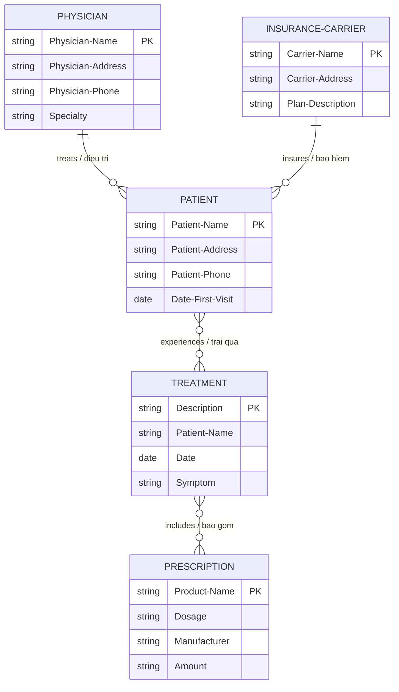

*(TREATMENT trong sách là associative entity nối PATIENT với PRESCRIPTION.)*

#### 2.4 Attributes (thuộc tính), Data Items, Fields

- **Attribute** = một đặc trưng của entity; một entity có thể có nhiều attribute (bệnh nhân có: họ, tên, địa chỉ, thành phố, bang, ngày khám gần nhất...).
- **Data element** = đơn vị nhỏ nhất được mô tả trong data dictionary (Chương 8); khi nói về file/database thì gọi là **data item** — đơn vị nhỏ nhất trong file/database. *Data item* dùng thay thế cho *attribute*.
- Data item có **giá trị (value)**: độ dài cố định hoặc biến đổi; kiểu chữ, số, ký tự đặc biệt, hoặc alphanumeric.
- **Field** là khái niệm **vật lý** (không phải logic): nhiều data item có thể được "đóng gói" vào một field. Ví dụ: ngày lưu trong một field `MM/DD/YYYY`; muốn sắp xếp theo ngày phải tách ra 3 data item và sort theo YYYY → MM → DD.

#### 2.5 Records (bản ghi)

**Record** = tập hợp các data item có điểm chung với entity được mô tả. Ví dụ record đơn hàng: ORDER-#, LAST NAME, INITIAL, STREET ADDRESS, CITY, STATE, CREDIT CARD. Đa số record có **độ dài cố định**. **Variable-length record** dùng khi tiết kiệm không gian là quan trọng (ví dụ: số lần khám của bệnh nhân thay đổi) — chuẩn hóa (normalization) chính là quy trình **loại bỏ nhóm lặp** có trong variable-length record.

#### 2.6 Keys (khóa)

| Loại khóa | Định nghĩa |
|---|---|
| **Key** | Một data item dùng để nhận diện record |
| **Primary key (khóa chính)** | Nhận diện **duy nhất** một record (ví dụ ORDER-#). Nên là **tối thiểu (minimal)** — không chứa nhiều thuộc tính hơn mức cần. Thường là số tuần tự, có thể kèm **check digit** (số tự kiểm). **Đặt khóa chính dựa trên attribute là rủi ro** — nếu attribute đổi thì khóa đổi, tạo phụ thuộc giữa khóa và dữ liệu (ví dụ: mã bang viết tắt, mã hành lý sân bay). |
| **Candidate key (khóa ứng viên)** | Attribute (hoặc tập attribute) **có thể** làm khóa chính |
| **Secondary key (khóa phụ)** | **Không** nhận diện duy nhất record; có thể unique hoặc trỏ tới nhiều record — dùng để chọn **một nhóm** record (ví dụ: các đơn hàng từ bang New Jersey) |
| **Concatenated key / Composite key (khóa ghép)** | Ghép 2+ data item lại khi không một data item nào tự nhận diện duy nhất record |
| **Foreign key (khóa ngoại)** | Attribute không phải khóa ở quan hệ này nhưng **là khóa chính ở quan hệ khác**; ký hiệu gạch chân **nét đứt** |
| **Object identifier (OID)** | Khóa duy nhất cho mỗi record **trong toàn database, không chỉ trong một bảng** — biết OID sẽ lấy được record bất kể nó ở bảng nào (ví dụ "confirmation number") |

Quy ước ký hiệu: khóa chính **gạch chân nét liền**; khóa ngoại **gạch chân nét đứt**.

#### 2.7 Metadata

**Metadata** mô tả **tên và độ dài** của mỗi data item, **độ dài và cấu tạo** của record. Quy ước ví dụ (Figure 13.7): `N 7.2` = numeric, 7 chữ số trong đó 2 chữ số bên phải dấu thập phân; `A` = alphanumeric; `D` = date dạng MM/DD/YYYY; `$` = currency; `M` = memo. Một số phần mềm (Microsoft Access) dùng tiếng Anh thường: *text, currency, number*.

---

### 3. Files — Các loại file

**File** chứa các nhóm record dùng cung cấp thông tin cho vận hành, hoạch định, quản lý và ra quyết định.

| Loại file | Thời hạn | Mô tả |
|---|---|---|
| **Master file** | Lâu dài | Chứa record cho một nhóm entity; thuộc tính cập nhật thường xuyên nhưng record tương đối cố định; record lớn, chứa toàn bộ thông tin về entity; thường có 1 primary key + nhiều secondary key. Sắp xếp chuẩn: **khóa chính trước → phần tử mô tả → phần tử thay đổi thường xuyên**. Ví dụ: hồ sơ bệnh nhân, khách hàng, nhân sự, tồn kho linh kiện. |
| **Table file** | Lâu dài | Chứa dữ liệu dùng để **tính ra dữ liệu khác** hoặc chỉ số hiệu năng (bảng cước bưu phí, bảng thuế); thường **chỉ đọc (read only)** bởi chương trình. |
| **Transaction file** | Tạm thời | Nhập **các thay đổi** để cập nhật master file và tạo báo cáo. Ví dụ cập nhật master thuê báo: mã người đăng ký + mã giao dịch (E = gia hạn, C = hủy, A = đổi địa chỉ) — chỉ nhập đúng thông tin cần cho việc cập nhật. Có thể chứa nhiều loại record khác nhau (kèm mã loại giao dịch). |
| **Report file** | Tạm thời | Dùng khi cần in báo cáo mà máy in chưa rảnh — gửi output ra file thay vì máy in gọi là **spooling**; sau đó có thể in ở thiết bị khác/hệ thống khác. |
| **Work file** | Tạm thời | File làm việc tạm cho một mục đích cụ thể. |

---

### 4. Relational Databases — CSDL quan hệ

#### 4.1 Logical view vs Physical view — Các tầng schema

Database (khác file) được **chia sẻ** cho nhiều người dùng — mỗi người nhìn dữ liệu một cách khác nhau (**user view**). Analyst phải tổng hợp các user view để xây **mô hình logic** tổng thể, rồi chuyển thành **thiết kế vật lý**. Trong tài liệu database, các view gọi là **schema**:

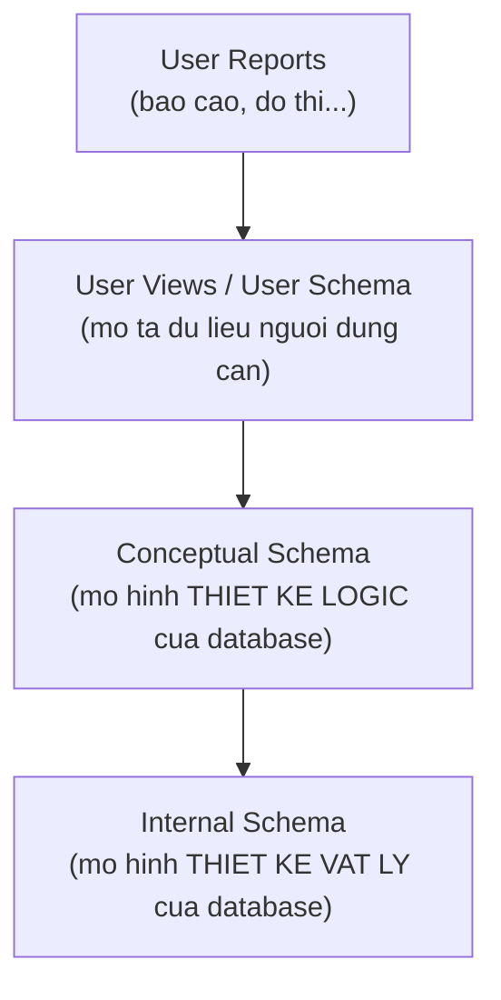

- **Logical view**: người dùng hình dung và mô tả dữ liệu thế nào.
- **Physical view**: dữ liệu được **lưu trữ, liên kết và truy cập** thế nào.

#### 4.2 Ba kiểu tổ chức database logic

1. **Hierarchical (phân cấp)** — gặp ở hệ thống legacy (cũ).
2. **Network (mạng)** — cũng gặp ở legacy.
3. **Relational (quan hệ)** — kiểu phổ biến nhất; analyst ngày nay thường thiết kế relational database.

#### 4.3 Cấu trúc dữ liệu quan hệ

**Relational data structure** = một hoặc nhiều **bảng hai chiều** gọi là **relations (quan hệ)**: **hàng = record**, **cột = attribute**. Relational database tổ chức thành các bảng có ý nghĩa, **giảm thiểu lặp dữ liệu → giảm lỗi và không gian lưu trữ**.

Ví dụ database đặt mua CD nhạc (Figure 13.9) cần 3 bảng: ITEM PRICE (giá), ORDER (chi tiết đơn), ITEM STATUS (trạng thái). Muốn sửa số thẻ tín dụng của G. MacRae chỉ cần sửa **một lần** trong ORDER dù ông ấy đặt nhiều CD; muốn biết trạng thái một phần đơn hàng phải biết cả ITEM-# và ORDER-# rồi tra ITEM STATUS.

Ưu điểm chính của cấu trúc quan hệ: **bảo trì đơn giản** hơn hierarchical/network và **xử lý truy vấn ad hoc hiệu quả**.

**Thuật ngữ tương ứng:** file = **table/relation**; record = **tuple**; tập giá trị attribute = **domain**.

Để cấu trúc quan hệ hữu dụng và quản lý được, các bảng phải được **chuẩn hóa** trước.

---

### 5. Normalization — Chuẩn hóa

**Normalization** = biến đổi các user view phức tạp và data store thành **tập các cấu trúc dữ liệu nhỏ hơn, ổn định hơn**. Dữ liệu chuẩn hóa **đơn giản hơn, ổn định hơn, dễ bảo trì hơn**.

#### 5.1 Ba bước chuẩn hóa

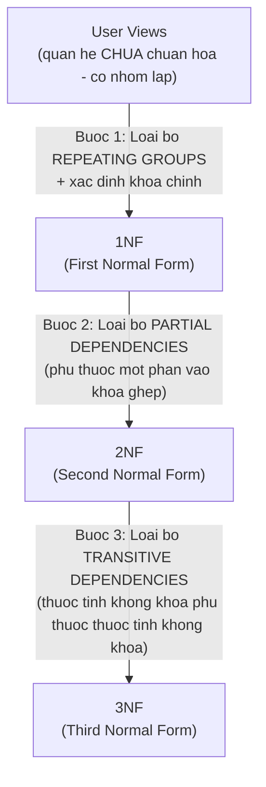

1. **Bước 1 (→1NF):** loại bỏ mọi **repeating group (nhóm lặp)** và xác định khóa chính. Quan hệ phải được tách thành 2+ quan hệ.
2. **Bước 2 (→2NF):** bảo đảm mọi thuộc tính không khóa **phụ thuộc hàm đầy đủ** vào khóa chính; mọi **partial dependency** bị gỡ ra và đặt vào quan hệ khác.
3. **Bước 3 (→3NF):** loại bỏ **transitive dependency** — thuộc tính không khóa phụ thuộc vào thuộc tính **không khóa** khác.

#### 5.2 Ví dụ chuẩn hóa: Công ty Al S. Well Hydraulic Equipment

**User view (báo cáo bán hàng):** đầu báo cáo có (1) SALESPERSON-NUMBER, (2) SALESPERSON-NAME, (3) SALES-AREA; phần thân mỗi dòng (một dòng cho mỗi khách hàng) gồm (4) CUSTOMER-NUMBER, (5) CUSTOMER-NAME, (6) WAREHOUSE-NUMBER, (7) WAREHOUSE-LOCATION, (8) SALES-AMOUNT → **mục 4–8 là nhóm lặp**.

**Quan hệ chưa chuẩn hóa** (ký pháp: ngoặc trong = nhóm lặp; khóa gạch chân):

```text
SALES-REPORT (SALESPERSON-NUMBER, SALESPERSON-NAME, SALES-AREA,
              (CUSTOMER-NUMBER, CUSTOMER-NAME, WAREHOUSE-NUMBER,
               WAREHOUSE-LOCATION, SALES-AMOUNT))
```

Dữ liệu minh họa (Figure 13.14 — bảng chưa chuẩn hóa, có nhóm lặp):

| SALESPERSON NUMBER | SALESPERSON NAME | SALES AREA | CUSTOMER NUMBER | CUSTOMER NAME | WAREHOUSE NUMBER | WAREHOUSE LOCATION | SALES AMOUNT |
|---|---|---|---|---|---|---|---|
| 3462 | Ruwa | West | 18765 | Delta Systems | 4 | Fargo | 13,540 |
| | | | 18830 | M. Levy and Sons | 3 | Bismarck | 10,600 |
| | | | 19242 | Ranier Company | 3 | Bismarck | 9,700 |
| 3593 | Dryne | East | 18841 | R. W. Flood Inc. | 2 | Superior | 11,560 |
| | | | 18899 | Seward Systems | 2 | Superior | 2,590 |
| | | | 19565 | Stodola's Inc. | 1 | Plymouth | 8,800 |

SALESPERSON-NUMBER **không thể** một mình làm khóa: nó quan hệ 1:1 với SALESPERSON-NAME và SALES-AREA nhưng quan hệ **1:M** với 5 thuộc tính còn lại.

**➤ Bước 1 — 1NF: loại bỏ nhóm lặp.** Tách SALES-REPORT thành 2 quan hệ:

```text
SALESPERSON (SALESPERSON-NUMBER, SALESPERSON-NAME, SALES-AREA)
SALESPERSON-CUSTOMER (SALESPERSON-NUMBER, CUSTOMER-NUMBER, CUSTOMER-NAME,
                      WAREHOUSE-NUMBER, WAREHOUSE-LOCATION, SALES-AMOUNT)
```

| SALESPERSON (đã đạt 3NF luôn) | | |
|---|---|---|
| **3462** | Ruwa | West |
| **3593** | Dryne | East |

SALESPERSON-CUSTOMER dùng **khóa ghép** (SALESPERSON-NUMBER + CUSTOMER-NUMBER). Quan hệ này đạt 1NF nhưng **chưa lý tưởng**: một số thuộc tính không khóa **chỉ phụ thuộc CUSTOMER-NUMBER** chứ không phụ thuộc cả khóa ghép (SALES-AMOUNT phụ thuộc cả hai, nhưng CUSTOMER-NAME, WAREHOUSE-NUMBER, WAREHOUSE-LOCATION chỉ phụ thuộc CUSTOMER-NUMBER) → **partial dependency**.

**➤ Bước 2 — 2NF: loại bỏ partial dependency.** Tách SALESPERSON-CUSTOMER thành:

```text
SALES (SALESPERSON-NUMBER, CUSTOMER-NUMBER, SALES-AMOUNT)
CUSTOMER-WAREHOUSE (CUSTOMER-NUMBER, CUSTOMER-NAME,
                    WAREHOUSE-NUMBER, WAREHOUSE-LOCATION)
```

| SALES | | |
|---|---|---|
| **3462** | **18765** | 13,540 |
| **3462** | **18830** | 10,600 |
| **3462** | **19242** | 9,700 |
| **3593** | **18841** | 11,560 |
| **3593** | **18899** | 2,590 |
| **3593** | **19565** | 8,800 |

| CUSTOMER-WAREHOUSE | | | |
|---|---|---|---|
| **18765** | Delta Systems | 4 | Fargo |
| **18830** | M. Levy and Sons | 3 | Bismarck |
| **19242** | Ranier Company | 3 | Bismarck |
| **18841** | R. W. Flood Inc. | 2 | Superior |
| **18899** | Seward Systems | 2 | Superior |
| **19565** | Stodola's Inc. | 1 | Plymouth |

CUSTOMER-WAREHOUSE đạt 2NF nhưng vẫn còn phụ thuộc: WAREHOUSE-LOCATION phụ thuộc vào **WAREHOUSE-NUMBER** (một thuộc tính không khóa) → **transitive dependency** (nhìn dữ liệu: kho 3 luôn là Bismarck, kho 2 luôn là Superior — lặp dữ liệu).

**➤ Bước 3 — 3NF: loại bỏ transitive dependency.** Tách CUSTOMER-WAREHOUSE thành:

```text
CUSTOMER (CUSTOMER-NUMBER, CUSTOMER-NAME, WAREHOUSE-NUMBER)   ← WAREHOUSE-NUMBER là foreign key
WAREHOUSE (WAREHOUSE-NUMBER, WAREHOUSE-LOCATION)
```

| CUSTOMER | | |
|---|---|---|
| **18765** | Delta Systems | 4 |
| **18830** | M. Levy and Sons | 3 |
| **19242** | Ranier Company | 3 |
| **18841** | R. W. Flood Inc. | 2 |
| **18899** | Seward Systems | 2 |
| **19565** | Stodola's Inc. | 1 |

| WAREHOUSE | |
|---|---|
| **4** | Fargo |
| **3** | Bismarck |
| **2** | Superior |
| **1** | Plymouth |

**Kết quả cuối:** quan hệ chưa chuẩn hóa SALES-REPORT → **4 quan hệ 3NF**:

```text
SALESPERSON (SALESPERSON-NUMBER, SALESPERSON-NAME, SALES-AREA)
SALES       (SALESPERSON-NUMBER, CUSTOMER-NUMBER, SALES-AMOUNT)
CUSTOMER    (CUSTOMER-NUMBER, CUSTOMER-NAME, WAREHOUSE-NUMBER)
WAREHOUSE   (WAREHOUSE-NUMBER, WAREHOUSE-LOCATION)
```

**3NF là đủ cho hầu hết bài toán thiết kế database.** Lợi ích to lớn khi **insert, delete, update** dữ liệu.

E-R diagram của database sau chuẩn hóa (Figure 13.22): một SALESPERSON phục vụ nhiều CUSTOMER, các khách hàng **tạo ra** SALES và **nhận hàng từ** một WAREHOUSE (kho gần nhất):

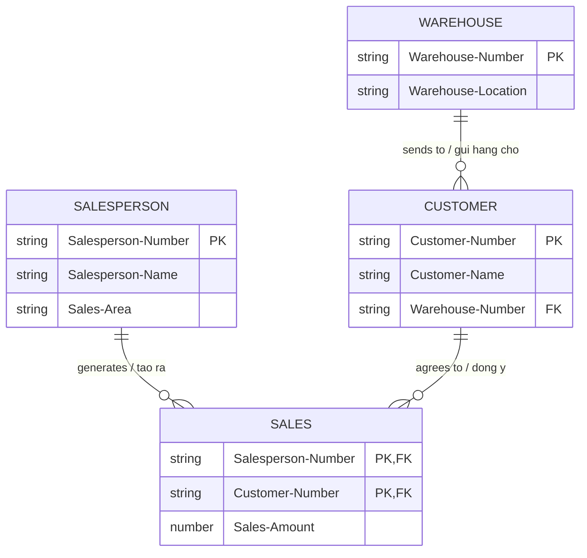

**Ghi chú — bubble diagram (data model diagram):** trước khi chuẩn hóa, analyst có thể vẽ sơ đồ liên kết dữ liệu: mỗi phần tử trong một hình ellipse, mũi tên thể hiện quan hệ (mũi tên đơn = "tới một", mũi tên đôi = "tới nhiều"). Đơn giản hơn E-R diagram, giúp thấy rõ độ phức tạp của lưu trữ dữ liệu.

#### 5.3 Dùng E-R diagram để xác định khóa của record

Bước 1: vẽ E-R diagram và gán **khóa chính duy nhất** cho mỗi entity. Ví dụ hệ thống đặt hàng (Figure 13.23): CUSTOMER (khóa CUSTOMER-NUMBER) — *places* — ORDER (khóa ORDER-NUMBER) — *contains* — ITEM (khóa ITEM-NUMBER). CUSTOMER–ORDER là 1:M; ORDER–ITEM là M:N.

**Foreign key** = trường dữ liệu trên một file là **khóa chính của một master file khác** (ví dụ DEPARTMENT-NUMBER trên STUDENT MASTER là khóa của DEPARTMENT MASTER).

**Quan hệ One-to-Many (1:M)** — loại quan hệ **phổ biến nhất** (vì mọi quan hệ M:N đều phải phân rã thành các quan hệ 1:M): đặt khóa chính của bảng đầu "một" làm **foreign key trên bảng đầu "nhiều"** (một khách hàng có nhiều đơn → đặt customer number lên record đơn hàng).
- Hiển thị từ phía "nhiều" (1 record) kèm thông tin phía "một": dễ, không có thông tin lặp (ví dụ tra một đơn hàng → hiện đơn + một khách hàng).
- Hiển thị từ phía "một" ra nhiều record phía "nhiều": phức tạp hơn — form + subform (Access), scroll bar, drop-down list, hoặc trang web: thông tin phía "một" ở đầu trang + nhiều nhóm dữ liệu/link bên dưới (một chủ đề tìm kiếm → nhiều kết quả).

**Quan hệ Many-to-Many (M:N)** — cần **ba bảng**: một bảng cho mỗi entity + **một bảng cho quan hệ** (relational table). Khóa chính của mỗi entity được lưu làm **foreign key** trong bảng quan hệ; bảng quan hệ có thể chứa thêm dữ liệu (điểm số của khóa học, số lượng đặt của mặt hàng). Ví dụ bảng ORDER-ITEM nối ORDER với ITEM MASTER:

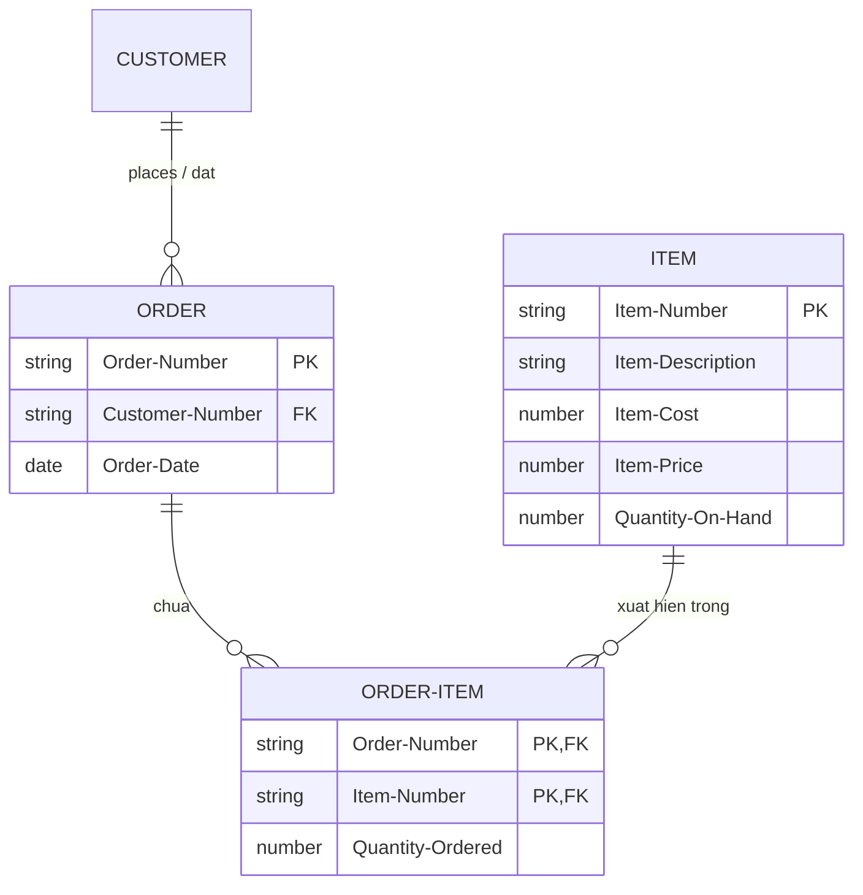

- Bảng quan hệ nên được **đánh chỉ mục (index) trên từng foreign key**; khóa chính có thể là tổ hợp hai foreign key, hoặc doanh nghiệp dùng **sequence number** làm khóa chính.
- Cách tra cứu: muốn tìm các ITEM của một ORDER → đọc trực tiếp ORDER-ITEM theo index ORDER-NUMBER (các record cùng ORDER-NUMBER được nhóm liền nhau), với mỗi record khớp → đọc trực tiếp ITEM MASTER theo ITEM-NUMBER. Chiều ngược lại tương tự (tìm mọi đơn chứa mặt hàng backorder vừa về).
- Bảng quan hệ có thể liên kết tới **nhiều bảng khác** nữa (bảng Section nối Student–Course còn có thể quan hệ với Textbook, Instructor).

---

### 6. Guidelines thiết kế Master File / Database Relation

Ba nguyên tắc khi thiết kế master file hoặc database relation:

1. **Mỗi data entity riêng biệt → một bảng master riêng.** Không gộp hai entity khác nhau vào một file (ITEM MASTER chỉ chứa thông tin item; VENDOR MASTER chỉ chứa thông tin vendor).
2. **Mỗi trường dữ liệu cụ thể chỉ tồn tại trên MỘT bảng master.** (CUSTOMER NAME chỉ ở CUSTOMER MASTER, không ở ORDER hay bảng khác.) **Ngoại lệ:** các trường **khóa/index** — có thể xuất hiện trên bao nhiêu bảng tùy cần; báo cáo/màn hình cần dữ liệu từ nhiều bảng thì index cung cấp liên kết.
3. **Mỗi bảng master phải có chương trình CRUD** (Create, Read, Update, Delete). Lý tưởng: chỉ **một** chương trình thêm record mới và chỉ **một** chương trình xóa; nhưng **nhiều** chương trình có thể thay đổi các trường dữ liệu (ví dụ CURRENT BALANCE của CUSTOMER MASTER tăng bởi chương trình xử lý đơn hàng, giảm bởi chương trình thanh toán và chương trình hoàn trả).

#### 6.1 Integrity Constraints — Ràng buộc toàn vẹn

Ba loại ràng buộc giữ dữ liệu chính xác khi thay đổi/xóa record:

1. **Entity integrity (toàn vẹn thực thể):** quy tắc về cấu tạo **khóa chính** — khóa chính **không được null**; nếu là khóa ghép thì **không thành phần nào** được null. Một số database cho định nghĩa **unique constraint/unique key**: cũng nhận diện duy nhất một record nhưng **được phép chứa null** (khác khóa chính).
2. **Referential integrity (toàn vẹn tham chiếu):** chi phối quan hệ 1:M. Bảng đầu "một" = **parent (cha)**; bảng đầu "nhiều" = **child (con)**. Mọi foreign key ở bảng con **phải có record khớp ở bảng cha**. Hệ quả:
   - Không thể thêm record con khi chưa có record cha khớp.
   - Không thể đổi khóa chính cha đang có record con (sẽ tạo **orphan record** — record con không cha; ví dụ GRADE của sinh viên không có trên STUDENT MASTER, ORDER cho CUSTOMER-NUMBER không tồn tại).
   - Không thể xóa record cha còn record con.
   - **Hai cách triển khai:** *(a)* **Restricted database** — chỉ cho update/delete cha khi **không còn** record con khớp (tốt khi **xóa** — bạn không muốn xóa khách hàng kéo theo xóa hết hóa đơn chưa thanh toán!); *(b)* **Cascaded database** — xóa/cập nhật cha sẽ tự động xóa/cập nhật **mọi record con** (tốt khi **thay đổi** — đổi khóa chính sinh viên thì mọi record khóa học của sinh viên đó được đổi foreign key theo).
3. **Domain integrity (toàn vẹn miền):** quy tắc **kiểm tra hợp lệ dữ liệu** (table/limit/range check — xem Chương 15). Lưu trong cấu trúc database ở hai dạng: **Check constraints** — định nghĩa **ở mức bảng**, tham chiếu một hoặc nhiều trường của bảng (ví dụ DATE OF PURCHASE ≤ ngày hiện tại); **Rules** — định nghĩa **ở mức database** như đối tượng riêng, dùng lại cho nhiều trường (ví dụ "giá trị > 0").

#### 6.2 Anomalies — Các dị thường

Bốn anomaly có thể xảy ra khi tạo bảng database:

1. **Data redundancy (dư thừa dữ liệu):** cùng một dữ liệu lưu ở nhiều chỗ (ngoại trừ khóa chính được lưu làm foreign key). **Giải quyết bằng 3NF.**
2. **Insert anomaly (dị thường chèn):** không thể chèn record mới vì **chưa biết đủ toàn bộ khóa chính** (vi phạm entity integrity) — thường xảy ra với khóa ghép nhiều thành phần. **Tránh bằng cách dùng sequence number làm khóa chính.**
3. **Deletion anomaly (dị thường xóa):** xóa một record làm **mất luôn dữ liệu liên quan khác** (ví dụ: một item mang vendor number, và item đó là tham chiếu duy nhất tới vendor — xóa item thì mất luôn dấu vết vendor).
4. **Update anomaly (dị thường cập nhật):** thay đổi một giá trị attribute làm database **không nhất quán** hoặc buộc phải sửa **nhiều record** (ví dụ tên đường trong thành phố đổi — có thể sửa sót). Thường do transitive dependency; ngăn ngừa bằng 3NF (dù ví dụ tên đường có thể vẫn ở 3NF).

---

### 7. Making Use of a Database — 8 bước truy xuất và trình bày dữ liệu

Các bước phải thực hiện **theo thứ tự**; bước 1 và bước 8 **bắt buộc**, sáu bước giữa **tùy chọn** theo cách dùng dữ liệu:

1. **Choose** — chọn (các) relation từ database.
2. **Join** — nối các relation lại với nhau.
3. **Project** — chiếu: chọn **cột** từ relation.
4. **Select** — chọn **hàng** từ relation.
5. **Derive** — suy diễn thuộc tính mới (tính toán ra cột mới).
6. **Index/Sort** — đánh chỉ mục hoặc sắp xếp hàng.
7. **Calculate** — tính tổng và các chỉ số hiệu năng.
8. **Present** — trình bày dữ liệu (bảng, đồ thị, hay câu trả lời một từ trên màn hình — xem thiết kế output Chương 11).

---

### 8. Denormalization — Phi chuẩn hóa

Chuẩn hóa giúp giảm dư thừa và tiết kiệm không gian, nhưng để **dùng** dữ liệu chuẩn hóa phải join, sort, summarize. Khi **tốc độ truy vấn là then chốt**, nên lưu dữ liệu theo cách khác.

**Denormalization** = quá trình biến đổi **mô hình dữ liệu logic** thành **mô hình vật lý hiệu quả cho các tác vụ cần dùng nhất** (sinh báo cáo, truy vấn nhanh, truy vấn phức tạp như **OLAP**, data mining, knowledge data discovery).

Ba cách phi chuẩn hóa (Figure 13.26):

1. **Gộp entity với associative entity** (quan hệ M:N): gộp thuộc tính của SALESPERSON và SALES → bảng SALESPERSON-SALES-DENORMALIZED — tránh một phép join; dữ liệu trùng lặp đáng kể nhưng truy vấn mẫu hình bán hàng hiệu quả hơn.
2. **Gộp bảng tra cứu (look-up table):** tránh tham chiếu lặp lại bảng tra — lặp lại thông tin (city, state, postal code) dù có thể chỉ lưu postal code; ví dụ gộp CUSTOMER với WAREHOUSE.
3. **Gộp quan hệ 1:1:** rất hay được gộp vì lý do thực tiễn — nếu nhiều truy vấn về đơn hàng cũng quan tâm cách giao hàng thì gộp ORDER-DETAILS và SHIPPING-DETAILS (một số chi tiết xuất hiện ở cả hai).

---

### 9. Data Warehouses — Kho dữ liệu

**Data warehouse** khác database truyền thống: mục đích là **tổ chức thông tin cho truy vấn nhanh và hiệu quả**; được coi là phần then chốt của **business intelligence**. Nó lưu **dữ liệu phi chuẩn hóa** và đi xa hơn: **tổ chức dữ liệu quanh các chủ đề (subjects)**; thường gồm **nhiều database** được xử lý theo cách thống nhất, dữ liệu đến từ nhiều nguồn vốn lập cho các mục đích khác nhau.

**8 điểm khác biệt giữa data warehouse và database truyền thống:**

1. Dữ liệu tổ chức quanh **chủ đề lớn** thay vì từng giao dịch.
2. Lưu dữ liệu **tóm tắt (summarized)** thay vì dữ liệu thô chi tiết hướng giao dịch.
3. Bao phủ **khung thời gian dài hơn nhiều** (truy vấn phục vụ quyết định dài hạn, không phải chi tiết giao dịch hàng ngày).
4. Được tổ chức cho **truy vấn nhanh** (database truyền thống được chuẩn hóa cho lưu trữ hiệu quả).
5. Tối ưu cho **truy vấn phức tạp (OLAP)** từ nhà quản lý/analyst, không phải truy vấn đơn giản lặp lại.
6. Cho phép truy cập dễ dàng bằng phần mềm **data mining** (gọi là **siftware**) — tìm mẫu hình và quan hệ mà người ra quyết định không hình dung ra.
7. Gồm **nhiều database** đã được xử lý để dữ liệu được định nghĩa thống nhất — gọi là **clean data**.
8. Thường bao gồm cả **dữ liệu từ nguồn bên ngoài** (báo cáo ngành, hồ sơ SEC, thông tin sản phẩm đối thủ) lẫn dữ liệu nội bộ.

**Xây data warehouse là việc khổng lồ:** thu thập dữ liệu từ nhiều nguồn và **chuyển về dạng chung** (một DB lưu khách nội bộ là "I"/"E", DB khác "Int"/"Ext", DB thứ ba "1"/"0" → phải đặt chuẩn và quy đổi hết). Sau khi dữ liệu "sạch", phải quyết định **tóm tắt thế nào** — tóm tắt xong thì mất chi tiết, nên phải **dự đoán loại truy vấn** sẽ được hỏi. Rồi thiết kế kho: tổ chức logic (và có thể gom cụm vật lý) theo chủ đề — đòi hỏi hiểu sâu về nghiệp vụ. Data warehouse điển hình **50 GB tới hàng chục TB**, chi phí **hàng triệu đô la**.

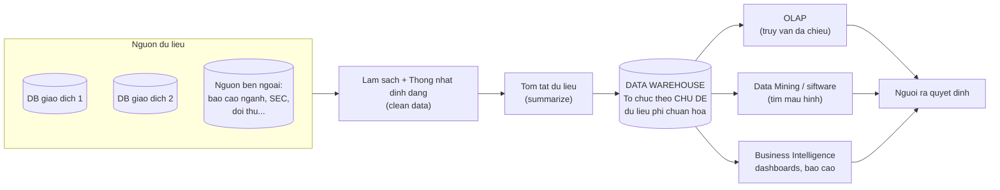

#### 9.1 Online Analytical Processing (OLAP)

Do **E. F. Codd** giới thiệu năm **1993** để trả lời các **câu hỏi phức tạp của người ra quyết định**: họ phải nhìn dữ liệu theo **nhiều cách khác nhau** → database phải **đa chiều (multidimensional)**. Nhiều người ví OLAP như **khối Rubik của dữ liệu** — xoay, lật để nhìn từ mọi phía. OLAP hợp thức hóa khái niệm data warehouse; OLAP bao gồm xử lý dữ liệu qua thao tác, tóm tắt và tính toán — tức nhiều hơn chỉ một data warehouse.

#### 9.2 Data Mining — Khai phá dữ liệu

**Data mining** nhận diện **các mẫu hình mà con người không thể phát hiện** (không thấy được, hoặc không nghĩ tới việc hỏi liệu mẫu đó có tồn tại). Các thuật toán khai phá tìm mẫu hình trong data warehouse. **4 loại mẫu hình:**

| Loại | Nghĩa | Ví dụ |
|---|---|---|
| **Associations (kết hợp)** | Mẫu xảy ra **cùng lúc** | Mua ngũ cốc thường mua kèm sữa |
| **Sequences (chuỗi)** | Mẫu hành động **theo thời gian** | Mua nhà năm nay → năm sau mua đồ gia dụng bền (tủ lạnh, máy giặt) |
| **Clustering (phân cụm)** | Mẫu hình thành trong **một nhóm người** | Khách cùng một zip code có xu hướng mua cùng loại xe |
| **Trends (xu hướng)** | Mẫu nhận thấy **qua một khoảng thời gian** | Người tiêu dùng chuyển từ hàng generic sang hàng hiệu cao cấp |

Data mining xuất phát từ nhu cầu **nhắm mục tiêu khách hàng chọn lọc hơn** (thời kỳ đầu: dùng zip code để đoán thu nhập — vd zip 90210 Beverly Hills). Giả định **hành vi quá khứ dự báo tốt cho mua sắm tương lai**, dữ liệu lớn được gom từ giao dịch thẻ tín dụng, mạng xã hội, email, phiếu bảo hành, đơn xin bằng lái... và các công ty còn **chia sẻ/bán dữ liệu**. Ví dụ: American Express gửi phiếu giảm giá cho cửa hàng tương tự nơi bạn từng mua; General Motors dùng MasterCard tích điểm rồi gửi thông tin xe mới đúng lúc khách có khả năng mua.

**Vấn đề của data mining:** (1) chi phí có thể quá cao (phát hiện ra sau khi đã tốn chi phí thiết lập khổng lồ); (2) phải **phối hợp** để các phòng ban không cùng lúc "tấn công" một khách hàng; (3) khách hàng có thể thấy **bị xâm phạm quyền riêng tư** và bực bội; (4) hồ sơ dựng từ dữ liệu có thể là **hình ảnh méo mó** về khách hàng. Analyst phải chịu trách nhiệm về **khía cạnh đạo đức**: thời gian lưu hồ sơ, tính bảo mật, biện pháp bảo vệ riêng tư, mục đích sử dụng các suy luận — nếu người tiêu dùng kháng cự việc bị "push", nỗ lực data mining sẽ phản tác dụng.

---

### 10. Business Intelligence (BI) — Trí tuệ kinh doanh

**BI** (nổi lên từ cuối thập niên 1980) là **trái tim của hệ hỗ trợ quyết định (DSS)**. BI gồm các tính năng **thu thập và lưu trữ dữ liệu**, dùng **các phương pháp quản trị tri thức (knowledge management) kết hợp với phân tích** → trở thành **đầu vào cho quá trình ra quyết định**. BI xoay quanh việc xử lý **khối lượng dữ liệu lớn**. Analyst có thể được yêu cầu tạo hệ thống hỗ trợ BI (data warehouse — dữ liệu của nó là đầu vào cho analytics), dashboard, hay spreadsheet truyền tải BI đến người dùng.

- **Big data:** khi tập dữ liệu **quá lớn hoặc quá phức tạp** để xử lý bằng công cụ truyền thống hoặc trong database/data warehouse truyền thống. Big data còn được xem là một **chiến lược thiết kế** giúp tổ chức đối phó với lượng dữ liệu ngày càng tăng từ vô số nguồn — một phần do con người tạo, nhưng nhiều hơn do **cảm biến** (thu phí đường bộ điện tử, vệ tinh thời tiết). Nhu cầu chuyên gia quản lý thông tin luôn tăng vì dữ liệu tăng nhanh hơn khả năng lưu trữ/xử lý/phân tích có ý nghĩa.
- **5 phương pháp phân tích BI nổi bật:** slice-and-dice drill-down, ad hoc queries, real-time analysis, forecasting, scenarios. Nhiều nhà cung cấp BI đang chuyển dịch vụ **lên cloud** (on-demand, giảm chi phí, khởi động nhanh).
- **Business analytics (BA):** dùng **big data + các công cụ phân tích định lượng** (thống kê, mô hình dự báo — predictive modeling) để trả lời câu hỏi quản trị về **xu hướng** và câu hỏi **what-if** trong các kịch bản chiến lược. Output của BA có thể làm đầu vào cho người ra quyết định **hoặc** cho hệ thống máy tính.
- **Hạn chế của BI:** xử lý dữ liệu **bán cấu trúc và phi cấu trúc** — phần lớn tài liệu của tổ chức không đưa vào phân tích BI được vì không khớp yêu cầu cấu trúc nghiêm ngặt của data warehouse → một phần lớn thông tin quan trọng **không được phân tích, không được dùng**. Một cách khai thác là **data analytics**.

---

### 11. Data Analytics — Phân tích dữ liệu

**Data analytics** dùng **thuật toán mạnh** để phân tích lượng lớn **dữ liệu có cấu trúc** trong database hoặc lượng khổng lồ **dữ liệu phi cấu trúc thời gian thực**, hỗ trợ ra **quyết định dựa trên dữ kiện (fact-based)**. Analytics vừa chỉ việc giải bài toán kinh doanh và quá trình ra quyết định, vừa chỉ các phương pháp phân tích giúp tổ chức **tạo giá trị** qua thu thập – phân tích – phân phối dữ liệu khối lượng lớn. Thuật ngữ rộng bao trùm cả hai là **BI**.

**8 khía cạnh vai trò của systems analyst trong data analytics:**

1. Bảo đảm **chất lượng dữ liệu**.
2. **Tạo điều kiện giao tiếp** giữa người dùng và chuyên gia data analytics.
3. **Đào tạo** người dùng/người ra quyết định cách dùng công cụ phân tích và cách diễn giải báo cáo.
4. Tạo báo cáo mà **người dùng tự sinh được** (user generated).
5. Làm việc với người dùng **thích để chuyên gia** tạo báo cáo cho họ.
6. Phát triển **nền tảng BI cộng tác** — cùng tạo báo cáo, cho phép chia sẻ insight.
7. Bảo đảm quá trình data analytics **có tác động mong muốn** lên doanh nghiệp.
8. Cung cấp **insight sâu** giúp người ra quyết định và data analyst hiểu được trải nghiệm cá nhân và tổ chức.

Nhiều hoạt động đặt analyst ở vị trí **đối tác cộng tác** với khách hàng. **Chất lượng dữ liệu** và tập trung vào **người dùng** là tối quan trọng. Có nhiều cân nhắc **đạo đức, riêng tư, bảo mật**: dữ liệu big data sinh ra từ mạng xã hội, blog của influencer, cloud công cộng, dữ liệu chính phủ... — người tạo dữ liệu **phần lớn không biết** dữ liệu của họ bị dùng cho analytics; developer có thể dùng **mashups** (kết hợp Google Maps + dữ liệu mạng xã hội) để dự báo hành vi. Các mục đích lớn hơn analyst nên biết: retrospection, social engagement/collaboration, cue extraction, plausibility, ongoing access (Namvar et al., 2016).

---

### 12. Data Lakes — Hồ dữ liệu

**Data lake** ra đời để **đáp lại các hạn chế của data warehouse**. Data lake trên cloud giải phóng developer/user khỏi việc phải cam kết với **dữ liệu có cấu trúc chặt** theo định dạng định trước (thường độc quyền). Data lake dùng **kiến trúc phẳng (flat architecture)** và **object store với metatag + định danh duy nhất (unique identifier)** giúp truy cập/định vị dữ liệu xuyên vùng dễ dàng. Data lake hỗ trợ **machine learning**.

Ẩn dụ "hồ": hồ chứa cá, rùa, sò... lẫn đá, cát, bùn; hồ có thể rất sâu và che giấu những vật thể bí ẩn — nhưng data lake **có thể truy vấn được**, nội dung không cần mãi bí ẩn.

**5 thuộc tính phân biệt data lake (với data warehouse):**

1. Là **kho chứa dữ liệu thô**, dữ liệu chuẩn hóa lẫn chưa chuẩn hóa (từ relational DB, dữ liệu phi quan hệ từ IoT, thiết bị di động, đủ loại app).
2. Dữ liệu đưa vào **không cần cấu trúc và định nghĩa trước** khi thu thập — không phải đoán trước câu hỏi tương lai.
3. **Truy vấn được** (đơn giản hoặc phức tạp, với trợ giúp của BI, data analytics, text analytics).
4. Nhằm khai thác **mảng dữ liệu khổng lồ mà tổ chức thu thập** (đôi khi âm thầm) nhưng chưa sẵn sàng cho ra quyết định vì phi cấu trúc và tản mát.
5. Cung cấp **insight về hành vi khách hàng** không có được từ truy vấn có cấu trúc trên relational database.

**So sánh (Figure 13.28):** DATA WAREHOUSE — dữ liệu **tinh chế (refined)**, kích thước **vừa**, **quan hệ**; phục vụ Data Mining & OLAP. DATA LAKE — dữ liệu **thô (raw)**, kích thước **lớn**, **phi cấu trúc**; phục vụ Machine Learning, Data Analytics, BI. **Chiến lược: hầu hết tổ chức nên phát triển CẢ HAI** để tận dụng dữ liệu trong lẫn ngoài. (Google đã công bố **BigLake** — engine lưu trữ data lake giúp phân tích dữ liệu trong data lake lẫn data warehouse dễ hơn.)

---

### 13. Blockchains — Chuỗi khối

**Blockchain network** = một **cấu trúc dữ liệu xây trên nền Internet** cho phép chia sẻ và tạo một **sổ cái số (digital ledger)** về dữ liệu, chia sẻ được với người khác trên mạng **công khai hoặc riêng tư**. Hữu ích khi doanh nghiệp/cá nhân muốn có **bản ghi điện tử kiểm chứng được** để theo dõi bất kỳ loại tài sản kinh doanh nào: tiền số, vật liệu cấu thành sản phẩm, tài sản hữu hình/vô hình/tài sản số. **Không cần trung gian** (như ngân hàng thương mại đối với tiền số) để giao dịch.

- Blockchain nổi tiếng nhờ **bitcoin**, nhưng có nhiều ứng dụng khác: xác minh thực phẩm "organic" đúng chuẩn ở **mọi bước** trồng–thu hoạch–đóng gói; truy **xuất xứ (provenance)** tác phẩm nghệ thuật; **IBM Blockchain** cho các ngân hàng thành viên chia sẻ dữ liệu tham chiếu, theo dõi nguồn gốc và di chuyển của linh kiện ô tô qua chuỗi cung ứng phức tạp.
- Đặc biệt hữu ích trong **chuỗi cung ứng thực phẩm dễ hỏng**: theo dõi con bò nào góp sữa vào thùng sữa số nào, nhiệt độ bồn chứa, xe tải và tài xế nào chở, sữa nằm trên bến dỡ bao lâu, khi nào lên tủ mát... Các **sai lệch lớn** (thời gian giao, nhiệt độ) được ghi vào dữ liệu giao dịch → giúp **chỉ ra khuyết tật** sản phẩm và **tăng tốc thu hồi (recall)**.
- **Blockchain là bản ghi giao dịch mở, bất biến (immutable)** — sinh ra để cải thiện **bảo mật, giảm rủi ro, tăng độ tin cậy và hiệu quả** khi giao dịch. Có thể coi blockchain là **database phân tán** có kiểm soát thông tin, vừa lưu vừa chia sẻ thông tin.
- Doanh nghiệp dùng **permissioned blockchain** (blockchain có phân quyền): riêng tư tốt hơn, kiểm toán (auditability) nâng cao, vận hành hiệu quả hơn — giao dịch đáng tin, chi phí thấp (ít trùng lặp công sức), tốc độ gần với giao dịch thời gian thực thay vì chờ bên thẩm quyền ngoài phê duyệt.

**4 đặc tính then chốt của blockchain network:**

1. **Consensus (đồng thuận):** mọi bên tham gia giao dịch phải đồng ý giao dịch là hợp lệ.
2. **Provenance (xuất xứ):** mọi bên biết tài sản đến từ đâu và nó đã thay đổi thế nào theo thời gian.
3. **Immutability (bất biến):** giao dịch đã ghi vào sổ cái thì không bên nào sửa/xóa được — sửa lỗi cần một **giao dịch riêng**, và cả hai giao dịch đều hiển thị với thành viên mạng.
4. **Finality (chung cuộc):** chỉ có **một nơi duy nhất** để kiểm tra quyền sở hữu tài sản hoặc việc một giao dịch đã hoàn tất hay chưa.

**Rào cản tổ chức lớn nhất: lòng tin (trust)** — chấp nhận rằng dữ liệu chuỗi cung ứng không nằm trong kho trung tâm mà **được chia sẻ** cho nhiều bên liên quan; và tin rằng người tham gia **nhập giao dịch chính xác, trung thực**. Blockchain cần các **designer** bắc cầu giữa độ phức tạp kỹ thuật và tính khả dụng cho khách hàng không rành công nghệ. (Cộng đồng: **Hyperledger** của Linux Foundation với Hyperledger Fabric; startup đào tạo như blockgeeks.com.)

---

### 14. Web 3.0

Web 2.0 nổi bật ở **tính tương tác**; **Web 3.0 xây trên blockchain** và xoay quanh **phi tập trung hóa dữ liệu và quyền sở hữu dữ liệu**: **người dùng sẽ SỞ HỮU dữ liệu của mình** và có thể **kiếm tiền từ (monetize)** từng phần dữ liệu thay vì trao hết cho công ty đổi lấy dịch vụ.

Ví dụ đặt hàng tạp hóa online: dịch vụ giao hàng tích lũy dữ liệu bạn mua gì, chi bao nhiêu, cách thanh toán ưa thích, có trả đúng hạn hay dùng BNPL (buy now, pay later), ngày giao ưa thích... và có thể bán các phần hồ sơ của bạn cho vendor, tiệm bánh, dịch vụ giao hàng. Với Web 3.0: bạn **đồng ý bán** dữ liệu, các giao dịch **tự động thực thi 24/7** trên blockchain (thường bằng cryptocurrency) mỗi khi có người mua đúng loại bạn phê duyệt — bạn không cần có mặt, mỗi lần dữ liệu được truy cập bạn **được trả tiền**. Bạn cũng có thể **tặng** một phần dữ liệu cho tổ chức phi lợi nhuận (bệnh viện nghiên cứu) thay vì monetize. Điểm cốt lõi: người dùng Web 3.0 **kiểm soát ai nhận dữ liệu của mình** và có monetize hay không. Web 3.0 là về **"tokenization of the data"** và xây dựng **nền kinh tế dữ liệu**.

**Vai trò của systems analyst trong Web 3.0:** nhiều người dùng không muốn/không đủ khả năng tự lập tài khoản và quản lý dữ liệu → analyst làm **tư vấn (consultant)** cho tổ chức và người dùng, **tạo điều kiện cho hợp đồng và giao dịch** thiết lập & duy trì các giao dịch phi tập trung, tự động, an toàn trên blockchain; và làm **người phiên dịch (translator)** giúp người dùng hiểu hàm ý của Web 3.0 với công việc và đời sống.

---

## 🔑 Bảng thuật ngữ (Keywords and Phrases)

| Thuật ngữ (EN) | Tiếng Việt |
|---|---|
| attribute | thuộc tính (đặc trưng của thực thể) |
| big data | dữ liệu lớn (quá lớn/phức tạp cho công cụ truyền thống) |
| blockchain | chuỗi khối (sổ cái số mở, bất biến) |
| bubble diagram (data model diagram) | sơ đồ bong bóng / sơ đồ mô hình dữ liệu |
| business analytics (BA) | phân tích kinh doanh (big data + công cụ định lượng) |
| business intelligence (BI) | trí tuệ kinh doanh |
| clean data | dữ liệu sạch (đã định nghĩa thống nhất trong data warehouse) |
| concatenated key (composite key) | khóa ghép (khóa kết hợp) |
| conventional file | file truyền thống |
| CRUD (create, read, update, delete) | tạo – đọc – cập nhật – xóa |
| cyberattack | tấn công mạng |
| data analytics | phân tích dữ liệu |
| data element | phần tử dữ liệu (đơn vị nhỏ nhất trong data dictionary) |
| data item | mục dữ liệu (đơn vị nhỏ nhất trong file/database) |
| data lakes | hồ dữ liệu |
| data mining | khai phá dữ liệu |
| data model diagram | sơ đồ mô hình dữ liệu |
| data storage | lưu trữ dữ liệu |
| data warehouse | kho dữ liệu |
| database | cơ sở dữ liệu |
| database administrator | quản trị viên cơ sở dữ liệu |
| database management system (DBMS) | hệ quản trị cơ sở dữ liệu |
| deletion anomaly | dị thường xóa |
| denormalization | phi chuẩn hóa |
| domain integrity | toàn vẹn miền (quy tắc kiểm tra hợp lệ dữ liệu) |
| entity | thực thể |
| entity integrity constraint | ràng buộc toàn vẹn thực thể (khóa chính không null) |
| entity-relationship (E-R) diagram | sơ đồ thực thể – quan hệ |
| entity subtype | thực thể con (quan hệ 1:1 đặc biệt, tránh trường null) |
| first normal form (1NF) | dạng chuẩn 1 (đã loại bỏ nhóm lặp) |
| hierarchical data structure | cấu trúc dữ liệu phân cấp |
| logical view | góc nhìn logic |
| master file | file chủ |
| metadata | siêu dữ liệu (dữ liệu về dữ liệu) |
| network data structure | cấu trúc dữ liệu mạng |
| normalization | chuẩn hóa |
| object identifier (OID) | định danh đối tượng (khóa duy nhất toàn database) |
| online analytical processing (OLAP) | xử lý phân tích trực tuyến |
| partial dependencies | phụ thuộc một phần (vào một phần của khóa ghép) |
| physical view | góc nhìn vật lý |
| primary key | khóa chính |
| record | bản ghi |
| referential integrity | toàn vẹn tham chiếu (FK con phải khớp record cha) |
| relational data structure | cấu trúc dữ liệu quan hệ |
| relationship | quan hệ (liên kết giữa các thực thể) |
| repeating group | nhóm lặp |
| report file | file báo cáo |
| retrieval | truy xuất |
| risk assessment | đánh giá rủi ro |
| second normal form (2NF) | dạng chuẩn 2 (đã loại bỏ partial dependency) |
| secondary key | khóa phụ (không nhận diện duy nhất) |
| special characters | ký tự đặc biệt |
| table file | file bảng (dữ liệu tra cứu, chỉ đọc) |
| third normal form (3NF) | dạng chuẩn 3 (đã loại bỏ transitive dependency) |
| transaction file | file giao dịch |
| transitive dependency | phụ thuộc bắc cầu (không khóa phụ thuộc không khóa) |
| unnormalized relation | quan hệ chưa chuẩn hóa |
| update anomaly | dị thường cập nhật |
| Web 3.0 | Web 3.0 (web phi tập trung, sở hữu dữ liệu) |
| work file | file làm việc (tạm thời) |

---

## ❓ Trả lời Review Questions

**1. Ưu điểm của việc tổ chức lưu trữ dữ liệu bằng các file riêng lẻ?**
File riêng lẻ được thiết kế **cho một ứng dụng cụ thể** nên: xử lý nhanh và hiệu quả cho đúng ứng dụng đó; đơn giản, dễ thiết kế và xây dựng; dữ liệu được sắp xếp đúng theo cách phòng ban muốn (như Shakina trong Consulting Opportunity 13.1 nói: "tôi xuất báo cáo nhanh vì file được lập đúng như chúng tôi muốn"); ít cần nhân sự chuyên môn (DBA) và chi phí thiết lập ban đầu thấp hơn so với xây một database dùng chung.

**2. Ưu điểm của cách tiếp cận database?**
(1) Dữ liệu chỉ lưu **một lần** → dễ đạt toàn vẹn dữ liệu (data integrity), thay đổi dữ liệu dễ và tin cậy hơn; (2) dữ liệu có **xác suất sẵn có cao hơn** vì database được thiết kế đón trước nhu cầu; (3) **linh hoạt hơn** — có thể tiến hóa khi ứng dụng và nhu cầu người dùng thay đổi; (4) người dùng có **góc nhìn (view) riêng** về dữ liệu mà không cần quan tâm cấu trúc hay lưu trữ vật lý.

**3. Các thước đo hiệu quả (effectiveness objectives) của thiết kế database?**
(1) Dữ liệu chia sẻ được giữa nhiều người dùng cho nhiều ứng dụng; (2) duy trì dữ liệu chính xác và nhất quán; (3) mọi dữ liệu cần cho ứng dụng hiện tại và tương lai luôn sẵn sàng; (4) database có thể tiến hóa khi nhu cầu người dùng tăng; (5) người dùng xây dựng được view cá nhân mà không quan tâm cách lưu trữ vật lý.

**4. Ba câu hỏi analyst có thể đặt cho DBA và người dùng về bảo mật database?**
(1) **Khả năng (likelihood)** xảy ra một cuộc tấn công là bao nhiêu? (2) **Giá trị** của dữ liệu đang được bảo vệ là gì? (3) **Hệ lụy** của một vụ vi phạm bảo mật đối với khách hàng của công ty — và sau đó, đối với hình ảnh công ty — là gì?

**5. Ví dụ về entity và attribute?**
- Entity **SALESPERSON** (người bán): attributes = Salesperson Number, Salesperson Name, Company Name, Address, Sales.
- Entity **PACKAGE** (kiện hàng): Width, Height, Length, Weight, Mailing Address, Return Address.
- Entity **ORDER** (đơn hàng): Product(s), Description(s), Quantity Ordered, Last Name of Customer, First Initial, Street Address, City, State, Zip Code, Credit Card Number, Date Order Was Placed, Amount, Status.
- Entity **PATIENT** (bệnh nhân): họ tên, địa chỉ, thành phố, bang, ngày khám gần nhất.

**6. Khác biệt giữa primary key và object identifier (OID)?**
**Primary key** nhận diện duy nhất một record **trong một bảng** (ví dụ ORDER-# trong bảng ORDER). **OID** là khóa duy nhất cho mỗi record **trong toàn bộ database, không chỉ trong một bảng** — biết OID sẽ lấy được đúng một record bất kể nó nằm ở bảng nào (thường dùng làm "confirmation number" cho đơn hàng, xác nhận thanh toán).

**7. Metadata là gì? Mục đích?**
**Metadata là dữ liệu về dữ liệu** trong file/database: mô tả **tên và độ dài** của từng data item, **độ dài và cấu tạo** của từng record (ví dụ `N 7.2` = số, 7 chữ số với 2 số thập phân; A = alphanumeric; D = date). Mục đích: giúp hiểu **hình thức và cấu trúc** của dữ liệu, có thể chứa **ràng buộc về giá trị** của data item (như chỉ nhận số) — nền tảng cho việc kiểm tra hợp lệ và quản lý dữ liệu.

**8. Các loại file truyền thống thường dùng? Loại nào là file tạm?**
Master file, table file, transaction file, work file, report file. **File tạm (temporary):** transaction file, work file, report file. Master file và table file lưu dữ liệu **lâu dài**.

**9. Ba kiểu tổ chức database chính?**
**Hierarchical (phân cấp), network (mạng), relational (quan hệ).** Hai kiểu đầu gặp ở hệ thống legacy; analyst ngày nay thường thiết kế relational database.

**10. Định nghĩa normalization?**
Normalization là **sự biến đổi các user view phức tạp và data store thành một tập các cấu trúc dữ liệu nhỏ hơn, ổn định hơn** — đơn giản hơn, ổn định hơn và dễ bảo trì hơn các cấu trúc dữ liệu khác.

**11. Cái gì bị loại bỏ khi chuyển quan hệ sang 1NF?**
**Repeating groups (nhóm lặp)** bị loại bỏ (đồng thời xác định khóa chính); quan hệ được tách thành hai hay nhiều quan hệ.

**12. Cái gì bị loại bỏ khi chuyển từ 1NF sang 2NF?**
**Partial dependencies (phụ thuộc một phần)** — các thuộc tính không khóa chỉ phụ thuộc vào **một phần** của khóa ghép được gỡ ra và đặt vào quan hệ khác, để mọi thuộc tính phụ thuộc hàm **đầy đủ** vào khóa chính.

**13. Cái gì bị loại bỏ khi chuyển từ 2NF sang 3NF?**
**Transitive dependencies (phụ thuộc bắc cầu)** — trường hợp thuộc tính không khóa phụ thuộc vào thuộc tính **không khóa** khác.

**14. Ba ràng buộc toàn vẹn? Mô tả mỗi loại một câu.**
(1) **Entity integrity:** khóa chính không được null (khóa ghép thì không thành phần nào được null). (2) **Referential integrity:** mọi foreign key trong bảng con (đầu "nhiều") phải có record khớp trong bảng cha (đầu "một") — không thêm con mồ côi, không đổi/xóa cha còn con. (3) **Domain integrity:** dữ liệu phải hợp lệ theo các quy tắc kiểm tra (check constraint ở mức bảng, rule ở mức database).

**15. Bốn anomaly khi tạo bảng database?**
(1) **Data redundancy:** cùng dữ liệu lưu nhiều chỗ (ngoài khóa chính làm FK) — giải quyết bằng 3NF. (2) **Insert anomaly:** không chèn được record vì chưa biết đủ toàn bộ khóa chính (vi phạm entity integrity) — tránh bằng sequence number. (3) **Deletion anomaly:** xóa một record làm mất dữ liệu liên quan khác (xóa item duy nhất tham chiếu tới một vendor → mất vendor). (4) **Update anomaly:** sửa một giá trị gây dữ liệu không nhất quán hoặc phải sửa nhiều record (đổi tên đường của cả thành phố).

**16. Tám bước truy xuất, tiền xử lý và trình bày dữ liệu?**
(1) Chọn relation từ database; (2) join các relation; (3) project (chọn cột); (4) select (chọn hàng); (5) suy diễn thuộc tính mới; (6) index/sort các hàng; (7) tính tổng và chỉ số hiệu năng; (8) trình bày dữ liệu. Bước 1 và 8 bắt buộc; sáu bước giữa tùy chọn.

**17. Join làm gì? Projection là gì? Selection là gì?**
**Join** nối hai (hay nhiều) relation lại với nhau (kết hợp dữ liệu từ các bảng dựa trên khóa chung). **Projection** là chọn ra một tập **cột** (thuộc tính) từ relation. **Selection** là chọn ra một tập **hàng** (record) thỏa điều kiện từ relation.

**18. Định nghĩa denormalization?**
Denormalization là **quá trình biến đổi mô hình dữ liệu logic thành mô hình vật lý hiệu quả cho các tác vụ được cần dùng nhiều nhất** — như sinh báo cáo, truy vấn hiệu quả, OLAP, data mining, knowledge data discovery.

**19. Khác biệt giữa database truyền thống và data warehouse?**
Data warehouse: (1) tổ chức dữ liệu **theo chủ đề** thay vì theo giao dịch; (2) lưu dữ liệu **tóm tắt** thay vì thô/chi tiết; (3) bao phủ **khung thời gian dài hơn**; (4) tối ưu cho **truy vấn nhanh** (DB truyền thống được chuẩn hóa cho lưu trữ hiệu quả); (5) tối ưu cho **truy vấn phức tạp OLAP**; (6) truy cập dễ bằng phần mềm data mining (**siftware**); (7) gồm **nhiều database** với dữ liệu được định nghĩa thống nhất (**clean data**); (8) gồm cả **dữ liệu nguồn ngoài** lẫn dữ liệu nội bộ.

**20. Data mining là gì?**
Data mining là việc dùng các **thuật toán tìm kiếm mẫu hình trong data warehouse** — nhận diện các mẫu (associations, sequences, clustering, trends) mà con người **không thể phát hiện** hoặc không nghĩ tới việc hỏi. Nó xuất phát từ mong muốn dùng database để **nhắm mục tiêu khách hàng chọn lọc hơn**, dựa trên giả định hành vi quá khứ dự báo tốt cho mua sắm tương lai.

**21. Business intelligence gồm những thành phần nào?**
BI gồm các tính năng **thu thập và lưu trữ dữ liệu** và dùng **các phương pháp quản trị tri thức (knowledge management) kết hợp với phân tích**; kết quả trở thành **đầu vào cho quá trình ra quyết định** của người ra quyết định. BI là trái tim của hệ hỗ trợ quyết định (DSS) và bao gồm truy vấn, báo cáo OLAP, và gửi các loại thông báo tới người dùng.

**22. Big data là gì?**
Khi các tập dữ liệu trở nên **quá lớn hoặc quá phức tạp** để xử lý bằng công cụ truyền thống hoặc trong database/data warehouse truyền thống, chúng được gọi là **big data**. Big data cũng được xem là một **chiến lược thiết kế** cho phép tổ chức đối phó với lượng dữ liệu ngày càng tăng từ vô số nguồn — một phần do con người tạo, phần nhiều hơn do cảm biến (thu phí đường điện tử, vệ tinh thời tiết).

**23. Định nghĩa business analytics?**
BA là thuật ngữ chỉ việc **dùng big data cùng các công cụ phân tích định lượng** (thống kê, mô hình dự báo) để trả lời các câu hỏi quản trị về **xu hướng** và các câu hỏi **what-if** phân tích các phương án hành động trong kịch bản chiến lược. Output của BA có thể là đầu vào cho người ra quyết định hoặc cho hệ thống máy tính.

**24. Năm thuộc tính phân biệt data lake với data warehouse?**
(1) Data lake là kho chứa **dữ liệu thô**, dữ liệu chuẩn hóa lẫn chưa chuẩn hóa; (2) dữ liệu **không cần cấu trúc và định nghĩa trước**; (3) data lake **truy vấn được**; (4) nhằm **khai thác mảng dữ liệu khổng lồ** mà tổ chức thu thập; (5) cung cấp **insight về hành vi khách hàng** không có được từ database quan hệ có cấu trúc.

**25. Dữ liệu trong data lake khác dữ liệu trong data warehouse thế nào?**
Data warehouse chứa dữ liệu **tinh chế (refined)**, kích thước **vừa**, có cấu trúc **quan hệ**, phải được định dạng/chuẩn hóa và định nghĩa trước theo chủ đề. Data lake chứa dữ liệu **thô (raw), phi cấu trúc hoặc bán cấu trúc**, kích thước **lớn**, kéo từ vô số nguồn (relational/nonrelational DB, IoT, app) — có thể là dữ liệu thô chưa định dạng, dữ liệu đã chuẩn hóa, hoặc bất kỳ mức nào ở giữa; không cần thiết lập file cấu trúc định trước.

**26. Blockchain network là gì? Ví dụ kinh doanh?**
Là **cấu trúc dữ liệu xây trên nền Internet** cho phép chia sẻ và tạo **sổ cái số** về dữ liệu, chia sẻ trên mạng công khai hoặc riêng tư; là **bản ghi giao dịch mở, bất biến**; không cần trung gian. Ví dụ: **IBM Blockchain** cho các ngân hàng thành viên mạng ngân hàng toàn cầu chia sẻ dữ liệu tham chiếu và theo dõi nguồn gốc/di chuyển linh kiện ô tô qua chuỗi cung ứng; theo dõi chuỗi cung ứng sữa (bò nào, bồn nào, nhiệt độ, xe tải, thời gian trên bến dỡ) để phát hiện khuyết tật và thu hồi nhanh; xác minh thực phẩm organic; truy xuất xứ tranh nghệ thuật.

**27. Bốn đặc tính then chốt của blockchain network?**
(1) **Consensus** — mọi bên phải đồng ý giao dịch hợp lệ; (2) **Provenance** — mọi bên biết tài sản từ đâu tới và thay đổi thế nào theo thời gian; (3) **Immutability** — giao dịch đã ghi thì không sửa được (sửa lỗi cần giao dịch riêng, cả hai đều hiển thị); (4) **Finality** — chỉ một nơi duy nhất để kiểm tra quyền sở hữu/tình trạng hoàn tất của giao dịch.

**28. Web 3.0 sẽ khác Web 2.0 thế nào?**
Web 2.0 nổi bật ở **tính tương tác** (xây trên nền web tập trung ban đầu cho tìm kiếm). Web 3.0 **xây trên blockchain**, xoay quanh **phi tập trung hóa dữ liệu và quyền sở hữu dữ liệu**: người dùng **sở hữu dữ liệu của mình**, có thể **monetize** từng phần (giao dịch tự động 24/7 bằng cryptocurrency) hoặc **tặng** cho mục đích họ tin tưởng, thay vì trao hết cho công ty để đổi dịch vụ. Web 3.0 là "tokenization of the data" và xây dựng nền kinh tế dữ liệu.

**29. Vai trò của systems analyst trong phát triển Web 3.0?**
Nhiều người dùng không muốn hoặc không đủ khả năng tự lập tài khoản và quản lý dữ liệu, nên analyst có thể: (1) làm **tư vấn** cho tổ chức và người dùng — tạo điều kiện cho các hợp đồng và giao dịch thiết lập & duy trì các giao dịch **phi tập trung, tự động, an toàn** trên blockchain; (2) làm **người phiên dịch** giúp người dùng hiểu hàm ý của Web 3.0 đối với công việc và đời sống cá nhân.

---

## 🧩 Giải Problems

### Problem 1 — File người thuê nhà (renters)

**Đề:** Cho file gồm 7 record: Record Number, Last Name, Apartment Number, Rent, Lease Expires. Minh họa: (a) projection, (b) selection, (c) hai kiểu sorting, (d) tính tổng.

Dữ liệu gốc:

| Record # | Last Name | Apartment # | Rent | Lease Expires |
|---|---|---|---|---|
| 41 | Warkentin | 102 | 550 | 4/30 |
| 42 | Buffington | 204 | 600 | 4/30 |
| 43 | Schuldt | 103 | 550 | 4/30 |
| 44 | Tang | 209 | 600 | 5/31 |
| 45 | Cho | 203 | 550 | 5/31 |
| 46 | Yoo | 203 | 550 | 6/30 |
| 47 | Pyle | 101 | 500 | 6/30 |

**a. Projection — chọn CỘT.** Ví dụ: chiếu ra hai cột Last Name và Rent (bỏ các cột còn lại):

| Last Name | Rent |
|---|---|
| Warkentin | 550 |
| Buffington | 600 |
| Schuldt | 550 |
| Tang | 600 |
| Cho | 550 |
| Yoo | 550 |
| Pyle | 500 |

**b. Selection — chọn HÀNG theo điều kiện.** Ví dụ: chọn các record có `Lease Expires = 4/30`:

| Record # | Last Name | Apartment # | Rent | Lease Expires |
|---|---|---|---|---|
| 41 | Warkentin | 102 | 550 | 4/30 |
| 42 | Buffington | 204 | 600 | 4/30 |
| 43 | Schuldt | 103 | 550 | 4/30 |

**c. Hai ví dụ sắp xếp hàng:**
- *Sort theo Last Name (A→Z):* Buffington (42), Cho (45), Pyle (47), Schuldt (43), Tang (44), Warkentin (41), Yoo (46).
- *Sort theo Rent giảm dần:* 600 (42, 44) → 550 (41, 43, 45, 46) → 500 (47). (Hoặc sort theo Apartment Number tăng dần: 101, 102, 103, 203, 203, 204, 209.)

**d. Tính tổng:** Tổng tiền thuê hàng tháng = 550 + 600 + 550 + 600 + 550 + 550 + 500 = **3.900**. (Có thể tính thêm: tiền thuê trung bình = 3.900 / 7 ≈ 557,14; số căn hộ hết hạn hợp đồng 4/30 = 3.)

---

### Problem 2 — Data model diagram cho phiếu điểm USNJ

**Đề:** Phiếu điểm (grade report) của 2 sinh viên: phần đầu có Name, Major, Student number, Status; phần thân lặp lại từng dòng: Course Number, Course Title, Professor, Professor's Department, Grade. Vẽ **data model diagram (bubble diagram)** với các liên kết.

**Phân tích liên kết** (mũi tên đơn = "tới một", mũi tên đôi = "tới nhiều"):
- STUDENT-NUMBER ↔ STUDENT-NAME: 1:1 (mỗi mã SV có một tên).
- STUDENT-NUMBER → MAJOR, STATUS: mỗi SV có một major, một status (một major có nhiều SV → chiều ngược lại là "nhiều").
- STUDENT-NUMBER ⇒ COURSE-NUMBER: một SV học **nhiều** môn; một môn có **nhiều** SV (M:N).
- COURSE-NUMBER → COURSE-TITLE: 1:1; COURSE-NUMBER → PROFESSOR: mỗi môn (trong dữ liệu) có một giảng viên; một giảng viên dạy nhiều môn.
- PROFESSOR → PROFESSOR-DEPARTMENT: mỗi giảng viên thuộc một khoa; một khoa có nhiều giảng viên.
- GRADE phụ thuộc **cả** STUDENT-NUMBER **và** COURSE-NUMBER (khóa ghép).

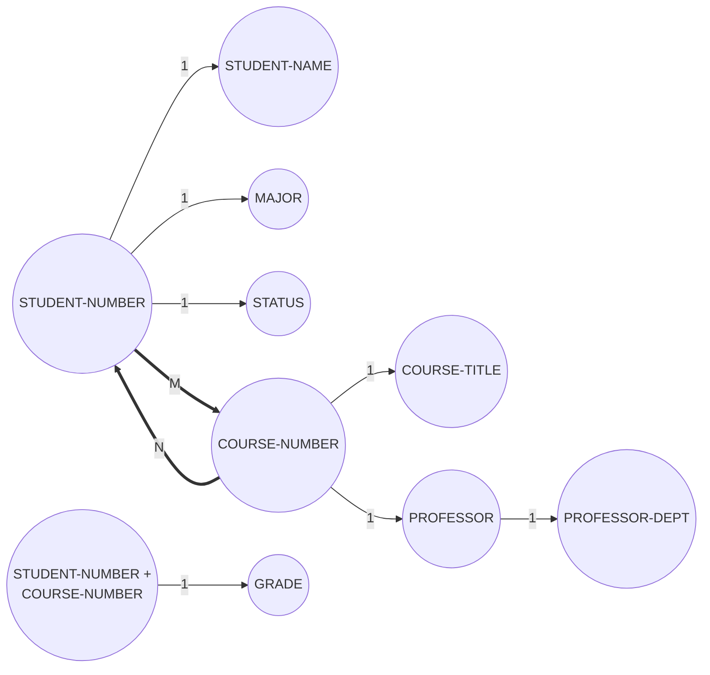

*(Mũi tên nét đậm `==>` biểu diễn "tới nhiều"; GRADE chỉ tra được khi biết cả hai khóa.)*

---

### Problem 3 — Chuẩn hóa phiếu điểm về 3NF (từng bước)

**Quan hệ chưa chuẩn hóa** (nhóm lặp trong ngoặc trong):

```text
GRADE-REPORT (STUDENT-NUMBER, STUDENT-NAME, MAJOR, STATUS,
              (COURSE-NUMBER, COURSE-TITLE, PROFESSOR,
               PROFESSOR-DEPARTMENT, GRADE))
```

**➤ Bước 1 — 1NF: loại bỏ nhóm lặp.** Tách thành 2 quan hệ; quan hệ chứa nhóm lặp lấy khóa ghép (STUDENT-NUMBER + COURSE-NUMBER):

```text
STUDENT (STUDENT-NUMBER, STUDENT-NAME, MAJOR, STATUS)
STUDENT-COURSE (STUDENT-NUMBER, COURSE-NUMBER, COURSE-TITLE,
                PROFESSOR, PROFESSOR-DEPARTMENT, GRADE)
```

| STUDENT | | | |
|---|---|---|---|
| **053-6929-24** | I. M. Smarte | MIS | Senior |
| **472-6124-59** | E. Z. Grayed | MIS | Senior |

| STUDENT-COURSE (1NF) | | | | | |
|---|---|---|---|---|---|
| **053-6929-24** | **MIS 403** | Systems Analysis | Abdelhamid, M. | MIS | A |
| **053-6929-24** | **MIS 411** | Conceptual Foundations | Umar, G. | MIS | A |
| **053-6929-24** | **MIS 420** | Human Factors in IS | Umar, G. | MIS | B |
| **053-6929-24** | **CIS 412** | Database Design | Li, I. | CIS | A |
| **053-6929-24** | **DESC 353** | Management Models | Kim, J. | MIS | A |
| **472-6124-59** | **MIS 403** | Systems Analysis | Abdelhamid, M. | MIS | B |
| **472-6124-59** | **MIS 411** | Conceptual Foundations | Umar, G. | MIS | A |

**Vấn đề:** COURSE-TITLE, PROFESSOR, PROFESSOR-DEPARTMENT chỉ phụ thuộc **COURSE-NUMBER** (một phần khóa ghép) → **partial dependency** (thấy rõ: "Systems Analysis / Abdelhamid, M. / MIS" bị lặp cho cả hai sinh viên). Chỉ GRADE phụ thuộc **đầy đủ** cả hai thành phần khóa.

**➤ Bước 2 — 2NF: loại bỏ partial dependency.**

```text
GRADE (STUDENT-NUMBER, COURSE-NUMBER, GRADE)
COURSE (COURSE-NUMBER, COURSE-TITLE, PROFESSOR, PROFESSOR-DEPARTMENT)
```

| GRADE | | |
|---|---|---|
| **053-6929-24** | **MIS 403** | A |
| **053-6929-24** | **MIS 411** | A |
| **053-6929-24** | **MIS 420** | B |
| **053-6929-24** | **CIS 412** | A |
| **053-6929-24** | **DESC 353** | A |
| **472-6124-59** | **MIS 403** | B |
| **472-6124-59** | **MIS 411** | A |

| COURSE (2NF) | | | |
|---|---|---|---|
| **MIS 403** | Systems Analysis | Abdelhamid, M. | MIS |
| **MIS 411** | Conceptual Foundations | Umar, G. | MIS |
| **MIS 420** | Human Factors in IS | Umar, G. | MIS |
| **CIS 412** | Database Design | Li, I. | CIS |
| **DESC 353** | Management Models | Kim, J. | MIS |

**Vấn đề còn lại:** trong COURSE, PROFESSOR-DEPARTMENT phụ thuộc vào **PROFESSOR** (thuộc tính không khóa) → **transitive dependency** ("Umar, G. / MIS" lặp lại ở hai dòng).

**➤ Bước 3 — 3NF: loại bỏ transitive dependency.**

```text
COURSE (COURSE-NUMBER, COURSE-TITLE, PROFESSOR)   ← PROFESSOR là foreign key
PROFESSOR (PROFESSOR, PROFESSOR-DEPARTMENT)
```

| COURSE (3NF) | | |
|---|---|---|
| **MIS 403** | Systems Analysis | Abdelhamid, M. |
| **MIS 411** | Conceptual Foundations | Umar, G. |
| **MIS 420** | Human Factors in IS | Umar, G. |
| **CIS 412** | Database Design | Li, I. |
| **DESC 353** | Management Models | Kim, J. |

| PROFESSOR (3NF) | |
|---|---|
| **Abdelhamid, M.** | MIS |
| **Umar, G.** | MIS |
| **Li, I.** | CIS |
| **Kim, J.** | MIS |

**Kết quả — 4 quan hệ 3NF:**

```text
STUDENT   (STUDENT-NUMBER, STUDENT-NAME, MAJOR, STATUS)
GRADE     (STUDENT-NUMBER, COURSE-NUMBER, GRADE)
COURSE    (COURSE-NUMBER, COURSE-TITLE, PROFESSOR)
PROFESSOR (PROFESSOR, PROFESSOR-DEPARTMENT)
```

*Giả định: mỗi mã môn học trong một học kỳ do một giảng viên phụ trách (đúng với dữ liệu đề bài); thực tế nên dùng mã giảng viên (PROFESSOR-ID) thay vì tên làm khóa.*

---

### Problem 4 — Vấn đề khi dùng Course Number làm primary key

**Đề:** Vấn đề gì có thể phát sinh khi dùng khóa chính là course number cho dữ liệu ở Problem 2? (Gợi ý: điều gì xảy ra nếu Department Name đổi?)

**Trả lời:** Course number (ví dụ "MIS 403") có **ý nghĩa gắn vào trong khóa**: tiền tố "MIS" chính là viết tắt tên khoa/bộ môn. Theo lý thuyết trong chương, **định nghĩa khóa chính dựa trên một attribute là rủi ro**: nếu attribute thay đổi thì khóa chính cũng phải thay đổi, tạo ra **sự phụ thuộc giữa khóa chính và dữ liệu**. Nếu khoa đổi tên (ví dụ MIS → BIS), mọi course number có tiền tố MIS phải đổi theo → phải cập nhật khóa chính ở bảng COURSE **và mọi foreign key** ở bảng GRADE (và bất kỳ bảng nào tham chiếu) — vi phạm referential integrity nếu sót, sinh **update anomaly** và nguy cơ **orphan record**; dữ liệu lịch sử (bảng điểm cũ) trở nên không nhất quán. Giải pháp: dùng khóa **không mang nghĩa** (sequence number/OID) làm khóa chính, còn course number chỉ là attribute.

---

### Problem 5 — ERD: sinh viên, môn thể thao, head coach

**Đề:** Nhiều sinh viên chơi nhiều môn thể thao. Một người — head coach — đảm nhận huấn luyện **tất cả** các môn này. Mỗi entity có một number và một name. Vẽ E-R diagram; liệt kê giả định.

**Giả định:**
1. STUDENT–SPORT là quan hệ **M:N** (một sinh viên chơi nhiều môn, một môn có nhiều sinh viên).
2. Có một entity COACH; quan hệ COACH–SPORT là **1:M** (một head coach huấn luyện nhiều/tất cả các môn; mỗi môn có đúng một coach). Lưu entity COACH riêng để hệ thống mở rộng được khi sau này có nhiều coach.
3. Mỗi entity có khóa là *-Number và thuộc tính *-Name.

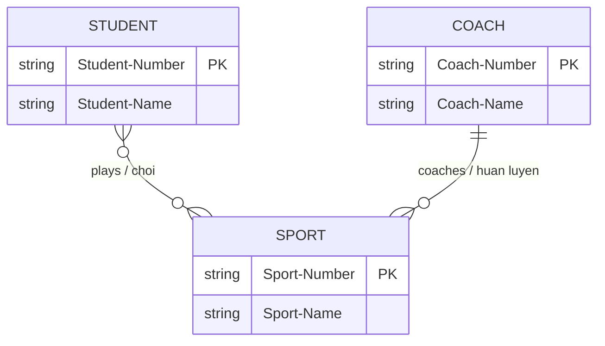

---

### Problem 6 — Bảng và khóa cho hệ thống Problem 5

Quan hệ M:N STUDENT–SPORT phải phân rã bằng **bảng quan hệ** STUDENT-SPORT → cần **4 bảng**:

| Bảng | Primary key | Foreign key | Secondary key |
|---|---|---|---|
| STUDENT (Student-Number, Student-Name) | Student-Number | — | Student-Name (tra theo tên) |
| SPORT (Sport-Number, Sport-Name, Coach-Number) | Sport-Number | Coach-Number → COACH | Sport-Name |
| COACH (Coach-Number, Coach-Name) | Coach-Number | — | Coach-Name |
| STUDENT-SPORT (Student-Number, Sport-Number) | khóa ghép (Student-Number + Sport-Number) — hoặc sequence number | Student-Number → STUDENT; Sport-Number → SPORT | index trên từng foreign key |

Bảng STUDENT-SPORT nên được **index trên cả hai foreign key** để tra hai chiều (các môn của một sinh viên / các sinh viên của một môn).

---

### Problem 7 — ERD tiệm bánh thương mại (commercial bakery)

**Đề:** Tiệm bánh làm nhiều sản phẩm (bánh mì, tráng miệng, bánh kem đặc biệt...). Nguyên liệu (bột, gia vị, sữa) mua từ vendor — có khi từ một vendor, có khi từ nhiều vendor. Có khách hàng thương mại (trường học, nhà hàng) đặt hàng thường xuyên. Mỗi baked good có một **specialist** giám sát khâu chuẩn bị và kiểm tra thành phẩm.

**Phân tích quan hệ:**
- PRODUCT (baked good) — INGREDIENT: **M:N** (một sản phẩm cần nhiều nguyên liệu; một nguyên liệu dùng cho nhiều sản phẩm).
- INGREDIENT — VENDOR: **M:N** ("có khi một, có khi nhiều vendor" → tổng quát là 0/1/nhiều).
- CUSTOMER — ORDER: **1:M**; ORDER — PRODUCT: **M:N** (một đơn gồm nhiều sản phẩm, một sản phẩm nằm trong nhiều đơn).
- SPECIALIST — PRODUCT: **1:M** (mỗi sản phẩm có một specialist; một specialist có thể phụ trách nhiều sản phẩm).

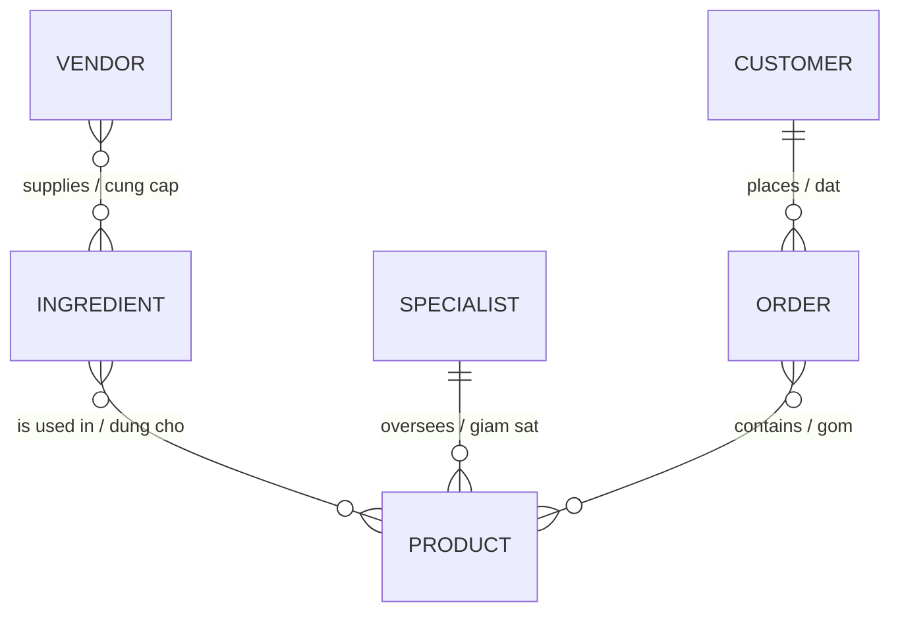

---

### Problem 8 — Bảng và khóa cho hệ thống tiệm bánh (Problem 7)

Mỗi quan hệ M:N cần một bảng quan hệ → tổng cộng **9 bảng**:

| Bảng | Primary key | Foreign keys |
|---|---|---|
| PRODUCT (Product-Number, Product-Name, Specialist-Number, ...) | Product-Number | Specialist-Number → SPECIALIST |
| INGREDIENT (Ingredient-Number, Ingredient-Name, ...) | Ingredient-Number | — |
| VENDOR (Vendor-Number, Vendor-Name, Address, ...) | Vendor-Number | — |
| CUSTOMER (Customer-Number, Customer-Name, Address, ...) | Customer-Number | — |
| SPECIALIST (Specialist-Number, Specialist-Name, ...) | Specialist-Number | — |
| ORDER (Order-Number, Customer-Number, Order-Date, ...) | Order-Number | Customer-Number → CUSTOMER |
| PRODUCT-INGREDIENT (Product-Number, Ingredient-Number, Quantity) | khóa ghép 2 FK | Product-Number; Ingredient-Number |
| INGREDIENT-VENDOR (Ingredient-Number, Vendor-Number, Price) | khóa ghép 2 FK | Ingredient-Number; Vendor-Number |
| ORDER-PRODUCT (Order-Number, Product-Number, Quantity-Ordered) | khóa ghép 2 FK | Order-Number; Product-Number |

Các bảng quan hệ index trên từng foreign key; khóa phụ hữu ích: Product-Name, Customer-Name, Vendor-Name.

---

### Problem 9 — ERD cho hệ thống đặt hàng ở Figure 13.24

*(Dựa trên hình trong sách: Figure 13.24 gồm ba bảng ORDER (ORDER-NUMBER, CUSTOMER-NUMBER, ORDER-DATE), ORDER-ITEM (ORDER-NUMBER, ITEM-NUMBER, QUANTITY-ORDERED) và ITEM MASTER (ITEM-NUMBER, ITEM-DESCRIPTION, ITEM-COST, ITEM-PRICE, QUANTITY-ON-HAND); ORDER-ITEM là bảng liên kết.)*

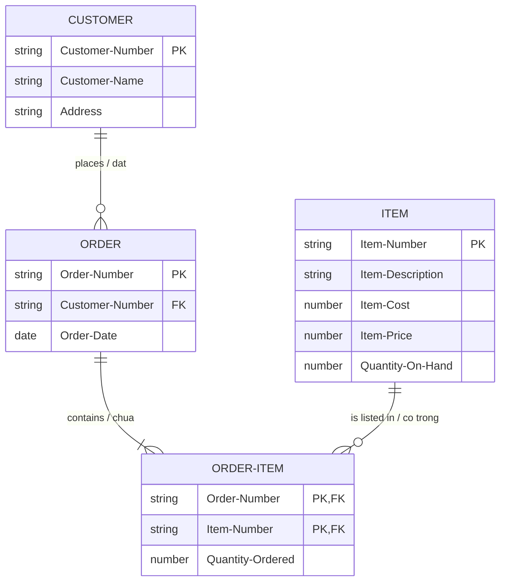

ORDER–ITEM là quan hệ **M:N**, được phân rã qua **associative entity ORDER-ITEM** thành hai quan hệ 1:M. (Entity CUSTOMER được thêm vì ORDER mang CUSTOMER-NUMBER làm foreign key.)

---

### Problem 10 — DFD cho việc đặt hàng (dựa trên ERD Problem 9)

*(Dựa trên hình trong sách.)* Sơ đồ luồng dữ liệu mức 0 cho quy trình đặt hàng — thực thể ngoài CUSTOMER, tiến trình xử lý đơn, và các data store tương ứng với các bảng của ERD:

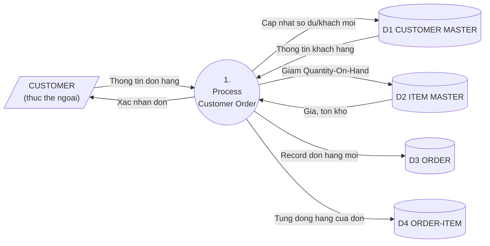

**Giải thích:** Khách gửi thông tin đặt hàng → tiến trình *Process Customer Order* (1) tra CUSTOMER MASTER để xác thực/lấy thông tin khách, (2) tra ITEM MASTER để kiểm tra giá và tồn kho rồi trừ tồn, (3) ghi record mới vào ORDER, (4) ghi từng mặt hàng của đơn vào ORDER-ITEM, (5) trả xác nhận cho khách. Mỗi data store ánh xạ một bảng trong ERD Problem 9.

---

### Problem 11 — ERD cho phần mềm gia phả PeopleTree

**Đề:** Mỗi người nằm trên bảng Person; một người có thể có một cha đẻ, một mẹ đẻ, một cha nuôi, một mẹ nuôi — tất cả cũng phải được lưu trên bảng Person (→ **self-join**). Mỗi người có đúng **một nơi sinh** lưu trên bảng Place; nhiều người có thể sinh cùng một nơi (PLACE–PERSON là 1:M).

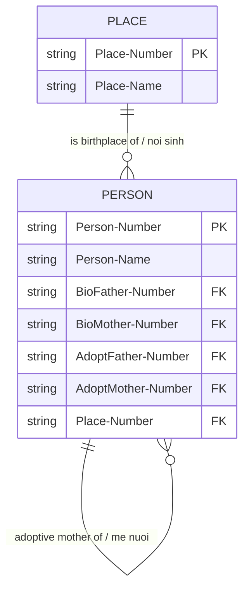

Bốn quan hệ cha/mẹ là **self-join**: bản ghi Person trỏ tới bốn bản ghi Person khác qua bốn foreign key (mỗi FK có thể null nếu chưa rõ — quan hệ 0 hoặc 1 ở chiều ngược).

---

### Problem 12 — Khóa chính cho bảng Person và Place

- **PERSON: Person-Number** — một **số tuần tự/OID không mang nghĩa** do hệ thống cấp. Không thể dùng tên (trùng nhau trong gia phả rất phổ biến — ông và cháu cùng tên), không thể dùng tổ hợp tên + ngày sinh (vẫn có thể trùng, và ngày sinh của tổ tiên xa có thể không rõ → vi phạm entity integrity nếu khóa chứa null).
- **PLACE: Place-Number** — cũng là số tuần tự không mang nghĩa; tên địa danh không phù hợp làm khóa vì trùng (nhiều thành phố cùng tên) và địa danh **có thể đổi tên** theo thời gian (khóa dựa trên attribute là rủi ro).
- Trên PERSON, các cột BioFather-Number, BioMother-Number, AdoptFather-Number, AdoptMother-Number và Place-Number là **foreign key** (bốn FK đầu trỏ về chính bảng PERSON, FK cuối trỏ về PLACE).

---

### Problem 13 — GaiaOrganix: ERD 3NF + blockchain

**Đề:** Hợp tác xã bán sỉ thực phẩm hữu cơ nối nhà sản xuất (farm) và người tiêu thụ (store). Mỗi farmer có thể trồng nhiều crop, mỗi crop được nhiều farmer trồng. Hàng giao **thẳng từ farm đến store**. Mỗi store mua từ nhiều farm, mỗi farm bán cho nhiều store.

**a. ERD dạng 3NF** — hai quan hệ M:N (FARM–CROP và FARM–STORE) đều phân rã qua associative entity:

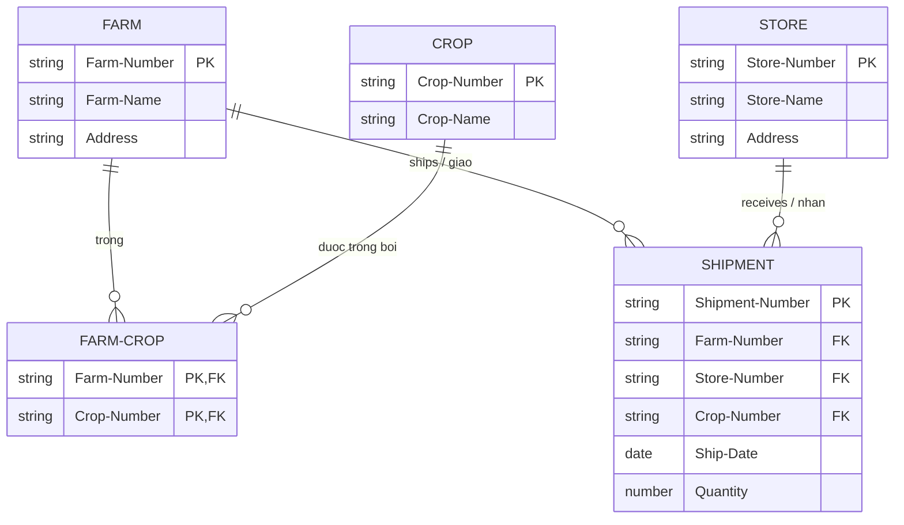

Mọi thuộc tính không khóa phụ thuộc đầy đủ vào khóa chính của bảng mình, không có nhóm lặp hay phụ thuộc bắc cầu → 3NF.

**b. Blockchain bảo đảm độ tươi:** Một ứng dụng blockchain có thể ghi lại **mọi bước của chuỗi cung ứng** thành các giao dịch **bất biến (immutable)**: thời điểm thu hoạch tại farm, chứng nhận canh tác hữu cơ ở từng khâu trồng – thu hoạch – đóng gói, thời điểm hàng lên xe, nhiệt độ trong xe lạnh suốt hành trình, thời gian chờ ở bến dỡ và thời điểm hàng vào quầy của store. Nhờ bốn đặc tính **consensus, provenance, immutability, finality**, cả farm, store lẫn người tiêu dùng đều xác minh được **xuất xứ** và **thời gian/điều kiện vận chuyển** mà không cần tin vào một kho dữ liệu trung tâm của riêng ai; các **sai lệch lớn** (giao trễ, nhiệt độ vượt ngưỡng) được ghi kèm dữ liệu giao dịch, giúp GaiaOrganix chứng minh độ tươi của thực phẩm hữu cơ, phát hiện lô hàng lỗi và **thu hồi (recall) nhanh** khi cần.

---

### Problem 14 — ERD 3NF cho ArticleIndex.com

**Đề:** Người dùng nhập topic hoặc author → nhận danh sách bài viết và tạp chí. Mỗi article có nhiều author, mỗi author viết nhiều article (**M:N**). Một article chỉ nằm trong **một** periodical, mỗi periodical chứa nhiều article (**M:1**). Mỗi article có nhiều topic, mỗi topic thuộc nhiều article (**M:N**).

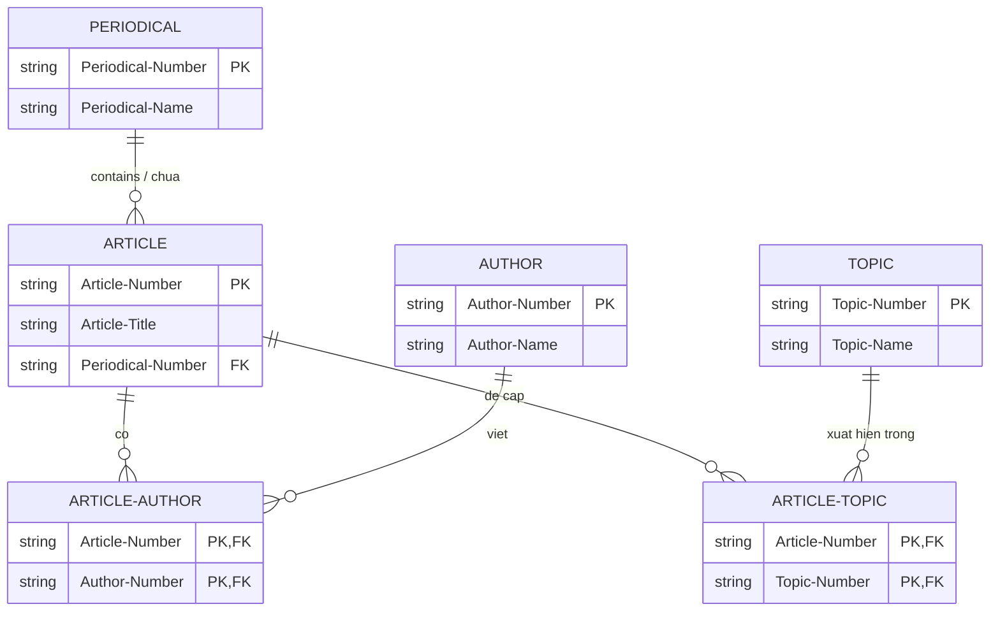

Hai quan hệ M:N (ARTICLE–AUTHOR, ARTICLE–TOPIC) được phân rã qua hai bảng liên kết; ARTICLE–PERIODICAL là 1:M nên chỉ cần đặt Periodical-Number làm FK trên ARTICLE → toàn bộ ở 3NF.

---

### Problem 15 — Khóa chính và khóa ngoại cho ERD ở Problem 14

| Bảng | Primary key | Foreign key |
|---|---|---|
| ARTICLE | Article-Number | Periodical-Number → PERIODICAL |
| PERIODICAL | Periodical-Number | — |
| AUTHOR | Author-Number | — |
| TOPIC | Topic-Number | — |
| ARTICLE-AUTHOR | khóa ghép (Article-Number + Author-Number) | Article-Number → ARTICLE; Author-Number → AUTHOR |
| ARTICLE-TOPIC | khóa ghép (Article-Number + Topic-Number) | Article-Number → ARTICLE; Topic-Number → TOPIC |

Hai bảng liên kết nên index trên **từng** foreign key (tra hai chiều: mọi bài của một author / mọi author của một bài; mọi bài về một topic / mọi topic của một bài). Khóa phụ hữu ích: Author-Name, Topic-Name (đây chính là hai đầu vào tìm kiếm của người dùng web).

---

### Problem 16 — Câu hỏi đánh giá rủi ro cho database bằng sáng chế ElectricEel, LLC

**Đề:** Lập danh sách câu hỏi giúp đánh giá rủi ro (risk assessment) cho database theo dõi các bằng sáng chế (patent) của công ty điện tử mới — lưu bản thiết kế gốc smartphone, trợ lý cá nhân thông minh, biên bản họp nhóm, dữ liệu khách hàng và vendor. Viết **5 câu hỏi chính** cho executives, managers, software engineers.

Dựa trên khung risk assessment của chương (khả năng tấn công – giá trị dữ liệu – hệ lụy vi phạm – đào tạo – business continuity):

1. **Giá trị dữ liệu:** Giá trị (tài chính và chiến lược) của từng loại dữ liệu là bao nhiêu — bản thiết kế gốc chưa nộp đơn sáng chế đáng giá thế nào so với biên bản họp hay dữ liệu vendor — và chi phí bảo vệ tương xứng cho từng loại là bao nhiêu?
2. **Khả năng bị tấn công:** Khả năng công ty trở thành mục tiêu của cyberattack (malware, denial-of-service, gián điệp công nghiệp đánh cắp sở hữu trí tuệ) là bao nhiêu, và những kênh nào (truy cập từ xa, thiết bị cá nhân, vendor bên thứ ba) dễ bị lợi dụng nhất?
3. **Hệ lụy khi vi phạm:** Nếu bản thiết kế bị rò rỉ **trước khi** đơn sáng chế được nộp, hệ lụy pháp lý (mất quyền ưu tiên sáng chế), tài chính, và tổn hại hình ảnh với khách hàng/đối tác của ElectricEel là gì?
4. **Kiểm soát truy cập:** Ai (kỹ sư nộp đơn, quản lý, executive, vendor) cần quyền đọc/ghi với từng loại dữ liệu; việc phân quyền, ghi log truy cập và huấn luyện bảo mật cho người dùng database sẽ được tổ chức thế nào?
5. **Liên tục kinh doanh:** Kế hoạch business continuity và disaster recovery cho database là gì — sao lưu ở đâu, khôi phục trong bao lâu, và người dùng được tham gia thế nào vào kế hoạch để tổ chức có sức bật (resilient) khi bảo mật bị xâm phạm nhằm giảm thiểu thiệt hại?

---

### Problem 17 — Leon & Lim: tiếp cận data analytics

**Đề:** Công ty thời trang Leon & Lim (Milan, do Daiyu và Muchen điều hành) muốn dùng data analytics để hiểu khách hàng qua database. Thảo luận 2 đoạn + 6 câu hỏi về nhu cầu dữ liệu.

**Đoạn 1:** Tôi sẽ giúp Daiyu và Muchen tiếp cận data analytics theo đúng vai trò của systems analyst trong chương: trước hết **bảo đảm chất lượng dữ liệu** khách hàng hiện có (làm sạch, thống nhất định dạng, loại trùng lặp), vì mọi phân tích chỉ đáng tin khi dữ liệu đầu vào sạch. Kế đó, tôi làm **cầu nối giao tiếp** giữa hai chủ doanh nghiệp và chuyên gia phân tích: xác định các câu hỏi kinh doanh cụ thể (khách nào mua dòng thiết kế nào, mùa nào, qua kênh nào), rồi **đào tạo** Daiyu và Muchen cách dùng công cụ phân tích và cách **diễn giải báo cáo** — kết hợp báo cáo tự tạo (self-service) cho nhu cầu hằng ngày với báo cáo do chuyên gia dựng cho câu hỏi phức tạp, hướng đến một **nền tảng BI cộng tác** nơi hai người có thể chia sẻ insight cho đội thiết kế và bán hàng.

**Đoạn 2:** Về dữ liệu, tôi sẽ đề xuất bắt đầu từ dữ liệu có cấu trúc trong database bán hàng (lịch sử mua, giá trị đơn, kênh mua) rồi mở rộng dần sang dữ liệu phi cấu trúc (phản hồi khách, mạng xã hội) khi năng lực phân tích tăng — tìm các mẫu hình kiểu **associations** (sản phẩm hay được mua cùng nhau), **clustering** (nhóm khách theo khu vực/phong cách), **trends** (xu hướng chuyển dịch thị hiếu theo mùa). Đồng thời tôi sẽ lưu ý hai chủ doanh nghiệp về **đạo đức, quyền riêng tư và bảo mật**: khách hàng phần lớn không biết dữ liệu của họ được phân tích, nên cần chính sách rõ ràng về thời gian lưu hồ sơ, tính bảo mật và mục đích sử dụng — và cuối cùng **đo lường tác động** của analytics lên doanh nghiệp để bảo đảm nỗ lực này thực sự tạo giá trị.

**6 câu hỏi về nhu cầu dữ liệu:**
1. Anh chị muốn trả lời những **câu hỏi kinh doanh** nào về khách hàng (ai mua, mua gì, khi nào, vì sao quay lại/rời bỏ)?
2. Hiện anh chị đang **thu thập những dữ liệu nào** về khách hàng (đơn hàng, hội viên, website, mạng xã hội), ở định dạng nào, chất lượng ra sao?
3. Anh chị muốn **phân khúc khách hàng** theo tiêu chí nào — địa lý, nhân khẩu học, hành vi mua, phong cách thời trang?
4. Ai trong công ty sẽ **sử dụng báo cáo phân tích**, và họ muốn tự tạo báo cáo hay nhận báo cáo do chuyên gia dựng sẵn?
5. Anh chị có sẵn sàng **hợp nhất dữ liệu từ nguồn ngoài** (xu hướng thời trang, dữ liệu thị trường, mạng xã hội) với dữ liệu nội bộ không — tức tiến tới một data warehouse/data lake?
6. Chính sách của công ty về **quyền riêng tư của khách hàng** là gì — dữ liệu được lưu bao lâu, ai được truy cập, khách hàng có được thông báo về việc dữ liệu được phân tích không?

---

### Group Project 1 — Vé hòa nhạc và denormalization

**Đề:** Douglas Williams đặt vé online cho hai buổi hòa nhạc ở Philadelphia (Moon Cave và Orbiter 3), chọn chỗ ngồi, vé gửi bưu điện riêng từng bộ; một bộ bị thất lạc. Khi gọi lên tổng đài, Doug **không nhớ** ngày diễn và số ghế, nhưng đại lý tìm được vé nhanh vì **đã denormalize** quan hệ. Hãy liệt kê data element trên order form và shipping form; Doug đã cung cấp thông tin gì?

**Data element trên Order form (đơn đặt vé):** Order-Number; Customer-Number; Customer-Name; Customer-Address; Customer-Phone; Customer-Email; Credit-Card-Number; Order-Date; và với mỗi vé: Concert-Name (tên ban nhạc/sự kiện), Concert-Date, Concert-Venue, Seat-Location (khu/hàng/số ghế), Number-of-Tickets, Ticket-Price, Total-Amount.

**Data element trên Shipping form (phiếu gửi):** Shipping-Number; Order-Number; Ship-To-Name; Ship-To-Address; Shipping-Date; Shipping-Method; Shipping-Status. Vì đã **denormalize** (gộp quan hệ 1:1 giữa chi tiết đơn hàng và chi tiết gửi hàng — đúng như ví dụ ORDER-DETAILS + SHIPPING-DETAILS ở Figure 13.26), shipping form còn lặp lại: Customer-Number, Customer-Name, Concert-Name, Concert-Date, Seat-Location, Order-Date.

**Thông tin Doug cung cấp:** chỉ những gì anh nhớ — **tên mình** (và/hoặc số điện thoại, địa chỉ) và **tên ban nhạc** của bộ vé thất lạc. Nhờ bảng denormalized, đại lý tra một bảng duy nhất theo tên khách hàng là ra ngay toàn bộ đơn: ngày diễn, số ghế, tình trạng gửi — **không phải join** ORDER với SHIPPING và CONCERT như khi dữ liệu ở dạng chuẩn hóa; đó chính là lợi ích "tốc độ truy vấn" của denormalization.

---

*Hết Chương 13. Chương tiếp theo: Chapter 14 — Human–Computer Interaction and UX Design.*
