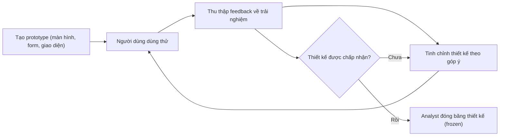
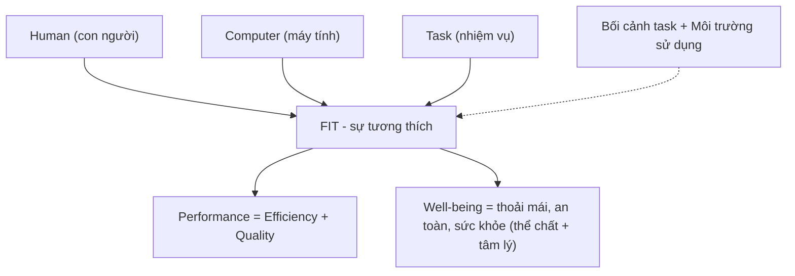
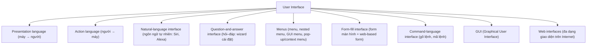
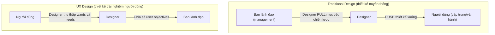
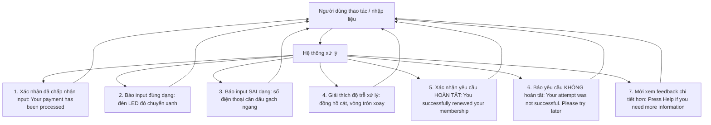
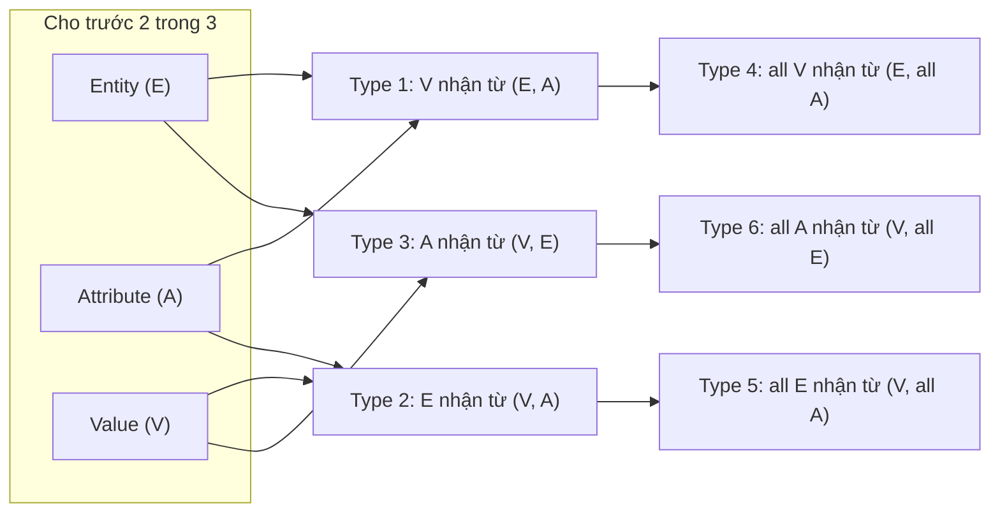

# Chương 14 — Human–Computer Interaction and UX Design (Tương tác người–máy và thiết kế UX)

> Tài liệu học tập tiếng Việt biên soạn từ Chương 14, "Systems Analysis and Design" (Kendall & Kendall, 11th edition), trang sách 433–470.

---

## 🎯 Mục tiêu học tập

Sau khi học xong chương này, bạn có thể:

1. **Hiểu Human–Computer Interaction (HCI)** — khái niệm, tầm quan trọng của sự **fit** (tương thích) giữa con người (human), máy tính (computer) và nhiệm vụ (task), và ảnh hưởng của fit đến **performance** (hiệu năng) và **well-being** (an lạc/thoải mái) của người dùng.
2. **Đánh giá usability** (tính khả dụng) của hệ thống và giao diện; áp dụng các heuristics của Nielsen; thiết kế cho các phong cách nhận thức (cognitive styles) khác nhau và cân nhắc các yếu tố vật lý (thị giác, thính giác, xúc giác) cũng như hạn chế/khuyết tật của con người.
3. **Nhận diện và lựa chọn các loại giao diện người dùng** (natural-language, question-and-answer, menu, form-fill, command-language, GUI, web) phù hợp với từng loại người dùng và nhiệm vụ.
4. **Hiểu UX design** (thiết kế trải nghiệm người dùng) — phương pháp "customer-first", phân biệt UI với UX, các nguyên tắc Do/Don't, và lợi ích của UX design cho giao dịch ecommerce.
5. **Thiết kế giao diện cho smartphone/tablet** (multitouch gestures, alerts, notices, badges), cho **intelligent personal assistants** (trợ lý ảo thông minh), và cho **VR/AR/Metaverse**.
6. **Thiết kế dialog (hội thoại) và feedback (phản hồi)** hiệu quả cho người dùng; thiết kế feedback và điều hướng (navigation) cho website ecommerce, mashup, cookie compliance, chatbot.
7. **Thiết kế queries (truy vấn)** — 6 loại truy vấn cơ bản, toán tử Boolean, và hai phương pháp truy vấn QBE và SQL.

---

## 📖 Tóm tắt & giải thích kiến thức

### 1. Hiểu về Human–Computer Interaction (HCI)

**HCI (tương tác người–máy)** là việc thiết kế nhằm: "đảm bảo tính năng (functionality) và tính khả dụng (usability) của hệ thống, cung cấp hỗ trợ tương tác hiệu quả cho người dùng, và nâng cao trải nghiệm người dùng dễ chịu" (Carey et al., 2004). Mục tiêu bao trùm là đạt được **hiệu quả và hiệu suất cho cả tổ chức lẫn cá nhân người dùng**.

Nền tảng của HCI là kiến thức về **sự tương tác qua lại (interplay)** giữa 5 yếu tố:
- **Users** (người dùng)
- **Tasks** (nhiệm vụ)
- **Task contexts** (bối cảnh nhiệm vụ)
- **IT** (công nghệ thông tin)
- **Environments** (môi trường sử dụng hệ thống)

**Chiến thuật chính của HCI** trong phân tích & thiết kế hệ thống: **lặp đi lặp lại việc lấy feedback từ người dùng** về trải nghiệm với các thiết kế prototype (màn hình, form, giao diện...), tinh chỉnh thiết kế theo góp ý, rồi thử lại với người dùng — cho đến khi thiết kế được chấp nhận và được analyst "đóng băng" (frozen).



#### Fit ảnh hưởng đến Performance và Well-Being như thế nào

Các định nghĩa cốt lõi:

| Khái niệm | Giải thích |
|---|---|
| **Fit** (sự tương thích) | Sự khớp tốt giữa 3 yếu tố HCI: **human – computer – task**. Ví von: như đôi giày mới phải vừa chân, chịu được hoạt động (chạy bộ), làm bằng chất liệu bền và kinh tế. Fit tốt hơn → performance tốt hơn và well-being cao hơn. |
| **Task** (nhiệm vụ) | Có thể **có cấu trúc và thường quy (structured, routine)** hoặc **mơ hồ, không có cấu trúc rõ ràng (ill-defined)**. Các task phức tạp đòi hỏi tương tác human–system–task được hỗ trợ bởi hệ thống ecommerce/web, ERP, hệ thống không dây trong và ngoài tổ chức. |
| **Performance** (hiệu năng) | Kết hợp của **(1) hiệu suất (efficiency)** khi thực hiện task và **(2) chất lượng (quality)** của sản phẩm công việc. Ví dụ: analyst thành thạo CASE tool vẽ DFD → vừa nhanh (efficient) vừa cho DFD chất lượng cao — tốt hơn hẳn vẽ tay hoặc dùng tool vẽ không gắn với data dictionary. |
| **Well-being** (an lạc) | Sự quan tâm đến **thoải mái, an toàn và sức khỏe tổng thể** của con người — trạng thái **thể chất lẫn tâm lý**. |

**Khía cạnh tâm lý (affective component)**: thái độ của người dùng — cảm nhận về bản thân, danh tính, đời sống công việc và hiệu năng — ảnh hưởng đến cách họ cảm nhận về công nghệ và task. Analyst theo hướng HCI cần quan tâm thái độ này cản trở hay thúc đẩy trải nghiệm.



### 2. Usability (Tính khả dụng)

Usability được định nghĩa khác nhau tùy ngành khoa học. Dưới lăng kính HCI, usability là cách để **designer đánh giá hệ thống và giao diện mình tạo ra** nhằm giải quyết càng nhiều mối quan tâm HCI càng tốt. Nghiên cứu usability (theo nngroup.com) là việc **tìm ra cái gì hoạt động hiệu quả trong thực tế và cái gì không**.

**Các usability heuristics của Nielsen** (Nielsen & Mack, 1994; Nielsen et al., 2001) — đúc kết từ hàng nghìn usability test giao diện và website ecommerce:

1. Visibility of system status (hiển thị rõ trạng thái hệ thống)
2. Match between the system and the real world (khớp giữa hệ thống và thế giới thực)
3. User control and freedom (người dùng có quyền kiểm soát và tự do)
4. Consistency and standards (nhất quán và tuân theo chuẩn)
5. Error prevention (phòng ngừa lỗi)
6. Recognition rather than recall (nhận ra thay vì phải nhớ lại)
7. Flexibility and efficiency of use (linh hoạt và hiệu quả khi dùng)
8. Aesthetics and minimalist design (thẩm mỹ và thiết kế tối giản)
9. Help users recognize, diagnose, and recover from errors (giúp người dùng nhận ra, chẩn đoán và phục hồi lỗi)
10. Help and documentation (trợ giúp và tài liệu)

**Hai cách đánh giá usability** (Hình 14.1 trong sách):
- **Usability survey**: bảng khảo sát phát trực tiếp cho người dùng sau khi tương tác với prototype, chấm thang điểm 1–5 theo 4 nhóm yếu tố: *Physical/Safety Concerns* (đọc được màn hình? nghe được audio? an toàn?), *Usability Concerns* (giảm lỗi, phục hồi lỗi, dễ dùng, dễ nhớ, dễ học), *Pleasing and Enjoyable Attributes* (hấp dẫn, cuốn hút, tin cậy, thỏa mãn, thú vị, giải trí, vui), *Usefulness Attributes* (hỗ trợ task, mở rộng năng lực, đáng dùng, làm được việc hệ thống khác không làm được).
- **Use case scenarios**: viết kịch bản sử dụng để soi xét các vấn đề usability.

#### Thiết kế cho phong cách nhận thức (cognitive styles) của từng người dùng

Dữ liệu — nhất là dữ liệu phục vụ ra quyết định — cần được cung cấp **dưới nhiều dạng khác nhau**: có người thích xem **bảng**, người thích **đồ thị**, người thích **văn bản tường thuật**. Cùng một người có thể muốn xem cùng một dữ liệu theo cách khác nhau ở thời điểm khác nhau.

- **Pivot tables**: cho phép người dùng **tự sắp xếp lại dữ liệu trong bảng theo bất kỳ cách nào họ muốn** (ví dụ: đổi từ xếp theo tồn kho cao→thấp sang xếp cửa hàng theo alphabet, tháng theo thời gian).
- **Visualization** (trực quan hóa): biểu diễn dữ liệu dưới dạng **chart, graph hoặc hình ảnh khác** (đã có từ thế kỷ 18). Rào cản trước đây: thiếu trí tưởng tượng, vẽ đồ thị tốn kém, thiếu sự trân trọng. Lưu ý: chart nhồi nhét quá nhiều thông tin sẽ quá phức tạp; **người tiêu thụ thông tin phải diễn giải được thì hình mới có giá trị** → nên dùng phần mềm để sinh chart/graph.

### 3. Các cân nhắc vật lý (Physical Considerations) trong thiết kế HCI

Analyst cần hiểu năng lực và giới hạn giác quan của con người để có thể **bù đắp, khắc phục hoặc thay thế** chúng ở mức độ nhất định:

| Giác quan | Cân nhắc thiết kế |
|---|---|
| **Vision (thị giác)** | Khoảng cách từ màn hình đến người dùng; góc nhìn màn hình; kích thước và độ đồng đều của ký tự; độ sáng, tương phản, cân bằng, độ chói; màn hình nhấp nháy hay ổn định — đều có chuẩn ISO và các chuẩn quốc gia/quốc tế. |
| **Hearing (thính giác)** | Giác quan con người có giới hạn chịu đựng. Máy in laser ồn, điện thoại, máy hủy tài liệu → quá tải thính giác. Tai nghe chống ồn/máy nghe nhạc là giải pháp nhưng có thể **cô lập** người dùng khỏi môi trường tổ chức, thậm chí giảm năng lực làm việc. Analyst phải cân nhắc tiếng ồn khi thiết kế hệ thống văn phòng. |
| **Touch (xúc giác)** | Bàn phím được thiết kế ergonomic để cho feedback đúng (độ cứng của phím xác nhận đã gõ). Bài học kinh điển về **numeric keypad**: điện thoại xếp 1-2-3 hàng trên; máy tính bỏ túi/bàn phím số xếp 7-8-9 hàng trên. Nghiên cứu: **bố cục máy tính bỏ túi (calculator) vượt trội khi nhập liệu nhiều**; bố cục điện thoại tốt hơn khi **tra tìm số**. → Designer liên tục xem xét fit giữa human–computer–task. |

### 4. Hạn chế của con người, khuyết tật (Disabilities) và thiết kế

Mọi con người đều có giới hạn thể chất — có cái nhìn thấy ngay, có cái không. Việc áp dụng HCI để **hỗ trợ và nâng cao năng lực thể chất của con người là một trong những hướng ứng dụng hứa hẹn nhất** (nhờ tiến bộ của kỹ thuật y sinh — biomedical engineering): hỗ trợ người mù/thị lực kém, người điếc/khiếm thính, người hạn chế vận động, và cả người gặp khó khăn xử lý nhận thức (tự kỷ, khó đọc — dyslexia, rối loạn giảm chú ý).

Analyst phải tuân theo **quy định pháp lý của quốc gia nơi làm việc** (ví dụ ở Mỹ: Americans with Disabilities Act — ADA). Cách tốt nhất để bao quát rộng nhất: **bắt đầu thiết kế từ góc nhìn HCI** — luôn đặt việc giúp người dùng hoàn thành task lên hàng đầu.

Các giải pháp cụ thể:
- **Color vision deficiency (mù màu)**: test màu trên màn hình/form để chắc chắn phân biệt được (đặc biệt đỏ–xanh lá); luôn thiết kế **tín hiệu thay thế** (alternative cues): icon, chữ viết, âm thanh củng cố nội dung.
- **Khiếm thính**: đảm bảo tài liệu/màn hình có **bản chữ viết của nội dung audio**; hoặc thiết kế task sao cho dùng được headphone.
- **Hạn chế vận động**: dùng **speech input** thay vì gõ phím; công nghệ y sinh mới cho phép di chuyển con trỏ bằng **hơi thở vào ống**, bằng **ánh mắt** (nhìn vào điểm mong muốn), thậm chí bằng **suy nghĩ**.

### 5. Triển khai thực hành HCI tốt & 5 mục tiêu thiết kế giao diện

Lý tưởng: mời một **usability specialist** vào đội phát triển hệ thống — nhưng thực tế nhiều nhóm nhỏ, chuyên gia usability hiếm, vị trí thường bỏ trống. Analyst vẫn có thể làm các bước đơn giản (Hình 14.2 — Guidelines cho cách tiếp cận HCI):

- Xem xét task cần làm và cân nhắc **fit giữa human, computer, task**.
- Nhận diện **rào cản (obstacles)** người dùng gặp khi cố hoàn thành task.
- Ghi nhớ **perceived usefulness** (hữu ích cảm nhận) và **perceived ease of use** (dễ dùng cảm nhận) của công nghệ.
- Cân nhắc usability; khảo sát môi trường sử dụng bằng **use case scenarios**.
- Dùng thông tin thu được để xác định đặc điểm môi trường vật lý và tổ chức; **thiết kế bằng prototyping** để phục vụ người dùng đa dạng và người khuyết tật.

**Điểm mấu chốt**: *"Đối với hầu hết người dùng, giao diện chính là hệ thống"* (the interface **is** the system). Giao diện — dù tốt hay tệ — đại diện cho hệ thống, và phản chiếu năng lực của chính systems analyst.

**5 mục tiêu khi thiết kế giao diện**:
1. **Match** giao diện với task (khớp giao diện với nhiệm vụ).
2. Làm giao diện **hiệu quả** (efficient).
3. Cung cấp **feedback phù hợp** cho người dùng.
4. Sinh ra các **query khả dụng** (usable queries).
5. **Cải thiện năng suất** của người dùng máy tính.

### 6. Các loại giao diện người dùng (Types of User Interfaces)

Giao diện người dùng có **2 thành phần chính**:
- **Presentation language**: phần **máy tính → người** của giao dịch (máy trình bày gì cho người).
- **Action language**: phần **người → máy tính** (người thao tác gì với máy).



**a. Natural-language interfaces (giao diện ngôn ngữ tự nhiên)** — "giấc mơ và lý tưởng" của người dùng thiếu kinh nghiệm: tương tác với máy bằng ngôn ngữ hàng ngày (gõ hoặc nói), không cần kỹ năng đặc biệt. Ví dụ: "Schedule an appointment on Wednesday at 1:00 p.m. with Karla Salguero in marketing." Siri (iPhone), Alexa (Amazon Echo) là giao diện giọng nói dùng ngôn ngữ tự nhiên. (Hạn chế: xử lý ngôn ngữ tự nhiên phức tạp, khó cài đặt hoàn chỉnh — xem thêm phần intelligent personal assistants.)

**b. Question-and-answer interfaces (giao diện hỏi–đáp)** — máy hiển thị câu hỏi, người dùng trả lời (gõ phím/click chuột), máy xử lý theo cách lập trình sẵn rồi thường chuyển sang câu hỏi kế tiếp. Ví dụ điển hình: **wizards / software setup assistants** khi cài phần mềm (chọn ổ đĩa cài, tùy chỉnh tính năng). Phù hợp người dùng **thiếu kinh nghiệm**.

**c. Menus** — người dùng **bị giới hạn trong các lựa chọn hiển thị**; không cần biết hệ thống nhưng **phải biết mình cần làm task gì** (ví dụ menu word processing: Edit, Copy, Print).
- **Nested menus** (menu lồng nhau): dẫn người dùng qua các lựa chọn; ưu điểm: màn hình **bớt rối** (đúng nguyên tắc thiết kế tốt), người dùng **tránh thấy các lựa chọn không quan tâm**, và **di chuyển nhanh** trong chương trình.
- **GUI menu guidelines**: (1) main menu bar luôn hiển thị trên đỉnh ứng dụng (Windows) hoặc đỉnh màn hình (Mac OS); (2) main menu có các lựa chọn phụ nhóm theo tính năng tương đồng (menu Format → Font, Paragraph, Document...); (3) mục menu **không khả dụng phải được làm xám (grayed out)**.
- **Object menu** (pop-up/context menu): hiện khi click chuột phải vào đối tượng GUI; chứa các mục đặc thù cho hoạt động hiện tại, phần lớn trùng lặp chức năng của main menu.

**d. Form-fill interfaces (giao diện điền form)** — form trên màn hình hoặc web hiển thị các **field** chứa dữ liệu/tham số cần trao đổi.
- Form chỉ rõ **cần nhập gì, nhập ở đâu**; field trống cần dữ liệu có thể được highlight; di chuyển giữa field bằng phím mũi tên/Tab → **kiểm soát tốt việc nhập liệu**.
- Có thể đơn giản hóa bằng **default values** (giá trị mặc định — ví dụ số check kế tiếp) mà người dùng có thể sửa.
- Field có thể bị **giới hạn alphanumeric** (chỉ số cho Social Security number, chỉ chữ cho tên); nhập sai máy có thể cảnh báo bằng audio.
- **Web-based forms**: có thể chèn **hyperlink** đến ví dụ form điền đúng hoặc trợ giúp; **trả lại form thiếu** kèm giải thích cần nhập gì (field thiếu thường đánh dấu đỏ); gửi thẳng đến billing (giao dịch) hoặc database thời gian thực (khảo sát); **đẩy trách nhiệm chính xác cho người dùng**; sẵn sàng **24/7, toàn cầu**.
- **Form builder apps** (Jotform, WuFoo, Typeform...) — vượt xa việc chỉ thiết kế form (Hình 14.3): kéo-thả dễ dàng; **logic jumps** tự bỏ qua câu hỏi không liên quan; chụp ảnh/vẽ và nhận thanh toán; output tạo **dashboard**; định tuyến form đến nhân viên hiện trường/khách hàng và theo dõi; **thông báo thời gian thực** khi có người hoàn thành form; tích hợp PayPal, Mailchimp, Zoom; dùng câu trả lời trước cho câu hỏi sau; nhận **chữ ký**.

**e. Bảng so sánh các loại giao diện:**

| Loại giao diện | Cách tương tác | Người dùng phù hợp | Ưu điểm | Nhược điểm |
|---|---|---|---|---|
| **Natural-language** | Gõ/nói câu ngôn ngữ tự nhiên | Người dùng thiếu kinh nghiệm | Không cần kỹ năng đặc biệt; tự nhiên nhất | Khó cài đặt; xử lý ngôn ngữ phức tạp, chưa hoàn thiện |
| **Question-and-answer** | Máy hỏi, người trả lời từng bước | Người dùng thiếu kinh nghiệm | Dẫn dắt qua quy trình phức tạp (wizard) | Chậm với người thành thạo; cứng nhắc |
| **Menus** | Chọn từ danh sách hiển thị | Không cần biết hệ thống, chỉ cần biết task | Không phải nhớ lệnh; nested menu gọn màn hình, đi nhanh | Bị giới hạn trong lựa chọn có sẵn; nhiều cấp có thể chậm |
| **Form-fill (màn hình/web)** | Điền dữ liệu vào các field của form | Nhân viên nhập liệu; khách hàng web | Kiểm soát nhập liệu tốt; default values; validation; web 24/7 | Web đẩy trách nhiệm chính xác cho người dùng; kém linh hoạt cho truy vấn tùy biến |
| **Command-language** | Gõ lệnh/mã (code) | Người dùng thành thạo, chuyên gia | Nhanh, mạnh, ít phím (dùng code như mã bang 2 ký tự) | Phải học và nhớ lệnh; không thân thiện người mới |
| **GUI** | Thao tác trực tiếp trên biểu tượng, cửa sổ, menu, nút | Nhiều cấp độ; hiệu quả cho người dùng cần feedback liên tục | Feedback liên tục; trực quan; chuẩn hóa (grayed-out, tooltip, context menu) | Cần thiết kế nhất quán; có thể chậm hơn phím tắt với chuyên gia |
| **Web interfaces** | Trình duyệt: link, form, nút, tìm kiếm | Người dùng "không biết trước" (unknown users) | Truy cập toàn cầu; hyperlink trợ giúp; đa dạng | Thách thức lớn vì không biết người dùng là ai; cần hướng dẫn nhiều hơn |

**f. Tiêu chuẩn chọn và đánh giá giao diện** (5 chuẩn):
1. Thời gian đào tạo người dùng **ngắn ở mức chấp nhận được**.
2. Ngay từ giai đoạn đầu đào tạo, người dùng **nhập lệnh không cần suy nghĩ** hoặc không cần tra help/manual (giữ giao diện **nhất quán** giữa các ứng dụng giúp việc này).
3. Giao diện **liền mạch (seamless)**: ít lỗi, và lỗi xảy ra không phải do thiết kế tồi.
4. Thời gian người dùng và hệ thống **phục hồi sau lỗi ngắn**.
5. Người dùng **không thường xuyên (infrequent users) học lại được hệ thống nhanh chóng**.

→ Giao diện hiệu quả giải quyết được phần lớn mối quan tâm HCI: người dùng **muốn** dùng hệ thống, thấy nó hấp dẫn, hiệu quả và dễ chịu.

### 7. UX Design (Thiết kế trải nghiệm người dùng)

**UX design (user experience design)** là **phương pháp "customer-first"** (khách hàng trước tiên) để thiết kế phần mềm: **quan sát hành vi khách hàng** và nỗ lực **nâng cao sự hài lòng (satisfaction) và lòng trung thành (loyalty)** của khách. Nó đạt được điều này bằng cách cải thiện usability và ease of use, nhưng cũng hiểu rằng **khách hàng phải thấy thích thú khi tương tác với sản phẩm**.

**Phân biệt UI và UX:**

| UI (User Interface) design | UX (User Experience) design |
|---|---|
| Thiết kế cho tương tác mượt mà | Thiết kế cho **yêu cầu và nhu cầu của người dùng** |
| Trọng tâm: layout, menus, buttons (input); graphs, charts, tables (output) | Trọng tâm: **luồng lấy con người làm trung tâm (human-centered flow)** và quan trọng nhất — **usability** |

**Traditional design vs UX design** (Hình 14.4):



- **Truyền thống**: designer **kéo (pull)** mục tiêu chiến lược từ top management → thiết kế → **đẩy (push)** thiết kế xuống người dùng.
- **UX**: designer **tương tác với người dùng** để thu thập mong muốn/nhu cầu → thiết kế sau khi tương tác với người dùng và công nghệ đề xuất → **chia sẻ user objectives với management** trong hệ thống mới.

Tiên phong về chất lượng **Dr. Joseph Juran**: chất lượng được đánh giá qua việc *sản phẩm có dùng được đúng như dự định hay không* — đây chính là trái tim của UX design. **Usability = hệ thống dễ hiểu, dễ dùng, dễ trân trọng** (easy to understand, easy to use, easy to appreciate). Đôi khi chỉ một tính năng nhỏ (như cho phép lưu mật khẩu) đã tạo khác biệt.

**7 câu hỏi UX designer cân nhắc:**
1. Nhu cầu người dùng có được đáp ứng mà **không gặp phức tạp** nào không?
2. Workflow có tiến hành mà **không đòi hỏi bước thừa/lặp** không?
3. Người dùng có hoàn thành task mà **không bị buộc phải nhớ lại (recall)** điều gì từ bước trước không?
4. Nếu người dùng mắc lỗi, có thể **sửa dễ dàng** không?
5. Tương tác có **tự nhiên** với người dùng không?
6. Người dùng có thể **hiệu quả hơn nhờ shortcuts** không?
7. Người dùng có **cảm thấy làm chủ (in control)** hệ thống không?

**Nền tảng của UX design**: hiểu về con người (động lực, lòng trung thành, hạnh phúc, cách ra quyết định — không cần bằng tâm lý học nhưng cần kiến thức); thu thập thông tin về con người bằng **phương pháp tương tác và không xâm nhập** (interactive & unobtrusive, cả định lượng lẫn định tính — Chương 4, 5); dùng **prototype** để lấy phản ứng (Chương 6 — kể cả prototype không hoạt động cũng khai thác được nhiều thông tin); cho nhóm người dùng **walk through** hệ thống hiện tại/website/app để quan sát chỗ họ vấp, quên, hay bực bội.

**5 việc NÊN làm (Do's) trong UX design** (Hình 14.5):
1. **Do create simple and stress-free sign-ins** — đăng nhập đơn giản, không căng thẳng; đừng đòi hỏi điều bất thường (ví dụ bắt buộc đăng nhập Facebook sau khi đã mua game → người dùng đòi hoàn tiền).
2. **Do make the default choices user friendly** — mặc định thân thiện: hỏi gửi thông tin về công ty thì default là "No"; tuân thủ quy định từng nước/khu vực (EU vs Mỹ, opt-in vs opt-out); màu **xanh lá = đồng ý, đỏ = không đồng ý** — đừng đánh lừa.
3. **Do design to specs that describe the majority of your users** — thiết kế theo cấu hình của số đông người dùng; đừng giả định ai cũng có phần cứng/phần mềm mới nhất (công ty từng phá sản vì "cải tiến" khiến máy người dùng chậm như rùa — một trải nghiệm tồi có thể thay đổi vận mệnh công ty).
4. **Do provide a way out** — cho lối thoát: mô hình subscription phải dễ hủy; cảnh báo khi trial miễn phí sắp hết; cân nhắc đưa link hủy đăng ký ngay khi họ đăng ký.
5. **Do keep your eye on users** — luôn dõi theo người dùng: họ thay đổi workflow, sở thích, phần cứng (trung bình xem smartphone 150 lần/ngày; wearable có thể thay đổi thói quen). UX là user-centered → **liên tục theo dõi người dùng**.

**5 việc TRÁNH làm (Don'ts) trong UX design:**
1. **Don't masquerade ads as content** — đừng ngụy trang quảng cáo thành nội dung (link giả dạng bài viết → người dùng cảm thấy bị lừa).
2. **Don't block the user from seeing the content** — đừng chặn nội dung (giới hạn số bài đọc/tháng, bắt tắt ad blocker → trải nghiệm tồi, khó thu hút người dùng mới).
3. **Don't ask the user for too many permissions** — đừng xin quá nhiều quyền (xin gửi notification ngay khi vào site, đòi truy cập camera/danh bạ không lý do; nếu có lý do chính đáng, **giải thích ngay từ đầu**).
4. **Don't spring surprises at checkout** — đừng gây bất ngờ lúc thanh toán (phí ship bất ngờ, "transaction fees"; ví dụ dịch vụ giao đồ ăn đổi mặc định tip tài xế 18% → mất khách).
5. **Don't stop testing** — đừng ngừng kiểm thử (hệ điều hành thay đổi; nếu trao đổi dữ liệu với app khác, phải bảo đảm vẫn hoạt động).

### 8. UX Design cho Ecommerce

**6 thực hành tốt cho giao dịch ecommerce** (rút từ nguyên tắc UX):
1. **Giải thích phí vận chuyển sớm** và dễ tìm; cho xem các lựa chọn ship (UPS, FedEx, USPS...) và chi phí điển hình **trước khi** checkout; có tab riêng về thời gian ship và lựa chọn.
2. **Cập nhật giá động trong khu "Save for Later"** kèm ghi chú — thay đổi giá (tăng/giảm) nhắc người dùng hành động, giữ họ gắn kết, nhắc họ còn hàng trong giỏ.
3. **Cho phép xóa item khỏi giỏ và đổi số lượng dễ dàng** — nút Edit (đổi size/màu), nút Remove, drop-down Quantity ngay cạnh item (không phải quay lại trang sản phẩm).
4. **Ghi rõ phí thẻ tín dụng và phí giao dịch** — khách phải biết tổng chi phí (thẻ/phương thức nào đắt hơn); phí xử lý dịch vụ (giữ vé concert tại box office) phải được nêu rõ.
5. **Cho phép tiếp tục mua sắm hoặc đi đến checkout** sau khi thêm item vào giỏ — 2 nút riêng: **Continue Shopping** và **Proceed to Checkout** (có thể thêm Save for Later / Add to Wish List).
6. **Nhắc lại chi tiết giao dịch trước khi nhập thông tin thanh toán** — ví dụ vé sự kiện: ngày giờ, nghệ sĩ, số vé, vị trí, giá; hàng hóa: tóm tắt giỏ hàng (danh sách + tổng tiền, có thể kèm thumbnail); cân nhắc **chat 24/7** (người thật, chatbot, hoặc hybrid người + bot AI) để giải đáp trước checkout.

**7 lợi ích của UX design cho giao dịch ecommerce:**
1. **Khách hoàn thành task nhanh hơn** — tổ chức site logic, luồng trôi chảy từ duyệt hàng → chọn → bỏ giỏ → quay lại chọn thêm → xem phí ship/thanh toán → checkout với hóa đơn in được, chính sách đổi trả rõ, thông báo ngày giao.
2. **Hoàn thành nhiều task hơn trong cùng thời gian** — hỗ trợ cả khách cần checkout gấp (sale kết thúc lúc nửa đêm, 11:55 p.m. vẫn đang mua) lẫn khách thong thả so sánh nhiều ngày.
3. **Kết quả task chính xác hơn** — prompt thông tin theo thứ tự dự kiến, thông tin tài khoản không nhạy cảm tự động điền lại → ít lỗi sao chép.
4. **Cần ít support hơn** cho khiếu nại từ trải nghiệm tồi — UX designer đã phát triển nhiều kịch bản/đường đi, lường trước điều có thể sai → trải nghiệm tồi hiếm xảy ra; tổ chức rảnh tay chăm sóc quan hệ khách hàng.
5. **Người dùng hoàn tất giao dịch thay vì bỏ giỏ hàng (cart abandonment)** — nhiều đường đi đều dẫn đến mua thành công, checkout hiện diện ở mọi trang; lời nhắc kiểu Nordstrom: "Popular items sell out fast. Adding an item here doesn't hold it, so get what you love before it's gone."
6. **Khách trung thành, không tìm site khác** — giao diện quen thuộc và logic, checkout hiệu quả và dễ chịu, khách được nhận diện, tài khoản auto-fill; nhiều khách ngại lập tài khoản site mới, thích quay lại site quen có trải nghiệm tốt.
7. **Người dùng hài lòng hơn với trải nghiệm tổng thể** — khách hàng ở trung tâm từ lúc sign-on đến mua hàng, nhận hàng và cả đổi trả.

### 9. Thiết kế giao diện cho Smartphone và Tablet

Màn hình cảm ứng (touch-sensitive screens) cho phép dùng ngón tay kích hoạt màn hình. Hệ điều hành thiết bị nhỏ dùng **multitouch gestures** — dựa trên **capacitive sensing** (cảm ứng điện dung): màn hình điều khiển bằng **ngón tay người hoặc bút stylus dẫn điện**.

**Gestures (cử chỉ):**
- Có gesture **bẩm sinh/trực quan**: chọc (poking), đẩy nhẹ (nudging) là bản năng; **swipe** phải-sang-trái để lật trang (khi đọc tiếng Anh) là trực quan.
- Có gesture **không trực quan nhưng học được và nhớ được**: **pinch** để zoom in/out ảnh/bản đồ — một khi học rồi thì thấy "có lý".
- Nguyên tắc: gesture phải **dựa trên cách phần đông người dùng thích dùng** — họ không nghĩ như bạn; họ có thể **không tự khám phá ra** gesture bạn thiết kế.
- Desktop dùng phím mũi tên/scroll bar; smartphone/tablet: **swipe** để chuyển trang trái-phải, **tug** (kéo) để xem tiếp xuống dưới.
- **Nguy hiểm của gesture phi chuẩn**: nếu app khác dùng swipe trái→phải là **copy**, còn app máy tính của bạn dùng nó để **xóa màn hình** → người dùng bực (và có thể mất dữ liệu) → mất khách.
- **Accelerometer** (cảm biến gia tốc, phát hiện chuyển động 3 chiều) → gesture **lắc (shake)**: hợp lý cho game, máy đo địa chấn, đếm bước, biofeedback; nhưng **lắc không phải gesture hiển nhiên/bẩm sinh** — người dùng chịu lắc iPhone nhưng ít ai muốn lắc iPad (kích thước nền tảng và bối cảnh app quan trọng); lắc điện thoại nơi công sở/phương tiện công cộng trông kỳ cục → nên **thêm lựa chọn thay thế** (nhấn nút thì kín đáo, lắc thì không).
- **Metaphor (ẩn dụ) phải phù hợp**: Urbanspoon dùng ẩn dụ **quay máy đánh bạc (slot machine)** để chọn ngẫu nhiên nhà hàng — nhưng ẩn dụ cờ bạc có thể không hợp với người tìm chỗ ăn sang trọng. Hãy nghĩ về metaphor **trước khi** lập trình gesture chỉ vì nó tồn tại.
- **Mọi gesture cần feedback**: tug đến cuối danh sách → phải thấy rõ đã hết; lật trang → hiển thị chuyển động trang đang lật. Gesture phải **giống nhau ở cả chế độ portrait lẫn landscape**.

**Alerts, Notices, Queries** (các dạng output trên smartphone/tablet):

| Loại | Mục đích | Lưu ý thiết kế |
|---|---|---|
| **Alert** (cảnh báo) | Thông tin **quan trọng, cần biết kịp thời** (ví dụ bão lớn đang đến) | Có thể kèm âm thanh nhưng không bắt buộc; **đừng** dùng alert cho việc vặt (báo sóng yếu — đã có vạch sóng) |
| **Notice** (thông báo) | Truyền đạt thông tin **không khẩn cấp** (ví dụ app có bản cập nhật) | Đừng làm gián đoạn sự tập trung; nên đưa vào lúc khởi động app thay vì làm alert |
| **Query** (câu hỏi) | Hỏi người dùng (ví dụ "Would you like to rate this app today?") | Khiến designer trông **thiếu chuyên nghiệp**, có thể làm phiền chính người mình muốn làm hài lòng |

→ **Luôn cho người dùng cơ hội opt-out** (nhiều người không muốn bị thông báo); tốt nhất là cho opt-out **ngay lần đầu khởi động app** (dù họ vẫn đổi được trong Settings).

**Badges**: vòng tròn đỏ nhỏ gắn trên icon app ở home screen (iPhone/iPad) — ví dụ App Store hiển thị số bản cập nhật chờ; app thời tiết hiển thị nhiệt độ. Ưu điểm: cách gửi thông điệp **kín đáo (unobtrusive), im lặng và thụ động** (khác alert ồn ào chủ động). Vấn đề: (1) dễ bị **bỏ qua**; (2) có thể **lỗi thời** (nhiệt độ trên badge là của lần mở app tuần trước). → **Trừ khi có điều thật sự ý nghĩa để truyền đạt, nên tránh dùng badge.**

### 10. Thiết kế cho Intelligent Personal Assistants (Trợ lý cá nhân thông minh)

**Intelligent personal assistants** (còn gọi **virtual assistants** — trợ lý ảo) là **software agents** nhận lệnh viết hoặc nói từ người dùng và thực hiện task dựa trên input đó. (Đừng nhầm với **personal digital assistants** — PDA — là thiết bị phần cứng phổ biến trước thời smartphone.)

Các trợ lý quen thuộc: **Siri** (Apple, ra mắt 2012 — nói bằng ngôn ngữ tự nhiên như nói với bạn bè, **không cần huấn luyện** nhận giọng như hệ thống voice recognition cũ), **Google Assistant**, **Amazon Alexa**, **Microsoft Cortana**. Sự phổ biến tăng nhờ **smart speakers** (kết nối Bluetooth/Wi-Fi); hiện diện trên desktop, smartwatch, Facebook Messenger, xe hơi, thiết bị gia dụng, và trong app (ví dụ "Dom" của Domino's Pizza).

Chúng có thể: gọi điện, đổi nhiệt độ phòng, stream podcast, đổi cài đặt thiết bị, tìm thông tin phim đang chiếu, tìm kiếm Internet, đặt nhắc/báo thức, đặt đồ ăn, chụp ảnh, điều khiển nhà thông minh, chỉ đường, phát nhạc, quản lý email, khóa/mở cửa, báo giao thông/thời tiết/tin tức (Hình 14.6).

Nhà phát triển thiết kế qua các nền tảng: **SiriKit** (Apple), **Actions on Google**, **Amazon Lex**. Trợ lý sẽ tiếp tục học bằng **machine learning** và các kỹ thuật AI. Action đơn giản qua API không khó; action phức tạp tốn thời gian và phải **bảo trì liên tục** → đây là **quyết định chiến lược**.

**6 câu hỏi (mang tính kinh doanh) cần trả lời trước khi phát triển:**
1. Việc dùng trợ lý thông minh có **nhất quán với mục tiêu chiến lược** không?
2. Có mang lại **trải nghiệm tốt hơn cho khách hàng** không?
3. Có **mở rộng tập khách hàng** không?
4. **Nền tảng nào phù hợp nhất** với người dùng của ta? (có yếu tố kỹ thuật, nhưng trước hết là giá trị công ty — nếu trợ lý bị nghi ngại về **privacy**, khách có còn tin công ty ta không?)
5. **Giọng nói nào đại diện cho thương hiệu?** (giới tính? vùng miền/quốc gia? trẻ trung có tiếng lóng? giải thích tất cả hay giả định người dùng thành thạo?) — cần input từ lãnh đạo, kỹ thuật, khách hàng hiện tại và tiềm năng.
6. Phát triển voice interface **in-house hay outsource** cho bên chuyên hơn?

### 11. Thiết kế cho Virtual Reality (VR), Augmented Reality (AR) và Metaverse

- **Virtual reality (VR)**: thế giới **nhân tạo, hoàn toàn do máy tính tạo ra**; người dùng tương tác và **đắm chìm hoàn toàn** (immersed) qua thị giác và thính giác. Ứng dụng: mô phỏng **what-if analysis** (ví dụ cháy rừng lớn — thay đổi quyết định trong mô phỏng để xem chiến lược và kết quả khác nhau). Lưu ý thiết kế: tiến bộ phần cứng tạo gánh nặng bảo trì/cập nhật app; **phần cứng VR còn đắt**; thiết kế phải chất lượng rất cao; phải cân nhắc **số lượng người dùng tiềm năng** trước khi lao vào dự án.
- **Augmented reality (AR)**: **kết hợp yếu tố nhân tạo với thế giới thực** — hình ảnh 3-D trông như thật, tồn tại theo **lớp (layers)**, hòa vào thế giới thực và cho phép tương tác. Ứng dụng: trang trí văn phòng, tìm chỗ ăn với đồng nghiệp, tập dượt đường đến văn phòng khách hàng ở thành phố lạ (Hình 14.7: camera smartphone + danh sách nhà hàng gần đó hiện lên kèm vị trí, khoảng cách, xếp hạng 1–5 sao). **Phần cứng AR rẻ hơn VR** và dùng tốt trên thiết bị di động.

**Metaverse** — định nghĩa hữu ích của Ball (2021): *"Metaverse là một mạng lưới có quy mô khổng lồ và có khả năng tương thông (interoperable) gồm các thế giới ảo 3D được render thời gian thực, có thể được trải nghiệm một cách đồng bộ và bền vững bởi số lượng người dùng gần như không giới hạn, với cảm giác hiện diện cá nhân, và với tính liên tục của dữ liệu như danh tính, lịch sử, quyền lợi, đồ vật, giao tiếp và thanh toán."*

**Từ vựng Metaverse** (Combs, 2021):

| Thuật ngữ | Ý nghĩa |
|---|---|
| **Assisted reality** | Công nghệ cho phép người dùng xem màn hình và tương tác **rảnh tay (hands-free)** |
| **Augmented reality (AR)** | Bối cảnh là **thế giới thực**, sau đó thêm hình ảnh do máy tính tạo |
| **Meatspace** | Cách gọi hài hước cho **thế giới vật lý thực** nơi con người sống — "da thịt"; trái nghĩa của cyberspace/internet |
| **Mixed reality** | Bối cảnh thế giới thực + **vật thể ảo có thể xuất hiện và tương tác với người dùng như thể là thật** |
| **Multiverse** | Nhiều không gian riêng biệt vận hành như các thực thể tách rời (Facebook, Minecraft, Instagram); một giả thuyết: Metaverse có thể gom mọi multiverse vào một không gian |
| **Virtual reality (VR)** | Trải nghiệm **đắm chìm với headset**; game trong thế giới hoàn toàn khác; huấn luyện, tham quan gallery |

- Hiện tại, **use case khả dụng nhất của VR là học tập/đào tạo** (học bảo trì xe/máy tính, học sửa sản phẩm); Metaverse còn được hình dung cho y tế (bác sĩ điều trị bệnh nhân ở nước khác qua VR; phẫu thuật kết hợp VR + thực tế để nhận diện phần cơ quan cần sửa).
- Với systems analyst/software engineer: Metaverse hứa hẹn **cơ hội việc làm dồi dào** (chuẩn hóa, xây dựng, triển khai, bảo trì) — nhưng còn cách 5 năm đến vài thập kỷ; rào cản: **thiếu nhân lực kỹ năng** và **sức mạnh tính toán khổng lồ** cần thiết.

### 12. Hướng dẫn thiết kế Dialog (Guidelines for Dialog Design)

**Dialog** là **giao tiếp giữa máy tính và con người**. Dialog thiết kế tốt giúp người dùng dễ dùng máy tính hơn và giảm bực bội. **3 điểm then chốt:**

**(1) Meaningful communication (giao tiếp có ý nghĩa)** — máy hiểu người nhập gì, người hiểu máy trình bày/yêu cầu gì:
- Tiêu đề phù hợp cho mỗi màn hình; **hạn chế viết tắt**; feedback rõ ràng.
- Chương trình tra cứu hiển thị **ý nghĩa của mã (code meanings)** và dữ liệu ở **dạng đã biên tập** (dấu "/" giữa tháng-ngày-năm; dấu phẩy, dấu thập phân cho số tiền).
- Cung cấp hướng dẫn (phím chức năng khả dụng); trong GUI, **con trỏ đổi hình dạng** theo công việc.
- Người dùng **kém kỹ năng cần nhiều giao tiếp hơn**: website phải hiển thị nhiều text hướng dẫn; **intranet có thể ít dialog hơn** vì kiểm soát được mức đào tạo người dùng.
- Hình ảnh làm hyperlink trên website đối ngoại cần **pop-up text/rollover descriptions** (đặc biệt site quốc tế); quy định **EU** yêu cầu **mọi hình ảnh web phải được gán nhãn** để người khiếm thị nghe được mô tả qua phần mềm chuyên dụng; **status line** trên màn hình GUI cũng là một cách hướng dẫn.
- **Help screens dễ dùng**: hyperlink màu khác nổi bật; nhớ dùng icon/text **kèm** mã màu để phục vụ tối đa người dùng; **tooltip help** (thông điệp nhỏ hiện khi rê chuột lên nút lệnh).
- Phía máy: **mọi dữ liệu nhập trên màn hình phải được kiểm tra tính hợp lệ (validity)**.

**(2) Minimal user action (thao tác người dùng tối thiểu)** — gõ phím thường là phần chậm nhất của hệ thống; **8 cách giảm số keystroke**:
1. **Gõ mã (codes)** thay vì từ đầy đủ (mã sân bay khi đặt vé; mã bang 2 chữ cái); trên GUI, chọn **mô tả của mã từ pull-down list** → vừa chính xác (mã được lưu là value của list) vừa có ý nghĩa (người dùng chọn mô tả quen thuộc — ví dụ chọn tên tỉnh Canada, hệ thống lưu mã bưu chính 2 ký tự).
2. **Chỉ nhập dữ liệu chưa được lưu** trong file — sửa/xóa bản ghi chỉ cần nhập item number, máy hiển thị thông tin mô tả đang lưu; user ID khi đăng nhập website dùng để tìm bản ghi khách hàng, hóa đơn, đơn hàng liên quan.
3. **Hệ thống tự cung cấp ký tự biên tập (editing characters)** — người dùng không phải gõ số 0 đầu, dấu phẩy, dấu thập phân, dấu "/" trong ngày. (Web form là ngoại lệ chung; một số web form dùng chuỗi field nhỏ với ký tự biên tập giữa chúng, như ngoặc quanh mã vùng điện thoại.)
4. **Default values** cho các field trên màn hình nhập — khi đa số bản ghi có cùng giá trị; Enter để chấp nhận hoặc gõ đè; GUI có checkbox/radio button chọn sẵn; context-sensitive menu khi click chuột phải.
5. Thiết kế chương trình tra cứu/sửa/xóa để người dùng **chỉ cần nhập vài ký tự đầu** của tên/mô tả — chương trình liệt kê các tên khớp để chọn.
6. **Phím tắt (shortcut keystrokes)** cho pull-down menu — người thành thạo giữ cả hai tay trên bàn phím (function key hoặc Alt + chữ cái), nhanh hơn chuột.
7. **Radio buttons và drop-down lists** để điều khiển hiển thị trang web mới hoặc thay đổi web form (click radio button → drop-down list thay đổi tương ứng; drop-down list điều hướng nhanh giữa các trang).
8. **Cursor control tự động** — con trỏ tự nhảy sang field kế khi nhập đủ số ký tự (nhập xong 3 số mã vùng → nhảy sang số điện thoại; mã đăng ký phần mềm nhóm 4–5 ký tự). Analyst nên xem xét **từng field** xem có nên áp dụng không.

**(3) Standard operation and consistency (vận hành chuẩn và nhất quán)** — 9 cách đạt nhất quán:
1. Đặt tiêu đề, ngày, giờ, thông điệp operator/feedback **ở cùng vị trí** trên mọi màn hình.
2. **Thoát** chương trình bằng cùng một phím/menu option.
3. **Hủy giao dịch** theo cách nhất quán (ví dụ phím Esc).
4. **Gọi help** theo cách chuẩn hóa (ví dụ một function key).
5. Chuẩn hóa **màu sắc** trên mọi màn hình/trang web.
6. Chuẩn hóa **icon** cho các thao tác tương tự trong GUI.
7. **Thuật ngữ nhất quán** trên màn hình/website.
8. Cách **điều hướng dialog nhất quán**.
9. **Font**: căn lề, cỡ chữ, màu chữ nhất quán trên các trang web.

### 13. Feedback cho người dùng (Feedback for Users)

Mọi hệ thống đều cần feedback để **giám sát và điều chỉnh hành vi**: so sánh hành vi hiện tại với mục tiêu định trước và trả về thông tin mô tả **khoảng cách giữa hiệu năng thực tế và dự định**. Con người là hệ thống phức tạp, cần feedback để đáp ứng nhu cầu tâm lý/nhận thức; feedback cũng **tăng sự tự tin** (lượng feedback cần bao nhiêu là đặc điểm cá nhân). Analyst phải **xây feedback vào hệ thống**: ngoài text, có thể dùng **icon** (đồng hồ cát khi đang xử lý → người dùng chịu chờ thay vì gõ phím liên tục). Feedback **sai thời điểm hoặc quá nhiều thì không giúp ích** — con người có năng lực xử lý thông tin hữu hạn.

**7 tình huống cần feedback** (Hình 14.9):



1. **Acknowledging acceptance of input** — xác nhận máy đã nhận input: con trỏ tiến từng ký tự khi gõ đúng; trang web: "Your payment has been processed. Your confirmation number is 1234567. Thank you."
2. **Recognizing that input is in the correct form** — báo input đúng dạng: "READY" khi chương trình sang bước mới. Ví dụ **tồi**: "INPUT OK" — tốn chỗ, khó hiểu (cryptic), không khuyến khích nhập tiếp. Trên web: trang xác nhận (confirmation page) mời người dùng xem lại và bấm nút xác nhận đơn/thanh toán.
3. **Notifying that input is NOT in the correct form** — cảnh báo input sai dạng: thông điệp lỗi phải **đủ nổi bật** (dòng chữ đỏ nhỏ dễ bị bỏ qua). Analyst chọn giữa **batch validation** (báo lỗi khi bấm Submit) và **báo lỗi từng field** (ví dụ nhập tháng 14 rồi rời field) — cách hai **rủi ro hơn** vì code kém có thể đưa browser vào vòng lặp buộc người dùng tắt browser. Feedback bổ sung: **không cho tiến sang field/màn hình kế**, kèm pop-up giải thích lỗi và hướng dẫn sửa. **Audio** từng được dùng nhưng riêng nó không mô tả được gì → dùng **tiết kiệm**, có lẽ chỉ cho tình huống khẩn cấp (văn phòng mở, loa desktop nhiều người nghe thấy).
4. **Explaining a delay in processing** — một trong những feedback quan trọng nhất: **trễ hơn ~10 giây phải có feedback** để người dùng biết hệ thống vẫn chạy. Khi cài phần mềm: tutorial ngắn chạy trong lúc chờ (đóng vai trò **giải khuây** hơn là feedback); danh sách file đang copy + **status bar** trấn an người dùng; browser hiển thị trang đang tải và thời gian còn lại.
5. **Acknowledging that a request is completed** — báo yêu cầu hoàn tất, có thể nhập yêu cầu mới: "Employee record has been added", "Customer record has been changed", "Item number 12345 has been deleted".
6. **Notifying that a request was NOT completed** — báo máy không hoàn tất được yêu cầu: "Unable to process request. Check request again" → người dùng quay lại kiểm tra thay vì tiếp tục nhập lệnh không thể thực thi.
7. **Offering the user more detailed feedback** — trấn an rằng có feedback chi tiết hơn và chỉ cách lấy: lệnh **Assist, Instruct, Explain, More**; gõ dấu "?" hoặc click icon. Lệnh "**Help**" bị đặt vấn đề (người dùng có thể cảm thấy **bất lực/mắc kẹt** — "helpless") nhưng quá quen thuộc nên vẫn phổ biến. Web: nhúng **hyperlink** (gạch chân, in nghiêng, màu khác; có thể là graphics, text, icon) nhảy tới màn hình help liên quan.

**Đưa Feedback vào thiết kế**: dùng đúng, feedback là **chất củng cố mạnh mẽ cho quá trình học của người dùng**, cải thiện hiệu năng với hệ thống, tăng động lực làm việc và cải thiện fit giữa user–task–technology.

**Tiến hóa của các loại Help trên PC:**
1. **Function key** (F1) / pull-down Help menu — cách cũ, cồng kềnh (phải duyệt mục lục hoặc tìm index).
2. **Context-sensitive help** — click chuột phải, hiện chủ đề/giải thích về màn hình hiện tại.
3. **Balloon help / tooltip** — rê mũi tên lên icon vài giây, bong bóng (như truyện tranh) hiện ra giải thích chức năng icon.
4. **Wizard** — hỏi người dùng chuỗi câu hỏi rồi hành động theo; giúp người dùng qua quy trình phức tạp/lạ lẫm (cài mạng, đặt chỗ máy bay, tạo PowerPoint, chọn style memo trong Word).

Ngoài help trong ứng dụng: **online help** (tự động hoặc live chat/chatbot), **help lines** (thường không miễn phí), trang **email contact** của hãng COTS (điền form mô tả vấn đề → được email/gọi lại/mở live chat), **software forums** (hỗ trợ **không chính thức** từ người dùng khác — thông tin có thể đúng, đúng một phần, hoặc **gây hiểu lầm** → tiếp cận các bản "fix" trên bulletin board/blog/chat room với **sự cảnh giác và hoài nghi**). **Vendor websites** hữu ích để cập nhật driver, viewer, phần mềm; các tạp chí máy tính online có mục "driver watch"/"bug report".

### 14. Cân nhắc thiết kế đặc biệt cho Ecommerce

#### a. Thu thập feedback từ khách hàng website ecommerce

Ngoài việc **cho** feedback về đơn hàng, cần **thu** feedback. Hầu hết site ecommerce có nút **Feedback**, với 2 cách thiết kế chuẩn:

1. **Mở chương trình email của người dùng** với địa chỉ liên hệ của công ty tự điền vào ô To: — tránh lỗi gõ, dễ liên hệ, không phải rời site. **Cảnh báo**: cách này làm dấy lên kỳ vọng được trả lời như thư/điện thoại thường; nghiên cứu cho thấy **60% tổ chức có tính năng này không phân công ai trả lời email** → mất feedback quý giá, gây ác cảm. Nếu thiết kế kiểu này, **phải thiết kế cả quy trình trả lời** cho tổ chức; một số designer tạo hệ thống **tự động trả lời email** kèm số case/incident duy nhất, hướng dẫn tiếp theo (link FAQ), hoặc số điện thoại help line không công khai.
2. **Đưa người dùng đến một form/message template trống** khi click Feedback — nhiều web tool cho phép chèn feedback form dễ dàng. Form có header "Company X Feedback", các field: First Name, Last Name, Email Address, **Regarding** (drop-down chọn sản phẩm/dịch vụ), khung "Enter Your Message Here:", nút **Submit** và **Clear**. Ưu thế lớn: dữ liệu người dùng **đã được format đúng để lưu vào database** → dễ **phân tích tổng hợp (aggregate)**. Analyst không chỉ thiết kế phản hồi email cá nhân mà giúp tổ chức **capture, store, process, analyze** thông tin khách hàng để **phát hiện xu hướng** (có thể bằng data analytics) thay vì chỉ phản ứng từng thắc mắc lẻ.

#### b. Điều hướng dễ dàng (Easy Navigation) — "intuitive navigation" / "one-click navigation"

Người dùng phải điều hướng được site **không cần học giao diện mới**, không phải lùng sục từng ngóc ngách. **4 cải tiến** cho one-click navigation:

1. **Roll-over menu** — menu hiện ra khi rê chuột lên link (tạo bằng CSS + JavaScript + HTML divisions).
2. **Hierarchical links** — home page thành **outline/mục lục các chủ đề chính** của site; nhược điểm: **bó hẹp sáng tạo** của designer, đôi khi danh sách chủ đề không truyền tải được sứ mệnh chiến lược của tổ chức.
3. **Site map** — đặt site map và **nhấn mạnh link đến nó trên home page và mọi trang**.
4. **Navigation bar** — thanh điều hướng hiển thị nhất quán trên home page và **đỉnh/bên trái mọi trang trong**; lặp lại các category của màn hình vào (thường: "Our Company", "Our Products", "Buy Now", "Contact Us", "Site Map", "Search").

**Lựa chọn khác**: thêm **chức năng search** (search đơn giản cho site nhỏ; site lớn cần advanced search với **Boolean logic**); tạo **sự linh hoạt** — nhiều đường đến cùng thông tin (ví dụ trang DinoTech: muốn tìm việc IT ở Argentina có thể click **lá cờ**, click **tên nước**, hoặc click **bản đồ** — phục vụ người dùng có cách xử lý nhận thức/mối quan tâm khác nhau, tăng usability).

**Ưu tiên số 1 của navigation**: người dùng **quay lại trang trước cực dễ**, và quay lại điểm vào site tương đối dễ. Mối quan tâm chính: **giữ khách ở lại site** — càng ở lâu càng có khả năng mua → đảm bảo **stickiness** (độ "dính") của website; không tạo bất kỳ rào cản nào cho khách muốn quay lại. Có thể dùng các phần tử điều hướng chuẩn (Chương 12): **hamburger icon/menu, context-sensitive help, input validation, breadcrumb trail, fat footers**.

#### c. Mashups

**API (application programming interface)**: tập các chương trình nhỏ và giao thức dùng như **khối lắp ghép (building blocks)** để xây ứng dụng. **Khi 2 API trở lên được dùng cùng nhau → mashup**. Nhiều mashup là open source: developer lấy API từ Google Maps kết hợp API chứa dữ liệu khác → website mới, **ứng dụng hoàn toàn mới**. Ví dụ: tập đoàn bán lẻ thuê **Blipstar** — upload thông tin cửa hàng, Blipstar **geocode** và đặt lên Google map; khách chỉ cần nhập zip/postal code là mashup hiển thị cửa hàng gần nhất (chạy cả trên mobile). Xem thêm tại www.programmableweb.com.

#### d. Cookie Compliance (tuân thủ về cookie)

**Cookie compliance** đảm bảo website **chỉ dùng cookie theo cách pháp luật cho phép**. Cookie = file text lưu trên browser của khách để **quan sát và theo dõi** khách. Developer phải xác định site dùng cookie thế nào, **thông báo cho khách**, và có thể cho khách **chọn loại cookie** muốn cho phép theo dõi.

**3 quy định chính** (tại thời điểm sách viết — Mỹ, Anh, châu Âu; nước khác cũng có luật privacy riêng): **General Data Protection Regulation (GDPR)**, **Privacy Directive (EU Cookie Law)**, **California Consumer Privacy Act (CCPA)**. Riêng **CCPA** còn yêu cầu cho khách biết chủ website **có chia sẻ/bán thông tin thu thập qua cookie cho bên thứ ba hay không**.

**4 loại cookie** khách nên được chọn:
1. **Strictly necessary** (thiết yếu): giữ đăng nhập, nhớ giỏ hàng.
2. **Preference/functional** (tùy chọn/chức năng): nhớ ngôn ngữ ưa thích cho phiên sau.
3. **Analytics** (phân tích): thống kê cách khách dùng site để chủ site cải thiện hiệu năng.
4. **Marketing** (tiếp thị): cho phép hiển thị quảng cáo nhắm mục tiêu; có thể gồm việc cấp thông tin cho bên thứ ba vì mục đích quảng cáo.

**6 quy tắc chung về cookie permission** analyst cần biết:
1. Phải **được cấp phép trước khi** xử lý cookie.
2. Định nghĩa consent phải **dễ hiểu, bằng tiếng Anh giản dị** (plain English).
3. Consent phải được **cho một cách tự nguyện** (freely given).
4. Phải **lưu hồ sơ** về consent.
5. Khách có quyền **rút lại (reverse)** quyết định consent.
6. Nên **gia hạn consent hằng năm** (một số hướng dẫn khuyên mỗi 6 tháng).

(Tranh luận: cookie giúp cải thiện hiệu năng, giúp khách quay lại dễ hơn, quảng cáo liên quan hơn; phe privacy: cookie xâm phạm, khách phải có quyền chấp nhận/từ chối. Quy định sẽ còn tiến hóa → luôn kiểm tra chuẩn hiện hành.)

#### e. Chatbots, Ecommerce và AI

**Chatbot** = phần mềm **phản hồi truy vấn của con người theo cách hội thoại**, trả lời câu hỏi và xử lý yêu cầu thông tin cụ thể. Áp lực từ người dùng (muốn **feedback tức thì**, mua sắm dễ dàng) và **m-commerce** (mobile ecommerce — nhịp tương tác ngày càng nhanh, vô số thiết bị) đẩy developer cải thiện dịch vụ khách hàng bằng AI chatbot.

- Chatbot xây trên **AI**; triển khai tương đối rẻ nhưng **chi phí thật nằm ở việc phát triển bot hiệu quả cao**, linh hoạt, tận dụng công nghệ mới như voice recognition.
- Chatbot **không được tùy biến đúng → suy giảm dịch vụ khách hàng** — "hiệu ứng boomerang" (phản tác dụng). Chatbot phải **tích hợp và thẳng hàng với UX design**; phải trả lời truy vấn **đúng**; phải **tích hợp với các lớp truy cập dữ liệu server-side** hiện có (thông tin khách hàng, sản phẩm, đơn hàng, dữ liệu tạm) của back-end ecommerce.
- Site ecommerce thiết kế tốt nhất **luôn giữ lựa chọn nói chuyện với người thật**: chatbot phải **cảm nhận được** (qua từ ngữ, ngữ điệu giọng nói, hoặc nút chọn) khi nào cần chuyển cho con người. **Chatbot sẽ chưa thay thế con người trong tương lai gần.**

### 15. Thiết kế Queries (truy vấn)

Khi người dùng đặt câu hỏi với database, họ đang **query** nó. Thiết kế query cẩn thận giúp **giảm thời gian truy vấn**, giúp người dùng **tìm đúng dữ liệu**, và cho **trải nghiệm mượt hơn**.

#### 6 loại query cơ bản

Mỗi query liên quan **3 thành phần**: **entity (E)** — thực thể, **attribute (A)** — thuộc tính, **value (V)** — giá trị. Trong mỗi loại, **2 thành phần được cho trước**, mục đích là **tìm thành phần còn lại**. (Ví dụ trong sách — bảng EARNINGS-HISTORY: entity = EMPLOYEE NUMBER; attribute = các năm YEAR-2019...YEAR-2022; value = mức lương.)

| Loại | Phát biểu | Ký hiệu | Ví dụ (bảng lương) | Kết quả |
|---|---|---|---|---|
| **Type 1** | Giá trị của một attribute cụ thể cho một entity cụ thể là gì? | **V ← (E, A)** | Nhân viên 73712 kiếm bao nhiêu năm 2022? | $47,100 |
| **Type 2** | Entity nào có value xác định cho một attribute cụ thể? (value số → có thể so sánh =, >, <, ≠, ≥...) | **E ← (V, A)** | Nhân viên nào kiếm hơn $50,000 năm 2022? | 72845, 72888, 80345 |
| **Type 3** | Attribute nào có value xác định cho một entity cụ thể? (hữu ích khi nhiều attribute tương tự cùng tính chất; có thể kèm tập attribute đủ điều kiện trong ngoặc nhọn { }) | **A ← (V, E)** | Nhân viên 72845 kiếm hơn $50,000 vào những năm nào? | YEAR-2020, YEAR-2022 |
| **Type 4** | Liệt kê **tất cả value của tất cả attribute** cho một entity cụ thể (giống Type 1 nhưng lấy toàn bộ) | **all V ← (E, all A)** | Liệt kê toàn bộ chi tiết earnings history của nhân viên 72888 | Cả bản ghi của Dryne |
| **Type 5** | Liệt kê **tất cả entity** có value xác định trên **tất cả attribute** (query toàn cục, dạng giống Type 2) | **all E ← (V, all A)** | Liệt kê nhân viên có thu nhập vượt $50,000 ở bất kỳ năm nào | 72845, 72888, 80345 |
| **Type 6** | Liệt kê **tất cả attribute** có value xác định cho **tất cả entity** (giống Type 3 nhưng cho mọi entity) | **all A ← (V, all E)** | Liệt kê các năm mà **mọi** nhân viên đều kiếm hơn $40,000 | YEAR-2020, YEAR-2021, YEAR-2022 |

Lưu ý: **Type 3 và Type 6 hiếm dùng hơn** vì đòi hỏi các attribute tương tự có cùng tính chất.



#### Xây query phức tạp hơn — Boolean operators

6 loại query là **khối lắp ghép** cho query phức tạp, kết hợp bằng **Boolean operators** (AND, OR). Ví dụ câu tiếng Anh mơ hồ: *"List all the customers who have zip codes greater than or equal to 60001 and less than 70000, and who have ordered more than $500 from our catalogs or have ordered at least five times in the past year."* — khó biết operator nào đi với điều kiện nào, thứ tự thực hiện ra sao. Viết lại rõ ràng:

```
LIST ALL CUSTOMERS HAVING (ZIP-CODE GE 60001 AND ZIP-CODE LT 70000)
AND (AMOUNT-ORDERED GT 500 OR TIMES-ORDERED GE 5)
```

3 cải tiến: (1) operator viết rõ **GE, GT, LT** thay vì cụm từ tiếng Anh; (2) attribute có **tên phân biệt** (AMOUNT-ORDERED, TIMES-ORDERED); (3) **dấu ngoặc đơn** chỉ thứ tự logic — trong ngoặc làm trước.

**Thứ tự ưu tiên (precedence)** — Hình 14.13:

| Nhóm | Cấp | Toán tử |
|---|---|---|
| Arithmetic (số học) | 1 | `**` (lũy thừa) |
| | 2 | `*` `/` (nhân, chia) |
| | 3 | `+` `–` (cộng, trừ) |
| Comparative (so sánh) | 4 | GT, LT, EQ, NE, GE, LE |
| Boolean | 5 | AND |
| | 6 | OR |

Trong cùng cấp: thực hiện **trái sang phải**; dấu ngoặc đơn phá vỡ thứ tự mặc định.

#### Query Methods — QBE và SQL

- **Query by Example (QBE)**: phương pháp **đơn giản nhưng mạnh** (ví dụ Microsoft Access). Chọn field và hiển thị trong **lưới (grid)**; nhập giá trị truy vấn tại field hoặc bên dưới. Màn hình chia 2 phần: trên là **các bảng được chọn và quan hệ**, dưới là **query selection grid** (kéo field từ bảng vào). Các hàng của grid: field, table, **Sort** (sắp xếp — ví dụ theo CUSTOMER NAME), **Show** (checkbox — có hiển thị field trong kết quả không; field dùng chỉ để lọc như ACCOUNT STATUS CODE thì không check), **Criteria**. Quy tắc: **2 điều kiện trên cùng một hàng = AND; 2 điều kiện ở hàng khác nhau = OR**. (Ví dụ sách: chọn khách Active (status = 1) AND (type = C hoặc D — General/Discount Customer); kết quả hiển thị **code meaning** thay vì code — hữu ích hơn cho người dùng.)
- **Structured Query Language (SQL)**: dùng **chuỗi từ và lệnh** để chọn hàng và cột hiển thị. Ví dụ query tham số theo CUSTOMER NAME (Hình 14.16):

```sql
SELECT DISTINCTROW
  Customer.[Customer Number],
  Customer.[Customer Name],
  Customer.City,
  Customer.Telephone
FROM Customer
WHERE (((Customer.[Customer Name])
  Like ([Enter a partial Customer Name] & "*")));
```

`SELECT DISTINCTROW` xác định hàng được chọn; `WHERE ... LIKE` chỉ định điều kiện dùng CUSTOMER NAME khớp với dữ liệu nhập vào tham số.

---

## 🔑 Bảng thuật ngữ (Keywords and Phrases)

| Thuật ngữ (Anh) | Nghĩa (Việt) |
|---|---|
| accelerometer | cảm biến gia tốc (phát hiện chuyển động 3 chiều, dùng cho gesture lắc) |
| alerts | cảnh báo (thông tin quan trọng cần biết kịp thời trên smartphone/tablet) |
| application programming interface (API) | giao diện lập trình ứng dụng — tập chương trình nhỏ và giao thức dùng như khối lắp ghép xây phần mềm |
| augmented reality (AR) | thực tế tăng cường — thêm yếu tố nhân tạo vào thế giới thực |
| badges | huy hiệu — vòng tròn đỏ nhỏ trên icon app truyền thông tin thụ động, kín đáo |
| Boolean operators | toán tử Boolean (AND, OR) để kết hợp điều kiện truy vấn |
| California Consumer Privacy Act (CCPA) | Đạo luật Quyền riêng tư Người tiêu dùng California (quy định về cookie, chia sẻ/bán dữ liệu cho bên thứ ba) |
| capacitive sensing | cảm ứng điện dung — công nghệ màn hình cảm ứng điều khiển bằng ngón tay/stylus dẫn điện (multitouch) |
| chatbot | phần mềm phản hồi truy vấn của con người theo cách hội thoại |
| cookie compliance | tuân thủ quy định về cookie — chỉ dùng cookie theo cách pháp luật cho phép |
| feedback | phản hồi — thông tin về khoảng cách giữa hành vi thực tế và mục tiêu |
| fit | sự tương thích giữa human – computer – task |
| form-fill interfaces | giao diện điền form (form trên màn hình/web với các field dữ liệu) |
| General Data Protection Regulation (GDPR) | Quy định chung về Bảo vệ Dữ liệu (EU) |
| gestures | cử chỉ (chạm, vuốt, chụm, kéo, lắc... trên màn hình cảm ứng) |
| human–computer interaction (HCI) | tương tác người–máy |
| intelligent personal assistants | trợ lý cá nhân thông minh (Siri, Alexa, Google Assistant, Cortana) |
| intuitive navigation | điều hướng trực quan — dùng site không cần học giao diện mới |
| mashup | ứng dụng kết hợp từ 2 API trở lên tạo thành ứng dụng mới |
| menu | giao diện menu — người dùng chọn trong các lựa chọn hiển thị |
| Metaverse | mạng lưới thế giới ảo 3D quy mô lớn, tương thông, render thời gian thực, trải nghiệm đồng bộ và bền vững |
| multitouch gestures | cử chỉ đa chạm |
| natural-language interface | giao diện ngôn ngữ tự nhiên |
| navigation bar | thanh điều hướng hiển thị nhất quán trên mọi trang |
| nested menus | menu lồng nhau |
| notices | thông báo (thông tin không khẩn cấp) |
| one-click navigation | điều hướng một cú click |
| performance | hiệu năng = hiệu suất (efficiency) + chất lượng (quality) công việc |
| physical considerations of HCI | các cân nhắc vật lý của HCI (thị giác, thính giác, xúc giác) |
| Privacy Directive (EU Cookie Law) | Chỉ thị về Quyền riêng tư (Luật Cookie EU) |
| pull-down menu | menu kéo xuống |
| query | truy vấn — câu hỏi đặt cho database |
| query by example (QBE) | truy vấn bằng ví dụ (điền điều kiện vào lưới, như MS Access) |
| question-and-answer interface | giao diện hỏi–đáp |
| rollover menu | menu hiện khi rê chuột qua link |
| site map | sơ đồ trang web |
| smartphone | điện thoại thông minh |
| stickiness | độ "dính" của website — khả năng giữ chân và kéo người dùng quay lại |
| structured query language (SQL) | ngôn ngữ truy vấn có cấu trúc |
| stylus | bút cảm ứng (dẫn điện) |
| tablet | máy tính bảng |
| task | nhiệm vụ (có cấu trúc/thường quy hoặc mơ hồ/phi cấu trúc) |
| touch-sensitive screen | màn hình cảm ứng |
| usability | tính khả dụng — hệ thống dễ hiểu, dễ dùng, dễ trân trọng |
| UX design (user experience design) | thiết kế trải nghiệm người dùng — phương pháp customer-first |
| virtual assistants | trợ lý ảo (tên khác của intelligent personal assistants) |
| virtual reality (VR) | thực tế ảo — thế giới hoàn toàn do máy tính tạo, trải nghiệm đắm chìm |
| voice recognition | nhận dạng giọng nói |
| web-based form-fill interface | giao diện điền form trên web |

---

## ❓ Trả lời Review Questions

**1. Định nghĩa HCI.**
HCI (Human–Computer Interaction) là việc thiết kế nhằm đảm bảo **tính năng (functionality) và tính khả dụng (usability)** của hệ thống, cung cấp **hỗ trợ tương tác hiệu quả** cho người dùng, và mang lại **trải nghiệm người dùng dễ chịu**. Nền tảng của HCI là kiến thức về sự tương tác qua lại giữa **users, tasks, task contexts, IT và environments** nơi hệ thống được sử dụng; mục tiêu bao trùm là đạt hiệu quả và hiệu suất cho cả tổ chức lẫn cá nhân người dùng.

**2. Giải thích fit giữa human, computer, task dẫn đến performance và well-being thế nào.**
Khi ba yếu tố human–computer–task **khớp nhau tốt** (giống như đôi giày vừa chân, hợp hoạt động, chất liệu bền), người dùng thực hiện task hiệu quả hơn và chất lượng công việc cao hơn (**performance**), đồng thời cảm thấy thoải mái về thể chất, được kích thích sáng tạo về tâm lý, công việc được trân trọng (**well-being**). Ví dụ: analyst thành thạo CASE tool vẽ DFD → làm nhanh, kết quả tốt, thoải mái và năng suất. Fit càng tốt → performance càng cao và well-being tổng thể càng lớn.

**3. Các thành phần của "performance" trong ngữ cảnh HCI?**
Performance = **(1) efficiency** — hiệu suất khi thực hiện task, và **(2) quality** — chất lượng của sản phẩm công việc do task tạo ra.

**4. "Well-being" trong ngữ cảnh HCI nghĩa là gì?**
Well-being là mối quan tâm đến **sự thoải mái, an toàn và sức khỏe tổng thể** của con người — tức là **trạng thái thể chất lẫn tâm lý** của họ. Nó bao gồm cả thái độ (affective component): cảm nhận của người dùng về bản thân, danh tính, đời sống công việc và hiệu năng của mình.

**5. Liệt kê 5 trong 11 heuristics của Nielsen.**
(Chọn 5 bất kỳ trong danh sách:) (1) Visibility of system status — hiển thị rõ trạng thái hệ thống; (2) Match between the system and the real world — khớp giữa hệ thống và thế giới thực; (3) User control and freedom — quyền kiểm soát và tự do của người dùng; (4) Consistency and standards — nhất quán và tuân chuẩn; (5) Error prevention — phòng ngừa lỗi. (Các heuristic khác: recognition rather than recall; flexibility and efficiency of use; aesthetics and minimalist design; help users recognize, diagnose, and recover from errors; help and documentation.)

**6. Ba cân nhắc vật lý mà thiết kế HCI xử lý?**
**Vision (thị giác)**, **hearing (thính giác)** và **touch (xúc giác)**.

**7. Ba cách analyst cải thiện thiết kế task/giao diện cho người khiếm thị, khiếm thính, hạn chế vận động.**
- **Khiếm thị/mù màu**: test màu để chắc phân biệt được (đặc biệt đỏ–xanh lá); luôn thiết kế tín hiệu thay thế — icon, chữ viết, âm thanh củng cố nội dung.
- **Khiếm thính**: đảm bảo tài liệu và màn hình có bản chữ viết của nội dung audio; hoặc thiết kế task để dùng được headphone hiệu quả.
- **Hạn chế vận động**: dùng speech input thay vì gõ phím; công nghệ y sinh mới cho phép di chuyển con trỏ bằng hơi thở vào ống, bằng ánh mắt, hoặc thậm chí bằng suy nghĩ.

**8. Năm mục tiêu khi thiết kế giao diện người dùng?**
(1) Khớp giao diện với task; (2) Làm giao diện hiệu quả; (3) Cung cấp feedback phù hợp cho người dùng; (4) Sinh các query khả dụng; (5) Cải thiện năng suất của người dùng máy tính.

**9. Định nghĩa natural-language interface. Nhược điểm chính?**
Giao diện ngôn ngữ tự nhiên cho phép người dùng tương tác với máy bằng **ngôn ngữ hàng ngày** (gõ hoặc nói), không đòi hỏi kỹ năng đặc biệt — là "giấc mơ" của người dùng thiếu kinh nghiệm (ví dụ Siri, Alexa). **Nhược điểm chính**: việc xử lý ngôn ngữ tự nhiên rất phức tạp và khó cài đặt hoàn chỉnh — ngôn ngữ con người mơ hồ, đa nghĩa, nên hệ thống khó hiểu đúng mọi câu lệnh; xây dựng và bảo trì đòi hỏi công nghệ AI tinh vi.

**10. Giao diện question-and-answer là gì? Phù hợp loại người dùng nào?**
Máy hiển thị câu hỏi trên màn hình; người dùng nhập câu trả lời (phím hoặc chuột); máy xử lý input theo cách lập trình sẵn, thường chuyển sang câu hỏi tiếp theo. Ví dụ điển hình: **wizard/software setup assistant** khi cài phần mềm. Phù hợp nhất với **người dùng thiếu kinh nghiệm (inexperienced users)** cần được dẫn dắt từng bước.

**11. Người dùng dùng menu trên màn hình như thế nào?**
Người dùng **bị giới hạn trong các lựa chọn hiển thị** trên menu và chọn một trong số đó (ví dụ Edit, Copy, Print trong word processor). Họ **không cần biết hệ thống** nhưng **phải biết task mình cần hoàn thành** để chọn đúng mục menu.

**12. Nested menu là gì? Ưu điểm?**
Nested menu là **menu lồng trong menu khác** để dẫn người dùng qua các lựa chọn của chương trình. Ưu điểm: (1) màn hình **bớt rối** — nhất quán với thiết kế tốt; (2) người dùng **tránh phải thấy** các lựa chọn không quan tâm; (3) giúp người dùng **di chuyển nhanh** trong chương trình.

**13. Định nghĩa form nhập/xuất trên màn hình. Ưu điểm chính?**
Là form trên màn hình hiển thị các **field** cần nhập dữ liệu, chỉ rõ **cần nhập thông tin gì và ở đâu**; field trống được highlight; di chuyển giữa field bằng phím mũi tên/Tab. **Ưu điểm chính**: cho người dùng **quyền kiểm soát tốt việc nhập liệu** (có thể kèm default values, giới hạn kiểu ký tự nhập).

**14. Ưu điểm của web-based fill-in forms?**
(1) Có thể chèn **hyperlink** đến ví dụ form điền đúng và trợ giúp thêm; (2) **trả lại form thiếu** kèm giải thích cần nhập gì (field thiếu đánh dấu đỏ); (3) gửi thẳng đến **billing** (nếu là giao dịch) hoặc **database thời gian thực** (nếu là khảo sát); (4) sẵn sàng **24/7, toàn cầu** để hoàn thành và nộp; (5) đẩy trách nhiệm chính xác cho người dùng — dữ liệu do chính người dùng nhập.

**15. Nhược điểm của web-based form-fill interfaces?**
(1) **Trách nhiệm về độ chính xác bị đẩy sang người dùng** — nếu người dùng nhập sai/thiếu hiểu biết, chất lượng dữ liệu bị ảnh hưởng; (2) web forms thường **không tự cung cấp ký tự biên tập** (dấu "/", dấu thập phân) như form màn hình truyền thống, người dùng phải tự nhập đúng; (3) validation từng field nếu code kém có thể đưa browser vào vòng lặp; (4) đòi hỏi kết nối Internet và người dùng "không biết trước" nên phải thiết kế hướng dẫn nhiều hơn.

**16. Định nghĩa graphical user interface (GUI).**
GUI là giao diện đồ họa cho phép người dùng **thao tác trực tiếp** với các biểu diễn đồ họa trên màn hình — cửa sổ, icon, menu (main menu bar, pull-down menu, pop-up/context menu), nút bấm, checkbox, radio button — bằng chuột/bàn phím/cảm ứng, với **feedback liên tục** (mục không dùng được bị làm xám, con trỏ đổi hình dạng, tooltip...).

**17. GUI đặc biệt hiệu quả cho loại người dùng nào?**
GUI hiệu quả cho **nhiều cấp độ người dùng**, đặc biệt là người dùng **thiếu kinh nghiệm hoặc không thường xuyên** — vì họ không phải nhớ lệnh mà chỉ cần nhận ra và thao tác trên các đối tượng trực quan, đồng thời nhận feedback liên tục; và cho **người dùng web** vốn không được biết trước.

**18. Từ đồng nghĩa của "capacitive sensing"?**
Công nghệ **multitouch / màn hình cảm ứng (touch-sensitive screen)** — màn hình được điều khiển bằng ngón tay người hoặc bút stylus dẫn điện.

**19. Ba gesture dùng với smartphone/tablet cảm ứng.**
(1) **Swipe** (vuốt — ví dụ phải sang trái để lật trang); (2) **Pinch** (chụm/banh hai ngón để zoom in/out ảnh, bản đồ); (3) **Tug** (kéo xuống để xem tiếp danh sách/bài viết). (Ngoài ra: tap/poke — chạm; shake — lắc nhờ accelerometer; flick outward — banh ngón phóng to ảnh.)

**20. Vấn đề khi designer dùng gesture phi chuẩn (nonstandard gestures)?**
Gesture phi chuẩn có thể **xung đột với ý nghĩa gesture ở app khác** mà người dùng đã quen. Ví dụ: app khác dùng swipe trái→phải là **copy**, còn app máy tính của bạn dùng chính gesture đó để **xóa màn hình** — hành động khác hẳn và **có thể phá hủy dữ liệu**. Người dùng bực bội và bỏ app — "bạn vừa mất một khách hàng". Ngoài ra người dùng có thể **không tự khám phá ra** gesture do designer tự nghĩ ra.

**21. Vì sao metaphor (ẩn dụ) quan trọng khi thiết kế giao diện app?**
Metaphor phải **phản ánh đúng mô hình tư duy và bối cảnh của người dùng** thì gesture/tương tác mới có ý nghĩa. Ví dụ Urbanspoon dùng ẩn dụ **quay máy đánh bạc** để chọn ngẫu nhiên nhà hàng — nhưng một số người dùng thấy ẩn dụ cờ bạc không hợp với việc tìm chỗ ăn sang trọng. Designer phải **nghĩ về metaphor trước khi lập trình gesture** chỉ vì công nghệ đó tồn tại.

**22. Alerts làm gì trong giao diện smartphone/tablet?**
Alert truyền đạt **thông tin quan trọng (critical) mà người dùng cần biết kịp thời** (ví dụ bão lớn đang đến), có thể kèm âm thanh (không bắt buộc). Không nên dùng alert cho thông tin vặt (như báo sóng yếu — đã có vạch sóng).

**23. Badges làm gì trong giao diện smartphone/tablet?**
Badge là **vòng tròn đỏ nhỏ gắn trên icon app** ở home screen, gửi thông điệp cho người dùng một cách **kín đáo, im lặng, thụ động** (ví dụ: số bản cập nhật chờ trong App Store, nhiệt độ hiện tại trên app thời tiết).

**24. Vì sao phải có opt-out cho mọi notices và alerts?**
Vì **nhiều người dùng đơn giản là không muốn bị làm phiền** bởi thông tin hay cảnh báo. Cho họ cơ hội opt-out (tốt nhất ngay lần đầu khởi động app, dù vẫn đổi được trong Settings) thể hiện sự tôn trọng quyền kiểm soát của người dùng và tạo trải nghiệm tốt — đúng tinh thần UX user-centered.

**25. Vì sao nên tránh dùng badge trên app?**
Hai vấn đề: (1) badge **dễ bị bỏ qua/phớt lờ**; (2) badge **có thể hiển thị thông tin lỗi thời** (ví dụ nhiệt độ trên badge app thời tiết là của lần mở app tuần trước, không phải hôm nay). → Trừ khi có điều thật sự ý nghĩa để truyền đạt, nên tránh dùng badge.

**26. Bốn trợ lý cá nhân thông minh quen thuộc.**
**Siri** (Apple), **Google Assistant**, **Amazon Alexa**, **Microsoft Cortana**.

**27. Tên gọi khác của intelligent personal assistant?**
**Virtual assistant** (trợ lý ảo) — là các software agents. (Lưu ý: không nhầm với personal digital assistant — PDA — là thiết bị phần cứng.)

**28. Khác biệt giữa thiết kế cho AR và cho VR?**
- **VR**: thế giới **hoàn toàn nhân tạo do máy tính tạo**, người dùng **đắm chìm hoàn toàn** qua thị giác và thính giác (thường với headset). Thiết kế phải **chất lượng rất cao**; **phần cứng đắt**; tiến bộ phần cứng tạo gánh nặng bảo trì/cập nhật; phải cân nhắc số người dùng tiềm năng trước khi làm dự án.
- **AR**: **kết hợp yếu tố nhân tạo với thế giới thực** — ảnh 3-D theo lớp hòa vào thế giới thực, người dùng tương tác với vật thể ảo. **Phần cứng rẻ hơn** và dùng thành công trên **thiết bị di động** (smartphone, tablet).

**29. Metaverse là gì?**
Theo Ball (2021): Metaverse là **mạng lưới có quy mô khổng lồ và tương thông (interoperable) gồm các thế giới ảo 3D được render thời gian thực**, có thể được trải nghiệm **đồng bộ và bền vững** bởi số người dùng gần như không giới hạn, với **cảm giác hiện diện cá nhân** và **tính liên tục của dữ liệu** (danh tính, lịch sử, quyền lợi, đồ vật, giao tiếp, thanh toán). Nói gọn: một thế giới ảo kết nối cao độ và các dịch vụ nó cung cấp cho người dùng.

**30. Siri có phải intelligent personal assistant không? Vì sao?**
**Có.** Siri là **software agent** chấp nhận lệnh **nói bằng ngôn ngữ tự nhiên** từ người dùng và **thực hiện task** dựa trên input đó ("helps you get things done, just by asking"). Người dùng nói với Siri như nói với bạn bè; khác các hệ thống voice recognition cũ, Siri **không cần được huấn luyện** để nhận giọng của bạn. Nó thỏa mãn đầy đủ định nghĩa của intelligent personal assistant.

**31. Ba guideline thiết kế screen dialog tốt?**
(1) **Meaningful communication** — giao tiếp có ý nghĩa (máy hiểu người, người hiểu máy); (2) **Minimal user action** — thao tác người dùng tối thiểu; (3) **Standard operation and consistency** — vận hành chuẩn và nhất quán.

**32. Vai trò của icons, graphics, colors trong feedback?**
Chúng là các kênh feedback **thị giác** bổ sung/thay thế cho text: **icon** đồng hồ cát/vòng tròn xoay báo đang xử lý (khuyến khích người dùng chờ thay vì gõ phím liên tục); **đồ họa** kiểu đèn LED đỏ→xanh báo input đúng dạng; **màu sắc** làm nổi hyperlink, đánh dấu field thiếu bằng màu đỏ. Lưu ý: nên dùng icon/text **kèm** mã màu (không dựa vào màu đơn thuần) để phục vụ tối đa người dùng, kể cả người mù màu.

**33. Tám cách đạt mục tiêu thao tác tối thiểu (minimal operator action)?**
(1) Gõ **mã (codes)** thay vì từ đầy đủ; (2) **chỉ nhập dữ liệu chưa lưu** trong file; (3) hệ thống **tự cung cấp ký tự biên tập** (dấu "/", dấu phẩy...); (4) dùng **default values**; (5) chương trình tra cứu/sửa/xóa chỉ cần **vài ký tự đầu** của tên; (6) **phím tắt** cho pull-down menu; (7) **radio buttons và drop-down lists** để điều khiển hiển thị/điều hướng; (8) **cursor control tự động** — nhảy field khi nhập đủ ký tự.

**34. Năm chuẩn đánh giá giao diện người dùng?**
(1) Thời gian đào tạo ngắn ở mức chấp nhận được; (2) người dùng sớm nhập lệnh không cần suy nghĩ/không cần tra help (nhờ giao diện nhất quán); (3) giao diện liền mạch — ít lỗi, lỗi không do thiết kế tồi; (4) thời gian phục hồi sau lỗi ngắn; (5) người dùng không thường xuyên học lại được nhanh.

**35. Định nghĩa UX design.**
UX design (user experience design) là **phương pháp "customer-first"** để thiết kế phần mềm: **quan sát hành vi khách hàng** và nỗ lực **nâng cao sự hài lòng và lòng trung thành** của khách — bằng cách cải thiện usability và ease of use, đồng thời hiểu rằng **khách phải thấy thích thú khi tương tác với sản phẩm**. UX cũng là một văn hóa thiết kế: chọn cho người dùng trải nghiệm tốt thay vì tối đa hóa lợi nhuận ngắn hạn.

**36. So sánh (1 câu) tiếp cận truyền thống vs UX design.**
Trong thiết kế truyền thống, designer **kéo mục tiêu chiến lược từ ban lãnh đạo** rồi **đẩy thiết kế xuống người dùng**; còn trong UX design, designer **thu thập mong muốn và nhu cầu từ người dùng** rồi **chia sẻ user objectives lên ban lãnh đạo** — tức người dùng (chứ không phải mục tiêu chiến lược) là động lực của nỗ lực thiết kế.

**37. Năm Do's và năm Don'ts của UX design.**
**Do's**: (1) tạo sign-in đơn giản, không căng thẳng; (2) làm lựa chọn mặc định thân thiện với người dùng; (3) thiết kế theo cấu hình của số đông người dùng; (4) cung cấp lối thoát (dễ hủy subscription); (5) luôn dõi theo người dùng.
**Don'ts**: (1) đừng ngụy trang quảng cáo thành nội dung; (2) đừng chặn người dùng xem nội dung; (3) đừng xin quá nhiều quyền; (4) đừng gây bất ngờ lúc checkout; (5) đừng ngừng kiểm thử.

**38. Bảy lợi ích của UX design cho giao dịch ecommerce?**
(1) Khách hoàn thành task nhanh hơn; (2) hoàn thành nhiều task hơn trong cùng thời gian; (3) kết quả task chính xác hơn; (4) cần ít support hơn cho khiếu nại từ trải nghiệm tồi; (5) người dùng hoàn tất giao dịch thay vì bỏ giỏ hàng rời site; (6) khách trung thành, không tìm website/phần mềm khác; (7) người dùng hài lòng hơn với trải nghiệm tổng thể.

**39. Bảy tình huống cần feedback cho người dùng?**
(1) Xác nhận đã chấp nhận input; (2) báo input đúng dạng; (3) báo input **không** đúng dạng; (4) giải thích độ trễ xử lý; (5) xác nhận yêu cầu đã hoàn tất; (6) báo yêu cầu **không** hoàn tất được; (7) mời người dùng nhận feedback chi tiết hơn.

**40. Cách phù hợp để báo người dùng rằng input đã được chấp nhận?**
Ví dụ đơn giản: **con trỏ tiến từng ký tự** khi chữ được nhập đúng; trên web: hiển thị thông điệp rõ ràng như *"Your payment has been processed. Your confirmation number is 1234567. Thank you for your payment."*

**41. Khi báo input sai dạng, cần kèm feedback gì?**
Kèm **giải thích cái gì sai và hướng dẫn cách sửa** — ví dụ pop-up message nêu lỗi và cách khắc phục, đồng thời **không cho người dùng tiến sang field/màn hình kế tiếp** cho đến khi sửa xong. (Ví dụ: "The telephone number should be separated by dashes (-).")

**42. Bốn cách báo người dùng web rằng input sai dạng.**
(1) Hiển thị **thông điệp lỗi đủ nổi bật** (chữ đỏ đậm, không phải dòng đỏ nhỏ dễ bị bỏ qua; đánh dấu đỏ field sai); (2) **batch validation** — báo tất cả lỗi khi bấm Submit, trả lại form kèm giải thích; (3) **báo lỗi từng field một** ngay khi người dùng rời field (ví dụ nhập tháng 14); (4) **không cho tiến sang field/trang kế** kèm pop-up giải thích lỗi và cách sửa. (Có thể phụ trợ bằng audio nhưng dùng tiết kiệm.)

**43. Vì sao không được báo lỗi input CHỈ bằng tiếng beep/buzz?**
Vì audio đơn thuần **không mô tả được gì** — người dùng biết có lỗi nhưng **không biết lỗi gì và sửa thế nào**, nên kém hữu ích hơn hướng dẫn trên màn hình. Ngoài ra âm thanh gây phiền trong **văn phòng mở** (loa desktop nhiều người nghe thấy), và người **khiếm thính** sẽ không nhận được cảnh báo. Audio chỉ nên dùng tiết kiệm, cho tình huống khẩn cấp, và luôn kèm chỉ dẫn trên màn hình.

**44. Khi yêu cầu không hoàn tất được, cần feedback gì?**
Thông báo rõ máy **không thể hoàn thành yêu cầu**, ví dụ *"Unable to process request. Check request again"* (hoặc "Your attempt was not successful. Please try at a later time") — để người dùng quay lại **kiểm tra xem yêu cầu đã nhập đúng chưa** thay vì tiếp tục nhập các lệnh không thể thực thi.

**45. Hai kiểu thiết kế website để thu feedback từ khách hàng?**
(1) Nút Feedback **mở chương trình email** của người dùng với địa chỉ công ty tự điền vào To: — tránh lỗi gõ, không rời site; nhưng phải thiết kế kèm **quy trình trả lời** (60% tổ chức không phân công ai trả lời!) — có thể tự động trả lời kèm số case, link FAQ, số điện thoại hỗ trợ. (2) Đưa người dùng đến **form/message template trống** với các field cấu trúc (First/Last Name, Email, Regarding drop-down, khung nhập nội dung, nút Submit/Clear) — dữ liệu **được format sẵn để lưu database**, dễ phân tích tổng hợp và phát hiện xu hướng.

**46. Bốn cách thực tiễn cải thiện điều hướng và stickiness của site ecommerce?**
(1) **Rollover menus** — menu hiện khi rê chuột; (2) **hierarchical links** — home page thành outline các chủ đề chính; (3) **site map** — đặt trên home page, nhấn mạnh link đến nó ở mọi trang; (4) **navigation bar** — hiển thị nhất quán trên mọi trang (đỉnh hoặc bên trái), lặp lại các category của màn hình vào.

**47. Năm phần tử/icon điều hướng chuẩn có thể thêm vào site ecommerce?**
(1) **Hamburger icon/menu**; (2) **context-sensitive help**; (3) **input validation**; (4) **breadcrumb trail** (dấu vết đường đi); (5) **fat footers** (chân trang mở rộng chứa nhiều link).

**48. Hypertext links là gì? Nên dùng ở đâu?**
Hyperlink là các liên kết (có thể là **graphics, text hoặc icon**) thường được làm nổi bằng **gạch chân, in nghiêng hoặc màu khác**, cho phép người dùng **nhảy tới** màn hình help liên quan hoặc thông tin chi tiết hơn. Nên dùng: trong **web-based forms** (link đến ví dụ điền đúng, trợ giúp); trong **màn hình help** (chủ đề chọn trực tiếp); trong **feedback chi tiết** trên giao diện web; và nói chung ở mọi nơi người dùng có thể cần thêm thông tin/giải thích.

**49. Mashup là gì?**
Mashup hình thành khi **hai API trở lên được dùng cùng nhau**. API là tập chương trình nhỏ và giao thức dùng như khối lắp ghép xây ứng dụng; nhiều mashup là open source — ví dụ lấy API Google Maps kết hợp với API chứa dữ liệu khác tạo ra website/ứng dụng **hoàn toàn mới** (như Blipstar geocode danh sách cửa hàng lên Google map để khách tìm cửa hàng gần nhất theo zip code).

**50. Chuẩn cookie nào cho khách biết chủ website có chia sẻ/bán thông tin thu qua cookie cho bên thứ ba?**
**CCPA (California Consumer Privacy Act)** — ngoài việc thông báo về cookie và cho opt-out cookie không thiết yếu, CCPA cho khách biết chủ doanh nghiệp đứng sau website **có chia sẻ hoặc bán thông tin** thu thập qua cookie cho bên thứ ba hay không.

**51. Chatbot là gì?**
Chatbot là **phần mềm phản hồi các truy vấn của con người theo cách hội thoại**, trả lời câu hỏi được đặt ra và xử lý các yêu cầu thông tin cụ thể. Chatbot xây trên AI, cần được tùy biến đúng và tích hợp với dữ liệu back-end; site tốt luôn giữ lựa chọn chuyển sang người thật.

**52. Ký hiệu shorthand của 6 loại query cơ bản.**
- Type 1: **V ← (E, A)** — tìm value khi biết entity và attribute.
- Type 2: **E ← (V, A)** — tìm entity khi biết value và attribute.
- Type 3: **A ← (V, E)** — tìm attribute khi biết value và entity.
- Type 4: **all V ← (E, all A)** — liệt kê mọi value của mọi attribute cho một entity.
- Type 5: **all E ← (V, all A)** — liệt kê mọi entity có value xác định trên mọi attribute.
- Type 6: **all A ← (V, all E)** — liệt kê mọi attribute có value xác định cho mọi entity.

---

## 🧩 Giải Problems

### Problem 1 — Nested menu cho hệ thống đặt phòng khách sạn quốc tế (Manu Narayan)

**Đề (tóm tắt):** Manu Narayan sở hữu nhiều khách sạn hạng nhất toàn cầu (Manhattan, Mumbai, ngoại ô Philadelphia). Muốn HCI phù hợp từng văn hóa nhưng phần mềm dùng chung cho mọi bộ phận đặt phòng. Thiết kế **nested menu** cho hệ thống check-in/check-out, **chọn mục bằng số**, hiển thị trên desktop.

**Lời giải:** Dùng số để chọn (tránh phụ thuộc bàn phím/ngôn ngữ địa phương); menu chính chọn ngôn ngữ trước (phù hợp văn hóa); cấu trúc lồng nhau giữ mỗi màn hình gọn.

```
+------------------------------------------------------------+
| HOTEL NARAYAN INTERNATIONAL — RESERVATION SYSTEM   [v3.0]  |
| MAIN MENU                                Ngày: 03/07/2026  |
+------------------------------------------------------------+
| 1. Language / Langue / Bhasha / Ngon ngu                   |
| 2. Check-In                                                |
| 3. Check-Out                                               |
| 4. Reservations (Dat phong)                                |
| 5. Guest Services (Dich vu khach)                          |
| 9. Exit                                                    |
| Nhap so lua chon: [_]                                      |
+------------------------------------------------------------+

Chọn 2 → CHECK-IN MENU (menu lồng cấp 2)
+------------------------------------------------------------+
| 2. CHECK-IN                                                |
|   2.1  Check-in voi dat phong truoc (nhap ma dat phong)    |
|   2.2  Check-in khach vang lai (walk-in)                   |
|   2.3  Check-in doan/nhom                                  |
|   2.4  Xac nhan giay to tuy than/ho chieu                  |
|   2.5  Chon phuong thuc thanh toan & dat coc               |
|   9.   Quay lai Main Menu                                  |
+------------------------------------------------------------+

Chọn 3 → CHECK-OUT MENU (menu lồng cấp 2)
+------------------------------------------------------------+
| 3. CHECK-OUT                                               |
|   3.1  Xem hoa don phong (folio)                           |
|   3.2  Dieu chinh phi (minibar, giat ui, dien thoai)       |
|   3.3  Thanh toan (3.3.1 The tin dung / 3.3.2 Tien mat /   |
|         3.3.3 Chuyen khoan / 3.3.4 Vi dien tu dia phuong)  |
|   3.4  In / Email hoa don                                  |
|   3.5  Express check-out                                   |
|   9.   Quay lai Main Menu                                  |
+------------------------------------------------------------+
```

**Giải thích:** (a) Chọn bằng **số** hoạt động ở mọi ngôn ngữ, mọi bàn phím; (b) mục **Language** đứng đầu để bản địa hóa toàn bộ nhãn (fit văn hóa); (c) mục 3.3 lồng thêm cấp 3 cho phương thức thanh toán vì mỗi nước có phương thức riêng; (d) mọi menu đều có phím **9 = quay lại/thoát** ở cùng vị trí — đúng nguyên tắc **standard operation and consistency**; (e) nested menu giữ màn hình bớt rối và người dùng không phải thấy lựa chọn không liên quan.

### Problem 2 — Form-fill interface cho tồn kho nhạc cụ (Kristin Angelle)

**Đề (tóm tắt):** Kristin cần màn hình hiển thị tồn kho nhạc cụ tại chuỗi cửa hàng phục vụ nhạc công dàn nhạc giao hưởng đẳng cấp thế giới ở Basel (Thụy Sĩ), Buenos Aires (Argentina), Philadelphia và New York (Mỹ). Thiết kế **form-fill interface** kiểm soát tồn kho cho cả 4 cửa hàng, hiển thị trên màn hình máy tính, ngôn ngữ tiếng Anh.

**Lời giải (thiết kế form màn hình):**

```
+--------------------------------------------------------------------+
| ANGELLE FINE INSTRUMENTS — INVENTORY CONTROL          03/07/2026   |
+--------------------------------------------------------------------+
| Store:        [v] (1=Basel  2=Buenos Aires  3=Philadelphia  4=NY)  |
| Item Number:  [_________]      (nhap so item, may tu hien mo ta)   |
| Description:  [Stradivarius-model Violin 4/4........] (tu dong)    |
| Category:     [v] Strings | Woodwind | Brass | Percussion | Keys   |
| Manufacturer: [__________________]   Model: [____________]         |
| Serial No.:   [__________________]   Condition: (o)New ( )Used     |
| Unit Cost:    [    12,500.00] CHF/USD/ARS (tu dong theo store)     |
| Retail Price: [    18,900.00]                                      |
| Qty On Hand:  [   3]   Reorder Point: [   1]   On Order: [   2]    |
| Supplier:     [v] (danh sach keo xuong)                            |
| Last Stocktake: [03]/[06]/[2026]                                   |
+--------------------------------------------------------------------+
| [F1=Help] [F3=Search] [F5=Save] [F7=Transfer Store] [Esc=Cancel]   |
+--------------------------------------------------------------------+
```

**Giải thích:** Áp dụng các nguyên tắc dialog của chương: (1) **chỉ nhập dữ liệu chưa lưu** — gõ Item Number, hệ thống tự hiển thị Description; (2) **default values** — Store mặc định theo nơi đăng nhập, đơn vị tiền tự đổi theo store; (3) **codes + drop-down list** — Category, Supplier chọn từ danh sách (lưu mã, hiện mô tả); (4) **editing characters** — ngày có sẵn dấu "/", giá có dấu phẩy/thập phân; (5) **field bị giới hạn alphanumeric** — Qty chỉ nhận số; (6) di chuyển bằng **Tab**, function key nhất quán (F1=Help). Nút F7 Transfer Store phục vụ nhu cầu điều chuyển nhạc cụ giữa 4 cửa hàng.

### Problem 3 — Web-based form-fill cho cùng nhiệm vụ

**Đề (tóm tắt):** Thiết kế phiên bản **web** của form ở Problem 2; (a) nêu khó khăn gặp phải; (b) thiết kế nào phù hợp hơn với task của Kristin — 3 lý do và cách test usability.

**Lời giải (thiết kế web form):** Trang web "Inventory Control" với: navigation bar trên đỉnh (Home | Inventory | Orders | Reports | Help); các field như Problem 2 nhưng: Store là **radio buttons** (Basel / Buenos Aires / Philadelphia / New York); Category và Supplier là **drop-down lists**; ô Item Number có **auto-complete** (gõ vài ký tự đầu hiện danh sách khớp); hyperlink "See a correctly completed example" cạnh form; field bắt buộc đánh dấu * và **validation trả lại form với field thiếu tô đỏ** kèm giải thích; nút **Submit** và **Clear**; sau submit hiện trang xác nhận "Inventory record for item 10254 has been updated. Confirmation #77812."

**(a) Khó khăn gặp phải (1 đoạn):** Web form không tự cung cấp ký tự biên tập như form màn hình (người dùng phải nhập ngày/giá đúng định dạng hoặc phải tách thành nhiều field nhỏ); phải quyết định giữa **batch validation** khi Submit và validation từng field (cách hai rủi ro vòng lặp browser); trách nhiệm chính xác bị đẩy sang người dùng; phải thiết kế cho người dùng "không biết trước" ở 4 quốc gia (múi giờ, định dạng ngày, đơn vị tiền tệ khác nhau); và cần bảo mật/đăng nhập vì dữ liệu tồn kho truy cập được qua Internet.

**(b) Thiết kế nào tốt hơn?** **Web-based form** phù hợp hơn với task của Kristin, vì: (1) **truy cập 24/7 toàn cầu** — 4 cửa hàng ở 3 châu lục, múi giờ khác nhau, mọi cửa hàng cập nhật cùng một database thời gian thực; (2) **hyperlink trợ giúp và ví dụ điền đúng** hỗ trợ nhân viên mới ở các nước khác nhau mà không cần đào tạo tại chỗ; (3) **dữ liệu gửi thẳng vào database thời gian thực**, giúp Kristin xem tồn kho hợp nhất và phát hiện nhu cầu điều chuyển giữa cửa hàng ngay lập tức. **Test usability:** cho nhân viên thật ở cả 4 cửa hàng dùng **prototype**, phát **usability survey** (như Hình 14.1 — thang 1–5 về dễ đọc, dễ dùng, dễ học, giảm lỗi, hài lòng...), viết **use case scenarios**, và **quan sát walkthrough** ghi lại chỗ người dùng vấp/quên/bực bội; lặp lại chu trình prototype–feedback–tinh chỉnh.

### Problem 4 — App đặt vé máy bay cho travel agent (Philip Menard, LLC)

**Đề (tóm tắt):** Travel agent UK muốn app smartphone/tablet tặng miễn phí cho khách để đặt chỗ trên các hãng đối tác (British Air, RyanAir, Virgin Atlantic). (a) Giao diện smartphone trông thế nào; (b) danh sách gesture để kích hoạt màn hình đặt chỗ và tác dụng từng gesture.

**Lời giải:**

**(a) Giao diện smartphone (mô tả màn hình):**
```
+----------------------------------+
|  MENARD TRAVEL          [=] menu |
|  "Book your flight"              |
+----------------------------------+
|  From:  [ LHR London v ]         |
|  To:    [ DUB Dublin  v ]        |
|  Depart:[ 12/07/2026 ]  (lich)   |
|  Return:[ 19/07/2026 ]  (lich)   |
|  Passengers: [-] 2 [+]           |
|  Airline: (o)All ( )BA ( )Ryan   |
|           ( )Virgin              |
|  [   SEARCH FLIGHTS   ]          |
+----------------------------------+
|  Ket qua: the (card) tung chuyen |
|  vuot ngang de xem hang khac     |
|  cham vao the -> so do ghe       |
|  cham ghe -> chon; [BOOK NOW]    |
+----------------------------------+
```
Đặc điểm: nút to dễ chạm, form tối thiểu (mã sân bay chọn từ auto-complete), mặc định thân thiện (Passengers = 1–2, ngày = hôm nay + 7), hoạt động giống nhau ở portrait và landscape, luôn có nút quay lại, xác nhận đặt chỗ hiển thị chi tiết giao dịch trước khi nhập thanh toán (đúng UX ecommerce guideline).

**(b) Danh sách gestures:**

| Gesture | Tác dụng |
|---|---|
| **Tap** (chạm) | Chọn field, nút, chuyến bay, ghế trên sơ đồ ghế |
| **Swipe trái/phải** | Chuyển giữa các thẻ kết quả chuyến bay / các bước đặt vé (tìm → chọn → ghế → thanh toán) |
| **Tug / kéo xuống** | Cuộn danh sách chuyến bay; hiển thị hiệu ứng "nảy" khi đến cuối danh sách (feedback: đã hết) |
| **Pull-to-refresh** (kéo xuống rồi thả ở đầu danh sách) | Làm mới giá vé/tình trạng chỗ theo thời gian thực |
| **Pinch/spread** (chụm/banh) | Zoom in/out sơ đồ ghế máy bay để chọn ghế chính xác |
| **Press and hold** (nhấn giữ) | Hiện tooltip chi tiết chuyến bay (hành lý, điều kiện vé) — thay context menu |
| **Double tap** | Zoom nhanh vào khu vực ghế đang xem |

Lưu ý thiết kế: chỉ dùng gesture chuẩn mà số đông đã quen (không sáng chế gesture phi chuẩn, không dùng lắc — không phù hợp bối cảnh nghiêm túc của đặt vé); **mọi gesture có feedback** (hiệu ứng chuyển trang, ghế đổi màu khi chọn); gesture giống nhau ở cả hai orientation.

### Problem 5 — GUI executive desktop (Laura Kai Chen, Jersey IT Innovators)

**Đề (tóm tắt):** Thiết kế GUI desktop cho nữ executive, dùng **icon**: tủ hồ sơ, sọt rác, điện thoại, v.v. Vẽ cách chúng xuất hiện trên màn hình.

**Lời giải (mô tả màn hình):**
```
+------------------------------------------------------------------+
| JERSEY IT INNOVATORS — EXECUTIVE DESKTOP        10:15  03/07/26  |
+------------------------------------------------------------------+
|                                                                  |
|  [Tu ho so]      [Dien thoai]     [Lich]         [Email]         |
|  Client Files    Call Log &       Appointments   Inbox (3)       |
|                  Voicemail                                       |
|                                                                  |
|  [Bieu do cot]   [May tinh]       [May in]       [Kinh lup]      |
|  KPI Dashboard   Budget           Print Reports  Search          |
|                                                                  |
|  [Notepad]       [Cap tai lieu]                  [Sot rac]       |
|  Quick Notes     Board Documents                 Trash           |
|                                                                  |
+------------------------------------------------------------------+
| Status bar: "Double-click an icon to open. Right-click for menu."|
+------------------------------------------------------------------+
```
**Giải thích:** Icon dùng **ẩn dụ văn phòng thực** (metaphor) mà executive quen thuộc — tủ hồ sơ = lưu trữ hồ sơ khách hàng, điện thoại = nhật ký cuộc gọi, sọt rác = xóa (kéo-thả tài liệu vào sọt rác để xóa — drag-and-drop); **badge số** trên Email (3 thư chưa đọc) là feedback kín đáo; **click phải** vào bất kỳ icon nào mở context menu (Open / Rename / Properties); icon không khả dụng bị làm xám; **tooltip** hiện khi rê chuột lên icon 2 giây; status bar hướng dẫn thao tác — tất cả tuân theo GUI guidelines và nguyên tắc meaningful communication của chương.

### Problem 6 — Feedback cho báo cáo cập nhật nông sản gửi thành công (Josh & Colleen)

**Đề (tóm tắt):** Cặp đầu bếp nổi tiếng sở hữu 4 nhà hàng "farm to table" (Cherry Hill NJ, Philadelphia, Horsham PA, New York City) cần **feedback rõ ràng** trên hệ thống quản lý tồn kho thực phẩm. Thiết kế màn hình feedback báo rằng **báo cáo cập nhật nông sản địa phương hằng ngày đã gửi thành công đến các chef**.

**Lời giải (màn hình feedback — loại "Acknowledging that a request is completed"):**
```
+--------------------------------------------------------------+
|  FARM-TO-TABLE INVENTORY SYSTEM                              |
+--------------------------------------------------------------+
|   [✓ icon dau kiem mau xanh la, lon]                         |
|                                                              |
|   DAILY PRODUCE REPORT SENT SUCCESSFULLY                     |
|                                                              |
|   Bao cao nong san dia phuong ngay 03/07/2026 da duoc        |
|   gui den cac chef tai:                                      |
|      ✓ Cherry Hill, NJ        (gui luc 06:02)                |
|      ✓ Philadelphia, PA       (gui luc 06:02)                |
|      ✓ Horsham, PA            (gui luc 06:03)                |
|      ✓ New York City, NY      (gui luc 06:03)                |
|                                                              |
|   Ma xac nhan: PR-20260703-114                               |
|                                                              |
|   [ View Report ]  [ Send Another ]  [ Main Menu ]  [Help]   |
+--------------------------------------------------------------+
```
**Giải thích:** Thông điệp cụ thể (nêu rõ **cái gì** đã gửi, **đến đâu**, **lúc nào**) thay vì thông điệp mơ hồ kiểu "OK"; icon ✓ xanh lá kèm **chữ** (không dựa vào màu đơn thuần — hỗ trợ người mù màu); **mã xác nhận** để tra cứu; các nút hành động tiếp theo cho biết hệ thống sẵn sàng nhận yêu cầu mới — đúng loại feedback số 5 (request completed).

### Problem 7 — Màn hình chỉ cách lấy feedback chi tiết hơn (payroll)

**Đề (tóm tắt):** Thiết kế màn hình cho phần mềm payroll hiển thị thông tin **chỉ cho Josh và Colleen cách lấy feedback chi tiết hơn** khi xem số liệu lương tuần và tháng.

**Lời giải (loại feedback số 7 — "Offering the user more detailed feedback"):**
```
+--------------------------------------------------------------+
|  PAYROLL SUMMARY — JUNE 2026            [?] [Explain] [More] |
+--------------------------------------------------------------+
|  Location        Weekly (28/06)   Month-to-Date              |
|  Cherry Hill     $ 18,240         $ 74,820                   |
|  Philadelphia    $ 21,105         $ 86,310                   |
|  Horsham         $ 15,890         $ 63,470                   |
|  New York City   $ 29,435         $121,600                   |
|--------------------------------------------------------------|
|  MUON XEM CHI TIET HON?                                      |
|  • Click vao bat ky con so nao (hyperlink mau xanh, gach     |
|    chan) de xem phan tich theo nhan vien va theo ca lam.     |
|  • Re chuot len tieu de cot de xem tooltip giai thich cach   |
|    tinh (luong gop, tang ca, thue, khau tru).                |
|  • Bam nut [Explain] de mo huong dan tung buoc (wizard).     |
|  • Bam [More] hoac go dau ? de xem tro giup theo ngu canh.   |
|  • Nhan F1 bat ky luc nao de mo Help day du.                 |
+--------------------------------------------------------------+
```
**Giải thích:** Áp dụng đúng khuyến nghị của sách: dùng các lệnh **Explain / More / dấu ?** (sách lưu ý từ "Help" có thể khiến người dùng cảm thấy "bất lực" nhưng vẫn phổ biến vì quen thuộc — nên ở đây có cả hai); **hyperlink** (gạch chân, màu khác) nhúng vào con số để nhảy đến chi tiết; **tooltip** khi rê chuột; hướng dẫn hiển thị **ngay trên màn hình** để người dùng biết feedback chi tiết luôn sẵn có và cách lấy nó.

### Problem 8 — Web display báo input được chấp nhận (Josh & Colleen)

**Đề (tóm tắt):** Thiết kế màn hình web báo cho Josh và Colleen một cách chấp nhận được rằng **input vào hệ thống đã được chấp nhận**.

**Lời giải (loại feedback số 1 — "Acknowledging acceptance of input"):**
```
+--------------------------------------------------------------+
|  farmtotable-restaurants.com/inventory        [logo] [nav]   |
+--------------------------------------------------------------+
|   [✓]  THANK YOU! YOUR INVENTORY UPDATE HAS BEEN RECEIVED    |
|                                                              |
|   Du lieu ban nhap da duoc chap nhan va luu vao he thong.    |
|   • So luong item cap nhat: 24                               |
|   • Thoi gian: 03/07/2026, 09:41 EDT                         |
|   • Ma xac nhan: INV-8842716                                 |
|                                                              |
|   Ban co the tiep tuc nhap du lieu hoac xem lai ban ghi.     |
|   [ Continue Entering ]   [ Review My Entries ]   [ Home ]   |
+--------------------------------------------------------------+
```
**Giải thích:** Theo mẫu chuẩn của sách ("Your payment has been processed. Your confirmation number is 1234567. Thank you..."): xác nhận **tích cực, cụ thể**, kèm **số xác nhận** để đối chiếu; tránh thông điệp cụt lủn kiểu "INPUT OK" (sách phê bình: tốn chỗ, khó hiểu, không khuyến khích nhập tiếp); cung cấp nút hành động kế tiếp để mời người dùng tiếp tục làm việc.

### Problem 9 — Ba trang ecommerce theo UX design (Josh & Colleen)

**Đề (tóm tắt):** Dùng UX design, thiết kế **3 trang** của website ecommerce nơi khách hàng "foodies" trung thành có thể: mua **cookbook**, đặt chỗ **lớp học nấu ăn/pha lóc thịt** với Josh, và mua **món tráng miệng tươi** giao 1 ngày trong vùng Đông Bắc Mỹ.

**Lời giải:**

**Trang 1 — Home / Shop (điểm vào):**
- Navigation bar nhất quán trên đỉnh: *Cookbook | Classes | Desserts | My Account | Cart (2) | Search* — lặp lại ở mọi trang (one-click navigation); fat footer với Contact, Shipping Info, Returns, Site Map.
- Hero section: ảnh 3 dòng sản phẩm với 3 nút lớn "Buy the Cookbook", "Book a Class with Josh", "Order Desserts".
- **Tab "Shipping" chuyên biệt** ngay trên trang: nêu rõ phí ship, các hãng (UPS/FedEx/USPS) và cam kết giao 1 ngày cho dessert vùng Đông Bắc — *giải thích phí ship sớm, dễ tìm* (UX guideline 1).
- Đăng nhập đơn giản, không bắt buộc để duyệt hàng (Do: simple, stress-free sign-ins); banner cookie compliance cho chọn loại cookie.

**Trang 2 — Book a Class (đặt lớp học):**
- Lịch tháng hiển thị các buổi "Cooking Class" và "Butchering Breakdown Class" còn chỗ (chỗ đầy bị làm xám — grayed out).
- Chọn buổi → form tối thiểu: số chỗ ([-] 2 [+]), tên, email; **default thân thiện**: checkbox nhận bản tin mặc định **KHÔNG chọn** (Do: user-friendly defaults).
- Trước khi thanh toán, **màn hình nhắc lại chi tiết giao dịch**: ngày giờ lớp, tên lớp, số chỗ, địa điểm nhà hàng, tổng tiền — kèm mọi phí ghi rõ, **không phí bất ngờ** (Don't: spring surprises at checkout).
- Chính sách hủy/đổi lịch hiển thị rõ + link hủy đặt chỗ gửi kèm email xác nhận (Do: provide a way out).

**Trang 3 — Cart & Checkout (giỏ hàng và thanh toán):**
- Giỏ hiển thị từng item với **thumbnail**, nút **Edit** (đổi phiên bản bìa cứng/mềm của cookbook), nút **Remove**, drop-down **Quantity** — thay đổi không cần quay lại trang sản phẩm (UX guideline 3).
- Khu **Save for Later** với giá **cập nhật động** kèm ghi chú khi giá đổi (guideline 2).
- Hai nút rõ ràng sau khi thêm hàng: **[Continue Shopping]** và **[Proceed to Checkout]** (guideline 5).
- Phí thẻ/giao dịch ghi rõ theo từng phương thức thanh toán (guideline 4); địa chỉ giao hàng **auto-fill** từ tài khoản cho khách quen; **chat 24/7** (chatbot + chuyển người thật khi cần) ở góc phải (guideline 6).
- Sau đặt hàng: trang xác nhận với số đơn, ngày giao dự kiến, hóa đơn in được, chính sách đổi trả.

**Giải thích:** Cả ba trang đặt khách hàng ở trung tâm, nhiều đường đi đều dẫn đến mua thành công, checkout truy cập được từ mọi trang — nhắm tới 7 lợi ích UX (hoàn thành nhanh, chính xác, không bỏ giỏ, trung thành...).

### Problem 10 — Sáu query cho file ở Problem 1 Chương 13

**Đề (tóm tắt):** Viết **6 query khác nhau** cho file trong Problem 1 của Chương 13. *(Bài phụ thuộc dữ liệu chương trước trong sách — dựa trên hình/bài trong sách; giả định file là một bảng master có entity là mã bản ghi và các attribute mô tả.)*

**Lời giải (minh họa đủ 6 loại query, giả định file EMPLOYEE-MASTER với entity = EMPLOYEE-NUMBER; các attribute: NAME, DEPARTMENT, HOURLY-RATE, YTD-HOURS...):**

| Loại | Ký hiệu | Query (theo văn phong sách) |
|---|---|---|
| 1 | V ← (E, A) | What is the value of HOURLY-RATE for EMPLOYEE-NUMBER 10233? |
| 2 | E ← (V, A) | What employees have DEPARTMENT = "Distribution"? |
| 3 | A ← (V, E) | What attributes {QTR1-HOURS, QTR2-HOURS, QTR3-HOURS, QTR4-HOURS} have a value > 500 for EMPLOYEE-NUMBER 10233? |
| 4 | all V ← (E, all A) | List all the values for all the attributes for EMPLOYEE-NUMBER 10233 (toàn bộ bản ghi). |
| 5 | all E ← (V, all A) | List all employees whose hours exceeded 500 in any quarter available. |
| 6 | all A ← (V, all E) | List all quarters for which hours exceeded 400 for all employees. |

**Giải thích:** Mỗi query cho trước 2 trong 3 thành phần (E, A, V) và tìm thành phần còn lại; loại 4–6 là bản "toàn cục" của loại 1–3. Nếu file thực tế của Problem 1 Chương 13 là bảng khác (ví dụ đơn hàng, kho), chỉ cần thay tên entity/attribute tương ứng — cấu trúc 6 loại giữ nguyên.

### Problem 11 — Sáu query cho quan hệ 3NF ở Problem 3 Chương 13

**Đề (tóm tắt):** Viết 6 query cho **quan hệ đã chuẩn hóa 3NF** trong Problem 3 Chương 13. *(Dựa trên hình trong sách — giả định quan hệ 3NF điển hình sau chuẩn hóa: STUDENT(Student-Number, Name, Address...) hoặc tương tự; minh họa với quan hệ CUSTOMER(CUSTOMER-NUMBER, NAME, CITY, CREDIT-LIMIT, BALANCE).)*

| Loại | Ký hiệu | Query |
|---|---|---|
| 1 | V ← (E, A) | What is the value of CREDIT-LIMIT for CUSTOMER-NUMBER 20455? |
| 2 | E ← (V, A) | What customers have BALANCE greater than $1,000? |
| 3 | A ← (V, E) | What attributes {CREDIT-LIMIT, BALANCE} have a value > 5,000 for CUSTOMER-NUMBER 20455? |
| 4 | all V ← (E, all A) | List all the values for all the attributes for CUSTOMER-NUMBER 20455. |
| 5 | all E ← (V, all A) | List all customers that have any attribute value exceeding 10,000. |
| 6 | all A ← (V, all E) | List all attributes that exceed 500 for all customers. |

**Giải thích:** Ưu điểm của quan hệ 3NF khi truy vấn: không dư thừa dữ liệu nên câu trả lời **nhất quán**; khóa chính (entity) xác định duy nhất bản ghi nên query loại 1 và 4 luôn trả về đúng một kết quả; query phức hợp hơn có thể ghép bằng Boolean: `LIST ALL CUSTOMERS HAVING (CITY EQ "Basel") AND (BALANCE GT 1000 OR CREDIT-LIMIT GE 5000)`.

### Problem 12 — Thiết kế search tìm đối thủ của World's Trend

**Đề (tóm tắt):** Thiết kế một cuộc tìm kiếm web tìm **đối thủ tiềm năng** của World's Trend — nhà cung cấp qua catalog/mail-order quần áo thời trang chất lượng cao cho nam, nữ và trẻ em; khách đặt qua điện thoại, email, mẫu đặt hàng in kèm catalog, hoặc online qua ecommerce store. Bạn đóng vai khách hàng.

**Lời giải:** Đóng vai khách hàng, ta tìm các nhà bán lẻ có cùng đặc điểm: (a) quần áo chất lượng cao/thời trang, (b) đủ ba dòng nam–nữ–trẻ em, (c) bán qua catalog/mail-order VÀ online. Thiết kế chuỗi tìm kiếm dùng **Boolean logic** (như mục advanced search của chương):

```
1) ("high-quality clothing" OR "fashion apparel")
   AND (men AND women AND children)
   AND (catalog OR "mail order")

2) ("clothing catalog" OR "apparel catalog")
   AND ("online store" OR ecommerce)
   AND (family OR "men's" OR "women's" OR "children's")

3) Loc tinh chinh: + "free shipping"  + "order by phone"
   - dau gia  - secondhand  (loai tru ket qua khong lien quan)
```
**Giải thích:** Dấu ngoặc đơn quyết định thứ tự logic (trong ngoặc trước — như Hình 14.13); **AND** thu hẹp (bắt buộc cả ba dòng sản phẩm), **OR** mở rộng từ đồng nghĩa ("catalog"/"mail order"); chạy trên 2–3 công cụ tìm kiếm khác nhau (hoặc megasearch — như mục Mac Appeal về DEVONagent Pro: gộp kết quả nhiều search engine, lọc link hỏng và quảng cáo) rồi so sánh; lặp lại tinh chỉnh từ khóa theo kết quả nhận được.

### Problem 13 — Danh sách đối thủ tiềm năng tìm được trên web

**Đề (tóm tắt):** Thực hiện tìm kiếm ở Problem 12 (World's Trend là công ty hư cấu, sẽ không tìm thấy chính nó). Lập danh sách các đối thủ tìm được.

**Lời giải (danh sách kết quả điển hình của cuộc tìm kiếm):**
- **Lands' End** — quần áo nam/nữ/trẻ em, xuất thân mail-order catalog, nay mạnh về online.
- **L.L.Bean** — catalog lâu đời, đủ dòng sản phẩm gia đình, đặt qua điện thoại/web.
- **J.Crew** — thời trang chất lượng cao nam/nữ/trẻ em (crewcuts), catalog + ecommerce.
- **Eddie Bauer** — catalog + online, quần áo chất lượng cho cả gia đình.
- **Talbots** — thời trang nữ cao cấp, di sản catalog, có dòng trẻ em ở một số thời kỳ.
- **Nordstrom** — bán lẻ thời trang cao cấp đủ ba dòng, online mạnh.
- **Boden (UK)** — nhà bán thời trang qua catalog/online cho nam, nữ, trẻ em (mini Boden).

**Giải thích:** Đây là các công ty khớp gần nhất với mô hình World's Trend (chất lượng cao + đa dòng + kênh catalog/điện thoại/online). Danh sách thực tế của bạn có thể khác tùy thời điểm tìm kiếm và search engine — điểm quan trọng là **tiêu chí lọc** (3 điều kiện Boolean ở Problem 12) quyết định ai được coi là "đối thủ tiềm năng".

### Group Projects (Bài tập nhóm)

**GP1 — Pull-down menu cho employment agency (ghép ứng viên với vị trí tuyển dụng), kèm phím tắt Alt-X:**

| Menu chính | Mục con | Phím tắt |
|---|---|---|
| **Employee (Alt-E)** | Add employee / Change employee / Delete employee / Employee inquiry | Alt-E,A / Alt-E,C / Alt-E,D / Alt-E,I |
| **Employer (Alt-R)** | Add employer / Change employer / Delete employer / Employer inquiry | Alt-R,A / Alt-R,C / Alt-R,D / Alt-R,I |
| **Position (Alt-P)** | Add position / Change position to upgrade required skills / Delete position / Position inquiry | Alt-P,A / Alt-P,C / Alt-P,D / Alt-P,I |
| **Match (Alt-M)** | Match employee to opening | Alt-M,M |
| **Reports (Alt-T)** | Print open positions report / Print successful matches report | Alt-T,O / Alt-T,S |

Nguyên tắc: nhóm 15 lựa chọn thành 5 menu theo **tập tính năng tương đồng** (GUI menu guideline 2); mẫu Add/Change/Delete/Inquiry lặp **nhất quán** giữa Employee–Employer–Position; mục không khả dụng grayed out.

**GP2 — Khó khăn khi tạo menu GP1 (1 đoạn):** Khó khăn chính là **xung đột phím tắt** (Employee và Employer cùng bắt đầu bằng E → phải dùng Alt-R cho Employer; Reports trùng R → dùng Alt-T), buộc phải chọn chữ cái ít trực quan hơn; việc **nhóm mục** cũng gây tranh luận (Match là menu riêng hay nằm trong Position?); và phải giữ **mẫu nhất quán** Add/Change/Delete/Inquiry cho cả ba thực thể trong khi các mục gốc được liệt kê lộn xộn. Bài học: thiết kế menu đòi hỏi cân bằng giữa tính gợi nhớ của phím tắt, tính nhất quán và cách người dùng tư duy về task.

**GP3 — Khai thác tối đa drag-and-drop:**
a. *Project management*: kéo task trên Gantt chart để đổi ngày/kéo dài thời hạn; kéo nhân sự thả vào task để phân công.
b. *Relational database*: kéo field từ bảng thả vào query grid (như QBE của Access); kéo bảng vào canvas để tạo quan hệ.
c. *Display/forms designer*: kéo widget (textbox, radio button, drop-down) từ hộp công cụ thả vào form.
d. *Spreadsheet*: kéo góc ô để fill dãy; kéo cột để đổi vị trí; kéo vùng dữ liệu thả vào chart.
e. *CASE tool vẽ DFD*: kéo process/data store/external entity từ palette thả vào sơ đồ; kéo mũi tên nối luồng dữ liệu.
f. *Smartphone calendar*: kéo sự kiện sang giờ/ngày khác để dời lịch; kéo dài sự kiện để đổi thời lượng.
g. *Drawing package*: kéo hình/lớp để sắp xếp; kéo màu từ palette thả vào đối tượng.
h. *CASE tool data dictionary*: kéo phần tử dữ liệu từ danh mục thả vào cấu trúc record; kéo record vào data flow.
i. *Decision tree*: kéo node điều kiện/hành động để thêm nhánh; kéo nhánh để sắp xếp lại cây.
j. *Website thu thập ý kiến người tiêu dùng*: kéo-thả xếp hạng sản phẩm theo thứ tự ưa thích (ranking); kéo sticker cảm xúc thả lên ảnh sản phẩm.
k. *Organizing bookmarks*: kéo bookmark vào folder; kéo folder để sắp xếp thứ tự trên toolbar.
(Mỗi thiết kế vẽ màn hình và mũi tên chỉ chuyển động — thao tác trực tiếp giảm keystroke, đúng minimal user action.)

**GP4 — So sánh search theo sở thích cá nhân:** Người **am hiểu hoạt động** có lợi thế rõ: biết **từ khóa chuyên ngành** (ví dụ dân chạy bộ biết tìm "tempo run", "VO2 max" thay vì "chạy nhanh hơn"), đánh giá được **độ tin cậy** kết quả, và tinh chỉnh Boolean query nhanh hơn. Người ngoài lĩnh vực dùng từ chung chung → kết quả rộng, nhiều nhiễu, khó phân biệt nguồn tốt/xấu. Kết luận: kiến thức miền (domain knowledge) cải thiện cả **truy vấn** lẫn **diễn giải kết quả** — đúng tinh thần "usable queries" của chương.

**GP5 — Giá trị của các mashup website:**
a. *This We Know (thisweknow.org)*: gộp dữ liệu mở của chính phủ Mỹ (EPA, điều tra dân số, lao động) theo địa phương — nhập nơi ở là thấy môi trường/dân số/kinh tế quanh mình; giá trị: biến dữ liệu rời rạc thành thông tin cộng đồng dễ hiểu.
b. *Global Incident Map*: kết hợp API bản đồ với newsfeed sự cố (khủng bố, dịch bệnh, an ninh) — hiển thị sự cố toàn cầu thời gian thực trên bản đồ; giá trị: nhận thức tình huống trực quan cho an ninh/logistics.
c. *StreetEasy*: kết hợp dữ liệu niêm yết bất động sản NYC với bản đồ, dữ liệu khu phố, trường học, giao thông; giá trị: người thuê/mua so sánh nhà theo ngữ cảnh vị trí trong một giao diện — thay vì tự tổng hợp từ nhiều nguồn.

---

*Hết Chương 14. Chương tiếp theo: Chương 15 — Designing Accurate Data Entry Procedures (Thiết kế quy trình nhập liệu chính xác).*
