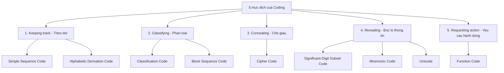
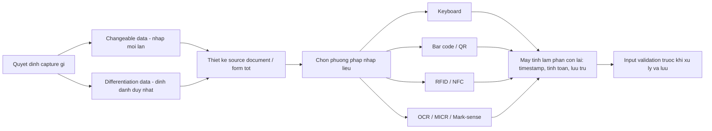
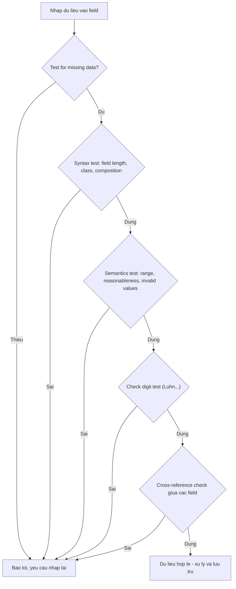

# Chương 15 — Designing Accurate Data Entry Procedures (Thiết kế quy trình nhập liệu chính xác)

> Kendall & Kendall — *Systems Analysis and Design*, 11th edition, Part V: Quality Assurance and Implementation (trang 473–498).

---

## 🎯 Mục tiêu học tập

Sau khi học xong chương này, bạn có thể:

1. **Hiểu và áp dụng effective coding (mã hóa hiệu quả)** — biết 5 mục đích của việc đặt mã và các loại mã tương ứng (simple sequence, alphabetic derivation, classification, block sequence, cipher, significant-digit subset, mnemonic, function code, Unicode).
2. **Nắm 8 nguyên tắc chung khi thiết kế hệ thống mã** (concise, stable, unique, sortable, tránh nhầm lẫn, uniform, cho phép mở rộng, meaningful).
3. **Thiết kế data capture (thu thập dữ liệu) hiệu quả và hiệu suất** — quyết định dữ liệu nào cần nhập, dữ liệu nào để máy tính tự xử lý; chọn phương pháp nhập liệu phù hợp (keyboard, bar code, QR code, RFID, NFC, OCR, MICR, mark-sense form).
4. **Đảm bảo chất lượng dữ liệu qua input validation** — kiểm tra giao dịch đầu vào (input transactions) và dữ liệu đầu vào (input data) với 8 loại test, bao gồm check digit và công thức Luhn.
5. **Hiểu quy trình validation** (thứ tự kiểm tra) và **regular expression** (biểu thức chính quy) để kiểm tra mẫu dữ liệu.
6. **Nhận biết lợi thế về độ chính xác dữ liệu trong môi trường ecommerce** (khách tự nhập, lưu trữ tái sử dụng, dùng xuyên suốt order fulfillment, phản hồi cho khách).

> Ghi chú: chất lượng của **output** phụ thuộc trực tiếp vào chất lượng của **input** — "garbage in, garbage out". Chương này là mắt xích "đảm bảo chất lượng đầu vào" trong Part V (Quality Assurance).

---

## 📖 Tóm tắt & giải thích kiến thức

### 1. EFFECTIVE CODING (Mã hóa hiệu quả)

**Coding** (không nhầm với program coding/lập trình) là quá trình đưa dữ liệu mơ hồ hoặc cồng kềnh về dạng **chuỗi chữ số hoặc chữ cái ngắn, dễ nhập**.

Lợi ích của coding:
- **Hiệu suất (efficiency):** dữ liệu đã mã hóa nhập nhanh hơn, ít mục phải gõ hơn → ít lỗi hơn.
- **Sắp xếp (sorting):** hỗ trợ phân loại dữ liệu ở các bước xử lý sau.
- **Tiết kiệm bộ nhớ và không gian lưu trữ.**
- Coding là cách "súc tích mà vẫn đầy đủ ý" khi thu thập dữ liệu.

**5 mục đích (human purposes) của coding:**

1. **Keeping track of something** — theo dõi/định danh một đối tượng.
2. **Classifying information** — phân loại thông tin.
3. **Concealing information** — che giấu thông tin.
4. **Revealing information** — bộc lộ thông tin.
5. **Requesting appropriate action** — yêu cầu hành động thích hợp.



#### 1.1. Keeping Track of Something (Theo dõi đối tượng)

Đôi khi chỉ cần **định danh** một người/nơi chốn/vật để theo dõi (ví dụ: xưởng sản xuất nội thất đặt số job cho đơn hàng — công nhân không cần biết khách hàng là ai, chỉ cần số job).

**a) Simple Sequence Code (Mã tuần tự đơn giản)**
- Là con số gán tuần tự cho đối tượng, **không có quan hệ gì với bản thân dữ liệu**.
- Ví dụ (Figure 15.1): đơn hàng xưởng nội thất — nhập "5676" thay vì "ghế bập bênh nâu đen tre cho Feng Xu"; đơn tiếp theo 5677, 5678, 5679...
- **Ưu điểm so với số ngẫu nhiên:** (1) loại bỏ khả năng gán trùng số; (2) cho biết **xấp xỉ thời điểm** đơn hàng được nhận.
- **Khi nào dùng:** khi thứ tự xử lý cần biết trình tự vào hệ thống — ví dụ ngân hàng cho vay ưu đãi theo nguyên tắc "first-come, first-served" thì mã tuần tự cho từng người nộp đơn rất quan trọng.

**b) Alphabetic Derivation Code (Mã dẫn xuất chữ cái)**
- Dùng khi **không muốn** dùng mã tuần tự: (1) không muốn người khác đọc mã đoán ra đã cấp bao nhiêu số; (2) cần mã phức tạp hơn để tránh lỗi tốn kém (gõ nhầm account 223 thành 224 khi chỉ sai 1 chữ số).
- Mã được **dẫn xuất từ chính dữ liệu**. Ví dụ kinh điển (Figure 15.2) — nhãn gửi tạp chí Mỹ, format `99999XXX9999XXX`:

  | Thành phần | Ví dụ | Ý nghĩa |
  |---|---|---|
  | 5 số đầu | `68506` | 5 chữ số đầu của zip code |
  | 3 chữ | `KND` | 3 phụ âm đầu trong họ (last name) |
  | 4 số | `7533` | 4 chữ số địa chỉ đường |
  | 3 chữ cuối | `ECO` | Mã viết tắt của tạp chí |

  → Mã đầy đủ: `68506KND7533ECO`.
- **Mục đích chính:** định danh tài khoản. **Mục đích phụ:** in nhãn gửi thư — vì zip code đứng đầu khóa chính nên file đã sẵn thứ tự zip cho bulk mailing, **không cần sort lại**.
- Ngày hết hạn (expiration date) **không** nằm trong mã vì nó thay đổi thường xuyên (→ nguyên tắc "stable").
- **Nhược điểm:** (1) tên quá ngắn/ít phụ âm (tên "Roe" chỉ có 1 phụ âm → phải chế thành `RXX`); (2) dữ liệu nguồn có thể thay đổi (đổi tên, đổi địa chỉ → **đổi luôn khóa chính** của file).

#### 1.2. Classifying Information (Phân loại thông tin)

Phân loại giúp phân biệt các **nhóm (class)** đối tượng: ví dụ gói bảo hiểm y tế nhân viên, hoặc sinh viên đã hoàn thành môn cốt lõi hay chưa.

- **Điều kiện bắt buộc: các lớp phải mutually exclusive (loại trừ lẫn nhau).** Ví dụ: sinh viên năm nhất F = 0–36 tín chỉ thì không được đồng thời xếp là sophomore S. Nếu các lớp chồng lấn (F = 0–36, S = 32–64...) → dữ liệu mơ hồ, khó diễn giải.

**a) Classification Code (Mã phân loại)**
- Dùng để phân biệt một nhóm dữ liệu có đặc tính riêng với nhóm khác; có thể là **1 chữ cái hoặc 1 chữ số**; là cách "tốc ký" mô tả người/nơi/vật/sự kiện.
- Thường được liệt kê trong manual hoặc dán ở nơi dễ tra; người dùng quen sẽ thuộc lòng.
- Ví dụ (Figure 15.3): mã hóa các khoản khấu trừ thuế bằng chữ cái đầu: **I** = Interest payments, **M** = Medical, **T** = Taxes, **C** = Contributions, **D** = Dues, **S** = Supplies.
- **Vấn đề (Figure 15.4):** khi thêm mục mới trùng chữ cái đầu (Subscriptions, Computer, Insurance) phải "ép" mã: **B** = suBscriptions, **P** = comPuter, **N** = iNsurance → rối, xa lý tưởng. Cách khắc phục: dùng mã dài hơn 1 ký tự (xem Mnemonic Codes).
- Pull-down menu trong GUI cũng dùng classification code làm shortcut (ví dụ **Alt-F** cho menu File).

**b) Block Sequence Code (Mã tuần tự theo khối)**
- Là **mở rộng của sequence code**: chia dải số thành các **khối (block)** theo nhóm đặc tính chung, trong mỗi khối gán số tuần tự tiếp theo còn trống.
- Ví dụ (Figure 15.5) — mã phần mềm:

  | Khối | Loại | Ví dụ |
  |---|---|---|
  | 100–199 | Browser | 100 Apple Safari, 101 Mozilla Firefox, 102 Microsoft Edge, 103 Google Chrome |
  | 200–299 | Database | 200 Microsoft Access, 201 MySQL, 202 Oracle |
  | 300–399 | Web design | 300 Adobe Dreamweaver, 301 Webflow, 302 BlueGriffon |

- **Ưu điểm:** dữ liệu vừa được nhóm theo đặc tính chung, vừa giữ được sự đơn giản của việc "gán số kế tiếp" (trong phạm vi khối).

#### 1.3. Concealing Information (Che giấu thông tin)

Dùng mã để **giấu thông tin** không muốn người khác biết:
- Công ty không muốn nhân viên nhập liệu đọc được hồ sơ nhân sự.
- Cửa hàng muốn nhân viên bán biết **giá sỉ** (để biết mức thương lượng thấp nhất) nhưng mã hóa trên tem giá để khách không biết.
- Nhà hàng thu thập đánh giá dịch vụ mà không lộ tên người phục vụ.
- Bối cảnh hiện đại: cho vendor/khách truy cập database trực tiếp, giao dịch qua internet → cần **encryption schemes** (mã hóa) chặt chẽ. (Video mở chương nói về **cryptography** — khoa học tạo và phá mã; mục đích của cryptography chính là che giấu thông tin.)

**Cipher Code (Mã thay thế)**
- Cách mã hóa **đơn giản nhất**: thay trực tiếp chữ này bằng chữ khác, số này bằng số khác, hoặc chữ thay cho số (giống trò chơi **cryptogram**).
- Ví dụ (Figure 15.6) — cửa hàng bách hóa ở Buffalo, New York mã hóa giá giảm (markdown price) bằng cụm từ khóa **BLEACH MIND**:

  | B | L | E | A | C | H | M | I | N | D |
  |---|---|---|---|---|---|---|---|---|---|
  | 1 | 2 | 3 | 4 | 5 | 6 | 7 | 8 | 9 | 0 |

  Giá niêm yết $25.00, tem ghi mã **BIMC** → giải mã từng chữ: B=1, I=8, M=7, C=5 → **$18.75** là giá giảm. Không ai nhớ vì sao chọn cụm từ đó, nhưng mọi nhân viên đều thuộc → cipher code thành công.

#### 1.4. Revealing Information (Bộc lộ thông tin)

Đôi khi cần **bộc lộ** thông tin cho nhóm người dùng cụ thể qua mã: ví dụ tem giá quần áo in kèm phòng ban, sản phẩm, màu, size → giúp nhân viên bán hàng và thủ kho xác định vị trí hàng. Lý do thứ hai: làm việc nhập liệu **có ý nghĩa hơn** với con người → nhập chính xác hơn.

**a) Significant-Digit Subset Code (Mã tập con chữ số có nghĩa)**
- Dùng khi có thể mô tả sản phẩm qua **tư cách thành viên trong nhiều nhóm con**: mã trông như một số dài nhưng thực ra gồm nhiều số nhỏ, mỗi phần có nghĩa riêng.
- Ví dụ (Figure 15.7) — tem giá cửa hàng quần áo:

  | Mã | Department (3 số) | Product (3 số) | Color (2 số) | Size (2 số) |
  |---|---|---|---|---|
  | `2023954010` | 202 = Maternity | 395 = Dress style 395 | 40 = Red | 10 = Size 10 |
  | `4142191912` | 414 = Winter Coats | 219 = Coat style 219 | 19 = Beige | 12 = Size 12 |

- Các phần có thể **mô tả thật** (số 10 nghĩa là size 10) hoặc **gán tùy ý** (202 được quy ước là phòng đồ bầu).
- **Ưu điểm:** dễ **định vị các mặt hàng thuộc cùng nhóm/lớp** — ví dụ muốn giảm giá toàn bộ hàng mùa đông, nhân viên chỉ cần tìm các mặt hàng thuộc department 310–449 (khối mã chỉ "winter").

**b) Mnemonic Code (Mã gợi nhớ)**
- **Mnemonic** = công cụ hỗ trợ trí nhớ con người. Bất kỳ mã nào giúp người nhập liệu nhớ cách nhập hoặc người dùng nhớ cách dùng thông tin đều là mnemonic code. Kết hợp chữ và ký hiệu → mã dễ nhìn, dễ hiểu.
- Ví dụ (Figure 15.8) — mã bệnh viện của Buffalo Regional Blood Center: **BGH** = Buffalo General Hospital, **ROS** = Roswell Park, **KEN** = Kenmore Mercy, **DEA** = Deaconess, **SIS** = Sisters of Charity, **STF** = Saint Francis, **STJ** = Saint Joseph's, **OLV** = Our Lady of Victory. Mã dễ nhớ, dễ gợi lại → **giảm khả năng chuyển máu nhầm bệnh viện**.

**c) Unicode**
- Mã cho phép hiển thị/nhập các ký tự ngoài bàn phím phương Tây (Latin). Nhiều ngôn ngữ (Hy Lạp, Nhật, Trung, Do Thái) dùng glyph/ký hiệu âm tiết/từ.
- **Unicode character set** do Tổ chức Tiêu chuẩn hóa Quốc tế (ISO) định nghĩa, chứa mọi ký hiệu ngôn ngữ chuẩn, có chỗ cho **65.535 ký tự**.
- Glyph biểu diễn dạng `&#xnnnn;` trong đó `x` chỉ **hexadecimal (hệ 16)**. Ví dụ `&#x30B3;` là ký tự Katakana "ko"; từ "konichiwa" (xin chào tiếng Nhật) = `&#x3053;&#x306B;&#x3061;&#x308F;`.
- Ký tự Unicode nhóm theo ngôn ngữ, tra tại www.unicode.org; hiển thị web bảng chữ khác bằng cách tải input method editor (Microsoft).

#### 1.5. Requesting Appropriate Action (Yêu cầu hành động thích hợp)

**Function Code (Mã chức năng)**
- Chỉ thị cho **máy tính hoặc người ra quyết định** biết cần làm gì; thường ở dạng sequence hoặc mnemonic code; là mã số/chữ-số ngắn diễn đạt chính xác hoạt động cần thực hiện.
- Ví dụ (Figure 15.9) — cập nhật tồn kho ngành sữa: **1** = Delivered, **2** = Sold, **3** = Spoiled (hỏng), **4** = Lost or Stolen, **5** = Returned, **6** = Transferred Out, **7** = Transferred In, **8** = Journal Entry (Add), **9** = Journal Entry (Subtract). Một thùng sữa chua bị hỏng → nhập mã **3**.
- Dữ liệu cần nhập **phụ thuộc chức năng**: update record chỉ cần record key + function code, nhưng thêm record mới cần nhập toàn bộ data elements + function code.

#### 1.6. Bảng tổng hợp các loại mã

| Loại mã | Mục đích | Bản chất | Ví dụ | Ưu điểm | Nhược điểm/Lưu ý |
|---|---|---|---|---|---|
| **Simple sequence code** | Keeping track | Số gán tuần tự, không liên quan dữ liệu | Order #5676, 5677... | Không trùng số; biết xấp xỉ thời điểm nhập | Lộ số lượng đã cấp; không mô tả gì |
| **Alphabetic derivation code** | Keeping track | Dẫn xuất từ chính dữ liệu (zip + phụ âm tên + số nhà...) | `68506KND7533ECO` | Định danh account; hỗ trợ in nhãn (đã sort theo zip) | Tên ít phụ âm; dữ liệu nguồn đổi → khóa chính đổi |
| **Classification code** | Classifying | 1 chữ/số đại diện 1 lớp | I = Interest, M = Medical | Ngắn gọn, dễ thuộc | Trùng chữ cái đầu → phải "ép" mã; lớp phải mutually exclusive |
| **Block sequence code** | Classifying | Sequence code chia theo khối/dải | 100–199 Browser, 200–299 Database | Vừa nhóm theo đặc tính vừa đơn giản gán số kế tiếp | Phải dự trù kích thước khối |
| **Cipher code** | Concealing | Thay thế trực tiếp ký tự | BLEACH MIND: BIMC = $18.75 | Đơn giản nhất để giấu thông tin | Ai biết khóa là giải được |
| **Significant-digit subset code** | Revealing | Mã dài gồm nhiều nhóm con có nghĩa | `202-395-40-10` (dept-product-color-size) | Định vị hàng theo nhóm; mô tả sản phẩm | Dài; cần key giải nghĩa |
| **Mnemonic code** | Revealing | Kết hợp chữ/ký hiệu gợi nhớ | BGH = Buffalo General Hospital | Dễ nhớ, giảm lỗi nhập | Phải chọn viết tắt nhất quán, không đổi |
| **Unicode** | Revealing (ký tự) | Bộ ký tự chuẩn quốc tế, hex `&#xnnnn;` | `&#x30B3;` = Katakana "ko" | Nhập/hiển thị mọi ngôn ngữ | Cần input method editor |
| **Function code** | Requesting action | Số/chữ-số ngắn chỉ hành động | 3 = Spoiled | Gọn, chuẩn hóa thao tác | Dữ liệu nhập kèm tùy chức năng |

#### 1.7. General Guidelines for Coding (8 nguyên tắc thiết lập hệ thống mã — Figure 15.10)

1. **Be Concise (Ngắn gọn):** mã dài → nhiều phím gõ → nhiều lỗi, tốn bộ nhớ. Nếu buộc phải dài, **chia thành subcode** bằng dấu gạch: `5678923453127` → `5678-923-453-127` (con người xử lý thông tin theo "chunk" ngắn). *Ngoại lệ có chủ đích:* số thẻ tín dụng dài (Visa/MasterCard 16 số ≈ 9 nghìn tỷ khách) và **không cấp tuần tự** để chống đoán số thẻ.
2. **Keep the Codes Stable (Ổn định):** mã định danh khách hàng không được đổi mỗi lần có dữ liệu mới (vì vậy expiration date không nằm trong mã subscriber). Không sửa các chữ viết tắt trong hệ mnemonic — đổi sẽ làm nhân viên nhập liệu cực khó thích nghi.
3. **Ensure that Codes Are Unique (Duy nhất):** ghi chú tất cả mã đã dùng để không gán trùng số/tên cho các mục khác nhau; mã là thành phần thiết yếu của **data dictionary** (Chương 8).
4. **Allow Codes to be Sortable (Sắp xếp được):** ví dụ sort text các tháng tiếng Anh sẽ sai thứ tự (January, July, June). Sort `MMM-DD-YYYY` hay `MM-DD-YYYY` đều sai; `YY-MM-DD` gây **lỗi Y2K** (00 đứng trước 97); đúng phải là **`YYYY-MM-DD`** (Figure 15.11). Mã **số dễ sort hơn chữ-số** → nên chuyển sang numeric khi khả thi.
5. **Avoid Confusing Codes (Tránh ký tự dễ nhầm):** O (chữ) vs 0 (số), I vs 1, Z vs 2 → mã như `B1C`, `280Z` là không đạt. Ví dụ Canadian Postal Code `X9X 9X9` (Figure 15.12): người nước ngoài khó phân biệt Z/2, S/5, O/0, l/1 (viết tay `T3A ZE5` thực ra là `T3A 2E5`; `LOS 1JO` thực ra là `L0S 1J0`).
6. **Keep the Codes Uniform (Đồng nhất):** mã dùng chung phải theo cùng form — `BUF-234` (3 chữ + 3 số) đi cùng `KU-3456` (2 chữ + 4 số) là kém. Ngày tháng: không dùng `MMDDYYYY` ở app này, `YYYYDDMM` ở app kia, `MMDDYY` ở app thứ ba — đồng nhất **giữa các** chương trình lẫn **trong từng** chương trình.
7. **Allow for Modification of Codes (Cho phép sửa đổi/mở rộng):** hệ thống tiến hóa theo thời gian — số khách tăng, khách đổi tên, nhà cung cấp đổi cách đánh số. Analyst phải **dự báo thay đổi** và thiết kế mã đáp ứng nhu cầu tương lai.
8. **Make Codes Meaningful (Có ý nghĩa):** trừ khi cố ý giấu thông tin, mã nên có nghĩa với người dùng — dễ hiểu, dễ làm việc, dễ nhớ; việc nhập liệu bớt nhàm chán so với gõ chuỗi số vô nghĩa.

**Using Codes (Cách dùng mã trong hệ thống):**
- Trong **validation programs**: input được so với danh sách mã hợp lệ.
- Trong **report/inquiry programs**: mã lưu trong file được **chuyển thành nghĩa** của mã — báo cáo/màn hình **không nên hiển thị mã thô** (kẻo user phải thuộc lòng hoặc tra manual).
- Trong **GUI**: mã dùng để tạo **drop-down list**.

---

### 2. EFFECTIVE AND EFFICIENT DATA CAPTURE (Thu thập dữ liệu hiệu quả và hiệu suất)

Data capture là điểm mang lại **năng suất lớn** trong xử lý thông tin: từ keypunching chậm, nhiều lỗi → OCR, bar code, point-of-sale terminals.

#### 2.1. Deciding What to Capture (Quyết định thu thập gì)

- Quyết định này **đi trước** tương tác của user với hệ thống ("garbage in, garbage out"); do analyst và user cùng quyết; việc capture — input — store — retrieve đều **tốn kém**.
- **Hai loại dữ liệu cần nhập:**
  1. **Changeable data (dữ liệu thay đổi):** biến động theo từng giao dịch — ví dụ **số lượng** văn phòng phẩm mỗi lần công ty quảng cáo đặt hàng (phụ thuộc số nhân viên, số account đang phục vụ) → phải nhập mỗi lần.
  2. **Differentiation data (dữ liệu phân biệt):** phân biệt gọn đối tượng đang xử lý với mọi đối tượng khác — ví dụ hồ sơ bệnh nhân gồm **số Social Security + 3 chữ cái đầu của họ** → định danh duy nhất bệnh nhân.

#### 2.2. Letting the Computer Do the Rest (Để máy tính làm phần còn lại)

- Tận dụng thế mạnh máy tính: **không bắt** operator nhập lại mô tả mặt hàng mỗi đơn — máy lưu và truy xuất được.
- Máy tính tự động hóa **các tác vụ lặp lại**: (1) **ghi thời gian giao dịch**; (2) **tính giá trị mới từ input**; (3) **lưu trữ và truy xuất dữ liệu theo yêu cầu**. → tránh nhập liệu thừa, giảm lỗi và nhàm chán, để con người tập trung việc sáng tạo. Ví dụ: ngày hôm nay có thể lấy từ đồng hồ hệ thống và dùng cho cả phiên nhập liệu.
- Ví dụ "nhập một lần dùng mãi": **OCLC (Online Computer Library Center)** — mỗi đầu sách chỉ cần catalog **một lần duy nhất**, thông tin vào database khổng lồ chia sẻ cho hàng nghìn thư viện Mỹ → tiết kiệm khổng lồ thời gian nhập liệu.
- Tận dụng **năng lực tính toán**: chương trình frequent-flyer — operator chỉ nhập số hiệu chuyến bay + số tài khoản; máy tự tính dặm bay, cộng dồn, cập nhật, thậm chí **flag** tài khoản đủ điều kiện nhận thưởng.
- Trong hệ GUI, mã lưu dưới dạng **function** hoặc **bảng riêng** trong database: mã **ổn định, hiếm đổi** → lưu như database function; mã **đổi thường xuyên** → lưu trong bảng để dễ cập nhật. (Trade-off: quá nhiều bảng → phải join nhiều → truy cập chậm.) Figure 15.13: drop-down list hiển thị **cả mã lẫn nghĩa của mã** nhưng chỉ lưu mã → user không phải đoán nghĩa, không thể gõ mã sai.

#### 2.3. Avoiding Bottlenecks and Extra Steps (Tránh nghẽn cổ chai và bước thừa)

- **Bottleneck (nghẽn cổ chai):** dữ liệu đổ nhanh vào "miệng rộng" của hệ thống nhưng bị chậm lại ở "cổ chai" do năng lực xử lý không đủ so với khối lượng/độ chi tiết dữ liệu. Khắc phục: đảm bảo **đủ capacity** xử lý dữ liệu nhập vào.
- **Càng ít bước nhập liệu → càng ít cơ hội phát sinh lỗi** (và tiết kiệm công lao động, giữ chất lượng dữ liệu). Cách tránh bước thừa được xác định lúc phân tích **và** khi user tương tác với prototype. Ví dụ tốt: hệ online real-time thu thập dữ liệu khách mà **không cần điền form**.

#### 2.4. Starting with a Good Form (Bắt đầu từ form tốt)

- Operator nhập từ **source document** (thường là form) — nguồn của phần lớn dữ liệu hệ thống. Hệ online/bar code có thể bỏ qua source document, nhưng thường vẫn sinh ra giấy tờ (như receipt).
- Form hiệu quả: **không** bắt nhập lại thông tin máy đã lưu, hoặc dữ liệu máy tự xác định được (thời gian, ngày nhập). (Chi tiết thiết kế form: Chương 12.)

#### 2.5. Choosing a Data-Entry Method (Chọn phương pháp nhập liệu)

Tiêu chí chọn: nhu cầu **tốc độ, độ chính xác, đào tạo user**; **chi phí** (thiên về vật tư hay nhân công); phương pháp **đang dùng** trong tổ chức.

| Phương pháp | Đặc điểm chính | Ưu điểm | Nhược điểm |
|---|---|---|---|
| **Keyboards** | Cũ nhất, quen thuộc nhất | Function keys, phím macro giảm keystroke, bàn phím ergonomic, hồng ngoại/Bluetooth | Chậm, phụ thuộc con người, dễ lỗi gõ |
| **Bar codes (1D)** | "Metacode — mã của mã"; trên nhãn sản phẩm, vòng tay bệnh nhân | Cực chính xác; chứa mã NSX, mã sản phẩm, **check digit**, mã đầu/cuối scan; camera điện thoại đọc được UPC | Cần in nhãn; tuyến tính chiếm chỗ |
| **2D bar codes / QR codes** | Ma trận 2 chiều, >30 phiên bản; QR do DENSO WAVE (công ty con Toyota) tạo 1994, **miễn phí** (không thực thi bản quyền), nhận diện bằng 3 ô vuông lồng nhau ở 3 góc | Nhỏ gọn hơn 1D, rẻ hơn RFID, in được; ai cũng có smartphone đọc; tạo dễ bằng web creator/app; dẫn tới web, email/SMS/gọi điện, coupon, video, thẻ transit (Figure 15.15); ví dụ Rutgers Law School dùng QR cho sự kiện, đặt phòng học | Dễ bị **dán đè/can thiệp**; nguy cơ **QR độc hại** dẫn tới website xấu — designer phải cảnh giác |
| **RFID** | Thu thập dữ liệu **tự động** qua tần số radio; tag/transponder = chip + antenna; còn gọi proximity card | **Passive tag**: không nguồn riêng, <5 cent, cỡ tem thư (Walmart, Target — quản lý tồn kho, chuỗi cung ứng, có thể đẩy dữ liệu lên blockchain). **Active tag**: có nguồn riêng, tin cậy hơn, vài USD (Bộ Quốc phòng Mỹ). Ứng dụng: thẻ thu phí đường bộ (reader vừa đọc vừa ghi số dư), Moscow Metro smartcard 1998, truy vết gia súc (bệnh bò điên), hành lý hàng không, dược phẩm, bệnh nhân/tù nhân; không cần scan — đi qua vùng đọc là được; chống trộm | **Privacy** gây tranh cãi: người trả tiền hàng gắn tag bằng thẻ tín dụng có thể bị định danh — analyst phải cân nhắc quyền của user |
| **NFC (Near Field Communication)** | Xây trên nền RFID, giao tiếp **2 chiều** | Thanh toán không chạm (Google Pay, Apple Watch/iPhone chạm POS), thanh toán giao thông, trao đổi lịch/bản đồ/coupon/danh thiếp; **an toàn** nhờ tầm ngắn + nhiều lớp bảo mật | Cần thiết bị hỗ trợ |
| **OCR (Optical Character Recognition)** | Đọc input viết tay/in từ source document bằng máy quét quang | Nhanh hơn keying **60–90%**; bỏ bước encode/key; ít yêu cầu kỹ năng/đào tạo → ít lỗi; phân quyền chất lượng dữ liệu về đơn vị sinh ra nó; chuyển **fax** thành tài liệu chỉnh sửa được | — |
| **MICR (Magnetic Ink Character Recognition)** | Đọc 1 dòng ký tự in bằng mực chứa hạt từ tính (đáy séc ngân hàng, một số hóa đơn thẻ) | (1) tin cậy, tốc độ cao, **không nhận nhầm vết bẩn** (vì không nhiễm từ); (2) biện pháp an ninh chống séc giả; (3) người nhập **nhìn thấy được** số để đối chiếu | Phạm vi dùng hẹp |
| **Mark-sense forms** | Scanner cảm nhận **vị trí đánh dấu** trên form đặc biệt (chấm thi trắc nghiệm, khảo sát — Figure 15.16) | Đào tạo ít; xử lý khối lượng lớn rất nhanh | Chỉ biết "có dấu", **không diễn giải** dấu như OCR; vết bẩn thành dữ liệu sai; lựa chọn giới hạn trong đáp án in sẵn; khó thu chữ-số (tốn chỗ); người điền dễ tô nhầm ô |



---

### 3. ENSURING DATA QUALITY THROUGH INPUT VALIDATION (Đảm bảo chất lượng dữ liệu qua kiểm tra đầu vào)

Capture tốt + thiết bị nhập tốt là **cần nhưng chưa đủ**. Lỗi không thể loại trừ hoàn toàn → phải **bắt lỗi lúc input, trước khi xử lý và lưu trữ**. Lỗi đầu vào không bị phát hiện lâu ngày sẽ **rất tốn kém và mất thời gian** sửa. Analyst phải **giả định lỗi chắc chắn xảy ra** và cùng user thiết kế **input validation tests**; không thể lường hết mọi thứ, nhưng phải phủ được các loại lỗi gây phần lớn vấn đề (Figure 15.17).

#### 3.1. Validating Input Transactions (Kiểm tra giao dịch đầu vào)

Chủ yếu làm bằng phần mềm (trách nhiệm programmer), nhưng analyst phải biết các vấn đề phổ biến. **3 vấn đề chính:**

1. **Submitting the wrong data (nộp sai dữ liệu):** ví dụ nhập số Social Security của **bệnh nhân** vào hệ thống **payroll** của bệnh viện — thường là lỗi vô ý, phải được flag trước khi xử lý.
2. **An unauthorized person submitting data (người không có thẩm quyền nộp dữ liệu):** dữ liệu đúng nhưng người nộp sai thẩm quyền — ví dụ chỉ dược sĩ giám sát mới được nhập tổng tồn kho **chất kiểm soát đặc biệt**; áp dụng cho payroll, hồ sơ đánh giá nhân viên (lương/thăng chức/kỷ luật), bí mật thương mại, dữ liệu mật quốc phòng.
3. **Asking the system to perform an unacceptable function (yêu cầu chức năng không chấp nhận được):** ví dụ HR manager **update** hồ sơ nhân viên hiện hữu là hợp lệ, nhưng yêu cầu **tạo file mới** thay vì update là không hợp lệ.

#### 3.2. Validating Input Data (Kiểm tra dữ liệu đầu vào) — 8 loại test

1. **Test for missing data (kiểm tra thiếu dữ liệu):** có mục nào bị bỏ trống không? Có tình huống **mọi** mục đều bắt buộc (file Social Security trả trợ cấp phải có SSN của người nhận); record phải có **key data** + **function code**. Analyst làm việc với user để xác định mục nào thiết yếu, mục nào cho phép trống (dòng địa chỉ 2, chữ lót...).
2. **Test for correct field length (kiểm tra độ dài trường):** input đúng độ dài của field chưa? Ví dụ trạm thời tiết Omaha báo mã thành phố 2 chữ `OM` thay vì mã quốc gia 3 chữ `OMA` → invalid, không xử lý.
3. **Test for class or composition (kiểm tra lớp/thành phần):** field chỉ chứa số thì không được có chữ và ngược lại — ví dụ số thẻ American Express không được chứa chữ cái.
4. **Test for range or reasonableness (kiểm tra khoảng/tính hợp lý):** dữ liệu có nằm trong khoảng chấp nhận hoặc hợp lý theo tham số định trước không?
   - **Range:** ngày giao hàng không được là ngày **32 tháng 10** hay tháng **13** (khoảng hợp lệ 1–31 và 1–12).
   - **Reasonableness:** nhân viên mới **120 tuổi** là không hợp lý. Dùng cho dữ liệu **liên tục (continuous)** — có thể đặt cận dưới, cận trên, hoặc cả hai.
5. **Test for invalid values (kiểm tra giá trị không hợp lệ):** hiệu quả khi chỉ có **ít giá trị hợp lệ** — ví dụ công ty môi giới chỉ có 3 lớp tài khoản: 1 = active, 2 = inactive, 3 = closed; gán lớp khác là invalid. Dùng cho dữ liệu **rời rạc (discrete)**. Nếu nhiều giá trị → lưu trong **bảng mã (table of codes file)** để dễ thêm/sửa.
6. **Cross-reference checks (kiểm tra tham chiếu chéo):** khi một phần tử **có quan hệ** với phần tử khác. Điều kiện: **từng field phải tự đúng trước** — ví dụ giá bán phải > giá vốn (cả hai phải được nhập, là số, > 0 rồi mới so sánh). **Geographical check** là một dạng: mã bang (state) đối chiếu với 2 chữ số đầu của zip code.
7. **Test for comparison with stored data (so sánh với dữ liệu đã lưu):** ví dụ part number mới nhập được so với toàn bộ danh mục tồn kho để chắc rằng số tồn tại và được nhập đúng.
8. **Self-validating codes / Check digits (mã tự kiểm tra / chữ số kiểm tra):** nhúng **check digit** vào chính mã, đặc biệt cho identification numbers. Hai loại lỗi gõ phổ biến:
   - **Miskeying 1 chữ số:** gõ `54411` thay vì `53411`.
   - **Transposed digits (đảo vị trí):** `53411` gõ thành `54311` do bấm 2 phím ngược thứ tự — loại lỗi **con người rất khó tự phát hiện**.

   **Quy trình tạo check digit:** lấy mã số gốc → **nhân từng chữ số với trọng số (weights)** định trước → **cộng** các kết quả → **chia cho modulus number** (để rút về 1 chữ số) → **lấy modulus trừ đi số dư** = check digit → **gắn** check digit vào mã gốc. Công thức nổi tiếng: **Luhn formula** (thập niên 1960), được các công ty thẻ tín dụng sử dụng.

#### 3.3. Verifying Credit Cards (Xác minh thẻ tín dụng)

Các lớp kiểm tra khi nhập thẻ vào website/chương trình:
1. **Độ dài số thẻ:** mỗi hãng khác nhau — Visa **16** số, American Express **15** số.
2. **Khớp hãng thẻ và ngân hàng:** 4 số đầu thường chỉ **loại thẻ**; các số giữa đại diện **ngân hàng và khách hàng**; số cuối là **check digit**.
3. **Luhn formula.** Ví dụ trong sách với số `7-7-7-8-8-8` (5 số đầu là số tài khoản ngân hàng, số cuối là check digit):
   - **Bước 1:** Nhân đôi chữ số **kế cuối**, rồi cách 1 số nhân đôi 1 số (đi ngược): `7-7-7-8-8-8` → `14-7-14-8-16-8`.
   - **Bước 2:** Kết quả ≥ 10 thì cộng 2 chữ số lại: 14 → 1+4 = **5**; 16 → 1+6 = **7**. Được số mới `5-7-5-8-7-8`.
   - **Bước 3:** Cộng tất cả: 5+7+5+8+7+8 = **40**.
   - **Bước 4:** Tổng **tận cùng bằng 0** → số **hợp lệ** theo Luhn.
   - Ví dụ khác: `1334-1334-1334-1334` → biến đổi thành `2364-2364-2364-2364`, tổng = **60** (tận cùng 0) → hợp lệ. Gõ sai **1** chữ số → tổng không còn chia hết cho 10 → bị phát hiện.
   - **Hạn chế:** Luhn **không bắt được mọi lỗi** — sai **nhiều hơn 1 chữ số** có thể lọt: `1334-1334-1334-3314` (đảo chữ số kế cuối và thứ 4 từ cuối) → biến đổi `2364-2364-2364-6324` vẫn tổng 60 → lỗi đảo vị này **không bị phát hiện**.
4. Bổ sung: **expiration date** và **mã xác minh 3–4 số** (CVV) mặt sau thẻ.

> Kết luận của tác giả: analyst phải **luôn giả định lỗi con người nhiều khả năng xảy ra**, hiểu lỗi nào làm dữ liệu invalid và dùng máy tính chặn chúng.

#### 3.4. The Process of Validation (Quy trình validation)

Validate **từng field** đến khi hợp lệ hoặc phát hiện lỗi. **Thứ tự kiểm tra:**
1. **Missing data** (thiếu dữ liệu) trước tiên.
2. **Syntax test** (cú pháp): độ dài field, class & composition.
3. Chỉ khi cú pháp đúng mới kiểm tra **semantics** (ngữ nghĩa): range / reasonableness / value test, rồi đến **check digit test**.
4. Sau khi từng field đơn lẻ đã đúng → **cross-reference checks** (nếu 1 field sai thì cross-reference **vô nghĩa, không thực hiện**). Ví dụ đặc biệt: **29 tháng 2 chỉ hợp lệ năm nhuận** — tính hợp lệ của ngày phụ thuộc năm.



**Hỗ trợ từ GUI:** radio button (nên set 1 default, chỉ bỏ chọn bằng cách chọn nút khác), check box, drop-down list (lựa chọn đầu nên là thông báo "hãy chọn..."; nếu submit mà vẫn ở lựa chọn đầu → báo user chọn lại) → giảm lỗi nhập của con người.

**Cách cài đặt:** thường là chuỗi `IF...ELSE`; hoặc **pattern validation** — mẫu có trong thiết kế database (Microsoft Access) hoặc ngôn ngữ lập trình (Perl, JavaScript, XML schema). Các mẫu gọi là **regular expressions (biểu thức chính quy)** — chứa ký hiệu đại diện loại dữ liệu phải có trong field.

**Bảng ký hiệu regular expression (JavaScript — Figure 15.18):**

| Ký hiệu | Ý nghĩa |
|---|---|
| `\d` | Chữ số bất kỳ 0–9 |
| `\D` | Ký tự KHÔNG phải chữ số |
| `\w` | Chữ cái, số, hoặc dấu gạch dưới |
| `\W` | Ký tự khác chữ/số/gạch dưới |
| `.` | Khớp mọi ký tự |
| `[characters]` | Khớp các ký tự trong ngoặc |
| `[char-char]` | Khớp khoảng ký tự, ví dụ `[a-z][A-Z][0-9]` nhận mọi chữ/số |
| `[^characters]` | Khớp mọi thứ TRỪ các ký tự liệt kê |
| `[^char-char]` | Khớp ngoài khoảng, ví dụ `[^a-z]` nhận mọi thứ trừ chữ thường |
| `{n}` | Đúng n lần ký tự đứng trước |
| `{n,}` | Ít nhất n lần |
| `\s` | Ký tự khoảng trắng (tab, xuống dòng...) |
| `\S` | Ký tự không phải khoảng trắng |

**Ví dụ pattern kiểm tra email:** `[A-Za-z0-9]\w{2,}@[A-Za-z0-9]{3,}\.[A-Za-z]{3}` — ký tự đầu là chữ hoa/thường/số; tiếp theo ≥ 2 ký tự chữ/số/gạch dưới; rồi `@`; ≥ 3 chữ/số; dấu chấm; đúng 3 chữ cái sau dấu chấm.

**Validate XML:** so với **DTD (document type definition)** — chỉ kiểm tra **format**; hoặc **schema** — mạnh hơn nhiều: kiểm tra **kiểu dữ liệu** (short/long integer, decimal, date), **khoảng giá trị**, **số chữ số** trước/sau dấu thập phân, **giá trị mã**. Có công cụ miễn phí để validate DTD/schema.

---

### 4. DATA ACCURACY ADVANTAGES IN ECOMMERCE ENVIRONMENTS (Lợi thế độ chính xác dữ liệu trong ecommerce)

Giao dịch ecommerce tăng độ chính xác dữ liệu nhờ **4 lý do**:

1. **Customers keying their own data (khách tự nhập dữ liệu):** khách hiểu thông tin của mình hơn ai hết — biết cách viết địa chỉ, "Drive" hay "Street", mã vùng. Truyền qua điện thoại dễ sai chính tả hơn; khách tự nhập → chính xác tăng.
2. **Storing data for later use (lưu dữ liệu dùng sau):** dữ liệu có thể lưu ngay trên máy khách; developer cần chú trọng **UX (user experience) design**. **Autocomplete/autosuggestion**: gõ vài ký tự tên → drop-down gợi ý tên đầy đủ, click là xong. Thông tin lưu trong **cookies** (file nhỏ); thẻ tín dụng/mật khẩu được **mã hóa** — website khác không đọc được; chỉ công ty đặt cookie mới truy cập được.
3. **Using data through the order fulfillment process (dùng dữ liệu xuyên suốt quá trình thực hiện đơn):** thông tin thu 1 lần dùng lại để gửi invoice, lấy hàng từ kho, giao hàng, phản hồi khách, thông báo nhà sản xuất restock, gửi catalog giấy, gửi ưu đãi email... Thay thế quy trình mua sắm giấy tờ (purchase order gửi mail/fax) → nhanh hơn, chính xác hơn (giao đúng địa chỉ), hỗ trợ **supply-chain management** tốt hơn (kiểm tra sẵn có điện tử, tự động hóa planning/scheduling/forecasting), và là điều kiện khi thiết lập **blockchain** chia sẻ + bảo mật thông tin chuỗi cung ứng.
4. **Providing feedback to customers (phản hồi cho khách):** email xác nhận đơn, cập nhật trạng thái — khách phát hiện đặt nhầm (2 quần jeans thay vì 1 trên Amazon) → sửa ngay online, tránh phải trả hàng. **Phản hồi tốt hơn → chính xác hơn.**

---

## 🔑 Bảng thuật ngữ (Keywords and Phrases)

| Thuật ngữ (Anh) | Nghĩa (Việt) |
|---|---|
| alphabetic derivation code | mã dẫn xuất chữ cái (rút từ chính dữ liệu: zip, phụ âm tên, số nhà...) |
| autocomplete feature | tính năng tự hoàn thành (gợi ý điền sẵn khi gõ vài ký tự) |
| bar code | mã vạch |
| block sequence code | mã tuần tự theo khối (chia dải số theo nhóm) |
| bottleneck | nghẽn cổ chai (điểm xử lý không đủ năng lực so với luồng dữ liệu vào) |
| changeable data | dữ liệu thay đổi (biến động theo từng giao dịch) |
| check digit | chữ số kiểm tra (nhúng trong mã để tự phát hiện lỗi nhập) |
| cipher code | mã thay thế (thay trực tiếp ký tự này bằng ký tự khác) |
| classification code | mã phân loại |
| coding | mã hóa (đưa dữ liệu cồng kềnh về chuỗi chữ/số ngắn) |
| cookies | cookie (file nhỏ lưu thông tin khách trên máy người dùng) |
| cross-reference check | kiểm tra tham chiếu chéo (giữa các field có quan hệ) |
| differentiation data | dữ liệu phân biệt (định danh duy nhất một đối tượng) |
| function code | mã chức năng (chỉ hành động máy/người phải thực hiện) |
| keyboarding | nhập liệu bằng bàn phím |
| Luhn formula | công thức Luhn (kiểm tra check digit số thẻ tín dụng) |
| magnetic ink character recognition (MICR) | nhận dạng ký tự mực từ (đáy séc ngân hàng) |
| mark-sense form | biểu mẫu cảm nhận dấu (phiếu tô trắc nghiệm) |
| mnemonic code | mã gợi nhớ (hỗ trợ trí nhớ con người) |
| near field communication (NFC) | giao tiếp trường gần (thanh toán không chạm, 2 chiều) |
| optical character recognition (OCR) | nhận dạng ký tự quang học |
| quick response (QR) code | mã QR (mã vạch 2D, 3 ô vuông định vị ở góc) |
| radio frequency identification (RFID) | định danh bằng tần số vô tuyến (tag = chip + antenna) |
| regular expression | biểu thức chính quy (mẫu kiểm tra định dạng dữ liệu) |
| self-validating code | mã tự kiểm tra (chứa check digit) |
| significant-digit subset code | mã tập con chữ số có nghĩa (mã dài gồm nhiều nhóm con có nghĩa) |
| simple sequence code | mã tuần tự đơn giản |
| supply-chain management | quản lý chuỗi cung ứng |
| test for class or composition | kiểm tra lớp/thành phần (số thuần hay chữ thuần) |
| test for comparison with stored data | kiểm tra so sánh với dữ liệu đã lưu |
| test for correct field length | kiểm tra độ dài trường |
| test for invalid values | kiểm tra giá trị không hợp lệ |
| test for missing data | kiểm tra thiếu dữ liệu |
| test for range or reasonableness | kiểm tra khoảng/tính hợp lý |
| two-dimensional bar code | mã vạch hai chiều (2D) |
| Unicode | bộ ký tự Unicode (mọi ký hiệu ngôn ngữ chuẩn, 65.535 ký tự) |
| validating input | kiểm tra tính hợp lệ đầu vào |

---

## ❓ Trả lời Review Questions

**1. Bốn mục tiêu chính của data entry là gì?**
Tương ứng 4 mảng lớn của chương: (1) **mã hóa dữ liệu hiệu quả (effective coding)**; (2) **thu thập và nhập dữ liệu hiệu quả, hiệu suất (effective and efficient data capture)** với thiết bị nhập phù hợp; (3) **đảm bảo chất lượng dữ liệu qua input validation** — chặn dữ liệu sai trước khi xử lý và lưu; (4) **tận dụng lợi thế độ chính xác trong môi trường ecommerce** (khách tự nhập, lưu tái sử dụng, dùng xuyên suốt fulfillment, phản hồi). Mục tiêu tổng quát: chất lượng output phụ thuộc chất lượng input.

**2. Liệt kê 5 mục đích chung của việc mã hóa dữ liệu.**
(1) Keeping track of something — theo dõi đối tượng; (2) Classifying information — phân loại thông tin; (3) Concealing information — che giấu thông tin; (4) Revealing information — bộc lộ thông tin; (5) Requesting appropriate action — yêu cầu hành động thích hợp.

**3. Định nghĩa simple sequence code.**
Là con số được gán tuần tự cho đối tượng cần đánh số, **không có quan hệ với bản thân dữ liệu**. Ưu điểm: không gán trùng số và cho biết xấp xỉ thời điểm mục được nhập (ví dụ order #5676, 5677...). Nên dùng khi cần biết trình tự các mục vào hệ thống (first-come, first-served).

**4. Khi nào alphabetic derivation code hữu ích?**
Khi (1) **không muốn** người khác đọc mã mà đoán được số lượng đã cấp (nhược điểm của sequence code); (2) cần mã **phức tạp hơn** để tránh lỗi tốn kém (gõ nhầm 1 số của account); (3) cần **định danh account** và hỗ trợ mục đích phụ như **in nhãn gửi thư** (zip code đứng đầu khóa chính → file sẵn thứ tự cho bulk mailing). Ví dụ: mã subscriber tạp chí `68506KND7533ECO`.

**5. Classification code đạt được điều gì?**
Phân biệt **một nhóm dữ liệu có đặc tính riêng** với các nhóm khác bằng 1 chữ cái hoặc 1 chữ số — là cách tốc ký mô tả người/nơi/vật/sự kiện (ví dụ I = interest payments trong khai thuế; Alt-F trong GUI). Điều kiện: các lớp phải **mutually exclusive**.

**6. Định nghĩa block sequence code.**
Là phần mở rộng của sequence code: chia dải số thành các **khối** theo nhóm đặc tính chung (browser 100–199, database 200–299...), trong mỗi khối gán số tuần tự kế tiếp. Ưu điểm: vừa nhóm dữ liệu theo đặc tính chung, vừa đơn giản như gán số kế tiếp.

**7. Loại mã đơn giản nhất để che giấu thông tin?**
**Cipher code** — thay thế trực tiếp chữ cho chữ, số cho số, hoặc chữ cho số (như cụm khóa BLEACH MIND mã hóa giá giảm: BIMC = $18.75).

**8. Lợi ích của significant-digit subset code?**
(1) Mô tả sản phẩm qua các nhóm con có nghĩa (department–product–color–size); (2) giúp **định vị các mặt hàng thuộc cùng nhóm/lớp** (tìm mọi mặt hàng thuộc department 310–449 = hàng mùa đông để giảm giá); (3) làm mã có nghĩa hơn với nhân viên → nhập liệu chính xác hơn.

**9. Mục đích của mnemonic code?**
Làm **công cụ hỗ trợ trí nhớ con người**: giúp người nhập liệu nhớ cách nhập, giúp user nhớ cách dùng thông tin; kết hợp chữ/ký hiệu để mã dễ nhìn, dễ hiểu (BGH = Buffalo General Hospital) → giảm lỗi (như chuyển máu nhầm bệnh viện).

**10. Định nghĩa function code.**
Là mã số hoặc chữ-số **ngắn** ghi lại chức năng mà analyst/programmer muốn máy tính (hoặc người ra quyết định) thực hiện với dữ liệu — "spelling out" chính xác hoạt động cần làm (1 = Delivered, 3 = Spoiled...). Thường ở dạng sequence hoặc mnemonic code.

**11. Tám nguyên tắc chung khi lập mã.**
(1) Keep codes **concise** — ngắn gọn; (2) Keep codes **stable** — ổn định; (3) Make codes **unique** — duy nhất; (4) Allow codes to be **sortable** — sắp xếp được; (5) **Avoid confusing** codes — tránh ký tự dễ nhầm (O/0, I/1, Z/2); (6) Keep codes **uniform** — đồng nhất; (7) Allow for **modification** — cho phép sửa đổi/mở rộng; (8) Make codes **meaningful** — có ý nghĩa.

**12. Changeable data là gì?**
Dữ liệu **thay đổi theo từng giao dịch** — ví dụ số lượng văn phòng phẩm trong mỗi đơn đặt hàng (phụ thuộc số nhân viên, số account đang phục vụ) → phải nhập mới mỗi lần giao dịch.

**13. Differentiation data là gì?**
Dữ liệu **phân biệt gọn** đối tượng đang xử lý với mọi đối tượng khác trong hệ thống — ví dụ hồ sơ bệnh nhân chứa số Social Security + 3 chữ cái đầu của họ để định danh duy nhất.

**14. Một cách cụ thể giảm dư thừa dữ liệu nhập?**
**Nhập một lần, dùng lại nhiều lần** — để máy tính lưu và truy xuất thay vì nhập lại (ví dụ OCLC: mỗi đầu sách chỉ catalog một lần cho tất cả thư viện tham gia). Các cách cùng tinh thần: máy tự lấy ngày từ đồng hồ hệ thống, tự tính giá trị mới từ input (dặm bay frequent-flyer), dùng drop-down list mã có sẵn.

**15. Định nghĩa bottleneck trong data entry.**
Ví von hình dạng cái chai: dữ liệu **đổ nhanh vào miệng rộng** của hệ thống nhưng **bị chậm lại ở "cổ"** do một điểm xử lý bị tạo ra một cách nhân tạo với năng lực **không đủ** cho khối lượng/độ chi tiết dữ liệu đang nhập. Tránh bằng cách đảm bảo đủ capacity xử lý.

**16. Ba chức năng lặp lại máy tính làm hiệu quả hơn người nhập liệu?**
(1) **Ghi thời gian giao dịch** (recording the time of the transaction); (2) **tính giá trị mới từ dữ liệu input** (calculating new values); (3) **lưu trữ và truy xuất dữ liệu theo yêu cầu** (storing and retrieving data on demand).

**17. Liệt kê 6 phương pháp nhập liệu.**
(1) Keyboards; (2) bar codes (gồm QR/2D codes); (3) RFID (và NFC); (4) OCR — nhận dạng ký tự quang; (5) MICR — nhận dạng ký tự mực từ; (6) mark-sense forms.

**18. Ba vấn đề chính với input transactions?**
(1) **Nộp sai dữ liệu** vào hệ thống (submitting the wrong data); (2) **người không có thẩm quyền** nộp dữ liệu (an unauthorized person submitting data); (3) yêu cầu hệ thống thực hiện **chức năng không chấp nhận được** (asking the system to perform an unacceptable function).

**19. QR code là gì?**
**Quick Response code** — mã vạch 2 chiều do DENSO WAVE (khi đó là công ty con của Toyota) tạo năm 1994; nhận diện bằng **position marker** (3 ô vuông lồng nhau) ở 3 góc; **hoàn toàn miễn phí** vì chủ sở hữu giấy phép không thực thi quyền; phổ biến ở Nhật, Hàn Quốc và có tiềm năng trở thành 2D bar code thống trị thế giới.

**20. Các chức năng chính của 2D bar codes?**
Theo Figure 15.15, QR/2D code có thể: dẫn tới **web page** cụ thể; tìm sản phẩm giá thấp hơn; khởi tạo **email, SMS, cuộc gọi**; tìm/dùng **coupon số**; cung cấp thông tin về tranh trong gallery; thông tin **thời gian, địa điểm sự kiện**; chiếu **video quảng bá** phim/kịch/hòa nhạc; xem hoặc nạp tiền **thẻ transit**.

**21. Hai cách developer đưa QR code vào thiết kế?**
(1) Tạo QR bằng **Web-based creator** hoặc **stand-alone app** (dễ, miễn phí/không độc quyền); (2) tích hợp vào ứng dụng thực tế như Rutgers Law School: sinh QR cho **mọi sự kiện** đẩy lên hệ thống **digital signage** (link tới trang sự kiện, đăng ký, thêm vào lịch mobile) và dán QR ngoài **phòng học** cho sinh viên tự đặt lịch, kích hoạt quay video buổi tập.

**22. Định nghĩa RFID. Khác nhau giữa active và passive RFID tag?**
**RFID (radio frequency identification)** cho phép **thu thập dữ liệu tự động** qua tần số vô tuyến, dùng tag/transponder chứa **chip + antenna**; tag gắn được vào sản phẩm, kiện hàng, động vật, cả con người. Khác nhau: **Passive tag không có nguồn điện riêng** (antenna lấy năng lượng từ tín hiệu đến để nuôi chip và phát phản hồi), rẻ (< 5 cent), cỡ tem thư, dùng ở Walmart/Target. **Active tag có nguồn riêng**, **tin cậy hơn nhiều**, giá vài USD/chiếc (Bộ Quốc phòng Mỹ dùng để giảm chi phí logistics, tăng khả năng quan sát chuỗi cung ứng).

**23. Hai ví dụ dùng RFID trong quản lý quy trình/tồn kho ở bán lẻ hoặc y tế.**
(1) **Bán lẻ:** Walmart dùng passive RFID tag cải thiện **quản lý tồn kho và chuỗi cung ứng** (có thể truyền dữ liệu lên blockchain lưu trữ/chia sẻ/cập nhật chuỗi cung ứng an toàn). (2) **Y tế:** theo dõi **dược phẩm** và theo dõi **bệnh nhân** (vòng tay định danh); ngoài ra còn truy vết gia súc theo đàn gốc để kiểm soát bệnh bò điên, hành lý hàng không, thẻ thu phí đường bộ.

**24. Tám test kiểm tra dữ liệu đầu vào?**
(1) Test for **missing data**; (2) test for **correct field length**; (3) test for **class or composition**; (4) test for **range or reasonableness**; (5) test for **invalid values**; (6) **cross-reference checks**; (7) test for **comparison with stored data**; (8) **self-validating codes (check digits)** — kèm ứng dụng credit card verification.

**25. Test nào kiểm tra field được điền đúng bằng số hoặc chữ?**
**Test for class or composition** — đảm bảo field chỉ chứa số thì không có chữ và ngược lại (số thẻ American Express không được chứa chữ cái).

**26. Lỗi phổ biến nào bị Luhn formula bỏ sót?**
Lỗi khi nhập **sai nhiều hơn một chữ số**, điển hình là một số dạng **transposition** (đảo vị trí) nhất định — ví dụ `1334-1334-1334-1334` gõ thành `1334-1334-1334-3314` (đảo chữ số kế cuối với chữ số thứ tư từ cuối): tổng sau biến đổi vẫn là 60 (tận cùng 0) nên Luhn không phát hiện.

**27. Test nào không cho phép nhập ngày như October 32?**
**Test for range** (kiểm tra khoảng) — ngày phải trong khoảng 1–31, tháng 1–12; nên "ngày 32 tháng 10" hay "tháng 13" đều bị từ chối.

**28. Test nào đảm bảo chính xác nhờ nhúng một con số vào chính mã?**
**Self-validating code / check digit** — chữ số kiểm tra được tính toán (nhân trọng số, cộng, chia modulus, lấy hiệu) và gắn vào mã gốc; ví dụ công thức Luhn cho thẻ tín dụng.

**29. Bốn cải thiện độ chính xác dữ liệu mà giao dịch ecommerce mang lại?**
(1) Khách hàng **tự nhập** dữ liệu của mình; (2) dữ liệu khách nhập được **lưu để dùng lại** (cookies, autocomplete); (3) dữ liệu nhập tại điểm bán được **tái sử dụng xuyên suốt order fulfillment** (invoice, kho, giao hàng, restock...); (4) thông tin dùng làm **phản hồi cho khách** (xác nhận đơn, cập nhật trạng thái → sửa lỗi ngay).

**30. Unicode là gì và được dùng thế nào?**
Là **bộ ký tự** do ISO định nghĩa chứa **mọi ký hiệu ngôn ngữ chuẩn**, có chỗ cho **65.535 ký tự** — phục vụ các ngôn ngữ không dùng bảng chữ Latin (Hy Lạp, Nhật, Trung, Do Thái). Dùng: ký hiệu glyph biểu diễn bằng notation `&#xnnnn;` (x = hệ 16); ví dụ `&#x30B3;` = Katakana "ko". Có thể hiển thị web bằng bảng chữ khác nhờ tải input method editor từ Microsoft; ký tự nhóm theo ngôn ngữ tại www.unicode.org.

**31. Quy trình validate dữ liệu nhập vào các field?**
Validate **từng field** đến khi hợp lệ hoặc phát hiện lỗi, theo thứ tự: (1) kiểm tra **missing data**; (2) **syntax test** — độ dài, class & composition; (3) khi cú pháp đúng mới kiểm tra **semantics** — range/reasonableness/value test, rồi **check digit test**; (4) khi các field đơn đã đúng → **cross-reference check** (bỏ qua nếu có field sai vì vô nghĩa). GUI hỗ trợ bằng radio button/check box/drop-down; cài đặt bằng IF...ELSE hoặc pattern (regular expression).

**32. Regular expression là gì?**
Là **mẫu (pattern) validation** chứa các **ký hiệu đại diện cho loại dữ liệu phải có trong field** (`\d` = chữ số, `\w` = chữ/số/gạch dưới, `{n}` = đúng n lần...). Có trong thiết kế database (Microsoft Access) và các ngôn ngữ như Perl, JavaScript, XML schema. Ví dụ pattern email: `[A-Za-z0-9]\w{2,}@[A-Za-z0-9]{3,}\.[A-Za-z]{3}`.

---

## 🧩 Giải Problems

### Problem 1 — Mã cho Savadove University

**Đề (tóm tắt):** Trường tư nhỏ, tuyển chọn cao, chuyên chương trình sau đại học nghệ thuật trình diễn; cần theo dõi danh sách sinh viên (a) nộp đơn, (b) được nhận, (c) thực nhập học chương trình thạc sĩ/tiến sĩ; đồng thời gửi báo cáo cho chương trình hỗ trợ tài chính liên bang để đối chiếu sinh viên nhận khoản vay nhưng không đăng ký học. Đề xuất loại mã, ví dụ, ưu điểm?

**Lời giải:** Dùng **classification code** (mã phân loại) cho trạng thái, gắn kèm mã định danh sinh viên (simple sequence code hoặc alphabetic derivation code).

- Đề xuất: mỗi sinh viên có 1 ID tuần tự; kèm 2 trường phân loại:
  - **Trạng thái tuyển sinh:** `A` = Applied (nộp đơn), `C` = aCcepted (được nhận), `E` = Enrolled (nhập học). *(3 lớp mutually exclusive theo giai đoạn hiện tại của sinh viên.)*
  - **Chương trình:** `M` = Master's, `D` = Doctoral.
- Ví dụ: sinh viên `2026-0147-E-M` = sinh viên số 0147 niên khóa 2026, đã **nhập học** chương trình **thạc sĩ**. Báo cáo cho liên bang: lọc mọi sinh viên có khoản vay mà trạng thái **≠ E** → chính là nhóm "nhận vay nhưng không đăng ký học".
- **Vì sao chọn classification code:** mục đích ở đây là **phân biệt các lớp** sinh viên (applied/accepted/enrolled) — đúng bản chất của classification. **Ưu điểm:** mã 1 ký tự ngắn gọn, dễ nhớ, dễ nhập; các lớp loại trừ lẫn nhau nên báo cáo/truy vấn rõ ràng; kết hợp ID tuần tự đảm bảo tính duy nhất; dễ mở rộng (thêm lớp `W` = Withdrawn nếu cần) — thỏa các nguyên tắc concise, unique, meaningful, allow modification.

### Problem 2 — Vé bóng đá Central Pacific University Chipmunks

**Đề (tóm tắt):** Đội bóng dùng simple sequence code cho cả người mua vé mùa (season ticket holders) và khán giả vãng lai của **mọi** môn thể thao → xảy ra nhầm lẫn. Đề xuất (1 đoạn văn) sơ đồ mã khác để định danh duy nhất từng người giữ vé và giải thích.

**Lời giải:** Vấn đề của simple sequence là mã **không mang thông tin gì** — không phân biệt được loại khách hay môn thể thao, dễ trùng lặp giữa các danh sách khác nhau. Đề xuất dùng **significant-digit subset code** kết hợp thành phần **alphabetic derivation**: ví dụ format `T-SPT-YYYY-NNNN-XXX` trong đó `T` = loại (S = Season, G = General/vãng lai), `SPT` = mã môn (FTB = football, BKB = basketball...), `YYYY` = mùa giải, `NNNN` = số tuần tự trong nhóm, `XXX` = 3 phụ âm đầu họ của người giữ vé. Ví dụ: `S-FTB-2026-0031-NGY` = vé mùa bóng đá 2026, số 31, của người họ Nguyễn. Cách này **chống nhầm lẫn** vì: mỗi phân đoạn có nghĩa riêng (biết ngay loại vé + môn + mùa mà không cần tra cứu); phần dẫn xuất từ tên tạo "chữ ký" gắn với đúng chủ vé — nếu gõ nhầm số tuần tự, phần tên sẽ không khớp và hệ thống phát hiện được; và các dải số ở mỗi nhóm là độc lập nên không thể trùng ID giữa vé mùa và vé lẻ hay giữa các môn thể thao.

### Problem 3 — Mã cửa hàng kem `12DRM215-220`

**Đề (tóm tắt):** `12` = số item trong hộp, `DRM` = Dreamcicles (tên sản phẩm), `215-220` = toàn bộ lớp sản phẩm low-fat của nhà phân phối.

**a) Loại mã nào? Mục đích từng phần?**
Đây là mã **kết hợp (hybrid)**, về tổng thể là **significant-digit subset code** (mã gồm các nhóm con, mỗi nhóm có nghĩa riêng), trong đó:
- `12` — **dữ liệu mô tả thật** (actual descriptive data): số lượng item trong hộp → tiết lộ thông tin đóng gói ngay trên mã.
- `DRM` — thành phần **mnemonic code**: viết tắt gợi nhớ tên sản phẩm Dreamcicles → giúp người nhập/đọc nhận ra sản phẩm không cần tra bảng.
- `215-220` — thành phần **block sequence code**: dải số chỉ **lớp** sản phẩm low-fat → giúp nhóm/định vị mọi sản phẩm ít béo của nhà phân phối.

**b) Mã cho Pigeon Bars — hộp 6, KHÔNG low-fat:**
`06PGN300-305` — trong đó `06` = 6 item/hộp (giữ 2 chữ số cho đồng nhất với `12`); `PGN` = 3 phụ âm gợi nhớ PiGeoN Bars; `300-305` = một khối **ngoài dải 215-220** dành cho lớp sản phẩm thường (không low-fat) theo quy ước của nhà phân phối. *(Điểm mấu chốt: vì không low-fat nên không được dùng dải 215-220.)*

**c) Mã cho Airwhips — hộp 24, low-fat:**
`24AWH215-220` — `24` = 24 item/hộp; `AWH` = gợi nhớ AirWHips; **giữ nguyên `215-220`** vì sản phẩm thuộc lớp low-fat.

### Problem 4 — Mã vật liệu ốp tường Melanie Julian Construction

**Đề (tóm tắt):** Các mã hiện tại: `U` = stUcco, `A` = Aluminum, `R` = bRick, `M` = Masonite, `EZ` = EZ color-lok enameled masonite, `N` = Natural wood siding, `AI` = pAInted finish, `SH` = SHake SHingles. Mỗi địa chỉ chỉ 1 mã. Operator hay nhập sai.

**a) Các vấn đề của hệ mã:**
1. **Không mutually exclusive (chồng lấn lớp):** "painted finish" (`AI`) là **lớp hoàn thiện**, không phải vật liệu — một ngôi nhà ốp gỗ tự nhiên sơn màu vừa là `N` vừa là `AI`; "EZ color-lok enameled masonite" (`EZ`) thực chất **cũng là Masonite** (`M`) → operator không biết chọn mã nào.
2. **Không uniform (không đồng nhất):** trộn mã 1 ký tự (U, A, R, M, N) với 2 ký tự (EZ, AI, SH) → vi phạm nguyên tắc "keep codes uniform".
3. **Dẫn xuất chữ cái không nhất quán:** khi lấy chữ đầu (Aluminum → A), khi lấy chữ giữa (stUcco → U, bRick → R, pAInted → AI) → không có quy tắc, khó nhớ, dễ nhầm.
4. **Dễ nhầm lẫn giữa các mã:** `A` và `AI` chỉ khác 1 ký tự; gõ thiếu chữ `I` là thành vật liệu khác — vi phạm "avoid confusing codes".
5. **Mã không meaningful/mnemonic thực sự:** U, R, N... không gợi ra tên vật liệu nếu không thuộc bảng.

**b) Bộ mã mnemonic đề xuất (3 chữ cái đồng nhất, gợi nhớ):**

| Mã | Vật liệu |
|---|---|
| `STU` | Stucco |
| `ALU` | Aluminum |
| `BRK` | Brick |
| `MAS` | Masonite (thường) |
| `EZM` | EZ color-lok enameled Masonite |
| `NWD` | Natural Wood siding |
| `PNT` | Painted finish |
| `SHK` | Shake Shingles |

Đồng nhất 3 ký tự, dẫn xuất theo cùng quy tắc (phụ âm đặc trưng của tên) → dễ nhớ, khó gõ nhầm sang mã khác. *(Lý tưởng hơn nữa: tách "painted finish" ra một trường "hoàn thiện" riêng để đảm bảo mutually exclusive.)*

**c) Tái thiết kế theo 2 lớp fireproof / fire resistant (1 đoạn văn):**
Chia toàn bộ vật liệu thành 2 lớp **loại trừ lẫn nhau** theo tính chịu lửa và thêm 1 ký tự lớp đứng trước mã mnemonic: `F` = Fireproof (chống cháy — ví dụ brick, stucco, aluminum) và `R` = fire Resistant (chịu lửa — ví dụ masonite, EZ masonite; gỗ tự nhiên và shake shingles xếp theo xử lý chống cháy thực tế của sản phẩm). Ví dụ: `F-BRK` (gạch, chống cháy), `R-MAS` (masonite, chịu lửa). Mỗi vật liệu chỉ thuộc **đúng một** lớp — quyết định phân lớp dựa trên chứng nhận kỹ thuật, tránh tình trạng chồng lấn như bộ mã cũ; đồng thời cấu trúc "1 ký tự lớp + 3 ký tự vật liệu" giữ mã ngắn, đồng nhất và có thể sort/lọc theo lớp chịu lửa khi lập báo giá hoặc kiểm tra tiêu chuẩn xây dựng.

**d) Mã bổ sung cho công dụng thiết kế sân khấu (scenic design):**
Thêm **1 ký tự hậu tố công dụng** vào bộ mã ở câu b: `S` = có thể dùng cho Scenic/Stage design, `H` = chỉ dùng cho nhà ở (Home). Các vật liệu đề bài nêu (natural wood, brick, shake shingles, EZ masonite) mang hậu tố S: `NWD-S`, `BRK-S`, `SHK-S`, `EZM-S`; các vật liệu còn lại: `STU-H`, `ALU-H`, `MAS-H`, `PNT-H`. Consultant nhìn hậu tố `S` là biết ngay vật liệu dùng được trên sân khấu — đây là cách áp dụng **significant-digit subset** (thêm một "chữ số có nghĩa" chỉ công dụng) trong khi vẫn giữ phần mnemonic dễ nhớ.

### Problem 5 — Mã mỹ phẩm `L02002Z621289NA`

**Đề (tóm tắt):** `L` = lipstick; `0` = ra mắt không có nail polish đi kèm; `2002` = sequence code thứ tự sản xuất; `Z` = classification code chỉ hypoallergenic (không gây dị ứng); `621289` = số nhà máy (chỉ có 15 nhà máy); `NA` = "No Animal Testing".

**a) Critique — các đặc điểm dễ gây nhập sai:**
1. **Quá dài (16 ký tự) và không chia nhóm** — vi phạm "be concise"; không có dấu phân tách nên mắt người không "chunk" được.
2. **`0` (số zero) đứng cạnh chữ cái** → dễ nhầm với chữ `O` (vi phạm "avoid confusing codes").
3. **`Z`** cũng dễ nhầm với số `2` — và nó đứng ngay sau chuỗi số `2002`.
4. **Số nhà máy 6 chữ số cho chỉ 15 nhà máy** — lãng phí cực lớn, thừa 4 chữ số, tăng cơ hội gõ sai (2 chữ số là đủ).
5. **Trộn chữ và số không theo khuôn dạng nhất quán** (chữ–số–số–chữ–số–chữ) → khó nhớ vị trí từng thành phần.
6. **Các cờ nhị phân mã hóa không trực quan:** `0` = "không có nail polish đi kèm" chẳng gợi nghĩa gì; `Z` = hypoallergenic cũng vậy — không meaningful.
7. Sequence code sản xuất nằm **giữa** mã trong khi ít khi cần cho người nhập → làm mã phồng lên.

**b) Thiết kế lại (mã "thanh lịch" hơn) + key:**
Đề xuất format **`T-P-A-H-NN-SSSS`** với dấu gạch chia nhóm: `L-N-N-H-07-2002`

| Vị trí | Giá trị mẫu | Ý nghĩa |
|---|---|---|
| `T` (1 chữ) | `L` | Loại sản phẩm: L = Lipstick... (mnemonic) |
| `P` (1 chữ) | `N` / `Y` | Matching nail polish? Y = có, N = không |
| `A` (1 chữ) | `N` / `Y` | Animal testing? N = No animal testing |
| `H` (1 chữ) | `H` / `R` | H = Hypoallergenic, R = Regular |
| `NN` (2 số) | `07` | Nhà máy 01–15 (2 chữ số là đủ cho 15 nhà máy) |
| `SSSS` (4 số) | `2002` | Số tuần tự sản xuất |

Mã cũ `L02002Z621289NA` (giả sử nhà máy 621289 tương ứng nhà máy 07) trở thành **`LNNH-07-2002`**: 12 ký tự kể cả gạch nối, các nhóm chữ và số tách bạch.

**c) Mỗi thay đổi khắc phục vấn đề gì (mỗi câu một thay đổi):**
- Rút số nhà máy từ 6 chữ số xuống 2 chữ số khắc phục việc mã dài thừa 4 ký tự vô ích và giảm cơ hội gõ sai (vấn đề 1, 4).
- Thay cờ `0/1` bằng `Y/N` loại bỏ nhầm lẫn giữa số 0 và chữ O, đồng thời làm cờ có nghĩa tự thân (vấn đề 2, 6).
- Bỏ ký tự `Z` và thay bằng `H/R` loại trừ nhầm lẫn Z với 2 và làm mã phân loại gợi nhớ hơn (vấn đề 3, 6).
- Nhóm toàn bộ phần chữ về đầu, phần số về cuối và chèn dấu gạch giúp người nhập "chunk" mã theo khối, đúng cách bộ nhớ con người xử lý (vấn đề 1, 5).
- Đưa sequence sản xuất về cuối để phần đầu mã (loại sản phẩm, thuộc tính) — phần con người cần đọc — luôn ở vị trí cố định dễ thấy (vấn đề 7).

**d) Mở rộng cho theatrical makeup (mỹ phẩm sân khấu) + key:**
Giữ nguyên format, chỉ **mở rộng bảng giá trị của `T`** (nguyên tắc "allow for modification"): thêm `G` = Greasepaint (phấn nền sân khấu), `F` = Face paint sân khấu, `W` = Wig/hair color... và nếu cần phân biệt dòng hàng, thêm 1 ký tự **kênh** trước mã: `C` = Consumer (bán lẻ), `T` = Theatrical. Ví dụ: **`T-GNNH-03-0001`** = sản phẩm theatrical, greasepaint (ví dụ màu xanh cho show *Wicked*/*Shrek*), không nail polish đi kèm, no animal testing, hypoallergenic, nhà máy 03, số sản xuất 0001. Key: như bảng ở câu b, bổ sung cột kênh `C/T` và các giá trị mới của `T`.

### Problem 6 — Đơn hàng của hãng mỹ phẩm d'Arcy James

**Đề (tóm tắt):** Salespeople nhập đơn qua laptop, kho giao theo first-come, first-served; các cửa hàng xúi salespeople **ghi lùi ngày đơn** để được ưu tiên. (a) Dùng máy tính kho chứng thực thời điểm đặt đơn thật? (b) Dữ liệu nào nên lưu/truy xuất từ máy trung tâm thay vì gõ mỗi đơn? (c) Bar coding giúp gì cho (b)?

**a)** Áp dụng nguyên tắc "**letting the computer do the rest**": thời điểm đặt hàng là dữ liệu máy tính ghi tốt hơn con người — cấu hình hệ thống để **máy chủ kho tự động đóng dấu thời gian (timestamp) từ đồng hồ hệ thống** vào lúc đơn được **nhận**, đồng thời gán một **simple sequence code** tự động cho từng đơn theo thứ tự đến. Trường "ngày đặt" do salesperson gõ chỉ mang tính tham khảo; việc xếp hàng giao **chỉ căn cứ** timestamp + số tuần tự do hệ thống sinh, thứ mà salespeople **không thể sửa**. Như vậy không cần kỷ luật ai: động cơ làm giả ngày biến mất vì ngày tự khai không còn giá trị ưu tiên; sequence code còn cho biết chính xác trình tự đơn vào hệ thống — đúng tình huống sách khuyên dùng sequence code (first-come, first-served).

**b)** Dữ liệu nên **lưu sẵn và truy xuất** (chỉ cần nhập mã tham chiếu): tên và địa chỉ cửa hàng bán lẻ/địa chỉ giao hàng và hóa đơn; thông tin liên hệ người mua; mã và **mô tả sản phẩm** trong catalog; **đơn giá** bán sỉ, thuế, chiết khấu theo hợp đồng; điều khoản thanh toán; thông tin salesperson (mã nhân viên, vùng); lịch sử đơn trước. Dữ liệu **phải nhập mới** mỗi đơn (changeable data) chỉ còn: mã khách hàng, mã sản phẩm và **số lượng** từng dòng, cùng yêu cầu đặc biệt nếu có — giảm tối đa keystroke để salespeople tập trung bán hàng.

**c)** In **bar code** (hoặc QR code) cho từng sản phẩm ngay trong **catalog mẫu/bảng hàng** mà salesperson mang theo: khi lấy đơn, salesperson dùng máy quét hoặc camera điện thoại **quét mã sản phẩm** thay vì gõ mã — chỉ còn gõ số lượng. Bar code cho độ chính xác cực cao (có check digit chống đọc sai), nhanh hơn gõ tay nhiều lần, loại bỏ lỗi nhớ nhầm/gõ nhầm mã sản phẩm; mã quét tự động tra vào database trung tâm để lấy mô tả và giá (đúng cơ chế "metacode" — bar code trỏ tới dữ liệu sản phẩm lưu trong bộ nhớ máy tính). Kết hợp câu a, toàn bộ đơn được truyền điện tử về kho kèm timestamp hệ thống.

### Problem 7 — Chọn phương pháp nhập liệu cho 4 tình huống

**a) Chỉ cho truy xuất dữ liệu khi máy nhận diện tích cực (positive machine identification) bên yêu cầu:**
→ **RFID/NFC (thẻ proximity/smart card)**: người yêu cầu phải mang thẻ chứa chip được reader kích hoạt và giải mã — hệ thống nhận diện "tích cực" bằng máy chứ không dựa vào lời khai; NFC còn được sách đánh giá là an toàn nhờ tầm giao tiếp ngắn và nhiều lớp bảo mật. (MICR trên séc cũng là một dạng nhận diện bằng máy phục vụ an ninh, nhưng phạm vi hẹp — RFID/NFC phù hợp hơn cho kiểm soát truy cập dữ liệu.)

**b) Thiếu nhân sự được đào tạo để đọc câu trả lời dài; nhiều form trắc nghiệm; cần độ tin cậy cao; không cần trả kết quả nhanh:**
→ **Mark-sense forms**: đúng thế mạnh — chấm phiếu trắc nghiệm/khảo sát khối lượng lớn, gần như không cần đào tạo nhân sự, độ tin cậy cao vì máy chỉ cảm nhận vị trí dấu; nhược điểm (không đọc được chữ viết, giới hạn trong đáp án in sẵn) không ảnh hưởng vì toàn bộ là multiple-choice và không yêu cầu turnaround nhanh.

**c) Trung tâm chống độc: nhập tên chất độc, cân nặng, tuổi, thể trạng nạn nhân khi có cuộc gọi khẩn qua đường dây miễn phí:**
→ **Keyboard với hệ online real-time** (kết hợp GUI: drop-down list/autocomplete tra database chất độc): dữ liệu đến bằng **lời nói qua điện thoại**, không có tài liệu nguồn để quét — chỉ bàn phím mới nhập được thông tin tùy biến ngay lập tức; drop-down chọn tên chất độc từ database lớn vừa nhanh vừa loại bỏ lỗi chính tả (chỉ lưu mã hợp lệ), các trường tuổi/cân nặng có range/reasonableness test; đây là tình huống khẩn nên hệ thống phải phản hồi ngay antidote.

**d) Người tiêu dùng tải phim và trả bằng thẻ tín dụng:**
→ **Khách tự nhập trên web form (ecommerce keying)** kết hợp **credit card verification**: khách gõ số thẻ (hoặc dùng thông tin thẻ đã lưu trong cookie/autocomplete từ giao dịch trước); hệ thống kiểm tra độ dài theo loại thẻ, prefix hãng thẻ, **Luhn formula** trên check digit, ngày hết hạn và CVV. Nếu mua trên thiết bị di động có thể dùng **NFC** (Google Pay/Apple Pay) — thanh toán không chạm, an toàn. Lý do: giao dịch hoàn toàn trực tuyến, tận dụng cả 4 lợi thế chính xác của ecommerce.

### Problem 8 — Ben Coleman: "có field length test thì range test là thừa"?

**Đề (tóm tắt):** Chứng minh bằng một ví dụ (1 đoạn văn) rằng Ben sai.

**Lời giải:** Hai test kiểm tra **hai thứ khác nhau**: field length chỉ đếm **số ký tự**, còn range kiểm tra **giá trị**. Ví dụ: trường "tháng" quy định đúng **2 chữ số**. Người dùng gõ `13` — qua field length test hoàn hảo (đúng 2 ký tự), qua cả composition test (toàn số), nhưng **tháng 13 không tồn tại**: chỉ range test (1 ≤ tháng ≤ 12) mới bắt được. Tương tự, "ngày 32 tháng 10" có độ dài hợp lệ nhưng vượt khoảng 1–31; nhân viên mới "120 tuổi" gõ 3 chữ số đúng độ dài trường tuổi nhưng không hợp lý. Vậy field length là điều kiện **cần** (thuộc syntax test) nhưng không **đủ**; range/reasonableness (thuộc semantics test) vẫn bắt buộc — Ben đã nhầm.

### Problem 9 — Thẻ tín dụng "state" 15 số chép tay

**Đề (tóm tắt):** Salesclerk được phép **chép tay** số tài khoản 15 chữ số khi khách không mang thẻ; hệ quả: số tài khoản sai đôi khi vẫn được máy chấp nhận → hóa đơn phát hành cho tài khoản không tồn tại.

**a) Validity test nào giải quyết? Vì sao?**
Kết hợp hai test: (1) **Self-validating code (check digit)** — thiết kế lại số tài khoản để chữ số cuối là check digit tính theo công thức kiểu **Luhn**: khi clerk chép sai một chữ số hoặc đảo hai chữ số liền kề (hai lỗi chép tay phổ biến nhất), phép biến đổi nhân đôi–cộng–kiểm tra tận cùng 0 sẽ thất bại và hệ thống **từ chối ngay tại lúc nhập**, trước khi hóa đơn được tạo. (2) Củng cố thêm bằng **test for comparison with stored data** — đối chiếu số vừa nhập với **file tài khoản hiện hữu**: kể cả số "qua mặt" được check digit, nếu không tồn tại trong danh mục tài khoản thì vẫn bị chặn → không bao giờ còn "bill cho tài khoản không tồn tại". (Bổ sung: field length test đảm bảo đúng 15 chữ số, composition test đảm bảo toàn số.)

**b) Phương pháp nhập liệu thay thế để loại bỏ hẳn vấn đề:**
Loại bỏ khâu chép tay — nguồn gốc của mọi lỗi: trang bị **máy đọc thẻ tại quầy** (quẹt từ/chip) hoặc **bar code/QR trên thẻ** để quét, hoặc **NFC** trên điện thoại của khách. Khi khách không mang thẻ, thay vì đọc số qua điện thoại từ phòng kế toán, hệ thống nên cho **tra cứu tài khoản trực tiếp** theo tên + thông tin định danh trên terminal (dữ liệu lấy từ file lưu sẵn — không ai phải gõ lại 15 chữ số). Dữ liệu được máy đọc/truy xuất thì lỗi transcription biến mất hoàn toàn.

### Problem 10 — Ví dụ nộp sai dữ liệu vào hệ thống payroll

**Đề (tóm tắt):** Cho ví dụ về "submitting the wrong data" với payroll; nói rõ lỗi phải được flag ở thời điểm nào của quá trình input.

**Lời giải:** Ví dụ (theo đúng tinh thần ví dụ trong sách): nhân viên nhập liệu của bệnh viện vô tình nhập **số Social Security của một bệnh nhân** vào hệ thống **trả lương nhân viên** — dữ liệu tự nó "trông hợp lệ" (đúng 9 chữ số, toàn số) nhưng là **dữ liệu sai đối tượng, sai hệ thống**. Biến thể khác: gõ số giờ công của nhân viên A vào bản ghi của nhân viên B. Lỗi này phải được **flag ngay tại bước validating input transactions — trước khi dữ liệu được xử lý (processing) và lưu trữ (storage)**: cụ thể, khi hệ thống so SSN với **danh mục nhân viên đã lưu** (test for comparison with stored data) và không tìm thấy → từ chối giao dịch tức thì. Bắt lỗi lúc nhập rẻ hơn rất nhiều so với để lỗi "ngấm" vào hệ thống rồi mới lộ ra qua bảng lương sai.

### Problem 11 — Composition test cho họ tên

**Đề (tóm tắt):** Mô tả composition test tốt cho chương trình nhận first name và last name. Input được cấu thành từ gì? Flag gì là không chấp nhận?

**Lời giải:** Trường họ tên phải được cấu thành từ: **chữ cái** (hoa/thường, lý tưởng là gồm cả chữ có dấu), và một số ký tự đặc biệt hợp lệ trong tên người: **dấu gạch nối** (Smith-Jones), **dấu nháy đơn** (O'Brien), **khoảng trắng** (Van Der Berg) và **dấu chấm** cho tên viết tắt (J. R.). Phải **flag là không chấp nhận**: bất kỳ **chữ số** nào (tên không chứa 0–9 — đây là trọng tâm của test for class or composition: trường chữ không được lẫn số), các ký hiệu khác (@, #, $, %, &, *, _, /...), chuỗi rỗng hoặc toàn khoảng trắng (kết hợp missing data test), và có thể giới hạn số lần xuất hiện liên tiếp của ký tự đặc biệt (hai dấu gạch liền nhau) để chống lỗi gõ. Dạng regular expression minh họa: `[A-Za-z][A-Za-z' .-]{0,}` cho mỗi trường tên.

### Problem 12 — Range/reasonableness test cho ngày sinh sinh viên đại học

**Đề (tóm tắt):** Đề xuất test khoảng/hợp lý cho ngày sinh khi sinh viên ghi danh trường đại học 4 năm.

**Lời giải:** Ngày sinh là dữ liệu **liên tục** → dùng reasonableness test với **cả cận dưới lẫn cận trên**:
- **Cận trên (trẻ nhất):** năm sinh ≤ năm hiện tại − 15 — sinh viên vào đại học 4 năm hiếm khi dưới ~15–16 tuổi (thần đồng vẫn qua được ở 15).
- **Cận dưới (già nhất):** năm sinh ≥ năm hiện tại − 100 — không hợp lý khi tân sinh viên trên 100 tuổi (mốc rộng rãi vì có sinh viên lớn tuổi quay lại học).
- Kèm theo **range test cơ bản của một ngày hợp lệ**: tháng 1–12, ngày 1–31 (và cross-reference: ngày ≤ số ngày của tháng, 29/2 chỉ hợp lệ năm nhuận), ngày sinh **không được ở tương lai**.
Ví dụ với năm 2026: chấp nhận ngày sinh trong khoảng 1926 → 2011; nhập "năm sinh 2020" (6 tuổi) hoặc "1900" (126 tuổi) đều bị flag để người nhập xác nhận lại.

### Problem 13 — Test so sánh với dữ liệu đã lưu: thêm model smartphone mới

**Đề (tóm tắt):** Giải thích test for comparison with stored data hoạt động thế nào khi nhà bán lẻ thêm model điện thoại mới của các hãng đã có trong database.

**Lời giải:** Hệ thống dùng dữ liệu **đã lưu** làm chuẩn đối chiếu ở hai chiều: (1) khi nhân viên nhập record model mới, trường **mã nhà sản xuất** được so với **bảng manufacturer hiện hữu** — vì đề nói các hãng "đã có trong database", mã hãng nhập vào **phải tồn tại** trong bảng; gõ `SAMSNG` thay vì `SAMSUNG` (hoặc mã hãng không có) → bị từ chối ngay, đảm bảo model mới luôn "móc" đúng vào hãng thật. (2) Ngược lại, **số model mới** được so với danh mục sản phẩm hiện có để chắc rằng nó **chưa tồn tại** — nếu trùng model đã có nghĩa là hoặc gõ nhầm hoặc nhập trùng, hệ thống cảnh báo thay vì tạo bản ghi đúp. Cách này giống ví dụ trong sách: part number mới được so với toàn bộ parts inventory để bảo đảm số "tồn tại và được nhập đúng" — ở đây là bảo đảm hãng tồn tại và model không bị lặp.

### Problem 14 — Viết regular expression

*(Dùng ký hiệu trong Figure 15.18.)*

**a) US zip code — 5 chữ số, tùy chọn gạch nối + 4 chữ số:**
```
\d{5}(-\d{4})?
```
`\d{5}` = đúng 5 chữ số; nhóm `(-\d{4})?` = tùy chọn (0 hoặc 1 lần) dấu gạch nối theo sau đúng 4 chữ số.

**b) Số điện thoại dạng `(aaa) nnn-nnnn`:**
```
\(\d{3}\) \d{3}-\d{4}
```
`\(` và `\)` = dấu ngoặc tròn literal (phải escape); `\d{3}` = 3 chữ số vùng; 1 khoảng trắng; 3 chữ số; gạch nối; 4 chữ số.

**c) Ngày dạng day-month-year, tháng là mã 3 chữ cái, năm 4 chữ số, gạch nối phân tách:**
```
\d{2}-[A-Za-z]{3}-\d{4}
```
2 chữ số ngày; gạch nối; đúng 3 chữ cái cho tháng (Jan, Feb...); gạch nối; 4 chữ số năm. (Nếu cho phép ngày 1 chữ số: `\d{1,2}-[A-Za-z]{3}-\d{4}`.)

**d) Alphabetic derivation code của subscriber tạp chí, format `99999XXX9999XXX`:**
```
\d{5}[A-Z]{3}\d{4}[A-Z]{3}
```
5 chữ số (zip); 3 chữ hoa (phụ âm họ); 4 chữ số (địa chỉ); 3 chữ hoa (mã tạp chí).

### Problem 15 — Định nghĩa tiêu chí validation và thứ tự kiểm tra

*(Nguyên tắc chung theo sách: missing data → syntax [length, class/composition] → semantics [range/value] → check digit → cross-reference; field sai thì không chạy cross-reference.)*

**a) Số thẻ tín dụng trên web form (loại thẻ đã chọn từ drop-down):**
1. **Missing data:** số thẻ không được trống.
2. **Composition:** chỉ chứa chữ số.
3. **Field length theo loại thẻ:** cross-reference với drop-down — Visa phải 16 số, American Express 15 số...
4. **Prefix (invalid values/cross-reference):** 4 chữ số đầu phải khớp loại thẻ đã chọn.
5. **Check digit:** áp dụng **Luhn formula** — tổng sau biến đổi phải tận cùng 0.
6. **Kiểm tra bổ sung:** expiration date chưa quá hạn (range/cross-reference với ngày hiện tại), CVV 3–4 số.

**b) Part number cửa hàng phần cứng (chữ số đầu = department, có 7 department, số tự kiểm tra):**
1. **Missing data:** phải nhập.
2. **Field length:** đúng độ dài quy định của part number.
3. **Composition:** toàn chữ số.
4. **Invalid values / range:** chữ số đầu tiên trong khoảng **1–7** (chỉ có 7 department).
5. **Check digit (self-validating):** tính lại check digit theo trọng số/modulus và so với chữ số kiểm tra trong mã.
6. (Tùy chọn) **Comparison with stored data:** part number tồn tại trong danh mục tồn kho.

**c) Ngày đóng dấu bưu điện khi trả sách cho hiệu sách online (kèm hóa đơn; phải đóng dấu trong 30 ngày kể từ ngày mua):**
1. **Missing data:** ngày postmark và ngày mua (trên receipt) đều phải có.
2. **Syntax:** đúng format ngày; composition đúng (số/mã tháng).
3. **Range:** tháng 1–12, ngày 1–31; **cross-reference nội tại của ngày:** ngày phù hợp với tháng (30/31 ngày; 29/2 chỉ năm nhuận).
4. **Reasonableness:** ngày postmark không ở tương lai và không trước ngày mua.
5. **Cross-reference chính:** `ngày postmark ≤ ngày mua + 30 ngày` — chỉ chạy khi cả hai ngày đã hợp lệ riêng lẻ.

**d) Mã ngôn ngữ (language spoken code) trên website:**
1. **Missing data:** phải chọn/nhập.
2. **Field length + composition:** mã chuẩn ISO 639-1 gồm **2 chữ cái thường** (en, vi, fr, ja...) — hoặc ISO 639-2 gồm 3 chữ cái; chỉ chữ cái, không số.
3. **Invalid values / comparison with stored data:** so với **bảng mã ngôn ngữ chuẩn** lưu trong hệ thống (table of codes) — chỉ chấp nhận mã có trong bảng. Tốt nhất trình bày dạng **drop-down list** để loại hẳn khả năng gõ mã sai.

**e) Số giấy phép lái xe (gồm tháng sinh, ngày sinh, năm sinh không nhất thiết liền nhau; mã màu mắt; số tuần tự; trên bằng có sẵn ngày sinh, màu mắt/tóc, tên, địa chỉ):**
1. **Missing data:** đủ các thành phần.
2. **Field length + composition:** đúng độ dài tổng và đúng kiểu từng phân đoạn (số/chữ theo format bang).
3. **Range từng sub-field:** tháng sinh 1–12; ngày sinh 1–31; năm sinh trong khoảng hợp lý (người lái xe ≥ ~16 tuổi, ≤ ~100 tuổi).
4. **Invalid values:** mã màu mắt thuộc bảng giá trị hợp lệ (BRO, BLU, GRN...).
5. **Cross-reference:** ngày–tháng khớp nhau (29/2 chỉ năm nhuận); các thành phần ngày sinh **nhúng trong số bằng lái phải khớp với date of birth in trên bằng**, mã màu mắt khớp màu mắt ghi trên bằng.
6. **Composition số tuần tự:** phần sequence toàn chữ số.

**f) Canadian postal code — format `X9X 9X9`:**
1. **Missing data:** phải nhập.
2. **Field length:** 7 ký tự kể cả khoảng trắng ở giữa (hoặc 6 nếu bỏ khoảng trắng).
3. **Composition/pattern:** regular expression `[A-Z]\d[A-Z] \d[A-Z]\d` — xen kẽ chữ–số–chữ, cách, số–chữ–số.
4. **Invalid values:** chữ cái đầu phải thuộc tập chữ hợp lệ của các vùng bưu chính Canada (đối chiếu bảng); cảnh giác ký tự dễ nhầm mà sách nêu: O/0, Z/2, S/5, l/1 — có thể chuẩn hóa tự động (ví dụ đổi O→0 ở vị trí phải là số).
5. **Cross-reference (nếu có trường tỉnh):** chữ đầu khớp tỉnh/thành (L = Ontario, T = Alberta...).

**g) Airport codes (LAX, DUB...):**
1. **Missing data:** phải nhập.
2. **Field length:** đúng **3 ký tự**.
3. **Composition:** toàn **chữ cái** (chuẩn hóa thành chữ hoa).
4. **Comparison with stored data:** so với **bảng mã sân bay IATA** lưu trong hệ thống — chỉ mã tồn tại mới hợp lệ (LAX = Los Angeles, DUB = Dublin); lý tưởng là chọn từ drop-down/autocomplete thay vì gõ tự do.

**h) Product key phần mềm — 4 nhóm 5 ký tự (dùng pattern là cách tốt nhất, theo gợi ý của đề):**
Yêu cầu: nhóm 1 = 2 chữ + 3 số; nhóm 2 = 2 số + 3 chữ; nhóm 3 = 2 chữ A–G + 3 số 1–4; nhóm 4 = 1 chữ thuộc {E, G, C} + 2 số 4–7 + 2 chữ thuộc {A, B, C}.
1. **Missing data** → 2. **Field length:** 23 ký tự (4×5 + 3 gạch nối) → 3. **Pattern (regular expression):**
```
[A-Z]{2}\d{3}-\d{2}[A-Z]{3}-[A-G]{2}[1-4]{3}-[EGC][4-7]{2}[ABC]{2}
```
Giải thích: `[A-Z]{2}\d{3}` = 2 chữ + 3 số; `\d{2}[A-Z]{3}` = 2 số + 3 chữ; `[A-G]{2}[1-4]{3}` = 2 chữ trong khoảng A–G + 3 số trong khoảng 1–4; `[EGC][4-7]{2}[ABC]{2}` = 1 chữ E/G/C + 2 số 4–7 + 2 chữ A/B/C. Một pattern duy nhất phủ đồng thời length, composition và invalid values của từng vị trí — đúng lý do đề khuyên dùng pattern.

### Ghi chú Group Projects (dựa trên Consulting Opportunity 15.3 — Elsinore Industries)

*(Nhóm bài tập thảo luận, phác hướng giải)* Elsinore sản xuất bộ kit làng đồ chơi, giao 12 kho phân phối; mỗi invoice gồm số kho (1–12), địa chỉ, zip; ngày giao, mã kit (part number 200–800, không dùng hết số), mô tả, đơn giá ($1.79–$54.95), số lượng, subtotal, phí ship, tổng; không thuế.
1. **Thiết kế hệ nhập đơn:** **Changeable data** (nhập mỗi đơn): số kho, mã kit, số lượng, ngày (máy tự lấy). **Differentiation data / dữ liệu lưu sẵn truy xuất:** địa chỉ + zip theo số kho (bảng 12 kho), mô tả + đơn giá theo mã kit; máy tự tính subtotal, phí ship, tổng. Màn hình nhập dùng drop-down chọn kho, autocomplete mã kit. Validation: kho trong range 1–12; mã kit range 200–800 **và** comparison with stored data (không phải số nào cũng dùng); số lượng > 0 và reasonableness; check digit cho part number nếu tái thiết kế mã.
2. **Role-play:** nhóm analyst trình bày prototype, nhóm "nhân viên Elsinore" phản hồi về tính dễ dùng, các trường hợp ngoại lệ (đơn gấp, kho mới...).
3. **Cải tiến sau phản hồi:** viết 1 đoạn tổng hợp các chỉnh sửa (thêm giá trị mặc định, thông báo lỗi rõ hơn, giảm bước nhập...).

---

*Nguồn: Kendall & Kendall, Systems Analysis and Design 11e, Chapter 15 (trang 473–498), trích xuất từ `chapters-text/ch15.txt`.*
