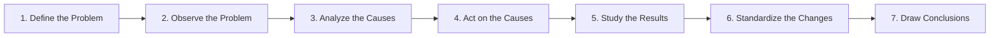
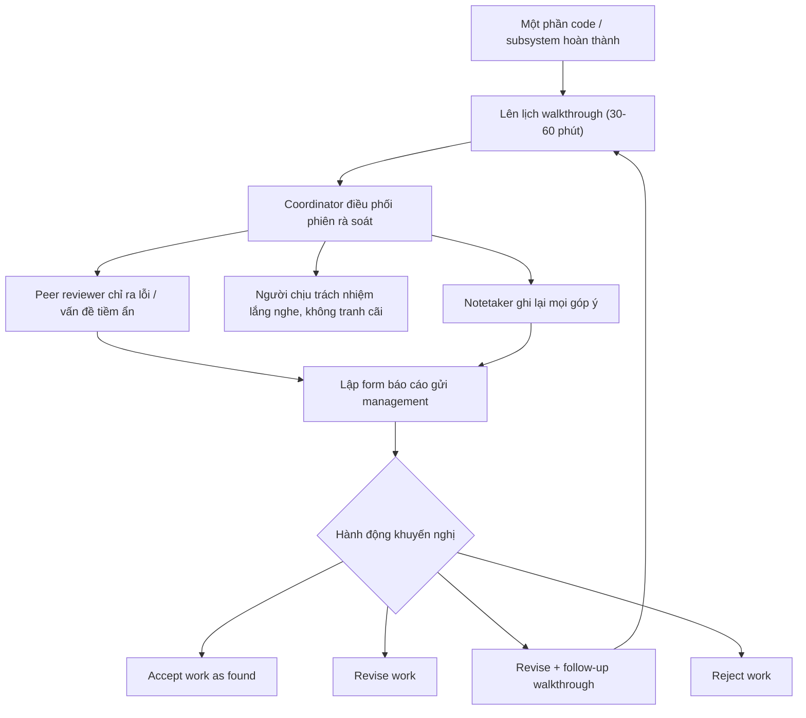
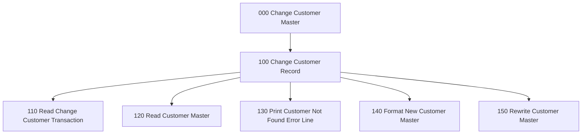
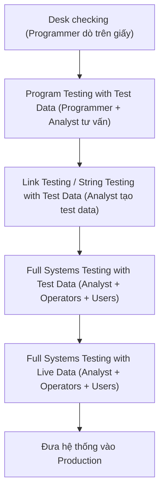
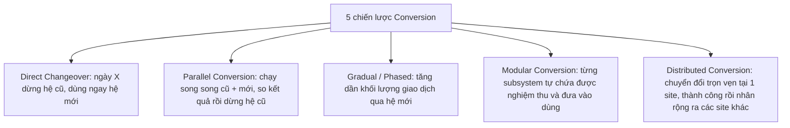
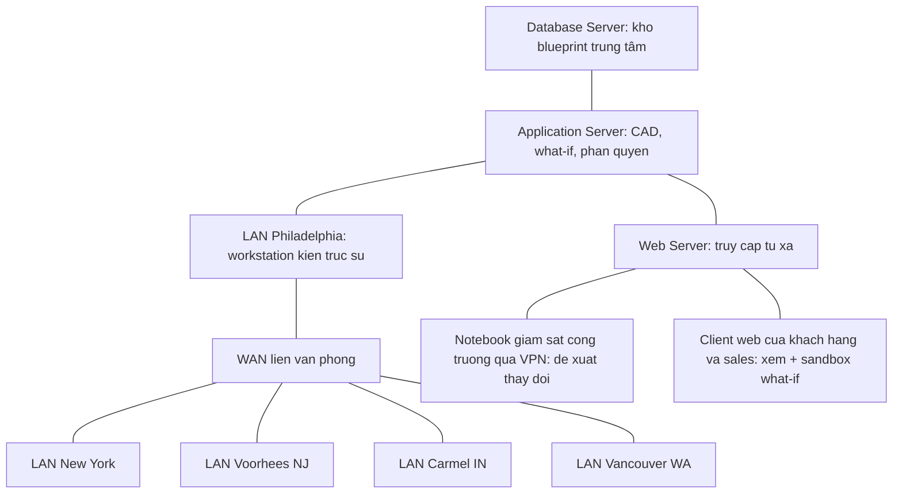
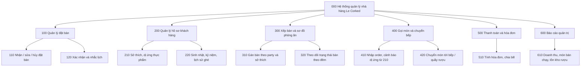

# Chương 16 — Quality Assurance and Implementation (Đảm bảo chất lượng và Triển khai)

> Nguồn: Kendall & Kendall, *Systems Analysis and Design*, 11th edition — Chapter 16 (trang 500–539).

## 🎯 Mục tiêu học tập

Sau khi học xong chương này, bạn có thể:

1. Hiểu cách tiếp cận **Total Quality Management (TQM)** và **Six Sigma** áp dụng vào phân tích – thiết kế hệ thống thông tin; nhận thức trách nhiệm về chất lượng thuộc về cả analyst, user và management.
2. Sử dụng **structured walkthrough** (rà soát có cấu trúc bởi đồng nghiệp) như một công cụ quản lý chất lượng xuyên suốt SDLC.
3. Thiết kế hệ thống theo hướng **top-down** và **modular**, dùng **structure chart** (biểu đồ cấu trúc) với data couples và control flags; hiểu khái niệm **service-oriented architecture (SOA)**.
4. Lập tài liệu hệ thống bằng **procedure manuals** và phương pháp **FOLKLORE**; biết tiêu chí chọn kỹ thuật thiết kế/tài liệu hóa phù hợp.
5. Hiểu **requirements traceability** (truy vết yêu cầu) với 4 loại truy vết và traceability matrix.
6. Nắm quy trình **testing** đầy đủ theo các mức: desk checking → program testing → link testing → full systems testing với test data → full systems testing với live data; hiểu **behavior-driven development (BDD)**.
7. Hiểu vai trò của **maintenance** (bảo trì) và **auditing** (kiểm toán nội bộ / độc lập) trong bảo đảm chất lượng.
8. Hiểu việc triển khai **distributed systems** với mô hình **client/server** (2 tầng, 3 tầng) và cách **network modeling** (network decomposition, hub connectivity, workstation connectivity).
9. Lập kế hoạch **training** người dùng: ai cần đào tạo, ai đào tạo, mục tiêu – phương pháp – địa điểm – tài liệu đào tạo.
10. So sánh và lựa chọn trong **5 chiến lược conversion**: direct changeover, parallel, gradual/phased, modular, distributed.
11. Nhận biết ảnh hưởng của **organizational metaphors** đến thành công của hệ thống.
12. Thiết kế **security** ở 3 khía cạnh: physical, logical, behavioral; hiểu 2FA/3FA, các biện pháp bảo mật ecommerce, rủi ro **IoT**, **privacy policy** và **disaster recovery planning**.
13. Đánh giá hệ thống sau triển khai bằng các kỹ thuật **evaluation**, đặc biệt là **information system utility approach** (6 utility) và **web traffic analysis** cho website doanh nghiệp.

---

## 📖 Tóm tắt & giải thích kiến thức

### 1. Cách tiếp cận Total Quality Management (TQM)

**TQM** là điều thiết yếu trong *mọi* bước phát triển hệ thống. Theo Evans & Lindsay (2015), các thành tố cốt lõi của TQM chỉ có ý nghĩa khi diễn ra trong một bối cảnh tổ chức hỗ trợ nỗ lực chất lượng toàn diện, bao gồm:

- **Customer focus** (tập trung vào khách hàng)
- **Strategic planning and leadership** (hoạch định chiến lược và lãnh đạo)
- **Continuous improvement** (cải tiến liên tục)
- **Empowerment** (trao quyền)
- **Teamwork** (làm việc nhóm)

Điểm mấu chốt: khái niệm *chất lượng* đã mở rộng — không còn là "kiểm soát số sản phẩm lỗi" (góc nhìn sản xuất) mà là **một quá trình tiến hóa hướng tới sự hoàn hảo** ở cấp độ toàn tổ chức. Cam kết của doanh nghiệp với TQM khớp rất tốt với mục tiêu tổng thể của phân tích – thiết kế hệ thống.

### 2. Six Sigma

- Nguồn gốc: **Motorola, thập niên 1980**. Six Sigma không chỉ là một phương pháp luận (methodology) — nó là **một văn hóa (culture) và triết lý (philosophy)** xây dựng trên nền tảng chất lượng.
- Mục tiêu: **loại bỏ mọi khiếm khuyết (defects)** — áp dụng cho mọi sản phẩm, dịch vụ, quy trình.
- So sánh: quản lý chất lượng kiểu cũ dùng **3 sigma** (3 độ lệch chuẩn) ≈ 67.000 lỗi / 1 triệu cơ hội. **Six Sigma** đặt mục tiêu **không quá 3,4 lỗi / 1 triệu cơ hội**.
- Six Sigma là cách tiếp cận **top-down**: cần CEO chấp nhận triết lý này và một executive làm **project champion**.
- Dr. Joseph M. Juran (1964): *"Mọi cải tiến chất lượng đều diễn ra theo từng dự án một, và không có cách nào khác."*

7 bước của Six Sigma (Figure 16.1):



### 3. Trách nhiệm về TQM và IS Quality Circles

Phần lớn trách nhiệm về chất lượng hệ thống thông tin (IS) thuộc về **người dùng (users) và ban quản lý (management)**. Để TQM thành hiện thực trong dự án hệ thống, cần 2 điều:

1. **Sự hỗ trợ toàn diện của management** — không chỉ là "ủng hộ phong trào quản lý mới nhất" mà phải tạo bối cảnh để cán bộ quản lý nghiêm túc cân nhắc chất lượng IS ảnh hưởng đến công việc thế nào.
2. **Cam kết sớm với chất lượng** từ analyst và business user — nỗ lực chất lượng được dàn đều xuyên suốt SDLC, thay vì đổ dồn công sức "chữa cháy" ở cuối dự án.

**IS quality circle** (vòng tròn chất lượng IS): nhóm **6–8 đồng nghiệp trong tổ chức**, được cấp thời gian làm việc chính thức (on-the-job time), chuyên trách xem xét **cách cải tiến IS và cách triển khai cải tiến**. Qua quality circles, management và users xây dựng **chuẩn chất lượng (quality standards)** cho IS — lý tưởng là chuẩn được định hình lại mỗi khi đề xuất hệ thống mới / sửa đổi lớn. Chuẩn chất lượng của từng phòng ban phải được phản hồi lại cho nhóm phân tích; việc để user tự nêu rõ kỳ vọng giúp analyst tránh sai lầm tốn kém do phát triển hệ thống không ai cần.

### 4. Structured Walkthrough (Rà soát có cấu trúc)

Một trong những hành động quản lý chất lượng mạnh nhất: thực hiện **structured walkthrough định kỳ** — dùng **peer reviewers** (người rà soát đồng cấp) để giám sát việc lập trình và phát triển hệ thống, chỉ ra vấn đề, và để người chịu trách nhiệm phần đó sửa đổi phù hợp.

Cần **ít nhất 4 người**, mỗi người một vai trò riêng:

| Vai trò | Nhiệm vụ |
|---|---|
| **Người chịu trách nhiệm** (programmer/analyst của phần được review) | **Lắng nghe** — không bào chữa, không biện hộ, không tranh cãi |
| **Walkthrough coordinator** (điều phối viên) | Bảo đảm mọi người tuân thủ vai trò và hoàn thành các hoạt động đã lên lịch |
| **Programmer/analyst peer** (đồng nghiệp rà soát) | Chỉ ra lỗi hoặc vấn đề tiềm ẩn — **không** chỉ định cách sửa |
| **Notetaker** (người ghi chép) | Ghi lại nội dung để những người khác tương tác không bị vướng bận |

Đặc điểm:
- Thực hiện **xuyên suốt SDLC**, mỗi khi một phần code / hệ thống / hệ thống con hoàn thành.
- Thời lượng ngắn: **30 phút – 1 giờ** → phải được điều phối tốt; không nên lạm dụng.
- Kết quả ghi vào form báo cáo với 4 lựa chọn hành động: **ACCEPT WORK AS FOUND / REVISE WORK / REVISE WORK AND CONDUCT FOLLOW-UP WALKTHROUGH / REJECT WORK**.
- Mục đích: đánh giá sản phẩm **một cách hệ thống, liên tục**, thay vì chờ đến khi hoàn thành hệ thống.



### 5. Top-Down Systems Design and Development

**Bottom-up** (từ dưới lên): doanh nghiệp thường bắt đầu tin học hóa từ cấp thấp nhất (mua COTS cho kế toán, gói khác cho lập lịch sản xuất, gói khác cho marketing...). Nhược điểm:

1. Khó ghép nối các subsystem — **interface bugs** cực kỳ tốn kém, thường chỉ lộ ra khi lập trình xong, sát deadline.
2. **Trùng lặp công sức** khi mua phần mềm và nhập liệu; dữ liệu vô giá trị được đưa vào hệ thống.
3. Nghiêm trọng nhất: **mục tiêu tổng thể của tổ chức không được xem xét** nên không thể đạt được, dù nhu cầu của từng cụm user nhỏ được đáp ứng.

**Top-down design** (từ trên xuống): xác định **mục tiêu tổng thể của tổ chức trước**, rồi mới chia hệ thống thành các subsystem và yêu cầu của chúng. Tương thích với tư duy hệ thống tổng quát (Chương 2); nhấn mạnh **synergy** — các interface giữa hệ thống và subsystem.

**3 lợi thế của top-down:**
1. **Tránh hỗn loạn** khi cố thiết kế toàn bộ hệ thống cùng một lúc ("cố đưa mọi subsystem vào vận hành đồng thời là chấp nhận thất bại").
2. Cho phép các **nhóm phân tích làm việc song song** trên các subsystem khác nhau → tiết kiệm thời gian; rất hợp với quality assurance theo nhóm.
3. **Tránh sa lầy vào chi tiết** mà quên mất hệ thống phải làm gì.

TQM + top-down đi đôi với nhau: top-down tạo sẵn cách phân chia user thành **task forces** cho từng subsystem; task force này kiêm luôn vai trò **quality circle** — cấu trúc bảo đảm chất lượng và động lực đã có sẵn.

### 6. Modular Development và Structure Charts

**Modular approach**: chia chương trình thành các phần logic, dễ quản lý gọi là **modules**. Hợp với top-down vì nhấn mạnh interface giữa các module ngay từ đầu. Lý tưởng: mỗi module **functionally cohesive** — chỉ thực hiện **một chức năng duy nhất**.

**3 lợi ích của modular design:**
1. Module **dễ viết và debug** — gần như tự chứa; lỗi trong một module không gây lỗi lan sang module khác.
2. **Dễ bảo trì** — sửa đổi thường chỉ giới hạn trong vài module.
3. **Dễ hiểu** — người đọc có thể cầm listing của một module và hiểu chức năng của nó.

**4 nguyên tắc lập trình modular:**
1. Giữ module ở **kích thước quản lý được** (lý tưởng: chỉ 1 chức năng).
2. Chú ý đặc biệt tới **các interface trọng yếu** (dữ liệu và biến điều khiển truyền sang module khác).
3. **Tối thiểu hóa số module** user phải sửa khi thay đổi.
4. **Duy trì quan hệ phân cấp** đã thiết lập ở giai đoạn top-down.

**Structure chart** — công cụ khuyến nghị để thiết kế hệ thống modular top-down: biểu đồ gồm các **hộp chữ nhật** (module) và **mũi tên kết nối**.

- Đánh số: module cấp cao theo **100** (100, 200...), cấp thấp theo **10** (110, 120...) → có thể chèn module mới giữa hai module liền kề (chèn giữa 110 và 120 → 115).
- Hai loại mũi tên bên cạnh đường nối:
  - **Data couple** (mũi tên đầu **tròn rỗng**): dữ liệu được truyền lên/xuống.
  - **Control flag** (mũi tên đầu **tròn đặc**): cờ điều khiển; **switch** là control flag chỉ có 2 giá trị yes/no.
- Nguyên tắc: **coupling càng ít càng tốt** — càng ít data couple và control flag thì hệ thống càng dễ thay đổi. Đặc biệt **tránh nhiều control flag**; control được thiết kế truyền **từ dưới lên**. Truyền control **xuống dưới** khiến module cấp thấp phải ra quyết định → module làm 2 việc → vi phạm nguyên tắc functional module.
- Giới hạn của structure chart: **không thể đứng một mình** làm tài liệu thiết kế duy nhất — (1) không thể hiện **thứ tự thực thi** module (cần data flow diagram); (2) không đủ **chi tiết** (cần structured English).

Ví dụ Figure 16.3 — structure chart "Change Customer Master" gồm 7 module (000, 100, 110, 120, 130, 140, 150):



*(Trong sách, kèm theo các data couple như Change Transaction Record, Customer Master, Customer Number... và các switch như Record Found Switch, End of File Switch.)*

### 7. Service-Oriented Architecture (SOA)

Modular development dẫn tới khái niệm **SOA** — khác hẳn module trong structure chart: thay vì phân cấp (hierarchical), các **SOA service độc lập hoặc chỉ loosely coupled** (liên kết lỏng) với nhau.

- Mỗi service thực hiện **một hành động**: ví dụ service 1 trả về số ngày trong tháng, service 2 cho biết năm nhuận, service 3 đặt 5 đêm khách sạn cuối tháng 2 — service 3 cần giá trị từ service 1, 2 nhưng chúng **độc lập** với nhau; mỗi service có thể tái sử dụng ở ứng dụng khác, thậm chí tổ chức khác.
- Service giao tiếp qua **các protocol định nghĩa sẵn** thay vì gọi trực tiếp lẫn nhau. Có service tổng quát (có thể outsource hoặc lấy trên web) và service **enterprise-based** chứa business rules — tạo khác biệt giữa các doanh nghiệp.
- **Orchestration**: gánh nặng kết nối các service một cách hữu ích, đặt lên vai systems designer (có thể chọn service từ menu, giám sát qua **SOA dashboard**).

**6 điều kiện của service trong SOA:** (1) Modular; (2) Reusable; (3) Interoperable (phối hợp được với module khác); (4) Có thể phân loại và định danh; (5) Có thể giám sát; (6) Tuân thủ chuẩn ngành.

**Thách thức:** phải thống nhất chuẩn ngành; phải duy trì **library** để developer tìm service; **security và privacy** khi dùng phần mềm do người khác phát triển. Người ủng hộ cho rằng SOA đã làm nên nhiều tính năng của Web 2.0; có người gọi **cloud computing là "hậu duệ" của SOA**.

### 8. Documentation Approaches (Các cách tiếp cận tài liệu hóa)

Nỗ lực bảo đảm chất lượng toàn diện đòi hỏi chương trình được **tài liệu hóa đúng đắn**. Tài liệu giúp user, programmer, analyst "nhìn thấy" hệ thống mà không cần tương tác với nó. Vì **turnover nhân sự IT cao**, người bảo trì thường không phải người xây dựng ban đầu → tài liệu nhất quán, cập nhật tốt **rút ngắn thời gian người mới học hệ thống**.

Lý do hệ thống thiếu tài liệu: analyst không có thời gian / không được thưởng cho thời gian viết tài liệu; ngại viết hoặc coi đó "không phải việc thật"; e ngại viết về hệ thống của người khác. CASE tools trong SDLC giúp giải quyết; trong agile, dù là cộng tác của "product owners, designers, developers", **người tạo phần mềm chịu trách nhiệm cuối cùng** về tài liệu (Spies, 2021).

#### 8.1 Procedure Manuals (Sổ tay quy trình)

- Thành phần "ngôn ngữ tự nhiên" của tài liệu (có thể kèm code, flowchart...). Nội dung: bối cảnh, các bước thực hiện giao dịch, cách khắc phục sự cố (troubleshooting), phải làm gì tiếp nếu có trục trặc.
- Nhiều manual nay ở dạng **online với hypertext**; hỗ trợ user đã chuyển lên web: manuals, **FAQ pages, online chat, user communities**.
- Các mục chính nên có: **giới thiệu, cách dùng phần mềm, xử lý khi có sự cố, phần tham chiếu kỹ thuật, index, thông tin liên hệ nhà sản xuất**.
- 4 phàn nàn lớn nhất về procedure manuals: (1) tổ chức kém; (2) khó tìm thông tin cần; (3) trường hợp cụ thể đang gặp không có trong manual; (4) không viết bằng ngôn ngữ dễ hiểu (plain English).

#### 8.2 Phương pháp FOLKLORE

Kỹ thuật tài liệu hóa hệ thống **bổ sung** cho các kỹ thuật khác, do **Kendall & Losee (1986)** phát triển (trước cả blog và user community). FOLKLORE thu thập thông tin **thường được chia sẻ giữa các user nhưng hiếm khi được viết ra**, dựa trên phương pháp truyền thống thu thập văn hóa dân gian: analyst **phỏng vấn user, khảo cứu tài liệu sẵn có, quan sát quá trình xử lý thông tin**, gom vào **4 phạm trù**:

| Phạm trù | Ý nghĩa trong IS | Ví dụ |
|---|---|---|
| **Customs** (tập quán) | Mô tả cách user hiện đang làm để hệ thống chạy trơn tru | "Chúng tôi thường mất 2 ngày cập nhật hồ sơ tháng: ngày 1 chạy tài khoản thương mại, ngày 2 chạy phần còn lại." |
| **Tales** (chuyện kể) | Câu chuyện user kể về cách hệ thống đã hoạt động (có mở đầu = vấn đề, thân = tác động, kết = giải pháp; thường có "người hùng" là người kể) | Chuyện khắc phục một sự cố trước đây |
| **Sayings** (câu cửa miệng) | Phát biểu ngắn mang tính khái quát hoặc lời khuyên | "Bỏ đoạn code này là chương trình sập" / "Luôn backup thường xuyên" |
| **Art forms** (hình vẽ) | Flowchart, sơ đồ, bảng biểu do user tự vẽ — đôi khi hữu ích hơn cả của tác giả hệ thống | Sơ đồ dán trên bảng tin, trong hồ sơ của user |

Ưu điểm so với user community thông thường: (1) **có cấu trúc** → tài liệu có tổ chức, đầy đủ hơn; (2) **chủ động tìm kiếm thông tin** từ người am hiểu thay vì chờ user tự lên tiếng. Người đóng góp chỉ cần tài liệu hóa **phần họ biết**. **Rủi ro**: thông tin thu được có thể đúng, đúng một phần, hoặc **sai**.

#### 8.3 Chọn kỹ thuật thiết kế và tài liệu hóa

Analyst nên chọn kỹ thuật:
1. **Tương thích** với tài liệu hiện có.
2. Được người khác trong tổ chức **hiểu** (hoặc dễ dạy lại).
3. Cho phép bạn **quay lại làm việc** với hệ thống sau thời gian rời xa nó.
4. **Phù hợp với kích thước** hệ thống đang làm.
5. Cho phép **cách tiếp cận thiết kế có cấu trúc** nếu đó là ưu tiên.
6. Cho phép **sửa đổi dễ dàng**.

### 9. Requirements Traceability (Truy vết yêu cầu)

Liên quan cả **documentation** và **testing**. Truy vết yêu cầu = theo dõi **vòng đời của một requirement theo cả hai hướng**: lý tưởng là truy ngược về **business objective** và truy xuôi tới **sản phẩm triển khai thành công**. Truyền thống làm thủ công bằng **traceability matrix** (có thể duy trì trong Excel); agile dùng phần mềm chuyên dụng như **Jama Software** (tích hợp Jira → live traceability, matrix và exception report tự động). Truy vết chính xác vẫn là thách thức (Kannenberg & Saiedian, 2009).

**4 loại truy vết** (Figure 16.6):

1. **Forward TO requirements**: từ **customer needs → requirements**. Nhu cầu khách hàng thay đổi theo thời gian → lần theo đường dẫn tới requirement để thay đổi tương ứng.
2. **Forward FROM requirements**: từ **requirements → hạ nguồn (test cases...)**. Khi requirement thay đổi, phải test và verify lại.
3. **Backward FROM requirements**: từ **requirement → use case** đã sinh ra nó — giải thích **mục đích** của requirement.
4. **Backward TO requirements**: từ **performed work (công việc đã làm) → requirement** — xem công việc đã thực hiện thuộc requirement nào; nếu công việc chưa hoàn chỉnh, xác định phần thiếu trong requirement.

**Traceability matrix** (Figure 16.7): mỗi requirement truy vết được tới business objective, test cases, người chịu trách nhiệm, status — dùng làm checklist kiêm tài liệu.

**4 lợi ích của việc lập kế hoạch traceability:**
1. Bảo đảm sản phẩm cuối **liên kết với business objective gốc**, customer needs, test cases, use cases và performed work.
2. **Tiết kiệm thời gian, tiền bạc** khi có sự cố vì liên kết đã tạo sẵn (tìm quan hệ sau khi làm xong luôn khó hơn).
3. Khách hàng muốn **đổi tính năng** → liên kết cho biết requirement nào cần thay đổi.
4. Công việc **không đạt kỳ vọng** → dễ xác định requirement nào cần sửa.

### 10. Testing, Maintenance, and Auditing

#### 10.1 Quy trình Testing

Mọi chương trình mới viết/sửa đổi — cùng procedure manuals mới, phần cứng mới, mọi system interface — phải được **test kỹ lưỡng**. Test kiểu "thử-sai tùy tiện" là không đủ. Nguyên tắc:

- Testing diễn ra **xuyên suốt quá trình phát triển**, không chỉ ở cuối.
- Mục đích: **tìm ra vấn đề chưa biết**, KHÔNG phải chứng minh chương trình hoàn hảo.
- Test trước khi vận hành ít gây xáo trộn hơn nhiều so với để hệ thống test kém rồi hỏng sau khi cài đặt.
- Programmer, analyst, operator và user **mỗi bên một vai trò** ở các mức test khác nhau. Test phần cứng thường do **vendor** cung cấp như một dịch vụ.

**Các mức test theo thứ tự:**

**(a) Program Testing with Test Data** — trách nhiệm chính thuộc **programmer (tác giả gốc)**; analyst đóng vai trò **advisor/coordinator**:
- **Desk checking**: lập trình viên dò từng bước chương trình **trên giấy** để kiểm tra routine chạy đúng như viết.
- Tạo **cả test data hợp lệ và không hợp lệ**; chạy để xem routine cơ sở hoạt động và bắt lỗi. Test data nên bao phủ **giá trị min/max và mọi biến thể của format, code**. Output ra file phải kiểm chứng cẩn thận — **không bao giờ** mặc định dữ liệu trong file là đúng chỉ vì file được tạo và truy cập được.
- Analyst kiểm tra output tìm lỗi, tư vấn sửa; thường **không tự tạo test data** ở mức này nhưng có thể chỉ ra loại dữ liệu bị bỏ sót.

**(b) Link Testing with Test Data** (còn gọi **string testing**): kiểm tra các chương trình **phụ thuộc lẫn nhau có làm việc cùng nhau như kế hoạch không**. Analyst tạo test data đặc biệt phủ nhiều tình huống xử lý: trước hết là **giao dịch điển hình** (chiếm phần lớn tải), sau đó thêm biến thể gồm **dữ liệu không hợp lệ** để bảo đảm hệ thống phát hiện lỗi đúng.

**(c) Full Systems Testing with Test Data**: test toàn hệ thống như một thể thống nhất; **operators và end users tham gia tích cực**. Dùng test data do nhóm phân tích tạo riêng để test **mục tiêu hệ thống**. Các yếu tố cần xét:
1. Operator có đủ tài liệu trong procedure manuals (bản in hoặc online) để vận hành đúng và hiệu quả không.
2. Procedure manuals có đủ rõ về cách chuẩn bị dữ liệu đầu vào không.
3. Workflow do hệ thống mới/sửa đổi tạo ra có thực sự "chảy" không.
4. Output có đúng không và user có hiểu rằng đây gần như là dạng cuối cùng không.

Lưu ý: **lên lịch đủ thời gian cho systems testing** — bước này hay bị cắt khi tiến độ trễ. Systems testing gồm cả việc **tái khẳng định các chuẩn chất lượng hiệu năng** đã đặt trong đặc tả ban đầu: đo lường lỗi, tính kịp thời, dễ dùng, thứ tự giao dịch đúng, downtime chấp nhận được, manual dễ hiểu.

**(d) Full Systems Testing with Live Data**: khi test với test data đạt yêu cầu, chạy hệ thống mới vài lượt với **live data** — dữ liệu **đã được xử lý thành công qua hệ thống hiện có** → so sánh chính xác output mới với output đã biết là đúng; thấy được cách dữ liệu thực được xử lý. Không khả thi khi tạo output hoàn toàn mới (ví dụ giao dịch ecommerce của website mới). Chỉ dùng **lượng nhỏ** live data.
- Phải **quan sát trực tiếp** user tương tác với hệ thống (phỏng vấn là chưa đủ): mức dễ học, phản ứng với feedback, phản ứng với response time và ngôn ngữ phản hồi; mọi vấn đề thực phải được xử lý **trước khi đưa vào production**.
- **Procedure manuals cũng phải được test**: cách duy nhất thực sự là để user và operator dùng thử, tốt nhất trong full systems testing với live data; tiếp thu góp ý vào bản cuối của web page, manual in, Read Me...



*(Theo Figure 16.9: Programmers phụ trách program testing; Analysts phụ trách link testing với test data; Operators tham gia full systems testing với test data; Users tham gia full systems testing với live data.)*

#### 10.2 Behavior-Driven Development (BDD)

Phương pháp phát triển phần mềm bằng cách **đưa các feature ra thử thách**: xác định feature nào đạt, feature nào trượt, feature nào **còn thiếu**. Developer viết **unit test thất bại trước**, rồi viết/viết lại code cho tới khi pass.

- BDD gồm **unit testing** (bảo đảm từng đơn vị phần mềm hoạt động đúng — viết code để test function/feature) và **acceptance testing** (thường do business customer thực hiện; acceptance criteria viết tốt nhất dạng **user story**: *"Tôi là khách hàng. Tôi muốn {tính năng này}, để nó giúp tôi {ra quyết định}"* — có sự cộng tác của developer và customer). BDD còn hỏi: **hệ thống có thể hiện hành vi mong muốn không?**
- BBC duy trì ứng dụng open source **ShouldIT** (trên GitHub): viết test ở mọi framework/ngôn ngữ, báo feature nào pass/fail, và qua trực quan hóa giúp developer nhận ra feature còn thiếu.

**Ưu điểm:** (1) có thể tăng tốc testing; (2) debug thường dễ hơn; (3) chi phí sửa vấn đề thấp hơn so với bảo trì về sau; (4) tăng độ tin tưởng phần mềm sẽ hoạt động đúng.

**Nhược điểm:** (1) chỉ test các bộ dữ liệu và chức năng của chúng, không test **toàn hệ thống trong sử dụng**; (2) phải viết thêm code (sẽ bị gỡ sau) → tăng phức tạp; (3) test không tìm ra **mọi** bug; (4) không nên mặc định hệ thống đã được tài liệu hóa đầy đủ nếu chỉ dựa vào kết quả và mô tả của BDD.

#### 10.3 Maintenance Practices (Thực hành bảo trì)

- Mục tiêu của analyst: cài đặt/sửa đổi hệ thống có **vòng đời hữu ích hợp lý** — thiết kế đủ toàn diện và nhìn xa để phục vụ nhu cầu hiện tại và dự phóng nhiều năm; xây **tính linh hoạt và thích ứng** vào hệ thống. Thiết kế càng tốt → bảo trì càng dễ, càng ít tốn tiền.
- Con số đáng nhớ: bảo trì phần mềm có thể ngốn **trên 50% tổng ngân sách xử lý dữ liệu**; khoảng **70% lỗi phần mềm** được quy cho **thiết kế không phù hợp** → phát hiện, sửa lỗi thiết kế **sớm** rẻ hơn nhiều so với để tới lúc bảo trì.
- Bảo trì được thực hiện thường xuyên nhất để **cải thiện phần mềm hiện có** (chứ không phải phản ứng khủng hoảng hay hệ thống hỏng); cũng để **cập nhật theo thay đổi tổ chức**. **Emergency + adaptive maintenance chiếm chưa tới một nửa** tổng bảo trì.
- Analyst phải bảo đảm có **kênh và thủ tục phản hồi** về nhu cầu bảo trì: user dễ dàng báo vấn đề/góp ý (email tới technical support; quyền tải update/patch từ web).

#### 10.4 Auditing (Kiểm toán)

Auditing = nhờ **chuyên gia không tham gia xây dựng hoặc sử dụng hệ thống** xem xét thông tin để xác định **độ tin cậy (reliability)** của nó; kết quả được truyền đạt cho người khác để thông tin của hệ thống hữu ích hơn. Hai loại auditor:

| | **Internal auditors** (kiểm toán nội bộ) | **External / independent auditors** (kiểm toán độc lập) |
|---|---|---|
| Thuộc về | Cùng tổ chức sở hữu IS (nhưng **không báo cáo cho người phụ trách hệ thống được kiểm toán**) | Thuê từ bên ngoài |
| Khi nào dùng | Nghiên cứu **các control** của IS xem có đầy đủ và hoạt động đúng không; test **security controls** | Khi IS xử lý dữ liệu **ảnh hưởng báo cáo tài chính**; hoặc khi có bất thường liên quan nhân viên (nghi **gian lận máy tính, biển thủ**) |
| Độ sâu | Thường **sâu hơn** external | Bảo đảm tính trung thực của báo cáo tài chính |

### 11. Implementing Distributed Systems (Triển khai hệ thống phân tán)

Nếu mạng viễn thông đủ tin cậy, có thể xây **distributed systems** — hiểu theo nghĩa rộng: các workstation giao tiếp với nhau và với data processors, cùng các cấu hình kiến trúc phân cấp khác nhau của data processors có năng lực lưu trữ khác nhau. Chức năng xử lý được **giao cho client hoặc server tùy máy nào phù hợp nhất** với công việc.

#### 11.1 Client/Server Technology

- **Mô hình client/server**: ứng dụng chạy trên mạng — **client yêu cầu (request), server thực thi/đáp ứng (fulfill)**. Đây là kiến trúc **two-tiered** (2 tầng).
- **Three-tiered** (3 tầng — Figure 16.10): client computers truy cập 3 tầng server: **web server** (xử lý trao đổi thông tin trên web) → **application server** (xử lý dữ liệu qua lại giữa client và database server) → **database server** (lưu và truy xuất dữ liệu).
- Client/server đặt **user làm trung tâm công việc**, tương tác với dữ liệu là khái niệm then chốt; dù có 2 phần (client + server), mục tiêu là user cảm nhận đó là **một hệ thống thống nhất** — không nhận ra việc xử lý phân tán đang diễn ra. Trong mạng **peer-to-peer**, PC có thể đóng vai server hoặc client tùy yêu cầu ứng dụng.
- **Client ≠ user**: trong mô hình client/server, *client* là **máy nối mạng** — điểm vào điển hình của hệ thống mà con người sử dụng (desktop, workstation, notebook...). User tương tác trực tiếp chỉ với phần client (qua GUI); client chạy các chương trình nhỏ hơn làm **front-end processing** (gồm giao tiếp với user). **Client-based application** = ứng dụng nằm trong máy client, user khác trên mạng không truy cập được.
- **Ưu điểm**: sức mạnh tính toán lớn hơn; cơ hội **tùy biến ứng dụng** nhiều hơn các lựa chọn khác; (chi phí xử lý thấp hơn thường được nêu nhưng **thiếu dữ liệu thực chứng minh**, chỉ có bằng chứng giai thoại).
- **Nhược điểm**: chi phí **khởi động/chuyển đổi cao** (được ghi nhận rõ); ứng dụng phải viết thành **hai thành phần phần mềm riêng biệt** chạy trên hai máy nhưng phải trông như một; văn hóa tổ chức phải hỗ trợ mô hình này (analyst cần rà soát kế hoạch cẩn thận nếu được yêu cầu "chuẩn thuận" một mô hình đã định sẵn).
- Các loại mạng: **LAN** (kết nối máy trong một phòng ban, tòa nhà, cụm tòa nhà), **WAN** (phục vụ user cách nhau nhiều dặm tới xuyên lục địa), **WLAN / Wi-Fi** (LAN không dây tốc độ cao — tránh chi phí đi lại dây mỗi lần di dời).

#### 11.2 Network Modeling (Mô hình hóa mạng)

Systems designer phải luôn cân nhắc **thiết kế logic của mạng**. Dùng bộ ký hiệu riêng (Figure 16.11) phân biệt: **hub/LAN, external network, multiple external networks, workstation, multiple workstations**. Ba bước:

1. **Network decomposition diagram**: vẽ tổng quan hệ thống — vòng tròn gốc (vd "World's Trend Network") phân rã xuống các hub (Marketing Division, U.S./Canadian/Mexican Division), rồi phân rã tiếp xuống workstations (vd U.S. Division có 33 workstation: Administration, Warehouse, Order-Entry Manager, 30 Order-Entry Clerks).
2. **Hub connectivity diagram**: thể hiện cách các hub chính kết nối với nhau (kèm khoảng cách), gồm cả hub bên ngoài (21 suppliers — 3 division quốc gia kết nối tới suppliers, Marketing Division thì không). Vẽ hết hub trước, thử nghiệm xem link nào cần, rồi vẽ lại cho đẹp và dễ truyền đạt.
3. **Workstation connectivity diagram** (explode từ hub connectivity): thể hiện chi tiết kết nối các workstation. Nhóm các mục phải kết nối với nhau; dùng ký hiệu multiple workstations kèm số lượng trong ngoặc; đặt workstation cần nối tới hub khác **ở rìa** sơ đồ; kết nối ngoài (thường là đường dài) vẽ màu khác hoặc mũi tên dày hơn.

### 12. Training Users (Đào tạo người dùng)

Analyst tham gia quá trình giáo dục user gọi là **training**. Với dự án lớn, analyst thường **quản lý việc đào tạo** hơn là trực tiếp đào tạo. Tài sản quý nhất: khả năng **nhìn hệ thống từ góc độ user** — đừng quên cảm giác đối mặt một hệ thống mới → thấu cảm với user.

**Whom to train (đào tạo ai):** **tất cả người dùng chính (primary) và phụ (secondary)** — từ nhân viên nhập liệu đến người dùng output để ra quyết định mà không trực tiếp dùng máy. Lượng đào tạo phụ thuộc mức độ công việc thay đổi do hệ thống mới. **Phải tách user theo trình độ và mối quan tâm công việc** — trộn novice với expert là "rước họa": novice lạc lối, expert chán ngán → mất cả hai nhóm.

**5 nguồn trainer:** (1) **Vendors** — thường có buổi đào tạo off-site 1–2 ngày miễn phí kèm khi mua COTS đắt tiền (lecture + hands-on, kèm user groups online, blog, hội nghị thường niên); (2) **Systems analysts** — hiểu cả con người lẫn hệ thống nên dạy tốt, nhưng còn phải giám sát toàn bộ implementation; (3) **External paid trainers** — kinh nghiệm rộng nhưng có thể thiếu hands-on cần thiết, khó "may đo" nội dung; (4) **In-house trainers** — quen kỹ năng và cách học của nhân viên, tùy biến tài liệu tốt, nhưng có thể thiếu chiều sâu chuyên môn IS; (5) **Other system users** — train một nhóm nhỏ từ mỗi bộ phận rồi họ train tiếp người còn lại (train-the-trainer); hiệu quả nếu nhóm đầu vẫn được tiếp cận tài liệu và trainer làm nguồn lực, nếu không sẽ thoái hóa thành thử-sai.

**4 nguyên tắc thiết lập training (Figure 16.15):**

| Yếu tố | Nội dung |
|---|---|
| **Training objectives** (mục tiêu) | Phụ thuộc yêu cầu công việc của user; mục tiêu **đo lường được**, nêu rõ ràng cho từng nhóm → trainee biết điều được kỳ vọng, và cho phép **đánh giá** sau đào tạo (vd operator phải biết bật máy, xử lý lỗi thường gặp, troubleshooting cơ bản, kết thúc một entry) |
| **Training methods** (phương pháp) | Phụ thuộc công việc, tính cách, nền tảng, kinh nghiệm; người học bằng **nhìn** → demo thiết bị, manual; học bằng **nghe** → lecture, thảo luận, hỏi–đáp; học bằng **làm** → hands-on (bắt buộc với computer operator). Thường phải **kết hợp nhiều phương pháp** vì không thể cá nhân hóa từng người |
| **Training sites** (địa điểm) | Phụ thuộc mục tiêu, chi phí, mức sẵn có: **off-site của vendor** (miễn phí, thiết bị vận hành được, tập trung học — nhưng xa bối cảnh tổ chức thực); **on-site** (thấy thiết bị đặt đúng chỗ vận hành thật — nhưng trainee dễ áy náy vì bỏ việc thường ngày, khó tập trung); **thuê ngoài** qua consultant/vendor (thoát áp lực công việc nhưng có thể thiếu thiết bị hands-on) |
| **Training materials** (tài liệu) | Phụ thuộc nhu cầu user: manuals, **training cases** (bài tập tình huống bao quát các tương tác thường gặp), **prototypes/mockups của output**, mô phỏng web-based, online tutorials của vendor COTS, trang FAQ. Tài liệu phải **viết rõ ràng cho đúng đối tượng, tối thiểu jargon, có index tốt, sẵn có** cho mọi người cần |

### 13. Conversion to a New System (Chuyển đổi sang hệ thống mới)

Conversion = **chuyển đổi vật lý từ IS cũ sang IS mới/sửa đổi**. Không có "cách tốt nhất duy nhất" — chọn theo tình huống (contingency approach dựa trên các biến số về user và tổ chức). Không thể xem nhẹ: **lập kế hoạch và lên lịch chu đáo** (thường mất nhiều tuần), **sự tham gia chiến lược của user**, **backup file** và **an ninh đầy đủ**.

**5 chiến lược conversion (Figure 16.16):**



**Bảng so sánh 5 chiến lược:**

| Chiến lược | Cách thức | Ưu điểm | Nhược điểm / Rủi ro | Ghi chú |
|---|---|---|---|---|
| **Direct changeover** | Đến ngày định trước, user **dừng hẳn hệ cũ**, hệ mới đưa vào dùng ngay | Dứt điểm, không tốn chi phí chạy kép | **Rủi ro cao**; chỉ thành công nếu **test cực kỳ kỹ trước đó**; chỉ hợp khi **chấp nhận được chậm trễ xử lý**; user có thể bất mãn vì bị ép dùng hệ lạ **không đường lui**; **không có cách so sánh kết quả mới với cũ** | Cách rủi ro nhất |
| **Parallel conversion** | Chạy hệ cũ và mới **đồng thời**; khi kết quả trùng khớp qua thời gian → dùng hệ mới, dừng hệ cũ | **Đối chiếu dữ liệu mới với cũ** để bắt lỗi xử lý của hệ mới; an toàn cao | **Chi phí chạy 2 hệ cùng lúc**; **gánh nặng nhân viên gần như gấp đôi khối lượng công việc** trong lúc chuyển đổi | An toàn nhưng đắt |
| **Gradual (phased) conversion** | **Tăng dần khối lượng giao dịch** được xử lý bởi hệ mới theo từng giai đoạn | Kết hợp ưu điểm của 2 cách trên mà không ôm hết rủi ro: user **làm quen dần**; **phát hiện và khắc phục lỗi mà không downtime lớn**; **thêm tính năng từng cái một** | Kéo dài thời gian chuyển đổi | **Agile methodologies** hay dùng cách này |
| **Modular conversion** | Xây các **subsystem tự chứa, vận hành được**; mỗi module được sửa đổi, nghiệm thu xong là **đưa vào dùng ngay** | Mỗi module được **test kỹ trước khi dùng**; user **quen thuộc dần từng module**; feedback của user góp phần định hình thuộc tính cuối của hệ thống | Cần thiết kế module tốt; chuyển đổi từng phần kéo dài | **Object-oriented methodologies** hay dùng |
| **Distributed conversion** | Với hệ thống **cài đặt tại nhiều nơi** (ngân hàng, franchise nhà hàng, cửa hàng...): làm **một cuộc chuyển đổi trọn vẹn tại một site** (bằng bất kỳ 1 trong 4 cách trên), thành công rồi mới làm các site khác | Vấn đề được **phát hiện và khoanh vùng** thay vì giáng xuống mọi site cùng lúc | Mỗi site có **con người, văn hóa, đặc thù vùng miền riêng** phải xử lý riêng — thành công một nơi không bảo đảm nơi khác | Dành cho hệ nhiều chi nhánh |

**Các việc khác của analyst khi conversion:**
1. **Đặt thiết bị** (trước tới 3 tháng so với ngày chuyển đổi dự kiến; tính cả chậm trễ chuỗi cung ứng).
2. Đặt **vật tư cung cấp từ bên ngoài** cho IS: hộp mực, giấy, biểu mẫu in sẵn, phương tiện lưu trữ (cũng lưu ý supply chain).
3. **Bổ nhiệm người quản lý** giám sát (hoặc tự giám sát) việc chuẩn bị **địa điểm cài đặt**.
4. Lập kế hoạch, lên lịch, giám sát programmer và nhân viên nhập liệu **chuyển đổi toàn bộ file và database** liên quan.

Với triển khai lớn, vai trò chính của analyst: **ước lượng chính xác thời gian** từng hoạt động, bổ nhiệm người quản lý từng subproject, điều phối. Với dự án nhỏ, analyst tự làm phần lớn. Các kỹ thuật quản lý dự án ở Chương 3 (Gantt chart, PERT, function point analysis, giao tiếp nhóm) đều hữu dụng.

### 14. Organizational Metaphors và sự thành công của hệ thống

Nghiên cứu (của các tác giả, tại Bắc Mỹ) gợi ý: **thành/bại của hệ thống có thể liên quan tới ẩn dụ (metaphor) mà thành viên tổ chức dùng để mô tả công ty**:

- **Zoo** (sở thú), **jungle** (rừng rậm): hỗn loạn, không hướng mục tiêu → **ẩn dụ tiêu cực**.
- **War** (chiến tranh), **journey** (hành trình): hỗn loạn nhưng **hướng mục tiêu**.
- **Machine** (cỗ máy): trật tự, vận hành ngăn nắp, hướng mục tiêu.
- **Society** (xã hội), **family** (gia đình), **game** (trò chơi): trật tự và luật lệ; machine + game hướng mục tiêu công ty, society (và zoo) để cá nhân tự đặt chuẩn mực và phần thưởng.
- **Organism** (cơ thể sống): cân bằng giữa trật tự – hỗn loạn, giữa mục tiêu công ty – cá nhân.

Kết quả (Figure 16.17): **ẩn dụ tích cực** = game, organism, machine; **tiêu cực** = jungle, zoo; **hỗn hợp** (tùy loại IS) = journey, war, society, family. Ví dụ: **traditional MIS** dễ thành công khi ẩn dụ chủ đạo là **society, machine, family**, dễ thất bại với **war, jungle**; nhưng **competitive systems** lại dễ thành công nhất khi ẩn dụ là **war**. Analyst nên để ý các ẩn dụ xuất hiện trong phỏng vấn — chúng có thể là một nhân tố góp phần vào thành công của việc triển khai IS.

### 15. Security Concerns (An ninh cho hệ thống truyền thống và web)

An ninh cho cơ sở máy tính, dữ liệu lưu trữ và thông tin tạo ra là **một phần của conversion thành công**. Hình dung an ninh trên một **continuum từ hoàn toàn an toàn đến hoàn toàn mở** — không có hệ thống nào an toàn tuyệt đối; mục tiêu là đẩy hệ thống về phía an toàn bằng cách **giảm tính dễ tổn thương**. Càng nhiều người có năng lực máy tính, truy cập web, intranet/extranet — và làn sóng **làm việc từ xa/hybrid từ đại dịch COVID-19** — an ninh càng khó và phức tạp. An ninh là **trách nhiệm của mọi người tiếp xúc với hệ thống**, và chỉ mạnh bằng **hành vi/chính sách lỏng lẻo nhất** trong tổ chức. Ba khía cạnh liên quan chặt chẽ:

**a) Physical security (an ninh vật lý)**: bảo vệ cơ sở máy tính, thiết bị, phần mềm bằng **phương tiện vật lý**: kiểm soát ra vào phòng máy bằng thẻ đọc máy, **hệ thống sinh trắc học**, sổ ký vào/ra; camera CCTV giám sát; **backup dữ liệu thường xuyên**, lưu backup ở nơi chống cháy – chống nước, thường off-site an toàn hoặc lưu trữ đám mây; cố định thiết bị nhỏ; **nguồn điện không gián đoạn**; chuông báo cháy/lụt/xâm nhập luôn hoạt động. Nên quyết định về physical security **cùng user ngay khi lập kế hoạch mua sắm** — an ninh chặt hơn nhiều nếu được dự liệu trước khi lắp đặt.

**b) Logical security (an ninh logic)**: các **control logic trong chính phần mềm** — quen thuộc nhất là **password/mã ủy quyền** cho phép vào hệ thống hoặc một phần database. Thực tế password bị đối xử cẩu thả (hét qua văn phòng, dán lên màn hình, chia sẻ). **Encryption software** bảo vệ giao dịch thương mại trên web; nhưng **internet fraud tăng mạnh**, ít nhà chức trách được huấn luyện bắt tội phạm mạng ("miền tây hoang dã"). **Firewall**: dựng **rào chắn giữa mạng nội bộ (được coi là tin cậy) và mạng ngoài như internet (không tin cậy)** — ngăn liên lạc vào/ra không được phép; không phải thuốc chữa bách bệnh nhưng là **một lớp an ninh bổ sung** được ủng hộ rộng rãi.

**c) Behavioral security (an ninh hành vi)**: kỳ vọng hành vi nằm trong policy manual, biển báo... nhưng quan trọng là hành vi mà thành viên **nội hóa**. (Một lý do firewall không chống được tấn công: **nhiều cuộc tấn công đến từ bên trong tổ chức**.) Biện pháp: **sàng lọc nhân viên** sẽ tiếp cận máy tính/dữ liệu; **chính sách an ninh được viết ra, phân phát, cập nhật**; quy định cấm/hạn chế lướt web, khóa mềm chặn website không phù hợp (game, cờ bạc, khiêu dâm); **giám sát hành vi định kỳ không báo trước** — log số lần đăng nhập thất bại, kiểm kê thiết bị/phần mềm thường xuyên, soi các phiên dài bất thường hoặc truy cập ngoài giờ; nhân viên phải hiểu rõ điều được kỳ vọng, điều bị cấm, quyền và trách nhiệm (ở Mỹ và EU, chủ lao động **buộc phải công khai mọi hoạt động giám sát** và lý do — video, phần mềm, điện thoại). **Kiểm soát output**: màn hình chỉ truy cập qua password, **phân loại thông tin** (ai được nhận, khi nào), lưu trữ an toàn tài liệu in/lưu; **hủy tài liệu** mật bằng dịch vụ shredding (một tập đoàn lớn có thể hủy trên 76.000 pound output/năm).

**Two-Factor Authentication (2FA)**: xác thực hai bước / dual-factor — user cung cấp **hai yếu tố xác thực riêng biệt** để chứng minh quyền truy cập, chọn trong: **something they know** (thứ họ biết — mật khẩu), **something they possess** (thứ họ sở hữu — token), **something they are** (chính con người họ — sinh trắc học). Tương lai: **three-factor authentication** = token vật lý + mật khẩu + dữ liệu sinh trắc (quét võng mạc, giọng nói, vân tay).

**Các biện pháp bảo mật đặc thù cho Ecommerce (9 nhóm):**
1. Phần mềm **phát hiện và loại bỏ malware** (virus protection).
2. **Email filtering**: quét/lọc email và tệp đính kèm theo chính sách — chiều vào chống **spam**, chiều ra chống **rò rỉ thông tin độc quyền**.
3. **URL filtering**: kiểm soát truy cập web theo user, nhóm user, máy, giờ, ngày trong tuần.
4. **Firewalls, gateways, VPN**: chặn hacker vào cửa hậu mạng công ty.
5. **Intrusion detection & antiphishing**: giám sát liên tục, báo cáo, gợi ý hành động.
6. **Vulnerability management**: đánh giá rủi ro tiềm ẩn, phát hiện và báo cáo lỗ hổng; có sản phẩm tương quan hóa lỗ hổng để tìm **root cause**; rủi ro không thể loại bỏ nhưng có thể **quản lý** — cân bằng rủi ro với hiệu quả tài chính.
7. **SSL/TLS** (Secure Sockets Layer / Transport Layer Security — TLS được ưa chuộng hơn): xác thực và mã hóa dữ liệu truyền qua internet/mạng.
8. Công nghệ mã hóa như **secure electronic transaction (SET)**.
9. **PKI (public key infrastructure) và digital certificates** (từ công ty như VeriSign): bảo đảm người gửi thông điệp đúng là công ty đã gửi nó.

### 16. Implementation Concerns for the Internet of Things (IoT)

Các thiết bị IoT: **digital assistants, thermostats (bộ điều nhiệt), automobiles, cảm biến tiên tiến cho khí hậu và bệnh viện, microcontrollers, công nghệ truyền thông**...

- Bắt buộc phải xác lập **lý do kinh doanh vững chắc hoặc ROI rõ ràng** trước khi triển khai IoT (đa số lãnh đạo doanh nghiệp hiện chưa thấy ROI rõ). Analyst có thể giúp người ra quyết định hiểu lợi ích.
- Chip phức tạp cho IoT bị **chậm trong chuỗi cung ứng toàn cầu** (đại dịch và các thách thức toàn cầu); chip đơn giản hơn (cho CPU) ít bị ảnh hưởng hơn.
- **An ninh IoT chưa theo kịp đà kết nối**: thiết bị IoT gửi/nhận dữ liệu qua internet; mạng máy tính thì analyst rành bảo mật, nhưng IoT thường hình thành **ad hoc**. **FBI đã cảnh báo** người tiêu dùng: thiết bị gia đình không an toàn — hacker dễ dàng tìm đường vào router văn phòng tại gia. Thiết bị không phép có thể được thêm vào IoT không có kế hoạch (thậm chí tự động).
- **Cybersecurity planning phải nhúng vào systems planning từ khi khởi xướng dự án** để được tích hợp và dự trù chi phí; thêm thiết bị **từ từ** và giám sát suốt vòng đời; đưa **team am hiểu IoT** vào mọi dự án hoạch định/triển khai.

**5 biện pháp phòng ngừa cybercrime với IoT:**
1. **Kiểm kê (inventory)** mọi thiết bị tham gia IoT.
2. Bảo đảm mọi thiết bị được xác định là **đáng tin cậy**.
3. **Nhận diện nguy cơ rủi ro** từ các thiết bị dễ tổn thương.
4. **Giảm thiểu rủi ro** bằng theo dõi và nâng cấp/loại bỏ phù hợp.
5. **Giám sát mọi thiết bị** về rủi ro mạng trong suốt vòng đời của IoT.

### 17. Privacy Considerations for Ecommerce

Mặt kia của security là **privacy**: muốn website an toàn hơn thì phải yêu cầu user/khách hàng từ bỏ một phần riêng tư. Web cho phép thu thập dữ liệu **nhanh hơn và khác hơn** (vd thói quen duyệt web); IT cho phép lưu nhiều hơn trong data warehouse, xử lý và phân phối rộng hơn. **5 nguyên tắc thiết kế privacy policy:**

1. Bắt đầu bằng **chính sách riêng tư của công ty**, **hiển thị nổi bật trên website** để khách hàng truy cập được mỗi khi giao dịch.
2. Chỉ hỏi **thông tin mà ứng dụng cần** để hoàn tất giao dịch hiện tại (có cần hỏi tuổi, giới tính không?).
3. Để việc điền thông tin cá nhân là **tùy chọn (optional)** — luôn cho khách hàng cơ hội giữ bí mật dữ liệu cá nhân bằng cách không trả lời.
4. Dùng nguồn cung cấp **thông tin ẩn danh về các nhóm khách hàng** (công ty audience profiling duy trì database hồ sơ tiêu dùng không gắn với cá nhân → tôn trọng quyền riêng tư).
5. **Có đạo đức**: tránh các trò rẻ tiền như **screen scraping** (chụp từ xa màn hình khách hàng) và **email cookie grabbing** — vi phạm riêng tư rõ ràng, có thể phạm pháp.

Cần **chính sách phối hợp giữa security và privacy** và tuân thủ khi triển khai ứng dụng ecommerce.

### 18. Disaster Recovery Planning (Kế hoạch phục hồi thảm họa)

Dù cẩn trọng đến đâu, mọi nhân viên và hệ thống đều **dễ tổn thương trước thảm họa** thiên nhiên hoặc do con người. Có thảm họa phổ biến (mất điện), có loại ước lượng được xác suất (bão, động đất), nhiều loại bất ngờ về thời điểm/mức độ. Phân biệt:

- **Disaster preparedness** (chuẩn bị thảm họa): công ty **nên làm gì khi gặp** khủng hoảng.
- **Disaster recovery** (phục hồi thảm họa): doanh nghiệp **tiếp tục hoạt động thế nào sau** thảm họa và **khôi phục các hệ thống thiết yếu** của hạ tầng IT ra sao. Quy trình truyền thống: **planning → walkthrough → practice drills → recovery**.

Hai câu hỏi then chốt analyst phải hỏi sớm: (1) nhân viên có biết **đi đâu**; (2) **làm gì** khi thảm họa xảy ra. **7 yếu tố cần cân nhắc trong và sau thảm họa:**
1. **Xác định các team chịu trách nhiệm** quản lý khủng hoảng.
2. **Loại bỏ single points of failure** (điểm hỏng đơn lẻ) — chìa khóa là **redundancy dữ liệu** cho server chạy web application; analyst rất hữu ích trong thiết lập backup/redundancy.
3. Xác định **công nghệ nhân bản dữ liệu (data replication)** khớp với timeline khôi phục của tổ chức.
4. Lập **kế hoạch di dời và vận chuyển** chi tiết.
5. Thiết lập **nhiều kênh liên lạc** giữa nhân viên và consultant tại chỗ.
6. Cung cấp giải pháp phục hồi có **địa điểm off-site**.
7. Bảo đảm **an toàn thể chất và tâm lý** của nhân viên và những người có mặt tại nơi làm việc khi thảm họa xảy ra.

Chi tiết đáng nhớ:
- Kế hoạch phải chỉ định **ai ra các quyết định then chốt**: có tiếp tục vận hành không, hỗ trợ liên lạc (máy tính + thoại) thế nào, đưa người đi đâu nếu tòa nhà không ở được, nhu cầu cá nhân/tâm lý, khôi phục môi trường tính toán chính.
- Lưu trữ: **software-defined storage** mã nguồn mở giúp tinh gọn, hiệu quả, rẻ hơn; dự báo **STaaS (Storage as a Service)** — thuê đúng lượng lưu trữ cần — sẽ dần thay **SANs (storage area networks)**. **Synchronous remote replication (data mirroring)** = backup gần thời gian thực nhưng bị ảnh hưởng nếu site xa hơn ~100 dặm; **asynchronous remote replication** gửi dữ liệu tới nơi lưu trữ thứ cấp theo **khoảng thời gian định sẵn**; có lựa chọn online cho doanh nghiệp nhỏ.
- Phát cho toàn tổ chức **memo 1 trang** về lộ trình sơ tán và điểm tập kết; 3 lựa chọn phổ biến: cho nhân viên về nhà, ở lại tại chỗ, hoặc di dời tới **recovery facility**.
- Nếu email bị gián đoạn: dùng **trang web thông tin khẩn cấp hoặc hotline**; có bộ công cụ phần mềm cho phép cơ quan ứng cứu dựng nhanh **VoIP an toàn, kết nối web, Wi-Fi hotspot**.
- Quy định tại Mỹ: địa điểm dự phòng của **ngân hàng phải cách site gốc ít nhất 100 dặm**. Hồ sơ giấy rất dễ tổn thương → nên có kế hoạch **số hóa toàn bộ tài liệu giấy trong 3–5 năm** (Stephens, 2003).
- Hỗ trợ con người là tối quan trọng: **nước quan trọng hơn thức ăn**; phát **safety kit** (nước, khẩu trang chống bụi, đèn pin, glow sticks, còi); tham khảo website American Red Cross.

### 19. Evaluation (Đánh giá)

Đánh giá diễn ra xuyên suốt SDLC và **cả sau khi triển khai**. Các kỹ thuật:

| Kỹ thuật | Nội dung | Hạn chế |
|---|---|---|
| **Cost–benefit analysis** (Chương 3) | So sánh chi phí – lợi ích | Khó áp dụng vì IS cung cấp thông tin về mục tiêu **lần đầu tiên** → không thể so hiệu năng trước/sau triển khai |
| **Revised decision evaluation** | Mô hình ước tính giá trị quyết định dựa trên hiệu ứng của thông tin được cải thiện (information theory, simulation, Bayesian statistics) | Không thể tính toán/lượng hóa **mọi biến số** của thiết kế – phát triển – triển khai |
| **User involvement evaluations** | Nhấn mạnh vấn đề triển khai và sự tham gia của user; cung cấp checklist về hành vi dysfunctional tiềm ẩn của các thành viên tổ chức | Nặng về implementation hơn các khía cạnh khác của thiết kế IS |
| **IS utility approach** | Xem xét các thuộc tính (utility) của thông tin | **Toàn diện hơn cả** nếu được mở rộng và áp dụng có hệ thống |

#### Information System Utility Approach — 6 utilities

Mở rộng 4 utility cổ điển (possession, form, place, time) thêm **actualization** và **goal** → trả lời đủ **who, what, where, when, how, why**:

| Utility | Câu hỏi | Nội dung |
|---|---|---|
| **Possession** | **Who** — ai nhận output? | Ai chịu trách nhiệm ra quyết định; thông tin **vô giá trị** trong tay người không có quyền cải thiện hệ thống hoặc không dùng được nó hiệu quả |
| **Form** | **What** — output dạng gì? | Tài liệu phải hữu ích cho đúng người ra quyết định về **format và jargon**; acronym, tiêu đề cột phải có nghĩa; thông tin ở dạng phù hợp (tỷ số phải được tính sẵn, không bắt user tự chia); tránh **information overload** (quá nhiều dữ liệu không liên quan làm giảm giá trị IS) |
| **Place** | **Where** — phân phối đi đâu? | Thông tin phải đến **nơi ra quyết định**; báo cáo chi tiết/cũ cần được lưu trữ để dễ truy cập sau |
| **Time** | **When** — khi nào giao? | Thông tin phải đến **trước khi quyết định** — thông tin trễ **vô giá trị**; nhưng giao **quá sớm** cũng dở: báo cáo có thể thành thiếu chính xác hoặc bị quên |
| **Actualization** | **How** — được đưa vào dùng thế nào? | IS có giá trị nếu **triển khai được**; và nếu **được duy trì sau khi người thiết kế rời đi**, hoặc dùng một lần mà cho kết quả thỏa đáng, lâu dài |
| **Goal** | **Why** — vì sao? | Output có giá trị giúp tổ chức **đạt mục tiêu** không; mục tiêu của IS phải khớp với mục tiêu **và cả thứ tự ưu tiên** của người ra quyết định |

Cách chấm: IS thành công nếu có **đủ cả 6 utility**. Nếu một module bị chấm **"poor"** ở bất kỳ utility nào → module đó **cầm chắc thất bại**; đạt **"fair"** → thành công một phần; **"good" ở mọi utility** → thành công. (Sách minh họa bằng đánh giá hệ thống tồn kho máu — Figure 16.18: module Heuristic Allocation thất bại vì possession "poor" — người phân bổ máu không tin các con số bí ẩn từ máy tính — và goal "poor".)

### 20. Evaluating Corporate Websites (Đánh giá website doanh nghiệp)

Có thể dùng IS utility approach để đánh giá thẩm mỹ, nội dung, cách chuyển tải của site — nhưng nên đi thêm một bước: **phân tích web traffic**. Khách truy cập tạo ra lượng lớn thông tin hữu ích: nguồn đến (site trước đó, keyword tìm kiếm), **cookies** (file lưu trên máy user về lần cuối vào site). Dịch vụ như **Telium** (bản trả phí thường mới đủ chi tiết — chi phí ngân sách duy trì website). **7 điều thiết yếu:**

1. **Tần suất truy cập** site: số hit, số phiên khách (visitor sessions), số trang được xem.
2. **Chi tiết từng trang**: trang được yêu cầu nhiều nhất, chủ đề hot nhất, **top paths** khách đi qua site, file được tải nhiều nhất; với site thương mại: **shopping cart reports** — bao nhiêu khách chuyển thành người mua, bao nhiêu **bỏ giỏ hàng** hoặc không hoàn tất checkout.
3. **Thông tin về khách truy cập**: nhân khẩu học, số lần ghé của một khách trong một khoảng thời gian, khách mới hay quay lại, top visitors.
4. **Khách có điền được form không**: tỷ lệ lỗi cao → thiết kế lại form và theo dõi; thống kê tiết lộ liệu thiết kế form tồi có phải nguyên nhân.
5. **Ai giới thiệu khách đến**: top referring sites, top search engines dẫn tới site, keyword khách dùng; sau chiến dịch quảng bá, dùng phân tích traffic xem quảng bá **có tạo khác biệt** không.
6. **Trình duyệt khách dùng**: thêm tính năng riêng cho browser để cải thiện look-and-feel, tăng **stickiness** (độ "dính") của site; biết khách dùng browser mới hay lỗi thời.
7. **Khách có quan tâm quảng cáo không**: hiệu quả các ad campaign (vd khuyến mãi có thời hạn).

Web activity services giúp đánh giá site có đạt mục tiêu về traffic, hiệu quả quảng cáo, năng suất nhân viên, **ROI** — một cách để analyst xác nhận hiện diện web của công ty đáp ứng mục tiêu quản trị và phản ánh đúng tầm nhìn tổ chức.

---

## 🔑 Bảng thuật ngữ (Keywords and Phrases)

| Thuật ngữ tiếng Anh | Nghĩa tiếng Việt |
|---|---|
| Behavior-driven development (BDD) | Phát triển hướng hành vi — viết unit test thất bại trước rồi viết code cho tới khi pass |
| Behavioral security | An ninh hành vi — kỳ vọng và giám sát hành vi của thành viên tổ chức |
| Bottom-up approach | Cách tiếp cận từ dưới lên |
| Client/server model | Mô hình khách/chủ — client yêu cầu, server đáp ứng |
| Control flag (switch) | Cờ điều khiển (switch = cờ chỉ có 2 giá trị yes/no) trong structure chart |
| Data couple | Cặp dữ liệu — mũi tên đầu tròn rỗng thể hiện dữ liệu truyền giữa các module |
| Desk check | Kiểm tra trên bàn — lập trình viên dò chương trình từng bước trên giấy |
| Direct changeover | Chuyển đổi trực tiếp — dừng hệ cũ, dùng ngay hệ mới vào ngày định trước |
| Disaster preparedness | Chuẩn bị ứng phó thảm họa |
| Disaster recovery | Phục hồi sau thảm họa |
| Distributed conversion | Chuyển đổi phân tán — chuyển đổi trọn vẹn từng site một |
| Dual-factor authentication | Xác thực hai yếu tố (tên gọi khác của 2FA) |
| Email filtering products | Sản phẩm lọc email (chống spam chiều vào, chống rò rỉ chiều ra) |
| Encryption software | Phần mềm mã hóa (bảo vệ giao dịch thương mại trên web) |
| External auditor | Kiểm toán viên độc lập (thuê ngoài) |
| Firewall / firewall system | Tường lửa — rào chắn giữa mạng nội bộ và mạng ngoài |
| FOLKLORE | Phương pháp tài liệu hóa hệ thống theo kiểu văn hóa dân gian (customs, tales, sayings, art forms) |
| Gradual (phased) conversion | Chuyển đổi dần / theo giai đoạn |
| Hub connectivity | Kết nối hub — sơ đồ thể hiện cách các hub chính nối với nhau |
| Information system utility | Tiện ích hệ thống thông tin — khung 6 utility để đánh giá IS |
| Internal auditor | Kiểm toán viên nội bộ |
| Internet of Things (IoT) | Internet vạn vật |
| IS quality circle | Vòng tròn chất lượng IS — nhóm 6–8 đồng nghiệp chuyên trách cải tiến IS |
| Link testing (string testing) | Kiểm thử liên kết — test các chương trình phụ thuộc lẫn nhau hoạt động cùng nhau |
| Live data | Dữ liệu thật — đã được xử lý thành công qua hệ thống hiện có |
| Local area network (LAN) | Mạng cục bộ |
| Logical security | An ninh logic — control trong phần mềm (password, mã ủy quyền) |
| Modular approach | Cách tiếp cận module hóa |
| Modular conversion | Chuyển đổi theo module — đưa từng subsystem tự chứa vào dùng khi nghiệm thu |
| Network decomposition | Phân rã mạng — sơ đồ tổng quan phân cấp của mạng |
| Network modeling | Mô hình hóa mạng |
| Orchestration (as part of SOA) | Điều phối — kết nối các service trong SOA một cách hữu ích |
| Organizational metaphors | Ẩn dụ tổ chức (zoo, machine, war, journey, jungle, society, family, game, organism) |
| Parallel conversion | Chuyển đổi song song — chạy hệ cũ và mới đồng thời |
| Physical security | An ninh vật lý |
| Privacy policy | Chính sách quyền riêng tư |
| Program testing | Kiểm thử chương trình (với test data, do programmer chịu trách nhiệm chính) |
| Public key infrastructure (PKI) | Hạ tầng khóa công khai (đi cùng digital certificates) |
| Requirements traceability | Truy vết yêu cầu — theo vòng đời requirement theo cả hai hướng |
| Secure Sockets Layer / Transport Layer Security (SSL/TLS) | Giao thức bảo mật tầng truyền — xác thực và mã hóa dữ liệu trên mạng |
| Service-oriented architecture (SOA) | Kiến trúc hướng dịch vụ — nhóm các service độc lập/loosely coupled |
| Six Sigma | Văn hóa – triết lý – phương pháp chất lượng, mục tiêu ≤ 3,4 lỗi/1 triệu cơ hội |
| Storage area networks (SANs) | Mạng lưu trữ chuyên dụng |
| Storage as a Service (STaaS) | Lưu trữ dưới dạng dịch vụ — thuê đúng lượng lưu trữ cần |
| Structure chart | Biểu đồ cấu trúc — hộp module + mũi tên, công cụ thiết kế top-down modular |
| Structured walkthrough | Rà soát có cấu trúc — peer review với ít nhất 4 vai trò |
| Test data | Dữ liệu kiểm thử (tạo ra, gồm cả hợp lệ và không hợp lệ) |
| Three-factor authentication | Xác thực ba yếu tố (token + mật khẩu + sinh trắc học) |
| Top-down design | Thiết kế từ trên xuống |
| Total quality management (TQM) | Quản lý chất lượng toàn diện |
| Two-factor authentication (2FA) | Xác thực hai yếu tố |
| Two-step verification | Xác minh hai bước (tên gọi khác của 2FA) |
| URL filtering products | Sản phẩm lọc URL — kiểm soát truy cập web theo user/nhóm/máy/thời gian |
| Virus protection software | Phần mềm chống virus/malware |
| Web traffic analysis | Phân tích lưu lượng web |
| Wide area network (WAN) | Mạng diện rộng |
| Wireless local area network (WLAN) | Mạng cục bộ không dây (Wi-Fi) |

---

## ❓ Trả lời Review Questions

**1. Ba cách tiếp cận rộng để đạt chất lượng trong hệ thống mới phát triển?**
(1) **Bảo đảm total quality management** với cam kết của user và analyst xuyên suốt — thiết kế hệ thống và phần mềm theo cách tiếp cận **top-down và modular** (kèm Six Sigma, quality circles, structured walkthrough); (2) **Tài liệu hóa (documentation)** phần mềm và hệ thống bằng công cụ phù hợp (procedure manuals, FOLKLORE, requirements traceability); (3) **Testing, maintenance và auditing** hệ thống.

**2. Ai/cái gì là nhân tố quan trọng nhất trong việc thiết lập và đánh giá chất lượng IS/DSS? Vì sao?**
**Người dùng (users) cùng management.** Phần lớn trách nhiệm chất lượng IS thuộc về user và management: chỉ user mới biết rõ kỳ vọng, tiêu chuẩn chất lượng cho công việc của họ; sự tham gia của user vào việc xác lập quality standards giúp analyst tránh sai lầm tốn kém do phát triển hệ thống không cần thiết hoặc không ai muốn. TQM chỉ thành hiện thực khi có sự hỗ trợ toàn diện của management và cam kết sớm từ cả analyst lẫn business user.

**3. Định nghĩa TQM áp dụng vào phân tích – thiết kế IS.**
TQM là quan niệm chất lượng như **quá trình tiến hóa hướng tới sự hoàn hảo** ở cấp toàn tổ chức (thay vì chỉ kiểm soát số sản phẩm lỗi), thiết yếu **trong mọi bước phát triển hệ thống**. Các thành tố: customer focus, strategic planning & leadership, continuous improvement, empowerment, teamwork — thống nhất trong bối cảnh tổ chức hỗ trợ nỗ lực chất lượng toàn diện, nhằm thay đổi hành vi nhân viên và định hướng tổ chức. Trong IS: nỗ lực chất lượng dàn đều suốt SDLC thay vì dồn sức sửa lỗi cuối dự án.

**4. Six Sigma là gì?**
Là **văn hóa, triết lý và phương pháp luận** về chất lượng do Motorola phát triển thập niên 1980, mục tiêu **loại bỏ mọi defects** — không quá **3,4 lỗi trên 1 triệu cơ hội** (so với 3-sigma cũ ≈ 67.000 lỗi/1 triệu). Là cách tiếp cận **top-down** (CEO chấp nhận triết lý, một executive làm project champion) với 7 bước: define the problem → observe the problem → analyze the causes → act on the causes → study the results → standardize the changes → draw conclusions. Áp dụng cho mọi sản phẩm, dịch vụ, quy trình.

**5. IS quality circle là gì?**
Nhóm **6–8 đồng nghiệp trong tổ chức**, được cấp thời gian làm việc chính thức (on-the-job time), chuyên trách xem xét **cách cải tiến IS và cách triển khai các cải tiến đó**; qua đó management và user xây dựng các guideline về quality standards cho IS.

**6. Structured walkthrough là gì? Ai tham gia? Khi nào thực hiện?**
Là cách dùng **peer reviewers** giám sát việc lập trình và phát triển tổng thể của hệ thống: chỉ ra vấn đề và cho phép người chịu trách nhiệm phần đó thực hiện thay đổi phù hợp. **Ít nhất 4 người tham gia**: người chịu trách nhiệm phần được review (programmer/analyst — chỉ lắng nghe), walkthrough coordinator (bảo đảm tuân thủ vai trò và lịch trình), một programmer/analyst peer (chỉ ra lỗi, không chỉ định cách sửa), và một peer ghi chép (notetaker). Thực hiện **định kỳ, xuyên suốt SDLC**, mỗi khi một phần code/hệ thống/subsystem hoàn thành; ngắn gọn (30–60 phút), không lạm dụng; mục tiêu là đánh giá sản phẩm liên tục thay vì chờ hoàn tất hệ thống.

**7. Lợi thế của top-down design?**
(1) Tránh sự hỗn loạn của việc cố thiết kế toàn bộ hệ thống cùng lúc; (2) cho phép nhiều nhóm phân tích **làm việc song song** trên các subsystem khác nhau — tiết kiệm thời gian và hợp với quality assurance theo nhóm; (3) tránh việc analyst **sa lầy vào chi tiết** mà mất tầm nhìn về mục đích của hệ thống. Ngoài ra nó nhấn mạnh synergy/interface giữa các subsystem và đi đôi tự nhiên với TQM (task force theo subsystem kiêm quality circle).

**8. Định nghĩa modular design.**
Là chia việc lập trình thành các phần **logic, dễ quản lý gọi là module**; mỗi module lý tưởng phải **functionally cohesive** — chỉ đảm nhiệm **một chức năng**. Lợi ích: module dễ viết/debug (tự chứa), dễ bảo trì (sửa đổi giới hạn trong ít module), dễ hiểu (đọc một module là hiểu chức năng của nó).

**9. Bốn nguyên tắc lập trình modular đúng đắn?**
(1) Giữ mỗi module ở kích thước quản lý được (lý tưởng chỉ gồm một chức năng); (2) chú ý đặc biệt tới các **interface trọng yếu** (dữ liệu và biến điều khiển truyền cho module khác); (3) tối thiểu hóa số module user phải sửa đổi khi thay đổi; (4) duy trì các **quan hệ phân cấp** đã thiết lập ở các pha top-down.

**10. Hai loại mũi tên trong structure chart?**
**Data couple** (đầu tròn rỗng — dữ liệu được truyền) và **control flag** (đầu tròn đặc — cờ điều khiển; **switch** là control flag giới hạn 2 giá trị yes/no). Cả hai chỉ ra thứ được truyền xuống module dưới hoặc lên module trên; nên giữ coupling ở mức tối thiểu và đặc biệt tránh nhiều control flag.

**11. Service-oriented architecture là gì?**
Là **nhóm các service có thể được gọi để cung cấp các chức năng cụ thể**; mỗi service thực hiện một hành động, **không liên kết hoặc chỉ loosely coupled** với nhau (khác cấu trúc phân cấp của structure chart), giao tiếp qua các protocol định nghĩa sẵn, có thể tái sử dụng trong ứng dụng/tổ chức khác. Service phải: modular, reusable, interoperable, phân loại và định danh được, giám sát được, tuân thủ chuẩn ngành. Việc kết nối service gọi là **orchestration** (do systems designer đảm nhiệm).

**12. Hai lý do ủng hộ sự cần thiết của tài liệu hệ thống/phần mềm tốt?**
(1) **Turnover nhân sự dịch vụ thông tin cao** — người bảo trì thường không phải người xây dựng ban đầu; tài liệu nhất quán, cập nhật tốt **rút ngắn số giờ người mới cần để học hệ thống** trước khi bảo trì. (2) Tài liệu cho phép user, programmer, analyst **"thấy" hệ thống, phần mềm và thủ tục mà không phải tương tác với nó** — nhờ đó hệ thống có thể được bảo trì và cải tiến.

**13. FOLKLORE thu thập thông tin theo bốn phạm trù nào?**
**Customs** (tập quán — cách user hiện làm để hệ thống chạy ổn), **tales** (chuyện kể về cách hệ thống đã hoạt động), **sayings** (câu ngắn khái quát/lời khuyên), **art forms** (flowchart, sơ đồ, bảng do user tự vẽ).

**14. Sáu nguyên tắc chọn kỹ thuật thiết kế và tài liệu hóa?**
Chọn kỹ thuật: (1) tương thích với tài liệu hiện có; (2) được người khác trong tổ chức hiểu (hoặc dễ dạy); (3) cho phép quay lại làm việc với hệ thống sau thời gian rời xa; (4) phù hợp kích thước hệ thống; (5) cho phép cách tiếp cận thiết kế có cấu trúc nếu điều đó quan trọng hơn các yếu tố khác; (6) cho phép sửa đổi dễ dàng.

**15. Requirements traceability là gì?**
Là việc **theo dõi vòng đời của một requirement theo cả hai hướng**: lý tưởng, một requirement truy ngược được về một **business objective** và truy xuôi tới **sản phẩm được triển khai thành công**. Có 4 loại: forward TO requirements (customer needs → requirement), forward FROM requirements (requirement → test cases...), backward FROM requirements (requirement → use case nguồn gốc), backward TO requirements (performed work → requirement).

**16. Truy vết yêu cầu được thực hiện thế nào trong SDLC?**
Theo cách **thủ công**: theo dõi requirement trong một **traceability matrix** có thể duy trì trong Microsoft Excel; nó bổ trợ cho các kỹ thuật tài liệu hóa khác của SDLC. Ma trận liên kết mỗi requirement với business objective, test cases, người chịu trách nhiệm và status, dùng làm checklist kiêm tài liệu.

**17. Truy vết yêu cầu được thực hiện thế nào trong agile?**
Bằng **phần mềm traceability** như **Jama Software**, giao tiếp với các ứng dụng khác (vd **Jira**) để tạo **automated traceability matrix và exception report**; cho phép "live traceability" và hiệu quả cao, kèm dashboard quản lý các exception. Dù vậy, truy vết chính xác vẫn là một thách thức.

**18. Trách nhiệm chính test chương trình máy tính thuộc về ai?**
Về **tác giả gốc của mỗi chương trình (programmer)**. Systems analyst đóng vai trò **advisor và coordinator** — bảo đảm kỹ thuật test đúng được lập trình viên áp dụng, kiểm tra output tìm lỗi, nhưng thường không tự thực hiện mức kiểm tra này và không tự tạo test data cho program testing.

**19. Khác biệt giữa test data và live data?**
**Test data** là dữ liệu **được tạo ra** (gồm cả hợp lệ và không hợp lệ) nhằm kiểm tra các routine, giá trị min/max, mọi biến thể format/code, khả năng bắt lỗi. **Live data** là dữ liệu **đã được xử lý thành công qua hệ thống hiện có** — dùng ở bước cuối để so sánh chính xác output của hệ mới với output đã biết là đúng và xem dữ liệu thực được xử lý ra sao (chỉ dùng lượng nhỏ; không khả thi khi output hoàn toàn mới).

**20. Bốn ưu điểm của behavior-driven development?**
(1) Có thể **tăng tốc testing**; (2) quá trình **debug thường dễ hơn**; (3) **chi phí sửa** một vấn đề thấp hơn so với bảo trì về sau; (4) **tăng độ tin tưởng** rằng phần mềm sẽ hoạt động đúng.

**21. Hai loại systems auditors?**
**Internal auditors** (nội bộ — cùng tổ chức sở hữu IS, nghiên cứu các control và security control, không báo cáo cho người phụ trách hệ thống được kiểm toán, công việc thường sâu hơn) và **external/independent auditors** (độc lập — thuê ngoài, dùng khi IS ảnh hưởng báo cáo tài chính hoặc khi nghi ngờ gian lận/biển thủ).

**22. Bốn cách tiếp cận triển khai hệ thống (system implementation)?**
Theo chương này: (1) **triển khai hệ thống phân tán** (distributed systems — mô hình client/server, network modeling); (2) **đào tạo user** (training); (3) **conversion** — chuyển đổi vật lý từ hệ cũ sang hệ mới (chương gọi đây là "cách tiếp cận thứ ba" của implementation), kèm bảo đảm **security**; (4) **evaluation** — đánh giá hệ thống mới và website sau triển khai.

**23. Mô tả distributed system.**
Hệ thống tận dụng viễn thông và quản trị CSDL, hiểu theo nghĩa rộng gồm: các **workstation có thể giao tiếp với nhau và với data processors**, cùng các **cấu hình kiến trúc phân cấp khác nhau** của data processors giao tiếp với nhau với năng lực lưu trữ khác nhau. Chức năng xử lý được **giao cho client hoặc server** tùy máy nào phù hợp nhất với công việc; nó kết nối những người thao tác trên cùng dữ liệu theo những cách có ý nghĩa nhưng khác nhau.

**24. Client/server model là gì?**
Mô hình thiết kế có thể hình dung như **các ứng dụng chạy trên mạng**: **client gửi yêu cầu — server thực thi/đáp ứng** (kiến trúc 2 tầng); cấu hình phức tạp hơn dùng 3 lớp máy (web server, application server, database server — 3 tầng). User là trung tâm, tương tác với dữ liệu là then chốt; dù có hai phần, user phải cảm nhận đó là **một hệ thống thống nhất**.

**25. Client khác user thế nào?**
**Client không phải là người** — trong mô hình client/server, client là **máy nối mạng**, điểm vào điển hình của hệ thống mà con người sử dụng (desktop, workstation, notebook...). User (con người) tương tác trực tiếp chỉ với phần client thông qua GUI; client chạy các chương trình nhỏ làm front-end processing gồm giao tiếp với user.

**26. Distributed computing là gì?**
Là việc **phân chia các tác vụ xử lý giữa client và server** trên mạng: chức năng xử lý được giao cho client hoặc server tùy máy nào phù hợp nhất để thực thi công việc; các máy trên mạng được lập trình để làm việc hiệu quả bằng cách chia nhỏ nhiệm vụ xử lý (client lo user interface, nhập liệu, truy vấn, tạo báo cáo; server lo kiểm soát truy cập CSDL tập trung, truy xuất/xử lý dữ liệu, quản lý thiết bị ngoại vi).

**27. Ưu điểm của cách tiếp cận client/server?**
**Sức mạnh tính toán lớn hơn** và **cơ hội tùy biến ứng dụng nhiều hơn** so với các lựa chọn khác. Chi phí xử lý thấp hơn cũng thường được nêu như một lợi ích, tuy có rất ít dữ liệu thực chứng minh (chỉ có bằng chứng giai thoại).

**28. Nhược điểm của client/server?**
**Chi phí khởi động/chuyển đổi cao** (được ghi nhận rõ ràng); ứng dụng phải viết thành **hai thành phần phần mềm riêng biệt** chạy trên các máy riêng nhưng phải trông như một ứng dụng; văn hóa tổ chức phải sẵn sàng hỗ trợ (có thể phải thay đổi văn hóa phi chính thức và thủ tục làm việc chính thức); và tuyên bố về chi phí thấp hơn thiếu bằng chứng.

**29. Ai cần được đào tạo dùng IS mới/sửa đổi?**
**Tất cả những người sử dụng hệ thống ở mức chính (primary) và phụ (secondary)** — từ nhân viên nhập liệu tới người dùng output để ra quyết định mà không trực tiếp dùng máy tính. Lượng đào tạo tùy mức độ công việc thay đổi vì hệ thống mới. Phải tách các nhóm theo kỹ năng và mối quan tâm (không trộn novice với expert).

**30. Năm nguồn đào tạo cho user của IS?**
(1) Vendors; (2) systems analysts; (3) external paid trainers (trainer thuê ngoài); (4) in-house trainers (trainer nội bộ chuyên trách); (5) other system users (user khác của hệ thống — mô hình train-the-trainer).

**31. Năm chiến lược conversion?**
(1) **Direct changeover**; (2) **parallel conversion**; (3) **gradual (phased) conversion**; (4) **modular conversion**; (5) **distributed conversion**. (Xem bảng so sánh ở phần tóm tắt.)

**32. Chín ẩn dụ tổ chức và mức thành công giả thuyết?**
Chín ẩn dụ: **zoo, machine, war, journey, jungle, society, family, game, organism**. Tính chất: zoo/jungle — hỗn loạn, không hướng mục tiêu (**tiêu cực**); war/journey — hỗn loạn nhưng hướng mục tiêu; machine — trật tự, hướng mục tiêu; society/family/game — trật tự và luật lệ; organism — cân bằng giữa trật tự–hỗn loạn và mục tiêu công ty–cá nhân. Kết luận nghiên cứu: ẩn dụ **tích cực** = game, organism, machine; **tiêu cực** = jungle, zoo; **hỗn hợp tùy loại IS** = journey, war, society, family. Ví dụ theo Figure 16.17: traditional MIS dễ thành công với society/machine/family, kém với war/jungle; decision support systems kém với war/journey/jungle/zoo; expert systems/AI kém với society/zoo; cooperative systems kém với zoo/family/society/journey; **competitive systems** lại dễ thành công nhất với **war** (cùng game, organism), kém với zoo.

**33. Định nghĩa physical, logical, behavioral security kèm ví dụ.**
- **Physical security**: bảo vệ cơ sở máy tính, thiết bị, phần mềm bằng phương tiện **vật lý**. Ví dụ: kiểm soát ra vào phòng máy bằng thẻ đọc máy/sinh trắc học/sổ ký, camera CCTV, backup lưu ở nơi chống cháy–nước off-site.
- **Logical security**: các **control logic trong chính phần mềm**. Ví dụ: password/mã ủy quyền, phần mềm mã hóa, firewall.
- **Behavioral security**: xây dựng và giám sát **hành vi** của thành viên tổ chức. Ví dụ: sàng lọc nhân viên, chính sách bằng văn bản về sử dụng web, log số lần đăng nhập thất bại, kiểm kê định kỳ, quy định hủy tài liệu mật.
Khác biệt: physical bảo vệ bằng rào cản vật chất; logical bảo vệ bên trong phần mềm; behavioral nhắm vào con người và chính sách — cả ba phải phối hợp vì an ninh chỉ mạnh bằng khâu lỏng lẻo nhất.

**34. Two-factor authentication là gì?**
Quy trình an ninh **xác minh hai bước (two-step verification / dual-factor authentication)**: user cung cấp **hai yếu tố xác thực riêng biệt** để chứng minh quyền truy cập hệ thống/phần mềm; chọn hai (hoặc ba) trong: **thứ họ biết** (mật khẩu), **thứ họ sở hữu** (token), **chính con người họ** (sinh trắc học). An toàn hơn dùng một mật khẩu đơn lẻ. Tương lai là 3FA: token vật lý + mật khẩu + sinh trắc (võng mạc, giọng nói, vân tay).

**35. Định nghĩa encryption software.**
Phần mềm mã hóa đặc biệt được phát triển để **bảo vệ các giao dịch thương mại trên web** — mã hóa dữ liệu để bên không được phép không đọc được; là một control thuộc logical security (đi cùng SSL/TLS, SET...).

**36. Firewall / firewall system là gì?**
Hệ thống dựng **rào chắn giữa mạng nội bộ của tổ chức và mạng bên ngoài** (như internet): mạng nội bộ được coi là tin cậy và an toàn, internet thì không. Firewall nhằm **ngăn liên lạc vào hoặc ra khỏi mạng khi không được phép và không mong muốn**. Không phải giải pháp hoàn hảo (nhiều tấn công đến từ nội bộ) nhưng là một lớp an ninh bổ sung được ủng hộ rộng rãi.

**37. Năm biện pháp cải thiện an ninh, riêng tư, bảo mật cho ứng dụng web ecommerce?**
(Chọn 5 trong 9): (1) phần mềm phát hiện và loại bỏ malware; (2) email filtering (quét/lọc email hai chiều); (3) URL filtering (kiểm soát truy cập web theo user/nhóm/máy/thời gian); (4) firewall, gateway, VPN chống truy cập cửa hậu; (5) intrusion detection và antiphishing; (6) vulnerability management; (7) SSL/TLS; (8) mã hóa secure electronic transaction; (9) PKI và digital certificates.

**38. Năm nguyên tắc thiết kế privacy policy cho ecommerce?**
(1) Bắt đầu bằng chính sách riêng tư của công ty, hiển thị nổi bật trên website; (2) chỉ hỏi thông tin ứng dụng cần để hoàn tất giao dịch hiện tại; (3) để việc điền thông tin cá nhân là tùy chọn; (4) dùng nguồn cung cấp thông tin ẩn danh về các nhóm khách hàng (audience profiling không gắn cá nhân); (5) có đạo đức — tránh screen scraping, email cookie grabbing.

**39. Ít nhất năm thiết bị có thể thuộc IoT?**
Digital assistants (trợ lý số), thermostats (bộ điều nhiệt), automobiles (ô tô), cảm biến tiên tiến cho môi trường khí hậu và bệnh viện, microcontrollers, công nghệ truyền thông (communication technology).

**40. Năm biện pháp giảm rủi ro cybercrime khi triển khai IoT?**
(1) Kiểm kê mọi thiết bị tham gia IoT; (2) bảo đảm mọi thiết bị được xác định là đáng tin cậy; (3) nhận diện các nguy cơ rủi ro do thiết bị dễ tổn thương gây ra; (4) giảm thiểu rủi ro bằng theo dõi và nâng cấp/loại bỏ phù hợp; (5) giám sát mọi thiết bị về rủi ro mạng suốt vòng đời của IoT.

**41. Khác biệt giữa disaster preparedness và disaster recovery?**
**Disaster preparedness** bao gồm những gì công ty **nên làm nếu gặp khủng hoảng** (kế hoạch, người ra quyết định then chốt, sơ tán...). **Disaster recovery** tập trung vào việc doanh nghiệp **tiếp tục hoạt động ra sao sau thảm họa** và **khôi phục các hệ thống thiết yếu trong hạ tầng IT** như thế nào. Hai lĩnh vực phụ thuộc lẫn nhau và xây dựng trên nhau; quy trình recovery truyền thống: planning, walkthrough, practice drills, recovery.

**42. STaaS là gì?**
**Storage as a Service** — mô hình trong đó tổ chức **chỉ thuê đúng lượng lưu trữ cần dùng**. Được dự báo (Robb, 2022) sẽ dần thay thế công việc của storage area networks (SANs) trong thập kỷ tới, tiếp nối xu hướng software-defined storage mã nguồn mở giúp tinh gọn vận hành, tăng hiệu quả, giảm chi phí.

**43. Liệt kê và mô tả các utility của IS dùng để đánh giá IS.**
Sáu utility: **possession** (who — ai nhận output/ai ra quyết định; thông tin vô giá trị trong tay người không dùng được), **form** (what — dạng output: format, jargon phù hợp, tỷ số tính sẵn, tránh information overload), **place** (where — thông tin đến đúng nơi ra quyết định; báo cáo cũ được lưu trữ dễ truy cập), **time** (when — đến trước lúc ra quyết định; trễ là vô giá trị, quá sớm cũng hại), **actualization** (how — hệ thống triển khai được và được duy trì sau khi người thiết kế rời đi), **goal** (why — output giúp tổ chức đạt mục tiêu, khớp cả ưu tiên của người ra quyết định). IS thành công nếu đạt "good" ở cả 6; "poor" ở một utility là module cầm chắc thất bại; "fair" cho thành công một phần.

**44. Bảy hạng mục thiết yếu trong phân tích web traffic?**
(1) Tần suất website được truy cập (hits, visitor sessions, số trang); (2) chi tiết về các trang cụ thể (trang/chủ đề được yêu cầu nhiều nhất, top paths, file được tải nhiều, shopping cart reports); (3) thông tin về khách truy cập (nhân khẩu học, khách mới/quay lại, top visitors); (4) khách có điền đúng các form không (tỷ lệ lỗi → thiết kế lại); (5) ai giới thiệu khách đến site (top referring sites, search engines, keywords; đo hiệu quả quảng bá); (6) trình duyệt khách dùng (để tăng look-and-feel và stickiness); (7) khách có quan tâm quảng cáo trên site không (hiệu quả ad campaigns).

---

## 🧩 Giải Problems

### Problem 1 — Thuyết phục đồng đội về giá trị của user input

**Đề:** Một thành viên nhóm cản trở việc lấy ý kiến user về quality standards, lập luận rằng "chúng ta là chuyên gia, chỉ chúng ta mới biết thế nào là hệ thống chất lượng". Viết một đoạn giải thích vì sao user input là then chốt, kèm ví dụ.

**Lời giải:**
Chất lượng IS phần lớn thuộc trách nhiệm của user và management, vì chỉ user mới biết công việc của họ đòi hỏi gì ở thông tin. Analyst có thể xây một hệ thống hoàn hảo về kỹ thuật nhưng vô dụng về nghiệp vụ nếu không nắm kỳ vọng của user; để user "kết tinh" (crystallize) kỳ vọng về IS giúp tránh những sai lầm tốn kém do phát triển hệ thống không ai cần hoặc không ai muốn. Ngoài ra, kỳ vọng của user thường *ít phức tạp hơn* điều analyst nghĩ, còn các vấn đề con người mà nhóm phân tích bỏ qua lại có thể là điều user coi là bức thiết nhất — không hỏi thì không biết. **Ví dụ:** nhóm phân tích thiết kế báo cáo tồn kho hằng tuần với 40 cột số liệu chi tiết vì "đầy đủ mới là chất lượng"; nhưng khi hỏi, quản lý kho chỉ cần một trang tóm tắt các mặt hàng dưới mức đặt hàng lại, giao trước 8h sáng thứ Hai. Không có user input, hệ thống "đúng kỹ thuật" đó sẽ bị chấm poor về form utility và time utility — tức thất bại. Cuối cùng, việc tham gia đặt chuẩn khiến user gắn bó và ủng hộ hệ thống khi triển khai — đúng tinh thần TQM (customer focus, empowerment, teamwork).

### Problem 2 — Mục lục procedure manual cho mạng máy tính của trường

**Đề:** Viết mục lục chi tiết cho procedure manual hướng dẫn user đăng nhập mạng của trường và các chính sách mạng, viết hướng tới user.

**Lời giải (mục lục mẫu — theo cấu trúc khuyến nghị của sách: introduction, how to use, troubleshooting, technical reference, index, contact):**

```
SỔ TAY SỬ DỤNG MẠNG MÁY TÍNH SINH VIÊN — ĐẠI HỌC X

1. GIỚI THIỆU
   1.1 Sổ tay này dành cho ai
   1.2 Tổng quan về mạng của trường (lab, Wi-Fi, cổng học tập)
   1.3 Các thuật ngữ cơ bản (không dùng jargon)
2. TÀI KHOẢN VÀ QUYỀN SỬ DỤNG (CHÍNH SÁCH)
   2.1 Ai là người dùng được ủy quyền (sinh viên, giảng viên, nhân viên, khách)
   2.2 Cách được cấp tài khoản; thời hạn hiệu lực
   2.3 Quy tắc đặt và bảo vệ mật khẩu; xác thực hai yếu tố (2FA)
   2.4 Chính sách sử dụng chấp nhận được (acceptable use): điều được làm / bị cấm
   2.5 Giám sát, quyền riêng tư và hệ quả khi vi phạm
3. HƯỚNG DẪN ĐĂNG NHẬP TỪNG BƯỚC
   3.1 Đăng nhập tại phòng máy (kèm ảnh màn hình từng bước)
   3.2 Kết nối Wi-Fi của trường từ laptop / điện thoại
   3.3 Đăng nhập từ xa (VPN / cổng web)
   3.4 Đổi mật khẩu lần đầu và định kỳ
   3.5 Đăng xuất an toàn
4. XỬ LÝ SỰ CỐ (TROUBLESHOOTING)
   4.1 Quên mật khẩu / tài khoản bị khóa
   4.2 Thông báo lỗi thường gặp và ý nghĩa
   4.3 Không kết nối được Wi-Fi / mạng chậm
   4.4 Khi nào và cách nào cần báo bộ phận hỗ trợ
5. THAM CHIẾU KỸ THUẬT
   5.1 Yêu cầu cấu hình thiết bị; hệ điều hành hỗ trợ
   5.2 Hạn mức lưu trữ, in ấn; phần mềm có sẵn
6. CÂU HỎI THƯỜNG GẶP (FAQ)
7. THÔNG TIN LIÊN HỆ HỖ TRỢ (help desk: giờ làm việc, email, hotline, online chat)
8. INDEX (chỉ mục theo từ khóa)
```

Điểm mấu chốt: tổ chức rõ ràng, dễ tìm thông tin, bao phủ trường hợp cụ thể, viết bằng ngôn ngữ dễ hiểu — khắc phục đúng 4 phàn nàn lớn nhất về procedure manuals mà sách nêu.

### Problem 3 — Phản hồi kế hoạch test "đi tắt" của Azuka Theatre

**Đề:** Kevin tự tin chương trình tồn kho (theo dõi cảnh trí và đạo cụ sân khấu) sẽ chạy tốt vì "giống các chương trình đã làm trước đây". Bốn thành viên junior đề xuất: (a) bỏ desk checking; (b) link testing với **lượng lớn** dữ liệu; (c) full systems testing với **lượng lớn live data**. Phản hồi từng bước.

**Lời giải:**
- **(a) Bỏ desk checking — không chấp nhận.** Testing nhằm tìm ra vấn đề chưa biết, không phải chứng minh chương trình hoàn hảo. "Chương trình tương tự đã chạy ở nơi khác" không bảo đảm code *này*, trong môi trường *này*, với dữ liệu *này* không có lỗi — mỗi cài đặt có dữ liệu, format và yêu cầu riêng. Desk checking là bước rẻ nhất, nhanh nhất để bắt lỗi logic sớm; ~70% lỗi phần mềm bắt nguồn từ thiết kế không phù hợp và sửa sớm luôn rẻ hơn sửa lúc bảo trì.
- **(b) Link testing với lượng lớn dữ liệu — sai phương pháp.** Link testing dùng **test data được thiết kế có chủ đích** phủ nhiều tình huống xử lý: trước hết là giao dịch điển hình, sau đó thêm biến thể và **dữ liệu không hợp lệ** để kiểm tra khả năng phát hiện lỗi. "Lượng lớn" không thay được "được thiết kế tốt": một triệu bản ghi giống nhau không test được giá trị min/max, format lạ hay code sai. Chất lượng test data quan trọng hơn khối lượng.
- **(c) Full systems testing với lượng lớn live data — sai trình tự và sai liều lượng.** Thứ nhất, phải **full systems testing với test data trước**, đạt yêu cầu rồi mới chuyển sang live data. Thứ hai, sách nói rõ chỉ dùng **lượng nhỏ** live data — mục đích là so sánh output mới với output đã biết đúng và xem dữ liệu thực được xử lý ra sao, không phải "chạy thật luôn". Nhồi lượng lớn live data ngay là biến production thành phòng thí nghiệm, bỏ qua việc kiểm tra procedure manuals, workflow và quan sát user.

### Problem 4 — Kế hoạch test sửa đổi cho Azuka Theatre

**Đề:** Đề xuất kế hoạch test mới theo chuỗi bước chi tiết + memo giải thích vì sao ưu việt hơn.

**Lời giải — chuỗi bước:**
1. **Desk checking**: Kevin và các programmer dò từng bước chương trình trên giấy.
2. **Program testing with test data**: programmer tạo test data hợp lệ và không hợp lệ; test giá trị min/max và mọi biến thể format/code; verify kỹ output ra file; analyst rà output, chỉ ra loại dữ liệu bị bỏ sót.
3. **Link testing (string testing)**: analyst tạo test data phủ các tình huống xử lý; chạy giao dịch điển hình trước, sau đó thêm biến thể và dữ liệu không hợp lệ để kiểm tra bắt lỗi.
4. **Full systems testing with test data**: có operators và users tham gia; kiểm tra procedure manuals, cách chuẩn bị input, workflow có "chảy" không, output đúng và được user hiểu; tái khẳng định các chuẩn hiệu năng (lỗi, kịp thời, dễ dùng, downtime chấp nhận được).
5. **Full systems testing with live data (lượng nhỏ)**: so sánh output với kết quả đã biết đúng từ hệ cũ; quan sát trực tiếp user tương tác; test luôn procedure manuals với user thật.
6. **Sửa mọi vấn đề thực sự phát hiện được trước khi vào production**; lên lịch đủ thời gian cho systems testing (không cắt bước này dù trễ tiến độ).

**Memo (tóm tắt):** *Gửi nhóm dự án Azuka — Kế hoạch đề xuất trước đây bỏ desk checking, dựa vào khối lượng dữ liệu thay vì test data được thiết kế, và nhảy thẳng vào live data khối lượng lớn. Cách đó chỉ chứng minh "hệ thống chạy được với dữ liệu dễ", trong khi mục tiêu của testing là tìm ra vấn đề chưa biết. Kế hoạch mới đi qua đủ các mức test theo trình tự chuẩn, dùng test data phủ cả trường hợp hợp lệ lẫn không hợp lệ, đưa operator và user vào đúng lúc, và chỉ dùng lượng nhỏ live data để đối chiếu với output đã biết đúng. Chi phí phát hiện lỗi trước cài đặt luôn thấp hơn nhiều chi phí gián đoạn khi hệ thống hỏng lúc đã vận hành — với một nhà hát, hỏng hệ tồn kho cảnh trí giữa mùa diễn là rủi ro không đáng đánh đổi vài ngày test.*

### Problem 5 — NJ Builders và cloud computing

**Đề:** Công ty xây dựng gia đình cỡ vừa; field staff dùng iPad chụp ảnh/đo đạc; hai văn phòng với hai mạng nhỏ; database chứa dữ liệu tài chính nhạy cảm của khách, thông tin hệ thống an ninh nhà ở, hồ sơ thầu. Muốn thử cloud computing.

**a) Các yếu tố cần cân nhắc + ưu/nhược điểm:**

*Yếu tố cần cân nhắc:* độ nhạy cảm của dữ liệu (tài chính khách hàng, an ninh nhà ở → yêu cầu bảo mật, mã hóa, tuân thủ cao); độ tin cậy và băng thông internet tại hai văn phòng và ngoài công trường; nhu cầu truy cập di động của field staff (iPad); chi phí (phí thuê bao so với đầu tư/duy trì server); năng lực IT nội bộ (chỉ có một người kiêm kế toán + admin); uy tín, SLA, chính sách backup/disaster recovery của nhà cung cấp; vị trí lưu dữ liệu và quyền lấy lại dữ liệu khi đổi nhà cung cấp; khả năng mở rộng theo mùa vụ xây dựng.

*Ưu điểm:* không phải mua/bảo trì server; truy cập mọi nơi (rất hợp field staff dùng iPad tại công trường); backup off-site tự động — tốt cho disaster recovery; mở rộng linh hoạt; luôn được cập nhật phần mềm; chi phí dự đoán được.

*Nhược điểm:* phụ thuộc kết nối internet; lo ngại security/privacy khi dữ liệu nhạy cảm nằm trên hạ tầng của bên thứ ba (đúng thách thức của SOA/cloud mà sách nêu); chi phí thuê bao tích lũy dài hạn; ít kiểm soát trực tiếp; rủi ro bị khóa chân vào nhà cung cấp (vendor lock-in).

**b) Private cloud vs public cloud:**
**Public cloud** là dịch vụ điện toán do nhà cung cấp bên ngoài vận hành trên hạ tầng **dùng chung** cho nhiều khách hàng, truy cập qua internet, trả phí theo mức dùng — rẻ, mở rộng nhanh, nhưng doanh nghiệp ít kiểm soát nơi lưu và cách bảo vệ dữ liệu. **Private cloud** là hạ tầng đám mây **dành riêng** cho một tổ chức (tự vận hành hoặc thuê vận hành riêng) — kiểm soát và bảo mật cao hơn, phù hợp dữ liệu nhạy cảm, nhưng đắt hơn và đòi hỏi năng lực quản trị nhiều hơn. (Hybrid cloud kết hợp cả hai: dữ liệu nhạy cảm ở private, phần còn lại ở public.)

**c) Khuyến nghị (một đoạn):**
NJ Builders nên nâng cấp theo phương án **hybrid cloud**. Dữ liệu nhạy cảm nhất — hồ sơ tài chính khách hàng và thông tin hệ thống an ninh nhà ở — nên đặt trong phần **private** (hoặc dịch vụ cloud có mã hóa mạnh, hợp đồng bảo mật rõ ràng), trong khi ảnh công trường, tài liệu thầu đang soạn, email, lịch và ứng dụng cộng tác của field staff chạy trên **public cloud** để tận dụng chi phí thấp và truy cập di động từ iPad. Hai mạng văn phòng (bờ biển và ngoại ô Philadelphia) kết nối qua VPN tới cloud, loại bỏ tình trạng hai "ốc đảo" dữ liệu; backup tự động off-site của cloud đồng thời giải quyết luôn yêu cầu disaster recovery. Phương án này khớp túi tiền và năng lực IT mỏng của một doanh nghiệp gia đình, đồng thời giữ hình ảnh "luôn cập nhật xu hướng" mà họ muốn.

### Problem 6 — Thiết kế mạng client/server cho Mariama Kah Architects

**Đề:** Hãng kiến trúc muốn: nhóm kiến trúc sư làm việc chung trên bản vẽ tại trụ sở; giám sát công trình nhập thay đổi phút chót từ hiện trường; khách hàng xem bản vẽ gần như mọi nơi. Hiện trạng: LAN cho kiến trúc sư ở Philadelphia (chia sẻ công cụ vẽ và cập nhật với kiến trúc sư ở New York; Voorhees, NJ; Carmel, IN; Vancouver, WA); giám sát dùng notebook, không sửa được gì, không nối database; khách xem trên màn hình nhưng sales không thể nhập thử thay đổi (dời tường, đổi mái). Liệt kê vấn đề, phân tích triệu chứng, đề xuất giải pháp, vẽ sơ đồ.

**Vấn đề nhận diện:**
1. Giám sát hiện trường **không có kết nối tới database** và không có quyền ghi → thay đổi phút chót không vào được hệ thống (mất place & time utility).
2. Khách hàng chỉ **xem thụ động**; sales **không mô phỏng được** thay đổi (what-if) → mất cơ hội bán hàng.
3. Các văn phòng ở 5 thành phố cần **cộng tác thời gian thực** trên bản vẽ nhưng chỉ "chia sẻ cập nhật" qua LAN Philadelphia.
4. Vấn đề không thuần kỹ thuật: cần phân quyền (ai được sửa bản vẽ chính thức), quy trình duyệt thay đổi từ hiện trường — đây là phần "không amenable to a systems solution" thuần túy, phải giải bằng thủ tục nghiệp vụ.

**Giải pháp:** kiến trúc **client/server ba tầng**: database server trung tâm lưu blueprint (kho bản vẽ duy nhất, có khóa phiên bản); application server xử lý nghiệp vụ CAD/what-if và phân quyền; web server phục vụ truy cập từ xa. Ba loại client: (1) workstation kiến trúc sư trên LAN các văn phòng (WAN nối các LAN); (2) notebook/tablet của giám sát công trường qua kết nối di động + VPN, có quyền **đề xuất thay đổi** (được kiến trúc sư duyệt trước khi thành bản chính); (3) client web cho khách hàng và sales — chế độ xem + sandbox mô phỏng dời tường/đổi mái không ghi vào bản gốc.



**Lý do chọn:** đúng triết lý client/server của sách — user là trung tâm, hệ nhìn như một thể thống nhất dù xử lý phân tán; front-end (hiển thị, nhập liệu, truy vấn) ở client, kiểm soát truy cập database tập trung ở server; giải quyết cả ba yêu cầu nghiệp vụ mà không phá vỡ tính toàn vẹn của bản vẽ chính thức.

### Problem 7 — Disaster recovery plan cho mạng Mariama Kah

**Đề:** Lập kế hoạch phục hồi thảm họa cho một trong các mạng đã đề xuất ở Problem 6.

**Lời giải (áp dụng 7 yếu tố của sách cho mạng trung tâm 3 tầng):**
1. **Team quản lý khủng hoảng:** chỉ định trưởng nhóm ứng phó (IT lead) + đại diện mỗi văn phòng; văn bản hóa ai quyết định việc tiếp tục vận hành, liên lạc, di dời.
2. **Loại bỏ single points of failure:** database server blueprint là điểm sống còn → **redundancy dữ liệu**: replicate sang site thứ cấp; cân nhắc **asynchronous remote replication** (gửi dữ liệu tới nơi lưu trữ thứ cấp theo khoảng thời gian định sẵn) vì các văn phòng cách nhau xa hơn 100 dặm nên data mirroring đồng bộ bị hạn chế; bổ sung **STaaS/cloud storage** cho backup hằng ngày.
3. **Công nghệ nhân bản khớp timeline:** RPO/RTO — bản vẽ đang thi công cần khôi phục trong vòng vài giờ → replication theo khoảng 15–60 phút; hồ sơ lưu trữ cũ chấp nhận khôi phục trong ngày từ cloud.
4. **Kế hoạch di dời/vận chuyển:** nếu văn phòng Philadelphia không dùng được, nhóm chuyển sang làm việc qua VPN từ nhà hoặc sang văn phòng Voorhees (gần nhất); memo 1 trang về lộ trình sơ tán và điểm tập kết phát cho mọi nhân viên.
5. **Nhiều kênh liên lạc:** nếu email gián đoạn — trang web thông tin khẩn cấp + hotline; danh bạ điện thoại di động của toàn bộ nhân sự in sẵn; cân nhắc bộ công cụ dựng nhanh VoIP/Wi-Fi hotspot.
6. **Giải pháp phục hồi có off-site:** site thứ cấp (văn phòng khác hoặc recovery facility) giữ bản sao database và có thể tiếp quản vai trò application/web server; backup lưu nơi chống cháy–nước.
7. **An toàn thể chất và tâm lý:** safety kit (nước, khẩu trang, đèn pin, glow sticks, còi) tại mỗi văn phòng; nước dự trữ; hỗ trợ tâm lý sau sự cố.
Kèm theo: **walkthrough kế hoạch + practice drills định kỳ** (đúng quy trình planning → walkthrough → drills → recovery); kế hoạch số hóa hồ sơ giấy (bản vẽ cũ) trong 3–5 năm.

### Problem 8 — Đào tạo tại Cramtrack

**Đề:** Hệ thống mới của công ty tàu điện vùng; analyst gửi memo cho 4 trưởng phòng: "chỉ ai *cảm thấy* cần đào tạo mới đăng ký off-site; còn lại tự học khi làm việc". Chỉ 3/42 user đăng ký; analyst hài lòng rằng memo đã "sàng lọc" tốt.

**a) Analyst sai ở đâu (một đoạn):**
Nguyên tắc của sách: **tất cả người dùng chính và phụ đều phải được đào tạo** — lượng đào tạo do mức độ thay đổi công việc quyết định, không phải do cảm nhận chủ quan của user. Để user tự đánh giá nhu cầu của mình là sai về căn bản: người chưa từng thấy hệ thống không thể biết mình cần học gì; tâm lý ngại thừa nhận thiếu kỹ năng trước cấp trên, ngại rời công việc thường ngày khiến gần như không ai đăng ký. Con số 3/42 không chứng tỏ memo "sàng lọc tốt" mà chứng tỏ chiến lược đào tạo thất bại. Ngoài ra "tự học khi làm việc" chính là tình huống thử-sai phi cấu trúc mà sách cảnh báo.

**b) Các bước bảo đảm đúng người được đào tạo:**
1. Lập danh sách **toàn bộ 42 primary + secondary users** theo phòng ban, đánh giá công việc của từng nhóm thay đổi thế nào vì hệ thống mới.
2. Xác định **mục tiêu đào tạo đo lường được** cho từng nhóm (operator: khởi động, xử lý lỗi thường gặp, kết thúc entry; quản lý: đọc và diễn giải output).
3. **Phân nhóm theo kỹ năng và mối quan tâm công việc** — không trộn novice với expert.
4. Chọn **phương pháp kết hợp** (demo cho người học bằng nhìn, lecture/hỏi-đáp cho người học bằng nghe, hands-on cho người học bằng làm) và **địa điểm** phù hợp (off-site của vendor cho nhóm cần tập trung; on-site cho nhóm cần thấy thiết bị trong bối cảnh thật).
5. Chuẩn bị **tài liệu** rõ ràng, đúng đối tượng, ít jargon, có index: manual, training cases, prototype output.
6. Lên lịch **bắt buộc** có xác nhận của trưởng phòng (giải phóng thời gian cho trainee, tránh cảm giác áy náy bỏ việc), rồi **đánh giá kết quả** đào tạo dựa trên mục tiêu đã đặt.

**c) Dùng web/mobile app hỗ trợ đào tạo (một đoạn):**
Cramtrack có thể đưa đào tạo lên web theo đúng xu hướng sách mô tả: **online tutorials** minh họa các chức năng cơ bản, **mô phỏng web-based** giống hệt hệ thống thật để user thực hành không rủi ro, trang **FAQ** tải và in được, video ngắn từng nghiệp vụ, và **user community/online chat** để hỏi đáp sau đào tạo. Một mobile app phù hợp đặc thù nhân viên ngành đường sắt phân tán theo ca và địa điểm: học từng module ngắn trong thời gian rảnh giữa ca, tra cứu "what to do if things go wrong" ngay tại chỗ làm việc, nhận thông báo khi manual thay đổi — biến đào tạo thành quá trình liên tục thay vì một buổi duy nhất.

### Problem 9 — Brochure hào nhoáng của Shropshire Company

**Đề:** Allen mê brochure đào tạo off-site của Shropshire; Kim đã trót phê duyệt đào tạo on-site với in-house trainers nhưng không biết bảo vệ thế nào.

**a) Lập luận cho on-site training với in-house trainers (vài câu):**
Đào tạo on-site cho phép user thấy thiết bị **được bố trí đúng như khi vận hành thật** trong bối cảnh tổ chức — điều off-site không có (nhược điểm off-site mà sách nêu: user rời xa bối cảnh nơi họ cuối cùng phải làm việc). In-house trainers **quen thuộc kỹ năng và cách học của chính nhân viên** nên tùy biến tài liệu sát nhu cầu; chi phí thấp hơn thuê ngoài; và một brochure đẹp không nói lên chất lượng đào tạo — external trainers có thể thiếu hands-on cần thiết và khó "may đo" nội dung cho công ty.

**b) Nếu Allen vẫn chọn Shropshire — các hành động kiểm chứng:**
1. Yêu cầu **danh sách khách hàng tham chiếu** và gọi kiểm tra trải nghiệm thực tế.
2. **Thăm cơ sở đào tạo** trực tiếp: xem thiết bị có vận hành được và có giống môi trường của công ty không, hay chỉ là phòng họp thuê không có hands-on.
3. Xem xét **trình độ và kinh nghiệm của trainer** (chuyên môn IS thật hay chỉ kỹ năng thuyết trình), tỷ lệ trainer/học viên.
4. Yêu cầu **đề cương khóa học và tài liệu mẫu**: có mục tiêu đo lường được không, có tùy biến theo hệ thống của công ty không, cân đối lecture/hands-on ra sao.
5. Kiểm tra khả năng **tách nhóm theo trình độ** (novice riêng, expert riêng).
6. So sánh **chi phí toàn phần** (học phí, đi lại, thời gian rời công việc) với phương án on-site.
7. Yêu cầu **buổi học thử/quan sát một lớp** đang diễn ra; xác nhận có hỗ trợ sau đào tạo (tài liệu, hỏi đáp) hay không.

### Problem 10 — Tub 'n Stuff chạy song song một năm

**Đề:** Ebele (chủ 3 cửa hàng phụ kiện phòng tắm) khăng khăng chạy hệ kế toán cũ và mới **song song cả năm**; kế toán viên muốn thuyết phục bà chuyển hẳn.

**a) Vấn đề chung của parallel conversion:**
Hai nhược điểm chính theo sách: (1) **chi phí vận hành hai hệ thống cùng lúc** (nhân lực, thiết bị, vật tư gấp đôi); (2) **gánh nặng lên nhân viên khi khối lượng công việc gần như nhân đôi** trong suốt thời gian chuyển đổi — mọi giao dịch nhập hai lần, đối chiếu hai bộ kết quả. Ngoài ra còn rủi ro so sánh khập khiễng khi hệ mới cố tình làm khác hệ cũ (cải tiến quy trình khiến kết quả không giống nhau từng con số), và tâm lý níu kéo hệ cũ khiến tổ chức không bao giờ cam kết trọn vẹn với hệ mới.

**b) Thuyết phục Ebele (một đoạn):**
Thưa bà Ebele, mục đích của việc chạy song song là **đối chiếu output của hệ mới với hệ cũ để bắt lỗi xử lý** — và mục đích đó đạt được khi kết quả trùng khớp ổn định qua vài chu kỳ kế toán, không cần tới một năm. Mỗi tháng chạy kép, nhân viên ba cửa hàng phải nhập mọi giao dịch hai lần: chi phí và sự mệt mỏi đó tích lũy lớn hơn nhiều so với rủi ro còn lại của một hệ thống đã được chứng minh khớp kết quả. **Đề xuất lối ra có kiểm soát:** chốt trước tiêu chí khách quan — ví dụ *hai kỳ kết sổ tháng liên tiếp trùng khớp 100% giữa hai hệ (hoặc mọi chênh lệch đều được giải thích và sửa)* — thì dừng hệ cũ vào cuối kỳ tiếp theo; đồng thời giữ "lưới an toàn": lưu bản backup đầy đủ của hệ cũ và toàn bộ dữ liệu đối chiếu, nhờ kế toán viên rà soát thêm tháng đầu sau chuyển đổi. Như vậy bà có đúng sự bảo đảm mà việc chạy song song mang lại, không phải trả giá cho mười tháng thừa.

### Problem 11 — Kế hoạch web traffic analysis cho Marathon Vitamin Shops

**Đề:** Soạn kế hoạch phân tích lưu lượng web cho ứng dụng ecommerce của Marathon Vitamin Shops, dạng báo cáo gửi chủ chuỗi Bill Berry; nêu thống kê nào sẽ theo dõi và vì sao. *(Bài phụ thuộc Consulting Opportunities 1.1, 13.2, 14.5 trong sách — dựa trên ngữ cảnh: chuỗi cửa hàng vitamin/thực phẩm bổ sung có website bán hàng.)*

**Lời giải — Báo cáo (tóm tắt):**

*Kính gửi ông Bill Berry — Kế hoạch phân tích lưu lượng website Marathon Vitamin Shops.*
Chúng tôi đề xuất đăng ký một dịch vụ phân tích web trả phí (chi phí đưa vào ngân sách duy trì website) và theo dõi định kỳ hằng tháng **bảy nhóm thống kê** sau:

1. **Lưu lượng tổng thể** — số hit, số phiên khách, số trang được xem: đo mức độ hiện diện của cửa hàng trên mạng và xu hướng theo mùa (mùa cảm cúm, mùa tập luyện đầu năm).
2. **Thống kê từng trang** — trang sản phẩm vitamin/khoáng chất nào được yêu cầu nhiều nhất, **top paths** khách đi qua site, file được tải nhiều (tờ hướng dẫn liều dùng); đặc biệt **shopping cart reports**: tỷ lệ khách thành người mua và tỷ lệ **bỏ giỏ hàng** — chỉ số trực tiếp của doanh thu bị mất ở bước checkout.
3. **Hồ sơ khách truy cập** — khách mới vs quay lại, tần suất ghé của từng khách, top visitors: ngành thực phẩm bổ sung sống nhờ mua lặp lại, nên tỷ lệ khách quay lại là thước đo trung thành quan trọng nhất.
4. **Tỷ lệ lỗi khi điền form** — form đặt hàng, đăng ký thành viên, tư vấn dinh dưỡng: tỷ lệ lỗi cao báo hiệu form thiết kế tồi cần làm lại, tránh mất đơn hàng oan.
5. **Nguồn giới thiệu** — top referring sites, search engines và **keywords** dẫn khách tới (vd "vitamin D liều cao", "whey protein"): cho biết kênh quảng bá nào hiệu quả và nên mua từ khóa nào; sau mỗi chiến dịch khuyến mãi, so sánh trước–sau để biết quảng bá có tạo khác biệt.
6. **Trình duyệt/thiết bị của khách** — để tối ưu look-and-feel, tăng **stickiness**; nếu đông khách mua qua điện thoại, ưu tiên giao diện mobile.
7. **Mức quan tâm quảng cáo** — hiệu quả các banner khuyến mãi có thời hạn (vd giảm giá multivitamin tháng này) đo bằng click và chuyển đổi.

*Các thống kê này cho phép Marathon đánh giá website theo đúng mục tiêu quản trị: traffic, hiệu quả quảng cáo và ROI — và ra quyết định cải tiến dựa trên dữ liệu thay vì cảm tính.*

### Problem 12 — Đánh giá IS của Ayman's Office Supplies

**Đề:** Hệ IS tồn kho mới; ba quản lý Omar, Julie, Adam bất mãn với output (các màn hình tồn kho, địa chỉ khách/nhà cung cấp; phải truy cập qua nhiều lệnh đặc biệt và password) nhưng không có cách đánh giá hệ thống nào.

**a) Checklist/form đánh giá theo IS utility approach:**

```
PHIẾU ĐÁNH GIÁ HỆ THỐNG THÔNG TIN — AYMAN'S OFFICE SUPPLIES
Module được đánh giá: (vd: màn hình tồn kho hiện thời)   Người đánh giá: ......
Chấm mỗi mục: Good / Fair / Poor — kèm nhận xét.

1. POSSESSION (Ai?)     — Output có đến đúng người có quyền và khả năng ra
                          quyết định (đặt hàng lại, điều chuyển kho) không?    [G/F/P]
2. FORM (Cái gì?)       — Format, thuật ngữ, tiêu đề cột có dễ hiểu với quản lý
                          không? Tỷ số/tổng có được tính sẵn không? Có bị quá
                          tải thông tin không?                                  [G/F/P]
3. PLACE (Ở đâu?)       — Thông tin có sẵn tại nơi ra quyết định (quầy, kho,
                          văn phòng) không? Báo cáo cũ có lưu để tra lại không? [G/F/P]
4. TIME (Khi nào?)      — Thông tin đến TRƯỚC lúc cần quyết định không? Có quá
                          sớm đến mức lỗi thời/bị quên không?                   [G/F/P]
5. ACTUALIZATION (Thế nào?) — Hệ thống có thực sự được dùng trong công việc hằng
                          ngày không? Có vận hành được sau khi người cài đặt rời
                          đi không? (Lưu ý: nhiều lệnh đặc biệt + password gây
                          cản trở sử dụng → chấm ở đây)                         [G/F/P]
6. GOAL (Vì sao?)       — Output có giúp đạt mục tiêu kinh doanh (giảm tồn kho
                          thừa, tránh hết hàng, phục vụ khách nhanh) và đúng ưu
                          tiên của quản lý không?                               [G/F/P]

KẾT LUẬN: Good cả 6 → module thành công. Fair ở mục nào → thành công một phần.
Poor ở bất kỳ mục nào → module sẽ thất bại, phải sửa mục đó trước tiên.
```

(Với triệu chứng đề bài — khó truy cập, output gây bối rối — dự đoán hệ sẽ bị chấm Poor/Fair ở **form** và **actualization**.)

**b) Cách đánh giá thứ hai:**
Dùng **user involvement evaluation**: khảo sát/phỏng vấn có cấu trúc ba quản lý về các vấn đề triển khai và mức độ tham gia của họ, đối chiếu với checklist các hành vi dysfunctional (né dùng hệ thống, duy trì sổ tay song song, phàn nàn không qua kênh chính thức...) để phát hiện sớm nguy cơ hệ thống bị bỏ rơi. (Phương án khác: **cost–benefit analysis** so chi phí vận hành hệ mới với lợi ích tồn kho đo được — tuy sách lưu ý cách này khó khi không có dữ liệu "trước khi có hệ thống" để so sánh.)

### Group Projects (Dự án nhóm)

**Group Project 1 — Nhà hàng Le Corked (top-down module design):**
*Đề:* Hai hệ thống không nói chuyện với nhau (một hệ đặt bàn + database sở thích/dị ứng/sinh nhật của khách; một hệ xếp bàn). Dùng top-down xác định các module cho **một** hệ thống duy nhất từ đặt bàn tới gọi món.

*Lời giải:* Bắt đầu từ mục tiêu tổng thể ("vận hành nhà hàng fine-dining trên một hệ thống") rồi phân rã:



Cách dùng: khi khách đặt bàn (110), hệ tra hồ sơ (200) để biết dị ứng/sự kiện đặc biệt; module xếp bàn (310) dùng cả dữ liệu đặt bàn lẫn sở thích; khi gọi món (410) cảnh báo dị ứng tự động. Mỗi module tự chứa một chức năng, interface (hồ sơ khách truyền giữa các module) được xác định ngay từ đầu — đúng tinh thần top-down + modular.

**Group Project 2 — Phỏng vấn FOLKLORE về đăng ký học phần:**
Chia nhóm thành hai; nhóm A phỏng vấn nhóm B. Câu hỏi thiết kế theo 4 phạm trù: *Customs* — "Bạn thường đăng ký lúc mấy giờ, theo trình tự nào để không bị nghẽn?"; *Tales* — "Kể một lần đăng ký gặp sự cố: chuyện gì xảy ra, hậu quả, bạn giải quyết ra sao?"; *Sayings* — "Có mẹo/câu cửa miệng nào về đăng ký không? (vd 'đúng 0h mở cổng thì đừng F5 liên tục')"; *Art forms* — "Bạn có tự vẽ sơ đồ các bước, bảng mã môn, checklist nào không? Cho xem."

**Group Project 3 — Trang web trích đoạn FOLKLORE manual:**
Hợp nhất kết quả phỏng vấn thành một trang web tài liệu gồm 4 mục tương ứng: **Customs** (quy trình đăng ký "thực tế" mà sinh viên đang làm), **Tales** (2–3 câu chuyện có mở đầu–diễn biến–kết thúc kèm bài học), **Sayings** (danh sách lời khuyên ngắn), **Art forms** (ảnh chụp/scan sơ đồ, bảng do sinh viên tự vẽ). Ghi rõ cảnh báo của phương pháp: nội dung do người dùng đóng góp có thể đúng, đúng một phần hoặc sai — cần người am hiểu hệ thống rà soát.
