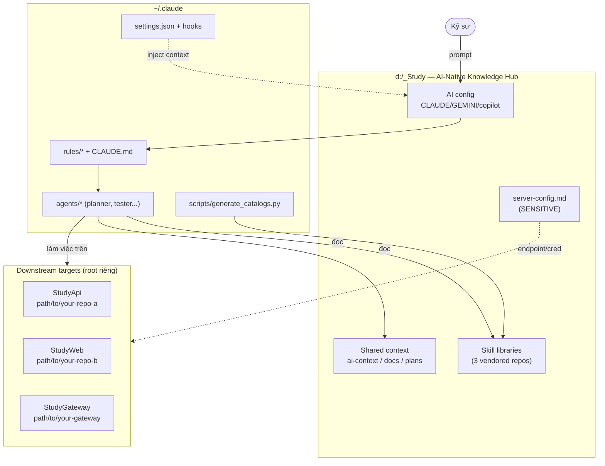
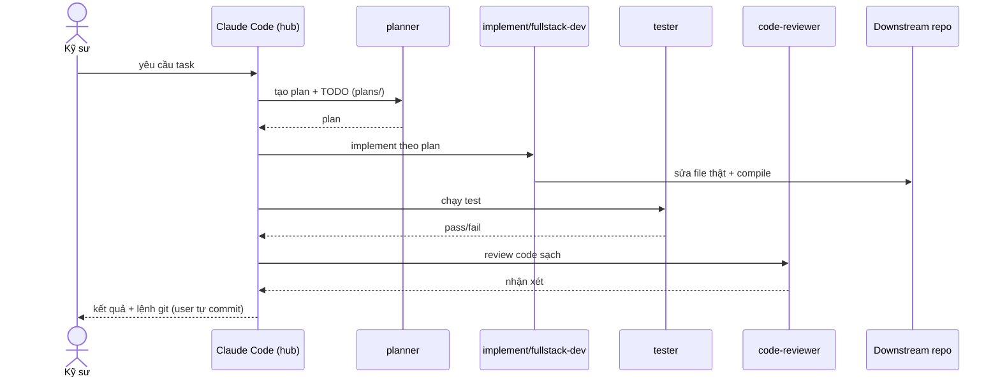

# Architecture — Knowledge Hub

> Cấu trúc tĩnh của `d:/_Study` và cách nó điều khiển AI làm việc trên downstream targets.
> Rút từ cấu trúc thư mục thực tế + cấu hình `~/.claude/`.

## Thành phần

| Lớp | Thành phần | Vai trò |
|-----|-----------|---------|
| Config & rules | `~/.claude/CLAUDE.md`, `~/.claude/rules/*`, `settings.json`, hooks | Luật điều phối agent, env, hành vi tự động |
| Local AI config | `CLAUDE.md`, `GEMINI.md`, `.github/copilot-instructions.md` | Auto-load cho từng AI tool tại hub |
| Skill libraries | vendored skill/plugin repos (tuỳ chọn, clone riêng) | Kho năng lực AI nạp động (vendored git repo) |
| Shared context | `ai-context/`, `docs/`, `plans/`, `server-config.md` | Memory, tài liệu, kế hoạch, cấu hình môi trường |
| Agents | `~/.claude/agents/*` (planner, researcher, tester, code-reviewer...) | Subagent chuyên trách trong workflow |

## Cách skill được nạp

```text
SKILL.md (frontmatter: name + description)
      │  generate_catalogs.py --skills
      ▼
skills catalog  ──►  Agent đọc description  ──►  kích hoạt skill khi liên quan
```

## Sơ đồ tổng thể



## Luồng điều phối 1 task (sequence)



## Nguyên tắc kiến trúc

- Hub **không sửa chéo** 3 repo vendored (upstream bên thứ ba) — chỉ tham chiếu/kích hoạt.
- Mỗi downstream target có git root + work-context riêng; subagent luôn nhận đúng path.
- Quyết định kiến trúc đã chốt → ghi ADR trong `docs/decisions/`.
