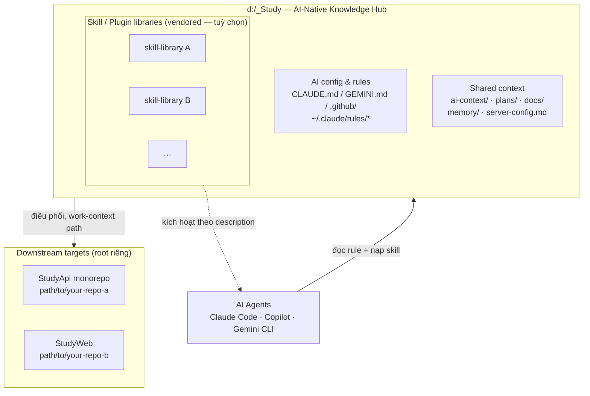

# Diagrams — Hub `d:/_Study`

Lưu **cả file gốc** (draw.io / mermaid) **lẫn ảnh export** để AI đọc được. Ưu tiên mermaid (`.md`/`.mmd`) — AI đọc trực tiếp text. Với draw.io: lưu `.drawio` + export `.png/.svg` cùng tên.

## Topology hub (rút từ `ai-context/project-context.md`)

## Gợi ý bổ sung

- Sequence diagram cho luồng nghiệp vụ thật → thuộc downstream (xem skill phù hợp với domain của bạn), không vẽ ở hub.
