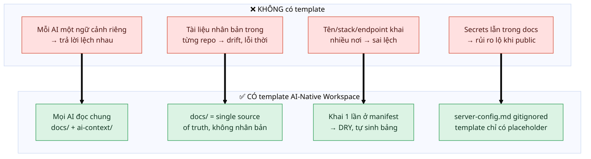
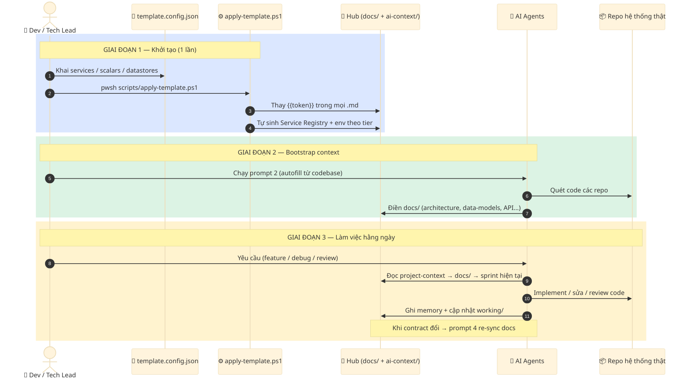
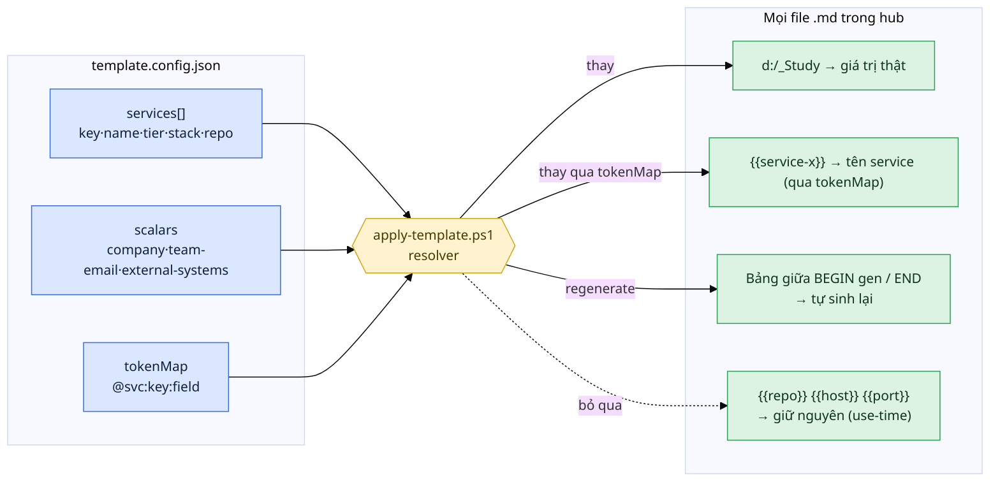
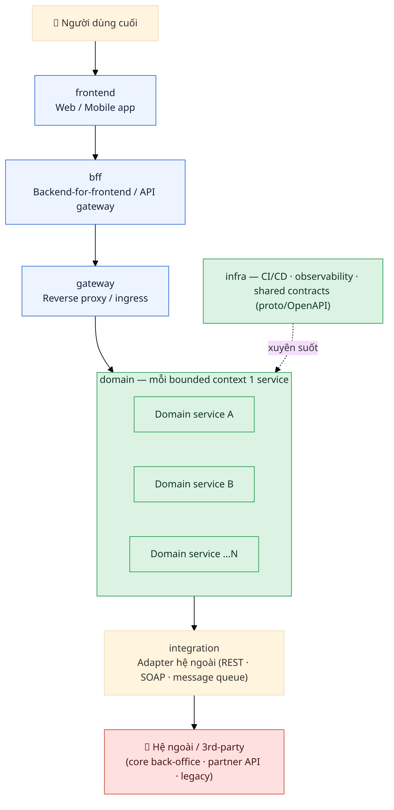
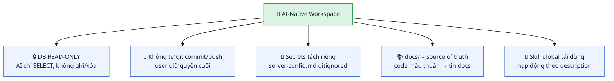

# AI-Native Workspace — Cách hoạt động

> Bộ sơ đồ giới thiệu template **AI-Native Workspace**: một "buồng lái" điều phối nhiều AI coding agent
> (Claude Code · Gemini CLI · GitHub Copilot · GPT Codex) làm việc trên cùng một hệ microservices,
> với **một nguồn tài liệu duy nhất** (`docs/` = single source of truth).

---

## 1. Bức tranh tổng thể (Big Picture)

Một câu: **khai báo 1 lần → mọi AI đọc chung một ngữ cảnh → cùng làm việc trên hệ thống thật, không lệch nhau.**

```mermaid
%%{init: {'theme':'base','themeVariables':{'fontFamily':'Segoe UI, Arial','fontSize':'15px','primaryColor':'#eef4ff','primaryBorderColor':'#3b6fd4','lineColor':'#7089a8','primaryTextColor':'#1f2d3d'}}}%%
flowchart LR
    subgraph SRC["🟦 1 · NGUỒN KHAI BÁO DUY NHẤT"]
        direction TB
        MANIFEST["template.config.json<br/><b>★ Single source of declaration</b><br/>services · scalars · datastores · messaging"]
        SCRIPT["apply-template.ps1<br/>thay token + sinh bảng"]
        MANIFEST --> SCRIPT
    end

    subgraph BRAIN["🟩 2 · BUỒNG LÁI AI (Knowledge Hub)"]
        direction TB
        CONFIG["AI config (mỗi tool 1 file)<br/>CLAUDE.md · GEMINI.md · AGENTS.md · copilot"]
        CTX["ai-context/<br/>project-context · working · memory · prompts"]
        DOCS["docs/  ⭐ SINGLE SOURCE OF TRUTH<br/>business · architecture · data-models<br/>api-contracts · security · deployment · ADR"]
        CONFIG -.đọc chung.-> DOCS
        CTX -.đọc chung.-> DOCS
    end

    subgraph AIS["🟨 3 · CÁC AI AGENT"]
        direction TB
        CC["🤖 Claude Code"]
        GM["🤖 Gemini CLI"]
        CP["🤖 GitHub Copilot"]
        CX["🤖 GPT Codex"]
    end

    subgraph TARGETS["🟥 4 · HỆ THỐNG THẬT (Downstream)"]
        direction TB
        R1["repo: frontend / BFF"]
        R2["repo: domain services"]
        R3["repo: integration / gateway"]
    end

    SCRIPT ==>|"điền {{token}}"| CONFIG
    SCRIPT ==>|"điền {{token}}"| CTX
    SCRIPT ==>|"sinh Service Registry"| DOCS

    CONFIG ==>|auto-load lúc khởi động| AIS
    DOCS   ==>|tra cứu chung| AIS
    CTX    ==>|memory + prompts| AIS

    AIS ==>|code · review · debug| TARGETS
    TARGETS -.học & ghi lại.-> CTX

    classDef src fill:#dbe7ff,stroke:#3b6fd4,stroke-width:2px,color:#13203a
    classDef brain fill:#dcf3e4,stroke:#2f9e57,stroke-width:2px,color:#0f3320
    classDef ais fill:#fff3cf,stroke:#d8a417,stroke-width:2px,color:#4a3a00
    classDef tgt fill:#ffe0e0,stroke:#d4503b,stroke-width:2px,color:#4a1410
    class MANIFEST,SCRIPT src
    class CONFIG,CTX,DOCS brain
    class CC,GM,CP,CX ais
    class R1,R2,R3 tgt
```

---

## 2. Vấn đề & Giải pháp (Why)

---

## 3. Luồng vận hành đầu-cuối (Setup → Daily work)

---

## 4. Mô hình token: khai 1 chỗ, dùng mọi nơi (DRY)

---

## 5. Phân tầng Service (Service Tiers) — map mọi hệ microservices

---

## 6. Vòng đời prompt vận hành đa-AI

```mermaid
%%{init: {'theme':'base','themeVariables':{'fontFamily':'Segoe UI, Arial','fontSize':'14px'}}}%%
flowchart LR
    P1["1 · init<br/>Dựng khung"] --> P2["2 · autofill<br/>Điền docs từ code"]
    P2 --> P3["3 · system-docs<br/>Tài liệu đa repo"]
    P3 --> P5["5 · remember<br/>Lưu cấu trúc vào memory"]
    P5 --> P6["6 · onboard<br/>Protocol đọc-context"]
    P6 --> DAILY{{"Làm việc hằng ngày<br/>feature · debug · review · refactor"}}
    DAILY --> P4["4 · sync-docs<br/>Re-sync khi drift"]
    P4 -.docs luôn tươi.-> DAILY

    classDef once fill:#dbe7ff,stroke:#3b6fd4,color:#13203a
    classDef loop fill:#fff3cf,stroke:#d8a417,color:#4a3a00
    class P1,P2,P3,P5,P6 once
    class DAILY,P4 loop
```

---

## 7. Guardrails an toàn (điểm nhấn khi pitch)

